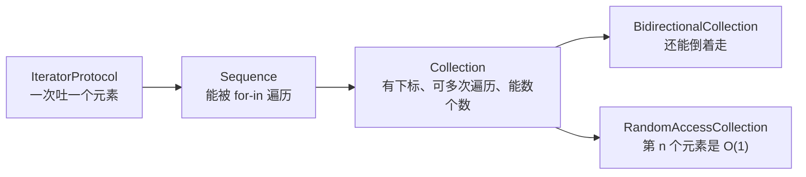

+++
title = "第48章 序列与集合协议族：为什么 for-in 什么都吃得下"
weight = 480
date = "2026-09-14T22:30:00+08:00"
type = "docs"
description = "Sequence、IteratorProtocol、Collection 与惰性求值：自己造一个能被 for-in、map、filter 直接使用的类型"
isCJKLanguage = true
draft = false
+++

# 第四十八章：序列与集合协议族：为什么 `for-in` 什么都吃得下

> 你从第 10 章就在用 `Array`、`Set`、`Dictionary`，第 11 章开始写 `for-in`，第 14 章之后又用了一堆 `map`、`filter`。但有一件事一直没说：**`for-in` 凭什么接受这些东西？** 答案是一族协议——`Sequence`、`IteratorProtocol`、`Collection`。这一章把这一族补齐，顺便让你自己的类型也能直接用上整套标准库算法。

## 48.1 三层协议，一次说清

三者的关系是一条链，越往下能力越强、要求也越多：



| 协议 | 你承诺提供什么 | 你免费得到什么 |
| --- | --- | --- |
| `IteratorProtocol` | `mutating func next() -> Element?` | 可用 `while let` 手动取 |
| `Sequence` | `makeIterator()` | `for-in`、`map`、`filter`、`reduce`、`contains`… |
| `Collection` | `startIndex`、`endIndex`、`subscript` | `count`、`first`、切片、`reversed()`、`indices` |
| `RandomAccessCollection` | 上面三条（下标是 O(1)） | 高效随机访问相关算法 |

先记住一句话：**`map`、`filter`、`reduce` 这些方法不是 `Array` 的专利，而是 `Sequence` 协议的扩展。** 谁遵循 `Sequence`，谁就白拿这一整套。

## 48.2 自己写一个迭代器

最底层的要求只有一个方法：`next()`。返回下一个元素，没有下一个时返回 `nil`。

```swift
import Foundation

/// 倒计时：3, 2, 1 之后结束
struct Countdown: Sequence, IteratorProtocol {
    var current: Int

    mutating func next() -> Int? {
        guard current > 0 else { return nil }
        defer { current -= 1 }
        return current
    }
}

for n in Countdown(current: 3) {
    print(n, terminator: " ")
}
print()
// prints: 3 2 1
```

注意两件事：

- **同时遵循两个协议很省事。** `Sequence` 只要求 `makeIterator()`，但如果类型自己就是迭代器，标准库会用它自己当迭代器，不用再写一个额外的类型。
- **`defer` 在这里很顺手**：先"预约"自减，再返回当前值。写成 `current -= 1; return current + 1` 也能对，但可读性差一些。

手动驱动迭代器是这样：

```swift
import Foundation

// 沿用上面的 Countdown
struct Countdown: Sequence, IteratorProtocol {
    var current: Int

    mutating func next() -> Int? {
        guard current > 0 else { return nil }
        defer { current -= 1 }
        return current
    }
}

var it = Countdown(current: 3).makeIterator()
while let value = it.next() {
    print(value, terminator: " ")
}
print()
// prints: 3 2 1
```

`for-in` 只是这套流程的语法糖：创建迭代器、反复调 `next()`、拿到 `nil` 就停。**没有别的魔法**——这个认知能解释后面很多问题（比如"为什么遍历时不能修改集合"）。

## 48.3 只遵循 `Sequence`：套用整套算法

大多数时候你不想写状态机，只想"按规则生成一串东西"。这时写 `makeIterator()` 就够了：

```swift
import Foundation

/// 把一句话重复若干遍
struct Repeater: Sequence {
    let word: String
    let times: Int

    func makeIterator() -> AnyIterator<String> {
        var remaining = times
        return AnyIterator {
            guard remaining > 0 else { return nil }
            remaining -= 1
            return word
        }
    }
}

print(Array(Repeater(word: "哈", times: 3)))
// prints: ["哈", "哈", "哈"]
print(Repeater(word: "喵", times: 3).contains("喵"))
// prints: true
print(Repeater(word: "喵", times: 3).map(\.count).reduce(0, +))
// prints: 3
```

`AnyIterator` 是"把闭包包装成迭代器"的现成工具，省掉一个只为了存 `remaining` 的小类型。**这里体现的正是协议的价值：`Repeater` 完全没实现 `contains`、`map`、`reduce`，却全都能用。**

## 48.4 遵循 `Collection`：把下标能力交出去

`Sequence` 有个限制：**只能遍历一次**（遍历完迭代器就空了），也不能数个数。要"能反复遍历 + 能下标访问"，升级到 `Collection`：

```swift
import Foundation

/// 一副牌：包装一个数组，暴露出集合能力
struct Deck<Element>: RandomAccessCollection {
    private var storage: [Element]

    init(_ storage: [Element]) { self.storage = storage }

    var startIndex: Int { storage.startIndex }
    var endIndex: Int { storage.endIndex }
    subscript(position: Int) -> Element { storage[position] }
}

let deck = Deck(["A", "2", "3", "4"])
print(deck.count, deck.first as Any, Array(deck.suffix(2)))
// prints: 4 Optional("A") ["3", "4"]
print(deck.reversed().map(\.self))
// prints: ["4", "3", "2", "A"]
```

只写了三个成员（两个索引 + 一个下标），就得到了 `count`、`first`、`suffix`、`reversed`、`indices`、切片……一整套。原因还是那句话：**它们都是协议扩展提供的默认实现。**

⚠️ 三个必须守住的约定，破坏了就会得到"看起来能用、偶尔崩溃"的代码：

| 约定 | 含义 |
| --- | --- |
| 索引必须能比较 | 用 `Int` 当索引最省事；自定义索引类型要满足 `Comparable` |
| `endIndex` 不能取下标 | 它表示"末尾之后"，`storage[endIndex]` 越界 |
| 下标必须 O(1) 才叫 `RandomAccessCollection` | 链表式结构请降到 `Collection` 或 `BidirectionalCollection` |

## 48.5 惰性求值：把"算完再筛"变成"边算边筛"

`Sequence` 延伸出来的另一个概念是**惰性视图**。默认的 `map`/`filter` 会立刻算出整个新数组：

```swift
import Foundation

var eagerCount = 0
let eager = [1, 2, 3, 4, 5].map { value -> Int in
    eagerCount += 1
    return value * 10
}
print(eagerCount, eager.first as Any)
// prints: 5 Optional(10)
```

五个元素全算了，哪怕你只想要第一个。加一个 `.lazy` 就完全不同：

```swift
import Foundation

var lazyCount = 0
let lazyMap = [1, 2, 3, 4, 5].lazy.map { value -> Int in
    lazyCount += 1
    return value * 10
}

print(lazyCount, lazyMap.first as Any)
// prints: 0 Optional(10)
print(Array(lazyMap))
// prints: [10, 20, 30, 40, 50]
```

第一次读 `first` 时，闭包一次都没执行（`lazyCount` 还是 0）。这就是**"约定好怎么算，等真的要的时候再算"**。

什么时候该用 `.lazy`：

| 场景 | 建议 |
| --- | --- |
| 长链式操作（`map` + `filter` + `prefix`）后只取一部分 | 值得用，能省掉大量中间数组 |
| 无限序列（`sequence(first:next:)`） | 必须用，否则永远算不完 |
| 元素很少、或最终要转成 `Array` | 意义不大，反而增加一层包装 |

## 48.6 无限序列与 `AnySequence`

`sequence(first:next:)` 能从一颗种子开始，按你给的规则一直生成下去——**它天生是无限（或很长）的**，所以一定要配 `prefix` 这类"截断"操作：

```swift
import Foundation

// 1, 2, 4, 8, 16 …
let powers = sequence(first: 1, next: { $0 * 2 })
print(Array(powers.prefix(5)))
// prints: [1, 2, 4, 8, 16]
```

还有一种常见需求是"隐藏具体类型"。泛型容器换一种实现就要改一堆签名时，用 `AnySequence` 擦除：

```swift
import Foundation

func makeCounter(upTo limit: Int) -> AnySequence<Int> {
    limit < 10
        ? AnySequence(Array(1...limit))
        : AnySequence((1...limit).lazy)
}

print(Array(makeCounter(upTo: 4)))
// prints: [1, 2, 3, 4]
```

⚠️ 类型擦除不是免费的：`AnySequence` 内部有一次动态派发，也没法再表达"我其实是随机访问集合"。**能用泛型表达就用泛型，确实要"藏起来"再用它。**

## 48.7 一图收尾：该遵循哪个协议

| 你的类型…… | 遵循 |
| --- | --- |
| 只能顺序吐出元素，用完就没了 | `Sequence`+`IteratorProtocol` |
| 有下标、能反复遍历、能数个数 | `Collection` |
| 还能倒着走（如双向链表） | `BidirectionalCollection` |
| 下标访问是 O(1)（如数组包装） | `RandomAccessCollection` |
| 元素是异步产生的 | `AsyncSequence`（第 31 章） |

## 48.8 本章小结

| 概念 | 一句话 |
| --- | --- |
| `IteratorProtocol` | 只要求 `next()`；`for-in` 的底层动力 |
| `Sequence` | 提供 `makeIterator()`，白拿整套算法方法 |
| `Collection` | 加索引与下标，可反复遍历 |
| `RandomAccessCollection` | 下标 O(1)，数组式结构用它 |
| `.lazy` | 把立刻计算改成按需计算 |
| `AnySequence` | 类型擦除，用于隐藏具体序列类型 |

## 48.9 本章易错点速查

| 容易踩的地方 | 正确认识 |
| --- | --- |
| 以为 `map`/`filter` 是数组专属 | 它们来自 `Sequence` 扩展，自定义序列一样能用 |
| 在一个 `Sequence` 上遍历两次 | 可能第二次是空的；要反复遍历请遵循 `Collection` |
| 实现 `Collection` 时让 `endIndex` 可下标 | 它是"末尾之后"，取值会越界 |
| 给链表式结构标 `RandomAccessCollection` | 下标不是 O(1) 就别标，否则算法假设被打破 |
| 无限序列没有 `prefix` 就转 `Array` | 永远算不完，程序卡死 |
| 忘了 `.lazy` 就直接对超大序列链式操作 | 会产生大量中间数组 |
| 到处用 `AnySequence` 图省事 | 擦除换来一次动态派发，能泛型就泛型 |

## 48.10 下章预告

集合家族补齐了，标准库里还有另一族天天在用却从没被正面讲过的协议：`Numeric`、`BinaryInteger`、`FixedWidthInteger`、`FloatingPoint`。下一章讲它们各自保证什么，以及怎样把"数字"和"格式化输出"这件麻烦事一次做对。
