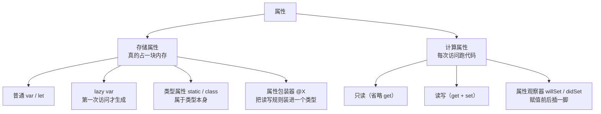

+++
title = "第50章 属性与下标全形态：一个概念家族的收口"
weight = 500
date = "2026-09-14T22:30:00+08:00"
type = "docs"
description = "把散落在第19章、第15B章、第21章的属性与下标收进一张图：存储、计算、观察器、lazy、类型属性、包装器、静态下标与动态成员"
isCJKLanguage = true
draft = false
+++

# 第五十章：属性与下标全形态：一个概念家族的收口

> "计算属性"只是这个家族里的一个成员。它的亲戚散落在好几章里：观察器在第 19.2 节、`lazy` 在第 19.3 节、类型属性在第 19.4 节、属性包装器在第 19.7 与第 15B.6 节、扩展里的计算属性在第 21 章……这一章把它们摆到一起，让你第一次看清整个家族的样子。

## 50.1 属性家族全景

先看全貌，再逐个补细节：



| 形态 | 关键点 | 详细章节 |
| --- | --- | --- |
| 存储属性 | 真的占内存；`let` 只能初始化一次 | 19.1 |
| 计算属性 | 不占内存；每次访问执行代码 | 19.1 |
| 只读计算属性 | 省掉 `get` 只留表达式 | 19.1 |
| 属性观察器 | `willSet` / `didSet`；初始化与 `lazy` 首次取值不触发 | 19.2 |
| `lazy` | 只能修饰 `var`；首次访问才计算，之后缓存 | 19.3 |
| 类型属性 | `static` 属于类型；类里 `class var` 可被重写 | 19.4 |
| 属性包装器 | 一个标注换来 `_x` / `x` / `$x` 三个成员 | 19.7、15B.6 |
| 扩展里的计算属性 | 能给已有类型加"算出来的属性"，不能加存储属性 | 21 |

这张表本身就是这一章存在的理由：**概念没变，只是它们原来被分散在"第一次用到它的那个场景"里。**

## 50.2 三条容易混的边界

### 边界一：扩展里只能加计算属性

```swift
import Foundation

struct Money {
    var cents: Int
}

extension Money {
    var yuan: Double { Double(cents) / 100 }        // ✅ 计算属性
    // var rate: Double = 0.06                      // ❌ 报错：extensions must not contain stored properties
}

print(Money(cents: 1999).yuan)
// prints: 19.99
```

原因很实在：存储属性会改变类型的**内存布局**，而扩展可能写在别的模块里，编译器没法回头改布局。想要"给已有类型加一个字段"，只能靠属性包装器或关联对象之类的手段。

### 边界二：`lazy` 不能用于 `let`，也不能用于全局

```text
error: 'lazy' cannot be used on a let
error: 'lazy' cannot be used on an already-lazy global
```

`lazy let` 在语义上自相矛盾（"只初始化一次"和"必要时才初始化"没法同时保证），而全局变量本来就是惰性初始化的，不需要再标。

### 边界三：可变的类型属性在 Swift 6 里要隔离

```swift
import Foundation

@MainActor
final class SessionCache {
    static var shared: [String: String] = [:]     // 加了 @MainActor 才能这么写
}
```

不加隔离直接写 `static var`，Swift 6 会报"非隔离的全局共享可变状态"。这和第 30–32 章的并发规则是同一件事，只是现在它出现在属性声明上。

## 50.3 属性包装器：一个标注，三个成员

它是这个家族里最"不像 Swift"的成员，值得再温习一次：

```swift
import Foundation

@propertyWrapper
struct Clamped {
    private var value: Int
    let range: ClosedRange<Int>

    init(wrappedValue: Int, _ range: ClosedRange<Int>) {
        self.range = range
        self.value = min(max(wrappedValue, range.lowerBound), range.upperBound)
    }

    var wrappedValue: Int {
        get { value }
        set { value = min(max(newValue, range.lowerBound), range.upperBound) }
    }

    var projectedValue: String { "允许范围 \(range)" }
}

struct Player {
    @Clamped(0...100) var health = 80
}

var player = Player()
player.health = 150
print(player.health, player.$health)
// prints: 100 允许范围 0...100
```

`@Clamped(0...100) var health = 80` 展开后是三个东西：

| 成员 | 是什么 | 谁在用 |
| --- | --- | --- |
| `_health` | 真正的存储，类型是 `Clamped` | 逐成员初始化器、同一类型内部 |
| `health` | 转发到 `wrappedValue` 的计算属性 | 日常读写 |
| `$health` | 转发到 `projectedValue` | 需要"额外信息"或绑定通道时 |

⚠️ 一个真实踩坑：如果包装器里的 `wrappedValue` 是**存储属性**（像上面这样在第一版可能写成 `var wrappedValue: Int`），那么 `_health.wrappedValue = 150` 这种写法会绕开 setter 的限制。第 15B.6 节完整记录了这个坑以及规避方式——**把真正的值设成 `private var value`，再让 `wrappedValue` 变成计算属性。**

## 50.4 下标家族全景

下标（`subscript`）是"用方括号访问"的能力，它自己也有好几种形态：

| 形态 | 写法 | 用处 |
| --- | --- | --- |
| 单参数读写 | `subscript(i: Int) -> T` | 自定义容器 |
| 多参数 | `subscript(row: Int, column: Int) -> T` | 矩阵、表格、像素 |
| 带默认参数 | `subscript(row: Int, column: Int = 0)` | 二维退化成一维 |
| 只读 | 省略 `set` | 安全的只读视图 |
| 静态 | `static subscript(index: Int) -> T` | 挂在类型上，像 `Suit[2]` |
| 泛型 | `subscript<K: Hashable>(key: K) -> T?` | 通用查表 |
| 协议要求 | 协议里声明 `subscript(...) { get set }` | 抽象"可下标访问"的能力 |
| 动态成员 | `subscript(dynamicMember key: String)` | 点语法接住任意名字 |

逐个看关键几个：

```swift
import Foundation

// 静态下标：类型本身就能被下标访问
enum Suit: String, CaseIterable {
    case spade, heart, diamond, club

    static subscript(index: Int) -> Suit? {
        let all = Suit.allCases
        guard all.indices.contains(index) else { return nil }
        return all[index]
    }
}

print(Suit[2]?.rawValue as Any, Suit[9] as Any)
// prints: Optional("diamond") nil
```

```swift
import Foundation

// 多参数 + 默认参数：既能 grid[3, 4] 也能 grid[5]
struct Grid {
    private var cells = Array(repeating: 0, count: 100)

    subscript(row: Int, column: Int = 0) -> Int {
        get { cells[row * 10 + column] }
        set { cells[row * 10 + column] = newValue }
    }
}

var grid = Grid()
grid[3, 4] = 7
grid[5] = 9
print(grid[3, 4], grid[5], grid[5, 0])
// prints: 7 9 9
```

```swift
import Foundation

// 用参数标签给"同一个下标"加语义：bag[0] 会崩，bag[safe: 0] 不会
struct Bag<Element> {
    private var items: [Element] = []

    mutating func append(_ item: Element) { items.append(item) }

    subscript(safe index: Int) -> Element? {
        items.indices.contains(index) ? items[index] : nil
    }
}

var bag = Bag<Int>()
bag.append(1)
print(bag[safe: 0] as Any, bag[safe: 5] as Any)
// prints: Optional(1) nil
```

**"用参数标签区分两种下标"是个很实用的技巧**：`bag[0]` 保持"越界就崩"的高效语义，`bag[safe: 0]` 提供安全版本，调用处一眼能看出用的是哪种。

协议也能要求下标：

```swift
import Foundation

protocol TwoDimensional {
    associatedtype Element
    subscript(row: Int, column: Int) -> Element { get set }
}
```

最后是动态成员查找，它把"下标"从方括号搬到了点语法上：

```swift
import Foundation

@dynamicMemberLookup
struct JSON {
    private var storage: [String: JSON] = [:]
    var stringValue: String?

    init(stringValue: String? = nil) { self.stringValue = stringValue }

    subscript(dynamicMember key: String) -> JSON {
        get { storage[key] ?? JSON() }
        set { storage[key] = newValue }
    }
}

var doc = JSON()
doc.user.name = JSON(stringValue: "Mia")
print(doc.user.name.stringValue as Any, doc.missing.stringValue as Any)
// prints: Optional("Mia") nil
```

`doc.user.name` 之所以能编译，是因为编译器看到 `@dynamicMemberLookup` 后，把点语法翻译成了 `subscript(dynamicMember:)` 调用。它的代价是**丢失编译期拼写检查**：写错 `doc.usr.name` 不会报错，只会得到一个空对象（上例里 `doc.missing` 就是这种情况）。

## 50.5 该选哪一种：一张决策表

| 你想要 | 用 |
| --- | --- |
| 保存一份数据 | 存储属性 |
| 由别的数据算出来 | 计算属性 |
| 数据变了要做点事（记录、刷新缓存） | `didSet` |
| 昂贵且不一定用到 | `lazy` |
| 与实例无关的共享值 | `static let`（可变则加隔离） |
| 多个属性共用一套读写规则 | 属性包装器 |
| 给已有类型补"算出来的属性" | 扩展里的计算属性 |
| 用方括号访问自己的容器 | `subscript` |
| 想提供安全与非安全两种访问 | 两个下标，用参数标签区分 |
| 想让点语法接住动态字段 | `@dynamicMemberLookup` |

## 50.6 本章小结

| 概念 | 一句话 |
| --- | --- |
| 属性家族 | 存储 / 计算 / 观察器 / `lazy` / 类型 / 包装器 六种形态 |
| 扩展的限制 | 只能加计算属性，不能加存储属性 |
| `lazy` 限制 | 只能用于实例 `var`，全局本就惰性 |
| `static var` | Swift 6 下需要隔离；优先 `static let` |
| 下标家族 | 多参数、默认参数、只读、静态、泛型、协议要求、动态成员 |
| 参数标签 | 可用来区分"安全版/不安全版"下标 |
| `@dynamicMemberLookup` | 点语法映射到下标，代价是没有拼写检查 |

## 50.7 本章易错点速查

| 容易踩的地方 | 正确认识 |
| --- | --- |
| 想在扩展里加存储属性 | 不允许；改用计算属性或包装器 |
| 写 `lazy let` | 语义矛盾，编译不过 |
| 在初始化器里等 `didSet` | 首次赋值不触发；`lazy` 首次取值同样不触发 |
| 用 `static var` 存全局可变状态 | Swift 6 会报并发安全错误 |
| 下标越界却没有安全版本 | 用 `subscript(safe:)` 之类的重载区分 |
| 以为动态成员查找很安全 | 拼错名字只在运行时表现为"空值" |
| 包装器里把 `wrappedValue` 写成存储属性 | 可能绕过 setter；用 `private var value` + 计算属性 |

## 50.8 下章预告

属性与下标收口了。下一章转向"工具箱"：`zip`、`stride`、`sequence(first:next:)`、`reduce(into:)` 这些标准库函数，平时散落在各处，其实是一套可以按需取用的算法集合。
