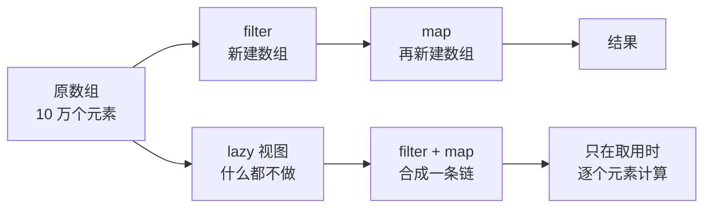

+++
title = "第51章 标准库算法工具箱：zip、stride 与 reduce(into:)"
weight = 510
date = "2026-09-14T22:30:00+08:00"
type = "docs"
description = "把散落在各章的标准库函数收成一箱工具：配对、递推、归约成结构、查找判定、切分分块，以及 lazy 惰性管道"
isCJKLanguage = true
draft = false
+++

# 第五十一章：标准库算法工具箱：zip、stride 与 reduce(into:)

> 前面五十章里，`map`、`filter`、`sorted` 出镜率最高，于是很容易留下一个错觉：Swift 的集合操作就这三个。其实标准库里躺着一整箱工具，`zip`、`stride`、`sequence`、`reduce(into:)`、`Dictionary(grouping:by:)`……它们平时只是没遇到合适的场景，所以你没注意到。

这一章不讲新语法，只讲**怎么少写循环、少写临时数组**。每一件工具都配了"什么时候该想起它"。

## 51.1 先看工具箱的全貌

| 你想做的事 | 工具 | 一句话 |
| --- | --- | --- |
| 把两个序列配对 | `zip` | 拉链式拼成元组，以短的为准 |
| 生成等差数列 | `stride(from:to:by:)` | 半开区间；`through:` 是闭区间 |
| 按规则递推下去 | `sequence(first:next:)` | 给种子和"下一步"，自动收尾 |
| 生成有状态的序列 | `sequence(state:next:)` | 需要随身带一个可变状态时用 |
| 重复同一个值 | `repeatElement(_:count:)` | 造分隔线、占位符 |
| 一边遍历一边拿序号 | `enumerated()` | 省掉手写计数器 |
| 把序列压成一个结果 | `reduce(into:_:)` | 累积到字典/数组，性能更好 |
| 按条件分组 | `Dictionary(grouping:by:)` | 一次分组，不用手写循环 |
| 找第一个满足条件的元素 | `first(where:)`、`firstIndex(where:)` | 返回元素或下标 |
| 判断全体/存在 | `allSatisfy`、`contains(where:)` | 提前短路，不会白跑 |
| 数有几个满足条件 | `count(where:)` | Swift 6 起自带 |
| 切片段 | `prefix`、`suffix`、`dropFirst` | 返回 `ArraySlice`，不是新数组 |
| 按分隔符切开 | `split(separator:)` | 默认丢掉空片段 |
| 分块 | `stride` + 切片 | 标准库没有现成的 `chunked` |

读完这一章，你应该能在写 `for` 循环之前先停一秒：这件事标准库是不是已经有名字了？

## 51.2 配对：zip

最典型的需求：两个等长数组要一一对应地处理。手写写法是一个索引循环，`zip` 把它压成一行：

```swift
import Foundation

let names = ["咖啡", "拿铁", "摩卡"]
let prices = [18, 25, 30]

for (name, price) in zip(names, prices) {
    print("\(name) ¥\(price)")
}
// prints: 咖啡 ¥18
// prints: 拿铁 ¥25
// prints: 摩卡 ¥30

print(zip(names, prices).map { "\($0)=\($1)" }.joined(separator: ", "))
// prints: 咖啡=18, 拿铁=25, 摩卡=30
```

⚠️ `zip` 的第一个陷阱：**长度不同时以短的为准，多出来的部分被静默丢掉**，不会报错也不会补 `nil`。

```swift
import Foundation

print(Array(zip([1, 2, 3], ["a", "b"])))
// prints: [(1, "a"), (2, "b")]
```

上例里的 `3` 悄悄消失了。如果"长度不等"是数据错误，你得自己检查：

```swift
import Foundation

func checkSameLength(_ a: [Int], _ b: [String]) -> String {
    a.count == b.count ? "长度一致，可以 zip" : "长度不一致：\(a.count) vs \(b.count)"
}

print(checkSameLength([1, 2, 3], ["x", "y"]))
// prints: 长度不一致：3 vs 2
print(checkSameLength([1, 2], ["x", "y"]))
// prints: 长度一致，可以 zip
```

如果长度不一致是**真的错误**（不是"取公共部分"），就别静默地 `zip` 下去，让程序早一点报错，比在结果里少几行数据好查得多。

`zip` 也可以和字符串配合（`String` 本身是字符序列）：

```swift
import Foundation

print(zip([1, 2, 3], "abc").map { "\($0)-\($1)" })
// prints: ["1-a", "2-b", "3-c"]
```

`zip` 返回的是一个**惰性序列**，而且正好是上一篇讲的"一次性序列"——它没有 `count` 属性，需要先转成数组：

```swift
import Foundation

let pairs = zip([1, 2, 3], ["a", "b", "c"])
print(Array(pairs).count)
// prints: 3
```

## 51.3 生成序列：stride、sequence、enumerated

### stride：等差数列

要写一个 `for i in 0..<10` 但步长是 3 的循环，用 `stride` 比手写 `while` 清楚得多：

```swift
import Foundation

print(Array(stride(from: 0, to: 10, by: 3)))
// prints: [0, 3, 6, 9]

print(Array(stride(from: 1.0, through: 2.0, by: 0.5)))
// prints: [1.0, 1.5, 2.0]
```

`to:` 是**不含**终点，`through:` 是**含**终点——和范围运算符 `..<` / `...` 是一个道理。步长为负也能用，就是倒着数：

```swift
import Foundation

print(Array(stride(from: 5, through: 1, by: -2)))
// prints: [5, 3, 1]
```

⚠️ 浮点数的 `stride` 会有精度累积误差，`stride(from: 0.0, through: 1.0, by: 0.1)` 不保证恰好给你 11 个元素。需要精确的小数步进时，用整数步进再除以分母：

```swift
import Foundation

print((0...10).map { Double($0) / 10 })
// prints: [0.0, 0.1, 0.2, 0.3, 0.4, 0.5, 0.6, 0.7, 0.8, 0.9, 1.0]
```

### sequence(first:next:)：从种子递推

这个函数的形状是"给我起点和一个函数，函数返回 `nil` 就停"。它天生适合"条件满足就继续"的场景：

```swift
import Foundation

// 3 的幂，直到不超过 100
print(Array(sequence(first: 1, next: { $0 * 3 <= 100 ? $0 * 3 : nil })))
// prints: [1, 3, 9, 27, 81]

// 走到某个条件为止：每次折半，减到 1 停
print(Array(sequence(first: 64, next: { $0 > 1 ? $0 / 2 : nil })))
// prints: [64, 32, 16, 8, 4, 2, 1]
```

它返回的序列**可以无限长**，所以必须先截断再看——`prefix` 就是你的刹车：

```swift
import Foundation

let doublings = sequence(first: 1, next: { $0 * 2 })
print(doublings.prefix(5).map(String.init).joined(separator: ", "))
// prints: 1, 2, 4, 8, 16
```

⚠️ `next` 返回 `nil` 的位置决定最后一个元素是谁。上面 `{ $0 * 3 <= 100 ? ... : nil }` 的判断作用在**当前元素**上：当前是 81 时算出 243，但 `243 <= 100` 为假，所以返回 `nil`，序列停在 81。第一次用很容易把条件写反，多打一次 `Array(...)` 看看就行。

### sequence(state:next:)：需要随身状态

有些递推不是"只看上一个值"就够的，比如斐波那契要记住两个数。这时用带 `inout state` 的版本：

```swift
import Foundation

let fibonacci = sequence(state: (0, 1)) { (pair: inout (Int, Int)) -> Int? in
    let next = pair.0 + pair.1
    pair = (pair.1, next)
    return pair.0
}

print(fibonacci.prefix(8).map(String.init).joined(separator: " "))
// prints: 1 1 2 3 5 8 13 21
```

`state` 在闭包里以 `inout` 出现，所以**每次迭代都能改写它**。这就是它与 `sequence(first:next:)` 的主要区别：状态可以比元素复杂得多（上例的状态是元组，元素却是 `Int`），而且第一个元素也由 `next` 自己决定——所以上面是从 `1` 开始，而不是从种子 `0` 开始。

### repeatElement：重复同一个值

```swift
import Foundation

print(Array(repeatElement("=", count: 5)).joined())
// prints: =====

print(Array(repeatElement(0, count: 3)))
// prints: [0, 0, 0]
```

造分隔线、初始化占位数据时比 `Array(repeating:count:)` 更像"序列"的写法。二者结果数组相同，区别是 `repeatElement` 返回的是一个**集合视图**，不急着分配数组。

### enumerated：遍历时带序号

```swift
import Foundation

for (index, name) in ["甲", "乙", "丙"].enumerated() {
    print(index, name)
}
// prints: 0 甲
// prints: 1 乙
// prints: 2 丙
```

比手写 `var i = 0` 干净，也不会忘记自增。序号从 `0` 开始；想要从 `1` 开始，用 `.enumerated().map { ($0.offset + 1, $0.element) }` 自己改。

## 51.4 归约成结构：reduce(into:)

`reduce` 你已经见过。`reduce(into:_:)` 是它的"可变版本"，差别在闭包的累积变量是 `inout`，可以直接改，不用返回：

```swift
import Foundation

// 计数：最经典的用法
let words = ["苹果", "香蕉", "苹果", "橘子", "香蕉", "苹果"]
let tally = words.reduce(into: [String: Int]()) { result, word in
    result[word, default: 0] += 1
}
print(tally.sorted { $0.key < $1.key }.map { "\($0.key):\($0.value)" }.joined(separator: " "))
// prints: 橘子:1 苹果:3 香蕉:2
```

为什么不用 `reduce([String: Int]())`？因为那个版本的累积值是"每次返回一个新值"，而字典、数组都是写时复制类型，每次返回新值都可能触发一次拷贝。`reduce(into:)` 直接改同一块缓冲区，元素多了差距很明显。

它也能把一次遍历拆成两个结果：

```swift
import Foundation

let numbers = [1, 2, 3, 4, 5, 6]

let (evens, odds) = numbers.reduce(into: ([Int](), [Int]())) { acc, n in
    n.isMultiple(of: 2) ? acc.0.append(n) : acc.1.append(n)
}
print(evens, odds)
// prints: [2, 4, 6] [1, 3, 5]
```

### Dictionary(grouping:by:)：一次分组

"按某个条件把元素归类"是另一种高频需求，标准库给了现成的：

```swift
import Foundation

let grades = ["A": 92, "B": 78, "C": 85]
let grouped = Dictionary(grouping: grades, by: { $0.value >= 90 ? "优秀" : "良好" })
    .mapValues { $0.map(\.key).sorted() }

print(grouped.sorted { $0.key < $1.key }.map { "\($0.key):\($0.value)" })
// prints: ["优秀:[\"A\"]", "良好:[\"B\", \"C\"]"]
```

注意 `by:` 返回的是**分组的键**（这里是字符串），值是"属于这一组的元素数组"，所以后面常常接一个 `mapValues` 把元素整理成你要的样子。

## 51.5 查找与判定：别用 filter 兜圈子

这是最常见的低效写法：`if !arr.filter({ $0 > 100 }).isEmpty`。它一次性跑完整条数组、还分配了一个临时数组，只为了回答一个是非题。

| 需求 | 用它 | 说明 |
| --- | --- | --- |
| 第一个满足条件的元素 | `first(where:)` | 找不到返回 `nil`，命中即停 |
| 最后一个满足条件的元素 | `last(where:)` | 从尾部开始找 |
| 第一个满足条件的下标 | `firstIndex(where:)` | 可以和集合下标配合 |
| 是否全都满足 | `allSatisfy(_:)` | 遇到第一个"否"就停 |
| 是否存在满足的 | `contains(where:)` | 遇到第一个"是"就停 |
| 有几个满足的 | `count(where:)` | Swift 6 起可用 |

```swift
import Foundation

let numbers = [1, 2, 3, 4, 5, 6]

print(numbers.first(where: { $0 > 4 }) as Any, numbers.last(where: { $0 > 4 }) as Any)
// prints: Optional(5) Optional(6)
print(numbers.firstIndex(where: { $0 % 4 == 0 }) as Any)
// prints: Optional(3)
print(numbers.allSatisfy { $0 > 0 }, numbers.contains { $0 == 4 })
// prints: true true
print(numbers.count(where: { $0.isMultiple(of: 3) }))
// prints: 2
```

⚠️ 两个容易忽略的点：

- `firstIndex(where:)` 返回的是**集合的下标**，不一定是从 0 开始的整数。上例是数组所以恰好是 `3`；换成 `ArraySlice` 或字符串视图就未必。
- `count(where:)` 是 Swift 6.0 才加入标准库的（提案 SE-0220）。如果你的项目还要兼容更早的工具链，退回 `filter { ... }.count`。

## 51.6 切分与分块

切掉头尾、拿一段，标准库的写法比手写循环精确，而且**不复制数据**——它们返回的是原集合的视图（`ArraySlice` / `Substring`）：

```swift
import Foundation

let numbers = [1, 2, 3, 4, 5, 6]

print(Array(numbers.prefix(2)), Array(numbers.suffix(2)), Array(numbers.dropFirst(4)))
// prints: [1, 2] [5, 6] [5, 6]
```

⚠️ `prefix` 返回 `ArraySlice`，它的下标**继承原数组的下标**。所以下面这段会崩，因为切片里根本没有下标 `0`：

```text
let slice = numbers.dropFirst(4)   // [5, 6]，下标是 4...5
print(slice[0])                    // 运行时错误：Index out of bounds
```

想要一份独立、下标从 0 开始的数据，套一层 `Array(...)`：

```swift
import Foundation

let numbers = [1, 2, 3, 4, 5, 6]
let slice = Array(numbers.dropFirst(4))
print(slice[0], slice.startIndex, slice.endIndex)
// prints: 5 0 2
```

按分隔符切开字符串或字符串视图，用 `split`：

```swift
import Foundation

let csv = "a,b,,c"
print(csv.split(separator: ",").map(String.init))
// prints: ["a", "b", "c"]
print(csv.split(separator: ",", omittingEmptySubsequences: false).map(String.init))
// prints: ["a", "b", "", "c"]
```

默认会**丢掉空片段**——这在解析 CSV 时是好事也是坑，取决于你的数据里空字段有没有意义。

### 分块：标准库没有现成的 chunked

这个需求太常见了（分页、批量上传），但标准库至今没给。惯用做法是 `stride` 加切片：

```swift
import Foundation

let numbers = Array(1...7)

let chunks = stride(from: 0, to: numbers.count, by: 3).map {
    Array(numbers[$0..<min($0 + 3, numbers.count)])
}
print(chunks)
// prints: [[1, 2, 3], [4, 5, 6], [7]]
```

`min($0 + 3, numbers.count)` 是必须的：最后一块长度不够 3，直接写 `$0..<$0 + 3` 会越界崩掉。

## 51.7 惰性管道：lazy 视图

连续写 `filter`、`map`，每一步都会生成一个新数组。数据小的时候无所谓，数据大或链条长的时候，中间数组就是白烧的内存。



```swift
import Foundation

var computeCount = 0

// 急切版本：一写出来就跑
let eager = [1, 2, 3]
_ = eager.map { n -> Int in
    computeCount += 1
    return n * 2
}
print(computeCount)
// prints: 3

// 惰性版本：不取用就不算
computeCount = 0
let lazyDoubled = [1, 2, 3].lazy.map { n -> Int in
    computeCount += 1
    return n * 2
}
print(computeCount)
// prints: 0
print(Array(lazyDoubled))
// prints: [2, 4, 6]
print(computeCount)
// prints: 3
```

配合 `first` 用，收益最直观——只要找到第一个就够了，后面的元素根本不会被映射：

```swift
import Foundation

print([1, 2, 3].lazy.map { $0 * 2 }.first as Any)
// prints: Optional(2)
print(Array([1, 2, 3, 4].lazy.filter { $0 % 2 == 0 }))
// prints: [2, 4]
```

⚠️ 三点提醒：

- `lazy` 的结果**不会缓存**。同一份惰性视图遍历两次，闭包就跑两次。要么末尾转成数组，要么别重用。
- 链尾是 `first`、`isEmpty`、`contains` 这类**能提前结束**的操作时收益最大；换成 `count` 或 `sorted`，它终究得把所有元素看一遍，省下的只是中间数组。
- 可读性优先。三五个元素的小数组，写 `lazy` 只是让人多想一秒。

## 51.8 一张决策表

| 场景 | 别这么写 | 该这么写 |
| --- | --- | --- |
| 两个数组对应处理 | `for i in 0..<a.count` | `zip(a, b)` |
| 步长不是 1 的循环 | 手写 `while` 加自增 | `stride` |
| 条件递推 | 手写递归或 `while` | `sequence(first:next:)` |
| 遍历时要序号 | 手写计数器 | `enumerated()` |
| 统计词频、按组归类 | 手写字典循环 | `reduce(into:)` |
| 按条件分成两类以上 | `for` 加多重 `if` | `Dictionary(grouping:by:)` |
| 问"有没有满足的" | `filter{...}.isEmpty` | `contains(where:)` |
| 问"是不是全都满足" | `filter{...}.count == n` | `allSatisfy(_:)` |
| 数满足条件的有几个 | 手写计数器 | `count(where:)`（Swift 6+） |
| 拿前几项、后几项 | 手写切片循环 | `prefix` / `suffix` / `dropFirst` |
| 按分隔符拆字符串 | 手动找分隔符下标 | `split(separator:)` |
| 分页、分块 | 手写双层循环 | `stride` + `map` |
| 长链式集合操作 | 连着 `filter` + `map` | `.lazy` 再收尾 |

## 51.9 本章小结

| 工具 | 一句话 |
| --- | --- |
| `zip` | 配对，以短的为准，多余的静默丢弃 |
| `stride` | 等差数列；`to:` 不含终点，`through:` 含 |
| `sequence(first:next:)` | 从种子递推，`nil` 停 |
| `sequence(state:next:)` | 递推要带可变状态时用 |
| `repeatElement` | 重复一个值，造分隔线 |
| `enumerated` | 遍历带序号 |
| `reduce(into:)` | 累积到字典/数组，避免写时复制开销 |
| `Dictionary(grouping:by:)` | 一次分组，值是该组元素数组 |
| `first(where:)` / `allSatisfy` | 短路查找与判定 |
| `count(where:)` | Swift 6 起自带，别再 `filter().count` |
| `prefix` / `suffix` | 返回视图，下标继承原集合 |
| `split` | 默认丢弃空片段 |
| `lazy` | 链条合成一条，不缓存结果 |

## 51.10 本章易错点速查

| 容易踩的地方 | 正确认识 |
| --- | --- |
| 以为 `zip` 会补 `nil` | 以短的为准，多余部分消失 |
| 把 `zip` 的结果当集合用 | 它是一次性序列，没有 `count`，先转数组 |
| 用浮点 `stride` 数步数 | 有精度误差；改用整数步进再除 |
| `sequence` 的条件写反 | 条件判断作用在当前元素上，多打一次结果看 |
| 用 `reduce` 累积字典 | 每次返回新值可能触发拷贝，改 `reduce(into:)` |
| `filter{}.isEmpty` 判有无 | 用 `contains(where:)`，命中即停 |
| `prefix`/`dropFirst` 结果直接下标 0 | 切片下标继承原集合，先 `Array(...)` |
| 以为 `split` 保留空字段 | 默认丢弃；要保留加 `omittingEmptySubsequences: false` |
| 分块时越界 | 最后一块要 `min($0 + by, count)` 收口 |
| 以为 `lazy` 会缓存 | 不缓存，重复遍历会重复计算 |

## 51.11 下章预告

工具箱里的算法讲完了。下一章换个角度：语言**在运行时会保留多少信息**？打印一个自定义类型时它长什么样、"内存里占多少字节"这两个问题，分别由 `CustomStringConvertible`、`Mirror` 和 `MemoryLayout` 回答。
