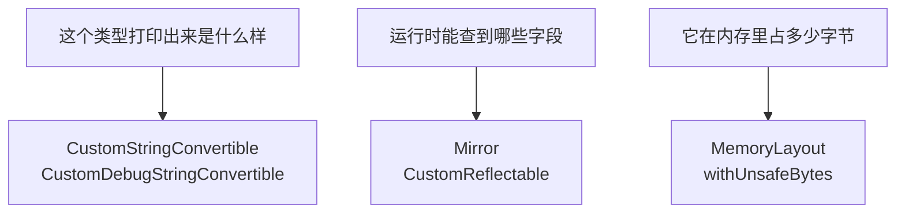

+++
title = "第52章 反射与内存布局：类型在运行时留下什么"
weight = 520
date = "2026-09-14T22:30:00+08:00"
type = "docs"
description = "自定义描述、LosslessStringConvertible、Mirror、CustomReflectable、dump、MemoryLayout 与 withUnsafeBytes：Swift 在运行时到底保留了哪些类型信息"
isCJKLanguage = true
draft = false
+++

# 第五十二章：反射与内存布局：类型在运行时留下什么

> 同一个问题是所有现代语言都要回答的：程序跑起来之后，类型还剩多少信息？Swift 的答案很有个性——**反射是只读的，内存布局是可以量的**。这一章把 `CustomStringConvertible`、`Mirror`、`MemoryLayout` 和 `withUnsafeBytes` 串成一条线，讲清楚 Swift 在这个话题上的边界。

## 52.1 三个问题，三件工具



| 你想知道 | 工具 | 是编译期的还是运行时的 |
| --- | --- | --- |
| 怎么把值变成字符串 | `CustomStringConvertible` | 运行时（动态派发到你的实现） |
| 怎么把字符串变回值 | `LosslessStringConvertible` | 运行时 |
| 有哪些字段、叫什么名字 | `Mirror` | 运行时（但**只读**） |
| 想自定义反射内容 | `CustomReflectable` | 运行时 |
| 占多少字节、对齐多少 | `MemoryLayout` | 编译期常量 |
| 看看字节长什么样 | `withUnsafeBytes` | 运行时 |

## 52.2 让类型会自我介绍

```swift
import Foundation

struct Money: CustomStringConvertible, CustomDebugStringConvertible {
    var cents: Int

    var description: String { "¥\(Double(cents) / 100)" }
    var debugDescription: String { "Money(cents: \(cents))" }
}

print("\(Money(cents: 1999)) | \(String(reflecting: Money(cents: 1999)))")
// prints: ¥19.99 | Money(cents: 1999)
```

这两个协议的差别值得记牢：

| 写法 | 找谁要字符串 | 用途 |
| --- | --- | --- |
| `"\(value)"`、`String(describing:)` | `description` | 给用户看 |
| `String(reflecting:)` | `debugDescription`，没实现则退回 `description` | 给开发者看 |

`print` 和字符串插值走的是 `description`，所以在日志里打钱数是 `¥19.99`，进调试器看却是 `Money(cents: 1999)`——同一份数据，两种观众。

⚠️ 如果没实现这两个协议，`String(describing:)` 会给一个"结构体长什么样"的字符串，但那个格式**不是接口**（编译器版本之间可能改）。想让输出稳定，就老老实实实现 `description`。

## 52.3 反向操作：LosslessStringConvertible

`description` 是"值 → 字符串"，`LosslessStringConvertible` 是"字符串 → 值"，而且它自带"必须能原样还原"的承诺：

```swift
import Foundation

struct Temperature: LosslessStringConvertible, CustomStringConvertible {
    var celsius: Double

    init?(_ description: String) {
        guard let value = Double(description) else { return nil }
        celsius = value
    }

    var description: String { "\(celsius)°C" }
}

print(Temperature("36.5") as Any, Temperature("abc") as Any)
// prints: Optional(36.5°C) nil
print("\(Temperature("36.5")!)")
// prints: 36.5°C
```

它和 `CustomStringConvertible` 是一对：一个类型同时实现两者，就同时支持"打印出去"和"从打印结果解析回来"。`Int("42")`、`Double("3.14")` 背后就是这套东西。

## 52.4 Mirror：运行时看一眼结构

`Mirror(reflecting:)` 能让你在不认识某个类型的情况下看看它由什么组成：

```swift
import Foundation

struct Point { var x: Int; var y: Int }

let mirror = Mirror(reflecting: Point(x: 1, y: 2))
print(mirror.displayStyle as Any, mirror.children.count)
// prints: Optional(Swift.Mirror.DisplayStyle.struct) 2

for child in mirror.children {
    print(child.label as Any, child.value)
}
// prints: Optional("x") 1
// prints: Optional("y") 2
```

三个成员是常用的：

| 成员 | 含义 |
| --- | --- |
| `displayStyle` | 结构体、类、枚举、元组、集合、可选值……是个 `Optional` |
| `children` | 子元素的序列，每项有 `label`（可能为 `nil`）和 `value`（`Any`） |
| `subjectType` | 被反射的类型本身 |

`displayStyle` 为 `nil` 不代表出错，它表示"这属于语言内置的几种基本形态"：

```swift
import Foundation

struct Point { var x: Int; var y: Int }

let samples: [Any] = [Point(x: 1, y: 2), 42, "文字", [1, 2]]
for value in samples {
    let mirror = Mirror(reflecting: value)
    print(mirror.displayStyle as Any, mirror.children.count, type(of: value))
}
// prints: Optional(Swift.Mirror.DisplayStyle.struct) 2 Point
// prints: nil 0 Int
// prints: nil 0 String
// prints: Optional(Swift.Mirror.DisplayStyle.collection) 2 Array<Int>
```

`Int`、`String` 的 `displayStyle` 都是 `nil`，也没有子元素——它们在反射层面是"不透明的基本量"。

`Optional` 也值得单独看一眼，因为它的结构和你以为的不一样：

```swift
import Foundation

let some: Int? = 5
let someMirror = Mirror(reflecting: some as Any)
print(someMirror.displayStyle as Any, someMirror.children.count, someMirror.children.first?.label as Any)
// prints: Optional(Swift.Mirror.DisplayStyle.optional) 1 Optional("some")

let none: Int? = nil
let noneMirror = Mirror(reflecting: none as Any)
print(noneMirror.displayStyle as Any, noneMirror.children.count)
// prints: Optional(Swift.Mirror.DisplayStyle.optional) 0
```

有的 `Optional` 有 1 个子元素、标签叫 `"some"`，`nil` 则是 0 个。**注意 `none` 那行必须显式转成 `Any`**，否则 `Mirror(reflecting: none)` 会先被解包成 `nil`……编译器会给你一句警告，别忽略它。

### 类的继承链：superclassMirror

类的反射只给出**自己这一层**的字段，父类的部分要通过 `superclassMirror` 一层层往上走：

```swift
import Foundation

class Base { var a = 1 }
class Derived: Base { var b = 2 }

var current: Mirror? = Mirror(reflecting: Derived())
while let mirror = current {
    print(mirror.children.count, mirror.subjectType)
    for child in mirror.children {
        print("字段", child.label as Any, child.value)
    }
    current = mirror.superclassMirror
}
// prints: 1 Derived
// prints: 字段 Optional("b") 2
// prints: 1 Base
// prints: 字段 Optional("a") 1
```

这个循环是"把整个对象完整打印出来"的标准写法。也顺便说明了一件事：反射看到的字段是**按声明类型一层层展开**的，不是一把抓。

## 52.5 CustomReflectable 与 dump

如果不想让人看到全部内部字段（比如里面有缓存、有密码），可以实现 `CustomReflectable` 自己决定露出什么：

```swift
import Foundation

struct Tagged: CustomReflectable {
    var hidden = "秘密"
    var visible = 42

    var customMirror: Mirror {
        Mirror(self, children: ["只用这个": visible], displayStyle: .struct)
    }
}

dump(Tagged())
```

输出大致是这样（`▿` 那行会带上模块名，实际模块名取决于你的工程）：

```text
▿ 你的模块名.Tagged
  - 只用这个: 42
```

`hidden` 完全没出现——`customMirror` 就是反射内容的唯一出口。`dump` 和 `print` 的区别也在这里：`print` 只调一次 `description`，`dump` 会走反射、把结构展开成树，调试时更直观。

## 52.6 MemoryLayout：类型到底有多大

`MemoryLayout` 是编译期就能确定的常量，三个数字各有各的意思：

| 名称 | 含义 | 类比 |
| --- | --- | --- |
| `size` | 这个值本身用掉的字节数 | 人的体积 |
| `stride` | 在数组里相邻两个元素之间隔多远 | 加座位后排距 |
| `alignment` | 起始地址必须是几的倍数 | 停车位尺寸 |

先看最简单的情况：

```swift
import Foundation

print(MemoryLayout<Int>.size, MemoryLayout<Int>.stride, MemoryLayout<Int>.alignment)
// prints: 8 8 8
print(MemoryLayout<UInt32>.size, MemoryLayout<Bool>.size, MemoryLayout<UInt8>.size)
// prints: 4 1 1
```

一旦结构体的字段类型不同，**填充**就出现了：

```swift
import Foundation

struct Packed { var a: Int32; var b: Int8 }
struct Mixed { var a: Bool; var b: Int }

print(MemoryLayout<Packed>.size, MemoryLayout<Packed>.stride, MemoryLayout<Packed>.alignment)
// prints: 5 8 4
print(MemoryLayout<Mixed>.size, MemoryLayout<Mixed>.stride, MemoryLayout<Mixed>.alignment)
// prints: 16 16 8
```

逐字节画出来就清楚了：

```text
Packed（Int32 + Int8）：  [a a a a][b . . .]    size 5，stride 8
                          0      4          对齐要求 4 → 数组里每个元素要占 8 字节

Mixed（Bool + Int）：     [a . . . . . . .][b b b b b b b b]   size 16，stride 16
                          0                8
```

`Mixed` 里的 7 个点就是**填充字节**：`Int` 必须从 8 的倍数地址开始，编译器只好在 `Bool` 后面塞 7 个空字节。所以"字段的大小加起来"不等于"结构体的实际大小"——字段的**类型和对齐要求**都在悄悄加量。

一个有趣的反例：三个 `UInt8` 恰好不需要填充，`size` 和 `stride` 都是 3。

```swift
import Foundation

struct Trio { var a: UInt8; var b: UInt8; var c: UInt8 }
struct Nested { var a: Int8; var b: Int; var c: Int8 }

print(MemoryLayout<Trio>.size, MemoryLayout<Trio>.stride)
// prints: 3 3
print(MemoryLayout<Nested>.size, MemoryLayout<Nested>.stride, MemoryLayout<Nested>.alignment)
// prints: 17 24 8
```

`Nested` 是最能说明问题的例子：三个字段加起来只有 10 字节，实际 `size` 是 17、`stride` 是 24。多出来的全是填充。**这就是为什么"给结构体排序字段"在高性能代码里真的有用**——把大的放前面，填充就没了：

```swift
import Foundation

struct Nested { var a: Int8; var b: Int; var c: Int8 }    // 声明顺序不凑巧
struct Ordered { var b: Int; var a: Int8; var c: Int8 }   // 换个顺序，字段一个没少

print(MemoryLayout<Nested>.size, MemoryLayout<Nested>.stride)
// prints: 17 24
print(MemoryLayout<Ordered>.size, MemoryLayout<Ordered>.stride)
// prints: 10 16
```

同一个结构体、同样的字段，仅仅换了声明顺序，`stride` 就从 24 降到 16。**Swift 不会自动帮你重排字段**（顺序由你决定，也由你负责），这一条得自己动手。

### 枚举与可选值也遵守同一套规则

枚举要额外存一个"这是哪个 case"的标记，可选值也一样：

```swift
import Foundation

enum Level { case high(Int); case low }

print(MemoryLayout<Int?>.size, MemoryLayout<Int?>.stride)
// prints: 9 16
print(MemoryLayout<Level>.size, MemoryLayout<Level>.stride)
// prints: 9 16
```

为什么 `Int?` 是 9 而不是 16？因为它就是"8 字节的 `Int` + 1 字节的标记"，9 是真正用到的字节数，`stride` 16 才是数组里每个元素占的位置。

### 看某个字段离开头多远

`offset(of:)` 需要 KeyPath，它回答"这个字段从结构体起始位置数起在第几字节"：

```swift
import Foundation

struct Nested { var a: Int8; var b: Int; var c: Int8 }

print(MemoryLayout<Nested>.offset(of: \Nested.b) as Any, MemoryLayout<Nested>.offset(of: \Nested.c) as Any)
// prints: Optional(8) Optional(16)
```

⚠️ 这些数字**不是语言规范保证的**。Swift 官方只承诺"同一份源码、同一个编译器版本、同一种架构下稳定"，换架构（比如 32 位）、换编译器、把类型标成 `@frozen` 与否都可能变。拿它做二进制格式或网络协议时，请显式序列化，别指望内存布局。

## 52.7 withUnsafeBytes：看字节

真要看到字节序列，用 `withUnsafeBytes(of:)` 借出那块内存——注意是"借"，闭包结束后指针就失效了，别把它存起来：

```swift
import Foundation

var value: UInt32 = 0x01020304
withUnsafeBytes(of: &value) { buffer in
    print(Array(buffer))
}
// prints: [4, 3, 2, 1]
```

最高位字节 `01` 跑到了最后，说明这台机器是**小端序**（低位字节在前）。Apple 平台和主流 x86/ARM 都是小端，所以上面的结果很稳定；真要写跨平台二进制协议时，记得用 `UInt32(bigEndian:)` 之类的显式转换，别依赖机器序。

## 52.8 反射的边界：Swift 能做什么、不能做什么

这是这一章最该记住的部分。和某些语言不同，Swift 的反射是**只读的**：

| 你可能想做的事 | Swift 支持吗 | 正确做法 |
| --- | --- | --- |
| 打印一个值的字段 | ✅ `Mirror` | — |
| 统计类型占多少内存 | ✅ `MemoryLayout` | — |
| 按字段名读取值 | ⚠️ 只能遍历 `children` 比对 `label` | 用 `KeyPath` 或 `Codable` |
| 按字段名**修改**值 | ❌ 不行 | 声明一个可写的 `WritableKeyPath`，或者老老实实写 setter |
| 运行时凭空造一个新类型 | ❌ 不行 | 用协议 + 泛型 + 宏在编译期解决 |
| 遍历枚举所有 case | ⚠️ 得自己给能力 | 让枚举遵循 `CaseIterable`，或用宏生成 |
| 从 JSON 自动生成解析代码 | ✅ 但靠编译期 | `Codable` 合成（第 24 章） |

一句话：**Swift 把"需要元信息"的工作推给了编译期**——`Codable` 的合成、属性包装器、宏，都是这个思路的产物。运行时的 `Mirror` 是留给调试和展示用的，不是拿来当框架基石的。

## 52.9 一张决策表

| 需求 | 用什么 |
| --- | --- |
| 给用户看的字符串 | `CustomStringConvertible.description` |
| 给开发者看的字符串 | `CustomDebugStringConvertible.debugDescription` |
| 字符串与值来回转换 | `LosslessStringConvertible` |
| 调试时打印整棵树 | `dump` |
| 调试时打印一行 | `print` / `String(describing:)` |
| 想遍历一个值的字段 | `Mirror(reflecting:)` |
| 想控制哪些字段被"看见" | `CustomReflectable` |
| 想知道占多少内存 | `MemoryLayout<T>.size` / `.stride` |
| 想知道字段偏移 | `MemoryLayout<T>.offset(of:)` |
| 想看原始字节 | `withUnsafeBytes(of:)` |
| 想把对象存下来再读回来 | `Codable`（第 24 章），不是反射 |

## 52.10 本章小结

| 概念 | 一句话 |
| --- | --- |
| `description` | 字符串插值走它；不实现则输出格式不受保证 |
| `debugDescription` | `String(reflecting:)` 走它 |
| `LosslessStringConvertible` | `init?(_ description: String)`，支持从字符串还原 |
| `Mirror` | 只读反射：`displayStyle`、`children`、`subjectType` |
| `superclassMirror` | 类的父类字段要一层层往上取 |
| `CustomReflectable` | 自己决定反射露出什么 |
| `dump` | 走反射打印整棵树，和 `print` 不是一回事 |
| `MemoryLayout.size` | 值本身用到的字节数 |
| `MemoryLayout.stride` | 数组里相邻元素的间距，含尾部填充 |
| `MemoryLayout.alignment` | 起始地址必须是它的倍数 |
| `offset(of:)` | 字段距离起始地址的字节数 |
| `withUnsafeBytes` | 临时借出内存看字节，闭包结束后失效 |

## 52.11 本章易错点速查

| 容易踩的地方 | 正确认识 |
| --- | --- |
| 想用反射改字段 | Swift 的反射只读，改值靠 `KeyPath` 或 `Codable` |
| 把 `String(describing:)` 的默认格式当接口 | 未实现协议时的输出格式不受保证 |
| 忽略 `none` 的 `as Any` 警告 | 不转 `Any` 会先解包，反射看到的东西就变了 |
| 在类上直接反射父类字段 | 只能通过 `superclassMirror` 逐层取 |
| 把 `MemoryLayout` 数字写进二进制协议 | 实现相关，不同架构/编译器会变 |
| 以为 `size` 就是 `stride` | `size` 是实际用到的字节，`stride` 含尾部填充 |
| 忘了 `Optional` 也要占 1 个标记字节 | `Int?` 是 9 字节，不是 8 |
| 把 `withUnsafeBytes` 借出的指针存起来 | 只在闭包生命周期内有效，存了就是悬垂指针 |
| 想靠反射自动实现序列化 | 用 `Codable`，那是编译期生成的 |

## 52.12 第八篇回顾

这一篇没有新语法，只有五个"收口"：序列协议族、数值与格式化、属性与下标的全部形态、标准库算法工具箱、反射与内存布局。

它们对应的是同一类问题：**某个概念你第一次见到它时，往往只是为了解决一个具体场景，于是你记住了用法，却没看到它在整个语言里的位置。**第 19 章的计算属性如此，第 10 章的数组如此，`Mirror` 也如此。

如果你读到这里觉得"原来这些是一家人"，那这一篇的目的就达到了。往后遇到新 API，先问一句"它是哪一族的成员"，比背文档有用得多。
