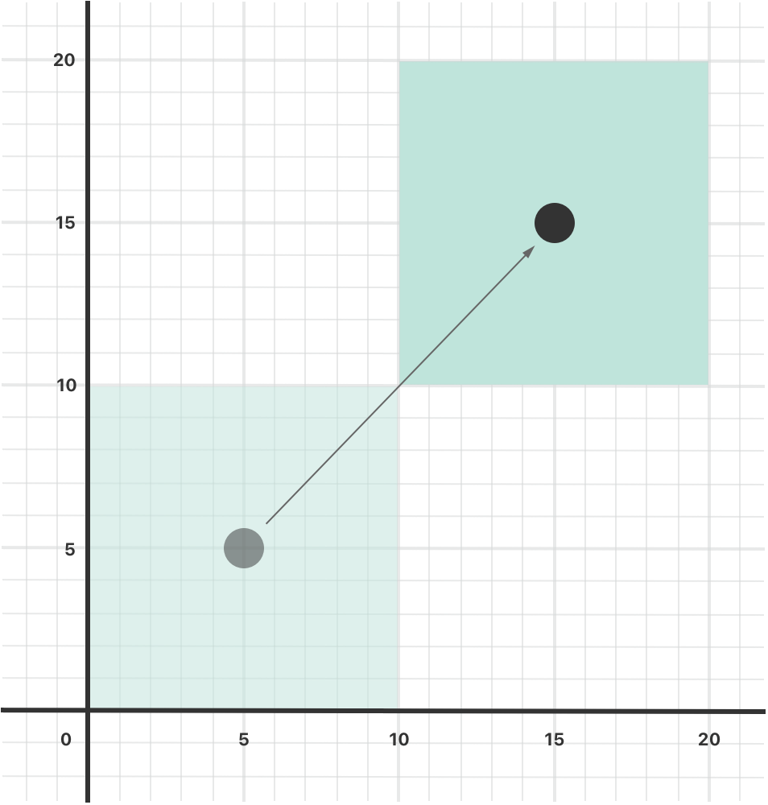
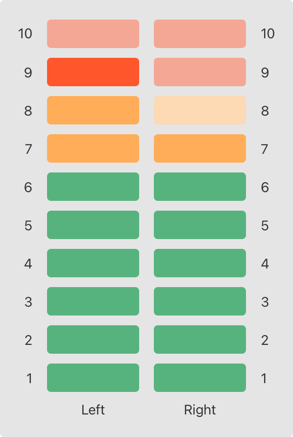

+++
title = "2.10 属性"
date = 2026-09-11T20:00:03+08:00
weight = 10
type = "docs"
description = ""
isCJKLanguage = true
draft = false
+++


> 原文链接: [https://docs.swift.org/latest/documentation/the-swift-programming-language/properties/](https://docs.swift.org/latest/documentation/the-swift-programming-language/properties/)

# 2.10 属性

访问属于实例或类型的存储值与计算值。

*属性*把值与特定的类、结构体或枚举关联起来。存储属性把常量和变量值作为实例的一部分存放起来，而计算属性则是计算出一个值（而不是存放它）。计算属性由类、结构体和枚举提供；存储属性只由类和结构体提供。

存储属性和计算属性通常与特定类型的实例相关联。不过，属性也可以与类型本身相关联，这类属性称为类型属性。

此外，你还可以定义属性观察器来监视属性值的变化，并用自定义动作来响应。属性观察器既可以添加到自己定义的存储属性上，也可以添加到子类从父类继承来的属性上。

你还可以用属性包装器在多个属性的取值器和设值器中复用代码。

## 存储属性 {#Stored-Properties}

最简单形式的存储属性，是作为特定类或结构体实例的一部分存放的常量或变量。存储属性既可以是*变量存储属性*（用 `var` 关键字引入），也可以是*常量存储属性*（用 `let` 关键字引入）。

你可以在定义存储属性时提供默认值，详见[属性默认值](../2.14-Initialization/#Default-Property-Values)。你也可以在初始化过程中设置和修改存储属性的初始值，常量存储属性同样如此，详见[在初始化期间给常量属性赋值](../2.14-Initialization/#Assigning-Constant-Properties-During-Initialization)。

下面的例子定义了一个名为 `FixedLengthRange` 的结构体，它描述一个创建之后长度不能再改变的整数范围：

```swift
struct FixedLengthRange {
    var firstValue: Int
    let length: Int
}
var rangeOfThreeItems = FixedLengthRange(firstValue: 0, length: 3)
// 该范围表示整数值 0、1、2
rangeOfThreeItems.firstValue = 6
// 该范围现在表示整数值 6、7、8
```

`FixedLengthRange` 的实例有一个名为 `firstValue` 的变量存储属性和一个名为 `length` 的常量存储属性。在上面的例子里，`length` 在新范围创建时被初始化，此后不能再改，因为它是常量属性。

### 常量结构体实例的存储属性 {#Stored-Properties-of-Constant-Structure-Instances}

如果你创建了结构体的一个实例并把它赋给常量，就不能修改该实例的属性，即使这些属性声明为变量属性：

```swift
let rangeOfFourItems = FixedLengthRange(firstValue: 0, length: 4)
// 该范围表示整数值 0、1、2、3
rangeOfFourItems.firstValue = 6
// 这会报错，即使 firstValue 是变量属性
```

因为 `rangeOfFourItems` 声明为常量（用 `let` 关键字），所以不能修改它的 `firstValue` 属性，即使 `firstValue` 是变量属性。

这一行为源于结构体是*值类型*：值类型的实例被标记为常量时，它的所有属性也都是常量。

类则不同，因为类是*引用类型*。如果你把引用类型的实例赋给常量，仍然可以修改该实例的变量属性。

### 延迟存储属性 {#Lazy-Stored-Properties}

*延迟存储属性*是这样一种属性：它的初始值要到第一次被使用时才计算。在声明前写 `lazy` 修饰符就表示这是一个延迟存储属性。

> 注意：延迟属性必须始终声明为变量（用 `var` 关键字），
> 因为它的初始值可能要到实例初始化完成之后才会被取用。
> 常量属性必须在初始化完成*之前*就有值，
> 因此不能声明为延迟属性。

当属性的初始值依赖于外部因素、而这些因素的值要到实例初始化完成之后才已知时，延迟属性很有用。当属性的初始值需要复杂或代价高昂的准备工作、而这些工作除非必要否则不应进行时，延迟属性同样有用。

下面的例子用延迟存储属性来避免对复杂类进行不必要的初始化。这个例子定义了两个类 `DataImporter` 和 `DataManager`，它们都没有完整展示：

```swift
class DataImporter {
    /*
    DataImporter 是一个从外部文件导入数据的类。
    假定这个类的初始化需要相当可观的时间。
    */
    var filename = "data.txt"
    // DataImporter 类会在这里提供数据导入功能
}

class DataManager {
    lazy var importer = DataImporter()
    var data: [String] = []
    // DataManager 类会在这里提供数据管理功能
}

let manager = DataManager()
manager.data.append("Some data")
manager.data.append("Some more data")
// 还没有为 importer 属性创建 DataImporter 实例
```

`DataManager` 类有一个名为 `data` 的存储属性，用一个新建的空 `String` 值数组初始化。尽管没有展示它的其余功能，这个 `DataManager` 类的用途就是管理和提供对这个 `String` 数据数组的访问。

`DataManager` 类的一部分功能是从文件导入数据，这项功能由 `DataImporter` 类提供，而假定 `DataImporter` 的初始化需要相当可观的时间：可能是因为 `DataImporter` 实例初始化时需要打开一个文件并把内容读入内存。

由于 `DataManager` 实例有可能在从不导入文件的情况下管理数据，`DataManager` 在自身被创建时并不创建 `DataImporter` 实例。更合理的做法是等到 `DataImporter` 第一次被使用时再创建它。

由于带有 `lazy` 修饰符，`importer` 属性对应的 `DataImporter` 实例只在 `importer` 属性第一次被访问时才创建，比如查询它的 `filename` 属性时：

```swift
print(manager.importer.filename)
// importer 属性对应的 DataImporter 实例现在已经被创建
// 输出 "data.txt"。
```

> 注意：如果带有 `lazy` 修饰符的属性
> 被多个线程同时访问，
> 而该属性尚未初始化，
> 那么无法保证该属性只会被初始化一次。

### 存储属性与实例变量 {#Stored-Properties-and-Instance-Variables}

如果你有 Objective-C 的经验，可能知道它提供了*两种*把值和引用存储为类实例一部分的方式：除了属性，你还可以使用实例变量作为属性所存值的后备存储。

Swift 把这些概念统一为单一的属性声明。Swift 属性没有对应的实例变量，属性的后备存储也不能被直接访问。这种做法避免了在不同上下文中如何访问该值的困惑，也把属性的声明简化成一条明确而唯一的语句。属性的所有信息——包括名字、类型和内存管理特性——都在类型定义中的同一处定义。

## 计算属性 {#Computed-Properties}

除了存储属性，类、结构体和枚举还可以定义*计算属性*。计算属性并不实际存放值，而是提供取值器和可选的设值器，间接地获取和设置其他属性与值。

```swift
struct Point {
    var x = 0.0, y = 0.0
}
struct Size {
    var width = 0.0, height = 0.0
}
struct Rect {
    var origin = Point()
    var size = Size()
    var center: Point {
        get {
            let centerX = origin.x + (size.width / 2)
            let centerY = origin.y + (size.height / 2)
            return Point(x: centerX, y: centerY)
        }
        set(newCenter) {
            origin.x = newCenter.x - (size.width / 2)
            origin.y = newCenter.y - (size.height / 2)
        }
    }
}
var square = Rect(origin: Point(x: 0.0, y: 0.0),
    size: Size(width: 10.0, height: 10.0))
let initialSquareCenter = square.center
// initialSquareCenter 位于 (5.0, 5.0)
square.center = Point(x: 15.0, y: 15.0)
print("square.origin is now at (\(square.origin.x), \(square.origin.y))")
// 输出 "square.origin is now at (10.0, 10.0)"。
```

这个例子定义了三个处理几何图形的结构体：

- `Point` 封装一个点的 x 坐标和 y 坐标。
- `Size` 封装一个 `width` 和一个 `height`。
- `Rect` 用原点和一个尺寸定义一个矩形。

`Rect` 结构体还提供了一个名为 `center` 的计算属性。`Rect` 当前的中心位置总能由它的 `origin` 和 `size` 算出来，因此不必把中心点作为一个明确的 `Point` 值存起来。相反，`Rect` 为计算变量 `center` 定义了自定义的取值器和设值器，让你可以把矩形的 `center` 当作真正的存储属性来使用。

上面的例子创建了一个新的 `Rect` 变量 `square`，它的原点为 `(0, 0)`，宽和高都是 `10`。这个正方形对应下图中浅绿色的方块。

接着通过点语法（`square.center`）访问 `square` 变量的 `center` 属性，这会调用 `center` 的取值器来获取当前属性值。取值器并不返回已有的值，而是实际计算并返回一个新的 `Point` 来表示正方形的中心。如上所示，取值器正确地返回了中心点 `(5, 5)`。

随后把 `center` 属性设为新值 `(15, 15)`，把正方形向右上移动，到达下图中深绿色方块所示的新位置。设置 `center` 属性会调用 `center` 的设值器，它修改存储属性 `origin` 的 `x` 和 `y` 值，把正方形移到新位置。



### 简写设值器声明 {#Shorthand-Setter-Declaration}

如果计算属性的设值器没有为新设置的值定义名字，就会使用默认名字 `newValue`。下面是 `Rect` 结构体的另一种写法，它利用了这种简写形式：

```swift
struct AlternativeRect {
    var origin = Point()
    var size = Size()
    var center: Point {
        get {
            let centerX = origin.x + (size.width / 2)
            let centerY = origin.y + (size.height / 2)
            return Point(x: centerX, y: centerY)
        }
        set {
            origin.x = newValue.x - (size.width / 2)
            origin.y = newValue.y - (size.height / 2)
        }
    }
}
```

### 简写取值器声明 {#Shorthand-Getter-Declaration}

如果取值器的整个语句体就是一个表达式，取值器会隐式返回该表达式。下面是利用这种简写形式以及设值器简写形式的 `Rect` 结构体另一个版本：

```swift
struct CompactRect {
    var origin = Point()
    var size = Size()
    var center: Point {
        get {
            Point(x: origin.x + (size.width / 2),
                  y: origin.y + (size.height / 2))
        }
        set {
            origin.x = newValue.x - (size.width / 2)
            origin.y = newValue.y - (size.height / 2)
        }
    }
}
```

在取值器中省略 `return` 的规则，与在函数中省略 `return` 的规则相同，详见[带隐式返回的函数](../2.6-Functions/#Functions-With-an-Implicit-Return)。

### 只读计算属性 {#Read-Only-Computed-Properties}

只有取值器而没有设值器的计算属性称为*只读计算属性*。只读计算属性总是返回一个值，可以通过点语法访问，但不能被设为其他值。

> 注意：计算属性——包括只读计算属性——都必须
> 用 `var` 关键字声明为变量属性，因为它们的值并不固定。
> `let` 关键字只用于常量属性，
> 表示它们的值一旦在实例初始化时设定就不能再改。

去掉 `get` 关键字及其花括号，可以简化只读计算属性的声明：

```swift
struct Cuboid {
    var width = 0.0, height = 0.0, depth = 0.0
    var volume: Double {
        return width * height * depth
    }
}
let fourByFiveByTwo = Cuboid(width: 4.0, height: 5.0, depth: 2.0)
print("the volume of fourByFiveByTwo is \(fourByFiveByTwo.volume)")
// 输出 "the volume of fourByFiveByTwo is 40.0"。
```

这个例子定义了一个名为 `Cuboid` 的新结构体，表示一个带 `width`、`height` 和 `depth` 属性的三维长方体。它还有一个名为 `volume` 的只读计算属性，计算并返回该长方体当前的体积。让 `volume` 可设置并不合理，因为对于某个 `volume` 值，应当采用哪些 `width`、`height` 和 `depth` 值是有歧义的。不过，让 `Cuboid` 提供一个只读计算属性，便于外部使用者查看它当前计算出的体积，这是有用的。

## 属性观察器 {#Property-Observers}

属性观察器观察并响应属性值的变化。每当属性的值被设置时，属性观察器都会被调用，即使新值与属性当前值相同也不例外。

你可以在下列位置添加属性观察器：

- 你自己定义的存储属性
- 你继承来的存储属性
- 你继承来的计算属性

对于继承来的属性，你在子类中通过覆盖该属性来添加属性观察器。对于你自己定义的计算属性，请用该属性的设值器来观察和响应值的改变，而不是试图创建观察器。覆盖属性的内容参见[覆盖](../2.13-Inheritance/#Overriding)。

你可以选择在属性上定义下列观察器中的一个或两个：

- `willSet` 在值被存放之前调用。
- `didSet` 在新值被存放之后立即调用。

如果你实现了 `willSet` 观察器，它会把新的属性值作为常量参数传入。你可以在 `willSet` 实现中为这个参数指定名字；如果没有在实现里写参数名和圆括号，这个参数就以默认参数名 `newValue` 提供。

类似地，如果你实现了 `didSet` 观察器，它会把包含旧属性值的常量参数传入。你可以给这个参数命名，也可以使用默认参数名 `oldValue`。如果你在自己的 `didSet` 观察器中给属性赋值，你赋的新值会替换刚刚设置的那个值。

> 注意：在子类构造器中设置属性时，
> 父类属性的 `willSet` 和 `didSet` 观察器
> 会在父类构造器被调用之后才被调用。
> 类在构造器体内设置自己的属性时，它们不会被调用。
>
> 关于构造器委托的更多内容，
> 参见[值类型的构造器委托](../2.14-Initialization/#Initializer-Delegation-for-Value-Types)
> 和[类类型的构造器委托](../2.14-Initialization/#Initializer-Delegation-for-Class-Types)。

下面是 `willSet` 和 `didSet` 的实例。这个例子定义了一个名为 `StepCounter` 的新类，用来记录一个人步行时的总步数。这个类可以与计步器或其他步数计数器的输入数据配合使用，记录一个人日常活动中的运动量。

```swift
class StepCounter {
    var totalSteps: Int = 0 {
        willSet(newTotalSteps) {
            print("About to set totalSteps to \(newTotalSteps)")
        }
        didSet {
            if totalSteps > oldValue  {
                print("Added \(totalSteps - oldValue) steps")
            }
        }
    }
}
let stepCounter = StepCounter()
stepCounter.totalSteps = 200
// About to set totalSteps to 200
// Added 200 steps
stepCounter.totalSteps = 360
// About to set totalSteps to 360
// Added 160 steps
stepCounter.totalSteps = 896
// About to set totalSteps to 896
// Added 536 steps
```

`StepCounter` 类声明了一个 `Int` 类型的 `totalSteps` 属性。这是一个带 `willSet` 和 `didSet` 观察器的存储属性。

每当给 `totalSteps` 赋新值时，它的 `willSet` 和 `didSet` 观察器都会被调用，即使新值与当前值相同也是如此。

这个例子的 `willSet` 观察器为即将到来的新值使用了自定义参数名 `newTotalSteps`，它只是打印出即将设置的值。

`didSet` 观察器在 `totalSteps` 的值更新之后被调用，它把 `totalSteps` 的新值与旧值比较。如果总步数增加了，就打印一条消息说明新增了多少步。这个 `didSet` 观察器没有为旧值提供自定义参数名，因此使用默认名字 `oldValue`。

> 注意：如果你把带观察器的属性
> 作为输入输出参数传给函数，
> `willSet` 和 `didSet` 观察器总会被调用。
> 这是因为输入输出参数采用"复制进、复制出"的内存模型：
> 函数结束时，值总会被写回该属性。
> 关于输入输出参数行为的详细讨论，
> 参见[输入输出参数](../../languagereference/3.6-Declarations/#In-Out-Parameters)。

## 属性包装器 {#Property-Wrappers}

属性包装器在"管理属性如何存储"的代码与"定义属性"的代码之间增加了一层隔离。例如，如果你有些属性需要提供线程安全检查，或者把底层数据存进数据库，那么每个属性都得写一遍这些代码。使用属性包装器时，你在定义包装器时写一次管理代码，然后把它应用到多个属性上，从而复用这些管理代码。

要定义属性包装器，你需要定义一个包含 `wrappedValue` 属性的结构体、枚举或类。在下面的代码中，`TwelveOrLess` 结构体确保它包装的值始终是小于或等于 12 的数字；如果你让它存放更大的数，它就改存 12。

```swift
@propertyWrapper
struct TwelveOrLess {
    private var number = 0
    var wrappedValue: Int {
        get { return number }
        set { number = min(newValue, 12) }
    }
}
```

设值器确保新值小于或等于 12，取值器返回存储的值。

> 注意：上面例子中 `number` 的声明
> 把这个变量标记为 `private`，
> 从而确保 `number` 只在 `TwelveOrLess` 的实现中使用。
> 写在其他任何地方的代码
> 都通过 `wrappedValue` 的取值器和设值器访问该值，
> 不能直接使用 `number`。
> 关于 `private` 的内容，参见[访问控制](../2.28-AccessControl/)。

把包装器的名字作为特性写在属性之前，就把包装器应用到了该属性上。下面这个结构体存储一个矩形，并使用 `TwelveOrLess` 属性包装器确保它的尺寸始终不超过 12：

```swift
struct SmallRectangle {
    @TwelveOrLess var height: Int
    @TwelveOrLess var width: Int
}

var rectangle = SmallRectangle()
print(rectangle.height)
// 输出 "0"。

rectangle.height = 10
print(rectangle.height)
// 输出 "10"。

rectangle.height = 24
print(rectangle.height)
// 输出 "12"。
```

`height` 和 `width` 属性的初始值来自 `TwelveOrLess` 的定义，它把 `TwelveOrLess.number` 置为零。`TwelveOrLess` 中的设值器把 10 视为合法值，因此把数字 10 存进 `rectangle.height` 会按原样进行；但 24 超出了 `TwelveOrLess` 允许的范围，因此试图存入 24 最终会把 `rectangle.height` 设为 12，也就是允许的最大值。

当你把包装器应用到某个属性上时，编译器会合成用于为包装器提供存储的代码，以及通过包装器访问该属性的代码。（包装值本身由属性包装器负责存储，因此不需要为其合成代码。）你也可以不使用这个特殊特性语法，而是自己编写利用属性包装器行为的代码。例如，下面是前面代码清单中 `SmallRectangle` 的另一个版本，它显式地把属性包在 `TwelveOrLess` 结构体中，而不是把 `@TwelveOrLess` 写成特性：

```swift
struct SmallRectangle {
    private var _height = TwelveOrLess()
    private var _width = TwelveOrLess()
    var height: Int {
        get { return _height.wrappedValue }
        set { _height.wrappedValue = newValue }
    }
    var width: Int {
        get { return _width.wrappedValue }
        set { _width.wrappedValue = newValue }
    }
}
```

`_height` 和 `_width` 属性存放属性包装器 `TwelveOrLess` 的实例，`height` 和 `width` 的取值器与设值器则包装了对 `wrappedValue` 属性的访问。

### 为被包装属性设置初始值 {#Setting-Initial-Values-for-Wrapped-Properties}

上面例子中的代码通过在 `TwelveOrLess` 的定义里给 `number` 一个初始值，来设置被包装属性的初始值。使用这个属性包装器的代码无法为被 `TwelveOrLess` 包装的属性指定不同的初始值——例如 `SmallRectangle` 的定义不能给 `height` 或 `width` 设置初始值。要支持设置初始值或其他定制，属性包装器需要添加构造器。下面是 `TwelveOrLess` 的一个扩展版本，名为 `SmallNumber`，它定义了用于设置被包装值和最大值的构造器：

```swift
@propertyWrapper
struct SmallNumber {
    private var maximum: Int
    private var number: Int

    var wrappedValue: Int {
        get { return number }
        set { number = min(newValue, maximum) }
    }
    init() {
        maximum = 12
        number = 0
    }
    init(wrappedValue: Int) {
        maximum = 12
        number = min(wrappedValue, maximum)
    }
    init(wrappedValue: Int, maximum: Int) {
        self.maximum = maximum
        number = min(wrappedValue, maximum)
    }
}
```

`SmallNumber` 的定义包含三个构造器——`init()`、`init(wrappedValue:)` 和 `init(wrappedValue:maximum:)`——下面的例子用它们设置被包装值和最大值。关于初始化与构造器语法的内容，参见[初始化](../2.14-Initialization/)。

当你把包装器应用到属性上而没有指定初始值时，Swift 会用 `init()` 构造器来设置包装器。例如：

```swift
struct ZeroRectangle {
    @SmallNumber var height: Int
    @SmallNumber var width: Int
}

var zeroRectangle = ZeroRectangle()
print(zeroRectangle.height, zeroRectangle.width)
// 输出 "0 0"。
```

包装 `height` 和 `width` 的 `SmallNumber` 实例是通过调用 `SmallNumber()` 创建的，该构造器中的代码用默认值 0 和 12 设置初始的被包装值和最大值。这个属性包装器仍然提供了全部初始值，和前面在 `SmallRectangle` 中使用 `TwelveOrLess` 的例子一样。与那个例子不同的是，`SmallNumber` 还支持在声明属性时写出这些初始值。

当你为属性指定初始值时，Swift 会用 `init(wrappedValue:)` 构造器来设置包装器。例如：

```swift
struct UnitRectangle {
    @SmallNumber var height: Int = 1
    @SmallNumber var width: Int = 1
}

var unitRectangle = UnitRectangle()
print(unitRectangle.height, unitRectangle.width)
// 输出 "1 1"。
```

在带包装器的属性上写 `= 1`，会被转换成对 `init(wrappedValue:)` 构造器的调用。包装 `height` 和 `width` 的 `SmallNumber` 实例通过调用 `SmallNumber(wrappedValue: 1)` 创建：构造器使用这里指定的被包装值，并使用默认最大值 12。

当你在自定义特性后面的圆括号里写实参时，Swift 会用接受这些实参的构造器来设置包装器。例如，如果你同时提供初始值和最大值，Swift 就用 `init(wrappedValue:maximum:)` 构造器：

```swift
struct NarrowRectangle {
    @SmallNumber(wrappedValue: 2, maximum: 5) var height: Int
    @SmallNumber(wrappedValue: 3, maximum: 4) var width: Int
}

var narrowRectangle = NarrowRectangle()
print(narrowRectangle.height, narrowRectangle.width)
// 输出 "2 3"。

narrowRectangle.height = 100
narrowRectangle.width = 100
print(narrowRectangle.height, narrowRectangle.width)
// 输出 "5 4"。
```

包装 `height` 的 `SmallNumber` 实例通过调用 `SmallNumber(wrappedValue: 2, maximum: 5)` 创建，包装 `width` 的实例则通过调用 `SmallNumber(wrappedValue: 3, maximum: 4)` 创建。

通过给属性包装器传入实参，你可以在创建包装器时设置它的初始状态，或者把其他选项传给包装器。这种语法是使用属性包装器最通用的方式：你可以向该特性提供需要的任何实参，它们会被传给构造器。

当你提供了属性包装器的实参时，也可以用赋值来指定初始值。Swift 会把这次赋值当作 `wrappedValue` 实参处理，并使用接受你所提供实参的构造器。例如：

```swift
struct MixedRectangle {
    @SmallNumber var height: Int = 1
    @SmallNumber(maximum: 9) var width: Int = 2
}

var mixedRectangle = MixedRectangle()
print(mixedRectangle.height)
// 输出 "1"。

mixedRectangle.height = 20
print(mixedRectangle.height)
// 输出 "12"。
```

包装 `height` 的 `SmallNumber` 实例通过调用 `SmallNumber(wrappedValue: 1)` 创建，使用默认最大值 12；包装 `width` 的实例则通过调用 `SmallNumber(wrappedValue: 2, maximum: 9)` 创建。

### 从属性包装器投影值 {#Projecting-a-Value-From-a-Property-Wrapper}

除了被包装值，属性包装器还可以通过定义*投影值*来公开额外的功能——例如，一个管理数据库访问的属性包装器可以在它的投影值上公开 `flushDatabaseConnection()` 方法。投影值的名字与被包装值相同，只是以美元符号（`$`）开头。由于你的代码不能定义以 `$` 开头的属性，投影值永远不会与你定义的属性冲突。

在上面的 `SmallNumber` 例子里，如果你试图把属性设为一个过大的数字，属性包装器会在存放之前调整这个数字。下面的代码给 `SmallNumber` 结构体添加了一个 `projectedValue` 属性，用来记录属性包装器在存放新值之前是否调整过它。

```swift
@propertyWrapper
struct SmallNumber {
    private var number: Int
    private(set) var projectedValue: Bool

    var wrappedValue: Int {
        get { return number }
        set {
            if newValue > 12 {
                number = 12
                projectedValue = true
            } else {
                number = newValue
                projectedValue = false
            }
        }
    }

    init() {
        self.number = 0
        self.projectedValue = false
    }
}
struct SomeStructure {
    @SmallNumber var someNumber: Int
}
var someStructure = SomeStructure()

someStructure.someNumber = 4
print(someStructure.$someNumber)
// 输出 "false"。

someStructure.someNumber = 55
print(someStructure.$someNumber)
// 输出 "true"。
```

写 `someStructure.$someNumber` 会访问包装器的投影值。存入像 4 这样的小数字之后，`someStructure.$someNumber` 的值是 `false`；而试图存入像 55 这样过大的数字之后，投影值就是 `true`。

属性包装器可以把任意类型的值作为投影值返回。在这个例子里，属性包装器只公开一条信息——数字是否被调整过——因此它把这个布尔值作为投影值公开。需要公开更多信息的包装器可以返回其他类型的实例，也可以返回 `self`，把包装器实例本身作为投影值公开。

当你在类型内部的代码中（例如属性的取值器或实例方法里）访问投影值时，可以像访问其他属性那样省略属性名前面的 `self.`。下面例子中的代码用 `$height` 和 `$width` 引用包装 `height` 和 `width` 的包装器投影值：

```swift
enum Size {
    case small, large
}

struct SizedRectangle {
    @SmallNumber var height: Int
    @SmallNumber var width: Int

    mutating func resize(to size: Size) -> Bool {
        switch size {
        case .small:
            height = 10
            width = 20
        case .large:
            height = 100
            width = 100
        }
        return $height || $width
    }
}
```

由于属性包装器语法只是带取值器和设值器的属性的语法糖，访问 `height` 和 `width` 的行为与访问其他属性一样。例如 `resize(to:)` 中的代码就是通过属性包装器访问 `height` 和 `width`。如果你调用 `resize(to: .large)`，`.large` 对应的 switch case 会把矩形的高和宽设为 100。包装器会阻止这些属性的值超过 12，并把投影值设为 `true` 以记录它调整过这些值。在 `resize(to:)` 的最后，return 语句检查 `$height` 和 `$width`，判断属性包装器是否调整过 `height` 或 `width`。

## 全局变量与局部变量 {#Global-and-Local-Variables}

上面介绍的计算属性与观察属性能力，也同样适用于*全局变量*和*局部变量*。全局变量是定义在任何函数、方法、闭包或类型上下文之外的变量；局部变量是定义在函数、方法或闭包上下文中的变量。

前面章节中遇到的全局变量和局部变量都是*存储变量*。存储变量与存储属性类似，为某个类型的值提供存储，并允许设置和获取该值。

不过，你也可以在全局或局部作用域中定义*计算变量*，以及为存储变量定义观察器。计算变量计算而不是存放它们的值，写法与计算属性相同。

> 注意：全局常量和变量总是延迟计算的，
> 与[延迟存储属性](./#Lazy-Stored-Properties)类似。
> 与延迟存储属性不同，
> 全局常量和变量不需要用 `lazy` 修饰符标记。
>
> 局部常量和变量永远不会延迟计算。

你可以把属性包装器应用到局部存储变量上，但不能应用到全局变量或计算变量上。例如在下面的代码中，`myNumber` 使用 `SmallNumber` 作为属性包装器。

```swift
func someFunction() {
    @SmallNumber var myNumber: Int = 0

    myNumber = 10
    // 现在 myNumber 是 10

    myNumber = 24
    // 现在 myNumber 是 12
}
```

与把 `SmallNumber` 应用到属性上时一样，把 `myNumber` 的值设为 10 是合法的。由于属性包装器不允许大于 12 的值，它会改把 `myNumber` 设为 12，而不是 24。

## 类型属性 {#Type-Properties}

实例属性属于某个特定类型的实例。每次创建该类型的新实例时，它都拥有自己的一套属性值，与其他任何实例互不相干。

你也可以定义属于类型本身、而不属于该类型任何实例的属性。无论你创建多少个该类型的实例，这些属性都只会有一份。这类属性称为*类型属性*。

类型属性适合用来定义对某个类型*所有*实例都通用的值，例如所有实例都可以使用的常量属性（类似 C 中的静态常量），或者存放对该类型所有实例都全局有效的值的变量属性（类似 C 中的静态变量）。

存储类型属性可以是变量或常量。计算类型属性总是声明为变量属性，与计算实例属性一样。

> 注意：与存储实例属性不同，
> 存储类型属性必须始终有默认值。
> 这是因为类型本身没有构造器，
> 无法在初始化时为存储类型属性赋值。
>
> 存储类型属性在第一次被访问时延迟初始化。
> 即使被多个线程同时访问，
> 也能保证只初始化一次，
> 因此不需要用 `lazy` 修饰符标记。

### 类型属性语法 {#Type-Property-Syntax}

在 C 和 Objective-C 中，你把与某个类型关联的静态常量和变量定义为*全局*静态变量。而在 Swift 中，类型属性写在类型定义内部、类型外层花括号之中，每个类型属性都明确地限定在它所支持的那个类型上。

你用 `static` 关键字定义类型属性。对于类类型的计算类型属性，可以改用 `class` 关键字，以便子类覆盖父类的实现。下面的例子展示了存储类型属性和计算类型属性的语法：

```swift
struct SomeStructure {
    static var storedTypeProperty = "Some value."
    static var computedTypeProperty: Int {
        return 1
    }
}
enum SomeEnumeration {
    static var storedTypeProperty = "Some value."
    static var computedTypeProperty: Int {
        return 6
    }
}
class SomeClass {
    static var storedTypeProperty = "Some value."
    static var computedTypeProperty: Int {
        return 27
    }
    class var overrideableComputedTypeProperty: Int {
        return 107
    }
}
```

> 注意：上面的计算类型属性示例是只读计算类型属性，
> 但你也可以用与计算实例属性相同的语法
> 定义读写的计算类型属性。

### 查询和设置类型属性 {#Querying-and-Setting-Type-Properties}

类型属性用点语法查询和设置，和实例属性一样。不过，类型属性是在*类型*上而不是在类型的实例上查询和设置的。例如：

```swift
print(SomeStructure.storedTypeProperty)
// 输出 "Some value."。
SomeStructure.storedTypeProperty = "Another value."
print(SomeStructure.storedTypeProperty)
// 输出 "Another value."。
print(SomeEnumeration.computedTypeProperty)
// 输出 "6"。
print(SomeClass.computedTypeProperty)
// 输出 "27"。
```

接下来的例子用两个存储类型属性，为一个模拟多声道音频电平表的结构体提供支持。每个声道的整数音频电平在 `0` 到 `10` 之间（含两端）。

下图展示了如何把两个这样的声道组合起来，模拟一个立体声音频电平表：当某个声道的音频电平为 `0` 时，该声道所有指示灯都不亮；当音频电平为 `10` 时，该声道所有指示灯都亮。图中左声道当前电平为 `9`，右声道当前电平为 `7`：



上面描述的音频声道用 `AudioChannel` 结构体的实例表示：

```swift
struct AudioChannel {
    static let thresholdLevel = 10
    static var maxInputLevelForAllChannels = 0
    var currentLevel: Int = 0 {
        didSet {
            if currentLevel > AudioChannel.thresholdLevel {
                // 把新的音频电平限制在阈值以内
                currentLevel = AudioChannel.thresholdLevel
            }
            if currentLevel > AudioChannel.maxInputLevelForAllChannels {
                // 把它存为新的全局最大输入电平
                AudioChannel.maxInputLevelForAllChannels = currentLevel
            }
        }
    }
}
```

`AudioChannel` 结构体定义了两个存储类型属性来支持它的功能。第一个是 `thresholdLevel`，它定义了音频电平能达到的最大阈值，对所有 `AudioChannel` 实例都是常量值 `10`。如果输入的音频信号大于 `10`，就会被限制到这个阈值（如下所述）。

第二个类型属性是名为 `maxInputLevelForAllChannels` 的变量存储属性，它记录*任何* `AudioChannel` 实例收到过的最大输入值，初始值为 `0`。

`AudioChannel` 结构体还定义了一个名为 `currentLevel` 的存储实例属性，表示该声道在 `0` 到 `10` 量程上的当前音频电平。

`currentLevel` 属性带有一个 `didSet` 属性观察器，每当 `currentLevel` 被设置时就检查它的值。这个观察器做两次检查：

- 如果 `currentLevel` 的新值大于允许的 `thresholdLevel`，属性观察器就把 `currentLevel` 限制到 `thresholdLevel`。
- 如果（经过限制之后的）`currentLevel` 新值高于*任何* `AudioChannel` 实例此前收到过的任何值，属性观察器就把新的 `currentLevel` 值存入 `maxInputLevelForAllChannels` 类型属性。

> 注意：在上面两次检查中的第一次里，
> `didSet` 观察器把 `currentLevel` 设成了另一个值。
> 不过，这并不会导致观察器被再次调用。

你可以用 `AudioChannel` 结构体创建两个新声道 `leftChannel` 和 `rightChannel`，表示一套立体声音响系统的音频电平：

```swift
var leftChannel = AudioChannel()
var rightChannel = AudioChannel()
```

如果把*左*声道的 `currentLevel` 设为 `7`，你会看到 `maxInputLevelForAllChannels` 类型属性被更新为 `7`：

```swift
leftChannel.currentLevel = 7
print(leftChannel.currentLevel)
// 输出 "7"。
print(AudioChannel.maxInputLevelForAllChannels)
// 输出 "7"。
```

如果你试图把*右*声道的 `currentLevel` 设为 `11`，就会看到右声道的 `currentLevel` 属性被限制到最大值 `10`，而 `maxInputLevelForAllChannels` 类型属性也被更新为 `10`：

```swift
rightChannel.currentLevel = 11
print(rightChannel.currentLevel)
// 输出 "10"。
print(AudioChannel.maxInputLevelForAllChannels)
// 输出 "10"。
```
