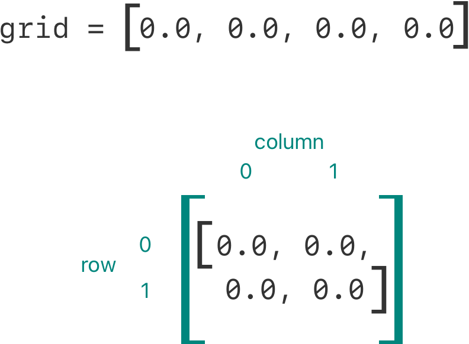
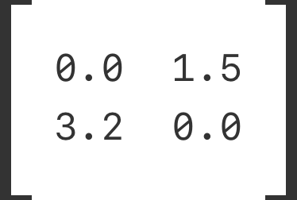

+++
title = "2.12 下标"
date = 2026-09-11T20:00:03+08:00
weight = 12
type = "docs"
description = ""
isCJKLanguage = true
draft = false
+++


> 原文链接: [https://docs.swift.org/latest/documentation/the-swift-programming-language/subscripts/](https://docs.swift.org/latest/documentation/the-swift-programming-language/subscripts/)

# 2.12 下标

访问集合中的元素。

类、结构体和枚举都可以定义*下标*，用它作为访问集合、列表或序列中成员元素的快捷方式。你可以用下标按索引设置和获取值，而不必为设置和获取分别定义方法。例如，你用 `someArray[index]` 访问 `Array` 实例中的元素，用 `someDictionary[key]` 访问 `Dictionary` 实例中的元素。

你可以为同一个类型定义多个下标，具体使用哪个下标重载，会根据你传给下标的索引值类型来选择。下标不限于单一维度，你可以根据需要为自己的自定义类型定义带多个输入参数的下标。

## 下标语法 {#Subscript-Syntax}

下标让你可以在实例名后面的方括号里写一个或多个值，来查询某个类型的实例。它的语法既像实例方法，也像计算属性。下标定义用 `subscript` 关键字书写，像实例方法那样指定一个或多个输入参数和返回类型。与实例方法不同的是，下标可以是读写的，也可以是只读的。这一点通过取值器和设值器来体现，与计算属性完全一样：

```swift
subscript(index: Int) -> Int {
    get {
        // 在这里返回合适的下标值。
    }
    set(newValue) {
        // 在这里执行合适的设置操作。
    }
}
```

`newValue` 的类型与下标的返回值类型相同。和计算属性一样，你也可以不指定设值器的 `(newValue)` 参数；如果你不自己提供，设值器会得到默认参数名 `newValue`。

与只读计算属性一样，去掉 `get` 关键字及其花括号即可简化只读下标的声明：

```swift
subscript(index: Int) -> Int {
    // 在这里返回合适的下标值。
}
```

下面是一个只读下标实现的例子，它定义了一个 `TimesTable` 结构体，用来表示整数的 *n* 倍表：

```swift
struct TimesTable {
    let multiplier: Int
    subscript(index: Int) -> Int {
        return multiplier * index
    }
}
let threeTimesTable = TimesTable(multiplier: 3)
print("six times three is \(threeTimesTable[6])")
// 输出 "six times three is 18"。
```

在这个例子里，创建了一个新的 `TimesTable` 实例来表示三的乘法表：向该结构体的`构造器`传入值 `3`，作为实例 `multiplier` 参数所用的值。

你可以通过调用下标来查询 `threeTimesTable` 实例，如调用 `threeTimesTable[6]` 所示。它请求三的乘法表中的第六项，返回值 `18`，也就是 `3` 乘以 `6`。

> 注意：*n* 倍表基于固定的数学规则，
> 把 `threeTimesTable[someIndex]` 设为新值并不合适，
> 因此 `TimesTable` 的下标被定义为只读下标。

## 下标用法 {#Subscript-Usage}

"下标"的确切含义取决于使用它的上下文。下标通常用作访问集合、列表或序列中成员元素的快捷方式。你完全可以按照自己所写类或结构体的功能，以最合适的方式实现下标。

例如，Swift 的 `Dictionary` 类型实现了一个下标，用来设置和获取 `Dictionary` 实例中存放的值。你可以在下标方括号里提供字典键类型的键，并把字典值类型的值赋给下标，从而给字典设置值：

```swift
var numberOfLegs = ["spider": 8, "ant": 6, "cat": 4]
numberOfLegs["bird"] = 2
```

上面的例子定义了一个名为 `numberOfLegs` 的变量，并用包含三个键值对的字典字面量初始化它。`numberOfLegs` 字典的类型被推断为 `[String: Int]`。创建字典之后，这个例子用下标赋值，向字典中添加了 `String` 类型的键 `"bird"` 和 `Int` 类型的值 `2`。

关于 `Dictionary` 下标的更多内容，参见[访问和修改字典](../2.4-CollectionTypes/#Accessing-and-Modifying-a-Dictionary)。

> 注意：Swift 的 `Dictionary` 类型把它的键值下标
> 实现为接受并返回*可选*类型的下标。
> 对于上面的 `numberOfLegs` 字典，
> 键值下标接受并返回 `Int?` 类型的值，
> 也就是"可选 int"。
> `Dictionary` 类型之所以使用可选下标类型，是为了表示
> 并非每个键都有值，并提供了给某个键赋 `nil` 来删除该键对应值的方式。

## 下标选项 {#Subscript-Options}

下标可以接受任意数量的输入参数，这些输入参数可以是任意类型，下标也可以返回任意类型的值。

与函数一样，下标可以接受数量可变的参数，也可以为参数提供默认值，详见[可变参数](../2.6-Functions/#Variadic-Parameters)和[默认参数值](../2.6-Functions/#Default-Parameter-Values)。不过与函数不同的是，下标不能使用输入输出参数。

一个类或结构体可以根据需要提供任意多个下标实现，使用下标时会根据方括号中值的类型推断应当使用哪一个下标，这称为*下标重载*。

虽然下标最常见的形式是接受单个参数，但如果对你的类型合适，也可以定义带多个参数的下标。下面的例子定义了一个 `Matrix` 结构体，表示由 `Double` 值组成的二维矩阵。`Matrix` 结构体的下标接受两个整数参数：

```swift
struct Matrix {
    let rows: Int, columns: Int
    var grid: [Double]
    init(rows: Int, columns: Int) {
        self.rows = rows
        self.columns = columns
        grid = Array(repeating: 0.0, count: rows * columns)
    }
    func indexIsValid(row: Int, column: Int) -> Bool {
        return row >= 0 && row < rows && column >= 0 && column < columns
    }
    subscript(row: Int, column: Int) -> Double {
        get {
            assert(indexIsValid(row: row, column: column), "Index out of range")
            return grid[(row * columns) + column]
        }
        set {
            assert(indexIsValid(row: row, column: column), "Index out of range")
            grid[(row * columns) + column] = newValue
        }
    }
}
```

`Matrix` 提供了一个构造器，接受名为 `rows` 和 `columns` 的两个参数，并创建一个足够存放 `rows * columns` 个 `Double` 值的数组。矩阵中的每个位置初始值都是 `0.0`。为此，数组的大小和初始单元格值 `0.0` 被传给数组构造器，由它创建并初始化一个大小正确的新数组。这个构造器在[用默认值创建数组](../2.4-CollectionTypes/#Creating-an-Array-with-a-Default-Value)中有更详细的介绍。

你可以向构造器传入合适的行数和列数来构造新的 `Matrix` 实例：

```swift
var matrix = Matrix(rows: 2, columns: 2)
```

上面的例子创建了一个两行两列的新 `Matrix` 实例。这个 `Matrix` 实例的 `grid` 数组实际上就是矩阵按从左上到右下展开后的版本：



把行值和列值用逗号分隔后传入下标，就可以设置矩阵中的值：

```swift
matrix[0, 1] = 1.5
matrix[1, 0] = 3.2
```

这两条语句调用下标的设值器，把 `1.5` 设在矩阵右上方（`row` 为 `0`、`column` 为 `1`），把 `3.2` 设在左下方（`row` 为 `1`、`column` 为 `0`）：



`Matrix` 下标的取值器和设值器都包含一条断言，用来检查下标的 `row` 和 `column` 值是否合法。为便于这些断言，`Matrix` 提供了一个名为 `indexIsValid(row:column:)` 的便利方法，检查请求的 `row` 和 `column` 是否在矩阵范围内：

```swift
func indexIsValid(row: Int, column: Int) -> Bool {
    return row >= 0 && row < rows && column >= 0 && column < columns
}
```

如果你试图访问矩阵边界之外的下标，就会触发断言：

```swift
let someValue = matrix[2, 2]
// 这会触发断言，因为 [2, 2] 超出了矩阵边界。
```

## 类型下标 {#Type-Subscripts}

上面介绍的实例下标是在某个类型的实例上调用的下标。你也可以定义在类型本身上调用的下标，这类下标称为*类型下标*。在 `subscript` 关键字前写 `static` 关键字即表示类型下标。类可以改用 `class` 关键字，以便子类覆盖父类对该下标的实现。下面的例子展示了如何定义和调用类型下标：

```swift
enum Planet: Int {
    case mercury = 1, venus, earth, mars, jupiter, saturn, uranus, neptune
    static subscript(n: Int) -> Planet {
        return Planet(rawValue: n)!
    }
}
let mars = Planet[4]
print(mars)
```
