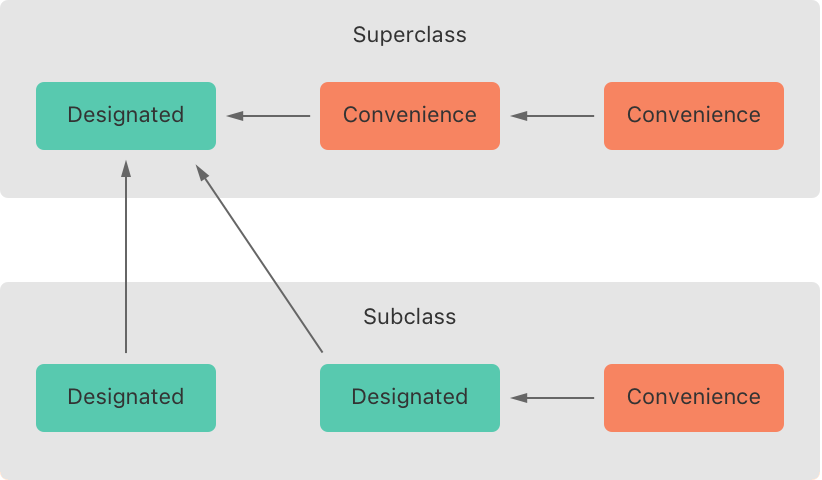
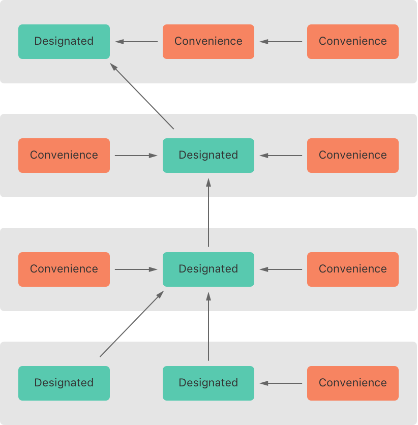
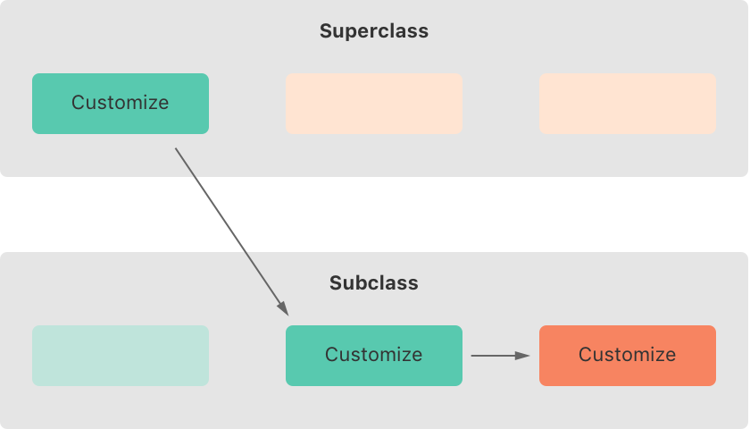
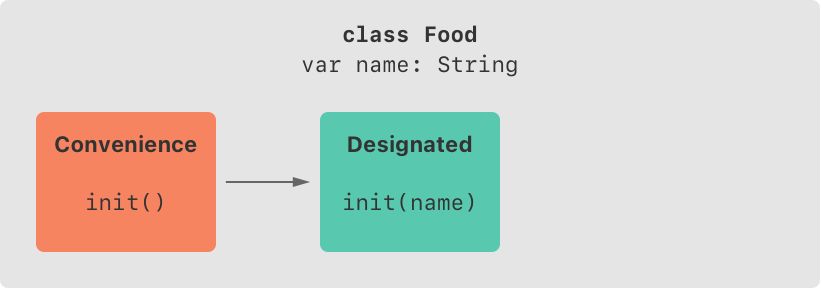
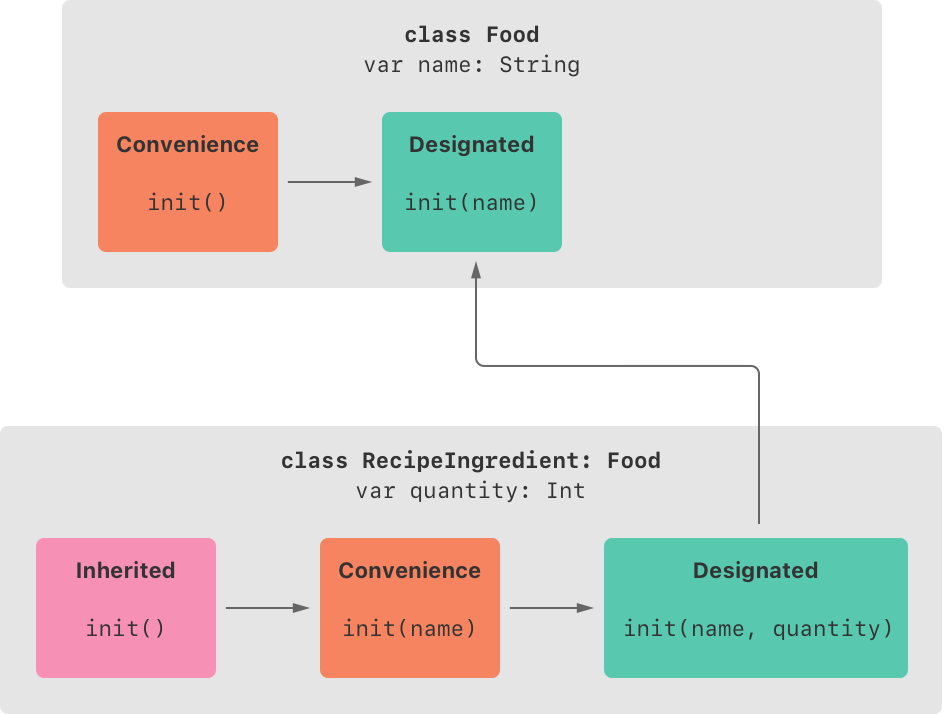
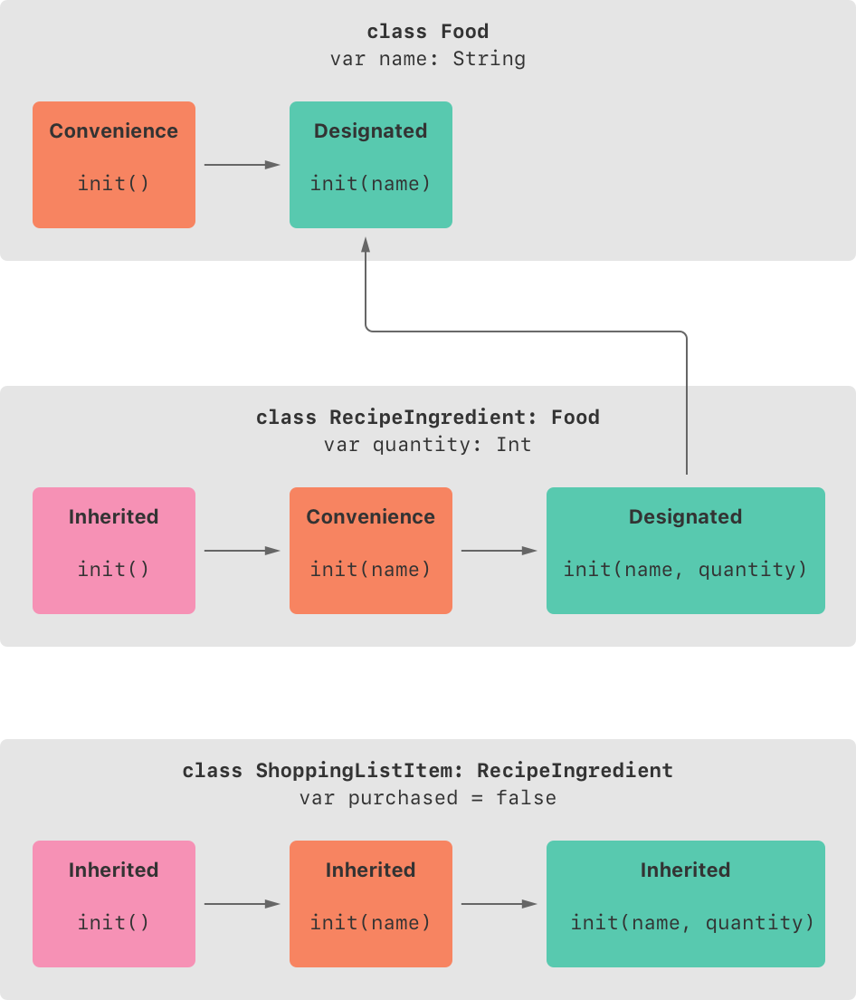
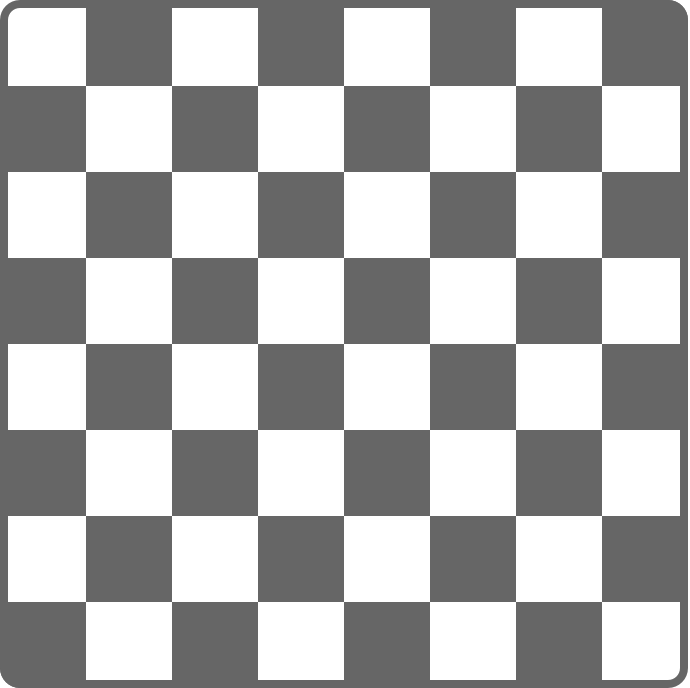

+++
title = "2.14 初始化"
date = 2026-09-11T20:00:03+08:00
weight = 14
type = "docs"
description = ""
isCJKLanguage = true
draft = false
+++


> 原文链接: [https://docs.swift.org/latest/documentation/the-swift-programming-language/initialization/](https://docs.swift.org/latest/documentation/the-swift-programming-language/initialization/)

# 2.14 初始化

为类型的存储属性设置初始值，并执行一次性的准备工作。

*初始化*是为类、结构体或枚举的实例做好使用准备的过程：它涉及为该实例的每个存储属性设置初始值，并执行新实例投入使用前所需的其他设置或初始化工作。

你通过定义*构造器*来实现这一初始化过程。构造器就像一种特殊的方法，可以被调用以创建某个特定类型的新实例。与 Objective-C 的构造器不同，Swift 构造器不返回值，它们的主要职责是确保类型的新实例在第一次被使用之前得到正确的初始化。

类类型的实例还可以实现*反初始化器*，在该类的实例被释放之前执行自定义清理工作。关于反初始化器的更多内容，参见[反初始化](../2.15-Deinitialization/)。

## 为存储属性设置初始值 {#Setting-Initial-Values-for-Stored-Properties}

在创建类或结构体的实例时，类与结构体*必须*把所有存储属性都设为合适的初始值，存储属性不能处于不确定的状态。

你可以在构造器中为存储属性设置初始值，也可以在属性定义中给它赋一个默认属性值。本节会分别介绍这两种做法。

> 注意：当你给存储属性赋默认值，
> 或者在构造器中设置它的值时，
> 该属性的值是直接设置的，
> 不会调用任何属性观察器。

### 构造器 {#Initializers}

*构造器*用于创建某个特定类型的新实例。最简单的形式是像不带参数的实例方法那样，用 `init` 关键字书写：

```swift
init() {
    // 在这里执行一些初始化工作
}
```

下面的例子定义了一个名为 `Fahrenheit` 的新结构体，用来存放以华氏温度表示的温度。`Fahrenheit` 结构体有一个存储属性 `temperature`，类型为 `Double`：

```swift
struct Fahrenheit {
    var temperature: Double
    init() {
        temperature = 32.0
    }
}
var f = Fahrenheit()
print("The default temperature is \(f.temperature)° Fahrenheit")
// 输出 "The default temperature is 32.0° Fahrenheit"。
```

这个结构体定义了一个不带参数的构造器 `init`，它把存储属性 `temperature` 初始化为 `32.0`（水的华氏冰点）。

### 默认属性值 {#Default-Property-Values}

你可以像上面那样在构造器内部设置存储属性的初始值；另一种做法是在属性声明中指定*默认属性值*——在定义属性时就给它赋一个初始值。

> 注意：如果某个属性总是取同一个初始值，
> 就提供默认值，而不是在构造器里设置值。
> 两者的最终结果相同，
> 但默认值能让属性的初始化与它的声明联系得更紧密：
> 构造器会更短、更清晰，
> 你还能从默认值推断出属性的类型。
> 默认值也让你更容易利用默认构造器和构造器继承，
> 详见本章后面的介绍。

把 `temperature` 属性的默认值写在属性声明处，就可以把上面的 `Fahrenheit` 结构体写得更简单：

```swift
struct Fahrenheit {
    var temperature = 32.0
}
```

## 自定义初始化 {#Customizing-Initialization}

你可以用输入参数、可选属性类型，或者在初始化期间给常量属性赋值来定制初始化过程，见下面各节。

### 初始化参数 {#Initialization-Parameters}

你可以在构造器定义中提供*初始化参数*，用来定义定制初始化过程所需值的类型和名字。初始化参数的能力与语法与函数和方法参数相同。

下面的例子定义了一个名为 `Celsius` 的结构体，用来存放以摄氏度表示的温度。`Celsius` 结构体实现了两个自定义构造器 `init(fromFahrenheit:)` 和 `init(fromKelvin:)`，它们用其他温标的值来初始化该结构体的新实例：

```swift
struct Celsius {
    var temperatureInCelsius: Double
    init(fromFahrenheit fahrenheit: Double) {
        temperatureInCelsius = (fahrenheit - 32.0) / 1.8
    }
    init(fromKelvin kelvin: Double) {
        temperatureInCelsius = kelvin - 273.15
    }
}
let boilingPointOfWater = Celsius(fromFahrenheit: 212.0)
// boilingPointOfWater.temperatureInCelsius 是 100.0
let freezingPointOfWater = Celsius(fromKelvin: 273.15)
// freezingPointOfWater.temperatureInCelsius 是 0.0
```

第一个构造器有一个初始化参数，实参标签是 `fromFahrenheit`，参数名是 `fahrenheit`；第二个构造器有一个初始化参数，实参标签是 `fromKelvin`，参数名是 `kelvin`。两个构造器都把各自的唯一实参换算成对应的摄氏温度，并把该值存放在名为 `temperatureInCelsius` 的属性中。

### 参数名与实参标签 {#Parameter-Names-and-Argument-Labels}

与函数和方法参数一样，初始化参数既可以有供构造器体内部使用的参数名，也可以有供调用构造器时使用的实参标签。

不过，构造器在圆括号之前没有像函数和方法那样的标识性函数名。因此，构造器参数的名字和类型在确定应当调用哪个构造器时起着特别重要的作用。正因如此，如果你没有为构造器中的参数提供实参标签，Swift 会为*每个*参数自动提供一个。

下面的例子定义了一个名为 `Color` 的结构体，其中有三个常量属性 `red`、`green` 和 `blue`，用来存放 `0.0` 到 `1.0` 之间的值，表示该颜色中红、绿、蓝的分量。

`Color` 提供了一个构造器，其三个命名恰当的 `Double` 类型参数分别对应红、绿、蓝分量；同时还提供了第二个构造器，只接受一个 `white` 参数，用来为三个颜色分量提供相同的值。

```swift
struct Color {
    let red, green, blue: Double
    init(red: Double, green: Double, blue: Double) {
        self.red   = red
        self.green = green
        self.blue  = blue
    }
    init(white: Double) {
        red   = white
        green = white
        blue  = white
    }
}
```

两个构造器都可以用来创建新的 `Color` 实例，只需为每个构造器参数提供具名值：

```swift
let magenta = Color(red: 1.0, green: 0.0, blue: 1.0)
let halfGray = Color(white: 0.5)
```

注意，不写实参标签就无法调用这些构造器：只要定义了实参标签，调用构造器时就必须使用它们，省略它们会导致编译期错误：

```swift
let veryGreen = Color(0.0, 1.0, 0.0)
// 这会报编译期错误——实参标签是必需的
```

### 不带实参标签的初始化参数 {#Initializer-Parameters-Without-Argument-Labels}

如果你不希望某个初始化参数使用实参标签，就把下划线（`_`）写在它的实参标签位置，以覆盖默认行为。

下面是上面[初始化参数](./#Initialization-Parameters)中 `Celsius` 例子的扩展版本，增加了一个构造器，用已经是摄氏度的 `Double` 值创建新的 `Celsius` 实例：

```swift
struct Celsius {
    var temperatureInCelsius: Double
    init(fromFahrenheit fahrenheit: Double) {
        temperatureInCelsius = (fahrenheit - 32.0) / 1.8
    }
    init(fromKelvin kelvin: Double) {
        temperatureInCelsius = kelvin - 273.15
    }
    init(_ celsius: Double) {
        temperatureInCelsius = celsius
    }
}
let bodyTemperature = Celsius(37.0)
// bodyTemperature.temperatureInCelsius 是 37.0
```

构造器调用 `Celsius(37.0)` 的意图本身就很清楚，不需要实参标签，因此把这个构造器写作 `init(_ celsius: Double)` 是合适的，这样就能通过传入一个不带名字的 `Double` 值来调用它。

### 可选属性类型 {#Optional-Property-Types}

如果你的自定义类型有某个存储属性在逻辑上允许"没有值"——也许是因为它的值无法在初始化期间设定，或者因为它以后可能"没有值"——就用*可选*类型声明该属性。可选类型的属性会自动初始化为 `nil`，表示该属性在初始化期间有意处于"还没有值"的状态。

下面的例子定义了一个名为 `SurveyQuestion` 的类，其中有一个可选的 `String` 属性 `response`：

```swift
class SurveyQuestion {
    var text: String
    var response: String?
    init(text: String) {
        self.text = text
    }
    func ask() {
        print(text)
    }
}
let cheeseQuestion = SurveyQuestion(text: "Do you like cheese?")
cheeseQuestion.ask()
// 输出 "Do you like cheese?"
cheeseQuestion.response = "Yes, I do like cheese."
```

调查问题的回答要等到提问之后才能知道，因此 `response` 属性被声明为 `String?` 类型，也就是"可选 `String`"。当新的 `SurveyQuestion` 实例被初始化时，它会自动被赋予默认值 `nil`，表示"还没有字符串"。

### 在初始化期间给常量属性赋值 {#Assigning-Constant-Properties-During-Initialization}

你可以在初始化过程中的任何时候给常量属性赋值，只要在初始化结束前它已被设定为确定的值即可。常量属性一旦被赋值，就不能再修改。

> 注意：对于类实例，
> 常量属性只能在初始化期间由引入它的那个类修改，
> 子类不能修改它。

你可以把上面的 `SurveyQuestion` 例子改写成用常量属性而不是变量属性来表示问题的 `text`，以表明 `SurveyQuestion` 实例创建之后问题不再改变。即使 `text` 现在是常量，仍然可以在类的构造器中给它赋值：

```swift
class SurveyQuestion {
    let text: String
    var response: String?
    init(text: String) {
        self.text = text
    }
    func ask() {
        print(text)
    }
}
let beetsQuestion = SurveyQuestion(text: "How about beets?")
beetsQuestion.ask()
// 输出 "How about beets?"
beetsQuestion.response = "I also like beets. (But not with cheese.)"
```

## 默认构造器 {#Default-Initializers}

对于为所有属性都提供了默认值、且自身没有提供至少一个构造器的任何结构体或类，Swift 都会提供一个*默认构造器*。默认构造器只是创建一个新实例，其所有属性都被设为其默认值。

下面这个例子定义了一个名为 `ShoppingListItem` 的类，它封装购物清单中某个商品的名称、数量和购买状态：

```swift
class ShoppingListItem {
    var name: String?
    var quantity = 1
    var purchased = false
}
var item = ShoppingListItem()
```

由于 `ShoppingListItem` 类的所有属性都有默认值，而且它是一个没有父类的基类，`ShoppingListItem` 会自动获得一个默认构造器实现：创建新实例时把所有属性都设为其默认值。（`name` 属性是可选的 `String` 属性，因此即使代码中没有写出，它也会自动获得默认值 `nil`。）上面的例子用 `ShoppingListItem` 类的默认构造器，以构造器语法 `ShoppingListItem()` 创建该类的新实例，并把这个新实例赋给名为 `item` 的变量。

### 结构体类型的逐成员构造器 {#Memberwise-Initializers-for-Structure-Types}

如果结构体类型没有定义任何自定义构造器，它会自动获得一个*逐成员构造器*。与默认构造器不同，即使结构体有不带默认值的存储属性，它也会获得逐成员构造器。

逐成员构造器是初始化新结构体实例各成员属性的简写方式：新实例各属性的初始值可以按名字传给逐成员构造器。

下面的例子定义了一个名为 `Size` 的结构体，它有两个属性 `width` 和 `height`，由于都赋了默认值 `0.0`，两个属性都被推断为 `Double` 类型。

`Size` 结构体会自动获得 `init(width:height:)` 逐成员构造器，你可以用它初始化新的 `Size` 实例：

```swift
struct Size {
    var width = 0.0, height = 0.0
}
let twoByTwo = Size(width: 2.0, height: 2.0)
```

调用逐成员构造器时，可以为有默认值的属性省略取值。在上面的例子里，`Size` 结构体的 `height` 和 `width` 属性都有默认值，你可以省略其中一个或两个都省略，构造器会为省略的部分使用默认值。例如：

```swift
let zeroByTwo = Size(height: 2.0)
print(zeroByTwo.width, zeroByTwo.height)
// 输出 "0.0 2.0"。

let zeroByZero = Size()
print(zeroByZero.width, zeroByZero.height)
// 输出 "0.0 0.0"。
```

## 值类型的构造器委托 {#Initializer-Delegation-for-Value-Types}

构造器可以调用其他构造器来完成实例初始化的一部分工作，这一过程称为*构造器委托*，可以避免在多个构造器之间重复代码。

构造器委托如何工作、允许哪些形式的委托，对值类型和类类型来说规则不同。值类型（结构体和枚举）不支持继承，因此它们的构造器委托过程相对简单：它们只能委托给自己提供的另一个构造器。而类可以继承其他类，详见[继承](../2.13-Inheritance/)，这意味着类还要额外负责确保在初始化期间为所有继承来的存储属性分配合适的值。这些责任在下文[类的继承与初始化](./#Class-Inheritance-and-Initialization)中介绍。

对于值类型，你在编写自定义构造器时用 `self.init` 来引用同一值类型中的其他构造器，并且只能在构造器内部调用 `self.init`。

注意，如果你为某个值类型定义了自定义构造器，就不再能使用该类型的默认构造器（如果是结构体，也包括逐成员构造器）。这一限制可以避免这样的情况：有人使用自动生成的构造器，从而绕过更复杂的构造器所提供的必要初始化工作。

> 注意：如果你希望自定义值类型既能用默认构造器和逐成员构造器初始化，
> 又能用你自己的自定义构造器初始化，
> 就把自定义构造器写在扩展里，
> 而不是作为值类型原始实现的一部分。
> 更多内容参见[扩展](../2.22-Extensions/)。

下面的例子定义了一个自定义 `Rect` 结构体来表示几何矩形，它还需要两个辅助结构体 `Size` 和 `Point`，两者的所有属性都有默认值 `0.0`：

```swift
struct Size {
    var width = 0.0, height = 0.0
}
struct Point {
    var x = 0.0, y = 0.0
}
```

下面这个 `Rect` 结构体可以用三种方式之一初始化——使用其默认的零值 `origin` 和 `size` 属性值、提供指定的原点和尺寸，或者提供指定的中心点和尺寸。这些初始化选项由 `Rect` 结构体定义中的三个自定义构造器表示：

```swift
struct Rect {
    var origin = Point()
    var size = Size()
    init() {}
    init(origin: Point, size: Size) {
        self.origin = origin
        self.size = size
    }
    init(center: Point, size: Size) {
        let originX = center.x - (size.width / 2)
        let originY = center.y - (size.height / 2)
        self.init(origin: Point(x: originX, y: originY), size: size)
    }
}
```

第一个 `Rect` 构造器 `init()` 在功能上与该结构体在没有自定义构造器时会得到的默认构造器相同：它的语句体是空的，用一对空花括号 `{}` 表示。调用它会返回一个 `Rect` 实例，其 `origin` 和 `size` 属性分别被初始化为属性定义中的默认值 `Point(x: 0.0, y: 0.0)` 和 `Size(width: 0.0, height: 0.0)`：

```swift
let basicRect = Rect()
// basicRect 的原点是 (0.0, 0.0)，尺寸是 (0.0, 0.0)
```

第二个 `Rect` 构造器 `init(origin:size:)` 在功能上与该结构体在没有自定义构造器时会得到的逐成员构造器相同：它只是把 `origin` 和 `size` 实参值分别赋给相应的存储属性：

```swift
let originRect = Rect(origin: Point(x: 2.0, y: 2.0),
    size: Size(width: 5.0, height: 5.0))
// originRect 的原点是 (2.0, 2.0)，尺寸是 (5.0, 5.0)
```

第三个 `Rect` 构造器 `init(center:size:)` 稍微复杂一些：它先根据 `center` 点和 `size` 值算出合适的原点，然后调用（*委托*给）`init(origin:size:)` 构造器，由后者把新的原点和尺寸值存入相应的属性：

```swift
let centerRect = Rect(center: Point(x: 4.0, y: 4.0),
    size: Size(width: 3.0, height: 3.0))
// centerRect 的原点是 (2.5, 2.5)，尺寸是 (3.0, 3.0)
```

`init(center:size:)` 构造器本来也可以自己把新的 `origin` 和 `size` 值赋给相应的属性，但利用一个已经提供该功能的现有构造器会更方便，意图也更清晰。

> 注意：关于不用自己定义
> `init()` 和 `init(origin:size:)` 构造器来写这个例子的另一种方式，
> 参见[扩展](../2.22-Extensions/)。

## 类的继承与初始化 {#Class-Inheritance-and-Initialization}

类中所有存储属性——包括从父类继承来的属性——*必须*在初始化期间被赋以初始值。

为帮助确保所有存储属性都获得初始值，Swift 为类类型定义了两种构造器：指定构造器和便利构造器。

### 指定构造器与便利构造器 {#Designated-Initializers-and-Convenience-Initializers}

*指定构造器*是类的主要构造器。指定构造器完整地初始化该类引入的所有属性，并调用合适的父类构造器，把初始化过程沿着父类链继续向上推进。

类的指定构造器通常很少，一个类只有一个指定构造器也很常见。指定构造器是初始化发生的"漏斗"入口，也是初始化过程沿父类链向上继续的通道。

每个类都必须至少有一个指定构造器。在某些情况下，这一要求通过从父类继承一个或多个指定构造器来满足，详见下文[构造器的自动继承](./#Automatic-Initializer-Inheritance)。

*便利构造器*是类的次要、辅助性构造器。你可以定义便利构造器来调用同一个类中的指定构造器，并把该指定构造器的部分参数设为默认值；也可以定义便利构造器来为某种特定用途或输入值类型创建该类的实例。

如果你的类不需要便利构造器，就不必提供。凡是"为常见初始化模式提供快捷方式"能节省时间、或能让类的初始化意图更清晰时，就创建便利构造器。

### 指定构造器与便利构造器的语法 {#Syntax-for-Designated-and-Convenience-Initializers}

类的指定构造器写法与值类型的简单构造器相同：

```swift
init(<#parameters#>) {
   <#statements#>
}
```

便利构造器写法风格相同，只是在 `init` 关键字之前加一个 `convenience` 修饰符，用空格分隔：

```swift
convenience init(<#parameters#>) {
   <#statements#>
}
```

### 类类型的构造器委托 {#Initializer-Delegation-for-Class-Types}

为了简化指定构造器与便利构造器之间的关系，Swift 对构造器之间的委托调用规定了三条规则：

- **规则 1**：指定构造器必须调用其直接父类的指定构造器。

- **规则 2**：便利构造器必须调用*同一个*类中的另一个构造器。

- **规则 3**：便利构造器最终必须调用一个指定构造器。

一个便于记忆的说法是：

- 指定构造器必须始终向*上*委托。
- 便利构造器必须始终*横向*委托。

下图展示了这些规则：



图中，父类有一个指定构造器和两个便利构造器：一个便利构造器调用另一个便利构造器，后者再调用那个唯一的指定构造器，这满足上面的规则 2 和规则 3。父类本身没有更上层的父类，因此规则 1 不适用。

图中的子类有两个指定构造器和一个便利构造器：便利构造器必须调用那两个指定构造器之一，因为它只能调用同一个类中的另一个构造器，这满足规则 2 和规则 3；两个指定构造器都必须调用父类中那个唯一的指定构造器，以满足规则 1。

> 注意：这些规则不影响你的类的使用者*创建*各种类的实例的方式。
> 上图中的任何构造器都可以用来创建
> 它所属类的一个完全初始化的实例。
> 这些规则只影响你如何编写该类构造器的实现。

下图展示了四个类构成的更复杂的类层级，说明该层级中的指定构造器如何充当类初始化的"漏斗"，简化链条中各类之间的相互关系：



### 两阶段初始化 {#Two-Phase-Initialization}

Swift 中的类初始化是一个两阶段过程。第一阶段，由引入各个存储属性的类为它们赋初始值；一旦每个存储属性的初始状态都已确定，第二阶段就开始，每个类都有机会进一步定制自己的存储属性，之后新实例才被视为可以使用。

采用两阶段初始化过程既保证了初始化的安全性，又给类层级中的每个类留出了完全的灵活性。两阶段初始化可以防止在属性初始化完成之前访问属性值，也可以防止属性值被另一个构造器意外改成别的值。

> 注意：Swift 的两阶段初始化过程与 Objective-C 的初始化类似，
> 主要区别在于第一阶段中
> Objective-C 会给每个属性赋零值或空值（例如 `0` 或 `nil`）。
> Swift 的初始化流程更灵活：
> 它让你设置自定义的初始值，
> 也能处理那些 `0` 或 `nil` 并非合法默认值的类型。

Swift 编译器会执行四项有用的安全检查，以确保两阶段初始化不出错误地完成：

- **安全检查 1**：指定构造器必须确保其类引入的所有属性都已初始化，然后才能向上委托给父类构造器。

如前所述，只有当对象所有存储属性的初始状态都已知时，它的内存才被视为完全初始化。为满足这条规则，指定构造器必须确保自己所有的属性都已初始化，然后才能沿链条向上交接。

- **安全检查 2**：指定构造器必须先向上委托给父类构造器，然后才能给继承来的属性赋值；否则，该指定构造器赋的新值会被父类在自身初始化过程中覆盖掉。

- **安全检查 3**：便利构造器必须先委托给另一个构造器，然后才能给*任何*属性赋值（包括同一个类定义的属性）；否则，该便利构造器赋的新值会被本类的指定构造器覆盖掉。

- **安全检查 4**：在初始化第一阶段完成之前，构造器不能调用任何实例方法、读取任何实例属性的值，也不能把 `self` 当作值来引用。

类实例只有在第一阶段结束之后才完全有效。只有当类实例在第一阶段结束时被确认有效，才能访问属性、调用方法。

基于上述四项安全检查，两阶段初始化的过程如下：

**第一阶段**

- 在类上调用一个指定构造器或便利构造器。
- 为该类的新实例分配内存，此时内存尚未初始化。
- 该类的指定构造器确认该类引入的所有存储属性都有值，这些存储属性的内存现在已初始化。
- 该指定构造器把工作交接给父类构造器，由它对自己的存储属性执行同样的任务。
- 这一过程沿类继承链一直向上，直到抵达链条顶端。
- 抵达链条顶端、且链条中最后的类确认其所有存储属性都有值之后，实例的内存被视为完全初始化，第一阶段结束。

**第二阶段**

- 从链条顶端向下回溯，链条中的每个指定构造器都有机会进一步定制实例。此时构造器可以访问 `self`，修改它的属性、调用它的实例方法等。
- 最后，链条中的任何便利构造器都有机会定制实例并与 `self` 交互。

下面是一个假想的子类与父类初始化调用中第一阶段的样子：


在这个例子里，初始化从调用子类的一个便利构造器开始；此时便利构造器还不能修改任何属性，它横向委托给同一个类中的一个指定构造器。

按照安全检查 1，该指定构造器确保子类的所有属性都有值，然后调用父类的指定构造器，把初始化沿链条继续向上传递。

父类的指定构造器确保父类的所有属性都有值。由于没有更上层的父类需要初始化，因此无需继续委托。

父类所有属性都有初始值之后，它的内存就被视为完全初始化，第一阶段结束。

同一次初始化调用中第二阶段的样子如下：



此时父类的指定构造器有机会进一步定制实例（当然也可以不做）。

父类的指定构造器完成之后，子类的指定构造器可以进行额外的定制（同样也可以不做）。

最后，子类的指定构造器完成之后，最初被调用的便利构造器可以进行额外的定制。

### 构造器的继承与重写 {#Initializer-Inheritance-and-Overriding}

与 Objective-C 的子类不同，Swift 的子类默认不继承父类的构造器。这一做法可以避免这样的情况：父类中一个简单的构造器被子类继承后，被用来创建该子类的实例，而该实例并未被完整、正确地初始化。

> 注意：在某些情况下父类构造器*会*被继承，
> 但只有在安全且合适的时候才会如此。
> 更多内容参见下文[构造器的自动继承](./#Automatic-Initializer-Inheritance)。

如果你希望自定义子类呈现出与父类相同的一个或多个构造器，可以在子类中提供这些构造器的自定义实现。

当你编写的子类构造器与父类的*指定*构造器匹配时，你实际上是在提供对该指定构造器的覆盖，因此必须在子类构造器定义之前写 `override` 修饰符——即使你覆盖的是自动提供的默认构造器也是如此，详见[默认构造器](./#Default-Initializers)。

与被覆盖的属性、方法或下标一样，`override` 修饰符会让 Swift 检查父类是否存在可被覆盖的匹配指定构造器，并验证你的覆盖构造器参数是否按预期指定。

> 注意：覆盖父类的指定构造器时总要写 `override` 修饰符，
> 即使子类对该构造器的实现是一个便利构造器也是如此。

反过来，如果你编写的子类构造器与父类的*便利*构造器匹配，那么按照上文[类类型的构造器委托](./#Initializer-Delegation-for-Class-Types)中的规则，父类的这个便利构造器永远不能被你的子类直接调用，因此你的子类（严格来说）并不是在提供对父类构造器的覆盖。因此，在为父类便利构造器提供匹配实现时，不需要写 `override` 修饰符。

下面的例子定义了一个名为 `Vehicle` 的基类。它声明了一个名为 `numberOfWheels` 的存储属性，默认 `Int` 值为 `0`；`numberOfWheels` 属性被一个名为 `description` 的计算属性用来生成描述车辆特征的 `String`：

```swift
class Vehicle {
    var numberOfWheels = 0
    var description: String {
        return "\(numberOfWheels) wheel(s)"
    }
}
```

`Vehicle` 类为其唯一的存储属性提供了默认值，自身没有提供任何自定义构造器，因此如[默认构造器](./#Default-Initializers)所述，它会自动获得一个默认构造器。默认构造器（在可用时）始终是类的指定构造器，可以用来创建 `numberOfWheels` 为 `0` 的新 `Vehicle` 实例：

```swift
let vehicle = Vehicle()
print("Vehicle: \(vehicle.description)")
// Vehicle: 0 wheel(s)
```

下一个例子定义了 `Vehicle` 的一个子类 `Bicycle`：

```swift
class Bicycle: Vehicle {
    override init() {
        super.init()
        numberOfWheels = 2
    }
}
```

`Bicycle` 子类定义了自定义指定构造器 `init()`。这个指定构造器与 `Bicycle` 父类的一个指定构造器匹配，因此 `Bicycle` 的这个构造器版本被标记了 `override` 修饰符。

`Bicycle` 的 `init()` 构造器先调用 `super.init()`，也就是调用 `Bicycle` 的父类 `Vehicle` 的默认构造器。这确保继承来的 `numberOfWheels` 属性在 `Bicycle` 有机会修改它之前，先由 `Vehicle` 完成初始化。调用 `super.init()` 之后，`numberOfWheels` 原来的值被替换为新值 `2`。

如果你创建 `Bicycle` 的实例，就可以调用它继承来的 `description` 计算属性，看看 `numberOfWheels` 属性是如何被更新的：

```swift
let bicycle = Bicycle()
print("Bicycle: \(bicycle.description)")
// Bicycle: 2 wheel(s)
```

如果子类构造器在初始化过程的第二阶段不做任何定制，而父类有一个同步的、零参数的指定构造器，那么在给子类的所有存储属性赋值之后，你可以省略对 `super.init()` 的调用。如果父类的构造器是异步的，你需要显式写出 `await super.init()`。

下面这个例子定义了 `Vehicle` 的另一个子类 `Hoverboard`：在它的构造器中，`Hoverboard` 类只设置自己的 `color` 属性，并且没有显式调用 `super.init()`，而是依赖对父类构造器的隐式调用来完成整个过程。

```swift
class Hoverboard: Vehicle {
    var color: String
    init(color: String) {
        self.color = color
        // 这里隐式调用了 super.init()
    }
    override var description: String {
        return "\(super.description) in a beautiful \(color)"
    }
}
```

`Hoverboard` 的实例使用 `Vehicle` 构造器提供的默认轮子数量。

```swift
let hoverboard = Hoverboard(color: "silver")
print("Hoverboard: \(hoverboard.description)")
// Hoverboard: 0 wheel(s) in a beautiful silver
```

> 注意：子类可以在初始化期间修改继承来的变量属性，
> 但不能修改继承来的常量属性。

### 自动构造器继承 {#Automatic-Initializer-Inheritance}

如前所述，子类默认不继承父类的构造器；不过在满足某些条件时，父类构造器*会*被自动继承。实践中这意味着，在许多常见场景下你不需要编写构造器覆盖，只要在安全的情况下就能以最小的代价继承父类构造器。

假设你为子类引入的新属性都提供了默认值，那么下列两条规则适用：

- **规则 1**：如果你的子类没有定义任何指定构造器，它会自动继承父类所有的指定构造器。

- **规则 2**：如果你的子类提供了父类*所有*指定构造器的实现——无论是按规则 1 继承而来，还是在定义中自行提供——那么它会自动继承父类所有的便利构造器。

即使你的子类还添加了更多便利构造器，这两条规则依然适用。

> 注意：为满足规则 2，
> 子类可以把父类的指定构造器实现为子类的便利构造器。

### 指定构造器与便利构造器实战 {#Designated-and-Convenience-Initializers-in-Action}

下面的例子展示了指定构造器、便利构造器和构造器自动继承的实际运用。它定义了一个由 `Food`、`RecipeIngredient` 和 `ShoppingListItem` 三个类构成的层级，并演示它们的构造器如何相互作用。

该层级的基类名为 `Food`，是一个封装食物名称的简单类。`Food` 类引入一个名为 `name` 的 `String` 属性，并提供两个构造器用于创建 `Food` 实例：

```swift
class Food {
    var name: String
    init(name: String) {
        self.name = name
    }
    convenience init() {
        self.init(name: "[Unnamed]")
    }
}
```

下图展示了 `Food` 类的构造器链条：



类没有默认的逐成员构造器，因此 `Food` 类提供了一个带单个 `name` 实参的指定构造器，可以用它创建具有特定名称的新 `Food` 实例：

```swift
let namedMeat = Food(name: "Bacon")
// namedMeat 的名称是 "Bacon"
```

`Food` 类中的 `init(name: String)` 构造器是作为*指定*构造器提供的，因为它确保新 `Food` 实例的所有存储属性都被完整初始化。`Food` 类没有父类，因此 `init(name: String)` 构造器不需要调用 `super.init()` 来完成初始化。

`Food` 类还提供了一个不带实参的*便利*构造器 `init()`：它通过把 `name` 值设为 `[Unnamed]` 横向委托给 `Food` 类的 `init(name: String)`，为新食物提供一个默认的占位名称：

```swift
let mysteryMeat = Food()
// mysteryMeat 的名称是 "[Unnamed]"
```

层级中的第二个类是 `Food` 的子类 `RecipeIngredient`，它为烹饪食谱中的一种配料建模。除继承来的 `name` 属性之外，它还引入一个名为 `quantity` 的 `Int` 属性，并定义两个构造器用于创建 `RecipeIngredient` 实例：

```swift
class RecipeIngredient: Food {
    var quantity: Int
    init(name: String, quantity: Int) {
        self.quantity = quantity
        super.init(name: name)
    }
    override convenience init(name: String) {
        self.init(name: name, quantity: 1)
    }
}
```

下图展示了 `RecipeIngredient` 类的构造器链条：



`RecipeIngredient` 类只有一个指定构造器 `init(name: String, quantity: Int)`，可以用它填充新 `RecipeIngredient` 实例的所有属性。该构造器先把传入的 `quantity` 实参赋给 `quantity` 属性（这是 `RecipeIngredient` 引入的唯一新属性），然后向上委托给 `Food` 类的 `init(name: String)` 构造器。这一过程满足了上文[两阶段初始化](./#Two-Phase-Initialization)中的安全检查 1。

`RecipeIngredient` 还定义了一个便利构造器 `init(name: String)`，用来只按名称创建 `RecipeIngredient` 实例：它假定任何未显式给出数量的 `RecipeIngredient` 实例数量都是 `1`。这个便利构造器的存在让创建 `RecipeIngredient` 实例更快、更方便，也避免了在创建多个"数量为一"的实例时重复代码。它只是横向委托给本类的指定构造器，并传入数量值 `1`。

`RecipeIngredient` 提供的 `init(name: String)` 便利构造器与 `Food` 中的 `init(name: String)`*指定*构造器参数相同。由于这个便利构造器覆盖了父类的一个指定构造器，它必须标记 `override` 修饰符（见[构造器的继承与覆盖](./#Initializer-Inheritance-and-Overriding)）。

尽管 `RecipeIngredient` 是把 `init(name: String)` 作为便利构造器提供的，它仍然提供了父类所有指定构造器的实现，因此 `RecipeIngredient` 也会自动继承父类所有的便利构造器。

在这个例子里，`RecipeIngredient` 的父类是 `Food`，它只有一个名为 `init()` 的便利构造器，因此这个构造器被 `RecipeIngredient` 继承。继承来的 `init()` 版本行为与 `Food` 版本完全相同，区别只是它委托给 `RecipeIngredient` 版本的 `init(name: String)`，而不是 `Food` 版本。

这三个构造器都可以用来创建新的 `RecipeIngredient` 实例：

```swift
let oneMysteryItem = RecipeIngredient()
let oneBacon = RecipeIngredient(name: "Bacon")
let sixEggs = RecipeIngredient(name: "Eggs", quantity: 6)
```

层级中的第三个、也是最后一个类是 `RecipeIngredient` 的子类 `ShoppingListItem`，它为购物清单中出现的食谱配料建模。

购物清单中的每一项一开始都是"未购买"状态，为了表示这一点，`ShoppingListItem` 引入一个名为 `purchased` 的布尔属性，默认值为 `false`。它还添加了一个计算属性 `description`，提供 `ShoppingListItem` 实例的文本描述：

```swift
class ShoppingListItem: RecipeIngredient {
    var purchased = false
    var description: String {
        var output = "\(quantity) x \(name)"
        output += purchased ? " ✔" : " ✘"
        return output
    }
}
```

> 注意：`ShoppingListItem` 没有定义构造器来为 `purchased`
> 提供初始值，
> 因为（这里建模的）购物清单项总是从未购买状态开始。

由于它为引入的所有属性都提供了默认值、且自身没有定义任何构造器，`ShoppingListItem` 会自动继承父类*所有*的指定构造器和便利构造器。

下图展示了三个类整体的构造器链条：



三个继承来的构造器都可以用来创建新的 `ShoppingListItem` 实例：

```swift
var breakfastList = [
    ShoppingListItem(),
    ShoppingListItem(name: "Bacon"),
    ShoppingListItem(name: "Eggs", quantity: 6),
]
breakfastList[0].name = "Orange juice"
breakfastList[0].purchased = true
for item in breakfastList {
    print(item.description)
}
// 1 x Orange juice ✔
// 1 x Bacon ✘
// 6 x Eggs ✘
```

这里用包含三个新 `ShoppingListItem` 实例的数组字面量创建了一个名为 `breakfastList` 的新数组，数组类型被推断为 `[ShoppingListItem]`。数组创建后，开头那个 `ShoppingListItem` 的名称从 `"[Unnamed]"` 改为 `"Orange juice"`，并被标记为已购买。打印数组中每一项的描述，可以看到它们的默认状态都按预期设置好了。

## 可失败构造器 {#Failable-Initializers}

有时定义一个初始化可能失败的类、结构体或枚举会很有用：这种失败可能由无效的初始化参数值、缺少必需的外部资源，或者其他导致初始化无法成功的条件触发。

为了应对可能失败的初始化条件，可以在类、结构体或枚举定义中定义一个或多个可失败构造器。在 `init` 关键字后面加一个问号（`init?`）就表示可失败构造器。

> 注意：你不能定义参数类型和名字都相同的
> 可失败构造器与非可失败构造器。

可失败构造器创建它所初始化类型的*可选*值。在可失败构造器中写 `return nil`，就表示在这一点可以触发初始化失败。

> 注意：严格来说，构造器不返回值；
> 它们的职责是确保初始化结束时
> `self` 已被完整、正确地初始化。
> 虽然你写 `return nil` 来触发初始化失败，
> 但并不使用 `return` 关键字来表示初始化成功。

例如，数值类型转换就实现了可失败构造器。要确保数值类型之间的转换精确保留原值，可以使用 `init(exactly:)` 构造器；如果转换无法保留原值，该构造器就失败。

```swift
let wholeNumber: Double = 12345.0
let pi = 3.14159

if let valueMaintained = Int(exactly: wholeNumber) {
    print("\(wholeNumber) conversion to Int maintains value of \(valueMaintained)")
}
// 输出 "12345.0 conversion to Int maintains value of 12345"。

let valueChanged = Int(exactly: pi)
// valueChanged 的类型是 Int?，而不是 Int

if valueChanged == nil {
    print("\(pi) conversion to Int doesn't maintain value")
}
// 输出 "3.14159 conversion to Int doesn't maintain value"。
```

下面的例子定义了一个名为 `Animal` 的结构体，其中有一个 `String` 类型的常量属性 `species`。`Animal` 结构体还定义了一个带单个 `species` 参数的可失败构造器：它检查传给构造器的 `species` 值是否是空字符串，如果是空字符串就触发初始化失败，否则设置 `species` 属性的值并初始化成功：

```swift
struct Animal {
    let species: String
    init?(species: String) {
        if species.isEmpty { return nil }
        self.species = species
    }
}
```

你可以用这个可失败构造器尝试初始化新的 `Animal` 实例，并检查初始化是否成功：

```swift
let someCreature = Animal(species: "Giraffe")
// someCreature 的类型是 Animal?，而不是 Animal

if let giraffe = someCreature {
    print("An animal was initialized with a species of \(giraffe.species)")
}
// 输出 "An animal was initialized with a species of Giraffe"。
```

如果你把一个空字符串传给可失败构造器的 `species` 参数，该构造器会触发初始化失败：

```swift
let anonymousCreature = Animal(species: "")
// anonymousCreature 的类型是 Animal?，而不是 Animal

if anonymousCreature == nil {
    print("The anonymous creature couldn't be initialized")
}
// 输出 "The anonymous creature couldn't be initialized"。
```

> 注意：检查空字符串值（例如 `""` 而不是 `"Giraffe"`）
> 与检查 `nil` 以表示*可选* `String` 值缺失并不相同。
> 在上面的例子里，空字符串（`""`）是一个合法的非可选 `String`；
> 不过让动物的 `species` 属性取空字符串并不合适。
> 为了对这种限制建模，
> 该可失败构造器在遇到空字符串时触发初始化失败。

### 枚举的可失败构造器 {#Failable-Initializers-for-Enumerations}

你可以用可失败构造器根据一个或多个参数选择合适的枚举成员；如果提供的参数与任何合适的枚举成员都不匹配，构造器就可以失败。

下面的例子定义了一个名为 `TemperatureUnit` 的枚举，有三种可能状态（`kelvin`、`celsius` 和 `fahrenheit`），并用一个可失败构造器为表示温度符号的 `Character` 值找到合适的枚举成员：

```swift
enum TemperatureUnit {
    case kelvin, celsius, fahrenheit
    init?(symbol: Character) {
        switch symbol {
        case "K":
            self = .kelvin
        case "C":
            self = .celsius
        case "F":
            self = .fahrenheit
        default:
            return nil
        }
    }
}
```

你可以用这个可失败构造器为三种可能状态选择合适的枚举成员，并在参数不匹配任何状态时让初始化失败：

```swift
let fahrenheitUnit = TemperatureUnit(symbol: "F")
if fahrenheitUnit != nil {
    print("This is a defined temperature unit, so initialization succeeded.")
}
// 输出 "This is a defined temperature unit, so initialization succeeded."。

let unknownUnit = TemperatureUnit(symbol: "X")
if unknownUnit == nil {
    print("This isn't a defined temperature unit, so initialization failed.")
}
// 输出 "This isn't a defined temperature unit, so initialization failed."。
```

### 带原始值的枚举的可失败构造器 {#Failable-Initializers-for-Enumerations-with-Raw-Values}

带原始值的枚举会自动获得一个可失败构造器 `init?(rawValue:)`：它接受一个名为 `rawValue`、类型为相应原始值类型的参数，并选出匹配的枚举成员；如果不存在匹配的值，就触发初始化失败。

你可以把上面的 `TemperatureUnit` 例子改写成使用 `Character` 类型的原始值，并利用 `init?(rawValue:)` 构造器：

```swift
enum TemperatureUnit: Character {
    case kelvin = "K", celsius = "C", fahrenheit = "F"
}

let fahrenheitUnit = TemperatureUnit(rawValue: "F")
if fahrenheitUnit != nil {
    print("This is a defined temperature unit, so initialization succeeded.")
}
// 输出 "This is a defined temperature unit, so initialization succeeded."。

let unknownUnit = TemperatureUnit(rawValue: "X")
if unknownUnit == nil {
    print("This isn't a defined temperature unit, so initialization failed.")
}
// 输出 "This isn't a defined temperature unit, so initialization failed."。
```

### 初始化失败的传播 {#Propagation-of-Initialization-Failure}

类、结构体或枚举的可失败构造器可以横向委托给同一个类、结构体或枚举中的另一个可失败构造器；同样，子类的可失败构造器可以向上委托给父类的可失败构造器。

无论哪种情况，如果你委托到的构造器导致初始化失败，整个初始化过程会立即失败，不会再执行后面的初始化代码。

> 注意：可失败构造器也可以委托给非可失败构造器。
> 如果你需要给一个本身不会失败的既有初始化过程
> 增加可能失败的状态，就可以采用这种做法。

下面的例子定义了 `Product` 的一个子类 `CartItem`，它为在线购物车中的一件商品建模：`CartItem` 引入一个名为 `quantity` 的存储常量属性，并确保该属性的值始终至少为 `1`：

```swift
class Product {
    let name: String
    init?(name: String) {
        if name.isEmpty { return nil }
        self.name = name
    }
}

class CartItem: Product {
    let quantity: Int
    init?(name: String, quantity: Int) {
        if quantity < 1 { return nil }
        self.quantity = quantity
        super.init(name: name)
    }
}
```

`CartItem` 的可失败构造器先验证收到的 `quantity` 值是否大于等于 `1`：如果数量无效，整个初始化过程立即失败，不再执行后面的初始化代码。同样，`Product` 的可失败构造器会检查 `name` 值；如果 `name` 是空字符串，初始化过程也立即失败。

如果你用非空名称和大于等于 `1` 的数量创建 `CartItem` 实例，初始化就会成功：

```swift
if let twoSocks = CartItem(name: "sock", quantity: 2) {
    print("Item: \(twoSocks.name), quantity: \(twoSocks.quantity)")
}
// 输出 "Item: sock, quantity: 2"。
```

如果你试图用数量 `0` 创建 `CartItem` 实例，`CartItem` 的构造器会导致初始化失败：

```swift
if let zeroShirts = CartItem(name: "shirt", quantity: 0) {
    print("Item: \(zeroShirts.name), quantity: \(zeroShirts.quantity)")
} else {
    print("Unable to initialize zero shirts")
}
// 输出 "Unable to initialize zero shirts"。
```

同样，如果你试图用空的 `name` 值创建 `CartItem` 实例，父类 `Product` 的构造器会导致初始化失败：

```swift
if let oneUnnamed = CartItem(name: "", quantity: 1) {
    print("Item: \(oneUnnamed.name), quantity: \(oneUnnamed.quantity)")
} else {
    print("Unable to initialize one unnamed product")
}
// 输出 "Unable to initialize one unnamed product"。
```

### 重写可失败构造器 {#Overriding-a-Failable-Initializer}

你可以像覆盖其他构造器那样，在子类中覆盖父类的可失败构造器。另一种做法是用子类的*非可失败*构造器覆盖父类的可失败构造器，这让你可以定义一个初始化不会失败的子类，即使父类的初始化允许失败。

注意，如果你用非可失败的子类构造器覆盖父类的可失败构造器，那么向上委托给父类构造器的唯一方式，就是对父类可失败构造器的结果强制解包。

> 注意：你可以用非可失败构造器覆盖可失败构造器，
> 但反过来不行。

下面的例子定义了一个名为 `Document` 的类，为一个文档建模：它的 `name` 属性可以是非空字符串或 `nil`，但不能是空字符串：

```swift
class Document {
    var name: String?
    // 这个构造器创建 name 值为 nil 的文档
    init() {}
    // 这个构造器创建 name 值为非空的文档
    init?(name: String) {
        if name.isEmpty { return nil }
        self.name = name
    }
}
```

下一个例子定义了 `Document` 的一个子类 `AutomaticallyNamedDocument`。该子类覆盖了 `Document` 引入的两个指定构造器：这些覆盖确保 `AutomaticallyNamedDocument` 实例在未指定名称、或者把空字符串传给 `init(name:)` 时，初始 `name` 值都是 `"[Untitled]"`：

```swift
class AutomaticallyNamedDocument: Document {
    override init() {
        super.init()
        self.name = "[Untitled]"
    }
    override init(name: String) {
        super.init()
        if name.isEmpty {
            self.name = "[Untitled]"
        } else {
            self.name = name
        }
    }
}
```

`AutomaticallyNamedDocument` 用非可失败构造器 `init(name:)` 覆盖了父类的可失败构造器 `init?(name:)`：由于它对空字符串的处理方式与父类不同，它的构造器不需要失败，因此提供了非可失败版本的构造器。

你可以在子类非可失败构造器的实现中，通过强制解包来调用父类的可失败构造器。例如下面的 `UntitledDocument` 子类的名称始终是 `"[Untitled]"`，它在初始化期间使用了父类可失败的 `init(name:)` 构造器。

```swift
class UntitledDocument: Document {
    override init() {
        super.init(name: "[Untitled]")!
    }
}
```

这种写法下，如果父类的 `init(name:)` 构造器被传入空字符串，强制解包操作就会导致运行时错误；不过由于这里传入的是字符串字面量，可以看出构造器不会失败，因此这种情况下不会发生运行时错误。

### init! 可失败构造器 {#The-init-Failable-Initializer}

通常你定义的可失败构造器会在 `init` 关键字后面加问号（`init?`），从而创建相应类型的可选实例。另一种做法是定义创建相应类型隐式解包可选实例的可失败构造器：在 `init` 关键字后面加感叹号（`init!`）而不是问号。

你可以从 `init?` 委托到 `init!`，反之亦然；也可以用 `init!` 覆盖 `init?`，反之亦然。你还可以从 `init` 委托到 `init!`，不过如果 `init!` 构造器导致初始化失败，这样做会触发断言。

## 必需构造器 {#Required-Initializers}

在类构造器的定义之前写 `required` 修饰符，表示该类的每个子类都必须实现这个构造器：

```swift
class SomeClass {
    required init() {
        // 构造器实现写在这里
    }
}
```

你还必须在子类对必需构造器的每个实现之前写 `required` 修饰符，以表明该构造器要求对链条中更下层的子类同样适用。覆盖必需的指定构造器时不需要写 `override` 修饰符：

```swift
class SomeSubclass: SomeClass {
    required init() {
        // 必需构造器的子类实现写在这里
    }
}
```

> 注意：如果你能用继承来的构造器满足该要求，
> 就不必提供必需构造器的显式实现。

## 用闭包或函数设置默认属性值 {#Setting-a-Default-Property-Value-with-a-Closure-or-Function}

如果存储属性的默认值需要一些定制或准备工作，你可以用闭包或全局函数为该属性提供一个定制的默认值：每当该属性所属类型的新实例被初始化时，闭包或函数都会被调用，其返回值被赋为该属性的默认值。

这类闭包或函数通常会创建一个与该属性同类型的临时值，对它加以调整以表示期望的初始状态，然后返回这个临时值作为属性的默认值。

下面是用闭包提供默认属性值的骨架示例：

```swift
class SomeClass {
    let someProperty: SomeType = {
        // 在这个闭包中为 someProperty 创建一个默认值
        // someValue 的类型必须与 SomeType 相同
        return someValue
    }()
}
```

注意闭包的右花括号后面跟了一对空圆括号，这告诉 Swift 立即执行该闭包。如果省略这对圆括号，你就是在试图把闭包本身而不是它的返回值赋给该属性。

> 注意：如果你用闭包初始化某个属性，
> 请记住在闭包执行的那一刻，实例的其余部分尚未初始化。
> 这意味着你不能在闭包内部访问其他任何属性值，
> 即使那些属性有默认值也不行；
> 你也不能使用隐式的 `self` 属性，
> 或者调用实例的任何方法。

下面的例子定义了一个名为 `Chessboard` 的结构体，为一个国际象棋棋盘建模。国际象棋在 8 x 8 的棋盘上进行，黑白格交替排列。



为了表示这个棋盘，`Chessboard` 结构体有一个名为 `boardColors` 的属性，它是包含 64 个 `Bool` 值的数组：值为 `true` 表示黑格，值为 `false` 表示白格；数组中第一个元素表示棋盘左上角，最后一个元素表示右下角。

`boardColors` 数组用一个闭包初始化来设置它的颜色值：

```swift
struct Chessboard {
    let boardColors: [Bool] = {
        var temporaryBoard: [Bool] = []
        var isBlack = false
        for i in 1...8 {
            for j in 1...8 {
                temporaryBoard.append(isBlack)
                isBlack = !isBlack
            }
            isBlack = !isBlack
        }
        return temporaryBoard
    }()
    func squareIsBlackAt(row: Int, column: Int) -> Bool {
        return boardColors[(row * 8) + column]
    }
}
```

每当创建新的 `Chessboard` 实例时，闭包都会执行，`boardColors` 的默认值就在此时计算并返回。上面例子中的闭包在名为 `temporaryBoard` 的临时数组中计算并设置棋盘上每一格的颜色，并在设置完成后把这个临时数组作为闭包的返回值返回；返回的数组值存放在 `boardColors` 中，可以用工具函数 `squareIsBlackAt(row:column:)` 查询：

```swift
let board = Chessboard()
print(board.squareIsBlackAt(row: 0, column: 1))
// 输出 "true"。
print(board.squareIsBlackAt(row: 7, column: 7))
// 输出 "false"。
```
