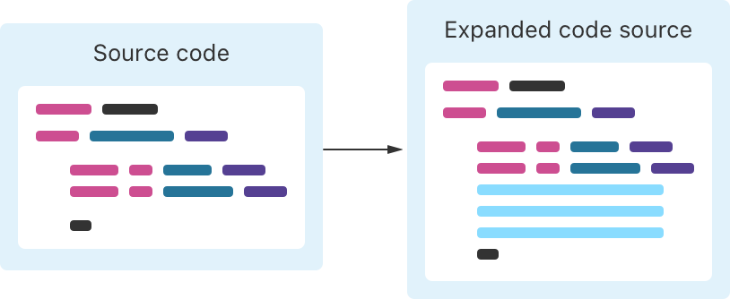
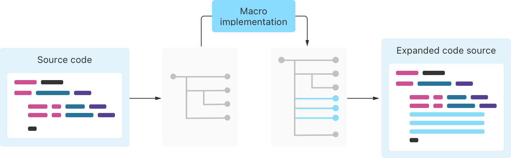
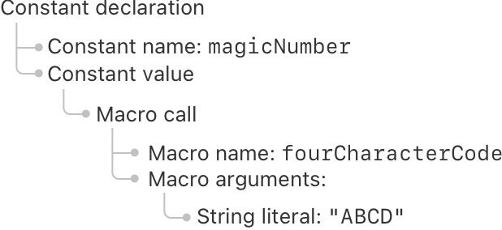
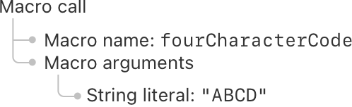
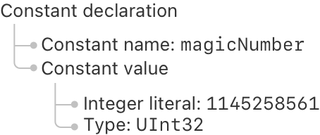

+++
title = "2.19 宏"
date = 2026-09-11T20:00:03+08:00
weight = 19
type = "docs"
description = ""
isCJKLanguage = true
draft = false
+++


> 原文链接: [https://docs.swift.org/latest/documentation/the-swift-programming-language/macros/](https://docs.swift.org/latest/documentation/the-swift-programming-language/macros/)

# 2.19 宏

用宏在编译期生成代码。

宏在编译源代码时对代码进行变换，让你不必手写重复的代码。编译期间，Swift 会在照常构建代码之前展开代码中的宏。



展开宏始终是一种只做加法的操作：宏会添加新代码，但绝不会删除或修改已有代码。

宏的输入和宏展开的输出都会被检查，以确保它们是语法正确的 Swift 代码。同样，你传给宏的值以及宏生成代码中的值，也都会被检查以确保类型正确。此外，如果宏实现在展开宏时遇到错误，编译器会把它当作编译错误处理。这些保证让你更容易理解使用宏的代码，也更容易发现诸如误用宏或宏实现有 bug 之类的问题。

Swift 有两类宏：

- *独立宏*单独出现，不依附于任何声明。

- *附加宏*修改它所依附的声明。

调用附加宏和独立宏的方式略有不同，但两者遵循相同的宏展开模型，实现方式也相同。下面几节会更详细地介绍这两类宏。

## 独立宏 {#Freestanding-Macros}

要调用独立宏，就在它的名字前写井号（`#`），并在名字后面的圆括号中写宏的实参。例如：

```swift
func myFunction() {
    print("Currently running \(#function)")
    #warning("Something's wrong")
}
```

第一行里，`#function` 调用了 Swift 标准库中的 [`function()`][] 宏。编译这段代码时，Swift 会调用该宏的实现，把 `#function` 替换为当前函数的名字。运行这段代码并调用 `myFunction()` 时，它会打印 "Currently running myFunction()"。第二行里，`#warning` 调用了 Swift 标准库中的 [`warning(_:)`][] 宏，生成一条自定义的编译期警告。

[`function()`]: https://developer.apple.com/documentation/swift/function()
[`warning(_:)`]: https://developer.apple.com/documentation/swift/warning(_:)

独立宏既可以像 `#function` 那样产出一个值，也可以像 `#warning` 那样在编译期执行某个动作。

## 附加宏 {#Attached-Macros}

要调用附加宏，就在它的名字前写 at 符号（`@`），并在名字后面的圆括号中写宏的实参。

附加宏修改它所依附的声明：它们会为该声明添加代码，例如定义新方法或添加协议遵循性。

例如，考虑下面这段不使用宏的代码：

```swift
struct SundaeToppings: OptionSet {
    let rawValue: Int
    static let nuts = SundaeToppings(rawValue: 1 << 0)
    static let cherry = SundaeToppings(rawValue: 1 << 1)
    static let fudge = SundaeToppings(rawValue: 1 << 2)
}
```

在这段代码中，`SundaeToppings` 选项集合里的每个选项都包含一次构造器调用，既重复又需要手工编写，添加新选项时很容易出错，比如在行末敲错数字。

下面是改用宏的版本：

```swift
@OptionSet<Int>
struct SundaeToppings {
    private enum Options: Int {
        case nuts
        case cherry
        case fudge
    }
}
```

这个版本的 `SundaeToppings` 调用了一个 `@OptionSet` 宏。该宏读取这个私有枚举中的成员列表，为每个选项生成常量列表，并添加对 [`OptionSet`][] 协议的遵循性。

[`OptionSet`]: https://developer.apple.com/documentation/swift/optionset

作为对比，下面是 `@OptionSet` 宏展开后的样子。这段代码不是你写的，只有在你明确要求 Swift 展示宏展开结果时才会看到。

```swift
struct SundaeToppings {
    private enum Options: Int {
        case nuts
        case cherry
        case fudge
    }

    typealias RawValue = Int
    var rawValue: RawValue
    init() { self.rawValue = 0 }
    init(rawValue: RawValue) { self.rawValue = rawValue }
    static let nuts: Self = Self(rawValue: 1 << Options.nuts.rawValue)
    static let cherry: Self = Self(rawValue: 1 << Options.cherry.rawValue)
    static let fudge: Self = Self(rawValue: 1 << Options.fudge.rawValue)
}
extension SundaeToppings: OptionSet { }
```

私有枚举之后的所有代码都来自 `@OptionSet` 宏。与前面手工编写的版本相比，用宏生成所有这些静态变量的 `SundaeToppings` 版本更易读、也更易维护。

## 宏声明 {#Macro-Declarations}

在大多数 Swift 代码中，实现一个符号（例如函数或类型）时并没有单独的声明。但对宏来说，声明和实现是分开的：宏的声明包含它的名字、它接受的参数、它可以用于何处，以及它生成什么样的代码；宏的实现包含通过生成 Swift 代码来展开宏的代码。

你用 `macro` 关键字引入宏声明。例如，下面是前面例子中 `@OptionSet` 宏声明的一部分：

```swift
public macro OptionSet<RawType>() =
        #externalMacro(module: "SwiftMacros", type: "OptionSetMacro")
```

第一行指定宏的名字及其参数——名字是 `OptionSet`，它不接受任何参数；第二行使用 Swift 标准库中的 [`externalMacro(module:type:)`][] 宏告诉 Swift 宏的实现位于何处。这里 `SwiftMacros` 模块包含一个名为 `OptionSetMacro` 的类型，它实现了 `@OptionSet` 宏。

[`externalMacro(module:type:)`]: https://developer.apple.com/documentation/swift/externalmacro(module:type:)

由于 `OptionSet` 是附加宏，它的名字使用大驼峰命名法，与结构体和类的名字一样；独立宏使用小驼峰命名法，与变量和函数的名字一样。

> 注意：
> 宏总是声明为 `public`。
> 因为声明宏的代码与使用该宏的代码位于不同模块，
> 所以不存在可以把非 public 宏应用到的位置。

宏声明定义了宏的*角色*——该宏可以在源代码中调用的位置，以及它能生成什么样的代码。每个宏都有一个或多个角色，作为宏声明开头的特性写出来。下面是 `@OptionSet` 声明中稍多一点的内容，包含其角色的特性：

```swift
@attached(member)
@attached(extension, conformances: OptionSet)
public macro OptionSet<RawType>() =
        #externalMacro(module: "SwiftMacros", type: "OptionSetMacro")
```

这个声明中 `@attached` 特性出现了两次，每个宏角色各一次。第一处 `@attached(member)` 表示该宏向你应用它的类型添加新成员：`@OptionSet` 宏添加了 `OptionSet` 协议要求的 `init(rawValue:)` 构造器，以及一些其他成员。第二处 `@attached(extension, conformances: OptionSet)` 则表明 `@OptionSet` 添加对 `OptionSet` 协议的遵循性：`@OptionSet` 宏扩展你应用该宏的类型，为它添加对 `OptionSet` 协议的遵循性。

对于独立宏，你写 `@freestanding` 特性来指定它的角色：

```swift
@freestanding(expression)
public macro line<T: ExpressibleByIntegerLiteral>() -> T =
        /* ... 宏实现所在位置... */
```

上面这个 `#line` 宏的角色是 `expression`。表达式宏产出一个值，或者执行诸如生成警告之类的编译期动作。

除了宏的角色，宏的声明还提供关于该宏所生成符号名字的信息。当宏声明给出一个名字列表时，就保证它只会产生使用这些名字的声明，这有助于你理解和调试生成的代码。下面是 `@OptionSet` 的完整声明：

```swift
@attached(member, names: named(RawValue), named(rawValue),
        named(`init`), arbitrary)
@attached(extension, conformances: OptionSet)
public macro OptionSet<RawType>() =
        #externalMacro(module: "SwiftMacros", type: "OptionSetMacro")
```

在上面的声明中，`@attached(member)` 宏在 `names:` 标签之后为 `@OptionSet` 宏生成的每个符号列出了实参。该宏为名为 `RawValue`、`rawValue` 和 `init` 的符号添加声明——因为这些名字事先已知，宏声明把它们显式列了出来。

宏声明还在名字列表之后包含了 `arbitrary`，允许该宏生成名字要到使用宏时才可知的声明。例如，把 `@OptionSet` 宏应用于上面的 `SundaeToppings` 时，它会生成与枚举成员对应的类型属性：`nuts`、`cherry` 和 `fudge`。

关于更多内容（包括完整的宏角色列表），参见[属性特性](../../languagereference/3.7-Attributes/)中的 [attached](../../languagereference/3.7-Attributes/#attached) 和 [freestanding](../../languagereference/3.7-Attributes/#freestanding)。

## 宏展开 {#Macro-Expansion}

构建使用宏的 Swift 代码时，编译器会调用宏的实现来展开它们。



具体来说，Swift 按下列方式展开宏：

1. 编译器读取代码，创建该语法在内存中的表示。

1. 编译器把内存表示的一部分发送给宏实现，由它展开宏。

1. 编译器用宏调用展开后的形式替换该宏调用。

1. 编译器使用展开后的源代码继续编译。

为了走一遍这些具体步骤，来看下面这段代码：

```swift
let magicNumber = #fourCharacterCode("ABCD")
```

`#fourCharacterCode` 宏接受一个长度为四个字符的字符串，并返回一个无符号 32 位整数，该整数由字符串中各个字符的 ASCII 值拼接而成。有些文件格式使用这样的整数来标识数据，因为它们既紧凑，又能在调试器中读懂。下文的[实现宏](./#Implementing-a-Macro)一节会展示如何实现这个宏。

要展开上面代码中的宏，编译器读取该 Swift 文件，并创建这段代码在内存中的表示，称为*抽象语法树*（abstract syntax tree，AST）。AST 把代码的结构显式表达出来，使编写与这种结构交互的代码——例如编译器或宏实现——变得更容易。下面是上面这段代码的 AST 表示，为简洁起见省略了一些额外细节：



上图展示了这段代码的结构如何表示在内存中。AST 中的每个元素都对应源代码的一部分："常量声明"AST 元素下面有两个子元素，分别表示常量声明的两部分：名字和值；"宏调用"元素下的子元素则表示宏的名字和传给宏的实参列表。

在构造这棵 AST 的过程中，编译器会检查源代码是否是合法的 Swift。例如 `#fourCharacterCode` 只接受一个实参，且必须是字符串；如果你试图传入整数实参，或者忘了字符串字面量末尾的引号（`"`），就会在流程的这一步得到错误。

编译器会找出代码中调用宏的位置，并加载实现这些宏的外部二进制。对于每个宏调用，编译器把 AST 的一部分传给该宏的实现。下面是这部分 AST 的表示：



`#fourCharacterCode` 宏的实现把这部分 AST 作为输入读取，并展开宏。宏的实现只对它作为输入收到的这部分 AST 进行操作，这意味着宏的展开方式始终相同，与它前后的代码无关。这一限制让宏展开更容易理解，也有助于代码更快构建，因为 Swift 可以跳过那些没有变化的宏的展开。

Swift 通过限制实现宏的代码，帮助宏作者避免意外读取其他输入：

- 传给宏实现的 AST 只包含表示该宏的 AST 元素，不包含它前后的任何代码。

- 宏实现在沙箱环境中运行，无法访问文件系统或网络。

除了这些保障措施，宏的作者也有责任不读取或修改宏输入之外的任何东西。例如，宏的展开不得依赖当前的时刻。

`#fourCharacterCode` 的实现生成一棵包含展开后代码的新 AST，它返回给编译器的内容如下：


编译器收到这份展开结果后，把包含宏调用的 AST 元素替换为包含宏展开结果的元素。宏展开之后，编译器会再次检查，确保程序仍是语法正确的 Swift，并且所有类型都正确。这产生一棵最终 AST，可以照常编译：



这棵 AST 对应下面这样的 Swift 代码：

```swift
let magicNumber = 1145258561 as UInt32
```

在这个例子里，输入源代码只包含一个宏，但真实程序可能有同一个宏的多个实例，以及到不同宏的多次调用。编译器一次展开一个宏。

如果一个宏出现在另一个宏内部，外层宏会先展开——这使外层宏能够在被展开之前修改内层宏。

## 实现宏 {#Implementing-a-Macro}

要实现一个宏，你需要做两个部分：一个执行宏展开的类型，以及一个声明该宏、把它作为 API 公开的库。这些部分与使用该宏的代码分开构建，即使你在同时开发宏及其调用方也是如此，因为宏实现是在构建宏调用方的过程中运行的。

要用 Swift Package Manager 创建新宏，运行 `swift package init --type macro`——它会创建若干文件，其中包括宏实现和宏声明的模板。

要把宏添加到已有项目，按如下方式修改 `Package.swift` 文件的开头：

- 在 `swift-tools-version` 注释中把 Swift 工具版本设为 5.9 或更高。
- 导入 `CompilerPluginSupport` 模块。
- 在 `platforms` 列表中把 macOS 10.15 包含为最低部署目标。

下面的代码展示了一个示例 `Package.swift` 文件的开头部分。

```swift
// swift-tools-version: 5.9

import PackageDescription
import CompilerPluginSupport

let package = Package(
    name: "MyPackage",
    platforms: [ .iOS(.v17), .macOS(.v13)],
    // ...
)
```

接着，为你已有的 `Package.swift` 文件添加一个宏实现目标和一个宏库目标。例如，你可以添加类似下面的内容，把其中的名字改成与你项目相符的名字：

```swift
targets: [
    // 执行源代码变换的宏实现。
    .macro(
        name: "MyProjectMacros",
        dependencies: [
            .product(name: "SwiftSyntaxMacros", package: "swift-syntax"),
            .product(name: "SwiftCompilerPlugin", package: "swift-syntax")
        ]
    ),

    // 把宏作为其 API 一部分公开的库。
    .target(name: "MyProject", dependencies: ["MyProjectMacros"]),
]
```

上面的代码定义了两个目标：`MyProjectMacros` 包含宏的实现，`MyProject` 让这些宏可用。

宏的实现使用 [SwiftSyntax][] 模块，以结构化的方式（借助 AST）与 Swift 代码交互。如果你用 Swift Package Manager 创建了新的宏包，生成的 `Package.swift` 文件会自动包含对 SwiftSyntax 的依赖；如果你是在已有项目中添加宏，就在 `Package.swift` 文件中添加对 SwiftSyntax 的依赖：

[SwiftSyntax]: https://github.com/swiftlang/swift-syntax

```swift
dependencies: [
    .package(url: "https://github.com/swiftlang/swift-syntax", from: "509.0.0")
],
```

根据宏的角色，宏实现需要遵循 SwiftSyntax 中相应的协议。例如，考虑上一节的 `#fourCharacterCode`，下面是实现该宏的结构体：

```swift
import SwiftSyntax
import SwiftSyntaxMacros

public struct FourCharacterCode: ExpressionMacro {
    public static func expansion(
        of node: some FreestandingMacroExpansionSyntax,
        in context: some MacroExpansionContext
    ) throws -> ExprSyntax {
        guard let argument = node.argumentList.first?.expression,
              let segments = argument.as(StringLiteralExprSyntax.self)?.segments,
              segments.count == 1,
              case .stringSegment(let literalSegment)? = segments.first
        else {
            throw CustomError.message("Need a static string")
        }

        let string = literalSegment.content.text
        guard let result = fourCharacterCode(for: string) else {
            throw CustomError.message("Invalid four-character code")
        }

        return "\(raw: result) as UInt32"
    }
}

private func fourCharacterCode(for characters: String) -> UInt32? {
    guard characters.count == 4 else { return nil }

    var result: UInt32 = 0
    for character in characters {
        result = result << 8
        guard let asciiValue = character.asciiValue else { return nil }
        result += UInt32(asciiValue)
    }
    return result
}
enum CustomError: Error { case message(String) }
```

如果你把这个宏添加到已有的 Swift Package Manager 项目中，就再添加一个类型作为宏目标的入口，列出该目标定义的宏：

```swift
import SwiftCompilerPlugin

@main
struct MyProjectMacros: CompilerPlugin {
    var providingMacros: [Macro.Type] = [FourCharacterCode.self]
}
```

`#fourCharacterCode` 是一个产出表达式的独立宏，因此实现它的 `FourCharacterCode` 类型遵循 `ExpressionMacro` 协议。`ExpressionMacro` 协议只有一条要求，即用于展开 AST 的 `expansion(of:in:)` 方法。关于宏角色与对应的 SwiftSyntax 协议列表，参见[属性特性](../../languagereference/3.7-Attributes/)中的 [attached](../../languagereference/3.7-Attributes/#attached) 和 [freestanding](../../languagereference/3.7-Attributes/#freestanding)。

要展开 `#fourCharacterCode` 宏，Swift 会把使用该宏的代码的 AST 发送给包含宏实现的库。在库内部，Swift 调用 `FourCharacterCode.expansion(of:in:)`，把 AST 和上下文作为实参传给该方法。`expansion(of:in:)` 的实现找出作为实参传给 `#fourCharacterCode` 的字符串，并算出对应的 32 位无符号整数字面量值。

在上面的例子里，第一个 `guard` 块从 AST 中提取字符串字面量，把那个 AST 元素赋给 `literalSegment`；第二个 `guard` 块调用私有的 `fourCharacterCode(for:)` 函数。如果宏被误用，这两个块都会抛出错误——错误消息会成为错误调用处的编译器错误。例如，如果你试图以 `#fourCharacterCode("AB" + "CD")` 调用该宏，编译器会显示错误 "Need a static string"。

`expansion(of:in:)` 方法返回 `ExprSyntax` 的实例，这是 SwiftSyntax 中表示 AST 里表达式的类型。由于该类型遵循 `StringLiteralConvertible` 协议，宏实现用字符串字面量作为轻量语法来创建结果。你从宏实现返回的所有 SwiftSyntax 类型都遵循 `StringLiteralConvertible`，因此在实现任何种类的宏时都可以使用这种做法。

## 开发和调试宏 {#Developing-and-Debugging-Macros}

宏非常适合用测试来开发：它们把一棵 AST 变换成另一棵 AST，既不依赖任何外部状态，也不修改任何外部状态。此外，你可以从字符串字面量创建语法节点，简化测试输入的搭建；你也可以读取 AST 的 `description` 属性，得到用来与期望值比较的字符串。例如，下面是前面几节中 `#fourCharacterCode` 宏的一个测试：

```swift
let source: SourceFileSyntax =
    """
    let abcd = #fourCharacterCode("ABCD")
    """

let file = BasicMacroExpansionContext.KnownSourceFile(
    moduleName: "MyModule",
    fullFilePath: "test.swift"
)

let context = BasicMacroExpansionContext(sourceFiles: [source: file])

let transformedSF = source.expand(
    macros:["fourCharacterCode": FourCharacterCode.self],
    in: context
)

let expectedDescription =
    """
    let abcd = 1145258561 as UInt32
    """

precondition(transformedSF.description == expectedDescription)
```

上面的例子用前提条件来测试这个宏，但你也可以改用某个测试框架。
