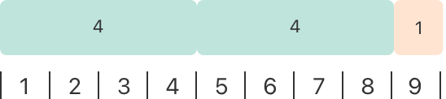

+++
title = "2.2 基本运算符"
date = 2026-09-11T20:00:03+08:00
weight = 2
type = "docs"
description = ""
isCJKLanguage = true
draft = false
+++


> 原文链接: [https://docs.swift.org/latest/documentation/the-swift-programming-language/basicoperators/](https://docs.swift.org/latest/documentation/the-swift-programming-language/basicoperators/)

# 2.2 基本运算符

完成赋值、算术、比较之类的运算。

*运算符*是用来检查、修改或组合值的特殊符号或短语。例如，加法运算符（`+`）把两个数相加，如 `let i = 1 + 2`；逻辑与运算符（`&&`）把两个布尔值组合起来，如 `if enteredDoorCode && passedRetinaScan`。

Swift 支持你可能已经在 C 之类的语言中见过的运算符，并对若干能力做了改进，以消除常见的编码错误。赋值运算符（`=`）不返回值，从而避免在本想使用等于运算符（`==`）时误用赋值。算术运算符（`+`、`-`、`*`、`/`、`%` 等）会检测并禁止值溢出，避免在数值超出其存储类型的取值范围时产生意外结果。如果确实希望允许溢出，可以使用 Swift 的溢出运算符，详见[溢出运算符](../2.29-AdvancedOperators/#Overflow-Operators)。

Swift 还提供了 C 语言没有的范围运算符，例如 `a..<b` 和 `a...b`，用来简洁地表示一个取值范围。

本章介绍 Swift 中的常用运算符。[高级运算符](../2.29-AdvancedOperators/)则会介绍 Swift 的高级运算符，并说明如何定义自己的自定义运算符，以及如何为自己的自定义类型实现标准运算符。

## 术语 {#Terminology}

运算符分为一元、二元和三元：

- *一元*运算符作用于单一目标（例如 `-a`）。一元*前置*运算符紧挨在目标之前（例如 `!b`），一元*后置*运算符紧挨在目标之后（例如 `c!`）。
- *二元*运算符作用于两个目标（例如 `2 + 3`），它们位于两个目标之间，因此是*中置*运算符。
- *三元*运算符作用于三个目标。和 C 语言一样，Swift 只有一个三元运算符，即三元条件运算符（`a ? b : c`）。

运算符所作用的值称为*操作数*。在表达式 `1 + 2` 中，`+` 是中置运算符，它的两个操作数是 `1` 和 `2`。

## 赋值运算符 {#Assignment-Operator}

*赋值运算符*（`a = b`）用 `b` 的值初始化或更新 `a` 的值：

```swift
let b = 10
var a = 5
a = b
// a 现在等于 10
```

如果赋值号右边是包含多个值的元组，那么它的元素可以一次分解到多个常量或变量中：

```swift
let (x, y) = (1, 2)
// x 等于 1，y 等于 2
```

与 C 和 Objective-C 中的赋值运算符不同，Swift 的赋值运算符本身不返回值。下面这条语句是不合法的：

```swift
if x = y {
    // 这行不合法，因为 x = y 不返回值。
}
```

这一特性可以防止在本想使用等于运算符（`==`）时误用赋值运算符（`=`）。通过让 `if x = y` 不合法，Swift 帮助你避免代码中出现这类错误。

## 算术运算符 {#Arithmetic-Operators}

Swift 为所有数值类型支持四种标准*算术运算符*：

- 加法（`+`）
- 减法（`-`）
- 乘法（`*`）
- 除法（`/`）

```swift
1 + 2       // 等于 3
5 - 3       // 等于 2
2 * 3       // 等于 6
10.0 / 2.5  // 等于 4.0
```

与 C 和 Objective-C 中的算术运算符不同，Swift 的算术运算符默认不允许值溢出。如果确实希望允许溢出，可以使用 Swift 的溢出运算符（例如 `a &+ b`）。参见[溢出运算符](../2.29-AdvancedOperators/#Overflow-Operators)。

加法运算符也支持拼接 `String`：

```swift
"hello, " + "world"  // 等于 "hello, world"
```

### 求余运算符 {#Remainder-Operator}

*求余运算符*（`a % b`）计算出 `b` 的多少个倍数能放进 `a`，并返回剩下的值（即*余数*）。

> 注意：求余运算符（`%`）在其他语言中也被称作
> *取模运算符*。
> 不过，它在 Swift 中处理负数时的行为意味着，
> 严格说来它是求余，而不是取模。

求余运算符是这样工作的：要计算 `9 % 4`，先算出 `9` 里能放下多少个 `4`：



`9` 里能放下两个 `4`，余数是 `1`（图中以橙色标出）。

在 Swift 中写作：

```swift
9 % 4    // 等于 1
```

为了确定 `a % b` 的结果，`%` 运算符会计算下面这个等式，并把 `remainder` 作为输出返回：

`a` = (`b` x `some multiplier`) + `remainder`

其中 `some multiplier` 是能放进 `a` 的 `b` 的最大倍数。

把 `9` 和 `4` 代入这个等式得到：

`9` = (`4` x `2`) + `1`

计算 `a` 为负数时的余数也用同样的方法：

```swift
-9 % 4   // 等于 -1
```

把 `-9` 和 `4` 代入等式得到：

`-9` = (`4` x `-2`) + `-1`

因此余数是 `-1`。

当 `b` 为负数时，`b` 的符号会被忽略。这意味着 `a % b` 和 `a % -b` 的结果总是相同。

### 一元负号运算符 {#Unary-Minus-Operator}

数值的正负号可以用前置的 `-` 来切换，这称为*一元负号运算符*：

```swift
let three = 3
let minusThree = -three       // minusThree 等于 -3
let plusThree = -minusThree   // plusThree 等于 3，也就是"负负三"
```

一元负号运算符（`-`）紧挨在它作用的数值之前书写，中间不能有空白。

### 一元正号运算符 {#Unary-Plus-Operator}

*一元正号运算符*（`+`）只是原样返回它作用的值，不做任何改变：

```swift
let minusSix = -6
let alsoMinusSix = +minusSix  // alsoMinusSix 等于 -6
```

虽然一元正号运算符实际上什么也不做，但当代码里对负数使用一元负号运算符时，你可以用它让正数也在形式上保持对称。

## 复合赋值运算符 {#Compound-Assignment-Operators}

和 C 语言一样，Swift 提供了把赋值（`=`）与另一种运算结合起来的*复合赋值运算符*。一个例子是*加法赋值运算符*（`+=`）：

```swift
var a = 1
a += 2
// a 现在等于 3
```

表达式 `a += 2` 是 `a = a + 2` 的简写。实际上，加法与赋值被合并成了一个运算符，一次完成两件事。

> 注意：复合赋值运算符不返回值。
> 例如，你不能写 `let b = a += 2`。

关于 Swift 标准库提供的运算符，参见 [Operator Declarations](https://developer.apple.com/documentation/swift/operator_declarations)。

## 比较运算符 {#Comparison-Operators}

Swift 支持以下比较运算符：

- 等于（`a == b`）
- 不等于（`a != b`）
- 大于（`a > b`）
- 小于（`a < b`）
- 大于或等于（`a >= b`）
- 小于或等于（`a <= b`）

> 注意：Swift 还提供了两个*恒等运算符*（`===` 和 `!==`），
> 用来测试两个对象引用是否都指向同一个对象实例。
> 更多内容参见[恒等运算符](../2.9-ClassesAndStructures/#Identity-Operators)。

每个比较运算符都返回 `Bool` 值，表示该判断是否成立：

```swift
1 == 1   // true，因为 1 等于 1
2 != 1   // true，因为 2 不等于 1
2 > 1    // true，因为 2 大于 1
1 < 2    // true，因为 1 小于 2
1 >= 1   // true，因为 1 大于或等于 1
2 <= 1   // false，因为 2 并不小于或等于 1
```

比较运算符常用于 `if` 语句之类的条件语句：

```swift
let name = "world"
if name == "world" {
    print("hello, world")
} else {
    print("I'm sorry \(name), but I don't recognize you")
}
// 输出 "hello, world"，因为 name 确实等于 "world"。
```

关于 `if` 语句的更多内容，参见[控制流](../2.5-ControlFlow/)。

如果两个元组类型相同、值的个数也相同，就可以比较它们。元组按从左到右的顺序逐个比较值，直到找到两个不相等的值为止。接着比较这两个值，比较的结果就决定了整个元组比较的结果。如果所有元素都相等，那么这两个元组本身就相等。例如：

```swift
(1, "zebra") < (2, "apple")   // true，因为 1 小于 2；"zebra" 和 "apple" 不参与比较
(3, "apple") < (3, "bird")    // true，因为 3 等于 3，而 "apple" 小于 "bird"
(4, "dog") == (4, "dog")      // true，因为 4 等于 4，且 "dog" 等于 "dog"
```

在上面的例子里，第一行展示了从左到右的比较行为：因为 `1` 小于 `2`，所以 `(1, "zebra")` 被认为小于 `(2, "apple")`，元组中其他值如何都无关紧要。`"zebra"` 并不小于 `"apple"` 也没关系，因为比较结果已经由两个元组的第一个元素确定了。而当两个元组的第一个元素相同时，*确实*会比较第二个元素——第二行和第三行正是如此。

只有当某个运算符能作用于两个元组中各自对应的值时，才能用该运算符比较这两个元组。例如，如下面代码所示，你可以比较两个 `(String, Int)` 类型的元组，因为 `String` 和 `Int` 值都可以用 `<` 运算符比较。相比之下，两个 `(String, Bool)` 类型的元组不能用 `<` 运算符比较，因为 `<` 运算符不能作用于 `Bool` 值。

```swift
("blue", -1) < ("purple", 1)        // OK：求值为 true。
("blue", false) < ("purple", true)  // 错误：不能用 < 比较布尔值。
```

> 注意：Swift 标准库为元素少于七个的元组提供了元组比较运算符。
> 要比较元素为七个或更多的元组，
> 你必须自己实现相应的比较运算符。

## 三元条件运算符 {#Ternary-Conditional-Operator}

*三元条件运算符*是一个由三部分组成的特殊运算符，形式为 `question ? answer1 : answer2`。它根据 `question` 的真假，在两个表达式中求值其中一个，是这类判断的简写形式：如果 `question` 为真，就对 `answer1` 求值并返回其结果；否则对 `answer2` 求值并返回其结果。

三元条件运算符是下面这段代码的简写：

```swift
if question {
    answer1
} else {
    answer2
}
```

下面是一个计算表格行高的例子：如果这一行有表头，行高应当比内容高度多 50 点；如果没有表头，则多 20 点：

```swift
let contentHeight = 40
let hasHeader = true
let rowHeight = contentHeight + (hasHeader ? 50 : 20)
// rowHeight 等于 90
```

上面的例子是下面这段代码的简写：

```swift
let contentHeight = 40
let hasHeader = true
let rowHeight: Int
if hasHeader {
    rowHeight = contentHeight + 50
} else {
    rowHeight = contentHeight + 20
}
// rowHeight 等于 90
```

第一个例子使用三元条件运算符，意味着 `rowHeight` 可以在一行代码里被设为正确的值，这比第二个例子用到的代码更简洁。

三元条件运算符为"在两个表达式中选择其一"提供了高效的简写形式。不过使用三元条件运算符要谨慎：一旦滥用，它的简洁反而会导致代码难以阅读。避免把多个三元条件运算符合并到一条复合语句中。

## 空合运算符 {#Nil-Coalescing-Operator}

*空合运算符*（`a ?? b`）在可选值 `a` 包含值时解包它，而在 `a` 为 `nil` 时返回默认值 `b`。表达式 `a` 必须始终是可选类型，而表达式 `b` 必须与 `a` 中存放的类型相匹配。

空合运算符是下面这段代码的简写：

```swift
a != nil ? a! : b
```

上面的代码使用三元条件运算符和强制解包（`a!`），在 `a` 不为 `nil` 时访问包装在 `a` 里的值，否则返回 `b`。空合运算符则提供了一种更优雅的方式，把这种条件检查与解包封装成简洁易读的形式。

> 注意：如果 `a` 的值不是 `nil`，
> 那么 `b` 的值不会被求值。
> 这称为*短路求值*。

下面的例子用空合运算符在默认颜色名和用户自定义的可选颜色名之间做选择：

```swift
let defaultColorName = "red"
var userDefinedColorName: String?   // 默认值为 nil

var colorNameToUse = userDefinedColorName ?? defaultColorName
// userDefinedColorName 为 nil，因此 colorNameToUse 被设为默认值 "red"
```

变量 `userDefinedColorName` 被定义为可选 `String`，默认值为 `nil`。由于 `userDefinedColorName` 是可选类型，你可以用空合运算符来考虑它的值。在上面的例子里，该运算符被用来确定名为 `colorNameToUse` 的 `String` 变量的初始值。因为 `userDefinedColorName` 是 `nil`，表达式 `userDefinedColorName ?? defaultColorName` 返回 `defaultColorName` 的值，也就是 `"red"`。

如果你给 `userDefinedColorName` 赋一个非 `nil` 的值，再执行一次空合运算，那么就会使用包装在 `userDefinedColorName` 里的值，而不是默认值：

```swift
userDefinedColorName = "green"
colorNameToUse = userDefinedColorName ?? defaultColorName
// userDefinedColorName 不是 nil，因此 colorNameToUse 被设为 "green"
```

## 范围运算符 {#Range-Operators}

Swift 提供了若干*范围运算符*，它们是表达一个取值范围的简写。

### 闭区间运算符 {#Closed-Range-Operator}

*闭区间运算符*（`a...b`）定义一个从 `a` 到 `b` 的范围，包含 `a` 和 `b` 两个值。`a` 的值不能大于 `b`。

当你要遍历一个范围、并且希望其中所有值都被用到时，闭区间运算符很有用，比如配合 `for`-`in` 循环：

```swift
for index in 1...5 {
    print("\(index) times 5 is \(index * 5)")
}
// 1 times 5 is 5
// 2 times 5 is 10
// 3 times 5 is 15
// 4 times 5 is 20
// 5 times 5 is 25
```

关于 `for`-`in` 循环的更多内容，参见[控制流](../2.5-ControlFlow/)。

### 半开区间运算符 {#Half-Open-Range-Operator}

*半开区间运算符*（`a..<b`）定义一个从 `a` 到 `b` 的范围，但不包含 `b`。之所以称为*半开*，是因为它包含第一个值，却不包含最后一个值。与闭区间运算符一样，`a` 的值不能大于 `b`；如果 `a` 的值等于 `b`，那么得到的范围是空的。

处理数组这类从零开始编号的列表时，半开区间特别有用，因为用它计数到列表长度（但不包括长度本身）非常方便：

```swift
let names = ["Anna", "Alex", "Brian", "Jack"]
let count = names.count
for i in 0..<count {
    print("Person \(i + 1) is called \(names[i])")
}
// Person 1 is called Anna
// Person 2 is called Alex
// Person 3 is called Brian
// Person 4 is called Jack
```

注意数组包含四个元素，但 `0..<count` 只计数到 `3`（也就是数组中最后一个元素的下标），因为它是半开区间。关于数组的更多内容，参见[数组](../2.4-CollectionTypes/#Arrays)。

### 单侧范围 {#One-Sided-Ranges}

闭区间运算符还有一种替代形式，用于朝某个方向尽可能延伸的范围——例如包含数组中从下标 2 到末尾所有元素的范围。在这类情况下，你可以省略范围运算符一侧的值。这种范围称为*单侧范围*，因为运算符只有一侧有值。例如：

```swift
for name in names[2...] {
    print(name)
}
// Brian
// Jack

for name in names[...2] {
    print(name)
}
// Anna
// Alex
// Brian
```

半开区间运算符也有单侧形式，写作只保留最后一个值。和两侧都写值的时候一样，最后一个值不属于该范围。例如：

```swift
for name in names[..<2] {
    print(name)
}
// Anna
// Alex
```

单侧范围不只能用于下标，还可以用在其他场景中。省略第一个值的单侧范围无法遍历，因为不清楚遍历应当从哪里开始。省略最后一个值的单侧范围*可以*遍历；不过由于该范围会无限延伸，请务必为循环添加明确的结束条件。你还可以检查单侧范围是否包含某个特定的值，如下面代码所示。

```swift
let range = ...5
range.contains(7)   // false
range.contains(4)   // true
range.contains(-1)  // true
```

## 逻辑运算符 {#Logical-Operators}

*逻辑运算符*修改或组合布尔逻辑值 `true` 和 `false`。Swift 支持基于 C 的语言中的三种标准逻辑运算符：

- 逻辑非（`!a`）
- 逻辑与（`a && b`）
- 逻辑或（`a || b`）

### 逻辑非运算符 {#Logical-NOT-Operator}

*逻辑非运算符*（`!a`）把一个布尔值取反，使 `true` 变成 `false`，`false` 变成 `true`。

逻辑非运算符是前置运算符，紧挨在它作用的值之前书写，中间不能有空白。它可以读作"非 `a`"，如下例所示：

```swift
let allowedEntry = false
if !allowedEntry {
    print("ACCESS DENIED")
}
// 输出 "ACCESS DENIED"。
```

短语 `if !allowedEntry` 可以读作"如果不允许进入"。只有"不允许进入"为真时才会执行下一行，也就是说，只有 `allowedEntry` 为 `false` 时才会执行。

如同这个例子所示，谨慎地选择布尔常量与变量的名字，有助于让代码既易读又简洁，同时避免出现双重否定或令人费解的逻辑语句。

### 逻辑与运算符 {#Logical-AND-Operator}

*逻辑与运算符*（`a && b`）创建的逻辑表达式要求两个值都为 `true`，整个表达式才为 `true`。

其中任何一个值为 `false`，整个表达式就为 `false`。事实上，如果*第一个*值为 `false`，第二个值根本不会被求值，因为它不可能让整个表达式变为 `true`。这称为*短路求值*。

下面这个例子考察两个 `Bool` 值，只有两者都为 `true` 时才允许访问：

```swift
let enteredDoorCode = true
let passedRetinaScan = false
if enteredDoorCode && passedRetinaScan {
    print("Welcome!")
} else {
    print("ACCESS DENIED")
}
// 输出 "ACCESS DENIED"。
```

### 逻辑或运算符 {#Logical-OR-Operator}

*逻辑或运算符*（`a || b`）是由两个相邻竖线字符组成的中置运算符。用它创建的逻辑表达式只要求两个值中*有一个*为 `true`，整个表达式就为 `true`。

和上面的逻辑与运算符一样，逻辑或运算符也使用短路求值：如果逻辑或表达式的左侧为 `true`，右侧就不会被求值，因为它无法改变整个表达式的结果。

在下面的例子里，第一个 `Bool` 值（`hasDoorKey`）为 `false`，但第二个值（`knowsOverridePassword`）为 `true`。因为有一个值为 `true`，整个表达式也求值为 `true`，于是允许访问：

```swift
let hasDoorKey = false
let knowsOverridePassword = true
if hasDoorKey || knowsOverridePassword {
    print("Welcome!")
} else {
    print("ACCESS DENIED")
}
// 输出 "Welcome!"。
```

### 组合逻辑运算符 {#Combining-Logical-Operators}

你可以组合多个逻辑运算符，构造更长的复合表达式：

```swift
if enteredDoorCode && passedRetinaScan || hasDoorKey || knowsOverridePassword {
    print("Welcome!")
} else {
    print("ACCESS DENIED")
}
// 输出 "Welcome!"。
```

这个例子用多个 `&&` 和 `||` 运算符构造了一个更长的复合表达式。不过 `&&` 和 `||` 运算符仍然只作用于两个值，所以这实际上是三个更小的表达式串联在一起。这个例子可以读作：

如果我们输入了正确的门禁密码并通过了视网膜扫描，或者我们持有有效的门钥匙，或者我们知道应急解锁密码，那么就允许访问。

根据 `enteredDoorCode`、`passedRetinaScan` 和 `hasDoorKey` 的取值，前两个子表达式都是 `false`。但是由于知道应急解锁密码，整个复合表达式仍然求值为 `true`。

> 注意：Swift 的逻辑运算符 `&&` 和 `||` 是左结合的，
> 也就是说，含有多个逻辑运算符的复合表达式
> 会先对最左边的子表达式求值。

### 显式圆括号 {#Explicit-Parentheses}

有时候，在并非严格需要的地方加上圆括号也很有用，可以让复杂表达式的意图更易读。在上面的门禁例子中，给复合表达式的第一部分加上圆括号，就能更清楚地表达它的意图：

```swift
if (enteredDoorCode && passedRetinaScan) || hasDoorKey || knowsOverridePassword {
    print("Welcome!")
} else {
    print("ACCESS DENIED")
}
// 输出 "Welcome!"。
```

这里的圆括号清楚地表明，前两个值被视为整体逻辑中一个独立的可能状态。复合表达式的输出并没有改变，但整体意图对读者来说更清晰了。可读性永远比简短更重要；在圆括号有助于表明意图的地方就使用它。
