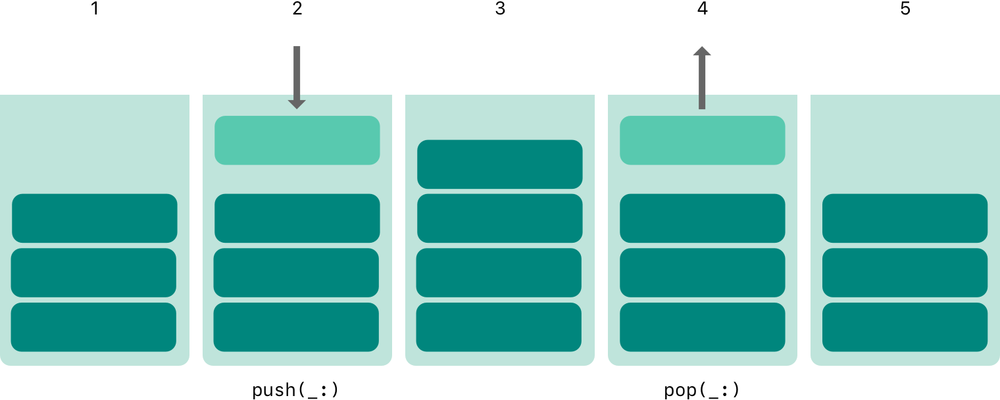
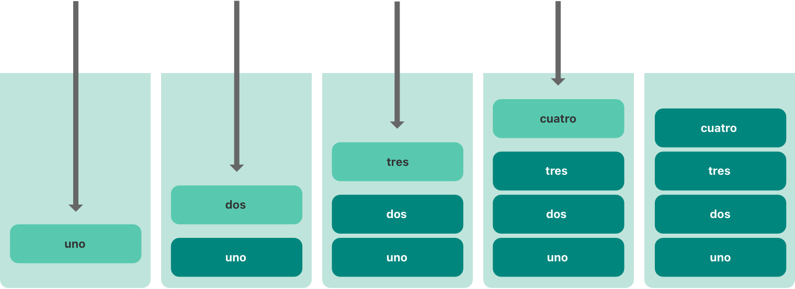
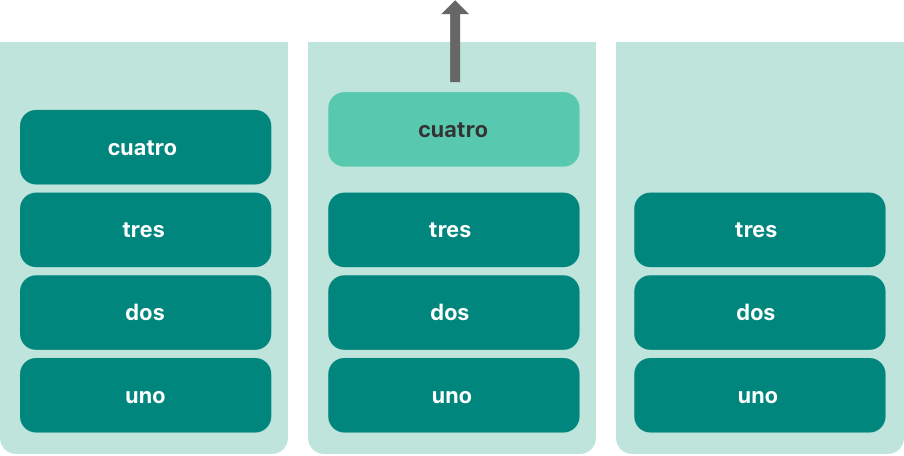

+++
title = "2.24 泛型"
date = 2026-09-11T20:00:03+08:00
weight = 24
type = "docs"
description = ""
isCJKLanguage = true
draft = false
+++


> 原文链接: [https://docs.swift.org/latest/documentation/the-swift-programming-language/generics/](https://docs.swift.org/latest/documentation/the-swift-programming-language/generics/)

# 2.24 泛型

编写适用于多种类型的代码，并为这些类型指定要求。

*泛型代码*让你能够编写灵活、可复用的函数和类型，它们在你定义的要求下可以处理任何类型。你可以写出避免重复的代码，并以清晰、抽象的方式表达意图。

泛型是 Swift 最强大的特性之一，Swift 标准库的很大一部分都是用泛型代码构建的。事实上，你在整个*语言指南*中一直在使用泛型，只是可能没有意识到。例如 Swift 的 `Array` 和 `Dictionary` 类型都是泛型集合：你可以创建存放 `Int` 值的数组，也可以创建存放 `String` 值的数组，乃至存放 Swift 中任何其他类型的数组。类似地，你可以创建字典来存放任何指定类型的值，而且对类型没有任何限制。

## 泛型解决的问题 {#The-Problem-that-Generics-Solve}

下面是一个标准的非泛型函数 `swapTwoInts(_:_:)`，它交换两个 `Int` 值：

```swift
func swapTwoInts(_ a: inout Int, _ b: inout Int) {
    let temporaryA = a
    a = b
    b = temporaryA
}
```

这个函数使用输入输出参数来交换 `a` 和 `b` 的值，详见[输入输出参数](../2.6-Functions/#In-Out-Parameters)。

`swapTwoInts(_:_:)` 函数把 `b` 原来的值换进 `a`，把 `a` 原来的值换进 `b`。你可以调用它来交换两个 `Int` 变量中的值：

```swift
var someInt = 3
var anotherInt = 107
swapTwoInts(&someInt, &anotherInt)
print("someInt is now \(someInt), and anotherInt is now \(anotherInt)")
// 输出 "someInt is now 107, and anotherInt is now 3"。
```

`swapTwoInts(_:_:)` 函数很有用，但它只能用于 `Int` 值。如果你想交换两个 `String` 值或两个 `Double` 值，就必须再写更多函数，例如下面这些 `swapTwoStrings(_:_:)` 和 `swapTwoDoubles(_:_:)` 函数：

```swift
func swapTwoStrings(_ a: inout String, _ b: inout String) {
    let temporaryA = a
    a = b
    b = temporaryA
}

func swapTwoDoubles(_ a: inout Double, _ b: inout Double) {
    let temporaryA = a
    a = b
    b = temporaryA
}
```

你可能注意到了，`swapTwoInts(_:_:)`、`swapTwoStrings(_:_:)` 和 `swapTwoDoubles(_:_:)` 三个函数的语句体完全相同，唯一的区别是它们接受的值的类型（`Int`、`String` 和 `Double`）。

写一个能交换*任何*类型两个值的函数会更有用、也灵活得多。泛型代码让你能够写出这样的函数。（这些函数的泛型版本将在下文给出。）

> 注意：在这三个函数中，
> `a` 和 `b` 的类型必须相同。
> 如果 `a` 和 `b` 类型不同，
> 就无法交换它们的值。
> Swift 是一门类型安全的语言，
> 不允许（例如）一个 `String` 类型的变量
> 与一个 `Double` 类型的变量
> 互换值；
> 试图这样做会导致编译期错误。

## 泛型函数 {#Generic-Functions}

*泛型函数*可以处理任何类型。下面是上面 `swapTwoInts(_:_:)` 函数的泛型版本，名为 `swapTwoValues(_:_:)`：

```swift
func swapTwoValues<T>(_ a: inout T, _ b: inout T) {
    let temporaryA = a
    a = b
    b = temporaryA
}
```

`swapTwoValues(_:_:)` 函数的语句体与 `swapTwoInts(_:_:)` 的语句体完全相同，但它的第一行略有不同。下面比较一下两者的第一行：

```swift
func swapTwoInts(_ a: inout Int, _ b: inout Int)
func swapTwoValues<T>(_ a: inout T, _ b: inout T)
```

函数的泛型版本使用*占位*类型名（这里是 `T`）来代替*实际*类型名（例如 `Int`、`String` 或 `Double`）。占位类型名并没有说明 `T` 必须是什么，但它*确实*表明 `a` 和 `b` 必须是同一类型 `T`，无论 `T` 代表什么。每次调用 `swapTwoValues(_:_:)` 函数时，才确定用哪个实际类型替换 `T`。

泛型函数与非泛型函数的另一处区别是：泛型函数的函数名（`swapTwoValues(_:_:)`）后跟尖括号中的占位类型名（`T`），即 `<T>`。尖括号告诉 Swift，`T` 是 `swapTwoValues(_:_:)` 函数定义中的占位类型名。由于 `T` 只是占位符，Swift 不会去寻找名为 `T` 的实际类型。

现在就可以像调用 `swapTwoInts` 那样调用 `swapTwoValues(_:_:)`，区别只是它可以接受*任何*类型的两个值，只要这两个值彼此类型相同即可。每次调用 `swapTwoValues(_:_:)` 时，都会根据传入值的类型推断出 `T` 应使用的类型。

在下面两个例子里，`T` 分别被推断为 `Int` 和 `String`：

```swift
var someInt = 3
var anotherInt = 107
swapTwoValues(&someInt, &anotherInt)
// someInt 现在是 107，anotherInt 现在是 3

var someString = "hello"
var anotherString = "world"
swapTwoValues(&someString, &anotherString)
// someString 现在是 "world"，anotherString 现在是 "hello"
```

> 注意：上面定义的 `swapTwoValues(_:_:)` 函数灵感来自
> Swift 标准库中的泛型函数 `swap`，
> 它自动可用，供你在应用中使用。
> 如果你在自己的代码中需要 `swapTwoValues(_:_:)` 的行为，
> 可以直接使用 Swift 已有的 `swap(_:_:)` 函数，而不必自己实现。

## 类型形参 {#Type-Parameters}

在上面的 `swapTwoValues(_:_:)` 例子里，占位类型 `T` 就是*类型形参*的一个例子。类型形参指定并命名一个占位类型，写在函数名之后、一对匹配的尖括号中（例如 `<T>`）。

指定类型形参之后，你可以用它来定义函数参数的类型（例如 `swapTwoValues(_:_:)` 函数的 `a` 和 `b` 参数）、作为函数的返回类型，或者作为函数体内的类型标注。在每种情况下，类型形参都会在函数被调用时替换为*实际*类型。（在上面的 `swapTwoValues(_:_:)` 例子里，第一次调用时 `T` 被替换为 `Int`，第二次调用时被替换为 `String`。）

你可以提供多个类型形参，只需在尖括号中写多个类型形参名，用逗号分隔。

## 为类型形参命名 {#Naming-Type-Parameters}

大多数情况下，类型形参使用有描述性的名字，例如 `Dictionary<Key, Value>` 中的 `Key` 和 `Value`、`Array<Element>` 中的 `Element`，这能告诉读者该类型形参与使用它的泛型类型或函数之间的关系。不过当它们之间没有有意义的关系时，习惯上使用单个字母来命名，例如 `T`、`U`、`V`，就像上面 `swapTwoValues(_:_:)` 函数中的 `T`。

类型形参请使用大驼峰命名，例如 `T` 和 `MyTypeParameter`，以表明它们是*类型*的占位符，而不是值的占位符。

> 注意：
> 如果你不需要为类型形参命名，
> 而且它的泛型类型约束很简单，
> 那就有一种备选的轻量语法可用，
> 详见[不透明参数类型](../2.25-OpaqueTypes/#Opaque-Parameter-Types)。

## 泛型类型 {#Generic-Types}

除了泛型函数，Swift 还让你定义自己的*泛型类型*：这些自定义类、结构体和枚举可以处理*任何*类型，方式与 `Array` 和 `Dictionary` 类似。

本节展示如何编写一个名为 `Stack` 的泛型集合类型。栈是一个有序的值集合，类似数组，但操作比 Swift 的 `Array` 类型更受限：数组允许在任意位置插入和移除元素，而栈只允许把新元素追加到集合末尾（称为把新值*压入*栈），也只允许从集合末尾移除元素（称为把值*弹出*栈）。

> 注意：`UINavigationController` 类就用栈的概念
> 来为其导航层级中的视图控制器建模：
> 你调用它的
> `pushViewController(_:animated:)` 方法把视图控制器加入（压入）
> 导航栈，调用 `popViewControllerAnimated(_:)` 方法把
> 视图控制器从导航栈移除（弹出）。
> 当你需要严格"后进先出"的方式来管理集合时，
> 栈是一种很有用的集合模型。

下图展示了栈的压入与弹出行为：



1. 栈上当前有三个值。
2. 第四个值被压入栈顶。
3. 栈现在有四个值，最新压入的在栈顶。
4. 栈顶元素被弹出。
5. 弹出一个值之后，栈又回到三个值。

下面是一个非泛型版本的栈，这里是以 `Int` 值为例：

```swift
struct IntStack {
    var items: [Int] = []
    mutating func push(_ item: Int) {
        items.append(item)
    }
    mutating func pop() -> Int {
        return items.removeLast()
    }
}
```

这个结构体用一个名为 `items` 的 `Array` 属性存放栈中的值，并提供 `push` 和 `pop` 两个方法把值压入和弹出栈。这两个方法都标记为 `mutating`，因为它们需要修改（*变更*）结构体的 `items` 数组。

不过上面这个 `IntStack` 类型只能用于 `Int` 值。定义一个*泛型* `Stack` 结构体、让它能管理*任何*类型的值，会实用得多。

下面是同一段代码的泛型版本：

```swift
struct Stack<Element> {
    var items: [Element] = []
    mutating func push(_ item: Element) {
        items.append(item)
    }
    mutating func pop() -> Element {
        return items.removeLast()
    }
}
```

可以看到，`Stack` 的泛型版本与非泛型版本基本相同，只是用名为 `Element` 的类型形参代替了实际的 `Int` 类型。这个类型形参写在结构体名之后的一对尖括号中（`<Element>`）。

`Element` 为之后要提供的类型定义了一个占位名，这个未来的类型在结构体定义中的任何地方都可以用 `Element` 指代。在这里，`Element` 用作三处占位：

- 创建名为 `items` 的属性，并用一个元素类型为 `Element` 的空数组初始化它
- 指明 `push(_:)` 方法只有一个名为 `item`、类型必须为 `Element` 的参数
- 指明 `pop()` 方法返回的值的类型为 `Element`

由于它是泛型类型，`Stack` 可以用来创建 Swift 中*任何*合法类型的栈，方式与 `Array` 和 `Dictionary` 类似。

创建新的 `Stack` 实例时，把要存放在栈中的类型写在尖括号里。例如要创建一个字符串栈，就写 `Stack<String>()`：

```swift
var stackOfStrings = Stack<String>()
stackOfStrings.push("uno")
stackOfStrings.push("dos")
stackOfStrings.push("tres")
stackOfStrings.push("cuatro")
// 栈中现在有 4 个字符串
```

把这四个值压入栈之后，`stackOfStrings` 的样子如下：



从栈中弹出一个值会移除并返回栈顶值 `"cuatro"`：

```swift
let fromTheTop = stackOfStrings.pop()
// fromTheTop 等于 "cuatro"，栈中现在有 3 个字符串
```

弹出栈顶值之后，栈的样子如下：



## 扩展泛型类型 {#Extending-a-Generic-Type}

扩展泛型类型时，扩展的定义中不需要提供类型形参列表。取而代之的是，*原始*类型定义中的类型形参列表在扩展体内可用，并用原始定义中的类型形参名来指代这些类型形参。

下面的例子扩展泛型 `Stack` 类型，添加一个名为 `topItem` 的只读计算属性，它返回栈顶元素但不把它弹出：

```swift
extension Stack {
    var topItem: Element? {
        return items.isEmpty ? nil : items[items.count - 1]
    }
}
```

`topItem` 属性返回 `Element` 类型的可选值：如果栈为空，`topItem` 返回 `nil`；如果栈非空，`topItem` 返回 `items` 数组中的最后一个元素。

注意这个扩展没有定义类型形参列表，而是在扩展中使用 `Stack` 类型已有的类型形参名 `Element`，来表示 `topItem` 计算属性的可选类型。

现在就可以在任何 `Stack` 实例上使用 `topItem` 计算属性，在不移除栈顶元素的情况下访问并查询它：

```swift
if let topItem = stackOfStrings.topItem {
    print("The top item on the stack is \(topItem).")
}
// 输出 "The top item on the stack is tres."。
```

泛型类型的扩展还可以包含一些要求：被扩展类型的实例必须满足这些要求才能获得新功能，详见下文[带泛型 where 子句的扩展](./#Extensions-with-a-Generic-Where-Clause)。

## 类型约束 {#Type-Constraints}

`swapTwoValues(_:_:)` 函数和 `Stack` 类型可以处理任何类型。不过，有时给可用于泛型函数和泛型类型的类型加上某些*类型约束*会很有用。类型约束规定类型形参必须继承自某个特定类，或者遵循某个特定协议或协议组合。

例如，Swift 的 `Dictionary` 类型对可用作字典键的类型有限制。正如[字典](../2.4-CollectionTypes/#Dictionaries)所述，字典键的类型必须是*可哈希的*，也就是说，它必须提供一种让自己能够被唯一表示的方式。`Dictionary` 需要键可哈希，才能检查某个键是否已经有对应的值。没有这一要求，`Dictionary` 就无法判断对某个键应当插入还是替换值，也无法为已在字典中的键找到对应的值。

这一要求通过对 `Dictionary` 键类型的类型约束来强制实施：键类型必须遵循 `Hashable` 协议，这是 Swift 标准库中定义的一个特殊协议。Swift 的所有基本类型（例如 `String`、`Int`、`Double` 和 `Bool`）默认都是可哈希的。关于让你自己的自定义类型遵循 `Hashable` 协议的内容，参见 [Conforming to the Hashable Protocol](https://developer.apple.com/documentation/swift/hashable#2849490)。

在创建自定义泛型类型时，你可以定义自己的类型约束，这些约束提供了泛型编程的很大一部分威力。像 `Hashable` 这样的抽象概念，是从概念特征而非具象类型来刻画类型的。

### 类型约束语法 {#Type-Constraint-Syntax}

书写类型约束时，把单个类约束或协议约束写在类型形参名之后，用冒号分隔，作为类型形参列表的一部分。泛型函数上类型约束的基本语法如下（泛型类型的语法相同）：

```swift
func someFunction<T: SomeClass, U: SomeProtocol>(someT: T, someU: U) {
    // 函数体写在这里
}
```

上面这个假想的函数有两个类型形参：第一个类型形参 `T` 有类型约束，要求 `T` 是 `SomeClass` 的子类；第二个类型形参 `U` 有类型约束，要求 `U` 遵循 `SomeProtocol` 协议。

### 类型约束的实际运用 {#Type-Constraints-in-Action}

下面是一个非泛型函数 `findIndex(ofString:in:)`，它接受一个要查找的 `String` 值和一个要在其中查找的 `String` 值数组。该函数返回一个可选的 `Int` 值：如果找到，就是数组中第一个匹配字符串的下标；如果找不到，就是 `nil`：

```swift
func findIndex(ofString valueToFind: String, in array: [String]) -> Int? {
    for (index, value) in array.enumerated() {
        if value == valueToFind {
            return index
        }
    }
    return nil
}
```

`findIndex(ofString:in:)` 函数可以用于在字符串数组中查找某个字符串值：

```swift
let strings = ["cat", "dog", "llama", "parakeet", "terrapin"]
if let foundIndex = findIndex(ofString: "llama", in: strings) {
    print("The index of llama is \(foundIndex)")
}
// 输出 "The index of llama is 2"。
```

不过"查找某个值在数组中的下标"这一原理并不只对字符串有用：你可以把其中所有提到字符串的地方换成某个类型 `T` 的值，写成泛型函数。

你可能会以为 `findIndex(ofString:in:)` 的泛型版本（名为 `findIndex(of:in:)`）应该这样写。注意这个函数的返回类型仍然是 `Int?`，因为它返回的是可选的下标数字，而不是数组中可选的值。但要提醒你——下面这个函数无法编译，原因见例子之后的说明：

```swift
func findIndex<T>(of valueToFind: T, in array:[T]) -> Int? {
    for (index, value) in array.enumerated() {
        if value == valueToFind {
            return index
        }
    }
    return nil
}
```

上面这个函数无法编译，问题出在相等性检查 `if value == valueToFind` 上：并非 Swift 中所有类型都能用等于运算符（`==`）比较。例如，如果你创建自己的类或结构体来表示复杂的数据模型，那么"等于"对该类或结构体意味着什么，Swift 无法替你猜出来。正因如此，无法保证这段代码对*每一种*可能的类型 `T` 都成立，因此编译代码时会报出相应的错误。

不过这并不意味着没有办法：Swift 标准库定义了名为 `Equatable` 的协议，要求任何遵循它的类型都实现等于运算符（`==`）和不等于运算符（`!=`），以比较该类型的任意两个值。Swift 的所有标准类型都自动支持 `Equatable` 协议。

任何 `Equatable` 的类型都可以安全地用于 `findIndex(of:in:)` 函数，因为它保证支持等于运算符。为了表达这一点，你在定义函数时把 `Equatable` 作为类型形参定义的一部分写成类型约束：

```swift
func findIndex<T: Equatable>(of valueToFind: T, in array:[T]) -> Int? {
    for (index, value) in array.enumerated() {
        if value == valueToFind {
            return index
        }
    }
    return nil
}
```

`findIndex(of:in:)` 的单个类型形参写作 `T: Equatable`，意思是"任何遵循 `Equatable` 协议的类型 `T`"。

现在 `findIndex(of:in:)` 函数可以成功编译，并可用于任何 `Equatable` 的类型，例如 `Double` 或 `String`：

```swift
let doubleIndex = findIndex(of: 9.3, in: [3.14159, 0.1, 0.25])
// doubleIndex 是一个没有值的可选 Int，因为 9.3 不在数组中
let stringIndex = findIndex(of: "Andrea", in: ["Mike", "Malcolm", "Andrea"])
// stringIndex 是一个包含值 2 的可选 Int
```

## 关联类型 {#Associated-Types}

定义协议时，有时在协议定义中声明一个或多个关联类型会很有用。*关联类型*为协议中使用的某个类型提供一个占位名，具体使用哪个类型要到协议被采纳时才指定。关联类型用 `associatedtype` 关键字指定。

### 关联类型的实际运用 {#Associated-Types-in-Action}

下面是一个名为 `Container` 的协议示例，它声明了一个名为 `Item` 的关联类型：

```swift
protocol Container {
    associatedtype Item
    mutating func append(_ item: Item)
    var count: Int { get }
    subscript(i: Int) -> Item { get }
}
```

`Container` 协议定义了任何容器都必须提供的三项能力：

- 必须能用 `append(_:)` 方法向容器添加新元素。
- 必须能通过返回 `Int` 值的 `count` 属性获取容器中元素的数量。
- 必须能用接受 `Int` 下标值的下标取出容器中的每个元素。

这个协议没有规定容器中的元素应当如何存储，也没有规定允许是什么类型；它只规定了任何类型要被视为 `Container` 就必须提供的那三项功能。遵循类型只要满足这三项要求，就可以提供额外的功能。

任何遵循 `Container` 协议的类型都必须能够说明它存放的值是什么类型：具体来说，它必须确保只有类型正确的元素才能加入容器，并且必须明确其下标返回的元素类型。

为了定义这些要求，`Container` 协议需要一种方式来指代容器将要存放的元素类型，而不必知道某个具体容器中的类型是什么。协议需要规定：传给 `append(_:)` 方法的任何值必须与容器的元素类型相同，容器下标返回的值也必须与容器的元素类型相同。

为此，`Container` 协议声明了一个名为 `Item` 的关联类型，写作 `associatedtype Item`。协议不定义 `Item` 是什么——这个信息留给遵循类型提供。尽管如此，`Item` 这个别名提供了一种方式来指代 `Container` 中元素的类型，并定义 `append(_:)` 方法和下标所用的类型，以确保任何 `Container` 的预期行为得到强制保证。

下面是[泛型类型](./#Generic-Types)中那个非泛型 `IntStack` 类型的改写版本，让它遵循 `Container` 协议：

```swift
struct IntStack: Container {
    // 原来的 IntStack 实现
    var items: [Int] = []
    mutating func push(_ item: Int) {
        items.append(item)
    }
    mutating func pop() -> Int {
        return items.removeLast()
    }
    // 遵循 Container 协议
    typealias Item = Int
    mutating func append(_ item: Int) {
        self.push(item)
    }
    var count: Int {
        return items.count
    }
    subscript(i: Int) -> Int {
        return items[i]
    }
}
```

`IntStack` 类型实现了 `Container` 协议的全部三项要求，每一项都包装了 `IntStack` 类型已有功能的一部分来满足要求。

此外，`IntStack` 说明了在这个 `Container` 实现中，合适的 `Item` 是 `Int` 类型：`typealias Item = Int` 这一定义把抽象的 `Item` 类型变成这个 `Container` 协议实现中的具象类型 `Int`。

得益于 Swift 的类型推断，你其实不必在 `IntStack` 的定义中声明具体的 `Int` 类型 `Item`。由于 `IntStack` 满足了 `Container` 协议的全部要求，Swift 只需查看 `append(_:)` 方法 `item` 参数的类型和下标返回类型，就能推断出应使用的 `Item`。事实上，如果你把上面代码中的 `typealias Item = Int` 一行删掉，一切仍然正常工作，因为 `Item` 应该用什么类型已经很清楚。

你也可以让泛型 `Stack` 类型遵循 `Container` 协议：

```swift
struct Stack<Element>: Container {
    // 原来的 Stack<Element> 实现
    var items: [Element] = []
    mutating func push(_ item: Element) {
        items.append(item)
    }
    mutating func pop() -> Element {
        return items.removeLast()
    }
    // 遵循 Container 协议
    mutating func append(_ item: Element) {
        self.push(item)
    }
    var count: Int {
        return items.count
    }
    subscript(i: Int) -> Element {
        return items[i]
    }
}
```

这一次，类型形参 `Element` 被用作 `append(_:)` 方法 `item` 参数的类型以及下标的返回类型。因此 Swift 可以推断出，`Element` 就是该容器应用作 `Item` 的合适类型。

### 扩展已有类型以指定关联类型 {#Extending-an-Existing-Type-to-Specify-an-Associated-Type}

你可以扩展一个已有类型，为它添加对某个协议的遵循性，详见[用扩展添加协议遵循性](../2.23-Protocols/#Adding-Protocol-Conformance-with-an-Extension)。这也包括带关联类型的协议。

Swift 的 `Array` 类型已经提供 `append(_:)` 方法、`count` 属性，以及用 `Int` 下标取元素的下标。这三项能力正好符合 `Container` 协议的要求，这意味着你只需声明 `Array` 采纳该协议，就能扩展它去遵循 `Container`。做法是用一个空扩展，详见[用扩展声明协议采纳](../2.23-Protocols/#Declaring-Protocol-Adoption-with-an-Extension)：

```swift
extension Array: Container {}
```

Array 已有的 `append(_:)` 方法和下标使 Swift 能够推断出应用作 `Item` 的类型，正如上面泛型 `Stack` 类型的情况一样。定义这个扩展之后，你就可以把任何 `Array` 当作 `Container` 使用。

### 为关联类型添加约束 {#Adding-Constraints-to-an-Associated-Type}

你可以给协议中的关联类型添加类型约束，要求遵循类型满足这些约束。例如下面这段代码定义了一个 `Container` 版本，要求容器中的元素可比较相等性。

```swift
protocol Container {
    associatedtype Item: Equatable
    mutating func append(_ item: Item)
    var count: Int { get }
    subscript(i: Int) -> Item { get }
}
```

要遵循这个版本的 `Container`，容器的 `Item` 类型必须遵循 `Equatable` 协议。

### 在关联类型的约束中使用协议 {#Using-a-Protocol-in-Its-Associated-Types-Constraints}

协议可以出现在它自己的要求之中。例如下面这个协议细化了 `Container` 协议，增加了对 `suffix(_:)` 方法的要求：`suffix(_:)` 方法从容器末尾取出指定数量的元素，并把它们存放在 `Suffix` 类型的实例中。

```swift
protocol SuffixableContainer: Container {
    associatedtype Suffix: SuffixableContainer where Suffix.Item == Item
    func suffix(_ size: Int) -> Suffix
}
```

在这个协议中，`Suffix` 是一个关联类型，就像上面 `Container` 例子中的 `Item` 类型一样。`Suffix` 有两个约束：它必须遵循 `SuffixableContainer` 协议（也就是当前正在定义的协议），而且它的 `Item` 类型必须与容器的 `Item` 类型相同。对 `Item` 的约束是一个泛型 `where` 子句，详见下文[带泛型 where 子句的关联类型](./#Associated-Types-with-a-Generic-Where-Clause)。

下面是对[泛型类型](./#Generic-Types)中 `Stack` 类型的扩展，为它添加对 `SuffixableContainer` 协议的遵循性：

```swift
extension Stack: SuffixableContainer {
    func suffix(_ size: Int) -> Stack {
        var result = Stack()
        for index in (count-size)..<count {
            result.append(self[index])
        }
        return result
    }
    // 推断出 Suffix 是 Stack。
}
var stackOfInts = Stack<Int>()
stackOfInts.append(10)
stackOfInts.append(20)
stackOfInts.append(30)
let suffix = stackOfInts.suffix(2)
// suffix 包含 20 和 30
```

在上面的例子里，`Stack` 的 `Suffix` 关联类型也是 `Stack`，因此对 `Stack` 做后缀操作返回的是另一个 `Stack`。另一种做法是：遵循 `SuffixableContainer` 的类型可以让它的 `Suffix` 类型不同于自身——也就是说后缀操作可以返回不同类型的值。例如下面是对非泛型 `IntStack` 类型的扩展，为它添加 `SuffixableContainer` 遵循性，并用 `Stack<Int>` 而不是 `IntStack` 作为后缀类型：

```swift
extension IntStack: SuffixableContainer {
    func suffix(_ size: Int) -> Stack<Int> {
        var result = Stack<Int>()
        for index in (count-size)..<count {
            result.append(self[index])
        }
        return result
    }
    // 推断出 Suffix 是 Stack<Int>。
}
```

## 泛型 where 子句 {#Generic-Where-Clauses}

如[类型约束](./#Type-Constraints)所述，类型约束让你为泛型函数、下标或类型所带的类型形参定义要求。

为关联类型定义要求也可能很有用，这通过定义*泛型 where 子句*来实现。泛型 `where` 子句让你要求某个关联类型必须遵循特定协议，或者要求某些类型形参与关联类型必须相同。泛型 `where` 子句以 `where` 关键字开始，后跟关联类型的约束，或者类型与关联类型之间的相等关系。把泛型 `where` 子句写在类型或函数体左花括号之前。

下面的例子定义了一个名为 `allItemsMatch` 的泛型函数，它检查两个 `Container` 实例是否以相同顺序包含相同元素。如果所有元素都匹配，该函数返回布尔值 `true`，否则返回 `false`。

要检查的两个容器不必是同一类型（当然也可以相同），但它们必须存放相同类型的元素。这一要求通过类型约束与泛型 `where` 子句的组合来表达：

```swift
func allItemsMatch<C1: Container, C2: Container>
        (_ someContainer: C1, _ anotherContainer: C2) -> Bool
        where C1.Item == C2.Item, C1.Item: Equatable {

    // 检查两个容器包含的元素数量相同。
    if someContainer.count != anotherContainer.count {
        return false
    }

    // 检查每一对元素是否等价。
    for i in 0..<someContainer.count {
        if someContainer[i] != anotherContainer[i] {
            return false
        }
    }

    // 所有元素都匹配，返回 true。
    return true
}
```

这个函数接受两个实参 `someContainer` 和 `anotherContainer`：`someContainer` 的类型是 `C1`，`anotherContainer` 的类型是 `C2`，而 `C1` 和 `C2` 是调用函数时才确定的两类容器的类型形参。

这个函数的两个类型形参上带有下列要求：

- `C1` 必须遵循 `Container` 协议（写作 `C1: Container`）。
- `C2` 也必须遵循 `Container` 协议（写作 `C2: Container`）。
- `C1` 的 `Item` 必须与 `C2` 的 `Item` 相同（写作 `C1.Item == C2.Item`）。
- `C1` 的 `Item` 必须遵循 `Equatable` 协议（写作 `C1.Item: Equatable`）。

第一、第二条要求定义在函数的类型形参列表中，第三、第四条要求定义在函数的泛型 `where` 子句中。

这些要求意味着：

- `someContainer` 是 `C1` 类型的容器。
- `anotherContainer` 是 `C2` 类型的容器。
- `someContainer` 与 `anotherContainer` 包含相同类型的元素。
- `someContainer` 中的元素可以用不等于运算符（`!=`）检查彼此是否不同。

第三条和第四条要求结合起来意味着：`anotherContainer` 中的元素*也*可以用 `!=` 运算符检查，因为它们与 `someContainer` 中的元素类型完全相同。

这些要求使 `allItemsMatch(_:_:)` 函数能够比较两个容器，即使它们的容器类型不同。

`allItemsMatch(_:_:)` 函数先检查两个容器的元素数量是否相同：如果数量不同，它们不可能匹配，函数返回 `false`。

做完这项检查后，函数用 `for`-`in` 循环和半开区间运算符（`..<`）遍历 `someContainer` 中的所有元素。对每个元素，函数检查 `someContainer` 中的元素是否不等于 `anotherContainer` 中对应的元素；如果两者不相等，就说明两个容器不匹配，函数返回 `false`。

如果循环结束时没有发现不匹配，就说明两个容器匹配，函数返回 `true`。

下面是 `allItemsMatch(_:_:)` 函数的实际用法：

```swift
var stackOfStrings = Stack<String>()
stackOfStrings.push("uno")
stackOfStrings.push("dos")
stackOfStrings.push("tres")

var arrayOfStrings = ["uno", "dos", "tres"]

if allItemsMatch(stackOfStrings, arrayOfStrings) {
    print("All items match.")
} else {
    print("Not all items match.")
}
// 输出 "All items match."。
```

上面的例子创建一个 `Stack` 实例来存放 `String` 值，并把三个字符串压入栈；同时创建一个 `Array` 实例，用包含同样三个字符串的数组字面量初始化。虽然栈和数组类型不同，但它们都遵循 `Container` 协议，而且都包含同一类型的值，因此你可以把这两个容器作为实参调用 `allItemsMatch(_:_:)` 函数。在上面的例子里，`allItemsMatch(_:_:)` 函数正确地报告两个容器中的所有元素都匹配。

## 带泛型 where 子句的扩展 {#Extensions-with-a-Generic-Where-Clause}

你也可以把泛型 `where` 子句用作扩展的一部分。下面的例子扩展前面例子中的泛型 `Stack` 结构体，添加一个 `isTop(_:)` 方法。

```swift
extension Stack where Element: Equatable {
    func isTop(_ item: Element) -> Bool {
        guard let topItem = items.last else {
            return false
        }
        return topItem == item
    }
}
```

这个新的 `isTop(_:)` 方法先检查栈不为空，再把给定元素与栈顶元素比较。如果不用泛型 `where` 子句就尝试这样做，就会遇到问题：`isTop(_:)` 的实现使用了 `==` 运算符，但 `Stack` 的定义并不要求它的元素可比较相等性，因此使用 `==` 运算符会导致编译期错误。使用泛型 `where` 子句，你就能给扩展加上新的要求，使该扩展只在栈中元素可比较相等性时才添加 `isTop(_:)` 方法。

`isTop(_:)` 方法的实际用法如下：

```swift
if stackOfStrings.isTop("tres") {
    print("Top element is tres.")
} else {
    print("Top element is something else.")
}
// 输出 "Top element is tres."。
```

如果你试图在元素不可比较相等性的栈上调用 `isTop(_:)` 方法，会得到编译期错误。

```swift
struct NotEquatable { }
var notEquatableStack = Stack<NotEquatable>()
let notEquatableValue = NotEquatable()
notEquatableStack.push(notEquatableValue)
notEquatableStack.isTop(notEquatableValue)  // 错误
```

泛型 `where` 子句也可以用于协议的扩展。下面的例子扩展前面例子中的 `Container` 协议，添加一个 `startsWith(_:)` 方法。

```swift
extension Container where Item: Equatable {
    func startsWith(_ item: Item) -> Bool {
        return count >= 1 && self[0] == item
    }
}
```

`startsWith(_:)` 方法先确保容器至少有一个元素，然后检查容器中第一个元素是否与给定元素匹配。只要容器的元素可比较相等性，这个新的 `startsWith(_:)` 方法就可以用于任何遵循 `Container` 协议的类型，包括上面用到的栈和数组。

```swift
if [9, 9, 9].startsWith(42) {
    print("Starts with 42.")
} else {
    print("Starts with something else.")
}
// 输出 "Starts with something else."。
```

上面例子中的泛型 `where` 子句要求 `Item` 遵循某个协议，但你也可以写要求 `Item` 是特定类型的泛型 `where` 子句。例如：

```swift
extension Container where Item == Double {
    func average() -> Double {
        var sum = 0.0
        for index in 0..<count {
            sum += self[index]
        }
        return sum / Double(count)
    }
}
print([1260.0, 1200.0, 98.6, 37.0].average())
// 输出 "648.9"。
```

这个例子为 `Item` 类型是 `Double` 的容器添加 `average()` 方法：它遍历容器中的元素求和，再除以容器中元素的数量算出平均值。为了能做浮点除法，它显式地把元素数量从 `Int` 转换为 `Double`。

扩展中的泛型 `where` 子句和在别处书写的泛型 `where` 子句一样，都可以包含多条要求；要求之间用逗号分隔。

## 上下文 where 子句 {#Contextual-Where-Clauses}

当你已经处在泛型类型的上下文中时，可以在本身没有泛型类型约束的声明中写泛型 `where` 子句。例如，你可以在泛型类型的下标上、或者泛型类型扩展中的方法上写泛型 `where` 子句。`Container` 结构体是泛型类型，下面例子中的 `where` 子句指定了需要满足哪些类型约束，才能在容器上使用这些新方法。

```swift
extension Container {
    func average() -> Double where Item == Int {
        var sum = 0.0
        for index in 0..<count {
            sum += Double(self[index])
        }
        return sum / Double(count)
    }
    func endsWith(_ item: Item) -> Bool where Item: Equatable {
        return count >= 1 && self[count-1] == item
    }
}
let numbers = [1260, 1200, 98, 37]
print(numbers.average())
// 输出 "648.75"。
print(numbers.endsWith(37))
// 输出 "true"。
```

这个例子为元素是整数的 `Container` 添加 `average()` 方法，为元素可比较相等性的 `Container` 添加 `endsWith(_:)` 方法。两个函数都包含一个泛型 `where` 子句，为 `Container` 原始声明中的泛型 `Item` 类型形参添加类型约束。

如果不用上下文 `where` 子句来写这段代码，你就得写两个扩展，每个泛型 `where` 子句一个。上面和下面的例子行为完全相同。

```swift
extension Container where Item == Int {
    func average() -> Double {
        var sum = 0.0
        for index in 0..<count {
            sum += Double(self[index])
        }
        return sum / Double(count)
    }
}
extension Container where Item: Equatable {
    func endsWith(_ item: Item) -> Bool {
        return count >= 1 && self[count-1] == item
    }
}
```

在使用上下文 `where` 子句的版本里，`average()` 和 `endsWith(_:)` 的实现都在同一个扩展中，因为每个方法的泛型 `where` 子句已经说明了让该方法可用所需满足的要求。把这些要求移到扩展的泛型 `where` 子句中，方法的可用场景相同，但每条要求都要单独一个扩展。

## 带泛型 where 子句的关联类型 {#Associated-Types-with-a-Generic-Where-Clause}

你可以在关联类型上包含泛型 `where` 子句。例如，假设你想做一个带迭代器的 `Container` 版本，就像 Swift 标准库中 `Sequence` 协议所用的那样，可以这样写：

```swift
protocol Container {
    associatedtype Item
    mutating func append(_ item: Item)
    var count: Int { get }
    subscript(i: Int) -> Item { get }

    associatedtype Iterator: IteratorProtocol where Iterator.Element == Item
    func makeIterator() -> Iterator
}
```

`Iterator` 上的泛型 `where` 子句要求：无论迭代器本身是什么类型，它遍历的元素类型都必须与容器的元素类型相同。`makeIterator()` 函数提供对容器迭代器的访问。

对于继承自另一个协议的协议，可以在协议声明中包含泛型 `where` 子句，为继承来的关联类型添加约束。例如下面这段代码声明了 `ComparableContainer` 协议，要求 `Item` 遵循 `Comparable`：

```swift
protocol ComparableContainer: Container where Item: Comparable { }
```

## 泛型下标 {#Generic-Subscripts}

下标可以是泛型的，也可以包含泛型 `where` 子句。把占位类型名写在 `subscript` 之后的尖括号里，并把泛型 `where` 子句写在下标体左花括号之前。例如：

```swift
extension Container {
    subscript<Indices: Sequence>(indices: Indices) -> [Item]
            where Indices.Iterator.Element == Int {
        var result: [Item] = []
        for index in indices {
            result.append(self[index])
        }
        return result
    }
}
```

这个对 `Container` 协议的扩展添加了一个下标：它接受一个下标序列，返回一个数组，其中包含各个给定下标处的元素。这个泛型下标受到如下约束：

- 尖括号中的泛型形参 `Indices` 必须是遵循 Swift 标准库 `Sequence` 协议的类型。
- 该下标接受单个参数 `indices`，它是该 `Indices` 类型的实例。
- 泛型 `where` 子句要求该序列的迭代器遍历的元素类型必须是 `Int`，这确保序列中的下标与容器所用下标类型相同。

综合起来，这些约束意味着传给 `indices` 参数的值是一个整数序列。

## 隐式约束 {#Implicit-Constraints}

除了你显式写出的约束之外，泛型代码中的许多地方还会隐式要求遵循 [`Copyable`][] 之类非常常见的协议。

这些你不必写出的泛型约束称为*隐式约束*。例如，下面两个函数声明都要求 `MyType` 可复制：

[`Copyable`]: https://developer.apple.com/documentation/swift/copyable

```swift
function someFunction<MyType> { ... }
function someFunction<MyType: Copyable> { ... }
```

在上面的代码中，第一个声明带有隐式约束，第二个版本显式列出了该遵循性。在大多数代码中，类型也会隐式遵循这些常见协议。更多内容参见[对协议的隐式遵循](../2.23-Protocols/#Implicit-Conformance-to-a-Protocol)。

由于 Swift 中大多数类型都遵循这些协议，到处都写出来会显得重复。因此，只标记例外情况，就能突出那些省略了常见约束的地方。要抑制隐式约束，就在协议名之前写一个波浪号（`~`）。你可以把 `~Copyable` 读作"也许可复制"——这个被抑制的约束允许该位置同时接受可复制和不可复制的类型。注意 `~Copyable` 并不*要求*类型不可复制。例如：

```swift
func f<MyType>(x: inout MyType) {
    let x1 = x  // x1 的值是 x 的值的副本。
    let x2 = x  // x2 的值是 x 的值的副本。
}

func g<AnotherType: ~Copyable>(y: inout AnotherType) {
    let y1 = y  // 这次赋值消耗了 y 的值。
    let y2 = y  // 错误：值被消耗了不止一次。
}
```

在上面的代码中，函数 `f()` 隐式要求 `MyType` 可复制；在其函数体内，`x` 的值在赋值时被复制给 `x1` 和 `x2`。相比之下，`g()` 抑制了对 `AnotherType` 的隐式约束，这让你既可以传可复制的值，也可以传不可复制的值。在其函数体内，你不能复制 `y` 的值，因为 `AnotherType` 可能不可复制：赋值会消耗 `y` 的值，而消耗同一个值不止一次是错误的。像 `y` 这样的不可复制值必须以输入输出、借用或消耗参数的方式传入——更多内容参见[借用参数与消耗参数](../../languagereference/3.6-Declarations/#Borrowing-and-Consuming-Parameters)。

关于泛型代码何时会对某个给定协议包含隐式约束的细节，参见该协议的参考文档。
