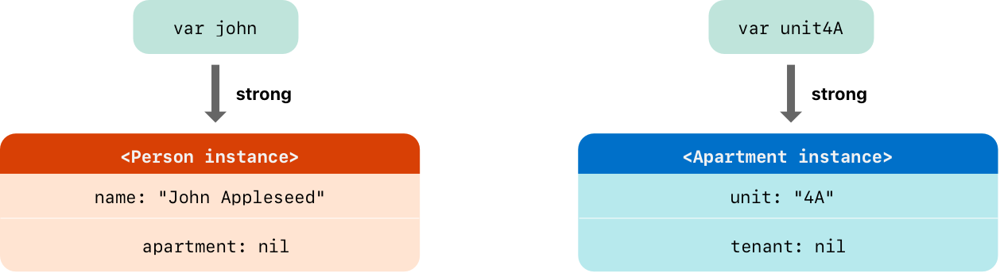
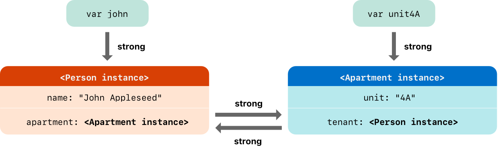
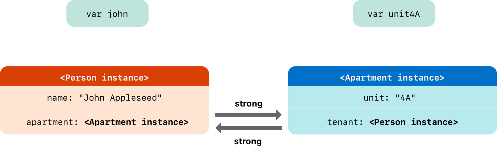
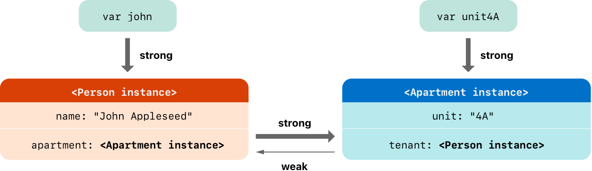
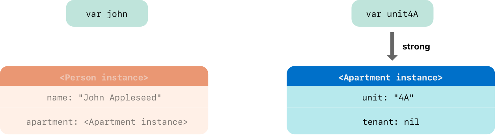
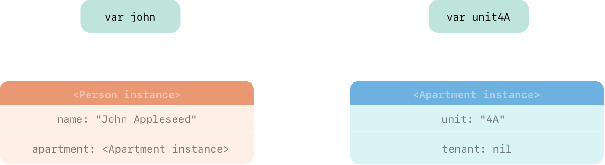
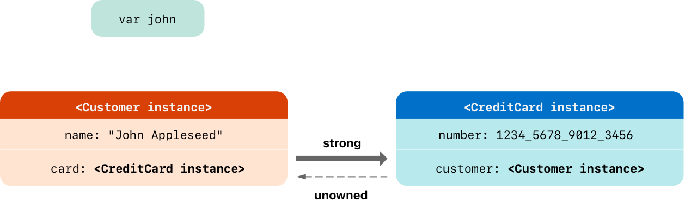
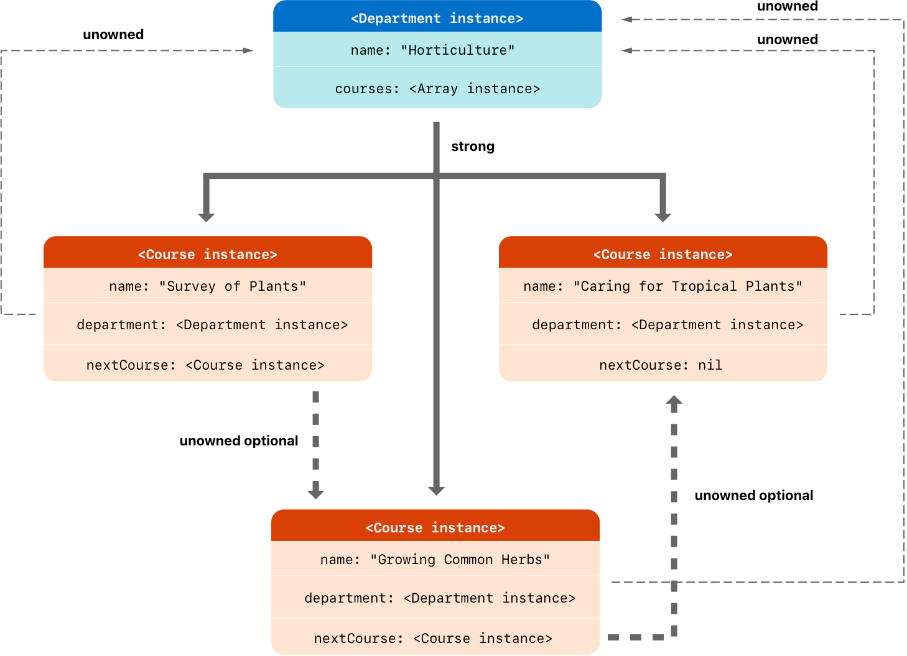
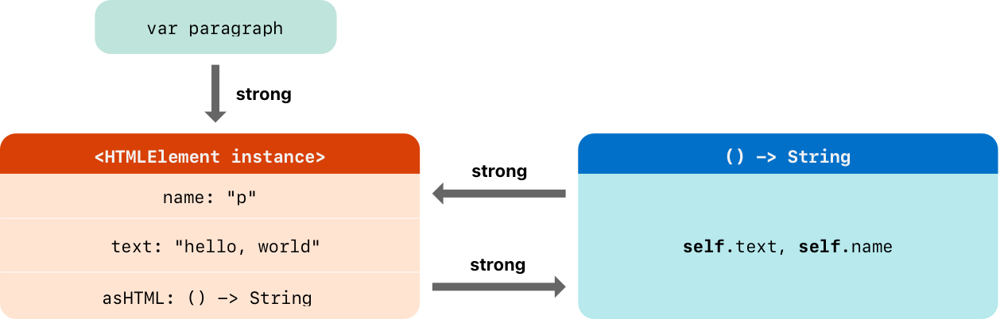

+++
title = "2.26 自动引用计数"
date = 2026-09-11T20:00:03+08:00
weight = 26
type = "docs"
description = ""
isCJKLanguage = true
draft = false
+++


> 原文链接: [https://docs.swift.org/latest/documentation/the-swift-programming-language/automaticreferencecounting/](https://docs.swift.org/latest/documentation/the-swift-programming-language/automaticreferencecounting/)

# 2.26 自动引用计数

为对象的生命周期及它们之间的关系建模。

Swift 使用*自动引用计数*（ARC）来跟踪和管理应用的内存占用。大多数情况下，这意味着在 Swift 中内存管理"自然就能工作"，你不需要自己操心内存管理：当类实例不再需要时，ARC 会自动释放它们占用的内存。

不过，在少数情况下，ARC 需要更多关于代码各部分之间关系的信息，才能替你管理内存。本章介绍这些情况，并展示如何让 ARC 管理你应用的全部内存。在 Swift 中使用 ARC 与[迁移到 ARC 发布说明](https://developer.apple.com/library/content/releasenotes/ObjectiveC/RN-TransitioningToARC/Introduction/Introduction.html)中描述的 Objective-C 用法非常相似。

引用计数只适用于类的实例。结构体和枚举是值类型，不是引用类型，不会按引用存储和传递。

## ARC 如何工作 {#How-ARC-Works}

每次创建类的新实例时，ARC 都会分配一块内存来存放关于该实例的信息。这块内存存放实例的类型信息，以及与该实例关联的所有存储属性的值。

此外，当某个实例不再需要时，ARC 会释放该实例占用的内存，好让这块内存可以用于其他用途。这确保类实例不再需要时不会继续占用内存。

不过，如果 ARC 释放了一个仍在使用中的实例，就再也无法访问该实例的属性或调用它的方法了；实际上，如果你试图访问该实例，应用很可能会崩溃。

为了确保实例在仍被需要时不会消失，ARC 会跟踪当前有多少属性、常量和变量引用着每个类实例。只要对该实例还存在至少一个有效引用，ARC 就不会释放它。

为此，每当你把类实例赋给属性、常量或变量时，这个属性、常量或变量就会对该实例建立一个*强引用*。之所以称为"强"引用，是因为它牢牢持有该实例：只要这个强引用还在，就不允许释放该实例。

## ARC 的实际运用 {#ARC-in-Action}

下面是一个自动引用计数如何工作的例子。这个例子首先定义一个名为 `Person` 的简单类，它定义了一个名为 `name` 的存储常量属性：

```swift
class Person {
    let name: String
    init(name: String) {
        self.name = name
        print("\(name) is being initialized")
    }
    deinit {
        print("\(name) is being deinitialized")
    }
}
```

`Person` 类有一个构造器，用来设置实例的 `name` 属性并打印一条消息表示初始化正在进行；它还有一个反初始化器，在类的实例被释放时打印一条消息。

下一段代码定义了三个 `Person?` 类型的变量，用来在后续代码片段中建立对同一个新 `Person` 实例的多个引用。由于这些变量是可选类型（`Person?` 而不是 `Person`），它们会自动初始化为 `nil`，目前并不引用任何 `Person` 实例。

```swift
var reference1: Person?
var reference2: Person?
var reference3: Person?
```

现在你可以创建一个新的 `Person` 实例，并把它赋给这三个变量之一：

```swift
reference1 = Person(name: "John Appleseed")
// 输出 "John Appleseed is being initialized"。
```

注意消息 `"John Appleseed is being initialized"` 是在你调用 `Person` 类构造器时打印的，这确认了初始化确实发生过。

由于新的 `Person` 实例被赋给了 `reference1` 变量，现在从 `reference1` 到该实例存在一个强引用。由于至少有一个强引用，ARC 会确保这个 `Person` 留在内存中，不会被释放。

如果你把同一个 `Person` 实例再赋给两个变量，就会再建立两个对该实例的强引用：

```swift
reference2 = reference1
reference3 = reference1
```

现在这个单一的 `Person` 实例共有*三*个强引用。

如果你把其中两个变量（包括最初那个引用）设为 `nil`，从而断开两个强引用，仍会剩下一个强引用，`Person` 实例不会被释放：

```swift
reference1 = nil
reference2 = nil
```

直到第三个、也是最后一个强引用被断开时，ARC 才会释放该 `Person` 实例——那时可以清楚地看出你已经不再使用这个 `Person` 实例了：

```swift
reference3 = nil
// 输出 "John Appleseed is being deinitialized"。
```

## 类实例之间的强引用循环 {#Strong-Reference-Cycles-Between-Class-Instances}

在上面的例子里，ARC 能够跟踪你创建的 `Person` 实例有多少个引用，并在它不再需要时释放它。

不过，也可能写出这样的代码：某个类实例*永远*不会达到零强引用的状态。当两个类实例互相持有强引用、彼此都让对方存活时，就会发生这种情况，这称为*强引用循环*。

要解决强引用循环，可以把类之间某些关系定义为弱引用或无主引用，而不是强引用。这一过程在[解决类实例之间的强引用循环](./#Resolving-Strong-Reference-Cycles-Between-Class-Instances)中介绍。不过在了解如何解决强引用循环之前，先理解这种循环是如何产生的会很有帮助。

下面是一个可能无意间造成强引用循环的例子。这个例子定义了两个类 `Person` 和 `Apartment`，用来为一栋公寓楼及其住户建模：

```swift
class Person {
    let name: String
    init(name: String) { self.name = name }
    var apartment: Apartment?
    deinit { print("\(name) is being deinitialized") }
}

class Apartment {
    let unit: String
    init(unit: String) { self.unit = unit }
    var tenant: Person?
    deinit { print("Apartment \(unit) is being deinitialized") }
}
```

每个 `Person` 实例都有一个 `String` 类型的 `name` 属性和一个初始为 `nil` 的可选 `apartment` 属性；`apartment` 之所以是可选类型，是因为一个人不一定总有公寓。

类似地，每个 `Apartment` 实例都有一个 `String` 类型的 `unit` 属性和一个初始为 `nil` 的可选 `tenant` 属性；`tenant` 之所以是可选类型，是因为一套公寓不一定总有租客。

这两个类还都定义了反初始化器，用来打印该类实例正在被释放的事实，这让你可以看到 `Person` 和 `Apartment` 的实例是否如预期地被释放。

下一段代码定义了两个可选类型的变量 `john` 和 `unit4A`，稍后会把它们设为特定的 `Apartment` 和 `Person` 实例。这两个变量由于是可选类型，初始值都是 `nil`：

```swift
var john: Person?
var unit4A: Apartment?
```

现在你可以创建一个具体的 `Person` 实例和一个 `Apartment` 实例，并把这些新实例赋给 `john` 和 `unit4A` 变量：

```swift
john = Person(name: "John Appleseed")
unit4A = Apartment(unit: "4A")
```

创建并赋值这两个实例之后，强引用的样子如下：`john` 变量对新 `Person` 实例有一个强引用，`unit4A` 变量对新 `Apartment` 实例有一个强引用。



现在你可以把这两个实例连接起来，让这个人拥有公寓、公寓拥有租客。注意这里用了感叹号（`!`）来解包并访问存放在 `john` 和 `unit4A` 可选变量中的实例，以便设置这些实例的属性：

```swift
john!.apartment = unit4A
unit4A!.tenant = john
```

连接这两个实例之后，强引用的样子如下：



遗憾的是，连接这两个实例造成了它们之间的强引用循环：`Person` 实例现在对 `Apartment` 实例有强引用，而 `Apartment` 实例也对 `Person` 实例有强引用。因此，当你断开 `john` 和 `unit4A` 变量持有的强引用时，引用计数并不会降到零，ARC 也不会释放这两个实例：

```swift
john = nil
unit4A = nil
```

注意把这两个变量设为 `nil` 时，两个反初始化器都没有被调用。强引用循环使 `Person` 和 `Apartment` 实例永远不会被释放，从而在应用中造成内存泄漏。

把 `john` 和 `unit4A` 变量设为 `nil` 之后，强引用的样子如下：



`Person` 实例与 `Apartment` 实例之间的强引用仍然存在，而且无法断开。

## 解决类实例之间的强引用循环 {#Resolving-Strong-Reference-Cycles-Between-Class-Instances}

处理类类型属性时，Swift 提供两种解决强引用循环的方式：弱引用和无主引用。

弱引用和无主引用让引用循环中的一个实例可以指向另一个实例，而*不必*强持有它，这样两个实例就可以互相引用而不会造成强引用循环。

当另一个实例的生命周期更短——也就是它可能先被释放——时，使用弱引用。在上面的 `Apartment` 例子里，一套公寓在其生命周期中可能没有租客，因此弱引用是打破该引用循环的合适方式。相比之下，当另一个实例的生命周期相同或更长时，使用无主引用。

### 弱引用 {#Weak-References}

*弱引用*不会强持有它所指向的实例，因此不会阻止 ARC 释放被引用的实例。这一行为可以避免该引用成为强引用循环的一部分。把 `weak` 关键字写在属性或变量声明之前，就表示这是弱引用。

由于弱引用不会强持有它所指向的实例，该实例有可能在弱引用仍指向它时被释放。因此，当弱引用所指的实例被释放时，ARC 会自动把该弱引用设为 `nil`。又由于弱引用需要允许它的值在运行时变为 `nil`，它们总是被声明为可选类型的变量，而不是常量。

你可以像检查其他可选值那样检查弱引用中是否存在值，而且永远不会得到一个指向已不存在的无效实例的引用。

> 注意：当 ARC 把弱引用设为 `nil` 时，
> 属性观察器不会被调用。

下面的例子与上面的 `Person` 和 `Apartment` 例子完全相同，只有一处重要差别：这一次 `Apartment` 类型的 `tenant` 属性被声明为弱引用：

```swift
class Person {
    let name: String
    init(name: String) { self.name = name }
    var apartment: Apartment?
    deinit { print("\(name) is being deinitialized") }
}

class Apartment {
    let unit: String
    init(unit: String) { self.unit = unit }
    weak var tenant: Person?
    deinit { print("Apartment \(unit) is being deinitialized") }
}
```

两个变量（`john` 和 `unit4A`）的强引用以及两个实例之间的连接与之前一样建立：

```swift
var john: Person?
var unit4A: Apartment?

john = Person(name: "John Appleseed")
unit4A = Apartment(unit: "4A")

john!.apartment = unit4A
unit4A!.tenant = john
```

把两个实例连接起来之后，引用关系如下：



`Person` 实例仍然对 `Apartment` 实例有强引用，但 `Apartment` 实例现在对 `Person` 实例持有*弱*引用。这意味着当你把 `john` 变量设为 `nil`、断开它持有的强引用之后，就不再有任何强引用指向 `Person` 实例了：

```swift
john = nil
// 输出 "John Appleseed is being deinitialized"。
```

由于不再有强引用指向 `Person` 实例，它会被释放，`tenant` 属性被设为 `nil`：



对 `Apartment` 实例仅存的强引用来自 `unit4A` 变量。如果你断开*这个*强引用，就不再有任何强引用指向 `Apartment` 实例：

```swift
unit4A = nil
// 输出 "Apartment 4A is being deinitialized"。
```

由于不再有强引用指向 `Apartment` 实例，它同样会被释放：



> 注意：在使用垃圾回收的系统中，
> 弱指针有时被用来实现简单的缓存机制，
> 因为没有强引用的对象要等到内存压力触发垃圾回收时才会被释放。
> 而在 ARC 下，值会在最后一个强引用被移除时立即释放，
> 因此弱引用不适合这种用途。

### 无主引用 {#Unowned-References}

与弱引用一样，*无主引用*也不会强持有它所指向的实例。不过与弱引用不同的是，当另一个实例的生命周期相同或更长时，就使用无主引用。把 `unowned` 关键字写在属性或变量声明之前，就表示这是无主引用。

与弱引用不同，无主引用被期望始终有值。因此，把值标记为无主并不会让它变成可选类型，ARC 也永远不会把无主引用的值设为 `nil`。

> 重要：只有当你确信该引用*始终*指向一个尚未被释放的实例时，才使用无主引用。
>
> 如果你在该实例被释放之后试图访问无主引用的值，
> 就会得到运行时错误。

下面的例子定义了两个类 `Customer` 和 `CreditCard`，用来为银行客户以及该客户可能的信用卡建模。这两个类各自把一个对方的实例存为属性，这种关系有可能造成强引用循环。

`Customer` 与 `CreditCard` 之间的关系与上面弱引用例子中 `Apartment` 与 `Person` 的关系略有不同：在这个数据模型中，客户可能没有信用卡，但一张信用卡*总是*与某个客户关联。`CreditCard` 实例的存活期绝不会超过它所指向的 `Customer`。为了表示这一点，`Customer` 类有一个可选的 `card` 属性，而 `CreditCard` 类有一个无主（且非可选）的 `customer` 属性。

此外，只能通过把 `number` 值和 `customer` 实例传给自定义的 `CreditCard` 构造器来创建新的 `CreditCard` 实例。这确保 `CreditCard` 实例在创建时总是关联着一个 `customer` 实例。

由于信用卡总是对应某个客户，你把它的 `customer` 属性定义为无主引用，以避免强引用循环：

```swift
class Customer {
    let name: String
    var card: CreditCard?
    init(name: String) {
        self.name = name
    }
    deinit { print("\(name) is being deinitialized") }
}

class CreditCard {
    let number: UInt64
    unowned let customer: Customer
    init(number: UInt64, customer: Customer) {
        self.number = number
        self.customer = customer
    }
    deinit { print("Card #\(number) is being deinitialized") }
}
```

> 注意：`CreditCard` 类的 `number` 属性被定义为 `UInt64` 而不是 `Int`，
> 以确保在 32 位和 64 位系统上，
> `number` 属性的容量都足以存放 16 位的卡号。

下一段代码定义了一个可选的 `Customer` 变量 `john`，用来存放对某个具体客户的引用。由于是可选类型，这个变量的初始值为 `nil`：

```swift
var john: Customer?
```

现在你可以创建一个 `Customer` 实例，并用它来初始化并把一个新的 `CreditCard` 实例赋给该客户的 `card` 属性：

```swift
john = Customer(name: "John Appleseed")
john!.card = CreditCard(number: 1234_5678_9012_3456, customer: john!)
```

把两个实例连接起来之后，引用关系如下：


`Customer` 实例现在对 `CreditCard` 实例有强引用，而 `CreditCard` 实例对 `Customer` 实例持有无主引用。

由于 `customer` 是无主引用，当你断开 `john` 变量持有的强引用时，就不再有任何强引用指向 `Customer` 实例：



由于不再有强引用指向 `Customer` 实例，它会被释放。此后也不再有任何强引用指向 `CreditCard` 实例，于是它也被释放：

```swift
john = nil
// 输出 "John Appleseed is being deinitialized"。
// 输出 "Card #1234567890123456 is being deinitialized"。
```

上面最后这段代码表明，把 `john` 变量设为 `nil` 之后，`Customer` 实例和 `CreditCard` 实例的反初始化器都打印出了各自的"deinitialized"消息。

> 注意：上面的例子展示的是*安全*无主引用的用法。
> Swift 还提供*不安全*无主引用，用于需要关闭运行时安全检查的场景——
> 例如出于性能考虑。
> 与所有不安全操作一样，
> 你需要自己承担检查代码安全性的责任。
>
> 写 `unowned(unsafe)` 就表示不安全无主引用。
> 如果你在它所指向的实例被释放之后
> 试图访问不安全无主引用，
> 程序会尝试访问该实例原先所在的内存位置，
> 这是一种不安全操作。

### 无主可选引用 {#Unowned-Optional-References}

你可以把指向类的可选引用标记为无主。就 ARC 的所有权模型而言，无主可选引用和弱引用可以用在相同的场景中；区别在于使用无主可选引用时，你需要自己负责确保它始终指向有效对象，或者被设为 `nil`。

下面是一个记录学校某个系所开设课程的例子：

```swift
class Department {
    var name: String
    var courses: [Course]
    init(name: String) {
        self.name = name
        self.courses = []
    }
}

class Course {
    var name: String
    unowned var department: Department
    unowned var nextCourse: Course?
    init(name: String, in department: Department) {
        self.name = name
        self.department = department
        self.nextCourse = nil
    }
}
```

`Department` 对系里开设的每门课程持有强引用。在 ARC 所有权模型下，系拥有它开设的课程。`Course` 有两个无主引用：一个指向系，一个指向学生接下来应学的下一门课程；课程并不拥有这两个对象中的任何一个。每门课程都属于某个系，因此 `department` 属性不是可选类型；但由于有些课程没有推荐的后续课程，`nextCourse` 属性是可选类型。

下面是使用这些类的例子：

```swift
let department = Department(name: "Horticulture")

let intro = Course(name: "Survey of Plants", in: department)
let intermediate = Course(name: "Growing Common Herbs", in: department)
let advanced = Course(name: "Caring for Tropical Plants", in: department)

intro.nextCourse = intermediate
intermediate.nextCourse = advanced
department.courses = [intro, intermediate, advanced]
```

上面的代码创建了一个系及其三门课程。入门课和进阶课都在 `nextCourse` 属性中存有建议的后续课程，该属性对"学生学完这门课后应学的课程"持有一个无主可选引用。



无主可选引用不会强持有它所包装的类实例，因此不会阻止 ARC 释放该实例。它在 ARC 下的行为与无主引用相同，区别只在于无主可选引用可以是 `nil`。

与非可选无主引用一样，你需要负责确保 `nextCourse` 始终指向一门尚未被释放的课程。例如在这个例子里，当你从 `department.courses` 中删除一门课程时，还需要移除其他课程可能对它的引用。

> 注意：可选值的底层类型是 `Optional`，
> 它是 Swift 标准库中的一个枚举。
> 不过，可选类型是"值类型不能被标记 `unowned`"这条规则的一个例外。
>
> 包装类的可选值不使用引用计数，
> 因此你不需要为这个可选值维持强引用。

### 无主引用与隐式解包可选属性 {#Unowned-References-and-Implicitly-Unwrapped-Optional-Properties}

上面关于弱引用和无主引用的例子涵盖了需要打破强引用循环的两种较常见场景。

`Person` 与 `Apartment` 的例子展示了这样一种情况：两个都允许为 `nil` 的属性有可能造成强引用循环，这种场景最好用弱引用来解决。

`Customer` 与 `CreditCard` 的例子展示了另一种情况：一个允许为 `nil` 的属性和一个不能为 `nil` 的属性有可能造成强引用循环，这种场景最好用无主引用来解决。

不过还有第三种场景：两个属性都应当始终有值，而且一旦初始化完成就都不应为 `nil`。在这种情况下，把其中一个类的属性设为无主引用、另一个类的属性设为隐式解包可选属性会很有用。

这样既能在初始化完成后直接访问两个属性（无需解包可选值），又能避免引用循环。本节展示如何建立这样的关系。

下面的例子定义了两个类 `Country` 和 `City`，它们各自把一个对方的实例存为属性。在这个数据模型中，每个国家必须始终有一个首都，每个城市也必须始终属于某个国家。为了表示这一点，`Country` 类有一个 `capitalCity` 属性，`City` 类有一个 `country` 属性：

```swift
class Country {
    let name: String
    var capitalCity: City!
    init(name: String, capitalName: String) {
        self.name = name
        self.capitalCity = City(name: capitalName, country: self)
    }
}

class City {
    let name: String
    unowned let country: Country
    init(name: String, country: Country) {
        self.name = name
        self.country = country
    }
}
```

为了建立两个类之间的相互依赖，`City` 的构造器接受一个 `Country` 实例，并把这个实例存放在自己的 `country` 属性中。

`City` 的构造器是在 `Country` 的构造器内部调用的；但正如[两阶段初始化](../2.14-Initialization/#Two-Phase-Initialization)所述，`Country` 的构造器要等到新的 `Country` 实例完全初始化之后才能把 `self` 传给 `City` 的构造器。

为满足这一要求，你把 `Country` 的 `capitalCity` 属性声明为隐式解包可选属性，用类型标注末尾的感叹号（`City!`）表示。这意味着 `capitalCity` 属性像其他可选值一样默认值为 `nil`，但可以不解包值就直接访问，详见[隐式解包可选值](../2.1-TheBasics/#Implicitly-Unwrapped-Optionals)。

由于 `capitalCity` 有默认值 `nil`，`Country` 实例在其构造器内设置 `name` 属性之后，就被视为完全初始化了。这意味着 `Country` 的构造器一旦设置好 `name` 属性，就可以开始引用并传递隐式的 `self`。因此，当 `Country` 的构造器设置自己的 `capitalCity` 属性时，可以把 `self` 作为 `City` 构造器的参数之一传入。

这一切意味着你可以在一条语句中创建 `Country` 和 `City` 实例，而不会造成强引用循环；而且 `capitalCity` 属性可以直接访问，无需用感叹号解包其可选值：

```swift
var country = Country(name: "Canada", capitalName: "Ottawa")
print("\(country.name)'s capital city is called \(country.capitalCity.name)")
// 输出 "Canada's capital city is called Ottawa"。
```

在上面的例子里，使用隐式解包可选值意味着类初始化的两阶段要求都得到了满足：初始化完成后，`capitalCity` 属性可以像非可选值一样使用和访问，同时又避免了强引用循环。

## 闭包的强引用循环 {#Strong-Reference-Cycles-for-Closures}

前面你已经看到，当两个类实例属性互相持有强引用时会造成强引用循环，也看到了如何用弱引用和无主引用来打破这些循环。

如果你把一个闭包赋给类实例的某个属性，而这个闭包的语句体捕获了该实例，同样会造成强引用循环。这种捕获可能是因为闭包体访问了该实例的属性（例如 `self.someProperty`），也可能是因为闭包调用了该实例的方法（例如 `self.someMethod()`）。无论哪种情况，这些访问都会让闭包"捕获" `self`，从而造成强引用循环。

之所以会造成强引用循环，是因为闭包和类一样都是*引用类型*：把一个闭包赋给属性，赋的是对该闭包的*引用*。本质上这和上面的问题相同——两个强引用让彼此存活；只不过这次相互维持的不是两个类实例，而是一个类实例和一个闭包。

Swift 为这个问题提供了优雅的解决方案，称为*闭包捕获列表*。不过在了解如何用闭包捕获列表打破强引用循环之前，先理解这种循环是如何造成的会很有帮助。

下面的例子展示了在使用引用 `self` 的闭包时，如何造成强引用循环。这个例子定义了一个名为 `HTMLElement` 的类，为 HTML 文档中的单个元素提供一个简单模型：

```swift
class HTMLElement {
    let name: String
    let text: String?

    lazy var asHTML: () -> String = {
        if let text = self.text {
            return "<\(self.name)>\(text)</\(self.name)>"
        } else {
            return "<\(self.name) />"
        }
    }

    init(name: String, text: String? = nil) {
        self.name = name
        self.text = text
    }

    deinit {
        print("\(name) is being deinitialized")
    }
}
```

`HTMLElement` 类定义了一个 `name` 属性，表示元素的名字，例如标题元素是 `"h1"`、段落元素是 `"p"`、换行元素是 `"br"`。它还定义了一个可选的 `text` 属性，你可以把要在该 HTML 元素中渲染的文本字符串赋给它。

除了这两个简单属性，`HTMLElement` 类还定义了一个名为 `asHTML` 的延迟属性。该属性引用一个闭包，把 `name` 和 `text` 组合成一段 HTML 字符串片段。`asHTML` 属性的类型是 `() -> String`，也就是"一个不接受参数、返回 `String` 值的函数"。

默认情况下，`asHTML` 属性被赋以一个返回 HTML 标签字符串表示的闭包：如果可选的 `text` 值存在，这个标签就包含该值；如果 `text` 不存在，就没有文本内容。对于段落元素，闭包会返回 `"<p>some text</p>"` 或 `"<p />"`，取决于 `text` 属性等于 `"some text"` 还是 `nil`。

`asHTML` 属性的命名和使用方式有点像一个实例方法。不过由于 `asHTML` 是闭包属性而不是实例方法，你可以用自定义闭包替换它的默认值，从而改变某个 HTML 元素的渲染方式。

例如，可以把 `asHTML` 属性设为一个在 `text` 属性为 `nil` 时使用默认文本的闭包，避免渲染出空的 HTML 标签：

```swift
let heading = HTMLElement(name: "h1")
let defaultText = "some default text"
heading.asHTML = {
    return "<\(heading.name)>\(heading.text ?? defaultText)</\(heading.name)>"
}
print(heading.asHTML())
// 输出 "<h1>some default text</h1>"。
```

> 注意：`asHTML` 属性被声明为延迟属性，
> 因为只有当某个元素确实需要被渲染成字符串值
> 用于某个 HTML 输出目标时，它才会被用到。
> `asHTML` 是延迟属性这一点意味着你可以在其中引用 `self`
> 在默认闭包内引用 `self`，
> 因为该延迟属性要到初始化完成、确定 `self` 存在之后才会被访问。

`HTMLElement` 类提供了一个构造器，接受 `name` 实参以及（可选的）`text` 实参来初始化新元素。该类还定义了一个反初始化器，在 `HTMLElement` 实例被释放时打印一条消息。

下面是用 `HTMLElement` 类创建并打印新实例的方式：

```swift
var paragraph: HTMLElement? = HTMLElement(name: "p", text: "hello, world")
print(paragraph!.asHTML())
// 输出 "<p>hello, world</p>"。
```

> 注意：上面的 `paragraph` 变量被定义为*可选*的 `HTMLElement`，
> 以便下面把它设为 `nil` 来演示
> 强引用循环的存在。

遗憾的是，按上面这样写出的 `HTMLElement` 类，会在 `HTMLElement` 实例与其默认 `asHTML` 值所用的闭包之间造成强引用循环。循环的样子如下：



实例的 `asHTML` 属性对它的闭包持有强引用；但该闭包在语句体中引用了 `self`（用来引用 `self.name` 和 `self.text`），因此闭包*捕获*了 self，这意味着它反过来对 `HTMLElement` 实例持有强引用，两者之间就形成了强引用循环。（关于闭包捕获值的更多内容，参见[捕获值](../2.7-Closures/#Capturing-Values)。）

> 注意：即使闭包多次引用 `self`，
> 它对 `HTMLElement` 实例也只捕获一个强引用。

如果你把 `paragraph` 变量设为 `nil`、断开它到 `HTMLElement` 实例的强引用，这个强引用循环会阻止 `HTMLElement` 实例及其闭包被释放：

```swift
paragraph = nil
```

注意 `HTMLElement` 反初始化器中的消息没有打印出来，这表明 `HTMLElement` 实例没有被释放。

## 解决闭包的强引用循环 {#Resolving-Strong-Reference-Cycles-for-Closures}

要解决闭包与类实例之间的强引用循环，可以在闭包定义中加上*捕获列表*。捕获列表定义了在闭包体中捕获一个或多个引用类型时所用的规则。与两个类实例之间的强引用循环一样，你把每个被捕获的引用声明为弱引用或无主引用，而不是强引用。究竟该用弱引用还是无主引用，取决于代码各部分之间的关系。

> 注意：当你在闭包中引用 `self` 的成员时，
> Swift 要求你写 `self.someProperty` 或 `self.someMethod()`
> （而不只是 `someProperty` 或 `someMethod()`）。
> 这有助于提醒你注意可能无意间捕获了 `self`。

### 定义捕获列表 {#Defining-a-Capture-List}

捕获列表中的每一项都是把 `weak` 或 `unowned` 关键字与"对某个类实例的引用（例如 `self`）"或"用某个值初始化的变量（例如 `delegate = self.delegate`）"配对。这些配对写在一对方括号内，用逗号分隔。

如果闭包提供了参数列表和返回类型，就把捕获列表写在它们之前：

```swift
lazy var someClosure = {
        [unowned self, weak delegate = self.delegate]
        (index: Int, stringToProcess: String) -> String in
    // 闭包体写在这里
}
```

如果闭包没有写参数列表或返回类型（因为可以从上下文推断），就把捕获列表写在闭包最开头，后面跟 `in` 关键字：

```swift
lazy var someClosure = {
        [unowned self, weak delegate = self.delegate] in
    // 闭包体写在这里
}
```

### 弱引用与无主引用 {#Weak-and-Unowned-References}

当闭包与它所捕获的实例始终互相引用、并且总是同时被释放时，就把闭包中的该捕获定义为无主引用。

反过来，当被捕获的引用将来可能变成 `nil` 时，就把它定义为弱引用。弱引用总是可选类型，并在其引用的实例被释放时自动变为 `nil`，这让你可以在闭包体中检查它是否存在。

> 注意：如果被捕获的引用永远不会变成 `nil`，
> 就应当始终把它捕获为无主引用，
> 而不是弱引用。

要解决上面[闭包的强引用循环](./#Strong-Reference-Cycles-for-Closures)中 `HTMLElement` 例子的强引用循环，合适的捕获方式是无主引用。下面是这样改写以避免循环的 `HTMLElement` 类：

```swift
class HTMLElement {
    let name: String
    let text: String?

    lazy var asHTML: () -> String = {
            [unowned self] in
        if let text = self.text {
            return "<\(self.name)>\(text)</\(self.name)>"
        } else {
            return "<\(self.name) />"
        }
    }

    init(name: String, text: String? = nil) {
        self.name = name
        self.text = text
    }

    deinit {
        print("\(name) is being deinitialized")
    }
}
```

这个 `HTMLElement` 实现与上一个实现完全相同，只是在 `asHTML` 闭包中加入了捕获列表。这里的捕获列表是 `[unowned self]`，意思是"把 self 捕获为无主引用，而不是强引用"。

你可以像之前那样创建并打印 `HTMLElement` 实例：

```swift
var paragraph: HTMLElement? = HTMLElement(name: "p", text: "hello, world")
print(paragraph!.asHTML())
// 输出 "<p>hello, world</p>"。
```

有了捕获列表之后，引用关系如下：


这一次，闭包对 `self` 的捕获是无主引用，不会强持有它所捕获的 `HTMLElement` 实例。如果你把 `paragraph` 变量持有的强引用设为 `nil`，`HTMLElement` 实例就会被释放，下面例子中打印出的反初始化器消息可以说明这一点：

```swift
paragraph = nil
// 输出 "p is being deinitialized"。
```

关于捕获列表的更多内容，参见[捕获列表](../../languagereference/3.4-Expressions/#Capture-Lists)。
