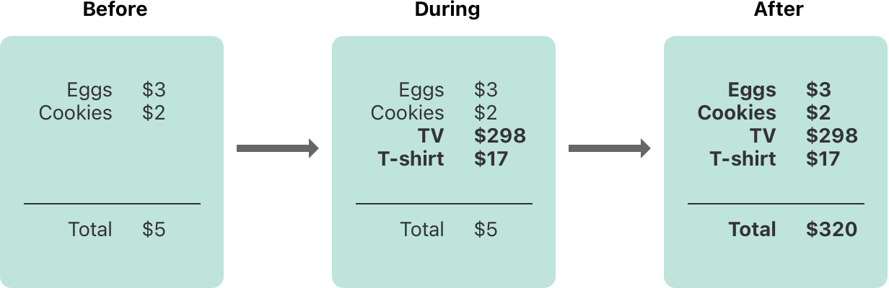
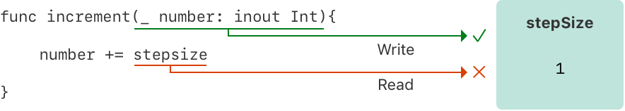
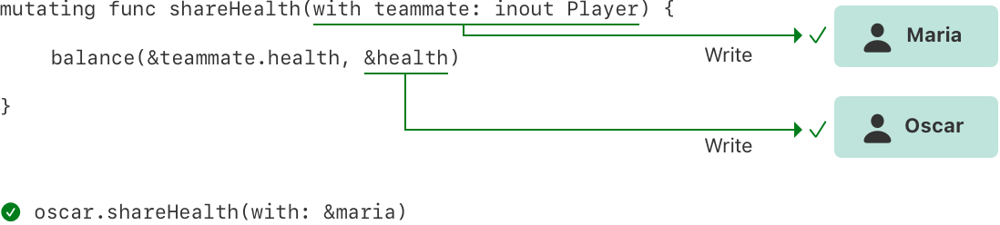
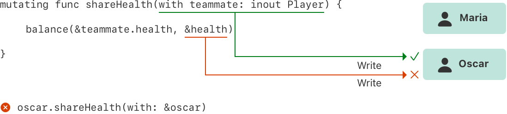

+++
title = "2.27 内存安全"
date = 2026-09-11T20:00:03+08:00
weight = 27
type = "docs"
description = ""
isCJKLanguage = true
draft = false
+++


> 原文链接: [https://docs.swift.org/latest/documentation/the-swift-programming-language/memorysafety/](https://docs.swift.org/latest/documentation/the-swift-programming-language/memorysafety/)

# 2.27 内存安全

合理安排代码结构，避免访问内存时发生冲突。

默认情况下，Swift 会阻止代码中发生不安全的行为。例如，Swift 确保变量在使用之前已经初始化、内存被释放之后不会再被访问，并且数组下标会做越界检查。

Swift 还要求修改内存位置的代码拥有对该内存的独占访问，从而保证对同一块内存的多次访问不会冲突。由于 Swift 自动管理内存，大多数时候你完全不必考虑内存访问的问题。不过，了解潜在冲突可能出现的位置仍然很重要，这样你才能避免写出对内存访问有冲突的代码。如果你的代码确实存在冲突，就会得到编译期或运行时的错误。

## 理解内存的访问冲突 {#Understanding-Conflicting-Access-to-Memory}

当你在代码中设置变量值、向函数传参等操作时，就会发生内存访问。例如，下面的代码同时包含一次读访问和一次写访问：

```swift
// 对存放 one 的内存的一次写访问。
var one = 1

// 从存放 one 的内存的一次读访问。
print("We're number \(one)!")
```

当代码的不同部分试图同时访问同一块内存位置时，就会发生内存访问冲突。同时多次访问同一块内存位置可能产生不可预测或不一致的行为。在 Swift 中，有些修改值的操作会跨越好几行代码，这就使得在值自身修改的过程中去访问它成为可能。

想想在纸上更新一份预算，就能看到类似的问题。更新预算是两步操作：先加上各项的名称和价格，再把总金额改成反映当前清单上各项的数值。在更新前后，你可以读取预算中的任何信息并得到正确结果，如下图所示。



而在添加预算项目的过程中，预算处于临时的无效状态，因为总金额还没有更新以反映新加入的项目。此时读取总金额会得到不正确的结果。

这个例子还体现了修复内存访问冲突时可能遇到的难题：有时修复冲突的方式不止一种，而它们会给出不同的答案，并且哪个答案正确并不总是显而易见的。在这个例子里，取决于你想要的是原来的总金额还是更新后的总金额，`$5` 或 `$320` 都可能是正确答案。在修复冲突之前，你必须先确定这段代码本来想做什么。

> 注意：如果你写过并发或多线程代码，
> 内存访问冲突可能是你熟悉的问题。
> 不过这里讨论的访问冲突可能发生在*单线程*中，
> 并*不*涉及并发或多线程代码。
>
> 如果在单个线程内出现内存访问冲突，
> Swift 保证你会在编译期或运行时得到错误。
> 对于多线程代码，
> 请使用 [Thread Sanitizer](https://developer.apple.com/documentation/xcode/diagnosing_memory_thread_and_crash_issues_early)
> 来帮助检测跨线程的访问冲突。

### 内存访问的特征 {#Characteristics-of-Memory-Access}

在访问冲突的语境下，需要考虑内存访问的三个特征：访问是读还是写、访问的持续时间，以及被访问的内存位置。具体来说，如果你有两次访问同时满足下列所有条件，就发生了冲突：

- 这两次访问并非都是读访问，也并非都是原子访问。
- 它们访问的是同一块内存位置。
- 它们的持续时间有重叠。

读访问与写访问的区别通常很明显：写访问会改变内存位置，读访问则不会。内存位置指的是被访问的对象——例如某个变量、常量或属性。内存访问的持续时间要么是瞬时的，要么是长期的。

如果一次访问是在 [`Atomic`] 或 [`AtomicLazyReference`] 上调用原子操作，或者只使用 C 的原子操作，那么这次访问是*原子*的；否则它是非原子的。C 原子函数列表参见 `stdatomic(3)` 手册页。

[`Atomic`]: https://developer.apple.com/documentation/synchronization/atomic
[`AtomicLazyReference`]: https://developer.apple.com/documentation/synchronization/atomiclazyreference

如果某次访问开始之后、结束之前不可能运行其他代码，那么这次访问就是*瞬时的*。从本质上看，两次瞬时访问不可能同时发生。大多数内存访问都是瞬时的。例如下面代码清单中的所有读访问和写访问都是瞬时的：

```swift
func oneMore(than number: Int) -> Int {
    return number + 1
}

var myNumber = 1
myNumber = oneMore(than: myNumber)
print(myNumber)
// 输出 "2"。
```

不过，有几种内存访问会跨越其他代码的执行，称为*长期*访问。瞬时访问与长期访问的区别在于：长期访问开始之后、结束之前，可能有其他代码运行，这称为*重叠*。长期访问可以与其他长期访问和瞬时访问重叠。

重叠访问主要出现在使用函数、方法的输入输出参数，或者结构体的可变方法的代码中。下面几节将讨论使用长期访问的具体 Swift 代码。

## 输入输出参数的访问冲突 {#Conflicting-Access-to-In-Out-Parameters}

函数对所有输入输出参数都拥有长期写访问。输入输出参数的写访问在所有非输入输出参数求值完成之后开始，并持续整个函数调用的过程。如果有多个输入输出参数，写访问按照参数出现的顺序依次开始。

这种长期写访问带来的一个后果是：即使作用域规则和访问控制本来允许，你也不能访问作为输入输出参数传入的那个原变量——对原变量的任何访问都会造成冲突。例如：

```swift
var stepSize = 1

func increment(_ number: inout Int) {
    number += stepSize
}

increment(&stepSize)
// 错误：对 stepSize 的访问冲突。
```

在上面的代码中，`stepSize` 是全局变量，通常可以从 `increment(_:)` 内部访问。然而，对 `stepSize` 的读访问与对 `number` 的写访问重叠了。如下图所示，`number` 和 `stepSize` 指向同一块内存位置，读访问与写访问指向同一块内存且相互重叠，于是产生了冲突。



解决这个冲突的一种做法是显式复制 `stepSize`：

```swift
// 显式复制一份。
var copyOfStepSize = stepSize
increment(&copyOfStepSize)

// 更新原变量。
stepSize = copyOfStepSize
// stepSize 现在是 2
```

在调用 `increment(_:)` 之前先复制 `stepSize`，就清楚地表明 `copyOfStepSize` 的值是按当前步长递增的。读访问在写访问开始之前就结束了，因此不存在冲突。

输入输出参数的长期写访问还有一个后果：把同一个变量作为同一个函数的多个输入输出参数的实参传入，也会产生冲突。例如：

```swift
func balance(_ x: inout Int, _ y: inout Int) {
    let sum = x + y
    x = sum / 2
    y = sum - x
}
var playerOneScore = 42
var playerTwoScore = 30
balance(&playerOneScore, &playerTwoScore)  // OK
balance(&playerOneScore, &playerOneScore)
// 错误：对 playerOneScore 的访问冲突。
```

上面的 `balance(_:_:)` 函数修改它的两个参数，把总数值平均分配。用 `playerOneScore` 和 `playerTwoScore` 作为实参调用它不会产生冲突——这里有两次在时间上重叠的写访问，但它们访问的是不同的内存位置。相比之下，把 `playerOneScore` 同时作为两个参数的值传入就会产生冲突，因为它试图同时对同一块内存位置执行两次写访问。

> 注意：由于运算符也是函数，
> 它们也可能对自己的输入输出参数产生长期访问。
> 例如，如果 `balance(_:_:)` 是一个名为 `<^>` 的运算符函数，
> 那么写 `playerOneScore <^> playerOneScore`
> 会导致与 `balance(&playerOneScore, &playerOneScore)` 相同的冲突。

## 方法中对 self 的访问冲突 {#Conflicting-Access-to-self-in-Methods}

结构体上的可变方法在方法调用的整个持续时间内都对 `self` 拥有写访问。例如，设想一个游戏，每名玩家都有一个生命值，受伤时会减少，还有一个能量值，使用特殊能力时会减少。

```swift
struct Player {
    var name: String
    var health: Int
    var energy: Int

    static let maxHealth = 10
    mutating func restoreHealth() {
        health = Player.maxHealth
    }
}
```

在上面这个 `restoreHealth()` 方法中，对 `self` 的写访问从方法开始处一直持续到方法返回。在这种情况下，`restoreHealth()` 内部没有其他代码可能会重叠访问 `Player` 实例的属性。下面的 `shareHealth(with:)` 方法接受另一个 `Player` 实例作为输入输出参数，这就产生了重叠访问的可能。

```swift
extension Player {
    mutating func shareHealth(with teammate: inout Player) {
        balance(&teammate.health, &health)
    }
}

var oscar = Player(name: "Oscar", health: 10, energy: 10)
var maria = Player(name: "Maria", health: 5, energy: 10)
oscar.shareHealth(with: &maria)  // OK
```

在上面的例子里，让 Oscar 的玩家调用 `shareHealth(with:)` 方法把生命值分给 Maria 的玩家，并不会造成冲突：在方法调用期间，由于 `oscar` 是可变方法中 `self` 的值，对 `oscar` 有一次写访问；而在同一时间段内，由于 `maria` 作为输入输出参数传入，对 `maria` 也有一次写访问。如下图所示，它们访问的是不同的内存位置，因此尽管两次写访问在时间上重叠，它们并不冲突。



然而，如果你把 `oscar` 作为实参传给 `shareHealth(with:)`，就会产生冲突：

```swift
oscar.shareHealth(with: &oscar)
// 错误：对 oscar 的访问冲突。
```

可变方法在方法持续期间需要对 `self` 的写访问，而输入输出参数在同一持续期间内需要对 `teammate` 的写访问。在方法内部，`self` 和 `teammate` 指向同一块内存位置——如下图所示。两次写访问指向同一块内存且相互重叠，于是产生了冲突。



## 属性的访问冲突 {#Conflicting-Access-to-Properties}

结构体、元组和枚举之类的类型由各个组成值构成，比如结构体的属性或元组的元素。由于它们是值类型，修改值的任何一部分都会修改整个值，也就是说，读或写其中一个属性需要对整个值的读或写访问。例如，对元组元素的重叠写访问会产生冲突：

```swift
var playerInformation = (health: 10, energy: 20)
balance(&playerInformation.health, &playerInformation.energy)
// 错误：对 playerInformation 各属性的访问冲突。
```

在上面的例子里，对元组的元素调用 `balance(_:_:)` 会产生冲突，因为存在对 `playerInformation` 的重叠写访问。`playerInformation.health` 和 `playerInformation.energy` 都作为输入输出参数传入，这意味着 `balance(_:_:)` 在函数调用持续期间需要对它们的写访问。而在这两种情况下，对元组元素的写访问都要求对整个元组的写访问，也就是说存在两次对 `playerInformation` 的、持续时间重叠的写访问，因而产生冲突。

下面的代码表明，对存放在全局变量中的结构体属性做重叠写访问会出现同样的错误。

```swift
var holly = Player(name: "Holly", health: 10, energy: 10)
balance(&holly.health, &holly.energy)  // 错误
```

实践中，对结构体属性的大多数访问都可以安全地重叠。例如，如果把上面例子中的变量 `holly` 改成局部变量而不是全局变量，编译器就能证明对该结构体存储属性的重叠访问是安全的：

```swift
func someFunction() {
    var oscar = Player(name: "Oscar", health: 10, energy: 10)
    balance(&oscar.health, &oscar.energy)  // OK
}
```

在上面的例子里，Oscar 的生命值和能量作为两个输入输出参数传给 `balance(_:_:)`。编译器可以证明内存安全得以保持，因为这两个存储属性之间不存在任何相互影响。

为保持内存安全，并不总是需要对结构体属性的重叠访问加以限制。内存安全是希望达成的保证，而独占访问比内存安全的要求更严格——也就是说，有些代码保持了内存安全，却违反了内存的独占访问。如果编译器能证明对内存的非独占访问仍然是安全的，Swift 就允许这样的内存安全代码。具体来说，如果满足下列条件，编译器就能证明对结构体属性的重叠访问是安全的：

- 你只访问实例的存储属性，而不访问计算属性或类属性。
- 该结构体是局部变量的值，而不是全局变量的值。
- 该结构体没有被任何闭包捕获，或者只被非逃逸闭包捕获。

如果编译器无法证明访问是安全的，它就不允许这种访问。
