+++
title = "2.29 高级运算符"
date = 2026-09-11T20:00:03+08:00
weight = 29
type = "docs"
description = ""
isCJKLanguage = true
draft = false
+++


> 原文链接: [https://docs.swift.org/latest/documentation/the-swift-programming-language/advancedoperators/](https://docs.swift.org/latest/documentation/the-swift-programming-language/advancedoperators/)

# 2.29 高级运算符

定义自定义运算符、执行按位运算，以及使用构建器语法。

除了[基本运算符](../2.2-BasicOperators/)中介绍的运算符，Swift 还提供了若干执行更复杂取值操作的高级运算符，其中包括你在 C 和 Objective-C 中熟悉的全部按位运算符和移位运算符。

与 C 中的算术运算符不同，Swift 的算术运算符默认不会溢出：溢出行为会被捕获并作为错误报告。若要允许溢出，可以使用 Swift 中默认允许溢出的第二套算术运算符，例如溢出加法运算符（`&+`）。所有这些溢出运算符都以和号（`&`）开头。

当你定义自己的结构体、类和枚举时，为这些自定义类型提供标准 Swift 运算符的自定义实现往往很有用。Swift 让你能轻松地为这些运算符提供量身定制的实现，并精确决定它们在你创建的每种类型上的行为。

你并不局限于预定义的运算符：Swift 允许你自由定义自己的中置、前置、后置和赋值运算符，并指定自定义的优先级和结合性。这些运算符可以像任何预定义运算符一样在代码中使用和采纳，你甚至可以扩展已有类型来支持你定义的自定义运算符。

## 按位运算符 {#Bitwise-Operators}

*按位运算符*让你操作数据结构中各个原始的二进制位。它们常用于底层编程，例如图形编程和设备驱动开发；在处理来自外部数据源的原始数据时也很有用，比如为通过自定义协议进行通信而编码、解码数据。

Swift 支持 C 中所有的按位运算符，具体如下。

### 按位取反运算符 {#Bitwise-NOT-Operator}

*按位取反运算符*（`~`）把一个数中的所有位取反：

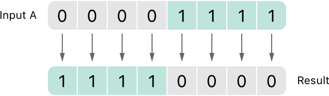

按位取反运算符是前置运算符，紧挨在它作用的值之前书写，中间不能有空白：

```swift
let initialBits: UInt8 = 0b00001111
let invertedBits = ~initialBits  // 等于 11110000
```

`UInt8` 整数有八位，可以存放 `0` 到 `255` 之间的任何值。这个例子用一个二进制值 `00001111` 初始化 `UInt8` 整数，它的前四位是 `0`，后四位是 `1`，等价于十进制值 `15`。

接着用按位取反运算符创建了一个名为 `invertedBits` 的新常量，它与 `initialBits` 相同，但所有位都被取反：0 变成 1，1 变成 0。`invertedBits` 的值是 `11110000`，等于无符号十进制值 `240`。

### 按位与运算符 {#Bitwise-AND-Operator}

*按位与运算符*（`&`）把两个数的各个位组合起来，生成一个新数：只有当*两个*输入数中对应位都等于 `1` 时，结果中该位才为 `1`：

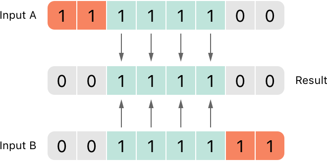

在下面的例子里，`firstSixBits` 和 `lastSixBits` 的值中间都有四位等于 `1`。按位与运算符把它们组合起来得到数字 `00111100`，等于无符号十进制值 `60`：

```swift
let firstSixBits: UInt8 = 0b11111100
let lastSixBits: UInt8  = 0b00111111
let middleFourBits = firstSixBits & lastSixBits  // 等于 00111100
```

### 按位或运算符 {#Bitwise-OR-Operator}

*按位或运算符*（`|`）比较两个数的各个位，生成一个新数：只要*任一*输入数中对应位等于 `1`，结果中该位就为 `1`：

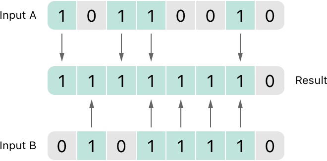

在下面的例子里，`someBits` 和 `moreBits` 各自在不同的位上设了 `1`。按位或运算符把它们组合起来得到数字 `11111110`，等于无符号十进制值 `254`：

```swift
let someBits: UInt8 = 0b10110010
let moreBits: UInt8 = 0b01011110
let combinedbits = someBits | moreBits  // 等于 11111110
```

### 按位异或运算符 {#Bitwise-XOR-Operator}

*按位异或运算符*（也叫"互斥或运算符"，`^`）比较两个数的各个位，生成一个新数：输入位不同时该位设为 `1`，相同时设为 `0`：

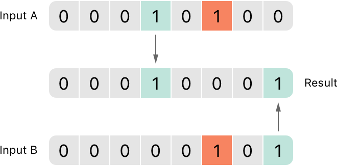

在下面的例子里，`firstBits` 和 `otherBits` 各自在某个对方没有设 `1` 的位上设了 `1`。按位异或运算符在输出值中把这两位都设为 `1`；`firstBits` 和 `otherBits` 中其余所有相同的位在输出值中都是 `0`：

```swift
let firstBits: UInt8 = 0b00010100
let otherBits: UInt8 = 0b00000101
let outputBits = firstBits ^ otherBits  // 等于 00010001
```

### 按位左移和右移运算符 {#Bitwise-Left-and-Right-Shift-Operators}

*按位左移运算符*（`<<`）和*按位右移运算符*（`>>`）把一个数中的所有位按下面定义的规则向左或向右移动指定的位数。

按位左移和右移的效果相当于把整数乘以或除以 2 的幂：把整数的位左移一位，其值加倍；右移一位，其值减半。

#### 无符号整数的移位行为 {#Shifting-Behavior-for-Unsigned-Integers}

无符号整数的移位行为如下：

1. 已有的位按请求的位数向左或向右移动。
2. 移出整数存储范围之外的位被丢弃。
3. 原有的位移走之后留下的空位用零填充。

这种做法称为*逻辑移位*。

下图展示了 `11111111 << 1`（把 `11111111` 左移 `1` 位）与 `11111111 >> 1`（把 `11111111` 右移 `1` 位）的结果：绿色数字表示被移位的位，灰色数字表示被丢弃的位，粉色零表示插入的零：

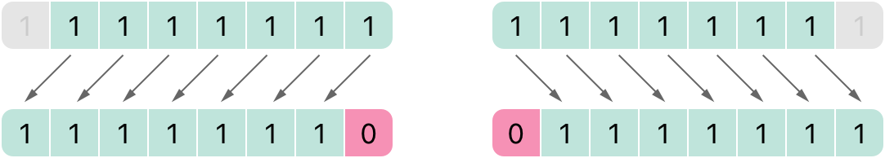

位运算在 Swift 代码中是这样写的：

```swift
let shiftBits: UInt8 = 4   // 二进制为 00000100
shiftBits << 1             // 00001000
shiftBits << 2             // 00010000
shiftBits << 5             // 10000000
shiftBits << 6             // 00000000
shiftBits >> 2             // 00000001
```

你可以用位移在其他数据类型中编码和解码值：

```swift
let pink: UInt32 = 0xCC6699
let redComponent = (pink & 0xFF0000) >> 16    // redComponent 是 0xCC，即 204
let greenComponent = (pink & 0x00FF00) >> 8   // greenComponent 是 0x66，即 102
let blueComponent = pink & 0x0000FF           // blueComponent 是 0x99，即 153
```

这个例子用一个名为 `pink` 的 `UInt32` 常量存放粉色对应的层叠样式表（CSS）颜色值。CSS 颜色值 `#CC6699` 在 Swift 的十六进制表示中写作 `0xCC6699`，随后用按位与运算符（`&`）和按位右移运算符（`>>`）把它分解为红（`CC`）、绿（`66`）、蓝（`99`）三个分量。

红色分量是通过对 `0xCC6699` 和 `0xFF0000` 做按位与得到的。`0xFF0000` 中的零"屏蔽"了 `0xCC6699` 的第二、第三个字节，使 `6699` 被忽略，结果剩下 `0xCC0000`。

接着把这个数右移 16 位（`>> 16`）。十六进制数中每一对字符占 8 位，因此右移 16 位会把 `0xCC0000` 变成 `0x0000CC`，也就是 `0xCC`，其十进制值为 `204`。

类似地，绿色分量是通过对 `0xCC6699` 和 `0x00FF00` 做按位与得到的，结果为 `0x006600`；再把这个结果右移八位，得到 `0x66`，其十进制值为 `102`。

最后，蓝色分量是通过对 `0xCC6699` 和 `0x0000FF` 做按位与得到的，结果为 `0x000099`。由于 `0x000099` 已经等于 `0x99`（十进制值 `153`），因此无需再右移即可使用。

#### 有符号整数的移位行为 {#Shifting-Behavior-for-Signed-Integers}

由于有符号整数在二进制中的表示方式，它们的移位行为比无符号整数更复杂。（下面的例子为了简单起见基于 8 位有符号整数，但同样的原理适用于任意尺寸的有符号整数。）

有符号整数用第一位（称为*符号位*）表示该整数是正还是负：符号位为 `0` 表示正，为 `1` 表示负。

其余各位（称为*数值位*）存放实际的值。正数的存储方式与无符号整数完全相同，从 `0` 开始向上计数。下面是数字 `4` 在 `Int8` 中各二进制位的形态：

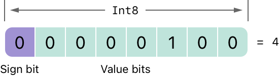

符号位是 `0`（表示"正"），七个数值位就是数字 `4` 的二进制写法。

不过负数的存储方式不同：把它的绝对值从 2 的 n 次幂中减去，其中 n 是数值位的位数。八位数字有七个数值位，因此这里用 2 的 7 次幂，也就是 `128`。

下面是数字 `-4` 在 `Int8` 中各二进制位的形态：

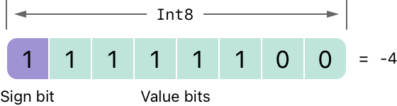

这时符号位是 `1`（表示"负"），七个数值位的二进制值是 `124`（即 `128 - 4`）：

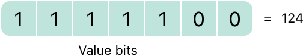

这种负数编码方式称为*二进制补码*表示。用这种方式表示负数看起来有些特别，但它有几个优点。

第一，你可以把 `-1` 加到 `-4` 上，只需对全部八位（包括符号位）执行标准的二进制加法，最后丢弃放不进这八位的部分：

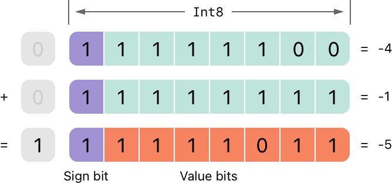

第二，二进制补码表示还让你可以像正数那样对负数做左右移位，并且仍然保持"每左移一位就加倍、每右移一位就减半"的效果。为此，对有符号整数右移时需要额外应用一条规则：对有符号整数右移时，套用与无符号整数相同的规则，但左侧空出来的位要用*符号位*而不是零来填充。

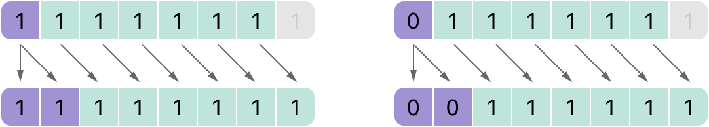

这一行为保证了有符号整数右移之后符号不变，称为*算术移位*。

由于正数和负数的存储方式特殊，把它们向右移位都会使它们更接近零。在这种移位过程中保持符号位不变，就意味着负数在数值向零靠近的过程中仍然保持为负。

## 溢出运算符 {#Overflow-Operators}

如果你试图把一个整数常量或变量设为一个它无法容纳的数，默认情况下 Swift 会报告错误，而不允许创建一个无效的值。在处理过大或过小的数值时，这一行为提供了额外的安全性。

例如，`Int16` 整数类型可以存放 `-32768` 到 `32767` 之间的任何有符号整数。试图把一个 `Int16` 常量或变量设为该范围之外的数会导致错误：

```swift
var potentialOverflow = Int16.max
// potentialOverflow 等于 32767，即 Int16 能存放的最大值
potentialOverflow += 1
// 这会导致错误
```

在值变得过大或过小时提供错误处理，使你在处理边界值情况时拥有更大的灵活性。

不过，当你确实希望溢出时截断可用的位数，可以选择启用这种行为，而不是触发错误。Swift 提供了三个算术*溢出运算符*，用来为整数计算启用溢出行为。这些运算符都以和号（`&`）开头：

- 溢出加法（`&+`）
- 溢出减法（`&-`）
- 溢出乘法（`&*`）

### 数值溢出 {#Value-Overflow}

数值既可能向正方向溢出，也可能向负方向溢出。

下面是一个无符号整数在正方向上允许溢出时的例子，使用溢出加法运算符（`&+`）：

```swift
var unsignedOverflow = UInt8.max
// unsignedOverflow 等于 255，即 UInt8 能存放的最大值
unsignedOverflow = unsignedOverflow &+ 1
// unsignedOverflow 现在等于 0
```

变量 `unsignedOverflow` 被初始化为 `UInt8` 能存放的最大值（`255`，二进制为 `11111111`），随后用溢出加法运算符（`&+`）给它加 `1`。这使其二进制表示刚好超出 `UInt8` 能容纳的大小，从而溢出边界，如下图所示。溢出加法之后留在 `UInt8` 范围内的值是 `00000000`，也就是零。

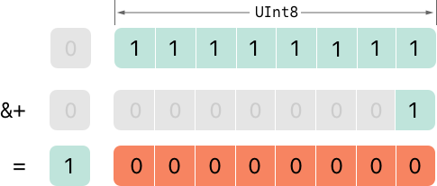

无符号整数在负方向上允许溢出时也有类似情况。下面是使用溢出减法运算符（`&-`）的例子：

```swift
var unsignedOverflow = UInt8.min
// unsignedOverflow 等于 0，即 UInt8 能存放的最小值
unsignedOverflow = unsignedOverflow &- 1
// unsignedOverflow 现在等于 255
```

`UInt8` 能存放的最小值是零，二进制为 `00000000`。如果你用溢出减法运算符（`&-`）从 `00000000` 中减去 `1`，这个数就会溢出并回绕到 `11111111`，也就是十进制的 `255`。

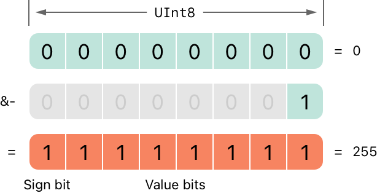

有符号整数也会发生溢出。有符号整数的所有加减运算都以按位方式进行，符号位也作为参与加减的数字的一部分，详见[按位左移和右移运算符](./#Bitwise-Left-and-Right-Shift-Operators)。

```swift
var signedOverflow = Int8.min
// signedOverflow 等于 -128，即 Int8 能存放的最小值
signedOverflow = signedOverflow &- 1
// signedOverflow 现在等于 127
```

`Int8` 能存放的最小值是 `-128`，二进制为 `10000000`。用溢出运算符从这个二进制数中减去 `1`，得到二进制值 `01111111`，它翻转了符号位，得到正数 `127`，也就是 `Int8` 能存放的最大正值。

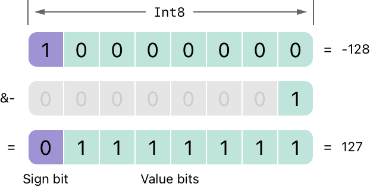

无论是有符号整数还是无符号整数，向正方向溢出都会从最大有效整数值回绕到最小值，向负方向溢出则从最小值回绕到最大值。

## 优先级与结合性 {#Precedence-and-Associativity}

运算符*优先级*使某些运算符比其他运算符拥有更高的优先权，这些运算符会先被应用。

运算符*结合性*定义了同一优先级的运算符如何分组——是从左边分组，还是从右边分组。可以把它理解为"它们与左边的表达式结合"，或者"它们与右边的表达式结合"。

在推导复合表达式的计算顺序时，考虑每个运算符的优先级和结合性很重要。例如，运算符优先级解释了为什么下面这个表达式等于 `17`。

```swift
2 + 3 % 4 * 5
// 这等于 17
```

如果你严格从左往右读，可能会以为这个表达式按如下方式计算：

- `2` 加 `3` 等于 `5`
- `5` 对 `4` 求余等于 `1`
- `1` 乘 `5` 等于 `5`

然而实际答案是 `17` 而不是 `5`：优先级更高的运算符先于优先级更低的运算符求值。在 Swift 中（与 C 一样），求余运算符（`%`）和乘法运算符（`*`）的优先级高于加法运算符（`+`），因此它们都先于加法被求值。

不过，求余和乘法彼此具有*相同*的优先级。要确定确切的求值顺序，还需要考虑它们的结合性：求余和乘法都与它们左边的表达式结合。可以把它理解为从左侧开始给表达式的这些部分加上隐式圆括号：

```swift
2 + ((3 % 4) * 5)
```

`(3 % 4)` 是 `3`，因此这等价于：

```swift
2 + (3 * 5)
```

`(3 * 5)` 是 `15`，因此这等价于：

```swift
2 + 15
```

这个计算得出最终答案 `17`。

关于 Swift 标准库提供的运算符（包括运算符优先级组与结合性设置的完整列表），参见 [Operator Declarations](https://developer.apple.com/documentation/swift/operator_declarations)。

> 注意：Swift 的运算符优先级和结合性规则
> 比 C 和 Objective-C 中的更简单、更可预测。
> 但这也意味着它们与基于 C 的语言并不完全相同。
> 把已有代码移植到 Swift 时，
> 请务必确认运算符的相互配合仍然如你预期那样工作。

## 运算符方法 {#Operator-Methods}

类和结构体可以为已有运算符提供自己的实现，这称为*重载*已有运算符。

下面的例子展示了如何为自定义结构体实现算术加法运算符（`+`）。算术加法运算符是二元运算符，因为它作用于两个目标；它也是中置运算符，因为它出现在这两个目标之间。

这个例子为一个二维位置向量 `(x, y)` 定义了 `Vector2D` 结构体，随后定义了一个*运算符方法*来把 `Vector2D` 结构体的实例相加：

```swift
struct Vector2D {
    var x = 0.0, y = 0.0
}

extension Vector2D {
    static func + (left: Vector2D, right: Vector2D) -> Vector2D {
       return Vector2D(x: left.x + right.x, y: left.y + right.y)
    }
}
```

这个运算符方法被定义为 `Vector2D` 上的类型方法，方法名与要重载的运算符（`+`）一致。由于加法并不是向量本质行为的一部分，这个类型方法定义在 `Vector2D` 的扩展中，而不是定义在 `Vector2D` 的主结构体声明中。由于算术加法运算符是二元运算符，这个运算符方法接受两个 `Vector2D` 类型的输入参数，并返回一个同样为 `Vector2D` 类型的输出值。

在这个实现中，输入参数被命名为 `left` 和 `right`，分别表示将位于 `+` 运算符左侧和右侧的 `Vector2D` 实例。该方法返回一个新的 `Vector2D` 实例，其 `x` 和 `y` 属性用两个相加的 `Vector2D` 实例的 `x` 和 `y` 属性之和初始化。

这个类型方法可以作为中置运算符用于已有的 `Vector2D` 实例之间：

```swift
let vector = Vector2D(x: 3.0, y: 1.0)
let anotherVector = Vector2D(x: 2.0, y: 4.0)
let combinedVector = vector + anotherVector
// combinedVector 是一个值为 (5.0, 5.0) 的 Vector2D 实例
```

这个例子把向量 `(3.0, 1.0)` 和 `(2.0, 4.0)` 相加，得到向量 `(5.0, 5.0)`，如下图所示。

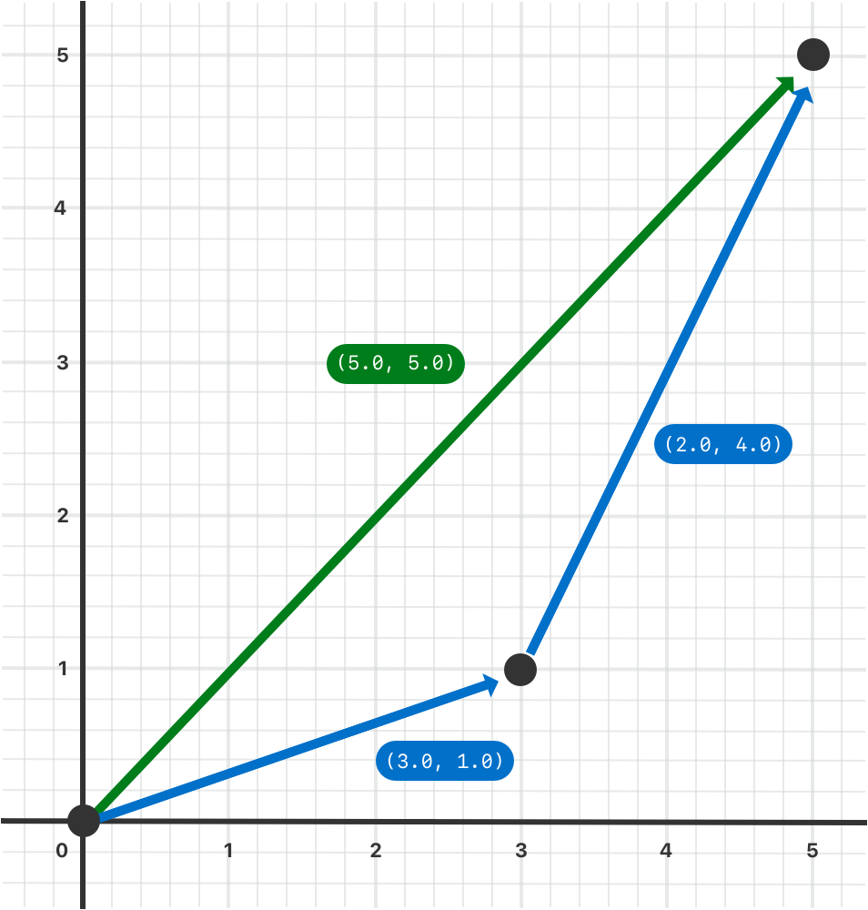

### 前置与后置运算符 {#Prefix-and-Postfix-Operators}

上面展示的例子演示了二元中置运算符的自定义实现。类和结构体也可以提供标准*一元运算符*的实现。一元运算符作用于单个目标：如果它们位于目标之前（例如 `-a`）就是*前置*运算符，位于目标之后（例如 `b!`）就是*后置*运算符。

要实现前置或后置一元运算符，就在声明运算符方法时把 `prefix` 或 `postfix` 修饰符写在 `func` 关键字之前：

```swift
extension Vector2D {
    static prefix func - (vector: Vector2D) -> Vector2D {
        return Vector2D(x: -vector.x, y: -vector.y)
    }
}
```

上面的例子为 `Vector2D` 实例实现了一元负号运算符（`-a`）。一元负号运算符是前置运算符，因此这个方法必须用 `prefix` 修饰符限定。

对于简单的数值，一元负号运算符把正数转换为其对应的负数，反之亦然。`Vector2D` 实例的相应实现则对 `x` 和 `y` 两个属性都执行这一操作：

```swift
let positive = Vector2D(x: 3.0, y: 4.0)
let negative = -positive
// negative 是一个值为 (-3.0, -4.0) 的 Vector2D 实例
let alsoPositive = -negative
// alsoPositive 是一个值为 (3.0, 4.0) 的 Vector2D 实例
```

### 复合赋值运算符 {#Compound-Assignment-Operators}

*复合赋值运算符*把赋值（`=`）与另一种运算结合起来。例如加法赋值运算符（`+=`）把加法和赋值合并为一次操作。你需要把复合赋值运算符的左侧输入参数类型标记为 `inout`，因为该参数的值会被运算符方法直接修改。

下面的例子为 `Vector2D` 实例实现了一个加法赋值运算符方法：

```swift
extension Vector2D {
    static func += (left: inout Vector2D, right: Vector2D) {
        left = left + right
    }
}
```

由于前面已经定义了加法运算符，这里不需要重新实现加法过程，而是利用已有的加法运算符方法，把左值设为"左值加右值"：

```swift
var original = Vector2D(x: 1.0, y: 2.0)
let vectorToAdd = Vector2D(x: 3.0, y: 4.0)
original += vectorToAdd
// original 现在的值是 (4.0, 6.0)
```

> 注意：默认的赋值运算符（`=`）不能被重载，
> 只有复合赋值运算符可以被重载。
> 同样，三元条件运算符（`a ? b : c`）也不能被重载。

### 等价运算符 {#Equivalence-Operators}

默认情况下，自定义类和结构体没有*等价运算符*的实现，即*等于*运算符（`==`）和*不等于*运算符（`!=`）。通常你只需实现 `==` 运算符，并使用 Swift 标准库中 `!=` 运算符的默认实现——它对 `==` 运算符的结果取反。实现 `==` 运算符有两种方式：自己实现，或者对于许多类型来说，让 Swift 为你合成实现。两种方式都需要为该类型添加对 Swift 标准库 `Equatable` 协议的遵循性。

提供 `==` 运算符实现的方式与实现其他中置运算符相同：

```swift
extension Vector2D: Equatable {
    static func == (left: Vector2D, right: Vector2D) -> Bool {
       return (left.x == right.x) && (left.y == right.y)
    }
}
```

上面的例子实现了一个 `==` 运算符，用来检查两个 `Vector2D` 实例是否具有等价的值。在 `Vector2D` 的语境下，把"相等"理解为"两个实例的 `x` 值和 `y` 值都相同"是合理的，因此运算符实现采用了这一逻辑。

现在你就可以用这个运算符检查两个 `Vector2D` 实例是否等价：

```swift
let twoThree = Vector2D(x: 2.0, y: 3.0)
let anotherTwoThree = Vector2D(x: 2.0, y: 3.0)
if twoThree == anotherTwoThree {
    print("These two vectors are equivalent.")
}
// 输出 "These two vectors are equivalent."。
```

在许多简单情况下，你可以让 Swift 为你合成等价运算符的实现，详见[用合成实现采纳协议](../2.23-Protocols/#Adopting-a-Protocol-Using-a-Synthesized-Implementation)。


## 自定义运算符 {#Custom-Operators}

除了 Swift 提供的标准运算符，你还可以声明并实现自己的*自定义运算符*。可用来定义自定义运算符的字符列表参见[运算符](../../languagereference/3.2-LexicalStructure/#Operators)。

新的运算符在全局层面用 `operator` 关键字声明，并加上 `prefix`、`infix` 或 `postfix` 修饰符：

```swift
prefix operator +++
```

上面的例子定义了一个新的前置运算符 `+++`。这个运算符在 Swift 中没有已有含义，因此在下面针对 `Vector2D` 实例的特定语境中赋予了它自定义含义：就这个例子而言，`+++` 被当作一个新的"前置加倍"运算符，它通过前面定义的加法赋值运算符把向量加到自身，从而把 `Vector2D` 实例的 `x` 和 `y` 值加倍。要实现 `+++` 运算符，就按如下方式给 `Vector2D` 添加一个名为 `+++` 的类型方法：

```swift
extension Vector2D {
    static prefix func +++ (vector: inout Vector2D) -> Vector2D {
        vector += vector
        return vector
    }
}

var toBeDoubled = Vector2D(x: 1.0, y: 4.0)
let afterDoubling = +++toBeDoubled
// toBeDoubled 现在的值是 (2.0, 8.0)
// afterDoubling 的值也是 (2.0, 8.0)
```

### 自定义中置运算符的优先级 {#Precedence-for-Custom-Infix-Operators}

每个自定义中置运算符都属于某个优先级组。优先级组指定了该运算符相对于其他中置运算符的优先级，以及该运算符的结合性。关于这些特征如何影响中置运算符与其他中置运算符的配合，参见[优先级与结合性](./#Precedence-and-Associativity)。

没有被显式放入某个优先级组的自定义中置运算符，会被赋予一个默认优先级组，其优先级恰好高于三元条件运算符。

下面的例子定义了一个新的自定义中置运算符 `+-`，它属于优先级组 `AdditionPrecedence`：

```swift
infix operator +-: AdditionPrecedence
extension Vector2D {
    static func +- (left: Vector2D, right: Vector2D) -> Vector2D {
        return Vector2D(x: left.x + right.x, y: left.y - right.y)
    }
}
let firstVector = Vector2D(x: 1.0, y: 2.0)
let secondVector = Vector2D(x: 3.0, y: 4.0)
let plusMinusVector = firstVector +- secondVector
// plusMinusVector 是一个值为 (4.0, -2.0) 的 Vector2D 实例
```

这个运算符把两个向量的 `x` 值相加，并从第一个向量的 `y` 值中减去第二个向量的 `y` 值。由于它本质上是一个"加法类"运算符，因此被赋予了与 `+`、`-` 这类加法类中置运算符相同的优先级组。关于 Swift 标准库提供的运算符（包括运算符优先级组与结合性设置的完整列表），参见 [Operator Declarations](https://developer.apple.com/documentation/swift/operator_declarations)。关于优先级组的更多内容，以及定义自己的运算符与优先级组的语法，参见[运算符声明](../../languagereference/3.6-Declarations/#Operator-Declaration)。

> 注意：定义前置或后置运算符时不需要指定优先级。
> 不过，如果你对同一个操作数同时应用前置和后置运算符，
> 后置运算符会先被应用。


## 结果构建器 {#Result-Builders}

*结果构建器*是你定义的一种类型，它为以自然、声明式的方式创建嵌套数据（例如列表或树）添加了语法。使用结果构建器的代码可以包含普通的 Swift 语法，例如 `if` 和 `for`，用来处理条件性或重复性的数据片段。

下面的代码定义了几个用于在单行上绘制星号与文本的类型。

```swift
protocol Drawable {
    func draw() -> String
}
struct Line: Drawable {
    var elements: [Drawable]
    func draw() -> String {
        return elements.map { $0.draw() }.joined(separator: "")
    }
}
struct Text: Drawable {
    var content: String
    init(_ content: String) { self.content = content }
    func draw() -> String { return content }
}
struct Space: Drawable {
    func draw() -> String { return " " }
}
struct Stars: Drawable {
    var length: Int
    func draw() -> String { return String(repeating: "*", count: length) }
}
struct AllCaps: Drawable {
    var content: Drawable
    func draw() -> String { return content.draw().uppercased() }
}
```

`Drawable` 协议为"可以被绘制的东西"（例如一条线或一个图形）定义了要求：该类型必须实现 `draw()` 方法。`Line` 结构体表示单行绘制，并充当大多数绘制的顶层容器：要绘制一条 `Line`，该结构体对线的每个组成部分调用 `draw()`，再把得到的字符串拼接成一个字符串。`Text` 结构体包装一个字符串，使其成为绘制内容的一部分。`AllCaps` 结构体包装并修改另一种绘制，把绘制中的所有文本转换为大写。

可以通过调用这些类型的构造器来创建绘制内容：

```swift
let name: String? = "Ravi Patel"
let manualDrawing = Line(elements: [
     Stars(length: 3),
     Text("Hello"),
     Space(),
     AllCaps(content: Text((name ?? "World") + "!")),
     Stars(length: 2),
])
print(manualDrawing.draw())
// 输出 "***Hello RAVI PATEL!**"。
```

这段代码能工作，但有些别扭：`AllCaps` 后面层层嵌套的圆括号很难读；`name` 为 `nil` 时回退使用 `"World"` 的逻辑只能用 `??` 运算符内联完成，一旦逻辑稍复杂就会很麻烦；如果你需要在绘制内容里加入 switch 或 `for` 循环来构建某一部分，则根本无法做到。结果构建器让你可以重写这样的代码，使它看起来像普通的 Swift 代码。

要定义结果构建器，就在类型声明上写 `@resultBuilder` 特性。例如下面的代码定义了一个名为 `DrawingBuilder` 的结果构建器，让你用声明式语法描述绘制内容：

```swift
@resultBuilder
struct DrawingBuilder {
    static func buildBlock(_ components: Drawable...) -> Drawable {
        return Line(elements: components)
    }
    static func buildEither(first: Drawable) -> Drawable {
        return first
    }
    static func buildEither(second: Drawable) -> Drawable {
        return second
    }
}
```

`DrawingBuilder` 结构体定义了三个方法，实现结果构建器语法的各部分。`buildBlock(_:)` 方法支持在代码块中书写一系列行，它把该块中的各个组成部分合并为一条 `Line`；`buildEither(first:)` 和 `buildEither(second:)` 方法则支持 `if`-`else`。

你可以把 `@DrawingBuilder` 特性应用于函数的参数，从而把传给该函数的闭包变成结果构建器由该闭包创建的值。例如：

```swift
func draw(@DrawingBuilder content: () -> Drawable) -> Drawable {
    return content()
}
func caps(@DrawingBuilder content: () -> Drawable) -> Drawable {
    return AllCaps(content: content())
}

func makeGreeting(for name: String? = nil) -> Drawable {
    let greeting = draw {
        Stars(length: 3)
        Text("Hello")
        Space()
        caps {
            if let name = name {
                Text(name + "!")
            } else {
                Text("World!")
            }
        }
        Stars(length: 2)
    }
    return greeting
}
let genericGreeting = makeGreeting()
print(genericGreeting.draw())
// 输出 "***Hello WORLD!**"。

let personalGreeting = makeGreeting(for: "Ravi Patel")
print(personalGreeting.draw())
// 输出 "***Hello RAVI PATEL!**"。
```

`makeGreeting(for:)` 函数接受一个 `name` 参数，并用它绘制个性化的问候语。`draw(_:)` 和 `caps(_:)` 函数都只接受一个闭包作为实参，该闭包被标记了 `@DrawingBuilder` 特性。调用这些函数时，你使用 `DrawingBuilder` 定义的特殊语法；Swift 会把这种对绘制内容的声明式描述转换成一系列对 `DrawingBuilder` 方法的调用，从而构建出作为函数实参传入的值。例如，Swift 会把该例子中对 `caps(_:)` 的调用转换成类似下面的代码：

```swift
let capsDrawing = caps {
    let partialDrawing: Drawable
    if let name = name {
        let text = Text(name + "!")
        partialDrawing = DrawingBuilder.buildEither(first: text)
    } else {
        let text = Text("World!")
        partialDrawing = DrawingBuilder.buildEither(second: text)
    }
    return partialDrawing
}
```

Swift 把 `if`-`else` 块转换成对 `buildEither(first:)` 和 `buildEither(second:)` 方法的调用。虽然你自己不会调用这些方法，但展示转换结果能让你更容易看出：使用 `DrawingBuilder` 语法时，Swift 是如何转换你的代码的。

要在这个特殊的绘制语法中支持写 `for` 循环，就添加一个 `buildArray(_:)` 方法。

```swift
extension DrawingBuilder {
    static func buildArray(_ components: [Drawable]) -> Drawable {
        return Line(elements: components)
    }
}
let manyStars = draw {
    Text("Stars:")
    for length in 1...3 {
        Space()
        Stars(length: length)
    }
}
```

在上面的代码中，`for` 循环创建了一个绘制内容数组，`buildArray(_:)` 方法再把这个数组变成一条 `Line`。

关于 Swift 如何把构建器语法转换成对构建器类型方法的调用的完整列表，参见 [resultBuilder](../../languagereference/3.7-Attributes/#resultBuilder)。
