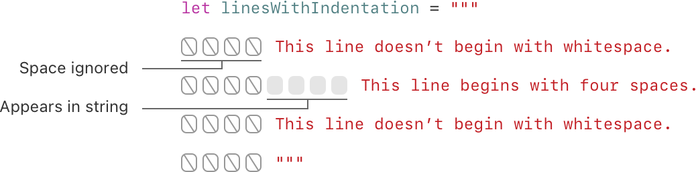
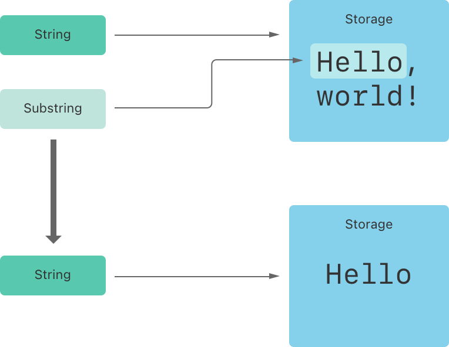
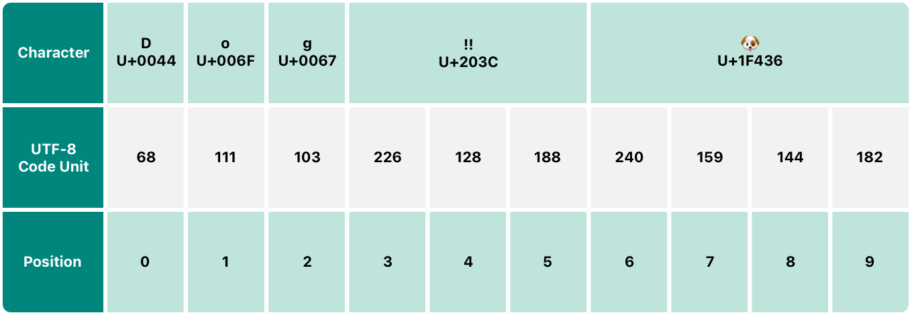
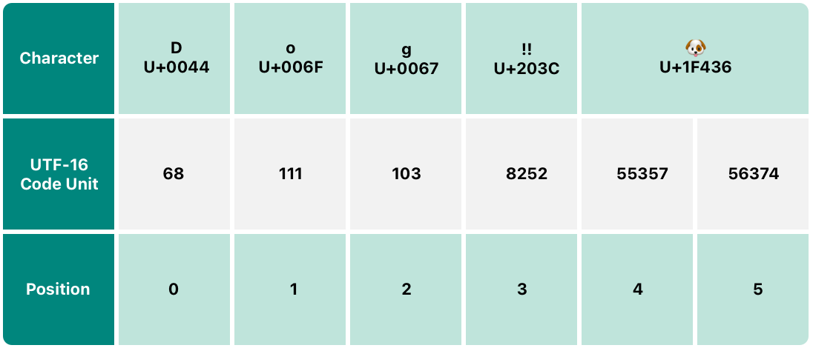
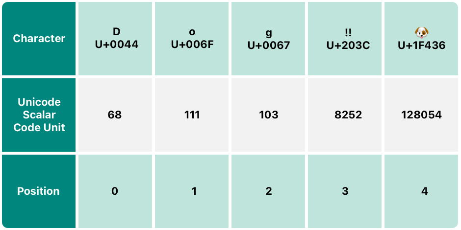

+++
title = "2.3 字符串与字符"
date = 2026-09-11T20:00:03+08:00
weight = 3
type = "docs"
description = ""
isCJKLanguage = true
draft = false
+++


> 原文链接: [https://docs.swift.org/latest/documentation/the-swift-programming-language/stringsandcharacters/](https://docs.swift.org/latest/documentation/the-swift-programming-language/stringsandcharacters/)

# 2.3 字符串与字符

存储和操作文本。

*字符串*是一系列字符，例如 `"hello, world"` 或 `"albatross"`。Swift 字符串用 `String` 类型表示。`String` 的内容可以用多种方式访问，包括当作 `Character` 值的集合来访问。

Swift 的 `String` 和 `Character` 类型为代码中的文本处理提供了一种快速且符合 Unicode 规范的方式。字符串的创建与操作语法轻量易读，字符串字面量语法与 C 语言相似。拼接字符串只需用 `+` 运算符把两个字符串组合起来；字符串的可变性由你选择用常量还是变量来决定，和 Swift 中的其他值一样。你还可以把常量、变量、字面量和表达式插入更长的字符串中，这一过程称为字符串插值。这使得为显示、存储和打印创建自定义字符串值变得很容易。

尽管语法如此简单，Swift 的 `String` 类型仍是一个快速、现代的字符串实现。每个字符串都由与编码无关的 Unicode 字符组成，并支持以多种 Unicode 表示方式访问这些字符。

> 注意：Swift 的 `String` 类型与 Foundation 的 `NSString` 类之间可以桥接。
> Foundation 还扩展了 `String`，公开了 `NSString` 定义的方法。
> 这意味着，如果你导入了 Foundation，
> 就可以在 `String` 上直接调用那些 `NSString` 方法，而无需转换。
>
> 关于把 `String` 与 Foundation、Cocoa 搭配使用的更多内容，
> 参见 [Bridging Between String and NSString](https://developer.apple.com/documentation/swift/string#2919514)。

## 字符串字面量 {#String-Literals}

你可以把预定义的 `String` 值以*字符串字面量*的形式写进代码。字符串字面量是用双引号（`"`）括起来的一串字符。

把字符串字面量用作常量或变量的初始值：

```swift
let someString = "Some string literal value"
```

注意 Swift 把 `someString` 常量的类型推断为 `String`，因为它是用字符串字面量值初始化的。

### 多行字符串字面量 {#Multiline-String-Literals}

如果你需要跨多行的字符串，就使用多行字符串字面量——用三个双引号括起来的一串字符：

```swift
let quotation = """
The White Rabbit put on his spectacles.  "Where shall I begin,
please your Majesty?" he asked.

"Begin at the beginning," the King said gravely, "and go on
till you come to the end; then stop."
"""
```

多行字符串字面量包含开引号与闭引号之间的所有行。字符串从开引号（`"""`）之后的下一行开始，到闭引号之前的一行结束，这意味着下面两个字符串都不会以换行开头或结尾：

```swift
let singleLineString = "These are the same."
let multilineString = """
These are the same.
"""
```

当源代码在多行字符串字面量内部包含换行时，这个换行也会出现在字符串的值中。如果你想用换行让源代码更易读，却不希望这些换行成为字符串值的一部分，就在这些行的末尾写一个反斜杠（`\`）：

```swift
let softWrappedQuotation = """
The White Rabbit put on his spectacles.  "Where shall I begin, \
please your Majesty?" he asked.

"Begin at the beginning," the King said gravely, "and go on \
till you come to the end; then stop."
"""
```

若要创建以换行开头或结尾的多行字符串字面量，就把第一行或最后一行写成空行。例如：

```swift
let lineBreaks = """

This string starts with a line break.
It also ends with a line break.

"""
```

多行字符串可以缩进，以便与周围的代码对齐。闭引号（`"""`）之前的空白告诉 Swift：在其他所有行之前要忽略哪些空白。不过，如果某一行的开头除了闭引号之前的空白之外还有额外的空白，那么这些额外的空白*会*被包含进去。



在上面的例子里，尽管整个多行字符串字面量都缩进了，字符串中的第一行和最后一行却不以任何空白开头。中间那行的缩进比闭引号更多，因此它开头带有那多出来的四个空格缩进。

### 字符串字面量中的特殊字符 {#Special-Characters-in-String-Literals}

字符串字面量可以包含以下特殊字符：

- 转义特殊字符 `\0`（空字符）、`\\`（反斜杠）、`\t`（水平制表符）、`\n`（换行符）、`\r`（回车符）、`\"`（双引号）和 `\'`（单引号）
- 任意 Unicode 标量值，写作 `\u{`*n*`}`，其中 *n* 是 1 到 8 位的十六进制数（Unicode 会在下文的 [Unicode](./#Unicode) 中讨论）

下面的代码给出了这些特殊字符的四个例子。常量 `wiseWords` 包含两个转义的双引号；常量 `dollarSign`、`blackHeart` 和 `sparklingHeart` 演示了 Unicode 标量格式：

```swift
let wiseWords = "\"Imagination is more important than knowledge\" - Einstein"
// "Imagination is more important than knowledge" - Einstein
let dollarSign = "\u{24}"        // $，Unicode 标量 U+0024
let blackHeart = "\u{2665}"      // ♥，Unicode 标量 U+2665
let sparklingHeart = "\u{1F496}" // 💖，Unicode 标量 U+1F496
```

由于多行字符串字面量使用三个双引号而不是一个，你可以在多行字符串字面量里直接包含双引号（`"`）而无需转义。要在多行字符串中包含 `"""` 这段文本，至少要转义其中一个引号。例如：

```swift
let threeDoubleQuotationMarks = """
Escaping the first quotation mark \"""
Escaping all three quotation marks \"\"\"
"""
```

### 扩展字符串定界符 {#Extended-String-Delimiters}

你可以把字符串字面量放在*扩展定界符*中，从而在字符串里包含特殊字符而不触发它们的特殊效果。做法是把字符串放在引号（`"`）中，再在外面用井号（`#`）包围。例如，打印字符串字面量 `#"Line 1\nLine 2"#` 会输出换行转义序列（`\n`），而不是把字符串分成两行打印。

如果你确实需要某个字符在字符串字面量中发挥特殊效果，就让字符串中跟在转义字符（`\`）后面的井号数量与定界符的井号数量一致。例如，如果你的字符串是 `#"Line 1\nLine 2"#`，而你想换成新行，可以改用 `#"Line 1\#nLine 2"#`。类似地，`###"Line1\###nLine2"###` 也会换行。

用扩展定界符创建的字符串字面量也可以是多行字符串字面量。你可以用扩展定界符在多行字符串中包含 `"""` 这段文本，从而覆盖"遇到它即结束字面量"的默认行为。例如：

```swift
let threeMoreDoubleQuotationMarks = #"""
Here are three more double quotes: """
"""#
```

## 初始化空字符串 {#Initializing-an-Empty-String}

若要创建一个空 `String` 值作为构造更长字符串的起点，可以给变量赋一个空字符串字面量，也可以用构造器语法初始化一个新的 `String` 实例：

```swift
var emptyString = ""               // 空字符串字面量
var anotherEmptyString = String()  // 构造器语法
// 这两个字符串都是空的，彼此等价
```

通过检查布尔属性 `isEmpty` 可以判断某个 `String` 值是否为空：

```swift
if emptyString.isEmpty {
    print("Nothing to see here")
}
// 输出 "Nothing to see here"。
```

## 字符串的可变性 {#String-Mutability}

把字符串赋给变量（可修改）或常量（不可修改），就表明了某个 `String` 能否被修改（或*可变*）：

```swift
var variableString = "Horse"
variableString += " and carriage"
// variableString 现在是 "Horse and carriage"

let constantString = "Highlander"
constantString += " and another Highlander"
// 这会报编译期错误——常量字符串不能被修改
```

> 注意：这种做法与 Objective-C 和 Cocoa 中的字符串可变性不同，
> 那里是在两个类（`NSString` 和 `NSMutableString`）之间选择，
> 以表明字符串能否被修改。

## 字符串是值类型 {#Strings-Are-Value-Types}

Swift 的 `String` 类型是*值类型*。如果你创建了一个新的 `String` 值，那么当它被传给函数或方法、或者被赋给常量或变量时，这个 `String` 值会被*复制*。在每种情况下，都会创建已有 `String` 值的一个新副本，传递或赋值的是这个新副本，而不是原来的版本。值类型在[结构体与枚举是值类型](../2.9-ClassesAndStructures/#Structures-and-Enumerations-Are-Value-Types)中介绍。

Swift 默认复制 `String` 的行为保证了：当函数或方法把一个 `String` 值传给你时，可以清楚地知道这个 `String` 值完全属于你，无论它来自哪里。你可以确信，除非自己修改，否则传进来的字符串不会被改动。

在背后，Swift 编译器会优化字符串的使用，只有在绝对必要时才真正复制。这意味着用值类型的方式处理字符串总能获得很好的性能。

## 处理字符 {#Working-with-Characters}

你可以用 `for`-`in` 循环遍历字符串，从而访问 `String` 中的各个 `Character` 值：

```swift
for character in "Dog!🐶" {
    print(character)
}
// D
// o
// g
// !
// 🐶
```

`for`-`in` 循环在 [for-in 循环](../2.5-ControlFlow/#For-In-Loops)中介绍。

另一种方式是用 `Character` 类型标注，从单字符的字符串字面量创建一个独立的 `Character` 常量或变量：

```swift
let exclamationMark: Character = "!"
```

`String` 值可以通过把 `Character` 值数组作为实参传给它的构造器来构造：

```swift
let catCharacters: [Character] = ["C", "a", "t", "!", "🐱"]
let catString = String(catCharacters)
print(catString)
// 输出 "Cat!🐱"。
```

## 拼接字符串与字符 {#Concatenating-Strings-and-Characters}

`String` 值可以用加法运算符（`+`）相加（或*拼接*），得到一个新的 `String` 值：

```swift
let string1 = "hello"
let string2 = " there"
var welcome = string1 + string2
// welcome 现在等于 "hello there"
```

你也可以用加法赋值运算符（`+=`）把一个 `String` 值追加到已有的 `String` 变量上：

```swift
var instruction = "look over"
instruction += string2
// instruction 现在等于 "look over there"
```

用 `String` 类型的 `append()` 方法可以把一个 `Character` 值追加到 `String` 变量上：

```swift
let exclamationMark: Character = "!"
welcome.append(exclamationMark)
// welcome 现在等于 "hello there!"
```

> 注意：你不能把 `String` 或 `Character` 追加到已有的 `Character` 变量上，
> 因为 `Character` 值只能包含一个字符。

如果你用多行字符串字面量拼出更长字符串的各个行，你会希望字符串中每一行都以换行结尾，包括最后一行。例如：

```swift
let badStart = """
    one
    two
    """
let end = """
    three
    """
print(badStart + end)
// 输出两行：
// one
// twothree

let goodStart = """
    one
    two

    """
print(goodStart + end)
// 输出三行：
// one
// two
// three
```

在上面的代码中，把 `badStart` 与 `end` 拼接得到的是两行字符串，这并非我们想要的结果。因为 `badStart` 的最后一行没有以换行结尾，它就和 `end` 的第一行连在了一起。相比之下，`goodStart` 的两行都以换行结尾，因此与 `end` 拼接后得到三行，符合预期。

## 字符串插值 {#String-Interpolation}

*字符串插值*是一种从常量、变量、字面量和表达式的混合中构造新 `String` 值的方式：把它们的值写进字符串字面量里。单行和多行字符串字面量都可以使用字符串插值。每一段插入字符串字面量的内容都写在一对圆括号里，并在前面加一个反斜杠（`\`）：

```swift
let multiplier = 3
let message = "\(multiplier) times 2.5 is \(Double(multiplier) * 2.5)"
// message 是 "3 times 2.5 is 7.5"
```

在上面的例子里，`multiplier` 的值以 `\(multiplier)` 的形式插入字符串字面量。当字符串插值被求值、生成实际的字符串时，这个占位符会被 `multiplier` 的实际值替换掉。

`multiplier` 的值还参与了字符串后面一个更大的表达式。该表达式计算 `Double(multiplier) * 2.5` 的值，并把结果（`7.5`）插入字符串。在这种情况下，表达式写进字符串字面量时写作 `\(Double(multiplier) * 2.5)`。

你可以用扩展字符串定界符创建包含那些原本会被当作字符串插值处理的字符的字符串。例如：

```swift
print(#"Write an interpolated string in Swift using \(multiplier)."#)
// 输出 "Write an interpolated string in Swift using \(multiplier)."。
```

要在使用扩展定界符的字符串中使用字符串插值，就让反斜杠后面的井号数量与字符串首尾的井号数量一致。例如：

```swift
print(#"6 times 7 is \#(6 * 7)."#)
// 输出 "6 times 7 is 42."。
```

> 注意：在插值字符串的圆括号内书写的表达式
> 不能包含未转义的反斜杠（`\`）、回车符或换行符。
> 不过，它们可以包含其他字符串字面量。

## Unicode {#Unicode}

*Unicode* 是为不同书写系统的文本进行编码、表示和处理的国际标准。它让你能够以标准化的形式表示几乎任何语言的任何字符，也能把这些字符读写到文本文件、网页之类的外部源中。Swift 的 `String` 和 `Character` 类型完全符合 Unicode 规范，本节将对此进行说明。

### Unicode 标量值 {#Unicode-Scalar-Values}

在背后，Swift 的原生 `String` 类型是由*Unicode 标量值*构建的。Unicode 标量值是为某个字符或修饰符分配的唯一 21 位数字，例如 `LATIN SMALL LETTER A`（`"a"`）对应 `U+0061`，`FRONT-FACING BABY CHICK`（`"🐥"`）对应 `U+1F425`。

注意，并非所有 21 位 Unicode 标量值都分配给了字符——有些标量保留给未来的分配，或者用于 UTF-16 编码。已经分配给某个字符的标量值通常也有名字，比如上面例子中的 `LATIN SMALL LETTER A` 和 `FRONT-FACING BABY CHICK`。

### 扩展字形簇 {#Extended-Grapheme-Clusters}

Swift `Character` 类型的每个实例都表示一个*扩展字形簇*（extended grapheme cluster）。扩展字形簇是一个或多个 Unicode 标量的序列，这些标量组合起来产生一个人类可读的字符。

举个例子：字母 `é` 可以表示为单个 Unicode 标量 `é`（`LATIN SMALL LETTER E WITH ACUTE`，即 `U+00E9`）。不过，同一个字母也可以表示为*一对*标量——一个标准字母 `e`（`LATIN SMALL LETTER E`，即 `U+0065`），后面跟着 `COMBINING ACUTE ACCENT` 标量（`U+0301`）。`COMBINING ACUTE ACCENT` 标量在图形上作用于它前面的标量，当文本渲染系统支持 Unicode 时，就会把 `e` 变成 `é`。

在这两种情况下，字母 `é` 都表示为单个 Swift `Character` 值，该值代表一个扩展字形簇。第一种情况下，这个簇包含一个标量；第二种情况下，它是两个标量组成的簇：

```swift
let eAcute: Character = "\u{E9}"                         // é
let combinedEAcute: Character = "\u{65}\u{301}"          // e 后面跟着 ́
// eAcute 是 é，combinedEAcute 是 é
```

扩展字形簇是一种灵活的方式，可以把许多复杂的书写系统字符表示为单个 `Character` 值。例如，朝鲜文音节既可以表示为预先组合的序列，也可以表示为分解后的序列：这两种表示在 Swift 中都算作单个 `Character` 值：

```swift
let precomposed: Character = "\u{D55C}"                  // 한
let decomposed: Character = "\u{1112}\u{1161}\u{11AB}"   // ᄒ, ᅡ, ᆫ
// precomposed 是 한，decomposed 是 한
```

扩展字形簇还让包围标记（例如 `COMBINING ENCLOSING CIRCLE`，即 `U+20DD`）的标量可以作为单个 `Character` 值的一部分包围其他 Unicode 标量：

```swift
let enclosedEAcute: Character = "\u{E9}\u{20DD}"
// enclosedEAcute 是 é⃝
```

区域指示符号的 Unicode 标量可以两两组合，构成单个 `Character` 值，例如 `REGIONAL INDICATOR SYMBOL LETTER U`（`U+1F1FA`）与 `REGIONAL INDICATOR SYMBOL LETTER S`（`U+1F1F8`）的组合：

```swift
let regionalIndicatorForUS: Character = "\u{1F1FA}\u{1F1F8}"
// regionalIndicatorForUS 是 🇺🇸
```

## 统计字符数 {#Counting-Characters}

要获取字符串中 `Character` 值的个数，请使用字符串的 `count` 属性：

```swift
let unusualMenagerie = "Koala 🐨, Snail 🐌, Penguin 🐧, Dromedary 🐪"
print("unusualMenagerie has \(unusualMenagerie.count) characters")
// 输出 "unusualMenagerie has 40 characters"。
```

注意，Swift 用扩展字形簇来表示 `Character` 值，这意味着字符串的拼接和修改并不总会改变字符串的字符数。

例如，如果你用四个字符的单词 `cafe` 初始化一个新字符串，然后在字符串末尾追加一个 `COMBINING ACUTE ACCENT`（`U+0301`），结果字符串的字符数仍然是 `4`，只是第四个字符变成了 `é` 而不是 `e`：

```swift
var word = "cafe"
print("the number of characters in \(word) is \(word.count)")
// 输出 "the number of characters in cafe is 4"。

word += "\u{301}"    // COMBINING ACUTE ACCENT，U+0301

print("the number of characters in \(word) is \(word.count)")
// 输出 "the number of characters in café is 4"。
```

> 注意：扩展字形簇可以由多个 Unicode 标量组成。
> 这意味着不同的字符——
> 以及同一个字符的不同表示——
> 可能需要不同大小的内存来存储。
> 因此，Swift 中每个字符在字符串的表示中所占的内存
> 并不相同。
> 结果就是，字符串中的字符数无法直接算出，
> 必须遍历整个字符串才能确定其扩展字形簇的边界。
> 如果你要处理特别长的字符串值，
> 请注意 `count` 属性必须遍历整个字符串中的 Unicode 标量，
> 才能确定该字符串包含的字符。
>
> `count` 属性返回的字符数并不总等于
> 包含相同字符的 `NSString` 的 `length` 属性。
> `NSString` 的长度基于其 UTF-16 表示中 16 位代码单元的个数，
> 而不是字符串中 Unicode 扩展字形簇的个数。

## 访问和修改字符串 {#Accessing-and-Modifying-a-String}

你可以通过字符串的方法和属性，或者用下标语法来访问和修改字符串。

### 字符串下标 {#String-Indices}

每个 `String` 值都有一个关联的*索引类型* `String.Index`，它对应字符串中每个 `Character` 的位置。

如前所述，不同字符需要的存储空间可能不同，因此要确定某个位置上是哪个 `Character`，就必须从该 `String` 的开头或结尾开始逐个遍历 Unicode 标量。正因如此，Swift 字符串不能用整数值来索引。

用 `startIndex` 属性访问 `String` 中第一个 `Character` 的位置。`endIndex` 属性是 `String` 中最后一个字符之后的位置。因此 `endIndex` 属性不能作为字符串下标的合法实参。如果 `String` 为空，那么 `startIndex` 与 `endIndex` 相等。

用 `String` 的 `index(before:)` 和 `index(after:)` 方法访问某个索引之前和之后的索引。若要访问距离给定索引较远的索引，可以使用 `index(_:offsetBy:)` 方法，而不必反复调用前面这些方法。

你可以用下标语法访问某个 `String` 索引处的 `Character`。

```swift
let greeting = "Guten Tag!"
greeting[greeting.startIndex]
// G
greeting[greeting.index(before: greeting.endIndex)]
// !
greeting[greeting.index(after: greeting.startIndex)]
// u
let index = greeting.index(greeting.startIndex, offsetBy: 7)
greeting[index]
// a
```

试图访问字符串范围之外的索引，或者访问字符串范围之外的索引处的 `Character`，都会触发运行时错误。

```swift
greeting[greeting.endIndex] // 错误
greeting.index(after: greeting.endIndex) // 错误
```

用 `indices` 属性访问字符串中各个字符的全部索引。

```swift
for index in greeting.indices {
    print("\(greeting[index]) ", terminator: "")
}
// 输出 "G u t e n   T a g ! "。
```

> 注意：你可以在任何遵循 `Collection` 协议的类型上使用
> `startIndex` 和 `endIndex` 属性，
> 以及 `index(before:)`、`index(after:)` 和 `index(_:offsetBy:)` 方法。
> 这既包括这里演示的 `String`，
> 也包括 `Array`、`Dictionary` 和 `Set` 等集合类型。

### 插入与移除 {#Inserting-and-Removing}

要在指定索引处插入单个字符，使用 `insert(_:at:)` 方法；要在指定索引处插入另一个字符串的内容，使用 `insert(contentsOf:at:)` 方法。

```swift
var welcome = "hello"
welcome.insert("!", at: welcome.endIndex)
// welcome 现在等于 "hello!"

welcome.insert(contentsOf: " there", at: welcome.index(before: welcome.endIndex))
// welcome 现在等于 "hello there!"
```

要从字符串中移除指定索引处的单个字符，使用 `remove(at:)` 方法；要移除指定范围处的子字符串，使用 `removeSubrange(_:)` 方法：

```swift
welcome.remove(at: welcome.index(before: welcome.endIndex))
// welcome 现在等于 "hello there"

let range = welcome.index(welcome.endIndex, offsetBy: -6)..<welcome.endIndex
welcome.removeSubrange(range)
// welcome 现在等于 "hello"
```

> 注意：你可以在任何遵循 `RangeReplaceableCollection` 协议的类型上使用
> `insert(_:at:)`、`insert(contentsOf:at:)`、
> `remove(at:)` 和 `removeSubrange(_:)` 方法。
> 这既包括这里演示的 `String`，
> 也包括 `Array`、`Dictionary` 和 `Set` 等集合类型。

## 子字符串 {#Substrings}

当你从字符串中取出子字符串时——例如使用下标或 `prefix(_:)` 这样的方法——结果是一个 [`Substring`](https://developer.apple.com/documentation/swift/substring) 实例，而不是另一个字符串。Swift 中的子字符串拥有与字符串几乎相同的方法，也就是说你可以用处理字符串的方式处理子字符串。不过与字符串不同，子字符串只适合在对字符串执行操作时短暂使用。当你准备把结果保存得更久时，就把子字符串转换成 `String` 实例。例如：

```swift
let greeting = "Hello, world!"
let index = greeting.firstIndex(of: ",") ?? greeting.endIndex
let beginning = greeting[..<index]
// beginning 是 "Hello"

// 把结果转换成 String，以便长期保存。
let newString = String(beginning)
```

和字符串一样，每个子字符串有一块内存区域，用于存放构成该子字符串的字符。字符串与子字符串的区别在于：作为一项性能优化，子字符串可以复用存储原字符串的那部分内存，或者复用存储另一个子字符串的内存。（字符串也有类似的优化，但如果两个字符串共享内存，它们就是相等的。）这项性能优化意味着，在你修改字符串或子字符串之前，无需付出复制内存的性能代价。如前所述，子字符串不适合长期保存——由于它复用了原字符串的存储，只要它的任何子字符串仍在使用，整个原字符串就必须保留在内存中。

在上面的例子里，`greeting` 是一个字符串，因此它有一块内存区域用来存放构成该字符串的字符。由于 `beginning` 是 `greeting` 的子字符串，它复用了 `greeting` 使用的内存。相比之下，`newString` 是一个字符串——从子字符串创建它时，它拥有了自己的存储。下图展示了这些关系：



> 注意：`String` 和 `Substring` 都遵循
> [`StringProtocol`](https://developer.apple.com/documentation/swift/stringprotocol) 协议，
> 因此让字符串处理函数接受 `StringProtocol` 值往往很方便，
> 这样既可以传 `String` 值，也可以传 `Substring` 值。

## 比较字符串 {#Comparing-Strings}

Swift 提供了三种比较文本值的方式：字符串与字符相等、前缀相等、后缀相等。

### 字符串与字符相等 {#String-and-Character-Equality}

字符串与字符的相等性用"等于"运算符（`==`）和"不等于"运算符（`!=`）检查，详见[比较运算符](../2.2-BasicOperators/#Comparison-Operators)：

```swift
let quotation = "We're a lot alike, you and I."
let sameQuotation = "We're a lot alike, you and I."
if quotation == sameQuotation {
    print("These two strings are considered equal")
}
// 输出 "These two strings are considered equal"。
```

如果两个 `String` 值（或两个 `Character` 值）的扩展字形簇*在规范上等价*，它们就被认为相等。如果两个扩展字形簇在语言含义和外观上都相同，即使它们在背后由不同的 Unicode 标量组成，它们在规范上也是等价的。

例如，`LATIN SMALL LETTER E WITH ACUTE`（`U+00E9`）与 `LATIN SMALL LETTER E`（`U+0065`）后跟 `COMBINING ACUTE ACCENT`（`U+0301`）在规范上等价。这两个扩展字形簇都是表示字符 `é` 的合法方式，因此它们被认为在规范上等价：

```swift
// 用 LATIN SMALL LETTER E WITH ACUTE 写的 "Voulez-vous un café?"
let eAcuteQuestion = "Voulez-vous un caf\u{E9}?"

// 用 LATIN SMALL LETTER E 和 COMBINING ACUTE ACCENT 写的 "Voulez-vous un café?"
let combinedEAcuteQuestion = "Voulez-vous un caf\u{65}\u{301}?"

if eAcuteQuestion == combinedEAcuteQuestion {
    print("These two strings are considered equal")
}
// 输出 "These two strings are considered equal"。
```

反过来，英语中使用的 `LATIN CAPITAL LETTER A`（`U+0041`，即 `"A"`）与俄语中使用的 `CYRILLIC CAPITAL LETTER A`（`U+0410`，即 `"А"`）*并不*等价。这两个字符看起来相似，但语言含义不同：

```swift
let latinCapitalLetterA: Character = "\u{41}"

let cyrillicCapitalLetterA: Character = "\u{0410}"

if latinCapitalLetterA != cyrillicCapitalLetterA {
    print("These two characters aren't equivalent.")
}
// 输出 "These two characters aren't equivalent."。
```

> 注意：Swift 中的字符串与字符比较不受区域设置影响。

### 前缀与后缀相等 {#Prefix-and-Suffix-Equality}

要检查字符串是否具有某个前缀或后缀，调用字符串的 `hasPrefix(_:)` 和 `hasSuffix(_:)` 方法。两者都接受一个 `String` 类型的实参，并返回一个布尔值。

下面的例子考虑一个字符串数组，其中的字符串表示莎士比亚《罗密欧与朱丽叶》前两幕的场景地点：

```swift
let romeoAndJuliet = [
    "Act 1 Scene 1: Verona, A public place",
    "Act 1 Scene 2: Capulet's mansion",
    "Act 1 Scene 3: A room in Capulet's mansion",
    "Act 1 Scene 4: A street outside Capulet's mansion",
    "Act 1 Scene 5: The Great Hall in Capulet's mansion",
    "Act 2 Scene 1: Outside Capulet's mansion",
    "Act 2 Scene 2: Capulet's orchard",
    "Act 2 Scene 3: Outside Friar Lawrence's cell",
    "Act 2 Scene 4: A street in Verona",
    "Act 2 Scene 5: Capulet's mansion",
    "Act 2 Scene 6: Friar Lawrence's cell"
]
```

你可以用 `hasPrefix(_:)` 方法处理 `romeoAndJuliet` 数组，统计剧中第一幕有多少个场景：

```swift
var act1SceneCount = 0
for scene in romeoAndJuliet {
    if scene.hasPrefix("Act 1 ") {
        act1SceneCount += 1
    }
}
print("There are \(act1SceneCount) scenes in Act 1")
// 输出 "There are 5 scenes in Act 1"。
```

类似地，用 `hasSuffix(_:)` 方法统计发生在朱丽叶家宅邸以及劳伦斯神父静修室之内或附近的场景数：

```swift
var mansionCount = 0
var cellCount = 0
for scene in romeoAndJuliet {
    if scene.hasSuffix("Capulet's mansion") {
        mansionCount += 1
    } else if scene.hasSuffix("Friar Lawrence's cell") {
        cellCount += 1
    }
}
print("\(mansionCount) mansion scenes; \(cellCount) cell scenes")
// 输出 "6 mansion scenes; 2 cell scenes"。
```

> 注意：`hasPrefix(_:)` 和 `hasSuffix(_:)` 方法
> 会对两个字符串中的扩展字形簇逐个字符地做规范等价比较，
> 详见[字符串与字符相等](./#String-and-Character-Equality)。

## 字符串的 Unicode 表示 {#Unicode-Representations-of-Strings}

当 Unicode 字符串被写入文本文件或其他存储时，字符串中的 Unicode 标量会按 Unicode 定义的几种*编码形式*之一进行编码。每种形式都以称为*码元*的小块来编码字符串，包括 UTF-8 编码形式（把字符串编码为 8 位码元）、UTF-16 编码形式（把字符串编码为 16 位码元）和 UTF-32 编码形式（把字符串编码为 32 位码元）。

Swift 提供了几种不同的方式来访问字符串的 Unicode 表示。你可以用 `for`-`in` 语句遍历字符串，把各个 `Character` 值作为 Unicode 扩展字形簇来访问，这一过程在[处理字符](./#Working-with-Characters)中介绍。

另一种方式是以下面三种符合 Unicode 的表示之一访问 `String` 值：

- UTF-8 码元集合（用字符串的 `utf8` 属性访问）
- UTF-16 码元集合（用字符串的 `utf16` 属性访问）
- 21 位 Unicode 标量值集合，等价于字符串的 UTF-32 编码形式（用字符串的 `unicodeScalars` 属性访问）

下面每个例子都展示了同一个字符串的不同表示，该字符串由字符 `D`、`o`、`g`、`‼`（`DOUBLE EXCLAMATION MARK`，Unicode 标量 `U+203C`）以及 🐶（`DOG FACE`，Unicode 标量 `U+1F436`）组成：

```swift
let dogString = "Dog‼🐶"
```

### UTF-8 表示 {#UTF-8-Representation}

遍历 `utf8` 属性即可访问 `String` 的 UTF-8 表示。该属性的类型是 `String.UTF8View`，它是一个无符号 8 位（`UInt8`）值的集合，字符串的 UTF-8 表示中每个字节对应一个值：



```swift
for codeUnit in dogString.utf8 {
    print("\(codeUnit) ", terminator: "")
}
print("")
// 输出 "68 111 103 226 128 188 240 159 144 182 "。
```

在上面的例子里，前三个十进制 `codeUnit` 值（`68`、`111`、`103`）表示字符 `D`、`o` 和 `g`，它们的 UTF-8 表示与 ASCII 表示相同。接下来的三个十进制 `codeUnit` 值（`226`、`128`、`188`）是 `DOUBLE EXCLAMATION MARK` 字符的三字节 UTF-8 表示。最后四个 `codeUnit` 值（`240`、`159`、`144`、`182`）是 `DOG FACE` 字符的四字节 UTF-8 表示。

### UTF-16 表示 {#UTF-16-Representation}

遍历 `utf16` 属性即可访问 `String` 的 UTF-16 表示。该属性的类型是 `String.UTF16View`，它是一个无符号 16 位（`UInt16`）值的集合，字符串的 UTF-16 表示中每个 16 位码元对应一个值：



```swift
for codeUnit in dogString.utf16 {
    print("\(codeUnit) ", terminator: "")
}
print("")
// 输出 "68 111 103 8252 55357 56374 "。
```

同样，前三个 `codeUnit` 值（`68`、`111`、`103`）表示字符 `D`、`o` 和 `g`，它们的 UTF-16 码元值与该字符串 UTF-8 表示中的值相同（因为这些 Unicode 标量表示的是 ASCII 字符）。

第四个 `codeUnit` 值（`8252`）是十六进制值 `203C` 的十进制形式，它表示 `DOUBLE EXCLAMATION MARK` 字符的 Unicode 标量 `U+203C`。这个字符在 UTF-16 中可以用单个码元表示。

第五个和第六个 `codeUnit` 值（`55357` 和 `56374`）是 `DOG FACE` 字符的 UTF-16 代理对表示。这两个值分别是高位代理值 `U+D83D`（十进制值 `55357`）和低位代理值 `U+DC36`（十进制值 `56374`）。

### Unicode 标量表示 {#Unicode-Scalar-Representation}

遍历 `unicodeScalars` 属性即可访问 `String` 值的 Unicode 标量表示。该属性的类型是 `UnicodeScalarView`，它是一个由 `UnicodeScalar` 类型的值构成的集合。

每个 `UnicodeScalar` 都有一个 `value` 属性，返回该标量的 21 位值，以 `UInt32` 值表示：



```swift
for scalar in dogString.unicodeScalars {
    print("\(scalar.value) ", terminator: "")
}
print("")
// 输出 "68 111 103 8252 128054 "。
```

前三个 `UnicodeScalar` 值的 `value` 属性（`68`、`111`、`103`）同样表示字符 `D`、`o` 和 `g`。

第四个 `codeUnit` 值（`8252`）同样是十六进制值 `203C` 的十进制形式，它表示 `DOUBLE EXCLAMATION MARK` 字符的 Unicode 标量 `U+203C`。

第五个、也是最后一个 `UnicodeScalar` 的 `value` 属性为 `128054`，它是十六进制值 `1F436` 的十进制形式，表示 `DOG FACE` 字符的 Unicode 标量 `U+1F436`。

除了查询 `value` 属性，每个 `UnicodeScalar` 值还可以用来构造新的 `String` 值，比如通过字符串插值：

```swift
for scalar in dogString.unicodeScalars {
    print("\(scalar) ")
}
// D
// o
// g
// ‼
// 🐶
```
