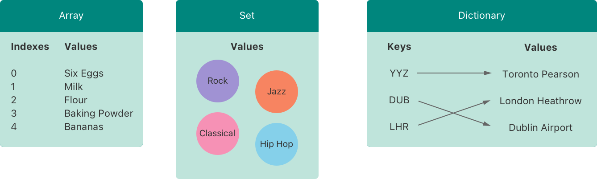
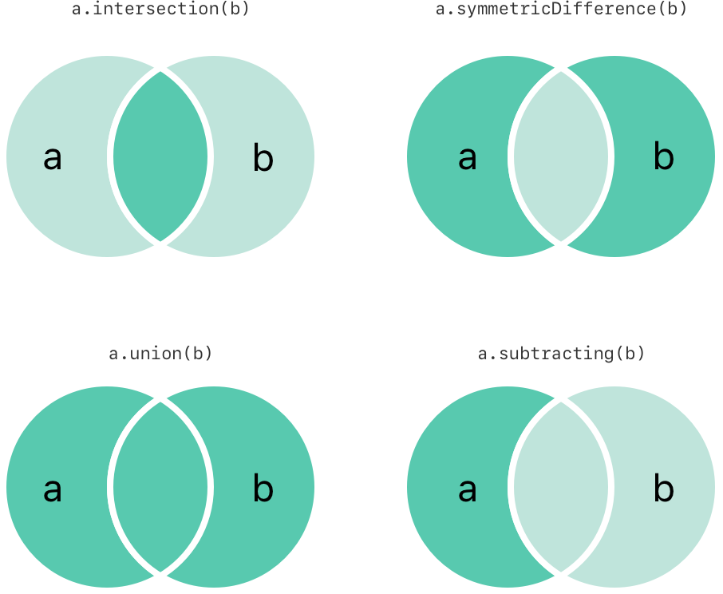
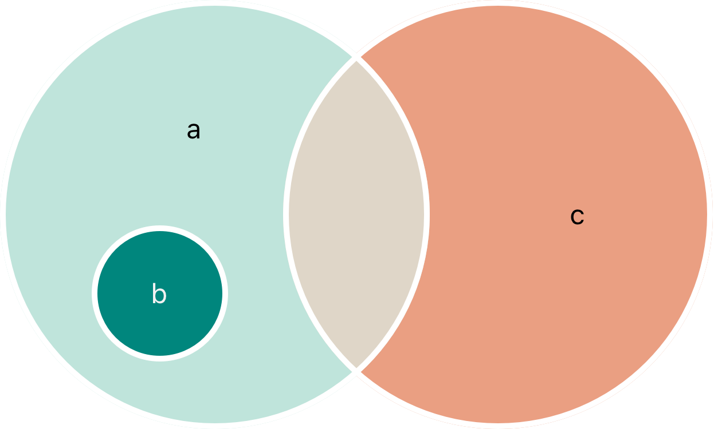

+++
title = "2.4 集合类型"
date = 2026-09-11T20:00:03+08:00
weight = 4
type = "docs"
description = ""
isCJKLanguage = true
draft = false
+++


> 原文链接: [https://docs.swift.org/latest/documentation/the-swift-programming-language/collectiontypes/](https://docs.swift.org/latest/documentation/the-swift-programming-language/collectiontypes/)

# 2.4 集合类型

用数组、集合和字典来组织数据。

Swift 提供了三种主要*集合类型*：数组（array）、集合（set）和字典（dictionary），用来存放值的集合。数组是有序的值的集合；集合是无序且不重复的值的集合；字典是无序的键值关联的集合。



Swift 中的数组、集合和字典始终明确知道它们能够存放的值的类型和键的类型。这意味着你不可能误把类型错误的值插入集合，也意味着你可以确信从集合中取出的是什么类型的值。

> 注意：Swift 的数组、集合和字典类型都是用*泛型集合*实现的。
> 关于泛型类型与集合的更多内容，参见[泛型](../2.24-Generics/)。

## 集合的可变性 {#Mutability-of-Collections}

如果你创建了一个数组、集合或字典并把它赋给变量，那么创建出来的集合就是*可变的*。这意味着你可以在集合创建之后，通过添加、移除或改变其中的元素来修改（或*变更*）它。如果你把数组、集合或字典赋给常量，那么这个集合就是*不可变的*，它的大小和内容都不能改变。

> 注意：只要集合不需要变化，就把它创建成不可变集合，
> 这是很好的做法。
> 这样做既便于你推理自己的代码，
> 也让 Swift 编译器能够优化你所创建的集合的性能。

## 数组 {#Arrays}

*数组*把同一类型的值存放在有序列表中。同一个值可以在数组的不同位置多次出现。

> 注意：Swift 的 `Array` 类型与 Foundation 的 `NSArray` 类之间可以桥接。
>
> 关于把 `Array` 与 Foundation、Cocoa 搭配使用的更多内容，
> 参见 [Bridging Between Array and NSArray](https://developer.apple.com/documentation/swift/array#2846730)。

### 数组类型简写语法 {#Array-Type-Shorthand-Syntax}

Swift 数组的类型完整写法是 `Array<Element>`，其中 `Element` 是数组允许存放的值的类型。数组类型也可以写成简写形式 `[Element]`。两种形式在功能上完全相同，不过简写形式更受青睐，本书在提到数组类型时也都使用简写形式。

### 创建空数组 {#Creating-an-Empty-Array}

在 Swift 中可以用两种方式创建空数组。如果上下文已经提供了类型信息——例如函数实参，或者已确定类型的变量或常量——你可以使用空数组字面量，写作 `[]`（一对方括号）：

```swift
var someInts: [Int] = []
print("someInts is of type [Int] with \(someInts.count) items.")
// 输出 "someInts is of type [Int] with 0 items."。
```

另一种方式是用显式的构造器语法创建某个类型的空数组：把元素类型写在方括号中，后面跟一对圆括号——例如下面代码中的 `[Int]()`：

```swift
var someInts = [Int]()
print("someInts is of type [Int] with \(someInts.count) items.")
// 输出 "someInts is of type [Int] with 0 items."。
```

两种方式结果相同，不过空数组字面量更简短，通常也更易读。

无论用哪种方式创建的数组，你都可以用空数组字面量（`[]`）给已有变量重新赋一个空数组：

```swift
someInts.append(3)
// someInts 现在包含 1 个 Int 类型的值
someInts = []
// someInts 现在是空数组，但类型仍然是 [Int]
```

### 用默认值创建数组 {#Creating-an-Array-with-a-Default-Value}

Swift 的 `Array` 类型还提供了一个构造器，用来创建一个指定大小、所有值都设为同一个默认值的数组。传给这个构造器的是一个相应类型的默认值（名为 `repeating`），以及该值在新数组中重复的次数（名为 `count`）：

```swift
var threeDoubles = Array(repeating: 0.0, count: 3)
// threeDoubles 的类型是 [Double]，等于 [0.0, 0.0, 0.0]
```

### 把两个数组相加创建数组 {#Creating-an-Array-by-Adding-Two-Arrays-Together}

你可以用加法运算符（`+`）把两个类型兼容的已有数组相加，创建出一个新数组。新数组的类型由相加的两个数组的类型推断而来：

```swift
var anotherThreeDoubles = Array(repeating: 2.5, count: 3)
// anotherThreeDoubles 的类型是 [Double]，等于 [2.5, 2.5, 2.5]

var sixDoubles = threeDoubles + anotherThreeDoubles
// sixDoubles 被推断为 [Double]，等于 [0.0, 0.0, 0.0, 2.5, 2.5, 2.5]
```

### 用数组字面量创建数组 {#Creating-an-Array-with-an-Array-Literal}

你也可以用*数组字面量*来初始化数组，它是以数组形式书写一个或多个值的简写方式。数组字面量就是由一对方括号括起来、用逗号分隔的一串值：

```swift
[<#value 1#>, <#value 2#>, <#value 3#>]
```

下面的例子创建了一个名为 `shoppingList` 的数组，用来存放 `String` 值：

```swift
var shoppingList: [String] = ["Eggs", "Milk"]
// shoppingList 已经用两个初始元素初始化
```

变量 `shoppingList` 被声明为"一个字符串值的数组"，写作 `[String]`。因为这个数组指定了值类型为 `String`，所以它只能存放 `String` 值。这里 `shoppingList` 数组用数组字面量中的两个 `String` 值（`"Eggs"` 和 `"Milk"`）初始化。

> 注意：`shoppingList` 数组被声明为变量（用 `var` 引入）
> 而不是常量（用 `let` 引入），
> 因为后面的例子会往购物清单里添加更多元素。

在这个例子里，数组字面量只包含两个 `String` 值，别的什么也没有。这与 `shoppingList` 变量声明时的类型（一个只能包含 `String` 值的数组）相符，因此允许用这个数组字面量为 `shoppingList` 赋初值，把它初始化为两个初始元素。

多亏了 Swift 的类型推断，如果你用包含同类型值的数组字面量来初始化数组，就不必写出数组的类型。`shoppingList` 的初始化可以写得更简短：

```swift
var shoppingList = ["Eggs", "Milk"]
```

由于数组字面量中的所有值都是同一类型，Swift 就能推断出 `[String]` 是 `shoppingList` 变量应当使用的正确类型。

你可以在数组字面量的最后一个值后面写一个逗号，这称为*尾随逗号*：

```swift
var shoppingList = [
    "Eggs",
    "Milk",
]
```

由于尾随逗号让每一行的结尾形式都相同，对于上面这种一行一个值的数组来说，它很有用。当你修改数组时，只需要添加、删除或重新排列值——不必再去添加或删除逗号。

### 访问和修改数组 {#Accessing-and-Modifying-an-Array}

你可以通过数组的方法和属性，或者用下标语法来访问和修改数组。

要了解数组中元素的个数，请检查它的只读属性 `count`：

```swift
print("The shopping list contains \(shoppingList.count) items.")
// 输出 "The shopping list contains 2 items."。
```

用布尔属性 `isEmpty` 可以快捷地检查 `count` 属性是否等于 `0`：

```swift
if shoppingList.isEmpty {
    print("The shopping list is empty.")
} else {
    print("The shopping list isn't empty.")
}
// 输出 "The shopping list isn't empty."。
```

调用数组的 `append(_:)` 方法可以把新元素添加到数组末尾：

```swift
shoppingList.append("Flour")
// shoppingList 现在包含 3 个元素，有人要做煎饼了
```

另一种方式是用加法赋值运算符（`+=`）追加一个包含一个或多个类型兼容元素的数组：

```swift
shoppingList += ["Baking Powder"]
// shoppingList 现在包含 4 个元素
shoppingList += ["Chocolate Spread", "Cheese", "Butter"]
// shoppingList 现在包含 7 个元素
```

用*下标语法*从数组中取值：在数组名后面紧跟一对方括号，把要取出的值的下标写在方括号里：

```swift
var firstItem = shoppingList[0]
// firstItem 等于 "Eggs"
```

> 注意：数组中第一个元素的下标是 `0`，不是 `1`。
> Swift 中的数组始终从零开始编号。

你可以用下标语法修改指定下标处已有的值：

```swift
shoppingList[0] = "Six eggs"
// 列表中的第一个元素现在等于 "Six eggs"，而不是 "Eggs"
```

使用下标语法时，你指定的下标必须是有效的。例如，想用 `shoppingList[shoppingList.count] = "Salt"` 往数组末尾追加元素，会导致运行时错误。

你还可以用下标语法一次修改一个范围内的值，即使替换的值集合与要替换的范围长度不同也没问题。下面的例子把 `"Chocolate Spread"`、`"Cheese"` 和 `"Butter"` 替换为 `"Bananas"` 和 `"Apples"`：

```swift
shoppingList[4...6] = ["Bananas", "Apples"]
// shoppingList 现在包含 6 个元素
```

要在数组的指定下标处插入元素，请调用数组的 `insert(_:at:)` 方法：

```swift
shoppingList.insert("Maple Syrup", at: 0)
// shoppingList 现在包含 7 个元素
// "Maple Syrup" 现在是列表中的第一个元素
```

这次对 `insert(_:at:)` 方法的调用把一个值为 `"Maple Syrup"` 的新元素插入到购物清单的最前面，下标 `0` 表明了这一点。

类似地，用 `remove(at:)` 方法从数组中移除元素。该方法移除指定下标处的元素，并返回被移除的元素（如果你不需要这个返回值，也可以忽略它）：

```swift
let mapleSyrup = shoppingList.remove(at: 0)
// 原本在下标 0 处的元素刚刚被移除
// shoppingList 现在包含 6 个元素，没有 Maple Syrup 了
// 常量 mapleSyrup 现在等于被移除的字符串 "Maple Syrup"
```

> 注意：如果你试图访问或修改数组现有边界之外的下标处的值，
> 就会触发运行时错误。
> 在使用下标之前，可以把它与数组的 `count` 属性比较，
> 检查该下标是否有效。
> 数组中最大的有效下标是 `count - 1`，
> 因为数组从零开始编号——
> 不过，当 `count` 为 `0`（也就是数组为空）时，
> 就没有任何有效下标了。

数组中的元素被移除后，空隙会被填补，因此下标 `0` 处的值再次等于 `"Six eggs"`：

```swift
firstItem = shoppingList[0]
// firstItem 现在等于 "Six eggs"
```

如果你想移除数组中的最后一个元素，请使用 `removeLast()` 方法而不是 `remove(at:)` 方法，这样就无需查询数组的 `count` 属性。与 `remove(at:)` 方法一样，`removeLast()` 也返回被移除的元素：

```swift
let apples = shoppingList.removeLast()
// 数组中的最后一个元素刚刚被移除
// shoppingList 现在包含 5 个元素，没有苹果了
// 常量 apples 现在等于被移除的字符串 "Apples"
```

### 遍历数组 {#Iterating-Over-an-Array}

你可以用 `for`-`in` 循环遍历数组中的整组值：

```swift
for item in shoppingList {
    print(item)
}
// Six eggs
// Milk
// Flour
// Baking Powder
// Bananas
```

如果你既需要每个元素的整型下标，又需要它的值，就改用 `enumerated()` 方法遍历数组。对于数组中的每个元素，`enumerated()` 方法都返回一个由整数和该元素组成的元组。这些整数从零开始，逐项递增一；如果遍历整个数组，这些整数就与元素的下标一致。你可以在遍历的同时把元组分解成临时的常量或变量：

```swift
for (index, value) in shoppingList.enumerated() {
    print("Item \(index + 1): \(value)")
}
// Item 1: Six eggs
// Item 2: Milk
// Item 3: Flour
// Item 4: Baking Powder
// Item 5: Bananas
```

关于 `for`-`in` 循环的更多内容，参见 [for-in 循环](../2.5-ControlFlow/#For-In-Loops)。

## 集合 {#Sets}

*集合*把同一类型的不重复值存放在一个没有确定顺序的集合中。当元素的顺序不重要，或者你需要确保某个元素只出现一次时，就可以用集合来代替数组。

> 注意：Swift 的 `Set` 类型与 Foundation 的 `NSSet` 类之间可以桥接。
>
> 关于把 `Set` 与 Foundation、Cocoa 搭配使用的更多内容，
> 参见 [Bridging Between Set and NSSet](https://developer.apple.com/documentation/swift/set#2845530)。

### 集合类型的哈希值 {#Hash-Values-for-Set-Types}

要被存放在集合中，类型必须是*可哈希的*——也就是说，该类型必须提供计算自身*哈希值*的方式。哈希值是一个 `Int` 值，对所有比较结果相等的对象都相同：如果 `a == b`，那么 `a` 的哈希值等于 `b` 的哈希值。

Swift 的所有基本类型（例如 `String`、`Int`、`Double` 和 `Bool`）默认都是可哈希的，可以用作集合的值类型或字典的键类型。没有关联值的枚举成员值（如[枚举](../2.8-Enumerations/)中所述）默认也是可哈希的。

> 注意：你可以让自己的自定义类型用作集合的值类型或字典的键类型，
> 只要让它遵循 Swift 标准库中的 `Hashable` 协议。
> 关于如何实现必须提供的 `hash(into:)` 方法，
> 参见 [`Hashable`](https://developer.apple.com/documentation/swift/hashable)。
> 关于如何遵循协议，参见[协议](../2.23-Protocols/)。

### 集合类型语法 {#Set-Type-Syntax}

Swift 集合的类型写作 `Set<Element>`，其中 `Element` 是该集合允许存放的类型。与数组不同，集合没有对应的简写形式。

### 创建并初始化空集合 {#Creating-and-Initializing-an-Empty-Set}

你可以用构造器语法创建某个类型的空集合：

```swift
var letters = Set<Character>()
print("letters is of type Set<Character> with \(letters.count) items.")
// 输出 "letters is of type Set<Character> with 0 items."。
```

> 注意：由构造器的类型可以推断出，
> 变量 `letters` 的类型是 `Set<Character>`。

另一种方式是，如果上下文已经提供了类型信息——例如函数实参，或者已确定类型的变量或常量——你可以用空数组字面量创建一个空集合：

```swift
letters.insert("a")
// letters 现在包含 1 个 Character 类型的值
letters = []
// letters 现在是空集合，但类型仍然是 Set<Character>
```

### 用数组字面量创建集合 {#Creating-a-Set-with-an-Array-Literal}

你也可以用数组字面量来初始化集合，它以简写方式把一个或多个值写成集合。

下面的例子创建了一个名为 `favoriteGenres` 的集合，用来存放 `String` 值：

```swift
var favoriteGenres: Set<String> = ["Rock", "Classical", "Hip hop"]
// favoriteGenres 已经用三个初始元素初始化
```

变量 `favoriteGenres` 被声明为"一个 `String` 值的集合"，写作 `Set<String>`。因为这个集合指定了值类型为 `String`，所以它*只能*存放 `String` 值。这里 `favoriteGenres` 集合用数组字面量中的三个 `String` 值（`"Rock"`、`"Classical"` 和 `"Hip hop"`）初始化。

> 注意：`favoriteGenres` 集合被声明为变量（用 `var` 引入）
> 而不是常量（用 `let` 引入），
> 因为后面的例子会添加和移除元素。

仅凭数组字面量无法推断出集合类型，因此必须显式声明 `Set` 类型。不过多亏了 Swift 的类型推断，如果你用一个只包含单一类型值的数组字面量来初始化集合，就不必写出集合元素的类型。`favoriteGenres` 的初始化可以写得更简短：

```swift
var favoriteGenres: Set = ["Rock", "Classical", "Hip hop"]
```

由于数组字面量中的所有值都是同一类型，Swift 就能推断出 `Set<String>` 是 `favoriteGenres` 变量应当使用的正确类型。

### 访问和修改集合 {#Accessing-and-Modifying-a-Set}

你可以通过集合的方法和属性来访问和修改集合。

要了解集合中元素的个数，请检查它的只读属性 `count`：

```swift
print("I have \(favoriteGenres.count) favorite music genres.")
// 输出 "I have 3 favorite music genres."。
```

用布尔属性 `isEmpty` 可以快捷地检查 `count` 属性是否等于 `0`：

```swift
if favoriteGenres.isEmpty {
    print("As far as music goes, I'm not picky.")
} else {
    print("I have particular music preferences.")
}
// 输出 "I have particular music preferences."。
```

调用集合的 `insert(_:)` 方法可以往集合中添加新元素：

```swift
favoriteGenres.insert("Jazz")
// favoriteGenres 现在包含 4 个元素
```

调用集合的 `remove(_:)` 方法可以从集合中移除元素：如果该元素是集合的成员，就移除它并返回被移除的值；如果集合中原本没有它，则返回 `nil`。另一种方式是调用 `removeAll()` 方法移除集合中的所有元素。

```swift
if let removedGenre = favoriteGenres.remove("Rock") {
    print("\(removedGenre)? I'm over it.")
} else {
    print("I never much cared for that.")
}
// 输出 "Rock? I'm over it."。
```

要检查集合是否包含某个特定元素，请使用 `contains(_:)` 方法。

```swift
if favoriteGenres.contains("Funk") {
    print("I get up on the good foot.")
} else {
    print("It's too funky in here.")
}
// 输出 "It's too funky in here."。
```

### 遍历集合 {#Iterating-Over-a-Set}

你可以用 `for`-`in` 循环遍历集合中的值。

```swift
for genre in favoriteGenres {
    print("\(genre)")
}
// Classical
// Jazz
// Hip hop
```

关于 `for`-`in` 循环的更多内容，参见 [for-in 循环](../2.5-ControlFlow/#For-In-Loops)。

Swift 的 `Set` 类型没有确定的顺序。若要按特定顺序遍历集合中的值，请使用 `sorted()` 方法，它把集合的元素以数组形式返回，并按 `<` 运算符排序。

```swift
for genre in favoriteGenres.sorted() {
    print("\(genre)")
}
// Classical
// Hip hop
// Jazz
```

## 执行集合运算 {#Performing-Set-Operations}

你可以高效地完成基本的集合运算，例如把两个集合合并起来、找出两个集合共有的值，或者判断两个集合是否包含全部、部分或完全不相同的值。

### 基本集合运算 {#Fundamental-Set-Operations}

下图描绘了两个集合——`a` 和 `b`——并用阴影区域表示各种集合运算的结果。



- 用 `intersection(_:)` 方法创建一个只包含两个集合共有值的新集合。
- 用 `symmetricDifference(_:)` 方法创建一个包含两个集合中都有、但并非两者共有的值的新集合。
- 用 `union(_:)` 方法创建一个包含两个集合全部值的新集合。
- 用 `subtracting(_:)` 方法创建一个包含不在指定集合中的值的新集合。

```swift
let oddDigits: Set = [1, 3, 5, 7, 9]
let evenDigits: Set = [0, 2, 4, 6, 8]
let singleDigitPrimeNumbers: Set = [2, 3, 5, 7]

oddDigits.union(evenDigits).sorted()
// [0, 1, 2, 3, 4, 5, 6, 7, 8, 9]
oddDigits.intersection(evenDigits).sorted()
// []
oddDigits.subtracting(singleDigitPrimeNumbers).sorted()
// [1, 9]
oddDigits.symmetricDifference(singleDigitPrimeNumbers).sorted()
// [1, 2, 9]
```

### 集合的成员关系与相等性 {#Set-Membership-and-Equality}

下图描绘了三个集合——`a`、`b` 和 `c`——其中重叠的区域表示集合之间共享的元素。集合 `a` 是集合 `b` 的*超集*，因为 `a` 包含 `b` 中的所有元素。反过来，集合 `b` 是集合 `a` 的*子集*，因为 `b` 中的所有元素也都包含在 `a` 中。集合 `b` 与集合 `c` 彼此*不相交*，因为它们没有任何共同的元素。



- 用"等于"运算符（`==`）判断两个集合包含的值是否完全相同。
- 用 `isSubset(of:)` 方法判断某个集合的所有值是否都包含在指定集合中。
- 用 `isSuperset(of:)` 方法判断某个集合是否包含指定集合中的所有值。
- 用 `isStrictSubset(of:)` 或 `isStrictSuperset(of:)` 方法判断某个集合是不是指定集合的子集或超集，但不等于该集合。
- 用 `isDisjoint(with:)` 方法判断两个集合是否没有共同的值。

```swift
let houseAnimals: Set = ["🐶", "🐱"]
let farmAnimals: Set = ["🐮", "🐔", "🐑", "🐶", "🐱"]
let cityAnimals: Set = ["🐦", "🐭"]

houseAnimals.isSubset(of: farmAnimals)
// true
farmAnimals.isSuperset(of: houseAnimals)
// true
farmAnimals.isDisjoint(with: cityAnimals)
// true
```

## 字典 {#Dictionaries}

*字典*把同一类型的键与同一类型的值之间的关联关系存放在一个没有确定顺序的集合中。每个值都关联着一个唯一的*键*，键充当该值在字典中的标识符。与数组中的元素不同，字典中的元素没有指定的顺序。当你需要根据标识符查找值时，就使用字典，这很像用现实中的字典查找某个词的定义。

> 注意：Swift 的 `Dictionary` 类型与 Foundation 的 `NSDictionary` 类之间可以桥接。
>
> 关于把 `Dictionary` 与 Foundation、Cocoa 搭配使用的更多内容，
> 参见 [Bridging Between Dictionary and NSDictionary](https://developer.apple.com/documentation/swift/dictionary#2846239)。

### 字典类型简写语法 {#Dictionary-Type-Shorthand-Syntax}

Swift 字典类型的完整写法是 `Dictionary<Key, Value>`，其中 `Key` 是可以用作字典键的值类型，`Value` 是字典为这些键存放的值的类型。

> 注意：与集合的值类型一样，
> 字典的 `Key` 类型必须遵循 `Hashable` 协议。

字典类型也可以写成简写形式 `[Key: Value]`。两种形式在功能上完全相同，不过简写形式更受青睐，本书在提到字典类型时也都使用简写形式。

### 创建空字典 {#Creating-an-Empty-Dictionary}

和数组一样，你可以用构造器语法创建某个类型的空 `Dictionary`：

```swift
var namesOfIntegers: [Int: String] = [:]
// namesOfIntegers 是一个空的 [Int: String] 字典
```

这个例子创建了一个 `[Int: String]` 类型的空字典，用来存放整数值的人类可读名称。它的键是 `Int` 类型，值是 `String` 类型。

如果上下文已经提供了类型信息，你可以用空字典字面量创建一个空字典，写作 `[:]`（一对方括号里放一个冒号）：

```swift
namesOfIntegers[16] = "sixteen"
// namesOfIntegers 现在包含 1 个键值对
namesOfIntegers = [:]
// namesOfIntegers 再次成为 [Int: String] 类型的空字典
```

### 用字典字面量创建字典 {#Creating-a-Dictionary-with-a-Dictionary-Literal}

你也可以用*字典字面量*来初始化字典，它的语法与前面看到的数组字面量类似。字典字面量是把一个或多个键值对写成 `Dictionary` 集合的简写方式。

*键值对*是一个键与一个值的组合。在字典字面量中，每个键值对里的键和值用冒号分隔。键值对写成一个列表，用逗号分隔，整体用一对方括号括起来：

```swift
[<#key 1#>: <#value 1#>, <#key 2#>: <#value 2#>, <#key 3#>: <#value 3#>]
```

下面的例子创建一个字典来存放国际机场的名称。在这个字典里，键是三个字母的国际航空运输协会代码，值是机场名称：

```swift
var airports: [String: String] = ["YYZ": "Toronto Pearson", "DUB": "Dublin"]
```

`airports` 字典被声明为 `[String: String]` 类型，意思是"一个键为 `String` 类型、值也是 `String` 类型的 `Dictionary`"。

> 注意：`airports` 字典被声明为变量（用 `var` 引入），
> 而不是常量（用 `let` 引入），
> 因为后面的例子会往字典里添加更多机场。

`airports` 字典用一个包含两个键值对的字典字面量初始化：第一对的键是 `"YYZ"`，值是 `"Toronto Pearson"`；第二对的键是 `"DUB"`，值是 `"Dublin"`。

这个字典字面量包含两个 `String: String` 键值对。这种键值类型与 `airports` 变量声明时的类型（一个键只能是 `String`、值也只能是 `String` 的字典）相符，因此允许用这个字典字面量为 `airports` 字典赋初值，把它初始化为两个初始元素。

和数组一样，如果你用键和值类型一致的字典字面量来初始化字典，就不必写出字典的类型。`airports` 的初始化可以写得更简短：

```swift
var airports = ["YYZ": "Toronto Pearson", "DUB": "Dublin"]
```

由于字面量中所有键彼此类型相同、所有值也彼此类型相同，Swift 就能推断出 `[String: String]` 是 `airports` 字典应当使用的正确类型。

和数组字面量一样，字典字面量也可以在最后一个键值对后面加上尾随逗号：

```swift
var airports = [
    "YYZ": "Toronto Pearson",
    "DUB": "Dublin",
]
```

### 访问和修改字典 {#Accessing-and-Modifying-a-Dictionary}

你可以通过字典的方法和属性，或者用下标语法来访问和修改字典。

和数组一样，检查只读属性 `count` 可以得知 `Dictionary` 中元素的个数：

```swift
print("The airports dictionary contains \(airports.count) items.")
// 输出 "The airports dictionary contains 2 items."。
```

用布尔属性 `isEmpty` 可以快捷地检查 `count` 属性是否等于 `0`：

```swift
if airports.isEmpty {
    print("The airports dictionary is empty.")
} else {
    print("The airports dictionary isn't empty.")
}
// 输出 "The airports dictionary isn't empty."。
```

用下标语法可以往字典中添加新元素：把相应类型的新键用作下标，并赋一个相应类型的新值：

```swift
airports["LHR"] = "London"
// airports 字典现在包含 3 个元素
```

也可以用下标语法修改某个键关联的值：

```swift
airports["LHR"] = "London Heathrow"
// "LHR" 对应的值被改成了 "London Heathrow"
```

除了下标，还可以用字典的 `updateValue(_:forKey:)` 方法设置或更新某个键对应的值。和上面的下标例子一样，`updateValue(_:forKey:)` 方法在键不存在时设置值，在键已存在时更新值；但与下标不同的是，`updateValue(_:forKey:)` 方法在更新之后会返回*旧*值，这让你能够判断是否真的发生了更新。

`updateValue(_:forKey:)` 方法返回字典值类型的可选值。例如对于存放 `String` 值的字典，该方法返回 `String?` 类型的值，也就是"可选 `String`"。如果更新之前该键有旧值，这个可选值就包含那个旧值；如果没有值，则为 `nil`：

```swift
if let oldValue = airports.updateValue("Dublin Airport", forKey: "DUB") {
    print("The old value for DUB was \(oldValue).")
}
// 输出 "The old value for DUB was Dublin."。
```

你也可以用下标语法从字典中取出某个键对应的值。由于请求的键可能没有对应的值，字典的下标返回字典值类型的可选值：如果字典中包含所请求键的值，下标就返回一个包含该键现有值的可选值；否则下标返回 `nil`：

```swift
if let airportName = airports["DUB"] {
    print("The name of the airport is \(airportName).")
} else {
    print("That airport isn't in the airports dictionary.")
}
// 输出 "The name of the airport is Dublin Airport."。
```

用下标语法给某个键赋 `nil`，就能从字典中移除这个键值对：

```swift
airports["APL"] = "Apple International"
// "Apple International" 并不是 APL 的真实名称，所以删掉它
airports["APL"] = nil
// APL 现在已经从字典中移除
```

另一种方式是用 `removeValue(forKey:)` 方法移除字典中的键值对。如果键值对存在，该方法会移除它并返回被移除的值；如果没有值，则返回 `nil`：

```swift
if let removedValue = airports.removeValue(forKey: "DUB") {
    print("The removed airport's name is \(removedValue).")
} else {
    print("The airports dictionary doesn't contain a value for DUB.")
}
// 输出 "The removed airport's name is Dublin Airport."。
```

### 遍历字典 {#Iterating-Over-a-Dictionary}

你可以用 `for`-`in` 循环遍历字典中的键值对。字典中的每个元素都以 `(key, value)` 元组的形式返回，你可以在遍历的同时把元组的成员分解成临时的常量或变量：

```swift
for (airportCode, airportName) in airports {
    print("\(airportCode): \(airportName)")
}
// LHR: London Heathrow
// YYZ: Toronto Pearson
```

关于 `for`-`in` 循环的更多内容，参见 [for-in 循环](../2.5-ControlFlow/#For-In-Loops)。

访问字典的 `keys` 和 `values` 属性，还可以分别得到它的键或值的可遍历集合：

```swift
for airportCode in airports.keys {
    print("Airport code: \(airportCode)")
}
// Airport code: LHR
// Airport code: YYZ

for airportName in airports.values {
    print("Airport name: \(airportName)")
}
// Airport name: London Heathrow
// Airport name: Toronto Pearson
```

如果你需要把字典的键或值传给接受 `Array` 实例的 API，就用 `keys` 或 `values` 属性初始化一个新数组：

```swift
let airportCodes = [String](airports.keys)
// airportCodes 是 ["LHR", "YYZ"]

let airportNames = [String](airports.values)
// airportNames 是 ["London Heathrow", "Toronto Pearson"]
```

Swift 的 `Dictionary` 类型没有确定的顺序。若要按键或值遍历字典中的键或值，请在它的 `keys` 或 `values` 属性上使用 `sorted()` 方法。
