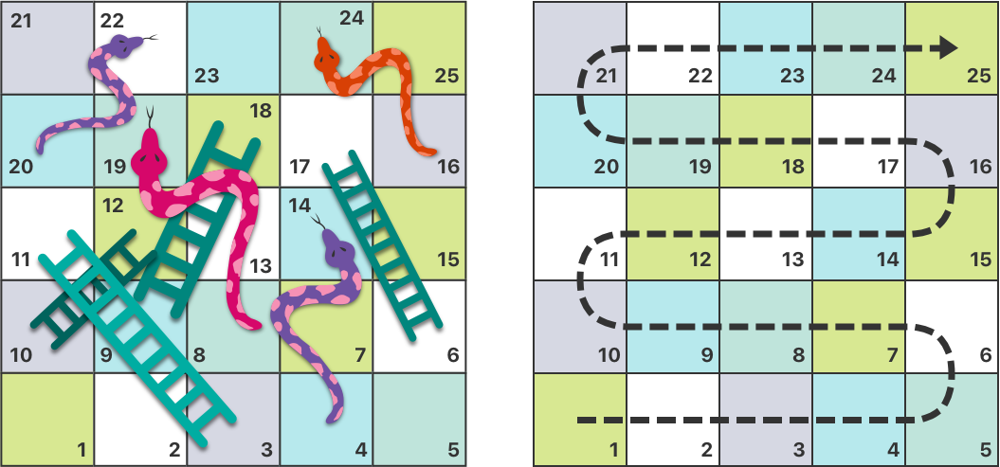
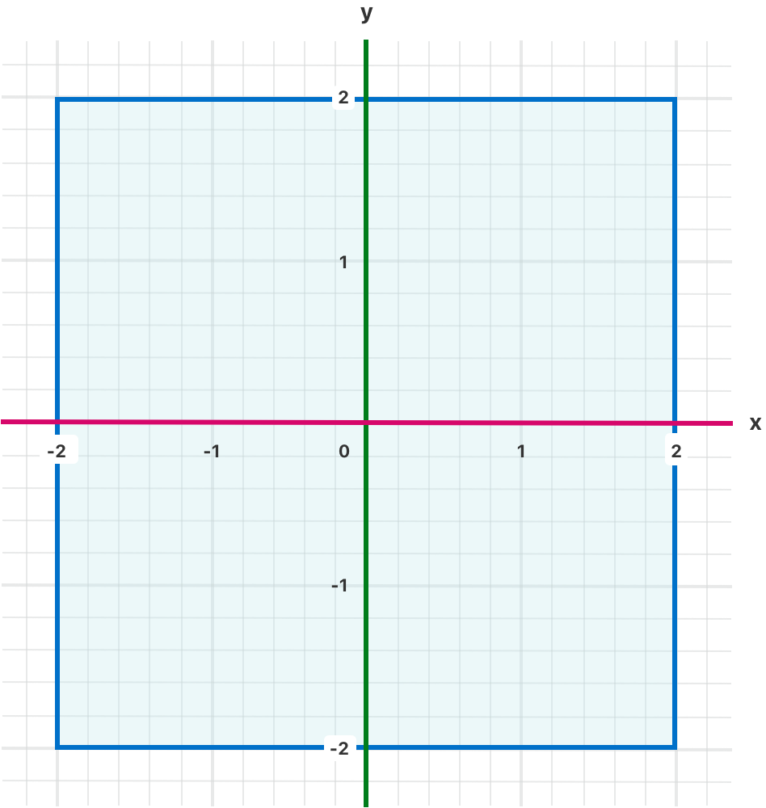
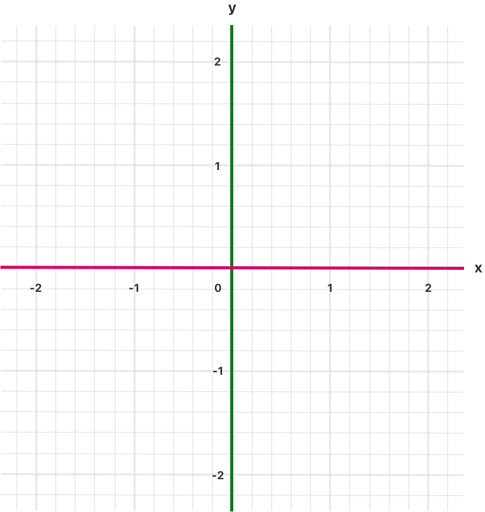
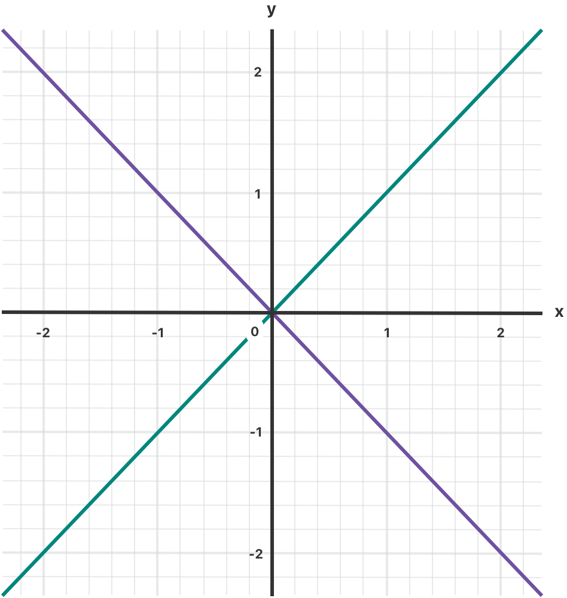

+++
title = "2.5 控制流"
date = 2026-09-11T20:00:03+08:00
weight = 5
type = "docs"
description = ""
isCJKLanguage = true
draft = false
+++


> 原文链接: [https://docs.swift.org/latest/documentation/the-swift-programming-language/controlflow/](https://docs.swift.org/latest/documentation/the-swift-programming-language/controlflow/)

# 2.5 控制流

用分支、循环和提前退出来组织代码。

Swift 提供了多种控制流语句，包括用于多次完成某项任务的 `while` 循环；用于根据特定条件执行不同代码分支的 `if`、`guard` 和 `switch` 语句；以及把执行流程转移到代码中另一个位置的 `break`、`continue` 之类的语句。Swift 提供的 `for`-`in` 循环让遍历数组、字典、范围、字符串和其他序列变得轻而易举。Swift 还提供了 `defer` 语句，用来包裹在离开当前作用域时要执行的代码。

Swift 的 `switch` 语句比许多类 C 语言中的对应语句强大得多。case 可以匹配多种不同的模式，包括区间匹配、元组以及到特定类型的转换。`switch` 的 case 中匹配到的值可以绑定到临时常量或变量，供 case 的代码体使用；每个 case 还可以用 `where` 子句表达复杂的匹配条件。

## for-in 循环 {#For-In-Loops}

用 `for`-`in` 循环遍历序列，例如数组中的元素、数字范围或字符串中的字符。

下面这个例子用 `for`-`in` 循环遍历数组中的元素：

```swift
let names = ["Anna", "Alex", "Brian", "Jack"]
for name in names {
    print("Hello, \(name)!")
}
// Hello, Anna!
// Hello, Alex!
// Hello, Brian!
// Hello, Jack!
```

你也可以遍历字典来访问它的键值对。遍历字典时，每个元素都以 `(key, value)` 元组的形式返回，你可以把 `(key, value)` 元组的成员分解成明确命名的常量，供 `for`-`in` 循环体使用。在下面的代码示例中，字典的键被分解到名为 `animalName` 的常量，字典的值被分解到名为 `legCount` 的常量。

```swift
let numberOfLegs = ["spider": 8, "ant": 6, "cat": 4]
for (animalName, legCount) in numberOfLegs {
    print("\(animalName)s have \(legCount) legs")
}
// cats have 4 legs
// ants have 6 legs
// spiders have 8 legs
```

`Dictionary` 的内容本质上是无序的，遍历它们并不保证取出时的顺序。尤其是，你插入元素的顺序并不能决定遍历的顺序。关于数组和字典的更多内容，参见[集合类型](../2.4-CollectionTypes/)。

`for`-`in` 循环也可以用于数值范围。下面这个例子打印五的乘法表的前几项：

```swift
for index in 1...5 {
    print("\(index) times 5 is \(index * 5)")
}
// 1 times 5 is 5
// 2 times 5 is 10
// 3 times 5 is 15
// 4 times 5 is 20
// 5 times 5 is 25
```

被遍历的序列是从 `1` 到 `5`（含两端）的数字范围，这由闭区间运算符（`...`）表明。`index` 的值先被设为该范围内的第一个数字（`1`），然后执行循环中的语句。在这个例子里，循环只包含一条语句，它为 `index` 的当前值打印乘法表中的一项。该语句执行完之后，`index` 的值被更新为范围内的第二个值（`2`），`print(_:separator:terminator:)` 函数再次被调用。这个过程一直持续到范围的末尾。

在上面的例子里，`index` 是一个常量，它的值在循环的每次迭代开始时被自动设置。因此 `index` 不必在使用前声明，只要把它写在循环声明里就隐式声明了它，不需要 `let` 声明关键字。

如果你不需要序列中的每个值，可以用下划线代替变量名来忽略这些值。

```swift
let base = 3
let power = 10
var answer = 1
for _ in 1...power {
    answer *= base
}
print("\(base) to the power of \(power) is \(answer)")
// 输出 "3 to the power of 10 is 59049"。
```

上面的例子计算一个数的若干次幂（这里是 `3` 的 `10` 次幂）。它把起始值 `1`（也就是 `3` 的 `0` 次幂）乘以 `3`，一共乘十次，使用的闭区间从 `1` 开始、到 `10` 结束。对这个计算来说，每次循环的计数值都用不到——代码只需要把循环执行正确的次数。用下划线字符（`_`）代替循环变量会忽略这些具体的值，也不会在每次迭代中提供对当前值的访问。

某些情况下，你可能不想使用包含两个端点的闭区间。设想在表盘上为每一分钟画一个刻度：你要从第 `0` 分钟开始画 `60` 个刻度。这时就用半开区间运算符（`..<`）来包含下界而不包含上界。关于范围的更多内容，参见[范围运算符](../2.2-BasicOperators/#Range-Operators)。

```swift
let minutes = 60
for tickMark in 0..<minutes {
    // 每分钟画一个刻度（共 60 次）
}
```

有些用户可能希望界面上的刻度少一些，比如每 `5` 分钟画一个刻度。这时用 `stride(from:to:by:)` 函数跳过不需要的刻度。

```swift
let minuteInterval = 5
for tickMark in stride(from: 0, to: minutes, by: minuteInterval) {
    // 每 5 分钟画一个刻度（0, 5, 10, 15 ... 45, 50, 55）
}
```

改用 `stride(from:through:by:)` 也可以使用闭区间：

```swift
let hours = 12
let hourInterval = 3
for tickMark in stride(from: 3, through: hours, by: hourInterval) {
    // 每 3 小时画一个刻度（3, 6, 9, 12）
}
```

上面的例子用 `for`-`in` 循环遍历了范围、数组、字典和字符串。不过，只要类型遵循 [`Sequence`](https://developer.apple.com/documentation/swift/sequence) 协议，你就可以用这种语法遍历*任何*集合，包括你自己的类和集合类型。

## while 循环 {#While-Loops}

`while` 循环重复执行一组语句，直到条件变为 `false`。当首次迭代开始之前无法确定迭代次数时，这类循环最为合适。Swift 提供两种 `while` 循环：

- `while` 在每次循环开始时求值它的条件。
- `repeat`-`while` 在每次循环结束时求值它的条件。

### while {#While}

`while` 循环首先求值一个条件。如果条件为 `true`，就重复执行一组语句，直到条件变为 `false`。

`while` 循环的一般形式如下：

```swift
while <#condition#> {
   <#statements#>
}
```

下面这个例子玩一个简单的*蛇与梯子*（也叫*滑梯与梯子*）游戏：



游戏规则如下：

- 棋盘上有 25 个方格，目标是走到或越过第 25 格。
- 玩家的起始位置是"第零格"，就在棋盘左下角的旁边。
- 每个回合掷一次六面骰子，按掷出的点数沿上图虚线箭头所示的横向路径前进相应格数。
- 如果这一回合停在梯子的底部，就顺着梯子向上移动。
- 如果这一回合停在蛇的头部，就顺着蛇身向下移动。

游戏棋盘用一个 `Int` 值数组表示。数组大小取决于常量 `finalSquare`，它既用于初始化数组，也在后面的例子中用于判断是否获胜。由于玩家从棋盘外的"第零格"出发，棋盘用 26 个值为零的 `Int` 初始化，而不是 25 个。

```swift
let finalSquare = 25
var board = [Int](repeating: 0, count: finalSquare + 1)
```

接着给一些方格设置更具体的值，用来表示蛇和梯子。梯子底部的方格用正数把你向上移动，而蛇头所在的方格用负数把你向下移动。

```swift
board[03] = +08; board[06] = +11; board[09] = +09; board[10] = +02
board[14] = -10; board[19] = -11; board[22] = -02; board[24] = -08
```

第 3 格是梯子的底部，可以一直上到第 11 格。为了表示这一点，`board[03]` 等于 `+08`，也就是整数值 `8`（`3` 与 `11` 之间的差值）。为了让数值和语句对齐，这里把一元正号运算符（`+i`）与一元负号运算符（`-i`）显式地一起使用，并给小于 `10` 的数字补了零。（这两种风格上的处理都不是必需的，但它们让代码更整齐。）

```swift
var square = 0
var diceRoll = 0
while square < finalSquare {
    // 掷骰子
    diceRoll += 1
    if diceRoll == 7 { diceRoll = 1 }
    // 按掷出的点数移动
    square += diceRoll
    if square < board.count {
        // 如果还在棋盘上，就按蛇或梯子上下移动
        square += board[square]
    }
}
print("Game over!")
```

上面的例子用非常简单的方式模拟掷骰子：它不生成随机数，而是从 `diceRoll` 的值 `0` 开始，每次进入 `while` 循环就把 `diceRoll` 加一，然后检查它是否变得过大。只要这个返回值等于 `7`，就说明掷出的点数过大，于是把它重置为 `1`。结果就是一个始终为 `1`、`2`、`3`、`4`、`5`、`6`、`1`、`2`……这样的 `diceRoll` 值序列。

掷完骰子后，玩家向前移动 `diceRoll` 格。掷出的点数有可能让玩家越过第 25 格，这时游戏就结束了。为了应对这种情况，代码会检查 `square` 是否小于 `board` 数组的 `count` 属性。如果 `square` 有效，就把 `board[square]` 中存放的值加到当前的 `square` 上，让玩家沿梯子或蛇上下移动。

> 注意：如果不做这项检查，
> `board[square]` 可能会访问 `board` 数组边界之外的值，
> 从而触发运行时错误。

于是这次 `while` 循环的执行结束，接着检查循环条件，判断是否应当再次执行循环。如果玩家已经走到或越过第 `25` 格，循环条件就求值为 `false`，游戏结束。

这种情况下使用 `while` 循环很合适，因为 `while` 循环开始时游戏的长度并不确定，循环会一直执行到某个特定条件被满足为止。

### repeat-while {#Repeat-While}

`while` 循环的另一种变体称为 `repeat`-`while` 循环，它*先*执行一次循环体，然后才考虑循环条件。接着它继续重复循环，直到条件为 `false`。

> 注意：Swift 中的 `repeat`-`while` 循环相当于
> 其他语言中的 `do`-`while` 循环。

`repeat`-`while` 循环的一般形式如下：

```swift
repeat {
   <#statements#>
} while <#condition#>
```

下面把*蛇与梯子*的例子改写成一个 `repeat`-`while` 循环，而不是 `while` 循环。`finalSquare`、`board`、`square` 和 `diceRoll` 的初始化方式与 `while` 循环版本完全相同。

```swift
let finalSquare = 25
var board = [Int](repeating: 0, count: finalSquare + 1)
board[03] = +08; board[06] = +11; board[09] = +09; board[10] = +02
board[14] = -10; board[19] = -11; board[22] = -02; board[24] = -08
var square = 0
var diceRoll = 0
```

在这个版本的游戏中，循环里的*第一个*动作是检查梯子或蛇。棋盘上没有任何梯子能直接把玩家送到第 25 格，因此不可能靠爬梯子赢下游戏。所以在循环的第一个动作里检查蛇和梯子是安全的。

游戏开始时，玩家处在"第零格"。`board[0]` 总是等于 `0`，不会产生任何影响。

```swift
repeat {
    // 按蛇或梯子上下移动
    square += board[square]
    // 掷骰子
    diceRoll += 1
    if diceRoll == 7 { diceRoll = 1 }
    // 按掷出的点数移动
    square += diceRoll
} while square < finalSquare
print("Game over!")
```

代码检查完蛇和梯子之后，掷骰子并让玩家前进 `diceRoll` 格，然后这次循环的执行就结束了。

循环条件（`while square < finalSquare`）与前面一样，但这一次它要等到循环*第一次*执行结束时才被求值。这种 `repeat`-`while` 循环的结构比上一个例子中的 `while` 循环更适合这个游戏：在上面这个 `repeat`-`while` 循环里，`square += board[square]` 总是在循环的 `while` 条件确认 `square` 仍在棋盘上*之后立即*执行。这一行为省去了前面 `while` 循环版本中所需的数组边界检查。

## 条件语句 {#Conditional-Statements}

根据特定条件执行不同的代码往往很有用：你可能想在出错时多执行一段代码，或者在某个值过大或过小时显示一条消息。为此，你可以让代码的某些部分变成*有条件的*。

Swift 提供两种为代码添加条件分支的方式：`if` 语句和 `switch` 语句。通常，`if` 语句用于求值结果只有少数几种的简单条件；`switch` 语句则更适合有多种可能组合的复杂条件，在模式匹配有助于选出合适代码分支的情况下特别有用。

### if {#If}

最简单的 `if` 语句只有一个 `if` 条件：只有当该条件为 `true` 时，才执行一组语句。

```swift
var temperatureInFahrenheit = 30
if temperatureInFahrenheit <= 32 {
    print("It's very cold. Consider wearing a scarf.")
}
// 输出 "It's very cold. Consider wearing a scarf."。
```

上面的例子检查温度是否小于或等于 32 华氏度（水的冰点）。如果是，就打印一条消息；否则不打印任何消息，代码继续执行 `if` 语句右花括号之后的部分。

`if` 语句还可以提供另一组语句，称为*else 子句*，用于 `if` 条件为 `false` 的情况。这些语句用 `else` 关键字引出。

```swift
temperatureInFahrenheit = 40
if temperatureInFahrenheit <= 32 {
    print("It's very cold. Consider wearing a scarf.")
} else {
    print("It's not that cold. Wear a T-shirt.")
}
// 输出 "It's not that cold. Wear a T-shirt."。
```

这两个分支中总有一个会被执行。由于温度升到了 `40` 华氏度，已经不再冷到需要建议戴围巾，因此转而触发 `else` 分支。

你可以把多个 `if` 语句串联起来，考虑更多的子句。

```swift
temperatureInFahrenheit = 90
if temperatureInFahrenheit <= 32 {
    print("It's very cold. Consider wearing a scarf.")
} else if temperatureInFahrenheit >= 86 {
    print("It's really warm. Don't forget to wear sunscreen.")
} else {
    print("It's not that cold. Wear a T-shirt.")
}
// 输出 "It's really warm. Don't forget to wear sunscreen."。
```

这里又添加了一个 `if` 语句来处理特别温暖的温度。最后的 `else` 子句依然保留，它会为任何既不太热也不太冷的温度打印一条回复。

不过最后一个 `else` 子句是可选的，如果条件集合不需要覆盖所有情况，就可以省略它。

```swift
temperatureInFahrenheit = 72
if temperatureInFahrenheit <= 32 {
    print("It's very cold. Consider wearing a scarf.")
} else if temperatureInFahrenheit >= 86 {
    print("It's really warm. Don't forget to wear sunscreen.")
}
```

由于温度既没有冷到触发 `if` 条件，也没有热到触发 `else if` 条件，因此不会打印任何消息。

Swift 提供了一种 `if` 的简写写法，可以在赋值时使用。例如，考虑下面这段代码：

```swift
let temperatureInCelsius = 25
let weatherAdvice: String

if temperatureInCelsius <= 0 {
    weatherAdvice = "It's very cold. Consider wearing a scarf."
} else if temperatureInCelsius >= 30 {
    weatherAdvice = "It's really warm. Don't forget to wear sunscreen."
} else {
    weatherAdvice = "It's not that cold. Wear a T-shirt."
}

print(weatherAdvice)
// 输出 "It's not that cold. Wear a T-shirt."。
```

这里每个分支都为常量 `weatherAdvice` 设置了一个值，`if` 语句之后会把它打印出来。

使用另一种语法，即 `if` 表达式，可以把这段代码写得更简洁：

```swift
let weatherAdvice = if temperatureInCelsius <= 0 {
    "It's very cold. Consider wearing a scarf."
} else if temperatureInCelsius >= 30 {
    "It's really warm. Don't forget to wear sunscreen."
} else {
    "It's not that cold. Wear a T-shirt."
}

print(weatherAdvice)
// 输出 "It's not that cold. Wear a T-shirt."。
```

在这个 `if` 表达式版本中，每个分支都包含单个值。如果某个分支的条件为真，该分支的值就被用作整个 `if` 表达式的值，赋给 `weatherAdvice`。每个 `if` 分支都有对应的 `else if` 分支或 `else` 分支，这保证了总有一个分支会匹配，也保证无论哪个条件为真，`if` 表达式总能产生一个值。

由于赋值语法位于 `if` 表达式之外，因此不必在每个分支里重复写 `weatherAdvice =`。取而代之的是，`if` 表达式的每个分支为 `weatherAdvice` 产生三个可能值之一，赋值语句使用这个值。

`if` 表达式的所有分支都必须包含同一类型的值。由于 Swift 会分别检查每个分支的类型，像 `nil` 这种可以用于多种类型的值会让 Swift 无法自动确定 `if` 表达式的类型。这时你需要显式指定类型——例如：

```swift
let freezeWarning: String? = if temperatureInCelsius <= 0 {
    "It's below freezing. Watch for ice!"
} else {
    nil
}
```

在上面的代码中，`if` 表达式的一个分支有字符串值，另一个分支有 `nil` 值。`nil` 值可以用于任何可选类型，因此你必须显式写出 `freezeWarning` 是可选字符串，详见[类型标注](../2.1-TheBasics/#Type-Annotations)。

提供这些类型信息的另一种方式是为 `nil` 提供显式类型，而不是为 `freezeWarning` 提供显式类型：

```swift
let freezeWarning = if temperatureInCelsius <= 0 {
    "It's below freezing. Watch for ice!"
} else {
    nil as String?
}
```

`if` 表达式也可以通过抛出错误，或者调用 `fatalError(_:file:line:)` 这类永不返回的函数，来应对意外的失败。例如：

```swift
let weatherAdvice = if temperatureInCelsius > 100 {
    throw TemperatureError.boiling
} else {
    "It's a reasonable temperature."
}
```

在这个例子里，`if` 表达式检查预报温度是否高于 100°C——水的沸点。这么高的温度会让 `if` 表达式抛出 `.boiling` 错误，而不是返回一段文字总结。尽管这个 `if` 表达式可以抛出错误，你也不需要在其前面写 `try`。关于错误处理的更多内容，参见[错误处理](../2.17-ErrorHandling/)。

除了像上面的例子那样用在赋值语句的右侧，`if` 表达式也可以用作函数或闭包的返回值。

### switch {#Switch}

`switch` 语句考察一个值，并把它与若干可能的匹配模式进行比较，然后根据第一个成功匹配的模式执行相应的代码块。对于需要应对多种可能状态的情况，`switch` 语句提供了 `if` 语句之外的另一种选择。

最简单的 `switch` 语句把一个值与一个或多个同类型的值进行比较。

```swift
switch <#some value to consider#> {
case <#value 1#>:
    <#respond to value 1#>
case <#value 2#>,
    <#value 3#>:
    <#respond to value 2 or 3#>
default:
    <#otherwise, do something else#>
}
```

每个 `switch` 语句都由多个可能的 *case* 组成，每个 case 都以 `case` 关键字开头。除了与特定值比较之外，Swift 还提供了多种方式让每个 case 指定更复杂的匹配模式，这些选项会在本章后面介绍。

和 `if` 语句的语句体一样，每个 `case` 都是代码执行的一条独立分支，由 `switch` 语句决定应当选择哪个分支。这一过程称为对正在考察的值*做 switch*。

每个 `switch` 语句都必须*穷尽*，也就是说，所考察类型的所有可能值都必须被某个 `switch` case 匹配到。如果为每个可能的值都提供一个 case 并不合适，你可以定义一个 default case 来覆盖所有没有显式处理的值。default case 由 `default` 关键字引出，而且必须始终放在最后。

下面这个例子用 `switch` 语句考察单个小写字符 `someCharacter`：

```swift
let someCharacter: Character = "z"
switch someCharacter {
case "a":
    print("The first letter of the Latin alphabet")
case "z":
    print("The last letter of the Latin alphabet")
default:
    print("Some other character")
}
// 输出 "The last letter of the Latin alphabet"。
```

`switch` 语句的第一个 case 匹配英文字母表的第一个字母 `a`，第二个 case 匹配最后一个字母 `z`。由于 `switch` 必须为每一个可能的字符（而不只是每个字母）提供 case，这个 `switch` 语句用 `default` case 匹配除 `a` 和 `z` 之外的所有字符。这一安排保证了 `switch` 语句是穷尽的。

和 `if` 语句一样，`switch` 语句也有表达式形式：

```swift
let anotherCharacter: Character = "a"
let message = switch anotherCharacter {
case "a":
    "The first letter of the Latin alphabet"
case "z":
    "The last letter of the Latin alphabet"
default:
    "Some other character"
}

print(message)
// 输出 "The first letter of the Latin alphabet"。
```

在这个例子里，`switch` 表达式的每个 case 都包含当该 case 匹配 `anotherCharacter` 时 `message` 应当使用的值。由于 `switch` 总是穷尽的，因此总有值可以赋给 `message`。

与 `if` 表达式一样，你也可以不给出某个 case 的值，而是抛出错误，或者调用 `fatalError(_:file:line:)` 这类永不返回的函数。`switch` 表达式可以用在赋值语句的右侧（如上面的例子所示），也可以用作函数或闭包的返回值。

#### 没有隐式贯穿 {#No-Implicit-Fallthrough}

与 C 和 Objective-C 中的 `switch` 语句不同，Swift 的 `switch` 语句默认不会从每个 case 的末尾贯穿（fall through）到下一个 case。相反，第一个匹配的 `switch` case 一执行完，整个 `switch` 语句就结束执行，无需显式写出 `break`。这让 `switch` 语句比 C 中的更安全、更易用，也避免了误执行多个 `switch` case。

> 注意：尽管 Swift 中不需要写 `break`，
> 但你仍然可以用 `break` 语句来匹配并忽略某个特定的 case，
> 或者在一个匹配到的 case 执行完毕之前跳出该 case。
> 详见 [switch 语句中的 break](./#Break-in-a-Switch-Statement)。

每个 case 的语句体*必须*至少包含一条可执行语句。下面这段代码不合法，因为第一个 case 是空的：

```swift
let anotherCharacter: Character = "a"
switch anotherCharacter {
case "a": // 无效：这个 case 的语句体是空的
case "A":
    print("The letter A")
default:
    print("Not the letter A")
}
// 这会报编译期错误。
```

与 C 中的 `switch` 语句不同，这个 `switch` 语句不会同时匹配 `"a"` 和 `"A"`，而是报告一个编译期错误，指出 `case "a":` 不包含任何可执行语句。这种做法避免了从一个 case 意外贯穿到另一个 case，让代码更安全、意图也更清晰。

若想让一个 `switch` 用单个 case 同时匹配 `"a"` 和 `"A"`，就把这两个值组合成一个复合 case，用逗号分隔。

```swift
let anotherCharacter: Character = "a"
switch anotherCharacter {
case "a", "A":
    print("The letter A")
default:
    print("Not the letter A")
}
// 输出 "The letter A"。
```

为了可读性，复合 case 也可以分多行书写。关于复合 case 的更多内容，参见[复合 case](./#Compound-Cases)。

> 注意：若要在某个 `switch` case 的末尾显式地贯穿到下一个 case，
> 请使用 `fallthrough` 关键字，
> 详见[贯穿](./#Fallthrough)。

#### 区间匹配 {#Interval-Matching}

`switch` 的 case 中还可以检查值是否落在某个区间内。下面这个例子用数字区间为任意大小的数量给出自然语言描述：

```swift
let approximateCount = 62
let countedThings = "moons orbiting Saturn"
let naturalCount: String
switch approximateCount {
case 0:
    naturalCount = "no"
case 1..<5:
    naturalCount = "a few"
case 5..<12:
    naturalCount = "several"
case 12..<100:
    naturalCount = "dozens of"
case 100..<1000:
    naturalCount = "hundreds of"
default:
    naturalCount = "many"
}
print("There are \(naturalCount) \(countedThings).")
// 输出 "There are dozens of moons orbiting Saturn."。
```

在上面的例子里，`approximateCount` 被放到 `switch` 语句中求值。每个 `case` 都把这个值与一个数字或区间比较。由于 `approximateCount` 的值落在 12 和 100 之间，`naturalCount` 被赋值为 `"dozens of"`，执行随即从 `switch` 语句中转移出去。

#### 元组 {#Tuples}

你可以在同一个 `switch` 语句中用元组测试多个值。元组的每个元素都可以与不同的值或值的区间比较。另一种做法是用下划线字符（`_`），也就是通配符模式，匹配任何可能的值。

下面的例子取一个 (x, y) 点（用 `(Int, Int)` 类型的简单元组表示），并按照例子后面的图表对它分类。

```swift
let somePoint = (1, 1)
switch somePoint {
case (0, 0):
    print("\(somePoint) is at the origin")
case (_, 0):
    print("\(somePoint) is on the x-axis")
case (0, _):
    print("\(somePoint) is on the y-axis")
case (-2...2, -2...2):
    print("\(somePoint) is inside the box")
default:
    print("\(somePoint) is outside of the box")
}
// 输出 "(1, 1) is inside the box"。
```



这个 `switch` 语句判断该点是位于原点 (0, 0)、位于红色的 x 轴上、位于绿色的 y 轴上、位于以原点为中心、边长为 4 的蓝色方框内，还是位于方框之外。

与 C 不同，Swift 允许多个 `switch` case 考察相同的值。事实上，点 (0, 0) 可以匹配这个例子中*全部四个* case。不过，当存在多个可能的匹配时，总是使用第一个匹配的 case。点 (0, 0) 会先匹配 `case (0, 0)`，因此其他所有匹配的 case 都会被忽略。

#### 值绑定 {#Value-Bindings}

`switch` 的 case 可以把它匹配到的一个或多个值命名为临时常量或变量，供 case 的语句体使用。这一行为称为*值绑定*，因为这些值被绑定到 case 语句体内的临时常量或变量上。

下面的例子取一个 (x, y) 点（用 `(Int, Int)` 类型的元组表示），并按照后面的图表对它分类：

```swift
let anotherPoint = (2, 0)
switch anotherPoint {
case (let x, 0):
    print("on the x-axis with an x value of \(x)")
case (0, let y):
    print("on the y-axis with a y value of \(y)")
case let (x, y):
    print("somewhere else at (\(x), \(y))")
}
// 输出 "on the x-axis with an x value of 2"。
```



这个 `switch` 语句判断该点位于红色的 x 轴上、绿色的 y 轴上，还是位于其他位置（不在任何坐标轴上）。

这三个 `switch` case 声明了占位常量 `x` 和 `y`，它们临时接收 `anotherPoint` 中的一个或两个元组值。第一个 case `case (let x, 0)` 匹配任何 `y` 值为 `0` 的点，并把该点的 `x` 值赋给临时常量 `x`。类似地，第二个 case `case (0, let y)` 匹配任何 `x` 值为 `0` 的点，并把该点的 `y` 值赋给临时常量 `y`。

临时常量声明之后，就可以在 case 的代码块中使用。这里用它们打印出该点的分类结果。

这个 `switch` 语句没有 `default` case。最后一个 case `case let (x, y)` 声明了一个包含两个占位常量的元组，可以匹配任何值。由于 `anotherPoint` 始终是两个值的元组，这个 case 匹配所有剩余的取值，因此不需要 `default` case 来让 `switch` 语句穷尽。

#### where {#Where}

`switch` 的 case 可以用 `where` 子句检查额外的条件。

下面的例子按照后面的图表对 (x, y) 点进行分类：

```swift
let yetAnotherPoint = (1, -1)
switch yetAnotherPoint {
case let (x, y) where x == y:
    print("(\(x), \(y)) is on the line x == y")
case let (x, y) where x == -y:
    print("(\(x), \(y)) is on the line x == -y")
case let (x, y):
    print("(\(x), \(y)) is just some arbitrary point")
}
// 输出 "(1, -1) is on the line x == -y"。
```



这个 `switch` 语句判断该点是位于 `x == y` 的绿色对角线上、`x == -y` 的紫色对角线上，还是两者都不是。

这三个 `switch` case 声明了占位常量 `x` 和 `y`，它们临时接收 `yetAnotherPoint` 中的两个元组值。这些常量被用在 `where` 子句中，构造出一个动态过滤器：只有当 `where` 子句的条件对该值求值为 `true` 时，`switch` case 才匹配 `point` 的当前值。

和上一个例子一样，最后一个 case 匹配所有剩余的取值，因此不需要 `default` case 来让 `switch` 语句穷尽。

#### 复合 case {#Compound-Cases}

如果多个 switch case 共享同一个语句体，可以把若干个模式写在 `case` 之后，模式之间用逗号分隔，从而把它们合并起来。只要其中任何一个模式匹配，就认为该 case 匹配。如果模式列表很长，也可以分多行书写。例如：

```swift
let someCharacter: Character = "e"
switch someCharacter {
case "a", "e", "i", "o", "u":
    print("\(someCharacter) is a vowel")
case "b", "c", "d", "f", "g", "h", "j", "k", "l", "m",
    "n", "p", "q", "r", "s", "t", "v", "w", "x", "y", "z":
    print("\(someCharacter) is a consonant")
default:
    print("\(someCharacter) isn't a vowel or a consonant")
}
// 输出 "e is a vowel"。
```

这个 `switch` 语句的第一个 case 匹配英语中的五个小写元音字母，第二个 case 匹配所有小写英语辅音字母，最后的 `default` case 匹配其他任何字符。

复合 case 也可以包含值绑定。复合 case 的所有模式都必须包含同一组值绑定，而且每个绑定在所有模式中都必须取得同一类型的值。这保证了无论复合 case 的哪一部分匹配，case 语句体中的代码都能访问到绑定的值，而且该值的类型始终一致。

```swift
let stillAnotherPoint = (9, 0)
switch stillAnotherPoint {
case (let distance, 0), (0, let distance):
    print("On an axis, \(distance) from the origin")
default:
    print("Not on an axis")
}
// 输出 "On an axis, 9 from the origin"。
```

上面这个 `case` 有两个模式：`(let distance, 0)` 匹配 x 轴上的点，`(0, let distance)` 匹配 y 轴上的点。两个模式都包含对 `distance` 的绑定，而且在两个模式中 `distance` 都是整数——这意味着 `case` 语句体中的代码始终可以访问到 `distance` 的值。

## 模式 {#Patterns}

在前面的例子里，每个 switch case 都包含一个模式，用来指明什么样的值匹配该 case。你也可以把模式用作 `if` 语句的条件。写法如下：

```swift
let somePoint = (12, 100)
if case (let x, 100) = somePoint {
    print("Found a point on the y=100 line, at \(x)")
}
// 输出 "Found a point on the y=100 line, at 12"。
```

在这段代码中，`if` 语句的条件以 `case` 开头，表示这个条件是模式而不是布尔值。如果模式匹配，`if` 的条件就被视为真，于是 `if` 语句体中的代码就会执行。可以写在 `if case` 之后的模式，与可以写在 switch case 中的模式相同。

在 `for`-`in` 循环中，即使代码里没有写 `case`，你也可以用值绑定模式为值的各个部分命名：

```swift
let points = [(10, 0), (30, -30), (-20, 0)]

for (x, y) in points {
    if y == 0 {
        print("Found a point on the x-axis at \(x)")
    }
}
// 输出 "Found a point on the x-axis at 10"。
// 输出 "Found a point on the x-axis at -20"。
```

上面的 `for`-`in` 循环遍历一个元组数组，把元组的第一个和第二个元素分别绑定到常量 `x` 和 `y`。循环中的语句可以使用这些常量，比如用 `if` 语句检查该点是否位于 x 轴上。更简洁的写法是用 `for`-`case`-`in` 循环把值绑定和条件结合起来。下面的代码与上面的 `for`-`in` 循环行为相同：

```swift
for case (let x, 0) in points {
    print("Found a point on the x-axis at \(x)")
}
// 输出 "Found a point on the x-axis at 10"。
// 输出 "Found a point on the x-axis at -20"。
```

在这段代码中，条件作为模式的一部分被整合进 `for`-`case`-`in` 循环。`for`-`case`-`in` 循环中的语句只对位于 x 轴上的点执行。这段代码与上面的 `for`-`in` 循环结果相同，但用更紧凑的方式只遍历集合中的某些元素。

`for`-`case`-`in` 循环也可以包含 `where` 子句，用来检查附加条件。只有当 `where` 子句匹配当前元素时，循环中的语句才会执行。例如：

```swift
for case let (x, y) in points where x == y || x == -y  {
    print("Found (\(x), \(y)) along a line through the origin")
}
// 输出 "Found (30, -30) along a line through the origin"。
```

这段代码把元组的第一个和第二个元素分别绑定为常量 `x` 和 `y`，然后在 `where` 子句中检查它们的值。如果 `where` 子句为 `true`，就执行 `for` 循环体中的代码；否则继续遍历下一个元素。

由于模式可以绑定值，`if`-`case` 语句和 `for`-`case`-`in` 循环在处理带有关联值的枚举时特别有用，详见[关联值](../2.8-Enumerations/#Associated-Values)。

## 控制转移语句 {#Control-Transfer-Statements}

*控制转移语句*通过把控制权从一段代码转移到另一段代码，改变代码执行的顺序。Swift 有五种控制转移语句：

- `continue`
- `break`
- `fallthrough`
- `return`
- `throw`

`continue`、`break` 和 `fallthrough` 语句在下面介绍。`return` 语句在[函数](../2.6-Functions/)中介绍，`throw` 语句在[用抛出错误的函数传播错误](../2.17-ErrorHandling/#Propagating-Errors-Using-Throwing-Functions)中介绍。

### continue {#Continue}

`continue` 语句告诉循环停止当前正在做的事，并直接开始循环的下一次迭代。它说的是"本次循环迭代我已经做完了"，同时并不完全离开循环。

下面这个例子把一个小写字符串中的所有元音字母和空格都去掉，生成一句隐晦的谜语：

```swift
let puzzleInput = "great minds think alike"
var puzzleOutput = ""
let charactersToRemove: [Character] = ["a", "e", "i", "o", "u", " "]
for character in puzzleInput {
    if charactersToRemove.contains(character) {
        continue
    }
    puzzleOutput.append(character)
}
print(puzzleOutput)
// 输出 "grtmndsthnklk"。
```

上面的代码在匹配到元音字母或空格时调用 `continue` 关键字，使当前的循环迭代立即结束，直接跳到下一次迭代的开头。

### break {#Break}

`break` 语句立即结束整个控制流语句的执行。当你希望比通常情况更早地终止 `switch` 或循环语句的执行时，就可以在 `switch` 或循环语句中使用 `break` 语句。

#### 循环语句中的 break {#Break-in-a-Loop-Statement}

在循环语句中使用时，`break` 立即结束该循环的执行，并把控制权转移到循环右花括号（`}`）之后的代码。当前迭代中剩余的代码不会执行，循环的后续迭代也不会开始。

#### switch 语句中的 break {#Break-in-a-Switch-Statement}

在 `switch` 语句中使用时，`break` 让该 `switch` 语句立即结束执行，并把控制权转移到 `switch` 语句右花括号（`}`）之后的代码。

这一行为可以用来匹配并忽略 `switch` 语句中的一个或多个 case。由于 Swift 的 `switch` 语句是穷尽的，而且不允许空的 case，有时就需要刻意匹配并忽略某个 case，以明确表达你的意图。做法是把 `break` 语句写在你想要忽略的那个 case 的整个语句体里。当该 case 被 `switch` 语句匹配到时，其中的 `break` 语句立刻结束 `switch` 语句的执行。

> 注意：只包含一条注释的 `switch` case 会被报告为编译期错误。
> 注释不是语句，不会让 `switch` case 被忽略。
> 要忽略某个 `switch` case，请始终使用 `break` 语句。

下面的例子对一个 `Character` 值做 switch，判断它表示四种语言中哪一种语言的数字符号。为了简洁，多个值被放在同一个 `switch` case 中。

```swift
let numberSymbol: Character = "三"  // 数字 3 的中文符号
var possibleIntegerValue: Int?
switch numberSymbol {
case "1", "١", "一", "๑":
    possibleIntegerValue = 1
case "2", "٢", "二", "๒":
    possibleIntegerValue = 2
case "3", "٣", "三", "๓":
    possibleIntegerValue = 3
case "4", "٤", "四", "๔":
    possibleIntegerValue = 4
default:
    break
}
if let integerValue = possibleIntegerValue {
    print("The integer value of \(numberSymbol) is \(integerValue).")
} else {
    print("An integer value couldn't be found for \(numberSymbol).")
}
// 输出 "The integer value of 三 is 3."。
```

这个例子检查 `numberSymbol`，判断它是数字 `1` 到 `4` 的拉丁、阿拉伯、中文还是泰文符号。如果找到匹配，`switch` 语句的某个 case 就把一个名为 `possibleIntegerValue` 的可选 `Int?` 变量设为相应的整数值。

`switch` 语句执行完毕后，这个例子用可选绑定判断是否找到了值。变量 `possibleIntegerValue` 由于是可选类型，隐式拥有初始值 `nil`，因此只有当 `switch` 语句前四个 case 之一把 `possibleIntegerValue` 设为实际值时，可选绑定才会成功。

由于在上面的例子里列出所有可能的 `Character` 值并不现实，因此用一个 `default` case 处理所有未匹配的字符。这个 `default` case 不需要执行任何动作，因此用一条 `break` 语句作为它的语句体。`default` case 一旦匹配，`break` 语句就结束 `switch` 语句的执行，代码从 `if let` 语句继续执行。

### 贯穿 {#Fallthrough}

在 Swift 中，`switch` 语句不会从每个 case 的末尾贯穿到下一个 case，也就是说，第一个匹配的 case 执行完毕，整个 `switch` 语句就结束执行。相比之下，C 语言要求你在每个 `switch` case 末尾显式插入 `break` 语句来防止贯穿。避免默认贯穿这一设计，使 Swift 的 `switch` 语句比 C 中对应的语句更简洁、更可预测，也避免了误执行多个 `switch` case。

如果你需要 C 那样的贯穿行为，可以用 `fallthrough` 关键字逐个 case 地启用它。下面的例子用 `fallthrough` 生成对一个数字的文字描述。

```swift
let integerToDescribe = 5
var description = "The number \(integerToDescribe) is"
switch integerToDescribe {
case 2, 3, 5, 7, 11, 13, 17, 19:
    description += " a prime number, and also"
    fallthrough
default:
    description += " an integer."
}
print(description)
// 输出 "The number 5 is a prime number, and also an integer."。
```

这个例子声明了一个名为 `description` 的新 `String` 变量并给它赋了初始值，然后用 `switch` 语句考察 `integerToDescribe` 的值。如果 `integerToDescribe` 的值是列表中的某个质数，就把文字追加到 `description` 末尾，说明这个数是质数；接着用 `fallthrough` 关键字"落入" `default` case。`default` case 再往描述末尾追加一些文字，`switch` 语句随即结束。

除非 `integerToDescribe` 的值属于已知质数列表，否则它根本不会被第一个 `switch` case 匹配。由于没有其他具体的 case，`integerToDescribe` 会被 `default` case 匹配。

`switch` 语句执行完之后，用 `print(_:separator:terminator:)` 函数打印该数字的描述。在这个例子里，数字 `5` 被正确地识别为质数。

> 注意：`fallthrough` 关键字不会检查它所落入的那个 `switch` case 的条件。
> 它只是让代码执行直接移动到下一个 case（或 `default` case）块中的语句，
> 与 C 标准 `switch` 语句的行为相同。

### 带标签的语句 {#Labeled-Statements}

在 Swift 中，你可以在循环和条件语句中嵌套其他循环和条件语句，构造复杂的控制流结构。然而，循环和条件语句都可以用 `break` 语句提前结束执行。因此，有时明确写出你希望 `break` 语句终止哪一个循环或条件语句是很有用的。类似地，如果你有多层嵌套循环，明确写出 `continue` 语句应当作用于哪个循环也可能很有用。

为此，你可以给循环语句或条件语句加上*语句标签*。对于条件语句，你可以在 `break` 语句中使用语句标签来结束带标签语句的执行；对于循环语句，你可以在 `break` 或 `continue` 语句中使用语句标签，来结束或继续带标签语句的执行。

带标签语句的写法是：把标签写在语句引入关键字所在行的前面，后跟一个冒号。下面是 `while` 循环的这种语法示例，不过这一原则对所有循环和 `switch` 语句都适用：

```swift
<#label name#>: while <#condition#> {
   <#statements#>
}
```

下面的例子在带标签的 `while` 循环中使用 `break` 和 `continue` 语句，对本章前面见过的*蛇与梯子*游戏做了一点改动。这一次，游戏多了一条规则：

- 要获胜，你必须*恰好*落在第 25 格上。

如果某次掷出的点数会让你越过第 25 格，就必须重新掷，直到掷出恰好落在第 25 格所需的点数为止。

棋盘与之前相同。


`finalSquare`、`board`、`square` 和 `diceRoll` 的初始化方式与之前相同：

```swift
let finalSquare = 25
var board = [Int](repeating: 0, count: finalSquare + 1)
board[03] = +08; board[06] = +11; board[09] = +09; board[10] = +02
board[14] = -10; board[19] = -11; board[22] = -02; board[24] = -08
var square = 0
var diceRoll = 0
```

这个版本的游戏用 `while` 循环和 `switch` 语句实现游戏逻辑。`while` 循环带有一个名为 `gameLoop` 的语句标签，表明它是蛇与梯子游戏的主循环。

`while` 循环的条件是 `while square != finalSquare`，以体现你必须恰好落在第 25 格上。

```swift
gameLoop: while square != finalSquare {
    diceRoll += 1
    if diceRoll == 7 { diceRoll = 1 }
    switch square + diceRoll {
    case finalSquare:
        // 掷出的点数会让我们落在最后一格，游戏结束
        break gameLoop
    case let newSquare where newSquare > finalSquare:
        // 掷出的点数会让我们越过最后一格，重新再掷
        continue gameLoop
    default:
        // 这是一次合法的移动，看看它的效果
        square += diceRoll
        square += board[square]
    }
}
print("Game over!")
```

每次循环开始时都先掷骰子。循环没有立刻移动玩家，而是用 `switch` 语句考察这次移动的结果，判断该移动是否被允许：

- 如果掷出的点数会让玩家落在最后一格上，游戏结束。`break gameLoop` 语句把控制权转移到 `while` 循环之外的第一行代码，从而结束游戏。
- 如果掷出的点数会让玩家*越过*最后一格，这次移动无效，玩家需要重新掷。`continue gameLoop` 语句结束当前这次 `while` 循环迭代，开始循环的下一次迭代。
- 其他所有情况下，掷出的点数都是合法移动。玩家前进 `diceRoll` 格，游戏逻辑再检查蛇和梯子。随后本次循环结束，控制权回到 `while` 条件，判断是否还需要再来一回合。

> 注意：如果上面那条 `break` 语句没有使用 `gameLoop` 标签，
> 它就会跳出 `switch` 语句，而不是 `while` 语句。
> 使用 `gameLoop` 标签可以清楚地表明应当终止哪个控制语句。
>
> 在调用 `continue gameLoop` 跳到循环的下一次迭代时，
> 严格来说并不是必须使用 `gameLoop` 标签：
> 这个游戏里只有一个循环，
> 因此 `continue` 语句作用于哪个循环并不会有歧义。
> 不过，在 `continue` 语句中使用 `gameLoop` 标签也没有坏处：
> 这样做与 `break` 语句使用该标签的方式保持一致，
> 也帮助读者更清晰、更容易地理解游戏逻辑。

## 提前退出 {#Early-Exit}

和 `if` 语句一样，`guard` 语句根据表达式的布尔值来执行语句，但用途不同：你用 `guard` 语句要求某个条件必须为真，`guard` 语句之后的代码才会执行。与 `if` 语句不同，`guard` 语句总是带有一个 `else` 子句——条件不成立时，就执行 `else` 子句中的代码。

```swift
func greet(person: [String: String]) {
    guard let name = person["name"] else {
        return
    }

    print("Hello \(name)!")

    guard let location = person["location"] else {
        print("I hope the weather is nice near you.")
        return
    }

    print("I hope the weather is nice in \(location).")
}

greet(person: ["name": "John"])
// 输出 "Hello John!"
// 输出 "I hope the weather is nice near you."
greet(person: ["name": "Jane", "location": "Cupertino"])
// 输出 "Hello Jane!"
// 输出 "I hope the weather is nice in Cupertino."
```

如果 `guard` 语句的条件得到满足，代码就从 `guard` 语句的右花括号之后继续执行。作为条件的一部分、通过可选绑定赋值的任何变量或常量，在 `guard` 语句所在的整个代码块的其余部分中都可以使用。

如果条件不满足，就执行 `else` 分支中的代码。该分支必须把控制权转移出去，离开 `guard` 语句所在的代码块，方式可以是 `return`、`break`、`continue` 或 `throw` 之类的控制转移语句，也可以是调用 `fatalError(_:file:line:)` 这类不返回的函数。

与用 `if` 语句做同样的检查相比，用 `guard` 语句表达要求可以提升代码的可读性：它让你无需把通常执行的代码包在 `else` 块里，也让你能把处理违反要求情况的代码紧挨着要求本身书写。

## 延迟执行的动作 {#Deferred-Actions}

`if` 和 `while` 这类控制流结构让你控制某段代码是否执行、执行多少次，而 `defer` 控制的是一段代码*什么时候*执行。你可以用 `defer` 块编写稍后执行的代码，也就是程序执行到当前作用域末尾时执行的代码。例如：

```swift
var score = 1
if score < 10 {
    defer {
        print(score)
    }
    score += 5
}
// 输出 "6"。
```

在上面的例子里，`defer` 块中的代码在离开 `if` 语句体之前执行：先执行 `if` 语句中的代码，把 `score` 加上五；然后在离开 `if` 语句作用域之前，运行被推迟的代码，打印 `score`。

无论程序以何种方式离开该作用域，`defer` 中的代码总会执行，包括函数的提前返回、从 `for` 循环中跳出，或者抛出错误等情况。这一行为让 `defer` 特别适合那些必须成对发生、需要保证的操作——比如手动分配和释放内存、打开和关闭底层的文件描述符、开始和结束数据库事务——因为你可以把两个操作紧挨着写在代码里。例如，下面这段代码通过在一段代码中添加再减去 100，给分数一个临时加成：

```swift
var score = 3
if score < 100 {
    score += 100
    defer {
        score -= 100
    }
    // 其他使用带加成分数的代码写在这里。
    print(score)
}
// 输出 "103"。
```

如果在同一个作用域中写了多个 `defer` 块，那么最先写的那一个会最后执行。

```swift
if score < 10 {
    defer {
        print(score)
    }
    defer {
        print("The score is:")
    }
    score += 5
}
// 输出 "The score is:"。
// 输出 "6"。
```

如果程序停止运行——例如因为运行时错误或崩溃——被推迟的代码不会执行。不过，错误抛出之后被推迟的代码是会执行的。关于在错误处理中使用 `defer` 的更多内容，参见[指定清理操作](../2.17-ErrorHandling/#Specifying-Cleanup-Actions)。

## 检查 API 可用性 {#Checking-API-Availability}

Swift 内置了对 API 可用性检查的支持，确保你不会误用某个部署目标上不可用的 API。

编译器会使用 SDK 中的可用性信息，验证代码中用到的所有 API 在项目指定的部署目标上都可用。如果你试图使用某个不可用的 API，Swift 会在编译期报告错误。

你可以在 `if` 或 `guard` 语句中使用*可用性条件*，根据要在运行时使用的 API 是否可用，有条件地执行一段代码。编译器在验证该代码块中的 API 是否可用时，会利用可用性条件提供的信息。

```swift
if #available(iOS 10, macOS 10.12, *) {
    // 在 iOS 上使用 iOS 10 的 API，在 macOS 上使用 macOS 10.12 的 API
} else {
    // 回退到较早的 iOS 和 macOS API
}
```

上面的可用性条件表示：在 iOS 上，`if` 语句的语句体只在 iOS 10 及更高版本中执行；在 macOS 上，只在 macOS 10.12 及更高版本中执行。最后一个实参 `*` 是必需的，它表示在其他任何平台上，`if` 语句的语句体在目标所指定的最低部署目标上执行。

可用性条件的一般形式接受一串平台名称和版本。平台名称可以使用 `iOS`、`macOS`、`watchOS`、`tvOS` 和 `visionOS` 等——完整列表参见[声明特性](../../languagereference/3.7-Attributes/#Declaration-Attributes)。除了像 iOS 8 或 macOS 10.10 这样的主版本号，你还可以指定像 iOS 11.2.6 和 macOS 10.13.3 这样的次版本号。

```swift
if #available(<#platform name#> <#version#>, <#...#>, *) {
    <#statements to execute if the APIs are available#>
} else {
    <#fallback statements to execute if the APIs are unavailable#>
}
```

把可用性条件与 `guard` 语句一起使用时，它会细化该代码块中其余代码所使用的可用性信息。

```swift
@available(macOS 10.12, *)
struct ColorPreference {
    var bestColor = "blue"
}

func chooseBestColor() -> String {
    guard #available(macOS 10.12, *) else {
       return "gray"
    }
    let colors = ColorPreference()
    return colors.bestColor
}
```

在上面的例子里，`ColorPreference` 结构体要求 macOS 10.12 或更高版本。`chooseBestColor()` 函数以可用性 guard 开头：如果平台版本太旧、无法使用 `ColorPreference`，就回退到始终可用的行为。`guard` 语句之后，你就可以使用要求 macOS 10.12 或更高版本的 API 了。

除了 `#available`，Swift 还支持用不可用性条件做相反的检查。例如，下面两种检查做的事情相同：

```swift
if #available(iOS 10, *) {
} else {
    // 回退代码
}

if #unavailable(iOS 10) {
    // 回退代码
}
```

当检查中只包含回退代码时，使用 `#unavailable` 形式有助于让代码更易读。
