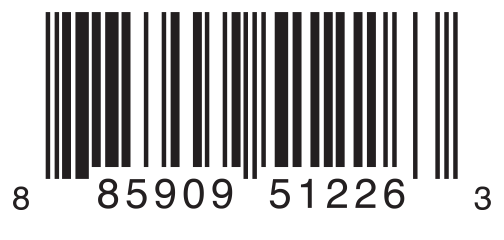

+++
title = "2.8 枚举"
date = 2026-09-11T20:00:03+08:00
weight = 8
type = "docs"
description = ""
isCJKLanguage = true
draft = false
+++


> 原文链接: [https://docs.swift.org/latest/documentation/the-swift-programming-language/enumerations/](https://docs.swift.org/latest/documentation/the-swift-programming-language/enumerations/)

# 2.8 枚举

为用户自定义类型建模，用它们定义一组可能的取值。

*枚举*为一组相关的值定义了一个公共类型，让你能在代码中以类型安全的方式使用这些值。

如果你熟悉 C，就会知道 C 的枚举把一组相关的名字赋予一组整数值。Swift 中的枚举灵活得多，而且不必为枚举的每个成员都提供一个值。如果为每个枚举成员提供了值（称为*原始*值），这个值可以是字符串、字符，或者任何整数或浮点类型的值。

另一种做法是让枚举成员指定*任何*类型的关联值，与每个不同的成员值一起存储，这有点像其他语言中的联合体（union）或变体（variant）。你可以在一个枚举中定义一组相关的公共成员，每个成员都关联一组类型合适、彼此不同的值。

Swift 中的枚举本身就是一等类型。它们采纳了许多原本只有类才支持的特性，例如用计算属性提供关于枚举当前值的附加信息，用实例方法提供与枚举所表示的值相关的功能。枚举还可以定义构造器来提供初始成员值，可以被扩展以在原始实现之外扩充功能，也可以遵循协议来提供标准功能。

关于这些能力的更多内容，参见[属性](../2.10-Properties/)、[方法](../2.11-Methods/)、[初始化](../2.14-Initialization/)、[扩展](../2.22-Extensions/)和[协议](../2.23-Protocols/)。

## 枚举语法 {#Enumeration-Syntax}

你用 `enum` 关键字引入枚举，并把它整个定义放在一对花括号里：

```swift
enum SomeEnumeration {
    // 枚举定义写在这里
}
```

下面是一个表示指南针四个主要方向的例子：

```swift
enum CompassPoint {
    case north
    case south
    case east
    case west
}
```

枚举中定义的值（例如 `north`、`south`、`east` 和 `west`）称为它的*枚举成员*。你用 `case` 关键字引入新的枚举成员。

> 注意：与 C、Objective-C 之类的语言不同，
> Swift 的枚举成员默认没有整数值。
> 在上面 `CompassPoint` 的例子里，
> `north`、`south`、`east` 和 `west`
> 并不隐式等于
> `0`、`1`、`2` 和 `3`。
> 相反，不同的枚举成员本身就是值，
> 类型明确地定义为 `CompassPoint`。

多个成员可以写在一行里，用逗号分隔：

```swift
enum Planet {
    case mercury, venus, earth, mars, jupiter, saturn, uranus, neptune
}
```

每个枚举定义都定义了一个新类型。和 Swift 中其他类型一样，它们的名字（例如 `CompassPoint` 和 `Planet`）以大写字母开头。枚举类型的名字应使用单数而不是复数，这样读起来更自然：

```swift
var directionToHead = CompassPoint.west
```

用 `CompassPoint` 的某个可能值初始化时，`directionToHead` 的类型就被推断出来了。`directionToHead` 一旦声明为 `CompassPoint`，你就可以用更简短的点语法把它设为另一个 `CompassPoint` 值：

```swift
directionToHead = .east
```

`directionToHead` 的类型已经确定，因此给它设值时可以省略类型。处理有明确类型的枚举值时，这让代码非常易读。

## 用 switch 语句匹配枚举值 {#Matching-Enumeration-Values-with-a-Switch-Statement}

你可以用 `switch` 语句匹配各个枚举值：

```swift
directionToHead = .south
switch directionToHead {
case .north:
    print("Lots of planets have a north")
case .south:
    print("Watch out for penguins")
case .east:
    print("Where the sun rises")
case .west:
    print("Where the skies are blue")
}
// 输出 "Watch out for penguins"。
```

这段代码可以读作：

"考察 `directionToHead` 的值。当它等于 `.north` 时，打印 `"Lots of planets have a north"`；当它等于 `.south` 时，打印 `"Watch out for penguins"`。"

……以此类推。

如[控制流](../2.5-ControlFlow/)所述，在考察枚举成员时，`switch` 语句必须是穷尽的。如果省略 `.west` 对应的 `case`，这段代码就无法编译，因为它没有考察 `CompassPoint` 成员的完整列表。要求穷尽可以确保枚举成员不会被漏掉。

当为每个枚举成员都提供 `case` 并不合适时，你可以提供一个 `default` case 来覆盖所有没有显式处理的成员：

```swift
let somePlanet = Planet.earth
switch somePlanet {
case .earth:
    print("Mostly harmless")
default:
    print("Not a safe place for humans")
}
// 输出 "Mostly harmless"。
```

## 遍历枚举成员 {#Iterating-over-Enumeration-Cases}

对于某些枚举来说，能够获得它所有成员的集合是很有用的。在枚举名后面写 `: CaseIterable` 即可启用这一能力。Swift 把全部成员组成的集合作为枚举类型的 `allCases` 属性公开出来。例如：

```swift
enum Beverage: CaseIterable {
    case coffee, tea, juice
}
let numberOfChoices = Beverage.allCases.count
print("\(numberOfChoices) beverages available")
// 输出 "3 beverages available"。
```

在上面的例子里，写 `Beverage.allCases` 可以访问一个包含 `Beverage` 枚举所有成员的集合。你可以像使用其他任何集合那样使用 `allCases`——该集合的元素是枚举类型的实例，在这里就是 `Beverage` 值。上面的例子统计了成员个数，下面的例子用 `for`-`in` 循环遍历所有成员。

```swift
for beverage in Beverage.allCases {
    print(beverage)
}
// coffee
// tea
// juice
```

上面的例子中使用的语法把该枚举标记为遵循 [`CaseIterable`](https://developer.apple.com/documentation/swift/caseiterable) 协议。关于协议的内容，参见[协议](../2.23-Protocols/)。

## 关联值 {#Associated-Values}

上一节中的例子展示了枚举成员本身如何就是有定义（且有类型）的值：你可以把常量或变量设为 `Planet.earth`，稍后再检查这个值。不过，有时在这些成员值之外还存放其他类型的值会很有用。这种附加信息称为*关联值*，每次在代码中把该成员当作值使用时，它都可以不同。

你可以定义 Swift 枚举来存放任何给定类型的关联值，而且根据需要，每个枚举成员的关联值类型可以各不相同。这类枚举在其他编程语言中称为*可辨识联合*、*标签联合*或*变体*。

举个例子，假设一个库存跟踪系统需要按两种不同的条码来跟踪产品。有些产品使用 UPC 格式的一维条码，只用数字 `0` 到 `9`：每个条码先是一位数字系统编号，接着是五位厂商代码和五位产品代码，最后是一位校验位，用来验证条码是否被正确扫描：



另一些产品使用 QR 码格式的二维条码，可以使用任何 ISO 8859-1 字符，最多可以编码长达 2,953 个字符的字符串：


对库存跟踪系统来说，把 UPC 条码存成四个整数的元组、把 QR 码条码存成任意长度的字符串都很方便。

在 Swift 中，用来定义这两种产品条码的枚举可能长这样：

```swift
enum Barcode {
    case upc(Int, Int, Int, Int)
    case qrCode(String)
}
```

这可以读作：

"定义一个名为 `Barcode` 的枚举类型，它要么取 `upc` 值并带有 (`Int`, `Int`, `Int`, `Int`) 类型的关联值，要么取 `qrCode` 值并带有 `String` 类型的关联值。"

这个定义并没有提供任何实际的 `Int` 或 `String` 值——它只是定义了 `Barcode` 常量或变量在等于 `Barcode.upc` 或 `Barcode.qrCode` 时能够存放的关联值的*类型*。

接着你就可以用两种类型之一创建新的条码：

```swift
var productBarcode = Barcode.upc(8, 85909, 51226, 3)
```

这个例子创建了一个名为 `productBarcode` 的新变量，并把它设为带有 `(8, 85909, 51226, 3)` 这个关联元组值的 `Barcode.upc`。

你也可以给同一个产品赋予另一种类型的条码：

```swift
productBarcode = .qrCode("ABCDEFGHIJKLMNOP")
```

此时，原来的 `Barcode.upc` 及其整数值被新的 `Barcode.qrCode` 及其字符串值替换掉了。`Barcode` 类型的常量或变量可以存放 `.upc` 或 `.qrCode`（连同它们的关联值），但在任一时刻只能存放其中之一。

你可以像[用 switch 语句匹配枚举值](./#Matching-Enumeration-Values-with-a-Switch-Statement)中的例子那样，用 switch 语句检查不同的条码类型。不过这一次，关联值会在 switch 语句中一并提取出来：你可以把每个关联值提取为常量（用 `let` 前缀）或变量（用 `var` 前缀），供 `switch` case 的语句体使用：

```swift
switch productBarcode {
case .upc(let numberSystem, let manufacturer, let product, let check):
    print("UPC: \(numberSystem), \(manufacturer), \(product), \(check).")
case .qrCode(let productCode):
    print("QR code: \(productCode).")
}
// 输出 "QR code: ABCDEFGHIJKLMNOP."。
```

如果某个枚举成员的所有关联值都提取为常量，或者都提取为变量，为了简洁，你可以在成员名之前统一写一个 `let` 或 `var` 标注：

```swift
switch productBarcode {
case let .upc(numberSystem, manufacturer, product, check):
    print("UPC : \(numberSystem), \(manufacturer), \(product), \(check).")
case let .qrCode(productCode):
    print("QR code: \(productCode).")
}
// 输出 "QR code: ABCDEFGHIJKLMNOP."。
```

当你只想匹配枚举的某一个成员——例如提取它的关联值——时，可以改用 `if`-`case` 语句，而不必写完整的 switch 语句。写法如下：

```swift
if case .qrCode(let productCode) = productBarcode {
    print("QR code: \(productCode).")
}
```

和前面 switch 语句中一样，这里把变量 `productBarcode` 与模式 `.qrCode(let productCode)` 匹配；也和 switch 的 case 中一样，写 `let` 会把关联值提取为常量。关于 `if`-`case` 语句的更多内容，参见[模式](../2.5-ControlFlow/#Patterns)。

## 原始值 {#Raw-Values}

[关联值](./#Associated-Values)中的条码示例展示了枚举成员如何声明自己存放不同类型的关联值。除了关联值，枚举成员还可以预先填充默认值（称为*原始值*），这些原始值的类型都相同。

下面是一个把原始 ASCII 值与具名枚举成员对应存放的例子：

```swift
enum ASCIIControlCharacter: Character {
    case tab = "\t"
    case lineFeed = "\n"
    case carriageReturn = "\r"
}
```

这里，名为 `ASCIIControlCharacter` 的枚举的原始值被定义为 `Character` 类型，并设为一些较常见的 ASCII 控制字符。`Character` 值在[字符串与字符](../2.3-StringsAndCharacters/)中介绍。

原始值可以是字符串、字符，或者任何整数或浮点数类型。每个原始值在它所属的枚举声明中必须唯一。

虽然原始值和关联值都可以为枚举附加一个值，但弄清两者的区别很重要：原始值是在代码中定义该枚举成员时就选定的，比如上面三个 ASCII 码，某个枚举成员的原始值始终相同；相比之下，关联值是在你用枚举的某个成员创建新的常量或变量时选定的，每次都可以选择不同的值。

### 隐式分配的原始值 {#Implicitly-Assigned-Raw-Values}

处理存放整数或字符串原始值的枚举时，你不必为每个成员显式指定原始值。不指定时，Swift 会自动为你赋值。

例如，用整数作原始值时，每个成员的隐式值比前一个成员大 1；如果第一个成员没有设定值，它的值就是 `0`。

下面的枚举是前面 `Planet` 枚举的改进版，用整数原始值表示每颗行星距太阳的次序：

```swift
enum Planet: Int {
    case mercury = 1, venus, earth, mars, jupiter, saturn, uranus, neptune
}
```

在上面的例子里，`Planet.mercury` 的显式原始值是 `1`，`Planet.venus` 的隐式原始值是 `2`，依此类推。

用字符串作原始值时，每个成员的隐式值就是该成员名的文本。

下面的枚举是前面 `CompassPoint` 枚举的改进版，用字符串原始值表示每个方向的名称：

```swift
enum CompassPoint: String {
    case north, south, east, west
}
```

在上面的例子里，`CompassPoint.south` 的隐式原始值是 `"south"`，依此类推。

用枚举成员的 `rawValue` 属性可以访问它的原始值：

```swift
let earthsOrder = Planet.earth.rawValue
// earthsOrder 是 3

let sunsetDirection = CompassPoint.west.rawValue
// sunsetDirection 是 "west"
```

### 用原始值初始化 {#Initializing-from-a-Raw-Value}

如果你定义的枚举带有原始值类型，该枚举会自动获得一个构造器：它接受原始值类型的一个值（参数名为 `rawValue`），并返回一个枚举成员或 `nil`。你可以用这个构造器尝试创建该枚举的新实例。

下面这个例子通过原始值 `7` 找出天王星：

```swift
let possiblePlanet = Planet(rawValue: 7)
// possiblePlanet 的类型是 Planet?，等于 Planet.uranus
```

不过，并非所有可能的 `Int` 值都能找到对应的行星，因此原始值构造器总是返回*可选*的枚举成员。在上面的例子里，`possiblePlanet` 的类型是 `Planet?`，也就是"可选 `Planet`"。

> 注意：原始值构造器是一个可失败构造器，
> 因为并非每个原始值都能返回一个枚举成员。
> 更多内容参见[可失败构造器](../../languagereference/3.6-Declarations/#Failable-Initializers)。

如果你试图找出位置为 `11` 的行星，原始值构造器返回的可选 `Planet` 值就是 `nil`：

```swift
let positionToFind = 11
if let somePlanet = Planet(rawValue: positionToFind) {
    switch somePlanet {
    case .earth:
        print("Mostly harmless")
    default:
        print("Not a safe place for humans")
    }
} else {
    print("There isn't a planet at position \(positionToFind)")
}
// 输出 "There isn't a planet at position 11"。
```

这个例子用可选绑定尝试取出原始值为 `11` 的行星。语句 `if let somePlanet = Planet(rawValue: 11)` 创建一个可选 `Planet`，如果能取到值，就把 `somePlanet` 设为那个可选 `Planet` 的值。在这个例子里，无法取到位置为 `11` 的行星，因此转而执行 `else` 分支。

## 递归枚举 {#Recursive-Enumerations}

*递归枚举*是指以一个或多个枚举成员把该枚举的另一个实例作为关联值的枚举。在成员前写 `indirect` 就表示该成员是递归的，它告诉编译器插入必要的一层间接引用。

例如，下面是一个存放简单算术表达式的枚举：

```swift
enum ArithmeticExpression {
    case number(Int)
    indirect case addition(ArithmeticExpression, ArithmeticExpression)
    indirect case multiplication(ArithmeticExpression, ArithmeticExpression)
}
```

你也可以把 `indirect` 写在枚举的开头，为所有带关联值的枚举成员启用间接引用：

```swift
indirect enum ArithmeticExpression {
    case number(Int)
    case addition(ArithmeticExpression, ArithmeticExpression)
    case multiplication(ArithmeticExpression, ArithmeticExpression)
}
```

这个枚举可以存放三种算术表达式：一个普通的数、两个表达式相加、两个表达式相乘。`addition` 和 `multiplication` 成员的关联值本身也是算术表达式——这些关联值让表达式可以嵌套。例如，表达式 `(5 + 4) * 2` 在乘法右侧是一个数，在乘法左侧是另一个表达式。由于数据是嵌套的，用来存放这些数据的枚举也需要支持嵌套——也就是说，这个枚举需要是递归的。下面的代码为 `(5 + 4) * 2` 创建了 `ArithmeticExpression` 递归枚举：

```swift
let five = ArithmeticExpression.number(5)
let four = ArithmeticExpression.number(4)
let sum = ArithmeticExpression.addition(five, four)
let product = ArithmeticExpression.multiplication(sum, ArithmeticExpression.number(2))
```

递归函数是处理递归结构数据的直观方式。例如，下面这个函数对一个算术表达式求值：

```swift
func evaluate(_ expression: ArithmeticExpression) -> Int {
    switch expression {
    case let .number(value):
        return value
    case let .addition(left, right):
        return evaluate(left) + evaluate(right)
    case let .multiplication(left, right):
        return evaluate(left) * evaluate(right)
    }
}

print(evaluate(product))
// 输出 "18"。
```

这个函数对普通数字的求值就是直接返回其关联值；对加法或乘法的求值则是先对左侧表达式求值、对右侧表达式求值，然后把它们相加或相乘。
