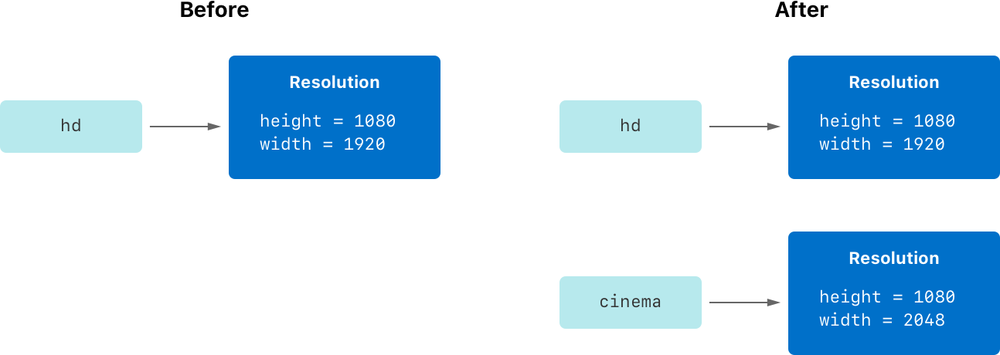
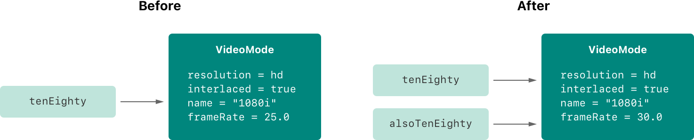

+++
title = "2.9 结构体与类"
date = 2026-09-11T20:00:03+08:00
weight = 9
type = "docs"
description = ""
isCJKLanguage = true
draft = false
+++


> 原文链接: [https://docs.swift.org/latest/documentation/the-swift-programming-language/classesandstructures/](https://docs.swift.org/latest/documentation/the-swift-programming-language/classesandstructures/)

# 2.9 结构体与类

为用户自定义类型建模，用它们封装数据。

*结构体*和*类*是通用而灵活的构造，是程序代码的组成部分。你可以用定义常量、变量和函数时相同的语法，为结构体和类定义属性和方法，从而赋予它们功能。

与其他编程语言不同，Swift 不要求你为自定义结构体和类分别创建接口文件和实现文件。在 Swift 中，你在单个文件里定义结构体或类，该类或结构体对外的接口会自动提供给其他代码使用。

> 注意：类的实例传统上称为*对象*。
> 不过，Swift 的结构体与类在功能上比其他语言中的两者接近得多，
> 本章所描述的许多功能对*结构体或类*的实例都适用。
> 因此这里使用更通用的说法*实例*。

## 比较结构体与类 {#Comparing-Structures-and-Classes}

Swift 中的结构体和类有许多共同点，两者都可以：

- 定义属性来存储值
- 定义方法来提供功能
- 定义下标来用下标语法访问其值
- 定义构造器来设置初始状态
- 被扩展以在默认实现之外扩充功能
- 遵循协议来提供某种标准功能

更多内容参见[属性](../2.10-Properties/)、[方法](../2.11-Methods/)、[下标](../2.12-Subscripts/)、[初始化](../2.14-Initialization/)、[扩展](../2.22-Extensions/)和[协议](../2.23-Protocols/)。

类还有一些结构体不具备的能力：

- 继承让一个类可以继承另一个类的特性。
- 类型转换让你能在运行时检查和解释类实例的类型。
- 反初始化器让类的实例可以释放自己已分配的资源。
- 引用计数允许对同一个类实例存在多个引用。

更多内容参见[继承](../2.13-Inheritance/)、[类型转换](../2.20-TypeCasting/)、[反初始化](../2.15-Deinitialization/)和[自动引用计数](../2.26-AutomaticReferenceCounting/)。

类所支持的这些额外能力，代价是复杂性增加。作为一般准则，优先使用结构体，因为它们更容易推理；在合适或必要时才使用类。实践中这意味着你定义的自定义类型大多是结构体和枚举。更详细的比较参见 [Choosing Between Structures and Classes](https://developer.apple.com/documentation/swift/choosing_between_structures_and_classes)。

> 注意：类与 actor 具有许多相同的特征和行为。
> 关于 actor 的内容，参见[并发](../2.18-Concurrency/)。

### 定义语法 {#Definition-Syntax}

结构体与类的定义语法相似。你用 `struct` 关键字引入结构体，用 `class` 关键字引入类，两者的整个定义都放在一对花括号里：

```swift
struct SomeStructure {
    // 结构体定义写在这里
}
class SomeClass {
    // 类定义写在这里
}
```

> 注意：每当你定义一个新的结构体或类，
> 就定义了一个新的 Swift 类型。
> 类型名请使用 `UpperCamelCase` 风格
> （例如这里的 `SomeStructure` 和 `SomeClass`），
> 与 Swift 标准类型
> （例如 `String`、`Int` 和 `Bool`）的大小写风格保持一致。
> 属性和方法名请使用 `lowerCamelCase` 风格
> （例如 `frameRate` 和 `incrementCount`），
> 以区别于类型名。

下面是一个结构体定义和一个类定义的例子：

```swift
struct Resolution {
    var width = 0
    var height = 0
}
class VideoMode {
    var resolution = Resolution()
    var interlaced = false
    var frameRate = 0.0
    var name: String?
}
```

上面的例子定义了一个名为 `Resolution` 的新结构体，用来描述基于像素的显示分辨率。这个结构体有两个存储属性 `width` 和 `height`。存储属性是作为结构体或类的一部分打包存储的常量或变量。由于把它们设为初始整数值 `0`，这两个属性被推断为 `Int` 类型。

上面的例子还定义了一个名为 `VideoMode` 的新类，用来描述视频显示所用的某种视频模式。这个类有四个变量存储属性：第一个 `resolution` 用一个新建的 `Resolution` 结构体实例初始化，因此推断出属性类型为 `Resolution`；其余三个属性在新的 `VideoMode` 实例中会被初始化为 `interlaced` 为 `false`（表示"非隔行扫描视频"）、播放帧率为 `0.0`，以及一个可选的 `String` 值 `name`。由于 `name` 是可选类型，它被自动赋予默认值 `nil`，也就是"没有 `name` 值"。

### 结构体与类的实例 {#Structure-and-Class-Instances}

`Resolution` 结构体定义和 `VideoMode` 类定义只描述了 `Resolution` 或 `VideoMode` 长什么样，它们本身并不描述某个具体的分辨率或视频模式。要做到这一点，你需要创建该结构体或类的实例。

结构体和类创建实例的语法非常相似：

```swift
let someResolution = Resolution()
let someVideoMode = VideoMode()
```

结构体和类都用构造器语法创建新实例。最简单的构造器语法是类或结构体的类型名后跟一对空圆括号，例如 `Resolution()` 或 `VideoMode()`。这会创建一个新的类或结构体实例，所有属性都初始化为默认值。类和结构体的初始化在[初始化](../2.14-Initialization/)中有更详细的介绍。

### 访问属性 {#Accessing-Properties}

你可以用*点语法*访问实例的属性。在点语法中，属性名紧跟在实例名之后，用句点（`.`）分隔，中间没有空格：

```swift
print("The width of someResolution is \(someResolution.width)")
// 输出 "The width of someResolution is 0"。
```

在这个例子里，`someResolution.width` 指 `someResolution` 的 `width` 属性，返回它的默认初始值 `0`。

你还可以深入访问子属性，比如 `VideoMode` 的 `resolution` 属性中的 `width` 属性：

```swift
print("The width of someVideoMode is \(someVideoMode.resolution.width)")
// 输出 "The width of someVideoMode is 0"。
```

也可以用点语法给变量属性赋新值：

```swift
someVideoMode.resolution.width = 1280
print("The width of someVideoMode is now \(someVideoMode.resolution.width)")
// 输出 "The width of someVideoMode is now 1280"。
```

### 结构体类型的逐成员构造器 {#Memberwise-Initializers-for-Structure-Types}

所有结构体都有一个自动生成的*逐成员构造器*，你可以用它来初始化新结构体实例的各个成员属性。新实例各属性的初始值可以按名字传给逐成员构造器：

```swift
let vga = Resolution(width: 640, height: 480)
```

与结构体不同，类的实例不会自动获得默认的逐成员构造器。构造器在[初始化](../2.14-Initialization/)中有更详细的介绍。

## 结构体与枚举是值类型 {#Structures-and-Enumerations-Are-Value-Types}

*值类型*是这样一种类型：当它被赋给变量或常量，或者被传给函数时，它的值会被*复制*。

在前面的章节中，你其实已经大量使用了值类型。事实上，Swift 中所有基本类型——整数、浮点数、布尔值、字符串、数组和字典——都是值类型，而且在背后都是用结构体实现的。

在 Swift 中，所有结构体和枚举都是值类型。这意味着你创建的任何结构体与枚举实例——以及它们作为属性的任何值类型——在代码中传递时都会被复制。

> 注意：Swift 标准库定义的集合类型
> （如数组、字典和字符串）
> 使用了某种优化来降低复制的性能开销：
> 它们不会立即复制，
> 而是在原实例与副本之间共享存放元素的内存。
> 如果集合的某一份副本被修改，
> 元素会在修改之前才被复制。
> 你在代码中看到的行为，
> 始终就像是立刻发生了复制一样。

看下面这个例子，它使用了前面例子中的 `Resolution` 结构体：

```swift
let hd = Resolution(width: 1920, height: 1080)
var cinema = hd
```

这个例子声明了一个名为 `hd` 的常量，并把它设为一个用全高清视频的宽和高（宽 1920 像素、高 1080 像素）初始化的 `Resolution` 实例。

接着它声明了一个名为 `cinema` 的变量，并把它设为 `hd` 的当前值。由于 `Resolution` 是结构体，已有的实例会被*复制*一份，这个新副本被赋给 `cinema`。尽管 `hd` 和 `cinema` 现在的宽和高相同，但它们在背后是两个完全不同的实例。

接下来把 `cinema` 的 `width` 属性改为数字电影放映所用的、稍宽一些的 2K 标准的宽度（宽 2048 像素、高 1080 像素）：

```swift
cinema.width = 2048
```

检查 `cinema` 的 `width` 属性可以看到它确实变成了 `2048`：

```swift
print("cinema is now \(cinema.width) pixels wide")
// 输出 "cinema is now 2048 pixels wide"。
```

不过，原来的 `hd` 实例的 `width` 属性仍然是旧值 `1920`：

```swift
print("hd is still \(hd.width) pixels wide")
// 输出 "hd is still 1920 pixels wide"。
```

把 `hd` 的当前值赋给 `cinema` 时，`hd` 中存放的*值*被复制到了新的 `cinema` 实例中，最终得到两个包含相同数值但完全独立的实例。由于它们是各自独立的实例，把 `cinema` 的宽度设为 `2048` 并不会影响 `hd` 中存放的宽度，如下图所示：



枚举也有相同的行为：

```swift
enum CompassPoint {
    case north, south, east, west
    mutating func turnNorth() {
        self = .north
    }
}
var currentDirection = CompassPoint.west
let rememberedDirection = currentDirection
currentDirection.turnNorth()

print("The current direction is \(currentDirection)")
print("The remembered direction is \(rememberedDirection)")
// 输出 "The current direction is north"。
// 输出 "The remembered direction is west"。
```

把 `currentDirection` 的值赋给 `rememberedDirection` 时，实际赋的是该值的一份副本。此后修改 `currentDirection` 的值，不会影响存放在 `rememberedDirection` 中的那份原始值副本。

## 类是引用类型 {#Classes-Are-Reference-Types}

与值类型不同，*引用类型*在赋给变量或常量、或者传给函数时*不会*被复制，而是使用对同一个已有实例的引用。

下面是使用上面定义的 `VideoMode` 类的例子：

```swift
let tenEighty = VideoMode()
tenEighty.resolution = hd
tenEighty.interlaced = true
tenEighty.name = "1080i"
tenEighty.frameRate = 25.0
```

这个例子声明了一个名为 `tenEighty` 的新常量，并把它设为指向 `VideoMode` 类的一个新实例。这个视频模式被赋值了前面那个 1920×1080 的高清分辨率的一份副本；它被设为隔行扫描，名称为 `"1080i"`，帧率为每秒 `25.0` 帧。

接着把 `tenEighty` 赋给一个新的常量 `alsoTenEighty`，并修改 `alsoTenEighty` 的帧率：

```swift
let alsoTenEighty = tenEighty
alsoTenEighty.frameRate = 30.0
```

由于类是引用类型，`tenEighty` 和 `alsoTenEighty` 实际上都指向*同一个* `VideoMode` 实例。可以说，它们只是同一个实例的两个不同名字，如下图所示：



检查 `tenEighty` 的 `frameRate` 属性，会看到它正确地报告了底层 `VideoMode` 实例的新帧率 `30.0`：

```swift
print("The frameRate property of tenEighty is now \(tenEighty.frameRate)")
// 输出 "The frameRate property of tenEighty is now 30.0"。
```

这个例子也说明了引用类型为什么更难推理。如果 `tenEighty` 和 `alsoTenEighty` 在你的程序代码中相隔很远，就很难找全这个视频模式被修改的所有途径。凡是用到 `tenEighty` 的地方，你都得同时考虑用到 `alsoTenEighty` 的代码，反之亦然。相比之下，值类型更容易推理，因为与同一个值交互的所有代码在源文件中都挨在一起。

注意 `tenEighty` 和 `alsoTenEighty` 声明为*常量*而不是变量。不过你仍然可以修改 `tenEighty.frameRate` 和 `alsoTenEighty.frameRate`，因为 `tenEighty` 和 `alsoTenEighty` 这两个常量本身的值并没有改变。它们本身并不"存放" `VideoMode` 实例——它们都在背后*指向*同一个 `VideoMode` 实例。改变的是底层 `VideoMode` 的 `frameRate` 属性，而不是指向该 `VideoMode` 的常量引用本身的值。

### 恒等运算符 {#Identity-Operators}

由于类是引用类型，多个常量和变量有可能在背后指向同一个类实例。（结构体和枚举不是这样，因为它们赋给常量或变量、或者传给函数时总会被复制。）

有时候，弄清两个常量或变量是否指向完全相同的类实例会很有用。为此，Swift 提供了两个恒等运算符：

- 恒等于（`===`）
- 不恒等于（`!==`）

用这两个运算符检查两个常量或变量是否指向同一个实例：

```swift
if tenEighty === alsoTenEighty {
    print("tenEighty and alsoTenEighty refer to the same VideoMode instance.")
}
// 输出 "tenEighty and alsoTenEighty refer to the same VideoMode instance."。
```

注意*恒等于*（用三个等号表示，即 `===`）与*等于*（用两个等号表示，即 `==`）的含义并不相同。*恒等于*表示两个类类型的常量或变量指向完全相同的类实例；*等于*则表示在类型设计者所定义的某种恰当的"相等"含义下，两个实例被认为相等或等价。

在定义自己的结构体和类时，判断什么情况算两个实例相等，由你负责决定。自己实现 `==` 和 `!=` 运算符的过程在[等价运算符](../2.29-AdvancedOperators/#Equivalence-Operators)中介绍。

### 指针 {#Pointers}

如果你有 C、C++ 或 Objective-C 的经验，可能知道这些语言使用*指针*来引用内存地址。指向某种引用类型实例的 Swift 常量或变量类似 C 中的指针，但它并不是指向内存地址的直接指针，也不需要你写星号（`*`）来表示正在创建引用。这些引用就像 Swift 中其他常量或变量一样定义。如果你需要直接与指针打交道，Swift 标准库提供了可以使用的指针和缓冲区类型——参见 [Manual Memory Management](https://developer.apple.com/documentation/swift/swift_standard_library/manual_memory_management)。
