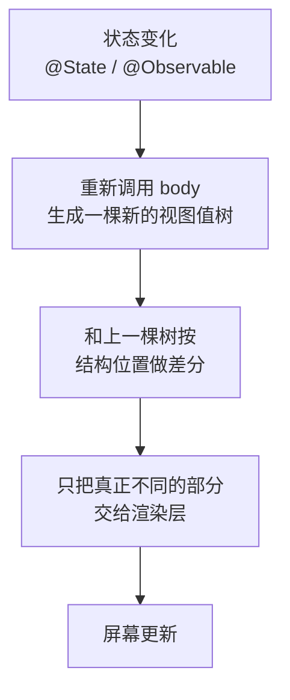

+++
title = "第 1 章 视图是值，不是控件"
weight = 10
date = "2026-09-20T11:40:00+08:00"
type = "docs"
description = "body 为什么会被反复调用、some View 到底藏了什么、视图树怎么被差分——以及为什么 body 里不能有副作用"
isCJKLanguage = true
draft = false
+++

# 第 1 章：视图是值，不是控件

> 这一章建立两个模型，后面五章都建在它上面：**视图是一份描述，不是屏幕上的东西；能变的只有状态。**

## 1.1 先看一个让人不安的事实

下面这个视图看着很普通——一个标题加一个星标：

```swift
import SwiftUI

struct Card: View {
    var title: String
    var highlighted: Bool

    var body: some View {
        VStack {
            Text(title).font(.title)
            if highlighted { Text("★") }
        }
        .padding()
        .background(Color.yellow)
    }
}
```

现在把 `body` 的真实类型打印出来：

🔬 这段可以真跑。完整文件如下（存成 `t.swift`，用 `swiftc -parse-as-library t.swift -o t && ./t` 执行）：

```swift
import SwiftUI

struct Card: View {
    var title: String
    var highlighted: Bool
    var body: some View {
        VStack {
            Text(title).font(.title)
            if highlighted { Text("★") }
        }
        .padding()
        .background(Color.yellow)
    }
}

@main
struct PrintType {
    @MainActor static func main() {
        let t = String(describing: type(of: Card(title: "hi", highlighted: true).body))
        print(t)
        print("长度：\(t.count) 字符")
    }
}
```

```
ModifiedContent<ModifiedContent<VStack<TupleView<(Text, Optional<Text>)>>, _PaddingLayout>, _BackgroundStyleModifier<Color>>
```

**124 个字符，四层泛型嵌套。** 你写的四行声明式代码，编译器把它拼成了这样一个类型。

⚠️ 这不是编译器抽风，这就是 SwiftUI 的工作原理。看懂这个类型，你就懂了 SwiftUI 一半：

| 你写的 | 变成了 |
| --- | --- |
| `VStack { ... }` | `VStack<内容类型>` |
| `Text(title)` + `if highlighted { Text("★") }` | `TupleView<(Text, Optional<Text>)>` —— 两行的**元组**，`if` 让第二项变成 `Optional` |
| `.padding()` | `ModifiedContent<内层, _PaddingLayout>` —— **包了一层壳** |
| `.background(...)` | 又包一层：`ModifiedContent<上面那层, _BackgroundStyleModifier<Color>>` |

💭 记住"修饰符 = 包一层壳"这件事，第 3 章讲布局顺序、第 4 章讲尺寸传递时都要用它。`.padding().background()` 和 `.background().padding()` 的差别，根源就在这里。

## 1.2 视图是结构体，所以"创建视图"什么也没发生

这是全章最重要的一句话，值得用实验砸实：

```swift
import SwiftUI

struct Greeting: View {
    var name: String
    var body: some View {
        Text("你好，\(name)")
    }
}

let g = Greeting(name: "Mia")     // 只是创建了一个结构体值
print(type(of: g))
// prints: Greeting
```

`Greeting(name: "Mia")` 执行完之后，**屏幕上什么都没有发生**。没有分配控件，没有注册监听，没有发起绘制。内存里只是多了一个装着字符串 `"Mia"` 的结构体。

要在命令行里自己验证这一点，可以把上面这段存成 `t.swift`，然后：

```console
$ swiftc -parse-as-library t.swift -o t && ./t
Greeting
```

🔬 这段是本教程里少数**不需要 Xcode、不需要窗口**就能验证的代码之一——因为它压根不涉及渲染，只涉及类型。后面凡是标了 🔬 的实验，都可以这样在命令行跑。

那界面什么时候才出现？当 SwiftUI **调用 `body`** 并拿到这份描述之后。也就是说：

| 你的动作 | SwiftUI 的动作 |
| --- | --- |
| `Greeting(name: "Mia")` | 什么都没做 |
| （框架决定要显示这个视图） | 调用 `body` → 得到 `Text` 值 |
| | 把 `Text` 值渲染到屏幕 |

所以视图值的生命周期和"屏幕上的东西"是**完全两回事**。这带来三个直接结论：

### 结论一：视图可以被随便创建、复制、丢弃

```swift
let a = Greeting(name: "A")
let b = a                    // 复制一份，两个独立的值
let c = Greeting(name: "C")
_ = (a, b, c)                // 三个值，屏幕上依然什么都没有
```

结构体赋值就是复制，`Greeting` 也不例外。在 `body` 里写三行 `Text`，不会创建三个"文本框对象"，只是描述里多了三条条目。

### 结论二：改视图的值，不会改屏幕

上面那个 `Greeting` 的 `name` 是 `var`，所以你可以改它——但改了也白改：

```swift
var g = Greeting(name: "Mia")   // 此刻屏幕上可能正显示"你好，Mia"
g.name = "Bob"                  // 改的只是这个结构体值
print(g.name)
// prints: Bob
```

屏幕上的"你好，Mia"**一个字都不会变**。因为你改的是一份描述，而屏幕上那份是 SwiftUI 早先根据旧描述画出来的。**描述和屏幕之间没有任何自动同步。**

🔥 **这是新手第一个大坑**：想"改界面"而去改视图的属性。SwiftUI 里没有"改界面"这个操作——你只能改**状态**，然后让框架拿着新状态重新调用 `body`（第 2 章的主题）。

### 结论三：`body` 里不能有"自我修改"

`body` 是一个**计算属性**（没有 `{ get set }` 里的 `set`），它连 `self` 都改不了。想改 `body` 里的某个值，只能把它声明成 `@State`——而这恰恰就是下一章的全部内容。

## 1.3 `body` 会被反复调用，这不是性能问题

每次状态变化，SwiftUI 都会**重新调用 `body`**。听起来像"整个界面重建"，其实不是。真实过程分三步：



关键在于**第二步**：SwiftUI 不是"扔掉旧的、建个新的"，而是把新旧两棵值树按**结构位置**比较：

- 同一个位置、同一种视图 → 认为是"同一个视图"，只更新它变化的属性；
- 位置变了、或者 `id` 变了 → 认为是"旧的走了、新的来了"，会**重建它的状态**。

这就是后面反复出现的两个字：**身份（identity）**。第 6 章会专门收拾它，现在只要记住它的存在。

⚠️ 所以"`body` 被调用了几次"是个误导性的指标。真正的问题不是调用次数，而是**调用时做了什么**：

| 放在 `body` 里 | 后果 |
| --- | --- |
| 摆布局、读状态 | ✅ 正确，这就是 `body` 的职责 |
| `print("body 跑了")` | 🚧 调试可以，但它会告诉你一个**没意义**的数字 |
| 发网络请求 | 🛑 每次重绘都可能重发，用 `.task`（第 46 章主题） |
| 排序一个一万条的数组 | 🛑 `body` 每跑一次就排一次；放进模型类型或缓存起来 |
| 修改外部变量、写文件 | 🛑 纯函数副作用，是所有诡异 bug 的来源 |

💭 一句话：**`body` 应该是一个纯函数**——给定相同的状态，永远输出相同的描述，不碰外界。

## 1.4 `some View`：一个"我不想说名字"的类型

回到开头那个 124 字符的类型。你显然不想手写它，于是有了 `some View`：

```text
var body: some View { ... }     // 声明长这样，类型由编译器推导
```

`some View` 是**不透明返回类型**（opaque return type），意思是"我返回某个确定的、唯一的类型，但我不告诉你它是谁"。它有三条必须知道的规则：

### 规则一：真实类型由编译器推导

写 `VStack { ... }` 就是那个具体的 `VStack<TupleView<...>>`。调用方只能当它是 `View` 用，看不到里面的结构。

### 规则二：同一个函数只能返回唯一一种类型

这是 `@ViewBuilder` 存在的理由。看这段：

```swift
@ViewBuilder
func status(_ on: Bool) -> some View {
    if on { Text("开") } else { Image(systemName: "xmark") }
}
```

`Text` 和 `Image` 是两个完全不同的类型，`some View` 不允许一函数两种类型。于是 `@ViewBuilder` 把它们**打包**成第三种类型：

🔬

```swift
@ViewBuilder
func status(_ on: Bool) -> some View {
    if on { Text("开") } else { Image(systemName: "xmark") }
}
print(type(of: status(true)))
// prints: _ConditionalContent<Text, Image>
```

`_ConditionalContent` 这个名字直译过来就是"有条件的内容"——它专门用来装"二选一"。看到这个类型名，你就知道某处有个 `if/else`。

同理，连写三行会被打包成元组：

🔬

```swift
@ViewBuilder
func triple() -> some View {
    Text("a"); Text("b"); Text("c")
}
print(type(of: triple()))
// prints: TupleView<(Text, Text, Text)>
```

### 规则三：`ViewBuilder` 支持哪些写法

| 你写的 | 打包成 |
| --- | --- |
| 连写多行 | `TupleView<(...)>` |
| `if` / `else` | `_ConditionalContent<A, B>` |
| `if`（没有 else） | `Optional<A>`（所以上面出现了 `Optional<Text>`） |
| `switch` | 嵌套的 `_ConditionalContent` |
| `ForEach` | `ForEach<...>` |

💭 日常你不需要记这些名字，但**看到它们时要知道从哪来**。报错信息里出现 `_ConditionalContent<Text, Image>` 时，你就知道编译器在抱怨"你这两个分支类型不一致"。

## 1.5 修饰符为什么是"包壳"

再看一眼这个类型，这次只看修饰符部分：

```swift
Text("x").padding()
// 类型: ModifiedContent<Text, _PaddingLayout>

Text("x").font(.title)
// 类型: Text        ← 注意！这个不是包壳
```

⚠️ 这里有个容易混的细节：**并不是所有链式调用都包壳**。下面这张表左边和右边的类型都是实跑打印出来的：

| 方法 | 性质 | 类型变化（实测） |
| --- | --- | --- |
| `.font(.title)` | `Text` 自己的方法 | `Text` → `Text` |
| `.bold()` | `Text` 自己的方法 | `Text` → `Text` |
| `.foregroundStyle(.red)` | `Text` 自己的方法 | `Text` → `Text` |
| `.padding()` | `View` 协议的通用修饰符 | `Text` → `ModifiedContent<Text, _PaddingLayout>` |
| `.background(...)` | 通用修饰符 | `Text` → `ModifiedContent<Text, _BackgroundStyleModifier<Color>>` |
| `.frame(width:)` | 通用修饰符 | `Text` → `ModifiedContent<Text, _FrameLayout>` |
| `.opacity(0.5)` | 通用修饰符 | `Text` → `ModifiedContent<Text, _OpacityEffect>` |

这个区别为什么重要？因为**通用修饰符的顺序会改变结果，而 `Text` 自身方法的顺序不会**：

🔬

```swift
let x = Text("x").bold().foregroundStyle(.red)
let y = Text("x").foregroundStyle(.red).bold()
print(type(of: x) == type(of: y), type(of: x))
// prints: true Text
```

两者类型完全相同，渲染结果也相同。但下面这两个**不等价**：

```swift
Text("x").padding().background(Color.yellow)   // 黄底包含 padding 区域
Text("x").background(Color.yellow).padding()   // 黄底只有文字那么大，padding 在外面透明
```

🔥 记忆法：**通用修饰符是从下往上"包"的**。`.padding().background()` 读作"先给文字加内边距，再给这个带内边距的整体加背景"。第 3 章会把这条规则和实测尺寸对上。

## 1.6 完整可运行文件

把这一章的东西拼成一个能跑的 App（存成 `Chapter01.swift`，Xcode 里新建 App 项目后替换 `ContentView.swift` 也行）：

```swift
import SwiftUI

// 一个纯展示视图：它自己不含任何可变状态
struct Card: View {
    var title: String
    var highlighted: Bool

    var body: some View {
        VStack(alignment: .leading, spacing: 6) {
            Text(title).font(.title)
            if highlighted {
                Text("★ 精选").foregroundStyle(.orange)
            }
        }
        .padding()
        .frame(maxWidth: .infinity, alignment: .leading)
        .background(Color.yellow.opacity(0.25))
        .clipShape(RoundedRectangle(cornerRadius: 12))
    }
}

struct Chapter01Demo: View {
    var body: some View {
        VStack(spacing: 16) {
            Card(title: "视图是值", highlighted: true)
            Card(title: "状态是源头", highlighted: false)
        }
        .padding()
    }
}

#Preview {
    Chapter01Demo()
}
```

⚠️ 注意 `Card` 里**没有一个 `var` 是可变的**（`title` 和 `highlighted` 都是 `let` 性质的存储属性），它却能显示两种不同内容——因为内容由**外面传进来的值**决定。这就是"视图是描述"的最直接体现。

## 1.7 本章易错点速查

| 你会怎么写 | 实际发生什么 | 正确做法 |
| --- | --- | --- |
| `g.name = "Bob"` 想改界面 | 屏幕纹丝不动 | 改**状态**（`@State`），让框架重调 `body` |
| 在 `body` 里 `count += 1` | `cannot assign to property: 'self' is immutable` | 用 `@State private var count = 0` |
| 在 `body` 里发网络请求 | 每次重绘都重发 | 用 `.task { }` |
| 在 `body` 里排序大数组 | 每次重绘都排一遍 | 放进模型类型，或用缓存属性 |
| `if` 两个分支返回不同视图类型 | 报 `_ConditionalContent` 相关错误 | 加 `@ViewBuilder`，或让两分支形状一致 |
| 以为 `Text("x").font(.title)` 也包了一层 | 它返回的还是 `Text` | 只有 `View` 扩展的通用修饰符才包 `ModifiedContent` |
| 以为视图是"屏幕上的控件的引用" | 无法比较、无法持有、`===` 不成立 | 视图是值；要持有状态用 `@State`，要持有对象用模型类型 |

## 1.8 下一章

现在你知道"视图是描述"，但还没解决最实际的问题：**描述要依据什么来生成？** 那个"依据"就是状态。

下一章解决三个问题：状态该放在谁身上、`@State` 和 `@Binding` 怎么分工、以及为什么改了数据界面却不刷新。
