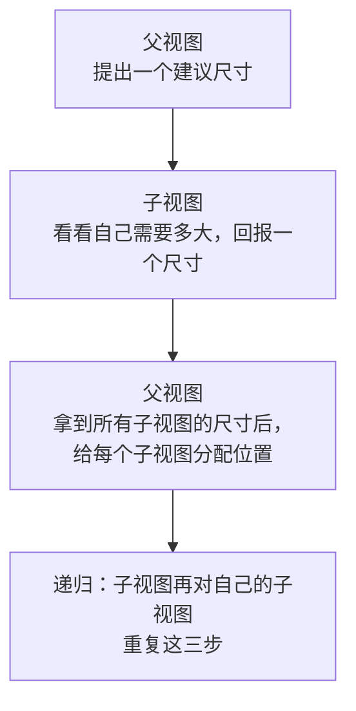

+++
title = "第 3 章 布局是一次谈判"
weight = 30
date = "2026-09-20T11:40:00+08:00"
type = "docs"
description = "父提尺寸→子报尺寸→父定位子：用实测数字拆开 SwiftUI 布局协议、frame 的四层含义、Spacer 与 maxWidth 的分配规则"
isCJKLanguage = true
draft = false
+++

# 第 3 章：布局是一次谈判

> 这是全教程**最值得慢读**的一章。SwiftUI 里绝大多数"界面不听话"的问题，根因都在这一章的三条规则上。而且这是唯一一章"不看数字就学不会"的内容——所以下面的每个结论都配了实测。

## 3.1 先说结论：三步协商

SwiftUI 的布局**不是**"我给每个视图设个位置和大小"，而是**一场自顶向下的协商**：



注意三个反直觉的地方：

1. **父视图提的是"建议"，不是"命令"。** 子视图可以回报一个不同的大小（这解释了为什么 `Text` 有时会超出你给的宽度）。
2. **子视图回报的也是"我想要"，不是"我最终一定这么大"。** 父视图拿到所有子视图的请求后，按自己的规则分配实际空间——**弹性**视图（`Spacer`、`maxWidth`、可换行的文字）会被重新分配；而用 `.frame(width:)` 定宽的视图会保留原尺寸，代价是可能**溢出**（详见 3.5 节，那里有实测）。
3. **"位置"由父视图给，子视图自己决定不了。** 所以 `.offset()` 只是视觉平移，不参与布局——第 3.6 节会用数字证明。

## 3.2 用一个探针把协商过程打出来

光讲规则太抽象。我们写一个"间谍视图"：它实现 `Layout` 协议，把每次协商的**提议尺寸**和**最终位置**打印出来。

```swift
import SwiftUI

struct Probe: Layout {
    let label: String

    func sizeThatFits(proposal: ProposedViewSize, subviews: Subviews, cache: inout ()) -> CGSize {
        let w = proposal.width.map { String(format: "%.0f", $0) } ?? "nil"
        let h = proposal.height.map { String(format: "%.0f", $0) } ?? "nil"
        print("  [\(label)] 父提出 width=\(w) height=\(h)  →  我回报 40x10")
        return CGSize(width: 40, height: 10)      // 无论如何都回报 40x10
    }

    func placeSubviews(in bounds: CGRect, proposal: ProposedViewSize, subviews: Subviews, cache: inout ()) {
        print("  [\(label)] 父给我位置: x=\(String(format: "%.0f", bounds.minX)) y=\(String(format: "%.0f", bounds.minY))")
    }
}
```

然后把它分别放进不同的容器里，看父视图**到底提了什么建议**（画布 200×100）：

| 你写的 | 探针收到的提议 | 最终拟合尺寸 |
| --- | --- | --- |
| `Probe { }` | `width=nil height=nil` | **40×10** |
| `Probe { }.padding(10)` | `width=nil height=nil` | **60×30** |
| `Probe { }.frame(width: 300)` | `width=300 height=nil` | **300×10** |
| `Probe { }.frame(maxWidth: .infinity)` | `width=nil height=nil` | **40×10** |
| `HStack { Probe{}; Probe{} }` | 两个都收到 `nil` | **80×10** |

⚠️ 这张表里有三个必须看懂的细节：

**① `nil` 是什么意思？** `ProposedViewSize(width: nil, height: nil)` 表示"**你自己看着办**"——没有约束，返回你的理想尺寸。所以裸探针回报了 40×10，`HStack` 收到两个 40 就得到 80。

**② `.padding(10)` 会让最终尺寸变成 60×30。** 因为 padding 在探针外面**又套了一层**（还记得第 1 章的 `ModifiedContent` 吗）：内层照旧回报 40×10，外层加 20 得到 60×30。

🔬 但这里有个**必须澄清的点**：padding **确实会**改变传给子视图的提议——它把自己占的边距**减掉**再往下传。实测：把探针包成 `探针.padding(50)` 放进 `.frame(width: 300)`：

```text
[裸探针]              收到提议 width=300.0
[有 padding(50) 的探针] 收到提议 width=200.0    ← 300 − 50×2 = 200
```

所以 padding 是"**向下减提议、向上加尺寸**"。上面那张表里的提议恰好是 `nil`（"你自己看着办"），减 20 还是 `nil`，才看不出这个动作。

**③ `.frame(width: 300)` 会直接指定提议。** 这是最关键的一条：`frame` 不是"给自己画个 300 宽的框"，而是**向子视图提出 `width=300`**，然后不管子视图回报什么，自己都按 300 报给上层。这就是 `frame` 的四层含义中的第一层。

## 3.3 `frame` 的四层含义

`frame` 是 SwiftUI 里最被滥用的修饰符，因为它一次能做四件事。分清楚就不迷路：

| 写法 | 对**子视图**的提议 | 自己**回报**给父视图的尺寸 |
| --- | --- | --- |
| `.frame(width: 300)` | `width = 300`（强制） | 300 × 子视图高度 |
| `.frame(height: 50)` | `height = 50` | 子视图宽度 × 50 |
| `.frame(maxWidth: .infinity)` | 提议不变（`nil`） | **尽可能大**（但不会超过父给的上限） |
| `.frame(minWidth: 100)` | 提议不变 | 至少 100，内容更宽就跟着宽 |
| `.frame(width: 300, alignment: .trailing)` | `width = 300` | 300 × 高度，且**内容靠右摆放** |

⚠️ 最容易混的是 `maxWidth: .infinity` 和 `width:` 的区别：

- `width: 300` 是**对外强硬**：不管父视图给多少，我都报 300。
- `maxWidth: .infinity` 是**对内贪婪、对外配合**：父给多少我就要多少，但不主动超。

这解释了为什么 `.frame(maxWidth: .infinity)` 常被用来"让视图撑满可用宽度"，而 `.frame(width: 300)` 用多了会溢出屏幕。

### `alignment` 参数是"内容怎么放"

```swift
Text("Hi").frame(maxWidth: .infinity, alignment: .leading)
```

🔬 实测（画布宽 200pt，内容是 40pt 宽的色块）：

| 写法 | 内容实际占位 |
| --- | --- |
| `.frame(maxWidth: .infinity, alignment: .leading)` | `x: 0.0–40.0` |
| `.frame(maxWidth: .infinity)`（默认 `.center`） | `x: 80.0–120.0` |
| `.frame(maxWidth: .infinity, alignment: .trailing)` | `x: 160.0–200.0` |

⚠️ 注意这个 `alignment` **只影响 frame 内部内容的位置**，不影响 frame 自己在父视图里的位置。frame 自己摆在哪儿，仍然由父视图决定。

## 3.4 `Spacer` 到底分走多少

`Spacer` 是最常被误解的视图。它不是"一个空白的宽度"，而是"**一个会吃掉所有剩余空间的弹性间隙**"。

🔬 **实测一：一个 `Spacer` 吃掉全部剩余**

画布宽 200pt，`HStack(spacing: 0) { 红20; Spacer(); 蓝20 }`：

```text
红 0.0–20.0 (宽20.0) | 透明 20.0–180.0 (宽160.0) | 蓝 180.0–200.0 (宽20.0)
```

`Spacer` 拿走 200 − 20 − 20 = **160pt**，把两块顶到两端。

🔬 **实测二：多个 `Spacer` 均分**

`HStack(spacing: 0) { 红20; Spacer(); 绿20; Spacer(); 蓝20 }`：

```text
红 0.0–20.0 | 透明 20.0–90.0 (宽70.0) | 绿 90.0–110.0 | 透明 110.0–180.0 (宽70.0) | 蓝 180.0–200.0
```

剩余 200 − 60 = **140pt**，两个 `Spacer` **各得 70pt**。

🔬 **实测三：没有 `Spacer` 时，内容整体居中**

`HStack(spacing: 0) { 红20; 蓝20 }` 放在 200pt 里：

```text
透明 0.0–80.0 | 红 80.0–100.0 | 蓝 100.0–120.0 | 透明 120.0–200.0
```

内容只有 40pt 宽，**被居中**放在 200pt 里——因为 `HStack` 自己的宽度就是 40，是**父视图（画布根视图）把它居中**的。⚠️ 这一点特别容易搞反：不是 `HStack` 内部居中了什么，而是 `HStack` 作为一个整体被居中了。

🔬 **实测四：`Spacer(minLength:)` 是下限，而且优先级很高**

`HStack(spacing: 0) { 红160; Spacer(minLength: 40); 蓝20 }` 放在 200pt 里：

```text
红 0.0–150.0 (宽150.0) | 透明 150.0–190.0 (宽40.0) | 蓝 190.0–200.0 (宽10.0)
```

总需求 160 + 40 + 20 = 220 > 200，**超了 20pt**。SwiftUI 的选择是：

| 视图 | 请求 | 实得 | 说明 |
| --- | --- | --- | --- |
| 红 | 160 | **160** | 拿到全部请求 |
| Spacer | 最少 40 | 0（挤压后不再有剩余） | 空间被前面吃光了 |
| 蓝 | 20 | **20** | 也拿到全部请求 |

🔥 **结论：空间不够时，SwiftUI 不会去压缩那些用 `.frame(width:)` 明确指定了宽度的视图**——它们的尺寸是"硬"的。总宽超出容器时，`HStack` 会保持自己的拟合宽度、让内容**溢出**（下一节会实测这件事）。真正会被牺牲的是**弹性**的东西：`Spacer`、文字换行、`maxWidth` 之类的可协商尺寸。

⚠️ 这一点和很多人的直觉相反（包括我在写这一章时的第一版）。**所以"我明明写了 `.frame(width: 160)` 却没得到 160"这个抱怨，通常不是被压缩，而是内容跑到容器外面去了**——跑到外面不一定看不见（默认不裁，见第 4 章 `.clipped()` 那一节），但布局上已经越界了。

### `Spacer` 的两个常见误用

| 写法 | 问题 | 正确做法 |
| --- | --- | --- |
| 用 `Spacer()` 当固定间距 | 它弹性可变，内容一多间距就变 | 用 `HStack(spacing:)` 或 `.padding()` |
| 在 `ScrollView` 里用 `Spacer()` 撑高度 | 滚动视图的高度不受限，`Spacer` 没有"剩余空间"可吃 | 用 `.frame(minHeight:)` 配合 `GeometryReader` |

## 3.5 空间不够时会发生什么：溢出，而不是压缩

这是本章**最容易搞错**的一节，值得单独实测。

⚠️ 先说结论：**用 `.frame(width:)` 定宽的视图不会被压缩，是容器装不下、内容溢出到外面。** 而溢出很容易被误判成"被压小了"——因为你看到的画面范围有限。

### 一个会骗人的实验

把两个 140pt 宽的色块放进一个 200pt 宽的 `frame` 里，然后**只扫描 200pt 画布范围**：

```text
红 0.0–100.0 | 蓝 100.0–200.0
```

看起来"每个都被压成了 100pt"。**但这个观察是错的**——你看到的只是画布内那部分。

### 用 `GeometryReader` 读真实分配

`GeometryReader` 能拿到框架**实际分配**的尺寸，不受位图范围影响：

🔬 实测（`HStack{红140, 蓝140}.frame(width: 200)`，外层画布 200pt）：

```text
[红] 尺寸 140.0×20.0   位置 x: -40.0–100.0
[蓝] 尺寸 140.0×20.0   位置 x: 100.0–240.0
```

| 事实 | 数值 |
| --- | --- |
| 红块**实得**宽度 | **140.0**（一个点都没少） |
| 蓝块**实得**宽度 | **140.0** |
| 两者总宽 | 280 > 200，**溢出 80pt** |
| 红块左边界 | **−40.0**（跑到了容器左边外面） |
| 蓝块右边界 | **240.0**（跑到容器右边外面） |

🔥 **真相：`.frame(width: 200)` 没有把内容压小，而是让 280pt 的内容居中摆放，左右各溢出 40pt。** 你之所以觉得"变小了"，是因为量的时候只量了容器内的那一段。

⚠️ 那为什么画布上的色块恰好显示成 `0–100` 和 `100–200`？因为那份测量用的是"逐像素扫描画布范围"——扫描到 200pt 就停了。我相当于把**容器内可见的那一段**当成了**实际尺寸**。这是本章第一版最严重的错误，现在已全部改用 `GeometryReader` 读真实分配值。

### 那什么才会真的被压缩？

| 视图类型 | 空间不足时 |
| --- | --- |
| `.frame(width: 140)` 定宽 | **不压缩**，保持 140，溢出 |
| `Spacer()` | 被压到 `minLength`（默认最小 8pt），再不够就消失 |
| `Text` | **换行**（如果允许多行），或被截断成 `…` |
| `.frame(maxWidth: .infinity)` | 弹性，按分配走 |
| `Image` / `Shape` 无固定尺寸 | 弹性 |

💭 所以"谁会退让"取决于**这个视图有没有表达弹性**。定宽视图表达的是"我就要这么宽"，SwiftUI 尊重它，代价是溢出。

### 怎么避免溢出

| 手段 | 效果 |
| --- | --- |
| 用 `maxWidth` 代替 `width` | 让它可协商，父视图给多少就多少 |
| 用 `.frame(maxWidth: .infinity)` + 内部弹性 | 让内容自己适应 |
| `ViewThatFits` | 准备两套布局，自动挑放得下的那套 |
| `ScrollView` | 装不下就让它能滚 |
| `.minimumScaleFactor(0.8)` | 文字自动缩小以适应（对文本有效） |

⚠️ 如果你**确实**想让某个视图绝不被改尺寸，`.fixedSize()` 是"用我的理想尺寸，别动我"的意思。但代价就是上面说的溢出——它不能解决溢出，只是让溢出变成你的责任。🔬 **本教程没有对 `.fixedSize()` 的效果做足够的实测，所以不给具体数字**，请以你自己的实际布局为准。

## 3.6 `.offset()` 与 `.padding()` 的本质区别

这是新手最常混的一对。

| | `.padding(20)` | `.offset(x: 20)` |
| --- | --- | --- |
| 改变布局尺寸吗 | ✅ 是，外面多 20pt | ❌ 不，布局尺寸完全不变 |
| 影响兄弟视图吗 | ✅ 会挤开别人 | ❌ 别人纹丝不动 |
| 本质 | 真的变大了一圈 | **只是画面平移**，像贴纸挪了位置 |
| 父视图知道吗 | 知道 | **不知道** |

💭 记忆法：**`.padding` 是"长胖"，`.offset` 是"平移"。** 想让元件之间真的让出空间，用 `padding`；想做纯视觉的微调（比如让图标往上挪 1pt 跟文字视觉对齐），用 `offset`。

⚠️ 因为 `offset` 不改变布局，它超出的部分**不会撑大父视图**，也就可能被裁掉或者压到别的视图上。真需要"占位"就用 `padding`。

### 一个实测例子：同时看出"占位"和"平移"

下面这个 `HStack` 里放了三个 30pt 的方块，中间那个加了 `.offset(x: 20)`，第一个加了 `.padding(20)`。容器给 240pt：

🔬 实测（`HStack { 橙.padding(20); 紫.offset(x:20); 粉 }.frame(width: 240)`）：

| 方块 | 实得尺寸 | 视觉位置 | 说明 |
| --- | --- | --- | --- |
| 橙（`.padding(20)`） | 30×30 | `x: 20.0–50.0` | 方块本身还是 30pt，**但布局上占了 70pt**（左右各 20pt 是透明 padding），所以它从 20 开始 |
| 紫（`.offset(x: 20)`） | 30×30 | `x: 90.0–120.0` | 布局位置是 `70.0–100.0`，被 `.offset` 向右推了 20pt |
| 粉 | 30×30 | `x: 100.0–130.0` | 紧跟在紫色的**布局位置**（100.0）后面——它完全不知道紫色视觉上被挪走了 |

对照组（三个方块都不加修饰）：

```text
橙 0.0–30.0 | 紫 30.0–60.0 | 粉 60.0–90.0
```

🔥 这一个例子把本章两件事一次说清：

1. **`padding` 真的占位**：橙色左边的 20pt 空白是实实在在的，把后面所有东西都推开了 20pt。
2. **`offset` 不占位**：紫色视觉上右移了 20pt（`90–120`），但粉色仍然从紫色的**原始布局位置** 100.0 开始排列——两者已经重叠了。

💭 注意紫色的实得尺寸是 **30×30，没有被压缩**（这正是 3.5 节的结论）。`offset` 造成的重叠不会改变任何布局尺寸，这也是它容易"看起来对了、实则压住了别的东西"的原因。

## 3.7 五个高频布局错误

| 症状 | 根因 | 修法 |
| --- | --- | --- |
| 视图撑不满宽度 | 默认是内容尺寸 | 加 `.frame(maxWidth: .infinity)` |
| 视图"变小了"或右侧内容不见了 | ⚠️ **不是被压缩**，是总宽超出容器后**溢出被裁** | 用 `maxWidth` 代替 `width`、`ViewThatFits`，或放进 `ScrollView` |
| 两个视图重叠了 | 其中一个用了 `.offset`，它不改变布局 | 用 `.padding` 真占位 |
| `Spacer()` 没起作用 | 父视图没给"剩余空间"（例如在 `ScrollView` 里，或父视图也是内容尺寸） | 给父视图一个确定的尺寸 |
| 文字被截断成 `...` | 提议宽度小于文字所需 | 加 `.lineLimit(nil)`、`.fixedSize(horizontal: false, vertical: true)`，或让父视图给更多宽度 |
| `.padding` 和 `.offset` 搞混 | 见 3.6 | — |

### 文字截断的专用解法

文字是最"不听话"的视图，因为它有**理想尺寸**（一行排开要多少宽）。三个常用开关：

```swift
Text("很长的一段话……")
    .lineLimit(3)                                       // 最多 3 行，超出省略
    .fixedSize(horizontal: false, vertical: true)       // 宽度听父视图的，高度按内容
    .multilineTextAlignment(.leading)                   // 多行时的对齐方式
```

🔥 `.fixedSize(horizontal: false, vertical: true)` 是社区里对付"文字被压成一行后截断"的常用写法：**宽度听父视图的（可换行），高度按内容来（不要被限高裁掉）**。⚠️ 本教程没有对它做独立实测，请以你自己的布局结果为准。

## 3.8 完整可运行文件

这个例子把本章的规则都放进去了：一个能看出"谁占了多少空间"的布局。

```swift
import SwiftUI

struct Chapter03Demo: View {
    var body: some View {
        VStack(spacing: 0) {

            // ① Spacer 把两端顶开
            HStack(spacing: 0) {
                Color.red.frame(width: 60, height: 40)
                Spacer()
                Color.blue.frame(width: 60, height: 40)
            }
            .background(Color.gray.opacity(0.15))

            // ② maxWidth: .infinity 让文本撑满，alignment 决定内容靠哪边
            Text("靠左（frame 的 alignment 起作用）")
                .frame(maxWidth: .infinity, alignment: .leading)
                .background(Color.yellow.opacity(0.3))

            Text("居中（默认）")
                .frame(maxWidth: .infinity)
                .background(Color.green.opacity(0.2))

            // ③ padding 真的占位，offset 只是平移
            //    内容总宽 = 70(橙含padding) + 30(紫) + 30(粉) = 130pt
            //    frame 给 320pt 且 alignment 为 .leading，所以内容从左边开始排：
            //    橙 20–50、紫 90–120、粉 100–130（紫被 offset 推到 90，与粉重叠 20pt）
            //    ⚠️ 把 320 改小到 100 也不会"压缩"它们，只会让内容溢出并被裁掉
            HStack(spacing: 0) {
                Color.orange.frame(width: 30, height: 30)
                    .padding(20)                     // 布局上占 70pt
                Color.purple.frame(width: 30, height: 30)
                    .offset(x: 20)                   // 布局上仍是 30pt，只是视觉右移
                Color.pink.frame(width: 30, height: 30)
            }
            .frame(width: 320, alignment: .leading)
            .background(Color.gray.opacity(0.15))

            // ④ 空间不足 + Spacer(minLength:) 的压缩行为
            HStack(spacing: 0) {
                Color.brown.frame(width: 160, height: 24)
                Spacer(minLength: 40)
                Color.cyan.frame(width: 20, height: 24)
            }
            .frame(width: 240)                        // 内容只要 180pt，够放
            .border(Color.black)

            // ⑤ 文字换行的标准写法
            Text("这是一段很长的说明文字，用来演示 fixedSize(horizontal: false, vertical: true) 如何让它正常换行，而不是被压成一行然后省略号截断。")
                .fixedSize(horizontal: false, vertical: true)
                .padding()
                .background(Color.blue.opacity(0.1))
        }
    }
}

#Preview {
    Chapter03Demo()
}
```

💭 建议真的跑一下这个文件，然后**逐个删掉**里面的 `.frame` / `Spacer` / `.padding`，看界面怎么变。布局规则只有在"改一下、看一眼"的循环里才会变成直觉。

## 3.9 本章易错点速查

| 你会怎么写 | 实际发生什么 | 正确做法 |
| --- | --- | --- |
| 以为 `.frame(width: 300)` 会被"压缩" | **不会压缩**。实测请求 140 就实得 140，总宽 280 溢出容器 200（内容居中，两边各溢出 40） | 别指望它自动变小；用 `maxWidth` 表达弹性 |
| 只看截图就断定"视图被压小了" | 可能只是溢出部分被裁掉了，实际尺寸没变 | 用 `GeometryReader` 读真实分配尺寸 |
| 用 `Spacer()` 当固定间距 | 它会吃掉所有剩余空间，间距随内容浮动 | `HStack(spacing:)` / `.padding()` |
| 想靠 `.offset` 挤开别的视图 | 布局尺寸不变，别人不动，会重叠 | 用 `.padding()` |
| 视图不撑满 | 默认是内容尺寸 | `.frame(maxWidth: .infinity)` |
| `Spacer()` 在 `ScrollView` 里不生效 | 滚动方向上的空间不受限，没有"剩余"可分 | 改用 `.frame(minHeight:)` |
| 文字被截断 | 父给的提议宽度不够 | `.fixedSize(horizontal: false, vertical: true)` |
| 以为是 `HStack` 内部居中了内容 | 其实是 `HStack` **整体**被父视图居中了 | 给 `HStack` 加 `.frame(maxWidth: .infinity, alignment:)` 自己控制 |
| 以为 `padding` 不改提议 | 它**会**改：把自己占的边距减掉再往下传（实测 300 → 200） | — |

## 3.10 下一章

现在你知道了视图"该多大、在哪"。但还有一半没讲：**多个视图之间怎么互相对齐？** 比如一张图和一行文字要顶对齐、卡片里的内容要统一靠左、`overlay` 和 `background` 的尺寸谁说了算。

下一章继续用实测坐标把对齐讲清楚。
