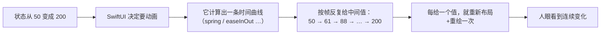

+++
title = "第 5 章 动画的本质：两个值之间的补间"
weight = 50
date = "2026-09-20T11:40:00+08:00"
type = "docs"
description = "动画 = 框架反复给中间值：withAnimation 与 .animation(_:value:) 的分工、为什么有的属性不动、transition 与身份的关系"
isCJKLanguage = true
draft = false
+++

# 第 5 章：动画的本质

> 大多数人以为动画是"给界面加个效果"。SwiftUI 不是这么设计的：**动画是"让一次状态变化被看懂"的手段。** 想通这一点，`.animation` 怎么加、加在哪，就都有答案了。

## 5.1 先破除一个直觉：动画不是"从 A 到 B 的过渡"

直觉上，动画像是"从 A 平滑地移动到 B"。但如果按这个直觉去理解 SwiftUI，会写出很多不生效的代码。

**SwiftUI 的真相是**：



🔥 **关键：动画 = 框架按时间曲线，把"中间值"反复喂给你的视图。**

这解释了两件反直觉的事：

1. **你从来没写过"中间值"**，你只写了起点和终点（两个状态）。中间值是框架算的。
2. **只有"能接受中间值"的东西才能动画。** 一个宽度可以是 61.3，所以能动画；但"这段文字的内容"没有中间值，所以不能。

### 用一个自定义 `Shape` 亲眼看这个过程

`Shape` 协议要求你提供 `animatableData`——它就是"框架要反复喂的那个值"：

```swift
import SwiftUI

struct Sweep: Shape, Animatable {
    var progress: Double

    // 框架会反复给这个属性赋中间值
    var animatableData: Double {
        get { progress }
        set { progress = newValue }
    }

    func path(in rect: CGRect) -> Path {
        var p = Path()
        p.move(to: CGPoint(x: rect.minX, y: rect.midY))
        p.addLine(to: CGPoint(x: rect.minX + rect.width * progress, y: rect.midY))
        return p
    }
}

struct SweepDemo: View {
    @State private var progress = 0.0

    var body: some View {
        VStack(spacing: 30) {
            Sweep(progress: progress)
                .stroke(.blue, style: StrokeStyle(lineWidth: 6, lineCap: .round))
                .frame(height: 8)

            Button("走一遍") {
                withAnimation(.easeInOut(duration: 1.5)) { progress = 1 }
            }
            Button("复位") { progress = 0 }        // 没有 withAnimation，瞬间归零
        }
        .padding()
    }
}
```

🔬 在 `setter` 里加一行 `print(newValue)`，你会看到它被调用**几十次**，每次的值都不一样（0.03、0.08、0.17……）。这就是动画的物理真相。

⚠️ 顺便一个 Swift 6 的注意点：`animatableData` 的 setter 是 **nonisolated** 的，所以如果你想在里面积累日志，不能用 `@MainActor` 的变量存，否则会报：

```text
error: main actor-isolated property 'calls' can not be mutated from a nonisolated context
```

调试时用 `print` 最省事；真要在并发上下文收集，用 `Mutex`（见 [Swift 速查表第 9 章]()）。

## 5.2 两种写法，两种职责

SwiftUI 有两个入口触发动画，很多人混着用。它们的职责其实很清楚：

| | `withAnimation { ... }` | `.animation(_:value:)` |
| --- | --- | --- |
| 加在哪 | **改状态的地方**（按钮动作、手势回调） | **视图上**（修饰符） |
| 作用范围 | 这次闭包里发生的**所有**状态变化 | 这个视图（及其子树）里，**当 `value` 变化时** |
| 触发条件 | 你主动调用 | `value` 的值发生改变 |
| 典型用途 | 用户操作引发的动画 | "某个数据变了，请平滑地跟上" |

### `withAnimation`：把"这一批变化"标记为可动画

```text
Button("展开") {
    withAnimation(.spring(duration: 0.4)) {
        isExpanded.toggle()
        rotation += 180          // 闭包里的多个变化会一起动画
    }
}
```

🔥 它是**命令式的一次性标记**：这行代码执行时，闭包里所有状态变化都走动画。

### `.animation(_:value:)`：声明式地"跟着某个值走"

```swift
Text("\(count)")
    .scaleEffect(isBig ? 1.5 : 1.0)
    .animation(.bouncy, value: isBig)     // isBig 一变，这个 scaleEffect 就动画
```

⚠️ **`value:` 参数不能省。** 老写法 `.animation(.spring)` 没有 `value`，会在**任何**状态变化时都尝试动画，导致难以预测的连锁动画，所以已经被弃用：

```text
warning: 'animation' was deprecated in macOS 12.0: Use withAnimation or animation(_:value:) instead.
```

### 怎么选

| 场景 | 用哪个 |
| --- | --- |
| 用户点了按钮/拖了手势，想让这次变化有动画 | `withAnimation` |
| 某个状态可能被**多处**修改，但每处都希望有动画 | `.animation(_:value:)` |
| 某个派生效果的动画（比如数字变化时脉冲一下） | `.animation(_:value:)` |
| 只想让**一部分**视图动画，而不是全部 | `.animation` 加在那个子视图上 |

💭 经验：**能用 `withAnimation` 就用它**——因为它把"这次动画"和"这次状态变化"绑在一起，代码读起来是因果明确的。`.animation(_:value:)` 适合"这个视图永远应该平滑跟随那个值"的声明式场景。

## 5.3 哪些能动画，哪些不能

这是最实用的一节。判断标准只有一条：

🔥 **能不能动画，取决于"这个属性有没有中间值"。**

| 类别 | 例子 | 能动画吗 |
| --- | --- | --- |
| **数值型布局属性** | `frame` 的宽高、`padding`、`offset`、`scaleEffect`、`rotationEffect` | ✅ 能，因为可以是 61.3 |
| **颜色** | `foregroundStyle`、`background`、`opacity` | ✅ 能，颜色通道可以插值 |
| **位置** | 视图在父视图里的位置变化（因为布局变了） | ✅ 能 |
| **形状参数** | `CornerRadius`、自定义 `animatableData` | ✅ 能（需要 `Animatable`） |
| **文字内容** | `Text("A")` → `Text("B")` | ❌ 不能，没有"中间的文字" |
| **视图的类型** | `Text` → `Image` | ❌ 不能，是两个不同的东西（见 `_ConditionalContent`） |
| **枚举分支的值** | 从 `.loading` 变到 `.loaded` | ❌ 整体不是连续量；但可以动画**转场**（下一节） |
| **`if` 的有无** | `if show { Text("x") }` | ❌ 不是"变化"，是"出现/消失"→ 用 `transition` |

⚠️ 最后两行是最容易被误判的。很多人写：

```text
if isLoading {
    ProgressView()
} else {
    ContentView()
}
```

然后想用 `withAnimation` 让它"淡入淡出"——**不会生效**，因为这不是同一个视图的属性变化，而是**两个不同的视图在替换**。这种情况要用 `.transition`。

## 5.4 `.transition`：视图出现和消失时的动画

`transition` 管的是"一个视图从无到有、或从有到无"时的表现：

```swift
struct TransitionDemo: View {
    @State private var showDetail = false

    var body: some View {
        VStack {
            Button(showDetail ? "收起" : "展开") {
                withAnimation(.easeInOut(duration: 0.3)) {
                    showDetail.toggle()
                }
            }

            if showDetail {
                Text("详情内容")
                    .padding()
                    .background(.blue.opacity(0.15), in: RoundedRectangle(cornerRadius: 8))
                    .transition(.move(edge: .top).combined(with: .opacity))
            }
        }
    }
}
```

| 内置转场 | 效果 |
| --- | --- |
| `.opacity` | 淡入淡出 |
| `.scale` | 从中心缩放 |
| `.scale(scale: 0.8, anchor: .top)` | 指定初始缩放与锚点 |
| `.move(edge: .top)` | 从某条边滑入/滑出 |
| `.slide` | 从前往后滑（列表里常用） |
| `.push(from: .trailing)` | 推入式 |
| `.asymmetric(insertion:removal:)` | 进入和离开用不同效果 |

### `transition` 必须和 `withAnimation` 配合

⚠️ 这是最常见的"转场不动"的原因：

```text
// 🛑 不动：状态变了，但没有告诉框架"这次要动画"
Button("切换") { showDetail.toggle() }
if showDetail { Detail().transition(.opacity) }

// ✅ 动了：用 withAnimation 包住状态变化
Button("切换") { withAnimation { showDetail.toggle() } }
if showDetail { Detail().transition(.opacity) }
```

🔥 记住分工：**`transition` 描述"怎么进出"，`withAnimation` 提供"这次是动画"。** 缺一不可。

💭 另一个选择是给 `if` 外面套 `.animation(_:value:)`，同样有效：

```swift
Group {
    if showDetail { Detail().transition(.opacity) }
}
.animation(.easeInOut, value: showDetail)
```

## 5.5 身份：为什么动画有时"飞过去"、有时"凭空出现"

这是本章最深入的一节，也是第 6 章的引子。

SwiftUI 在对比新旧视图树时，要判断"这两个视图是不是同一个"。判断依据就是**身份**：**同一个类型 + 同一个位置 = 同一个视图**。

- **同一个视图，属性变了** → 可以补间 → **动画**
- **身份变了**（不同的位置、或 `id` 不同） → 旧视图消失、新视图出现 → 走 **`transition`**

```text
// 情况一：同一个视图，宽度在变 → 会平滑地长/缩
Rectangle().frame(width: big ? 200 : 50)

// 情况二：两个不同分支的视图 → 走转场，不会"变形"
if big { WideView() } else { NarrowView() }
```

### `matchedGeometryEffect`：告诉框架"这两个是同一个东西"

当你**确实**想让"情况二"里的两个视图看起来是同一个东西在移动时，用 `matchedGeometryEffect`：

```swift
struct ExpandDemo: View {
    @Namespace private var ns
    @State private var expanded = false

    var body: some View {
        ZStack {
            if expanded {
                RoundedRectangle(cornerRadius: 20)
                    .fill(.blue)
                    .frame(width: 300, height: 200)
                    .matchedGeometryEffect(id: "card", in: ns)
                    .onTapGesture { withAnimation(.spring) { expanded = false } }
            } else {
                RoundedRectangle(cornerRadius: 10)
                    .fill(.blue)
                    .frame(width: 100, height: 60)
                    .matchedGeometryEffect(id: "card", in: ns)
                    .onTapGesture { withAnimation(.spring) { expanded = true } }
            }
        }
    }
}
```

关键点：

| 要素 | 作用 |
| --- | --- |
| `@Namespace private var ns` | 声明一个"命名空间"，把两边关联起来 |
| `id: "card"` | 两边**必须相同**，框架才知道它们是"同一个东西" |
| `in: ns` | 同一个命名空间 |
| 外层要有 `withAnimation` | 否则瞬间切换 |

🔥 `matchedGeometryEffect` 的本质是："**虽然这是两个不同的视图，但请把它们当成同一个，然后动画它们之间的几何差异。**" 它常见于照片网格→大图的展开效果。

## 5.6 `PhaseAnimator` 与 `KeyframeAnimator`

前面所有动画都是"从状态 A 到状态 B"。但有些动画**没有状态变化**——比如"呼吸灯"式的循环脉冲。这时用 `PhaseAnimator`（iOS 17 / macOS 14 起）：

```swift
PhaseAnimator([1.0, 1.3, 1.0]) { phase in
    Circle()
        .fill(.blue)
        .frame(width: 80, height: 80)
        .scaleEffect(phase)
} animation: { _ in
    .easeInOut(duration: 0.6)
}
```

它会**自动循环**遍历这些 phase，不需要任何 `@State`。适合提示性动效（加载中、提醒、骨架屏）。

需要更精细的时间控制时用 `KeyframeAnimator`：

```swift
KeyframeAnimator(initialValue: 0.0) { offset in
    Circle().fill(.orange).frame(width: 40, height: 40).offset(x: offset)
} keyframes: { _ in
    KeyframeTrack(\.self) {
        CubicKeyframe(120, duration: 0.5)
        SpringKeyframe(0, duration: 0.6, spring: .bouncy)
    }
}
```

| 工具 | 什么时候用 |
| --- | --- |
| `withAnimation` / `.animation` | 状态变化驱动的动画（90% 的场景） |
| `PhaseAnimator` | 循环的多阶段动效，且不需要状态 |
| `KeyframeAnimator` | 需要精确控制每个时间点的值（复杂路径、分段缓动） |

⚠️ 这两个 API 的可用性起点是 **iOS 17 / macOS 14**。要支持更老的系统就用 `withAnimation` + 定时器手动驱动。

## 5.7 动画的两条纪律

动画写多了以后，最容易犯的两个错误：

### 纪律一：只动画"用户需要理解的变化"

动画不是装饰。它的作用是**让用户明白发生了什么**：

| 好的动画 | 为什么 |
| --- | --- |
| 列表插入一行时淡入 + 滑入 | 用户知道"多了一条，加在这里" |
| 按钮按下时轻微缩放 | 用户知道"点击生效了" |
| 卡片展开时从缩略图位置放大 | 用户知道"这个大图就是刚才那张小的" |

| 坏的动画 | 为什么 |
| --- | --- |
| 每个元素都带弹跳 | 视觉噪音，用户会疲劳 |
| 每次数据刷新都整体淡入 | 用户无法判断"哪些变了" |
| 动画时长超过 0.5 秒 | 感觉卡顿，像在等加载 |

💭 时长参考：**微交互 0.15–0.25s，常规过渡 0.25–0.4s，大范围转场 0.4–0.6s。** 超过 0.6s 用户就开始觉得慢了。

### 纪律二：不要动画会"高频变化"的属性

```swift
// 🛑 滚动位置每帧都在变，给它加动画只会打架
ScrollView { ... }
    .animation(.spring, value: scrollOffset)

// 🛑 输入框每敲一个字都触发
TextField("搜索", text: $query)
    .animation(.bouncy, value: query)
```

🔥 判据：**如果一个值每秒会变几十次，它就不该有动画。** 动画是给"状态跃迁"用的，不是给"连续变化"用的。

### 无障碍：尊重"减弱动态效果"

```text
// 在视图里读系统的"减弱动态效果"开关
@Environment(\.accessibilityReduceMotion) private var reduceMotion

// 写成一个可选的动画：开关打开时给 nil
var animation: Animation? {
    reduceMotion ? nil : .spring(duration: 0.4)
}

// 用法：withAnimation 接受 Animation?，传 nil 就是"不做动画"
withAnimation(animation) { expanded.toggle() }
```

⚠️ `withAnimation` 接受 `Animation?`，传 `nil` 就是"不做动画"。系统设置里打开了"减弱动态效果"的用户，通常有前庭功能障碍，强动画会真的让他们不舒服。**这是及格线，不是加分项。**

## 5.8 完整可运行文件

```swift
import SwiftUI

struct AnimationLab: View {
    @State private var isExpanded = false
    @State private var count = 0
    @State private var showBadge = false
    @Namespace private var ns
    @Environment(\.accessibilityReduceMotion) private var reduceMotion

    var animation: Animation? { reduceMotion ? nil : .spring(duration: 0.4) }

    var body: some View {
        ScrollView {
            VStack(spacing: 32) {

                // ① 布局属性可动画：宽度
                section("① frame 宽度（可动画）") {
                    RoundedRectangle(cornerRadius: 8)
                        .fill(.blue)
                        .frame(width: isExpanded ? 260 : 80, height: 40)
                }

                // ② 只动画指定属性：value 明确
                section("② 数字变化时脉冲（.animation(value:)）") {
                    Text("\(count)")
                        .font(.system(size: 40, weight: .bold, design: .rounded))
                        .scaleEffect(showBadge ? 1.3 : 1.0)
                        .animation(.bouncy(duration: 0.3), value: showBadge)
                }

                // ③ 转场：需要 withAnimation + transition
                section("③ 转场（withAnimation + transition）") {
                    VStack {
                        if showBadge {
                            Text("我是转场出来的")
                                .padding(8)
                                .background(.green.opacity(0.2), in: Capsule())
                                .transition(.move(edge: .top).combined(with: .opacity))
                        }
                    }
                    .frame(height: 50)
                }

                // ④ matchedGeometryEffect：身份不同但当成同一个
                section("④ matchedGeometryEffect") {
                    ZStack {
                        if isExpanded {
                            RoundedRectangle(cornerRadius: 20)
                                .fill(.orange)
                                .frame(width: 240, height: 120)
                                .matchedGeometryEffect(id: "card", in: ns)
                        } else {
                            RoundedRectangle(cornerRadius: 10)
                                .fill(.orange)
                                .frame(width: 80, height: 40)
                                .matchedGeometryEffect(id: "card", in: ns)
                        }
                    }
                    .frame(height: 130)
                }

                // ⑤ PhaseAnimator：无需状态变化的循环动效
                section("⑤ PhaseAnimator（循环脉冲）") {
                    PhaseAnimator([1.0, 1.25, 1.0]) { phase in
                        Image(systemName: "bell.fill")
                            .font(.system(size: 36))
                            .foregroundStyle(.red)
                            .scaleEffect(phase)
                    } animation: { _ in
                        .easeInOut(duration: 0.7)
                    }
                }

                HStack {
                    Button("切换布局") { withAnimation(animation) { isExpanded.toggle() } }
                    Button("加一") { count += 1; showBadge.toggle() }
                    Button("转场开关") { withAnimation(animation) { showBadge.toggle() } }
                }
                .buttonStyle(.bordered)
            }
            .padding()
        }
    }

    func section<Content: View>(_ title: String, @ViewBuilder content: () -> Content) -> some View {
        VStack(spacing: 8) {
            Text(title).font(.footnote).foregroundStyle(.secondary)
            content()
        }
    }
}

#Preview {
    AnimationLab()
}
```

> 📦 这一段是 `View` + `#Preview`，**没有 `@main`**：新建 `Chapter05.swift` 放进 Xcode 的 App 项目，再把 App 文件里的 `WindowGroup { ContentView() }` 改成 `WindowGroup { AnimationLab() }`；只想看效果就直接看 `#Preview`——预览不需要入口。

💭 跑起来以后重点观察三件事：

1. **①②** 是"同一个视图的属性在变"——平滑补间；
2. **③④** 涉及"视图的进出/身份"——走转场和几何匹配；
3. **⑤** 完全没有 `@State`——`PhaseAnimator` 自己循环。

## 5.9 本章易错点速查

| 你会怎么写 | 实际发生什么 | 正确做法 |
| --- | --- | --- |
| `.animation(.spring)`（无 `value:`） | 已弃用；任何状态变化都会尝试动画，行为难预测 | 写 `.animation(.spring, value: someValue)` |
| `if/else` 两个分支之间想用 `withAnimation` 变形 | 不会变形，是两个不同视图 | 用 `.transition`，或 `matchedGeometryEffect` |
| 加了 `.transition` 但不动 | 缺 `withAnimation`（或 `.animation(value:)`） | 用 `withAnimation` 包住状态变化 |
| 想动画 `Text` 的内容变化 | 文字没有中间值 | 用 `.contentTransition(.numericText())`（数字）或做转场 |
| 给高频变化的值加动画 | 滚动/输入时动画互相打架，卡顿 | 只给"状态跃迁"加动画 |
| 给每样东西都加弹跳 | 视觉噪音 | 只为"需要被理解的变化"加 |
| 忽略"减弱动态效果" | 部分用户会不适 | 读 `\.accessibilityReduceMotion`，为真时传 `nil` |
| 在 `animatableData` 的 setter 里用 `@MainActor` 变量 | `main actor-isolated property can not be mutated from a nonisolated context` | 用 `print` 调试，或用 `Mutex` 收集 |

## 5.10 下一章

动画讲完了，但它反复提到一个词：**身份**。什么情况下算"同一个视图"、什么时候算"换了一个"——这决定了动画是补间还是转场，也决定了状态会不会被重置。

下一章是最后一章：手势与身份。我们会把"用户的手"和"框架的记忆"这两件事接上。
