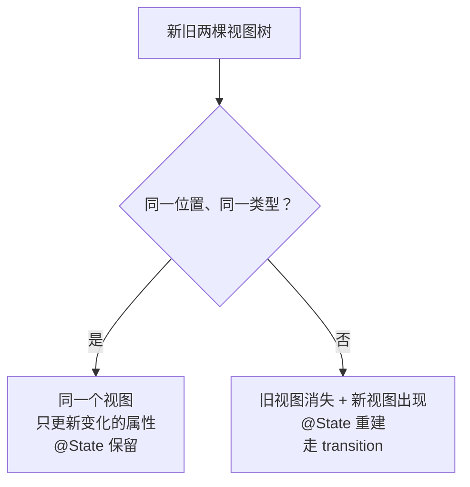
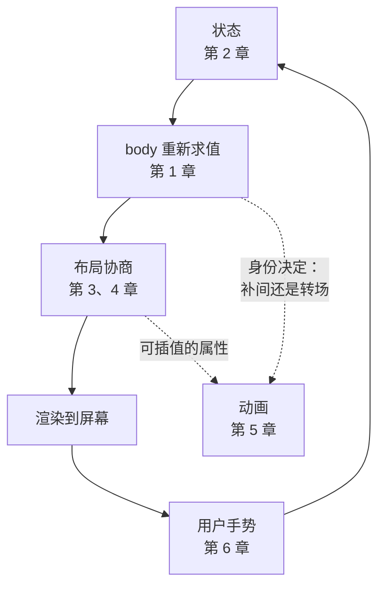

+++
title = "第 6 章 手势与身份"
weight = 60
date = "2026-09-20T11:40:00+08:00"
type = "docs"
description = "用 @GestureState 还是 @State：手势的两种状态分工；以及身份如何决定视图的命运——状态何时保留、何时被重置"
isCJKLanguage = true
draft = false
+++

# 第 6 章：手势与身份

> 最后一章把两件事接上：**用户的手**（手势）和**框架的记忆**（身份）。前者让你能交互，后者决定了交互产生的东西能不能留住。

## 6.1 手势的两个状态：临时 vs 持久

先看一个最常见的需求：拖一个方块，松手后它停在原地。

```swift
struct DragDemo: View {
    @State private var position: CGSize = .zero        // 持久：松手后保留
    @GestureState private var dragOffset: CGSize = .zero   // 临时：松手自动归零

    var body: some View {
        let offset = CGSize(
            width: position.width + dragOffset.width,
            height: position.height + dragOffset.height
        )

        return Circle()
            .fill(.blue)
            .frame(width: 80, height: 80)
            .offset(offset)
            .gesture(
                DragGesture()
                    .updating($dragOffset) { value, state, _ in
                        state = value.translation          // 拖拽过程中实时更新
                    }
                    .onEnded { value in
                        position.width  += value.translation.width    // 松手时落账
                        position.height += value.translation.height
                    }
            )
    }
}
```

🔥 **这是本章最重要的一节：为什么要两个状态？**

| | `@GestureState` | `@State` |
| --- | --- | --- |
| 生命周期 | **手势进行中**有效 | 一直有效 |
| 手势结束时 | **自动恢复为初始值** | 保持不变 |
| 能写吗 | 只能在 `updating` 闭包里改 | 随时能改 |
| 适合存 | "正在拖多远"这种瞬时量 | "拖到哪儿了"这种最终结果 |
| 手势被系统打断时 | **自动归零**（这是个优点！） | 需要自己处理 |

💭 用一个比喻：`@GestureState` 是**手指的位置**（手指抬起来就没了），`@State` 是**东西的位置**（手指抬起来它还在那儿）。

### `@GestureState` 的隐藏好处：自动清理

如果只用一个 `@State` 存拖拽偏移，会遇到这种情况：用户正在拖，突然来了个电话/切到别的 App，手势被系统取消——`onEnded` **不会**被调用，于是你的方块**卡在半路上**。

用 `@GestureState` 就没这个问题：手势一结束（无论正常还是被取消），它自动回到初始值。

🝖 **机制上确实是这么设计的**：翻 SDK 能看到 `GestureState` 内部就是一个 `State` 加一个 `reset` 闭包：

```text
@propertyWrapper public struct GestureState<Value> {
  fileprivate var state: State<Value>
  fileprivate let reset: (Binding<Value>) -> Void     // ← 手势结束时被调用
  public var wrappedValue: Value { get }              // ← 只有 get，写不了
}
```

`wrappedValue` **只有 `get` 没有 `set`**，这也解释了为什么你必须在 `updating` 闭包里通过 `state` 参数来改它。

⚠️ **诚实标注**：上面那套"手势被取消时 `onEnded` 不触发"的说法是 SwiftUI 的文档化行为，也是社区长期确认的现象，但**本教程无法在无界面环境里实测手势取消**——手势需要真实的事件流。这里给出的是机制层面的证据（`reset` 闭包的存在），不是实测数据。

⚠️ 但要注意：正因为会归零，**你必须在 `onEnded` 里把结果累加到 `@State`**，否则松手后位置就丢了。

## 6.2 手势家族

| 手势 | 用途 | 关键属性 |
| --- | --- | --- |
| `TapGesture` | 点击 | `count:` 支持双击 |
| `LongPressGesture` | 长按 | `minimumDuration`、`maximumDistance` |
| `DragGesture` | 拖拽 | `translation`、`location`、`predictedEndTranslation` |
| `MagnifyGesture` | 捏合缩放 | `magnification`（需 iOS 17 / macOS 14） |
| `RotateGesture` | 旋转 | `rotation`（需 iOS 17 / macOS 14） |
| `SpatialTapGesture` | 带坐标的点击 | `location`（需 iOS 17 / macOS 14） |

⚠️ **新旧名字的对照**（老教程里常见旧名）：

| 旧名（仍可用，未弃用） | 新名 | 新名起点 |
| --- | --- | --- |
| `MagnificationGesture` | `MagnifyGesture` | iOS 17 / macOS 14 |
| `RotationGesture` | `RotateGesture` | iOS 17 / macOS 14 |

新名的 `Value` 类型更清晰（`magnification` 而不是裸 `CGFloat`），而且能拿到 `startAnchor`。**要兼容 iOS 16 就用旧名**，它们没有被弃用。

### 一个手势同时处理缩放和旋转

```swift
struct TransformDemo: View {
    @State private var scale = 1.0
    @State private var angle = Angle.zero
    @GestureState private var pinch = 1.0
    @GestureState private var twist = Angle.zero

    var body: some View {
        RoundedRectangle(cornerRadius: 16)
            .fill(.orange)
            .frame(width: 120, height: 120)
            .scaleEffect(scale * pinch)
            .rotationEffect(angle + twist)
            .gesture(
                SimultaneousGesture(
                    MagnifyGesture()
                        .updating($pinch) { value, state, _ in state = value.magnification }
                        .onEnded { value in scale *= value.magnification },
                    RotateGesture()
                        .updating($twist) { value, state, _ in state = value.rotation }
                        .onEnded { value in angle += value.rotation }
                )
            )
    }
}
```

## 6.3 手势的组合方式

多个手势同时存在时，谁先响应？SwiftUI 给了三种组合方式：

| 写法 | 含义 | 类比 |
| --- | --- | --- |
| `A.simultaneously(with: B)` | **同时**识别 | 双指同时缩放+旋转 |
| `A.sequenced(before: B)` | 先 A **再** B | 先长按，再拖动 |
| `A.exclusively(before: B)` | 优先 A，A 不成立才试 B | 先判单击，不是就判双击 |

在视图上挂载时还有两种修饰符：

```swift
view.gesture(A)                  // 普通：子视图的手势优先
view.simultaneousGesture(B)      // 和已有手势同时生效
view.highPriorityGesture(C)      // 抢在子视图之前
```

💭 常见坑：**手势被"上面"的视图吃掉**。比如一个可拖拽的卡片里放了个 `Button`，按钮会先响应点击。想让卡片也能拖，用 `.simultaneousGesture`。

### 惯性滑动：`predictedEndTranslation`

`DragGesture` 的 `onEnded` 里有一个 `predictedEndTranslation`——它是系统**预测**你松手后还会滑多远（根据速度推算）。做"滑动切换"时非常好用：

```text
.onEnded { value in
    // 用预测终点判断"这一甩算不算数"，而不是死抠位移阈值
    let predicted = value.predictedEndTranslation.width
    if abs(predicted) > 150 {
        withAnimation(.spring) { page += predicted > 0 ? -1 : 1 }
    }
}
```

🔥 只判断 `translation` 会让"快速轻扫"失效——因为位移很小但意图很明确。加进 `predictedEndTranslation` 才符合手感。

## 6.4 身份：SwiftUI 里最贵的一课

现在进入本章的下半场。**身份**是前面五章反复出现的伏笔，这里收口。

### 什么是身份

SwiftUI 在更新界面时，要把新算出来的视图树和上一棵对比。对比的单位是"**这个位置上的这个视图**"。它怎么判断"是不是同一个视图"？

🔥 **同一个类型 + 同一个结构位置 = 同一个视图。**



### 身份决定 `@State` 的命运

🔬 **实测**：同一个子视图，只改 `.id()` 的值：

```swift
// 用 @State 的初始值表达式计数——它只在"新身份建立"时求值
Child(stats: s).id("A")      // 初次构建：计数 = 1
Child(stats: s).id("B")      // 换成另一个 id：计数 = 2  ← 状态被重建了
```

同时 `Self._printChanges()` 的输出是：

```text
Child: @self, @identity, __n changed.
```

⚠️ 注意那个 **`@identity`**——它明确告诉你："这个视图的身份变了，所以被当成新的处理。"（回顾第 2 章讲的 `@self changed` 和具体属性名，三种原因在这里凑齐了。）

### 什么时候身份会变

| 情况 | 身份变化吗 | 后果 |
| --- | --- | --- |
| 视图的属性变了（宽度、颜色） | ❌ 不变 | 只更新属性，`@State` 保留 |
| `if` / `switch` 走了不同分支 | ✅ 变 | 状态重建（因为结构位置变了） |
| 显式改了 `.id(...)` | ✅ 变 | 状态重建 |
| `ForEach` 里数据的 `id` 变了 | ✅ 变 | 对应那一行状态重建 |
| 视图在数组里换了位置 | ✅ 变（位置变了） | 状态可能串到别的行上 |

### 最常见的坑：`if/else` 包着同一个视图

```swift
// 🛑 身份会变：两个分支结构位置不同，State 会被重建
if isEnabled {
    Counter()          // 分支 1
} else {
    Counter()          // 分支 2 —— 对 SwiftUI 来说是"另一个 Counter"
}
```

用户切换开关，计数器就被清零了。**修法**：让它是同一个视图，只变属性：

```swift
// ✅ 身份稳定
Counter()
    .opacity(isEnabled ? 1 : 0.4)
    .disabled(!isEnabled)
```

💭 判据：**如果你希望状态跨"两种状态"保留，就不要让它跨结构位置。** 把 `if` 从"包住视图"改成"影响视图的属性"。

### `ForEach` 的 id：为什么列表会"串行"

```swift
// 🛑 用下标当 id：删除元素后，后面所有元素的 id 都变了
ForEach(Array(items.enumerated()), id: \.offset) { _, item in
    Row(item: item)
}

// ✅ 用稳定标识
ForEach(items) { item in          // 要求 Item: Identifiable
    Row(item: item)
}
```

⚠️ 用下标当 id 的具体症状：删掉第 2 行，第 3 行的 `@State`（比如"是否展开"）会**串到第 2 行上**。因为对 SwiftUI 来说，"id = 2"那一行还在，只是内容换了。

🔥 **id 必须是"跟着数据走"的，不能是"跟着位置走"的。** 这是身份这一课最实用的一条。

## 6.5 一个完整的可拖拽手势例子

```swift
import SwiftUI

struct DraggableCard: View {
    @State private var committed: CGSize = .zero
    @GestureState private var dragging: CGSize = .zero
    @State private var isDragging = false

    var body: some View {
        let offset = CGSize(
            width: committed.width + dragging.width,
            height: committed.height + dragging.height
        )

        RoundedRectangle(cornerRadius: 16)
            .fill(.blue.gradient)
            .frame(width: 120, height: 80)
            .overlay {
                Image(systemName: "hand.draw")
                    .font(.title)
                    .foregroundStyle(.white)
            }
            // 视觉反馈：拖拽时放大 + 加阴影
            .scaleEffect(isDragging ? 1.08 : 1.0)
            .shadow(color: .black.opacity(isDragging ? 0.3 : 0.1),
                    radius: isDragging ? 16 : 4, y: isDragging ? 8 : 2)
            .offset(offset)
            .gesture(
                DragGesture()
                    .updating($dragging) { value, state, _ in
                        state = value.translation
                    }
                    .onChanged { _ in
                        if !isDragging { withAnimation(.spring(duration: 0.2)) { isDragging = true } }
                    }
                    .onEnded { value in
                        // 松手：把这次位移"落账"到持久状态
                        committed.width += value.translation.width
                        committed.height += value.translation.height
                        withAnimation(.spring(duration: 0.3)) { isDragging = false }
                    }
            )
            .animation(.spring(duration: 0.4), value: committed)
    }
}

#Preview {
    ZStack {
        Color(.windowBackgroundColor).ignoresSafeArea()
        DraggableCard()
    }
    .frame(width: 500, height: 500)
}
```

⚠️ 注意最后那个 `.animation(..., value: committed)`：它让"落账"这一步也带上动画（如果你在 `onEnded` 里直接改 `committed` 而不加 `withAnimation`）。这正是第 5 章说的 `.animation(_:value:)` 的典型用法——"这个视图永远应该平滑跟随这个值"。

## 6.6 六章回顾：一张图串起来



这个循环就是 SwiftUI 的全部：

| 章 | 在循环里的角色 | 一句话 |
| --- | --- | --- |
| 1 | `body` 是描述 | 视图是值，不是控件 |
| 2 | 状态的归属 | 数据变了界面才变，反过来不行 |
| 3 | 尺寸从哪来 | 父提尺寸、子报尺寸、父定位子 |
| 4 | 位置怎么定 | 对齐是"和谁对齐"，不是"往哪儿挪" |
| 5 | 变化怎么被看懂 | 动画是框架反复喂中间值 |
| 6 | 交互如何闭环 | 手势改状态；身份决定状态能否留住 |

## 6.7 本章易错点速查

| 你会怎么写 | 实际发生什么 | 正确做法 |
| --- | --- | --- |
| 只用 `@State` 存拖拽偏移 | 手势被系统打断时卡在半路 | 用 `@GestureState` 存临时量，`onEnded` 落账到 `@State` |
| `@GestureState` 里存最终结果 | 手势一结束就归零，白存 | 它只适合瞬时量 |
| 用 `.translation` 判断"这一甩算不算" | 快速轻扫位移很小，判断失效 | 用 `.predictedEndTranslation` |
| `if/else` 两个分支都放同一个视图 | 状态被重建（身份变了） | 改成同一个视图 + 属性变化 |
| `ForEach` 用下标当 `id` | 删除后状态串行 | 用 `Identifiable` 的稳定 id |
| 手势被内部按钮吃掉 | 外层拖拽失效 | `.simultaneousGesture` / `.highPriorityGesture` |
| `MagnifyGesture` 用在 iOS 16 | 需要 iOS 17 / macOS 14 | 老系统用 `MagnificationGesture` |
| 忘了 `SpatialTapGesture` 的存在 | 想拿点击坐标却自己算 | 需要坐标的点击用它 |

## 6.8 下一步：你已经具备往下走的能力

六章到这里结束。你现在应该能解释这些以前觉得"玄学"的现象：

- 为什么改了数据界面不刷新（第 2 章：`@Observable` / 状态位置 / 引用类型）
- 为什么视图不听话、宽度被压（第 3 章：`frame` 是请求不是保证）
- 为什么两个东西怎么都对不齐（第 4 章：`alignment` 是参考线）
- 为什么动画不动，或者全都在乱动（第 5 章：能插值才能动画；`transition` 要配 `withAnimation`）
- 为什么状态会莫名其妙丢失（第 6 章：身份变了）

接下来的路，按你的需求选：

| 想做的事 | 去哪 |
| --- | --- |
| 做完整 App：导航、列表、持久化、搜索 | [Swift 基础部分第七篇]() 第 43–44、46 章 |
| 系统性地再过一遍概念体系 | 同一份第七篇，第 40–47 章 |
| 查某个 API 的完整用法 | [SwiftUI 官方文档整理]() |
| 深入绘制、特效、自定义布局 | 同一份文档的「视图 → 绘图与图形」「视图布局 → 自定义布局」 |
| 遇到搞不定的崩溃/怪现象 | [Swift 血泪速查]() |

💭 **最后一句建议**：SwiftUI 的知识点不多，但**必须动手改**才能变成直觉。这六章里的每个例子，都值得你跑起来之后故意改坏它——把 `.frame` 删掉、把 `Spacer` 换成 `padding`、把 `@State` 改成 `let`、把 `.id` 删掉，看界面怎么变。**你改坏的次数，等于你学会的程度。**
