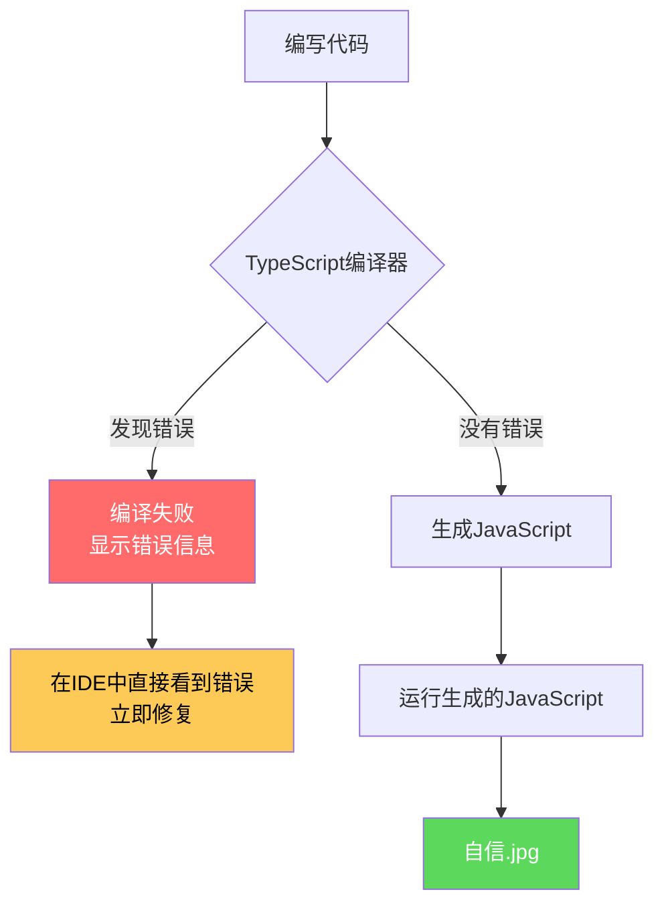
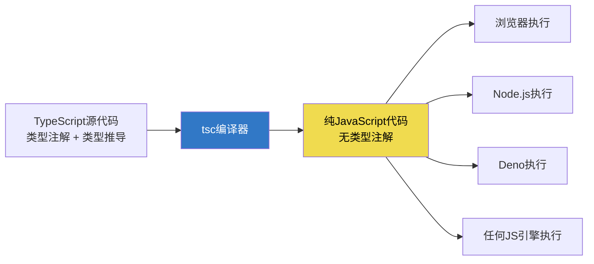
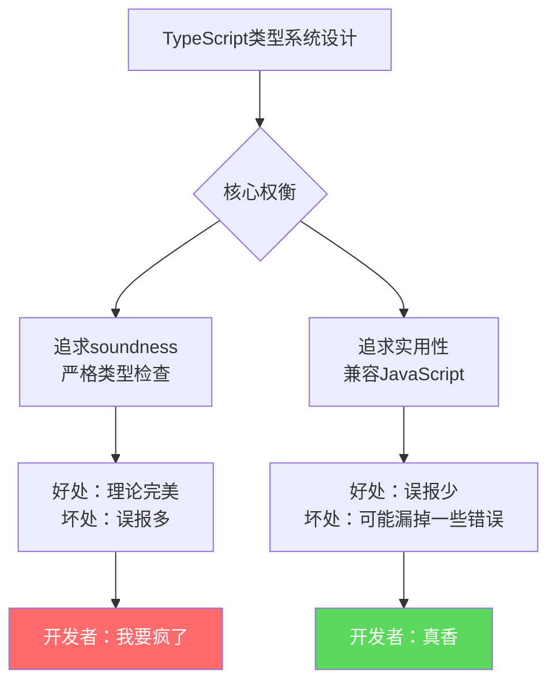
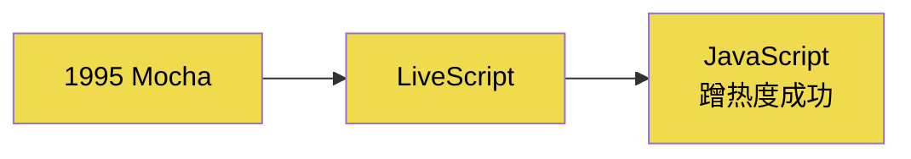

+++
title = "第1章 TypeScript概述与环境搭建"
weight = 10
date = "2026-03-26T21:05:00+08:00"
type = "docs"
description = ""
isCJKLanguage = true
draft = false
+++

## 1.1 TypeScript 是什么

> "JavaScript是你在凌晨3点写的代码，TypeScript是你第二天早上7点重新写的代码——只不过这次加了类型。" —— 某位被undefined和null折磨疯了的程序员

好，既然你点进来了，那咱们就聊聊TypeScript这位"带保镖的JavaScript"。

在说TypeScript之前，我们得先聊聊JavaScript那些让人又爱又恨的"迷惑行为"。毕竟，TypeScript的出现，本身就是一部"JavaScript血泪史"。

---

### 1.1.1 JavaScript 类型系统的历史缺陷

JavaScript这门语言啊，怎么说呢，它的设计者Brendan Eich当年只用了**10天**就把它设计出来了。10天！朋友们，你们10天能干嘛？可能还在纠结午饭吃什么。而人家10天搞定了一门编程语言——虽然后来花了20多年打补丁。

这种"速战速决"的开发模式，注定JavaScript的类型系统是一言难尽的。

#### 1.1.1.1 弱类型与隐式类型转换

JavaScript是**弱类型**语言，这是什么意思呢？

强类型语言（比如Java、Python）里，`"hello" + 123`这种操作，编译器会直接甩你一脸错误："类型不匹配！别给我整这些有的没的！"

但JavaScript呢？它会默默地、贴心地、毫无底线地帮你把`123`转成字符串`"123"`，然后返回`"hello123"`。

```javascript
// JavaScript的迷惑行为大赏
console.log("hello" + 123);        // "hello123" —— 数字被强行转成了字符串
console.log("5" - 3);              // 2 —— 字符串被强行转成了数字
console.log("" == false);          // true —— 两者都转成0再比较
console.log([] == false);          // true —— 空数组转成""，再转成数字0
console.log({} == false);         // false —— 对象跟谁都不相等（包括false）

// 实际上："5" + 3 = "53"（字符串拼接），不是 8！这就是隐式类型转换的坑。
```

这种**隐式类型转换**就像你妈不经过你同意就把你的房间重新装修了一样——你以为这是你的房间，但实际上它已经不是你认识的那个房间了。

弱类型的另一个特点是**类型可以随便变**：

```javascript
let life = "happy";       // life是字符串
life = 42;                // 瞬间变成数字，JS表示毫无压力
life = false;             // 布尔型也行
life = undefined;         // 未定义也行
life = null;              // 空也行
life = [1, 2, 3];         // 数组当然可以
life = { meaning: 42 };   // 对象？来嘛！
// JavaScript: 我全都要.jpg
```

在强类型语言里，这种操作编译器会直接报错。但在JavaScript里，一切都那么和谐——直到你debug的时候发现`"5" + 3`结果是`"53"`而不是`8`，然后你在凌晨2点对着屏幕怀疑人生。

#### 1.1.1.2 运行时才发现错误

JavaScript的错误发现时机堪称"史诗级拖延"：

```javascript
// 这个函数在写的时候，JavaScript完全不会报错
function divide(a, b) {
    return a / b;
}

// 只有当你传入字符串调用它时，你才会知道什么叫"惊喜"
console.log(divide("hello", "world")); // NaN —— 恭喜你，获得了一个Not a Number
console.log(divide(10, 0));              // Infinity —— 除以零不报错，返回无穷大
```

对比一下强类型语言的做法：如果你声明`a`和`b`是`number`类型，编译器在**写代码的时候**就会拦住你，而不是等到用户用的时候才报错。

这就是"编译时检查"vs"运行时检查"的区别。编译时检查就像在你出门前你妈就告诉你"今天穿秋裤"，运行时检查就像你已经在雪地里站了半小时了，你妈才说"哎呀忘了告诉你了"。

#### 1.1.1.3 NaN 的特殊行为：`NaN === NaN // false`，NaN 与自身不相等

说到JavaScript的迷惑行为，NaN绝对是一个重量级选手。

`NaN`是"Not a Number"的缩写，看起来应该是一个"不是一个数字"的值对吧？但实际上，`NaN`的类型偏偏是`number`：

```javascript
console.log(typeof NaN); // "number"
// 注释：NaN的类型居然是number，这是要闹哪样？
```

更离谱的是，`NaN`与自身的比较：

```javascript
console.log(NaN === NaN); // false —— 自己不等于自己！
console.log(NaN == NaN);  // false —— 连==都不等于自己
```

为什么`NaN`不等于自己？这是**IEEE 754浮点数规范**的要求，不是JavaScript的设计缺陷——JavaScript只是照着规范实现的。在这个星球上，任何遵循IEEE 754浮点数规范的语言（Java、C#、Python、Ruby……几乎所有语言）都有这个行为。

这是因为NaN代表的是"未定义的数学运算结果"，比如`0/0`或者`Math.sqrt(-1)`。既然是"未定义"，那它跟谁都不相等（包括它自己）——因为"未定义"本质上不是一个具体的值。

```javascript
// 产生NaN的几种方式
console.log(0 / 0);               // NaN —— 0除以0
console.log(Math.sqrt(-1));        // NaN —— 负数开平方
console.log(parseInt("hello"));    // NaN —— 字符串转数字失败
console.log(NaN + 5);              // NaN —— NaN参与任何运算都是NaN

// 检查一个值是否是NaN——绝对不能用===
console.log(NaN === NaN);          // false —— 这是错的！
console.log(Number.isNaN(NaN));    // true —— 正确做法
console.log(isNaN(NaN));           // true —— 这个也行（老API，有坑）
```

> 💡 **小知识**：JavaScript里检查NaN的正确姿势是`Number.isNaN()`，因为旧的`isNaN()`函数会把不是NaN但会转成NaN的值也返回true，比如`isNaN("hello")`返回`true`，但`Number.isNaN("hello")`返回`false`。

---

### 1.1.2 TypeScript 的解决思路

好了，吐槽完JavaScript，我们来看看TypeScript是怎么"拨乱反正"的。

TypeScript是由**微软**开发的，主导者是**Anders Hejlsberg**——这位大佬来头可不小，他是C#和Delphi之父。你没看错，C#之父来给JavaScript打补丁了。所以某种程度上，TypeScript就像是"用一个国家的力量来开发一个美容手术"——杀鸡用牛刀，但效果确实好。

#### 1.1.2.1 编译时类型检查，将错误提前到开发阶段

TypeScript的核心思想很简单：**把错误消灭在萌芽状态**。

```typescript
// TypeScript代码
function divide(a: number, b: number): number {
    return a / b;
}

// 当你试图传入字符串时，VS Code会直接在编辑器里给你一个红色波浪线
// 错误信息：Argument of type 'string' is not assignable to parameter of type 'number'
// 根本不需要等到运行时，编写的时候就告诉你了
console.log(divide("hello", "world"));
```

TypeScript编译器（`tsc`）会在**编译时**检查你的代码，发现类型错误就报错。而不是等到用户实际运行了，程序才崩溃——那时候你可能已经在马尔代夫度假了，然后被一个电话叫回来修bug。

编译时检查的优势：



#### 1.1.2.2 显式类型注解：`: Type` 语法

TypeScript使用**类型注解**来声明变量、函数参数和返回值的类型。语法就是在变量名后面加一个冒号和类型名：

```typescript
// 变量类型注解
let name: string = "猪八戒";
let age: number = 3000;
let isMarried: boolean = false;

// 函数类型注解
function greet(person: string): string {
    return `你好，${person}！`;
}

// 参数和返回值都标清楚了，一看就知道该怎么调用
console.log(greet("孙悟空")); // 你好，孙悟空！
```

这个语法看起来有点啰嗦，但相信我——当你debug的时候，你会感谢当年写下这些注解的自己。

#### 1.1.2.3 类型推断：编译器自动推导

等等，TypeScript不是"渐进式类型"吗？那岂不是要写很多类型注解？

别慌，TypeScript有**类型推断**功能——你写代码的时候，编译器会自动帮你推导出类型：

```typescript
// 编译器自动推断为string
let name = "唐僧";       // 等价于 let name: string = "唐僧"
console.log(typeof name); // string

// 编译器自动推断为number
let age = 500;           // 等价于 let age: number = 500
console.log(typeof age); // number

// 编译器自动推断为boolean
let isCrazy = true;      // 等价于 let isCrazy: boolean = true
console.log(typeof isCrazy); // boolean

// 函数返回类型也能推断
function add(a: number, b: number) {
    return a + b;         // 编译器推断返回类型是number
}
let result = add(1, 2);
console.log(result); // 3 —— result的类型是number
```

类型推断的意思是：**能省的地方就省，不能省的地方才让你手动写**。这很人性化，不像某些语言（我就不点名Java了）让你写类型写得手指抽筋。

---

### 1.1.3 TypeScript 的语言定位

#### 1.1.3.1 JavaScript 超集（任何合法 JS 即合法 TS）

这是TypeScript最美好的特性之一：**它是JavaScript的超集**。

什么叫超集？就是说，所有合法的JavaScript代码，本身就是合法的TypeScript代码。你不需要重写任何东西，直接把`.js`文件改成`.ts`文件，理论上就能跑了。

```javascript
// 这是一段合法的JavaScript代码
function sayHello(name) {
    console.log("Hello, " + name + "!");
}
sayHello("World");
```

把它改成TypeScript，只需要把文件名从`.js`改成`.ts`：

```typescript
// 这还是合法的TypeScript代码——零修改！
function sayHello(name) {
    console.log("Hello, " + name + "!");
}
sayHello("World");
```

这就意味着什么？你可以**慢慢地、一小段一小段地**把JavaScript项目迁移到TypeScript，不需要一开始就来个大手术。这对于那些有历史包袱的项目来说，简直是救命稻草。

#### 1.1.3.2 编译输出标准 ECMAScript

TypeScript代码最终会**编译**成纯JavaScript代码。这个编译过程会去所有的类型注解，然后生成符合**ECMAScript标准**的JavaScript代码。

```typescript
// TypeScript源代码
function greet(name: string): string {
    return `Hello, ${name}!`;
}
console.log(greet("TypeScript"));
```

编译成JavaScript后：

```javascript
// 生成的JavaScript代码
function greet(name) {
    return "Hello, " + name + "!";
}
console.log(greet("TypeScript"));
// 注释：看！类型注解全部消失了，只剩下纯净的JavaScript
```

TypeScript支持输出到不同版本的ECMAScript：

```json
{
    "compilerOptions": {
        // 输出ES5，适合老浏览器（IE什么的）
        "target": "ES5",
        
        // 输出ES6/ES2015+，可以使用class、箭头函数等新特性
        "target": "ES2015",
        
        // 输出ES2020+
        "target": "ES2020",
        
        // 输出最新ECMAScript
        "target": "ESNext"
    }
}
```

#### 1.1.3.3 渐进式类型：从 .js 逐步迁移到 .ts

这是TypeScript最核心的设计理念之一：**渐进式类型**（Gradual Typing）。

想象你有一栋老房子，你想给它装修，但你现在手头紧，不能一次性全部装修完。那怎么办？当然是**一间一间来**——今天装修卧室，明天装修客厅，后天装修厨房。

TypeScript的渐进式类型就是这个思路：

```typescript
// 阶段1：完全不写类型注解（就是JavaScript）
function add(a, b) {
    return a + b;
}

// 阶段2：只给部分参数加注解
function add(a: number, b) {
    return a + b;
}

// 阶段3：给所有参数和返回值都加注解
function add(a: number, b: number): number {
    return a + b;
}
```

TypeScript允许你从`.js`平滑过渡到`.ts`，**想加多少类型注解都行**，不会强制你一开始就把所有注解都写完。这种包容性，是TypeScript能够如此快速普及的重要原因。

---


## 1.2 TypeScript 的设计哲学

TypeScript不是凭空产生的，它的每一个设计决策都经过了深思熟虑。要理解TypeScript，你得先了解它的"脾气"——也就是它的设计哲学。

打个比方，如果你把TypeScript当成一个人，那它的性格大概是：**表面严肃但内心柔软，外表冷酷但其实很在乎你的感受**。它不会像某些静态类型语言那样对你指指点点（"你必须写类型！必须这样写！必须那样写！"），但它也不会像JavaScript那样放任你"随便浪"。

它会在你快要摔跤的时候扶你一把，但不会在你屁股着地之后才慢悠悠地说"哎呀，我早就告诉过你了"。

---

### 1.2.1 渐进式类型（Gradual Typing）

渐进式类型是TypeScript最核心的设计理念，没有之一。

想象你去健身房。私人教练可能会说："你必须先跑10公里，然后再做力量训练，然后才能碰器械。"——这种"全或无"的要求会把大多数人吓跑。

但另一种教练会说："你先从你舒服的强度开始，想练多久练多久，等你准备好了，再增加强度。"——后者就是TypeScript的风格。

#### 1.2.1.1 类型注解可选，可以从小部分开始逐步添加类型

在TypeScript里，类型注解是完全可选的。你可以选择性地给某些变量加类型注解，给某些函数加返回类型，另一部分保持"裸奔"：

```typescript
// 混合风格：有些有类型，有些没有
let name = "沙和尚";           // 没注解，TS自动推断
let age: number = 800;         // 有注解，明明白白
let isVegetarian = true;       // 没注解，TS推断为boolean

function introduce(n: string) { // 参数有类型
    console.log("我是" + n);   // 返回值没标，但TS会推断为void
}

// 这完全合法，TS不会报错
introduce(name);
```

#### 1.2.1.2 没有注解的代码，TypeScript 会尽可能进行类型推断

即使你不写类型注解，TypeScript也在背后默默工作。它会根据变量的赋值、函数的返回值、上下文等信息，自动推导出类型：

```typescript
// TS推断 x 是 number
let x = 10;
x = "hello";  // 报错！Type 'string' is not assignable to type 'number'
// 注释：推断之后，类型就固定了，想换类型？没门！

// TS推断 y 是 (a: number, b: number) => number
function add(a: number, b: number) {
    return a + b;
}
let y = add;
// 注释：y的类型被推断为函数类型

// TS推断数组是 (string | number)[]
let mixed = [1, "two", 3, "four"];
// 注释：TS推断mixed是数字和字符串的混合数组
```

类型推断就像一个贴心的助手，你没交代清楚的事情，它会帮你安排得明明白白；但一旦它推断出来了，你就不能随便反悔了。

#### 1.2.1.3 设计动机：吸引 JavaScript 开发者

TypeScript的设计者深知，如果它一开始就像Java那样要求"所有变量必须声明类型、所有函数必须标注返回类型"，估计没几个JavaScript开发者会愿意迁移过去——毕竟，谁愿意在周末花时间给 thousands of JavaScript files 补类型注解呢？

所以，TypeScript选择了"从JavaScript中来，到TypeScript中去"的渐进路线。你不需要学一门全新的语言，你只需要在现有的JavaScript知识基础上，慢慢地、一层一层地加上类型。就像装修房子，今天刷一面墙，明天铺一块地板，后天装一盏灯——不知不觉，你的房子就焕然一新了。

---

### 1.2.2 结构化类型系统（Structural Type System）

这是TypeScript类型系统最独特的特性，也是它与Java、C#等语言最大的区别。

#### 1.2.2.1 类型的相等性由结构决定，只要结构相同即可兼容

TypeScript使用的是**结构化类型系统**（Structural Typing）。这意味着，TypeScript判断两个类型是否兼容，不是看它们"叫什么名字"，而是看它们"长什么样子"。

```typescript
// 定义一个接口
interface Point2D {
    x: number;
    y: number;
}

// 定义一个类型别名
type Coordinates = {
    x: number;
    y: number;
};

// 这两个类型名字不同，定义方式也不同
// 但在TypeScript眼里，它们的结构完全相同，所以可以互换使用

function printPoint(p: Point2D) {
    console.log(`坐标：(${p.x}, ${p.y})`);
}

const coords: Coordinates = { x: 10, y: 20 };
printPoint(coords);  // 完全OK！Coordinates被当作Point2D使用
// 注释：输出 坐标：(10, 20)
```

在TypeScript里，只要你有两个"耳朵、两只眼睛、一个鼻子"的类型，它就认为这两个类型是"猫"还是"狗"不重要，重要的是它们都有耳朵眼睛鼻子——所以它们可以互相替代。

#### 1.2.2.2 对比名义类型（Nominal Typing）：C#/Java 要求显式声明继承关系

与结构化类型系统对应的是**名义类型系统**（Nominal Typing），Java和C#就是采用这种方式的。

在Java中，类型相等性是由"名字"决定的：

```java
// Java代码（仅用于对比演示）
class Point2D {
    int x;
    int y;
}

class Coordinates {
    int x;
    int y;
}

// 这两个类的结构完全相同，但它们是"不同"的类型！
// Point2D pd = new Coordinates(); // 编译错误！类型不兼容！
```

在Java的世界里，即使两个类结构完全相同，但只要它们的名字不一样，就不能互换使用。你必须通过继承、接口等方式，显式地声明它们之间的关系。

这就像现实生活中的"血缘关系"——在Java里，只有有血缘关系（继承关系）的人才能互相替代（赋值）。但在TypeScript的世界里，只要你长得像（结构相同），你就可以当替身演员。

#### 1.2.2.3 为什么选择结构化类型：JavaScript 本身是结构化的

TypeScript选择结构化类型系统，是因为JavaScript本身就是结构化的。

JavaScript是一个**基于对象**的语言，没有"类声明"这种概念——对象就是属性的集合，不需要先"定义类"才能创建对象：

```javascript
// JavaScript里，对象直接就是一个属性集合
const point = { x: 10, y: 20 };
const coords = { x: 30, y: 40 };

// 两个对象可以互换使用，因为它们结构相同
console.log(point.x); // 10
console.log(coords.x); // 30
```

TypeScript继承了JavaScript这种"结构大于名字"的哲学。在JS的世界里，对象就是"一包属性"，TS延续了这个思想，所以它采用结构化类型系统是理所当然的。

---

### 1.2.3 类型擦除（Type Erasure）

#### 1.2.3.1 TypeScript 的类型只存在于编译时，编译后所有类型注解被删除，生成纯 JavaScript

这是TypeScript的一个重要特性：**类型在编译阶段就被擦除了**。

```typescript
// TypeScript源代码 —— 类型注解满天飞
let name: string = "孙悟空";
let age: number = 500;
let isMonkey: boolean = true;

function greet(person: string): string {
    return `你好，${person}！`;
}

console.log(greet(name));
```

编译后生成的JavaScript：

```javascript
// 生成的JavaScript —— 类型注解全部消失！
let name = "孙悟空";
let age = 500;
let isMonkey = true;

function greet(person) {
    return "你好，" + person + "！";
}

console.log(greet(name));
// 注释：看！没有任何类型注解的痕迹了！
```

TypeScript编译器（`tsc`）在编译时会把所有的类型信息都"擦掉"，只保留纯粹的JavaScript代码。生成的`.js`文件跟TypeScript没有任何关系——它就是一个普通的JavaScript文件。

#### 1.2.3.2 为什么选择类型擦除：目标让生成的 JavaScript 在任何 JS 引擎中运行

TypeScript选择类型擦除，而不是像某些语言那样"把类型信息保留到运行时"，原因很纯粹：

1. **兼容性**：生成的JavaScript可以在任何JavaScript引擎中运行（浏览器、Node.js、Deno、Bun……），不需要任何特殊的运行时支持。

2. **性能**：运行时不保留类型信息，JavaScript引擎可以更简单、更高效地执行代码。

3. **简洁性**：生成的代码干净利落，没有任何"类型系统的包袱"。



这就像一个翻译家把你的中文小说翻译成英文——翻译完成后，英文读者看到的就是纯粹的英文小说，他们不需要知道原文是中文写的，更不需要在读英文的时候脑子里还装着中文语法。

---

### 1.2.4 TypeScript 的类型系统是 sound（健全）的吗？

这是一个非常有意思的哲学问题。

#### 1.2.4.1 Soundness 定义：如果编译器接受了一段代码（没有报错），运行时也不应该有类型错误

在类型理论中，**sound**（健全）的类型系统意味着："如果类型系统说这段代码没问题，那它运行时就不会出问题"。

打个比方：如果一个 sound 的类型系统告诉你"这个苹果是安全的"，那你咬下去就一定不会中毒。

#### 1.2.4.2 TypeScript 为什么不是完全 sound 的：过度严格的类型系统会让 JavaScript 开发者感到沮丧

理想很丰满，现实很骨感。TypeScript的类型系统并不是完全 sound 的——这意味着，有时候TypeScript编译通过了，但运行的时候还是会出问题。

为什么会这样？TypeScript官方博客曾经解释过：TypeScript的设计目标不是做一个"完美sound的类型系统"，而是做一个"能够帮助JavaScript开发者写出更少bug的工具"。

如果TypeScript做成完全 sound 的，那它的类型系统会变得极其严格，严格到JavaScript开发者怀疑人生：

```typescript
// 在完全sound的类型系统下，这种操作可能不被允许
// 因为涉及到复杂的类型推断和运行时检查

// TypeScript选择了"实用主义"路线：宁可放过一些类型漏洞，
// 也不能让开发者觉得"这破语言怎么这么多规矩"
```

TypeScript不是完全 sound 的几个主要原因：

1. **any 类型**：你可以用 `any` 来绕过类型检查，这让 TypeScript 的类型系统出现了一个"后门"。

```typescript
let dangerous: any = "hello";
// 注释：any类型的dangerous可以赋值给任何类型
(dangerous as number).toFixed(2); // 看起来像数字，但实际是字符串！
```

2. **类型断言**：你可以用 `as` 强制告诉编译器"相信我，我知道我在干什么"：

```typescript
let risky = "42";
let num: number = risky as number; // 编译通过，但运行时会发现risky其实是字符串！
// 注释：42 + 1 = 421 而不是 43！
```

3. **函数参数的双变点**（Bivariant Parameters）：在某些情况下，函数参数类型可以是双向协变的——这在理论上可能导致运行时错误。

```typescript
// 理论上可能出问题的代码
interface Animal { name: string; }
interface Dog extends Animal { breed: string; }

function acceptAnimal(animal: Animal) {
    console.log(animal.name);
}

let bark: (dog: Dog) => void = (dog) => {
    console.log(dog.breed);
};

acceptAnimal(bark as any); // TypeScript不报错，但运行时可能出问题
```

#### 1.2.4.3 TypeScript 团队的态度：优先捕获真实错误，降低误报率，保持与 JavaScript 的兼容性

TypeScript团队在官方文档中明确表示：他们的首要目标是**捕获真实错误**，而不是追求理论上的完美。

所谓误报（False Positive），就是代码明明没问题，但编译器却报错。这就像狼来了——误报多了，开发者就会开始忽略TypeScript的错误提示，那类型检查就形同虚设了。

所以，TypeScript在设计时，宁可漏掉一些真正的类型错误，也不愿意让开发者被过多的误报折磨。毕竟，**一个让人愿意使用的工具，比一个理论上完美但没人用的工具更有价值**。



> 💡 **一个有趣的比喻**：TypeScript的类型系统就像一个防盗警报器。理想情况下，只有真正的入侵者才会触发警报。但如果警报太敏感，风吹窗帘也会响（误报），那屋主就会把电池拔掉。相反，如果警报太迟钝，小偷进来都不响（漏报），那也没意义。TypeScript努力的方向是：**让警报在真正的入侵者来的时候响，但尽量减少风吹窗帘这种误报**。

---


## 1.3 JavaScript 的历史背景

要理解TypeScript为什么长成这样，你得先了解它的"老爹"JavaScript是怎么来的。JavaScript的设计充满了历史遗留问题，而TypeScript在某种程度上就是在给这些历史遗留问题打补丁。

这一节我们就来八卦一下JavaScript的血泪史。准备好了吗？系好安全带，我们要开车了。

---

### 1.3.1 JavaScript 诞生背景（1995 年）

#### 1.3.1.1 网景公司需要脚本语言，Brendan Eich 在 10 天内设计完成

时间回到1995年。那时候，互联网刚刚开始普及，网景公司（Netscape）的Navigator浏览器几乎是每台电脑的标配。

网景的老板们发现了一个商机：浏览器能不能运行一些"小程序"？这样网页就不是只能显示静态内容了，可以有交互、可以有动态效果。

于是，网景找到了当时还在一家小公司工作的**Brendan Eich**，给他布置了一个任务：**给浏览器设计一个脚本语言**。

问题是，他们只给了Brendan **10天**。

10天！朋友们，设计一门编程语言不是设计一个"Hello World"啊！正常情况下，一门语言的语法设计、规范制定、编译器实现，没有个一年半载根本下不来。

但Brendan Eich就是在10天内完成了一个可用的脚本语言——最初叫**Mocha**，后来改名叫**LiveScript**，最后因为市场部门觉得"Java"这个词很火（蹭Java的热度），就改成了**JavaScript**。



所以，**JavaScript和Java的关系，就跟"汽车"和"汽车脚垫"的关系一样——名字听起来像，但本质上完全不是一回事**。JavaScript名字里带"Java"，纯粹是市场营销的考虑，就像有些手机厂商给手机起名叫"XX Pro Max Ultra"一样，就是听起来厉害。

#### 1.3.1.2 名字「JavaScript」是市场营销决定，与 Java 的关系只是名字相似

这个命名决策后来让无数初学者困惑不已——"JavaScript和Java是什么关系？""我学会了Java是不是就能写JavaScript了？"

答案是：**没有任何关系**。就像"狗粮"和"狗"的关系一样，你吃狗粮不会变成狗，你学会Java也不会直接就学会JavaScript。

JavaScript的语法灵感主要来自：
- **C语言**的语法风格（花括号、分号、关键字）
- **Scheme**的函数式特性（闭包、lambda表达式）
- **Self**的原型继承（prototype-based inheritance）

所以JavaScript的血统很复杂，就像一个联合国维和部队——成员来自五湖四海，凑在一起是为了和平。

---

### 1.3.2 JavaScript 设计缺陷溯源

现在我们知道了JavaScript是怎么来的（10天速成班产品），那它的设计缺陷就比较好理解了——**时间紧，任务急，出来的产品自然就有各种历史遗留问题**。

#### 1.3.2.1 弱类型与隐式类型转换：JS 在运算中会静默将操作数强制转换为同一类型再比较

JavaScript最让人诟病的设计之一，就是这个**隐式类型转换**。

想象你去ATM机取钱。你说"我要取100块"，ATM想了想，"100块"和100块钱好像差不多嘛，于是它真的给你吐了100块钱出来。

JavaScript就是这种ATM。它会默默地、贴心地、毫不声张地帮你把类型转换了：

```javascript
// 数字 vs 字符串的迷之比较
console.log("5" + 3);       // "53" —— 3被转成了"3"，然后字符串拼接
console.log("5" - 3);        // 2 —— "5"被转成了5，然后数学减法
console.log("5" == 5);      // true —— 字符串"5"和数字5被认为是相同的！
console.log("" == 0);       // true —— 空字符串被转成0
console.log(false == 0);    // true —— false被转成0

// 最离谱的来了
console.log([] == false);   // true —— 空数组转成""，再转成0
console.log([] === false);  // false —— 这个是严格比较，不会转换类型
```

这种`==`（松散相等）的比较规则复杂到连专家都记不住。有人专门画了一个图来表示JS的类型转换规则，那个图复杂得像是地铁线路图：

```
┌─────────────────────────────────────────────────────────────┐
│                   JavaScript == 类型转换规则图               │
│                                                             │
│   null == undefined  →  true                               │
│   null == 0          →  false （null不转！）                 │
│   undefined == 0     →  false                              │
│   "" == 0            →  true                               │
│   [] == ""           →  true                               │
│   [] == 0            →  true                               │
│   [1] == "1"         →  true                               │
│   [1,2] == "1,2"     →  true                               │
│   " \t\n " == 0      →  true （空白字符串转成0）             │
│                                                             │
│   结论：别用 == ，用 === ！                                  │
└─────────────────────────────────────────────────────────────┘
```

所以，在JavaScript的世界里，**永远用 `===` 而不是 `==`**——这是一个基本常识。就像"永远不要在深夜做重大决定"一样，是用无数bug换来的血的教训。

#### 1.3.2.2 typeof null === 'object'：JS 早期用 32 位变量存储类型信息，null 全 0 被误判为对象

这是JavaScript最著名的bug之一，也是最难修复的一个（因为修复了会破坏兼容性）。

```javascript
console.log(typeof null);      // "object" —— null的类型居然是object！
console.log(null instanceof Object); // false —— 但null又不是对象

// 这是JavaScript的设计失误
// 原因是：在JS的早期实现中，null的全32位都是0
// 而对象引用的前几位标识是"000"
// 所以null被错误地识别为对象类型
```

为什么这个问题没有被修复？因为JavaScript现在已经有几十亿行代码在运行了，如果修复这个bug，很多依赖`typeof null === 'object'`来判断null的代码就会出问题。所以这个bug就这么"名正言顺"地保留了下来，成为了JavaScript的"特色"之一。

这就像你发现你家门锁有个bug，但这个bug已经被几十万人知道了，而且大家已经习惯了用这个bug的方式开门——如果现在修复这个bug，那几十万人的钥匙都得换。

#### 1.3.2.3 NaN 的传染性：IEEE 754 浮点数规范的规定，`NaN === NaN // false`

关于NaN，我们在前面的1.1.1.3节已经介绍过了。简单来说，NaN是"Not a Number"的缩写，代表一个未定义的数学运算结果。

```javascript
console.log(NaN === NaN);           // false —— 自己不等于自己！
console.log(0 / 0);                 // NaN
console.log(Math.sqrt(-1));         // NaN
console.log(parseInt("hello"));    // NaN
console.log(typeof NaN);           // "number" —— NaN的类型居然是number！
```

为什么NaN不等于自己？这是**IEEE 754浮点数规范**的规定，不是JavaScript的设计缺陷。所有遵循IEEE 754的语言（Java、C#、Python）都有这个行为。

这是因为NaN代表的是"未定义"，既然是"未定义"，那它跟任何值（包括它自己）都不相等——因为"未定义"本质上不是一个具体的值。

要检查一个值是不是NaN，必须用`Number.isNaN()`：

```javascript
console.log(Number.isNaN(NaN));     // true —— 正确
console.log(isNaN(NaN));           // true —— 老API，也可以用（但有坑）

// isNaN的坑
console.log(isNaN("hello"));       // true —— "hello"转成数字是NaN
console.log(Number.isNaN("hello")); // false —— "hello"本身不是NaN
```

#### 1.3.2.4 this 的执行期绑定：`obj.method()` 的 this 是 obj；`const fn = obj.method; fn()` 的 this 是 undefined

JavaScript的`this`机制也是一个让人头疼的设计。

在JavaScript中，`this`的值是在**运行时**根据调用方式决定的，而不是在定义时决定的。

```javascript
const person = {
    name: "猪八戒",
    greet: function() {
        console.log("你好，我是" + this.name);
    }
};

person.greet(); // "你好，我是猪八戒" —— this是person

const anotherGreet = person.greet;
anotherGreet(); // "你好，我是undefined" —— this是undefined（严格模式下）
```

`this`的值就像变色龙，它会根据你调用对象的方式不同而变化：

- `obj.method()` —— this是obj
- `const fn = obj.method; fn()` —— this是undefined（严格模式）或者全局对象
- `arr[0]()` —— this是arr
- `method.call(obj)` —— this是obj

这就是JavaScript的"动态this"，它跟Java/C++的"静态this"完全不同。在Java中，`this`永远指向当前实例，编译时就定了。

JavaScript的动态this让很多从其他语言过来的开发者崩溃——他们会说："我都说了这个方法是属于这个对象的，为什么this不是这个对象？！"

---

### 1.3.3 TypeScript 的诞生（2012 年）

#### 1.3.3.1 Anders Hejlsberg（C#、Delphi 之父）领导的团队开始研究「如何解决 JavaScript 的类型问题」

时间来到2012年。那时候JavaScript已经无处不在了——浏览器、手机、平板、甚至服务器端（Node.js）。但JavaScript的弱类型、隐式转换、奇怪的bug等问题，让大型项目的开发和维护变得异常困难。

微软作为当时最大的软件公司之一，也深受JavaScript之苦。他们的在线Office产品（Office 365）需要大量使用JavaScript，但JavaScript的这些问题让他们的开发者苦不堪言。

于是，微软决定派出一位大神来解决这个问题——**Anders Hejlsberg**。

Anders Hejlsberg是谁？他是**C#语言的创始人**，也是**Delphi语言**的创始人。他是一个真正的"编程语言大师"，对类型系统有着深刻的理解。

```
┌─────────────────────────────────────────────────────────────┐
│                    Anders Hejlsberg                         │
│                                                             │
│   成就：                                                     │
│   ├─ Turbo Pascal（1983）—— 最流行的Pascal编译器            │
│   ├─ Delphi（1995）—— 划时代的RAD工具                       │
│   ├─ C#（2000）—— 现代编程语言的标杆                        │
│   └─ TypeScript（2012）—— JS开发者的救星                    │
│                                                             │
│   特点：特别擅长设计类型系统和开发工具                       │
└─────────────────────────────────────────────────────────────┘
```

Anders的团队开始研究"如何解决JavaScript的类型问题"。他们的目标很明确：**让JavaScript开发者能够在不放弃已有代码和习惯的情况下，获得类型安全**。

经过一段时间的研发，TypeScript诞生了。2012年10月，微软正式发布了TypeScript的第一个公开版本。

TypeScript的核心思想是：**在JavaScript的基础上，添加一个可选的类型系统**。这个类型系统：
1. 是**渐进式**的——你想加多少类型都行
2. 是**结构化**的——符合JavaScript的对象习惯
3. 编译后**擦除类型**——生成纯JavaScript

自此，JavaScript开发者终于有了一个"带保镖出门"的选项——虽然你可以继续浪，但至少保镖会提醒你"嘿，这样做可能会有问题"。

---


## 1.4 TypeScript 版本演进

TypeScript从2012年诞生至今，已经走过了十几个年头。每隔几个月，微软就会发布一个新版本，加入一些新特性。这一节我们就来梳理一下TypeScript的重要版本演进——这既是技术发展史，也是前端生态进化的缩影。

---

### 1.4.1 版本号规则：Major.Minor.Patch（约每季度一个 Minor）

TypeScript使用语义化版本号（Semantic Versioning），格式是`Major.Minor.Patch`：

- **Major（主版本号）**：不兼容的API变更，比较少见（TS从2012年到现在也就到6）
- **Minor（次版本号）**：向后兼容的新功能，每约3个月发布一次
- **Patch（补丁版本号）**：向后兼容的bug修复，频繁发布

作为参考，截至2026年3月，TypeScript的最新稳定版本是**6.0**，它刚刚在2026年初发布。每年的Minor版本发布节奏大约是每季度一个——春季一个、夏季一个、秋季一个、冬季一个。

---

### 1.4.2 各版本重要里程碑

#### 1.4.2.1 TypeScript 2.0：控制流分析、可空类型、非空断言运算符（!）

TypeScript 2.0发布于2016年9月，是一个里程碑版本。

```typescript
// 1. 控制流分析
// TypeScript 2.0之前，类型分析比较简单
// 2.0之后，TS会根据代码流程分析变量类型

function demo(x: string | number) {
    if (typeof x === "string") {
        // 在这个分支里，TS知道x是string
        console.log(x.toUpperCase()); // OK
    } else {
        // 在这个分支里，TS知道x是number
        console.log(x.toFixed(2)); // OK
    }
}

// 2. 可空类型
// 有了strictNullChecks，null和undefined不会自动属于任何类型
let name: string = null;  // 错误！string不能是null
let name2: string | null = null;  // 正确！显式声明可空

// 3. 非空断言运算符（!）
// 告诉TS：这个值绝对不是null/undefined，相信我
function getLength(str: string | null): number {
    return str!.length;  // TS知道str不是null了
}
```

#### 1.4.2.2 TypeScript 2.1：keyof、映射类型（Mapped Types）、async/await 支持 ES5

TypeScript 2.1引入了几个重量级的类型操作工具：

```typescript
// 1. keyof 操作符：获取一个类型的所有键
interface User {
    name: string;
    age: number;
    email: string;
}

type UserKeys = keyof User;
// 注释：UserKeys = "name" | "age" | "email"

// 2. 映射类型：从一个类型衍生出另一个类型
type Readonly<T> = {
    readonly [P in keyof T]: T[P];
};

type Partial<T> = {
    [P in keyof T]?: T[P];
};

// 使用
type ReadonlyUser = Readonly<User>;
// 注释：所有属性变成只读了

type OptionalUser = Partial<User>;
// 注释：所有属性变成可选的了

// 3. async/await支持ES5
// 之前只有target ES6才能用async/await
// 2.1之后，ES5也能用了（TS会编译成Promise）
async function fetchData() {
    const data = await fetch("/api/user");
    return data.json();
}
```

#### 1.4.2.3 TypeScript 2.4：字符串枚举、动态 import() 类型推导

```typescript
// 1. 字符串枚举（更准确的叫法是"字符串字面量类型"）
type Direction = "Up" | "Down" | "Left" | "Right";

function move(dir: Direction) {
    console.log("移动方向：" + dir);
}

move("Up");    // OK
move("Right"); // OK
move("Diagonal"); // 错误！不在允许的范围内
```

#### 1.4.2.4 TypeScript 2.6：严格函数类型（strictFunctionTypes）

```typescript
// strictFunctionTypes让函数参数类型检查更严格
// 避免了一些之前可以但不应该可以的赋值
```

#### 1.4.2.5 TypeScript 2.7：确定赋值断言（definite assignment）、Smart Selection

```typescript
// 确定赋值断言：告诉TS这个变量在使用前一定会被赋值
let name!: string; // 一定有初始值，TS不要报错

initialize();
console.log(name.toUpperCase()); // OK

function initialize() {
    name = "Hello";
}
```

#### 1.4.2.6 TypeScript 2.8：条件类型（Conditional Types）、infer 关键字

这是TypeScript类型系统的一个重大飞跃：

```typescript
// 条件类型：T extends U ? X : Y
type IsString<T> = T extends string ? "yes" : "no";

type A = IsString<"hello">; // "yes"
type B = IsString<42>;      // "no"

// infer关键字：在条件类型中推断类型
type ReturnType<T> = T extends (...args: any[]) => infer R ? R : never;

type A = ReturnType<() => string>; // string
type B = ReturnType<() => number>; // number
type C = ReturnType<() => void>;   // void
```

#### 1.4.2.7 TypeScript 3.0：Rest 参数元组、泛型 Rest 参数

```typescript
// Rest参数元组：函数的rest参数可以是元组
function foo(...args: [string, number, boolean]) {
    console.log(args[0]); // string
    console.log(args[1]); // number
    console.log(args[2]); // boolean
}

// 泛型Rest参数：保持元组类型的元素数量和顺序
function head<T extends any[]>(
    ...args: T
): T[0] {
    return args[0];
}

const first = head(1, "hello", true);  // first的类型是 1 | "hello" | true
console.log(first); // 1
```

#### 1.4.2.8 TypeScript 3.1：函数/属性上的泛型别名

```typescript
// 泛型别名可以直接用于函数和属性
type Nullable<T> = T | null;

const maybeNumber: Nullable<number> = 42;
const maybeString: Nullable<string> = null;
```

#### 1.4.2.9 TypeScript 3.4：const 断言（const assertions）、泛型推导改进

```typescript
// const断言：让TS推断出最窄的类型
const obj = {
    x: 10,
    y: 20
} as const;
// 注释：obj的类型变成 { readonly x: 10; readonly y: 20 }
// 而不是 { x: number; y: number }

// 用于数组
const arr = [1, 2, 3] as const;
// 注释：arr的类型变成 readonly [1, 2, 3]
```

#### 1.4.2.10 TypeScript 3.6：Iterator/AsyncIterator 改进

```typescript
// 更精确的Iterator和Generator类型
function* gen() {
    yield 1;
    yield "hello";
    yield true;
}
```

#### 1.4.2.11 TypeScript 3.7：可选链（?.）、空值合并（??）、BigInt 支持

这应该是大家最熟悉的功能了：

```typescript
// 可选链
const city = user?.address?.city;
console.log(city); // undefined —— 即使address不存在也不会报错

// 空值合并
const name = value ?? "default";
console.log(name); // 如果value是null/undefined，返回"default"

// BigInt
const big = 123456789012345678901234567890n;
console.log(typeof big); // "bigint"
```

#### 1.4.2.12 TypeScript 3.8：import type / export type、ECMAScript 私有字段（#field）

```typescript
// import type：只导入类型，不导入值
import type { SomeType, SomeInterface } from "./module";

// export type：只导出类型
export type { SomeType };

// ECMAScript私有字段
class Person {
    #name: string;  // 真正的私有字段，外部无法访问
    
    constructor(name: string) {
        this.#name = name;
    }
    
    greet() {
        console.log("你好，我是" + this.#name);
    }
}
```

#### 1.4.2.13 TypeScript 3.9：Promise.allSettled 类型推导改进

```typescript
const results = await Promise.allSettled([
    Promise.resolve(1),
    Promise.reject("error")
]);

// results的类型是 PromiseSettledResult<unknown>[]
```

#### 1.4.2.14 TypeScript 4.0：标记元组、类字段私有修饰符、Variadic Tuple Types

```typescript
// 标记元组：给元组的位置起名字
type HTTPResponse = [status: number, body: string, error?: string];

function handleResponse(res: HTTPResponse) {
    const [status, body, error] = res;
    console.log(`状态码：${status}`);
    console.log(`响应体：${body}`);
    if (error) {
        console.log(`错误：${error}`);
    }
}

// 类字段私有修饰符（比#更简洁，但只是TypeScript层面的私有）
class Animal {
    private name: string;  // TypeScript私有，编译后不生效
    
    constructor(name: string) {
        this.name = name;
    }
}
```

#### 1.4.2.15 TypeScript 4.1：模板字面量类型、键重映射

```typescript
// 模板字面量类型
type EventName = `on${Capitalize<string>}`;
type ButtonEvents = EventName;
// 注释：ButtonEvents = "onA" | "onB" | ... | "onClick" | ...

// 键重映射（Key Remapping）
type MappedType<T> = {
    [K in keyof T as `get${Capitalize<string & K>}`]: () => T[K]
};

interface Person {
    name: string;
    age: number;
}

type Getters = MappedType<Person>;
// 注释：{ getName: () => string; getAge: () => number; }
```

#### 1.4.2.16 TypeScript 4.3：Override 修饰符、隐式 this 类型

```typescript
// override修饰符：确保子类方法确实重写了父类方法
// 如果父类没有这个方法，TS会直接报错，防止拼写错误导致的"假重写"
class Parent {
    greet() {
        console.log("Hello");
    }
}

class Child extends Parent {
    override greet() {  // 如果Parent没有greet，这里会报错
        console.log("Hi");
    }
}

// 没有override时的陷阱
class Child2 extends Parent {
    greeting() {  // 拼写错误！不是重写，只是新增了一个方法
        console.log("Hi");
    }
}
// TS不会报错，但父类的greet()实际上没被重写
const c = new Child2();
c.greet();   // 输出"Hello" —— 并没有被重写！
```

#### 1.4.2.17 TypeScript 4.5：模块类型导入导出分离

```typescript
// import type和import分别使用
import { someFunc, type SomeType } from "./module";
```

#### 1.4.2.18 TypeScript 4.7：Instantiation Expressions、extends 类型约束改进

```typescript
// 实例化表达式：直接给泛型函数指定类型参数
function makeTuple<T>(a: T, b: T) {
    return [a, b] as const;
}

const tuple1 = makeTuple(1, 2);       // (number, number)
const tuple2 = makeTuple("a", "b");  // (string, string)
```

#### 1.4.2.19 TypeScript 4.8：Infer 类型变量改进、交叉类型分发

```typescript
// infer改进：可以在更多地方使用
type Flatten<T> = T extends Array<infer Item> ? Item : T;
```

#### 1.4.2.20 TypeScript 4.9：satisfies 操作符

```typescript
// satisfies：既检查类型，又保留字面量推断
type Color = "red" | "green" | "blue";
type Config = { [key: string]: Color | Color[] };

// 使用satisfies
const palette = {
    red: [255, 0, 0],   // Color[]，符合
    green: "green",       // Color，符合 —— 注意不能写"#00ff00"，那不是Color类型
} satisfies Config;

// 注释：palette的类型是 { red: Color[]; green: Color; }
// 而不是 { [key: string]: Color | Color[] }
// 既保证了类型安全，又保留了具体的类型信息
// 意味着 palette.red 是 Color[]，palette.green 是 Color
```

#### 1.4.2.21 TypeScript 5.0：const 类型参数

```typescript
// const类型参数：让泛型函数参数被推断为const类型
function foo<const T extends readonly string[]>(arr: T) {
    return arr;
}

const result = foo(["a", "b", "c"]);
// 注释：result的类型是 readonly ["a", "b", "c"]
// 而不是 readonly (string | number)[]
// —— 没有const修饰时，数组字面量被推断为 (string | number)[]
```

#### 1.4.2.22 TypeScript 5.1：泛型常量索引类型

```typescript
// 允许函数返回类型引用泛型参数
function createFactory<T>(x: T): () => T {
    return () => x;
}
```

#### 1.4.2.23 TypeScript 5.2：Using 声明、Symbol.dispose

```typescript
// Using声明：自动资源管理
{
    using file = openFile("test.txt");
    file.write("hello");
} // 这里file自动关闭
```

#### 1.4.2.24 TypeScript 5.3：Import Attributes（import with）、类型参数推断改进

```typescript
// Import Attributes（with import）
import data from "./data.json" with { type: "json" };
```

#### 1.4.2.25 TypeScript 5.4：NoInfer、Control Flow Analysis for Constants

```typescript
// NoInfer<T>：阻止在某个位置进行类型推断
function createSignal<T>(value: T, defaultValue: NoInfer<T>) {
    return [value ?? defaultValue, () => value] as const;
}
```

#### 1.4.2.26 TypeScript 5.5：Predicated Types（类型谓词改进）、Isolated Declarations、`import defer` 支持

```typescript
// Predicated Types改进：让类型谓词更智能
function isString(value: unknown): value is string {
    return typeof value === "string";
}

// import defer：延迟加载模块的导入声明
// import defer * as utils from "./utils";
```

#### 1.4.2.27 TypeScript 5.6：Iterator Helper Methods、Disallowed Nullish and Boolean Checks

```typescript
// Iterator Helper Methods
const values = [1, 2, 3].values().filter(x => x > 1).toArray();
```

#### 1.4.2.28 TypeScript 5.7：--moduleResolution bundler 支持配置化、Module Detection 自动配置

```json
{
    "compilerOptions": {
        // 新的bundler模式的moduleResolution
        "moduleResolution": "bundler"
    }
}
```

#### 1.4.2.29 TypeScript 5.8：Conditional Expression Return Type 检查

```typescript
// 改进了条件表达式返回类型的检查
```

#### 1.4.2.30 TypeScript 5.9：`tsc --init` 精简为 minimal 模式、`--module node20`

```json
{
    "compilerOptions": {
        "module": "node20",  // Node 20的模块解析
        "moduleResolution": "bundler"
    }
}
```

#### 1.4.2.31 TypeScript 6.0：无 this 使用的方法语法上下文推断优化、`#/` Subpath Imports、`--stableTypeOrdering` flag

```typescript
// TypeScript 6.0的主要新特性

// 1. #/ Subpath Imports：更方便的子路径导入
// import from "@/utils/helper" 直接映射到 src/utils/helper

// 2. --stableTypeOrdering：让映射类型的键排序更稳定

// 3. import() 断言废弃：改用import with
// 旧写法（废弃）：import data from "./data.json" assert { type: "json" }
// 新写法：import data from "./data.json" with { type: "json" }
```

---


## 1.5 开发环境安装

好了，理论讲完了，是时候动手了！这一节我们会介绍如何安装TypeScript开发环境。

在这一节结束之后，你就可以写出真正的TypeScript代码了——这比你想象的要简单得多。

---

### 1.5.1 Node.js 安装

TypeScript是一个运行在Node.js环境下的工具，所以第一步是安装Node.js。

#### 1.5.1.1 推荐 LTS 版本，验证命令 `node --version`

**LTS**是"Long Term Support"的缩写，意思是长期支持版本。这个版本稳定、可靠、有官方维护，适合生产环境使用。

去官网 https://nodejs.org/ 下载LTS版本，安装完成后，打开命令行验证：

```bash
node --version
# 注释：输出类似 v22.14.0 这样的版本号
```

如果看到版本号，说明Node.js安装成功了。如果提示"找不到命令"，可能需要重启命令行或者检查PATH环境变量。

#### 1.5.1.2 Windows 推荐 fnm，macOS/Linux 推荐 nvm

Node.js版本管理器可以帮助你在同一台机器上安装和切换多个Node.js版本。这对于需要同时维护多个项目的开发者来说非常重要。

**Windows推荐：fnm**（Fast Node Manager）

```powershell
# Windows上安装fnm（需要管理员权限的PowerShell）
winget install Schniz.fnm

# 或者用scoop
scoop install fnm

# 配置环境变量（在PowerShell中执行）
fnm env --use-on-cd | Out-String | Invoke-Expression

# 使用fnm安装Node.js LTS版本
fnm install --lts
fnm use lts

# 验证
node --version
npm --version
```

**macOS/Linux推荐：nvm**（Node Version Manager）

```bash
# 安装nvm
curl -o- https://raw.githubusercontent.com/nvm-sh/nvm/v0.39.0/install.sh | bash

# 重新加载shell配置
source ~/.bashrc  # 或 source ~/.zshrc

# 安装Node.js LTS版本
nvm install --lts
nvm use --lts

# 验证
node --version
npm --version
```

#### 1.5.1.3 .nvmrc / .node-version 文件：项目指定 Node 版本

很多项目会在根目录放一个`.nvmrc`或`.node-version`文件，来指定项目需要的Node.js版本：

```bash
# 查看当前目录的Node版本要求文件
cat .nvmrc
# 注释：可能输出类似 v20.11.0 或 lts/hydrogen

# 如果使用的是nvm，进入项目目录后直接运行
nvm use
# 注释：nvm会自动读取.nvmrc文件并切换到对应版本

# 如果使用的是fnm
fnm use
# 注释：fnm同样支持.nvmrc文件
```

这个文件对于团队协作非常有用——大家不用手动记项目需要哪个Node版本，进到项目目录，`nvm use`就搞定了。

---

### 1.5.2 TypeScript 安装

#### 1.5.2.1 全局安装：`npm install -g typescript`

全局安装意味着你在任何地方都可以使用`tsc`命令：

```bash
# 全局安装TypeScript
npm install -g typescript

# 验证安装
tsc --version
# 注释：输出类似 Version 6.0.x
```

全局安装适合快速尝鲜和学习，但**不推荐用于项目开发**，因为不同项目可能需要不同版本的TypeScript。

#### 1.5.2.2 项目局部安装（推荐）：`npm install --save-dev typescript`

项目局部安装会把TypeScript作为项目的开发依赖安装：

```bash
# 初始化项目（如果没有package.json）
npm init -y

# 安装TypeScript作为开发依赖
npm install --save-dev typescript

# 验证（使用npx来运行本地安装的tsc）
npx tsc --version
# 注释：输出本地安装的版本号
```

局部安装的好处是：
1. 不同项目可以使用不同版本的TypeScript
2. 团队成员使用相同的版本（通过package-lock.json锁定）
3. 项目可以指定TypeScript的编译配置

#### 1.5.2.3 验证安装：`tsc --version`（截至 2026-03，stable 版本为 6.0）

安装完成后，验证一下TypeScript版本：

```bash
tsc --version
# 注释：截至2026年3月，稳定版是6.0.x
# 可能输出：Version 6.0.0 或更高版本
```

---

### 1.5.3 ts-node 与 tsx

TypeScript代码需要编译成JavaScript才能运行，但有时候我们想直接运行TypeScript代码，不想先编译再运行。这就需要用到`ts-node`或`tsx`。

#### 1.5.3.1 ts-node：tsc 编译，Node.js 执行（保留类型检查）

`ts-node`使用TypeScript编译器（tsc）来编译代码，然后用Node.js执行：

```bash
# 安装ts-node
npm install --save-dev ts-node

# 直接运行TypeScript文件
npx ts-node hello.ts
```

`ts-node`的优点是**保留了完整的类型检查**，类型错误会被报告出来。

缺点是**速度比较慢**——因为每次运行都要先编译。

```typescript
// hello.ts
function greet(name: string): string {
    return `你好，${name}！`;
}

// 如果有类型错误，ts-node会报错
// greet(123); // 错误：Argument of type 'number' is not assignable to parameter of type 'string'

console.log(greet("世界"));
// 注释：输出 你好，世界！
```

#### 1.5.3.2 tsx：esbuild 编译，极速（无类型检查）

`tsx`使用`esbuild`来编译TypeScript，**速度极快**（比ts-node快几十倍），但**不做类型检查**：

```bash
# 安装tsx
npm install --save-dev tsx

# 直接运行TypeScript文件
npx tsx hello.ts
```

`tsx`的优点是**快**，缺点是**不做类型检查**——它只编译成JavaScript，不管你的类型对不对。

```typescript
// quick.ts
console.log("这个文件会被tsx快速编译执行");
const result: number = "hello"; // 编译时不报错（因为tsx不做类型检查）
console.log(result);
```

> 💡 **如何选择**：
> - 开发阶段学习/调试：使用`tsx`，因为速度快
> - 正式项目：先用`tsc`做类型检查（会报错就修），然后再运行编译后的JS
> - ts-node适合需要类型检查但偶尔运行的脚本

---

### 1.5.4 VS Code 安装与插件

#### 1.5.4.1 内置 TypeScript Language Service，开箱即用

VS Code自带TypeScript语言服务，意思是：**你安装了VS Code，就已经有了TypeScript的语法高亮、代码提示、错误提示等功能**。

不需要额外安装任何东西！

#### 1.5.4.2 推荐扩展：TypeScript Importer、Move TS、Error Lens、TypeScript Nightly

以下是一些提升开发效率的VS Code扩展推荐：

```markdown
插件名称                 | 功能描述
----------------------- | ------------------------------------------
TypeScript Importer     | 自动导入缺失的类型和模块
Move TS                 | 移动TypeScript文件时自动更新导入路径
Error Lens              | 把错误和警告直接显示在代码行尾，不用鼠标悬停
TypeScript Nightly      | 使用最新版的TS语言服务，尝鲜新特性
ESLint                 | 代码风格检查和自动修复
Prettier               | 代码格式化（让你的代码长得跟团队统一）
Path IntelliSense      | 路径自动补全
Auto Rename Tag         | 修改HTML/XML标签时自动重命名配对标签
```

安装扩展的方法：VS Code左侧边栏点击Extensions图标，搜索扩展名称，点击Install即可。

#### 1.5.4.3 工作区版本选择：Use Workspace Version

如果你的项目使用的TypeScript版本跟VS Code内置的版本不一样，你可以让VS Code使用项目的TypeScript版本：

```typescript
// 步骤1：项目本地安装TypeScript
npm install --save-dev typescript

// 步骤2：在VS Code中打开命令面板
// Windows: Ctrl + Shift + P
// macOS: Command + Shift + P

// 步骤3：输入 "TypeScript: Select TypeScript Version"

// 步骤4：选择 "Use Workspace Version"
```

这样VS Code就会使用你项目本地安装的TypeScript版本了。

---

## 1.6 第一个 TypeScript 程序

理论讲完了，环境装好了，现在是时候写你的第一个TypeScript程序了！

---

### 1.6.1 文件创建与内容

创建一个名为`hello.ts`的文件，内容如下：

```typescript
// hello.ts
// 这是你的第一个TypeScript程序！

function greet(name: string): string {
    return `你好，${name}！欢迎来到TypeScript的世界！`;
}

const myName = "新手冒险者";
console.log(greet(myName));
```

注意：`name: string`——这里`string`就是类型注解，告诉TypeScript"这个参数必须是字符串"。

---

### 1.6.2 编译运行流程：`tsc hello.ts && node hello.js`

TypeScript需要先编译成JavaScript，然后再用Node.js运行：

```bash
# 编译TypeScript文件
npx tsc hello.ts

# 运行编译后的JavaScript文件
node hello.js
# 注释：输出 你好，新手冒险者！欢迎来到TypeScript的世界！
```

编译后会生成一个`hello.js`文件，查看一下：

```javascript
// hello.js（编译后的JavaScript）
function greet(name) {
    return "你好，" + name + "！欢迎来到TypeScript的世界！";
}
var myName = "新手冒险者";
console.log(greet(myName));
```

注意：**所有的类型注解都消失了**！这就是TypeScript的"类型擦除"——编译后的代码是纯JavaScript。

---

### 1.6.3 直接执行方式：`ts-node hello.ts` / `tsx hello.ts`

如果你不想手动编译+运行，可以使用`ts-node`或`tsx`直接运行：

```bash
# 使用tsx（推荐，速度快）
npx tsx hello.ts
# 注释：输出 你好，新手冒险者！欢迎来到TypeScript的世界！

# 使用ts-node（有类型检查，速度慢）
npx ts-node hello.ts
# 注释：输出 你好，新手冒险者！欢迎来到TypeScript的世界！
```

---

### 1.6.4 VS Code 即时反馈（红色波浪线 / 黄色警告 / 绿色提示）

VS Code会实时分析你的TypeScript代码，并在编辑器中显示问题：

- **红色波浪线**：错误（Error），代码无法编译
- **黄色波浪线**：警告（Warning），可能有潜在问题
- **绿色小灯泡**：提示（Suggestion），可以改进的地方

```typescript
// 如果你写了这样的代码：
function greet(name: string): string {
    return `你好，${name}！`;
}

greet(123);  // ← 红色波浪线！参数类型不匹配
// 注释：错误提示：Argument of type 'number' is not assignable to parameter of type 'string'
```

VS Code的即时反馈非常有用——**你还没运行代码，它就已经告诉你哪里有问题了**。这就是"编译时检查"的优势！

---

## 1.7 官方文档体系

最后，给你介绍一些TypeScript的官方学习资源。

---

### 1.7.1 Handbook（手册）：核心学习材料

Handbook是TypeScript官方的主教程，涵盖了TypeScript的核心概念。

📖 地址：https://www.typescriptlang.org/docs/handbook/

Handbook会教你TypeScript的基础知识，是入门的必读材料。

---

### 1.7.2 Reference（参考）：语法元素详细说明

Reference是TypeScript语法元素的详细参考文档。

📖 地址：https://www.typescriptlang.org/docs/handbook/2/types-of-types/

当你需要了解某个具体语法细节的时候，来这里查。

---

### 1.7.3 Declaration Files：.d.ts 相关文档

Declaration Files（声明文件）是以`.d.ts`为后缀的文件，用于为JavaScript库提供类型信息。

如果你想给一个没有类型注解的JavaScript库添加类型，或者想了解如何编写声明文件，看这里：

📖 地址：https://www.typescriptlang.org/docs/handbook/declaration-files/

---

### 1.7.4 Playground：在线编辑、编译输出、分享代码片段

TypeScript Playground是一个在线代码编辑器，你可以在里面写TypeScript代码，实时看到编译后的JavaScript和类型检查结果。

📖 地址：https://www.typescriptlang.org/play/

Playground还可以生成分享链接，方便你把代码片段分享给别人。这在提问或写教程的时候非常有用。

---

> 📝 **本节小结**：TypeScript开发环境需要Node.js（推荐LTS版本），安装TypeScript可以用全局安装或项目局部安装（推荐后者）。`ts-node`和`tsx`可以直接运行TypeScript文件，VS Code自带TypeScript语言服务。第一个TypeScript程序通过`tsc`编译成JavaScript后用`node`运行。官方文档包括Handbook（入门教程）、Reference（语法参考）、Declaration Files（声明文件）和Playground（在线编辑器）。

---

## 本章小结

本章我们一起踏上了TypeScript的学习之旅，从JavaScript的历史血泪史讲起，到TypeScript的诞生背景和设计哲学。

**JavaScript的"原罪"**包括：弱类型导致的隐式类型转换、10天速成带来的各种奇怪设计（`typeof null === 'object'`、`NaN !== NaN`、动态`this`绑定等）。这些问题在大规模项目中会成为维护噩梦。

**TypeScript的解决方案**是：渐进式类型（可以从零注解开始慢慢加）、结构化类型系统（符合JavaScript的对象习惯）、类型擦除（编译后生成纯JavaScript）。TypeScript由微软的C#之父Anders Hejlsberg领导开发，自2012年诞生以来已经迭代到6.0版本，持续为JavaScript生态提供类型安全。

**开发环境**搭建非常简单：安装Node.js、安装TypeScript、选择一个编辑器（VS Code自带TypeScript支持）。第一个TypeScript程序只需要写代码、编译、运行三步曲。

下一章我们将深入TypeScript的核心：**类型基础**。我们将学习原始类型（string、number、boolean等）、类型注解、类型推断，以及null和undefined的恩怨情仇。准备好了吗？让我们继续前进！


