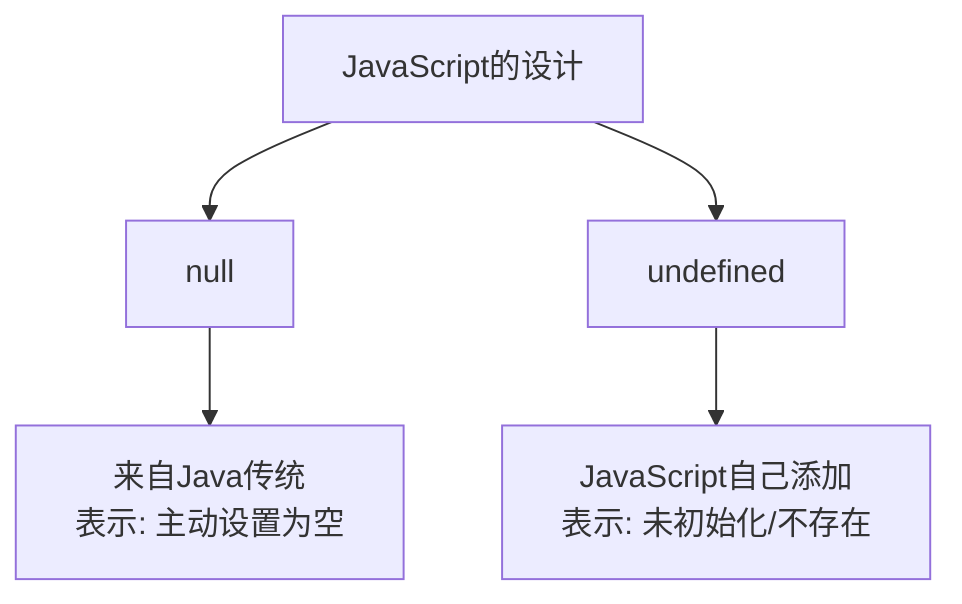

+++
title = "第2章 类型基础：原始类型与类型注解"
weight = 20
date = "2026-03-26T21:05:00+08:00"
type = "docs"
description = ""
isCJKLanguage = true
draft = false
+++

# 第 2 章 类型基础：原始类型与类型注解

## 2.1 类型概述

在正式进入TypeScript的类型世界之前，我们需要先了解一下"类型"这个概念。

想象你是一个仓库管理员。你的仓库里有很多货物，你需要知道每个货物是什么类型的——哪些是水果、哪些是电器、哪些是易碎品。只有知道货物的类型，你才能正确地处理它们。

编程世界里的"类型"也是一样的道理。**类型告诉你这个数据是什么、它能做什么、不能做什么**。

---

### 2.1.1 JavaScript 原始类型

JavaScript有7种**原始类型**（Primitive Types），也可以叫"基本类型"——它们是语言中最底层的数据类型。

```javascript
// 7种原始类型一览
const str = "你好";          // string - 字符串
const num = 42;              // number - 数字
const big = 9007199254740991n; // bigint - 大整数
const bool = true;          // boolean - 布尔值
const nothing = undefined;   // undefined - 未定义
const empty = null;         // null - 空值
const sym = Symbol("id");   // symbol - 唯一标识符
```

这7种原始类型可以分为两组：

**有实际值**的：string、number、bigint、boolean、symbol
**空/无值**的：undefined、null

在TypeScript中，这7种原始类型都有对应的类型注解：

```typescript
let name: string = "孙悟空";
let age: number = 500;
let bigNumber: bigint = 9007199254740991n;
let isMonkey: boolean = true;
let notYetDefined: undefined = undefined;
let emptyValue: null = null;
let uniqueId: symbol = Symbol("id");

console.log(typeof name);         // string
console.log(typeof age);          // number
console.log(typeof bigNumber);     // bigint
console.log(typeof isMonkey);      // boolean
console.log(typeof notYetDefined); // undefined
console.log(typeof emptyValue);    // object （这是JS的bug，null显示为object）
console.log(typeof uniqueId);      // symbol
```

> 💡 **小知识**：为什么`typeof null`返回`'object'`而不是`'null'`？这是JavaScript的第一个bug，源于早期实现的一个历史遗留问题。具体原因在第一章已经讲过，这里就不再赘述。记住这个"坑"就好，以后面试可能会考。

---

### 2.1.2 TypeScript 新增类型

除了JavaScript的7种原始类型，TypeScript还额外提供了几种类型，它们只存在于TypeScript的编译时，不存在于JavaScript运行时。

#### 2.1.2.1 any、unknown、void、never（无对应 JS 运行时概念）

这四个类型是TypeScript特有的，它们在编译后会被完全"擦除"：

```typescript
// any：任意类型，相当于"关闭类型检查"
let anything: any = "可以是任何东西";
anything = 42;          // 完全OK
anything = true;        // 也OK
anything = null;        // 都可以

// unknown：未知类型，比any更安全
let unknown: unknown = "这是一个未知类型的值";
// unknown.toUpperCase(); // 错误！unknown类型不能直接操作
// 必须先检查类型才能使用
if (typeof unknown === "string") {
    console.log(unknown.toUpperCase()); // OK！
}

// void：表示函数没有返回值（或返回undefined）
function sayHello(): void {
    console.log("你好！");
    // 没有return语句，等价于 return undefined
}

// never：表示永远不会返回（死循环或抛异常）
function throwError(): never {
    throw new Error("出错了！");
}

function infiniteLoop(): never {
    while (true) {
        // 永远不停止
    }
}
```

#### 2.1.2.2 enum：TS 新增的语法，编译为 JS 对象（IIFE），JS 本身无 enum 关键字

`enum`（枚举）是TypeScript新增的语法，在JavaScript中没有对应的概念：

```typescript
// 数字枚举
enum Direction {
    Up,    // 0
    Down,  // 1
    Left,  // 2
    Right  // 3
}

console.log(Direction.Up);    // 0
console.log(Direction[0]);   // "Up" —— 反向映射

// 字符串枚举
enum Status {
    Success = "SUCCESS",
    Error = "ERROR",
    Loading = "LOADING"
}

console.log(Status.Success); // "SUCCESS"
```

编译成JavaScript后：

```javascript
// 编译后的JavaScript
var Direction;
(function (Direction) {
    Direction[Direction["Up"] = 0] = "Up";
    Direction[Direction["Down"] = 1] = "Down";
    Direction[Direction["Left"] = 2] = "Left";
    Direction[Direction["Right"] = 3] = "Right";
})(Direction || (Direction = {}));
```

可以看到，TypeScript的枚举被编译成了一个**立即执行函数表达式（IIFE）**，里面有一个对象。

#### 2.1.2.3 元组：TS 新增的纯类型构造（固定长度 + 固定位置类型），JS 无对应概念，TS 用 Array 实现

**元组**（Tuple）是TypeScript特有的类型，用于表达固定长度、每个位置有固定类型的数组：

```typescript
// 元组类型：固定长度 + 固定位置类型
let person: [string, number] = ["孙悟空", 500];

console.log(person[0]); // "孙悟空" —— 第一位是string
console.log(person[1]); // 500 —— 第二位是number

// person[2] = true; // 错误！元组长度是固定的
// person = [1, 2, 3]; // 错误！长度必须是2
```

元组在JavaScript中没有对应概念，TypeScript用**数组**来实现它，但加上了类型约束。

---

### 2.1.3 类型注解与类型推断

#### 2.1.3.1 显式注解：`const a: number = 5`

显式类型注解就是你**明确告诉TypeScript这个变量是什么类型**：

```typescript
// 显式注解：变量名后面加冒号和类型
const name: string = "猪八戒";
const age: number = 3000;
const height: number = 1.85;
const isMarried: boolean = false;
```

#### 2.1.3.2 隐式推断：`const a = 5` → 推导为 number

TypeScript会根据变量的**初始值**自动推导出类型：

```typescript
// 隐式推断：TypeScript会根据=右边的值推断变量类型
const name = "沙和尚";     // TypeScript推断：string
const age = 800;           // TypeScript推断：number
const isStrong = true;     // TypeScript推断：boolean

// 推断后，类型就固定了，不能再赋值为其他类型
name = 123;  // 错误！Type 'number' is not assignable to type 'string'
```

#### 2.1.3.3 推断失败时 noImplicitAny 报错

如果TypeScript无法推断出类型，而且你没有显式注解，就会报`noImplicitAny`错误：

```typescript
// 没有初始值，也没有注解，TS无法推断类型
function process(value) {
    console.log(value.toUpperCase()); // 错误！value是any类型
}

// 解决方式1：加类型注解
function process(value: string) {
    console.log(value.toUpperCase()); // OK
}

// 解决方式2：加初始值
function process() {
    const value = "hello";
    console.log(value.toUpperCase()); // OK
}
```


## 2.2 string、number、boolean 类型

这三个类型是TypeScript（也是JavaScript）中最常用的基础类型。它们看起来简单，但里面有一些细节值得好好聊聊。

---

### 2.2.1 string：字符串字面量类型 vs string、模板字符串类型推导、常用方法返回类型

**string**类型代表字符串，这没什么好多说的。但有几个点需要注意：

#### 字符串字面量类型 vs string

在TypeScript中，`string`代表**所有字符串**。而**字符串字面量类型**只代表某个具体的字符串：

```typescript
// string：所有字符串的总称
let greeting: string = "你好";
greeting = "Hello";      // OK，任何字符串都行
greeting = "Bonjour";    // OK

// 字符串字面量类型：只代表某个具体字符串
let specificGreeting: "你好" = "你好";
specificGreeting = "Hello"; // 错误！只能赋值"你好"

type Direction = "Up" | "Down" | "Left" | "Right";
let move: Direction = "Up";
move = "Down";      // OK
move = "Diagonal";  // 错误！"Diagonal"不在允许的范围内
```

字符串字面量类型常用于**限制只能取特定值的场景**，比如方向、状态、错误码等。

#### 模板字符串类型推导

TypeScript可以推导模板字符串的类型：

```typescript
// 模板字符串的类型推导
let name = "孙悟空";
let age = 500;
let introduction = `我是${name}，今年${age}岁`;
console.log(introduction); // 我是孙悟空，今年500岁
// 注释：introduction的类型是string

// 复杂的模板字符串
type Environment = "development" | "production" | "test";
const url = `https://api.example.com/${"development"}/users` as const;
// 注释：url的类型是 "https://api.example.com/development/users"（字面量类型）
console.log(url); // https://api.example.com/development/users
```

#### 常用方法返回类型

字符串的很多方法会返回新的字符串，TypeScript能正确推导：

```typescript
const original = "Hello World";
const upper = original.toUpperCase();
console.log(upper); // HELLO WORLD
// 注释：upper的类型是string

const lower = original.toLowerCase();
console.log(lower); // hello world
// 注释：lower的类型是string

const replaced = original.replace("World", "TypeScript");
console.log(replaced); // Hello TypeScript
// 注释：replaced的类型是string

const sliced = original.slice(0, 5);
console.log(sliced); // Hello
// 注释：sliced的类型是string

const trimmed = "  hello  ".trim();
console.log(trimmed); // hello
// 注释：trimmed的类型是string
```

---

### 2.2.2 number：整数字面量 vs 浮点数、NaN 的类型问题、数值边界常量

**number**类型代表JavaScript中的所有数字——包括整数和浮点数。

#### 整数字面量 vs 浮点数

在TypeScript中，整数和浮点数都使用同一个`number`类型：

```typescript
let integer: number = 42;
let floating: number = 3.14159;
let negative: number = -273.15;

console.log(integer);   // 42
console.log(floating);  // 3.14159
console.log(negative); // -273.15

// 科学计数法
let scientific: number = 1.5e10;
console.log(scientific); // 15000000000
```

#### NaN 的类型问题

还记得第一章说的NaN吗？NaN的类型是`number`，这很反直觉，但TS忠实地反映了JS的这个特点：

```typescript
let nan: number = NaN;
console.log(nan); // NaN
console.log(typeof nan); // number

// 产生NaN的操作
let result: number = parseInt("hello");
console.log(result); // NaN
console.log(typeof result); // number

// NaN的类型检查
function processNumber(n: number) {
    if (Number.isNaN(n)) {
        console.log("这是个NaN！");
    } else {
        console.log("这是正常的数字：" + n);
    }
}

processNumber(NaN);       // 这是个NaN！
processNumber(42);        // 这是正常的数字：42
```

#### 数值边界常量

JavaScript为number类型定义了一些边界常量：

```typescript
// 最大安全整数
console.log(Number.MAX_SAFE_INTEGER); // 9007199254740991
// 注释：超过这个数的整数运算可能不精确

// 最大值
console.log(Number.MAX_VALUE); // 1.7976931348623157e+308
// 注释：JavaScript能表示的最大数字

// 最小值（最接近0的正数）
console.log(Number.MIN_VALUE); // 5e-324
// 注释：JavaScript能表示的最接近0的正数

// 正无穷
console.log(Number.POSITIVE_INFINITY); // Infinity
// 注释：比MAX_VALUE还大的数

// 负无穷
console.log(Number.NEGATIVE_INFINITY); // -Infinity
// 注释：比-MAX_VALUE还小的数

// 安全整数检查
function isSafeInteger(n: number): boolean {
    return Number.isSafeInteger(n);
}

console.log(isSafeInteger(9007199254740991)); // true
console.log(isSafeInteger(9007199254740992)); // false —— 超过安全范围！
```

---

### 2.2.3 boolean：字面量 true vs boolean、`const` 推断 vs `let` 推断

**boolean**类型只有两个值：`true`和`false`。

#### 字面量 true vs boolean

跟字符串一样，boolean也有字面量类型：

```typescript
// boolean类型：可以是true或false
let isActive: boolean = true;
isActive = false;  // OK

// boolean字面量类型：只能是true或只能是false
let isLoading: true = true;
isLoading = false; // 错误！只能是true

type Bit = 0 | 1;
let bit: Bit = 0;
bit = 1;  // OK
bit = 2;  // 错误！
```

#### `const` 推断 vs `let` 推断

用`const`声明的变量，TypeScript会推断为**字面量类型**；用`let`声明的变量，TypeScript会推断为**宽泛的类型**：

```typescript
// const声明：推断为字面量类型
const isOnline = true;
console.log(typeof isOnline); // boolean
// 注释：isOnline的类型是true（字面量类型），不是boolean

const status = "loading";
console.log(status); // loading
// 注释：status的类型是"loading"（字面量类型），不是string

// let声明：推断为宽泛类型
let isEnabled = true;
console.log(typeof isEnabled); // boolean
// 注释：isEnabled的类型是boolean，不是true

let name = "Tom";
console.log(name); // Tom
// 注释：name的类型是string，不是"Tom"
```

这个区别的实际意义：

```typescript
const constBoolean = true;
let letBoolean: boolean = true;

// constBoolean只能赋值true
// constBoolean = false; // 错误！

// letBoolean可以是true或false
letBoolean = false; // OK

// 函数参数的类型收窄
function checkStatus(status: "success" | "error" | "loading") {
    console.log("当前状态：" + status);
}

const currentStatus = "success";
checkStatus(currentStatus); // OK！currentStatus类型是"success"

let dynamicStatus = "success";
checkStatus(dynamicStatus); // 错误！因为dynamicStatus是string类型
checkStatus("success");    // OK！字面量直接传
checkStatus(dynamicStatus as "success"); // OK！强制类型转换
```


## 2.3 null 与 undefined

`null`和`undefined`是JavaScript（和TypeScript）里最让人困惑的两个"空"值。它们长得像，名字也像，但语义完全不同。

---

### 2.3.1 两种空值的语义区别

#### 2.3.1.1 null：语义为空，通常代表「这里本应有值，但当前没有」

`null`表示**"这里应该有值，但是现在是空的"**。它是一个**主动**赋值的"空"。

典型使用场景：
- API返回的数据中，某个字段本应有值但目前没有
- 数据库中的空字段
- 函数期望返回一个对象，但找不到时返回null

```typescript
// API返回的用户数据
interface User {
    name: string;
    email: string | null;  // email可能是null——用户没填
}

const user: User = {
    name: "孙悟空",
    email: null  // 用户没提供邮箱
};

console.log(user.name);  // 孙悟空
console.log(user.email); // null —— 本应有值，但没有
```

#### 2.3.1.2 undefined：表示「未赋值」或「属性/参数不存在」

`undefined`表示**"这个值根本不存在或还没被赋值"**。它是一个**被动**的状态。

典型使用场景：
- 变量声明但未初始化
- 访问对象不存在的属性
- 函数没有返回值
- 函数调用时没有传参数

```typescript
// 变量声明但未初始化
let pending: string;
console.log(pending); // undefined —— 还没赋值

// 访问不存在的属性
const obj = { name: "猪八戒" };
console.log(obj.age); // undefined —— age属性不存在

// 函数没有传参
function greet(name: string) {
    console.log(name); // 如果不传参，name是undefined
}
greet(); // undefined

// 函数没有返回值
function noReturn(): void {
    console.log("我只是打了个招呼");
}
const result = noReturn();
console.log(result); // undefined
```

---

### 2.3.2 为什么 null 和 undefined 同时存在

#### 2.3.2.1 历史原因：null 来自 Java 的设计传统；undefined 是 JS 自己添加的

JavaScript早期借鉴了Java的设计，包括`null`的概念（Java里也有null）。但JavaScript后来发现需要区分"还没有赋值"和"已经明确为空"这两种情况，于是引入了`undefined`。



#### 2.3.2.2 两者并存反映了 JS 早期设计的不一致性；现代 TS 项目通常倾向于统一使用 undefined（或通过 strictNullChecks 强制显式处理）

很多现代TypeScript项目会**统一使用undefined**来表示"空"，避免null和undefined混用造成的混乱：

```typescript
// 推荐的实践：统一使用undefined
interface User {
    name: string;
    email?: string;  // 可选属性，等价于 email: string | undefined
}

// 或者显式写
interface User2 {
    name: string;
    email: string | undefined;
}
```

> 💡 **经验之谈**：在现代TypeScript项目中，**推荐使用undefined来表示"空"**，避免使用null。这样可以减少混淆——undefined表示"还没值"或"没有这个属性"，语义更清晰。

---

### 2.3.3 strictNullChecks 的意义

#### 2.3.3.1 关闭时：所有类型默认可以赋值为 null/undefined

当`strictNullChecks: false`时，TypeScript对null和undefined非常宽容——几乎所有类型都可以是null或undefined：

```typescript
// strictNullChecks: false 时
let name: string = null;   // OK！
let age: number = undefined; // OK！
let isActive: boolean = null; // OK！
```

#### 2.3.3.2 开启后（推荐）：必须显式声明或使用联合类型

当`strictNullChecks: true`时，TypeScript会严格要求你处理null和undefined：

```json
// tsconfig.json
{
    "compilerOptions": {
        "strictNullChecks": true
    }
}
```

```typescript
// strictNullChecks: true 时
let name: string = null;   // 错误！string不能是null
let age: number = undefined; // 错误！number不能是undefined

// 正确的写法：必须显式声明
let name: string | null = null;
let age: number | undefined = undefined;
```

开启`strictNullChecks`的好处：
1. **强制你思考边界情况**——当你声明一个可能是null/undefined的值时，你必须显式处理
2. **减少运行时错误**——很多`Cannot read property 'xxx' of null`的错误在编译时就能发现
3. **代码更清晰**——一看就知道哪些值可能是空的

```typescript
// strictNullChecks: true 下，处理可能为null的值有两种常见方式：

// 方式1：使用条件判断（显式检查）
function getLength(str: string | null): number {
    if (str !== null) {
        return str.length; // TS知道str是string，可以安全访问
    }
    return 0;
}

// 方式2：使用可选链 + 空值合并（更简洁）
function getLength2(str: string | null): number {
    return str?.length ?? 0; // str为null时返回0
}

console.log(getLength("hello"));   // 5 —— 正常字符串
console.log(getLength(null));      // 0 —— null时返回0
console.log(getLength2("world"));  // 5 —— 正常字符串
console.log(getLength2(null));      // 0 —— null时返回0
```

---

### 2.3.4 可选链 `?.` 与空值合并 `??`

#### 2.3.4.1 `?.`：链上节点为 null/undefined 时返回 undefined

可选链（Optional Chaining）是ES2020引入的语法，它可以安全地访问深层嵌套的属性：

```typescript
interface Person {
    name: string;
    address?: {
        city: string;
        zip?: string;
    };
}

const person: Person = {
    name: "孙悟空",
    address: {
        city: "花果山"
    }
};

// 传统写法：需要一层层判断
function getCity(person: Person): string {
    if (person.address) {
        if (person.address.city) {
            return person.address.city;
        }
    }
    return "未知";
}

// 可选链写法：一气呵成
function getCity2(person: Person): string {
    return person.address?.city ?? "未知";
}

console.log(getCity(person));   // 花果山
console.log(getCity2({ name: "猪八戒" })); // 未知 —— 没有address
```

可选链也可以用于方法调用和数组访问：

```typescript
// 方法调用
obj.method?.();  // 如果obj.method存在，调用它；否则返回undefined

// 数组访问
arr?.[0];        // 如果arr存在且不为null/undefined，访问第一个元素

// 动态属性
obj?.[key];      // 如果obj存在，访问动态属性key
```

#### 2.3.4.2 `??`：仅对 null/undefined 生效；`||` 对所有假值生效

空值合并运算符（Nullish Coalescing）是ES2020引入的另一个语法：

```typescript
// ??：只在值为null或undefined时使用默认值
let a = null ?? "默认值";    // "默认值"
let b = undefined ?? "默认值"; // "默认值"
let c = 0 ?? "默认值";       // 0 —— 0不是null/undefined
let d = "" ?? "默认值";      // "" —— 空字符串不是null/undefined
let e = false ?? "默认值";    // false —— false不是null/undefined

// ||：在值为任何"假值"时都使用默认值
let f = null || "默认值";    // "默认值"
let g = undefined || "默认值"; // "默认值"
let h = 0 || "默认值";        // "默认值" —— 0是假值！
let i = "" || "默认值";       // "默认值" —— 空字符串是假值！
let j = false || "默认值";    // "默认值" —— false是假值！
```

> 💡 **什么时候用哪个**：当你想区分"没有值（null/undefined）"和"有值但可能是假值（0、""、false）"时，用`??`。当你只关心"是不是假值"时，用`||`。

```typescript
// 典型场景：配置项
const config = {
    timeout: 0,         // 0ms超时（特殊含义：立即超时）
    retries: "",       // 重试次数为空（特殊含义：不重试）
    debug: false        // 调试模式关闭
};

// 用 ?? —— 保留0和""这些有效值
const timeout1 = config.timeout ?? 3000;  // 0 —— 保留有效值0
const retries1 = config.retries ?? 3;      // "" —— 保留有效值""

// 用 || —— 会错误地覆盖0和""
const timeout2 = config.timeout || 3000;  // 3000 —— 0被覆盖了！错误！
const retries2 = config.retries || 3;      // 3 —— ""被覆盖了！错误！
```


## 2.4 symbol 与 bigint

这两个类型虽然不常用，但在某些场景下非常重要。

---

### 2.4.1 symbol 类型

**symbol**是ES6引入的原始类型，代表一个**唯一的、不可变的标识符**。

#### 2.4.1.1 创建：`const sym = Symbol('description')`，每个 symbol 唯一

```typescript
// 创建symbol
const sym1 = Symbol("id");
const sym2 = Symbol("id");

console.log(sym1);        // Symbol(id)
console.log(sym2);        // Symbol(id)
console.log(sym1 === sym2); // false —— 每次创建的symbol都是唯一的！
console.log(typeof sym1);  // symbol

// symbol可以作为对象的键
const obj: { [key: symbol]: number } = {};
const myKey = Symbol("myKey");
obj[myKey] = 42;
console.log(obj[myKey]); // 42
```

#### 2.4.1.2 Well-Known Symbols：Symbol.iterator、Symbol.toStringTag 等

JavaScript定义了一些内置的symbol，用于控制对象的行为：

```typescript
// Symbol.iterator：让对象可迭代
const collection = {
    items: [1, 2, 3],
    [Symbol.iterator]() {
        let index = 0;
        return {
            next: () => {
                if (index < this.items.length) {
                    return { value: this.items[index++], done: false };
                }
                return { value: undefined, done: true };
            }
        };
    }
};

for (const item of collection) {
    console.log(item); // 1, 2, 3
}

// Symbol.toStringTag：自定义对象的toString标签
const person = {
    name: "孙悟空",
    [Symbol.toStringTag]: "Person"
};
console.log(person.toString()); // [object Person]

// Symbol.hasInstance：自定义instanceof行为
class MyArray {
    static [Symbol.hasInstance](instance) {
        return Array.isArray(instance);
    }
}
console.log([] instanceof MyArray); // true
```

#### 2.4.1.3 为什么需要 symbol：JavaScript 对象的键只能是字符串，存在字符串冲突风险

在ES6之前，对象的键只能是字符串。这会导致一些问题：

```javascript
// JavaScript的对象键是字符串
const obj = {};
obj["name"] = "孙悟空";
obj["name"] = "猪八戒"; // 覆盖了！
console.log(obj.name); // "猪八戒"

// 使用symbol作为键可以避免冲突
const status = Symbol("status");
obj[status] = "active";
console.log(obj[status]); // "active"
console.log(obj["status"]); // undefined —— 不同的键！
```

symbol的应用场景：
1. **定义类的私有成员**（虽然不是真正的私有，但symbol键不会意外访问）
2. **定义唯一常量**
3. **自定义迭代行为**

```typescript
// symbol用于私有属性（命名约定，非真正私有）
const _name = Symbol("name");
const _age = Symbol("age");

class Person {
    [_name]: string;
    [_age]: number;

    constructor(name: string, age: number) {
        this[_name] = name;
        this[_age] = age;
    }

    greet() {
        console.log(`我是${this[_name]}，今年${this[_age]}岁`);
    }
}

const person = new Person("孙悟空", 500);
person.greet(); // 我是孙悟空，今年500岁
// person._name 访问不到 —— _name是symbol类型
```

---

### 2.4.2 bigint 类型

**bigint**是ES2020引入的原始类型，用于表示**比Number.MAX_SAFE_INTEGER还大的整数**。

#### 2.4.2.1 字面量语法：`100n`，与 number 完全不兼容

```typescript
// bigint字面量：在数字后面加n
const bigNumber = 9007199254740993n;
console.log(bigNumber); // 9007199254740993n
console.log(typeof bigNumber); // bigint

// bigint与number完全不兼容
let num: number = 42;
let big: bigint = 42n;

num = big;  // 错误！number和bigint不兼容
big = num;  // 错误！

// 可以显式转换
num = Number(big);  // OK
big = BigInt(num);  // OK
```

#### 2.4.2.2 必要性：超过 Number.MAX_SAFE_INTEGER 的整数运算精度问题

JavaScript的`number`类型使用64位浮点数表示，整数的安全范围只有`-(2^53-1)`到`2^53-1`，即从`-Number.MAX_SAFE_INTEGER`到`+Number.MAX_SAFE_INTEGER`：

```typescript
console.log(Number.MAX_SAFE_INTEGER); // 9007199254740991

// 超过安全范围的整数运算会丢失精度
console.log(9007199254740991 + 2); // 9007199254740992 —— 实际上应该是 9007199254740993！
console.log(9007199254740991 + 3); // 9007199254740994 —— 实际上应该是 9007199254740994！

// 使用bigint可以安全处理大整数
console.log(9007199254740991n + 2n); // 9007199254740993n —— 精确！
console.log(9007199254740991n + 3n); // 9007199254740994n —— 精确！
```

bigint支持的运算：

```typescript
let a: bigint = 100n;
let b: bigint = 50n;

console.log(a + b);   // 150n —— 加法
console.log(a - b);   // 50n —— 减法
console.log(a * b);   // 5000n —— 乘法
console.log(a / b);   // 2n —— 除法（取整）
console.log(a % b);   // 0n —— 取余
console.log(a ** 2n); // 10000n —— 幂运算

// 比较运算：bigint支持大小比较和相等比较，都返回布尔值
console.log(a > b);      // true —— 大小比较（>）
console.log(a === b);     // false —— 相等比较（100n !== 50n）
console.log(a == b);      // false —— 宽松相等比较
console.log(a > 50n);     // true —— 可以和bigint字面量比较大小
console.log(10n === 10n); // true —— 相同的bigint字面量相等比较
```


## 2.5 typeof 运算符

`typeof`是JavaScript的一个运算符，用于**在运行时获取值的类型**。TypeScript对`typeof`进行了扩展，增加了在**类型位置**使用的功能。

---

### 2.5.1 运行时 typeof

#### 2.5.1.1 返回 'string'、'number'、'boolean'、'object'、'function' 等

`typeof`在JavaScript中是一个一元运算符，用于获取值的运行时类型：

```typescript
// typeof的基础用法
console.log(typeof "hello");      // "string"
console.log(typeof 123);         // "number"
console.log(typeof true);        // "boolean"
console.log(typeof undefined);    // "undefined"
console.log(typeof null);        // "object" —— 注意！这是JS的历史bug
console.log(typeof { name: "Tom" }); // "object"
console.log(typeof [1, 2, 3]);   // "object" —— 数组也是object
console.log(typeof function() {}); // "function"
console.log(typeof Symbol("id")); // "symbol"
console.log(typeof 100n);        // "bigint"
```

#### 2.5.1.2 注意：typeof null === 'object'（JS 历史 bug，TS 不受影响）

这是JavaScript最著名的bug之一：

```typescript
console.log(typeof null); // "object"

console.log(null instanceof Object); // false

// 在类型推断中，TypeScript不会把这个bug带进来
let empty: null = null;
console.log(typeof empty); // 在TS中，null的类型仍然是null，不是object
```

---

### 2.5.2 类型位置使用 typeof

#### 2.5.2.1 `type A = typeof someVariable`

这是TypeScript的一个强大功能——可以用变量的值来推断类型：

```typescript
// 用typeof获取变量的类型
const person = {
    name: "孙悟空",
    age: 500,
    isMarried: false
};

type Person = typeof person;
// 注释：Person = { name: string; age: number; isMarried: boolean }

// 新变量可以直接用这个类型
const anotherPerson: Person = {
    name: "猪八戒",
    age: 3000,
    isMarried: true
};

console.log(anotherPerson.name); // 猪八戒
```

#### 2.5.2.2 `as const` + typeof：获得最窄字面量类型

如果想获取**最窄的类型**（每个属性都是字面量类型），可以用`as const`：

```typescript
// 不使用as const
const status = "loading";
type Status = typeof status;
// 注释：Status = string —— 太宽泛了

// 使用as const
const statusConst = "loading" as const;
type StatusConst = typeof statusConst;
// 注释：StatusConst = "loading" —— 最窄的字面量类型！

// 用as const获取整个对象的字面量类型
const config = {
    apiUrl: "https://api.example.com",
    timeout: 5000,
    retries: 3
} as const;

type Config = typeof config;
// 注释：Config = {
//          readonly apiUrl: "https://api.example.com";
//          readonly timeout: 5000;
//          readonly retries: 3;
//        }
```

这个技巧常用于定义配置对象和常量：

```typescript
// 应用场景：定义路由路径
const ROUTES = {
    HOME: "/",
    ABOUT: "/about",
    USER_PROFILE: "/user/:id",
    SETTINGS: "/settings"
} as const;

type Route = typeof ROUTES[keyof typeof ROUTES];
// 注释：Route = "/" | "/about" | "/user/:id" | "/settings"

function navigate(route: Route) {
    console.log("跳转到：" + route);
}

navigate("/");              // OK
navigate("/user/123");       // OK —— 符合/user/:id模式
navigate("/invalid");        // 错误！不在允许的路由中
```

---

> 📝 **本节小结**：`typeof`运算符在运行时返回JavaScript类型的字符串（'string'、'number'、'boolean'等），但注意`typeof null === 'object'`是JS的历史bug。TypeScript扩展了`typeof`，可以在类型位置使用——`type A = typeof someVariable`会获取变量的类型。配合`as const`使用可以获得最窄的字面量类型，这个技巧常用于定义配置对象、路由等常量。

---

## 本章小结

本章深入学习了TypeScript的类型基础，重点是7种原始类型和类型注解。

**JavaScript的7种原始类型**：string、number、bigint、boolean、undefined、null、symbol。它们是语言的最底层数据类型。其中`null`和`undefined`的语义不同——null表示"主动设置为空"，undefined表示"未赋值/不存在"。

**TypeScript新增的类型**：any、unknown、void、never（编译时存在，运行时擦除），以及enum和元组。

**类型注解方式**：显式注解（`let x: number = 5`）和隐式推断（`let x = 5`推断为number）。`const`声明会推断为字面量类型，`let`声明会推断为宽泛类型。

**string/number/boolean的细节**：字符串有字面量类型（`"Up" | "Down"`），number包括NaN（类型仍是number），bigint用于大整数运算。boolean也有字面量类型`true`/`false`。

**null/undefined处理**：推荐统一使用undefined，开启strictNullChecks强制显式处理。`?.`可选链安全访问深层属性，`??`空值合并只在值为null/undefined时使用默认值，不会被0、空字符串等假值误导。

**symbol和bigint**：symbol用于创建唯一标识符，可以作为对象键避免字符串冲突；bigint用于超过Number.MAX_SAFE_INTEGER的大整数，与number类型完全不兼容。

**typeof运算符**：运行时返回类型字符串，TypeScript中可在类型位置使用`typeof variable`获取变量类型，配合`as const`获取最窄字面量类型。

下一章我们将学习TypeScript的"特殊类型"——any、unknown、void、never，以及枚举和元组。这些类型虽然不像string/number那么常见，但在实际开发中扮演着重要角色。


