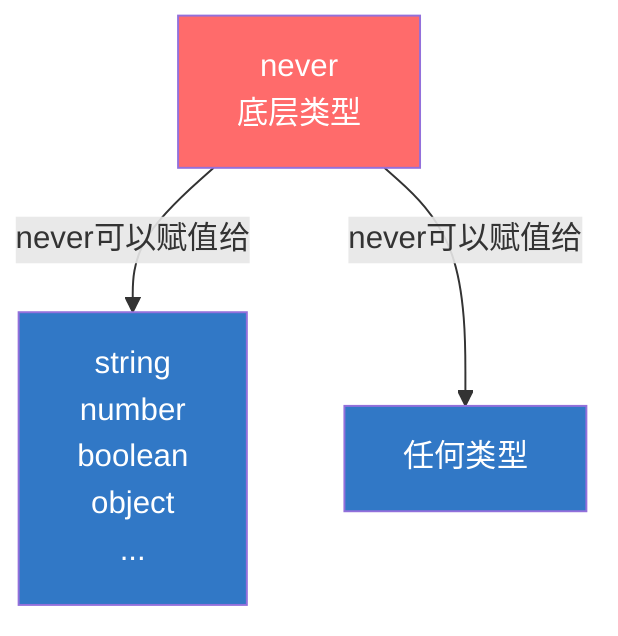
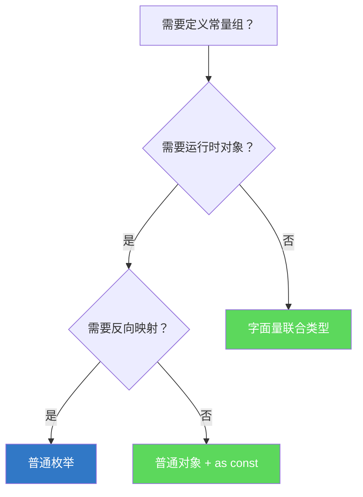

+++
title = "第3章 特殊类型与枚举"
weight = 30
date = "2026-03-26T21:05:00+08:00"
type = "docs"
description = ""
isCJKLanguage = true
draft = false
+++

# 第 3 章 特殊类型与枚举

## 3.1 any 类型

`any`是TypeScript中最"特殊"的类型——它是所有类型的超集，代表"任意类型"。使用`any`等于告诉TypeScript："这一块我说了算，不要检查我。"

---

### 3.1.1 any 的声明与特性

#### 3.1.1.1 绕过所有类型检查：任意操作均不报错

当一个变量被声明为`any`类型时，TypeScript会放弃对它的所有类型检查：

```typescript
// 声明为any的变量可以进行任意操作
let chaotic: any = "hello";

chaotic = 42;                    // OK，赋值为数字
chaotic();                       // OK，当作函数调用
chaotic.toUpperCase();          // OK，当作字符串调用方法
chaotic.something.nonexistent;   // OK，访问不存在的属性链
chaotic[0] = "world";           // OK，当作数组使用
```

在`any`的字典里，没有"错误"这个词——它就是TypeScript世界里的绿灯侠，怎么折腾都行。

#### 3.1.1.2 any 的传染性（Type Contagion）：any 与其他类型参与运算时，结果自动变为 any

`any`有一个特性，就是它的"传染性"——只要一个运算中出现了`any`，结果就会变成`any`：

```typescript
// any的传染性示例
function process(x: number) {
    return x * 2;
}

let uncertain: any = "hello";
let result = process(uncertain); // result的类型是any！

// 函数参数为any，返回值也会变成any
function add(a: any, b: any): any {
    return a + b;
}

let sum = add(1, "2");
console.log(sum); // "12" —— 但sum的类型是any
// 注释：sum可以做任何操作，TS不会报错

// 数组中出现any，类型会"污染"整个数组
let arr: any[] = [1, "hello", true];
let first: number = arr[0]; // 编译通过，但arr[1]是字符串！
// first实际上是any，赋值给number有风险
```

这个传染性很危险——一旦代码中出现了`any`，它可能会"污染"周围的代码，让类型检查失效。

---

### 3.1.2 any vs object

#### 3.1.2.1 object：允许非原始类型，但不允许多数方法调用

`object`和`any`不同。`object`表示"任何非原始类型的值"（即对象、数组、函数），但不能调用原始类型的方法：

```typescript
let obj: object = { name: "Tom" };
obj.name;         // 错误！object类型不能访问属性

let arr: object = [1, 2, 3];
arr.push(4);      // 错误！object类型不能调用数组方法

// any可以，但object不行
let anything: any = { name: "Tom" };
anything.name;   // OK —— any不限制任何操作
```

#### 3.1.2.2 any：允许任意操作

总结一下`any`和`object`的区别：

```typescript
let value: any = "hello";
value.toUpperCase();    // OK —— any允许
value = 123;
value.toFixed(2);       // OK —— any允许
value.nonExistent();    // OK —— any允许

let obj2: object = "hello";
obj2.toUpperCase();    // 错误！object不允许调用字符串方法
```

---

### 3.1.3 为什么 any 仍然保留（渐进式类型的需要）

既然`any`这么危险，为什么TypeScript还要保留它？

答案是：**为了平滑的迁移体验**。

在实际项目中，可能需要很长时间才能把一个大型JavaScript项目完全迁移到TypeScript。在这个过渡期内，`any`是必不可少的——你可以先把一些关键的模块加上类型，其他的暂时用`any`，等有时间了再逐步完善。

```typescript
// 场景1：渐进式迁移
let userData: any = fetchUserData(); // 还没来得及定义User类型，先用any
// ... 等有了User类型后 ...
// let userData: User = fetchUserData();

// 场景2：处理来自第三方库的不确定数据
function handleCallback(data: any) {
    // 不知道data是什么，先用any顶上
}

// 场景3：快速原型开发
function quickHack() {
    let temp: any = getData(); // 先跑起来再说
    // ... 等有时间了再优化
}
```

`any`就像一把双刃剑——用好了是过渡期的好帮手，用不好就是类型安全的噩梦。

---

### 3.1.4 any 的合法使用场景与禁止使用场景

#### ✅ 合理的any使用场景

```typescript
// 1. 动态内容的类型未知时
const userInput: any = getUserInput(); // 不知道用户会输入什么

// 2. 第三方库没有类型定义时
const _ = (window as any).lodash || (window as any).underscore;

// 3. 类型需要运行时才知道时
function parseJSON(jsonString: string): any {
    return JSON.parse(jsonString); // JSON.parse返回的类型取决于JSON内容
}

// 4. 逐步迁移JS项目到TS时
let legacyData: any = getLegacyData();
```

#### ❌ 不合理的any使用场景（应该避免）

```typescript
// 1. 明明知道类型却懒得写
function processName(name: any) { // ← 应该用 string
    console.log(name.toUpperCase());
}

// 2. 为了"避免类型错误"滥用any
let value: any = someFunction(); // ← 如果知道返回类型，应该写明
```

#### 💡 tip：使用`unknown`代替`any`

如果不确定一个值的类型，推荐使用`unknown`而不是`any`——`unknown`更安全，因为它要求在使用前进行类型检查。

```typescript
// any：可以任意操作，不安全
let risky: any = "hello";
risky.toUpperCase(); // OK，但不安全

// unknown：必须先检查类型，更安全
let safe: unknown = "hello";
if (typeof safe === "string") {
    console.log(safe.toUpperCase()); // OK，必须先检查类型
}
```


## 3.2 unknown 类型

如果说`any`是一个"随心所欲"的类型，那`unknown`就是一个"谨慎保守"的类型。`unknown`和`any`长得像，但性格完全不同——**它要求你在使用前必须先搞清楚这个值是什么类型**。

---

### 3.2.1 unknown 的语义

#### 3.2.1.1 「类型未知，使用前必须检查」

`unknown`的核心语义是：**"我不知道这是什么类型，你用之前得先搞清楚"**。

这就像你去相亲对象家里，不知道茶几上那杯不明液体是什么——你得先闻一闻、问一问，才能决定喝不喝。

```typescript
let value: unknown;
value = "hello";
value = 42;
value = { name: "Tom" };
value = [1, 2, 3];
value = null;
// 注释：unknown可以接受任何值，跟any一样
```

#### 3.2.1.2 unknown 变量不能赋值给非 unknown 类型，不能直接调用方法

这是`unknown`和`any`最大的区别：

```typescript
let risky: any = "hello";
let safe: unknown = "hello";

let str1: string = risky;  // OK —— any可以赋值给任何类型
let str2: string = safe;   // 错误！unknown不能赋值给其他类型

risky.toUpperCase();        // OK —— any可以随意调用方法
safe.toUpperCase();         // 错误！unknown不能直接调用方法
```

---

### 3.2.2 unknown vs any 的核心区别

#### 3.2.2.1 any：允许任意操作（不安全）

```typescript
// any：想怎么用就怎么用
let value: any = "hello";
value.toUpperCase();        // OK
value.something.doesNotExist; // OK
value();                     // OK
```

#### 3.2.2.2 unknown：禁止任意操作，必须先收窄（安全）

```typescript
// unknown：必须先"收窄"类型
let value: unknown = "hello";

// 收窄后就可以使用了
if (typeof value === "string") {
    console.log(value.toUpperCase()); // OK！在if分支里，TS知道value是string
}
```

---

### 3.2.3 unknown 的收窄手段

#### 3.2.3.1 typeof、instanceof、自定义类型守卫（`value is Type`）、in 操作符

当一个值的类型是`unknown`时，你需要通过**类型收窄**（Type Narrowing）来缩小它的类型范围，然后才能安全使用。

```typescript
// 1. typeof收窄
function processValue(value: unknown) {
    if (typeof value === "string") {
        console.log(value.toUpperCase()); // OK，value是string
    } else if (typeof value === "number") {
        console.log(value.toFixed(2)); // OK，value是number
    } else if (typeof value === "boolean") {
        console.log(value ? "真" : "假"); // OK，value是boolean
    }
}

processValue("hello"); // HELLO
processValue(3.14159); // 3.14
processValue(true);    // 真
```

```typescript
// 2. instanceof收窄（用于类）
class Dog {
    bark() { console.log("汪汪汪！"); }
}
class Cat {
    meow() { console.log("喵喵喵！"); }
}

function speak(animal: unknown) {
    if (animal instanceof Dog) {
        animal.bark(); // OK，animal是Dog
    } else if (animal instanceof Cat) {
        animal.meow(); // OK，animal是Cat
    }
}
```

```typescript
// 3. 自定义类型守卫（value is Type）
function isString(value: unknown): value is string {
    return typeof value === "string";
}

function process(value: unknown) {
    if (isString(value)) {
        console.log(value.toUpperCase()); // OK
    }
}
```

```typescript
// 4. in操作符收窄
// in操作符检查对象是否包含某个属性名，配合联合类型使用才能收窄
interface Circle {
    kind: "circle";
    radius: number;
}
interface Rectangle {
    kind: "rectangle";
    width: number;
    height: number;
}

function processShape(shape: Circle | Rectangle | unknown) {
    if ("radius" in shape) {
        // 在这个分支里，TS知道shape有radius属性，收窄为Circle
        console.log("这是一个圆形，半径：" + shape.radius);
    } else if ("width" in shape) {
        console.log("这是一个矩形，宽：" + shape.width + "，高：" + shape.height);
    }
}
```

#### 3.2.3.2 相等性收窄（Equality Narrowing）+ 判别属性：可辨识联合的标准收窄方式

相等性收窄是一个很有用的技巧——通过比较操作，TypeScript可以推断出更窄的类型：

```typescript
// 相等性收窄
function process(value: unknown, target: string | number) {
    if (value === target) {
        // 在这个分支里，TS知道value和target是同一个类型
        console.log(value); // value的类型被收窄了
    }
}

// switch语句也可以
function classify(value: unknown): string {
    switch (value) {
        case "success":
            return "成功";
        case "error":
            return "错误";
        case null:
            return "空值";
        case undefined:
            return "未定义";
        default:
            return "其他类型";
    }
}
```

**判别属性 + 相等性判断：可辨识联合的标准收窄方式**

结合判别属性（discriminant）和相等性判断，是**可辨识联合（Tagged Union）**最标准的收窄方式：

```typescript
// 用判别属性kind区分联合成员
interface Cat {
    kind: "cat";
    meow: () => void;
}
interface Dog {
    kind: "dog";
    bark: () => void;
}

type Animal = Cat | Dog;

function speak(animal: Animal) {
    if (animal.kind === "cat") {
        animal.meow(); // OK，animal被收窄为Cat
    } else {
        animal.bark(); // OK，animal被收窄为Dog
    }
}
// 注释：这是可辨识联合的标准收窄方式——用判别属性kind配合相等性判断来区分类型
```

---

### 3.2.4 unknown 的实际应用：JSON.parse 返回 unknown

`unknown`最经典的应用场景之一，就是`JSON.parse`的返回值类型。

在TypeScript中，`JSON.parse()`的签名是：

```typescript
// lib.es5.d.ts中的定义
function parse(s: string): unknown;
// 注释：JSON.parse返回unknown，因为不知道解析出来的是什么
```

这意味着你必须在使用返回值之前进行类型检查：

```typescript
// 不安全的方式（错误）
const data = JSON.parse('{ "name": "Tom" }');
console.log(data.name); // 错误！data是unknown，不能直接访问属性

// 安全的方式
const data = JSON.parse('{ "name": "Tom" }');

if (typeof data === "object" && data !== null) {
    // 检查data是对象且不是null
    if ("name" in data && typeof data.name === "string") {
        console.log(data.name); // OK！TS知道data.name是string
    }
}

// 更优雅的方式：自定义类型守卫
function isUser(obj: unknown): obj is { name: string; age?: number } {
    return (
        typeof obj === "object" &&
        obj !== null &&
        "name" in obj &&
        typeof (obj as { name: unknown }).name === "string"
    );
}

const parsed = JSON.parse('{ "name": "Tom", "age": 20 }');
if (isUser(parsed)) {
    console.log(parsed.name, parsed.age); // Tom, 20
}
```


## 3.3 void 类型

`void`通常用在函数的返回值上，表示"这个函数不返回有意义的值"。

---

### 3.3.1 void 作为函数返回类型

```typescript
// void返回类型的函数
function logMessage(message: string): void {
    console.log(message);
    // 没有return语句，或者return的是undefined
}

function warnUser(): void {
    console.log("警告！");
    return undefined; // void允许return undefined，但不建议
}

function noReturn(): void {
    while (true) {
        // 死循环，永远不返回
    }
}
```

---

### 3.3.2 为什么需要 void（已有 undefined）

#### 3.3.2.1 void 表示「返回了但没有有意义的值」（语义层面）

`void`和`undefined`在技术层面几乎一样，但语义不同：

```typescript
// undefined：表示"没有值"
function getUndefined(): undefined {
    return undefined;
}

// void：表示"有返回值，但这个值没有意义"
function getVoid(): void {
    console.log("我只是打印了一下");
    // 没有return，等同于 return undefined;
}
```

#### 3.3.2.2 void 主要用于回调函数场景：告诉调用方「不要使用这个返回值」

`void`的主要作用是**语义标记**——告诉开发者"这个函数的返回值是void，意味着你不应该使用它"：

```typescript
// 回调函数用void
function fetchData(callback: (data: string) => void) {
    const result = callback("some data");
    // 无论callback返回什么，result都是void
    // 这意味着fetchData不关心callback的返回值
}

fetchData((data) => {
    console.log(data);
    return "ignored"; // 返回值被忽略，TS不会警告
});
```

对比`undefined`：

```typescript
// 如果用undefined，语义就不一样了
function fetchData(callback: (data: string) => undefined) {
    // 这里暗示callback应该返回undefined
    // 但开发者可能会返回其他值
}
```

#### 3.3.3 void vs undefined 的行为差异

在大多数情况下，`void`和`undefined`可以互换。但有一个关键区别：

```typescript
// 1. void允许return任何值（但不推荐）
function testVoid(): void {
    return "hello"; // 编译通过，但建议不要这样写
}

// 2. void类型的函数返回值可以被忽略
function getValue(): void {
    return 123;
}

const result = getValue(); // result是void，可以赋值给任何void类型的变量
console.log(result); // 123 —— 值还是返回了，只是语义上被忽略
```

```typescript
// 3. strict模式下，void作为函数返回类型时有特殊行为
// 在React等框架中，void类型的回调参数有特殊含义
type ClickHandler = (event: MouseEvent) => void;

// 下面的调用是合法的
const handler: ClickHandler = (event: MouseEvent) => {
    // 不使用event，只关心"点击了"这个事实
    console.log("点击了！");
    // 不需要return anything
};
```


## 3.4 never 类型

`never`是TypeScript中最"奇怪"的类型——它表示**永远不可能存在**的值。

---

### 3.4.1 never 的语义

#### 3.4.1.1 永远不可能存在的值，never 变量不能被赋值

```typescript
let impossible: never;

// never类型的变量不能被赋值
impossible = "hello";  // 错误！never不能赋值
impossible = 123;     // 错误！
impossible = undefined; // 错误！
impossible = null;    // 错误！

// 什么类型都不能赋值给never
let anyValue: any = "hello";
impossible = anyValue; // 错误！即使是any也不能赋值给never
```

---

### 3.4.2 never 作为函数返回类型

#### 3.4.2.1 永不返回的函数（抛异常、死循环）：`function fail(): never { throw new Error() }` / `function loop(): never { while(true) {} }`

`never`用于表示一个函数**永远不会正常返回**——要么抛出异常，要么进入死循环：

```typescript
// 抛异常的函数
function throwError(message: string): never {
    throw new Error(message);
}

// 死循环
function infiniteLoop(): never {
    while (true) {
        console.log("永远不停...");
    }
}

// 永远不返回的递归函数
function recurse(): never {
    return recurse(); // 栈溢出之前永不返回
}
```

#### 3.4.2.2 注：`while(true) {}` 在语句层面返回 `undefined`（非 never）；never 仅出现在函数返回类型的语境下

```typescript
// 作为一个语句，while(true)返回undefined
function statement() {
    while (true) {}  // 这个函数永远不会执行完
    console.log("永远不会到这里");
    // 但从TS的返回类型来看，这个函数返回 undefined
}

// 作为函数的返回类型注解
function returnType(): never {
    while (true) {}  // 永远不返回
}

// never只在返回类型层面有意义
```

---

### 3.4.3 为什么需要 never

#### 3.4.3.1 never 在类型逻辑中有特殊地位：never 是所有类型的子类型

`never`是TypeScript类型系统中的"底层类型"——它是所有类型的子类型，可以赋值给任何类型，但没有任何类型可以赋值给`never`（除了`any`）：



```typescript
// never是所有类型的子类型
let neverValue: never;
let str: string = neverValue;  // OK！never可以赋值给string
let num: number = neverValue;  // OK！never可以赋值给number
let obj: object = neverValue;  // OK！
```

#### 3.4.3.2 never 用于表达「逻辑上不可能发生」的状态——让类型系统帮助检查程序员的逻辑

`never`的真正价值在于**类型检查**——当一个值是`never`类型时，意味着这个状态在逻辑上不可能发生：

```typescript
// 穷举检查（Exhaustive Check）
type Shape = 
    | { kind: "circle"; radius: number }
    | { kind: "rectangle"; width: number; height: number }
    | { kind: "triangle"; base: number; height: number };

function area(shape: Shape): number {
    switch (shape.kind) {
        case "circle":
            return Math.PI * shape.radius ** 2;
        case "rectangle":
            return shape.width * shape.height;
        case "triangle":
            return (shape.base * shape.height) / 2;
        default:
            // 如果以后添加了新的Shape变体，TS会在这里报错
            const _exhaustive: never = shape;
            throw new Error("不可能的形状：" + JSON.stringify(shape));
    }
}
```

如果以后有人添加了新的Shape变体但忘记在`area`函数中处理，TypeScript会在`default`分支报错——因为`shape`不再是`never`类型了。

---

### 3.4.4 never 在类型收窄中的作用

#### 3.4.4.1 联合类型吸收律：`never | T === T`

在类型逻辑中，`never`有特殊的"吸收"特性：

```typescript
type A = never | string;    // string —— never被吸收了
type B = never | number;   // number
type C = never | "hello";   // "hello"

function demo(value: string | number) {
    if (value === "hello") {
        // 这里value是"hello"
        const neverValue: never = value; // 错误！value是"hello"，不是never
    }
}
```

#### 3.4.4.2 穷举检查（Exhaustive Check）：switch default 返回 never

`never`在穷举检查中的应用非常广泛：

```typescript
// 应用：Redux风格的reducer
type Action = 
    | { type: "increment"; delta: number }
    | { type: "decrement"; delta: number }
    | { type: "reset" };

function reducer(state: number, action: Action): number {
    switch (action.type) {
        case "increment":
            return state + action.delta;
        case "decrement":
            return state - action.delta;
        case "reset":
            return 0;
        default:
            // 穷举检查
            const _exhaustive: never = action;
            throw new Error("未处理的Action：" + JSON.stringify(_exhaustive));
    }
}

// 如果以后添加了新的Action类型，但没有更新reducer
// TS会在default分支报错：Action类型不兼容never类型
```


## 3.5 枚举类型（enum）

**枚举**（Enum）是TypeScript新增的语法，用于定义一组**命名常量**。虽然JavaScript没有原生的enum概念，但TypeScript让开发者可以使用枚举来提高代码的可读性和类型安全。

---

### 3.5.1 数字枚举

#### 3.5.1.1 声明与默认递增、反向映射、手动赋值

```typescript
// 数字枚举：默认从0开始递增
enum Direction {
    Up,      // 0
    Down,    // 1
    Left,    // 2
    Right    // 3
}

// 使用
console.log(Direction.Up);     // 0
console.log(Direction.Down);   // 1
console.log(Direction[0]);    // "Up" —— 反向映射！
console.log(Direction["Up"]);  // 0
```

枚举成员的值默认从0开始递增，但也可以手动赋值：

```typescript
// 手动赋值
enum Status {
    Pending = 1,   // 1
    Active = 2,    // 2
    Completed = 3,  // 3
    Failed = 4     // 4
}

// 跳跃赋值
enum HTTPStatus {
    OK = 200,
    Created = 201,
    BadRequest = 400,
    Unauthorized = 401,
    NotFound = 404,
    InternalServerError = 500
}

// 未赋值的成员会自动递增
enum HTTPStatus2 {
    OK = 200,
    Created,     // 201
    BadRequest = 400,
    Unauthorized, // 401
    NotFound,     // 404
    InternalServerError // 500
}
```

---

### 3.5.2 字符串枚举

#### 3.5.2.1 每个成员必须是字符串字面量，无反向映射

```typescript
// 字符串枚举：每个成员必须赋值为字符串
enum Direction {
    Up = "UP",
    Down = "DOWN",
    Left = "LEFT",
    Right = "RIGHT"
}

console.log(Direction.Up); // "UP"
console.log(Direction["UP"]); // 错误！字符串枚举没有反向映射
```

字符串枚举的优点：
1. **更直观**：输出/调试时看到的是有意义的字符串
2. **更安全**：不能通过数字访问，避免意外赋值
3. **适合序列化**：枚举值可以直接作为HTTP响应、数据库存储

```typescript
// 实际应用
enum APIStatus {
    Success = "SUCCESS",
    Error = "ERROR",
    Loading = "LOADING"
}

function handleResponse(status: APIStatus) {
    switch (status) {
        case APIStatus.Success:
            console.log("操作成功！");
            break;
        case APIStatus.Error:
            console.log("出错了！");
            break;
        case APIStatus.Loading:
            console.log("加载中...");
            break;
    }
}

handleResponse(APIStatus.Success); // 操作成功！
```

---

### 3.5.3 const 枚举

#### 3.5.3.1 编译时内联，运行时无对象访问

普通枚举编译后会生成一个真实的JavaScript对象。但`const`枚举会被**完全内联**，编译时就把枚举值替换掉了：

```typescript
// 普通枚举：编译后生成对象
enum Normal {
    A = 1,
    B = 2
}
const valueA = Normal.A; // 编译后：const valueA = 1 /* Normal.A */;

// const枚举：直接内联
const enum ConstEnum {
    A = 1,
    B = 2
}
const valueB = ConstEnum.A; // 编译后：const valueB = 1;
// 注释：没有任何对象引用！完全内联了！
```

编译后的JavaScript对比：

```javascript
// 普通枚举编译后
var Normal;
(function (Normal) {
    Normal[Normal["A"] = 1] = "A";
    Normal[Normal["B"] = 2] = "B";
})(Normal || (Normal = {}));
var valueA = Normal.A;

// const枚举编译后
var valueB = 1; // 就这一行！
```

**什么时候用const枚举**：如果你确定枚举值不会被"从枚举成员反向查询数字值"（如`Direction[0]`），且不存在跨层调用（你的代码和API调用方共用同一份枚举定义），用`const enum`可以获得更好的性能——编译时直接内联，无运行时对象创建。

---

### 3.5.4 异构枚举

#### 3.5.4.1 混合数字和字符串（不推荐）

TypeScript允许枚举混合数字和字符串，但**不推荐这样做**：

```typescript
// 异构枚举：混合数字和字符串
enum BooleanLike {
    Yes = 1,
    No = "NO"  // 字符串值
}

console.log(BooleanLike.Yes); // 1
console.log(BooleanLike.No);  // "NO"
```

为什么异构枚举不推荐？
1. **混乱**：枚举的语义不一致
2. **难以维护**：不知道什么时候该用数字访问，什么时候用字符串访问
3. **行为不确定**：某些API对异构枚举的处理可能不一致

---

### 3.5.5 枚举的声明合并

同名枚举会合并：

```typescript
enum Color {
    Red = 1
}

enum Color {
    Blue = 2,
    Green = 3
}

// 合并后：Color = { Red: 1, Blue: 2, Green: 3 }
console.log(Color.Red);  // 1
console.log(Color.Blue); // 2
```

这个特性可以用来**扩展第三方库的枚举**（类似接口合并）：

```typescript
// 第三方库定义
enum Direction {
    Up = 0,
    Down = 1
}

// 你的代码扩展它
enum Direction {
    Left = 2,
    Right = 3
}
```

---

### 3.5.6 枚举的底层实现

#### 3.5.6.1 普通枚举：编译后生成 IIFE 对象；const 枚举：编译时直接内联值

```typescript
// TypeScript源码
enum Status {
    Pending = 1,
    Active = 2
}
```

编译成JavaScript后：

```javascript
// 普通枚举
var Status;
(function (Status) {
    Status[Status["Pending"] = 1] = "Pending";
    Status[Status["Active"] = 2] = "Active";
})(Status || (Status = {}));
// 编译后生成一个IIFE（立即执行函数），创建了一个对象

// const枚举
const enum ConstStatus {
    Pending = 1,
    Active = 2
}
// 编译后：完全不存在！使用的地方直接替换成常量
// const x = ConstStatus.Pending; → const x = 1;
```

---

### 3.5.7 为什么需要枚举

#### 3.5.7.1 JavaScript 没有枚举，只能用常量替代；枚举提供命名空间和类型检查

在JavaScript中，如果你想定义一组相关常量，你可能会这样写：

```javascript
// JavaScript常量
const DIRECTION_UP = 0;
const DIRECTION_DOWN = 1;
const DIRECTION_LEFT = 2;
const DIRECTION_RIGHT = 3;
```

但这样做的问题：
1. **没有命名空间**：常量散落在全局，容易冲突
2. **没有类型检查**：函数参数可以是任意数字
3. **IDE支持差**：没有代码补全

TypeScript的枚举解决了这些问题：

```typescript
// TypeScript枚举
enum Direction {
    Up,
    Down,
    Left,
    Right
}

// 有命名空间
function move(dir: Direction) {
    console.log("移动方向：" + dir);
}

move(Direction.Up);    // OK
move(0);                // 错误！必须用Direction.Up
move(999);              // 错误！不在有效值范围内
```

---

### 3.5.8 枚举 vs 字面量联合类型 vs const 对象

> ⚠️ **本节讨论仅适用于普通枚举**。const枚举的行为完全不同——它编译时完全内联，没有运行时对象，所以不存在"命名空间"或"反向映射"的概念。


#### 3.5.8.1 枚举：有命名空间、反向映射、运行时对象

```typescript
enum Direction {
    Up,
    Down,
    Left,
    Right
}

// 优点：命名空间、反向映射、IDE友好
console.log(Direction.Up);    // 0
console.log(Direction[0]);    // "Up"
```

#### 3.5.8.2 字面量联合类型：无运行时开销、纯类型层面

```typescript
type Direction = "Up" | "Down" | "Left" | "Right";

// 优点：无运行时开销，编译后不存在
// 缺点：没有反向映射，IDE支持稍差
let dir: Direction = "Up";
```

#### 3.5.8.3 const 对象 + as const：无命名空间但更轻量

```typescript
const Direction = {
    Up: 0,
    Down: 1,
    Left: 2,
    Right: 3
} as const;

type Direction = typeof Direction[keyof typeof Direction];
// 注释：Direction = 0 | 1 | 2 | 3
```

#### 3.5.8.4 选用建议




## 3.6 元组类型（Tuple）

**元组**（Tuple）是TypeScript特有的类型，用于表达**固定长度、每个位置有固定类型**的数组。在JavaScript中没有元组的概念，TypeScript用数组来实现元组。

---

### 3.6.1 元组类型的基本声明：`const pair: [string, number] = ['age', 42]`

```typescript
// 声明一个元组：第一个元素是string，第二个元素是number
let pair: [string, number] = ["age", 42];

console.log(pair[0]); // "age" —— string
console.log(pair[1]); // 42 —— number

// 赋值必须类型和位置都匹配
pair[0] = "height"; // OK
pair[1] = 180;       // OK
pair[0] = 123;       // 错误！位置0应该是string
pair[1] = "hello";   // 错误！位置1应该是number
```

---

### 3.6.2 元组可选元素：`let optional: [string, number?]`

```typescript
// 可选元素：用?标记
let optional: [string, number?];

optional = ["hello"];           // OK，只有第一个元素
optional = ["hello", 42];      // OK，两个元素都有
optional = ["hello", 42, true]; // 错误！元组长度固定为最多2个
optional = [];                  // 错误！至少要有第一个元素
```

可选元素必须在必选元素之后：

```typescript
// 合法的可选元素声明
type Point = [number, number, number?];

// 非法的可选元素声明
// type Invalid = [number?, number, number?]; // 错误！可选元素不能在必选元素前面
```

---

### 3.6.3 元组剩余元素：`let rest: [first: string, ...rest: number[]]`

```typescript
// 剩余元素：...rest
let rest: [first: string, ...rest: number[]];

rest = ["hello"];                    // OK，只有第一个
rest = ["hello", 1, 2, 3];          // OK，多个rest元素
rest = ["hello", 1, 2, 3, 4, 5];    // OK，rest可以有任意多个
rest = [];                           // 错误！至少要有第一个元素
```

```typescript
// 应用：函数的可变参数
function concat(...args: [string, ...string[]]): string {
    return args.join("-");
}

console.log(concat("a"));           // "a"
console.log(concat("a", "b", "c")); // "a-b-c"
```

---

### 3.6.4 元组的越界访问

#### 3.6.4.1 `pair[2]` 不会报错，但类型为联合类型

```typescript
let pair: [string, number] = ["hello", 42];

// 越界访问
console.log(pair[2]);        // undefined —— 不会报错
console.log(typeof pair[2]); // undefined
```

#### 3.6.4.2 为什么越界不报错：TS 的元组本质是 Array 的子类型；体现 TypeScript「soundness over ergonomics」的设计权衡

这是TypeScript的一个设计决策：**元组是数组的子类型**，所以数组的越界访问行为在元组上也适用。

```typescript
// 元组的类型检查
let pair: [string, number] = ["hello", 42];

pair[2] = "world";  // 错误！不能赋值 —— 这个会报错
// 注释：赋值时报错，但访问不报错（返回undefined）

// pair[2]是undefined，不能赋值字符串给它
// pair[2] = "world"; // Type 'string' is not assignable to type 'undefined'.
```

元组的越界行为：
1. **读取**越界索引：返回`undefined`，类型是元组所有元素类型的联合
2. **写入**越界索引：**报错**（TypeScript 4.1之前不报错，4.1之后开始报错）

```typescript
// TypeScript 4.1+ 的行为
let trio: [string, number, boolean] = ["a", 1, true];

// 读取越界
const extra = trio[3]; // 类型是 string | number | boolean | undefined
console.log(extra);    // undefined

// 写入越界
trio[3] = "new"; // 错误！元组长度固定为3
```

---

### 3.6.5 具名元组（Labeled Tuple）

```typescript
// 具名元组：给每个位置起名字
type HTTPResponse = [status: number, message: string, data?: unknown];

const response: HTTPResponse = [200, "OK", { id: 1 }];

// 可以用名字访问（语义上更清晰）
console.log(response.status);  // 200 —— 这个实际是语法糖，实际还是用索引
console.log(response.message); // "OK"
console.log(response.data);    // { id: 1 }
```

具名元组的作用是**提高代码可读性**，而不是提供新的访问方式：

```typescript
// 不用具名元组
function parseResponse(data: [number, string, unknown?]) {
    const [status, message, data] = data;
    console.log(status, message, data);
}

// 用具名元组
function parseResponse2(data: [status: number, message: string, data?: unknown]) {
    const { status, message, data } = data; // 解构时可以用水名
    console.log(status, message, data);
}
```

---

### 3.6.6 为什么需要元组

#### 3.6.6.1 JavaScript 没有固定类型数组；元组提供了「固定位置有固定类型」的表达能力

JavaScript的数组可以是任意类型的混合，但有时我们需要**固定位置有固定类型**的数组：

```typescript
// 不用元组：用对象代替
function getUser() {
    return {
        name: "孙悟空",
        age: 500
    };
}

// 用元组：清晰表达"返回值就是这两个值"
function getUserTuple(): [string, number] {
    return ["孙悟空", 500];
}
```

---

### 3.6.7 元组的实际使用场景

#### 3.6.7.1 函数多返回值：`function getUser(): [string, number]`

元组最常见的用途是**让函数返回多个值**：

```typescript
// 场景1：搜索结果（找到的值和索引）
function findIndex(arr: string[], target: string): [number, number] | null {
    const index = arr.indexOf(target);
    if (index === -1) return null;
    return [index, index * 100]; // [索引, 偏移量]
}

const result = findIndex(["a", "b", "c"], "b");
if (result) {
    const [index, offset] = result;
    console.log(`找到位置${index}，偏移量${offset}`); // 找到位置1，偏移量100
}
```

```typescript
// 场景2：解析结果（成功/失败 + 数据/错误信息）
type ParseResult = [success: true, data: unknown] | [success: false, error: string];

function parseJSON(json: string): ParseResult {
    try {
        return [true, JSON.parse(json)];
    } catch {
        return [false, "Invalid JSON"];
    }
}

const result = parseJSON('{"name":"Tom"}');
if (result[0]) {
    console.log("数据：" + JSON.stringify(result[1]));
} else {
    console.log("错误：" + result[1]);
}
```

```typescript
// 场景3：useState返回值（React Hook风格）
function useState<T>(initial: T): [() => T, (value: T) => void] {
    let value = initial;
    const getValue = () => value;
    const setValue = (newValue: T) => { value = newValue; };
    return [getValue, setValue];
}

const [count, setCount] = useState(0);
console.log(count());    // 0
setCount(10);
console.log(count());     // 10
```

---

> 📝 **本节小结**：元组是TypeScript中固定长度、固定位置类型的数组类型，用`[Type1, Type2]`语法声明。元组支持可选元素（`[string, number?]`）和剩余元素（`[first: string, ...rest: number[]]`）。越界读取返回undefined，越界赋值报错。元组适合函数多返回值场景，可以让函数返回多个不同类型的值而不需要包装成对象。

---

## 本章小结

本章深入学习了TypeScript的"特殊类型"——any、unknown、void、never，以及枚举和元组。

**any类型**是所有类型的超集，绕过所有类型检查，有"传染性"。保留any是为了渐进式迁移的实用性。可以用unknown代替any获得更好的安全性。

**unknown类型**是"类型安全的any"——它可以是任何类型，但使用前必须先收窄。收窄手段包括typeof、instanceof、类型守卫、in操作符、相等性收窄。JSON.parse返回unknown是典型应用。

**void类型**用于函数返回类型，表示"不返回有意义的值"，语义上告诉调用者不要使用返回值。

**never类型**表示永远不可能存在的值，是所有类型的子类型。用于永不返回的函数（抛异常、死循环）和穷举检查。

**枚举（enum）**是TypeScript的语法，用于定义命名常量。数字枚举支持递增和反向映射，字符串枚举无反向映射。const枚举编译时内联，无运行时开销。可以用字面量联合类型或const对象替代。

**元组（Tuple）**是固定长度、固定位置类型的数组，适合函数多返回值场景。支持可选元素和剩余元素。

下一章我们将学习**接口与类型别名**——这是TypeScript最强大的类型定义工具，可以用来描述复杂的对象结构。


