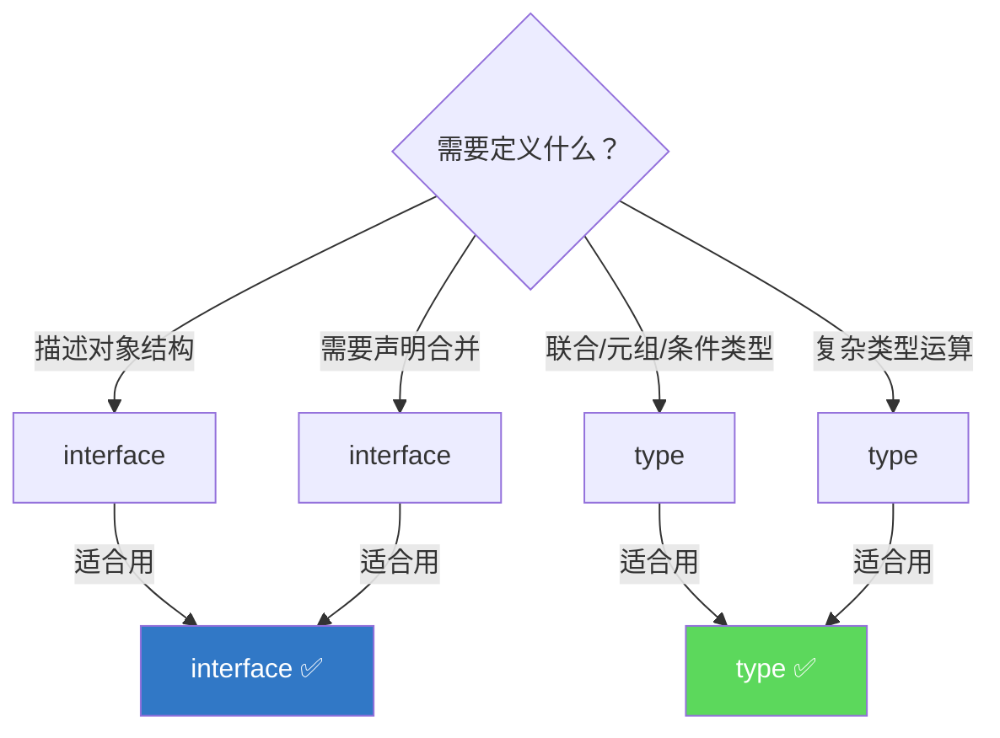

+++
title = "第4章 接口与类型别名"
weight = 40
date = "2026-03-26T21:05:00+08:00"
type = "docs"
description = ""
isCJKLanguage = true
draft = false
+++

# 第 4 章 接口与类型别名

## 4.1 type 别名

**类型别名**（Type Alias）是TypeScript中给类型起名字的方式。就像你给变量起名字一样，类型别名让你可以给复杂的类型起一个简短的名字，让代码更易读。

---

### 4.1.1 type 别名的基本语法

#### 4.1.1.1 `type Point = { x: number; y: number }`

```typescript
// 定义类型别名
type Point = {
    x: number;
    y: number;
};

// 使用类型别名
let location: Point = { x: 10, y: 20 };
console.log(location); // { x: 10, y: 20 }
```

#### 4.1.1.2 `type ID = string | number`

类型别名也可以用于联合类型：

```typescript
// 简单类型别名
type ID = string | number;

let userId: ID = "abc123";
userId = 12345;  // OK，string | number
userId = true;   // 错误！boolean不是ID

// 更复杂的联合类型
type Status = "pending" | "active" | "completed" | "failed";
let currentStatus: Status = "pending";
currentStatus = "active";   // OK
currentStatus = "unknown";   // 错误！
```

#### 4.1.1.3 `type Callback = (error: Error | null, result: string) => void`

类型别名可以用于函数类型：

```typescript
// 函数类型别名
type Callback = (error: Error | null, result: string) => void;

function fetchData(callback: Callback) {
    // 模拟异步操作
    setTimeout(() => {
        callback(null, "数据加载成功！");
    }, 1000);
}

fetchData((err, result) => {
    if (err) {
        console.error("出错了：" + err.message);
    } else {
        console.log(result); // 数据加载成功！
    }
});
```

---

### 4.1.2 type 别名中的泛型

#### 4.1.2.1 泛型容器类型：`type Container<T> = { value: T }`

类型别名可以带泛型参数：

```typescript
// 带泛型的类型别名
type Container<T> = {
    value: T;
};

let stringContainer: Container<string> = { value: "hello" };
let numberContainer: Container<number> = { value: 42 };

console.log(stringContainer.value); // hello
console.log(numberContainer.value); // 42
```

#### 4.1.2.2 可空类型：`type Nullable<T> = T | null`

```typescript
// 更实用的泛型类型别名
type Nullable<T> = T | null;

let name: Nullable<string> = null;
name = "孙悟空";  // OK
console.log(name); // 孙悟空

let age: Nullable<number> = null;
age = 500;  // OK
console.log(age); // 500
```

```typescript
// 更多泛型类型别名示例
type Optional<T> = T | undefined;

type Result<T> = 
    | { success: true; data: T }
    | { success: false; error: string };

// 使用
function divide(a: number, b: number): Result<number> {
    if (b === 0) {
        return { success: false, error: "除数不能为零" };
    }
    return { success: true, data: a / b };
}

const result = divide(10, 0);
if (result.success) {
    console.log("结果：" + result.data);
} else {
    console.log("错误：" + result.error); // 除数不能为零
}
```

---

### 4.1.3 type 别名的递归定义

#### 4.1.3.1 `type TreeNode<T> = { value: T; children: TreeNode<T>[] }`

类型别名可以递归引用自己：

```typescript
// 树形结构的类型定义
type TreeNode<T> = {
    value: T;
    children: TreeNode<T>[];
};

type FileSystemNode = {
    name: string;
    children: FileSystemNode[];
};

// 创建一棵树
const fileSystem: FileSystemNode = {
    name: "root",
    children: [
        {
            name: "src",
            children: [
                { name: "index.ts", children: [] },
                { name: "utils.ts", children: [] }
            ]
        },
        {
            name: "package.json",
            children: []
        }
    ]
};

// 遍历树
function printTree(node: FileSystemNode, depth = 0) {
    const indent = "  ".repeat(depth);
    console.log(indent + "📁 " + node.name);
    for (const child of node.children) {
        printTree(child, depth + 1);
    }
}

printTree(fileSystem);
// 📁 root
//   📁 src
//     📁 index.ts
//     📁 utils.ts
//   📁 package.json
```

```typescript
// 链表也可以用递归类型定义
type LinkedList<T> = {
    value: T;
    next: LinkedList<T> | null;
};

const list: LinkedList<number> = {
    value: 1,
    next: {
        value: 2,
        next: {
            value: 3,
            next: null
        }
    }
};
```

---


## 4.2 interface 声明

**接口**（Interface）是TypeScript中描述对象结构的主要方式。与type别名类似，但有一些独特的功能。

---

### 4.2.1 interface 的基本语法

```typescript
// 定义接口
interface Person {
    name: string;
    age: number;
    email?: string;  // 可选属性
}

// 使用接口
let user: Person = {
    name: "孙悟空",
    age: 500
};

console.log(user.name); // 孙悟空
console.log(user.email); // undefined —— 可选属性可以不提供
```

接口和type别名在基本用法上非常相似：

```typescript
// type别名写法
type Person1 = {
    name: string;
    age: number;
};

// interface写法
interface Person2 {
    name: string;
    age: number;
}

// 两者几乎可以互换
let p1: Person1 = { name: "Tom", age: 20 };
let p2: Person2 = { name: "Jerry", age: 25 };
```

---

### 4.2.2 可选属性与只读属性

#### 4.2.2.1 `host?: string` / `readonly id: string`

```typescript
interface Config {
    // 可选属性：用?标记
    host?: string;
    port?: number;
    
    // 只读属性：用readonly标记
    readonly id: string;
    readonly name: string;
}

const config: Config = {
    id: "123",
    name: "my-config"
};

// 只读属性不能修改
// config.id = "456"; // 错误！只读属性不能修改
// config.name = "new-name"; // 错误！

// 可选属性可以不提供
config.host = "localhost";
config.port = 8080;

console.log(config); // { id: '123', name: 'my-config', host: 'localhost', port: 8080 }
```

> 💡 **什么时候用可选属性**：当某个属性不是必须存在的时候，用`?`标记。比如用户的"个人网站"可能没有，那就用`website?: string`。

> 💡 **什么时候用只读属性**：当属性创建后不应该被修改时，用`readonly`标记。比如订单的创建时间、唯一ID等。

---

### 4.2.3 索引签名

#### 4.2.3.1 `interface StringMap { [key: string]: string }`

索引签名允许你定义对象可以有任意多个某种类型的键：

```typescript
// 字符串索引签名：可以用任意字符串作为键
interface StringMap {
    [key: string]: string;
}

let map: StringMap = {};
map["name"] = "孙悟空";
map["role"] = "大师兄";
map["city"] = "花果山";

console.log(map); // { name: '孙悟空', role: '大师兄', city: '花果山' }
```

#### 4.2.3.2 索引签名约定了所有额外属性的类型上界：具体属性类型必须可赋值给索引签名类型；`[key: string]: string | number` 意味着所有动态属性只能是 string 或 number

索引签名定义了**所有额外属性的类型上界**——具体属性必须是可以赋值给索引签名类型的：

```typescript
// 索引签名是string，意味着所有动态属性的值必须是string
interface StrictMap {
    [key: string]: string;
    name: string;  // OK，string可以赋值给string
    // age: number; // 错误！number不能赋值给string
}

// 如果需要支持多种类型
interface FlexibleMap {
    [key: string]: string | number;
    name: string;  // OK
    age: number;   // OK
}

let fm: FlexibleMap = {
    name: "猪八戒",
    age: 3000
};

console.log(fm.name); // 猪八戒
console.log(fm.age);  // 3000
```

---

### 4.2.4 方法签名的两种写法

#### 4.2.4.1 函数属性：`log: (message: string) => void`

```typescript
interface Logger {
    // 函数属性语法
    log: (message: string) => void;
    warn: (message: string) => void;
    error: (error: Error) => void;
}

const logger: Logger = {
    log: (msg) => console.log("[LOG] " + msg),
    warn: (msg) => console.warn("[WARN] " + msg),
    error: (err) => console.error("[ERROR] " + err.message)
};

logger.log("程序开始运行");
logger.warn("内存使用率较高");
logger.error(new Error("连接失败"));
```

#### 4.2.4.2 方法语法：`log(message: string): void`

```typescript
interface Logger2 {
    // 方法语法
    log(message: string): void;
    warn(message: string): void;
    error(error: Error): void;
}

const logger2: Logger2 = {
    log(message) {
        console.log("[LOG] " + message);
    },
    warn(message) {
        console.warn("[WARN] " + message);
    },
    error(error) {
        console.error("[ERROR] " + error.message);
    }
};

logger2.log("使用新Logger");
```

两种写法的区别：

| 特性 | 函数属性 | 方法语法 |
|------|---------|---------|
| this绑定 | 隐式，指向对象 | 显式，指向对象本身 |
| 重写 | 可以重写 | 可以重写 |
| super调用 | 不支持 | 支持（在类中） |
| 代码可读性 | 类型签名较长 | 更简洁直观 |


```typescript
// 函数属性 vs 方法的this区别
interface Counter {
    count: number;
    // 函数属性：this是any
    inc: (by: number) => void;
    // 方法：this是Counter
    add(by: number): void;
}

const counter: Counter = {
    count: 0,
    inc(by) {
        this.count += by; // OK，this是Counter
    },
    add(by) {
        this.count += by; // OK，this是Counter
    }
};
```


## 4.3 接口继承

接口可以像类一样**继承**其他接口，从而复用类型定义。

---

### 4.3.1 单接口继承、多接口继承

```typescript
// 基础接口
interface Animal {
    name: string;
}

// 单继承
interface Dog extends Animal {
    breed: string;
}

let dog: Dog = {
    name: "旺财",
    breed: "金毛"
};

console.log(dog.name);  // 旺财
console.log(dog.breed); // 金毛
```

```typescript
// 多继承
interface Walkable {
    walk(): void;
}

interface Swimmable {
    swim(): void;
}

interface Amphibian extends Walkable, Swimmable {
    habitat: string;
}

const frog: Amphibian = {
    habitat: "湿地",
    walk() {
        console.log("青蛙跳跳跳");
    },
    swim() {
        console.log("青蛙游游游");
    }
};

frog.walk(); // 青蛙跳跳跳
frog.swim(); // 青蛙游游游
```

---

### 4.3.2 继承中的属性覆盖规则

#### 4.3.2.1 子类属性类型必须是父类属性类型的子类型（协变）：`name: string` → `name: 'Bob'`（更具体）；但反之不行

在TypeScript的结构化类型系统中，属性覆盖遵循**协变**规则——子类的属性类型必须是父类属性类型的**子类型**（更具体）：

```typescript
interface Base {
    name: string;  // name是string
}

interface Derived extends Base {
    name: string;      // OK，相同类型
}

interface Derived2 extends Base {
    name: "Bob";       // OK，"Bob"是string的字面量类型，是string的子类型
}

interface Derived3 extends Base {
    name: string | null; // 错误！string | null不是string的子类型（如果strictNullChecks开启）
}
```

#### 4.3.2.2 禁止完全删除父类属性：子类不能将父类属性覆盖为不存在

```typescript
interface Base {
    name: string;
    age: number;
}

interface Invalid extends Base {
    name: string;
    // age被删除了？不行！
}

interface Invalid2 extends Base {
    name: string;
    age: number | undefined; // 错误！undefined是strictNullChecks开启后的情况
}
```

---

### 4.3.3 接口继承 vs type 交叉

接口继承和type交叉（`&`）都可以用来组合类型，但有一些区别：

```typescript
// 接口继承
interface A {
    x: string;
}
interface B {
    y: number;
}
interface AB extends A, B {
    z: boolean;
}

// type交叉
type A2 = { x: string };
type B2 = { y: number };
type AB2 = A2 & B2 & { z: boolean };

// 两者效果类似，但有细微差别
let obj1: AB = { x: "hello", y: 42, z: true };
let obj2: AB2 = { x: "hello", y: 42, z: true };
```

**区别1：同名属性的处理**

```typescript
// type交叉：属性冲突时变成交叉类型
type T1 = { x: string };
type T2 = { x: number };
type T3 = T1 & T2; // x: never —— 矛盾！string和number不能同时成立

// interface继承：同名属性冲突时报错
interface I1 { x: string; }
interface I2 { x: number; }
// interface I3 extends I1, I2 {} // 错误！两个接口的x类型冲突
```

**区别2：声明合并**

```typescript
// type交叉：不支持声明合并
type T = { x: string } & { x: number }; // 编译错误！不能两次定义同名属性

// interface继承：支持声明合并
interface A { x: string; }
interface A { y: number; }
const obj: A = { x: "hello", y: 42 }; // OK！两个接口合并了
```


## 4.4 类实现接口

在TypeScript中，类可以使用`implements`关键字来声明它必须实现某个接口。

---

### 4.4.1 implements 语法

#### 4.4.1.1 `class Dog implements Animal { name: string; breed: string }`

```typescript
// 定义接口
interface Animal {
    name: string;
    makeSound(): void;
}

// 类实现接口
class Dog implements Animal {
    name: string;
    breed: string;

    constructor(name: string, breed: string) {
        this.name = name;
        this.breed = breed;
    }

    makeSound(): void {
        console.log(this.name + "汪汪汪！");
    }
}

class Cat implements Animal {
    name: string;

    constructor(name: string) {
        this.name = name;
    }

    makeSound(): void {
        console.log(this.name + "喵喵喵！");
    }
}

const dog = new Dog("旺财", "金毛");
const cat = new Cat("小白");

dog.makeSound(); // 旺财汪汪汪！
cat.makeSound(); // 小白喵喵喵！
```

---

### 4.4.2 一个类实现多个接口：`class A implements B, C, D`

```typescript
interface Serializable {
    serialize(): string;
}

interface Cloneable<T> {
    clone(): T;
}

class User implements Serializable, Cloneable<User> {
    name: string;
    age: number;

    constructor(name: string, age: number) {
        this.name = name;
        this.age = age;
    }

    serialize(): string {
        return JSON.stringify({ name: this.name, age: this.age });
    }

    clone(): User {
        return new User(this.name, this.age);
    }
}

const user = new User("孙悟空", 500);
const userJson = user.serialize();
console.log(userJson); // {"name":"孙悟空","age":500}

const userClone = user.clone();
console.log(userClone.name); // 孙悟空
```

---

### 4.4.3 extends vs implements

| 关键字 | 含义 | 用途 |
|--------|------|------|
| extends | 继承 | 类继承类，接口继承接口 |
| implements | 实现 | 类实现接口 |

```typescript
// extends：继承类
class Animal {
    name: string;
}
class Dog extends Animal {
    breed: string;
}

// implements：实现接口
interface Animal {
    name: string;
}
class Dog implements Animal {
    name: string;
    breed: string;
}

// 两者结合
interface Barkable {
    bark(): void;
}

class Animal {
    name: string;
}

class Dog extends Animal implements Barkable {
    bark() {
        console.log(this.name + "汪汪汪！");
    }
}
```

---

## 4.5 接口合并（Declaration Merging）

TypeScript的一个独特特性是**同名接口会自动合并**。这在扩展第三方库类型时非常有用。

---

### 4.5.1 同名 interface 的合并规则

#### 4.5.1.1 非函数成员直接合并，函数成员作为重载合并

```typescript
// 第一次声明
interface Window {
    title: string;
}

// 第二次声明（合并）
interface Window {
    width: number;
    height: number;
}

// 合并后的Window
const myWindow: Window = {
    title: "我的窗口",
    width: 800,
    height: 600
};

console.log(myWindow.title); // 我的窗口
console.log(myWindow.width); // 800
```

**函数成员的处理**：多个同名接口中的函数会变成**重载**：

```typescript
interface Greeter {
    greet(name: string): string;
}

interface Greeter {
    greet(name: string, time: number): string;
}

// 合并后：两个函数签名都保留（重载）
const greeter: Greeter = {
    greet(name: string, time?: number) {
        if (time !== undefined) {
            return `Good ${time > 12 ? "afternoon" : "morning"}, ${name}!`;
        }
        return `Hello, ${name}!`;
    }
};

console.log(greeter.greet("Tom"));              // Hello, Tom!
console.log(greeter.greet("Tom", 14));         // Good afternoon, Tom!
```

---

### 4.5.2 为什么 interface 支持声明合并

#### 4.5.2.1 JavaScript 的对象是动态的，可以随时添加属性；interface 的声明合并模拟了 JS 的动态扩展性

JavaScript允许随时给对象添加属性：

```javascript
// JavaScript：对象可以随时添加属性
const obj = { name: "Tom" };
obj.age = 20;  // 完全OK！
```

TypeScript的接口合并模拟了这个特性，让你可以**分步定义**一个接口：

```typescript
// 第一处定义：基础接口
interface User {
    name: string;
}

// 第二处定义：扩展接口（合并）
interface User {
    age: number;
}

// 第三处定义：再扩展
interface User {
    email?: string;
}

// 最终的User接口包含所有属性
const user: User = {
    name: "孙悟空",
    age: 500,
    email: "sunwukong@example.com"
};
```

#### 4.5.2.2 应用：扩展原生 DOM 接口（window）、第三方库接口

```typescript
// 扩展window接口
interface Window {
    myCustomProperty: string;
    myCustomMethod(): void;
}

window.myCustomProperty = "自定义属性";
window.myCustomMethod = () => console.log("自定义方法");
```

```typescript
// 扩展第三方库的类型
// 假设某个库定义了
interface LibraryTypes {
    Config: { apiKey: string };
}

// 你想给Config添加新属性
interface LibraryTypes {
    Config: { apiKey: string; timeout?: number };
}
```

---

### 4.5.3 同名 type 不合并

```typescript
// type别名：同名会报错
type Window = { title: string; };
type Window = { width: number; }; // 错误！不能重复定义

// 解决方式：用交叉类型
type Window2 = { title: string; } & { width: number; };
```


## 4.6 混合类型与接口继承类

---

### 4.6.1 混合类型：同时具有函数签名和属性签名的对象类型

**混合类型**是指同时具有函数特征和对象特征的类型——它既可以像函数一样被调用，又有对象的属性。

```typescript
// 混合类型：一个函数，但同时有属性
interface Counter {
    // 可以像函数一样调用
    (): number;
    // 同时有属性
    count: number;
    // 也有方法
    reset(): void;
}

function createCounter(): Counter {
    const counter = (() => {
        return ++counter.count;
    }) as Counter;
    counter.count = 0;
    counter.reset = () => {
        counter.count = 0;
    };
    return counter;
}

const counter = createCounter();
console.log(counter()); // 1
console.log(counter()); // 2
console.log(counter()); // 3
console.log(counter.count); // 3
counter.reset();
console.log(counter()); // 1
```

这个模式在JavaScript中很常见（比如jQuery），TypeScript可以用混合类型来精确描述。

---

### 4.6.2 接口继承类

TypeScript允许接口继承类：

```typescript
class Point {
    x: number;
    y: number;
}

interface Point3D extends Point {
    z: number;
}

// Point3D自动包含了x和y，以及z
const p3d: Point3D = {
    x: 1,
    y: 2,
    z: 3
};

console.log(p3d); // { x: 1, y: 2, z: 3 }
```

这种用法不太常见，但在某些场景下很有用——比如当你想扩展一个类的类型定义，但不需要实现类本身时。

---

## 4.7 type 与 interface 的选用原则

这是TypeScript中最常见的问题之一：**什么时候用type，什么时候用interface？**

---

### 4.7.1 优先使用 interface 的场景

#### 4.7.1.1 需要声明合并（第三方库/全局扩展）；定义类实现契约（class X implements Y）时 interface 和 type 均可使用

```typescript
// 场景1：需要声明合并
// 扩展window或第三方库类型时，必须用interface
interface Window {
    myExtension: string;
}

// 场景2：需要被类实现
// interface和type都可以被implements，但interface更直观
interface Serializable {
    serialize(): string;
}
type Serializable2 = {
    serialize(): string;
};

class A implements Serializable {}
class B implements Serializable2 {}
```

---

### 4.7.2 优先使用 type 的场景

#### 4.7.2.1 需要条件类型、映射类型、元组、联合类型成员

```typescript
// 场景1：联合类型
type Status = "pending" | "active" | "failed";
type StringOrNumber = string | number;

// 场景2：元组
type Pair<T, U> = [T, U];

// 场景3：条件类型
type IsString<T> = T extends string ? true : false;

// 场景4：映射类型
type Readonly<T> = {
    readonly [P in keyof T]: T[P];
};

// 场景5：需要复杂的交叉类型
type Base = { x: string };
type Derived = Base & { y: number };
```

#### 4.7.2.2 type 更像「类型别名」的概念，适合类型运算

```typescript
// type可以给任何类型起别名
type Callback = (error: Error | null, result: string) => void;
type Result<T> = { success: true; data: T } | { success: false; error: string };
```

---

### 4.7.3 项目风格一致性原则

最重要的原则是：**保持一致性**。

如果你在一个团队中工作，跟随团队的风格。如果你是个人项目，选择一种风格并坚持使用。

一些团队的约定俗成：



> 💡 **实战经验**：大多数现代TypeScript项目倾向于"**接口优先**"——能用interface就用interface，只有当interface不够用时才用type。比如需要联合类型、元组、复杂类型运算时，用type更合适。

---

> 📝 **本节小结**：type和interface在大多数情况下可以互换，但有一些区别。interface支持声明合并，适合描述对象结构和被类实现；type支持更强大的类型运算（联合类型、元组、条件类型、映射类型），适合复杂的类型操作。实际项目中建议接口优先，只在type有优势的场景使用type。

---

## 本章小结

本章学习了TypeScript中两种主要的类型定义方式：type别名和interface。

**type别名**使用`type`关键字，可以给任何类型起名字，包括原始类型、联合类型、函数类型、泛型类型，甚至可以递归定义（用于树形结构、链表）。type别名不支持声明合并。

**interface**使用`interface`关键字，专门用于描述对象的结构。interface支持可选属性（`?`）、只读属性（`readonly`）、索引签名、方法签名。interface支持**声明合并**——同名接口会自动合并，这个特性常用于扩展第三方库类型。

**接口继承**允许接口继承其他接口，子类必须保留父类属性，且子类的属性类型必须是父类属性类型的子类型（协变）。

**类实现接口**使用`implements`关键字，类必须实现接口中定义的所有成员。一个类可以实现多个接口。

**混合类型**是同时具有函数签名和属性签名的类型，用于描述JavaScript中常见的"函数也是对象"模式。

**type vs interface的选用**：大多数场景可以互换。interface适合描述对象结构和需要声明合并的场景；type适合联合类型、元组、条件类型、映射类型等类型运算场景。

下一章我们将学习**联合类型、交叉类型与可辨识联合**——这些是TypeScript类型系统中非常强大的组合工具。


