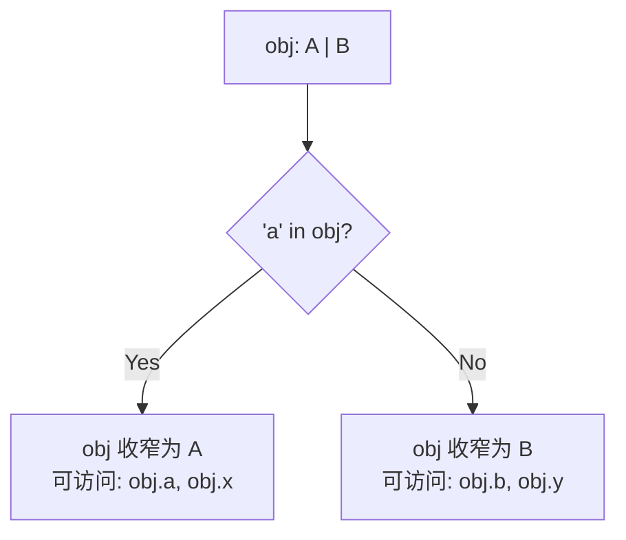

+++
title = "第6章 类型守卫、类型断言与类型收窄"
weight = 60
date = "2026-03-26T21:05:00+08:00"
type = "docs"
description = ""
isCJKLanguage = true
draft = false
+++

# 第 6 章 类型守卫、类型断言与类型收窄

> 如果说 TypeScript 是一门艺术，那么类型收窄就是这门艺术的"透视技法"——它让你在复杂的类型迷宫中看清前路，而不是一头撞死在 `any` 墙上。

## 6.1 类型收窄（Narrowing）

### 6.1.1 类型收窄的概念

想象一下，你是一个侦探，面前有一堆线索，但每条线索都可能指向不同的嫌疑人。你需要逐一排查，最终锁定真凶——这个"从一堆可能性缩小到具体某个"的过程，就是**类型收窄**。

在 TypeScript 的世界里，变量可能是"多面间谍"——一个变量可能同时是字符串、数字、对象，甚至是 `null` 或 `undefined`。TypeScript 的类型系统就像一个谨慎的检察官，不会轻易下定论，除非你给出足够的证据。

#### 6.1.1.1 通过控制流分析（Control Flow Analysis）缩小类型范围

TypeScript 有一个强大的能力，叫做**控制流分析**（Control Flow Analysis，以下简称 CFA）。

什么叫做控制流？简单来说，就是代码执行的"路线图"。TypeScript 会顺着这条路线图，分析每个变量在不同位置可能是什么类型。

看下面这个例子：

```typescript
function processValue(value: string | number | boolean) {
    // 此刻，value 可能是 string、number 或 boolean
    // TypeScript 不知道具体是哪个

    if (typeof value === "string") {
        // 在这个分支里，TypeScript 知道 value 一定是 string
        console.log(value.toUpperCase()); // OK!
    } else {
        // 在 else 分支里，value 不可能是 string
        // 可能是 number 或 boolean
        console.log(value); // OK!
    }
}
```

上面代码中，当进入 `typeof value === "string"` 的分支时，TypeScript 会自动"收窄" `value` 的类型范围——从 `string | number | boolean` 缩小到 `string`。

这种"缩小"是怎么发生的？TypeScript 的编译器会顺着 `if` 语句的控制流，分析出"如果条件成立，value 就是 string"这个结论，然后在对应的代码块里更新对 value 类型的认知。

这就是控制流分析的魔力——TypeScript 会在程序的不同位置，动态地"收紧"对变量类型的判断。

### 6.1.2 为什么需要类型收窄

这可能是整本书里最重要的"为什么"之一。理解了这个问题，你就能真正理解 TypeScript 的设计哲学。

#### 6.1.2.1 JavaScript 的值类型在运行时可能变化；TypeScript 通过静态分析模拟运行时的类型变化；没有收窄，联合类型就无法安全使用

让我们把时间拨回到 JavaScript 的蛮荒年代。

在 JavaScript 里，变量是没有类型标签的。一个变量上一秒可能是字符串 `"42"`，下一秒就变成了数字 `42`，再下一秒可能变成了 `null`。这不是 bug，这是 JavaScript 的"自由主义"——变量想是什么类型就是什么类型，谁也管不着。

```javascript
// JavaScript 的经典操作
let data = "42";        // 现在是字符串
data = 42;               // 变成数字了
data = [1, 2, 3];       // 又变成数组了
data = null;            // 变成 null 了
// data 想是什么就是什么，没人能阻止它
```

TypeScript 作为 JavaScript 的"超集"，必须面对这个现实。但 TypeScript 的野心不止于此——它想在编译阶段就"预知"运行时的类型变化。

怎么做到？答案是**静态分析**。

TypeScript 不运行代码，它只是"读"代码，然后推断"如果代码执行到这里，变量应该是什么类型"。这个推断过程就是控制流分析。

但这里有个问题：TypeScript 不知道你的函数会被怎么调用。

```typescript
function processInput(input: string | number) {
    // TypeScript 不知道 input 实际会是 string 还是 number
    // 它只知道 input 可能是两者之一
    console.log(input.toFixed(2)); // 报错！input 可能是 string，string 没有 toFixed 方法
}
```

`input.toFixed(2)` 会报错，因为 TypeScript 知道 `input` 可能是 `string`——而字符串没有 `toFixed` 方法。除非你"证明"给 TypeScript 看，让它相信 `input` 在这个时刻一定是 `number`。

怎么证明？用**类型守卫**！

```typescript
function processInput(input: string | number) {
    if (typeof input === "number") {
        // 在这个分支里，TypeScript 相信 input 是 number
        console.log(input.toFixed(2)); // OK!
    } else {
        // 在 else 分支里，input 一定是 string
        console.log(input.toUpperCase()); // OK!
    }
}
```

没有类型收窄，联合类型就是一堆"废铁"——你明明知道某个分支里变量一定是某个具体类型，但 TypeScript 不信任你，它需要一个"证人"来证明。这个证人，就是**类型守卫**。

**敲黑板**：类型守卫是 TypeScript 类型系统的"安检门"。没有安检，你就只能在"全部都是危险品"和"全部都是安全品"之间二选一——前者让你寸步难行，后者让你掉进 `any` 的深渊。

### 6.1.3 typeof 类型守卫

`typeof` 是 JavaScript 的"原住民"操作符，TypeScript 把它"招安"过来，作为内置的类型守卫。

#### 6.1.3.1 `typeof x === 'string'` → x 在分支内类型收窄为 string

`typeof` 类型守卫是最简单、最直接的一种类型守卫。它的语法就是 JavaScript 的 `typeof` 操作符，TypeScript 在 `if` 条件里看到它，会自动进行类型收窄。

```typescript
function demo(value: string | number | boolean) {
    if (typeof value === "string") {
        // value 在这里被收窄为 string
        console.log("是个字符串，长度是", value.length);
    } else if (typeof value === "number") {
        // value 在这里被收窄为 number
        console.log("是个数字，是整数吗？", Number.isInteger(value), value);
    } else {
        // value 在这里被收窄为 boolean
        console.log("是个布尔值，值是", value);
    }
}

demo("hello");    // 是个字符串，长度是 5
demo(42);         // 是个数字，是整数吗？ true 42
demo(true);       // 是个布尔值，值是 true
```

不过 `typeof` 有一个天然的局限——它只能区分 JavaScript 的**原始类型**（string、number、bigint、boolean、symbol、undefined）和**function**。对于对象类型（class 实例、数组、普通对象），`typeof` 只能返回 `"object"`，没办法进一步区分。

```typescript
function checkType(value: Date | RegExp | object) {
    if (typeof value === "object") {
        // 这里只知道是 object，具体是 Date 还是 RegExp 不知道
        console.log("是个对象");
    }
}
```

`typeof` 能告诉你"这是字符串"，但没法告诉你"这是 `Date` 对象还是 `RegExp` 对象"。这时候，`instanceof` 就该登场了。

### 6.1.4 instanceof 类型守卫

如果说 `typeof` 是小区门口的保安，只能分辨"是人还是车"，那 `instanceof` 就是刑侦专家，能精确到"这是张三还是李四"。

`instanceof` 检查一个对象是否是某个类的实例。TypeScript 会根据 `instanceof` 的检查结果，自动收窄类型。

```typescript
function identify(value: Date | RegExp) {
    if (value instanceof Date) {
        // value 在这里被收窄为 Date
        console.log("是个日期：", value.toISOString());
    } else {
        // value 在这里被收窄为 RegExp
        console.log("是个正则：", value.source);
    }
}

identify(new Date());     // 是个日期： 2026-03-26T...
identify(/^\d+$/);       // 是个正则： ^\d+$
```

再来看一个更复杂的例子。假设你在写一个电商后台，商品数据可能来自不同的 API 渠道：

```typescript
type AmazonProduct = { sku: string; fbasMarketplace: boolean };
type JDProduct = { sku: string; jdFreight: string };
type PDDProduct = { goods_id: string; pddWarehouse: string };

type Product = AmazonProduct | JDProduct | PDDProduct;

function getWarehouse(product: Product): string {
    if (product instanceof AmazonProduct) { // 报错！instanceof 只适用于类，不能用于 type 别名
        return product.fbasMarketplace;
    }
    // ...
}
```

等等，这里有个坑！`instanceof` **只适用于类**（class），不能用于**类型别名**（type alias）。`AmazonProduct`、`JDProduct`、`PDDProduct` 都是用 `type` 关键字定义的别名，不是类，所以不能用 `instanceof`。

怎么解决？用**自定义类型守卫**（后面会讲）。

先剧透一下：

```typescript
function isAmazonProduct(p: Product): p is AmazonProduct {
    return "fbasMarketplace" in p;
}

function getWarehouse(product: Product): string {
    if (isAmazonProduct(product)) {
        return product.fbasMarketplace ? "FBA仓库" : "自发货";
    }
    // ...
}
```

`instanceof` 的另一个局限：它**不能用于接口**（interface），原因和 type 别名一样——接口和类型别名在编译后都被擦除了，运行时根本不存在。

### 6.1.5 自定义类型守卫

有些时候，`typeof` 和 `instanceof` 都不够用。比如你想检查一个对象是否有某个特定属性，或者你想用更复杂的逻辑来判断类型。这时候，你就需要**自定义类型守卫**。

#### 6.1.5.1 返回类型谓词（Type Predicate）：`value is Type`

自定义类型守卫的核心是一个返回**类型谓词**（Type Predicate）的函数。

类型谓词的语法是 `value is Type`，放在函数返回类型的位置上。它告诉 TypeScript："如果这个函数返回 `true`，那么 `value` 的类型就是 `Type`。"

```typescript
// 这是一个自定义类型守卫
function isString(value: unknown): value is string {
    return typeof value === "string";
}

// 使用
function demo(value: unknown) {
    if (isString(value)) {
        // 在这个分支里，value 被收窄为 string
        console.log(value.toUpperCase()); // OK!
    }
}

demo("hello"); // HELLO
demo(123);     // 不报错，因为 if 条件不满足
```

`isString` 函数的返回类型是 `value is string`，这行代码的意思是："如果 `isString(x)` 返回 `true`，那么 `x` 的类型就是 `string`。"

TypeScript 听到这句话之后，就会在 `if` 条件为真的分支里，把 `value` 的类型收窄为 `string`。

#### 6.1.5.2 为什么需要自定义类型守卫：typeof 只能区分 JS 基础类型，自定义守卫让程序员定义任意复杂的类型检查逻辑

`typeof` 只能区分 JS 的 7 种原始类型（string、number、bigint、boolean、symbol、undefined、function）和 object，但没法区分自定义类型。

比如，你定义了一个 `User` 类型和一个 `Admin` 类型，它们结构几乎一样，但语义不同：

```typescript
type User = { name: string; email: string; role: "user" };
type Admin = { name: string; email: string; role: "admin"; permissions: string[] };

function isAdmin(person: User | Admin): person is Admin {
    return person.role === "admin";
}

function greet(person: User | Admin) {
    if (isAdmin(person)) {
        // 在这个分支里，person 被收窄为 Admin
        console.log(`管理员 ${person.name}，你的权限是：`, person.permissions);
    } else {
        // person 被收窄为 User
        console.log(`普通用户 ${person.name}`);
    }
}
```

这里 `isAdmin` 用了自定义逻辑（检查 `role` 字段），这是 `typeof` 根本做不到的事情。

**类型守卫的哲学**：类型守卫本质上是一个"类型级的断言"——你说"这个值是 X 类型"，TypeScript 相信你。如果你说错了，运行时就会爆炸。所以，**守卫函数的正确性由你保证**，TypeScript 只负责在信任你的前提下做类型收窄。

这又印证了那句话：TypeScript 给你权力，但权力附带着责任。

### 6.1.6 真值收窄（Truthiness Narrowing）

JavaScript 有一个"暗黑特性"——**隐式类型转换**。几乎所有值都可以在布尔上下文中被"自动转换"为 `true` 或 `false`。

```javascript
// JavaScript 的"真相"表
Boolean("");        // false（空字符串）
Boolean("hello");   // true（非空字符串）
Boolean(0);         // false
Boolean(42);        // true（非零数字）
Boolean(null);      // false
Boolean(undefined); // false
Boolean([]);        // true（空数组也是 truthy！）
Boolean({});        // true（空对象也是 truthy！）
Boolean(NaN);       // false
```

**敲黑板**：`[]` 和 `{}` 在 JavaScript 里都是 `truthy` 值！这让无数 JavaScript 萌新栽了跟头。

TypeScript 会捕捉这种"真值检查"并据此收窄类型。这就是**真值收窄**。

```typescript
function greet(name: string | null | undefined) {
    if (name) {
        // name 在这里是 string（不是 null/undefined/falsy）
        console.log(`你好, ${name.toUpperCase()}!`);
    } else {
        // name 在这里是 null | undefined
        console.log("你好, 神秘人!");
    }
}

greet("张三");  // 你好, 张三!
greet(null);   // 你好, 神秘人!
greet(undefined); // 你好, 神秘人!
```

再看一个"危险"的例子——不小心把 `0` 当作 falsy 值处理：

```typescript
function processScore(score: number | null) {
    if (score) {
        // 陷阱！0 也是 falsy，但 0 是一个有效的分数！
        console.log(`分数是 ${score}`);
    } else {
        // 这里 score === 0 或 score === null 都进来了
        console.log("没有分数");
    }
}

processScore(0);   // 没有分数 —— 错了！0 是有效分数
processScore(100); // 分数是 100 —— 正确
```

这是一个经典的 bug。解决方案是**显式检查** `null`/`undefined`：

```typescript
function processScoreFixed(score: number | null) {
    if (score !== null) {
        // 这里 score 是 number（包含 0）
        console.log(`分数是 ${score}`);
    } else {
        console.log("没有分数");
    }
}

processScoreFixed(0);   // 分数是 0 —— 正确!
processScoreFixed(null); // 没有分数 —— 正确!
```

**真值收窄的教训**：JavaScript 的隐式类型转换是"方便"和"陷阱"的结合体。在 TypeScript 中，**永远不要依赖隐式真值检查来处理 `null`/`undefined`**，除非你明确知道值的范围不包含"危险"的 falsy 值（如 `0`、`""`）。

### 6.1.7 in 操作符收窄

`in` 操作符用于检查一个属性是否存在于一个对象中。TypeScript 会根据 `in` 检查的结果来收窄类型。

```typescript
type A = { x: number; a: string };
type B = { y: number; b: string };

function process(obj: A | B) {
    if ("a" in obj) {
        // "a" 只存在于 A 中，所以 obj 在这里是 A
        console.log(obj.a); // OK! obj 是 A 类型
    } else {
        // obj 在这里是 B
        console.log(obj.b); // OK! obj 是 B 类型
    }
}
```

`in` 收窄的关键在于：**如果一个属性名只存在于某个类型中，而不存在于另一个类型中**，TypeScript 就能做出判断。



### 6.1.8 实际应用：区分可选属性

`in` 操作符特别适合处理**可选属性**的情况：

```typescript
type Config = {
    host: string;
    port?: number;   // 可选
    timeout?: number; // 可选
};

function displayConfig(config: Config) {
    console.log(`主机: ${config.host}`);

    if ("port" in config) {
        // config 在这里是 { host: string; port: number; timeout?: number }
        console.log(`端口: ${config.port}`);
    } else {
        console.log("端口: 默认");
    }

    if ("timeout" in config) {
        console.log(`超时: ${config.timeout}ms`);
    } else {
        console.log("超时: 默认");
    }
}

displayConfig({ host: "localhost", port: 8080 });
// 主机: localhost
// 端口: 8080
// 超时: 默认

displayConfig({ host: "example.com", timeout: 5000 });
// 主机: example.com
// 端口: 默认
// 超时: 5000ms
```

---

## 6.2 类型断言（Type Assertions）

### 6.2.1 as 语法、尖括号语法、非空断言、确定赋值断言

如果说类型守卫是 TypeScript 的"交警"，负责在路口指挥交通，让不同类型的车各行其道；那**类型断言**就是你的"驾照"——你拿出来，TypeScript 就放行。

类型断言允许你**强制**告诉 TypeScript："相信我，我知道这个值的类型，别废话，让我过。"

这是 TypeScript 里最"霸道"的语法，也是最危险的操作。准备好了吗？让我们系好安全带。

**第一种：`as` 语法**

```typescript
// 我知道这个 unknown 值实际上是 string
const value: unknown = "Hello, TypeScript!";
const str = value as string;
console.log(str); // Hello, TypeScript!
```

**第二种：尖括号语法（效果相同，但有使用限制）**

```typescript
const value: unknown = "Hello";
const str = <string>value;
console.log(str); // Hello
```

> **注意**：尖括号语法在 `.tsx` 文件（React JSX）中无法使用，因为 `<string>` 会被误认为是 JSX 标签。所以，推荐始终使用 `as` 语法。

**第三种：非空断言（`!`）**

非空断言用于"硬刚" TypeScript 的 null 检查。它告诉 TypeScript："我保证这个值不是 `null` 或 `undefined`，别啰嗦。"

```typescript
function getElement(id: string) {
    const el = document.getElementById(id);
    el.innerHTML = "找到你了！"; // 报错！el 可能是 null
    el!.innerHTML = "找到你了！"; // OK！非空断言：我保证 el 不是 null
}

getElement("app"); // 找到你了！
```

> **警告**：如果你的保证错了，程序会在运行时**崩溃**（TypeError: Cannot set properties of null）。所以使用非空断言之前，请反复确认这个值真的不是 null。

**第四种：确定赋值断言（`!`）**

确定赋值断言用于告诉 TypeScript："这个变量在使用前一定会被赋值，你等着瞧吧。"

```typescript
let initValue: number;

// 模拟异步初始化
setTimeout(() => {
    initValue = 42;
}, 100);

// console.log(initValue + 1); // 报错！initValue 可能未被赋值
console.log(initValue! + 1); // OK！确定赋值断言：我保证它会被赋值
// 42! + 1 = 43
```

确定赋值断言通常用于：
- 类的属性（在构造函数外赋值）
- 条件赋值（`if (condition) { x = 1 }`）
- 结构化赋值中的延迟赋值

```typescript
class Person {
    name!: string; // 确定赋值断言：我保证构造函数会赋值

    constructor(data: string) {
        this.name = data; // 实际在构造函数里赋值
    }

    greet() {
        console.log(`你好, ${this.name}!`); // 你好, 某人!
    }
}

const p = new Person("小明");
p.greet();
```

### 6.2.2 为什么允许类型断言（这是类型安全的漏洞）

看到这里，你可能会问："既然类型断言这么危险，为什么 TypeScript 要允许它？"

#### 6.2.2.1 场景：某些类型信息 TypeScript 无法识别，但程序员可以保证正确性；权衡：给予程序员权力，同时要求程序员承担正确性责任

好问题！让我们来分析一下 TypeScript 设计者的"苦衷"。

**场景一：DOM 操作**

```typescript
const input = document.getElementById("username") as HTMLInputElement;
input.value = "admin"; // OK! 我知道这个元素是输入框
```

`getElementById` 返回的类型是 `HTMLElement | null`，但你作为一个有眼睛的人类，可以看到 HTML 里这个 id 对应的元素就是 `<input>`。TypeScript 的编译器没有眼睛，它只能看到类型签名。所以，你用 `as HTMLInputElement` 强制告诉它："这是输入框，我知道我在做什么。"

**场景二：类型信息的"时间差"**

有时候，类型信息在编译期和运行期不一致。比如你用第三方库，它的类型定义可能有错误，或者某个 API 改了但类型定义还没更新。这时候，你可能需要用断言来"绕过"类型检查。

```typescript
// 第三方库的返回类型可能是 string | null，但你知道实际永远是 string
const result = someLibrary.getConfig("name") as string;
```

**TypeScript 的设计哲学**

TypeScript 的设计者认为：**程序员应该是成年人，有权做出自己的判断**。

TypeScript 的类型系统是"可选的"——你可以用 `any` 完全绕过类型检查，也可以用类型断言强制转换类型。这是有意为之的设计，不是漏洞。

> 换句话说：TypeScript 给你配了一把枪，而不是强制你戴上手套才让你碰代码。枪可以保护你，也可以伤到你——这是你的责任，不是 TypeScript 的。

### 6.2.3 类型断言的安全规范

**滥用断言会导致运行时错误**。这不是开玩笑，每年都有大量生产事故的根源是类型断言。来看一个经典案例：

```typescript
// 某个 API 返回的类型定义是 User | null
// 但实际上 API 文档里说永远不会返回 null
const data = getUser() as User; // 危险！假设 API 实现改了
data.name; // 如果 data 实际上是 null，这里直接爆炸
```

#### 6.2.3.1 滥用断言会导致运行时错误；最佳实践：先用类型守卫收窄，再用断言

**最佳实践一：优先使用类型守卫**

```typescript
function processUser(user: User | null) {
    if (user === null) {
        return;
    }
    // 此刻 TypeScript 已经收窄为 User，不需要断言
    console.log(user.name); // OK!
}
```

**最佳实践二：守卫 + 断言（当确实需要时）**

```typescript
function processUserSafe(user: User | null) {
    if (user !== null) {
        // 守卫之后，user 是 User，但如果你需要更具体的类型
        const admin = user as Admin; // 我知道这个 user 同时是 Admin
        console.log(admin.permissions);
    }
}
```

**最佳实践三：用 `unknown` 代替 `any`，然后逐步收窄**

```typescript
function processData(data: unknown) {
    // data 是 unknown，不能直接操作
    if (typeof data === "string") {
        // data 是 string，可以安全操作
        console.log(data.toUpperCase());
    } else if (data instanceof Error) {
        // data 是 Error
        console.error(data.message);
    }
}
```

**记住这个原则**：
- `any` = 危险！完全关闭类型检查，想干什么干什么
- `unknown` = 安全！不知道是什么，必须先检查再操作
- `as` = 霸道！强行告诉编译器"我知道这是什么"

---

## 本章小结

本章围绕**类型守卫**与**类型断言**两大核心概念展开，这两者共同构成了 TypeScript 类型系统的"控制塔"。

### 类型守卫：让 TypeScript 相信你的判断

| 守卫类型 | 语法 | 适用场景 |
|---------|------|---------|
| typeof | `typeof x === "string"` | JS 原始类型 |
| instanceof | `x instanceof Date` | 类实例 |
| 自定义守卫 | `value is Type` | 任意复杂检查 |
| 真值检查 | `if (x)` | null/undefined |
| in 操作符 | `"prop" in obj` | 可选属性 |

### 类型断言：霸道总裁，一言堂

- `as` 语法：最推荐，但尖括号语法在 `.tsx` 中不能用
- `!` 非空断言：跳过 null 检查，有风险
- `!` 确定赋值断言：跳过未赋值检查，有风险
- 核心原则：**先用守卫收窄，再用断言（如果必要）**

### 设计哲学

TypeScript 的类型系统相信程序员是"成年人"——给你充分的权力，但权力伴随着责任。类型守卫是你用来"说服"TypeScript 的证据，类型断言是你直接动用"否决权"。前者安全，后者危险，请谨慎使用。

> 记住：类型系统是你最好的队友，不是你的敌人。如果你发现自己在代码里堆满了 `as any`，那一定是类型设计出了问题，而不是 TypeScript 在刁难你。
