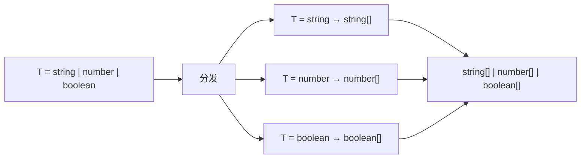

+++
title = "第7章 类型运算与工具类型"
weight = 70
date = "2026-03-26T21:05:00+08:00"
type = "docs"
description = ""
isCJKLanguage = true
draft = false
+++

# 第 7 章 类型运算与工具类型

> 如果说类型是 TypeScript 世界的"物质"，那么类型运算就是"化学反应的催化剂"——它让你把简单的类型组装成复杂的类型系统，让类型定义既优雅又 DRY。

## 7.1 keyof、typeof 与索引访问

### 7.1.1 keyof 运算符

`keyof` 是 TypeScript 类型系统中的"造钥匙师傅"。它接受一个类型，返回这个类型所有**键**的联合类型。

```typescript
type User = {
    id: number;
    name: string;
    email: string;
};

type UserKeys = keyof User;
// 等价于: "id" | "name" | "email"
```

`keyof User` 产生的类型是 `"id" | "name" | "email"`——一个由字符串字面量组成的联合类型。

```typescript
function getProperty<T, K extends keyof T>(obj: T, key: K): T[K] {
    return obj[key];
}

const user: User = { id: 1, name: "小明", email: "xiaoming@example.com" };

const userName = getProperty(user, "name"); // 返回类型是 string
const userId = getProperty(user, "id");     // 返回类型是 number
// getProperty(user, "age"); // 报错！"age" 不是 keyof User
```

上面这个 `getProperty` 函数使用了两个泛型：
- `T`：对象的类型
- `K extends keyof T`：保证 `key` 一定是 `T` 的键

这样，`obj[key]` 的返回类型就被正确地收窄为 `T[K]`——即键 `K` 对应的值的类型。

#### 7.1.1.1 为什么 keyof 叫这个名字：概念来自 SQL 的 keyof；表示「键的集合」

`keyof` 这个名字听起来有点奇怪，为什么不叫 `keysOf`？原因是它借鉴了 SQL 中的概念——在 SQL 中，`KEY` 是索引的同义词，而 `keyof` 就是"某类型的键"。

更准确地说，`keyof` 的语义是"把一个**类型**映射到它的**键集合**"——这是一个从"实体"到"索引"的转换。

### 7.1.2 keyof 与泛型约束：`<K extends keyof T>`

这是 TypeScript 最常见的泛型约束模式之一。

```typescript
// K extends keyof T 保证了 K 一定是 T 的键
function pick<T, K extends keyof T>(obj: T, keys: K[]): Pick<T, K> {
    const result = {} as Pick<T, K>;
    for (const key of keys) {
        if (key in obj) {
            result[key] = obj[key];
        }
    }
    return result;
}

const user: User = { id: 1, name: "小明", email: "xiaoming@example.com" };
const picked = pick(user, ["id", "name"]);
// picked 的类型是 { id: number; name: string }
console.log(picked); // { id: 1, name: '小明' }
```

`<K extends keyof T>` 这个约束的意思是：**K 必须是 T 的某个键**。这样 TypeScript 就能在编译期检查你传入的 key 是否合法。

> **为什么叫 extends**：这里 `extends` 的含义不是"继承"，而是"约束"——"K 必须是 keyof T 这个联合类型中的一员"。你可以把它理解为数学中的"∈"（属于符号）。

### 7.1.3 typeof 类型查询：`type A = typeof someVariable`

`typeof` 在 TypeScript 中有第二种用法——用于**类型查询**，即从变量、函数、类等"值"身上查询其**类型**。

```typescript
const user = { id: 1, name: "张三", age: 30 };

// 从 user 变量查询其类型
type UserType = typeof user;
// 等价于: { id: number; name: string; age: number }
```

#### 7.1.3.1 为什么需要 typeof：让类型注解「复制」变量的类型结构

你可能会问："为什么不直接定义类型，再声明变量？"

```typescript
// 方式一：类型 + 变量
type User = { id: number; name: string; age: number };
const user: User = { id: 1, name: "张三", age: 30 };

// 方式二：typeof
const user = { id: 1, name: "张三", age: 30 };
type User = typeof user;
```

两种方式各有优势。方式二的**好处**是：如果有一天 `user` 的结构变了（比如加了新字段），`User` 类型会自动跟着变，不需要手动维护两处。

#### 7.1.3.2 `as const` + typeof：获得最窄字面量类型

普通 `typeof` 会把字面量类型的值"拓宽"为基础类型：

```typescript
const status = "active";
// typeof status = string（不是 "active"！）

// as const 强制 TypeScript 把 "active" 视为 "active" 字面量类型
const status = "active" as const;
// typeof status = "active"
```

组合使用：

```typescript
const config = {
    mode: "development",
    port: 3000,
    debug: true,
} as const;

type Config = typeof config;
// type Config = { readonly mode: "development"; readonly port: 3000; readonly debug: true; }
```

注意 `as const` 会把所有属性变成 `readonly`（只读）——这正是字面量类型应该有的语义。

#### 7.1.3.3 typeof 获取类的类型：`typeof ClassName` 得到该类的实例类型；配合 `InstanceType<T>` 使用

`typeof` 在类身上的行为比较特殊：

```typescript
class User {
    constructor(public name: string, public age: number) {}
    greet() {
        console.log(`你好, ${this.name}!`); // 你好, 某人!
    }
}

// typeof User 获取的是"类构造函数"类型，不是"实例"类型
type UserClass = typeof User; // class User

// InstanceType<T> 从构造函数类型提取实例类型
type UserInstance = InstanceType<typeof User>; // 相当于 User

const u: UserInstance = new User("小明", 25);
u.greet(); // 你好, 小明!
```

这个技巧在需要把"类本身"当作参数传递时特别有用：

```typescript
function createInstance<T extends new (...args: any[]) => any>(
    Clazz: T,
    ...args: ConstructorParameters<T>
): InstanceType<T> {
    return new Clazz(...args);
}

const user = createInstance(User, "小红", 20);
console.log(user.name); // 小红
```

### 7.1.4 索引访问类型

索引访问类型让你通过"键"来获取"值"的类型，就像访问对象的属性一样自然。

#### 7.1.4.1 `T['key']`、`T[keyof T]`、`T[number]`

**基本语法：`T['key']`**

```typescript
type User = {
    id: number;
    name: string;
    email: string;
};

type UserName = User["name"];    // string
type UserId = User["id"];        // number
type UserEmail = User["email"];   // string
```

**进阶语法：`T[keyof T]` —— 获取所有值的类型**

```typescript
type UserValues = User[keyof User]; // number | string
```

`keyof User` 是 `"id" | "name" | "email"`，所以 `User[keyof User]` 就等于 `User["id"] | User["name"] | User["email"]`，即 `number | string`。

**进阶语法：`T[number]` —— 用于数组/元组**

```typescript
type StringArray = string[];
type ArrayElement = StringArray[number]; // string

const fruits = ["apple", "banana", "orange"] as const;
type Fruit = typeof fruits[number]; // "apple" | "banana" | "orange"

function pickFruit(fruits: readonly string[], index: number): string {
    return fruits[index] as string;
}

console.log(pickFruit(fruits, 1)); // banana
```

---

## 7.2 映射类型（Mapped Types）

### 7.2.1 映射类型的基本语法：`{ [K in keyof T]: T[K] }`

映射类型是 TypeScript 类型系统中最"魔法"的部分之一。它允许你从一个类型**映射**出另一个类型——就像 `Array.map` 在值层面做的那样，但这次是在**类型层面**。

```typescript
type User = {
    id: number;
    name: string;
    email: string;
};

// 映射 User 的每个属性，把值类型转为 string
type UserStringify<T> = {
    [K in keyof T]: string; // K 遍历 T 的所有键，每个键的值类型变成 string
};

type UserAsStrings = UserStringify<User>;
// { id: string; name: string; email: string }
```

`[K in keyof T]` 的意思是：**遍历 T 的所有键**，对每个键 K，执行 `T[K]` 操作获取其值类型。

### 7.2.2 为什么需要映射类型

#### 7.2.2.1 DRY 原则在类型系统中的体现；示例：Partial、Readonly、Pick、Omit 都是映射类型的应用

DRY = Don't Repeat Yourself（不要重复自己）。映射类型就是 DRY 原则在类型系统中的体现。

想象没有映射类型的年代：

```typescript
// 如果你想让所有属性变成可选的，你得手动写：
type PartialUser = {
    id?: number;
    name?: string;
    email?: string;
};

// 如果你想让所有属性变成只读的：
type ReadonlyUser = {
    readonly id: number;
    readonly name: string;
    readonly email: string;
};

// 但是 User 的结构改了，你得手动更新 PartialUser 和 ReadonlyUser...
// 这是程序员的噩梦！
```

有了映射类型，一切都变了：

```typescript
// 映射类型让你只定义一次"变换规则"
type Partial<T> = {
    [K in keyof T]?: T[K];
};

type Readonly<T> = {
    [K in keyof T]: readonly T[K];
};

type UserPartial = Partial<User>;   // 自动生成！
type UserReadonly = Readonly<User>; // 自动生成！
```

映射类型的本质是"**元编程**"——写一个类型，让它自动生成其他类型。这在泛型编程中极其强大。

### 7.2.3 映射类型 + readonly 修饰符

```typescript
type Readonly<T> = {
    readonly [K in keyof T]: T[K];
};

type User = { name: string; age: number };

type FrozenUser = Readonly<User>;
// { readonly name: string; readonly age: number }

const user: FrozenUser = { name: "小明", age: 18 };
// user.name = "小红"; // 报错！Cannot assign to 'name' because it is a read-only property
```

### 7.2.4 映射类型 + 可选修饰符

TypeScript 提供了两个修饰符前缀：
- `?`：把属性变为可选
- `-?`：移除可选（即使原本是可选的，也会变成必选）

```typescript
// 内置 Partial<T> 的实现
type Partial<T> = {
    [K in keyof T]?: T[K];
};

// 内置 Required<T> 的实现（移除所有可选）
type Required<T> = {
    [K in keyof T]-?: T[K];
};

type User = {
    name: string;
    age?: number;
};

type PartialUser = Partial<User>;  // 所有属性可选
type RequiredUser = Required<User>; // 所有属性必选（age 也不再可选）
```

### 7.2.5 键重映射（Key Remapping，TS 4.1+）

TS 4.1 引入了**键重映射**（Key Remapping），让你在映射的同时**改变键名**。

#### 7.2.5.1 `{ [K in keyof T as NewKey]: T[K] }`

```typescript
type Getters<T> = {
    [K in keyof T as `get${Capitalize<string & K>}`]: () => T[K];
};

type User = { name: string; age: number };

type UserGetters = Getters<User>;
// {
//   getName: () => string;
//   getAge: () => number;
// }
```

`as` 关键字后面可以接任意表达式来生成新的键名。

#### 7.2.5.2 模板字面量键：`[K in keyof T as `get${Capitalize<string & K>}`]: T[K]`

更复杂的例子——为所有属性生成 getter 和 setter：

```typescript
type Proxy<T> = {
    get<K extends keyof T>(key: K): T[K];
    set<K extends keyof T>(key: K, value: T[K]): void;
};

type Proxify<T> = {
    [K in keyof T]: { get: () => T[K]; set: (v: T[K]) => void };
};

type StringProxies = Proxify<{ name: string; age: number }>;
// {
//   name: { get: () => string; set: (v: string) => void };
//   age: { get: () => number; set: (v: number) => void };
// }
```

### 7.2.6 条件映射类型

映射类型可以结合**条件类型**来做更精细的筛选：

```typescript
type PickByValue<T, U> = {
    [K in keyof T as T[K] extends U ? K : never]: T[K];
};

type User = { id: number; name: string; age: number; active: boolean };

// 只保留值类型是 number 的属性
type NumberProps = PickByValue<User, number>;
// { id: number; age: number }
```

`never` 在映射类型中表示"排除这个键"——TypeScript 会自动忽略值为 `never` 的属性。

### 7.2.7 satisfies 操作符（TS 4.9）

`satisfies` 是 TypeScript 4.9 引入的一个非常聪明的操作符。它解决了类型推断和类型注解之间的"张力"问题。

#### 7.2.7.1 语法：`const a = { x: 1 } satisfies Record<string, number>`

```typescript
const config = {
    port: 3000,
    timeout: 5000,
} satisfies Record<string, number>;
// port: 3000 和 timeout: 5000 都是 number，检查通过
// 注意：如果加了 host: "localhost"，就会报错 —— string 不能赋值给 number
```

#### 7.2.7.2 语义：在类型检查的同时，保留变量最窄的字面量类型（不向上拓宽为注解类型）；既保证值满足类型约束，又不会丢失字面量推断

这是 `satisfies` 最重要的特性——它**同时做两件事**：

1. **检查**：`satisfies` 右边的类型约束（检查 config 是否满足 `Record<string, number | string>`）
2. **保留**：保留 config 最窄的字面量类型（`{ readonly port: 3000; readonly timeout: 5000 }`）

```typescript
// 如果用类型注解：
const config: Record<string, number> = {
    port: 3000,
    host: "localhost", // 报错！string 不能赋值给 number
};
// 问题是：即使不报错，config.port 的类型也会被拓宽为 number，丢失了 3000 这个具体值

// 如果用 satisfies：
const config = {
    port: 3000,
    timeout: 5000,
} satisfies Record<string, number | string>;
// config.port 的类型是 3000（字面量），而不是 number
// timeout 同理，类型是最窄的 5000
```

#### 7.2.7.3 与 as 类型断言的区别：as 强制转换类型，编译后值可能与预期不符；satisfies 在编译时验证类型，若不满足则报错，安全性更高

```typescript
// as 断言：强制转换，编译后"静默失真"
const a = "3000" as unknown as number;
console.log(typeof a); // number —— 编译通过了，但值从字符串变成了数字

// satisfies：类型检查，不满足则报错
// const b = "3000" satisfies number; // 报错！Type 'string' does not satisfy type 'number'
```

`as` 断言是"霸王硬上弓"——强行告诉编译器"这是 number"，不管实际值是什么。`satisfies` 是"门卫检查"——检查不通过，不让进门（报错）。

#### 7.2.7.4 与 as const 的区别：as const 把整个对象强制为 readonly；satisfies 只验证结构类型约束，不强制所有属性只读

```typescript
const obj1 = { x: 1 } as const;
// type: { readonly x: 1 } —— 所有属性强制只读

const obj2 = { x: 1 } satisfies Record<string, number>;
// type: { x: 1 } —— x 不是 readonly，除非原始类型定义是只读的
```

#### 7.2.7.5 典型应用：配置对象类型验证（既保留字面量类型，又保证属性存在且类型正确）

`satisfies` 最典型的应用场景是**配置对象**：

```typescript
type Palette = Record<string, [number, number, number]>;

const palette = {
    red: [255, 0, 0],
    green: [0, 255, 0],
    blue: [0, 0, 255],
    yellow: [255, 255, 0],
} satisfies Palette;

// palette.red 的类型是 [255, 0, 0]（元组），不是 number[]
// 可以安全地访问 palette.red[0]
console.log(palette.red[0]); // 255

// 同时，TypeScript 检查了所有值都是 [number, number, number]
// 如果写成 { red: "ff0000" }，就会报错
```

### 7.2.8 映射类型的实际应用：Partial、Required、Readonly 的手写实现

我们来手写 TypeScript 内置的三个映射类型，加深理解：

```typescript
// 手写实现 Partial（把 T 的所有属性变为可选）
type MyPartial<T> = {
    [K in keyof T]?: T[K];
};

// 手写实现 Required（把 T 的所有属性变为必选）
type MyRequired<T> = {
    [K in keyof T]-?: T[K]; // -? 表示移除可选修饰符
};

// 手写实现 Readonly（把 T 的所有属性变为只读）
type MyReadonly<T> = {
    readonly [K in keyof T]: T[K];
};

// 手写实现 Pick（从 T 中挑选出 K 个属性）
type MyPick<T, K extends keyof T> = {
    [P in K]: T[P]; // 只遍历 K，不遍历所有 keyof T
};

// 手写实现 Omit（从 T 中移除 K 个属性）
type MyOmit<T, K extends keyof T> = {
    [P in Exclude<keyof T, K>]: T[P];
    // Exclude<keyof T, K> 相当于 keyof T 中排除 K
};

// 测试
type User = { id: number; name: string; email: string };

type PartialUser = MyPartial<User>;
// { id?: number; name?: string; email?: string }

type RequiredUser = MyRequired<{ id: number; name?: string }>;
// { id: number; name: string }

type ReadonlyUser = MyReadonly<User>;
// { readonly id: number; readonly name: string; readonly email: string }

type PickedUser = MyPick<User, "id" | "name">;
// { id: number; name: string }

type OmittedUser = MyOmit<User, "email">;
// { id: number; name: string }
```

---

## 7.3 条件类型（Conditional Types）

### 7.3.1 条件类型的基本语法：`T extends U ? X : Y`

条件类型是 TypeScript 类型系统中的"**if/else**"——根据类型之间的关系决定最终的类型。

```typescript
type IsString<T> = T extends string ? "yes" : "no";

type A = IsString<string>;  // "yes"
type B = IsString<number>;  // "no"
type C = IsString<"hello">; // "yes"（字面量类型也是 string 的子类型）
```

语法和三元表达式几乎一样：`condition ? trueResult : falseResult`

### 7.3.2 为什么需要条件类型

#### 7.3.2.1 「类型层面的 if/else」——根据类型之间的关系决定结果类型

条件类型的价值在于：**类型层面的逻辑判断**。

比如，你想写一个函数，返回值可以是任意类型，但你想知道"这个类型是数组吗"：

```typescript
type IsArray<T> = T extends any[] ? true : false;

type A = IsArray<string[]>; // true
type B = IsArray<string>;   // false
type C = IsArray<number>;   // false
```

更重要的是，条件类型可以和**泛型**结合，让你的泛型函数根据传入的类型参数自动调整返回类型：

```typescript
function process<T>(value: T): T extends string ? string : number {
    if (typeof value === "string") {
        return value.toUpperCase() as T extends string ? string : number;
    } else {
        return (value as number) * 2 as T extends string ? string : number;
    }
}
```

### 7.3.3 条件类型的分发机制

这是条件类型最"魔法"的地方，也是最容易让人困惑的地方。

#### 7.3.3.1 当 T 为联合类型时：分发行为模拟了集合论中 union 的分配律

当条件类型的**泛型参数是联合类型**时，TypeScript 会自动"分发"——对联合类型的每个成员分别应用条件，然后合并结果。

```typescript
type ToArray<T> = T extends any ? T[] : never;

type Result = ToArray<string | number | boolean>;
// 相当于：
// ToArray<string> | ToArray<number> | ToArray<boolean>
// = string[] | number[] | boolean[]
```

这是因为条件类型在泛型中会**自动分发**。你传入 `string | number`，TypeScript 就会分别计算 `ToArray<string>` 和 `ToArray<number>`，然后用 `|` 联合起来。



### 7.3.4 非分发场景：外包装 `[T]`

如果你**不想让条件类型分发**（即把联合类型当作一个整体处理），可以用元组把 T 包起来：

```typescript
type ToArrayDistribute<T> = T extends any ? T[] : never;
type ToArrayNoDistribute<T> = [T] extends [any] ? T[] : never;

type A = ToArrayDistribute<string | number>;   // string[] | number[]
type B = ToArrayNoDistribute<string | number>; // (string | number)[]
```

`[T] extends [any]` 永远不会分发，因为元组 `[T]` 是一个整体——它不会进一步分解为 `[string]` 和 `[number]`。

### 7.3.5 条件类型的惰性求值

TypeScript 的条件类型是**惰性求值**的——只有当实际使用到这个类型时，才会真正计算。

这对于递归类型尤其重要：

```typescript
type DeepReadonly<T> = T extends object
    ? { readonly [K in keyof T]: DeepReadonly<T[K]> }
    : T;
// 这里 T extends object 是条件，只有在需要计算 DeepReadonly<X> 时才会检查
```

如果条件类型不是惰性求值，递归类型会立即触发"Type instantiation is excessively deep"错误。

---

## 7.4 infer 关键字

### 7.4.1 infer 的语义

`infer` 是 TypeScript 类型系统中的"**变量声明**"——它在条件类型内部声明一个类型变量，并让 TypeScript **推断**这个变量的具体类型。

```typescript
// infer R 的意思是："假设 T 是某个函数，让我看看它的返回值是什么，把它命名为 R"
type ReturnType<T> = T extends (...args: any[]) => infer R ? R : never;
```

#### 7.4.1.1 在条件类型中声明一个类型变量并推断其具体类型

`infer` 只能在条件类型的 `extends` 部分的**特定位置**使用。它告诉 TypeScript："在这个位置，让我猜猜这是什么类型。"

```typescript
// infer 在返回值位置：推断函数返回值类型
type ReturnType<T> = T extends (...args: any[]) => infer R ? R : never;

// infer 在参数位置：推断函数参数类型
type FirstArg<T> = T extends (first: infer F, ...rest: any[]) => any ? F : never;

// infer 在数组元素位置：推断数组元素类型
type ElementType<T> = T extends (infer E)[] ? E : never;
```

### 7.4.2 为什么需要 infer

#### 7.4.2.1 场景：想从复杂类型中提取某个部分，但不知道这个部分是什么；infer 就是「假设这个位置是某个类型，让我们给它命名并在后面使用」

`infer` 的核心价值是"**提取**"——从复杂的类型中提取出你关心的部分。

比如，TypeScript 内置了 `ReturnType<T>`，但如果 TypeScript 没有内置，你自己想写一个，怎么写？

```typescript
// 不用 infer：你无法知道函数的返回值类型
type BadReturnType<T> = T extends (...args: any[]) => R ? R : never; // R 从哪来？

// 用 infer：让 TypeScript 推断 R 是什么
type GoodReturnType<T> = T extends (...args: any[]) => infer R ? R : never;
// R 是由 TypeScript 推断出来的，不是你硬编码的
```

`infer` 的工作方式类似于"**反向工程**"：你给 TypeScript 一个模式（`(...args: any[]) => ?`），让它试着把未知的部分填上。

### 7.4.3 infer 的典型应用

#### 7.4.3.1 ReturnType：`type ReturnType<T> = T extends (...args: any[]) => infer R ? R : never`

`ReturnType` 从函数类型中提取返回值类型：

```typescript
type ReturnType<T> = T extends (...args: any[]) => infer R ? R : never;

function getData() {
    return { id: 1, name: "张三" };
}

type GetDataReturn = ReturnType<typeof getData>;
// { id: number; name: string }

const result: GetDataReturn = { id: 2, name: "李四" };
console.log(result.name); // 李四
```

#### 7.4.3.2 Parameters：`type Parameters<T> = T extends (...args: infer P) => any ? P : never`

`Parameters` 从函数类型中提取参数类型（元组）：

```typescript
type Parameters<T> = T extends (...args: infer P) => any ? P : never;

function greet(name: string, age: number, active: boolean) {
    return `Hello, ${name}, age: ${age}, active: ${active}`;
}

type GreetParams = Parameters<typeof greet>;
// [name: string, age: number, active: boolean]

function callWithArgs(fn: (...args: any[]) => void, args: Parameters<typeof fn>) {
    fn(...args);
}

callWithArgs(greet, ["小明", 18, true]); // Hello, 小明, age: 18, active: true
```

---

## 7.5 模板字面量类型

### 7.5.1 基本语法：`` `Hello ${T}` ``

模板字面量类型让你用**模板字符串**的语法来构造**类型**。这是 TypeScript 4.1 引入的功能。

```typescript
type Greeting = `Hello, ${string}!`;
// 匹配任何以 "Hello, " 开头，以 "!" 结尾的字符串

const greeting1: Greeting = "Hello, World!"; // OK
const greeting2: Greeting = "Hello, TypeScript!"; // OK
// const greeting3: Greeting = "Hi, World!"; // 报错！不匹配模板
```

### 7.5.2 为什么需要模板字面量类型

#### 7.5.2.1 想根据属性名生成新的属性名，如 `getName` → `setName`；之前只能靠手动定义，现在可以用模板自动生成

在 JavaScript/TypeScript 编程中，**命名约定**是常见模式：

- `getName` / `setName`
- `onClick` / `offClick`
- `firstName` / `lastName`

之前，想让 TypeScript 理解这种关联，你得手动定义两个类型。现在，模板字面量类型让这变得**自动化**：

```typescript
type User = { name: string; age: number };

// 自动生成所有 getter 函数类型
type Getters<T> = {
    [K in keyof T as `get${Capitalize<string & K>}`]: () => T[K];
};

type UserGetters = Getters<User>;
// {
//   getName: () => string;
//   getAge: () => number;
// }

// 自动生成所有 setter 函数类型
type Setters<T> = {
    [K in keyof T as `set${Capitalize<string & K>}`]: (value: T[K]) => void;
};

type UserSetters = Setters<User>;
// {
//   setName: (value: string) => void;
//   setAge: (value: number) => void;
// }
```

### 7.5.3 内置字符串工具类型：`Uppercase<S>`、`Lowercase<S>`、`Capitalize<S>`

TypeScript 内置了几个字符串变换类型：

```typescript
type A = Uppercase<"hello">;  // "HELLO"
type B = Lowercase<"WORLD">;  // "world"
type C = Capitalize<"hello">; // "Hello"
type D = Uncapitalize<"Hello">; // "hello"
```

### 7.5.4 组合应用：`type EventHandlers<T> = { [K in keyof T as `on${Capitalize<string & K>}`]: (event: T[K]) => void }`

把映射类型、键重映射、模板字面量类型组合起来，实现自动生成事件处理器：

```typescript
type EventHandlers<T> = {
    [K in keyof T as `on${Capitalize<string & K>}`]: (event: CustomEvent<T[K]>) => void;
};

type AppState = {
    click: { x: number; y: number };
    keypress: string;
    scroll: number;
};

type AppEvents = EventHandlers<AppState>;
// {
//   onClick: (event: CustomEvent<{ x: number; y: number }>) => void;
//   onKeypress: (event: CustomEvent<string>) => void;
//   onScroll: (event: CustomEvent<number>) => void;
// }
```

---

## 7.6 递归类型

### 7.6.1 基本语法：`type DeepPartial<T> = T extends object ? { [K in keyof T]?: DeepPartial<T[K]> } : T`

递归类型是"**自我引用**"的类型——在类型定义中引用自己。TypeScript 支持有限深度的递归类型。

```typescript
// 深度可选类型：所有嵌套属性都变成可选
type DeepPartial<T> = T extends object
    ? { [K in keyof T]?: DeepPartial<T[K]> }
    : T;

type User = {
    name: string;
    address: {
        city: string;
        zip: string;
    };
};

type PartialUser = DeepPartial<User>;
// {
//   name?: string;
//   address?: {
//     city?: string;
//     zip?: string;
//   };
// }
```

### 7.6.2 实际应用：DeepPartial、DeepReadonly、JSON 类型定义

**DeepPartial**：深度可选（常用于配置更新）

```typescript
function updateConfig<T>(current: T, patch: DeepPartial<T>): T {
    return { ...current, ...patch };
}

const config = {
    server: {
        host: "localhost",
        port: 3000,
    },
    database: {
        url: "postgresql://...",
    },
};

const patch = {
    server: { port: 8080 }, // 只更新端口，其他不变
};

const updated = updateConfig(config, patch);
console.log(updated.server.host); // localhost（未变）
console.log(updated.server.port); // 8080（更新了）
```

**DeepReadonly**：深度只读（常用于不可变数据）

```typescript
type DeepReadonly<T> = T extends object
    ? { readonly [K in keyof T]: DeepReadonly<T[K]> }
    : T;

type ImmutableConfig = DeepReadonly<typeof config>;
// 所有嵌套属性都变成 readonly

const immutableConfig: ImmutableConfig = config;
// immutableConfig.server.host = "other"; // 报错！Cannot assign to 'host' because it is a read-only property
```

**JSON 类型定义**：递归类型用于描述 JSON 结构

```typescript
type JSONPrimitive = string | number | boolean | null;
type JSONValue = JSONPrimitive | JSONValue[] | { [key: string]: JSONValue };
type JSONObject = { [key: string]: JSONValue };

function parseJSON(json: string): JSONObject | null {
    try {
        return JSON.parse(json);
    } catch {
        return null;
    }
}

const data = parseJSON('{"name": "张三", "age": 25, "friends": ["李四", "王五"]}');
if (data) {
    console.log(data.name); // 张三
    console.log(data.friends[0]); // 李四
}
```

### 7.6.3 递归类型的限制：过深报 "Type instantiation is excessively deep"

TypeScript 对递归类型的深度有限制。如果嵌套太深，会触发编译错误：

```typescript
// 这会报错！
type Deepnest = { a: Deepnest }; // Type instantiation is excessively deep

// 正确做法：设置终止条件
type Deepnest<T extends number> = T extends 1 ? { value: true } : { nested: Deepnest<T[-1]> };
// type Test = Deepnest<3>; // { nested: { nested: { value: true } } }
```

---

## 7.7 内置工具类型

TypeScript 提供了一系列内置工具类型，覆盖了日常开发中的大部分类型变换需求。

### 7.7.1 属性变换类：`Partial<T>`、`Required<T>`、`Readonly<T>`

```typescript
// Partial<T>：所有属性变为可选
type User = { id: number; name: string; email: string };
type PartialUser = Partial<User>;
// { id?: number; name?: string; email?: string }

// Required<T>：所有属性变为必选
type MaybeUser = { id?: number; name?: string };
type RequiredUser = Required<MaybeUser>;
// { id: number; name: string }

// Readonly<T>：所有属性变为只读
type FrozenUser = Readonly<User>;
// { readonly id: number; readonly name: string; readonly email: string }
```

### 7.7.2 属性选取类：`Pick<T, K>`、`Omit<T, K>`、`Record<K, V>`

```typescript
// Pick<T, K>：从 T 中挑选 K 个属性
type UserPreview = Pick<User, "id" | "name">;
// { id: number; name: string }

// Omit<T, K>：从 T 中移除 K 个属性
type UserWithoutEmail = Omit<User, "email">;
// { id: number; name: string }

// Record<K, V>：创建键类型为 K、值类型为 V 的对象类型
type UserMap = Record<string, User>;
// { [key: string]: User }
```

### 7.7.3 联合类型工具：`Exclude<T, U>`、`Extract<T, U>`

```typescript
// Exclude<T, U>：从 T 中排除可以赋值给 U 的类型
type A = string | number | boolean;
type B = Exclude<A, string>;    // number | boolean
type C = Exclude<A, boolean>;   // string | number
type D = Exclude<A, never>;     // string | number | boolean

// Extract<T, U>：从 T 中提取可以赋值给 U 的类型
type E = Extract<A, string>;    // string
type F = Extract<A, number | string>; // string | number
type G = Extract<A, object>;   // never
```

### 7.7.4 可空性与返回值工具：`NonNullable<T>`、`ReturnType<T>`、`Parameters<T>`、`InstanceType<T>`

```typescript
// NonNullable<T>：移除 null 和 undefined
type MaybeString = string | null | undefined;
type DefinitelyString = NonNullable<MaybeString>; // string

// ReturnType<T>：获取函数返回值类型
function getUser() { return { id: 1, name: "张三" }; }
type User = ReturnType<typeof getUser>; // { id: number; name: string }

// Parameters<T>：获取函数参数类型（元组）
function createUser(name: string, age: number) { return { name, age }; }
type CreateUserParams = Parameters<typeof createUser>; // [name: string, age: number]

// InstanceType<T>：获取类构造函数返回的实例类型
class UserClass { name: string; }
type UserInstance = InstanceType<typeof UserClass>; // UserClass
```

### 7.7.5 为什么要手写这些工具类型

#### 7.7.5.1 理解实现原理才能在复杂场景下自定义类似工具类型；面试常考：手写 Pick/Omit/Partial

面试中经常会让候选人手写 `Pick`、`Omit`、`Partial`。这不是刁难，而是考察**对类型系统的理解深度**。

```typescript
// 手写 Pick
type MyPick<T, K extends keyof T> = {
    [P in K]: T[P];
};

// 手写 Omit（两种方式）
type MyOmit1<T, K extends keyof T> = MyPick<T, Exclude<keyof T, K>>;
type MyOmit2<T, K extends keyof T> = {
    [P in keyof T as P extends K ? never : P]: T[P];
};

// 手写 Partial
type MyPartial<T> = {
    [K in keyof T]?: T[K];
};

// 手写 Required
type MyRequired<T> = {
    [K in keyof T]-?: T[K]; // -? 移除可选修饰符
};

// 手写 Record
type MyRecord<K extends keyof any, V> = {
    [P in K]: V;
};
```

---

## 7.8 错误码速查字典

TypeScript 编译器的报错信息里有很多常见的错误代码。记住这些代码，能帮你快速定位问题。

### 7.8.1 TS2345：参数类型不匹配

```typescript
function greet(name: string) { console.log(`Hello, ${name}!`); }

greet(123); // TS2345: Argument of type 'number' is not assignable to parameter of type 'string'
// 123 不能赋值给 string 参数
```

### 7.8.2 TS2322：赋值类型不兼容

```typescript
let name: string = 123; // TS2322: Type 'number' is not assignable to type 'string'
// 右侧 number 不能赋值给左侧 string 类型
```

### 7.8.3 TS2532：可能为 null/undefined

```typescript
let name: string | null = Math.random() > 0.5 ? "张三" : null;
console.log(name.length); // TS2532: Object is possibly 'null'
// name 可能是 null，直接访问 .length 危险

// 修复：加非空检查
if (name !== null) {
    console.log(name.length); // OK!
}
```

### 7.8.4 TS2339：属性不存在

```typescript
type User = { name: string };
const user: User = { name: "张三" };
console.log(user.age); // TS2339: Property 'age' does not exist on type 'User'
// User 类型上没有 age 属性
```

### 7.8.5 TS2307：找不到模块

```typescript
import { something } from "./nonexistent"; // TS2307: Cannot find module './nonexistent'
// 模块路径错误或文件不存在
```

### 7.8.6 TS7006：隐式 any

```typescript
function process(value) { // TS7006: Parameter 'value' implicitly has an 'any' type
    return value.toString();
}
// value 没有类型注解，且无法推断，默认为 any
// 解决方案：添加类型注解 `value: any` 或具体类型
```

### 7.8.7 TS6133：未使用变量

```typescript
function demo() {
    const unused = 42; // TS6133: 'unused' is declared but its value is never read
    console.log("Hello");
}
// unused 声明了但从未使用
// 解决方案：删除它，或在前面加下划线 `_unused`
```

---

## 本章小结

本章是 TypeScript 类型系统的"**工具箱**"——一系列强大的类型运算和工具类型，让你在类型层面做"编程"。

### 类型运算三剑客

| 运算 | 语法 | 作用 |
|------|------|------|
| keyof | `keyof T` | 获取 T 的所有键的联合类型 |
| typeof | `typeof value` | 从值推断类型 |
| 索引访问 | `T[K]` | 通过键获取值的类型 |

### 映射类型：类型的"批量生产工厂"

映射类型让你用一个"模板"自动生成多个属性。其语法核心是 `[K in keyof T]: ...`，通过键重映射 `as NewKey` 可以改变生成的键名，结合条件类型可以实现属性筛选。

### 条件类型：类型的"if/else"

条件类型 `T extends U ? X : Y` 根据类型关系决定结果类型。重要的是**分发机制**——当 T 是联合类型时，会分别对每个成员计算再合并。`infer` 关键字让你在条件类型中声明类型变量并推断其具体类型。

### 模板字面量类型：字符串类型的"模板引擎"

模板字面量类型 `` `Hello ${T}` `` 让你用字符串模板构造类型。配合映射类型可以实现自动生成 getter/setter、事件处理器等命名关联的类型。

### 递归类型：处理嵌套结构

递归类型用于处理深度嵌套的结构（树、JSON 等），但要注意 TypeScript 对递归深度有限制，避免无限递归。

### 工具类型速查

- `Partial<T>` / `Required<T>`：可选 ↔ 必选
- `Readonly<T>`：只读
- `Pick<T, K>` / `Omit<T, K>`：挑选 / 排除属性
- `Record<K, V>`：创建键值对类型
- `Exclude<T, U>` / `Extract<T, U>`：排除 / 提取联合类型成员
- `NonNullable<T>`：移除 null/undefined
- `ReturnType<T>` / `Parameters<T>` / `InstanceType<T>`：函数/类相关工具
