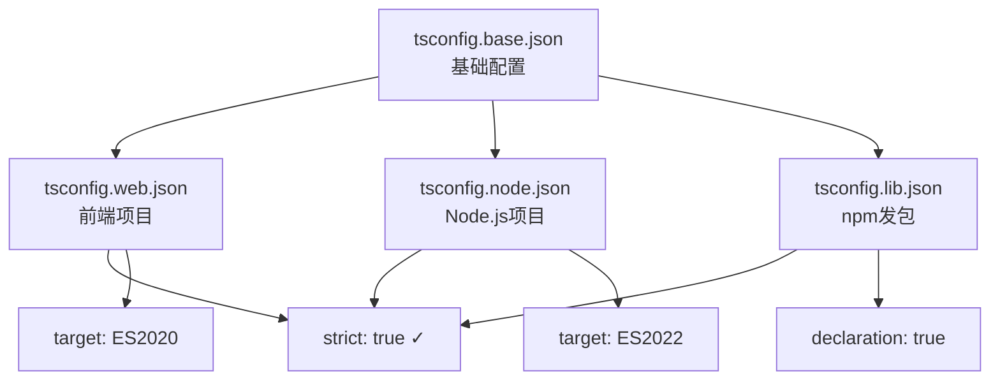
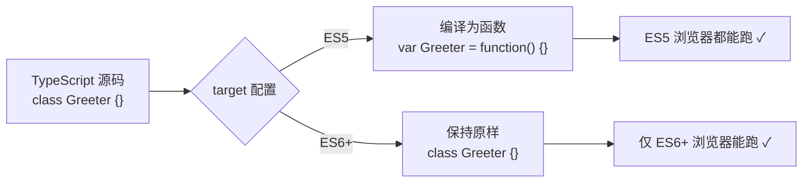
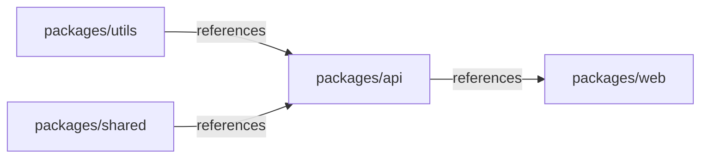

+++
title = "第12章 tsconfig.json完整配置指南"
weight = 120
date = "2026-03-26T21:05:00+08:00"
type = "docs"
description = ""
isCJKLanguage = true
draft = false
+++

# 第 12 章 tsconfig.json 完整配置指南

> **本章说明**：tsconfig.json 是 TypeScript 项目的心脏，本章按配置项的功能分组，每组内按使用频率排序，并说明配置之间的依赖关系与常见场景的推荐组合。

## 12.1 tsconfig.json 基础

你有没有想过，为什么 TypeScript 项目放在那里，它就知道「我要编译哪些文件」「我要输出到哪里」「我要不要严格检查」？答案是 —— 全靠一个叫 `tsconfig.json` 的配置文件。

如果说 TypeScript 是一个交响乐团，那么 `tsconfig.json` 就是指挥家手里的那份总谱。没有它，TypeScript 就像一群没有指挥的乐手各吹各的号，那场面，啧啧，比广场舞大妈抢地盘还混乱。

所以，让我们来好好认识一下这份「总谱」吧！

### 12.1.1 配置文件结构

先来看看 `tsconfig.json` 长什么样子。打开一个项目根目录下的 `tsconfig.json`，你大概会看到这样的内容：

```json
{
  "compilerOptions": {
    "target": "ES2020",
    "module": "commonjs",
    "strict": true
  },
  "include": ["src/**/*"],
  "exclude": ["node_modules", "dist"]
}
```

这份文件看起来就像一个 JSON，但等等 —— 它其实支持注释！没错，`tsconfig.json` 严格来说不是一个「标准 JSON」，而是一个「JSON with Comments」文件（有些地方叫 JSONC）。所以你可以放心大胆地写注释，比如：

```json
{
  // 这是我的第一个 tsconfig 文件！
  "compilerOptions": {
    "target": "ES2020", // 编译目标：ES2020，摩登现代
    "strict": true      // 严格模式，不解释，燥起来！
  }
}
```

> 💡 **小知识**：TypeScript 团队在设计 tsconfig.json 时，专门让编译器能够读取带注释的配置，这可比标准 JSON 人性化多了。标准 JSON 想写注释？门都没有，它会直接报错：*「我不管你写的啥，语法错误！」*

---

#### 12.1.1.1 `compilerOptions`：编译选项（最核心的配置区）

`compilerOptions` 是 `tsconfig.json` 中最最重要的一个字段，没有之一。它是一个巨大的对象，里面塞满了 TypeScript 编译器的各种配置开关。你可以把它想象成一个巨型控制面板，上面有一堆按钮和旋钮，每个都控制着编译器的某个行为。

这个字段里面可以配置的东西多到什么程度呢？多到 TypeScript 官方文档光是讲 `compilerOptions` 就能写上一百多页。所以本章接下来的好几节，都是在讲 `compilerOptions` 里面的各项配置。

从大类来说，`compilerOptions` 控制了：

- **编译目标**：`target` 告诉编译器「我要编译成哪个 ECMAScript 版本」
- **模块系统**：`module` 告诉编译器「我要用哪种模块化方式输出」
- **类型检查严格度**：`strict` 系列选项控制「我要多严格地检查你的代码」
- **输出行为**：`outDir`、`declaration`、`sourceMap` 等控制编译产物的走向
- **路径解析**：`baseUrl`、`paths`、`moduleResolution` 控制「找不到文件时去哪里找」
- **代码质量**：`noUnusedLocals`、`noImplicitReturns` 等帮你揪出代码里的臭虫

> 🔧 **配置建议**：新手建议先从官方推荐的「严格模式」起步，设置 `"strict": true`，这相当于给编译器开启了「强制体检」模式 —— 虽然有时候会絮絮叨叨，但真的能帮你提前发现很多隐藏的 Bug。

---

#### 12.1.1.2 `include`：指定哪些文件/目录包含在编译范围

`include` 字段告诉 TypeScript：「喂，编译器同学，这些目录下的 `.ts` 和 `.tsx` 文件是你的菜，别漏了，也别多了。」

它的取值是一个数组，每个元素可以是：

- **glob 模式**：比如 `"src/**/*"` 表示 `src` 目录下所有文件
- **具体文件**：比如 `"src/main.ts"` 表示只编译这个文件
- **目录**：比如 `"src"` 会被解释为 `"src/**/*"`

常见的写法：

```json
{
  "include": [
    "src/**/*",        // src 目录下的所有 TypeScript 文件
    "tests/**/*",      // tests 目录下的所有测试文件
    "src/main.ts"      // 加上一个具体的入口文件
  ]
}
```

这里有一个非常有意思的点 —— `**` 在 glob 模式里是「匹配任意层级目录」的意思。你可以把它理解为「递归地找」。

> 📂 **目录结构小剧场**：
>
> 假设你有这样的目录结构：
>
> ```
> project/
>   tsconfig.json
>   src/
>     main.ts
>     utils/
>       helper.ts
>     nested/
>       deep/
>         very-deep/
>           secret.ts
> ```
>
> 那么 `"include": ["src/**/*"]` 会匹配到：
> - `src/main.ts` ✓
> - `src/utils/helper.ts` ✓
> - `src/nested/deep/very-deep/secret.ts` ✓
>
> 就连藏在「十八层地下」的 `secret.ts` 也逃不过 `**` 的火眼金睛！

---

#### 12.1.1.3 `exclude`：从编译范围中排除某些文件/目录

`exclude` 字段和 `include` 恰好相反，它是「黑名单」—— 告诉 TypeScript：「这些文件/目录你别管，就算它们是 `.ts` 文件，也给我无视它们。」

```json
{
  "include": ["src/**/*"],
  "exclude": [
    "node_modules",         // 第三方库，不需要编译
    "dist",               // 输出目录，别把自己编译进去
    "**/*.test.ts",       // 测试文件，一般不需要参与生产构建
    "src/**/*.spec.ts"    // 另一个常见的测试文件命名方式
  ]
}
```

> ⚠️ **重要规则**：`exclude` 有一些「潜规则」你必须知道：
>
> 1. **默认排除 `node_modules`**：就算你不写 `"exclude": ["node_modules"]`，TypeScript 也会自动排除它
> 2. **如果显式写了 `exclude`，默认行为会被覆盖**：这时候如果你想继续排除 `node_modules`，必须手动写上
> 3. **输出目录（outDir）默认会被排除**：但如果你自己指定了 `exclude`，这个默认行为也可能消失

```json
{
  "compilerOptions": {
    "outDir": "./dist"
  },
  // ⚠️ 注意：这里写了 exclude，但没有包含 "dist"
  // 如果你的 outDir 是 dist，TypeScript 可能不会自动排除它了
  // 所以建议还是把 dist 显式写进 exclude 里
  "exclude": ["node_modules", "dist"]
}
```

---

#### 12.1.1.4 `files`：显式指定要编译的单个文件列表（优先级高于 include）

如果说 `include` 是「这个目录下的所有文件都归我管」，那么 `files` 就是「我只编译这几个文件，给我精确打击」。

```json
{
  "files": [
    "src/main.ts",       // 入口文件
    "src/polyfill.ts",   // 腻子文件（兼容性填充）
    "src/global.d.ts"   // 全局类型声明
  ]
}
```

`files` 的优先级比 `include` **高**。如果你同时写了 `files` 和 `include`，TypeScript 会完全忽略 `include`，只看你 `files` 里列出的那几个文件。

> 🎯 **使用场景**：`files` 适合用在小型项目或者配置文件驱动的场景，比如：
> - 只有一个入口文件的简单工具
> - 需要精确控制编译范围的脚手架项目
> - monorepo 中某些只包含少量文件的包

---

#### 12.1.1.5 `extends`：继承另一个 tsconfig 文件的配置

`extends` 是 TypeScript 2.1 引入的一个超实用功能 —— 它允许你创建一个「配置文件继承链」。

想象一下这个场景：你的公司有三个项目，分别是「前端项目」「Node.js 后台项目」和「npm 发包项目」。这三个项目有很多共同的配置（比如都使用 `strict: true`），但也有一些各自不同的配置。

没有 `extends` 的时候，你只能在每个项目的 `tsconfig.json` 里重复写相同的配置，改一行要改三个文件，改着改着就改岔了。

有了 `extends`，事情就简单多了：

```json
// tsconfig.base.json —— 基础配置，所有项目都继承它
{
  "compilerOptions": {
    "strict": true,              // 三个项目都开启严格模式
    "esModuleInterop": true,      // 允许通过 default import 导入 commonjs 模块
    "skipLibCheck": true,         // 跳过第三方库的类型检查，加速编译
    "forceConsistentCasingInFileNames": true  // 强制文件名大小写一致
  }
}
```

```json
// tsconfig.web.json —— 前端项目
{
  "extends": "./tsconfig.base.json",  // 继承基础配置
  "compilerOptions": {
    "target": "ES2020",
    "lib": ["ES2020", "DOM", "DOM.Iterable"],
    "module": "ESNext",
    "moduleResolution": "bundler"
  },
  "include": ["src/**/*"]
}
```

```json
// tsconfig.node.json —— Node.js 后台项目
{
  "extends": "./tsconfig.base.json",
  "compilerOptions": {
    "target": "ES2022",
    "lib": ["ES2022"],
    "module": "NodeNext",
    "moduleResolution": "NodeNext",
    "types": ["node"]
  },
  "include": ["src/**/*"]
}
```

> 🔗 **继承链的工作原理**：
>
> - 当 TypeScript 读取 `tsconfig.web.json` 时，它会先加载 `tsconfig.base.json`，然后把 `tsconfig.web.json` 里的配置「叠上去」
> - 如果同一个配置项在子配置和父配置里都出现了，**子配置优先**（覆盖原则）
> - 这个过程可以无限嵌套



---

#### 12.1.1.6 `compileOnSave`：保存时触发编译（仅 Visual Studio / VS Code 等支持 LSP 的 IDE 生效，命令行编译不受此影响）

`compileOnSave` 是一个看起来很美好但实际用处非常有限的配置项。

```json
{
  "compileOnSave": true
}
```

它的作用是：当你在 IDE（比如 Visual Studio）里保存 `.ts` 文件时，自动触发一次编译。

听起来很棒对不对？但现实是骨感的：

> ⚠️ **这个配置不起作用的情况**：
>
> 1. **命令行 `tsc` 完全无视它**：你在终端里跑 `tsc`，管你 `compileOnSave` 写的是啥，它都不 care
> 2. **VS Code 不支持**（除非你装额外的插件）：VS Code 本身不会因为这个选项就自动编译 TypeScript 文件
> 3. **Webpack / Vite 等构建工具也不受影响**：这些 bundler 有自己的文件监视和增量构建机制，不走 tsc 的 `compileOnSave`

那么它到底对谁有用呢？主要是 **Visual Studio**（Windows 上的 Visual Studio，不是 VS Code）用户。对于其他所有人来说，这个选项基本上等于没写。

> 🍃 **佛系建议**：与其依赖这个，不如直接开 `tsc --watch` 或者用 Vite/Webpack 的热更新。反正你保存代码的时候，这些工具都会帮你重新编译的，还更可靠。

---

#### 12.1.1.7 `watchOptions`：监视模式下的配置项

当你运行 `tsc --watch`（或者 `tsc -w`）时，TypeScript 会进入监视模式 —— 它会盯着文件系统，一旦发现 `.ts` 文件有变化，就自动重新编译。

`watchOptions` 就是用来精细化控制这个「监视行为」的。

```json
{
  "watchOptions": {
    "watchFile": "useFsEvents",
    "watchDirectory": "useFsEvents",
    "fallbackPolling": "dynamicPriority"
  }
}
```

**`watchFile` 的可选值：**

| 值 | 说明 | 适用场景 |
|---|---|---|
| `"fixedPollingInterval"` | 固定间隔轮询（比如每 2 秒检查一次）| 高 CPU 消耗，慎用 |
| `"dynamicPriorityPolling"` | 动态优先级轮询 | 自动调整检查频率 |
| `"useFsEvents"`（**推荐**）| 使用操作系统底层文件事件 | 高效，Linux 用 `inotify`，macOS 用 `FSEvents`，Windows 用 `ReadDirectoryChangesW` |

**`watchDirectory` 的可选值：**

| 值 | 说明 |
|---|---|
| `"fixedPollingInterval"` | 固定间隔轮询 |
| `"dynamicPriorityPolling"` | 动态优先级轮询 |
| `"useFsEvents"`（**推荐**）| 使用文件系统事件 |

> 💡 **为什么推荐 `useFsEvents`**：因为它用的是操作系统内核的文件系统事件通知机制，有变化才通知，不需要反复去「问」磁盘有没有变化。用轮询的话，CPU 会很累；用事件通知，CPU 就可以躺平了。

> 🎛️ **大多数情况下你不需要配置 `watchOptions`**：TypeScript 的默认行为已经相当智能了。只有当你在特殊环境（比如网络文件系统、Docker 容器、虚拟机共享文件夹）里遇到监视问题时，才需要调整这些选项。

### 12.1.2 小结

本节我们认识了 `tsconfig.json` 的基本结构，这是整个 TypeScript 世界的「总指挥谱」：

- **`compilerOptions`** 是最核心的配置区，控制着编译器的所有行为
- **`include` / `exclude` / `files`** 控制「编译哪些文件」
- **`extends`** 让我们可以搭建配置的继承链，实现配置的复用和分层管理
- **`compileOnSave`** 基本上是个「安慰剂」，大多数情况下不用管它
- **`watchOptions`** 控制 `tsc --watch` 的监视行为，高级场景才需要调

下一节我们将深入 `compilerOptions`，从编译目标（`target`）开始，一一拆解那些最常用的配置项。准备好了吗？系好安全带，我们继续！ 🚀

---

## 12.2 tsc --init 的变化（TS 5.9 更新）

`tsc --init` 是 TypeScript 提供的一个快速生成 `tsconfig.json` 的命令。想象一下，你刚装好 TypeScript，两眼一抹黑，不知道该写什么配置 —— 没问题，跑一下这个命令，它就会帮你生成一个「标准模板」。

但是在 TypeScript 5.9 之前，这个命令生成出来的配置文件，简直就是「选择困难症患者的地狱」。

### 12.2.1 以前：生成大量注释化配置项（50+ 行）

在 TS 5.9 之前，运行 `tsc --init` 会生成一个包含 **50+ 行注释化配置项** 的 `tsconfig.json`。每个配置项都带有一段注释告诉你它是干啥的，但问题在于 —— 注释太多了！整整 50 多行，全是 `# COMMENTED OUT`，新手一看就懵了：这啥意思？我该开哪个关哪个？

大概是这个样子（节选）：

```json
{
  // "compilerOptions": {
    /* Visit https://aka.ms/tsconfig to read more about this file */
    /* Projects */
    // "incremental": true,
    // "composite": true,
    /* Language and Environment */
    // "target": "ES2020",
    // ...
    // 一共有 50+ 个被注释掉的选项！
  // }
}
```

> 🤯 **选择困难症发作现场**：打开这个文件，面对 50+ 个注释掉的选项，新手的内心 OS 是 ——「我一个都不想选，但我必须选一个，这可怎么办？！」

### 12.2.2 现在：minimal 模式，仅包含推荐配置项及注释链接

TS 5.9 彻底改变了这个局面！现在的 `tsc --init` 默认只生成 **一个极简的推荐配置**，而不是 50+ 个让人头秃的选项。

```bash
# 运行 tsc --init，它会生成一个 minimal 的 tsconfig.json
tsc --init
```

生成的默认配置大概是这个样子：

```json
{
  "compilerOptions": {
    /* 编译目标：ES 最新版本 */
    "target": "ESNext",
    /* 模块系统：NodeNext 模式（支持 ESM + CJS 混合）*/
    "module": "NodeNext",
    /* 不自动引入任何类型声明包（需要手动指定）*/
    "types": [],
    /* 生成 sourcemap，方便调试 */
    "sourceMap": true,
    /* 生成声明文件（.d.ts）*/
    "declaration": true,
    /* 生成声明文件的 sourcemap */
    "declarationMap": true,
    /* 开启所有严格类型检查 */
    "strict": true
  }
}
```

> ✨ **TS 5.9 的改进**：从 50+ 个注释选项精简到 7 个推荐选项，每个选项后面还有注释告诉你它是干啥的。这才是「新手友好」的正确打开方式！

### 12.2.3 推荐配置示例

下面给出几种常见场景的推荐配置组合：

**推荐配置示例 —— 现代前端项目（Vite + React/Vue）**

```json
{
  "compilerOptions": {
    // 编译目标：ES 最新语法
    "target": "ESNext",
    // 模块系统：交给 bundler 处理，用 ESNext
    "module": "ESNext",
    // 模块解析策略：bundler 模式，模拟 Vite/Webpack/Rollup 的行为
    "moduleResolution": "bundler",
    // JSX 处理：React 17+ 的新 JSX 运行时，不需要手动 import React
    "jsx": "react-jsx",
    // 是否允许编译输出 JavaScript 文件
    "noEmit": false,
    // 开启所有严格检查
    "strict": true,
    // 跳过 node_modules/@types 的类型检查（大幅加速）
    "skipLibCheck": true
  },
  "include": ["src/**/*"],
  "exclude": ["node_modules", "dist"]
}
```

**推荐配置示例 —— Node.js 20+ 项目（原生 ESM）**

```json
{
  "compilerOptions": {
    "target": "ES2022",
    "module": "NodeNext",
    "moduleResolution": "NodeNext",
    "types": ["node"],
    "outDir": "./dist",
    "declaration": true,
    "strict": true,
    "skipLibCheck": true
  },
  "include": ["src/**/*"],
  "exclude": ["node_modules", "dist", "**/*.test.ts"]
}
```

**推荐配置示例 —— npm 库 / 组件库**

```json
{
  "compilerOptions": {
    "target": "ES2020",
    "module": "ESNext",
    "moduleResolution": "bundler",
    // 生成 .d.ts 声明文件 —— npm 包必须开启！
    "declaration": true,
    "declarationMap": true,
    "sourceMap": true,
    "outDir": "./dist",
    "strict": true,
    "skipLibCheck": true
  },
  "include": ["src/**/*"],
  "exclude": ["node_modules", "dist", "**/*.test.ts"]
}
```

> 📦 **npm 发包小贴士**：如果你要发布 npm 包，有一个非常重要的配置千万别忘了 —— `declaration: true`！没有这个，你的包就没有类型声明文件，TypeScript 用户用 `import` 导入你的包时，编译器会报 `Could not find a declaration file` 错误。

### 12.2.4 小结

本节我们了解了 `tsconfig.json` 的两种生成方式 —— 老版本的 50+ 行注释化配置（TS 5.9 之前）和新版本的极简推荐配置（TS 5.9+）。新版本的 `tsc --init` 更加新手友好，本节还给出了三种常见场景的推荐配置组合。

下一节我们将深入 `compilerOptions`，从编译目标（`target`）开始！

---

## 12.3 编译目标配置

好了，现在我们要开始真正折腾 `compilerOptions` 这个巨型控制面板了。

它们决定了「TypeScript 编译出来的 JavaScript 长什么样」。这就像是你在做一道菜，这些配置决定了「最终端上桌的菜品是什么口味、什么卖相」。

### 12.3.1 target

#### 12.3.1.1 作用：指定编译输出的 ECMAScript 版本

`target` 是 `compilerOptions` 中出场率最高的配置之一。它的作用非常直接：**告诉 TypeScript「把我写的 TypeScript 代码，编译成哪个版本的 JavaScript」。**

```json
{
  "compilerOptions": {
    "target": "ES2020"
  }
}
```

#### 12.3.1.2 常用值

| target 值 | 说明 |
|---|---|
| `"ES5"` | 老古董浏览器（IE11 等），几乎没人用了 |
| `"ES6"` / `"ES2015"` | 里程碑版本，引入 class/let/const/箭头函数等 |
| `"ES2017"` | 引入 async/await、SharedArrayBuffer 等 |
| `"ES2020"` | 引入 BigInt、Optional Chaining（?.）、Nullish Coalescing（??）等 |
| `"ESNext"` | 永远指向 TypeScript 支持的最新版本，激进派首选 |

> 🎭 **ESNext 的利弊**：使用 `ESNext` 意味着「我能用多新就用多新」，好处是代码可以永远用上最新语法，坏处是你的代码只能在最新浏览器里运行。如果你的用户还有人在用 IE11，那 `ESNext` 就是一场灾难。

#### 12.3.1.3 为什么 ES5 目标下 class 会被编译为函数

在 ES5 里，JavaScript 根本没有 `class` 关键字。所以当你写了：

```typescript
class Greeter {
  greeting: string;
  constructor(message: string) {
    this.greeting = message;
  }
  greet() {
    return "Hello, " + this.greeting;
  }
}
```

如果 `target` 是 `ES5`，TypeScript 会把它编译成：

```javascript
"use strict";
var Greeter = /** @class */ (function () {
  function Greeter(message) {
    this.greeting = message;
  }
  Greeter.prototype.greet = function () {
    return "Hello, " + this.greeting;
  };
  return Greeter;
})();
```

但如果 `target` 是 `ES6` 或更高版本，class 语法保持原样！

> 📊 **一个形象的比喻**：如果把 `target` 比作「翻译的目标语言」，那么：
> - `target: ES5` = 把你写的现代语法翻译成英语五级水平（简单词汇，简单句式，婴儿都能看懂）
> - `target: ESNext` = 原文输出，不翻译（译者内心OS：原文已经很优雅了，翻什么翻！）



### 12.3.2 module

#### 12.3.2.1 作用：指定输出代码使用的模块系统

`module` 配置决定了「编译出来的 JavaScript 代码用什么方式组织模块」。是 `require` 还是 `import`？是 CommonJS 还是 ES Module？这全由 `module` 说了算。

#### 12.3.2.2 常用值

**`commonjs`**：Node.js 默认的模块系统，用 `require` 导入，`module.exports` 导出。Node.js 后台项目的首选。

```javascript
// 输入
import { readFile } from "fs";
// 输出
const fs = require("fs");
```

**`amd`**：RequireJS 等异步模块加载器使用的格式。2012-2015 年流行，现在基本淘汰了。

**`system`**：SystemJS 模块加载器使用的格式。同样是浏览器端模块化的早期方案，现在也不太流行了。

**`es2015` / `es6`**：原生 ES Module。浏览器原生支持，需要配合 `<script type="module">` 或经过 bundler 处理。

**`es2020` / `esnext`**：最新的 ES 模块特性，支持动态 `import()`。

**`nodenext`**：Node.js 最新版（12+）的模块策略，支持 ESM 和 CommonJS 混合。

**`preserve`**：最特殊的模式 —— 不做任何模块转换！原封不动保留你写的 `import`/`export` 语法。用于 TypeScript-to-TypeScript 转译场景。

#### 12.3.2.3 `--module node20`（TS 5.9 新增）

这是 TypeScript 5.9 新增的一个特殊模块模式，专门为 Node.js 20+ 的原生 ESM 模式设计。

```json
{
  "compilerOptions": {
    "module": "Node20",
    "moduleResolution": "Node20"
  }
}
```

> 🆕 **Node20 和 NodeNext 的区别**：`Node20` 是 TypeScript 5.9 专门为 Node.js 20+ 新增的模式，比 `NodeNext` 更精确地跟进 Node.js 的最新模块规范。

### 12.3.3 moduleResolution：模块解析策略

`moduleResolution` 是 TypeScript 里最容易被忽视、但出问题又最让人抓狂的配置之一。它的作用是告诉 TypeScript：「当我在代码里写 `import something from './utils'`，你应该去哪里找这个文件？」

#### 12.3.3.1 `classic`：早期 TS 的解析策略，已不推荐

这是 TypeScript 最早期的模块解析策略，已经基本没人用了。只有在维护特别老旧的项目时才会碰到它。

> ⚠️ **除非你在维护 2015 年之前的 TypeScript 项目，否则不要用这个策略**。

#### 12.3.3.2 `node`：Node.js CommonJS 解析策略

这是 Node.js CommonJS 模式的模块解析策略，也是大多数传统 Node.js 项目在用的策略。

```
import x from './utils'
                    ↓
         先找 ./utils.ts
              ↓ 没有?
         再找 ./utils.tsx
              ↓ 没有?
         再找 ./utils/index.ts
              ↓ 没有?
         报错: Cannot find module './utils'
```

#### 12.3.3.3 `node16`（TS 4.7+）：Node.js 16+ 的 ESM 支持策略

TypeScript 4.7 引入了 `node16` 策略，专门用来支持 Node.js 16+ 的原生 ESM 模式。

这个策略的关键特点是：**要求 `package.json` 中有 `"type": "module"`**。

```json
{
  "name": "my-esm-package",
  "type": "module",   // ← 这个字段必须有！
  "main": "./dist/index.js"
}
```

#### 12.3.3.4 `nodenext`：Node.js 最新策略

`nodenext` 是 `node16` 的「激进升级版」，它会更快地跟进 Node.js 的最新模块特性。

> **建议**：新项目用 `nodenext`，老项目升级到 `node16` 就够了。

#### 12.3.3.5 `bundler`（TS 5.7+）：模拟 Vite、Webpack、Rollup 等打包工具的模块解析行为

TypeScript 5.7 引入了 `bundler` 策略，这是前端项目最推荐的模块解析策略。

| 特性 | Node.js (node/node16/nodenext) | Bundler (bundler) |
|---|---|---|
| `.js` 导入 `.ts` 文件 | ❌ 不允许 | ✅ 允许 |
| `import "./utils"` 自动找 `./utils.ts` | ❌ 不行 | ✅ 可以 |
| 同时使用 ESM 和 CommonJS | ⚠️ 受限 | ✅ 允许 |
| 需要 `package.json` 的 `type` 字段 | ✅ 需要 | ❌ 不需要 |

> 🎯 **bundler 策略是前端项目的最佳选择**。如果你用的是 Vite、Webpack 5+、Rollup、esbuild 等 bundler，请一定把 `moduleResolution` 设为 `"bundler"`。

#### 12.3.3.6 解析策略选用建议

```
你的项目跑在哪里？
  ├─ Node.js？
  │   ├─ 纯 CommonJS（老项目）→ module: CommonJS + moduleResolution: node
  │   └─ ESM（Node.js 16+）→ module: Node16 + moduleResolution: Node16
  │
  └─ 浏览器？
      └─ 用 bundler 吗？（Vite/Webpack/Rollup/esbuild）→ moduleResolution: bundler
          └─ 不用 bundler？→ 你确定不用 bundler？再想想？
```

### 12.3.4 lib：运行时包含的 API 库声明文件列表

`lib` 是 TypeScript 里一个「存在感很低，但关键时刻能救命」的配置项。

当你写 `document.querySelector()` 的时候，TypeScript 怎么知道 `document` 是什么、有哪些方法？答案就是 **`lib`**。

```json
{
  "compilerOptions": {
    "lib": ["ES2020", "DOM", "DOM.Iterable"]
  }
}
```

| lib 值 | 含义 | 典型使用场景 |
|---|---|---|
| `"esnext"` | ES 最新版本的所有内置 API | 现代浏览器、最新 Node.js |
| `"dom"` | 浏览器 DOM API（`document`、`window` 等）| 浏览器端项目 |
| `"dom.iterable"` | DOM 的可迭代对象 API | 浏览器端项目 |
| `"webworker"` | Web Worker API | Web Worker 环境 |
| `"node"` | Node.js 内置 API（需要安装 `@types/node`）| Node.js 环境 |

> 🐛 **常见错误**：当你设置了 `"target": "ES5"` 但没有指定 `lib` 时，TypeScript 会默认使用 ES5 的内置类型声明，而 ES5 标准里没有 DOM！所以写了 `document.querySelector()` 就会报错。解决方法：加上 `"lib": ["ES2020", "DOM"]`。

### 12.3.5 小结

本节我们深入讲解了 TypeScript 编译目标相关的核心配置：

- **`target`**：决定编译输出的 ECMAScript 版本
- **`module`**：决定输出代码使用哪种模块系统（CommonJS / ESM / AMD 等）
- **`moduleResolution`**：决定 TypeScript 如何「找文件」，选错会报一堆找不到模块的错误
- **`lib`**：告诉 TypeScript「运行环境里有哪些 API 可用」

记住这个黄金组合：
> 前端项目 → `"module": "ESNext"` + `"moduleResolution": "bundler"`
> Node.js 项目 → `"module": "NodeNext"` + `"moduleResolution": "NodeNext"`

下一节我们将学习路径与文件配置 —— `baseUrl`、`paths`、`rootDirs` 等！

---

## 12.4 路径与文件配置

你有没有过这样的经历：在代码里写了一个超长的相对路径 `import { Button } from '../../../../components/Button'`，然后每次移动文件都要改一遍这个路径，改到怀疑人生？

别慌！本节介绍的这些配置，就是为了解决这些痛苦的。

### 12.4.1 baseUrl

#### 12.4.1.1 作用：模块解析的基础路径，所有相对路径解析的起点

`baseUrl` 是路径解析的「地基」。它定义了「所有没有以 `/`、`./`、`../` 开头的模块路径」从哪个目录开始解析。

```json
{
  "compilerOptions": {
    "baseUrl": "./src"
  }
}
```

#### 12.4.1.2 常见错误：baseUrl 必须指向包含所有源码的根目录

`baseUrl` 有一个非常重要的约束：**它必须指向一个包含所有源码的目录**。

```json
{
  // ⚠️ 错误示例
  "compilerOptions": {
    "baseUrl": "./src/components",
    "paths": {
      "@utils/*": ["utils/*"]  // ← 找不到！因为 ./src/components/utils 不存在！
    }
  }
}
```

```json
{
  // ✅ 正确示例：baseUrl 指向包含所有源码的根目录
  "compilerOptions": {
    "baseUrl": "./src",
    "paths": {
      "@utils/*": ["utils/*"],
      "@components/*": ["components/*"]
    }
  }
}
```

### 12.4.2 paths

#### 12.4.2.1 作用：路径别名映射

`paths` 允许你定义「路径别名」—— 给一个很长的路径起一个简短的别名。

```json
{
  "compilerOptions": {
    "baseUrl": ".",
    "paths": {
      "@/*": ["src/*"],
      "@components/*": ["src/components/*"],
      "@utils/*": ["src/utils/*"]
    }
  }
}
```

这样，你就可以在代码里写：

```typescript
// 之前（令人窒息的相对路径）
import Button from "../../../components/Button";

// 现在（清爽的别名）
import Button from "@components/Button";
```

#### 12.4.2.2 Bundler 配合：paths 只影响 TS 编译；实际 bundler 需要在配置中同步配置 alias

这是**一个超级容易踩的坑**！

`paths` 配置**只影响 TypeScript 编译器的模块解析**，它不会改变最终编译输出的 JavaScript 代码！

```typescript
// 源代码
import utils from "@/utils";

// 编译后输出的 JavaScript 代码里，依然是：
import utils from "@/utils";  // ← 别名没有被替换！
```

TypeScript 只做了类型检查，实际做路径转换的是 **bundler**。所以你还需要在 bundler 配置里设置同样的 alias：

**Vite 配置（vite.config.ts）**

```typescript
// vite.config.ts
import path from "path";
export default {
  resolve: {
    alias: {
      "@": path.resolve(__dirname, "./src"),
      "@components": path.resolve(__dirname, "./src/components"),
      "@utils": path.resolve(__dirname, "./src/utils")
    }
  }
};
```

> ⚠️ **两边都要配置，缺一不可**：
> - `tsconfig.json` 的 `paths` → 给 TypeScript 编译器看（做类型检查）
> - bundler 配置的 `alias` → 给最终打包工具看（做路径替换）

### 12.4.3 rootDirs

`rootDirs` 的主要用途是**解决「源码目录结构需要映射到输出目录结构」的问题**。最典型的使用场景是 monorepo 项目和代码生成场景。

```json
{
  "compilerOptions": {
    "rootDirs": ["src", "generated"]
  }
}
```

这样 TypeScript 会把 `src` 和 `generated` 的目录结构都映射到输出目录中。

### 12.4.4 include / exclude / files

- **`include`**：glob 模式匹配，`"src/**/*"` 表示 src 目录下所有文件
- **`exclude`**：排除模式，`"**/*.test.ts"` 排除所有测试文件
- **`files`**：显式文件列表，优先级最高，一旦写了 `files`，`include` 就被完全忽略

> ⚠️ **常见错误**：显式写了 `exclude` 后，`node_modules` 不再被自动排除，必须手动加上。

### 12.4.5 小结

本节我们学习了 TypeScript 的路径与文件配置：

- **`baseUrl`**：路径解析的「地基」，所有相对路径都基于它计算
- **`paths`**：路径别名，让你可以写 `@/utils` 而不是 `../../../../utils`，但别名替换需要 bundler 配合
- **`rootDirs`**：让多个目录被视为同一个逻辑根目录
- **`include` / `exclude` / `files`**：三剑客控制编译范围

下一节我们将进入「输出配置」！

---

## 12.5 输出配置

接下来要解决的问题是：**编译出来的文件放到哪里？长什么样？**

这就要靠本节的「输出配置」了。它们决定了 TypeScript 编译的「产房」—— 文件在哪里出生（`outDir`）、有没有出生证明（`.d.ts`）、有没有 GPS 定位（`.map`）等等。

### 12.5.1 outDir

`outDir` 用来告诉 TypeScript：「编译完了，产物给我放到这个目录里去。」

```json
{
  "compilerOptions": {
    "outDir": "./dist",
    "rootDir": "./src"
  }
}
```

> 📂 **注意**：`outDir` 会**保留源码的目录结构**！

### 12.5.2 rootDir

`rootDir` 告诉 TypeScript：「我的源码根目录是这个」。TypeScript 会根据 `rootDir` 来推断输出文件的目录结构。

```json
{
  "compilerOptions": {
    "rootDir": "./src",
    "outDir": "./dist"
  }
}
```

> ⚠️ **常见错误**：如果 `rootDir` 和 `outDir` 配合使用时，所有 `include` 的文件必须在 `rootDir` 下，否则会报错。

### 12.5.3 declaration / declarationMap

**`declaration`**：是否生成 `.d.ts` 声明文件。npm 包必备！

```json
{
  "compilerOptions": {
    "declaration": true
  }
}
```

**`declarationMap`**：开启后生成 `.d.ts.map`，让 IDE 能够从 `.d.ts` 文件「跳」回到原始的 `.ts` 源文件。

> 🎯 **建议**：如果你在发布 npm 包，`declaration` 和 `declarationMap` 都应该开启。

### 12.5.4 sourceMap

`sourcemap` 是一种调试辅助文件，让调试器能够把压缩后的代码「还原」回原始的样子。

```json
{
  "compilerOptions": {
    "sourceMap": true
  }
}
```

> ⚠️ **生产环境注意事项**：`sourceMap` 会暴露源代码，如果你的代码是商业机密，生产环境最好不要开启。

### 12.5.5 noEmit / emitDeclarationOnly

**`noEmit: true`**：只做类型检查，不输出任何 `.js` 文件。Vite/esbuild 项目必备。

**`emitDeclarationOnly: true`**：只输出 `.d.ts` 声明文件，不输出 JavaScript。适合纯类型包场景。

```json
{
  "compilerOptions": {
    // CI 场景：只做类型检查，不输出文件
    "noEmit": true,
    "strict": true
  }
}
```

> 🔧 **Vite 项目的标准配置**：
>
> ```json
> {
>   "compilerOptions": {
>     "noEmit": true,       // Vite 的 esbuild 负责编译 JS
>     "strict": true,        // 但类型检查还是 tsc 来
>     "skipLibCheck": true   // 跳过第三方库类型检查，加速
>   }
> }
> ```

### 12.5.6 小结

本节我们全面了解了 TypeScript 的输出配置：

- **`outDir`**：指定编译产物输出到哪里
- **`rootDir`**：指定源码根目录
- **`declaration`**：生成 `.d.ts` 声明文件，npm 包必备！
- **`declarationMap`**：生成声明文件的 sourcemap
- **`sourceMap`**：生成 JS 的 sourcemap
- **`noEmit`**：只类型检查，不输出 JS（配合 Vite/Babel/esbuild 使用）

下一节我们将进入最最重要的配置区域 —— **严格类型检查**！

---

## 12.6 严格类型检查

欢迎来到 TypeScript 最核心的区域 —— **严格类型检查**！

如果说普通类型检查是「机场安检」，那严格类型检查就是「机场安检 + 全身扫描 + 开箱验货 + 问你要去哪 + 查你祖宗十八代」。

### 12.6.1 strict：总开关

`strict` 是 TypeScript 严格检查的「总开关」。开启它，就等于给编译器按下了一排按钮：

```json
{
  "compilerOptions": {
    "strict": true
  }
}
```

当你设置 `"strict": true` 时，以下所有检查会自动开启：

| 子检查项 | 作用 |
|---|---|
| `noImplicitAny` | 禁止隐式 any |
| `strictNullChecks` | 严格空值检查 |
| `strictFunctionTypes` | 函数类型严格检查（参数逆变）|
| `strictPropertyInitialization` | 类属性必须在构造函数中初始化 |
| `strictBindCallApply` | bind/call/apply 参数类型严格检查 |
| `alwaysStrict` | 每个输出文件头部加 `"use strict"` |
| `exactOptionalPropertyTypes` | 精确区分属性「值是 undefined」和「属性不存在」|
| `noUncheckedIndexedAccess` | 数组/对象索引访问返回 T \| undefined |

> 🔒 **建议**：新项目一定要开 `strict: true`。不要因为初期报错多就关掉它 —— 报错多说明代码问题多，早报错比晚报错好一万倍。

> ⚠️ **注意**：`noImplicitReturns` 不是 strict 的子项，需单独开启。

### 12.6.2 noImplicitAny

`noImplicitAny` 是 strict 系列中最基础也最重要的检查之一。

```typescript
// ❌ noImplicitAny: true —— 报错！
function greet(name) {  // Parameter 'name' implicitly has an 'any' type.
  return "Hello, " + name;
}

// ✅ 加了类型注解，编译通过
function greet(name: string): string {
  return "Hello, " + name;
}
```

> 💡 **经验法则**：把 `any` 当成核辐射，用得越少越好。如果你在代码里看到 `any`，第一反应应该是「有没有更具体的类型？」

### 12.6.3 strictNullChecks

`strictNullChecks` 是 **能帮你避免最多运行时错误** 的配置。

```typescript
// ❌ strictNullChecks: true —— 报错！
let name: string = null;   // Error: Type 'null' is not assignable to type 'string'

// ✅ 正确写法：用联合类型明确允许 null/undefined
let name: string | null = null;
```

```typescript
function getUserName(user: { name: string } | null) {
  return user?.name?.toUpperCase() ?? "Anonymous";  // ✅ 安全！
}
```

> 📊 **strictNullChecks 能拦截的经典错误**：`Cannot read property 'xxx' of null`、`undefined is not a function` 等。这些错误在 JavaScript 运行时错误排行榜上常年居高不下。

### 12.6.4 strictFunctionTypes

`strictFunctionTypes` 是关于函数类型兼容性的检查。它涉及一个比较抽象的概念 —— **逆变（contravariance）**。

```typescript
// ❌ strictFunctionTypes: true —— 报错！
let animalFn: (animal: Animal) => void = dogFn;  // Error!
```

> 🔒 **永远不要关闭 `strictFunctionTypes`**。类型安全无小事，协变虽然写起来方便，但埋下的雷迟早会炸。

### 12.6.5 strictPropertyInitialization

`strictPropertyInitialization` 强制要求类的属性在使用前必须被初始化：

```typescript
// ❌ strictPropertyInitialization: true —— 报错！
class User {
  name: string;     // Error: Property 'name' has no initializer
  constructor() {}
}

// ✅ 方法一：在声明时初始化
class User {
  name: string = "Unknown";
}

// ✅ 方法二：在构造函数中初始化
class User {
  name: string;
  constructor(name: string) {
    this.name = name;
  }
}

// ✅ 方法三：声明为可选（? 表示可能是 undefined）
class User {
  name?: string;
}
```

### 12.6.6 strictBindCallApply

`strictBindCallApply` 检查 `bind`、`call`、`apply` 的使用是否类型正确：

```typescript
function greet(name: string, age: number) {
  return `Hello, ${name}, you are ${age} years old.`;
}

// ✅ 正确使用
greet.call(undefined, "Alice", 25);

// ❌ 错误使用
greet.call(undefined, "Alice", "twenty-five");
// Error: Argument of type 'string' is not assignable to parameter of type 'number'
```

### 12.6.7 alwaysStrict

`alwaysStrict` 在每个编译输出的 JavaScript 文件开头加上 `"use strict"` 指令。大多数现代项目默认就在 ES Module 下运行，已经是严格模式了，所以这个选项在新项目里有点多余。

### 12.6.8 exactOptionalPropertyTypes

这是 TypeScript 4.4 引入的一个非常细致的检查项。在开启 `exactOptionalPropertyTypes` 之后，`?:` 和 `!:` 有严格区分：

```typescript
type User = {
  name: string;
  nickname?: string;  // ? 表示属性可以不存在
};

// ✅ nickname 不存在
const user1: User = { name: "Alice" };

// ❌ nickname 存在且为 undefined（注意！这是两个不同的语义）
const user2: User = { name: "Alice", nickname: undefined };
// ↑ TypeScript 会报错！

// ✅ 正确写法 —— 如果你想让属性值为 undefined 也合法，应该用 union type
type User = {
  name: string;
  nickname: string | undefined;  // ← 显式声明
};
```

### 12.6.9 noImplicitReturns

`noImplicitReturns` 要求函数的所有代码路径都必须有返回值：

```typescript
// ❌ noImplicitReturns: true —— 报错！
function getGrade(score: number): string {
  if (score >= 90) return "A";
  if (score >= 80) return "B";
  // ⚠️ 如果 score < 80，函数没有返回值！
}

// ✅ 所有路径都有返回值
function getGrade(score: number): string {
  if (score >= 90) return "A";
  if (score >= 80) return "B";
  return "C";  // ← 加上这个！
}
```

### 12.6.10 noUncheckedIndexedAccess

`noUncheckedIndexedAccess` 让数组和对象的索引访问变得更安全：

```typescript
const arr = ["a", "b", "c"];

// ❌ noUncheckedIndexedAccess: true
const first: string = arr[0];  // Error: 'string | undefined' is not assignable to type 'string'

// ✅ 方法一：加非空断言
const first1: string = arr[0]!;

// ✅ 方法二：显式处理 undefined
const first2: string | undefined = arr[0];
if (first2 !== undefined) {
  console.log(first2.toUpperCase());
}

// ✅ 方法三：用可选链 + 空值合并
console.log(arr[0]?.toUpperCase() ?? "N/A");
```

### 12.6.11 逐步开启 strict 的建议路径

```
第一步：strictNullChecks → 拦截 null/undefined 错误（价值最高）
第二步：noImplicitAny → 消灭隐式 any
第三步：strictFunctionTypes → 修复函数类型的类型安全问题
第四步：strictPropertyInitialization → 修复类属性的初始化问题
第五步：strictBindCallApply → 修复 bind/call/apply 的类型问题
最终：strict: true → 全部开启！
```

### 12.6.12 小结

本节我们深入学习了 TypeScript 的严格类型检查体系：

- **`strict: true`** 是所有严格检查的「一键开启」按钮，新项目必须开
- **`noImplicitAny`** 是类型系统的「防盗门」
- **`strictNullChecks`** 是最能减少运行时错误的检查
- **`strictFunctionTypes`** 保护函数类型的逆变安全
- **`strictPropertyInitialization`** 确保类属性不会被用到未初始化的值
- **`noImplicitReturns`** 保证函数所有路径都有返回值
- **`noUncheckedIndexedAccess`** 让数组/对象索引访问更安全

下一节我们将学习「代码质量与报错控制」！

---

## 12.7 代码质量与报错控制

TypeScript 对你的「关怀」还没有结束。本节介绍的这些配置项，专门用来帮你提升代码质量 —— 揪出那些「能跑但写得很烂」的代码。

### 12.7.1 noUnusedLocals

禁止未使用的局部变量/类属性：

```typescript
// ❌ noUnusedLocals: true —— 报错！
const tax = price * 0.1;  // Error: 'tax' is declared but its value is never read.
```

### 12.7.2 noUnusedParameters

禁止未使用的函数参数：

```typescript
// ❌ noUnusedParameters: true —— 报错！
function greet(name: string, age: number) {
  console.log(`Hello, ${name}!`);  // age 参数被声明但从未使用
}

// ✅ 方法一：使用下划线前缀命名（告诉 TypeScript：我故意的）
function greet(name: string, _age: number) {
  console.log(`Hello, ${name}!`);
}

// ✅ 方法二：如果真的不需要这个参数，直接删掉
function greet(name: string) {
  console.log(`Hello, ${name}!`);
}
```

### 12.7.3 noImplicitOverride

子类覆盖父类方法时必须使用 `override` 关键字：

```typescript
class Animal {
  speak() { return "..."; }
}

class Dog extends Animal {
  // ❌ 报错！methodA 被重写了但没有 override 关键字
  speak() { return "Woof!"; }

  // ✅ 正确
  override speak() { return "Woof!"; }
}
```

### 12.7.4 forceConsistentCasingInFileNames

禁止同一文件在不同大小写路径下被引用（跨平台兼容）：

```json
{
  "compilerOptions": {
    "forceConsistentCasingInFileNames": true
  }
}
```

这个配置对几乎所有项目都是推荐开启的，能防止本地开发和服务器部署的不一致。

### 12.7.5 noFallthroughCasesInSwitch

强制处理 `switch` 语句中的 `case` 贯穿：

```typescript
// ❌ noFallthroughCasesInSwitch: true —— 报错！
switch (grade) {
  case "A":
    console.log("Excellent!");
  case "B":              // Error: Fallthrough case in switch.
    console.log("Good!");
    break;
}

// ✅ 故意贯穿 —— 加注释说明
switch (grade) {
  case "A":
    console.log("Excellent!");
    // falls through
  case "B":
    console.log("Good or Excellent!");
    break;
}
```

### 12.7.6 allowUnreachableCode

控制是否允许无法访问的代码：

```json
{
  "compilerOptions": {
    "allowUnreachableCode": false  // ✅ 推荐：清理这些垃圾代码
  }
}
```

### 12.7.7 allowUnusedLabels

控制是否允许未使用的标签。标签在日常业务代码里几乎用不到，建议关闭：

```json
{
  "compilerOptions": {
    "allowUnusedLabels": false
  }
}
```

### 12.7.8 小结

本节我们学习了 TypeScript 的「代码质量警察」配置：

- **`noUnusedLocals`**：禁止未使用的局部变量
- **`noUnusedParameters`**：禁止未使用的函数参数（下划线前缀可豁免）
- **`noImplicitOverride`**：强制子类重写方法时使用 `override` 关键字
- **`forceConsistentCasingInFileNames`**：强制文件名大小写一致（跨平台兼容性必备）
- **`noFallthroughCasesInSwitch`**：强制处理 switch case 贯穿
- **`allowUnreachableCode`**：禁止不可达代码
- **`allowUnusedLabels`**：禁止未使用的标签

下一节我们将进入「编译性能与缓存配置」！

---

## 12.8 编译性能与缓存配置

TypeScript 编译大型项目时，速度可能是一个让人抓狂的问题。别慌！本节的配置项就是来解决这个问题的。

### 12.8.1 skipLibCheck

**跳过 `node_modules/@types` 下所有 `.d.ts` 文件的类型检查。**

```json
{
  "compilerOptions": {
    "skipLibCheck": true  // ✅ 强烈建议始终开启！
  }
}
```

性能提升效果：对于有大量 `node_modules` 的大型项目，`skipLibCheck` 可以将编译时间**减少 30% 到 50%**。

> ⚠️ **注意**：不会跳过显式 `include` 的 `.d.ts` 文件。只有 `node_modules/@types` 下的文件会被跳过。

### 12.8.2 incremental

增量编译，保存 `.tsbuildinfo`：

```json
{
  "compilerOptions": {
    "incremental": true  // ✅ 大型项目建议开启
  }
}
```

> 💡 **注意**：`.tsbuildinfo` 文件通常应该加入 `.gitignore`，因为它是机器生成的缓存，不应该提交到代码仓库。


### 12.8.3 assumeChangesOnlyAffectDirectDependencies

假设文件变化只影响直接依赖，不影响间接依赖：

```json
{
  "compilerOptions": {
    "assumeChangesOnlyAffectDirectDependencies": true
  }
}
```

> 🚀 **适合场景**：大型 monorepo 项目、依赖层级很深的多包项目。

### 12.8.4 小结

本节我们学习了 TypeScript 的性能优化配置：

- **`skipLibCheck: true`**：跳过 `node_modules/@types` 的类型检查，**强烈建议始终开启**
- **`incremental: true`**：增量编译，大型项目必备
- **`assumeChangesOnlyAffectDirectDependencies: true`**：减少增量构建时的依赖追踪开销

下一节我们将学习「JSX 配置」！

---

## 12.9 JSX 配置

如果你在使用 React、Vue 3、Solid.js 或者其他 JSX 框架，本节的内容就是为你准备的！

### 12.9.1 jsx

| 值 | 说明 |
|---|---|
| `"react"` | 传统 `React.createElement` 模式（需要 `import React from 'react'`）|
| `"react-jsx"`（**推荐**）| React 17+ 新 JSX 运行时模式，不需要导入 React |
| `"preserve"` | 保留 JSX 语法（Vue 3 / Solid.js 等使用）|

```json
{
  "compilerOptions": {
    "jsx": "react-jsx"  // React 17+ 推荐
  }
}
```

> 📊 **JSX 模式选择指南**：
> - React 17+ → `react-jsx`
> - React 16 及以前 → `react`
> - Vue 3 (配合 Vite) → `preserve`
> - Solid.js → `preserve`

### 12.9.2 jsxFactory / jsxFragmentFactory

`jsxFactory` 指定 JSX 元素创建的工厂函数（用于 Preact 等替代框架）：

```json
{
  "compilerOptions": {
    "jsx": "react",
    "jsxFactory": "h",
    "jsxFragmentFactory": "Fragment"
  }
}
```

`jsxFragmentFactory` 指定 Fragment 的工厂函数。

### 12.9.3 小结

本节我们学习了 TypeScript 的 JSX 配置：

- **`jsx`**：核心配置，决定 JSX 如何被编译
  - `react` → 传统模式（需要导入 React）
  - `react-jsx` → React 17+ 新 JSX 运行时模式（**推荐**）
  - `preserve` → 保留 JSX 语法（Vue 3 / Solid.js 等使用）
- **`jsxFactory`**：指定 JSX 工厂函数（Preact 等替代框架使用）
- **`jsxFragmentFactory`**：指定 Fragment 工厂函数

下一节我们将学习「实验性特性与语言版本」！

---

## 12.10 实验性特性与语言版本

### 12.10.1 experimentalDecorators

开启 TypeScript 实验性装饰器支持：

```json
{
  "compilerOptions": {
    "experimentalDecorators": true
  }
}
```

> ⚠️ **重要提示**：TC39 Stage 3 装饰器已在 TypeScript 5.2+ 逐步标准化。大多数装饰器库（如 `mobx`、`angular` 等）还在使用实验性装饰器语法。

### 12.10.2 useDefineForClassFields

影响类的字段初始化语义：

```json
{
  "compilerOptions": {
    "useDefineForClassFields": true  // 使用 ES2022 语义（标准）
  }
}
```

> ⚠️ **React 项目配合 legacy 运行时**：`"useDefineForClassFields": false`。

### 12.10.3 emitDecoratorMetadata

配合装饰器生成元数据类型（依赖 `reflect-metadata`）：

```json
{
  "compilerOptions": {
    "experimentalDecorators": true,
    "emitDecoratorMetadata": true
  }
}
```

### 12.10.4 moduleDetection

控制 TypeScript 如何判断一个文件是「ES Module」还是「CommonJS 模块」：

```json
{
  "compilerOptions": {
    "moduleDetection": "force"  // 强制所有有 import 的文件成为 ES Module
  }
}
```

> **推荐**：`"moduleDetection": "auto"` 就够用了。

### 12.10.5 小结

本节我们学习了 TypeScript 的实验性特性和语言版本相关配置：

- **`experimentalDecorators`**：开启实验性装饰器语法
- **`useDefineForClassFields`**：控制类字段的初始化语义，React legacy 运行时需要设为 `false`
- **`emitDecoratorMetadata`**：配合装饰器生成元数据
- **`moduleDetection`**：控制文件是否被当作 ES Module 检测

大多数项目不需要配置这些选项，除非你用到了特定的框架或库。

下一节我们将进入「monorepo 与 Project References」！

---

## 12.11 monorepo 与 Project References

**Project References** 是 TypeScript 3.0 引入的一个超强大特性，专门用来解决 **monorepo 项目**的类型管理和增量构建问题。

### 12.11.1 references（Project References）

声明项目间的依赖关系：

```json
// packages/api/tsconfig.json
{
  "extends": "../../tsconfig.base.json",
  "compilerOptions": {
    "outDir": "../../dist/api"
  },
  "references": [
    { "path": "../utils" }
  ],
  "include": ["src/**/*"]
}
```



### 12.11.2 composite

启用增量构建支持：

```json
{
  "compilerOptions": {
    "composite": true,
    "rootDir": "./src",
    "outDir": "./dist",
    "declaration": true,
    "declarationMap": true
  }
}
```

`composite: true` 的效果：
1. 生成 `.tsbuildinfo` 缓存文件
2. 生成 `.d.ts` 声明文件
3. 必须设置 `rootDir` 和 `outDir`

### 12.11.3 buildMode

`"buildMode": "build"`（TS 5.0+）只构建 `.d.ts` 声明输出，不构建 `.js` 文件。适合用 rollup 打包 JS 但需要统一构建 `.d.ts` 的库项目。

```bash
# 增量构建类型声明
tsc --build --force
```

### 12.11.4 小结

本节我们学习了 TypeScript 的 monorepo 支持：

- **`references`**：声明项目间的依赖关系
- **`composite`**：启用增量构建支持，生成 `.tsbuildinfo` 缓存文件
- **`buildMode`**：声明树构建模式，只输出 `.d.ts`

下一节我们将学习「环境配置文件」！

---

## 12.12 环境配置文件

### 12.12.1 .npmrc 中的 TypeScript 配置

```bash
# .npmrc 文件
typescript.tsdk=node_modules/typescript/lib
```

这行配置告诉 npm 和 TypeScript：**「请使用 `node_modules/typescript/lib` 目录下安装的 TypeScript 版本，而不是全局安装的版本。」**

### 12.12.2 VS Code 工作区配置

```json
// .vscode/settings.json
{
  "typescript.tsdk": "./node_modules/typescript/lib"
}
```

### 12.12.3 小结

本节我们学习了 TypeScript 的环境配置：

- **`.npmrc` + `typescript.tsdk`**：指定项目使用的 TypeScript 版本
- **`.vscode/settings.json` + `typescript.tsdk`**：让 VS Code 使用项目本地 TypeScript 版本

---

## 本章小结

### 核心配置一览

```
tsconfig.json
├── compilerOptions  ← 最核心，90%的配置都在这里
├── include          ← 指定编译范围
├── exclude          ← 排除编译范围
├── files            ← 显式指定文件（优先级最高）
├── extends          ← 继承其他配置
├── compileOnSave    ← 保存时编译（基本无用）
└── watchOptions     ← --watch 模式配置
```

### 常见错误与解决方案

| 报错信息 | 原因 | 解决方法 |
|---|---|---|
| `Cannot find name 'document'` | 缺少 DOM lib | 加 `"lib": ["ES2020", "DOM"]` |
| `Cannot find module '@/utils'` | paths 未配置或未配合 bundler alias | 配置 `paths` + bundler alias |
| `File is not under 'rootDir'` | rootDir 设置不正确 | 调整 `rootDir` 或 `include` |
| `Incremental build requires 'composite'` | 增量构建但未开启 composite | 加 `"composite": true` |
| `Cannot find module './utils'` | 大小写不匹配 | 检查文件名大小写或开 `forceConsistentCasingInFileNames` |

### 学习路径建议

```
第一阶段：基础配置
  ├── target / module / moduleResolution
  └── include / exclude / files

第二阶段：输出配置
  ├── outDir / rootDir
  ├── declaration / declarationMap
  └── sourceMap

第三阶段：类型检查
  ├── strict: true
  ├── noImplicitAny
  ├── strictNullChecks
  └── noImplicitReturns

第四阶段：高级特性
  ├── paths / baseUrl
  ├── extends（配置继承）
  ├── Project References（monorepo）
  └── JSX 配置
```

> 🎉 **恭喜你完成了第 12 章的学习！** 现在你应该对 TypeScript 的配置系统有了全面而深入的理解。下次遇到「这个配置是干啥的」的问题时，你可以自信地说：「打开 tsconfig.json，看我配置！」
