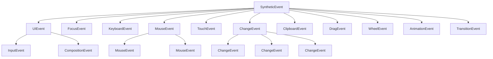

+++
title = "第14章 React + TypeScript 实战"
weight = 140
date = "2026-03-26T21:05:00+08:00"
type = "docs"
description = ""
isCJKLanguage = true
draft = false
+++

# 第 14 章 React + TypeScript 实战

> **本章说明**：React + TypeScript 是现代前端开发的标配组合。本章从环境搭建讲起，覆盖函数组件类型、Hooks 类型、事件处理、常用模式和第三方组件库类型化，让你从零到生产级掌握 React + TypeScript 的最佳实践。

## 14.1 环境搭建

TypeScript 和 React 的组合有多种搭建方式，但主流的方案就两种：Vite（推荐）和 Create React App（CRA）。

### 14.1.1 Vite 创建 React + TypeScript 项目

**Vite** 是目前最推荐的方式 —— 它速度快、配置简单、生态成熟，而且 TypeScript 支持开箱即用。

#### 步骤一：创建项目

```bash
# 使用 npm
npm create vite@latest my-react-app -- --template react-ts

# 或者使用 yarn
yarn create vite my-react-app --template react-ts

# 或者使用 pnpm
pnpm create vite my-react-app --template react-ts
```

> 💡 `--template react-ts` 这个参数告诉 Vite：「我要创建一个使用 React + TypeScript 的项目。」Vite 会自动安装必要的依赖，并生成一个完整的 `tsconfig.json`。

#### 步骤二：安装依赖

```bash
cd my-react-app
npm install
```

#### 步骤三：启动开发服务器

```bash
npm run dev
```

运行后，Vite 会输出类似这样的信息：

```
  VITE v5.x.x  ready in xxx ms

  ➜  Local:   http://localhost:5173/
  ➜  Network: use --host to expose
  ➜  press h + enter to show help
```

打开浏览器访问 `http://localhost:5173/`，你就能看到 React + TypeScript 的默认模板页面了。

#### 步骤四：查看项目结构

```
my-react-app/
├── src/
│   ├── App.tsx           ← 主应用组件
│   ├── main.tsx          ← 入口文件
│   ├── App.css           ← 样式文件
│   └── vite-env.d.ts     ← Vite 的类型声明文件
├── index.html
├── package.json
├── tsconfig.json         ← TypeScript 配置文件
└── vite.config.ts        ← Vite 配置文件
```

#### Vite 项目的 tsconfig.json（推荐配置）

```json
{
  "compilerOptions": {
    "target": "ES2020",
    "useDefineForClassFields": true,
    "lib": ["ES2020", "DOM", "DOM.Iterable"],
    "module": "ESNext",
    "skipLibCheck": true,

    /* 模块解析策略：bundler 模式 */
    "moduleResolution": "bundler",
    /* 允许导入 JSON 文件 */
    "resolveJsonModule": true,
    /* 允许导入 .ts、.tsx 文件时省略扩展名 */
    "isolatedModules": true,
    /* 不输出文件，由 Vite 处理编译 */
    "noEmit": true,
    /* JSX 处理：React 17+ 的新 JSX 运行时 */
    "jsx": "react-jsx",

    /* 严格模式 */
    "strict": true,
    /* 禁止未使用的变量 */
    "noUnusedLocals": true,
    "noUnusedParameters": true,
    /* 覆盖父类方法时必须用 override */
    "noFallthroughCasesInSwitch": true
  },

  "include": ["src"],
  "references": [{ "path": "./tsconfig.node.json" }]
}
```

> 💡 **Vite + React 17+ 推荐配置的核心点**：
>
> - `"jsx": "react-jsx"`：使用 React 17+ 的新 JSX 运行时，不需要在每个文件里 `import React from "react"`
> - `"moduleResolution": "bundler"`：让 TypeScript 模拟 Vite 的模块解析行为
> - `"noEmit": true`：不输出 JS 文件，Vite 的 esbuild 会处理编译

---

### 14.1.2 Create React App TypeScript 模板（已知局限性）

**Create React App**（CRA）曾经是 React + TypeScript 项目的标准脚手架，但目前已经不推荐使用了。

#### 创建项目（已不推荐）

```bash
# 仍然可以这样创建，但不推荐
npx create-react-app my-react-app --template typescript
```

> ⚠️ **为什么不推荐 CRA**：
>
> 1. **构建速度慢**：CRA 使用的是 webpack（不是 Vite/esbuild），热更新和首次构建都很慢
> 2. **配置困难**：CRA 把 webpack 配置「隐藏」起来了，想要自定义配置需要 `eject`，但 `eject` 后就回不去了
> 3. **维护停滞**：CRA 项目已经很久没有重大更新了
> 4. **Vite 已成主流**：Vite 在各方面都远超 CRA

#### CRA 的 tsconfig.json（供参考，但请用 Vite）

```json
{
  "compilerOptions": {
    "target": "ES2020",
    "lib": ["ES2020", "DOM", "DOM.Iterable"],
    "allowJs": true,
    "skipLibCheck": true,
    "esModuleInterop": true,
    "allowSyntheticDefaultImports": true,
    "strict": true,
    "forceConsistentCasingInFileNames": true,
    "noFallthroughCasesInSwitch": true,
    "module": "ESNext",
    "moduleResolution": "bundler",
    "resolveJsonModule": true,
    "isolatedModules": true,
    "noEmit": true,
    "jsx": "react-jsx"
  },
  "include": ["src"]
}
```

> 🎯 **结论**：新项目请使用 **Vite + React + TypeScript**，CRA 已成过去式。

---

## 14.2 函数组件类型

React 的函数组件（Function Component）是现代 React 开发的主流范式。在 TypeScript 中，正确地为函数组件标注类型是基本功。

### 14.2.1 组件返回值类型：JSX.Element vs React.ReactNode

在 TypeScript + React 中，函数组件的返回值类型有几种写法：

#### 方式一：不显式标注返回类型（推荐）

```tsx
// ✅ 最推荐的写法 —— TypeScript 会自动推断返回类型
function Button({ label }: { label: string }) {
  return <button>{label}</button>;
}
```

#### 方式二：显式标注 `JSX.Element`

```tsx
// ✅ 可以，但一般不需要显式标注
function Button({ label }: { label: string }): JSX.Element {
  return <button>{label}</button>;
}
```

#### 方式三：显式标注 `React.ReactNode`（推荐用于更宽泛的场景）

```tsx
// ✅ ReactNode 比 JSX.Element 更宽泛，可以返回 null、undefined、字符串、数字等
function ConditionalWrapper({ show, children }: {
  show: boolean;
  children: React.ReactNode
}): React.ReactNode {
  if (!show) return null;
  return <div>{children}</div>;
}
```

**两者的区别**：

| 类型 | 可以返回的值 | 典型场景 |
|---|---|---|
| `JSX.Element` | JSX 元素 | 普通组件的返回值 |
| `React.ReactNode` | JSX 元素、字符串、数字、`null`、`undefined`、数组等 | 接受子组件、slot 的组件 |

```tsx
// ✅ JSX.Element：只能返回 JSX
function Header(): JSX.Element {
  return <h1>Title</h1>;  // 只能返回 JSX
}

// ✅ React.ReactNode：可以返回更多类型的值
function OptionalContent(): React.ReactNode {
  const showContent = Math.random() > 0.5;
  if (showContent) {
    return <p>Content</p>;  // JSX
  }
  return "Nothing here";  // 字符串
}
```

> 💡 **推荐实践**：对于普通组件，不用显式标注返回类型，TypeScript 会自动推断。对于接受 `children` 的包装组件，用 `React.ReactNode` 标注 `children` 的类型。

---

### 14.2.2 Props 类型接口

#### 14.2.2.1 children 类型：React.ReactNode（最宽泛）

Props 类型接口是 TypeScript + React 中最重要的概念之一。让我们从最核心的 `children` 开始：

```tsx
// ✅ 定义 props 类型接口
interface CardProps {
  title: string;
  description: string;
  children?: React.ReactNode;  // children 可以是 JSX、字符串、数字等
}

// 使用接口
function Card({ title, description, children }: CardProps) {
  return (
    <div className="card">
      <h2>{title}</h2>
      <p>{description}</p>
      <div className="card-actions">{children}</div>
    </div>
  );
}

// 用法
function App() {
  return (
    <Card title="Welcome" description="This is a card">
      <button>Click me</button>   {/* children */}
      <button>Another</button>     {/* children */}
    </Card>
  );
}
```

---

#### 14.2.2.2 必选 vs 可选 Props 的设计原则

Props 接口的设计需要区分「必选」和「可选」：

```tsx
// ✅ 正确区分必选和可选
interface UserCardProps {
  // 必选 props（没有这些组件无法正常工作）
  name: string;
  email: string;

  // 可选 props（有默认值或可以没有）
  avatar?: string;              // 可选字符串（可能是 undefined）
  role?: "admin" | "user" | "guest";  // 可选字符串字面量联合类型
  age?: number;                 // 可选数字
  isActive?: boolean;           // 可选布尔值
}

// ✅ 带默认值的可选 props
function UserCard({
  name,
  email,
  avatar,
  role = "user",     // 默认值
  isActive = true    // 默认值
}: UserCardProps) {
  return (
    <div className={isActive ? "active" : "inactive"}>
      {avatar ?  : <span>{name[0]}</span>}
      <h3>{name}</h3>
      <p>{email}</p>
      <span>{role}</span>
    </div>
  );
}
```

> 💡 **设计原则**：
>
> 1. **如果组件没有某个 prop 也能工作**，设为可选（加 `?`）
> 2. **如果某个 prop 有合理的默认值**，在函数参数里直接给默认值
> 3. **如果 prop 是联合类型**，优先用字面量联合类型（如 `"admin" | "user"`）而不是字符串，这样调用者只能传特定的值

---

## 14.3 Hooks 类型

React Hooks 是函数组件的「魔法」，TypeScript 为每个 Hook 都提供了精确的类型支持。

### 14.3.1 useState：泛型写法 `useState<string>('')`

`useState` 是 React 最常用的 Hook，TypeScript 为它提供了精确的类型推断。

#### 基本用法

```tsx
import { useState } from "react";

// ✅ TypeScript 自动推断类型（number）
const [count, setCount] = useState(0);
// count: number
// setCount: (value: number) => void

// ✅ 显式指定类型（泛型参数）
const [name, setName] = useState<string>("");
// name: string
// setName: (value: string) => void

// ✅ 联合类型
const [status, setStatus] = useState<"idle" | "loading" | "success" | "error">("idle");
// status: "idle" | "loading" | "success" | "error"
```

#### 泛型参数的使用场景

```tsx
// 场景：初始值为 null，后续可能是 User 或 null
const [user, setUser] = useState<User | null>(null);
// user: User | null
// setUser: (user: User | null) => void

// 场景：自定义类型
interface Todo {
  id: number;
  text: string;
  completed: boolean;
}

const [todos, setTodos] = useState<Todo[]>([]);
// todos: Todo[]
// setTodos: (todos: Todo[]) => void
```

> 💡 **什么时候用泛型参数**：
>
> - 初始值是 `null`/`undefined` 时（类型无法从初始值推断）
> - 初始值是需要延迟计算的对象时
> - 需要精确控制状态类型时

---

### 14.3.2 useRef：`useRef<HTMLDivElement>(null)`

`useRef` 在 TypeScript 中的类型比较特殊，需要特别注意。

#### useRef 的两种用法

**用法一：DOM 引用（最常见）**

```tsx
import { useRef } from "react";

function TextInput() {
  // ✅ DOM 引用：类型参数是 HTMLInputElement，初始值是 null
  const inputRef = useRef<HTMLInputElement>(null);

  function handleClick() {
    // 调用 focus 方法
    inputRef.current?.focus();
    // current: HTMLInputElement | null
  }

  return (
    <div>
      <input ref={inputRef} type="text" />
      <button onClick={handleClick}>Focus</button>
    </div>
  );
}
```

**用法二：可变引用（存储任意值，不触发重新渲染）**

```tsx
import { useRef } from "react";

function useTimer() {
  // ✅ 可变引用：初始值是 0，类型参数是 number
  const intervalRef = useRef<number>(0);
  const [count, setCount] = useState(0);

  function start() {
    intervalRef.current = setInterval(() => {
      setCount(c => c + 1);
    }, 1000);
    // intervalRef.current: number（定时器 ID）
  }

  function stop() {
    clearInterval(intervalRef.current);
    // intervalRef.current 仍然存在，但定时器已停止
  }

  return { intervalRef, count };
}
```

> ⚠️ **特别注意**：`useRef<T>(null)` 的类型是 `RefObject<T>`，`useRef<T>(initialValue)` 的类型是 `MutableRefObject<T>`。前者 `.current` 是只读的，后者 `.current` 是可写的。

---

### 14.3.3 useCallback 与 useMemo：泛型签名

`useCallback` 和 `useMemo` 的类型签名比较相似：

```tsx
import { useCallback, useMemo } from "react";

// useCallback
// 语法：useCallback<泛型参数>(回调函数, 依赖数组)
const handleClick = useCallback<(id: number) => void>((id) => {
  console.log("Clicked:", id);
}, []);
// handleClick: (id: number) => void

// useMemo
// 语法：useMemo<泛型参数>(() => 计算结果, 依赖数组)
const sortedList = useMemo<string[]>(() => {
  return ["banana", "apple", "cherry"].sort();
}, []);
// sortedList: string[]
```

```tsx
// 实际使用例子
function ProductList({ products }: { products: Product[] }) {
  // 缓存计算后的产品名称列表
  const productNames = useMemo(() => {
    return products.map(p => p.name).join(", ");
  }, [products]);

  // 缓存过滤后的产品
  const expensiveProducts = useMemo(() => {
    return products.filter(p => p.price > 100);
  }, [products]);

  // 缓存回调函数
  const handleProductClick = useCallback<(product: Product) => void>((product) => {
    console.log("Product clicked:", product.id);
  }, []);

  return (
    <div>
      <p>Products: {productNames}</p>
      <ul>
        {expensiveProducts.map(p => (
          <li key={p.id} onClick={() => handleProductClick(p)}>
            {p.name} - ${p.price}
          </li>
        ))}
      </ul>
    </div>
  );
}
```

---

### 14.3.4 useReducer：State、Action、Reducer 的类型关系

`useReducer` 是复杂状态管理的利器，但它的类型写法是所有 Hooks 里最复杂的：

```tsx
import { useReducer } from "react";

// ============================================
// 第一步：定义 State 类型
// ============================================
interface CounterState {
  count: number;
  lastAction: string | null;
}

// ============================================
// 第二步：定义 Action 类型（联合类型）
// ============================================
type CounterAction =
  | { type: "increment" }
  | { type: "decrement" }
  | { type: "reset" }
  | { type: "set"; payload: number };

// ============================================
// 第三步：定义 Reducer 函数
// ============================================
function counterReducer(state: CounterState, action: CounterAction): CounterState {
  switch (action.type) {
    case "increment":
      return { count: state.count + 1, lastAction: "incremented" };
    case "decrement":
      return { count: state.count - 1, lastAction: "decremented" };
    case "reset":
      return { count: 0, lastAction: "reset" };
    case "set":
      return { count: action.payload, lastAction: `set to ${action.payload}` };
    default:
      return state;
  }
}

// ============================================
// 第四步：useReducer + 初始状态
// ============================================
const initialState: CounterState = {
  count: 0,
  lastAction: null
};

// ============================================
// 第五步：在组件中使用
// ============================================
function Counter() {
  const [state, dispatch] = useReducer(counterReducer, initialState);

  return (
    <div>
      <p>Count: {state.count}</p>
      <p>Last Action: {state.lastAction}</p>
      <button onClick={() => dispatch({ type: "increment" })}>+</button>
      <button onClick={() => dispatch({ type: "decrement" })}>-</button>
      <button onClick={() => dispatch({ type: "reset" })}>Reset</button>
      <button onClick={() => dispatch({ type: "set", payload: 42 })}>Set to 42</button>
    </div>
  );
}
```

> 💡 **useReducer 的类型安全优势**：所有 action 必须是预定义的联合类型，传入未知类型的 action 会导致编译错误：

```tsx
// ❌ 编译时报错：Action type "delete" is not assignable
dispatch({ type: "delete" });
// Error: Argument of type '{ type: "delete"; }' is not assignable to parameter
// of type 'CounterAction'
```

---

## 14.4 事件处理类型

React 的事件处理在 TypeScript 中需要精确的类型标注，否则 `event.target.value` 等常用操作就会报错。

### 14.4.1 `React.ChangeEvent<HTMLInputElement>`

`ChangeEvent` 用于 input、textarea、select 等表单元素的 `onChange` 事件：

```tsx
import { useState } from "react";
import type { ChangeEvent } from "react";

function SearchInput() {
  const [query, setQuery] = useState("");

  function handleChange(event: ChangeEvent<HTMLInputElement>) {
    // event.target: HTMLInputElement
    setQuery(event.target.value);
  }

  return (
    <div>
      <input
        type="text"
        value={query}
        onChange={handleChange}
        placeholder="Search..."
      />
      <p>Searching for: {query}</p>
    </div>
  );
}
```

---

### 14.4.2 `React.MouseEvent<HTMLElement>`

`MouseEvent` 用于按钮、div 等元素的鼠标点击事件：

```tsx
import type { MouseEvent } from "react";

function IconButton({ icon, label, onClick }: {
  icon: string;
  label: string;
  onClick: (event: MouseEvent<HTMLButtonElement>) => void;
}) {
  return (
    <button
      className="icon-btn"
      onClick={onClick}
      title={label}
    >
      {icon}
    </button>
  );
}

function App() {
  function handleClick(event: MouseEvent<HTMLButtonElement>) {
    console.log("Button clicked at:", event.clientX, event.clientY);
    // event.clientX: number 鼠标 X 坐标
    // event.clientY: number 鼠标 Y 坐标
  }

  return <IconButton icon="👍" label="Like" onClick={handleClick} />;
}
```

---

### 14.4.3 SyntheticEvent 的类型层次

React 的事件系统基于「合成事件（SyntheticEvent）」，它是原生 DOM 事件的跨浏览器封装。TypeScript 为整个事件系统提供了完整的类型层次：



**常用事件类型速查表**：

| 场景 | 类型 | 泛型参数 |
|---|---|---|
| input onChange | `ChangeEvent` | `HTMLInputElement` |
| textarea onChange | `ChangeEvent` | `HTMLTextAreaElement` |
| select onChange | `ChangeEvent` | `HTMLSelectElement` |
| button onClick | `MouseEvent` | `HTMLButtonElement` |
| div onClick | `MouseEvent` | `HTMLDivElement` |
| input onFocus | `FocusEvent` | `HTMLInputElement` |
| input onKeyDown | `KeyboardEvent` | `HTMLInputElement` |
| form onSubmit | `FormEvent` | `HTMLFormElement` |

---

## 14.5 常用模式

### 14.5.1 forwardRef 与 ref 的类型化

`forwardRef` 允许你将父组件传入的 ref 转发给子组件内部的 DOM 元素或 React 组件：

```tsx
import { forwardRef } from "react";

// 定义 ref 的类型
interface InputProps {
  label: string;
  value: string;
  onChange: (value: string) => void;
}

// 使用 forwardRef 转发 ref
const Input = forwardRef<HTMLInputElement, InputProps>((props, ref) => {
  return (
    <div>
      <label>{props.label}</label>
      <input
        ref={ref}        // ref 被转发到这个 input 元素
        type="text"
        value={props.value}
        onChange={(e) => props.onChange(e.target.value)}
      />
    </div>
  );
});

// 设置 displayName（方便调试）
Input.displayName = "Input";

function App() {
  // ref 的类型必须是 HTMLInputElement
  const inputRef = useRef<HTMLInputElement>(null);

  function handleFocus() {
    inputRef.current?.focus();
  }

  return (
    <div>
      <Input
        ref={inputRef}  // 传入 ref
        label="Username"
        value=""
        onChange={(v) => console.log(v)}
      />
      <button onClick={handleFocus}>Focus Input</button>
    </div>
  );
}
```

---

### 14.5.2 Context 的类型化：`createContext<T | null>(null)`

React 的 Context 在 TypeScript 中需要正确地设置初始类型：

```tsx
import { createContext, useContext, useState } from "react";

// ============================================
// 定义 Context 的类型
// ============================================
interface ThemeContextType {
  theme: "light" | "dark";
  toggleTheme: () => void;
}

// ============================================
// 创建 Context（初始值可以是 null）
// ============================================
const ThemeContext = createContext<ThemeContextType | null>(null);

// ============================================
// Provider 组件
// ============================================
function ThemeProvider({ children }: { children: React.ReactNode }) {
  const [theme, setTheme] = useState<"light" | "dark">("light");

  function toggleTheme() {
    setTheme((t) => (t === "light" ? "dark" : "light"));
  }

  return (
    <ThemeContext.Provider value={{ theme, toggleTheme }}>
      {children}
    </ThemeContext.Provider>
  );
}

// ============================================
// 自定义 Hook（使用 Context）
// ============================================
function useTheme() {
  const context = useContext(ThemeContext);
  if (!context) {
    throw new Error("useTheme must be used within a ThemeProvider");
    // Error: useTheme must be used within a ThemeProvider
  }
  return context;
}

// ============================================
// 在组件中使用
// ============================================
function ThemedButton() {
  const { theme, toggleTheme } = useTheme();

  return (
    <button
      className={theme}
      onClick={toggleTheme}
    >
      Current: {theme} | Toggle
    </button>
  );
}
```

---

### 14.5.3 泛型组件

泛型组件是可以处理多种数据类型的组件：

```tsx
import { useState } from "react";

// ============================================
// 定义 List 组件（泛型）
// ============================================
interface ListProps<T> {
  items: T[];
  renderItem: (item: T) => React.ReactNode;
  keyExtractor: (item: T) => string;
  emptyMessage?: string;
}

function List<T>({ items, renderItem, keyExtractor, emptyMessage = "No items" }: ListProps<T>) {
  if (items.length === 0) {
    return <p>{emptyMessage}</p>;
  }

  return (
    <ul>
      {items.map((item) => (
        <li key={keyExtractor(item)}>
          {renderItem(item)}
        </li>
      ))}
    </ul>
  );
}

// ============================================
// 使用泛型 List 组件
// ============================================
function UserList() {
  const users = [
    { id: 1, name: "Alice", email: "alice@example.com" },
    { id: 2, name: "Bob", email: "bob@example.com" }
  ];

  return (
    <List
      items={users}
      keyExtractor={(user) => user.id.toString()}
      renderItem={(user) => (
        <div>
          <strong>{user.name}</strong>
          <span> ({user.email})</span>
        </div>
      )}
      emptyMessage="No users found"
    />
  );
}

function ProductList() {
  const products = [
    { sku: "A001", name: "Laptop", price: 999 },
    { sku: "A002", name: "Mouse", price: 29 }
  ];

  return (
    <List
      items={products}
      keyExtractor={(p) => p.sku}
      renderItem={(p) => `${p.name} - $${p.price}`}
    />
  );
}
```

---

## 14.6 第三方组件库

### 14.6.1 Ant Design 类型化

Ant Design 是最流行的 React UI 组件库之一，TypeScript 支持开箱即用：

```tsx
import { Button, Table, Modal, Form, Input, Select, message } from "antd";
import type { ColumnsType } from "antd/es/table";

// ============================================
// Table 类型化
// ============================================
interface User {
  key: number;
  name: string;
  age: number;
  address: string;
}

const columns: ColumnsType<User> = [
  {
    title: "Name",
    dataIndex: "name",
    key: "name",
    // filters: 筛选配置也有类型支持
    filters: [
      { text: "Alice", value: "Alice" },
      { text: "Bob", value: "Bob" }
    ],
    onFilter: (value, record) => record.name.indexOf(value as string) === 0
  },
  {
    title: "Age",
    dataIndex: "age",
    key: "age",
    // sorter: 排序配置
    sorter: (a, b) => a.age - b.age
  },
  {
    title: "Address",
    dataIndex: "address",
    key: "address"
  }
];

const data: User[] = [
  { key: 1, name: "Alice", age: 32, address: "New York" },
  { key: 2, name: "Bob", age: 28, address: "San Francisco" }
];

function UserTable() {
  return (
    <Table<User>
      columns={columns}
      dataSource={data}
      pagination={false}
    />
  );
}

// ============================================
// Form 类型化
// ============================================
interface LoginForm {
  username: string;
  password: string;
  remember: boolean;
}

function LoginFormComponent() {
  const [form] = Form.useForm<LoginForm>();

  function handleSubmit(values: LoginForm) {
    console.log("Login:", values);
    // values: { username: string; password: string; remember: boolean }
    message.success("Login successful!");
  }

  return (
    <Form<LoginForm>
      form={form}
      onFinish={handleSubmit}
      layout="vertical"
    >
      <Form.Item<LoginForm>
        name="username"
        label="Username"
        rules={[{ required: true, message: "Please enter username" }]}
      >
        <Input />
      </Form.Item>

      <Form.Item<LoginForm>
        name="password"
        label="Password"
        rules={[{ required: true, message: "Please enter password" }]}
      >
        <Input.Password />
      </Form.Item>

      <Form.Item<LoginForm>
        name="remember"
        valuePropName="checked"
      >
        <Checkbox>Remember me</Checkbox>
      </Form.Item>

      <Button type="primary" htmlType="submit" disabled={isSubmitting}>
        {isSubmitting ? "Submitting..." : "Register"}
      </Button>
    </Form>
  );
}

// ============================================
// Modal + hooks 组合类型化
// ============================================
function EditModal({ record, onClose }: {
  record: User | null;
  onClose: () => void;
}) {
  const [modal, contextHolder] = Modal.useModal();

  return (
    <>
      {contextHolder}
      <Modal
        title="Edit User"
        open={record !== null}
        onCancel={onClose}
        onOk={() => {
          message.success(`Updated user: ${record?.name}`);
          onClose();
        }}
      >
        {record && (
          <p>Editing: {record.name}, Age: {record.age}</p>
        )}
      </Modal>
    </>
  );
}
```

---

### 14.6.2 React Hook Form + Zod 表单验证类型化

React Hook Form + Zod 是目前最强大的类型安全表单方案：

```tsx
import { useForm } from "react-hook-form";
import { z } from "zod";
import { zodResolver } from "@hookform/resolvers/zod";
import { Checkbox } from "antd";

// ============================================
// 第一步：用 Zod 定义表单 schema（带类型推断）
// ============================================
const schema = z.object({
  name: z.string().min(2, "Name must be at least 2 characters"),
  email: z.string().email("Invalid email address"),
  age: z.number().min(18, "Must be at least 18").max(120, "Invalid age"),
  website: z.string().url("Invalid URL").optional(),
  role: z.enum(["admin", "user", "guest"])
});

// 从 schema 推断 TypeScript 类型
type FormData = z.infer<typeof schema>;
// FormData = {
//   name: string;
//   email: string;
//   age: number;
//   website?: string;
//   role: "admin" | "user" | "guest";
// }

// ============================================
// 第二步：配置 react-hook-form + zodResolver
// ============================================
function RegistrationForm() {
  const {
    register,          // 注册表单字段
    handleSubmit,      // 提交处理
    formState: { errors, isSubmitting },  // 表单状态
    reset              // 重置表单
  } = useForm<FormData>({
    resolver: zodResolver(schema),  // ← Zod 验证器
    defaultValues: {
      role: "user"
    }
  });

  async function onSubmit(data: FormData) {
    // data 的类型完全正确！
    console.log("Form submitted:", data);
    await new Promise((resolve) => setTimeout(resolve, 1000));
    message.success("Registration successful!");
    reset();
  }

  return (
    <form onSubmit={handleSubmit(onSubmit)}>
      {/* Name */}
      <div>
        <label>Name</label>
        <input {...register("name")} />
        {errors.name && <span>{errors.name.message}</span>}
        {/* errors.name.message 已经是 string 类型了！ */}
      </div>

      {/* Email */}
      <div>
        <label>Email</label>
        <input {...register("email")} type="email" />
        {errors.email && <span>{errors.email.message}</span>}
      </div>

      {/* Age */}
      <div>
        <label>Age</label>
        <input
          {...register("age", { valueAsNumber: true })}
          type="number"
        />
        {/* valueAsNumber: 把输入值自动转为数字 */}
        {errors.age && <span>{errors.age.message}</span>}
      </div>

      {/* Role */}
      <div>
        <select {...register("role")}>
          <option value="admin">Admin</option>
          <option value="user">User</option>
          <option value="guest">Guest</option>
        </select>
        {errors.role && <span>{errors.role.message}</span>}
      </div>

      <button type="submit" disabled={isSubmitting}>
        {isSubmitting ? "Submitting..." : "Register"}
      </button>
    </form>
  );
}
```

> 🎯 **React Hook Form + Zod 的优势**：
>
> 1. **schema 即类型**：`z.object()` 同时定义了运行时验证规则和 TypeScript 类型
> 2. **零重渲染**：React Hook Form 不触发重渲染，性能优秀
> 3. **类型安全**：表单数据完全类型化，IDE 智能提示无处不在
> 4. **统一验证**：Zod schema 是运行时验证，TypeScript 类型是编译时验证，两者完美结合

---

## 本章小结

### React + TypeScript 核心知识点

#### 环境搭建

```json
// Vite 项目的关键 tsconfig.json 配置
{
  "compilerOptions": {
    "jsx": "react-jsx",
    "moduleResolution": "bundler",
    "noEmit": true,
    "strict": true
  }
}
```

#### Hooks 类型速查

| Hook | 类型写法 |
|---|---|
| `useState` | `useState<T>(initialValue)` |
| `useRef` (DOM) | `useRef<HTMLDivElement>(null)` |
| `useRef` (可变) | `useRef<T>(initialValue)` |
| `useCallback` | `useCallback<(arg: T) => void>(fn, deps)` |
| `useMemo` | `useMemo<T>(() => value, deps)` |
| `useReducer` | `useReducer<State, Action>(reducer, initial)` |

#### 事件类型速查

| 事件 | 类型 |
|---|---|
| input onChange | `ChangeEvent<HTMLInputElement>` |
| button onClick | `MouseEvent<HTMLButtonElement>` |
| form onSubmit | `FormEvent<HTMLFormElement>` |

#### 常用模式

- **Props 接口**：定义 `interface Props {}`，在函数参数中解构
- **`children` 类型**：用 `React.ReactNode`
- **Context**：用 `createContext<T | null>(null)` + 自定义 `useContext` hook
- **泛型组件**：`function List<T>({ items }: ListProps<T>)`
- **forwardRef**：`forwardRef<RefType, PropsType>((props, ref) => ...)`

### 学习路径建议

```
第一阶段：环境与基础
  ├── Vite 创建 React + TypeScript 项目
  ├── tsconfig.json 配置（jsx: react-jsx）
  └── 函数组件 + Props 类型接口

第二阶段：Hooks + TypeScript
  ├── useState 泛型写法
  ├── useRef（DOM 引用 vs 可变引用）
  ├── useCallback / useMemo
  └── useReducer（复杂状态）

第三阶段：事件与表单
  ├── 常用事件类型（ChangeEvent / MouseEvent）
  ├── forwardRef + ref
  ├── Context 类型化
  └── React Hook Form + Zod

第四阶段：实战进阶
  ├── Ant Design 类型化
  ├── 泛型组件设计
  └── 完整项目实战
```

> 🎉 **恭喜你完成了第 14 章的学习！** React + TypeScript 的组合是现代前端开发的标配。掌握了本章的内容，你应该能够独立完成大多数 React + TypeScript 项目的开发工作了！
