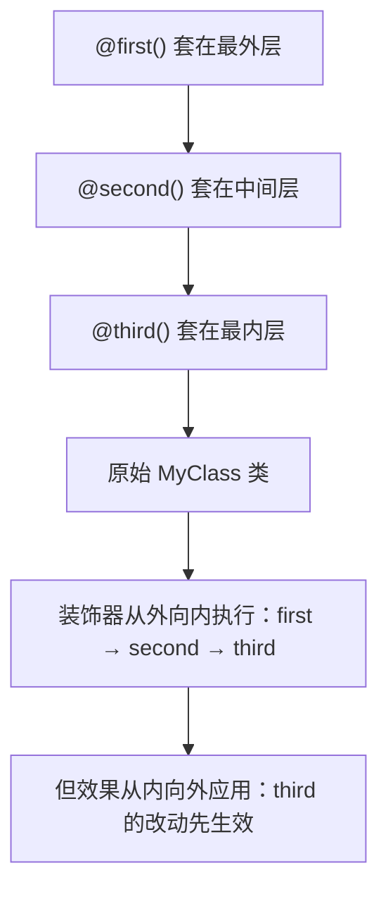

+++
title = "第16章 装饰器"
weight = 160
date = "2026-03-26T21:05:00+08:00"
type = "docs"
description = ""
isCJKLanguage = true
draft = false
+++

# 第 16 章 装饰器

> 装饰器——Decorators，这是 TypeScript 里最"魔幻"的特性之一。它让你用一种类似"注解"的语法，给类、方法、属性"贴标签"，从而改变它们的行为。听起来很美好，但装饰器也是 TypeScript 里的"实验性禁区"——语法改了又改，提案换了好几版，到现在终于要修成正果了。

## 16.1 装饰器概述

### 16.1.1 TC39 Decorators 提案现状与 TypeScript 实验性支持

在正式讲装饰器之前，先来扒一扒它的"黑历史"——因为装饰器是 TypeScript 里变更最频繁的特性之一，很多老教程讲的内容放到今天已经不能用了。

**装饰器的标准化历程**：

- **Stage 2（2017-2022）**：TypeScript 长期支持的版本，语法是 `@decorator(target, key, descriptor)`
- **Stage 3（2022-至今）**：新版本标准，语法和语义都有较大变化，增加了类字段装饰器、自动访问器等
- **TypeScript 的态度**：从 `experimentalDecorators` 到逐步支持 Stage 3 装饰器

**TC39 装饰器提案**是 ECMAScript（JavaScript 的标准）的提案，装饰器本质上是一种"元编程"——写代码去修改代码的行为。Python 的装饰器、Java 的注解、C# 的特性（Attributes），都是类似的概念。

TypeScript 在 5.0 之前一直使用的是 **Stage 2** 版本的装饰器提案（需要开启 `experimentalDecorators`），而 **Stage 3** 版本的装饰器从 TypeScript 5.0 开始正式支持（不需要实验性标志）。

### 16.1.2 开启装饰器：experimentalDecorators vs useDefineForClassFields

在 `tsconfig.json` 中，你可能会看到两个相关的配置项：

```json
{
    "compilerOptions": {
        "experimentalDecorators": true,
        "useDefineForClassFields": true
    }
}
```

**`experimentalDecorators: true`**：开启 Stage 2 版本的装饰器语法（需要实验性标志，因为提案还没定稿）。

**`useDefineForClassFields: true`**：这是关于类字段初始化语义的配置。简单来说：

- `useDefineForClassFields: true`：类字段用 `define` 语义（标准行为）
- `useDefineForClassFields: false`：类字段用 `assign` 语义（旧版 TypeScript 行为）

**重要**：当开启 Stage 3 装饰器时，`useDefineForClassFields` 必须为 `true`。当你用 Stage 2 装饰器时，如果你遇到奇怪的问题（比如装饰器改变了字段值但 TypeScript 报错说值不对），可以考虑把 `useDefineForClassFields` 设为 `false`。

**现代 TypeScript（5.0+）推荐配置**：

```json
{
    "compilerOptions": {
        "experimentalDecorators": false,
        "useDefineForClassFields": true
    }
}
```

`experimentalDecorators: false` 意味着使用 Stage 3 装饰器（如果你用的是 TypeScript 5.0+）。

---

## 16.2 类装饰器、方法装饰器、属性装饰器、参数装饰器

装饰器一共有四种类型，按作用目标分：**类装饰器**、**方法装饰器**、**属性装饰器**、**参数装饰器**。下面逐一讲解。

### 类装饰器

类装饰器作用于**整个类**，它的签名是：

```typescript
// Stage 2 语法
function loggedClass<T extends new (...args: any[]) => T>(constructor: T) {
    return class extends constructor {
        constructor(...args: any[]) {
            console.log(`正在实例化: ${constructor.name}`);
            super(...args);
        }
    };
}

// 使用
@loggedClass
class User {
    constructor(public name: string) {}
}

const u = new User("小明");
// 输出: 正在实例化: User
```

类装饰器在**类被定义时**（不是实例化时）执行，可以用来：
- 修改类的原型
- 添加或修改类的属性
- 给类"装上"额外的能力（比如日志、缓存）

### 方法装饰器

方法装饰器作用于**类的某个方法**，它的签名是：

```typescript
function readonly(
    target: any,
    propertyKey: string,
    descriptor: PropertyDescriptor
) {
    // 保存原有的方法
    const original = descriptor.value;

    // 替换为只读版本
    descriptor.value = function (...args: any[]) {
        console.log(`调用方法: ${String(propertyKey)}`);
        return original.apply(this, args);
    };

    return descriptor;
}

class Calculator {
    @readonly
    add(a: number, b: number): number {
        return a + b;
    }
}

const calc = new Calculator();
console.log(calc.add(1, 2)); // 调用方法: add
                                // 3
```

方法装饰器接收三个参数：
- **`target`**：被装饰的方法所属的类（如果是静态方法，就是类本身）
- **`propertyKey`**：方法的名字（字符串或 Symbol）
- **`descriptor`**：方法的属性描述符，包含 `value`（方法本身）、`writable`、`enumerable`、`configurable`

### 属性装饰器

属性装饰器作用于**类的属性**，但注意：属性装饰器**只能读取**属性，不能修改（至少在标准 Stage 3 提案里是这样）。

```typescript
function logProperty(target: any, propertyKey: string) {
    // 属性被定义时触发
    console.log(`检测到属性: ${String(propertyKey)}`);
}

class Product {
    @logProperty
    name: string = "未命名";

    @logProperty
    price: number = 0;
}
// 输出: 检测到属性: name
//       检测到属性: price
```

属性装饰器通常和**反射元数据**（`reflect-metadata`）配合使用，这在 Angular 等框架里非常常见。

### 参数装饰器

参数装饰器作用于**方法或构造函数的某个参数**：

```typescript
function required(
    target: any,
    methodName: string | symbol,
    paramIndex: number
) {
    console.log(`参数 ${paramIndex} 被标记为 required，方法: ${String(methodName)}`);
}

class Greeter {
    greet(@required name: string, @required age: number) {
        console.log(`你好, ${name}! 你 ${age}岁了。`);
    }
}

const g = new Greeter();
g.greet("小明", 18);
// 参数 0 被标记为 required，方法: greet
// 参数 1 被标记为 required，方法: greet
// 你好, 小明! 你 18岁了。
```

---

## 16.3 装饰器工厂：返回装饰器的高阶函数

装饰器工厂（Decorator Factory）就是**返回一个装饰器的高阶函数**。它让你在调用装饰器时传入自定义参数，使装饰器更加灵活。

```typescript
// 装饰器工厂：创建一个带参数的装饰器
function prefix(prefixStr: string) {
    // 返回真正的装饰器
    return function (
        target: any,
        propertyKey: string,
        descriptor: PropertyDescriptor
    ) {
        const original = descriptor.value;

        descriptor.value = function (...args: any[]) {
            console.log(`[${prefixStr}] 方法被调用: ${String(propertyKey)}`);
            return original.apply(this, args);
        };

        return descriptor;
    };
}

class ApiService {
    @prefix("API")
    fetchUser(id: number): string {
        console.log(`正在获取用户 ${id} 的数据`);
        return `用户${id}的数据`;
    }

    @prefix("CACHE")
    getCachedData(key: string): string {
        console.log(`从缓存获取: ${key}`);
        return `缓存数据: ${key}`;
    }
}

const api = new ApiService();
api.fetchUser(1);
// [API] 方法被调用: fetchUser
// 正在获取用户 1 的数据

api.getCachedData("user:1");
// [CACHE] 方法被调用: getCachedData
// 从缓存获取: user:1
```

**装饰器工厂的适用场景**：
- 需要在装饰器调用时传入配置参数
- 同一个装饰器逻辑需要复用，但配置不同
- 让装饰器的使用更加声明式、可读性更好

---

## 16.4 装饰器执行顺序

当一个类（或方法）上有多个装饰器时，执行顺序是一个容易被忽视但非常重要的知识点。

**基本原则**：

1. **参数装饰器**最先执行（从左到右，从上到下）
2. **方法/属性/访问器装饰器**次之
3. **类装饰器**最后执行

但**返回值是按相反顺序应用的**——也就是说，虽然执行顺序是"从上到下"，但效果是"从下到上"叠加的。

```typescript
function first() {
    return function (target: any) {
        console.log("first: 装饰器执行");
        return target;
    };
}

function second() {
    return function (target: any) {
        console.log("second: 装饰器执行");
        return target;
    };
}

function third() {
    return function (target: any) {
        console.log("third: 装饰器执行");
        return target;
    };
}

@first()
@second()
@third()
class MyClass {}

// 输出顺序：
// first: 装饰器执行
// second: 装饰器执行
// third: 装饰器执行
```

**为什么是"从上到下"执行，但效果"从下到上"叠加？**

可以把装饰器想象成"套娃"：



---

## 16.5 标准装饰器（Stage 3）

### 16.5.1 类字段装饰器、自动访问器（accessor）

Stage 3 装饰器相比 Stage 2 增加了一个重要的新特性：**类字段装饰器**。

在 Stage 2 中，属性装饰器无法真正修改属性的值（只能读取 metadata）。但在 Stage 3 中，属性装饰器可以返回一个初始化器（initializer），从而真正改变属性的初始值：

```typescript
// Stage 3 类字段装饰器
function initialize(value: unknown) {
    // 返回一个初始化器函数
    return function (
        this: unknown,
        context: ClassFieldDecoratorContext
    ) {
        // context.name 是字段的名字
        console.log(`字段 ${String(context.name)} 正在被初始化`);

        // 返回初始化器
        return function (this: unknown) {
            console.log(`字段 ${String(context.name)} 初始化完成`);
            return value;
        };
    };
}

class Person {
    @initialize("默认值")
    name: string;

    @initialize(0)
    age: number;
}

const p = new Person();
// 输出:
// 字段 name 正在被初始化
// 字段 age 正在被初始化
// 字段 name 初始化完成
// 字段 age 初始化完成

console.log(p.name); // 默认值
console.log(p.age);  // 0
```

**自动访问器（accessor）**是 Stage 3 引入的新语法：

```typescript
class Counter {
    #count = 0;

    // 自动访问器：用 accessor 关键字声明
    accessor count: number;

    increment() {
        this.count++;
    }

    getValue() {
        return this.count;
    }
}

const c = new Counter();
c.increment();
c.increment();
console.log(c.getValue()); // 2
```

自动访问器本质上是一个**带 get/set 的字段**，但语法更简洁——编译器会自动生成 getter 和 setter。它的优势在于性能和可读性，而且自动访问器也可以被装饰器装饰：

```typescript
function log(target: any, context: ClassAccessorDecoratorContext) {
    return function (this: unknown, initialValue: number) {
        let value = initialValue;
        return {
            get() {
                console.log(`读取 count，当前值: ${value}`);
                return value;
            },
            set(newValue: number) {
                console.log(`设置 count: ${newValue}`);
                value = newValue;
            },
        };
    } as ClassAccessorDecoratorResult<number>;
}

class SafeCounter {
    @log
    accessor count: number = 0;
}

const sc = new SafeCounter();
sc.count;    // 读取 count，当前值: 0
sc.count = 5; // 设置 count: 5
sc.count;    // 读取 count，当前值: 5
```

---

## 本章小结

本章介绍了 TypeScript 装饰器的完整知识体系。

### 装饰器概述

装饰器是 TypeScript 的"元编程"特性，经历了从 Stage 2 到 Stage 3 的演进。TypeScript 5.0+ 推荐使用 Stage 3 装饰器，不再需要 `experimentalDecorators` 标志（设为 false 即可）。注意 `useDefineForClassFields: true` 是 Stage 3 装饰器的前置条件。

### 四种装饰器类型

| 装饰器类型 | 作用目标 | 典型用途 |
|-----------|---------|---------|
| 类装饰器 | 整个类 | 日志、缓存、依赖注入 |
| 方法装饰器 | 类方法 | 权限检查、性能日志 |
| 属性装饰器 | 类属性 | 验证、默认值、序列化 |
| 参数装饰器 | 方法参数 | 参数验证、依赖注入 |

### 装饰器工厂

装饰器工厂是"返回装饰器的函数"，用于在调用时传入自定义参数，让装饰器更加灵活和可复用。

### 执行顺序

多个装饰器叠加时，执行顺序是"从上到下"，但效果应用顺序是"从下到上"。可以想象成"套娃"——最下面的装饰器先接触到原始类/方法/属性，最上面的装饰器在最外层。

### Stage 3 新特性

Stage 3 带来了类字段装饰器（可返回初始化器）和自动访问器（`accessor` 关键字），让装饰器的能力有了质的提升。

> 装饰器是 TypeScript 里"最像魔法"的部分——用注解的方式改变代码行为。但魔法有代价：装饰器的提案一直在变化，生产环境使用前一定要确认好 TypeScript 版本和对应的装饰器语法。
