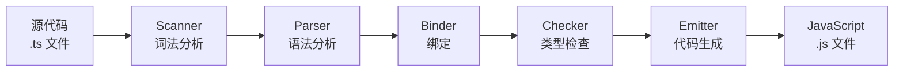
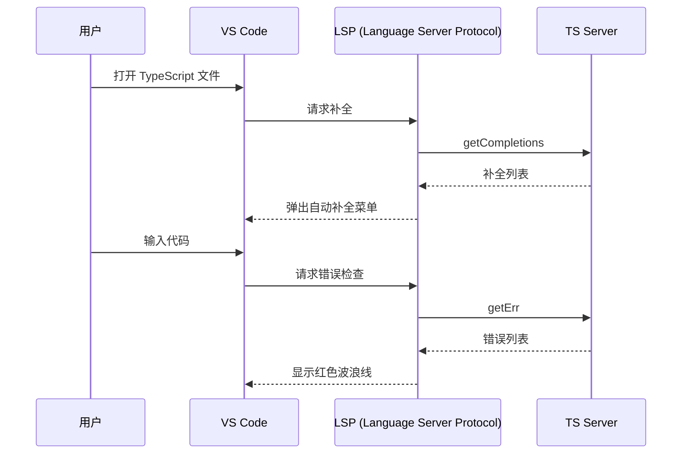

+++
title = "第17章 编译器原理与语言服务"
weight = 170
date = "2026-03-26T21:05:00+08:00"
type = "docs"
description = ""
isCJKLanguage = true
draft = false
+++

# 第 17 章 编译器原理与语言服务

> 你每天都在用 TypeScript 的编译器——`tsc` 命令、VS Code 的红色波浪线、鼠标悬停的类型提示——但你知道这些功能背后是怎么工作的吗？TypeScript 编译器是一个由 Scanner、Parser、Binder、Checker、Emitter 五个阶段组成的精密机器。本章就来拆解这台机器，让你理解它为什么有时候快，有时候慢得要命。

## 17.1 TypeScript 编译器架构

### 17.1.1 编译阶段总览：Scanner → Parser → Binder → Checker → Emitter

TypeScript 编译器的核心是一个**管道（Pipeline）**，源代码经过五个阶段的处理，最终变成 JavaScript 输出：



**各阶段职责**：

- **Scanner（词法分析）**：把源代码字符串拆成一个个 token（标记）。比如 `"let x = 42"` 会被拆成 `LET`、`IDENTIFIER("x")`、`EQUALS`、`NUMBER(42)`。

- **Parser（语法分析）**：把 token 序列组装成 AST（抽象语法树）。Scanner 输出的是一维的 token 列表，Parser 把它们组织成树形结构。

- **Binder（绑定）**：把源码中的所有"名字"（标识符）和它们的原始声明关联起来，建立"作用域"链和"名称→声明"的映射表。

- **Checker（类型检查）**：在 AST 上做语义分析，检查类型错误。这是编译器里最慢的阶段。

- **Emitter（代码生成）**：把 AST 转换成 JavaScript 代码（.js）和类型声明文件（.d.ts）。

### 17.1.2 为什么需要 Binder（绑定）阶段

#### 17.1.2.1 JavaScript/TypeScript 支持「先使用后声明」——函数声明会被提升（hoisting）

这可能是你第一次听说"Binder"这个词。和 Scanner、Parser、Checker 相比，Binder 的存在感最低，但它的作用至关重要。

在 JavaScript 里，你可以这样写代码：

```javascript
// 可以先使用，后声明
console.log(add(1, 2)); // 3 —— 正常运行！

function add(a, b) {
    return a + b;
}
```

这是因为 JavaScript 有**函数声明提升（hoisting）**的机制——`function add(...)` 的声明会在运行时被"提升"到当前作用域的顶部。

但 TypeScript 的类型系统需要知道"你在 `console.log(add(1, 2))` 里引用的 `add`，到底是指哪个 `add`？"——这个"指哪个"的工作，就是 Binder 来做的。

#### 17.1.2.2 Binder 的任务：建立所有名称引用与其原始声明的映射

Binder 会遍历整个 AST，收集所有**符号（Symbol）**和**声明（Declaration）**：

```typescript
// Binder 会为这段代码建立以下映射：
// "add" → 函数声明
// "x" → 变量声明
// "console" → 全局对象

function add(x: number, y: number): number {
    return x + y;
}

const result = add(1, 2);
console.log(result);
```

Binder 的输出是一个**符号表（Symbol Table）**，其中记录了：

- 每个标识符的**符号**
- 每个符号关联的**声明**
- 符号所在的作用域

有了 Binder 的符号表，Checker 才能准确回答："这个 `x` 是 number 还是 string？"——它会先查 Binder 的映射表，找到 `x` 的声明，然后根据声明推断类型。

### 17.1.3 为什么类型检查器是最慢的阶段

#### 17.1.3.1 类型检查涉及递归遍历 AST，且需要处理泛型的延迟求解

五阶段里，**Checker 是性能瓶颈**。为什么？

1. **递归遍历 AST**：类型检查需要深度优先遍历整个抽象语法树，对每个节点做语义分析。AST 有多深，遍历就要走多深。

2. **泛型的延迟求解**：泛型是"惰性求值"的（见第7章），Checker 不能在定义泛型时立即求解，必须等到实际使用时才求解。这意味着同一个泛型类型可能被检查多次。

3. **类型推断的复杂度**：TypeScript 的类型推断算法非常复杂（比如上下文推断、联合类型分发、条件类型展开），这些计算都需要 Checker 来做。

4. **递归结构**：想象一个深度嵌套的泛型类型——`Partial<Partial<Partial<...>>>`——Checker 求解这个类型时，每一层的展开都需要递归。

```typescript
// 一个让 Checker 头疼的典型例子
type DeepPartial<T> = T extends object
    ? { [K in keyof T]?: DeepPartial<T[K]> }
    : T;

// 5层嵌套已经接近 Checker 的极限
type Nested = DeepPartial<
    DeepPartial<
        DeepPartial<
            DeepPartial<
                DeepPartial<{ a: { b: { c: string } } }>
            >
        >
    >
>;
// 如果嵌套超过 10 层，TypeScript 就会报：
// "Type instantiation is excessively deep and possibly infinite"
```

#### 17.1.3.2 增量编译（incremental）和 skipLibCheck 是最常用的两个提速手段

**增量编译**：`tsc --incremental` 会在首次编译后在当前目录生成一个 `.tsbuildinfo` 文件，记录上次编译的状态。如果源文件没有变化，再次编译时只需要处理变更的文件。

```bash
# tsconfig.json 开启增量编译
{
    "compilerOptions": {
        "incremental": true,
        "tsBuildInfoFile": ".tsbuildinfo" // 指定缓存文件位置
    }
}
```

```bash
# 首次编译
npx tsc

# 第二次编译（如果文件没变）
npx tsc
# 输出：Skipping compilation. ...

# 修改了一个文件后
# TypeScript 只重新编译修改的文件和依赖它的文件
```

**`skipLibCheck: true`**：跳过对 `.d.ts` 文件的类型检查。第三方库的 `@types/*` 包里可能有非常多复杂的类型定义，如果每次编译都检查它们，会大大拖慢速度。

```json
{
    "compilerOptions": {
        "skipLibCheck": true
    }
}
```

---

## 17.2 AST 抽象语法树

### 17.2.1 ts.SyntaxKind 枚举与节点类型对应关系

AST 的全称是 **Abstract Syntax Tree**（抽象语法树）。它是源代码的树形表示——每个语法结构都是一个节点，每个节点有类型和子节点。

TypeScript 提供了一个工具 `ts.SyntaxKind` 枚举，把每个语法结构的类型映射成一个数字：

```typescript
import ts from "typescript";

const sourceCode = `
function greet(name: string): string {
    return "Hello, " + name;
}
`;

const sourceFile = ts.createSourceFile(
    "greet.ts",
    sourceCode,
    ts.ScriptTarget.Latest,
    true
);

// 遍历 AST
function visit(node: ts.Node) {
    console.log(
        `Kind: ${ts.SyntaxKind[node.kind]}`, // 节点类型
        `Pos: ${node.pos}`,                   // 起始位置
        `End: ${node.end}`                    // 结束位置
    );

    ts.forEachChild(node, visit);
}

visit(sourceFile);

// 输出：
// Kind: SourceFile Pos: 0 End: 70
// Kind: FunctionDeclaration Pos: 1 End: 69
// Kind: Identifier Pos: 10 End: 15    —— 函数名 "greet"
// Kind: Parameter Pos: 16 End: 32    —— 参数 (name: string)
// Kind: TypeReference Pos: 28 End: 34 —— 返回类型 "string"
// Kind: Block Pos: 35 End: 69        —— 函数体
// Kind: ReturnStatement Pos: 37 End: 67
// ...
```

常见的 `ts.SyntaxKind` 值：

```typescript
// 来自 TypeScript 编译器内置枚举
ts.SyntaxKind.SourceFile;
ts.SyntaxKind.FunctionDeclaration;
ts.SyntaxKind.ClassDeclaration;
ts.SyntaxKind.InterfaceDeclaration;
ts.SyntaxKind.TypeAliasDeclaration;
ts.SyntaxKind.VariableStatement;
ts.SyntaxKind.Parameter;
ts.SyntaxKind.PropertyDeclaration;
ts.SyntaxKind.MethodDeclaration;
ts.SyntaxKind.GetAccessor;
ts.SyntaxKind.SetAccessor;
ts.SyntaxKind.CallExpression;
ts.SyntaxKind.BinaryExpression;
ts.SyntaxKind.Identifier;
ts.SyntaxKind.StringLiteral;
ts.SyntaxKind.NumericLiteral;
ts.SyntaxKind.TypeAssertionExpression; // as 表达式
```

### 17.2.2 为什么理解 AST 有用：定制代码转换（eslint 插件）、代码生成工具

理解 AST 能做什么？这就太多了——

**场景一：自动代码转换**

比如，你想把所有 `console.log` 调用自动包装上时间戳：

```typescript
// 输入
console.log("用户登录成功");

// 输出（自动转换后）
console.log(`[${new Date().toISOString()}] 用户登录成功`);
```

这在 Babel 插件、ESLint 插件、`jscodeshift`（自动化代码迁移工具）里非常常见。

**场景二：代码生成工具**

很多代码生成器（代码生成器、CLI 脚手架）底层就是操作 AST。比如用 Prisma 的时候，`prisma generate` 就是把 Prisma schema（数据库模型）转换成 TypeScript 客户端代码，这个转换过程就是操作 AST。

**场景三：静态分析**

ESLint 的所有规则本质上都是"遍历 AST，检查特定模式，然后报错"。比如 `no-unused-vars` 规则，就是遍历 AST，找到所有变量声明，然后检查是否有引用。

---

## 17.3 Language Service

### 17.3.1 功能：智能补全、错误诊断、跳转到定义、查找引用、重构

**Language Service** 是 TypeScript 编译器对外提供的"IDE 能力"——它封装了编译器核心，提供了一系列高级 API，供 VS Code、IDE 等工具调用。

它提供的核心功能包括：

- **智能补全（Completions）**：输入 `.` 时弹出属性列表
- **错误诊断（Diagnostics）**：实时显示红色/黄色波浪线
- **跳转到定义（Go to Definition）**：Ctrl+点击跳转到变量/函数定义处
- **查找引用（Find References）**：找到所有引用某变量/函数的地方
- **重命名（Rename）**：修改变量名，所有引用同步修改
- **代码格式化（Formatting）**：自动格式化代码风格
- **重构（Refactor）**：提取函数、变量重命名等

### 17.3.2 为什么 Language Service 需要独立的 Server 进程

#### 17.3.2.1 VS Code 通过 LSP（Language Server Protocol）与 TS Server 通信；TS Server 维护完整的 AST 和类型信息

你可能会有一个疑问：TypeScript 编译器（`tsc`）和 Language Service 有什么区别？

**`tsc`**：命令行编译工具，一次性运行，编译完就退出。

**Language Service**：常驻进程（`tsserver`），持续运行在后台，维护着完整的 AST 和类型信息，随时响应 IDE 的请求。



**为什么 Language Service 需要独立进程？**

因为 Language Service 需要**维护完整的状态**——AST、符号表、所有文件的类型信息。这些数据量很大，初始化一次需要几秒到几十秒。如果每次打开文件都重新初始化，用户会疯掉。

TS Server 就是这个"常驻进程"，它用 Node.js 写成，通过 **LSP（Language Server Protocol）** 与 VS Code 通信。LSP 是一种标准协议，让任何编辑器都可以用同一种方式与任何语言的 Language Server 通信。

**TS Server 的性能特点**：

- **启动慢**：首次启动需要扫描整个项目，建立 AST 和类型信息
- **增量更新快**：文件修改后，TS Server 只更新受影响的 AST 部分
- **占用内存大**：需要把整个项目的类型信息加载到内存里

---

## 17.4 TypeScript 7.0 展望（Go 语言重写）

### 17.4.1 为什么重写：当前 TypeScript 编译器使用 JavaScript/TypeScript 编写，性能受限于 JS 引擎

TypeScript 编译器是用 TypeScript 自己写的（这很 meta）。但 JS 引擎（V8、Chakra）虽然是业界最顶尖的 JavaScript 运行时，它们对**编译型语言**（比如 Go、Rust）有天然的性能劣势——垃圾回收、内存布局、CPU 密集型计算。

TypeScript 编译器的瓶颈在 **Checker 阶段**——类型检查涉及大量 CPU 密集型计算，这是 JS 引擎的弱项。Go 语言天然支持多线程，有更高效的内存管理和更快的编译速度。

### 17.4.2 Go 版本将提供：原生多线程编译、共享内存架构、数倍提速

用 Go 重写的 TypeScript 编译器（代号 TypeScript-Go）预计将带来：

- **原生多线程**：Go 天生支持 goroutine（轻量级线程），可以并行处理多个文件的类型检查，充分利用多核 CPU
- **共享内存架构**：多个编译器实例之间可以共享 AST 和类型信息，避免重复计算
- **内存效率**：Go 的内存分配比 JS 引擎更高效，没有垃圾回收的"Stop the World"停顿

### 17.4.3 TS 6.0 的桥接角色：API 层尽量保持不变，用户的构建脚本和插件不受影响

TS 6.0 是 Go 重写之前的最后一个版本，它的主要任务是**充当过渡桥梁**——让 `tsc` 命令行 API、`tsserver` 的 LSP 接口尽可能保持兼容，确保：

- `npm` 脚本里的 `tsc` 命令不受影响
- ESLint 插件、Prettier 等工具继续正常工作
- 用户的 `tsconfig.json` 不用改动
- TypeScript Compiler API 的主要接口保持不变

这就是 TS 6.0 的历史使命——**不是带来新功能，而是保持向后兼容**。

---

## 本章小结

本章深入 TypeScript 编译器的内部世界，理解了它从源代码到 JavaScript 的完整旅程。

### 编译器五阶段

- **Scanner**：把源码字符串拆成 token
- **Parser**：把 token 组装成 AST（抽象语法树）
- **Binder**：建立"名字→声明"的映射表（符号表）
- **Checker**：做类型检查，遍历 AST，这是最慢的阶段
- **Emitter**：生成 JavaScript 代码和 .d.ts 类型声明文件

### Binder 的必要性

JavaScript 支持函数声明提升，`console.log(add)` 在定义之前就能用。Binder 的任务是找出"这个 `add` 引用的是哪个声明"，为 Checker 提供准确的类型推断依据。

### Checker 性能瓶颈

Checker 需要递归遍历 AST、处理泛型惰性求解、运行复杂的类型推断算法，是编译管道的性能瓶颈。两个最常用的提速手段是**增量编译**（`--incremental`）和**跳过库检查**（`skipLibCheck: true`）。

### Language Service

Language Service 封装了编译器核心，提供 IDE 级的功能（智能补全、错误提示、跳转定义等）。TS Server 是一个常驻进程，通过 LSP 与 VS Code 通信，维护着整个项目的类型信息。

### TS 7.0 展望

用 Go 重写编译器预计带来数倍的性能提升（原生多线程 + 共享内存），但 TS 6.0 会确保 API 层面的平滑过渡，让用户的构建脚本和插件不受影响。

> 理解编译器的原理，不是为了去写 TypeScript 本身，而是为了更好地理解 TypeScript 的行为——为什么有时候类型推断不出来？为什么增量编译有时候不起作用？为什么大型项目的编译速度那么慢？这些问题都能在编译器架构里找到答案。
