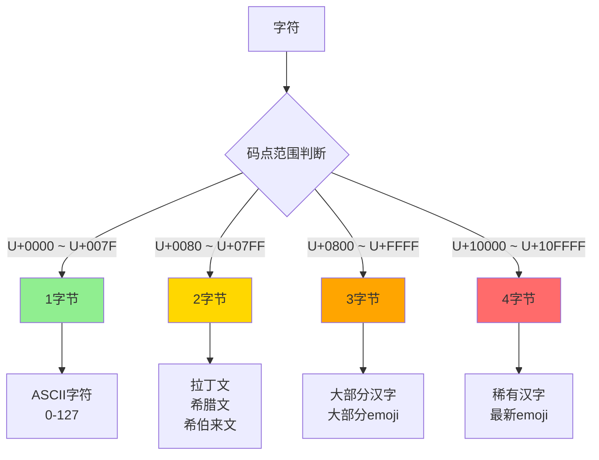
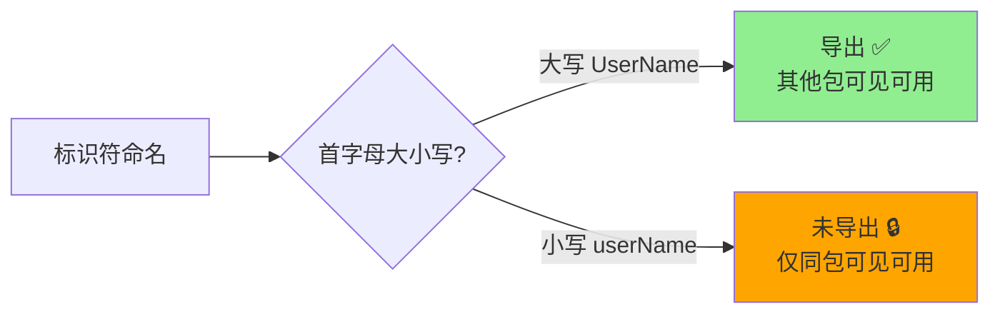
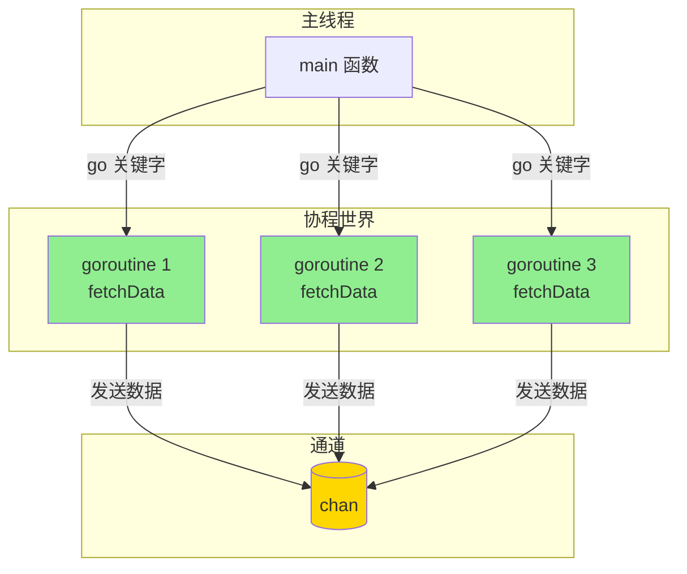
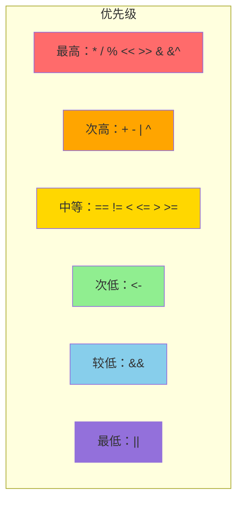
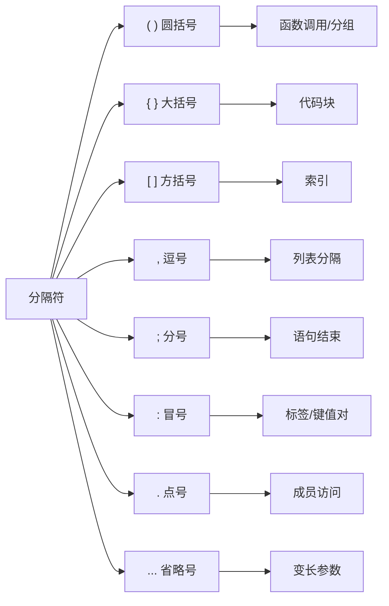
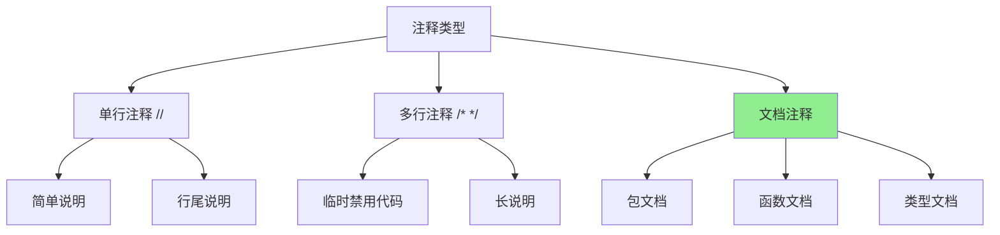
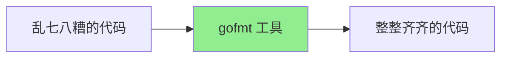
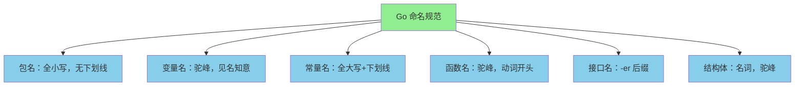

+++
title = "第1章 词法元素"
weight = 10
date = "2026-03-20T08:39:00+08:00"
type = "docs"
description = ""
isCJKLanguage = true
draft = false

+++


# 第1章 词法元素

> 你好啊！欢迎来到 Go 语言的第一章！这一章我们要聊的是 Go 代码的"基因"——词法元素。想象一下，如果把一门编程语言比作一个活生生的人，那词法元素就是这个人身上的细胞、器官和 DNA 序列。别担心，我会让这段旅程变得有趣而不是催眠。准备好了吗？Let's Go！（看，我已经在用双关语了，这就是 Go 语言的魅力！）  
>
> 

## 1.1 字符集与编码

> 在正式开始之前，让我们先来玩一个游戏——猜猜下面这行代码打印出来的是什么？
>
> ```go
> fmt.Println("你好，世界！")
> ```
>
> 答案是："你好，世界！"（废话嘛这不是！）
>
> 但问题来了：计算机那家伙只认识 0 和 1，连汉字长什么样都不知道！那它是怎么打印出"你好，世界！"的呢？
>
> 这就是本章要解答的问题——字符集与编码。

### 1.1.1 Unicode 支持

好，让我们先来认识一下 **Unicode**。

**Unicode**（统一码）是什么？可以把它想象成一本超级大字典，给世界上每一个字符都分配了一个唯一的编号。这本字典收录了地球上一百多万个字符，从小明的"明"字到非洲某个部落的神秘符号，再到各种奇奇怪怪的 emoji，应有尽有。

Unicode 的目标很宏大：给世界上所有的文字符号分配一个唯一的码点（code point）。每个码点写作 `U+XXXX` 的形式，比如：

- `U+0041` = 'A'（英文字母 A）
- `U+4E2D` = '中'（中文"中"字）
- `U+1F600` = '😀'（咧嘴笑的那个 emoji）

在 Go 语言的世界里，源代码文件默认就是 Unicode 编码的。这意味着你可以用中文、日文、韩文、俄文甚至是火星文来写变量名。不过话说回来，虽然技术上支持用中文命名变量，但我强烈建议你不要这么做——除非你想让代码审查人员血压飙升。

Go 内部使用 **UTF-8** 来存储字符串。关于 UTF-8 的详细内容，我们稍后会单独开一个小节来深入八卦。现在你只需要知道一件事：Go 对 Unicode 的支持是"全方位、无死角、360 度无死角旋转跳跃闭着眼"那种级别的。

来，看个实际的例子，感受一下 Go 对 Unicode 的友好态度：


```go
package main

import "fmt"

func main() {
    greeting := "你好，世界！"
    fmt.Println(greeting) // 你好，世界！

    japanese := "こんにちは"
    fmt.Println(japanese) // こんにちは

    korean := "안녕하세요"
    fmt.Println(korean) // 안녕하세요

    emoji := "🎉 Go语言太棒了！🚀"
    fmt.Println(emoji) // 🎉 Go语言太棒了！🚀
}

```

看到了吗？无论是中文、日文、韩文还是 emoji，Go 都一视同仁地给你安排得明明白白。这就是 Unicode 的力量！

### 1.1.2 UTF-8 编码

好了，现在我们来聊聊 UTF-8。这可是编程世界里的一位"超级巨星"，地位大概相当于程序员界的"济公"——虽然看起来（ASCII码）普普通通，但实际上神通广大。

**UTF-8** 是一种变长的字符编码方式。这个"变长"是什么意思呢？就是说，有的字符用 1 个字节就能表示，有的需要 2 个字节，有的需要 3 个字节，甚至有的需要 4 个字节。

等等，我知道你在想什么——"变长"听起来很麻烦啊！为什么不用固定长度呢？

好问题！想象一下，如果你有一本书，里面大部分是英文，只有少数几页有中文。你会怎么做？

- 方案 A：每一页都用 4 个字节来表示（因为要支持中文）
- 方案 B：英文页用 1 个字节，中文页用 4 个字节

显然方案 B 更节省纸张对吧？UTF-8 就是这个思路。

让我用一个生活中的例子来详细解释一下：

想象你是一个图书管理员，收到了一批书：
- 小册子（1页）→ 用 1 个箱子装
- 中等书（100页）→ 用 2 个箱子装
- 大部头（1000页）→ 用 3 个箱子装

UTF-8 就是这样一个聪明的"图书管理员"。它根据字符的"厚度"（码点范围）来决定用几个字节来存储它：

- **1 字节**：ASCII 字符（码点 U+0000 到 U+007F）
  - 也就是英文字母、数字、标点符号这些"轻量级选手"
  - 比如 'A' 就是 1 个字节：`0x41`
  - '0' 就是 1 个字节：`0x30`

- **2 字节**：中文、日文等"中量级选手"（码点 U+0080 到 U+07FF）
  - 这个范围主要是拉丁字母、希腊字母、希伯来字母等
  - 比如 'é'（带重音的 e）就是 2 个字节

- **3 字节**：大部分常用汉字、"emoji"等"重量级选手"（码点 U+0800 到 U+FFFF）
  - 比如 '中' (U+4E2D) 就是 3 个字节
  - 比如大部分 emoji 也是 3 个字节

- **4 字节**：一些稀有汉字和更多表情符号（码点 U+10000 到 U+10FFFF）
  - 比如某些考古发现的古汉字
  - 比如那些特别花里胡哨的 emoji

Go 源代码文件默认就是 UTF-8 编码的。这带来的一个重要特点是：


```go
package main

import (
    "fmt"
    "unicode/utf8"
)

func main() {
    s := "Go语言"
    fmt.Println("字符串:", s) // 字符串: Go语言

    fmt.Println("字节长度:", len(s)) // 字节长度: 8
    fmt.Println("字符数量:", utf8.RuneCountInString(s)) // 字符数量: 4
}

```

这个例子告诉我们一个重要的道理：**在 Go 的世界里，字符串的"长度"和"字符数"不一定是同一个东西！**

怎么理解呢？

- `len(s)` 返回的是**字节数**
- `utf8.RuneCountInString(s)` 返回的是**字符数（Unicode 码点数）**

对于 "Go语言"：
- 'G' = 1 字节
- 'o' = 1 字节
- '语' = 3 字节
- '言' = 3 字节
- 总共 = 8 字节，但只有 4 个字符

这就像你的体重和你的银行余额——数字上看起来很大，但实际上可能完全不是一回事！

再来看一个更极端的例子：


```go
package main

import (
    "fmt"
    "unicode/utf8"
)

func main() {
    text := "Hello 🌍"
    fmt.Println("字符串:", text) // 字符串: Hello 🌍

    fmt.Println("字节长度:", len(text)) // 字节长度: 10
    fmt.Println("字符数量:", utf8.RuneCountInString(text)) // 字符数量: 7
}

```

让我拆解一下 "Hello 🌍" 的字节构成：

| 字符 | 字节数 |
|------|--------|
| 'H' | 1 字节 |
| 'e' | 1 字节 |
| 'l' | 1 字节 |
| 'l' | 1 字节 |
| 'o' | 1 字节 |
| ' ' (空格) | 1 字节 |
| '🌍' | 4 字节 |
| **总计** | **10 字节** |

但如果按字符数来算：
- 'H'、'e'、'l'、'l'、'o'、' '、'🌍' = 7 个字符

看，🌍 这个小小的 emoji 实际上占了 4 个字节！这大概就是为什么它看起来小小的，但"肚子里"能装那么多像素的原因吧。

---

**📊 UTF-8 编码规则可视化：**




> **历史小八卦**：UTF-8 是由 Ken Thompson 和 Rob Pike 这两位 Go 语言创始人参与发明的！Ken Thompson 就是那个发明了 Unix、C 语言和 Go 的大神。所以 UTF-8 和 Go 的关系可以说是"血浓于水"了。这也解释了为什么 Go 对 UTF-8 的支持如此自然——毕竟是"亲生的"嘛！

> **避坑指南**：虽然 UTF-8 很棒，但在处理多字节字符时要小心"半个字符"的问题。这就像你吃鸡翅的时候不小心咬到了一根骨头，卡在嘴里不上不下的。如果你不注意字符串操作的边界，可能会产生"乱码"——也就是一串问你"这是啥"的奇怪符号。在 Go 中，使用 `for range` 遍历字符串而不是用下标可以有效避免这个问题，因为 `for range` 会正确处理 Unicode 码点。


### 1.2 标识符

> 标识符是什么？简单来说，标识符就是给东西起的名字。你给你家的猫起名叫"主子"，给你家的狗起名叫"毛茸茸的小可爱"，给你养的乌龟起名叫"慢吞吞先生"——这些名字就是"标识符"。只不过在编程世界里，我们给变量、函数、结构体、接口这些东西起名字。Go 语言的命名规则嘛……说起来也是一门学问呢！

#### 1.2.1 命名规则

在 Go 语言里，标识符的命名可不是你想怎么来就怎么来的。想象一下，如果你给自己家孩子起名叫"💩"，那送孩子上学的时候老师估计会报警；如果叫 "null"，那编译器也会报警。所以，Go 语言也有一套"起名规范"：

**基本规则，有且仅有四条：**

**规则一：必须以字符（letter）或下划线（_）开头**

没错，名字不能以数字开头。你不能说 `123abc` 是一个合法的标识符，因为计算机会想"这到底是数字 123，还是叫 123abc 的变量？"为了避免这种精神分裂，Go 规定标识符的第一个字符不能是数字。


```go
package main

import "fmt"

func main() {
    // 合法的标识符
    var name string = "合法"
    fmt.Println(name) // 合法

    // 下划线开头也合法
    var _private string = "下划线开头也合法"
    fmt.Println(_private) // 下划线开头也合法

    // 中文也行，但不推荐
    var 名字 string = "中文也行，但不推荐"
    fmt.Println(名字) // 中文也行，但不推荐
}

```

等等，你说中文也行？没错！Go 语言确实支持用 Unicode 字符作为标识符。但是……想象一下你写了一段代码：

```go
var 名字 string
var 年龄 int
var 城市 string
```

看起来好像没问题。但是当你跟同事说"帮我看一下那个 `名字` 变量的类型"，同事打开代码一看——好家伙，满屏的天书。这种代码只适合两种场景：1）你自己偷偷写给自己看；2）你想让代码看起来像某种神秘咒语。所以，**强烈建议使用英文来命名**，这不仅是为了显得你很专业，也是为了你的同事不至于想打你。

**规则二：后续字符可以是字符、数字或下划线**

第一条过了，后面的就简单了。就像你的密码，可以包含字母、数字和下划线。


```go
package main

import "fmt"

func main() {
    var user123 string = "用户123"
    fmt.Println(user123) // 用户123

    var my_var string = "下划线在中间也OK"
    fmt.Println(my_var) // 下划线在中间也OK

    var version2 string = "数字在后面完全没问题"
    fmt.Println(version2) // 数字在后面完全没问题

    var _123abc string = "下划线开头，数字在后面"
    fmt.Println(_123abc) // 下划线开头，数字在后面
}

```

**规则三：大小写敏感**

`Name`、`name`、`NAME` 是三个完全不同的东西。就像"张三"和"张3"不是同一个人，在 Go 眼里这三个也是三个不同的变量。


```go
package main

import "fmt"

func main() {
    var Name string = "张三"
    fmt.Println("Name:", Name) // Name: 张三

    var name string = "李四"
    fmt.Println("name:", name) // name: 李四

    var NAME string = "王五"
    fmt.Println("NAME:", NAME) // NAME: 王五
}

```

> **血泪教训**：这一点特别容易在 Windows 系统上踩坑，因为 Windows 的文件系统是大小写不敏感的。你在 Windows 上创建了 `myFile.go`，然后同事在 Mac 上 clone 了代码，想创建 `MyFile.go`——结果发现 Git 说"没变化"。所以，养成好习惯，从一开始就使用一致的大小写！

**规则四：不能是关键字**

这个我们下一节会讲到。就像你不能给自己孩子起名叫"警察"或"老师"，因为这是公共职务名称，会造成混淆。

**非法标识符示例：**


```go
package main

func main() {
    // var 123abc string    // ❌ 编译错误：cannot start number
    // var my-name string   // ❌ 编译错误：unexpected hyphen
    // var my name string   // ❌ 编译错误：expected declaration
    // var class string     // ❌ 编译错误：cannot use keyword
}

```

#### 1.2.2 导出规则

在 Go 语言里，有一个很重要的概念叫做"导出"（export）。你可以把它理解为一个派对的邀请规则——只有被"邀请"（导出）的成员，才能被其他包（party）看到和使用。

**核心法则：首字母大写 = 导出，首字母小写 = 不导出**

这是 Go 语言的一条黄金法则，也是 Go 区别于其他语言的重要设计。简单得就像"大乐透"——只要你的标识符首字母是大写的，它就被"导出"了，可以被其他包访问；如果是小写的，对不起，这个成员是"私人定制"，不对外开放。


```go
package main

import "fmt"

// PublicVar 是一个导出的变量（首字母大写）
var PublicVar string = "我是公开的，谁都能用！"

// privateVar 是一个未导出的变量（首字母小写）
var privateVar string = "我是私人的，只有同包的人能看我"

func main() {
    // 在同一个包里，大王小兵都能访问
    fmt.Println("PublicVar:", PublicVar)   // PublicVar: 我是公开的，谁都能用！
    fmt.Println("privateVar:", privateVar) // privateVar: 我是私人的，只有同包的人能看我
}

```

现在让我们用两个包来演示导出规则的强大之处：


```go
// 文件：mypackage/package.go
package mypackage

// ExportedFunction 是一个导出的函数，其他包可以调用
func ExportedFunction() string {
    return "你好，我来自 mypackage 包！"
}

// unexportedFunction 是一个未导出的函数，只有同包能调用
func unexportedFunction() string {
    return "嘿嘿，你看不到我！"
}

```


```go
// 文件：main.go
package main

import (
    "fmt"
    "mypackage"
)

func main() {
    // 可以访问导出的函数
    fmt.Println(mypackage.ExportedFunction()) // 你好，我来自 mypackage 包！

    // 但无法访问未导出的函数——编译直接报错！
    // fmt.Println(mypackage.unexportedFunction()) // ❌ 编译错误：cannot reference unexported name
}

```

这个规则的好处是什么？想象一下，你去自助餐厅吃饭，食物都摆在公共区域（导出的），你可以随便拿，根据自己口味选择。但是厨房（未导出的）你是进不去的，因为那是厨师的工作区域，你只需要享受美食就行了，不需要（也不应该）知道菜是怎么做出来的。

再举一个更实际的例子：假设你在写一个 HTTP 服务器：


```go
package myserver

import "net/http"

// PublicHandler 是导出的，可以被外部包注册到路由中
func PublicHandler(w http.ResponseWriter, r *http.Request) {
    w.Write([]byte("这是公开的处理器"))
}

// privateHandler 未导出，只能在 myserver 内部使用
func privateHandler(w http.ResponseWriter, r *http.Request) {
    w.Write([]byte("这是内部处理器"))
}

```

外部用户只能看到 `PublicHandler`，而内部的 `/internal` 路由对外部是不可见的。这在安全性和代码组织上都非常有用。

**📊 导出规则可视化：**




> **设计哲学**：Go 的这种导出规则其实是"暴力美学"——不需要任何关键字，名字本身就决定了命运。这就像是《哈利·波特》的分院帽，它根据你的名字（虽然其实是性格）来决定你属于哪个学院。在 Go 里，分院帽就是编译器的词法分析器，它只看你名字的第一个字母是大写还是小写，就决定了你能不能被"其他学院"看到。这种设计的优雅之处在于：它让代码更简洁，同时也是一种隐式的文档——你看一个包的导出函数，不需要额外的标记，就知道哪些是公开 API。

#### 1.2.3 预声明标识符

好了，现在让我们来聊聊 Go 语言里的"内定人选"。在 Go 的世界观里，有些标识符是"含着金汤匙出生"的——它们是语言本身预先声明好的，你直接可以使用，不需要自己再定义一遍。这就像某些国家的"贵族"阶层，一出生就自动拥有了某些权利。

**Go 语言预声明了以下几类标识符：**

**类型相关（25 个预声明类型）：**


```go
bool byte complex64 complex128 error float32 float64
int int8 int16 int32 int64 rune string
uint uint8 uint16 uint32 uint64 uintptr
any comparable
```

**常量相关（4 个）：**


```go
iota
```

**零值相关（3 个）：**


```go
nil true false
```

**内置函数（不是关键字，但可以直接使用）：**


```go
append cap close complex copy delete imag len make new panic print println real recover
```

看到了吗？`print` 和 `println` 也是预声明的！它们可以直接使用，不需要 `import`。不过在实际开发中，更常用的是 `fmt.Println`，因为它的格式化能力更强。


```go
package main

import "fmt"

func main() {
    // 使用预声明的类型
    var name string = "Go语言"
    var age int = 14
    var version float64 = 1.21
    var isAwesome bool = true

    fmt.Println("语言:", name)         // 语言: Go语言
    fmt.Println("年龄:", age)          // 年龄: 14
    fmt.Println("版本:", version)      // 版本: 1.21
    fmt.Println("很酷吗:", isAwesome)  // 很酷吗: true

    // 使用预声明的函数
    slice := make([]int, 0)
    slice = append(slice, 1, 2, 3)
    fmt.Println("切片长度:", len(slice)) // 切片长度: 3
    fmt.Println("切片容量:", cap(slice)) // 切片容量: 3
}

```

**预声明的错误类型：**


```go
package main

import (
    "errors"
    "fmt"
)

func divide(a, b int) (int, error) {
    if b == 0 {
        // errors.New 是创建 error 值的标准方式
        return 0, errors.New("除数不能为零！你是在召唤数学恶魔吗？")
    }
    return a / b, nil
}

func main() {
    result, err := divide(10, 2)
    if err != nil {
        fmt.Println("错误:", err) // 错误: 除数不能为零！你是在召唤数学恶魔吗？
    } else {
        fmt.Println("结果:", result) // 结果: 5
    }

    // 触发错误
    result, err = divide(10, 0)
    if err != nil {
        fmt.Println("错误:", err) // 错误: 除数不能为零！你是在召唤数学恶魔吗？
    }
}

```

> **历史彩蛋**：Go 语言从 1.21 版本开始，引入了两个新的预声明标识符 `any` 和 `comparable`。其中 `any` 实际上是 `interface{}` 的别名，而 `comparable` 则是一个约束，允许比较的类型。这是 Go 1.18 引入泛型后带来的新变化！想象一下，`any` 就像是一个万能钥匙，可以打开任何类型的门（只要你愿意）。这个设计让 Go 的类型系统变得更加灵活，同时也让代码更易读——`any` 比 `interface{}` 直观多了对吧？


### 1.3 关键字

> 关键字是什么？关键字就是那些被 Go 语言"征用"了的单词。这些单词有着特殊的使命，你不能给它们随便改嫁——哦不对，是不能随便用作其他用途。想象一下，如果"func"可以被用作变量名，那编译器就疯掉了——它会想"这到底是一个函数定义，还是一个叫 func 的变量？"所以，为了避免这种混乱，Go 语言规定了一些"Reserved Words"（保留字），你只能按照规则使用它们。

#### 1.3.1 声明关键字

声明关键字用于声明变量、常量、类型、函数等"实体"。它们就像是建造房屋前的"施工许可证"——没有它们，你就别想动土！

Go 语言有 **25 个关键字**，我们可以把它们分成几组来记忆：

| 类别 | 关键字 |
|------|--------|
| 声明 | var、type、func、const |
| 包管理 | package、import |
| 复合类型 | struct、interface、map、chan |
| 控制流 | if、else、for、range、switch、case、default |
| 跳转 | return、goto、break、continue、fallthrough |
| 并发 | go、select、defer |
| 其他 | type（用于类型定义）|

让我详细说说那些"声明类"的关键字：


```go
package main

import "fmt"

// 使用 type 关键字声明一个新的类型（基于 int）
type Age int

// 使用 const 关键字声明常量
const AppName = "Go语言教程"
const Version = "1.0"

// 使用 var 关键字声明变量
var author string = "教程作者"

func main() {
    // 使用 func 关键字定义函数
    greet := func(name string) string {
        return "你好，" + name + "！欢迎学习" + AppName
    }

    var myAge Age = 25
    fmt.Println(greet("小明"))     // 你好，小明！欢迎学习Go语言教程
    fmt.Println("作者:", author)   // 作者: 教程作者
    fmt.Println("年龄类型:", myAge) // 年龄类型: 25
}

```

> **有趣观察**：如果你写过 Java 或者 C++，你可能注意到 Go 的声明关键字非常少。Java 有 `public static void main(String[] args)` 这种让人眼前一黑的写法，而 Go 只需要 `func main()` — 简洁得就像少女的裙子。这大概就是 Go 的设计哲学："less is more"（少即是多）。Go 的作者之一 Rob Pike 说过："简洁性是 Go 的核心价值观之一。"

#### 1.3.2 控制关键字

控制关键字用于控制程序的执行流程——决定代码什么时候跑，往哪里跑，怎么跑。它们就像是交通信号灯，告诉程序"停"、"走"、"左转"、"右转"。

**控制关键字全家福：**


```go
if else switch case default for range
goto break continue return
```

**if-else：经典的条件判断，就像人生的选择**


```go
package main

import "fmt"

func main() {
    score := 85
    if score >= 90 {
        fmt.Println("成绩等级：优秀！你真棒！") // 成绩等级：优秀！你真棒！
    } else if score >= 70 {
        fmt.Println("成绩等级：良好。还需继续努力！") // 成绩等级：良好。还需继续努力！
    } else if score >= 60 {
        fmt.Println("成绩等级：及格。勉强过关啦～") // 成绩等级：及格。勉强过关啦～
    } else {
        fmt.Println("成绩等级：不及格。挂科警告！🚨") // 成绩等级：不及格。挂科警告！🚨
    }
}


**switch-case：多分支选择，就像电视节目表**


```go
package main

import "fmt"

func main() {
    day := 3
    switch day {
    case 1:
        fmt.Println("今天是星期一，Monday Blues 开始！") // 今天是星期一，Monday Blues 开始！
    case 2:
        fmt.Println("今天是星期二，还在适应期～") // 今天是星期二，还在适应期～
    case 3:
        fmt.Println("今天是星期三，小周末来了！") // 今天是星期三，小周末来了！
    case 4:
        fmt.Println("今天是星期四，明天就是周五啦！") // 今天是星期四，明天就是周五啦！
    case 5:
        fmt.Println("今天是星期五，解放啦！🎉") // 今天是星期五，解放啦！🎉
    default:
        fmt.Println("这是周末还是外星日历？") // 这是周末还是外星日历？}
    // 输出：今天是星期三，小周末来了！
}

```

**for：循环（Go 里唯一的循环关键字，没有 while）**

Go 的设计者觉得 while 没必要，for 已经够用了：


```go
package main

import "fmt"

func main() {
    sum := 0
    for i := 1; i <= 5; i++ {
        sum += i
    }
    fmt.Println("1+2+3+4+5 =", sum) // 1+2+3+4+5 = 15
}

```

**range：遍历切片或映射（以后会详细讲）**


```go
package main

import "fmt"

func main() {
    fruits := []string{"苹果", "香蕉", "橙子"}
    for index, fruit := range fruits {
        fmt.Printf("第%d个水果：%s\n", index, fruit) // 第?个水果：?\n
    }
    // 第0个水果：苹果
    // 第1个水果：香蕉
    // 第2个水果：橙子
}

```

**控制关键字的特殊用法：**


```go
package main

import "fmt"

func main() {
    // goto：跳转到指定标签（慎用！容易写出面条代码）
    fmt.Println("1. 我是第一个")   // 1. 我是第一个
    fmt.Println("2. 我是第二个")  // 2. 我是第二个

    goto skip
    fmt.Println("3. 这一行会被跳过！") // (被 goto 跳过，不会输出)

skip:
    fmt.Println("4. 我是第四个，跳过了第三") // 4. 我是第四个，跳过了第三

    // break：跳出循环
    for i := 1; i <= 10; i++ {
        if i == 6 {
            fmt.Println("遇到6，跳出循环！") // 遇到6，跳出循环！
            break
        }
        fmt.Println("i =", i) // i = 1
                               // i = 2
                               // i = 3
                               // i = 4
                               // i = 5
                               // 遇到6，跳出循环！
    }

    // continue：跳过本次循环，继续下一次
    for j := 1; j <= 5; j++ {
        if j == 3 {
            fmt.Println("跳过3！") // 跳过3！
            continue
        }
        fmt.Println("j =", j) // j = 1
                               // j = 2
                               // 跳过3！
                               // j = 4
                               // j = 5
    }

    // fallthrough：强制执行下一个 case（Go 特有的骚操作）
    num := 2
    switch num {
    case 1:
        fmt.Println("case 1") // case 1
    case 2:
        fmt.Println("case 2（我有 fallthrough）") // case 2（我有 fallthrough）
        fallthrough
    case 3:
        fmt.Println("case 3（被 case 2 拖下来了）") // case 3（被 case 2 拖下来了）}
    // case 2（我有 fallthrough）
    // case 3（被 case 2 拖下来了）
}

```

> **警告**：goto 在程序员社区里就像是一个"禁忌话题"。有人说它危险，有人说它该死（"goto 有害论" famously 来自 1968 年 Dijkstra 的论文）。但实际上，在某些场景下 goto 可以让代码更清晰——比如跳出多层循环。不过，除非你很清楚自己在做什么，否则建议绕道走。Go 把它保留下来主要是为了兼容和某些特殊场景的需要。

#### 1.3.3 并发关键字

终于到了激动人心的部分！Go 语言最引以为傲的特性之一就是**并发编程**，而这一特性的核心就是两个关键字：`go` 和 `chan`。这两个关键字就像是 Go 世界里的"孙悟空"——前者会"分身术"，后者会"牵线术"。

**并发关键字：**


```go
go   // 启动一个协程（goroutine）
chan // 声明通道（channel）
```

让我先解释一下什么是**协程（goroutine）**：

goroutine 是 Go 语言的"杀手级特性"。你可以把它理解为一个"轻量级线程"，但它比线程更轻量。创建成千上万个 goroutine 完全没问题，因为它们的调度是 Go 运行时（runtime）管理的，而不是操作系统。

普通函数调用是这样：


```go
package main

import (
    "fmt"
    "time"
)

func fetchData(id int) {
    time.Sleep(1 * time.Second)
    fmt.Printf("任务%d完成！\n", id) // 任务?完成！\n
}

func main() {
    fmt.Println("=== 串行执行 ===") // === 串行执行 ===
    start := time.Now()

    fetchData(1) // 这个要 1 秒
    fetchData(2) // 这个也要 1 秒
    fetchData(3) // 这个也要 1 秒

    elapsed := time.Since(start)
    fmt.Printf("总耗时：%v\n", elapsed) // 总耗时：3.001s（大约3秒）
}

```

使用 `go` 关键字后：


```go
package main

import (
    "fmt"
    "time"
)

func fetchData(id int) {
    time.Sleep(1 * time.Second)
    fmt.Printf("任务%d完成！\n", id) // 任务?完成！\n
}

func main() {
    fmt.Println("=== 并发执行（使用go关键字）===") // === 并发执行（使用go关键字）===
    start := time.Now()

    go fetchData(1) // 启动任务1（不等待，立即返回）
    go fetchData(2) // 启动任务2（不等待，立即返回）
    go fetchData(3) // 启动任务3（不等待，立即返回）

    // 等待一段时间让协程完成（实际代码不应该这样写，这里只是演示）
    time.Sleep(4 * time.Second)
    elapsed := time.Since(start)
    fmt.Printf("总耗时：%v\n", elapsed) // 总耗时：约1秒（因为三个任务同时执行！）
}

```

看到了吗？串行执行需要 3 秒，但并发执行只需要 1 秒！这就是并发的力量。

现在让我们认识一下 **chan（通道）**：

channel 是 goroutine 之间通信的桥梁。你可以把它理解为一个"管道"——一边塞东西进去，一边接东西出来。


```go
package main

import "fmt"

func sender(ch chan<- string, msg string) {
    fmt.Printf("发送：%s\n", msg) // 发送：你好，通道！
    ch <- msg // 把消息发送到通道
}

func receiver(ch <-chan string) {
    msg := <-ch // 从通道接收消息
    fmt.Printf("接收：%s\n", msg) // 接收：?\n
}

func main() {
    // 创建一个字符串类型的通道
    message := make(chan string)

    // 启动发送和接收的协程
    go sender(message, "你好，通道！")
    go receiver(message)

    // 等待一段时间让协程完成（实际代码应该用 sync.WaitGroup）
    fmt.Scanln()
}

```

**📊 并发关键字工作原理：**




> **小贴士**：并发和并行是两回事！**并发**（Concurrency）就像是你一边走路一边打电话，虽然你实际上还是在交替处理，但看起来像是同时进行。**并行**（Parallelism）则是你雇了三个助手同时给三个人打电话。Go 的 goroutine 是"并发"模型，但如果你的机器有多个 CPU 核心，Go 运行时会把它们变成"并行"执行。所以，下次有人问你"Go 支持并发还是并行？"你可以淡定地回答："都要。"然后享受对方崇拜的目光。


### 1.4 运算符

> 运算符是什么？运算符就是那些用来做运算的符号。你小学学的加(+)减(-)乘(×)除(÷)就是运算符。只不过在编程世界里，这些运算符变得更规矩了——至少乘法不再用那个让人头疼的"×"符号，而是用一个可爱的"*"代替。Go 语言的运算符家族很庞大，让我们一起来认识它们！

#### 1.4.1 算术运算符

Go 语言的算术运算符包括：加(+)、减(-)、乘(*)、除(/)、取模(%)。这些是你小学就学会的东西，只不过编程语言里的除法有时候会让你"怀疑人生"——因为整数除法的结果还是整数，小数部分被"吞掉"了。


```go
package main

import "fmt"

func main() {
    a, b := 10, 3

    fmt.Println("a + b =", a+b) // a + b = 13
    fmt.Println("a - b =", a-b) // a - b = 7
    fmt.Println("a * b =", a*b) // a * b = 30
    fmt.Println("a / b =", a/b) // a / b = 3（不是3.33！）
    fmt.Println("a % b =", a%b) // a % b = 1

    // 浮点数除法就不一样了
    c, d := 10.0, 3.0
    fmt.Println("c / d =", c/d) // c / d = 3.3333333333333335
}

```

> **警告**：整数除法会截断小数部分！如果你写 `5 / 2`，结果是 `2`，不是 `2.5`。这大概就是为什么程序员有时候会被产品经理追着打——"你说好的 2.5 呢？"

#### 1.4.2 比较运算符

比较运算符用于比较两个值的大小，返回一个布尔值（true 或 false）。它们就像是裁判，一声令下就能判断谁大谁小。

**比较运算符：**


```go
==  // 等于
!=  // 不等于
<   // 小于
>   // 大于
<=  // 小于等于
>=  // 大于等于
```

**比较运算符的用法：**


```go
package main

import "fmt"

func main() {
    x, y := 5, 8

    fmt.Println("x == y:", x == y) // x == y: false
    fmt.Println("x != y:", x != y) // x != y: true
    fmt.Println("x < y:", x < y)   // x < y: true
    fmt.Println("x > y:", x > y)  // x > y: false
    fmt.Println("x <= y:", x <= y) // x <= y: true
    fmt.Println("x >= y:", x >= y) // x >= y: false

    str1, str2 := "hello", "world"
    fmt.Println("str1 == str2:", str1 == str2) // str1 == str2: false
    fmt.Println("str1 != str2:", str1 != str2) // str1 != str2: true
}

```

> **注意**：比较字符串的时候，Go 会按字典序比较，就像查字典一样。"apple" < "banana" 因为 'a' 在字母表里比 'b' 小。

#### 1.4.3 逻辑运算符

逻辑运算符用于组合布尔表达式。它们是"且"、"或"、"非"的化身。

**逻辑运算符：**


```go
&&  // 逻辑与（AND），两边都为 true 才为 true
||  // 逻辑或（OR），至少一边为 true 就为 true
!   // 逻辑非（NOT），取反
```

**逻辑运算符的用法：**


```go
package main

import "fmt"

func main() {
    age := 25
    hasTicket := true
    hasMoney := true

    // 逻辑与：两个条件都要满足
    canWatchMovie := age >= 18 && hasTicket
    fmt.Println("能看电影（年龄够+有票）:", canWatchMovie) // 能看电影（年龄够+有票）: true

    // 逻辑或：至少满足一个
    canEnterParty := age >= 18 || hasMoney
    fmt.Println("能进派对（年龄够或有钱）:", canEnterParty) // 能进派对（年龄够或有钱）: true

    // 逻辑非：取反
    isUnderage := !canWatchMovie
    fmt.Println("未成年:", isUnderage) // 未成年: false

    // 组合使用
    canDoAnything := age >= 18 && hasTicket && hasMoney
    fmt.Println("什么都行:", canDoAnything) // 什么都行: true

    // 短路求值
    fmt.Println("---短路求值演示---") // ---短路求值演示---
    shortCircuit := false && fmt.Println("这行不会打印")
    fmt.Println("上面那行打印了吗？:", shortCircuit) // 上面那行打印了吗？: false

    shortCircuit2 := true || fmt.Println("这行也不会打印")
    fmt.Println("上面那行打印了吗？:", shortCircuit2) // 上面那行打印了吗？: true
}

```

> **小贴士**：Go 的逻辑运算符支持"短路求值"。这意味着如果你用 `&&`，左边是 false，右边就不执行了；如果你用 `||`，左边是 true，右边也不执行了。这就像是你的老板说"要么你完成代码，要么你写周报"，你完成了代码，老板就不会让你写周报了。

#### 1.4.4 位运算符

位运算符是一类"底层"的运算符，它们直接操作数字的二进制位。这是 Go 语言从 C 那里继承来的"祖传手艺"，在系统编程、加密、图形处理等领域非常有用。

**位运算符：**


```go
&   // 按位与（AND）
|   // 按位或（OR）
^   // 按位异或（XOR）
&^  // 位清除（AND NOT）
<<  // 左移
>>  // 右移
```

**位运算符的用法：**


```go
package main

import "fmt"

func main() {
    a, b := 12, 10 // 二进制：a=1100，b=1010

    fmt.Printf("a = %d (二进制: %04b)\n", a, a) // a = 12 (二进制: 1100)
    fmt.Printf("b = %d (二进制: %04b)\n", b, b) // b = 10 (二进制: 1010)
    fmt.Println()

    // 按位与：都是1才为1
    fmt.Println("a & b =", a&b, "(二进制:", fmt.Sprintf("%04b", a&b), ")") // a & b = 8 (1000)

    // 按位或：至少一个1就为1
    fmt.Println("a | b =", a|b, "(二进制:", fmt.Sprintf("%04b", a|b), ")") // a | b = 14 (1110)

    // 按位异或：不一样才为1
    fmt.Println("a ^ b =", a^b, "(二进制:", fmt.Sprintf("%04b", a^b), ")") // a ^ b = 6 (0110)

    // 位清除：左边是1则清除右边相应位
    fmt.Println("a &^ b =", a&^b, "(二进制:", fmt.Sprintf("%04b", a&^b), ")") // a &^ b = 4 (0100)

    fmt.Println()

    // 左移和右移
    c := 3 // 二进制: 00000011
    fmt.Printf("c = %d (二进制: %08b)\n", c, c) // c = 12 (二进制: 1100)

    c = c << 2 // 左移2位
    fmt.Printf("c << 2 = %d (二进制: %08b)\n", c, c) // c << 2 = 12 (00001100)

    c = c >> 1 // 右移1位
    fmt.Printf("c >> 1 = %d (二进制: %08b)\n", c, c) // c >> 1 = 6 (00000110)
}

```

> **有趣的应用**：位运算符可以用来做"奇技淫巧"。比如判断一个数是奇数还是偶数，只需要 `n & 1` 就行了——如果是1就是奇数，如果是0就是偶数。这比 `n % 2 == 0` 快多了（虽然现代编译器已经优化得很好了）。

#### 1.4.5 赋值运算符

赋值运算符用于给变量赋值。基本的赋值运算符是 `=`，但 Go 还提供了一些复合赋值运算符，让代码更简洁。

**赋值运算符：**


```go
=   // 赋值
+=  // 加后赋值
-=  // 减后赋值
*=  // 乘后赋值
/=  // 除后赋值
%=  // 取模后赋值
&=  // 按位与后赋值
|=  // 按位或后赋值
^=  // 按位异或后赋值
<<= // 左移后赋值
>>= // 右移后赋值
```

**赋值运算符的用法：**


```go
package main

import "fmt"

func main() {
    x := 10

    x = 20
    fmt.Println("x =", x) // x = 20

    x += 5 // 等价于 x = x + 5
    fmt.Println("x += 5, x =", x) // x += 5, x = 25

    x -= 3 // 等价于 x = x - 3
    fmt.Println("x -= 3, x =", x) // x -= 3, x = 22

    x *= 2 // 等价于 x = x * 2
    fmt.Println("x *= 2, x =", x) // x *= 2, x = 44

    x /= 4 // 等价于 x = x / 4
    fmt.Println("x /= 4, x =", x) // x /= 4, x = 11

    x %= 3 // 等价于 x = x % 3
    fmt.Println("x %= 3, x =", x) // x %= 3, x = 2

    y := 12
    y &= 10 // 等价于 y = y & 10
    fmt.Println("y &= 10, y =", y) // y &= 10, y = 8

    y |= 3 // 等价于 y = y | 3
    fmt.Println("y |= 3, y =", y) // y |= 3, y = 11
}

```

> **小贴士**：复合赋值运算符不仅让代码更简洁，有时候还能让编译器优化一点点性能。不过，更重要的是它们能让你的代码更"声明式"——你是在说"给我加5"，而不是"把x加上5再赋值给x"。

#### 1.4.6 其他运算符

除了上面那些"正经"的运算符，Go 还有一些"非主流"的运算符，它们各有各的用途。

**地址运算符：**


```go
&   // 取地址
*   // 指针解引用（注意和乘法的区别！）
```

**地址运算符的用法：**


```go
package main

import "fmt"

func main() {
    x := 42
    fmt.Println("x的值:", x) // x的值: 42
    fmt.Println("x的地址:", &x) // x的地址: 0xc000014088（每次运行不同）

    // 指针
    ptr := &x
    fmt.Println("ptr指向的值:", *ptr) // ptr指向的值: 42
}

```

**通道运算符：**


```go
<-  // 发送或接收
```

**通道运算符的用法：**


```go
package main

import "fmt"

func main() {
    ch := make(chan int, 1)

    // 发送
    ch <- 42
    fmt.Println("发送了数据到通道") // 发送了数据到通道

    // 接收
    value := <-ch
    fmt.Println("从通道接收到的值:", value) // 从通道接收到的值: 42
}

```

#### 1.4.7 运算符优先级

运算符优先级就像是数学里的"先乘除后加减"。Go 语言规定了一套运算符优先级表，虽然你可以通过括号来改变计算顺序，但了解这套规则能让你写出更简洁的代码。

**Go 运算符优先级（从高到低）：**


```go
// 最高
*   /   %   <<  >>  &   &^
//
+   -   |   ^
//
==  !=  <   <=  >   >=
//
<-  //
//
//
&&
// 最低
||  
```

**运算符优先级的用法：**


```go
package main

import "fmt"

func main() {
    // 没有括号时，按优先级计算
    result := 2 + 3*4
    fmt.Println("2 + 3*4 =", result) // 2 + 3*4 = 14（不是20！）

    result = (2+3) * 4
    fmt.Println("(2+3)*4 =", result) // (2+3)*4 = 20

    // 逻辑运算符优先级
    a, b, c := true, false, true
    resultBool := a || b && c
    fmt.Println("a || b && c =", resultBool) // a || b && c = true
    // 因为 && 优先级高于 ||，所以等价于 a || (b && c)

    resultBool = (a || b) && c
    fmt.Println("(a || b) && c =", resultBool) // (a || b) && c = true
}

```

> **小贴士**：如果你不确定优先级，最安全的方法就是加括号。宁可代码稍微长一点，也不要写出 `2 + 3*4 = 20` 这种让人哭笑不得的 bug。虽然现代 IDE 都会提示你，但多括号不是坏事——它让代码更清晰，也让你在 Code Review 的时候不会被同事在背后指指点点。

**📊 运算符优先级可视化：**





### 1.5 分隔符

> 分隔符是什么？想象一下，你在一张白纸上写句子，如果没有标点符号和空格，那读起来就像是二维码——虽然你努力在猜，但就是看不懂。分隔符就是编程语言里的"标点符号"和"空格"，它们让代码变得可读。Go 语言的分隔符家族虽然成员不多，但各个都是精兵强将。

Go 语言的分隔符包括：

**分隔符家族：**


```go
( )  // 圆括号，用于函数调用、分组表达式
{ }  // 大括号，用于代码块、复合字面量
[ ]  // 方括号，用于数组、切片、映射的索引
,   // 逗号，用于分隔列表中的元素
;   // 分号，用于语句结束（通常由编译器自动添加）
:   // 冒号，用于标签、键值对、类型声明
.   // 点号，用于访问结构体字段、方法
... // 省略号，用于变长参数、切片展开
```

**分隔符的用法：**


```go
package main

import "fmt"

func main() {
    // 圆括号：函数调用
    fmt.Println("Hello") // Hello

    // 大括号：代码块
    {
        x := 10
        fmt.Println("代码块里的x:", x) // 代码块里的x: 10
    }

    // 方括号：数组/切片索引
    arr := []int{1, 2, 3, 4, 5}
    fmt.Println("arr[2] =", arr[2]) // arr[2] = 3

    // 逗号：分隔列表
    a, b, c := 1, 2, 3
    fmt.Println(a, b, c) // 1 2 3

    // 冒号和逗号：映射/结构体字面量
    person := map[string]int{
        "Alice": 25,
        "Bob":   30,
    }
    fmt.Println("Bob的年龄:", person["Bob"]) // Bob的年龄: 30

    // 点号：访问结构体字段
    type Point struct {
        X int
        Y int
    }
    p := Point{X: 10, Y: 20}
    fmt.Println("p.X =", p.X, "p.Y =", p.Y) // p.X = 10 p.Y = 20

    // 省略号：变长参数
    printAll := func(args ...int) {
        for _, v := range args {
            fmt.Print(v, " ") // 打印每个参数值
        }
        fmt.Println()
    }
    printAll(1, 2, 3, 4, 5) // 1 2 3 4 5

    // 省略号：切片展开
    nums := []int{10, 20, 30}
    printAll(nums...) // 10 20 30
}

```

> **小贴士**：在 Go 里，分号是"隐形的"——你几乎看不到它们，因为编译器会在解析代码的时候自动添加。但是当你看编译器的错误信息或者用 `go fmt` 处理过的代码时，你可能会看到它们。Go 的创造者之一 Rob Pike 曾经说过："分号是 Go 的小秘密。"

**📊 分隔符家族：**





### 1.6 字面量

> 字面量是什么？字面量就是字面上的值——你直接写出来的那个值。比如 `42`、`3.14`、`"Hello"`、`true`，这些都是字面量。它们就像是编程世界里的"原子"——不可再分的最基本单位。字面量是代码中最常见的元素之一，但你真的了解它们吗？

#### 1.6.1 整数字面量

整数就是我们生活中数数用的那些数字：1、2、3、100、-50。Go 语言的整数字面量支持多种进制，就像你可以说"一百"，也可以说"壹佰"，还可以说"1100100"（二进制）。

##### 1.6.1.1 十进制表示

十进制就是我们日常使用的计数方式，基数是10，用0-9这10个数字表示。


```go
package main

import "fmt"

func main() {
    decimal := 42
    fmt.Println("十进制 42 =", decimal) // 十进制 42 = 42

    // 十进制可以有下划线（数字分隔符）
    largeNum := 1_000_000
    fmt.Println("大数字:", largeNum) // 大数字: 1000000
}

```

##### 1.6.1.2 八进制表示

八进制的基数是8，用0-7这8个数字表示。在 Go 中，八进制数以 `0` 开头（注意是数字零，不是字母O）。


```go
package main

import "fmt"

func main() {
    octal := 0644 // 八进制的 644
    fmt.Printf("八进制 0644 = 十进制 %d\n", octal) // 八进制 0644 = 十进制 420
    fmt.Printf("十进制 %d 的八进制表示是: %o\n", octal, octal) // 十进制 420 的八进制表示是: 644
}

```

> **历史背景**：八进制在 Unix 系统里很常见，比如文件权限 `chmod 644` 实际上就是八进制表示。

##### 1.6.1.3 十六进制表示

十六进制的基数是16，用0-9和a-f（或A-F）这16个符号表示。在 Go 中，十六进制数以 `0x` 或 `0X` 开头。


```go
package main

import "fmt"

func main() {
    hex := 0xFF
    fmt.Printf("十六进制 0xFF = 十进制 %d\n", hex) // 十六进制 0xFF = 十进制 255
    fmt.Printf("十进制 %d 的十六进制表示是: %x\n", hex, hex) // 十进制 255 的十六进制表示是: ff
}

```

> **实际应用**：十六进制在计算机世界里超级常见，因为每两个十六进制位正好对应一个字节。内存地址、颜色值（RGB的#RRGGBB）等都是用十六进制表示的。

##### 1.6.1.4 二进制表示

二进制的基数是2，只用0和1两个数字表示。在 Go 中，二进制数以 `0b` 或 `0B` 开头。


```go
package main

import "fmt"

func main() {
    binary := 0b1010
    fmt.Printf("二进制 0b1010 = 十进制 %d\n", binary) // 二进制 0b1010 = 十进制 10
    fmt.Printf("十进制 %d 的二进制表示是: %b\n", binary, binary) // 十进制 10 的二进制表示是: 1010
}

```

##### 1.6.1.5 数字分隔符

Go 1.13 引入了数字分隔符，让你可以在数字中使用下划线来提高可读性。这对于大数字特别有用。


```go
package main

import "fmt"

func main() {
    // 使用下划线分隔，提高可读性
    population := 1_000_000_000
    fmt.Println("人口:", population) // 人口: 1000000000

    price := 3_14.159
    fmt.Println("价格:", price) // 价格: 314.159

    // 各种进制都可以用下划线
    hexNum := 0xFF_CC_AA
    fmt.Printf("十六进制: %d\n", hexNum) // 十六进制: 16744490

    binaryNum := 0b1010_0011
    fmt.Printf("二进制: %d\n", binaryNum) // 二进制: 163
}

```

#### 1.6.2 浮点数字面量

浮点数就是带小数点的数字，用于表示实数。在 Go 中，浮点数有两种精度：`float32` 和 `float64`。

##### 1.6.2.1 小数形式

小数形式就是我们常见的写法：`3.14`、`0.5`、`-2.718`。


```go
package main

import "fmt"

func main() {
    pi := 3.14159
    fmt.Println("圆周率:", pi) // 圆周率: 3.14159

    neg := -0.5
    fmt.Println("负数:", neg) // 负数: -0.5

    // 0 可以省略小数部分
    zero := 5.
    fmt.Println("5. =", zero) // 5. = 5
}

```

##### 1.6.2.2 指数形式

指数形式使用科学计数法，用 `e` 或 `E` 表示指数。


```go
package main

import "fmt"

func main() {
    // 6.02e23 = 6.02 × 10^23
    avogadro := 6.02e23
    fmt.Println("阿伏伽德罗常数:", avogadro) // 阿伏伽德罗常数: 6.02e+23

    // 1.6e-19 = 1.6 × 10^-19
    electron := 1.6e-19
    fmt.Println("电子电荷:", electron) // 电子电荷: 1.6e-19

    // 大写 E 也可以
    big := 1.5E+10
    fmt.Println("大数字:", big) // 大数字: 1.5e+10
}

```

##### 1.6.2.3 十六进制浮点数

Go 还支持十六进制的浮点数，使用 `0x` 开头，指数部分用 `p` 表示（因为 `e` 在十六进制里是合法数字）。


```go
package main

import "fmt"

func main() {
    // 十六进制浮点数：0x1.fp+10 = (1 + 15/16) × 2^10
    hexFloat := 0x1.fp+10
    fmt.Println("十六进制浮点数:", hexFloat) // 十六进制浮点数: 1920
}

```

#### 1.6.3 复数字面量

复数由实部和虚部组成，虚部用 `i` 表示。在 Go 中，复数有两种类型：`complex64` 和 `complex128`。


```go
package main

import "fmt"

func main() {
    // 复数字面量
    c1 := 1 + 2i
    fmt.Println("复数1:", c1) // 复数1: (1+2i)

    c2 := 3.14 - 1.618i
    fmt.Println("复数2:", c2) // 复数2: (3.14-1.618i)

    // 纯虚数
    pure := 5i
    fmt.Println("纯虚数:", pure) // 纯虚数: (0+5i)

    // 复数运算
    result := c1 + c2
    fmt.Println("c1 + c2 =", result) // c1 + c2 = (4.14+0.382i)

    result = c1 * c2
    fmt.Println("c1 * c2 =", result) // c1 * c2 = (6.782+2.282i)

    // 获取实部和虚部
    real := real(c1)
    imag := imag(c1)
    fmt.Printf("c1的实部: %.2f, 虚部: %.2f\n", real, imag) // c1的实部: 1.00, 虚部: 2.00
}

```

> **小贴士**：复数在数学和工程领域非常有用，比如信号处理、傅里叶变换等。不过如果你不是搞这些的，可能一辈子也用不到。知道一下总没坏处，万一哪天需要呢？

#### 1.6.4 符文字面量

符文（rune）就是单个 Unicode 字符，用单引号括起来。

##### 1.6.4.1 ASCII 字符

ASCII 字符是最基础的字符集，包含128个字符，用单引号括起来。


```go
package main

import "fmt"

func main() {
    letter := 'A'
    digit := '7'
    symbol := '#'

    fmt.Printf("letter: %c (Unicode: U+%04X, ASCII: %d)\n", letter, letter, letter) // letter: A (Unicode: U+0041, ASCII: 65)
    // letter: A (Unicode: U+0041, ASCII: 65)

    fmt.Printf("digit: %c (Unicode: U+%04X, ASCII: %d)\n", digit, digit, digit) // digit: 5 (Unicode: U+0035, ASCII: 53)
    // digit: 7 (Unicode: U+0037, ASCII: 55)

    fmt.Printf("symbol: %c (Unicode: U+%04X, ASCII: %d)\n", symbol, symbol, symbol) // symbol: @ (Unicode: U+0040, ASCII: 64)
    // symbol: # (Unicode: U+0023, ASCII: 35)
}

```

##### 1.6.4.2 Unicode 字符

符文可以表示任何 Unicode 字符，不仅仅是 ASCII。


```go
package main

import "fmt"

func main() {
    // 中文符文
    chinese := '中'
    fmt.Printf("中文 x27 中 x27: %c (Unicode: U+%04X)\n", chinese, chinese) // 中文 中: 中 (Unicode: U+4E2D)
    // 中文 '中': 中 (Unicode: U+4E2D)

    // 日文
    japanese := '日'
    fmt.Printf("日文 '日': %c (Unicode: U+%04X)\n", japanese, japanese) // 日文 '日': 日 (Unicode: U+65E5)
    // 日文 '日': 日 (Unicode: U+65E5)

    // emoji
    emoji := '🎉'
    fmt.Printf("emoji '🎉': %c (Unicode: U+%04X)\n", emoji, emoji) // emoji '🎉': 🎉 (Unicode: U+1F389)
    // emoji '🎉': 🎉 (Unicode: U+1F389)
}

```

##### 1.6.4.3 转义序列

转义序列用于表示那些不好直接输入的字符，比如换行符、制表符等。


```go
package main

import "fmt"

func main() {
    // 常见的转义序列
    fmt.Println("换行符:\n第一行\n第二行") // 换行符: 第一行 第二行
    // 换行符:
    // 第一行
    // 第二行

    fmt.Println("制表符:\t左\t右\t中间") // 制表符: 左 右 中间
    // 制表符: 左	右	中间

    fmt.Println("反斜杠:\\") // 反斜杠: \
    // 反斜杠: \

    fmt.Println("双引号:\"") // 双引号: "
    // 双引号: "

    fmt.Println("单引号:\'") // 单引号: '

    fmt.Println("Unicode字符:\u4e2d\u6587") // 中文
    // Unicode字符:中文

    fmt.Println("警报声:\a") // 会响一声（如果有蜂鸣器）
}

```

**常用转义序列表：**

| 转义序列 | 含义 |
|---------|------|
| `\n` | 换行符 |
| `\t` | 制表符 |
| `\\` | 反斜杠 |
| `\"` | 双引号 |
| `\'` | 单引号 |
| `\a` | 警报/铃声 |
| `\b` | 退格 |
| `\f` | 换页 |
| `\r` | 回车 |
| `\v` | 垂直制表符 |
| `\uxxxx` | Unicode 字符（4位十六进制） |
| `\Uxxxxxxxx` | Unicode 字符（8位十六进制） |
| `\xNN` | 十六进制字节 |

#### 1.6.5 字符串字面量

字符串就是一系列字符序列，用双引号或反引号括起来。

##### 1.6.5.1 解释字符串

解释字符串用双引号括起来，支持转义序列。


```go
package main

import "fmt"

func main() {
    // 普通字符串
    greeting := "Hello, World!"
    fmt.Println(greeting) // Hello, World!

    // 包含转义序列
    path := "C:\\Program Files\\Go"
    fmt.Println("路径:", path) // 路径: C:\Program Files\Go

    // 包含换行
    multi := "第一行\n第二行"
    fmt.Println("多行:") // 多行:

    fmt.Println(multi) // 第一行 第二行
    fmt.Println(multi) // 第一行 第二行 (multi 包含换行符)


```

##### 1.6.5.2 原始字符串

原始字符串用反引号（`` ` ``）括起来，不处理转义序列，保持原样输出。


```go
package main

import "fmt"

func main() {
    // 反引号字符串：所见即所得
    raw := `第一行\n第二行\t制表符`
    fmt.Println("原始字符串:") // 原始字符串:
    fmt.Println("原始字符串:") // 原始字符串:
    fmt.Println(raw) // 第一行\n第二行\t制表符

    // 适合写正则表达式
    regex := `\+?\[0-9\]+`
    fmt.Println("正则:", regex) // 正则: +?\[0-9\]+

    // 适合写 SQL
    sql := `SELECT * FROM users WHERE name = '张三'`
    fmt.Println("SQL:", sql) // SQL: SELECT * FROM users WHERE name = '张三'
}

```

##### 1.6.5.3 字符串转义

字符串转义就是用反斜杠 `\` 来表示那些不好直接输入的字符。


```go
package main

import "fmt"

func main() {
    // 常见的转义
    fmt.Println("Hello\tWorld") // Hello	World
    fmt.Println("Line1\nLine2") // Line1
                                // Line2

    // 八进制和十六进制转义
    fmt.Println("\101\102\103") // ABC（八进制转义）
    fmt.Println("\x41\x42\x43") // ABC（十六进制转义）

    // Unicode 转义
    fmt.Println("\u4e2d\u6587") // 中文
    fmt.Println("\U00004e2d\U00006587") // 中文
}

```


### 1.7 注释

> 注释是什么？注释就是代码的"弹幕"——程序员在代码旁边写的一些"吐槽"，用来解释这段代码是干嘛的，为什么这么写。计算机不会执行注释，它们纯粹是给人类看的。所以，如果你想让你的代码在三个月后还能看懂，或者让你的同事不要在你离职后发邮件问候你，写注释是个好习惯。

#### 1.7.1 单行注释

单行注释以 `//` 开头，从 `//` 到行尾的内容都是注释。这是最常用的注释方式。


```go
package main

import "fmt"

func main() {
    // 这是单行注释，只会到这里结束
    fmt.Println("Hello, World!") // 行尾也可以有注释

    // 注释可以写很多行
    // 第二行
    // 第三行
    x := 42 // 这里的注释解释 x 是干什么的
    fmt.Println("x =", x) // x = 42
}

```

> **小技巧**：很多人不知道的是，`//` 可以写在任何地方，不仅仅是行首。你可以在代码后面加注释，让代码更容易理解。

#### 1.7.2 多行注释

多行注释以 `/*` 开头，以 `*/` 结尾，可以跨越多行。这适合写较长的解释或者临时注释掉一段代码。


```go
package main

import "fmt"

func main() {
    /* 这是多行注释
       可以写很多很多内容
       直到遇到结束符号 */
    fmt.Println("多行注释演示") // 多行注释演示

    /* 也可以只注释掉一行代码
    fmt.Println("这行被注释掉了") // (这行在注释块中，不会执行)
    */

    /*
    整段代码都可以注释掉：
    for i := 0; i < 10; i++ {
    fmt.Println(i) // (在注释块中，不会执行)
    }
    */
}

```

> **小贴士**：多行注释不能嵌套！如果你在 `/* ... /* ... */ ...` 里面再放一个 `/*`，编译器会疯掉的。所以 Go 程序员通常用单行注释来临时注释代码。

#### 1.7.3 文档注释

文档注释是一种特殊的多行注释，用于为包、函数、类型等提供文档。在 Go 中，遵循一定格式的注释会被 `go doc` 和 `godoc` 工具自动提取生成文档。


```go
// Package geometry 提供平面几何的基本计算功能
//
// 支持的功能包括：
//   - 矩形面积和周长计算
//   - 圆形面积和周长计算
//   - 三角形面积计算（海伦公式）
//
// 使用示例：
//
//  rect := geometry.NewRectangle(10, 5)
//  fmt.Println("矩形面积:", rect.Area())
package geometry

// Rectangle 表示一个矩形
type Rectangle struct {
    Width  float64 // 宽度
    Height float64 // 高度
}

// NewRectangle 创建一个新的矩形
//
// width: 矩形的宽度（必须大于0）
// height: 矩形的高度（必须大于0）
func NewRectangle(width, height float64) *Rectangle {
    return &Rectangle{Width: width, Height: height}
}

// Area 计算矩形的面积
//
// 返回值：矩形的面积（Width × Height）
func (r *Rectangle) Area() float64 {
    return r.Width * r.Height
}

// Perimeter 计算矩形的周长
//
// 返回值：矩形的周长（2 × (Width + Height)）
func (r *Rectangle) Perimeter() float64 {
    return 2 * (r.Width + r.Height)
}

```


```go
package main

import (
    "fmt"
    "geometry"
)

func main() {
    rect := geometry.NewRectangle(10, 5)
    fmt.Println("矩形面积:", rect.Area())     // 矩形面积: 50
    fmt.Println("矩形周长:", rect.Perimeter()) // 矩形周长: 30
}

```

> **文档注释规范**：
> - 包注释必须放在 `package` 声明之前
> - 函数、类型、变量、常量的注释应该紧跟在声明之前
> - 注释第一句应该是简洁的摘要
> - 注释应该以被描述的对象名称开头

**📊 Go 注释类型：**





### 1.8 代码格式化

> 代码格式化是什么？想象一下，如果你写的作文段落开头都对不齐，老师会不会给你加分？同样，如果你的代码一会儿缩进一会儿不缩进，一会儿空格一会儿制表符，别的程序员看了会想："这代码是谁写的？我要报警。"好在 Go 语言自带了一个"美容师"——`gofmt`，它可以自动帮你把代码格式化得漂漂亮亮的。

#### 1.8.1 gofmt 工具

`gofmt` 是 Go 语言官方提供的代码格式化工具。它的名字就是"Go format"的缩写，简单粗暴。它的作用就是读取 Go 源代码文件，然后按照 Go 官方认可的格式重新输出代码。

**gofmt 命令行用法：**


```bash
# 格式化单个文件
gofmt main.go

# 格式化并写入文件（-w 选项）
gofmt -w main.go

# 格式化整个目录
gofmt -w .

# 查看格式化后的差异（不修改文件）
gofmt -d main.go
```

**格式化前后对比：**


```go
// 格式化前（乱七八糟的代码）
package main
import "fmt"
func   main(){
x:=10
fmt.Println(x)}
```


```go
// 格式化后（整整齐齐）
package main

import "fmt"

func main() {
    x := 10
    fmt.Println(x) // 10
}
```

> **小贴士**：`gofmt` 不仅仅是一个格式化工具，它还是一个学习工具！如果你不确定某个语法应该怎么写，就先写一个大概，然后让 `gofmt` 帮你格式化。看看它输出了什么，你就知道正确的格式了。

#### 1.8.2 格式化规范

Go 的格式化规范是强制性的，这得益于 `gofmt` 的存在。所有的 Go 代码都应该用 `gofmt` 格式化过，这意味着一旦你遵循 Go 的风格，你就永远不需要争论"这个应该怎么缩进"这种无聊的问题。

**主要格式化规则：**


```go
package main

import "fmt"

func main() {
    // 缩进：使用制表符（tab）进行缩进
    for i := 0; i < 5; i++ {
        fmt.Println("i =", i) // i = 0
        fmt.Println("i =", i) // i = 0 (第一次循环)

    // 行长度：gofmt 不会自动折行，但如果太长会被折
    veryLongFunctionName := func(param1, param2, param3 int) int {
        return param1 + param2 + param3
    }

    // 大括号：左大括号不能单独占一行
    // 正确：
    if true {
        fmt.Println("正确") // 正确}

    // 空格：二元运算符前后要加空格
    sum := 1 + 2 // ✅
    // sum := 1+2   // ❌
    product := 3 * 4 // ✅

    // 一元运算符后面不加空格
    ptr := &sum // ✅
    // ptr := & sum // ❌

    // 括号：不需要空格
    // ✅
    if (sum > 0) {
        fmt.Println("正数") // 正数}
}

```

#### 1.8.3 代码风格统一

`gofmt` 解决了一个千年来程序员争论不休的问题："缩进用空格还是制表符？"答案是——用制表符，但 `gofmt` 会帮你处理。


```go
package main

import "fmt"

type Person struct {
    // 结构体字段垂直对齐
    Name    string
    Age     int
    Address string
}

func main() {
    // 变量声明对齐
    var (
        name    string
        age     int
        address string
    )

    // 映射字面量对齐
    scores := map[string]int{
        "Alice":   100,
        "Bob":     95,
        "Charlie": 88,
    }

    fmt.Println("Person:", Person{Name: "张三", Age: 25, Address: "北京"}) // Person: {Name:张三 Age:25 Address:北京}
    fmt.Println("Person:", Person{Name: "张三", Age: 25, Address: "北京"}) // Person: {Name:张三 Age:25 Address:北京}
}

```

> **有了 `gofmt`**，团队里再也不会因为"用空格还是制表符"这种无聊问题吵起来了。Go 的哲学是："机器比人更懂格式。"你只管写代码，格式化的事交给机器。

**📊 gofmt 工作流程：**





### 1.9 代码风格与规范

> 代码风格是什么？想象一下，如果你穿衣服不讲究风格，今天穿西装打领带，明天穿沙滩裤配人字拖，别人会觉得你精神有问题。代码也一样，一个项目应该有一致的风格。Go 语言有一些社区公认的代码规范，叫做"Go Code Review Comments"，Google 的 Go 团队也在内部使用这些规范。遵循这些规范，能让你的代码更专业，更容易维护。

#### 1.9.1 命名规范

好的命名是代码可读性的关键。在 Go 中，命名遵循一些通用的原则：

##### 1.9.1.1 包名规范

- 包名应该简洁、清晰、全小写
- 不要使用下划线或混合大小写
- 包名应该是名词，如 `strings`、`bytes`、`io`
- 避免使用 `util`、`common` 这种通用名称


```go
// ✅ 好的包名
package strings
package io
package http

// ❌ 不好的包名
package StringHelper
package MyUtil
package common_utils
```

##### 1.9.1.2 变量名规范

- 变量名应该简洁但有意义
- 局部变量名可以短一些（如 `i`、`cp`）
- 全局变量和导出变量名应该更描述性
- 使用驼峰命名法（camelCase）
- 布尔变量应该以 `is`、`has`、`can`、`should` 开头或结尾


```go
package main

import "fmt"

var AppName string = "MyApp" // 导出变量，全局可见
var maxSize int = 100        // 导出变量

func main() {
    // 局部变量可以短一些
    for i := 0; i < 10; i++ {
        fmt.Println("i =", i) // i = 0
    }

    // 有意义的变量名
    var userCount int = 100
    var isActive bool = true
    var canDelete bool = false

    fmt.Println("用户数量:", userCount) // 用户数量: 100
    fmt.Println("是否活跃:", isActive)   // 是否活跃: true
    fmt.Println("可以删除:", canDelete)  // 可以删除: false
}

```

##### 1.9.1.3 常量名规范

- 常量名通常使用全大写字母，单词之间用下划线分隔
- 私有常量可以使用驼峰命名


```go
package main

import "fmt"

// 导出常量：全大写
const MAX_CONNECTIONS = 1000
const DEFAULT_TIMEOUT = 30

// 私有常量：驼峰
const maxRetries = 3
const defaultBufferSize = 4096

func main() {
    fmt.Println("最大连接数:", MAX_CONNECTIONS) // 最大连接数: 1000
    fmt.Println("默认超时:", DEFAULT_TIMEOUT)   // 默认超时: 30
}

```

##### 1.9.1.4 函数名规范

- 导出函数使用驼峰命名，首字母大写
- 私有函数使用驼峰命名，首字母小写
- 函数名应该表明动作，如 `GetUser`、`CalculateTotal`


```go
package main

import "fmt"

// 导出函数
func GetUser(id int) string {
    return fmt.Sprintf("用户%d", id)
}

// 私有函数
func calculateDiscount(price float64) float64 {
    return price * 0.1
}

func main() {
    user := GetUser(123)
    fmt.Println("用户:", user) // 用户: 用户123

    discount := calculateDiscount(100)
    fmt.Println("折扣:", discount) // 折扣: 10
}

```

##### 1.9.1.5 接口名规范

- 接口名通常以 `-er` 结尾，如 `Reader`、`Writer`
- 如果接口只有一个方法，名字通常是方法名加 `-er`
- 如果接口有多个相关方法，应该用描述性的名词


```go
package main

import "fmt"

// 单方法接口
type Reader interface {
    Read(p []byte) (n int, err error)
}

// 多方法接口
type ReadWriter interface {
    Reader
    Writer
}

// 描述性接口名
type Logger interface {
    Info(msg string)
    Error(msg string)
    Debug(msg string)
}

type ConsoleLogger struct{}

func (ConsoleLogger) Info(msg string) {
    fmt.Println("INFO:", msg) // INFO: 这是一条信息消息
}

func (ConsoleLogger) Error(msg string) {
    fmt.Println("ERROR:", msg) // ERROR: 发生错误了
}

func (ConsoleLogger) Debug(msg string) {
    fmt.Println("DEBUG:", msg) // DEBUG: 调试信息
}

func main() {
    logger := ConsoleLogger{}
    logger.Info("应用启动")   // INFO: 应用启动
    logger.Error("发生错误")  // ERROR: 发生错误
    logger.Debug("调试信息")  // DEBUG: 调试信息
}

```

##### 1.9.1.6 结构体名规范

- 结构体名使用驼峰命名
- 首字母大写表示导出，小写表示私有
- 结构体名应该是名词或名词短语


```go
package main

import "fmt"

type User struct {
    Name string
    Age  int
}

type userProfile struct {
    Bio string
}

func main() {
    user := User{Name: "张三", Age: 25}
    fmt.Printf("用户: %s, 年龄: %d\n", user.Name, user.Age) // 用户: 张三, 年龄: 25

    profile := userProfile{Bio: "一个有趣的灵魂"}
    fmt.Println("简介:", profile.Bio) // 简介: 一个有趣的灵魂
}

```

#### 1.9.2 代码组织规范

##### 1.9.2.1 导入分组

Go 官方推荐将导入分成三组：标准库、第三方库、本地项目包。


```go
package main

import (
    // 标准库（Go 内置的包）
    "fmt"
    "io"
    "os"

    // 第三方库（从网上下的包）
    "github.com/spf13/cobra"
    "golang.org/x/sync/errgroup"

    // 本地包（自己写的包）
    "myproject/mylib"
    "myproject/utils"
)

func main() {
    fmt.Println("导入分组示例") // 导入分组示例}

```

##### 1.9.2.2 声明顺序

在一个文件或包中，建议的声明顺序是：常量 → 变量 → 函数 → 类型 → 方法。


```go
package main

import "fmt"

// 常量
const Pi = 3.14159
const Version = "1.0.0"

// 变量
var AppName = "Circle Calculator"

// 类型
type Circle struct {
    Radius float64
}

// 方法（属于 Circle 类型）
func (c Circle) Area() float64 {
    return Pi * c.Radius * c.Radius
}

func (c Circle) Perimeter() float64 {
    return 2 * Pi * c.Radius
}

// 函数
func NewCircle(radius float64) Circle {
    return Circle{Radius: radius}
}

func main() {
    c := NewCircle(5)
    fmt.Printf("半径: %.2f, 面积: %.2f, 周长: %.2f\n",
        c.Radius, c.Area(), c.Perimeter()) // 半径: 5.00, 面积: 78.54, 周长: 31.42
}

```

##### 1.9.2.3 可见性设计

在 Go 中，标识符的可见性由首字母大小写决定。设计良好的 API 应该暴露必要的，隐藏不必要的。


```go
package main

import "fmt"

// 公开的 API
type Counter struct {
    count int      // 小写，外部不能直接访问
    limit int      // 小写，外部不能直接访问
}

func NewCounter(limit int) *Counter {
    return &Counter{limit: limit}
}

func (c *Counter) Increment() {
    if c.count < c.limit {
        c.count++
    }
}

func (c *Counter) Value() int {
    return c.count
}

func (c *Counter) Reset() {
    c.count = 0
}

func main() {
    counter := NewCounter(10)
    counter.Increment()
    counter.Increment()
    fmt.Println("计数器值:", counter.Value()) // 计数器值: 2

    counter.Reset()
    fmt.Println("重置后:", counter.Value()) // 重置后: 0
}

```

#### 1.9.3 注释规范

##### 1.9.3.1 注释内容

注释应该解释"为什么"，而不是"是什么"。代码本身应该足够清晰，不需要注释来解释"是什么"。


```go
package main

import "fmt"

// ❌ 不好的注释（说明"是什么"，但代码已经很明显）
var count int = 0 // 计数器变量

// ✅ 好的注释（解释"为什么"）
// 当前实现使用互斥锁而不是原子操作，
// 因为我们需要保证 check-then-act 的原子性。
var mu sync.Mutex
```

##### 1.9.3.2 注释格式

- 使用 `//` 进行单行注释
- 使用 `// Name: ` 格式来注释导出的标识符


```go
package main

import "fmt"

// Person 代表一个人
type Person struct {
    Name string // 姓名
    Age  int    // 年龄
}

// SayHello 让 Person 说 hello
func (p Person) SayHello() {
    fmt.Printf("你好，我是%s，今年%d岁！\n", p.Name, p.Age) // 你好，我是?，今年?岁！\n
}

```

##### 1.9.3.3 注释位置

- 包级别的注释应该放在 `package` 声明之前
- 导出的函数、类型、变量的注释应该紧跟在声明之前
- 实现细节的注释可以放在相关代码之前


```go
// Package mathutil 提供了一些数学工具函数
package mathutil

// Add 将两个整数相加
// 这个函数是线程安全的
func Add(a, b int) int {
    return a + b
}

```

**📊 Go 命名规范总结：**




---

## 本章小结

本章我们学习了 Go 语言的词法元素，这是 Go 代码的基本构建块。主要内容包括：

1. **字符集与编码**：Go 源代码默认使用 UTF-8 编码，支持 Unicode 字符。UTF-8 是变长编码，不同字符占用不同字节数。

2. **标识符**：用于给变量、函数等命名。规则包括：必须以字符或下划线开头，大小写敏感，不能是关键字。

3. **导出规则**：首字母大写的标识符会被导出，可以被其他包访问；首字母小写的标识符是私有的。

4. **关键字**：Go 有 25 个关键字，包括声明关键字（var、type、func、const）、控制关键字（if、for、switch）、并发关键字（go、chan）等。

5. **运算符**：包括算术运算符、比较运算符、逻辑运算符、位运算符等。运算符有优先级，但可以用括号改变。

6. **分隔符**：包括圆括号、大括号、方括号、逗号、分号、冒号、点号、省略号等。

7. **字面量**：包括整数字面量（支持十进制、八进制、十六进制、二进制）、浮点数字面量、复数字面量、符文字面量、字符串字面量。

8. **注释**：包括单行注释（`//`）、多行注释（`/* */`）和文档注释。

9. **代码格式化**：Go 提供了 `gofmt` 工具来自动格式化代码，遵循统一的格式规范。

10. **代码风格与规范**：包括命名规范（包名、变量名、函数名、接口名、结构体名）、代码组织规范（导入分组、声明顺序、可见性设计）、注释规范。

掌握好这些词法元素，将为学习 Go 语言的更高级特性打下坚实的基础！

---

> 到这里，第一章"词法元素"就全部结束了！你现在应该对 Go 语言的源代码基本构件有了全面的了解。下一章我们将探讨 Go 语言的"特殊指令与构建约束"，这可是高级主题，能让你的代码在不同平台上"左右逢源"。准备好了吗？Let's Go！

