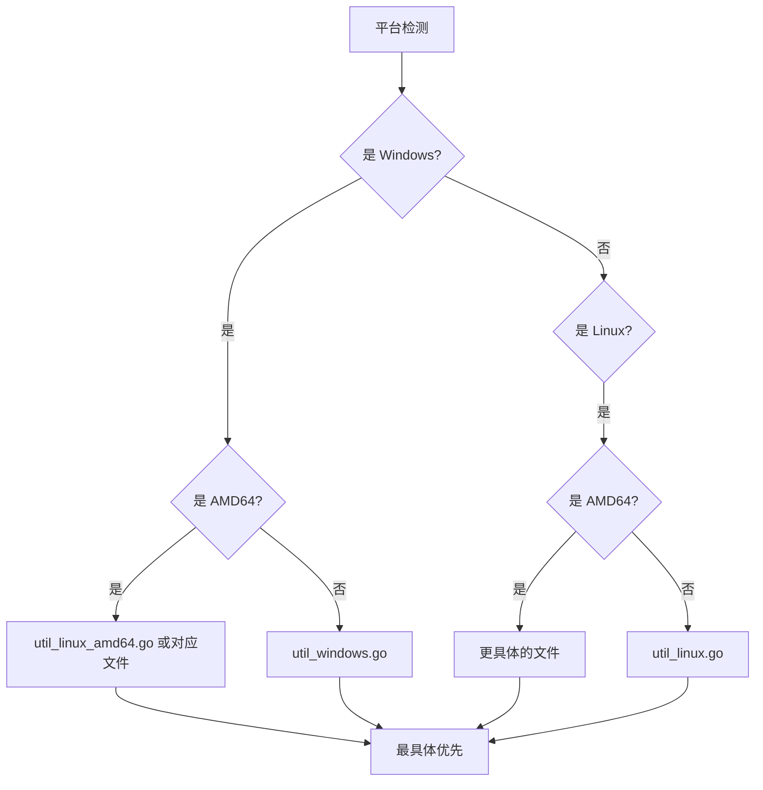
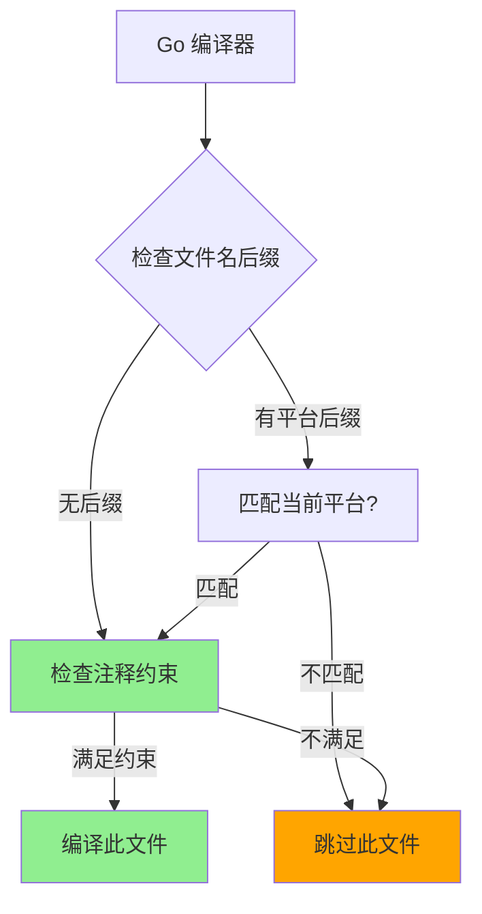
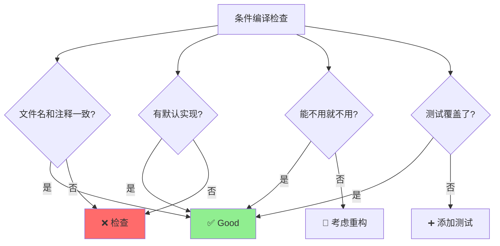

+++
title = "第2章 特殊指令与构建约束"
weight = 20
date = "2026-03-20T08:39:00+08:00"
type = "docs"
description = ""
isCJKLanguage = true
draft = false

+++


# 第2章 特殊指令与构建约束

> 欢迎来到第二章！这一章我们要聊的是 Go 语言的"隐身术"——特殊指令和构建约束。你知道吗？Go 的代码可以在不同平台上有不同的表现，就像变色龙一样，可以根据环境改变颜色。构建约束就是 Go 语言的"变色"机制，而特殊指令则是一些"魔法咒语"，可以改变编译器的行为。准备好了吗？让我们开始这段"魔法"之旅！

## 2.1 构建约束概述

> 在正式开始之前，让我先问你一个问题：假设你写了一个读取文件的功能，在 Windows 上你需要读取注册表，在 Linux 上你需要读取 `/proc` 文件系统，在 macOS 上你需要读取特定的系统路径。你会怎么写这段代码？
>
> 答案就是——构建约束。构建约束让你可以根据不同的平台编译不同的代码。

### 2.1.1 什么是构建约束

**构建约束**（Build Constraints）是一种告诉 Go 编译器"只有在特定条件下才编译这个文件"的机制。这就像是你给文件贴了个标签："仅在 Linux 上使用"或者"仅在 Go 1.18 以上版本使用"。

**构建约束的典型用途：**

- **平台特定代码**：比如 Windows 注册表操作、Linux 系统调用
- **架构特定代码**：比如 ARM 和 x86 的汇编实现
- **版本特定代码**：比如只在某个 Go 版本引入的功能
- **标签特定代码**：比如调试代码、生产代码的区别


```go
//go:build linux

package mypackage

// 这个文件只会在 Linux 平台上编译
func GetLinuxInfo() string {
    return "Running on Linux!"
}

```


```go
//go:build windows

package mypackage

// 这个文件只会在 Windows 平台上编译
func GetWindowsInfo() string {
    return "Running on Windows!"
}

```

> **小贴士**：构建约束看起来像注释，但实际上它们是编译器指令。`//go:build`（新语法）和 `// +build`（旧语法）是两种不同的写法，我们稍后会详细介绍。现在 Go 官方推荐使用 `//go:build` 语法。

### 2.1.2 约束的作用范围

构建约束只作用于它所在的文件。也就是说，你可以创建两个同名文件，只要它们的构建约束不同，Go 编译器就会根据当前平台选择合适的文件。

**文件命名约定：**

Go 支持在文件名中加入平台和架构信息作为约束：


```bash
# 文件名模式
myscript.go           # 所有平台都编译
myscript_linux.go     # 仅 Linux
myscript_windows.go   # 仅 Windows
myscript_amd64.go     # 仅 AMD64 架构
myscript_linux_amd64.go # 仅 Linux + AMD64
```

**文件名约束示例：**


```go
// 文件名：hello.go
package main

import "fmt"

func main() {
    fmt.Println("Hello from all platforms!") // Hello from all platforms!
}

```


```go
// 文件名：hello_windows.go
//go:build windows

package main

import "fmt"

func main() {
    fmt.Println("Hello from Windows!") // Hello from Windows!
}

```


```go
// 文件名：hello_linux.go
//go:build linux

package main

import "fmt"

func main() {
    fmt.Println("Hello from Linux!") // Hello from Linux!
}

```

### 2.1.3 约束的优先级

当多个文件满足构建条件时，Go 编译器会选择最"具体"的那个。这就像是你说"我要买手机"和"我要买 iPhone 15 Pro 256GB 蓝色"，后者更具体，所以优先级更高。


```go
// 文件：util.go（无约束，所有平台都编译）
//go:build

package utils

func GetMessage() string {
    return "通用消息"
}

```


```go
// 文件：util_windows.go（Windows 专用）
//go:build windows

package utils

func GetMessage() string {
    return "Windows 专属消息"
}

```


```go
// 文件：util_linux_amd64.go（Linux AMD64 专用）
//go:build linux && amd64

package utils

func GetMessage() string {
    return "Linux AMD64 专属消息"
}

```

> **优先级规则**：更具体的约束 > 更通用的约束。当有一个无约束的 `util.go` 和一个 `util_windows.go` 时，在 Windows 上会选择 `util_windows.go`，在其他平台上会选择 `util.go`。

**📊 构建约束优先级可视化：**





### 2.2 基于注释的构建约束

> 基于注释的构建约束是最常用的构建约束方式。它们看起来像是普通的注释，但实际上会被编译器识别并处理。这就像是电影里的"彩蛋"——表面上看起来是普通场景，但触发特定条件后会展现出隐藏内容。

#### 2.2.1 //go:build 指令

`//go:build` 是 Go 1.17 引入的新语法，比旧的 `// +build` 语法更清晰和一致。

##### 2.2.1.1 基本语法


```go
//go:build <约束条件>
```

约束条件由标识符组成，可以是操作系统（如 `linux`、`windows`、`darwin`）、架构（如 `amd64`、`arm64`）、编译器（如 `gc`、`gccgo`）或自定义标签。


```go
//go:build linux

package mypackage

// 这个文件只在 Linux 上编译
func GetOSInfo() string {
    return "Linux"
}

```


```go
//go:build windows

package mypackage

// 这个文件只在 Windows 上编译
func GetOSInfo() string {
    return "Windows"
}

```

##### 2.2.1.2 逻辑运算符（&& || !）

你可以在构建约束中使用逻辑运算符来组合多个条件：


```go
//go:build linux && amd64

package mypackage

// 只在 Linux AMD64 平台上编译
func PlatformInfo() string {
    return "Linux on AMD64"
}

```


```go
//go:build darwin || windows

package mypackage

// 在 macOS 或 Windows 上编译
func DesktopInfo() string {
    return "Desktop OS"
}

```


```go
//go:build !linux

package mypackage

// 在非 Linux 平台上编译（也就是说在 Windows、macOS 等平台上）
func NotLinuxInfo() string {
    return "Not running on Linux"
}

```

##### 2.2.1.3 多个约束组合

你可以在一行上写多个约束，它们默认是 AND 关系：


```go
//go:build linux && amd64 && !cgo

package mypackage

// 在 Linux AMD64 平台上，使用非 cgo 编译时生效
func PureGoInfo() string {
    return "Pure Go on Linux AMD64"
}

```

你也可以使用括号来分组，使逻辑更清晰：


```go
//go:build (linux && amd64) || (darwin && arm64)

package mypackage

// Linux AMD64 或 macOS ARM64
func SpecificPlatforms() string {
    return "Specific platforms"
}

```

#### 2.2.2 // +build 旧语法

`// +build` 是旧的构建约束语法，在 Go 1.17 之前是唯一的选择。虽然现在推荐使用 `//go:build`，但你仍然会看到很多旧代码使用这种语法。

##### 2.2.2.1 基本用法


```go
// +build linux

package mypackage

// Linux 专用
func GetOSInfo() string {
    return "Linux"
}

```


```go
// +build windows,amd64

package mypackage

// Windows AMD64 专用
func PlatformInfo() string {
    return "Windows on AMD64"
}

```

> **注意**：`// +build` 语法中，逗号表示 AND，空格表示 OR。而 `//go:build` 则使用 `&&` 和 `||` 运算符。

##### 2.2.2.2 与 go:build 的区别

| 特性 | `//go:build` | `// +build` |
|------|--------------|-------------|
| Go 版本 | Go 1.17+ | 所有版本 |
| 运算符 | `&&`、`\|\|`、`!` | 逗号（AND）、空格（OR） |
| 括号支持 | 支持 | 不支持 |
| 推荐程度 | 强烈推荐 | 兼容旧代码 |

**两种语法的对比：**


```go
//go:build linux && (amd64 || arm64)
// +build linux amd64
// +build linux arm64

package mypackage
```

上面这个例子表示：在 Linux AMD64 或 Linux ARM64 平台上编译。

**新语法（go:build）：**
- `linux && (amd64 || arm64)` 表示 Linux 且 (AMD64 或 ARM64)

**旧语法（+build）：**
- `linux amd64` 表示 Linux AND AMD64
- `linux arm64` 表示 Linux AND ARM64
- 两行组合起来表示 OR 关系

#### 2.2.3 约束条件详解

##### 2.2.3.1 操作系统约束（linux, windows, darwin）


```go
//go:build linux

// Linux 专用代码
func GetOS() string {
    return "Linux"
}

```


```go
//go:build windows

// Windows 专用代码
func GetOS() string {
    return "Windows"
}

```


```go
//go:build darwin

// macOS 专用代码
func GetOS() string {
    return "macOS"
}

```


```go
//go:build freebsd

// FreeBSD 专用代码
func GetOS() string {
    return "FreeBSD"
}

```

**常用的操作系统标识符：**

| OS | 标识符 | 说明 |
|----|--------|------|
| Linux | `linux` | Linux 系统 |
| Windows | `windows` | Windows 系统 |
| macOS | `darwin` | Apple macOS 系统 |
| FreeBSD | `freebsd` | FreeBSD 系统 |
| OpenBSD | `openbsd` | OpenBSD 系统 |
| NetBSD | `netbsd` | NetBSD 系统 |

##### 2.2.3.2 架构约束（amd64, arm64, 386）


```go
//go:build amd64

// 仅 AMD64 (x86-64)
func GetArch() string {
    return "AMD64"
}

```


```go
//go:build arm64

// 仅 ARM64
func GetArch() string {
    return "ARM64"
}

```


```go
//go:build 386

// 仅 32位 x86
func GetArch() string {
    return "x86"
}

```


```go
//go:build arm

// 仅 ARM
func GetArch() string {
    return "ARM"
}

```

**常用的架构标识符：**

| ARCH | 标识符 | 说明 |
|------|--------|------|
| AMD64 | `amd64` | 64位 x86 |
| ARM64 | `arm64` | 64位 ARM |
| 386 | `386` | 32位 x86 |
| ARM | `arm` | 32位 ARM |

##### 2.2.3.3 编译器约束（gc, gccgo）


```go
//go:build gc

// 仅使用 gc 编译器（Go 标准编译器）
func GetCompiler() string {
    return "gc"
}

```


```go
//go:build gccgo

// 仅使用 gccgo 编译器（GCC 的 Go 前端）
func GetCompiler() string {
    return "gccgo"
}

```

##### 2.2.3.4 版本约束（go1.18, go1.20+）


```go
//go:build go1.18

// 仅 Go 1.18 及以上版本
// 可以使用泛型
func GenericFunc[T any](v T) T {
    return v
}

```


```go
//go:build go1.21

// 仅 Go 1.21 及以上版本
func NewFeature() string {
    return "Go 1.21 新特性"
}

```

##### 2.2.3.5 自定义标签（debug, prod, test）


```go
//go:build debug

// 仅在 debug 构建时包含
func DebugInfo() string {
    return "DEBUG 模式"
}

```


```go
//go:build prod

// 仅在 prod 构建时包含
func ProdInfo() string {
    return "PRODUCTION 模式"
}

```


```go
//go:build test

// 仅在测试时包含
func TestInfo() string {
    return "TEST 模式"
}

```


```go
//go:build ignore

// 文件被忽略，不会编译
func Ignored() string {
    return "你看不到我"
}

```

**自定义标签的使用：**


```bash
# 使用自定义标签编译
go build -tags "debug"
go build -tags "prod"
go build -tags "test,integration"
```


### 2.3 基于文件名的构建约束

> 除了注释之外，Go 还支持通过文件名来指定构建约束。这种方式更加"隐形"——你只需要把文件命名成特定格式，编译器就会自动识别。想象一下，你给文件贴了个隐形标签，只有编译器能看见。

#### 2.3.1 文件名后缀约束

Go 通过文件名后缀来识别构建约束。文件名的一般格式是：


```bash
name_OS.go
name_ARCH.go
name_OS_ARCH.go
```

##### 2.3.1.1 _linux.go, _windows.go


```bash
# 适用于 Linux
util_linux.go

# 适用于 Windows
util_windows.go

# 适用于 macOS
util_darwin.go
```


```go
// 文件：platform_linux.go
package platform

import "runtime"

func GetPlatformName() string {
    return "Linux"
}

func GetOSVersion() string {
    return runtime.GOOS
}

```


```go
// 文件：platform_windows.go
package platform

import "runtime"

func GetPlatformName() string {
    return "Windows"
}

func GetOSVersion() string {
    return runtime.GOOS
}

```

##### 2.3.1.2 _amd64.go, _arm64.go


```bash
# 适用于 AMD64 (x86-64)
util_amd64.go

# 适用于 ARM64
util_arm64.go

# 适用于 386 (32-bit x86)
util_386.go
```


```go
// 文件：arch_amd64.go
package arch

import "fmt"

func GetArchInfo() string {
    return "AMD64 (64-bit x86)"
}

func ExampleSpecialFeature() {
    fmt.Println("AMD64 specific feature") // AMD64 specific feature
}

```


```go
// 文件：arch_arm64.go
package arch

import "fmt"

func GetArchInfo() string {
    return "ARM64 (64-bit ARM)"
}

func ExampleSpecialFeature() {
    fmt.Println("ARM64 specific feature") // ARM64 specific feature
}

```

##### 2.3.1.3 组合后缀 _linux_amd64.go

你可以组合多个后缀来指定更具体的平台：


```bash
# Linux AMD64 专用
util_linux_amd64.go

# Windows ARM64 专用
util_windows_arm64.go

# macOS ARM64 专用
util_darwin_arm64.go
```


```go
// 文件：native_linux_amd64.go
package native

import "fmt"

func GetNativeInfo() string {
    return "Linux AMD64"
}

func RunBenchmark() {
    fmt.Println("Running on Linux AMD64...") // Running on Linux AMD64...
}

```


```go
// 文件：native_darwin_arm64.go
package native

import "fmt"

func GetNativeInfo() string {
    return "macOS ARM64"
}

func RunBenchmark() {
    fmt.Println("Running on macOS ARM64...") // Running on macOS ARM64...
}

```

#### 2.3.2 平台特定文件命名

Go 支持的操作系统和架构都有对应的文件名模式：

**常用操作系统：**


| OS | 文件后缀 | 示例 |
|----|---------|------|
| Linux | `_linux` | `main_linux.go` |
| Windows | `_windows` | `main_windows.go` |
| macOS | `_darwin` | `main_darwin.go` |
| FreeBSD | `_freebsd` | `main_freebsd.go` |
| OpenBSD | `_openbsd` | `main_openbsd.go` |
| NetBSD | `_netbsd` | `main_netbsd.go` |

**常用架构：**


| ARCH | 文件后缀 | 示例 |
|------|---------|------|
| AMD64 | `_amd64` | `util_amd64.go` |
| ARM64 | `_arm64` | `util_arm64.go` |
| 386 | `_386` | `util_386.go` |
| ARM | `_arm` | `util_arm.go` |

#### 2.3.3 文件名与注释约束的优先级

当一个文件同时有文件名约束和注释约束时，两个约束必须同时满足才能编译该文件。


```go
// 文件：feat_linux_amd64.go

//go:build debug

package feat

// 这个文件必须满足：
// 1. 文件名约束：linux + amd64
// 2. 注释约束：debug 标签
func GetInfo() string {
    return "Linux AMD64 DEBUG"
}

```


```bash
# 只有同时满足平台和标签才会编译
go build -tags debug  # 在 Linux amd64 上会编译
go build              # 不会编译（缺少 debug 标签）
```

> **小贴士**：文件名约束和注释约束可以互补。文件名约束适合平台相关的差异，注释约束适合构建类型相关的差异（如 debug vs release）。

**📊 构建约束决策流程：**





### 2.4 其他特殊指令

> 除了构建约束之外，Go 语言还有一些"魔法指令"，它们不是用来控制代码是否编译的，而是用来改变编译器的行为。这些指令就像是给编译器的"小纸条"，告诉编译器"请用这种方式处理我"或者"帮我做这些特殊的事"。大多数这些指令都涉及到 Go 的底层实现或者特殊功能，一般程序员可能用不到，但了解它们对于理解 Go 的内部机制非常有帮助。

#### 2.4.1 //go:generate

`//go:generate` 是一个用于代码生成的指令。当你在代码中写入这个指令后，运行 `go generate` 命令，Go 工具链就会执行这个指令指定的命令。这个指令在 Go 社区中被广泛使用，特别是用于自动生成重复性的代码。

**历史背景**：代码生成在 Go 中是一种常见的实践，特别是在 Go 1.4 之后，`go generate` 被引入作为官方支持的代码生成机制。它允许你在编译前自动运行一些工具来生成代码，大大减少了手动编写重复代码的工作量。

##### 2.4.1.1 代码生成指令


```go
//go:generate stringer -type=Weekday
```

上面这个指令的意思是："运行 `stringer -type=Weekday` 命令来生成代码。"

##### 2.4.1.2 执行命令


```bash
# 执行所有 //go:generate 指令
go generate ./...

# 或者只执行特定包的
cd mypackage && go generate
```

##### 2.4.1.3 常用工具（stringer, mockgen）

**stringer - 自动生成 String() 方法**

stringer 是 Go 官方提供的一个工具，可以根据常量的定义自动生成 `String()` 方法。这在处理枚举类型时特别有用。


```go
//go:generate stringer -type=Weekday -linecomment

package time

type Weekday int

const (
    Sunday    Weekday = iota // Sunday
    Monday                   // Monday
    Tuesday                  // Tuesday
    Wednesday                // Wednesday
    Thursday                 // Thursday
    Friday                   // Friday
    Saturday                 // Saturday
)
```

运行 `go generate` 后，会生成一个 `weekday_string.go` 文件：


```go
// Code generated by stringer -type=Weekday -linecomment; DO NOT EDIT.

package time

import "strconv"

func _() {
    // An invalid auxiliary input for Weekday.
    _ = p[September:Uint8]
}

const Weekday_name = "SundayMondayTuesdayWednesdayThursdayFridaySaturday"

var Weekday_index = [...]uint8{0, 6, 12, 19, 28, 36, 41, 48}

func (i Weekday) String() string {
    i -= Sunday
    return Weekday_name[Weekday_index[i]:Weekday_index[i+1]]
}
```

**mockgen - 生成 Mock 对象**

mockgen 是 `gomock` 工具的一部分，用于生成接口的 mock 实现，这在单元测试中非常有用。


```go
//go:generate mockgen -destination=mocks/mock_calculator.go -package=mocks Calculator

package calculator

type Calculator interface {
    Add(a, b int) int
    Multiply(a, b int) int
}
```

运行 `go generate` 后，会生成 Mock 代码用于测试。

**其他常用的代码生成工具：**

- `go-bindata`：将二进制文件嵌入到 Go 代码中
- ` protoc-go`：生成 Protocol Buffers 的 Go 代码
- ` sqlc`：根据 SQL 语句生成 Go 数据库代码
- `gormgen`：GORM 的代码生成工具

#### 2.4.2 //go:linkname

`//go:linkname` 是一个非常危险的指令，它告诉编译器"这个 Go 符号实际上对应那个链接符号"。这在访问 runtime 包的内部实现时很有用，但滥用它会导致不可移植的代码。

**历史背景**：`//go:linkname` 是 Go 早期版本中为了访问 runtime 包内部函数而设计的。在 Go 1.5 之前，runtime 包的一些内部函数需要被其他包访问，但 Go 的可见性规则不允许这样做。所以这个指令被引入作为"后门"。

**警告**：这个指令是"unsafe"级别的操作。它绕过了 Go 的类型系统和包边界保护。使用它意味着你的代码依赖于编译器和 runtime 的内部实现，这些可能在不同版本之间变化。**除非你非常清楚自己在做什么，否则不要使用它！**

##### 2.4.2.1 链接器指令


```go
//go:linkname runtime.memclr0 runtime.memclr0
```

上面这行代码的意思是："在当前包中，有一个 `runtime.memclr0`，它的实际链接符号就是 `runtime.memclr0`。"

##### 2.4.2.2 使用场景与风险


```go
package myruntime

import _ "unsafe"

//go:linkname time_now time.now

// 这是合法的使用场景：访问 runtime 包的内部函数
```

#### 2.4.3 //go:nosplit

`//go:nosplit` 指令告诉编译器"不要在这个函数插入栈增长检查的代码"。这用于非常底层的、必须保持很小栈帧的函数。

**历史背景**：Go 的运行时会在函数 prologue（中）插入栈增长检查代码。如果函数使用太多栈空间但没有这个检查，可能会导致栈溢出。但是对于一些底层的、性能关键的函数，这个检查的开销是不可接受的。

##### 2.4.3.1 栈增长控制


```go
//go:nosplit

func FastMemmove(dst, src unsafe.Pointer, n uintptr) {
    // 这个函数必须非常快，不能有栈增长检查的开销
    // 使用汇编实现，零栈帧
}
```

##### 2.4.3.2 运行时函数使用


```go
//go:nosplit

func gogo(gp *g) {
    // 这是 runtime 包中的一个关键函数
    // 用于 goroutine 调度
    // 必须保持最小栈帧以避免递归
}
```

> **小贴士**：除非你在写 runtime 或者 JIT 编译器，否则你不太可能需要使用 `//go:nosplit`。使用它时要非常小心，因为如果你的函数实际上需要增长栈，可能会导致灾难性的后果。

#### 2.4.4 //go:noescape

`//go:noescape` 指令告诉编译器"这个函数的参数不会逃逸到堆上"。这用于性能关键的函数，可以避免不必要的堆分配。

**历史背景**：Go 有垃圾回收机制，堆上的对象需要被回收。函数参数默认可能会"逃逸"到堆上（如果被返回或者被通道发送等）。但是对于一些性能关键的函数，我们知道参数不会逃逸，可以让编译器优化避免堆分配。

##### 2.4.4.1 逃逸分析控制


```go
//go:noescape

func Memcpy(dst, src unsafe.Pointer, n uintptr) {
    // 编译器会假设参数不会逃逸
    // 从而避免在堆上分配内存
}
```

##### 2.4.4.2 性能优化场景


```go
//go:noescape

func SimdMemcpy(dst, src unsafe.Pointer, n uintptr) {
    // SIMD 内存拷贝，零拷贝开销
    // 使用汇编实现的高性能内存拷贝
}
```

> **警告**：如果你错误地使用了 `//go:noescape`，而函数实际上导致了参数逃逸，程序可能会出现内存问题或崩溃。编译器有时候会用硬件断点来检测这种错误。

#### 2.4.5 //go:noinline

`//go:noinline` 指令告诉编译器"不要内联这个函数"。这在调试、性能分析和某些需要栈帧可见性的场景下很有用。

**历史背景**：内联是编译器优化的重要手段，它会把小函数"展开"到调用者的代码中，消除函数调用开销。但是在某些场景下，我们需要函数保持独立的栈帧，比如调试时需要看到函数调用栈，或者使用 `defer` 时需要正确的栈帧。

##### 2.4.5.1 内联控制


```go
//go:noinline

func ComplexCalculation(x int) int {
    // 这个函数不会被内联
    // 便于在 profile 中看到它
    result := x * x
    for i := 0; i < x; i++ {
        result += i
    }
    return result
}
```

##### 2.4.5.2 调试与优化


```go
//go:noinline

func DebugPrintStack() {
    // 方便调试时看到完整的栈信息
    // 不会被内联到调用者
}
```

> **小贴士**：Go 的内联策略很智能，通常不会内联包含循环、递归或复杂控制流的函数。`//go:noinline` 主要用于那些确实需要栈帧可见性的场景，而不是为了"优化"。

#### 2.4.6 //go:systemstack

`//go:systemstack` 指令表明这个函数必须在系统栈上执行，而不能在普通的 goroutine 栈上执行。

**历史背景**：Go 有两种栈——goroutine 栈（用户栈）和系统栈（g0栈）。系统栈用于运行时的一些关键操作，比如调度和 GC。某些函数必须在系统栈上执行，因为它们可能被正在栈增长的 goroutine 调用。

##### 2.4.6.1 系统栈标记


```go
//go:systemstack

func writeBarrier() {
    // 这段代码必须在系统栈上运行
    // 因为它可能被一个正在栈增长的 goroutine 调用
}
```

##### 2.4.6.2 运行时使用


```go
//go:systemstack

func morestack() {
    // runtime 的 morestack 函数
    // 用于处理栈增长
}
```

#### 2.4.7 //go:nowritebarrier

`//go:nowritebarrier` 指令告诉编译器"在这个函数中禁用写屏障"。如果代码在有写屏障的情况下运行，会产生编译错误。

**历史背景**：写屏障是 GC 过程中的一个关键机制，它记录了堆上对象的修改。但是写屏障本身有性能开销。在某些性能关键的代码路径中，我们可能需要禁用写屏障。

##### 2.4.7.1 GC 写屏障控制


```go
//go:nowritebarrier

func SimpleAssign(dst, src unsafe.Pointer, size uintptr) {
    // 在这个函数中不能使用写屏障
    // 用于避免在某些关键路径上的 GC 开销
}
```

##### 2.4.7.2 底层代码使用

> **注意**：这个指令通常只在 runtime 和编译器内部使用。普通用户代码不应该需要它。

#### 2.4.8 //go:yeswritebarrierrec

`//go:yeswritebarrierrec` 是 `//go:nowritebarrier` 的补充，标记一个函数在递归调用时允许写屏障。

**历史背景**：有时候一个函数被标记为 `nowritebarrier`，但它的递归调用需要写屏障。这个指令用于处理这种嵌套情况。

##### 2.4.8.1 写屏障恢复


```go
//go:yeswritebarrierrec

func WriteBarrierRecursive(ptr unsafe.Pointer, val interface{}) {
    // 递归调用时允许使用写屏障
}
```

##### 2.4.8.2 递归函数标记

> 这个指令主要用于 runtime 的 GC 相关代码，用于处理那些调用链中包含 `//go:nowritebarrier` 函数的递归函数。

#### 2.4.9 //go:cgo_import_dynamic

`//go:cgo_import_dynamic` 是用于 CGO 的指令，告诉链接器如何处理动态库的符号导入。

**历史背景**：CGO 是 Go 调用 C 代码的机制。在早期版本的 Go 中，需要使用这些底层指令来控制符号的导入。随着 CGO 的发展，很多这些指令已经被更高级的语法取代。

##### 2.4.9.1 CGO 动态导入


```c
// mylib.h
int add(int a, int b);
```


```go
/*
#include "mylib.h"
*/
import "C"

import (
    "fmt"
)

//void add(int, int);
//go:linkname add github.com/my/pkg.add
//go:cgo_import_dynamic add add "mylib.dll"
```

##### 2.4.9.2 链接器指令


```go
//go:cgo_import_dynamic clib add "mylib.so"
```

> **警告**：这些指令通常由 SWIG 或其他自动工具生成，而不是手写。

#### 2.4.10 //go:cgo_import_static

`//go:cgo_import_static` 与动态导入相对，用于静态链接的场景。

##### 2.4.10.1 CGO 静态导入


```go
//go:cgo_import_static clib add
```

##### 2.4.10.2 使用场景


```go
//go:cgo_import_static mypkg_add
```

#### 2.4.11 //go:cgo_ldflag

`//go:cgo_ldflag` 用于向链接器传递标志，这在链接外部库时很有用。

##### 2.4.11.1 CGO 链接器标志


```go
//go:cgo_ldflag -lpthread
```

##### 2.4.11.2 编译选项传递


```go
//go:cgo_ldflag -L/usr/local/lib
//go:cgo_ldflag -lm
```

#### 2.4.12 //go:cgo_export_static

`//go:cgo_export_static` 用于从 Go 导出函数给 C 使用（静态链接场景）。

##### 2.4.12.1 静态导出


```go
//go:cgo_export_static GoAdd
```

##### 2.4.12.2 C 函数导出


```go
//export GoAdd
func GoAdd(a, b int32) int32 {
    return a + b
}

//go:cgo_export_static GoAdd
```

#### 2.4.13 //go:cgo_export_dynamic

`//go:cgo_export_dynamic` 用于从 Go 导出函数给 C 使用（动态链接场景）。

##### 2.4.13.1 动态导出


```go
//go:cgo_export_dynamic GoMultiply
```

##### 2.4.13.2 共享库导出


```go
//export GoMultiply
func GoMultiply(a, b int32) int32 {
    return a * b
}

//go:cgo_export_dynamic GoMultiply
```

#### 2.4.14 //go:embed

`//go:embed` 是 Go 1.16 引入的指令，用于将文件或目录的内容嵌入到编译后的二进制文件中。

**历史背景**：在 Go 1.16 之前，如果你想把静态文件打包进二进制，通常需要使用外部工具如 `go-bindata`。Go 1.16 引入了 `//go:embed` 指令，让这件事变得简单多了。这是 Go 语言" Batteries Included"哲学的又一次体现。

##### 2.4.14.1 文件嵌入（Go 1.16+）


```go
package main

import _ "embed"

//go:embed hello.txt
var greeting string

func main() {
    println(greeting)
}
```


```text

Hello, World!

```

运行结果：


```go
// Hello, World!
```

##### 2.4.14.2 嵌入目录


```go
package main

import _ "embed"

//go:embed templates
var templates embed.FS

func main() {
    data, _ := templates.ReadFile("templates/index.html")
    println(string(data))
}
```

##### 2.4.14.3 嵌入模式


```go
package main

import (
    "embed"
    "fmt"
)

//go:embed *.go
var sourceFiles embed.FS

//go:embed "data/*.json"
var dataFiles embed.FS

//go:embed textfile.txt
var textContent string

//go:embed image.png
var imageData []byte

    fmt.Println("文本内容:", textContent) // 文本内容: // Hello, World!
    fmt.Println("文本内容:", textContent) // 文本内容: // Hello, World!
    fmt.Printf("图片大小: %d bytes\n", len(imageData)) // 图片大小: <file_size> bytes
}
```

> **`//go:embed` 指令后面可以跟**：
> - 单个文件名：`//go:embed hello.txt`
> - 通配符：`//go:embed *.go`
> - 目录：`//go:embed templates`
> - 路径模式：`//go:embed "data/*.json"`

#### 2.4.15 //go:mod

`//go:mod` 指令用于指定模块的 module 指令（从 Go 1.17 开始）。

##### 2.4.15.1 模块指令


```go
//go:mod github.com/my/project v1.2.3
```

##### 2.4.15.2 版本约束

> 这个指令通常不需要手动使用，它是由 `go mod` 工具自动管理的。

#### 2.4.16 //go:sum

`//go:sum` 指令用于指定 go.sum 文件的内容（从 Go 1.17 开始）。

##### 2.4.16.1 校验和指令


```go
//go:sum github.com/pkg/errors v0.9.1 h1: LWQ1pSpb5y95X0N6y8eRM...
```

##### 2.4.16.2 安全验证

> 这个指令主要用于 Go 工具链内部，确保依赖的完整性和安全性。

#### 2.4.17 //go:debug

`//go:debug` 是 Go 1.21 引入的指令，用于在编译时保留调试信息。

**历史背景**：Go 1.21 引入了这个指令，允许在特定情况下保留更详细的调试信息，这对于调试某些类型的问题很有帮助。

##### 2.4.17.1 调试指令（Go 1.21+）


```go
//go:debug local
```

这个指令告诉编译器在二进制文件中保留本地变量的调试信息。

##### 2.4.17.2 运行时调试

> 这个指令主要用于 Go 工具链和调试器的开发。

#### 2.4.18 //go:fix

`//go:fix` 指令标记了一个文件需要被 `go fix` 工具处理。

**历史背景**：`go fix` 是 Go 早期版本中的一个工具，用于帮助开发者迁移旧代码到新版本。随着 Go 语言的发展，这个工具已经很少使用了。

##### 2.4.18.1 自动修复标记


```go
//go:fix uuid
```

##### 2.4.18.2 代码迁移

> 这个指令在 Go 语言内部使用，用于帮助开发者迁移旧代码到新版本。


### 2.5 条件编译最佳实践

> 条件编译是 Go 语言中一个强大的特性，但正如所有强大的特性一样，用得好是神器，用不好就是灾难。这一节我们来聊聊如何"优雅"地使用条件编译，避免把自己和同事坑哭。

#### 2.5.1 何时使用构建约束

**应该使用构建约束的场景：**

- **平台特定实现**：不同操作系统有完全不同的 API，如文件操作、系统调用等
- **架构优化**：某些算法在特定 CPU 架构上有更高效的指令集实现
- **版本兼容**：某些功能只在特定 Go 版本可用

**不应该使用构建约束的场景：**

- **跨平台代码能用普通 `if` 解决的**：Go 的 `runtime.GOOS` 和 `runtime.GOARCH` 是运行时变量，如果你能用 if 解决，就不要用构建约束
- **规避类型系统**：不要用条件编译来绕过类型检查
- **调试代码**：用 `-tags` 来控制调试代码的编译，而不是创建多个文件

**好的例子：平台特定实现**


```go
// file: stat_linux.go
//go:build linux

package sys

func GetFileInfo(path string) (os.FileInfo, error) {
    return os.Stat(path)
}
```

**好的例子：使用运行时检查**


```go
package main

import (
    "fmt"
    "runtime"
)

func main() {
    fmt.Println("OS:", runtime.GOOS) // OS: windows (示例)
    fmt.Println("Arch:", runtime.GOARCH) // Arch: amd64 (示例)
}
```

#### 2.5.2 平台代码分离策略

**策略一：文件名后缀法**


```bash
util.go           # 所有平台共享
util_linux.go    # Linux 专用
util_windows.go  # Windows 专用
util_darwin.go   # macOS 专用
```

**策略二：注释约束法**


```go
//go:build linux && !cgo

package util
```

**策略三：组合策略**


```bash
platform/
├── platform.go      # 共享代码
├── platform_linux.go
├── platform_windows.go
└── platform_bsd.go  // FreeBSD, OpenBSD, NetBSD 共用
```


```go
// platform_bsd.go
//go:build freebsd || openbsd || netbsd

package platform
```

#### 2.5.3 测试代码的条件编译


```go
// file: cache_test.go
//go:build integration

package cache

import "testing"

func TestCacheIntegration(t *testing.T) {
    // 集成测试，需要外部依赖
}
```


```bash
# 运行普通测试
go test ./...

# 运行包含集成测试
go test -tags integration ./...
```

#### 2.5.4 与 CI/CD 的结合


```yaml
# .github/workflows/cross-compile.yml
name: Cross Compile

on: [push]

jobs:
  build:
    strategy:
      matrix:
        goos: [linux, windows, darwin]
        goarch: [amd64, arm64]
    runs-on: ubuntu-latest
    steps:
      - uses: actions/checkout@v2
      - name: Build
        env:
          GOOS: ${{ matrix.goos }}
          GOARCH: ${{ matrix.goarch }}
        run: |
          go build -o myapp-${{ matrix.goos }}-${{ matrix.goarch }}
```

#### 2.5.5 常见陷阱与规避

**陷阱一：文件名和注释约束冲突**


```go
// file: foo_linux.go
//go:build darwin  // ❌ 错误！文件名说是 Linux，注释说是 Darwin

package foo
```

> 永远不要让文件名和注释冲突！它们应该一致。

**陷阱二：忘记默认文件**


```bash
# 如果只有
feat_linux.go   # Linux 专用
feat_windows.go # Windows 专用

# 但忘了 feat.go（通用版本）
# 那么在 macOS 上编译会失败！
```

> 总是提供一个没有平台后缀的默认实现。

**陷阱三：过度的条件编译**


```bash
# ❌ 过度使用：代码碎片化严重
feat_linux.go
feat_windows.go
feat_darwin.go
feat_debug.go
feat_release.go
feat_aws.go
feat_azure.go
```

> 如果可能的组合太多，考虑使用接口和依赖注入。

**📊 条件编译最佳实践检查表：**




### 2.6 工具支持

> Go 语言有一整套工具链来支持构建约束的使用。这一节我们来认识一下这些工具，让你在处理条件编译时更加得心应手。

#### 2.6.1 go build 标签处理


```bash
# 编译时指定标签
go build -tags "debug,prod" ./...

# 忽略构建约束
go build -tags "ignore_constraints" ./...

# 查看构建约束
go list -f '{{.GoFiles}}' ./...
```


```go
//go:build linux && amd64

package main

import "fmt"

func main() {
    fmt.Println("Built for Linux AMD64") // Built for Linux AMD64
}
```

#### 2.6.2 go list -f 查看约束


```bash
# 查看包的文件列表
go list -f '{{.GoFiles}}' mypackage

# 查看所有平台可用的文件
go list -f '{{.TestGoFiles}}' mypackage

# 查看 C 文件
go list -f '{{.CgoFiles}}' mypackage
```


```bash
# 查看构建约束
go list -f '{{.Constraints}}' ./...

# 更详细的输出
go list -json -f '{{.Constraints}}' mypackage
```

#### 2.6.3 IDE 支持（VS Code, GoLand）

**VS Code (Go 扩展)：**


```json
{
    "go.toolsEnvVars": {
        "GOOS": "linux",
        "GOARCH": "amd64"
    }
}
```

**GoLand：**

- File → Settings → Go → Build Tags & Vendoring
- 添加自定义的构建标签

**IDEA：**

- Preferences → Go → Build Tags
- 支持自动补全 `//go:build` 约束

#### 2.6.4 静态分析工具支持

**go vet 和静态分析：**


```bash
# 静态分析会检查构建约束
go vet ./...

# 检查特定平台
GOOS=linux GOARCH=amd64 go vet ./...
```

**golangci-lint：**


```yaml
# .golangci.yml
run:
  tags:
    - debug
    - integration
```

---

## 本章小结

本章我们学习了 Go 语言的特殊指令与构建约束，这是 Go 语言高级特性之一。主要内容包括：

1. **构建约束概述**：构建约束是一种告诉 Go 编译器"只有在特定条件下才编译这个文件"的机制。

2. **基于注释的构建约束**：`//go:build` 是新语法，支持 `&&`、`||`、`!` 运算符；`// +build` 是旧语法，用逗号和空格表示关系。

3. **基于文件名的构建约束**：通过文件名后缀（如 `_linux.go`、`_amd64.go`）来指定构建约束。

4. **其他特殊指令**：包括 `//go:generate`（代码生成）、`//go:linkname`（链接器指令）、`//go:nosplit`（栈增长控制）、`//go:noescape`（逃逸分析控制）、`//go:noinline`（内联控制）、`//go:systemstack`（系统栈标记）、`//go:nowritebarrier`（GC 写屏障控制）、CGO 相关指令、`//go:embed`（文件嵌入）等。

5. **条件编译最佳实践**：包括何时使用构建约束、平台代码分离策略、测试代码的条件编译、与 CI/CD 的结合，以及常见陷阱与规避。

6. **工具支持**：包括 `go build` 标签处理、`go list` 查看约束、IDE 支持和静态分析工具。

掌握好这些构建约束和特殊指令，能让你的 Go 代码在不同平台上无缝运行，同时保持代码的整洁和可维护性！

---

> 到这里，第二章"特殊指令与构建约束"就全部结束了！你现在应该对 Go 语言的构建约束和特殊指令有了全面的了解。下一章我们将探讨 Go 语言的"类型系统"，这可是核心中的核心！准备好了吗？让我们继续 Go 的旅程！

