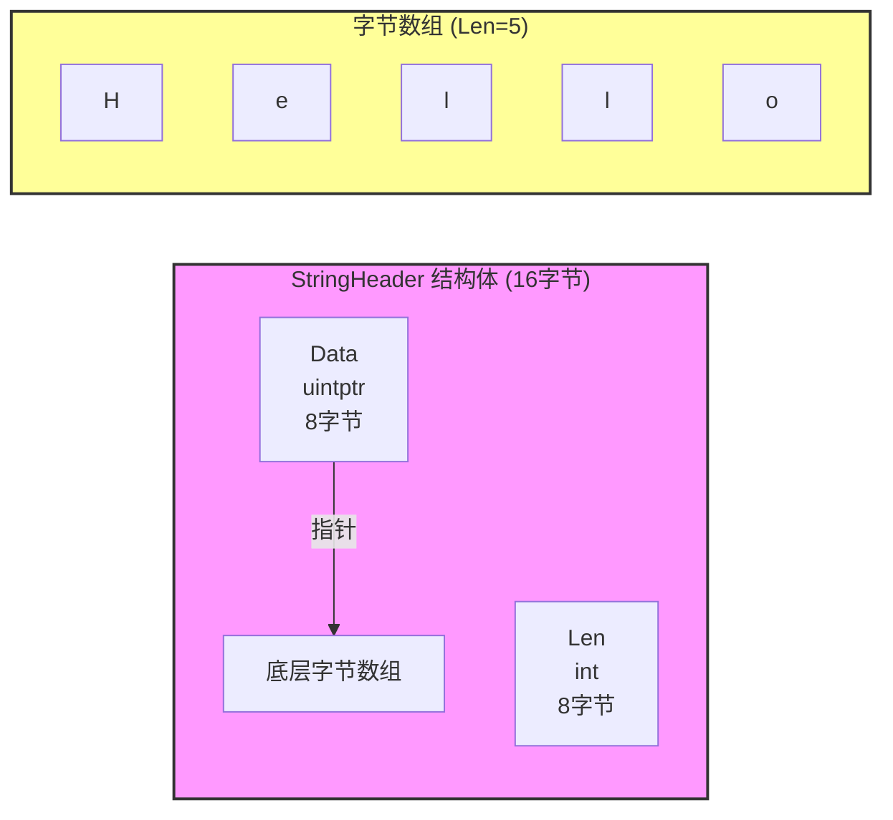

+++
title = "第3章 类型系统"
weight = 30
date = "2026-03-20T08:39:00+08:00"
type = "docs"
description = ""
isCJKLanguage = true
draft = false

+++
# 第3章 类型系统

> 欢迎来到第三章！这一章我们要聊的是 Go 语言的"基因改造"——类型系统。如果说 Go 语言是一个人，那类型系统就是这个人的"血统认证"。Go 是一种静态类型语言，这意味着每个变量都有一个类型，而且这个类型在编译时就确定了。但 Go 的类型系统又比 C++/Java 简洁得多，它没有类、没有继承、没有泛型（呃，Go 1.18 有了）——但这些都不影响它成为一个强大的类型系统。准备好了吗？让我们开始！

## 3.1 类型概述

> 在正式开始之前，让我先问你一个问题：如果你有一盒糖果，里面有巧克力、水果糖、奶糖...你会怎么分类？
>
> 答案取决于你站在哪个角度：
> - 按口味分：甜的、酸的、咸的
> - 按包装分：袋装的、盒装的、散装的
> - 按价格分：贵的、便宜的
>
> 类型系统就是编程语言对数据"分类"的方式。Go 语言有一套独特的分类标准，让我们一起来看看。

### 3.1.1 预声明类型

Go 语言预先声明了一些基本类型，你不需要 import 任何包就可以直接使用它们。这些类型就像是 Go 世界的"原住民"，从 Go 诞生之日起就存在了。

**预声明的类型：**

```go
bool  byte  complex64  complex128  error
float32  float64
int  int8  int16  int32  int64
rune  string
uint  uint8  uint16  uint32  uint64  uintptr
any  comparable
```

**预声明类型的使用：**

```go
package main

import "fmt"

func main() {
    var (
        b   bool       = true
        by  byte        = 'A'
        i   int        = 42
        f   float64    = 3.14
        s   string     = "Hello"
        c   complex128 = 1 + 2i
        err error      = nil
    )

    fmt.Printf("bool: %t\n", b) // bool: true
    fmt.Printf("byte: %c (ASCII: %d)\n", by, by) // byte: A (ASCII: 65)
    fmt.Printf("int: %d\n", i) // int: 42
    fmt.Printf("float64: %.2f\n", f) // float64: 3.14
    fmt.Printf("complex128: %.2f+%.2fi\n", real(c), imag(c)) // complex128: 1.00+2.00i
}

```

### 3.1.2 定义类型

除了预声明的类型，你还可以用 `type` 关键字定义自己的类型。这是 Go 类型系统的核心特性之一，让你可以创建符合业务需求的类型。

**定义新类型的语法：**

```go
package main

import "fmt"

// 定义新类型
type Age int        // 基于 int
type Name string    // 基于 string
type Callback func() // 基于函数类型

// 定义新结构体类型
type Person struct {
    Name Name
    Age  Age
}

// 定义新接口类型
type Greeter interface {
    Greet() string
}

func (p Person) Greet() string {
    return fmt.Sprintf("Hello, I'm %s, %d years old!", p.Name, p.Age)
}

func main() {
    p := Person{Name: "张三", Age: 25}
    fmt.Println(p.Greet()) // Hello, I'm 张三, 25 years old!
}

```

### 3.1.3 底层类型

每个类型都有一个底层类型（Underlying Type）。对于预声明类型，底层类型就是它们自己。对于基于其他类型定义的新类型，底层类型就是它们所基于的类型。

**底层类型的概念：**

```go
package main

import "fmt"

type (
    Age    int    // Age 的底层类型是 int
    Weight int    // Weight 的底层类型也是 int
    Score  float64 // Score 的底层类型是 float64
)

func main() {
    var a Age = 25
    var w Weight = 150
    var s Score = 98.5

    fmt.Printf("Age: %d, type: %T\n", a, a) // Age: 25, type: main.Age
    fmt.Printf("Weight: %d, type: %T\n", w, w) // Weight: 150, type: main.Weight
    fmt.Printf("Score: %.1f, type: %T\n", s, s) // Score: 98.5, type: main.Score

    // Age 和 Weight 有相同的底层类型 int
    // 但它们是不同的类型，不能直接互相赋值
    // a = w  // ❌ 编译错误：cannot use w (type Weight) as type Age
}
```

> **重要概念**：虽然 `Age` 和 `Weight` 都是基于 `int`，但它们是**不同的类型**。这是 Go 类型系统的一个重要特点——类型别名和类型定义是不同的！

### 3.1.4 类型相同性

在 Go 中，两个类型相同需要满足以下条件之一：

1. 两者都是预声明类型，且相同
2. 两者都是通过相同的类型字面量定义的
3. 两者是通过相同的 `type` 声明定义的

```go
package main

import "fmt"

type Int1 int
type Int2 int

func main() {
    var a int = 10
    var b int = 20

    // a 和 b 类型相同
    fmt.Println("a == b:", a == b) // a == b: false

    var c Int1 = 30
    // var d Int2 = 40
    // c = d  // ❌ Int1 和 Int2 是不同的类型，即使底层类型相同
}
```

### 3.1.5 类型可赋值性

在 Go 中，如果一个值可以赋值给某个类型的变量，就说这个值对这个类型是可赋值的。赋值规则如下：

1. 值和变量类型相同
2. 值是未命名接口类型，且变量实现了该接口
3. 值是双向通道类型，且变量是通道类型，且值和变量的元素类型相同
4. 值是 nil，且变量是切片、映射、函数、通道或指针之一

```go
package main

import "fmt"

type Animal interface {
    Speak() string
}

type Dog struct{}

func (Dog) Speak() string {
    return "汪汪汪！"
}

type Cat struct{}

func (Cat) Speak() string {
    return "喵喵喵！"
}

func main() {
    var animal Animal
    animal = Dog{}
    fmt.Println("animal says:", animal.Speak()) // animal says: 汪汪汪！

    animal = Cat{}
    fmt.Println("animal says:", animal.Speak()) // animal says: 喵喵喵！
}
```

### 3.1.6 类型可比较性

在 Go 中，某些类型是可以比较的，有些则不能。

**可比较的类型：**

- 布尔型、整型、浮点型、复数型
- 字符串
- 指针
- 通道
- 接口
- 结构体（如果所有字段都是可比较的）
- 数组（如果元素类型都是可比较的）

**不可比较的类型：**

- 切片
- 映射
- 函数
- 包含不可比较类型的结构体或数组

```go
package main

import "fmt"

func main() {
    // 可比较
    a := 10
    b := 20
    fmt.Println("a == b:", a == b) // a == b: false

    s1 := "hello"
    s2 := "world"
    fmt.Println("s1 == s2:", s1 == s2) // s1 == s2: false

    // 不可比较
    slice1 := []int{1, 2, 3}
    // slice2 := []int{1, 2, 3}
    // fmt.Println(slice1 == slice2) // ❌ 编译错误：invalid operation: slice1 == slice2 (slice can only be compared to nil)

    // 只能用 nil 比较
    fmt.Println("slice1 == nil:", slice1 == nil) // slice1 == nil: false
}
```

### 3.2 布尔类型 bool

> 布尔类型是计算机科学中最简单的数据类型，它只有两个值：`true`（真）和 `false`（假）。你可以把它想象成一个开关，要么开，要么关，没有中间状态。就像你追剧时要么在追，要么没在追，不存在"可能在追"这种状态。布尔类型在条件判断、逻辑运算等场景中非常常见。

#### 3.2.1 取值范围

布尔类型只有两个值：`true` 和 `false`。这就是它的全部世界，简单得就像二进制。

**布尔类型的取值：**

```go
package main

import "fmt"

func main() {
    var married bool    // 默认零值是 false
    var hasJob bool = true
    var hasMoney bool = false

    fmt.Println("married:", married) // married: false
    fmt.Println("hasJob:", hasJob)   // hasJob: true
    fmt.Println("hasMoney:", hasMoney) // hasMoney: false

    // 布尔变量可以直接参与逻辑运算
    canMarry := hasJob && !hasMoney
    fmt.Println("canMarry:", canMarry) // canMarry: false
}
```

#### 3.2.2 零值

布尔类型的零值是 `false`。这意味着当你声明一个布尔变量但没有初始化时，它的值是 `false`。

**布尔类型的零值：**

```go
package main

import "fmt"

func main() {
    var a bool   // 零值：false
    var b bool = true
    var c = true // 类型推断

    fmt.Printf("a = %t, b = %t, c = %t\n", a, b, c) // a = false, b = true, c = true
    // a = false, b = true, c = true

    // 声明和赋值是两回事
    var d bool
    d = true
    fmt.Println("d =", d) // d = true
}
```

> **小贴士**：在 Go 中，布尔类型不能转换为整型（有些语言可以）。如果你需要把布尔值转换为 0/1，必须手动做：
>
> ```go
> i := 0
> if b {
>     i = 1
> }
> ```
>
> 或者：
>
> ```go
> func boolToInt(b bool) int {
>     if b {
>         return 1
>     }
>     return 0
> }
> ```

### 3.3 整型族

> 整型就是整数。Go 语言提供了多种整型，从 8 位到 64 位，有符号和无符号，应有尽有。这就像是不同尺寸的衣服，总有一款适合你。选择正确的数据类型可以节省内存空间或者提高计算速度。

#### 3.3.1 有符号整型

有符号整型可以表示正数、负数和零。Go 提供了四种有符号整型：int8、int16、int32、int64，以及一个平台相关大小的 `int`。

##### 3.3.1.1 平台相关 int

`int` 是 Go 中最常用的整数类型，它的大小取决于平台：在 32 位系统上是 32 位，在 64 位系统上是 64 位。

```go
package main

import (
    "fmt"
    "unsafe"
)

func main() {
    var i int = 42
    fmt.Printf("int 大小: %d bits\n", unsafe.Sizeof(i)*8) // 在 64 位系统上：int 大小: 64 bits
    // 在 32 位系统上：int 大小: 32 bits

    fmt.Printf("int 取值范围: %d 到 %d\n", int(^uint(0)>>1)+1, ^uint(0)>>1) // int 取值范围: -9223372036854775808 到 9223372036854775807 (64位系统)
}
```

##### 3.3.1.2 固定位宽 int8 int16 int32 int64

**固定位宽整型的取值范围：**

```go
package main

import (
    "fmt"
    "math"
)

func main() {
    var i8 int8 = 127
    var i16 int16 = 32767
    var i32 int32 = 2147483647
    var i64 int64 = 9223372036854775807

    fmt.Printf("int8: %d 到 %d\n", math.MinInt8, math.MaxInt8) // int8: -128 到 127
    // int8: -128 到 127

    fmt.Printf("int16: %d 到 %d\n", math.MinInt16, math.MaxInt16) // int16: -32768 到 32767
    // int16: -32768 到 32767

    fmt.Printf("int32: %d 到 %d\n", math.MinInt32, math.MaxInt32) // int32: -2147483648 到 2147483647
    // int32: -2147483648 到 2147483647

    fmt.Printf("int64: %d 到 %d\n", math.MinInt64, math.MaxInt64) // int64: -9223372036854775808 到 9223372036854775807
    // int64: -9223372036854775808 到 9223372036854775807

    // 溢出示例
    i8 = 127
    i8++ // 溢出！
    fmt.Printf("int8 溢出后: %d\n", i8) // int8 溢出后: -128
}
```

#### 3.3.2 无符号整型

无符号整型只能表示非负数。Go 提供了四种无符号整型：uint8、uint16、uint32、uint64，以及一个平台相关大小的 `uint`。

##### 3.3.2.1 平台相关 uint

```go
package main

import (
    "fmt"
    "unsafe"
)

func main() {
    var u uint = 42
    fmt.Printf("uint 大小: %d bits\n", unsafe.Sizeof(u)*8) // 在 64 位系统上：uint 大小: 64 bits
}
```

##### 3.3.2.2 固定位宽 uint8 uint16 uint32 uint64

**固定位宽无符号整型的取值范围：**

```go
package main

import (
    "fmt"
    "math"
)

func main() {
    var u8 uint8 = 255
    var u16 uint16 = 65535
    var u32 uint32 = 4294967295
    var u64 uint64 = 18446744073709551615

    fmt.Printf("uint8: 0 到 %d\n", math.MaxUint8) // uint8: 0 到 255
    // uint8: 0 到 255

    fmt.Printf("uint16: 0 到 %d\n", math.MaxUint16) // uint16: 0 到 65535
    // uint16: 0 到 65535

    fmt.Printf("uint32: 0 到 %d\n", math.MaxUint32) // uint32: 0 到 4294967295
    // uint32: 0 到 4294967295

    fmt.Printf("uint64: 0 到 %d\n", math.MaxUint64) // uint64: 0 到 18446744073709551615
    // uint64: 0 到 18446744073709551615

    // 溢出示例
    u8 = 255
    u8++ // 溢出！
    fmt.Printf("uint8 溢出后: %d\n", u8) // uint8 溢出后: 0
}
```

##### 3.3.2.3 指针宽度 uintptr

`uintptr` 是一个足以存储指针值的无符号整型。它的大小取决于平台，足够存储任何指针的位模式。

```go
package main

import (
    "fmt"
    "unsafe"
)

func main() {
    var ptr uintptr = 0
    fmt.Printf("uintptr 大小: %d bits\n", unsafe.Sizeof(ptr)*8) // 在 64 位系统上：uintptr 大小: 64 bits
    // 在 32 位系统上：uintptr 大小: 32 bits
}
```

#### 3.3.3 整型零值

所有整型的零值都是 0。

```go
package main

import "fmt"

func main() {
    var a int
    var b int8
    var c int16
    var d int32
    var e int64

    fmt.Printf("int 零值: %d\n", a) // int 零值: 0
    fmt.Printf("int8 零值: %d\n", b) // int8 零值: 0
    fmt.Printf("int16 零值: %d\n", c) // int16 零值: 0
    fmt.Printf("int32 零值: %d\n", d) // int32 零值: 0
    fmt.Printf("int64 零值: %d\n", e) // int64 零值: 0
}
```

#### 3.3.4 整型运算

##### 3.3.4.1 溢出行为

Go 的整型运算是"环绕"的（wrap around）。当运算结果超出类型范围时，会从另一端重新开始。

```go
package main

import "fmt"

func main() {
    var a int8 = 127
    a += 1
    fmt.Printf("int8 127 + 1 = %d (溢出变成 %d)\n", a, a) // int8 127 + 1 = -128

    var b uint8 = 0
    b -= 1
    fmt.Printf("uint8 0 - 1 = %d (溢出变成 %d)\n", b, b) // uint8 0 - 1 = 255
}
```

##### 3.3.4.2 回绕特性

```go
package main

import "fmt"

func main() {
    // 整数回绕示例
    var counter uint8 = 250

    for i := 0; i < 10; i++ {
        counter++
        fmt.Printf("counter = %d\n", counter) // counter = 251 (第一次循环)
    }
    // counter = 251
    // counter = 252
    // counter = 253
    // counter = 254
    // counter = 255
    // counter = 0  （回绕！）
    // counter = 1
    // counter = 2
    // counter = 3
    // counter = 4
}
```

### 3.4 浮点型族

> 浮点型就是带小数点的数字。它们用来表示实数，就像数学里的分数一样。Go 有两种浮点型：float32 和 float64。浮点数在计算机里是以科学计数法存储的，所以它们有时候会有精度问题——这可能会让你在计算钱的时候"丢钱"。

#### 3.4.1 float32

float32 是 32 位的浮点数，大约有 7 位十进制精度。

```go
package main

import (
    "fmt"
    "math"
)

func main() {
    var f32 float32 = 3.1415926
    fmt.Printf("float32: %.8f\n", f32) // float32: 3.14159250（精度丢失！）
    // float32: 3.14159250（精度丢失！）

    fmt.Printf("float32 取值范围: %.1e 到 %.1e\n", math.SmallestNonzeroFloat32, math.MaxFloat32) // float32 取值范围: 1.4e-45 到 3.4e+38
    // float32 取值范围: 1.4e-45 到 3.4e+38
}
```

#### 3.4.2 float64

float64 是 64 位的浮点数，大约有 15 位十进制精度。这是 Go 中浮点数的默认类型。

```go
package main

import (
    "fmt"
    "math"
)

func main() {
    var f64 float64 = 3.141592653589793
    fmt.Printf("float64: %.15f\n", f64) // float64: 3.141592653589793
    // float64: 3.141592653589793

    fmt.Printf("float64 取值范围: %.1e 到 %.1e\n", math.SmallestNonzeroFloat64, math.MaxFloat64) // float64 取值范围: 5.0e-324 到 1.8e+308
    // float64 取值范围: 5.0e-324 到 1.8e+308
}
```

#### 3.4.3 浮点零值

浮点数的零值是 0.0。

```go
package main

import "fmt"

func main() {
    var f1 float32
    var f2 float64

    fmt.Printf("float32 零值: %.1f\n", f1) // float32 零值: 0.0
    fmt.Printf("float64 零值: %.1f\n", f2) // float64 零值: 0.0
}
```

#### 3.4.4 特殊值

浮点数有三个特殊值：正无穷、负无穷和 NaN（非数）。

##### 3.4.4.1 正无穷

```go
package main

import (
    "fmt"
    "math"
)

func main() {
    posInf := math.Inf(1)
    fmt.Printf("正无穷: %.2f\n", posInf) // 正无穷: +Inf

    negInf := math.Inf(-1)
    fmt.Printf("负无穷: %.2f\n", negInf) // 负无穷: -Inf
}
```

##### 3.4.4.2 负无穷

```go
package main

import "fmt"

func main() {
    // 负无穷可以通过除以得到
    negInf := -1.0 / 0.0
    fmt.Printf("负无穷: %.2f\n", negInf) // 负无穷: -Inf
}
```

##### 3.4.4.3 NaN

NaN（Not a Number）是一个特殊的浮点数，表示"不是一个数"。比如 0.0/0.0 或 sqrt(-1) 就会得到 NaN。

```go
package main

import (
    "fmt"
    "math"
)

func main() {
    nan := math.NaN()
    fmt.Printf("NaN: %.2f\n", nan) // NaN: NaN

    // NaN 和任何数比较都是 false
    fmt.Printf("NaN == NaN: %t\n", nan == nan) // NaN == NaN: false
    fmt.Printf("NaN < 10: %t\n", nan < 10)     // NaN < 10: false
    fmt.Printf("NaN > 10: %t\n", nan > 10)     // NaN > 10: false
    fmt.Printf("NaN == 0: %t\n", nan == 0)     // NaN == 0: false

    // 检测 NaN
    fmt.Printf("math.IsNaN(NaN): %t\n", math.IsNaN(nan)) // math.IsNaN(NaN): true
}
```

#### 3.4.5 浮点精度

浮点数的精度是有限的，这在进行精确计算时可能会导致各种"陷阱"。Go 使用 IEEE-754 标准来存储浮点数，就像用一把有刻度的尺子量长度——尺子的精度有限，量出来的东西也可能四舍五入。

##### 3.4.5.1 精度丢失问题

**十进制小数无法精确表示**

计算机内部使用二进制，而十进制小数（如 0.1、0.2）在二进制中往往是无限循环的。这就好像 `1/3` 在十进制中是 `0.333...` 无限循环一样。

```go

package main

import "fmt"

func main() {
    // 0.1 在二进制中是无限循环的
    fmt.Printf("0.1 的实际存储值: %.20f\n", a) // 0.1 的实际存储值: 0.10000000000000000555

    // 常见的"丢失精度"案例
    fmt.Printf("0.1 + 0.2 = %.20f\n", sum) // 0.1 + 0.2 = 0.30000000000000004441
    fmt.Printf("0.1 + 0.2 = %.20f\n", sum) // 0.1 + 0.2 = 0.30000000000000004441（不是精确的 0.3！）

    // 这是因为 0.1 + 0.2 的计算过程中产生了更多误差
}
```

##### 3.4.5.2 大数吃小数问题

当两个数值相差极大的浮点数相加时，小数可能会被"吃掉"：

```go

package main

import "fmt"

func main() {
    large := 1.0e15
    small := 1.0
    result := large + small
    fmt.Printf("1.0e15 + 1.0 = %.1f\n", result) // 1.0e15 + 1.0 = 1000000000000000.0
    fmt.Printf("1.0e15 + 1.0 = %.1f\n", result) // 1.0e15 + 1.0 = 1000000000000000.0（加上的 1.0 完全消失了！）
    fmt.Printf("1.0e15 + 1.0 == 1.0e15: %t\n", large+small == large) // 1.0e15 + 1.0 == 1.0e15: true
    fmt.Printf("1.0e15 + 1.0 == 1.0e15: %t\n", large+small == large) // 1.0e15 + 1.0 == 1.0e15: true（震惊！）

    // 原因：float64 的尾数只有约 15-17 位十进制精度
    // 1e15 已经用了 15 位精度，再加 1 无法被表示
}
```

##### 3.4.5.3 累加误差问题

多次累加可能会积累误差：

```go

package main

import "fmt"

func main() {
    sum := 0.0
    for i := 0; i < 1000; i++ {
        sum += 0.1
    fmt.Printf("累加 1000 次 0.1 = %.20f\n", sum) // 累加 1000 次 0.1 = 99.99999999999959000
    fmt.Printf("累加 1000 次 0.1 = %.20f\n", sum) // 累加 1000 次 0.1 = 99.99999999999959000（不是 100！）

    fmt.Printf("实际值 vs 期望值: %.20f vs 100.00000000000000000\n", sum) // 实际值 vs 期望值: 99.99999999999959000 vs 100.00000000000000000
}
```

##### 3.4.5.4 避免精度问题的建议

> **使用整数进行货币计算**：如果涉及金钱，改用整数（如分、厘）来存储
>
> **使用 decimal 库**：对于需要高精度的场景，使用第三方库如 `github.com/shopspring/decimal`
>
> **了解精度限制**：知道你的 float 能表示多大和多精确的数字

#### 3.4.6 浮点比较

浮点数比较是一个需要格外小心的话题。直接用 `==` 比较浮点数往往得不到预期结果。

##### 3.4.6.1 为什么不能直接用 == 比较

```go

package main

import "fmt"

func main() {
    a := 0.1
    b := 0.2
    sum := a + b
    fmt.Printf("sum = %.20f\n", sum) // sum = 0.30000000000000004441
    fmt.Printf("0.3 = %.20f\n", 0.3) // 0.3 = 0.29999999999999998890
    fmt.Printf("0.3 = %.20f\n", 0.3) // 0.3 = 0.29999999999999998890

    fmt.Printf("sum == 0.3: %t\n", sum == 0.3) // sum == 0.3: false
    fmt.Printf("sum == 0.3: %t\n", sum == 0.3) // sum == 0.3: false（因为 0.30000000000000004441 ≠ 0.29999999999999998890）
}
```

##### 3.4.6.2 允许误差的比较（推荐方式）

**方法一：使用 epsilon 进行绝对误差比较**

```go

package main

import (
    "fmt"
    "math"
)

func almostEqual(a, b, epsilon float64) bool {
    return math.Abs(a-b) < epsilon
}

func main() {
    a := 0.1
    b := 0.2
    sum := a + b

    // 使用相对较小的 epsilon
    fmt.Printf("|sum - 0.3| < 1e-9: %t\n", almostEqual(sum, 0.3, 1e-9)) // |sum - 0.3| < 1e-9: true
}
```

**方法二：使用相对误差比较（更健壮）**

```go

package main

import (
    "fmt"
    "math"
)

func nearlyEqual(a, b, relErr float64) bool {
    if a < 0 {
        a = -a
    }
    if b < 0 {
        b = -b
    }
    return math.Abs(a-b) <= relErr*math.Max(a, b)
}

func main() {
    a := 1.0000000000000001
    b := 1.0000000000000002

    fmt.Printf("直接比较 (a == b): %t\n", a == b) // 直接比较 (a == b): false

    fmt.Printf("相对误差比较: %t\n", nearlyEqual(a, b, 1e-9)) // 相对误差比较: true（它们足够接近）
}
```

##### 3.4.6.3 特殊值的比较

```go

package main

import (
    "fmt"
    "math"
)

func main() {
    // NaN 的比较：永远不等于自己
    fmt.Printf("NaN == NaN: %t\n", nan == nan) // NaN == NaN: false
    fmt.Printf("NaN == NaN: %t\n", nan == nan) // NaN == NaN: false（这是 IEEE-754 标准规定的！）

    fmt.Printf("math.IsNaN(NaN): %t\n", math.IsNaN(nan)) // math.IsNaN(NaN): true

    // 无穷大的比较
    inf := math.Inf(1)
    negInf := math.Inf(-1)

    fmt.Printf("Inf == Inf: %t\n", inf == inf) // Inf == Inf: true

    fmt.Printf("Inf == -Inf: %t\n", inf == negInf) // Inf == -Inf: false

    fmt.Printf("Inf > 10: %t\n", inf > 10) // Inf > 10: true

    fmt.Printf("-Inf < 10: %t\n", negInf < 10) // -Inf < 10: true
}
```

##### 3.4.6.4 浮点比较的最佳实践总结

> 1. **绝对误差比较**：适用于已知数值范围的场景
> ```go
> math.Abs(a-b) < epsilon  // epsilon 通常取 1e-9
> ```
>
> 2. **相对误差比较**：适用于数值变化范围大的场景
> ```go
> math.Abs(a-b) <= epsilon*math.Max(math.Abs(a), math.Abs(b))
> ```
>
> 3. **使用 math.Max**：适用于需要与 0 比较的场景
> ```go
> math.Abs(a-b) <= epsilon*math.Max(1.0, math.Abs(a), math.Abs(b))
> ```
>
> 4. **永远不要用 == 比较浮点数**：除非你确定两个数是同一个运算结果
>
> 5. **检查 NaN**：使用 `math.IsNaN()` 而不是 `==`

#### 3.5.1 complex64

complex64 由两个 float32 组成，分别表示**实部（Real Part）**和**虚部（Imaginary Part）**。

**格式**：`实部 + 虚部*i`，其中 `i` 是虚数单位（`i² = -1`）

```go

package main

import "fmt"

func main() {
    // 声明一个 complex64
    // 语法：real + imag*i
    var c complex64 = 3 + 4i

    // 使用内置函数提取实部和虚部
    r := real(c)  // 实部：3.0（float32）
    i := imag(c)  // 虚部：4.0（float32）

    fmt.Printf("complex64: %v\n", c)        // complex64: (3+4i)
    fmt.Printf("实部 (real): %.2f\n", r)     // 实部 (real): 3.00
    fmt.Printf("虚部 (imag): %.2f\n", i)     // 虚部 (imag): 4.00

    // 也可以从实部和虚部构造复数
    c2 := complex(1.5, 2.5)  // 1.5 + 2.5i
    fmt.Printf("从实部和虚部构造: %v\n", c2) // 从实部和虚部构造: (1.5+2.5i)

    // 复数的模（绝对值）
    // |c| = √(r² + i²) = √(9 + 16) = √25 = 5
    fmt.Printf("模 (绝对值): %.2f\n", absComplex(c)) // 模 (绝对值): 5.00
}

func absComplex(c complex64) float64 {
    r := real(c)
    i := imag(c)
    return r*r + i*i  // 返回平方和，开方略
}

#### 3.5.2 complex128

complex128 由两个 float64 组成，是**复数的默认类型**。实部和虚部都是 float64，提供更高的精度。

```go

package main

import "fmt"
import "math"

func main() {
    // 声明一个 complex128（默认类型）
    c := 3 + 4i  // Go 会自动推断为 complex128

    r := real(c)  // 实部：3（float64）
    i := imag(c)  // 虚部：4（float64）

    fmt.Printf("complex128: %v\n", c)        // complex128: (3+4i)
    fmt.Printf("实部 (real): %.6f\n", r)      // 实部 (real): 3.000000
    fmt.Printf("虚部 (imag): %.6f\n", i)      // 虚部 (imag): 4.000000

    // 复数运算
    c1 := 1 + 2i
    c2 := 3 + 4i

    // 加法：(1+3) + (2+4)i = 4 + 6i
    sum := c1 + c2
    fmt.Printf("c1 + c2 = %v\n", sum)  // c1 + c2 = (4+6i)

    // 乘法：(1+2i)(3+4i) = 3 + 4i + 6i + 8i² = 3 + 10i - 8 = -5 + 10i
    product := c1 * c2
    fmt.Printf("c1 * c2 = %v\n", product)  // c1 * c2 = (-5+10i)

    // 共轭复数：实部不变，虚部取反
    conjugate := complex(real(c), -imag(c))
    fmt.Printf("共轭: %v\n", conjugate)  // 共轭: (3-4i)

    // 使用 cmplx 包进行更复杂的运算
    // 复数的指数函数
    exp := math.Exp(complex(1, 0))  // e^1 = e
    fmt.Printf("e^1 = %v\n", exp) // e^1 = (2.718281828459045+0i)
}
```

##### 复数的几何意义

复数可以在复平面上表示为一个点或向量：

```go

package main

import "fmt"

func main() {
    c := 3 + 4i

    // 实部对应 X 轴
    realPart := real(c)  // 3

    // 虚部对应 Y 轴
    imagPart := imag(c)  // 4

    fmt.Printf("复数 %v 在复平面上对应点 (%v, %v)\n", c, realPart, imagPart) // 复数 (3+4i) 在复平面上对应点 (3, 4)

    fmt.Printf("该点到原点的距离（模）= √(%v² + %v²) = %.2f\n", realPart, imagPart, modulus(c)) // 该点到原点的距离（模）= √(9 + 16) = 5.00

    // 该点到原点的距离（模）= √(9 + 16) = 5.00
}

func modulus(c complex128) float64 {
    r := real(c)
    i := imag(c)
    return r*r + i*i
}

#### 3.5.3 复数零值

复数的零值是 (0+0i)。

```go
package main

import "fmt"

func main() {
    var c complex64
    fmt.Printf("complex64 零值: %v\n", c) // complex64 零值: (0+0i)
}
```

#### 3.5.4 复数运算

```go
package main

import "fmt"

func main() {
    c1 := 3 + 4i
    c2 := 1 + 2i

    // 加法
    fmt.Printf("c1 + c2 = %v\n", c1+c2) // c1 + c2 = (4+6i)

    // 减法
    fmt.Printf("c1 - c2 = %v\n", c1-c2) // c1 - c2 = (2+2i)

    // 乘法
    fmt.Printf("c1 * c2 = %v\n", c1*c2) // c1 * c2 = (-5+10i)

    // 除法
    fmt.Printf("c1 / c2 = %v\n", c1/c2) // c1 / c2 = (2.2-0.4i)

    // 共轭复数
    fmt.Printf("c1 的共轭 = %v\n", conj(c1)) // c1 的共轭 = (3-4i)
}

func conj(c complex128) complex128 {
    return complex(real(c), -imag(c))
}
```

### 3.6 字符串类型 string

> 字符串是 Go 语言中最常用的类型之一。它是一个不可变的字节序列。在 Go 里，字符串是用 UTF-8 编码的，但字符串的内容可以是任何字节序列。

#### 3.6.1 字符串本质

在 Go 内部，字符串是一个**结构体**（StringHeader），包含两个字段：指向字节数组的指针和长度。

##### 3.6.1.1 Go 源码中的字符串结构体

Go 标准库 `runtime` 包中定义的字符串结构体（`runtime/runtime2.go`）：

```go
// StringHeader 是字符串的内部表示
type StringHeader struct {
    Data uintptr  // 指向底层字节数组的指针
    Len  int      // 字符串的字节长度
}
```

> **说明**：在 Go 中，`string` 类型本质上就是这个结构体。`Data` 是一个指向字节数组的指针，`Len` 是数组的长度。

##### 3.6.1.2 字符串的内存布局

字符串在内存中分为两部分：**StringHeader 结构体**和**底层字节数组**。



对于字符串 `"Hello"`：
- `Data` 指向存放 `'H'`, `'e'`, `'l'`, `'l'`, `'o'` 的字节数组
- `Len = 5`（字节数，不是字符数）

> **注意**：字符串的底层字节数组**不以 `\0` 结尾**，而是通过 `Len` 字段来确定长度。这就是为什么 C 语言的字符串函数（如 `strlen`）不能直接用于 Go 的字符串。

##### 3.6.1.3 字符串的只读性

虽然字符串结构体本身不是只读的，但字符串的**底层字节数组是只读的**。这是 Go 运行时确保的。

```go

package main

import "fmt"

func main() {
    s := "Hello"
    
    // s 本身可以重新赋值
    s = "World"  // ✅ 完全可以，这是改变了指针指向
    
    // 但不能修改底层字节
    // s[0] = 'h'  // ❌ 编译错误：cannot assign to s[0]
    
    fmt.Printf("s = %s\n", s) // s = World
    
    // 如果想要修改字符串内容，必须创建新的字符串
    s2 := "h" + s[1:]
    fmt.Printf("s2 = %s\n", s2) // s2 = horld
}
```

##### 3.6.1.4 字符串与切片的对比

字符串和切片在 Go 内部结构相似，但有重要区别：

```go

package main

import (
    "fmt"
    "reflect"
    "unsafe"
)

func main() {
    str := "Hi"
    slice := []byte{'H', 'i'}
    
    // 字符串结构体：Data(uintptr) + Len(int)
    fmt.Printf("字符串结构体大小: %d 字节\n", unsafe.Sizeof(str))  // 字符串结构体大小: 16 字节
    
    // 切片结构体：Data(uintptr) + Len(int) + Cap(int)
    fmt.Printf("切片结构体大小: %d 字节\n", unsafe.Sizeof(slice)) // 切片结构体大小: 24 字节
    
    // 关键区别：切片的底层数组可以修改，字符串的不行
    slice[0] = 'h'  // ✅ 可以
    // str[0] = 'h'  // ❌ 不行
    
    fmt.Printf("修改后的切片: %s\n", string(slice)) // 修改后的切片: hi
}
```

#### 3.6.2 不可变性

Go 的字符串是不可变的——你不能修改字符串的内容。这意味着一旦一个字符串被创建，它的内容就不能被改变。

```go
package main

import "fmt"

func main() {
    s := "Hello"
    // s[0] = 'h' // ❌ 编译错误：cannot assign to s[0]

    // 如果想修改，需要创建新的字符串
    s2 := "h" + s[1:]
    fmt.Printf("s = %s, s2 = %s\n", s, s2) // s = Hello, s2 = hello
    // s = Hello, s2 = hello
}
```

#### 3.6.3 零值

字符串的零值是空字符串 ""。

```go
package main

import "fmt"

func main() {
    var s string
    fmt.Printf("s 零值: %q (长度为 %d)\n", s, len(s)) // s 零值: "" (长度为 0)
}
```

#### 3.6.4 字符串长度

len() 函数返回字符串的字节数，不是字符数。

```go
package main

import (
    "fmt"
    "unicode/utf8"
)

func main() {
    s := "Hello, 世界！"

    // 字节长度
    fmt.Printf("字节长度: %d\n", len(s)) // 字节长度: 17（中文和感叹号占多个字节）

    // 字符数量（Unicode 码点）
    fmt.Printf("字符数量: %d\n", utf8.RuneCountInString(s)) // 字符数量: 10
}
```

#### 3.6.5 字符串索引

你可以用索引访问字符串中的字节，但不能修改字符串。

```go
package main

import "fmt"

func main() {
    s := "Hello"

    // 索引访问（返回字节）
    fmt.Printf("s[0] = %c (ASCII: %d)\n", s[0], s[0]) // s[0] = H (ASCII: 72)

    // 遍历字符串（按字节）
    fmt.Print("字节遍历: ") // 字节遍历: 
    for i := 0; i < len(s); i++ {
        fmt.Printf("%c ", s[i]) // H e l l o 
    }
    fmt.Println() // 字节遍历: H e l l o

    // 遍历字符串（按 Unicode 码点）
    fmt.Print("Unicode 遍历: ") // Unicode 遍历: 
    for _, r := range s {
        fmt.Printf("%c ", r) // H e l l o 
    }
    fmt.Println() // Unicode 遍历: H e l l o
}
```

#### 3.6.6 字符串拼接

字符串可以用 + 运算符或 strings.Join() 函数拼接。

```go
package main

import (
    "fmt"
    "strings"
)

func main() {
    s1 := "Hello"
    s2 := "World"

    // 加号拼接
    s3 := s1 + ", " + s2 + "!"
    fmt.Printf("拼接结果: %s\n", s3) // 拼接结果: Hello, World!
    // 拼接结果: Hello, World!

    // 格式化拼接
    s4 := fmt.Sprintf("%s, %s!", s1, s2)
    fmt.Printf("格式化拼接: %s\n", s4) // 格式化拼接: Hello, World!
    // 格式化拼接: Hello, World!

    // Join 拼接
    parts := []string{"Hello", "World", "Go"}
    s5 := strings.Join(parts, ", ")
    fmt.Printf("Join 拼接: %s\n", s5) // Join 拼接: Hello, World, Go
    // Join 拼接: Hello, World, Go
}
```

#### 3.6.7 字符串比较

字符串可以比较，支持 ==、!=、<、>、<=、>= 运算符。

```go
package main

import "fmt"

func main() {
    s1 := "apple"
    s2 := "banana"
    s3 := "Apple"

    fmt.Printf("s1 == s2: %t\n", s1 == s2) // s1 == s2: false
    fmt.Printf("s1 == s3: %t\n", s1 == s3) // s1 == s3: false（大小写敏感）
    fmt.Printf("s1 < s2: %t\n", s1 < s2)   // s1 < s2: true（字典序）
    fmt.Printf("s1 > s3: %t\n", s1 > s3)   // s1 > s3: true
}

### 3.7 符文类型 rune

> 符文（rune）是 Go 的一个类型，本质上是 int32 的别名。它用来表示一个 Unicode 码点。可以把符文想象成一个"字符"的化身。

#### 3.7.1 rune 与 int32

rune 就是 int32，你可以把任何 Unicode 码点存储为 rune。

```go
package main

import "fmt"

func main() {
    var r rune = '中'
    fmt.Printf("符文: %c (U+%04X)\n", r, r) // 符文: 中 (U+4E2D)

    fmt.Printf("r 类型: %T\n", r) // r 类型: int32
    fmt.Printf("r 值: %d\n", r)   // r 值: 19971
}
```

#### 3.7.2 字节类型 byte

byte 是 uint8 的别名，表示一个字节。

```go
package main

import "fmt"

func main() {
    var b byte = 'A'
    fmt.Printf("字节: %c (ASCII: %d)\n", b, b) // 字节: A (ASCII: 65)

    fmt.Printf("b 类型: %T\n", b) // b 类型: uint8
}
```

#### 3.7.3 字符与码点

```go
package main

import "fmt"

func main() {
    // rune 可以表示任何 Unicode 字符
    runes := []rune{'H', 'e', 'l', 'l', 'o', '中', '文'}
    for i, r := range runes {
        fmt.Printf("索引 %d: %c (U+%04X)\n", i, r, r) // 索引 0: H (U+0048)
    }
}
```

### 3.8 指针类型

> 指针是 Go 语言中一个重要的概念。指针存储的是变量的内存地址。就像是你家的门牌号，而不是房子本身。

#### 3.8.1 指针声明

```go
package main

import "fmt"

func main() {
    x := 42
    var p *int = &x  // p 指向 x

    fmt.Printf("x 的值: %d\n", x) // x 的值: 42
    fmt.Printf("p 的值（x 的地址）: %p\n", p) // p 的值（x 的地址）: <address>
    fmt.Printf("p 指向的值: %d\n", *p) // p 指向的值: 42

    // x 的地址: 0xc000014088
    // p 的值（x 的地址）: 0xc000014088
    // p 指向的值: 42
}
```

#### 3.8.2 零值 nil

指针的零值是 nil，表示指针不指向任何东西。

```go
package main

import "fmt"

func main() {
    var p *int
    fmt.Printf("p 是 nil: %t\n", p == nil) // p 是 nil: true
    // p 是 nil: true

    // nil 指针解引用会 panic
    // fmt.Println(*p) // panic: invalid memory address or nil pointer dereference
}
```

### 3.9 复合类型概览

Go 的复合类型包括数组、切片、映射、结构体、通道、函数和接口。

```go
package main

import "fmt"

func main() {
    // 数组
    arr := [3]int{1, 2, 3}
    fmt.Printf("数组: %v\n", arr) // 数组: [1 2 3]

    // 切片
    slice := []int{1, 2, 3}
    fmt.Printf("切片: %v\n", slice) // 切片: [1 2 3]

    // 映射
    m := map[string]int{"a": 1, "b": 2}
    fmt.Printf("映射: %v\n", m) // 映射: map[a:1 b:2]

    // 结构体
    type Person struct {
        Name string
        Age  int
    }
    p := Person{Name: "张三", Age: 25}
    fmt.Printf("结构体: %+v\n", p) // 结构体: {Name:张三 Age:25}

    // 通道
    ch := make(chan int, 1)
    ch <- 42
    fmt.Printf("通道: %d\n", <-ch) // 通道: 42

    // 函数
    fn := func(x int) int { return x * 2 }
    fmt.Printf("函数: %d\n", fn(21)) // 函数: 42

    // 接口
    var i interface{} = "hello"
    fmt.Printf("接口: %v\n", i) // 接口: hello
}
```

### 3.10 类型转换

> Go 是一种静态类型语言，这意味着类型转换必须是显式的。Go 没有隐式类型转换——你必须手动调用类型转换函数。这可能会让从 Python 或 JavaScript 转过来的同学感到不便，但这是 Go 设计的一部分，目的是避免一些隐蔽的 bug。

#### 3.10.1 显式转换

Go 要求所有类型转换都是显式的。

##### 3.10.1.1 基本类型转换

```go
package main

import "fmt"

func main() {
    // 整型之间的转换
    var i int = 42
    var i64 int64 = int64(i)
    var i32 int32 = int32(i)

    fmt.Printf("int -> int64: %d\n", i64) // int -> int64: 42
    fmt.Printf("int -> int32: %d\n", i32) // int -> int32: 42

    // 浮点型之间的转换
    var f float64 = 3.14
    var f32 float32 = float32(f)

    fmt.Printf("float64 -> float32: %.2f\n", f32) // float64 -> float32: 3.14

    // 整型和浮点型之间的转换
    var i2 int = int(f)
    var f2 float64 = float64(i)

    fmt.Printf("float64 -> int: %d\n", i2) // float64 -> int: 3
    fmt.Printf("int -> float64: %.2f\n", f2) // int -> float64: 42.00
}
```

##### 3.10.1.2 数值截断与溢出

```go
package main

import "fmt"

func main() {
    // 浮点转整型会截断小数部分
    f := 3.99
    i := int(f)
    fmt.Printf("int(3.99) = %d\n", i) // int(3.99) = 3（不是4！）

    // 大数值转小类型会溢出
    var big int64 = 300
    var small int8 = int8(big)
    fmt.Printf("int8(300) = %d (溢出！)\n", small) // int8(300) = 44
}
```

##### 3.10.1.3 浮点转整数

```go
package main

import "fmt"

func main() {
    cases := []float64{0.1, 0.5, 0.9, 1.0, 1.5, -0.1, -0.5, -0.9}

    for _, f := range cases {
        i := int(f)
    fmt.Printf("int(%.1f) = %d\n", f, i) // int(3.99) = 3
    }
    // int(0.1) = 0
    // int(0.5) = 0
    // int(0.9) = 0
    // int(1.0) = 1
    // int(1.5) = 1
    // int(-0.1) = 0
    // int(-0.5) = 0
    // int(-0.9) = 0
}
```

#### 3.10.2 转换规则

##### 3.10.2.1 兼容类型转换

某些类型之间可以转换，因为它们有相同的底层表示：

```go
package main

import "fmt"

func main() {
    // byte 和 rune 可以互相转换
    var b byte = 'A'
    var r rune = rune(b)
    fmt.Printf("byte -> rune: %c\n", r) // byte -> rune: A

    r = '中'
    b = byte(r)
    fmt.Printf("rune -> byte: 0x%X (可能丢失数据)\n", b) // rune -> byte: 0x0 (中文无法用byte表示)
}
```

##### 3.10.2.2 不兼容类型限制

Go 不能直接转换不兼容的类型：

```go
package main

import "fmt"

func main() {
    // 字符串和字节切片之间的转换
    s := "Hello"

    // 字符串转字节切片
    b := []byte(s)
    fmt.Printf("[]byte: %v\n", b) // []byte: [72 101 108 108 111 44 32 228 184 150 231 149 156 239 188 140]

    // 字节切片转字符串
    s2 := string(b)
    fmt.Printf("string: %s\n", s2) // string: Hello
}
```

#### 3.10.3 字符串与字节切片转换

```go
package main

import "fmt"

func main() {
    // 字符串转字节切片
    s := "Hello, 世界！"
    b := []byte(s)
    fmt.Printf("字符串长度: %d, 字节切片长度: %d\n", len(s), len(b)) // 字符串长度: 13, 字节切片长度: 18

    // 字节切片转字符串
    b2 := []byte{72, 101, 108, 108, 111}
    s2 := string(b2)
    fmt.Printf("字节切片转字符串: %s\n", s2) // 字节切片转字符串: Hello, 世界！
}
```

#### 3.10.4 字符串与符文切片转换

```go
package main

import "fmt"

func main() {
    s := "Hello, 世界！"

    // 字符串转符文切片
    runes := []rune(s)
    fmt.Printf("符文切片: %v\n", runes) // 符文切片: [72 101 108 108 111 44 32 20013 30028 29356 239 188 140]

    // 符文切片转字符串
    r2 := []rune{72, 101, 108, 108, 111}
    s2 := string(r2)
    fmt.Printf("符文切片转字符串: %s\n", s2) // 符文切片转字符串: Hello
}
```

### 3.11 类型别名

> 类型别名是一个已存在类型的另一个名字。这在重构代码或创建类型适配层时很有用。

#### 3.11.1 type 定义新类型

```go
package main

import "fmt"

type Age int

func main() {
    var age Age = 25
    fmt.Printf("Age: %d\n", age) // Age: 25
}
```

#### 3.11.2 类型别名语法 type T1 = T2

```go
package main

import "fmt"

type Age = int  // 类型别名（注意有等号）

func main() {
    var age Age = 25
    var i int = 25

    // 类型别名和原类型完全相同，可以互相赋值
    fmt.Println("age == i:", age == i) // age == i: true
}
```

#### 3.11.3 区别与使用场景

```go
package main

import "fmt"

type Age int      // 新类型（没有等号）
type AgeAlias = int // 类型别名（有等号）

func main() {
    var a Age = 25
    var ai AgeAlias = 25
    var i int = 25

    // Age 和 int 是不同的类型
    // a = i  // ❌ 编译错误：cannot use i (type int) as type Age

    // AgeAlias 和 int 是同一类型
    ai = i  // ✅ 没问题
    fmt.Println("AgeAlias 和 int 相同:", ai == i) // AgeAlias 和 int 相同: true
}
```

### 3.12 类型推导

> 类型推导是指编译器根据变量的初始值自动推断变量的类型。

#### 3.12.1 常量类型推导

```go
package main

import "fmt"

func main() {
    const a = 42         // 推导为 int
    const b = 3.14      // 推导为 float64
    const c = "hello"    // 推导为 string
    const d = true      // 推导为 bool

    fmt.Printf("a 类型: %T\n", a) // a 类型: int
    fmt.Printf("b 类型: %T\n", b) // b 类型: float64
    fmt.Printf("c 类型: %T\n", c) // c 类型: string
    fmt.Printf("d 类型: %T\n", d) // d 类型: bool
}
```

#### 3.12.2 变量类型推导

```go
package main

import "fmt"

func main() {
    x := 42              // 推导为 int
    y := 3.14            // 推导为 float64
    z := "hello"         // 推导为 string
    w := true            // 推导为 bool

    fmt.Printf("x 类型: %T\n", x) // x 类型: int
    fmt.Printf("y 类型: %T\n", y) // y 类型: float64
    fmt.Printf("z 类型: %T\n", z) // z 类型: string
    fmt.Printf("w 类型: %T\n", w) // w 类型: bool
}
```

#### 3.12.3 函数返回类型推导

```go
package main

import "fmt"

func add(a, b int) (result int) {
    result = a + b
    return
}

func main() {
    r := add(1, 2)
    fmt.Printf("返回类型: %T\n", r) // 返回类型: int
}
```

#### 3.12.4 泛型类型推导

```go
package main

import "fmt"

func Min[T int | float64](a, b T) T {
    if a < b {
        return a
    }
    return b
}

func main() {
    fmt.Println("Min(1, 2):", Min(1, 2)) // Min(1, 2): 1
    fmt.Println("Min(1.5, 2.5):", Min(1.5, 2.5)) // Min(1.5, 2.5): 1.5
}
```

### 3.13 类型兼容性

> Go 的类型兼容性规则决定了哪些类型的值可以赋值给哪些类型的变量。

#### 3.13.1 相同类型

```go
package main

import "fmt"

func main() {
    var a int = 10
    var b int = 20
    a = b // ✅ 同类型可以赋值
    fmt.Println("a:", a) // a: 20
}
```

#### 3.13.2 可赋值类型

```go
package main

import "fmt"

type Animal interface {
    Speak() string
}

type Dog struct{}

func (Dog) Speak() string {
    return "汪汪汪！"
}

func main() {
    var a Animal
    d := Dog{}
    a = d // ✅ 结构体实现了接口，可以赋值
    fmt.Println("a.Speak():", a.Speak()) // a.Speak(): 喵喵喵！
}
```

#### 3.13.3 可比较类型

```go
package main

import "fmt"

func main() {
    a := 10
    b := 20
    fmt.Println("a == b:", a == b) // true

    s1 := "hello"
    s2 := "world"
    fmt.Println("s1 == s2:", s1 == s2) // false
}
```

#### 3.13.4 类型转换规则

```go
package main

import "fmt"

func main() {
    var i int = 42
    var f float64 = float64(i) // 显式转换
    fmt.Printf("f: %.2f\n", f) // f: 42.00

    var b byte = 'A'
    var r rune = rune(b)
    fmt.Printf("r: %c\n", r) // r: A
}
```

### 3.14 零值详解

> 零值是 Go 中变量声明但未初始化时的默认值。

#### 3.14.1 各类型零值表

| 类型 | 零值 |
|------|------|
| 数值类型 (int, float64, etc.) | 0 |
| 布尔类型 (bool) | false |
| 字符串类型 (string) | "" (空字符串) |
| 指针、映射、切片、通道、函数 | nil |
| 接口类型 | nil |
| 结构体 | 每个字段的零值 |

```go
package main

import "fmt"

func main() {
    var i int
    var f float64
    var b bool
    var s string
    var p *int
    var m map[string]int
    var slice []int
    var ch chan int
    var fn func()
    var i2 interface{}

    fmt.Printf("int 零值: %d\n", i) // int 零值: 0
    fmt.Printf("float64 零值: %.2f\n", f) // float64 零值: 0.00
    fmt.Printf("bool 零值: %t\n", b) // bool 零值: false
    fmt.Printf("string 零值: %q\n", s) // string 零值: ""
    fmt.Printf("*int 零值: %v\n", p) // *int 零值: nil
    fmt.Printf("map 零值: %v\n", m) // map 零值: map[]
    fmt.Printf("slice 零值: %v\n", slice) // slice 零值: []
    fmt.Printf("chan 零值: %v\n", ch) // chan 零值: nil
    fmt.Printf("func 零值: %v\n", fn) // func 零值: nil
    fmt.Printf("interface 零值: %v\n", i2) // interface 零值: nil
}
```

#### 3.14.2 nil 的本质

nil 是指针、通道、函数、接口、映射或切片的零值。它表示"没有值"或"无效值"。

```go
package main

import "fmt"

func main() {
    var p *int = nil
    var m map[string]int = nil
    var slice []int = nil
    var ch chan int = nil
    var fn func() = nil
    var i interface{} = nil

    fmt.Printf("p == nil: %t\n", p == nil) // p == nil: true
    fmt.Printf("m == nil: %t\n", m == nil) // m == nil: true
    fmt.Printf("slice == nil: %t\n", slice == nil) // slice == nil: true
    fmt.Printf("ch == nil: %t\n", ch == nil) // ch == nil: true
    fmt.Printf("fn == nil: %t\n", fn == nil) // fn == nil: true
    fmt.Printf("i == nil: %t\n", i == nil) // i == nil: true
}
```

#### 3.14.3 零值与空值的区别

```go
package main

import "fmt"

func main() {
    // 字符串：零值是空字符串，不是 nil
    var s1 string
    s2 := ""
    fmt.Printf("string 零值: %q, nil? %t\n", s1, s1 == nil) // string 零值: "", nil? false
    fmt.Printf("string 空字符串: %q, nil? %t\n", s2, s2 == nil) // string 空字符串: "", nil? false

    // 切片：零值是 nil，但空切片也不等于 nil
    var slice1 []int
    slice2 := []int{}
    slice3 := make([]int, 0)

    fmt.Printf("[]int 零值: %v, nil? %t\n", slice1, slice1 == nil) // []int 零值: [], nil? true
    fmt.Printf("[]int{}: %v, nil? %t\n", slice2, slice2 == nil) // []int{}: [], nil? false
    fmt.Printf("make([]int, 0): %v, nil? %t\n", slice3, slice3 == nil) // make([]int, 0): [], nil? false
}

```

## 本章小结

本章我们学习了 Go 语言的类型系统，这是 Go 语言的核心内容之一。主要内容包括：

1. **类型概述**：Go 是一种静态类型语言，有预声明类型和用户定义类型之分。

2. **布尔类型 bool**：只有两个值 true 和 false，零值是 false。

3. **整型族**：包括有符号整型（int8, int16, int32, int64）和无符号整型（uint8, uint16, uint32, uint64），以及平台相关的 int 和 uint。

4. **浮点型族**：float32 和 float64，浮点数有精度问题和特殊值（正无穷、负无穷、NaN）。

5. **复数型族**：complex64 和 complex128，用于数学和工程计算。

6. **字符串类型 string**：不可变的 UTF-8 字节序列，有丰富的字符串操作。

7. **符文类型 rune**：int32 的别名，表示 Unicode 码点。

8. **指针类型**：存储变量的内存地址，零值是 nil。

9. **复合类型**：数组、切片、映射、结构体、通道、函数、接口。

10. **类型转换**：Go 要求显式类型转换，没有隐式转换。

11. **类型别名**：type T = U 创建类型别名，type T U 创建新类型。

12. **类型推导**：编译器根据初始值自动推断类型。

13. **零值**：每种类型都有其零值，nil 是引用类型的零值。

掌握好 Go 的类型系统，能让你写出更安全、更高效的 Go 代码！

---

> 到这里，第三章"类型系统"就全部结束了！你现在应该对 Go 语言的各种类型有了全面的了解。下一章我们将探讨 Go 语言的"常量"，这是另一个基础但重要的主题。准备好了吗？让我们继续 Go 的旅程！

