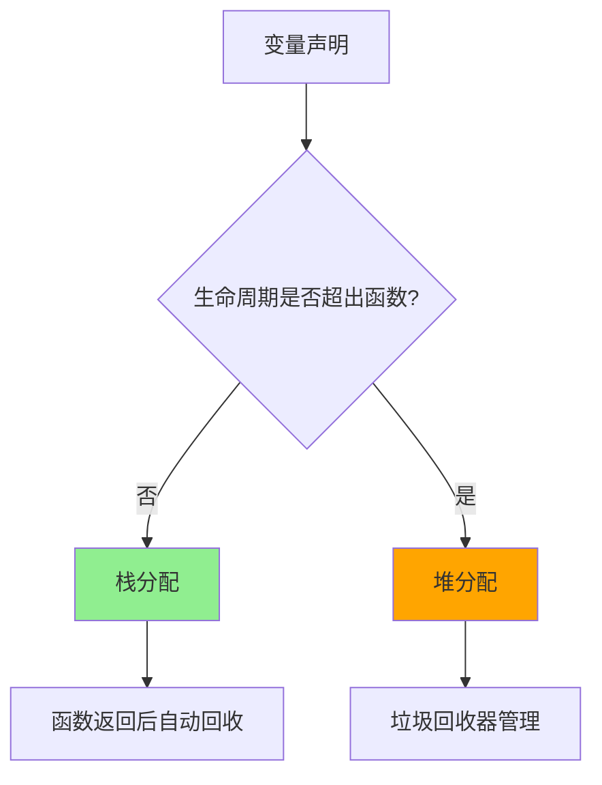

+++
title = "第5章 变量"
weight = 50
date = "2026-03-20T08:39:00+08:00"
type = "docs"
description = ""
isCJKLanguage = true
draft = false

+++
# 第5章 变量

> 欢迎来到第五章！这一章我们要聊的是 Go 语言的"变量"。变量是什么？变量就是一个有名字的盒子，你可以在里面放东西（值），也可以把东西拿出来用。想象一下你家的冰箱——冰箱就是一个变量，你可以往里面放牛奶（赋值），也可以拿出来喝（读取）。不同的是，Go 的冰箱永远不会被塞满，因为变量可以存储任意大小的数据……好吧，这个比喻好像不太对。总之，让我们开始探索变量的奥秘吧！

## 5.1 变量声明

> 变量声明是什么？变量声明就是告诉编译器"我要创建一个变量，给我准备好内存空间"。这就像是你去酒店入住，前台小姐姐会给你一把钥匙（变量名），告诉你房间号（内存地址）。在 Go 语言中，变量声明有多种方式，让我们一一道来。

### 5.1.1 显式声明 var

#### 5.1.1.1 完整形式

`var` 是 Go 语言中最标准的变量声明方式，它的完整形式是 `var 变量名 类型 = 值`。这种声明方式就像是你去派出所登记户口——姓名（变量名）、民族（类型）、籍贯（值），一样都不能少。

```go

package main

import "fmt"

var name string = "张三"
var age int = 25
var height float64 = 175.5

func main() {
    fmt.Printf("姓名: %s\n", name) // 姓名: 张三
    fmt.Printf("年龄: %d\n", age) // 年龄: 25
    fmt.Printf("身高: %.1f cm\n", height) // 身高: 175.5 cm
}

```

你可能会问："为什么要写这么长？"答案是——为了清晰！显式声明让代码可读性更高，就像你写邮件时加上主题行一样。虽然长了一点，但维护起来爽啊！

#### 5.1.1.2 类型推断

Go 语言的编译器是个"聪明的小家伙"。它会根据你赋的值自动推断变量的类型。这就像是你的手机输入法，根据你打的字自动补全一样。

```go

package main

import "fmt"

var name = "张三"        // 编译器会自动推断为 string 类型
var age = 25             // 编译器会自动推断为 int 类型
var height = 175.5       // 编译器会自动推断为 float64 类型
var isStudent = true     // 编译器会自动推断为 bool 类型

func main() {
    fmt.Printf("姓名: %s\n", name) // 姓名: 张三
    fmt.Printf("年龄: %d\n", age) // 年龄: 25
    fmt.Printf("身高: %.1f\n", height) // 身高: 175.5
    fmt.Printf("是学生: %t\n", isStudent) // 是学生: true
}

```

> **偷懒技巧**：如果你不想写类型，可以直接省略，编译器会帮你推断。但要注意，有时候推断出来的类型可能不是你想要的——比如 `age := 10` 会被推断为 `int`，而不是 `int64`。

#### 5.1.1.3 多变量声明

Go 允许你一口气声明多个变量。这就像是去超市购物，你不用一个一个结账，可以一次性买一堆。

```go

package main

import "fmt"

var (
    name    string  = "李四"
    age     int     = 30
    weight  float64 = 70.5
    isMarried = false
)

func main() {
    fmt.Printf("姓名: %s\n", name) // 姓名: 李四
    fmt.Printf("年龄: %d\n", age) // 年龄: 30
    fmt.Printf("体重: %.1f kg\n", weight) // 体重: 70.5 kg
    fmt.Printf("已婚: %t\n", isMarried) // 已婚: false
}

```

#### 5.1.1.4 声明组

声明组就是用圆括号 `()` 包起来的一组 `var` 声明。这在声明多个相关变量时特别有用，比如一组配置参数。

```go

package main

import "fmt"

var (
    // 用户信息
    username string = "admin"
    password string = "123456"

    // 服务器配置
    serverPort int = 8080
    serverIP   string = "127.0.0.1"

    // 开关配置
    debugMode bool = true
    logEnabled bool = false
)

func main() {
    fmt.Printf("用户名: %s\n", username) // 用户名: admin
    fmt.Printf("端口: %d\n", serverPort) // 端口: 8080
    fmt.Printf("调试模式: %t\n", debugMode) // 调试模式: true
}

```

### 5.1.2 短声明 :=

#### 5.1.2.1 语法规则

短声明是 Go 语言的一大特色，语法是 `变量名 := 值`。这就像是速记员，脑子里想到什么就马上记下来，不用正经八百地写格式。

```go

package main

import "fmt"

func main() {
    // 短声明只能在函数内部使用
    name := "王五"
    age := 28
    height := 180.0

    fmt.Printf("姓名: %s\n", name) // 姓名: 王五
    fmt.Printf("年龄: %d\n", age) // 年龄: 28
    fmt.Printf("身高: %.1f cm\n", height) // 身高: 180.0 cm
}

```

> **注意**：`:=` 是声明+赋值的组合拳，左边的变量必须是新变量。如果你试图对已存在的变量使用 `:=`，编译器会毫不客气地报错。

#### 5.1.2.2 使用限制

短声明虽好，但不是万能的。它有几个限制：

1. **只能在函数内部使用**：函数外面是 `var` 的地盘，`:=` 进不去。
2. **左边必须是新变量**：已声明的变量只能用 `=`，不能用 `:=`。
3. **不能在包级别使用**：你不能在一个 `.go` 文件的顶部写 `x := 1`。

```go

package main

import "fmt"

var globalVar = "我是包级别的变量" // ✅ 函数外面只能用 var

func main() {
    localVar := "我是函数内部的" // ✅ 函数内部可以用 :=

    fmt.Println("包变量:", globalVar) // 包变量: 我是包级别的变量
    fmt.Println("局部变量:", localVar) // 局部变量: 我是函数内部的
}

// 错误示例：包级别不能使用 :=
// x := 1 // ❌ 编译错误：non-declaration statement outside function body
// 包级别只能使用 var，不能使用 :=

```

#### 5.1.2.3 重声明与赋值

这是 Go 的一个骚操作！如果你在不同的作用域（如 `if` 语句）中使用 `:=`，可以对已在外层声明的变量进行"重新声明"——这叫做"重声明"（redeclaration）。

```go

package main

import "fmt"

func main() {
    x := 1
    fmt.Printf("x = %d\n", x) // x = 1

    // 在 if 语句中重新声明 x
    if x := 2; x > 0 {
        fmt.Printf("if 语句中的 x = %d\n", x) // if 语句中的 x = 2
    }

    fmt.Printf("main 中的 x = %d\n", x) // main 中的 x = 1
}

```

这个特性看起来有点绕，但实际上非常有用。比如在错误处理模式中：

```go

package main

import (
    "errors"
    "fmt"
)

func divide(a, b int) (int, error) {
    if b == 0 {
        return 0, errors.New("除数不能为零")
    }
    return a / b, nil
}

func main() {
    // 这里的 err 是重新声明的，和外层的没关系
    if result, err := divide(10, 2); err != nil {
        fmt.Printf("错误: %s\n", err) // 这行不会执行，因为 divide(10,2) 成功返回
    } else {
        fmt.Printf("结果: %d\n", result) // 结果: 5
    }
}

```

#### 5.1.2.4 多变量短声明

`:=` 还可以同时声明多个变量，左边可以是新变量或已声明变量的赋值。

```go

package main

import "fmt"

func main() {
    // 全部是新变量
    name, age := "赵六", 35
    fmt.Printf("%s 今年 %d 岁\n", name, age) // 赵六 今年 35 岁

    // 混合模式：部分新变量，部分已赋值
    newName := "钱七"
    newName, age = "孙八", 40 // age 已被赋值，newName 是新变量
    fmt.Printf("%s 今年 %d 岁\n", newName, age) // 孙八 今年 40 岁

    // 交换变量
    a, b := 1, 2
    a, b = b, a // 无需临时变量，直接交换！
    fmt.Printf("a = %d, b = %d\n", a, b) // a = 2, b = 1
}

```

## 5.2 变量特性

> 变量特性是指变量在 Go 语言中的一些独特行为和规则。了解这些特性，就像了解你新交的女朋友——她有什么脾气、什么禁忌、什么时候会"逃跑"（生命周期结束），这些都很重要！

### 5.2.1 零值

#### 5.2.1.1 基本类型零值

在 Go 语言中，当你声明一个变量但没有给它赋值时，它会自动获得一个"零值"（Zero Value）。这就像是酒店房间的"开荒保洁"——你入住前，房间已经被打扫干净了，只是里面什么都没有。

```go

package main

import "fmt"

func main() {
    var i int
    var f float64
    var b bool
    var s string

    fmt.Printf("int 零值: %d\n", i) // int 零值: 0
    fmt.Printf("float64 零值: %.2f\n", f) // float64 零值: 0.00
    fmt.Printf("bool 零值: %t\n", b) // bool 零值: false
    fmt.Printf("string 零值: \"%s\"\n", s) // string 零值: ""
}

```

> **小贴士**：零值是 Go 语言的"默认保险"。如果你忘记给变量赋值，Go 不会让你的程序崩溃——它会给你一个默认的"零点"。这可比 C 语言"未初始化的变量是随机值"的做法安全多了！

#### 5.2.1.2 复合类型零值

复合类型包括指针、切片、映射（map）、通道（chan）和接口（interface）。它们的零值都是 `nil`。

```go

package main

import "fmt"

func main() {
    var intPtr *int           // 指针
    var slice []int          // 切片
    var dict map[string]int   // 映射
    var ch chan int           // 通道
    var fn func()            // 函数
    var i interface{}         // 接口

    fmt.Printf("intPtr == nil: %t\n", intPtr == nil) // intPtr == nil: true
    fmt.Printf("slice == nil: %t\n", slice == nil) // slice == nil: true
    fmt.Printf("dict == nil: %t\n", dict == nil) // dict == nil: true
    fmt.Printf("ch == nil: %t\n", ch == nil) // ch == nil: true
    fmt.Printf("fn == nil: %t\n", fn == nil) // fn == nil: true
    fmt.Printf("i == nil: %t\n", i == nil) // i == nil: true
}

```

#### 5.2.1.3 nil 语义

`nil` 在 Go 中是一个"特殊的零值"，表示"没有指向任何东西"。你可以把它理解为一个空的停车场——场地是存在的，但里面没有车。

```go

package main

import "fmt"

func main() {
    // nil 切片 vs 空切片
    var nilSlice []int        // nil 切片
    emptySlice := []int{}     // 空切片（长度为0，但不是nil）
    makeSlice := make([]int, 0) // 也是空切片

    fmt.Printf("nilSlice == nil: %t\n", nilSlice == nil) // nilSlice == nil: true
    fmt.Printf("emptySlice == nil: %t\n", emptySlice == nil) // emptySlice == nil: false
    fmt.Printf("makeSlice == nil: %t\n", makeSlice == nil) // makeSlice == nil: false
    fmt.Printf("len(nilSlice): %d\n", len(nilSlice)) // len(nilSlice): 0
    fmt.Printf("len(emptySlice): %d\n", len(emptySlice)) // len(emptySlice): 0

    // nil 切片可以安全地 append
    nilSlice = append(nilSlice, 1, 2, 3)
    fmt.Printf("append 后的 nilSlice: %v\n", nilSlice) // append 后的 nilSlice: [1 2 3]

    // nil 映射可以读取（返回零值）
    var nilMap map[string]int
    value, exists := nilMap["key"]
    fmt.Printf("nilMap[\"key\"]: value=%d, exists=%t\n", value, exists) // nilMap["key"]: value=0, exists=false
    // nilMap["key"]: value=0, exists=false
}

```

> **重要区别**：`nil` 切片和空切片 `[]int{}` 看起来很像，但有本质区别：
> - `nil` 切片 = 没有分配内存
> - `[]int{}` = 分配了内存，只是长度为0
> - `make([]int, 0)` = 也是分配了内存

### 5.2.2 作用域

#### 5.2.2.1 宇宙块

宇宙块（Universe Block）是 Go 作用域的"天花板"。在这个块里，你可以访问所有预声明的标识符，比如 `int`、`string`、`true`、`false`、`nil` 等。

```go

package main

import "fmt"

func main() {
    // 在函数内部，我们可以访问预声明的标识符
    // 这些都是宇宙块级别的东西
    var x int = 42
    var s string = "Hello"

    fmt.Printf("x = %d\n", x) // x = 42
    fmt.Printf("s = %s\n", s) // s = Hello

    // 甚至可以直接使用 true、false、nil
    var b bool = true
    var ptr *int = nil

    fmt.Printf("b = %t\n", b) // b = true
    fmt.Printf("ptr = %v\n", ptr) // ptr = <nil>
}

```

#### 5.2.2.2 包块

包块（Package Block）是指同一个包内所有文件的顶级作用域。在这个范围内声明的变量，对整个包都是可见的。

```go

package main

import "fmt"

// 包级别变量（包块作用域）
var packageVar = "我是包级别的变量"

func main() {
    fmt.Printf("访问包变量: %s\n", packageVar) // 访问包变量: 我是包级别的变量
    innerFunc()
}

func innerFunc() {
    // 同一个包内的函数可以访问包级别变量
    fmt.Printf("在 innerFunc 中访问: %s\n", packageVar) // 在 innerFunc 中访问: 我是包级别的变量
}

```

#### 5.2.2.3 文件块

文件块（File Block）并不是一个真正的块，它只是用来组织导入（import）的特殊作用域。

```go

package main

import "fmt"

// 这个导入只在当前文件生效
// 如果其他文件也需要用 fmt，需要单独导入

func main() {
    fmt.Println("文件块的作用域") // 文件块的作用域
}

```

#### 5.2.2.4 函数块

函数块是函数内部的作用域。函数体就是一个独立的块。

```go

package main

import "fmt"

var globalVar = "全局变量"

func main() {
    var localVar = "函数局部变量"

    fmt.Printf("全局: %s\n", globalVar) // 全局: 全局变量
    fmt.Printf("局部: %s\n", localVar) // 局部: 函数局部变量
}

func otherFunc() {
    // globalVar 在这里可见
    fmt.Printf("在 otherFunc 中: %s\n", globalVar) // 在 otherFunc 中: 全局变量
}

```

#### 5.2.2.5 语句块

语句块是用大括号 `{}` 包围的代码区域。最常见的就是 `if`、`for`、`switch` 语句的代码体。

```go

package main

import "fmt"

func main() {
    // if 语句块
    if x := 10; x > 5 {
        fmt.Printf("x = %d 在 if 块内\n", x) // x = 10 在 if 块内
    }

    // for 语句块
    for i := 0; i < 3; i++ {
        fmt.Printf("i = %d 在 for 块内\n", i) // i = 0 在 for 块内
        // i = 0 在 for 块内
        // i = 1 在 for 块内
        // i = 2 在 for 块内
    }

    // switch 语句块
    switch num := 3; num {
    case 1:
        fmt.Println("是1") // 是1
    case 2:
        fmt.Println("是2") // 是2
    default:
        fmt.Printf("是其他数字: %d\n", num) // 是其他数字: 3
    }
}

```

#### 5.2.2.6 作用域遮蔽

作用域遮蔽（Shadowing）是指内层作用域的变量"遮蔽"了外层作用域的同名变量。这就像是你戴了一副墨镜——虽然太阳还在，但别人看不清你的眼睛了。

```go

package main

import "fmt"

var x = "全局x"

func main() {
    fmt.Printf("遮蔽前 x = %s\n", x) // 遮蔽前 x = 全局x

    // 外层作用域
    x := "外层x"
    fmt.Printf("外层 x = %s\n", x) // 外层 x = 外层x

    if true {
        // 内层作用域，遮蔽了外层的 x
        x := "内层x"
        fmt.Printf("内层 x = %s\n", x) // 内层 x = 内层x
    }

    // 内层结束后，外层的 x 恢复
    fmt.Printf("恢复后 x = %s\n", x) // 恢复后 x = 外层x
}

```

> **警告**：作用域遮蔽有时候会导致意想不到的 bug。比如你在 `if` 语句里声明了一个变量 `err`，本意是赋值给外层的 `err`，但实际上你创建了一个新的 `err`，原来的那个没有被修改！

### 5.2.3 生命周期

#### 5.2.3.1 栈分配

栈分配（Stack Allocation）是 Go 语言中最快的内存分配方式。当你声明一个局部变量时，编译器会尽可能把它放在栈上。

```go

package main

import "fmt"

func main() {
    // 这些变量都在栈上分配
    a := 1
    b := 2
    c := a + b

    fmt.Printf("a + b = %d\n", c) // a + b = 3
}

```

#### 5.2.3.2 堆分配

堆分配（Heap Allocation）用于那些"逃逸"到函数作用域之外的变量。当一个变量的生命周期超过创建它的函数时，编译器会把它放到堆上。

```go

package main

import "fmt"

func main() {
    // 函数返回后，指针可能仍然被使用，所以 p 逃逸到堆
    p := heapAlloc()
    fmt.Printf("堆上分配的值: %d\n", *p) // 堆上分配的值: 42
}

func heapAlloc() *int {
    // 返回局部变量的指针，变量逃逸到堆
    x := 42
    return &x
}

```

#### 5.2.3.3 逃逸分析

逃逸分析（Escape Analysis）是 Go 编译器自动分析变量应该分配在栈上还是堆上的过程。编译器会尽可能把变量放在栈上，因为栈分配和回收更快。

```go

package main

import "fmt"

func main() {
    // 这些简单变量不需要逃逸分析
    a := 10
    b := "hello"

    // 编译器会分析出 c 不需要逃逸
    c := a + 5
    fmt.Printf("c = %d\n", c) // c = 15
}

func returnPtr() *int {
    x := 100
    return &x // x 逃逸，因为返回了指针
}

```

> **逃逸分析的黄金法则**：
> 1. 如果一个变量的生命周期超出了创建它的函数，它就会逃逸到堆。
> 2. 如果你返回了局部变量的指针，这个变量就逃逸了。
> 3. 如果你把局部变量发送给通道、切片、映射或接口，它们也可能逃逸。
> 4. 编译器会尽可能把变量放在栈上，除非必须放到堆上。

**📊 逃逸分析可视化：**



## 5.3 赋值

> 赋值是什么？赋值就是把一个值放进变量里。这就像是给变量"喂食"——你告诉它："嘿，你现在是这个值了！"

### 5.3.1 简单赋值

简单赋值是最基本的赋值操作，使用 `=` 运算符。

```go

package main

import "fmt"

func main() {
    var x int
    x = 10  // 简单赋值
    fmt.Printf("x = %d\n", x) // x = 10

    x = 20  // 修改已存在的变量
    fmt.Printf("x = %d\n", x) // x = 20
}

```

### 5.3.2 多重赋值

#### 5.3.2.1 并行赋值

Go 支持同时给多个变量赋值。

```go

package main

import "fmt"

func main() {
    // 同时给多个变量赋值
    a, b, c := 1, 2, 3
    fmt.Printf("a = %d, b = %d, c = %d\n", a, b, c) // a = 1, b = 2, c = 3
}

```

#### 5.3.2.2 交换赋值

Go 最酷的特性之一：无须临时变量，直接交换两个变量的值！

```go

package main

import "fmt"

func main() {
    // 传统交换（需要临时变量）
    a, b := 1, 2
    temp := a
    a = b
    b = temp
    fmt.Printf("传统交换后: a = %d, b = %d\n", a, b) // 传统交换后: a = 2, b = 1

    // Go 风格交换（无需临时变量）
    x, y := 1, 2
    x, y = y, x // 一步到位！
    fmt.Printf("Go 风格交换后: x = %d, y = %d\n", x, y) // Go 风格交换后: x = 2, y = 1
}

```

### 5.3.3 复合赋值

#### 5.3.3.1 算术复合

复合赋值运算符是 `+=`、`-=`、`*=`、`/=`、`%=`。

```go

package main

import "fmt"

func main() {
    x := 10

    x += 5   // x = x + 5 = 15
    fmt.Printf("x += 5 后: x = %d\n", x) // x += 5 后: x = 15

    x -= 3   // x = x - 3 = 12
    fmt.Printf("x -= 3 后: x = %d\n", x) // x -= 3 后: x = 12

    x *= 2   // x = x * 2 = 24
    fmt.Printf("x *= 2 后: x = %d\n", x) // x *= 2 后: x = 24

    x /= 4   // x = x / 4 = 6
    fmt.Printf("x /= 4 后: x = %d\n", x) // x /= 4 后: x = 6

    x %= 4   // x = x % 4 = 2
    fmt.Printf("x %%= 4 后: x = %d\n", x) // x %= 4 后: x = 2
}

```

#### 5.3.3.2 位运算复合

位运算也有复合赋值：`&=`、`|=`、`^=`、`<<=`、`>>=`。

```go

package main

import "fmt"

func main() {
    x := 0b1100  // 二进制 12

    x &= 0b1010   // 按位与：x = 0b1000 = 8
    fmt.Printf("x &= 0b1010 后: x = %d\n", x) // x &= 0b1010 后: x = 8

    x |= 0b0001   // 按位或：x = 0b1001 = 9
    fmt.Printf("x |= 0b0001 后: x = %d\n", x) // x |= 0b0001 后: x = 9

    x ^= 0b0110   // 按位异或：x = 0b1111 = 15
    fmt.Printf("x ^= 0b0110 后: x = %d\n", x) // x ^= 0b0110 后: x = 15

    y := 1
    y <<= 3   // y = y << 3 = 8
    fmt.Printf("y <<= 3 后: y = %d\n", y) // y <<= 3 后: y = 8
}

```

## 5.4 变量模式

> 变量模式是指在 Go 编程中的一些常用"套路"。

### 5.4.1 零值模式

有时候你需要一个变量，但它暂时没有有意义的值。这时可以使用类型零值来初始化。

```go

package main

import "fmt"

func main() {
    // 使用 var 声明，获得零值
    var name string
    var score int
    var enabled bool

    fmt.Printf("name = \"%s\"\n", name) // name = ""
    fmt.Printf("score = %d\n", score) // score = 0
    fmt.Printf("enabled = %t\n", enabled) // enabled = false
}

```

### 5.4.2 惰性初始化

有时候初始化一个变量代价比较高，但我们不确定会不会用到它。这时可以使用惰性初始化。

```go

package main

import (
    "fmt"
    "sync"
)

var (
    once     sync.Once
    lazyData []int
)

func getLazyData() []int {
    once.Do(func() {
        fmt.Println("惰性初始化：正在创建数据...") // 惰性初始化：正在创建数据...
        lazyData = make([]int, 1000)
        for i := 0; i < len(lazyData); i++ {
            lazyData[i] = i
        }
        fmt.Println("惰性初始化：数据创建完成！") // 惰性初始化：数据创建完成！
    })
    return lazyData
}

func main() {
    fmt.Println("第一次调用：") // 第一次调用：
    d1 := getLazyData()
    fmt.Printf("获取到数据，长度: %d\n", len(d1)) // 获取到数据，长度: 1000
    // 第一次调用：
    // 惰性初始化：正在创建数据...
    // 惰性初始化：数据创建完成！
    // 获取到数据，长度: 1000

    fmt.Println("\n第二次调用：") // 第二次调用：
    d2 := getLazyData()
    fmt.Printf("获取到数据，长度: %d\n", len(d2)) // 获取到数据，长度: 1000
    // 第二次调用：
    // 获取到数据，长度: 1000
}

```

### 5.4.3 池化模式

对象池是一种重复利用对象的技术，避免频繁的内存分配和垃圾回收。

```go

package main

import (
    "fmt"
    "sync"
)

type Pool struct {
    pool sync.Pool
}

func NewPool() *Pool {
    return &Pool{
        pool: sync.Pool{
            New: func() interface{} {
                return make([]byte, 0, 1024)
            },
        },
    }
}

func (p *Pool) Get() []byte {
    return p.pool.Get().([]byte)
}

func (p *Pool) Put(b []byte) {
    b = b[:0]
    p.pool.Put(b)
}

func main() {
    pool := NewPool()

    buf1 := pool.Get()
    buf1 = append(buf1, "Hello, World!"...)
    fmt.Printf("buf1: %s, len=%d, cap=%d\n", buf1, len(buf1), cap(buf1)) // buf1: Hello, World!, len=13, cap=1024
    // buf1: Hello, World!, len=13, cap=1024

    pool.Put(buf1)

    buf2 := pool.Get()
    buf2 = append(buf2, "FooBar"...)
    fmt.Printf("buf2: %s, len=%d, cap=%d\n", buf2, len(buf2), cap(buf2)) // buf2: FooBar, len=6, cap=1024
    // buf2: FooBar, len=6, cap=1024
}

```

## 5.5 变量内存布局

> 变量在内存中是怎么存放的？

### 5.5.1 栈变量

栈上的变量就像是你餐桌上的盘子——用完就收走，不需要洗碗工（垃圾回收）。

```go

package main

import "fmt"

func main() {
    // 这些都是栈变量
    a := 1
    b := "hello"
    c := 3.14

    fmt.Printf("栈变量: a=%d, b=%s, c=%.2f\n", a, b, c) // 栈变量: a=1, b=hello, c=3.14
}

```

### 5.5.2 堆变量

堆上的变量就像是你橱柜里的碗——持久存在，需要洗碗工（垃圾回收器）来清理。

```go

package main

import "fmt"

func main() {
    // 堆上分配
    slice := make([]int, 1000) // 大切片通常在堆上
    fmt.Printf("slice 长度: %d\n", len(slice)) // slice 长度: 1000
}

func createPointer() *int {
    x := 42
    return &x // x 逃逸到堆
}

```

### 5.5.3 静态变量

静态变量在程序运行期间一直存在，直到程序结束。

```go

package main

import "fmt"

var staticVar = "我是一个静态变量"

func main() {
    fmt.Printf("静态变量: %s\n", staticVar) // 静态变量: 我是一个静态变量
}

var counter int

func incrementStatic() {
    counter++
    fmt.Printf("counter = %d\n", counter) // counter = 1
}

```

## 5.6 变量优化

> 编译器会自动优化我们的代码。

### 5.6.1 寄存器分配

编译器可能会把常用变量放到 CPU 寄存器里。

```go

package main

import "fmt"

func main() {
    sum := 0
    for i := 0; i < 100; i++ {
        sum += i
    }
    fmt.Printf("1+2+...+99 = %d\n", sum) // 1+2+...+99 = 4950
}

```

### 5.6.2 逃逸分析优化

编译器会分析变量的作用域，尽可能把变量放在栈上。

```go

package main

import "fmt"

func main() {
    x := 10
    y := x + 5
    fmt.Printf("y = %d\n", y) // y = 15
}

func returnPtr() *int {
    x := 100
    return &x
}

```

### 5.6.3 变量复用

在作用域内复用变量可以减少变量数量。

```go

package main

import "fmt"

func main() {
    v := getValue()
    v = processValue(v)
    v = outputValue(v)
    fmt.Printf("最终结果: %d\n", v) // 最终结果: 20
}

func getValue() int {
    return 10
}

func processValue(n int) int {
    return n * 2
}

func outputValue(n int) int {
    fmt.Printf("处理结果: %d\n", n) // 处理结果: 20
    return n
}
```

## 本章小结

本章我们学习了 Go 语言中变量的核心知识：

1. **变量声明**：
   - `var` 完整形式：`var 变量名 类型 = 值`
   - 类型推断：编译器自动推断类型
   - 多变量和声明组：便于管理一组相关变量
   - 短声明 `:=`：函数内部使用的简洁声明方式

2. **变量特性**：
   - **零值机制**：未初始化的变量自动获得零值
   - **作用域规则**：宇宙块 → 包块 → 文件块 → 函数块 → 语句块
   - **作用域遮蔽**：内层变量可能遮蔽外层同名变量
   - **生命周期**：栈分配（快）、堆分配（由 GC 管理）、逃逸分析

3. **赋值操作**：
   - 简单赋值 `=`
   - 多重赋值：并行赋值、交换赋值
   - 复合赋值 `+=`、`-=`、`*=`、`/=`、`%=` 等

4. **变量模式**：
   - 零值模式：使用零值作为初始状态
   - 惰性初始化：`sync.Once` 保证只初始化一次
   - 对象池：`sync.Pool` 重复利用对象

5. **内存布局**：
   - 栈变量：自动分配和回收
   - 堆变量：需要垃圾回收器管理
   - 静态变量：程序生命周期内持久存在

6. **变量优化**：
   - 编译器自动进行寄存器分配
   - 逃逸分析决定变量分配位置
   - 变量复用减少内存占用


