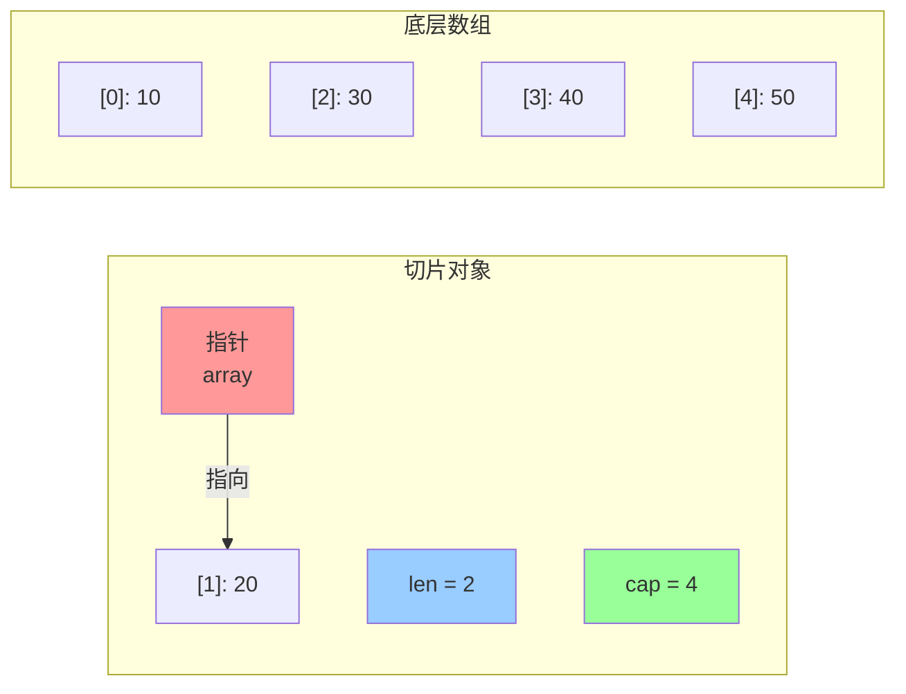
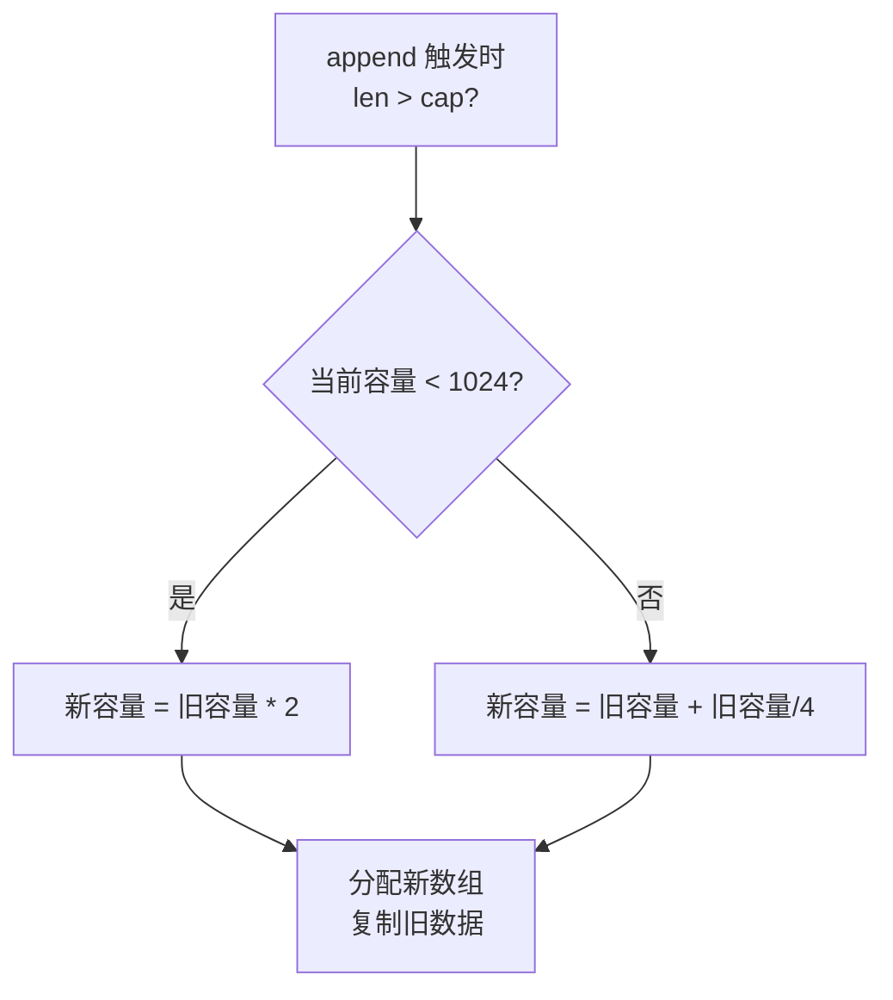

+++
title = "第13章 切片"
weight = 130
date = "2026-03-20T08:39:00+08:00"
type = "docs"
description = ""
isCJKLanguage = true
draft = false
+++
# 第13章 切片

> "数组是那块 immutable 的金漆招牌，切片才是 Go 程序员真正的日常。" —— 没有人说过这句话，但它是真的。

如果说数组是 Go 语言世界里的"固定座位"，那切片就是那个可以随时招呼朋友来坐、椅子不够就再搬一把的**动态卡座**。你可能在其他语言里见过"动态数组"、"列表"、"ArrayList"之类的概念——在 Go 里，这些统统叫**切片（Slice）**。

切片有多重要？这么说吧，你写的每一行 Go 代码里，可能平均每三次函数调用就有一次在跟切片打交道。`fmt.Println` 接收的是切片，`strings.Split` 返回的是切片，你写 web 服务时 JSON 序列化处理的也是切片。它就是 Go 语言里那个你逃不掉、躲不开、必须得亲密无间的小伙伴。

这一章我们要把它扒得干干净净——从里到外、从头到尾、从温柔到暴躁（扩容的时候）。准备好了吗？系好安全带，我们发车了。

---

## 13.1 切片类型

### 13.1.1 切片定义

切片到底长什么样？先看看它的类型声明：

```go
var s []int          // 一个 int 类型的切片
var names []string   // 一个 string 类型的切片
var data []byte      // byte 等价于 uint8，所以这是字节切片
```

看到了吗？切片和数组的声明几乎一模一样，**唯一的区别就是有没有写长度**。数组是 `[5]int`，切片是 `[]int`。一个写死了长度，一个没写——没写长度的，就是切片。

这是 Go 设计哲学的体现：**你需要什么，就声明什么**。固定长度场景用数组，动不动就需要"再来一个"的场景用切片。

切片是**引用类型**——这意味着当你把切片传给函数、或者赋给另一个变量时，底层指向的是同一块内存。好比你把同一个文件的快捷方式发给了两个朋友，他们打开的都是同一个文件，而不是两份副本。

```go
package main

import "fmt"

func main() {
    a := []int{1, 2, 3}  // 切片字面量，注意没有固定长度
    b := a               // b 和 a 引用同一个底层数组
    b[0] = 999
    fmt.Println(a[0])    // 999 — 改 b 也改了 a，因为是同一个底层数组！
}
```

> 等等，数组不也是 `a := [3]int{1, 2, 3}` 这样写吗？没错，区别就在那个数字。`[3]int` 是数组（长度固定），`[]int` 是切片（长度可变）。

### 13.1.2 切片结构

Go 语言的切片可不是一个单独的整体，它实际上是**由三个部分手拉手组成的**：

```go
type slice struct {
    array unsafe.Pointer  // 指向底层数组的指针
    len   int             // 长度：当前切片里有多少个元素
    cap   int             // 容量：底层数组从切片起点开始，总共有多少个格子
}
```

这三个字段共同定义了一个切片的行为。下面我们来逐一解剖。

#### 13.1.2.1 指针

切片里的**指针**，指向的是底层数组的某一个元素位置——注意，不一定是数组的第一个元素。

当你对一个数组做切片表达式时，比如 `arr[2:5]`，生成的新切片的指针就指向原数组的下标 2 位置。所以切片可以是"数组的某个中间段"的视图。

指针的存在使得切片可以"窥视"数组的一部分，而不需要复制数据。这是切片高效的根本原因。

#### 13.1.2.2 长度

**长度（Length）** 指的是切片当前"可见"的元素个数，也就是你能够安全访问的元素数量。

```go
s := []int{10, 20, 30, 40, 50}
fmt.Println(len(s))  // 5 — 当前有5个元素可用
```

长度就像是老板告诉你"目前团队有几个人在职"。你可以访问这些在职人员，但去访问已经离职的（超出长度的位置），老板就会扔给你一个 **panic**——我们后面会讲到这个。

#### 13.1.2.3 容量

**容量（Capacity）** 是从切片起始位置开始，到达底层数组末尾为止，总共还有多少个格子可以塞新元素。

```go
s := []int{10, 20, 30, 40, 50}
fmt.Println(cap(s))  // 5 — 从第一个元素往后数，总共还有5个位置
```

但如果你对切片做了截取：

```go
t := s[1:3]  // 从下标1到下标3（不包含3），所以是 [20, 30]
fmt.Println(len(t), cap(t))  // 2 4 — 长度2，容量4（从下标1到原数组末尾共4个位置）
```

容量是从**新切片的起始位置**开始算的，不是从原数组的头开始。这就像你从一排柜子的第3个抽屉开始拿了一部分，容量就是从第3个抽屉到这一排柜子末尾的总抽屉数。

我们用一张图来把切片这三个组成部分的形象彻底钉在脑子里：



> 上图展示的是 `s := []int{10, 20, 30, 40, 50}` 然后 `t := s[1:3]` 的结果。可以看到`t`的指针指向了底层数组的下标1位置，len是2（元素20和30），cap是4（从下标1到数组末尾还有4个位置）。

### 13.1.3 引用语义

切片是引用类型——这句话我们已经喊了好几遍了，但到底意味着什么？让我们通过一个生活中的例子来理解：

**值语义（数组）** 就像是你把一本书复印了一份给别人，别人在复印件上涂涂改改，原版书纹丝不动。

**引用语义（切片）** 就像是你们俩共用同一个 Google 文档，你打的字、删的内容，另一个人实时可见。

```go
package main

import "fmt"

func modifyArray(arr [3]int) {
    arr[0] = 999  // 修改的是副本，原数组纹丝不动
}

func modifySlice(s []int) {
    s[0] = 888   // 修改的是底层数组的元素，两边都能看到
}

func main() {
    // 数组：值语义
    a := [3]int{1, 2, 3}
    modifyArray(a)
    fmt.Println(a[0])  // 1 — 原数组没变！

    // 切片：引用语义
    sl := []int{1, 2, 3}
    modifySlice(sl)
    fmt.Println(sl[0])  // 888 — 切片指向的底层数组被改了！
}
```

这就是为什么很多 Go 程序员说"切片是窗口，数组是房子"——切片只是开了个窗口让你看底层数组的内容，透过这个窗口做的修改，大家都能看到。


---

## 13.2 切片创建

切片从哪里来？这是个哲学问题，但 Go 给了我们几种务实的答案：字面量、内置函数、数组派生、切片派生。让我一个一个说。

### 13.2.1 字面量创建

最直接的方式——像数组一样用大括号创建，但不用写长度：

```go
s := []int{1, 2, 3, 4, 5}
fmt.Println(s)  // [1 2 3 4 5]
```

这种写法 Go 会在编译阶段帮你**推断出长度**，并且偷偷创建一个底层数组。所以这行代码实际上做了两件事：

1. 创建底层数组 `[5]int{1, 2, 3, 4, 5}`
2. 创建切片 `s`，指向该数组，长度和容量都是 5

多维切片也支持，字面量嵌套即可：

```go
matrix := [][]int{
    {1, 2, 3},
    {4, 5, 6},
}
fmt.Println(matrix[1][2])  // 6 — 第二行第三列
```

### 13.2.2 内置函数创建

#### 13.2.2.1 make 语法

`make` 是 Go 里创建切片（和 map、channel）的专用神器。对于切片，`make` 的签名是：

```go
make([]T, length, capacity)  // T 是类型，length 是初始长度，capacity 是底层数组大小
make([]T, length)            // 省略 capacity 时，默认等于 length
```

```go
s1 := make([]int, 5)     // 长度5，容量5，元素全是零值0
s2 := make([]int, 3, 10) // 长度3，容量10，前3个元素是0

fmt.Println(s1)  // [0 0 0 0 0]
fmt.Println(s2)  // [0 0 0]
fmt.Println(cap(s2))  // 10
```

`make` 干的事情比字面量多一些：它不仅创建切片，还会**提前分配底层数组**。如果你提前知道容量，预先给出它可以**避免后续多次扩容的性能损耗**（这可是性能优化的黄金法则，后面会重点讲）。

#### 13.2.2.2 长度与容量

`make([]int, 5)` 和 `make([]int, 0, 5)` 看起来差不多，其实差很多：

| 调用方式 | 长度 | 容量 | 实际状态 |
|---------|------|------|---------|
| `make([]int, 5)` | 5 | 5 | 有5个零值元素，可直接访问 `s[0]` 到 `s[4]` |
| `make([]int, 0, 5)` | 0 | 5 | 空切片，但预留了5个空间，append 不马上扩容 |

```go
a := make([]int, 3)     // len=3, cap=3, 元素:[0,0,0]
b := make([]int, 0, 3) // len=0, cap=3, 元素:[]

fmt.Println(a[0])  // 0 — 可以直接访问
// fmt.Println(b[0])  // panic: index out of range — 不能访问，还没有任何元素！
```

第一种适合"我知道我需要3个槽位，一开始就有值"；第二种适合"我先空着，慢慢往里塞"。

### 13.2.3 数组派生

数组是切片的"原材料供应商"。从一个已存在的数组上"切"出一段，就形成了切片。

#### 13.2.3.1 简单切片

对数组使用切片表达式，得到的就是派生切片：

```go
arr := [5]int{10, 20, 30, 40, 50}
s := arr[1:4]  // 从下标1到下标4（不包含4）

fmt.Println(s)      // [20 30 40]
fmt.Println(len(s)) // 3
fmt.Println(cap(s)) // 4 — 从下标1到数组末尾共4个位置
```

切片表达式 `arr[low:high]` 的语义：
- `low` 是起始下标（包含）
- `high` 是结束下标（不包含）
- 省略 `low` 默认是 0
- 省略 `high` 默认是数组长度

```go
arr := [5]int{10, 20, 30, 40, 50}
a := arr[:3]   // arr[0:3]  -> [10, 20, 30]
b := arr[2:]   // arr[2:5]  -> [30, 40, 50]
c := arr[:]    // arr[0:5]  -> [10, 20, 30, 40, 50]
```

#### 13.2.3.2 完整切片

普通切片表达式省略了容量，而**完整切片表达式**多了个容量参数：

```go
arr := [5]int{10, 20, 30, 40, 50}
s := arr[1:3:4]  // low=1, high=3, max=4

fmt.Println(len(s)) // 2  — high - low
fmt.Println(cap(s)) // 3  — max - low（而不是底层数组长度！）
```

完整切片表达式的第三个参数 `max` 是**允许到达的最大下标**（不包含），它限制了新切片的容量，防止你不小心透过窗口看到了不该看的数据。这在写底层代码、避免数据越界时特别有用。

```go
// 假设有一个敏感的5元素数组
secret := [5]int{1, 2, 3, 4, 5}

// 普通切片：容量5，可以往后扩展偷看更多
s1 := secret[1:3]
fmt.Println(cap(s1))  // 4 — 可以一直 append 到 secret[4]

// 完整切片：容量受限，只能看"窗口"内的
s2 := secret[1:3:3]
fmt.Println(cap(s2))  // 2 — 最多只能到 secret[2]，append 超过容量会触发新底层数组
```

### 13.2.4 切片派生

切片也可以从另一个切片派生，形成"切片的切片"：

```go
original := []int{10, 20, 30, 40, 50}
s1 := original[1:4]  // [20, 30, 40]
s2 := s1[0:2]        // [20, 30] — 从 s1 再切

fmt.Println(s2)  // [20 30]
fmt.Println(cap(s2)) // 4 — s2 的容量从 original[1] 开始算
```

要注意：s2 的容量不是从 s1 算的，而是从 **original 底层数组的起始位置**算的。这条规则是 Go 切片的核心特性：**所有切片都共享同一个底层数组的视角，容量都是从各自切片的起始位置到原数组末尾**。

```go
original := []int{10, 20, 30, 40, 50}
s1 := original[1:4]        // [20, 30, 40], len=3, cap=4
s2 := s1[1:3]             // [30, 40], len=2, cap=3

// s2 的容量 = original 底层数组长度 - s2 的起始下标
// s2 的起始下标 = s1 的起始下标(1) + s2 在 s1 内的偏移(1) = 2
// 容量 = 5 - 2 = 3
fmt.Println(cap(s2)) // 3
```

> 这就像你从一栋大楼（底层数组）的第3层租了几个房间（切片s1），然后你的租户又把自己租的那部分转租了出去（切片s2），但整栋楼还是同一栋楼，容量还是从各自的楼层算到屋顶。


---

## 13.3 切片操作

切片创建好了，现在该拿它干点正事了。这一节我们来学习切片的基本操作：怎么访问元素、怎么切片、怎么追加、怎么复制、怎么遍历。每一个都是日常开发中的高频动作，必须得练得滚瓜烂熟。

### 13.3.1 元素访问

#### 13.3.1.1 索引访问

切片通过下标访问元素，下标从 0 开始，和数组一模一样：

```go
s := []int{10, 20, 30, 40, 50}
fmt.Println(s[0])  // 10 — 第一个元素
fmt.Println(s[2])  // 30 — 第三个元素
fmt.Println(s[len(s)-1])  // 50 — 最后一个元素
```

Go 没有负数下标，别想着 `s[-1]` 来访问最后一个元素——这在其他语言里可能是常规操作，但在 Go 里你只能老老实实地写 `s[len(s)-1]`。

#### 13.3.1.2 越界 panic

当下标超出切片长度范围时，Go 会毫不犹豫地抛出一个 **panic: index out of range**。这个 panic 不会给你任何面子，直接让你的程序崩溃。

```go
s := []int{10, 20, 30}
fmt.Println(s[10])  // panic: index out of range — 你在玩火！
```

> 很多初学者会把切片长度和容量搞混——可以安全访问的下标范围是 `[0, len(s))`，不是 `[0, cap(s))`。容量只是底层数组的"房产面积"，长度是你"实际住进去的房间数"。你只能访问住进去的房间，容积里的空房间不是你的。

### 13.3.2 切片运算

#### 13.3.2.1 切片表达式

你已经见过切片表达式了，但这里我们把它系统地讲一遍。切片表达式 `s[low:high]` 从原切片或数组上切下一段，返回一个新的切片。

```go
s := []int{10, 20, 30, 40, 50}
t := s[1:4]  // [20, 30, 40]
fmt.Println(t)
```

新切片的长度和容量：
- 长度 = `high` - `low`
- 容量 = `cap(s)` - `low`（从 s 的起始位置在底层数组中的下标算起）

```go
arr := [7]int{10, 20, 30, 40, 50, 60, 70}
s := arr[2:5]  // 从底层数组下标2到下标5（不包含5）

fmt.Println(len(s)) // 3 — 5-2
fmt.Println(cap(s)) // 5 — 7-2（从下标2到数组末尾共5个位置）
```

#### 13.3.2.2 省略边界

切片表达式允许省略 `low` 或 `high`：

```go
s := []int{10, 20, 30, 40, 50}

a := s[:3]   // s[0:3]  -> [10, 20, 30]
b := s[2:]   // s[2:5]  -> [30, 40, 50]
c := s[:]    // s[0:5]  -> [10, 20, 30, 40, 50]
```

#### 13.3.2.3 完整切片表达式

完整切片表达式 `s[low:high:max]` 限制新切片的容量，防止后续 append 操作影响到原数组/切片范围外的数据：

```go
s := []int{10, 20, 30, 40, 50}
t := s[1:3:3]  // low=1, high=3, max=3

fmt.Println(len(t)) // 2 — high - low
fmt.Println(cap(t)) // 2 — max - low（注意！不是 4！）
fmt.Println(t)  // [20, 30]
```

#### 13.3.2.4 切片重叠

当两个切片指向的底层数组有重叠区域时，我们称之为**切片重叠**。重叠本身不是 bug，但在复制数据时需要特别注意。

```go
s := []int{1, 2, 3, 4, 5}
t := s[1:4]  // [2, 3, 4]，指向底层数组的下标1~3

// s 和 t 重叠，它们在底层数组上是同一段数据
fmt.Println(&s[1] == &t[0])  // true — 同一个内存地址！
```

### 13.3.3 容量扩张 append

这是切片最核心的能力之一——**自动扩容**。通过内置函数 `append`，可以往切片里追加元素，Go 会自动帮你处理底层数组不够用的情况。

#### 13.3.3.1 append 语义

`append` 将新元素追加到切片的末尾，返回更新后的切片：

```go
s := []int{1, 2, 3}
s = append(s, 4)  // 追加一个元素
fmt.Println(s)  // [1 2 3 4]

s = append(s, 5, 6, 7)  // 追加多个元素
fmt.Println(s)  // [1 2 3 4 5 6 7]
```

#### 13.3.3.2 返回值要求

注意：`append` 返回一个新的切片（可能是也可能不是原来的）。**你必须用返回值覆盖原变量**，否则你就丢失了扩容后的新切片——这是个极其常见的 bug。

```go
s := []int{1, 2, 3}
append(s, 4)      // 错误！返回值被丢弃，s 还是 [1, 2, 3]
fmt.Println(s)    // [1 2 3] — 没有任何变化！

s = append(s, 4)  // 正确：接收返回值
fmt.Println(s)    // [1 2 3 4] — 终于成功了
```

> 想象你发了一条消息让秘书帮你订酒店，秘书回复"已订好"，但你把回复直接扔进了碎纸机——你永远不知道酒店订到了哪里。

#### 13.3.3.3 扩容触发

当切片的长度等于容量时，再 append 元素就会触发**扩容**：Go 会分配一个更大的底层数组，把旧数据复制过去，然后插入新元素。

```go
s := make([]int, 3, 3)  // len=3, cap=3
fmt.Println(len(s), cap(s))  // 3 3

s = append(s, 4)  // 长度变成4，容量不够了，触发扩容
fmt.Println(len(s), cap(s))  // 4 6（容量翻倍了！）
```

#### 13.3.3.4 扩容策略

Go 的扩容策略不是简单的"不够就加一"，而是有一套精心设计的算法，目的是在**避免频繁扩容**和**避免浪费内存**之间找到平衡。

##### 13.3.3.4.1 小于1024翻倍

当容量小于 1024 时，每次扩容大约翻倍：

```go
s := []int{1}
fmt.Println(cap(s))  // 1

s = append(s, 2)
fmt.Println(cap(s))  // 2 — 翻倍

s = append(s, 3)
fmt.Println(cap(s))  // 4 — 继续翻倍

s = append(s, 4)
fmt.Println(cap(s))  // 8 — 还在翻倍
```

##### 13.3.3.4.2 大于1024 1.25倍

当容量超过 1024 后，Go 改用更保守的增长率——每次大约增加 25%（即 1.25 倍）：

```go
// 从1开始不断 append，直到超过1024
s := []int{}
for i := 0; i < 1500; i++ {
    s = append(s, i)
}
fmt.Println(cap(s))  // 大约 1920（1280 * 1.5 附近，实际按算法来）
```

需要注意的是，Go 的实际扩容策略还会根据元素大小做调整，确保新容量的内存占用是合理的。上面的倍数只是近似描述，不是精确公式。

#### 13.3.3.5 底层数组分离

扩容后，Go 分配了一个全新的底层数组，原来的旧数组不再被新切片引用。这意味着**在扩容前通过另一个变量对旧数组的修改，不会反映到扩容后的新切片上**：

```go
s1 := []int{1, 2, 3}
s2 := s1              // s1 和 s2 共享同一个底层数组
s1 = append(s1, 4)    // 扩容了，s1 现在有了新的底层数组

fmt.Println(s1)  // [1 2 3 4] — s1 是新的
fmt.Println(s2)  // [1 2 3]   — s2 还在用旧的底层数组！
```

> 这就像你和室友共享一个客厅（底层数组），但突然有一天房东说客厅要装修，你被临时安排到了隔壁的新客厅。你室友还在原来的客厅，你们不再共享同一个空间了。

### 13.3.4 元素复制 copy

`copy` 是 Go 里用来**复制切片元素**的内置函数。与 `append` 不同，`copy` 不会修改原切片，而是把数据从源切片复制到目标切片。

#### 13.3.4.1 copy 语义

```go
dst := []int{0, 0, 0, 0, 0}
src := []int{1, 2, 3}
n := copy(dst, src)

fmt.Println(n)        // 3 — 成功复制的元素个数
fmt.Println(dst)      // [1 2 3 0 0] — 前3个被覆盖
```

`copy` 返回的是**实际复制的元素数量**（取源和目标长度的较小值）。

#### 13.3.4.2 复制长度

`copy` 不会自动扩展目标切片的长度，它只复制两者重叠部分的最小长度：

```go
dst := []int{0, 0}     // 目标只有2个槽位
src := []int{1, 2, 3, 4}
n := copy(dst, src)

fmt.Println(n)   // 2 — 目标不够长，只复制了2个
fmt.Println(dst) // [1 2] — 前两个被覆盖
```

如果想完整复制，要确保目标长度足够：

```go
dst := make([]int, len(src))  // 先把目标长度撑到跟 src 一样大
copy(dst, src)
fmt.Println(dst)  // [1 2 3 4]
```

#### 13.3.4.3 重叠复制

当源和目标指向同一个底层数组且有重叠时，`copy` 也能正确处理，从低索引向高索引方向复制，避免覆盖还未复制的数据：

```go
s := []int{1, 2, 3, 4, 5}
copy(s[2:], s[1:4])  // 把 s[1:4] 复制到 s[2:] 的位置

fmt.Println(s)  // [1 2 2 3 4] — s[1:4]=[2,3,4]，复制到 s[2:5]
```

### 13.3.5 切片遍历

#### 13.3.5.1 索引遍历

```go
s := []int{10, 20, 30}
for i := 0; i < len(s); i++ {
    fmt.Println(i, s[i])
}
// 0 10
// 1 20
// 2 30
```

#### 13.3.5.2 range 遍历

`range` 是 Go 里遍历切片的标准方式，每次迭代返回索引和值的副本：

```go
s := []int{10, 20, 30}
for i, v := range s {
    fmt.Printf("index=%d, value=%d\n", i, v)
}
// index=0, value=10
// index=1, value=20
// index=2, value=30
```

#### 13.3.5.3 迭代陷阱

**陷阱一：range 返回的是值的副本，不是引用。**

```go
s := []int{1, 2, 3}
for _, v := range s {
    v = v * 2  // 修改的是副本，原切片不变！
}
fmt.Println(s)  // [1 2 3] — 没有任何变化！
```

**正确做法是用索引修改：**

```go
s := []int{1, 2, 3}
for i, v := range s {
    s[i] = v * 2  // 通过索引修改原切片
}
fmt.Println(s)  // [2 4 6] — 成功了！
```

**陷阱二：在遍历中对同一个切片进行 append 操作。**

这会导致奇怪的重复或跳过元素的问题，因为 append 可能触发扩容，创建新的底层数组，而旧的遍历还在旧数组上迭代：

```go
s := []int{1, 2, 3, 4, 5}
for i, v := range s {
    if v == 2 {
        s = append(s, 20)  // 在遍历中 append，危险！
    }
}
fmt.Println(s)  // 行为未定义，可能出现 [1 2 3 4 5 20] 或更多
```

> 简单记：遍历时**不要对同一个切片进行写操作**（append 也算写操作），否则你就会踏入这个经典的"在遍历中修改集合"的坑。


---

## 13.4 切片状态

切片有三种"精神状态"，每种状态的行为都不一样，搞清楚它们之间的区别是避免踩坑的关键。

### 13.4.1 nil 切片

**nil 切片**是最接近"不存在"的切片——它压根没有底层数组，长度和容量都是 0：

```go
var s []int  // nil 切片，没有初始化

fmt.Println(s == nil)    // true
fmt.Println(len(s))       // 0
fmt.Println(cap(s))      // 0
// s[0] = 1  // panic! 不能对 nil 切片进行写入
```

声明但未初始化的切片就是 nil 切片：

```go
var nilSlice []int
var emptySlice = []int{}  // 这个不是 nil，是空切片
fmt.Println(nilSlice == nil)   // true
fmt.Println(emptySlice == nil) // false
```

nil 切片的一个重要特点：**你可以安全地读取它**（读取 len=0 的切片不会 panic），但**写入会 panic**。

### 13.4.2 空切片

**空切片**和 nil 切片的区别在于：空切片有一个真实的底层数组（长度是 0），只是这个数组里没有放任何东西：

```go
s1 := []int{}            // 字面量创建空切片
s2 := make([]int, 0)     // make 创建长度为0的切片
s3 := make([]int, 0, 0)  // make 创建长度为0、容量为0的切片

fmt.Println(len(s1), cap(s1)) // 0 0
fmt.Println(len(s2), cap(s2)) // 0 0
fmt.Println(s1 == nil)        // false — 空切片不是 nil！
```

注意：`make([]int, 0, 0)` 和 `make([]int, 0)` 看起来一样，但容量可能不同。前者 cap=0，后者 cap=0（在这个特殊情况下两者相同）。

### 13.4.3 状态辨析

这张表格帮你把 nil 切片和空切片彻底分清楚：

| 状态 | `== nil` | `len()` | `cap()` | 可读 | 可写 |
|------|----------|---------|---------|------|------|
| nil 切片 | true | 0 | 0 | ✅ 安全（读了个寂寞） | ❌ panic |
| 空切片 `[]int{}` | false | 0 | 0 | ✅ 安全 | ❌ panic |
| 空切片 `make([]int,0)` | false | 0 | 0 | ✅ 安全 | ❌ panic |
| 正常切片 `[]int{1,2}` | false | 2 | >=2 | ✅ 安全 | ✅ 安全 |

```go
var nilS []int
emptyS := []int{}
makeS := make([]int, 0)

fmt.Println(nilS == nil)   // true
fmt.Println(emptyS == nil) // false
fmt.Println(makeS == nil)  // false
```

在 JSON 序列化时，两者表现也不一样：
- nil 切片序列化为 `null`
- 空切片序列化为 `[]`

```go
import (
    "encoding/json"
    "fmt"
)

func main() {
    var nilS []int
    emptyS := []int{}

    b1, _ := json.Marshal(nilS)
    b2, _ := json.Marshal(emptyS)

    fmt.Println(string(b1)) // null
    fmt.Println(string(b2)) // []
}
```


---

## 13.5 切片传参

函数调用切片时，到底发生了什么？这是个让无数 Go 程序员困惑的问题。答案藏在我们前面学过的"切片三字段"里。

### 13.5.1 传值语义

Go 的函数参数传递**永远是值传递**。但"值传递"对切片来说，传递的是**切片头（slice header）**的副本——也就是那三个字段（指针、长度、容量）的副本，而不是整个底层数组。

```go
func foo(s []int) {
    fmt.Println(len(s), cap(s))  // 5 5
}

s := []int{1, 2, 3, 4, 5}
foo(s)
```

在这个例子里，`foo` 收到了一个 s 的副本，切片头里的指针指向同一个底层数组。这就是为什么在函数内部可以读取切片元素——因为指针还是指向原来的数组。

### 13.5.2 底层共享

当两个切片指向同一个底层数组时，它们共享那片数据：

```go
func modify(s []int) {
    s[0] = 999  // 修改的是底层数组的元素
}

func main() {
    original := []int{1, 2, 3}
    modify(original)
    fmt.Println(original[0])  // 999 — 外部切片也被改了！
}
```

函数外的 `original` 和函数内的 `s` 拥有相同的指针，都指向同一个底层数组，所以修改对两边都可见。

### 13.5.3 append 陷阱

这是最让新手崩溃的情况。在函数内对切片执行 append 操作时：

```go
func addOne(s []int) {
    s = append(s, 4)  // 扩容了，s 指向了新的底层数组
    // 但这里是函数内的局部变量 s，新底层数组跟原切片没关系了
}

func main() {
    s := []int{1, 2, 3}
    addOne(s)
    fmt.Println(s)  // [1 2 3] — 没有任何变化！
}
```

原因是 `append` 触发了扩容，`s` 获得了新的指针（新的底层数组），但这个新指针只存在于 `addOne` 函数内部。外部的 `s` 变量仍然指向旧的底层数组。

**解决方案：使用返回值**

```go
func addOne(s []int) []int {
    return append(s, 4)  // 返回新的切片
}

func main() {
    s := []int{1, 2, 3}
    s = addOne(s)        // 用返回值覆盖
    fmt.Println(s)      // [1 2 3 4] — 终于成功了！
}
```

或者用**指针**来打破这个局面：

```go
func addOne(s *[]int) {
    *s = append(*s, 4)   // 解引用后 append，结果写回了原变量
}

func main() {
    s := []int{1, 2, 3}
    addOne(&s)           // 传切片指针
    fmt.Println(s)      // [1 2 3 4]
}
```

> 这就像你把一首歌的播放列表（切片）发给了朋友，朋友在他的播放列表里加了一首新歌——如果他的播放列表是新创建的（扩容），那你的列表还是原来那几首；如果你俩一直共用同一个歌单（共享底层数组），那大家都能看到新歌。


---

## 13.6 切片操作模式

这一节我们来把切片在实际开发中的各种操作模式过一遍。插入、删除、查找、过滤、排序、分割合并——这些是每个 Go 程序员每天都要面对的操作，必须形成肌肉记忆。

### 13.6.1 插入操作

#### 13.6.1.1 头部插入

每次往头部插入，其他元素都要往后挪一位，时间复杂度 O(n)：

```go
s := []int{4, 5, 6}
elem := 3

// 方法一：手动拼接
s = append([]int{elem}, s...)
fmt.Println(s)  // [3 4 5 6]

// 方法二：先扩缩再操作（更高效的原地插入）
// 创建一个新切片，把 elem 放第一个，剩下的复制
result := make([]int, len(s)+1)
result[0] = elem
copy(result[1:], s)
fmt.Println(result)  // [3 4 5 6]
```

#### 13.6.1.2 尾部插入（append）

最简单、最常用、最推荐的方式——尾部 append 除非触发扩容，否则是 O(1)：

```go
s := []int{1, 2, 3}
s = append(s, 4)        // 尾部追加单个
s = append(s, 5, 6, 7)  // 尾部追加多个
fmt.Println(s)          // [1 2 3 4 5 6 7]
```

#### 13.6.1.3 中间插入

在某个位置插入，需要把该位置之后的元素整体往后挪：

```go
func insert(s []int, pos, val int) []int {
    s = append(s, 0)       // 先扩容（可能触发扩容）
    copy(s[pos+1:], s[pos:])  // 把 pos 及之后的元素往后挪一位
    s[pos] = val           // 插入新元素
    return s
}

s := []int{1, 2, 3, 4, 5}
s = insert(s, 2, 99)  // 在下标2的位置插入99
fmt.Println(s)        // [1 2 99 3 4 5]
```

#### 13.6.1.4 批量插入

一次插入多个元素：

```go
func insertMany(s []int, pos int, vals ...int) []int {
    s = append(s, vals...)      // 先扩容
    copy(s[pos+len(vals):], s[pos:])
    copy(s[pos:], vals)
    return s
}

s := []int{1, 5}
s = insertMany(s, 1, 2, 3, 4)  // 在下标1插入 2,3,4
fmt.Println(s)  // [1 2 3 4 5]
```

### 13.6.2 删除操作

#### 13.6.2.1 头部删除（切片截取）

```go
s := []int{1, 2, 3, 4, 5}
s = s[1:]  // 删除第一个元素
fmt.Println(s)  // [2 3 4 5]
```

#### 13.6.2.2 尾部删除（截断）

```go
s := []int{1, 2, 3, 4, 5}
s = s[:len(s)-1]  // 删除最后一个元素
fmt.Println(s)  // [1 2 3 4]
```

#### 13.6.2.3 中间删除（覆盖+截断）

删除中间某个位置的元素，把后面的元素往前挪：

```go
func delete(s []int, pos int) []int {
    copy(s[pos:], s[pos+1:])  // 从 pos 开始，把后面的元素往前挪一位
    return s[:len(s)-1]        // 长度减一
}

s := []int{1, 2, 3, 4, 5}
s = delete(s, 2)  // 删除下标2的元素（值为3）
fmt.Println(s)  // [1 2 4 5]
```

#### 13.6.2.4 批量删除

删除一个区间 `[start:end)` 的所有元素：

```go
s := []int{1, 2, 3, 4, 5, 6, 7}
start, end := 2, 5

// 把 end 之后的部分直接覆盖到 start 位置
copy(s[start:], s[end:])
s = s[:len(s)-(end-start)]

fmt.Println(s)  // [1 2 6 7]
```

#### 13.6.2.5 紧凑删除（保持顺序）

如果你需要保持元素的相对顺序，用上面的 `copy` 方式：

```go
func compactDelete(s []int, pos int) []int {
    copy(s[pos:], s[pos+1:])
    return s[:len(s)-1]
}
```

#### 13.6.2.6 非紧凑删除（不保持顺序）

如果不要求保持顺序，可以用最后一个元素来填充被删除的位置，省去元素移动：

```go
func nonCompactDelete(s []int, pos int) []int {
    s[pos] = s[len(s)-1]  // 用最后一个元素覆盖被删除的位置
    return s[:len(s)-1]  // 长度减一
}

s := []int{1, 2, 3, 4, 5}
s = nonCompactDelete(s, 2)  // 删除下标2（值为3），用5来填补
fmt.Println(s)  // [1 2 5 4] — 顺序变了，但快了很多（O(1)）
```

非紧凑删除是 O(1)，而紧凑删除是 O(n)。当你不关心顺序时，优先用非紧凑删除。

### 13.6.3 查找操作

#### 13.6.3.1 线性查找

遍历整个切片，找到目标元素或确认不存在：

```go
func linearSearch(s []int, target int) int {
    for i, v := range s {
        if v == target {
            return i
        }
    }
    return -1  // 没找到
}

s := []int{4, 2, 7, 1, 9}
fmt.Println(linearSearch(s, 7))  // 2 — 找到了
fmt.Println(linearSearch(s, 5))  // -1 — 没找到
```

时间复杂度：O(n)。

#### 13.6.3.2 二分查找（需有序）

对于有序切片，二分查找是 O(log n)，比线性查找快很多：

```go
import "sort"

func binarySearch(s []int, target int) int {
    i := sort.Search(len(s), func(i int) bool {
        return s[i] >= target
    })
    if i < len(s) && s[i] == target {
        return i
    }
    return -1
}

s := []int{1, 3, 5, 7, 9, 11}
fmt.Println(binarySearch(s, 7))  // 3
fmt.Println(binarySearch(s, 4))  // -1
```

`sort.Search` 是 Go 标准库提供的二分查找辅助函数，非常实用。

### 13.6.4 过滤操作

#### 13.6.4.1 原地过滤

在原切片上过滤，保留符合条件的元素：

```go
func filterInPlace(s []int, keep func(int) bool) []int {
    n := 0
    for _, v := range s {
        if keep(v) {
            s[n] = v
            n++
        }
    }
    return s[:n]
}

s := []int{1, 2, 3, 4, 5, 6, 7, 8, 9, 10}
s = filterInPlace(s, func(v int) bool {
    return v%2 == 0  // 保留偶数
})
fmt.Println(s)  // [2 4 6 8 10]
```

#### 13.6.4.2 新建过滤

不修改原切片，创建一个新的切片：

```go
func filterNew(s []int, keep func(int) bool) []int {
    result := []int{}
    for _, v := range s {
        if keep(v) {
            result = append(result, v)
        }
    }
    return result
}

original := []int{1, 2, 3, 4, 5}
filtered := filterNew(original, func(v int) bool {
    return v > 2
})
fmt.Println(original) // [1 2 3 4 5] — 原切片不受影响
fmt.Println(filtered) // [3 4 5]
```

### 13.6.5 转换操作

#### 13.6.5.1 映射转换

把每个元素按某种规则转换成新的值：

```go
func mapSlice(s []int, transform func(int) int) []int {
    result := make([]int, len(s))
    for i, v := range s {
        result[i] = transform(v)
    }
    return result
}

s := []int{1, 2, 3, 4, 5}
doubled := mapSlice(s, func(v int) int { return v * 2 })
fmt.Println(doubled)  // [2 4 6 8 10]
```

#### 13.6.5.2 降维转换

把二维切片降成一维：

```go
func flatten(s [][]int) []int {
    result := []int{}
    for _, row := range s {
        result = append(result, row...)
    }
    return result
}

s := [][]int{
    {1, 2},
    {3, 4, 5},
    {6},
}
fmt.Println(flatten(s))  // [1 2 3 4 5 6]
```

### 13.6.6 排序操作

#### 13.6.6.1 sort 包使用

Go 标准库 `sort` 包提供了对切片的各种排序功能：

```go
import "sort"

s := []int{5, 2, 8, 1, 9}
sort.Ints(s)           // 升序排序
fmt.Println(s)          // [1 2 5 8 9]

s2 := []int{5, 2, 8, 1, 9}
sort.Sort(sort.Reverse(sort.IntSlice(s2)))  // 降序
fmt.Println(s2)          // [9 8 5 2 1]
```

#### 13.6.6.2 自定义排序

使用 `sort.Slice` 对自定义类型排序，不需要实现接口：

```go
type Person struct {
    Name string
    Age  int
}

people := []Person{
    {"Alice", 30},
    {"Bob", 20},
    {"Charlie", 25},
}

sort.Slice(people, func(i, j int) bool {
    return people[i].Age < people[j].Age  // 按年龄升序
})
fmt.Println(people)  // [{Bob 20} {Charlie 25} {Alice 30}]
```

#### 13.6.6.3 稳定排序

`sort.Stable` 保证相等元素的相对顺序不变：

```go
type Item struct {
    Value int
    Name  string
}

items := []Item{
    {3, "c"},
    {1, "a"},
    {3, "d"},
    {2, "b"},
}

sort.SliceStable(items, func(i, j int) bool {
    return items[i].Value < items[j].Value
})
fmt.Println(items)  // [{1 a} {2 b} {3 c} {3 d}] — 3的元素保持了c在d前面的相对顺序
```

### 13.6.7 分割与合并

#### 13.6.7.1 切片分割

把一个切片按某个分隔符拆成多个切片：

```go
import "strings"

parts := strings.Split("a,b,c,d", ",")
fmt.Println(parts)  // [a b c d]

nums := []int{1, 2, 0, 3, 4, 0, 5}
var segs [][]int
start := 0
for i, v := range nums {
    if v == 0 {
        segs = append(segs, nums[start:i])
        start = i + 1
    }
}
if start < len(nums) {
    segs = append(segs, nums[start:])
}
fmt.Println(segs)  // [[1 2] [3 4] [5]]
```

#### 13.6.7.2 切片合并

把多个切片合并成一个：

```go
a := []int{1, 2, 3}
b := []int{4, 5, 6}
c := []int{7, 8, 9}

merged := append(append(a, b...), c...)
fmt.Println(merged)  // [1 2 3 4 5 6 7 8 9]
```

或者用 `append` 的可变参数形式，更优雅：

```go
func concat(slices ...[]int) []int {
    total := 0
    for _, s := range slices {
        total += len(s)
    }
    result := make([]int, 0, total)
    for _, s := range slices {
        result = append(result, s...)
    }
    return result
}

fmt.Println(concat([]int{1,2}, []int{3,4}, []int{5}))  // [1 2 3 4 5]
```


---

## 13.7 切片性能优化

终于到了"高手区别于新手"的关键章节了。切片的性能优化说白了就三件事：**预分配**、**容量复用**、**别让内存泄漏偷走你的性能**。听起来简单，但每一条都有坑。

### 13.7.1 预分配策略

`make` 的第三个参数是你对抗扩容恐惧症的特效药。在已知容量上限的场景下，提前分配好容量，可以把 append 操作从多次扩容（O(n)）变成单次扩容（O(1) amortized）：

```go
// 没有预分配：每次 append 可能触发扩容和复制
s := []int{}
for i := 0; i < 1000; i++ {
    s = append(s, i)
}

// 预分配：一次性拿到足够的容量
s := make([]int, 0, 1000)  // len=0, cap=1000，提前占好坑
for i := 0; i < 1000; i++ {
    s = append(s, i)
}
```

> 预分配就像你搬家前先买好了所有箱子和包装材料，而不是打包到一半发现箱子不够用，临时冲下楼去买——效率高下立判。

什么时候应该预分配：
- 批量导入数据时，已知数据条数
- 循环中不断向切片追加元素，且能预估循环次数
- 构建响应时，数据大小有一定预期

### 13.7.2 容量复用

切片扩容后，旧底层数组会被"遗弃"，但如果你能把"遗弃"的数组及时释放，就不会有额外的内存占用——前提是你的新切片不再引用旧数组的容量：

```go
// 不复用容量：每次 append 都在新底层数组上操作
s := make([]int, 0, 1)
for i := 0; i < 5; i++ {
    s = append(s, i)
    fmt.Println(len(s), cap(s))
}
// 1 1
// 2 2
// 3 4
// 4 4
// 5 8 — 每次 cap 在翻倍，但旧数组被遗弃
```

容量复用的核心思想是：**不要频繁创建新切片**。如果一个切片的容量已经足够，就继续用它，不要通过重新切片的方式创建新切片。

### 13.7.3 避免内存泄漏

切片用不对，内存可能会悄悄泄漏——程序明明不再需要某些数据了，但它们还占着内存不释放。

#### 13.7.3.1 底层数组引用问题

一个切片即使本身已经"没用"了，但只要它指向的底层数组的某部分还在被其他切片引用，那部分数据就不会被 GC 回收：

```go
large := make([]int, 1_000_000)  // 占用 8MB 内存
small := large[:1]               // small 只是 large 的一个视图

// 如果我们认为 large 不用了，想释放它
large = nil  // large 变量置 nil 了

// 但 small 还在引用底层数组，所以那 8MB 不会被回收！
fmt.Println(len(small), cap(small))  // 1 1000000
```

#### 13.7.3.2 释放大数组引用

解决方案：不再需要旧切片时，通过**完整切片表达式**切断它对底层数组的引用：

```go
large := make([]int, 1_000_000)
// 处理完毕后，只保留我们需要的那个元素
small := make([]int, 1)
small[0] = large[0]
large = nil  // 现在 large 的底层数组可以被 GC 回收了
// 或者使用完整切片表达式：
small = large[:1:1]  // small 的 cap 被限制为 1，释放了对大数组其余部分的引用
large = nil
```

> 想象你在一栋 1000 层的大楼（底层数组）里租了一个房间（切片）。你退租时，如果只是把钥匙还了（large=nil），但你还留着电梯卡可以随时进大楼（small 还在引用），那大楼就不能拆除。必须把所有的通道都切断，大楼才能真正被拆掉。

另外，在循环处理大文件或大数据时，定期清理不再需要的切片引用：

```go
// 处理大文件的错误方式
func processChunksWrong(data []byte) {
    for i := 0; i < len(data); i += 1024 {
        chunk := data[i:]  // chunk 不断引用 data 的后半部分
        // 处理 chunk...
        // chunk 是 data 的视图，data 永远不会被 GC
    }
}

// 处理大文件的正确方式：及时清空引用
func processChunksRight(data []byte) {
    for i := 0; i < len(data); i += 1024 {
        chunk := data[i:]
        // 处理 chunk...
        if i > len(data)/2 {
            // 处理过半后，不再需要前半部分
            data = data[i:]
            i = 0  // 重置索引，因为 data 长度变了
        }
    }
}
```


---

## 13.8 切片陷阱

Go 的切片看起来简单，但暗藏着几个让无数程序员踩坑的陷阱。这一节我们把它们一一挖出来，看看你有没有中招的。

### 13.8.1 迭代变量陷阱

在 `for range` 循环中，`value` 是**每个元素的副本**，不是元素的地址。如果你试图获取 `value` 的地址并放进切片，这个地址指向的是同一个临时变量：

```go
var ptrs []*int
for _, v := range []int{1, 2, 3} {
    ptrs = append(ptrs, &v)  // 所有指针都指向同一个变量 v
}
fmt.Println(*ptrs[0], *ptrs[1], *ptrs[2])  // 3 3 3 — 全是最后一个值！
```

正确做法是用索引获取实际元素的地址：

```go
var ptrs []*int
arr := []int{1, 2, 3}
for i, v := range arr {
    ptrs = append(ptrs, &arr[i])  // 指向真实数组元素
}
fmt.Println(*ptrs[0], *ptrs[1], *ptrs[2])  // 1 2 3 — 正确！
```

### 13.8.2 并发修改陷阱

多个 goroutine 同时读写同一个切片（不通过 sync 工具同步）会导致**数据竞争（data race）**，后果是未定义的。Go 的数据竞争检测器（`go run -race`）可以帮你发现这类问题：

```go
// 这段代码有严重的数据竞争，不要在实际项目中使用！
s := []int{}
var wg sync.WaitGroup
for i := 0; i < 100; i++ {
    wg.Add(1)
    go func() {
        s = append(s, 1)  // 多个 goroutine 同时 append，危险！
        wg.Done()
    }()
}
wg.Wait()
// 运行: go run -race main.go 可以检测到数据竞争
```

正确方式是使用**互斥锁**或**通道**来保护共享切片：

```go
import "sync"

var (
    s   []int
    mux sync.Mutex
)

var wg sync.WaitGroup
for i := 0; i < 100; i++ {
    wg.Add(1)
    go func() {
        mux.Lock()
        s = append(s, 1)
        mux.Unlock()
        wg.Done()
    }()
}
wg.Wait()
fmt.Println(len(s))  // 100
```

### 13.8.3 扩容后引用失效

当多个切片共享同一个底层数组时，一旦其中一个切片触发了扩容导致底层数组更换，其他切片对旧底层数组的引用并不会自动更新——它们还傻乎乎地指着旧数组：

```go
original := []int{1, 2, 3}
s1 := original
s2 := original[:2]  // [1, 2]，共享 original 的底层数组

fmt.Println("Before append:")
fmt.Println("s1:", s1, "s2:", s2)
fmt.Println("s1 ptr == original ptr:", &s1[0] == &original[0])  // true

s1 = append(s1, 4, 5, 6)  // s1 扩容了，指向了新的底层数组
// s2 还在 original 的旧底层数组上

fmt.Println("After s1 append:")
fmt.Println("s1:", s1)          // [1 2 3 4 5 6]
fmt.Println("s2:", s2)          // [1 2] — s2 没有被 append 影响，但...
fmt.Println("original:", original) // [1 2] — original 也没变化！
```

> 这就像你和朋友合租一套房子（底层数组），后来房东说这套房要拆迁（扩容），你搬到了新房子（新的底层数组），但你朋友不知道，他还在旧房子里等你——你俩的房子不再是同一套了。


---

## 13.9 切片与数组对比

讲了这么多切片，是时候把数组和切片放在一起，做个全面的对比了。

### 13.9.1 语义对比

| 特性 | 数组 | 切片 |
|------|------|------|
| 长度 | 固定，写在类型里 `[5]int` | 可变，不写在类型里 `[]int` |
| 内存布局 | 完全存储在栈上（较小数组）或堆上 | 存储在堆上（底层数组） |
| 传参方式 | 值传递（复制整个数组） | 传切片头（三个字段的副本） |
| 扩容 | 不支持 | 支持（自动/手动） |
| 声明方式 | `var a [5]int` | `var s []int` |

### 13.9.2 性能对比

- **小数据**：数组可能更快，因为小数组整体复制开销低，且完全在栈上，没有指针间接访问
- **大数据**：切片更快，因为只复制切片头（3个字段），底层数组不用复制

```go
// 数组传参：复制整个数组（如果数组很大，开销惊人）
func processArray(arr [10000]int) {  // 每次调用复制 10000 * 8 = 80KB
    // ...
}

// 切片传参：只复制切片头（3个字段 = 24字节）
func processSlice(s []int) {  // 每次调用只复制 24 字节
    // ...
}
```

### 13.9.3 使用场景选择

**用数组的场景：**
- 数据量固定且已知，不会变化
- 需要完整的值语义，不希望被意外修改
- 追求极致性能（避免切片间接访问）
- 编译时就需要确定大小的场景（如邻接矩阵，大小固定）

```go
// 坐标点，用数组很合适
point := [3]float64{1.0, 2.0, 3.0}

// 颜色 RGBA，固定4个值
color := [4]uint8{255, 0, 0, 255}

// 矩阵乘法，用固定大小的数组效率更高
matrix := [3][3]float64{
    {1, 0, 0},
    {0, 1, 0},
    {0, 0, 1},
}
```

**用切片的场景：**
- 数据长度动态变化
- 不知道具体数据量（从网络、文件、数据库读取）
- 函数间传递大型数据集（避免复制）
- 需要频繁 append
- 几乎所有业务逻辑层面的代码

```go
// 用户列表，不知道有多少用户
users := []User{}

// 日志行数，随时增加
logs := []string{}

// 配置文件项，动态解析
configKeys := []string{}
```


---

## 13.10 字符串与字节切片

字符串和字节切片（`[]byte`）在 Go 里是一对形影不离的好基友。字符串是不可变的 `string` 类型，字节切片是 `[]byte`——两者可以自由转换，但每次转换都可能涉及内存分配和复制。搞清楚它们之间的转换原理，是写出高效 Go 代码的基本功。

### 13.10.1 转换原理

```go
str := "hello"
b := []byte(str)  // string -> []byte，复制一份数据
str2 := string(b)  // []byte -> string，再复制一份
```

每次 `string(b)` 都会**分配新的字符串**（字符串不可变，必须独立存储），每次 `[]byte(str)` 都会**分配新的字节数组**。这在处理大量数据时可不是闹着玩的。

```go
import "fmt"

str := "Hello, 世界"
b := []byte(str)
fmt.Println(len(str))  // 13 — UTF-8 编码后占13个字节
fmt.Println(len(b))    // 13
fmt.Println(b)         // [72 101 108 108 111 44 32 228 184 150 231 149 140]
```

### 13.10.2 零拷贝转换

在 Go 1.20 之前，`string` 和 `[]byte` 的相互转换总会复制数据。但在某些底层场景下，你可能想要"零拷贝"地查看字符串的字节内容——Go 提供了 `unsafe` 包可以实现：

```go
import (
    "fmt"
    "unsafe"
)

str := "hello"

// 零拷贝：将 string 的底层 byte 指针直接作为 []byte 查看
// 注意：这样做绕过了 Go 的安全机制，修改会导致未定义行为！
b := *(*[]byte)(unsafe.Pointer(
    &struct {
        str string
        cap int
    }{str, len(str)}
))
fmt.Println(b)  // [104 101 108 108 111]
```

> 零拷贝只在你确定不会修改数据、且对性能要求极高时使用。正常业务代码，老老实实用普通的转换函数，别玩这种骚操作。

更安全的做法是用 `unsafe.Slice`（Go 1.20+）：

```go
import (
    "fmt"
    "unsafe"
)

str := "hello"
sh := (*reflect.StringHeader)(unsafe.Pointer(&str))
b := unsafe.Slice(sh.Data, sh.Len)
fmt.Println(b)  // [104 101 108 108 111]
```

### 13.10.3 不可变性保证

字符串在 Go 中是**不可变的**（immutable）。这意味着一旦创建，就不能修改其内容：

```go
str := "hello"
// str[0] = 'H'  // 编译错误！cannot assign to str[0]
```

不可变性让字符串可以安全地在多个 goroutine 之间共享，不用担心并发修改问题——这是字符串作为 Go 最基本数据类型的重要安全保障。

字节切片 `[]byte` 是可变的：

```go
b := []byte("hello")
b[0] = 'H'  // 合法，字节切片可以修改
fmt.Println(string(b))  // Hello
```


---

## 13.11 切片实现原理

终于到了"切片的灵魂深处"这一节。如果你只是想用切片，这一节可以略过；但如果你想理解 Go 运行时（runtime）到底是怎么管理切片的，那这节就是为你准备的。

### 13.11.1 运行时结构

在 Go 运行时层面，切片对应的数据结构叫 `Slice`，定义在 `runtime.slice.go` 中：

```go
type Slice struct {
    array unsafe.Pointer  // 指向底层数组的指针
    len   int            // 长度
    cap   int            // 容量
}
```

这和我们之前展示给用户看的 `slice` 结构几乎一模一样——Go 就是这样用三个字段管理切片的。

### 13.11.2 扩容算法详解

切片的扩容发生在 `growslice` 函数中。基本策略：



实际代码比这个描述更复杂，还会考虑元素类型的对齐要求和内存分配器的行为。

```go
// Go 源码简化版（src/runtime/slice.go）
// func growslice(et *_type, old Slice, cap int) Slice

// 1. 如果请求的容量小于 1024，直接翻倍
if (old.cap < 1024) {
    newcap = doublecap
} else {
    // 2. 容量 >= 1024 时，每次增加 25%
    for newcap < cap {
        newcap += newcap / 4
    }
}
```

### 13.11.3 内存分配策略

Go 的内存分配器（TCMalloc 的 Go 版本）按照大小分成多个** span class**，每个 slice 底层数组的大小都会被向上取整到某个 span 能处理的范围：

```go
// 简化示例
sizes := []int{16, 32, 64, 128, 256, 512, 1024, 2048, 4096}
// 小于 1024 的容量，每次翻倍时会落入某个 size class
// 大于 1024 的容量，增长率 1.25x 也会落入某个 size class
```

这就是为什么你 append 时看到容量经常是 2、4、8、16、32...这样增长，而不是 1、2、3、4...——TCMalloc 的 size class 机制决定了分配粒度。

---


---

# 本章小结

本章我们从里到外把 Go 切片扒了个遍。切片是 Go 语言中最常用的数据结构之一，它用三个字段（指针、长度、容量）管理着一块底层数组，让我们既能像数组一样随机访问元素，又能在需要时动态扩展。

**核心知识点：**

1. **切片结构**：切片 = 指针 + 长度 + 容量。指针指向底层数组的某个位置（不一定是开头），长度是"窗口内可见的元素数"，容量是"从窗口起点到底层数组末尾还能放多少个"。

2. **创建方式**：字面量（`[]int{1,2,3}`）、`make`（可预分配容量）、数组派生（`arr[1:3]`）、切片派生（`s[1:3]`）。`make` 是性能优化的关键。

3. **引用语义**：切片是引用类型，多个切片可以共享同一个底层数组，修改底层数组对所有可见它的切片都可见。

4. **append 与扩容**：当 len == cap 时 append 会触发扩容。< 1024 时翻倍，>= 1024 时增长约 25%。扩容会创建新的底层数组，旧数组不再被引用则可被 GC 回收。

5. **nil vs 空切片**：nil 切片 == nil，空切片 != nil。JSON 序列化时 nil -> `null`，空切片 -> `[]`。

6. **传参**：切片传给函数时复制切片头（3个字段），而不是复制底层数组。通过函数内部 append 修改外部切片，必须接收返回值。

7. **操作模式**：插入（头/尾/中）、删除（紧致/非紧致）、查找（线性/二分）、过滤、排序、分割合并——这些是切片的日常操作，必须形成肌肉记忆。

8. **性能优化三板斧**：预分配（`make([]T, 0, n)`）、容量复用、及时清理大数组引用避免内存泄漏。

9. **字符串与字节切片**：可以相互转换，每次转换都涉及内存分配。`unsafe` 包可实现零拷贝查看，但不建议在业务代码中使用。

10. **实现原理**：切片在运行时就是 `Slice { array, len, cap }` 三个字段。扩容算法由 `growslice` 函数实现，受 TCMalloc size class 影响。

切片是 Go 程序员每天都要打交道的"好朋友"。理解它的底层原理，才能在踩坑时知道根因，在性能调优时知道方向。

