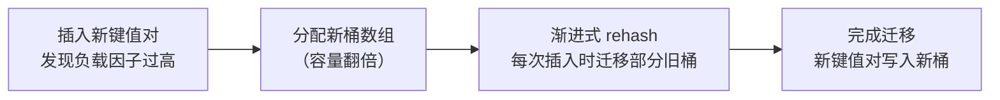

+++
title = "第14章 map"
weight = 140
date = "2026-03-20T08:39:00+08:00"
type = "docs"
description = ""
isCJKLanguage = true
draft = false
+++
# 第14章 map

> "切片是数组的窗户，map 就是哈希表的大脑。" —— 仍然是没有人说过的话，但很准确。

如果说切片是 Go 里的"动态数组"，那 map 就是 Go 里的**哈希表（Hash Table）**实现。切片用整数下标找元素，map 用**键（key）**找**值（value）**——键值对儿。你在其他语言里见过的 HashMap、Dictionary、Object（JS）、HashTable，都跟 Go 里的 map 是同一类东西。

为什么需要 map？因为不是所有数据都能用整数下标来表示的。你需要用字符串"Alice"来查找她的年龄，用 URL 路径来查找对应的处理器，用产品 ID 来查找产品信息——这些场景下，map 就是你的最佳拍档。

这一章我们把 Go 里的 map 从上到下、从前到后、从使用到原理全部讲清楚。

---

## 14.1 map 类型

### 14.1.1 map 定义

map 的类型声明长这样：

```go
var m map[K]V
```

其中 `K` 是键的类型，`V` 是值的类型。`K` 必须是一个**可比较（comparable）**的类型——说白了就是可以用 `==` 和 `!=` 来比较的类型，因为 map 内部既要对键做哈希，又要在桶里做相等比较。

```go
var ages map[string]int      // 键是 string，值是 int
var scores map[int]float64  // 键是 int，值是 float64
var config map[string]string // 键是 string，值是 string
```

声明一个 map 变量只是创建了一个 nil map——它不指向任何东西，长度是 0，你不能往里存东西（会 panic），但可以安全地读取（读不到返回零值）。

### 14.1.2 键类型约束

map 的键不能随便选，Go 对键类型有严格要求。

#### 14.1.2.1 可比较类型

以下类型可以作为 map 的键：

- 所有整数类型（`int`、`int64`、`uint8` 等）
- 浮点数类型（`float64`、`float32`）——注意：`NaN` 可以当键**写进去**，但它不等于自身，所以**永远查不出来**，遍历时也只能看到一个 `NaN` 键。别拿 `NaN` 当键。
- 字符串类型
- 布尔类型
- 复数类型
- 数组类型（当数组元素都是可比较类型时）
- 结构体类型（当所有字段都是可比较类型时）
- 指针类型
- 接口类型（当具体值是可比较类型时）
- channel 类型

```go
// 键类型选择示例
ages := map[string]int{
    "Alice": 30,
    "Bob":   25,
}

ids := map[int]string{
    1001: "Product A",
    1002: "Product B",
}

type Point struct{ X, Y int }
points := map[Point]string{
    {1, 2}: "P1",
    {3, 4}: "P2",
}
```

#### 14.1.2.2 禁止类型

以下类型**不能**作为 map 的键，因为它们不可比较（或者说比较语义不明确）：

- 切片（`[]int`、`[]string` 等）
- map 本身（`map[string]int`）
- 函数类型（`func() int`）

```go
// 下面这些都是非法的键类型
// var m map[[]int]string  // 切片不能作为键！
// var m2 map[map[string]int]bool  // map 不能作为键！
// var m3 map[func()]int  // 函数不能作为键！
```

> 想象一下：如果你能用一个切片来查找值，那切片的相等性怎么定义？`[]int{1,2}` 和 `[]int{1,2}` 是同一个切片吗？在 Go 里，切片只能和 nil 比较，不能和另一个切片比较——因为没有定义。所以切片不能做键，完全合理。

### 14.1.3 值类型

map 的值类型就没有那么多限制了——**任何类型**都可以作为 map 的值，包括另一个 map！

```go
// 嵌套 map：值本身是另一个 map
users := map[string]map[string]any{
    "alice": {
        "age":    30,
        "city":   "Beijing",
        "active": true,
    },
}
fmt.Println(users["alice"]["city"])  // Beijing

// 更常见的写法：用结构体代替嵌套 map
type User struct {
    Age   int
    City  string
    Active bool
}
users2 := map[string]User{
    "alice": {30, "Beijing", true},
}
fmt.Println(users2["alice"].City)  // Beijing
```

### 14.1.4 引用语义

和切片一样，map 也是**引用类型**。当你把一个 map 变量赋值给另一个变量，或者传给函数时，两者指向的是同一个底层数据结构。

```go
m1 := map[string]int{"a": 1, "b": 2}
m2 := m1  // m2 和 m1 指向同一个 map

m2["c"] = 3  // 通过 m2 添加
fmt.Println(m1["c"])  // 3 — m1 也能看到！
```

---

## 14.2 map 创建

### 14.2.1 内置函数创建

#### 14.2.1.1 make 语法

用 `make` 创建 map 是最常用的方式：

```go
m := make(map[string]int)         // 空 map，键是 string，值是 int
m2 := make(map[string]int, 100)  // 预分配容量，避免多次扩容
```

`make(map[K]V)` 创建空 map。
`make(map[K]V, capacity)` 创建空 map，同时预分配一些初始容量。

#### 14.2.1.2 容量提示

`make(map[K]V, 100)` 的第二个参数是一个**容量提示（hint）**，不是硬性限制。它告诉 Go"我大概会往里放 100 个键值对"，让 Go 提前准备合适的底层结构，避免在插入前几十个元素时反复调整。

```go
// 不预分配
m := make(map[string]int)
for i := 0; i < 1000; i++ {
    m[string(rune('a'+i%26))] = i
}

// 预分配
m2 := make(map[string]int, 1000)
for i := 0; i < 1000; i++ {
    m2[string(rune('a'+i%26))] = i
}
```

### 14.2.2 字面量创建

#### 14.2.2.1 键值对语法

用 map 字面量可以在创建时就塞进初始数据：

```go
ages := map[string]int{
    "Alice": 30,
    "Bob":   25,
    "Carol": 35,
}
fmt.Println(ages)  // map[Alice:30 Bob:25 Carol:35]
```

#### 14.2.2.2 键类型能不能省略

很多初学者以为 map 字面量可以像复合字面量那样省类型，答案是不能：map 的**键类型必须显式写出来**。字面量里能省的是**值的复合字面量类型**。

```go
// 键类型必须写出来
m1 := map[string]int{"a": 1, "b": 2}

// 能省的是“值的类型”：下面 Point 被省略了
type Point struct{ X, Y int }
m2 := map[string]Point{
    "origin": {0, 0},
    "unit":   {1, 1},
}
```

> 一句话记住：map 字面量里键类型必须有，值的复合字面量类型可以省。

---

## 14.3 map 操作

### 14.3.1 键值存取

#### 14.3.1.1 插入操作

直接用 `map[key] = value` 就可以插入或更新键值对：

```go
m := make(map[string]int)

// 插入
m["Alice"] = 30
m["Bob"] = 25
fmt.Println(m)  // map[Alice:30 Bob:25]
```

#### 14.3.1.2 更新操作

更新和插入的语法完全一样——如果键存在就覆盖，不存在就新建：

```go
m := map[string]int{"Alice": 30}
m["Alice"] = 31  // 更新已存在的键
m["Carol"] = 28  // 插入新键
fmt.Println(m)  // map[Alice:31 Carol:28]
```

#### 14.3.1.3 查询操作

用 `map[key]` 读取，如果键不存在，返回**值的零值**：

```go
m := map[string]int{"Alice": 30, "Bob": 25}

fmt.Println(m["Alice"])  // 30
fmt.Println(m["Unknown"]) // 0 — string 键不存在，返回 int 的零值 0
```

**重要**：你无法通过读取结果判断键是否真的存在——因为零值本身也可能是一个合法的键值（键存在但值恰好是零值）。

#### 14.3.1.4 零值返回

当查询一个不存在的键时，返回值的零值，但不报错。这有时候会导致意料之外的结果：

```go
m := map[string]int{"Alice": 0, "Bob": 25}

// ❌ 危险写法：只看值，判断不出键到底在不在
if m["Alice"] == 0 {
    fmt.Println("以为 Alice 不存在")  // 会执行，但 Alice 明明存在，值就是 0
}

// ✅ 正确写法：用 comma ok 判断
if v, ok := m["Alice"]; ok {
    fmt.Println("Alice 存在，值 =", v)  // Alice 存在，值 = 0
}

fmt.Println(m["Bob"]) // 25
```

### 14.3.2 存在检测

#### 14.3.2.1 comma ok 惯用法

Go 的 map 查询可以返回两个值：`value, ok`。`ok` 是一个布尔值，表示键是否真的存在：

```go
m := map[string]int{"Alice": 30, "Bob": 0}  // Bob 的值恰好是零值

if v, ok := m["Alice"]; ok {
    fmt.Println("Alice found:", v)  // Alice found: 30
} else {
    fmt.Println("Alice not found")
}

if v, ok := m["Bob"]; ok {
    fmt.Println("Bob found:", v)  // Bob found: 0 — 键存在，值是零值
} else {
    fmt.Println("Bob not found")
}

if v, ok := m["Unknown"]; ok {
    fmt.Println("Unknown found:", v)
} else {
    fmt.Println("Unknown not found")  // Unknown not found
}
```

#### 14.3.2.2 检测语义

这个 `value, ok` 模式是 Go 里检测键是否存在的**唯一可靠方式**。特别是当你需要区分"键不存在"和"键存在但值是零值"时，这个模式是必须的：

```go
// 典型的计数场景：计数不存在时应该返回 0，但我们需要区分"真的没计数"和"计数为0"
counts := map[string]int{"success": 0, "fail": 0}

for _, event := range []string{"success", "success", "unknown"} {
    if _, ok := counts[event]; ok {
        counts[event]++  // 只对已存在的键计数
    }
}
fmt.Println(counts)  // map[success:2 fail:0]
```

### 14.3.3 键值删除 delete

#### 14.3.3.1 delete 语义

`delete(map, key)` 是 Go 里删除 map 元素的唯一方式：

```go
m := map[string]int{"Alice": 30, "Bob": 25}

delete(m, "Alice")  // 删除 Alice
fmt.Println(m)      // map[Bob:25]
```

`delete` 是一个内置函数，不需要导入任何包。

#### 14.3.3.2 删除不存在键

如果 `delete` 删除一个本来就不存在的键，**不会有任何错误，也不会做任何事情**：

```go
m := map[string]int{"Bob": 25}
delete(m, "NonExistent")  // 什么都没发生，程序不会报错
fmt.Println(m)            // map[Bob:25]
```

这和某些语言的行为不同（比如 Python 的字典删除不存在的键会抛出 KeyError），Go 的 `delete` 完全安全。

### 14.3.4 长度获取 len

用 `len()` 函数获取 map 中键值对的数量：

```go
m := map[string]int{"Alice": 30, "Bob": 25}
fmt.Println(len(m))  // 2

m["Carol"] = 35
fmt.Println(len(m))  // 3

delete(m, "Alice")
fmt.Println(len(m))  // 2
```

---

## 14.4 map 遍历

### 14.4.1 range 遍历

用 `for range` 遍历 map，每次迭代返回键和值：

```go
m := map[string]int{"Alice": 30, "Bob": 25, "Carol": 35}

for key, value := range m {
    fmt.Printf("%s -> %d\n", key, value)
}
// 每次运行的顺序可能不同！map 的遍历顺序是随机的
// Bob -> 25
// Alice -> 30
// Carol -> 35
```

#### 14.4.1.1 同时拿键和值

`range` 后面跟两个变量时，第一个是**键**，第二个是**值**（位置对应数组、切片的“下标, 元素”）：

```go
m := map[string]int{"Alice": 30, "Bob": 25}
for key, value := range m {
    fmt.Println(key, value)
}
```

#### 14.4.1.2 只要键，或者只要值

只写一个变量时，拿到的是**键**而不是值——这一点常常和初学者的直觉相反：

```go
m := map[string]int{"Alice": 30, "Bob": 25}
for key := range m {
    fmt.Println(key)
}
```

只要值，就把键用下划线丢掉：

```go
for _, value := range m {
    fmt.Println(value)
}
```

### 14.4.2 遍历顺序

map 的遍历顺序是**随机（randomized）**的——每次遍历的顺序都可能不同。这是 Go 设计者有意为之，目的是防止程序员写出依赖遍历顺序的代码（这种代码在某些语言里看似正常但其实是不安全的 bug）。

```go
m := map[string]int{"a": 1, "b": 2, "c": 3, "d": 4, "e": 5}

for i := 0; i < 3; i++ {
    fmt.Printf("Run %d: ", i+1)
    for k, v := range m {
        fmt.Printf("%s:%d ", k, v)
    }
    fmt.Println()
}

// Run 1: b:2 a:1 c:3 e:5 d:4
// Run 2: c:3 a:1 d:4 b:2 e:5
// Run 3: e:5 b:2 d:4 a:1 c:3 （顺序每次都不一样！）
```

> **不要依赖 map 的遍历顺序！** 如果你需要有序遍历，请先把键取出来排序，然后用排好序的键去访问 map。

### 14.4.3 遍历安全性

**在遍历中删除元素是安全的：**

```go
m := map[string]int{"a": 1, "b": 2, "c": 3}
for k, v := range m {
    if v == 2 {
        delete(m, k)  // 删除"b"这个键，安全
    }
}
fmt.Println(m)  // map[a:1 c:3]
```

**在遍历中插入元素不会 panic，但结果不确定：**

Go 规范对此的表述是：迭代过程中新增的键值对，**可能被遍历到、也可能不被遍历到**；删除的键值对，**可能被产出、也可能不被产出**。能跑出结果不代表结果可预期：

```go
m := map[string]int{"a": 1}
for k, v := range m {
    m["new"] = 999  // 在遍历中插入
    fmt.Println(k, v)
}
// 行为未定义，可能只输出 a:1，或者输出 a:1 和 new:999
// 强烈建议不要在遍历中对 map 做写操作
```

---

## 14.5 map 状态

### 14.5.1 nil map

声明但未初始化的 map 是 nil map：

```go
var m map[string]int  // nil map

fmt.Println(m == nil)  // true
fmt.Println(len(m))     // 0
```

#### 14.5.1.1 读操作安全

nil map 可以安全读取，返回零值：

```go
var m map[string]int
fmt.Println(m["anything"]) // 0 — 读 nil map 是安全的
```

#### 14.5.1.2 写操作 panic

nil map 不能写入，写入会 panic：

```go
package main

import "fmt"

func main() {
    var m map[string]int  // nil map
    fmt.Println(m == nil)    // true
    fmt.Println(len(m))      // 0

    // 读取 nil map 是安全的，返回零值
    fmt.Println(m["anything"])  // 0

    // 写入 nil map 直接 panic！
    m["key"] = 1  // panic: assignment to entry in nil map
}
```

### 14.5.2 空 map

用 `make` 创建但没有任何键值对的 map 是空 map，不是 nil：

```go
m := make(map[string]int)

fmt.Println(m == nil)  // false — 不是 nil！
fmt.Println(len(m))    // 0 — 空 map
m["key"] = 1           // 写入空 map 是完全合法的
fmt.Println(m)         // map[key:1]
```

---

## 14.6 map 特性

### 14.6.1 非并发安全

这是 map 和切片最重要的区别之一：**map 不是并发安全的**。多个 goroutine 同时读写同一个 map 会导致数据竞争（data race），是未定义行为，甚至可能导致 panic：

```go
// 这段代码有严重的数据竞争！不要在实际项目中使用！
m := map[string]int{}
var wg sync.WaitGroup

for i := 0; i < 100; i++ {
    wg.Add(1)
    go func() {
        m["key"]++  // 多个 goroutine 同时写同一个 map，危险！
        wg.Done()
    }()
}
wg.Wait()

// 运行 go run -race main.go 可以检测到数据竞争
```

正确做法是使用**互斥锁**保护 map：

```go
import "sync"

var (
    m   map[string]int
    mux sync.Mutex
)

func init() {
    m = make(map[string]int)
}

func increment(key string) {
    mux.Lock()
    m[key]++
    mux.Unlock()
}
```

### 14.6.2 扩容与再哈希

当 map 中的键值对数量增加，超过了底层桶（bucket）的承载能力时，Go 运行时会自动进行**扩容（grow）**和**再哈希（rehash）**：分配更多的桶，并把现有的键值对重新分配到新桶中。这个过程是渐进的（incremental），不会一次性阻塞所有操作。



### 14.6.3 迭代期间修改 map 有什么保证

这里**没有**“每个元素恰好被访问一次”这种保证。

如果扩容正好发生在遍历期间，同一个键甚至可能被你看到两次：迭代器从旧桶扫到新桶时，某个键可能既在旧桶里被扫到，又已经迁移到了新桶。所以实践中的结论只有一条——

> **遍历时不要增删键。** 如果确实需要边遍历边删，先记下要删的键，遍历结束后再统一 `delete`。

---

## 14.7 map 操作模式

### 14.7.1 插入模式

#### 14.7.1.1 直接插入

最简单的方式，直接赋值：

```go
m := make(map[string]int)
m["Alice"] = 30
m["Bob"] = 25
```

#### 14.7.1.2 条件插入（不存在才插入）

只当键不存在时才插入，避免覆盖已有值：

```go
m := map[string]int{"Alice": 30}

if _, ok := m["Alice"]; !ok {
    m["Alice"] = 25  // Alice 已存在，不执行
}

if _, ok := m["Carol"]; !ok {
    m["Carol"] = 28  // Carol 不存在，插入
}
fmt.Println(m)  // map[Alice:30 Carol:28]
```

或者用一行更简洁的写法：

```go
m := map[string]int{"Alice": 30}

// 使用 comma ok 技巧：只有键不存在才设置
if _, ok := m["Carol"]; !ok {
    m["Carol"] = 28
}
```

#### 14.7.1.3 批量插入

通过循环批量插入：

```go
names := []string{"Alice", "Bob", "Carol"}
m := make(map[string]int, len(names))  // 预分配容量

for i, name := range names {
    m[name] = i + 1  // Alice:1, Bob:2, Carol:3
}
fmt.Println(m)  // map[Alice:1 Bob:2 Carol:3]
```

### 14.7.2 更新模式

#### 14.7.2.1 直接更新
直接给已存在的键赋新值即可完成更新；键不存在时会顺带新建它：

```go
m := map[string]int{"score": 10}
m["score"] = 20  // 直接覆盖
fmt.Println(m["score"]) // 20
```

#### 14.7.2.2 条件更新（存在才更新）
先判断键是否存在，再决定要不要更新，避免不小心创建出新的键：

```go
m := map[string]int{"score": 10}

if v, ok := m["score"]; ok {
    m["score"] = v + 10  // 只在存在时才更新
}
fmt.Println(m["score"]) // 20
```

#### 14.7.2.3 原子更新（读取-修改-写入）

在并发场景下，读取-修改-写入需要加锁：

```go
import "sync"

var (
    m   map[string]int
    mux sync.RWMutex
)

func init() {
    m = make(map[string]int)
}

func addScore(key string, delta int) {
    mux.Lock()
    m[key] += delta
    mux.Unlock()
}
```

### 14.7.3 删除模式

#### 14.7.3.1 单键删除
用内置的 `delete` 函数删除指定键；删除一个不存在的键不会报错：

```go
m := map[string]int{"Alice": 30, "Bob": 25}
delete(m, "Alice")  // 删除 Alice
fmt.Println(m)       // map[Bob:25]
```

#### 14.7.3.2 批量删除

把要删除的键收集到一个切片里，然后逐个删除：

```go
m := map[string]int{"a": 1, "b": 2, "c": 3, "d": 4}
toDelete := []string{"a", "c"}

for _, k := range toDelete {
    delete(m, k)
}
fmt.Println(m)  // map[b:2 d:4]
```

#### 14.7.3.3 遍历删除注意事项

在遍历中删除键是安全的，但要注意不要在遍历中同时修改 map 结构（删除 OK，插入不推荐）：

```go
m := map[string]int{"a": 1, "b": 2, "c": 3, "d": 4}
for k, v := range m {
    if v%2 == 0 {
        delete(m, k)  // 删除偶数值，安全
    }
}
fmt.Println(m)  // map[a:1 c:3]
```

### 14.7.4 查询模式

#### 14.7.4.1 存在查询
用「逗号 ok」惯用法判断键是否存在，这是 Go 里最常用的查询写法：

```go
m := map[string]int{"Alice": 30, "Bob": 0}

if v, ok := m["Alice"]; ok {
    fmt.Println("Alice's age:", v)
} else {
    fmt.Println("Alice not found")
}
```

#### 14.7.4.2 默认值查询

当键不存在时返回默认值：

```go
m := map[string]int{"score": 100}
const defaultScore = -1

// 想要“自己的默认值”而不是零值，就必须先判断键是否存在
score := defaultScore
if v, ok := m["score"]; ok {
    score = v
}
fmt.Println(score) // 100

missing := defaultScore
if v, ok := m["missing"]; ok {
    missing = v
}
fmt.Println(missing) // -1
```

> 只有当“零值”恰好就是你要的默认值时，才可以偷懒直接写 `score := m[key]`。

#### 14.7.4.3 多键查询

从 map 中批量查询多个键，返回一个新 map：

```go
func multiGet(m map[string]int, keys []string) map[string]int {
    result := make(map[string]int, len(keys))
    for _, k := range keys {
        if v, ok := m[k]; ok {
            result[k] = v
        }
    }
    return result
}

m := map[string]int{"Alice": 30, "Bob": 25, "Carol": 35}
keys := []string{"Alice", "Carol", "David"}
result := multiGet(m, keys)
fmt.Println(result)  // map[Alice:30 Carol:35] — David 不存在，自动过滤
```

### 14.7.5 遍历模式

#### 14.7.5.1 全量遍历
`for range` 是遍历 map 的标准写法，注意每次遍历的顺序都是随机的：

```go
m := map[string]int{"Alice": 30, "Bob": 25}
for k, v := range m {
    fmt.Println(k, v)
}
```

#### 14.7.5.2 条件遍历

只遍历满足条件的键值对：

```go
m := map[string]int{"Alice": 30, "Bob": 25, "Carol": 35}

for k, v := range m {
    if v > 30 {
        fmt.Println(k, v)  // Carol: 35
    }
}
```

#### 14.7.5.3 并发遍历

并发读 map 是安全的（不需要锁），但并发读写或写操作需要锁：

```go
import (
    "fmt"
    "sync"
)

var (
    m   map[string]int
    mux sync.RWMutex
)

func init() {
    m = make(map[string]int)
}

func get(k string) int {
    mux.RLock()
    defer mux.RUnlock()
    return m[k]
}

func set(k string, v int) {
    mux.Lock()
    defer mux.Unlock()
    m[k] = v
}

func main() {
    var wg sync.WaitGroup
    for i := 0; i < 10; i++ {
        wg.Add(1)
        go func(id int) {
            set(fmt.Sprintf("key%d", id), id)
            wg.Done()
        }(i)
    }
    wg.Wait()

    mux.RLock()
    fmt.Println(m)
    mux.RUnlock()
}
```

### 14.7.6 转换模式

#### 14.7.6.1 map 转 slice（键提取）
把 map 的所有键收集成一个切片：

```go
m := map[string]int{"Alice": 30, "Bob": 25}

keys := make([]string, 0, len(m))
for k := range m {
    keys = append(keys, k)
}
fmt.Println(keys)  // [Alice Bob]（顺序随机）
```

#### 14.7.6.2 map 转 slice（值提取）
把 map 的所有值收集成一个切片：

```go
m := map[string]int{"Alice": 30, "Bob": 25}

values := make([]int, 0, len(m))
for _, v := range m {
    values = append(values, v)
}
fmt.Println(values)  // [30 25]（顺序随机）
```

#### 14.7.6.3 map 转 slice（键值对提取）
如果需要同时保留键和值，可以把它们装进一个结构体切片：

```go
m := map[string]int{"Alice": 30, "Bob": 25}

pairs := make([][2]any, 0, len(m))
for k, v := range m {
    pairs = append(pairs, [2]any{k, v})
}
fmt.Println(pairs)  // [[Alice 30] [Bob 25]]（元素顺序随机）
```

#### 14.7.6.4 slice 转 map
把切片按某个字段转成 map，通常用于按名字快速查找：

```go
names := []string{"Alice", "Bob", "Carol"}

// 方式一：值用固定值填充
m := make(map[string]int, len(names))
for _, n := range names {
    m[n] = 0
}
fmt.Println(m)  // map[Alice:0 Bob:0 Carol:0]

// 方式二：用索引做值
m2 := make(map[string]int, len(names))
for i, n := range names {
    m2[n] = i
}
fmt.Println(m2)  // map[Alice:0 Bob:1 Carol:2]
```

#### 14.7.6.5 两个 map 合并

把 map2 的键值对合并到 map1 中（map1 中的键优先）：

```go
func merge(m1, m2 map[string]int) map[string]int {
    result := make(map[string]int, len(m1)+len(m2))
    for k, v := range m1 {
        result[k] = v
    }
    for k, v := range m2 {
        if _, ok := result[k]; !ok {  // 不覆盖已存在的
            result[k] = v
        }
    }
    return result
}

m1 := map[string]int{"a": 1, "b": 2}
m2 := map[string]int{"b": 20, "c": 3}
merged := merge(m1, m2)
fmt.Println(merged)  // map[a:1 b:2 c:3] — m1 的 b 保留了
```

#### 14.7.6.6 map 差集

返回在 m1 中但不在 m2 中的键值对：

```go
func difference(m1, m2 map[string]int) map[string]int {
    result := make(map[string]int)
    for k, v := range m1 {
        if _, ok := m2[k]; !ok {
            result[k] = v
        }
    }
    return result
}

m1 := map[string]int{"a": 1, "b": 2, "c": 3}
m2 := map[string]int{"b": 20, "c": 30}
fmt.Println(difference(m1, m2))  // map[a:1]
```

#### 14.7.6.7 map 交集

返回同时在 m1 和 m2 中的键：

```go
func intersection(m1, m2 map[string]int) map[string]int {
    result := make(map[string]int)
    for k, v := range m1 {
        if _, ok := m2[k]; ok {
            result[k] = v
        }
    }
    return result
}

m1 := map[string]int{"a": 1, "b": 2, "c": 3}
m2 := map[string]int{"b": 20, "c": 30, "d": 40}
fmt.Println(intersection(m1, m2))  // map[b:2 c:3]
```


---

## 14.8 map 高级用法

### 14.8.1 map 作为集合（Set）

Go 没有内置的 Set 类型，但可以用 `map[T]bool` 或 `map[T]struct{}` 来模拟集合。后者更高效（不存储无用的 bool 值）：

```go
// 用 map[T]struct{} 模拟 Set
type Set[T comparable] struct {
    m map[T]struct{}
}

func NewSet[T comparable]() *Set[T] {
    return &Set[T]{m: make(map[T]struct{})}
}

func (s *Set[T]) Add(v T) {
    s.m[v] = struct{}{}
}

func (s *Set[T]) Has(v T) bool {
    _, ok := s.m[v]
    return ok
}

func (s *Set[T]) Remove(v T) {
    delete(s.m, v)
}

func (s *Set[T]) Size() int {
    return len(s.m)
}

// 使用示例
set := NewSet[string]()
set.Add("Alice")
set.Add("Bob")
set.Add("Alice")  // 重复添加，集合中只有一个 Alice

fmt.Println(set.Has("Alice"))  // true
fmt.Println(set.Has("Carol")) // false
fmt.Println(set.Size())        // 2
```

### 14.8.2 map 缓存模式

用 map 作为简单缓存：

```go
import "time"

type cachedValue struct {
    value   string
    expires time.Time
}

type Cache struct {
    data map[string]cachedValue
}

func NewCache() *Cache {
    return &Cache{data: make(map[string]cachedValue)}
}

func (c *Cache) Set(key, value string, ttl time.Duration) {
    c.data[key] = cachedValue{
        value:   value,
        expires: time.Now().Add(ttl),
    }
}

func (c *Cache) Get(key string) (string, bool) {
    entry, ok := c.data[key]
    if !ok {
        return "", false
    }
    if time.Now().After(entry.expires) {
        delete(c.data, key)
        return "", false
    }
    return entry.value, true
}
```

### 14.8.3 计数器模式

统计出现次数：

```go
words := []string{"apple", "banana", "apple", "cherry", "banana", "apple"}

counts := make(map[string]int)
for _, word := range words {
    counts[word]++
}
fmt.Println(counts)  // map[apple:3 banana:2 cherry:1]
```

### 14.8.4 分组模式

把同类元素归到一组：

```go
type Person struct {
    Name  string
    Group string
}

people := []Person{
    {"Alice", "Engineering"},
    {"Bob", "Engineering"},
    {"Carol", "Design"},
    {"Dave", "Engineering"},
    {"Eve", "Design"},
}

// 按 Group 分组
groups := make(map[string][]Person)
for _, p := range people {
    groups[p.Group] = append(groups[p.Group], p)
}

for group, members := range groups {
    fmt.Printf("%s: ", group)
    for _, p := range members {
        fmt.Print(p.Name, " ")
    }
    fmt.Println()
}
// Engineering: Alice Bob Dave
// Design: Carol Eve
```

---

## 14.9 map 性能

### 14.9.1 容量预分配

和切片一样，预分配容量可以减少 map 扩容的次数：

```go
// 不预分配：插入过程中会反复触发扩容
m := make(map[string]int)
for i := 0; i < 10000; i++ {
    m[strconv.Itoa(i)] = i
}

// 预分配：告诉运行时“我大概要放 10000 个键值对”，避免中途多次扩容
m2 := make(map[string]int, 10000)
for i := 0; i < 10000; i++ {
    m2[strconv.Itoa(i)] = i
}
```

### 14.9.2 键类型选择

键类型的选择会影响哈希计算的速度：

- **字符串键**：最常用，但长字符串的哈希计算成本较高
- **整数键**（`int`、`int64`）：哈希计算非常快
- **指针键**：直接比较指针值，哈希成本低
- **结构体键**：需要逐字段哈希，尽量用小结构体

```go
// 如果键是整数，比字符串更快
intMap := make(map[int]string, 1000)
// vs
strMap := make(map[string]string, 1000)
```

### 14.9.3 避免装箱

用空接口 `interface{}`（也就是 `any`）作为键时，具体类型要先进接口值里，这通常会带来额外的内存分配和一层间接的哈希计算，一般比直接用具体类型慢：

```go
// 装箱：有额外开销
m := make(map[any]int)
m[42] = 1          // int 装箱
m["hello"] = 2     // string 装箱

// 不装箱：直接用具体类型
m2 := make(map[int]int)
m2[42] = 1
```

---

## 14.10 map 陷阱

### 14.10.1 并发读写 panic

多个 goroutine 同时读写同一个 map，会直接触发 **panic: fatal error: concurrent map writes**：

```go
// 演示并发写 map 的 panic
m := make(map[string]int)
var wg sync.WaitGroup
for i := 0; i < 2; i++ {
    wg.Add(1)
    go func() {
        for j := 0; j < 1000; j++ {
            m["key"] = j  // 两个 goroutine 同时写，触发 panic
        }
        wg.Done()
    }()
}
wg.Wait()
```

解决方案：**sync.RWMutex** 或 **sync.Map**。

### 14.10.2 遍历顺序依赖陷阱

初学者常犯的一个错误是依赖 map 的遍历顺序来产生确定的输出：

```go
// 错误写法：依赖遍历顺序
m := map[string]int{"a": 1, "b": 2, "c": 3}
result := ""
for k, v := range m {
    result += fmt.Sprintf("%s:%d", k, v)  // result 的值不确定！
}
fmt.Println(result)  // 每次运行可能不同！
```

正确做法：先排序键，再遍历：

```go
// 正确写法：先排序
m := map[string]int{"a": 1, "b": 2, "c": 3}

keys := make([]string, 0, len(m))
for k := range m {
    keys = append(keys, k)
}
sort.Strings(keys)  // 排序键

result := ""
for _, k := range keys {
    result += fmt.Sprintf("%s:%d", k, m[k])
}
fmt.Println(result)  // a:1b:2c:3 — 每次都相同！
```

### 14.10.3 删除后复用键

删除 map 中的一个键后，该键可以重新被插入，没有"墓碑"机制限制。这是正常行为，但如果在遍历中删除并立即插入同名键，可能导致不可预测的遍历行为。

---

## 14.11 map 实现原理

### 14.11.1 哈希表结构

Go 的 map 底层是一个**哈希表（Hash Table）**，每个 map 的底层结构大致如下：

```go
// runtime.hmap 的简化版本（字段顺序与含义都和源码一致）
type hmap struct {
    count      int             // 当前键值对数量，len(m) 直接返回它
    flags      uint8           // 状态标志：是否正在写、是否正在扩容等
    B          uint8           // 桶数量的对数，即桶数量 = 2^B
    noverflow  uint16          // 溢出桶的大致数量
    hash0      uint32          // 哈希种子，每个 map 随机生成
    buckets    unsafe.Pointer  // 指向桶数组（2^B 个桶）
    oldbuckets unsafe.Pointer  // 扩容期间指向旧桶数组，大小是 buckets 的一半
    nevacuate  uintptr         // 已迁移的桶数——增量扩容的进度
    extra      *mapextra       // 溢出桶等可选信息，多数 map 为 nil
}
```

> 注意：源码里**没有** `nbuckets` 字段，桶数量由 `1<<hmap.B` 算出来；键和值的大小也不存在这里，而是由编译器为每个具体 map 类型生成。

### 14.11.2 桶结构

map 的底层桶（bucket）是一个固定大小的数组，每个桶可以存储 8 个键值对：

```go
// 桶在内存中的实际布局（简化；keytype/valuetype 由编译器按具体 map 类型填充）
type bmap struct {
    tophash  [8]uint8      // 先放 8 个键的哈希高 8 位，用于快速筛查
    keys     [8]keytype    // 再放 8 个键
    values   [8]valuetype  // 再放 8 个值
    // 最后跟一个溢出指针 *bmap，由编译器隐式添加
}
```

> 顺序很关键：`tophash` 在最前面，键在值之前。运行时先扫 `tophash` 就能一次性排除大半槽位，不必逐个比较完整的键。

> 为什么要存 tophash？因为比较两个键是否相等需要完整比较键内容（可能很大），但比较 tophash（一个字节）很快。如果 tophash 不相等，键肯定不相等，跳过这个槽位。只有 tophash 相同时，才真正比较键内容。

### 14.11.3 溢出桶

当一个桶存满了 8 个键值对，Go 会创建一个**溢出桶（overflow bucket）**，通过 overflow 指针链起来：


### 14.11.4 扩容机制

#### 14.11.4.1 增量扩容

当 map 中的键值对数量增长，导致每个桶的平均负载过高时，Go 会触发**增量扩容**（不是一次性完成）。这意味着旧的桶数组（oldbuckets）和新的桶数组（buckets）会共存，每次插入操作都会渐进地将数据从旧桶迁移到新桶。

#### 14.11.4.2 等量扩容

当大量键值对被删除后，桶的平均负载降低，Go 会执行**等量扩容**——桶数量不变，但重新整理数据，让数据分布更紧凑。

### 14.11.5 哈希函数

Go 的哈希函数实现在运行时中（`runtime.memhash`、`runtime.strhash`、`runtime.f32hash` 等），由**编译器按键的具体类型自动选择**，使用者既不需要也无法手动指定。几个值得记住的点：

- 在 amd64 上，它使用基于 AES 指令的算法（通常称为 aeshash）；arm64 上也有对应的硬件加速实现。
- 从 Go 1.19 起，没有硬件加速可用的平台改用类 wyhash 的算法，比旧实现更快、分布也更好。
- 每个 map 都带有一个**随机哈希种子**（`hmap.hash0`）。这正是同一个程序每次运行、map 遍历顺序都不一样的根本原因：种子变了，哈希分布就变了，桶的排列自然也变了。

### 14.11.6 冲突解决

Go 的 map 用的是“桶内开放寻址 + 桶外溢出链”的混合策略：每个桶只有 8 个槽位，发生冲突时先占用本桶的空槽；8 个槽位都满了，才挂一个新的溢出桶，形成链表。所以它既不是纯粹的开放寻址，也不是教科书里那种“每个桶挂一条链表”的链地址法。

---

## 14.12 map 与 sync.Map 对比

### 14.12.1 使用场景对比

`sync.Map` 是 Go 1.9 引入的，专门为**读多写少**的并发场景优化：

| 特性 | 普通 map + Mutex | sync.Map |
|------|----------------|---------|
| 适用场景 | 读写混合，或写多 | 读多写少 |
| 并发安全 | ✅（需要锁） | ✅（内置） |
| 性能（读多写少） | 一般（锁开销） | 更好（无锁读） |
| 性能（写多） | 更好（可控锁） | 较差（额外开销） |
| 删除操作 | `delete(m, k)` | `m.Delete(k)` |
| 遍历 | `for k, v := range m` | `m.Range(func(k, v any) bool)` |

### 14.12.2 性能对比

`sync.Map` 在高并发读场景下比加锁的普通 map 更快，但它**不是**靠分段锁做到的（分段锁是 Java `ConcurrentHashMap` 那一派的做法）。它的真实结构是：

- 一份只读的 `read` map，通过 `atomic.Pointer` 原子读取，读操作**完全不加锁**；
- 一份可写的 `dirty` map，由一把普通的 `Mutex` 保护；
- 当只读视图连续未命中达到一定次数，就把 `dirty` 整体提升为新的 `read`（写时复制）。

代价是写操作往往要同时维护两份结构，所以写多的时候它反而比“普通 map + 锁”更慢。

> ⚠️ 下面这段只是**粗略的计时演示**，用来感受两者的量级差异，它不是严谨的基准测试。真正的性能测试应该写成 `_test.go` 里的 `func BenchmarkXxx(b *testing.B)`，用 `go test -bench . -benchmem` 运行，并用 `-count` 多次取样。

```go
import (
    "fmt"
    "sync"
    "time"
)

// timeMutexMap 普通 map + Mutex 的并发计时演示
func timeMutexMap() {
    var mux sync.Mutex
    m := make(map[string]int)

    var wg sync.WaitGroup
    start := time.Now()

    for i := 0; i < 100; i++ {
        wg.Add(1)
        go func() {
            for j := 0; j < 1000; j++ {
                key := fmt.Sprintf("key%d", j%100)
                mux.Lock()
                m[key]++
                mux.Unlock()
            }
            wg.Done()
        }()
    }
    wg.Wait()
    fmt.Printf("Mutex map: %v\n", time.Since(start))
}

// timeSyncMap sync.Map 的并发计时演示
func timeSyncMap() {
    var m sync.Map

    var wg sync.WaitGroup
    start := time.Now()

    for i := 0; i < 100; i++ {
        wg.Add(1)
        go func() {
            for j := 0; j < 1000; j++ {
                key := fmt.Sprintf("key%d", j%100)
                if v, ok := m.Load(key); ok {
                    m.Store(key, v.(int)+1)
                } else {
                    m.Store(key, 1)
                }
            }
            wg.Done()
        }()
    }
    wg.Wait()
    fmt.Printf("sync.Map: %v\n", time.Since(start))
}

func main() {
    fmt.Println("运行计时演示...")
    timeMutexMap()
    timeSyncMap()
}
```

### 14.12.3 选择建议

- **大多数场景**：用普通 `map + sync.Mutex` 或 `sync.RWMutex`，简单可控
- **读多写少、并发度高**：`sync.Map` 是更好的选择
- **写多或读写均衡**：普通 map + mutex 通常更高效
- **需要 map 的键有序遍历**：`sync.Map` 不支持，用普通 map + 排序

---

## 本章小结

map 是 Go 语言的哈希表实现，它用键值对的方式存储数据，提供了近似 O(1) 的查找、插入、删除性能。map 是引用类型，和切片一样，赋值和传参都只是复制了 map 的"头部指针"，底层数据结构是共享的。

**核心知识点：**

1. **键类型约束**：map 的键必须是可比较的类型（可以用 `==` 比较），切片、map、函数不能作为键。值类型没有限制，可以是任何类型。

2. **创建方式**：`make(map[K]V)` 创建空 map，`make(map[K]V, capacity)` 可以预分配容量，map 字面量可以在创建时初始化数据。

3. **基本操作**：插入/更新用 `m[k]=v`，查询用 `m[k]`（返回零值），存在性检测用 `value, ok := m[k]` 这个 comma ok 惯用法，删除用 `delete(m, k)`，长度用 `len(m)`。

4. **遍历顺序**：map 的遍历顺序是随机的，每次运行都可能不同。如需有序输出，先把键取出来排序再遍历（Go 1.21+ 用 `slices.Sort`，更早的版本用 `sort.Strings`）：

```go
import "slices"

m := map[string]int{"c": 3, "a": 1, "b": 2}

// 无序遍历：每次顺序可能不同
for k, v := range m {
    fmt.Print(k, v)
}
fmt.Println()

// 有序遍历：先排键，再按序访问
keys := make([]string, 0, len(m))
for k := range m {
    keys = append(keys, k)
}
slices.Sort(keys)
for _, k := range keys {
    fmt.Print(k, m[k])  // a1b2c3 — 每次都相同
}
fmt.Println()
```

5. **并发安全**：普通 map 不是并发安全的，并发读写会导致 panic。解决方案是使用 `sync.Mutex`（读写混合场景）或 `sync.RWMutex`（读多写少）或 `sync.Map`（读多写少的并发场景）。

6. **nil map**：声明但未初始化的 map 是 nil map，可以读取但不能写入。空 map（make 创建）是合法的，可以正常读写。

7. **实现原理**：map 底层是 `hmap` 结构 + 桶数组，每个桶可存 8 个键值对，使用链地址法解决冲突。Go 使用高质量的哈希函数，增量扩容避免了一次性重哈希的性能抖动。

8. **性能优化**：预分配容量、选择合适的键类型（整数键比字符串键更快）、避免空接口装箱。

9. **高级用法**：用 `map[T]struct{}` 模拟 Set、缓存模式、计数器模式、分组模式。map 和 slice 之间可以相互转换（提取键、值、键值对）。

10. **sync.Map 选择**：读多写少的并发场景用 `sync.Map`，否则优先用普通 map + mutex。
