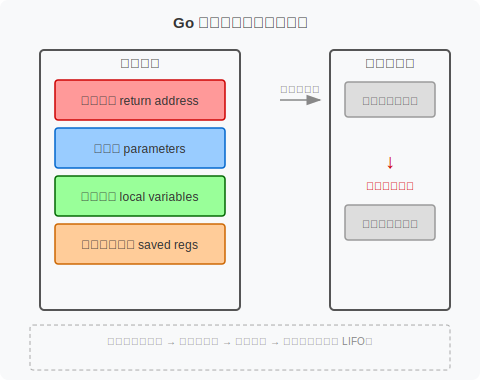

+++
title = "第17章 函数"
weight = 170
date = "2026-03-20T08:39:00+08:00"
type = "docs"
description = ""
isCJKLanguage = true
draft = false

+++
# 第17章 函数

> "函数是 Go 世界的公民，不是二等居民。" —— Rob Pike（Go 语言创始人之一）

函数是 Go 程序的基本构建单元。Go 的函数比其他语言的函数更强大、更灵活——它支持多返回值、命名返回值、闭包、变长参数、延迟执行（defer），还可以作为值传递。这些特性让 Go 在保持简洁的同时拥有了函数式编程的能力。

这一章我们把 Go 函数从声明到调用、从基础到高级、从原理到性能，全部讲透。

---

## 17.1 函数声明

### 17.1.1 函数签名

#### 17.1.1.1 函数名

函数名必须是**导出的（首字母大写）**才能被其他包调用，或者小写的仅包内可见：

```go
func ExportedFunc() {  // 首字母大写，可被其他包调用
    fmt.Println("I am visible to everyone!")
}

func internalFunc() {   // 首字母小写，仅同包可见
    fmt.Println("I am only visible inside this package")
}
```

#### 17.1.1.2 参数列表

##### 17.1.1.2.1 参数声明

Go 的参数声明格式是 `参数名 类型`，多个同类型参数可以合并：

```go
func add(a int, b int) int {
    return a + b
}
```

##### 17.1.1.2.2 同类型简写

连续的同类型参数可以合并：

```go
func add(a, b int) int {  // 等价于 func add(a int, b int)
    return a + b
}

func greet(first, last string, age int) {
    fmt.Printf("Hello %s %s, age %d\n", first, last, age)
}
```

##### 17.1.1.2.3 变长参数

###### 17.1.1.2.3.1 ... 语法

用 `...Type` 声明变长参数，函数内部把它当作切片来处理：

```go
func sum(nums ...int) int {
    total := 0
    for _, n := range nums {
        total += n
    }
    return total
}

fmt.Println(sum(1, 2, 3))      // 6
fmt.Println(sum(1, 2, 3, 4, 5)) // 15
fmt.Println(sum())              // 0 — 没有参数也可以调用
```

###### 17.1.1.2.3.2 变长参数类型

`...int` 在函数内部表现为 `[]int`：

```go
func printAll(values ...string) {
    // values 的类型是 []string
    for _, v := range values {
        fmt.Println(v)
    }
}
```

###### 17.1.1.2.3.3 传递切片

把切片展开成变长参数，用 `slice...`：

```go
nums := []int{1, 2, 3, 4, 5}
fmt.Println(sum(nums...))  // 15 — 把切片展开成 1,2,3,4,5

words := []string{"hello", "world"}
printAll(words...)  // 把切片展开成 "hello", "world"
```

##### 17.1.1.3 结果列表

###### 17.1.1.3.1 无名结果

函数可以返回多个值，类型直接写在签名里：

```go
func divide(a, b int) (int, int) {
    return a / b, a % b
}
```

###### 17.1.1.3.2 命名结果

Go 允许给返回值命名（named return values），这些变量在函数开头就已经存在，函数体可以直接使用：

```go
func divide(a, b int) (quotient, remainder int) {
    quotient = a / b  // 直接用命名返回值，不需要 :=    remainder = a % b
    return  // 裸 return，返回当前值
}
```

> 裸 return（bare return）只适合短函数。长函数里用裸 return 会降低可读性，因为阅读者需要去括号里找返回值名字。建议在长函数中明确写 `return quotient, remainder`。

###### 17.1.1.3.3 裸 return

裸 return 出现在有命名返回值的函数中，返回当前命名变量的值：

```go
func max(a, b int) (result int) {
    if a > b {
        result = a
    } else {
        result = b
    }
    return  // 等价于 return result
}
```

---

## 17.2 函数调用

### 17.2.1 实参求值

Go 的实参在传递给函数之前**按顺序求值**：

```go
func printArgs(a, b, c int) {
    fmt.Println(a, b, c)
}

printArgs(1, 2, 3)
// 打印结果一定是 1 2 3
```

### 17.2.2 参数传递

#### 17.2.2.1 值传递语义

Go 的函数参数传递**总是值传递**（pass by value）。但"值"的内容取决于类型：

- **基本类型（int、string、bool等）**：复制整个值
- **指针**：复制指针值（8字节），指针指向的对象不复制
- **切片、map、channel、interface**：复制的是"描述符"（header），底层数据结构不复制

```go
import "fmt"

func modifyInt(x int) {
    x = 999
}

func modifySlice(s []int) {
    s[0] = 999
}

func modifyPointer(p *int) {
    *p = 999
}

func main() {
    // 基本类型：值传递，原变量不受影响
    n := 1
    modifyInt(n)
    fmt.Println(n)  // 1 — 不变！

    // 切片：复制了切片头，底层数组被修改
    s := []int{1, 2, 3}
    modifySlice(s)
    fmt.Println(s)  // [999 2 3] — 切片指向的底层数组被改了！

    // 指针：复制指针值，指向的对象通过指针被修改
    n2 := 1
    modifyPointer(&n2)
    fmt.Println(n2)  // 999 — 通过指针修改了原变量
}
```

### 17.2.3 多值返回

#### 17.2.3.1 接收多值

Go 函数可以返回多个值：

```go
func getUser(id int) (name string, age int) {
    // 模拟查数据库
    return "Alice", 30
}

name, age := getUser(1)
fmt.Println(name, age)  // Alice 30
```

#### 17.2.3.2 结果忽略

如果不需要某个返回值，用 `_` 忽略：

```go
name, _ := getUser(1)  // 只关心 name，age 被丢弃
fmt.Println(name)  // Alice

_, age := getUser(1)  // 只关心 age
fmt.Println(age)  // 30
```

---

## 17.3 匿名函数

### 17.3.1 函数字面量

#### 17.3.1.1 语法形式

匿名函数（anonymous function）是没有名字的函数，可以直接赋值给变量或直接调用：

```go
add := func(a, b int) int {
    return a + b
}
fmt.Println(add(1, 2))  // 3
```

#### 17.3.1.2 立即执行

匿名函数定义后立即执行，用 `()` 包裹：

```go
result := func() int {
    sum := 0
    for i := 1; i <= 100; i++ {
        sum += i
    }
    return sum
}()  // 立即执行，返回 5050

fmt.Println(result)  // 5050
```

### 17.3.2 闭包

#### 17.3.2.1 变量捕获

匿名函数可以"捕获"外层函数的变量，形成**闭包（closure）**。闭包引用的是外层变量的本身，而不是捕获时的值：

```go
func counter() func() int {
    count := 0  // 外层变量，被闭包捕获
    return func() int {
        count++  // 修改的是外层的 count
        return count
    }
}

c1 := counter()
fmt.Println(c1())  // 1
fmt.Println(c1())  // 2
fmt.Println(c1())  // 3

c2 := counter()  // 新的闭包，有自己的 count
fmt.Println(c2())  // 1 — c2 的 count 是独立的
fmt.Println(c1())  // 4 — c1 的 count 继续增长
```

> 闭包捕获的变量在其生命周期内始终存在。这意味着即使外层函数已经返回，闭包仍然可以访问和修改那些被捕获的变量。

#### 17.3.2.2 捕获语义

Go 闭包捕获变量的规则：
- 对于**值类型**变量，闭包捕获的是变量的引用（实际上是变量的指针，Go 编译器自动处理）
- 对于**指针**、**切片**、**map**、**channel**等引用类型，捕获的是引用本身

```go
func main() {
    funcs := make([]func(), 3)
    for i := 0; i < 3; i++ {
        // 错误写法：i 是外层变量，所有闭包捕获的都是同一个 i
        funcs[i] = func() int {
            return i
        }
    }
    for _, f := range funcs {
        fmt.Println(f())  // 3 3 3 — 所有闭包都看到了最终的 i=3
    }

    funcs2 := make([]func(), 3)
    for i := 0; i < 3; i++ {
        v := i  // 正确做法：每次循环创建新的局部变量 v
        funcs2[v] = func() int {
            return v
        }
    }
    for _, f := range funcs2 {
        fmt.Println(f())  // 0 1 2 — 每个闭包捕获了各自的 v
    }
}
```

#### 17.3.2.3 生命周期陷阱

闭包可能导致被捕获变量的生命周期超出预期，造成内存泄漏或意外行为：

```go
func main() {
    // 错误的写法：addToCache 返回的闭包引用了 cache，
    // 导致 cache 永远无法被 GC 回收
    cache := make(map[int]int)
    addToCache := func(key, val int) func() int {
        cache[key] = val
        return func() int {
            return cache[key]
        }
    }

    getter := addToCache(1, 100)
    fmt.Println(getter())  // 100
    // cache 仍然被闭包引用，无法被 GC 回收
    // 正确做法：用函数参数传递 cache，或返回新创建的 map
}
```

---

## 17.4 递归

函数可以调用自己，形成递归。递归是处理树形结构、分形、自然数问题的有力工具。

### 17.4.1 直接递归

函数直接调用自己：

```go
import "fmt"

func factorial(n int) int {
    if n <= 1 {
        return 1
    }
    return n * factorial(n-1)
}

fmt.Println(factorial(5))  // 120 (5*4*3*2*1)
```

### 17.4.2 间接递归

A 调用 B，B 调用 A，形成间接递归：

```go
func isEven(n int) bool {
    if n == 0 {
        return true
    }
    return isOdd(n - 1)  // 调用 isOdd
}

func isOdd(n int) bool {
    if n == 0 {
        return false
    }
    return isEven(n - 1)  // 调用 isEven
}

fmt.Println(isEven(10))  // true
fmt.Println(isEven(7))    // false
```

---

## 17.5 延迟调用 defer

`defer` 是 Go 里一个独特且强大的特性——用 `defer` 声明的函数调用会在**外层函数返回之前**执行，常用于资源清理、锁释放、文件关闭等场景。

### 17.5.1 defer 机制

```go
func readFile(path string) error {
    file, err := os.Open(path)
    if err != nil {
        return err
    }
    defer file.Close()  // 函数退出前自动执行

    // 读取文件内容...
    return nil
}
```

不管函数是正常返回还是因为 error 返回，`defer` 都会执行。这完美解决了"提前 return 时忘记关闭资源"的问题。

### 17.5.2 延迟栈

#### 17.5.2.1 LIFO 执行

同一个函数中多个 `defer` 按照**后进先出（LIFO）**的顺序执行：

```go
func lIFO() {
    defer fmt.Println("first")   // 第3个执行
    defer fmt.Println("second")  // 第2个执行
    defer fmt.Println("third")  // 第1个执行

    fmt.Println("main body")
}
// 输出顺序：
// main body
// third
// second
// first
```

#### 17.5.2.2 注册顺序

`defer` 语句在**注册时并不执行**，而是把调用压入一个栈，函数返回时从栈顶依次弹出执行：

```go
func demo() {
    fmt.Println("start")
    for i := 1; i <= 3; i++ {
        defer fmt.Println("defer", i)
    }
    fmt.Println("end")
}
// start
// end
// defer 3
// defer 2
// defer 1
```

### 17.5.3 参数求值

#### 17.5.3.1 注册时求值

`defer` 语句中**函数的参数在注册时就求值**，而不是在执行时才求值：

```go
func demo() {
    n := 1
    defer fmt.Println("defer n =", n)  // 这里 n=1，注册时就确定了

    n = 100
    fmt.Println("main n =", n)  // main n = 100
}
// main n = 100
// defer n = 1
```

#### 17.5.3.2 延迟执行陷阱

正是因为参数在注册时求值，这个陷阱让很多 Go 程序员踩坑：

```go
func writeFile(path string) error {
    file, err := os.Create(path)
    if err != nil {
        return err
    }

    // 错误写法：defer 注册时 buf 已经求值了，file 是正确的
    // 但如果 defer 后 buf 的内容被修改，不会反映在最终文件中
    defer file.Close()

    buf := []byte("hello")
    file.Write(buf)  // 写入 hello

    buf = []byte("world")  // 修改 buf
    file.Write(buf)  // 写入 world

    return nil
}

// 正确写法：如果 defer 需要访问后续可能变化的变量，应该用闭包
func writeFileFixed(path string) error {
    file, err := os.Create(path)
    if err != nil {
        return err
    }

    // 正确写法：闭包在 defer 执行时才读取 buf 的值
    buf := []byte("hello")
    defer func() {
        file.Write(buf)  // 闭包捕获 buf 引用
        file.Close()
    }()

    buf = []byte("world")
    file.Write(buf)

    return nil
}
```

### 17.5.4 执行时机

#### 17.5.4.1 函数返回前

`defer` 在 `return` 语句**之后**、返回值**写入之前**执行：

```go
func beforeReturn() int {
    var result int
    defer func() {
        result++  // 修改命名返回值
    }()

    result = 10
    return  // defer 在 return 之后执行，所以 result 会先变成 11
}

fmt.Println(beforeReturn())  // 11
```

#### 17.5.4.2 与 return 交互

看这个经典的例子：

```go
func f1() int {
    var result int
    defer func() {
        result++
    }()
    return result  // 返回 0，因为 return 写返回值时 defer 还没执行
}

func f2() (result int) {
    defer func() {
        result++
    }()
    return result  // 返回 1，因为 result 是命名返回值，defer 可以修改它
}
```

#### 17.5.4.3 与 panic 交互

当程序触发 `panic` 时，**所有已经注册的 defer 会按 LIFO 顺序执行**：

```go
func safeCall() {
    defer fmt.Println("defer 1")
    defer fmt.Println("defer 2")
    defer fmt.Println("defer 3")

    panic("oops!")
    defer fmt.Println("this never runs")
}

// 输出：
// defer 3
// defer 2
// defer 1
// panic: oops!
```

### 17.5.5 使用模式

#### 17.5.5.1 资源释放

```go
import "database/sql"

func queryDB(db *sql.DB, query string) (*sql.Rows, error) {
    rows, err := db.Query(query)
    if err != nil {
        return nil, err
    }
    defer rows.Close()  // 遍历完或出错时都能保证关闭
    return rows, nil
}
```

#### 17.5.5.2 锁释放

```go
import "sync"

var (
    m    map[string]int
    mux  sync.RWMutex
)

func get(key string) int {
    mux.RLock()
    defer mux.RUnlock()  // 函数退出前自动释放读锁
    return m[key]
}
```

#### 17.5.5.3 计时模式

用 defer 测量函数执行时间：

```go
import (
    "fmt"
    "time"
)

func timeTrack(start time.Time, name string) {
    elapsed := time.Since(start)
    fmt.Printf("%s took %v\n", name, elapsed)
}

func slowOperation() {
    defer timeTrack(time.Now(), "slowOperation")  // 自动计时
    time.Sleep(100 * time.Millisecond)
}

slowOperation()  // slowOperation took 100.766ms
```

---

## 17.6 函数高级特性

### 17.6.1 泛型函数（见第32章）

Go 1.18 引入了泛型，函数可以接受类型参数：

```go
import "fmt"

// 泛型函数：对任何 comparable 类型的切片进行搜索
func indexOf[T comparable](slice []T, target T) int {
    for i, v := range slice {
        if v == target {
            return i
        }
    }
    return -1
}

nums := []int{1, 2, 3, 4, 5}
fmt.Println(indexOf(nums, 3))  // 2

names := []string{"Alice", "Bob", "Carol"}
fmt.Println(indexOf(names, "Bob"))  // 1
```

### 17.6.2 函数柯里化

柯里化（Currying）是把一个接受多个参数的函数转换成一系列接受单个参数的函数：

```go
func add(a int) func(int) int {
    return func(b int) int {
        return a + b
    }
}

add5 := add(5)   // 生成了一个"加5"的函数
add10 := add(10) // 生成了一个"加10"的函数

fmt.Println(add5(3))   // 8
fmt.Println(add5(10))  // 15
fmt.Println(add10(3))  // 13
```

### 17.6.3 函数组合

把多个函数串起来，形成一个函数管道：

```go
import "strings"

func compose[A, B, C any](f func(A) B, g func(B) C) func(A) C {
    return func(a A) C {
        return g(f(a))
    }
}

toUpper := strings.ToUpper
trim := strings.TrimSpace
len := func(s string) int { return len(s) }

trimAndUpper := compose(trim, toUpper)
upperLen := compose(trimAndUpper, len)

fmt.Println(upperLen("  hello  "))  // 5
```

---

## 17.7 函数性能

### 17.7.1 内联优化

Go 编译器会自动**内联（inlining）**小而简单的函数——把函数调用替换成函数体本身，省去函数调用的开销。

能被内联的条件：
- 函数体足够简单（没有循环、没有递归）
- 不是 `go` 或 `defer` 调用的函数

```go
// 这个函数可能会被内联
func add(a, b int) int {
    return a + b
}

// 不会被内联（因为有循环）
func sumTo(n int) int {
    total := 0
    for i := 0; i <= n; i++ {
        total += i
    }
    return total
}
```

### 17.7.2 逃逸分析影响

Go 的**逃逸分析（escape analysis）**决定变量是分配在栈上还是堆上。如果变量在函数返回后还需要继续存在，它就会"逃逸"到堆上。

```go
import "fmt"

func stack() int {
    x := 1  // 编译器会发现 x 不会逃逸，分配在栈上
    return x
}

func heap() *int {
    x := 1
    return &x  // x 逃逸到堆上（因为返回了指针）
}

func main() {
    fmt.Println(stack())  // 栈上分配，无 GC 压力
    fmt.Println(*heap())  // 堆上分配，有 GC 压力
}
```

把变量分配在栈上比堆上快得多（栈分配只是移动栈指针），所以 Go 编译器会尽量让变量留在栈上。写代码时不要随便返回局部变量的指针。

### 17.7.3 栈帧分配

每次函数调用都会在栈上分配一个**栈帧（stack frame）**，包含函数的参数、返回值、局部变量等：



> 上图展示了一个栈帧的内部组成：参数、返回地址、局部变量、保存的寄存器。Go 的栈从高地址向低地址生长，每调用一个函数就分配一个新栈帧，函数返回时回收（遵循 LIFO）。

Go 的栈是**动态增长**的（goroutine 初始栈只有 2KB，满了自动扩到最大 1GB），不需要手动管理。

---

## 17.8 函数式编程

### 17.8.1 一等公民

在 Go 中，函数是一等公民——可以赋值给变量、作为参数传递、作为返回值、存储在数据结构中：

```go
type Transform func(int) int

// 函数可以存储在切片中
transforms := []Transform{
    func(n int) int { return n * 2 },
    func(n int) int { return n + 1 },
    func(n int) int { return n * n },
}

for _, t := range transforms {
    fmt.Println(t(5))
}
// 10
// 6
// 25
```

### 17.8.2 高阶函数

接受函数作为参数或返回函数的函数，叫**高阶函数（higher-order function）**：

```go
import "strings"

type StringProcessor func(string) string

func processAll(inputs []string, fn StringProcessor) []string {
    outputs := make([]string, len(inputs))
    for i, input := range inputs {
        outputs[i] = fn(input)
    }
    return outputs
}

names := []string{"  Alice  ", "  BOB  ", "  Carol  "}
trimmed := processAll(names, strings.TrimSpace)
upper := processAll(names, strings.ToUpper)
fmt.Println(trimmed)  // [Alice BOB Carol]
fmt.Println(upper)     // [  ALICE   BOB   CAROL  ]
```

### 17.8.3 纯函数

**纯函数（pure function）**是指没有副作用（side effect）、给定相同输入总是返回相同输出的函数：

```go
// 纯函数
func add(a, b int) int {
    return a + b
}

// 非纯函数（有副作用：打印输出）
func addAndPrint(a, b int) int {
    result := a + b
    fmt.Println("computed:", result)
    return result
}

// 非纯函数（修改了全局状态）
var total int
func addToTotal(n int) int {
    total += n
    return total
}
```

纯函数更容易测试、更容易推理、也更方便并行化。

### 17.8.4 不可变性

Go 本身不强制不可变性，但可以通过一些方式来模拟：

```go
// 不修改原切片，而是返回新切片
func addOne(s []int) []int {
    result := make([]int, len(s))
    for i, v := range s {
        result[i] = v + 1
    }
    return result
}

original := []int{1, 2, 3}
newOne := addOne(original)
fmt.Println(original) // [1 2 3] — 原切片不变
fmt.Println(newOne)   // [2 3 4] — 新切片是加了1的版本
```

### 17.8.5 函数组合

```go
import "strings"

func pipe(functions ...func(string) string) func(string) string {
    return func(input string) string {
        result := input
        for _, fn := range functions {
            result = fn(result)
        }
        return result
    }
}

trim := strings.TrimSpace
upper := strings.ToUpper
lower := strings.ToLower

pipeline := pipe(trim, upper)
fmt.Println(pipeline("  hello world  "))  // HELLO WORLD

pipeline2 := pipe(trim, lower, strings.Title)
fmt.Println(pipeline2("  hello world  "))  // Hello World
```

---

## 17.9 回调与事件

### 17.9.1 同步回调

同步回调是最常见的模式——调用方调用回调函数，等回调执行完毕才继续：

```go
import "fmt"

type Visitor func(node string)

func walkTree(node string, children []string, visitor Visitor) {
    visitor(node)
    for _, child := range children {
        walkTree(child, children, visitor)  // 同步递归
    }
}

tree := map[string][]string{
    "root":     {"a", "b"},
    "a":        {"a1", "a2"},
    "b":        {"b1"},
    "a1":       {},
    "a2":       {},
    "b1":       {},
}

walkTree("root", tree["root"], func(n string) {
    fmt.Println("Visited:", n)
})
// Visited: root
// Visited: a
// Visited: a1
// Visited: a2
// Visited: b
// Visited: b1
```

### 17.9.2 异步回调

异步回调不阻塞调用方，回调在另一个 goroutine 中执行：

```go
import (
    "fmt"
    "time"
)

func asyncOperation(callback func(result string, err error)) {
    go func() {
        time.Sleep(100 * time.Millisecond)
        callback("done", nil)  // 在 goroutine 中调用回调
    }()
}

fmt.Println("Starting async operation...")
asyncOperation(func(result string, err error) {
    fmt.Println("Callback received:", result)
})
fmt.Println("This prints immediately, before callback!")
time.Sleep(200 * time.Millisecond)  // 等待异步操作完成
// Starting async operation...
// This prints immediately, before callback!
// Callback received: done
```

### 17.9.3 回调地狱与解决

在同步编程中，嵌套回调会导致"回调地狱"（callback hell）：

```go
// 回调地狱示例（伪代码）
fetchUser(userID, func(user User) {
    fetchOrders(user.ID, func(orders []Order) {
        fetchProducts(func(products []Product) {
            processOrders(orders, products, func(result string) {
                fmt.Println(result)
            })
        })
    })
})
```

解决方案：用**通道（channel）**或 **sync.WaitGroup** 扁平化，或者用**顺序编程风格 + goroutine** 代替回调：

```go
import (
    "fmt"
    "time"
)

func fetchUser(id int) (string, error) {
    time.Sleep(10 * time.Millisecond)
    return fmt.Sprintf("User%d", id), nil
}

func fetchOrders(userID string) ([]string, error) {
    time.Sleep(10 * time.Millisecond)
    return []string{"Order1", "Order2"}, nil
}

// 用 sync.WaitGroup 避免嵌套
func process() {
    userCh := make(chan string)
    orderCh := make(chan []string)
    errCh := make(chan error, 1)

    var wg sync.WaitGroup
    wg.Add(3)

    go func() {
        defer wg.Done()
        user, err := fetchUser(1)
        if err != nil {
            errCh <- err
            return
        }
        userCh <- user
    }()

    go func() {
        defer wg.Done()
        user := <-userCh
        orders, err := fetchOrders(user)
        if err != nil {
            errCh <- err
            return
        }
        orderCh <- orders
    }()

    go func() {
        defer wg.Done()
        for order := range orderCh {
            fmt.Println("Processing:", order)
        }
    }()

    wg.Wait()
}
```

---

## 17.10 函数选项模式详解

这个模式在第15章简单提到过，这里做更详细的展开。

### 17.10.1 可选参数实现

```go
import "time"

type Server struct {
    Host         string
    Port         int
    ReadTimeout  time.Duration
    WriteTimeout time.Duration
    TLS          bool
}

// Option 函数类型
type Option func(*Server)

// WithPort 返回设置端口的 Option
func WithPort(port int) Option {
    return func(s *Server) {
        s.Port = port
    }
}

// WithTLS 返回启用 TLS 的 Option
func WithTLS() Option {
    return func(s *Server) {
        s.TLS = true
    }
}

// WithTimeouts 返回设置超时时间的 Option
func WithTimeouts(read, write time.Duration) Option {
    return func(s *Server) {
        s.ReadTimeout = read
        s.WriteTimeout = write
    }
}

// NewServer 使用选项模式
func NewServer(host string, opts ...Option) *Server {
    s := &Server{
        Host:         host,
        Port:         8080,       // 默认端口
        ReadTimeout:  30 * time.Second,
        WriteTimeout: 30 * time.Second,
        TLS:          false,
    }
    for _, opt := range opts {
        opt(s)  // 应用每个选项
    }
    return s
}

// 使用示例
s1 := NewServer("localhost")  // 全默认
s2 := NewServer("localhost", WithPort(9090))
s3 := NewServer("localhost", WithPort(443), WithTLS())
s4 := NewServer("localhost", WithPort(8080), WithTimeouts(60*time.Second, 60*time.Second))
```

### 17.10.2 默认值处理

默认值全部在 `NewServer` 内部设置，对调用方透明：

```go
fmt.Printf("Server defaults: %+v\n", NewServer("localhost"))
// Host: localhost, Port: 8080, ReadTimeout: 30s, WriteTimeout: 30s, TLS: false
```

### 17.10.3 链式配置

```go
// 组合多个选项
options := []Option{
    WithPort(8443),
    WithTLS(),
    WithTimeouts(120*time.Second, 120*time.Second),
}

s := NewServer("myapp.example.com", options...)
fmt.Printf("Configured: %+v\n", s)
```

---


---

# 本章小结

Go 的函数是真正的一等公民——函数本身可以赋值给变量、作为参数传递、作为返回值、存储在数据结构中。这让 Go 在保持静态类型安全的同时拥有了函数式编程的能力。

**核心知识点：**

1. **函数声明**：Go 函数支持多返回值、命名返回值、变长参数 `...Type`、同类型参数合并简写。首字母大写导出，小写仅包内可见。

2. **参数传递**：Go 总是值传递。对于基本类型是复制值，对于指针/切片/map/channel/interface 是复制描述符（不复制底层数据）。

3. **多返回值**：Go 函数可以返回多个值，用 `_, _` 忽略不需要的返回值。多返回值是 Go 错误处理的基础。

4. **匿名函数与闭包**：匿名函数是没有名字的函数，可以直接赋值给变量或立即执行。闭包捕获外层变量引用，注意循环变量捕获陷阱（循环内创建闭包时用新变量保存循环变量的值）。

5. **递归**：函数可以直接或间接调用自己。注意递归深度不要超过栈限制（Go 栈会动态增长，但仍有合理范围）。

6. **defer**：在函数返回前执行，常用于资源清理。参数在 defer 注册时求值（不是执行时），多个 defer 按 LIFO 顺序执行。defer 与 panic 交互：panic 触发时所有已注册的 defer 仍会执行。

7. **函数类型**：函数是有类型的，类型由参数列表和返回值列表决定。函数值可以比较（同一实例为 true，不同字面量为 false）。

8. **高阶函数**：接受函数参数或返回函数的函数叫高阶函数，是函数式编程的基础。

9. **泛型函数**：Go 1.18+ 支持泛型，`<T comparable>` 等语法可以写出类型参数化的函数。

10. **函数选项模式**：用 `Option func(*T)` 类型和链式调用实现可选参数和默认值，是 Go 最优雅的构造函数模式之一。

11. **性能**：Go 编译器会自动内联小函数，栈上分配比堆上分配快。逃逸分析决定变量是否需要逃逸到堆，滥用返回局部变量指针会影响性能。

12. **函数式编程**：纯函数（无副作用）、不可变性（返回新数据而非修改）、函数组合（pipe/compose）都是 Go 可以轻松实现的函数式范式。

