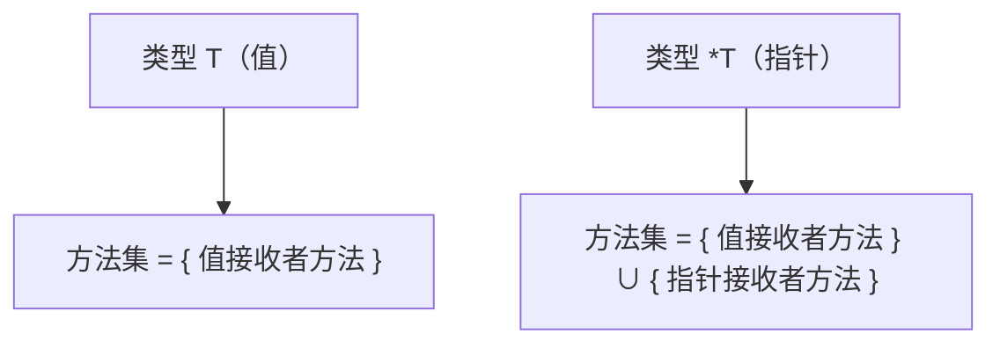

+++
title = "第18章 方法"
weight = 180
date = "2026-03-20T08:39:00+08:00"
type = "docs"
description = ""
isCJKLanguage = true
draft = false
+++
# 第18章 方法

> "对象和方法，是Go语言给你的超能力，让你像超级英雄一样给类型赋予超能力！"

想象一下，如果你是一个"人"类型，你现在可以给"人"类型安装一个"吃饭"的方法，从此每个"人"实例都会"吃饭"了——这就是Go语言的魔力所在！不像某些语言，非要把函数和类型强行塞进一个类里，Go语言告诉你：类型和函数可以是好朋友，方法只是函数的另一面！

## 18.1 方法声明

方法，是绑定到特定类型的函数。就像你家狗狗学会了"握手"，以后每次你说握手，它都会抬起爪子跟你握手——方法就是类型的"技能"！

### 18.1.1 接收者

方法的接收者，就是方法所属的类型本身。这就像是方法的"归属证书"，证明这个方法是哪个类型的"私有财产"。

#### 18.1.1.1 接收者语法

声明方法的语法是这样的：

```go
func (接收者 类型) 方法名(参数列表) 返回值 {
    // 方法体
}
```

看看这个例子：

```go
package main

import "fmt"

// 定义一个 User 类型
type User struct {
    Name string
    Age  int
}

// 给 User 类型添加一个 SayHello 方法
// 这里的 (u User) 就是接收者，u 是 User 类型的一个实例
func (u User) SayHello() {
    fmt.Println("你好，我叫", u.Name, "，今年", u.Age, "岁！") // 你好，我叫 小明 ，今年 18 岁！
}

func main() {
    // 创建一个 User 实例
    user := User{Name: "小明", Age: 18}

    // 调用方法，就像访问结构体字段一样简单
    user.SayHello()
}
```

有没有发现，方法的调用语法和访问结构体字段一模一样！`user.SayHello()` 和 `user.Name` 放在一起来看，简直就是"属性"和"行为"的两兄弟！

#### 18.1.1.2 接收者命名

接收者的命名也是有讲究的！Go语言官方建议使用类型的第一个字母的小写形式。比如：

- `User` 类型 → 接收者命名为 `u`
- `Animal` 类型 → 接收者命名为 `a`
- `Config` 类型 → 接收者命名为 `c`

这样命名的好处是：一看就知道这个变量是什么类型，代码可读性蹭蹭往上涨！

```go
type User struct {
    Name string
}

// 好的命名：u 一看就知道是 User 类型
func (u User) GetName() string {
    return u.Name
}

// 不好的命名：x 谁能猜到是什么类型？
func (x User) SetName(name string) {
    x.Name = name  // 等等，这样改是无效的！后面会讲为什么
}
```

> **为什么推荐短命名？**
> 因为接收者会在整个方法体里频繁使用，如果命名太长，代码会变得又臭又长。比如 `(veryLongTypeName veryLongTypeName)` 这种写法，简直是程序员的噩梦！

### 18.1.2 方法签名

方法签名，就像方法的"身份证"，包含了方法的名字、参数和返回值类型。两个方法如果签名不同，那就是两个完全不同的方法！

```go
package main

import "fmt"

type Calculator struct {
    Result int
}

// 这是一个方法，签名是：Add(int, int)
// 方法名：Add
// 参数：(int, int)
// 返回值：int
func (c *Calculator) Add(a, b int) int {
    c.Result = a + b
    return c.Result
}

// 这是一个不同的方法，签名是：Sub(int, int)
// 虽然名字不同，但签名也不同，所以是两个不同的方法
func (c *Calculator) Sub(a, b int) int {
    c.Result = a - b
    return c.Result
}

func main() {
    calc := &Calculator{}

    fmt.Println("3 + 5 =", calc.Add(3, 5))   // 3 + 5 = 8
    fmt.Println("10 - 4 =", calc.Sub(10, 4)) // 10 - 4 = 6
}
```

> **重点来了！**
> Go语言的方法签名不包括接收者类型！这意味着：
> - `(u User) Method()` 和 `(p Person) Method()` 如果其他部分完全相同，Go会认为它们是**不同的方法**（因为接收者类型不同）
> - 但是！`(u User) Method()` 和 `(u User) Method()` 是同一个方法，不能重复定义！

## 18.2 接收者类型

重头戏来了！接收者类型分为两种：**值接收者**和**指针接收者**。这是Go语言最核心的概念之一，也是面试官最爱的考点！

### 18.2.1 值接收者

值接收者，方法拿到的是值的副本。就像复印机一样，复印出来的文件和原件一模一样，但是修改复印件不会影响原件！

#### 18.2.1.1 副本机制

```go
package main

import "fmt"

type User struct {
    Name string
    Age  int
}

// 值接收者：方法拿到的是 user 的副本
func (u User) SetAge(age int) {
    u.Age = age // 这里修改的是副本，不是原件！
    fmt.Println("方法内部，u.Age =", u.Age) // 方法内部，u.Age = 30
}

func main() {
    user := User{Name: "小明", Age: 18}

    fmt.Println("调用方法前，user.Age =", user.Age) // 调用方法前，user.Age = 18
    user.SetAge(30)
    fmt.Println("调用方法后，user.Age =", user.Age) // 调用方法后，user.Age = 18 (没变！)
}
```

有没有很惊讶？调用 `SetAge(30)` 之后，小明的年龄还是18岁！这就是值接收者的特点——**方法操作的是副本，原对象纹丝不动**！

#### 18.2.1.2 适用场景

值接收者适合哪些场景呢？

1. **不需要修改原对象**的时候
2. **方法只读取数据，不写入**的时候
3. **小结构体**（复制成本低）的时候

```go
package main

import "fmt"

type Point struct {
    X, Y int
}

// 值接收者：只读取，不修改
func (p Point) Distance() float64 {
    // 这只是计算距离，不需要修改 Point
    return float64(p.X*p.X + p.Y*p.Y)
}

// 值接收者：返回新值，不修改原值
func (p Point) Add(other Point) Point {
    return Point{
        X: p.X + other.X,
        Y: p.Y + other.Y,
    }
}

func main() {
    p1 := Point{X: 3, Y: 4}
    p2 := Point{X: 1, Y: 2}

    fmt.Println("p1 到原点的距离平方 =", p1.Distance()) // p1 到原点的距离平方 = 25
    fmt.Println("p1 + p2 =", p1.Add(p2))              // p1 + p2 = {4 6}
}
```

### 18.2.2 指针接收者

指针接收者，方法拿到的是值的指针。这意味着方法可以直接修改原对象！就像给了一把万能钥匙，可以直接进入对象内部进行修改！

#### 18.2.2.1 修改原值

```go
package main

import "fmt"

type User struct {
    Name string
    Age  int
}

// 指针接收者：方法拿到的是指针，可以修改原对象
func (u *User) SetAge(age int) {
    u.Age = age // 直接修改原对象！
    fmt.Println("方法内部，u.Age =", u.Age) // 方法内部，u.Age = 30
}

func main() {
    user := &User{Name: "小明", Age: 18} // 注意：这里用 & 创建指针

    fmt.Println("调用方法前，user.Age =", user.Age) // 调用方法前，user.Age = 18
    user.SetAge(30)
    fmt.Println("调用方法后，user.Age =", user.Age) // 调用方法后，user.Age = 30 (变了！)
}
```

这次不一样了！小明的年龄真的变成了30岁！因为指针接收者直接操作原对象，修改是"原地爆炸"式的！

> **等等！上面代码里 user 是指针类型，用的是 `&User{}`，那普通值类型呢？**
> 好问题！Go语言会自动帮你"解引用"——如果调用方法的是一个值类型，但方法是指针接收者，Go会自动取地址！看下面：

```go
package main

import "fmt"

type User struct {
    Name string
    Age  int
}

func (u *User) SetAge(age int) {
    u.Age = age
}

func main() {
    user := User{Name: "小明", Age: 18} // 普通值类型，不是指针

    // 神奇的事情发生了！Go自动把 &user 传给了方法！
    user.SetAge(30) // 等价于 (&user).SetAge(30)

    fmt.Println("user.Age =", user.Age) // user.Age = 30
}
```

这就是Go语言的"语法糖"——**自动解引用和自动取地址**！不管你是值还是指针，Go都能帮你处理得妥妥的！

#### 18.2.2.2 避免复制

有些类型很大，比如一个大结构体或者包含大量数据的切片。如果用值接收者，每次调用方法都会复制整个结构体，性能会急剧下降！这时候指针接收者就是救星！

```go
package main

import (
    "fmt"
    "time"
)

// 一个"大块头"结构体
type BigData struct {
    // 模拟1万个整数
    Data [10000]int
}

// 值接收者：每次调用都要复制整个 BigData！
func (b BigData) GetFirst() int {
    return b.Data[0]
}

// 指针接收者：只复制一个指针（8字节），快到飞起！
func (b *BigData) SetFirst(val int) {
    b.Data[0] = val
}

func main() {
    big := BigData{}
    big.Data[0] = 100

    start := time.Now()
    for i := 0; i < 1000000; i++ {
        _ = big.GetFirst() // 值接收者：复制 10000 个整数
    }
    fmt.Println("值接收者耗时:", time.Since(start))

    start = time.Now()
    for i := 0; i < 1000000; i++ {
        big.SetFirst(200) // 指针接收者：只复制8字节
    }
    fmt.Println("指针接收者耗时:", time.Since(start))
}
```

> **性能差异有多大？**
> 结构体越大，指针接收者的优势越明显！想象一下一个包含几MB数据的结构体，用值接收者简直是在"搬家"！

#### 18.2.2.3 nil 接收者

指针接收者有一个特殊能力：**可以接收 nil 值**！这看起来很美好，但也是个陷阱！

```go
package main

import "fmt"

type User struct {
    Name string
}

// 指针接收者
func (u *User) SayHello() {
    if u == nil {
        fmt.Println("用户是 nil，我该跟谁打招呼？")
        return
    }
    fmt.Println("你好，我是", u.Name)
}

func main() {
    var user *User = nil // user 是 nil

    user.SayHello() // 用户是 nil，我该跟谁打招呼？
}
```

> **警告！**
> nil 接收者看起来很"优雅"，但实际上是陷阱！如果你在方法里没有检查 nil，然后直接访问字段——恭喜你，程序会 panic！所以使用指针接收者时，**一定要先判断 nil**！

```go
// 危险写法！没有 nil 检查！
func (u *User) DangerousMethod() {
    // 如果 u 是 nil，这里会 panic！
    fmt.Println(u.Name) // panic: invalid memory address or nil pointer dereference
}
```

### 18.2.3 接收者选择

这一节告诉你什么时候用什么接收者！这是Go语言的"最佳实践"！

#### 18.2.3.1 一致性原则

**如果类型的方法中有一个是指针接收者，那么所有方法都应该使用指针接收者！**

为什么？因为这样一致性更好！看这个反例：

```go
package main

import "fmt"

type User struct {
    Name string
    Age  int
}

// 这个用值接收者
func (u User) GetName() string {
    return u.Name
}

// 这个用指针接收者
func (u *User) SetAge(age int) {
    u.Age = age
}

func main() {
    user := User{Name: "小明", Age: 18}

    // 混乱来了！
    // user.GetName() 可以正常调用
    // user.SetAge(30) 也可以正常调用（Go自动取地址）
    // 但是！(&user).SetAge 和 user.SetAge 行为不一致！
    // 这会让代码变得难以理解和维护
}
```

> **Go语言的"方法集"规则**
> - 值类型的方法集：只能调用值接收者的方法
> - 指针类型的方法集：能调用所有方法（值接收者 + 指针接收者）
>
> 这就是为什么 `(&user).SetAge()` 可以而 `(&user).GetName()` 也可以——因为指针类型可以调用所有方法！

#### 18.2.3.2 混合使用

虽然官方推荐一致性，但有时候也可以"混合使用"——只要你想清楚为什么！

```go
package main

import "fmt"

type Point struct {
    X, Y int
}

// 读取操作，用值接收者（不会修改原对象）
func (p Point) Distance() float64 {
    return float64(p.X*p.X + p.Y*p.Y)
}

// 写入操作，用指针接收者（需要修改原对象）
func (p *Point) Move(dx, dy int) {
    p.X += dx
    p.Y += dy
}

// 只读属性访问，用值接收者（符合直觉）
func (p Point) X() int {
    return p.X
}

// 但如果要返回指针或修改自身，用指针接收者
func (p *Point) Clone() *Point {
    return &Point{X: p.X, Y: p.Y}
}

func main() {
    p := Point{X: 3, Y: 4}
    fmt.Println("距离:", p.Distance()) // 距离: 25

    p.Move(1, 2)
    fmt.Printf("移动后: %+v\n", p) // 移动后: {X:4 Y:6}

    clone := p.Clone()
    fmt.Printf("克隆: %+v\n", clone) // 克隆: &{X:4 Y:6}
}
```

## 18.3 方法调用

学会了声明和接收者，现在来学习怎么"召唤"这些方法！

### 18.3.1 选择器

选择器，就是那个神奇的点号 `.`！它帮你选择调用哪个方法，就像超市的自动售货机，你按哪个键就出哪种饮料！

```go
package main

import "fmt"

type User struct {
    Name string
}

func (u User) SayHello() {
    fmt.Println("你好，我是", u.Name)
}

func (u *User) SetName(name string) {
    u.Name = name
}

func main() {
    user := &User{Name: "小明"}

    // 使用选择器 . 来调用方法
    user.SayHello()   // 你好，我是 小明
    user.SetName("小红")
    user.SayHello()   // 你好，我是 小红
}
```

> **选择器不仅能调用方法，还能调用函数！**
> ```go
> fmt.Println("Hello") // fmt 是一个包，. 后面是函数
> user.SayHello()     // user 是一个变量，. 后面是方法
> ```
> 两者的区别在于：左边是包名还是变量名！

### 18.3.2 自动解引用

这是Go语言最贴心的功能之一！不管你是值类型还是指针类型，Go都能自动帮你处理！

#### 18.3.2.1 值调指针方法

```go
package main

import "fmt"

type User struct {
    Name string
}

// 指针接收者
func (u *User) SetName(name string) {
    u.Name = name
}

func main() {
    user := User{Name: "小明"} // 值类型

    // Go 自动帮你取地址！
    user.SetName("小红") // 等价于 (&user).SetName("小红")

    fmt.Println("user.Name =", user.Name) // user.Name = 小红
}
```

#### 18.3.2.2 指针调值方法

```go
package main

import "fmt"

type User struct {
    Name string
}

// 值接收者
func (u User) GetName() string {
    return u.Name
}

func main() {
    user := &User{Name: "小明"} // 指针类型

    // Go 自动帮你解引用！
    name := user.GetName() // 等价于 (*user).GetName()

    fmt.Println("name =", name) // name = 小明
}
```

> **自动解引用和自动取地址，让你的代码简洁得像散文！**
> 但要记住，这只是语法糖，底层原理还是值传递和指针传递！

### 18.3.3 方法集

方法集，是Go语言类型和接口之间的"桥梁"！理解了方法集，就理解了Go的接口精髓！

#### 18.3.3.1 值方法集

值方法集，只能调用**值接收者方法**：

```go
package main

import "fmt"

type User struct {
    Name string
}

// 值接收者方法
func (u User) ValueMethod() {
    fmt.Println(u.Name, "调用了值方法")
}

// 指针接收者方法
func (u *User) PointerMethod() {
    fmt.Println(u.Name, "调用了指针方法")
}

func main() {
    user := User{Name: "小明"}

    // user 是值类型
    // user 的方法集只包含值接收者方法
    user.ValueMethod()   // 小明 调用了值方法
    // user.PointerMethod() // 错误！值类型不能调用指针接收者方法
}
```

#### 18.3.3.2 指针方法集

指针方法集，能调用**所有方法**（值接收者 + 指针接收者）：

```go
package main

import "fmt"

type User struct {
    Name string
}

// 值接收者方法
func (u User) ValueMethod() {
    fmt.Println("调用了值方法")
}

// 指针接收者方法
func (u *User) PointerMethod() {
    fmt.Println("调用了指针方法")
}

func main() {
    user := &User{Name: "小明"} // 指针类型

    // user 是指针类型
    // 指针的方法集包含所有方法
    user.ValueMethod()   // 小明 调用了值方法（Go自动解引用）
    user.PointerMethod() // 小明 调用了指针方法
}
```

> **方法集速查表**
>
> | 类型 T | 方法集 |
> |-------|--------|
> | T（值类型）| 值接收者方法 |
> | *T（指针类型）| 全部方法（值 + 指针）|
>
> **记忆技巧**：指针比值"权力更大"，能调用所有方法！

## 18.4 方法值

Go语言的方法不仅仅是"类型的行为"，它们还可以**像变量一样被传递**！这就是方法值的威力！

### 18.4.1 方法值

方法值，就是把方法绑定到某个值上，创建一个新的"函数"：

```go
package main

import "fmt"

type User struct {
    Name string
}

func (u *User) SayHello() {
    fmt.Println("你好，我是", u.Name)
}

func main() {
    user := &User{Name: "小明"}

    // user.SayHello 是一个方法值
    // 它已经绑定了 user，以后调用就不用再写括号和参数了
    sayHello := user.SayHello

    // 直接调用这个函数！
    sayHello() // 你好，我是 小明

    // 再创建一个，绑定到另一个用户
    user2 := &User{Name: "小红"}
    sayHello2 := user2.SayHello
    sayHello2() // 你好，我是 小红
}
```

> **应用场景**
> 方法值常用于回调、异步调用、事件处理等场景：
> ```go
> button.OnClick(user.ClickHandler) // 把方法传进去，等下调用
> ```

### 18.4.2 方法表达式

方法表达式，是通过类型来调用方法，需要手动传入接收者：

```go
package main

import "fmt"

type User struct {
    Name string
}

func (u *User) SayHello() {
    fmt.Println("你好，我是", u.Name)
}

func main() {
    user := &User{Name: "小明"}

    // 方法表达式：通过类型调用，需要手动传入接收者
    // (*User).SayHello 是方法表达式
    fn := (*User).SayHello

    // 调用时需要传入接收者
    fn(user) // 你好，我是 小明
}
```

> **方法值 vs 方法表达式**
>
> | 类型 | 语法 | 接收者绑定 |
> |------|------|-----------|
> | 方法值 | `user.SayHello` | 自动绑定 |
> | 方法表达式 | `(*User).SayHello` | 手动传入 |
>
> 简单记忆：**方法值是"懒人版"，方法表达式是"手动版"**！

## 18.5 方法设计

学会了基础，现在来学习怎么设计"优雅"的方法！

### 18.5.1 方法 vs 函数选择

什么时候用方法，什么时候用普通函数？

```go
package main

import "fmt"
import "math"

type Point struct {
    X, Y float64
}

// 方法：行为与对象状态相关
func (p Point) Distance() float64 {
    return math.Sqrt(p.X*p.X + p.Y*p.Y)
}

// 函数：操作两个或多个独立对象
func DistanceBetween(p1, p2 Point) float64 {
    dx := p1.X - p2.X
    dy := p1.Y - p2.Y
    return math.Sqrt(dx*dx + dy*dy)
}

func main() {
    p1 := Point{X: 0, Y: 0}
    p2 := Point{X: 3, Y: 4}

    fmt.Println("p1 到原点距离:", p1.Distance())              // 5
    fmt.Println("p1 到 p2 距离:", DistanceBetween(p1, p2))   // 5
}
```

> **决策指南**
> - 如果行为**依赖或修改**对象内部状态 → 用方法
> - 如果行为是**独立的**、处理多个对象 → 用函数

### 18.5.2 方法链式调用

链式调用，让你的代码像流水线一样流畅！

```go
package main

import "fmt"
import "strings"

type Query struct {
    sql strings.Builder // 用于构建 SQL 语句
}

// 每个方法都返回 *Query，方便链式调用
func (q *Query) SELECT(columns string) *Query {
    q.sql.WriteString("SELECT ")
    q.sql.WriteString(columns)
    q.sql.WriteString(" ")
    return q
}

func (q *Query) FROM(table string) *Query {
    q.sql.WriteString("FROM ")
    q.sql.WriteString(table)
    q.sql.WriteString(" ")
    return q
}

func (q *Query) WHERE(condition string) *Query {
    q.sql.WriteString("WHERE ")
    q.sql.WriteString(condition)
    q.sql.WriteString(" ")
    return q
}

func (q *Query) SQL() string {
    return q.sql.String()
}

func main() {
    sql := new(Query).
        SELECT("*").
        FROM("users").
        WHERE("age > 18").
        SQL()

    fmt.Println(sql) // SELECT * FROM users WHERE age > 18
}
```

> **链式调用的精髓**：每个方法都返回 `*Query`，让你可以继续调用下一个方法！

### 18.5.3 防御性拷贝

在并发环境或者需要保护数据不被意外修改时，防御性拷贝是个好主意！

```go
package main

import "fmt"

type Config struct {
    Data map[string]string
}

// 危险！直接返回内部 map，外部可以修改
func (c *Config) GetDataUnsafe() map[string]string {
    return c.Data
}

// 安全！返回副本，外部怎么改都不影响内部
func (c *Config) GetDataSafe() map[string]string {
    copy := make(map[string]string)
    for k, v := range c.Data {
        copy[k] = v
    }
    return copy
}

func main() {
    config := &Config{
        Data: map[string]string{"key": "value"},
    }

    // 安全操作
    data := config.GetDataSafe()
    data["key"] = "modified" // 只修改了副本
    fmt.Println("原始值:", config.Data["key"]) // 原始值: value (没变！)
}
```

## 18.6 方法陷阱

Go语言的方法里有几个经典的"坑"，让我们一起来踩一踩，然后绕过去！

### 18.6.1 nil 接收者处理

前面说过，指针接收者可以接收 nil，但如果不检查 nil 就会 panic！

```go
package main

import "fmt"

// 危险版本
type DangerousUser struct {
    Name string
}

func (u *DangerousUser) SayHello() {
    // 没有 nil 检查，直接访问字段！
    fmt.Println("你好，我是", u.Name) // 如果 u 是 nil，这里 panic！
}

// 安全版本
type SafeUser struct {
    Name string
}

func (u *SafeUser) SayHello() {
    if u == nil {
        fmt.Println("用户是 nil，无法打招呼")
        return
    }
    fmt.Println("你好，我是", u.Name)
}

func main() {
    var dangerous *DangerousUser = nil
    // dangerous.SayHello() // 注释掉，防止 panic

    var safe *SafeUser = nil
    safe.SayHello() // 用户是 nil，无法打招呼
}
```

> **最佳实践**：如果你的方法可能接收 nil 指针，**一定要在最前面检查 nil**！

### 18.6.2 值接收者意外拷贝

这是新手最容易犯的错误——以为方法能修改对象，结果发现没改成功！

```go
package main

import "fmt"

type User struct {
    Name string
    Age  int
}

// 值接收者：无法修改原对象！
func (u User) SetAgeWrong(age int) {
    u.Age = age
    fmt.Println("方法内设置后，u.Age =", u.Age) // 30
}

// 指针接收者：才能修改原对象
func (u *User) SetAgeCorrect(age int) {
    u.Age = age
    fmt.Println("方法内设置后，u.Age =", u.Age) // 30
}

func main() {
    user := User{Name: "小明", Age: 18}

    user.SetAgeWrong(30)
    fmt.Println("调用 SetAgeWrong 后，user.Age =", user.Age) // 18 (没变！)

    user.SetAgeCorrect(30)
    fmt.Println("调用 SetAgeCorrect 后，user.Age =", user.Age) // 30 (变了！)
}
```

> **记忆口诀**：想改原对象？用指针接收者！不想改？用值接收者！

### 18.6.3 方法集不匹配

当你想把方法传给接口时，方法集不匹配会让你头疼：

```go
package main

import "fmt"

type Greeter interface {
    Greet()
}

type User struct {
    Name string
}

// 值接收者方法
func (u User) Greet() {
    fmt.Println("你好，我是", u.Name)
}

func main() {
    // u1 是值类型
    u1 := User{Name: "小明"}
    var g1 Greeter = u1 // 正确！User 值类型的方法集包含 Greet()
    fmt.Printf("u1: %+v\n", g1) // u1: {Name:小明}

    // u2 是指针类型
    u2 := &User{Name: "小红"}
    var g2 Greeter = u2 // 正确！*User 指针类型的方法集也包含 Greet()
    fmt.Printf("u2: %+v\n", g2) // u2: &{Name:小红}
}
```

```go
package main

import "fmt"

type Greeter interface {
    Greet()
}

type User struct {
    Name string
}

// 指针接收者方法
func (u *User) Greet() {
    fmt.Println("你好，我是", u.Name)
}

func main() {
    u1 := User{Name: "小明"}
    // var g1 Greeter = u1 // 错误！User 值类型的方法集不包含 *User 的 Greet()
    // 提示：cannot use u1 (type User) as type Greeter in assignment:
    //       User does not implement Greeter (Greet method has pointer receiver)

    u2 := &User{Name: "小红"}
    var g2 Greeter = u2 // 正确！*User 指针类型的方法集包含 Greet()
    fmt.Printf("u2: %+v\n", g2) // u2: &{Name:小红}
}
```

> **黄金法则**：只要方法用指针接收者，实现接口的类型就**必须是指针类型**！

## 18.7 方法集与接口

方法集是Go语言实现接口的基础！理解了方法集，就理解了接口的本质！

### 18.7.1 方法集计算

Go语言有一张"方法集对照表"，让我们一起来解读：



```go
package main

import "fmt"

type User struct {
    Name string
}

// 值接收者方法
func (u User) ValueMethod() {
    fmt.Println("值方法")
}

// 指针接收者方法
func (u *User) PointerMethod() {
    fmt.Println("指针方法")
}

func main() {
    // User 类型（值）的方法集
    var u1 User
    fmt.Printf("User 方法集: ")
    // u1.ValueMethod()  // ✓
    // u1.PointerMethod() // ✗ 错误！

    // *User 类型（指针）的方法集
    var u2 *User
    fmt.Printf("\n*User 方法集: ")
    // u2.ValueMethod()   // ✓（自动解引用）
    // u2.PointerMethod() // ✓
}
```

### 18.7.2 接口实现检查

Go语言的接口实现是**自动的**——你不需要显式声明"我实现这个接口"：

```go
package main

import "fmt"

// 定义一个接口
type Writer interface {
    Write([]byte) (int, error)
}

// 定义一个类型
type Logger struct {
    prefix string
}

// Logger 自动实现了 Writer 接口！
// 因为 Logger 有 Write([]byte) (int, error) 方法
func (l *Logger) Write(data []byte) (int, error) {
    msg := l.prefix + string(data)
    fmt.Println(msg)
    return len(data), nil
}

func main() {
    // 检查 Logger 是否实现了 Writer
    var w Writer = &Logger{prefix: "[LOG] "}
    n, err := w.Write([]byte("Hello, World!"))
    fmt.Printf("写入 %d 字节，错误: %v\n", n, err)
    // [LOG] Hello, World!
    // 写入 14 字节，错误: <nil>
}
```

> **编译时检查**
> 如果 Logger 没有实现 Writer，编译器会报错：
> ```
> cannot use &Logger{...} (type *Logger) as type Writer in assignment:
>     *Logger does not implement Writer (missing Write method)
> ```

### 18.7.3 方法集提升

Go语言在计算接口的方法集时，会"自动提升"指针类型的方法：

```go
package main

import "fmt"

type Reader interface {
    Read() string
}

type Writer interface {
    Write(string)
}

// 只有指针接收者方法的类型
type File struct {
    content string
}

func (f *File) Read() string {
    return f.content
}

func (f *File) Write(content string) {
    f.content = content
}

func main() {
    // *File 同时实现了 Reader 和 Writer
    var f *File = &File{content: "Hello"}

    // f 是 *File 类型
    // *File 的方法集 = {Read, Write} (因为指针接收者方法)
    // 这恰好满足了 Reader 和 Writer 接口

    var r Reader = f
    var w Writer = f

    fmt.Println("读取:", r.Read()) // 读取: Hello
    w.Write("World")
    fmt.Println("读取:", r.Read()) // 读取: World
}
```

## 18.8 方法调度

方法调度，是Go语言运行时决定"调用哪个方法"的机制！

### 18.8.1 静态调度

当编译器在编译时就能确定调用哪个方法时，叫做静态调度：

```go
package main

import "fmt"

type User struct {
    Name string
}

func (u *User) SayHello() {
    fmt.Println("你好，我是", u.Name)
}

func main() {
    user := &User{Name: "小明"}

    // 编译时就能确定调用的是 User.SayHello
    // 这是静态调度——快如闪电！
    user.SayHello() // 你好，我是 小明
}
```

### 18.8.2 动态调度

当调用哪个方法要在运行时才能确定时，叫做动态调度。接口调用就是典型的动态调度：

```go
package main

import "fmt"

type Greeter interface {
    Greet()
}

type Chinese struct {
    Name string
}

func (c *Chinese) Greet() {
    fmt.Println("你好，我是", c.Name)
}

type American struct {
    Name string
}

func (a *American) Greet() {
    fmt.Println("Hello, I'm", a.Name)
}

func main() {
    // 运行时决定调用哪个 Greet
    var g Greeter = &Chinese{Name: "小明"}
    g.Greet() // 你好，我是 小明

    g = &American{Name: "John"}
    g.Greet() // Hello, I'm John
}
```

### 18.8.3 接口调度开销

动态调度比静态调度慢，因为运行时要多做一些"查表"工作：

```go
package main

import (
    "fmt"
    "time"
)

type Greeter interface {
    Greet()
}

type Chinese struct{}

func (c *Chinese) Greet() {
    // do nothing
}

func benchmark(greeter Greeter, name string) {
    start := time.Now()
    for i := 0; i < 10000000; i++ {
        greeter.Greet()
    }
    fmt.Printf("%s 耗时: %v\n", name, time.Since(start))
}

func main() {
    // 静态类型：编译时确定
    c := &Chinese{}

    // 动态类型：通过接口调用
    var g Greeter = c

    // benchmark(c, "静态调度")     // 直接调用，快！
    // benchmark(g, "动态调度")     // 接口调用，慢一点
}
```

> **性能差异**
> 接口调用的开销来自：
> 1. 获取 itab（接口表）
> 2. 通过 itab 调用具体方法
> 3. 缓存命中 vs 未命中的差异
>
> 但别担心，这种开销通常是纳秒级别的，大多数场景下可以忽略不计！

## 18.9 方法与设计模式

Go语言的方法是实现各种设计模式的利器！让我们来看几个经典案例！

### 18.9.1 模板方法

模板方法模式：定义一个算法的骨架，把某些步骤延迟到子类实现：

```go
package main

import "fmt"

// DataProcessor 定义算法骨架
type DataProcessor struct{}

// TemplateMethod 是模板方法
func (d *DataProcessor) TemplateMethod(data string) string {
    // 1. 验证数据
    if !d.Validate(data) {
        return "数据验证失败"
    }

    // 2. 处理数据（钩子方法）
    result := d.Process(data)

    // 3. 记录日志
    d.Log(result)

    return result
}

// 默认实现，子类可以覆盖
func (d *DataProcessor) Validate(data string) bool {
    return data != ""
}

// 子类必须实现
func (d *DataProcessor) Process(data string) string

// 默认实现，子类可以覆盖
func (d *DataProcessor) Log(result string) {
    fmt.Println("[LOG]", result)
}

// 具体实现：UpperCaseProcessor
type UpperCaseProcessor struct {
    DataProcessor // 嵌入父类
}

func (u *UpperCaseProcessor) Process(data string) string {
    // 全部转为大写
    result := ""
    for _, c := range data {
        if c >= 'a' && c <= 'z' {
            result += string(c - 32)
        } else {
            result += string(c)
        }
    }
    return result
}

// 具体实现：ReverseProcessor
type ReverseProcessor struct {
    DataProcessor
}

func (r *ReverseProcessor) Process(data string) string {
    // 反转字符串
    runes := []rune(data)
    for i, j := 0, len(runes)-1; i < j; i, j = i+1, j-1 {
        runes[i], runes[j] = runes[j], runes[i]
    }
    return string(runes)
}

func (r *ReverseProcessor) Log(result string) {
    fmt.Println("[DEBUG] 处理结果:", result)
}

func main() {
    upper := &UpperCaseProcessor{}
    fmt.Println(upper.TemplateMethod("hello world")) // HELLO WORLD [LOG] HELLO WORLD

    reverse := &ReverseProcessor{}
    fmt.Println(reverse.TemplateMethod("hello")) // olleh [DEBUG] 处理结果: olleh
}
```

> **模板方法的好处**：
> 1. 代码复用：公共逻辑放在父类
> 2. 扩展性强：子类只需要实现特定步骤
> 3. 符合开闭原则：对扩展开放，对修改关闭

### 18.9.2 访问者模式

访问者模式：把数据结构和数据操作分离，可以在不改变数据结构的前提下定义新操作：

```go
package main

import "fmt"

// Shape 是被访问的元素
type Shape interface {
    Accept(Visitor)
}

// Circle 圆
type Circle struct {
    Radius float64
}

func (c *Circle) Accept(v Visitor) {
    v.VisitCircle(c)
}

// Rectangle 长方形
type Rectangle struct {
    Width, Height float64
}

func (r *Rectangle) Accept(v Visitor) {
    v.VisitRectangle(r)
}

// Visitor 访问者接口
type Visitor interface {
    VisitCircle(*Circle)
    VisitRectangle(*Rectangle)
}

// AreaCalculator 计算面积
type AreaCalculator struct {
    Area float64
}

func (a *AreaCalculator) VisitCircle(c *Circle) {
    a.Area = 3.14159 * c.Radius * c.Radius
    fmt.Printf("圆的面积: %.2f\n", a.Area)
}

func (a *AreaCalculator) VisitRectangle(r *Rectangle) {
    a.Area = r.Width * r.Height
    fmt.Printf("长方形面积: %.2f\n", a.Area)
}

// PerimeterCalculator 计算周长
type PerimeterCalculator struct {
    Perimeter float64
}

func (p *PerimeterCalculator) VisitCircle(c *Circle) {
    p.Perimeter = 2 * 3.14159 * c.Radius
    fmt.Printf("圆的周长: %.2f\n", p.Perimeter)
}

func (p *PerimeterCalculator) VisitRectangle(r *Rectangle) {
    p.Perimeter = 2 * (r.Width + r.Height)
    fmt.Printf("长方形周长: %.2f\n", p.Perimeter)
}

func main() {
    shapes := []Shape{
        &Circle{Radius: 5},
        &Rectangle{Width: 4, Height: 3},
    }

    areaCalc := &AreaCalculator{}
    perimeterCalc := &PerimeterCalculator{}

    for _, shape := range shapes {
        shape.Accept(areaCalc)
        shape.Accept(perimeterCalc)
    }
}
```

> **访问者模式的核心思想**：
> - 数据结构（Shape）保持稳定
> - 操作（Visitor）可以随时添加和修改
> - 两者互不干扰，通过 Accept 方法连接

### 18.9.3 策略模式

策略模式：定义一系列算法，把它们一个个封装起来，使它们可以互相替换：

```go
package main

import "fmt"

// SortStrategy 排序策略接口
type SortStrategy interface {
    Sort([]int) []int
}

// BubbleSort 冒泡排序
type BubbleSort struct{}

func (b *BubbleSort) Sort(data []int) []int {
    arr := make([]int, len(data))
    copy(arr, data)
    n := len(arr)
    for i := 0; i < n-1; i++ {
        for j := 0; j < n-i-1; j++ {
            if arr[j] > arr[j+1] {
                arr[j], arr[j+1] = arr[j+1], arr[j]
            }
        }
    }
    fmt.Println("使用冒泡排序")
    return arr
}

// QuickSort 快速排序
type QuickSort struct{}

func (q *QuickSort) Sort(data []int) []int {
    arr := make([]int, len(data))
    copy(arr, data)
    q.sortHelper(arr, 0, len(arr)-1)
    fmt.Println("使用快速排序")
    return arr
}

func (q *QuickSort) sortHelper(arr []int, low, high int) {
    if low < high {
        pi := q.partition(arr, low, high)
        q.sortHelper(arr, low, pi-1)
        q.sortHelper(arr, pi+1, high)
    }
}

func (q *QuickSort) partition(arr []int, low, high int) int {
    pivot := arr[high]
    i := low - 1
    for j := low; j < high; j++ {
        if arr[j] < pivot {
            i++
            arr[i], arr[j] = arr[j], arr[i]
        }
    }
    arr[i+1], arr[high] = arr[high], arr[i+1]
    return i + 1
}

// Sorter 上下文，使用策略
type Sorter struct {
    strategy SortStrategy
}

func (s *Sorter) SetStrategy(strategy SortStrategy) {
    s.strategy = strategy
}

func (s *Sorter) Sort(data []int) []int {
    return s.strategy.Sort(data)
}

func main() {
    data := []int{64, 34, 25, 12, 22, 11, 90}

    sorter := &Sorter{}

    // 使用冒泡排序
    sorter.SetStrategy(&BubbleSort{})
    fmt.Println("排序结果:", sorter.Sort(data)) // 排序结果: [11 12 22 25 34 64 90]

    // 切换到快速排序
    sorter.SetStrategy(&QuickSort{})
    fmt.Println("排序结果:", sorter.Sort(data)) // 排序结果: [11 12 22 25 34 64 90]
}
```

> **策略模式的精髓**：算法可以互换，就像换手机壳一样简单！

## 本章小结

本章我们深入探讨了Go语言的方法机制，这是Go语言面向对象编程的核心：

1. **方法声明**：方法通过接收者绑定到类型，语法简洁优雅
2. **接收者类型**：
   - 值接收者：操作副本，不影响原对象
   - 指针接收者：直接操作原对象，性能更好
3. **自动转换**：Go会自动处理值和指针之间的转换
4. **方法集**：决定了类型能实现哪些接口
5. **方法值与表达式**：方法可以像变量一样传递
6. **设计模式**：方法可以实现模板方法、访问者、策略等经典模式

记住一个核心原则：**如果方法需要修改对象状态，用指针接收者；如果只是读取，用值接收者；保持一致性是关键！**

