+++
title = "第33章 泛型 Generics"
weight = 330
date = "2026-03-20T08:39:00+08:00"
type = "docs"
description = ""
isCJKLanguage = true
draft = false

+++
# 第33章：泛型 Generics

> "泛型，这个名字听起来像是某种神秘的力量，但实际上它是Go语言在1.18版本引入的最重要的特性。有了泛型，你终于可以写一份代码，服务于多种数据类型——就像一个万能厨师，用同一套厨艺做出各种口味的菜！"

在Go语言的世界里，泛型是一个姗姗来迟的"贵客"。从1.0到1.17，Go开发者们一直眼馋其他语言的泛型特性，却只能用空接口（interface{}）和类型断言来"曲线救国"。终于，在Go 1.18，这个革命性的特性正式登场了！

泛型让Go代码变得更加优雅、高效、类型安全。它不是魔法，而是一种让代码"一次编写，多种类型复用"的实用工具。

---

## 33.1 类型参数

泛型的核心就是"类型参数"。想象一下，如果你有一种"模板"，可以根据不同的数据类型自动生成对应的代码，那该多方便！类型参数就是实现这种"模板"的关键。

### 33.1.1 类型形参

**类型形参**——这是泛型函数或泛型类型的"模板参数"，就像建筑图纸上的预留位置，等着正式施工时填入具体材料。

```go
// 泛型函数定义
func PrintSlice[T any](s []T) {
    for _, v := range s {
        fmt.Println(v)
    }
}

//        ↑
//        T 就是类型形参
//        any 是类型约束，表示"可以是任意类型"
```

**类型形参的"身份证解读"**：

```go
func MyFunction[T any](value T) T {
    return value
}
//    ↑     ↑
//    │     └── 返回值也使用类型形参T
//    └── 类型形参T，定义在方括号里
```

**类型形参的"书写位置"**：

```go
// 泛型函数
func FunctionName[T any](param T) { }

// 泛型结构体
type MyStruct[T any] struct {
    Field T
}

// 泛型接口
type MyInterface[T any] interface {
    Method(t T)
}

// 泛型方法（注意：类型形参在方法上）
type MyStruct[T any] struct {
    value T
}

func (m *MyStruct[T]) Get() T {
    return m.value
}
```

**类型形参的命名规范**：

```go
// 常见的类型形参命名：
[T any]        // 单个类型参数，最常用
[K comparable] // K表示键
[V any]        // V表示值
[K, V any]     // 多个类型参数
[T, U any]     // 多种类型

// 自定义命名也可以
[Element any]       // 元素
[Number int | float64]  // 数字
```

**类型形参的"生命周期"**：


**类型形参与普通参数的区别**：

```go
// 普通函数
func DoubleInt(x int) int {
    return x * 2
}

// 泛型函数
func Double[T int | float64](x T) T {
    return x * 2
}

// 普通参数：值在运行时确定
// 类型形参：值在编译时确定
```

**类型形参的"约束"**：

```go
// 约束限制了类型形参可以接受哪些类型
[T any]           // 任意类型
[T comparable]    // 可比较的类型（支持==和!=）
[T int | float64] // int或float64
[T ~int]         // 以int为基础的类型（自定义int别名）
```

**类型形参的"使用示例"**：

```go
package main

import "fmt"

// 定义泛型函数：交换两个值
func Swap[T any](a, b T) (T, T) {
    return b, a
}

func main() {
    // 使用int类型
    x, y := Swap(1, 2)
    fmt.Println(x, y)  // 2 1

    // 使用string类型
    s1, s2 := Swap("hello", "world")
    fmt.Println(s1, s2)  // world hello
}
```

**类型形参的"编译时处理"：

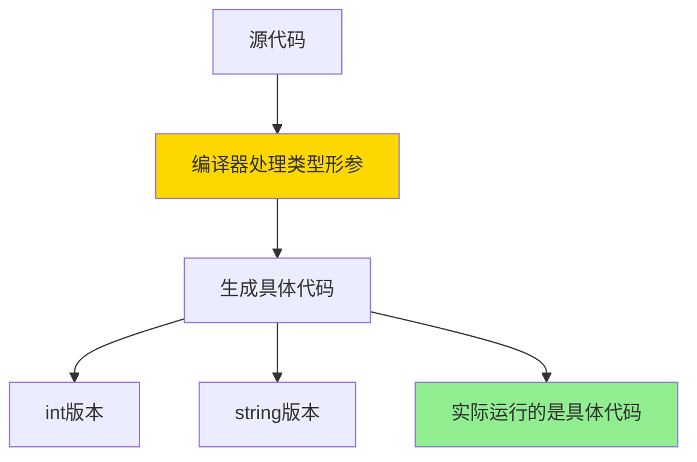

**类型形参的"特点"**：

1. **编译时确定**：类型形参在编译时被具体类型替换
2. **不影响运行时**：泛型代码运行时没有额外开销
3. **类型安全**：编译时就检查类型是否合法
4. **代码复用**：一份代码，多种类型

**小贴士**：类型形参的名字只是习惯约定，你可以叫它T、K、V或者其他任何名字，但为了代码可读性，建议使用有意义的命名。

**下一个小节预告**：33.1.1.1 类型参数列表——泛型的"参数表"长什么样？

---


### 33.1.1.1 类型参数列表

**类型参数列表**——这是泛型定义的"参数表"，用方括号`[]`包裹，告诉你这个泛型可以接受哪些"类型参数"。

```go
// 单个类型参数
[T any]

// 多个类型参数
[K, V any]

// 带约束的类型参数
[T int | string]
[K comparable, V any]
```

**类型参数列表的"标准格式"**：

```go
// 单参数
[Element any]

// 多参数
[Key comparable, Value any]

// 带约束的多参数
[K int | string, V any]
```

**类型参数列表的位置**：

```go
// 泛型函数：类型参数列表在函数名之后
func MyFunc[T any](param T) { }

// 泛型结构体：类型参数列表在类型名之后
type MyStruct[T any] struct { }

// 泛型接口：类型参数列表在接口名之后
type MyInterface[T any] interface { }

// 泛型方法：类型参数列表在方法名之后
func (m *MyStruct[T]) Method[V any](v V) { }
```

**类型参数列表的"逗号与空格"**：

```go
// 可以用逗号分隔
[T, K any]

// 也可以用空格分隔
[T any]
[K any]

// 逗号在多个类型参数时可选
[T, K, V any]  // 等价于 [T any, K any, V any]
```

**类型参数列表与函数参数的区别**：

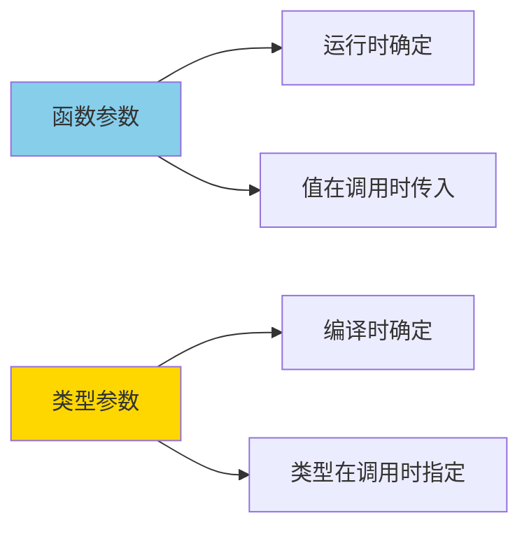

**类型参数列表的"示例代码"**：

```go
package main

import "fmt"

// 单类型参数
func Identity[T any](x T) T {
    return x
}

// 多类型参数
func Pair[K, V any](k K, v V) struct{ K K; V V } {
    return struct{ K K; V V }{K: k, V: v}
}

// 多类型参数，带约束
func AddToMap[K comparable, V any](m map[K]V, k K, v V) {
    m[k] = v
}

func main() {
    // 使用单类型参数
    n := Identity(42)
    s := Identity("hello")
    fmt.Println(n, s)  // 42 hello

    // 使用多类型参数
    p := Pair("name", "Alice")
    fmt.Println(p.K, p.V)  // name Alice
}
```

**类型参数列表的"常见写法"**：

```go
// 标准库常用的类型参数命名：
[T any]         // Type，通用类型
[E any]         // Element，容器元素
[K comparable]  // Key，键
[V any]         // Value，值
[K, V any]     // 键值对
[K, V comparable]  // 可比较的键值对

// 数值计算常用：
[T int | int32 | int64 | float64 | float32]
[N int | int32 | int64 | uint | uint32 | uint64]
```

**类型参数列表的"约束写法"**：

```go
// 单一约束
[T int]           // 只能是int
[T comparable]    // 必须可比较

// 联合约束
[T int | string]  // int或string

// 接口约束
[T interface{ String() string }]

// 简写
[T Stringer]      // 等价于上面
```

**类型参数列表的"方法定义"**：

```go
type Container[T any] struct {
    elements []T
}

// 方法使用容器的类型参数
func (c *Container[T]) Get(i int) T {
    return c.elements[i]
}

// 方法可以引入新的类型参数
func (c *Container[T]) Map[U any](f func(T) U) []U {
    result := make([]U, len(c.elements))
    for i, e := range c.elements {
        result[i] = f(e)
    }
    return result
}
```

**类型参数列表的"嵌套泛型"**：

```go
// 泛型嵌套
type TreeNode[T any] struct {
    value T
    left  *TreeNode[T]
    right *TreeNode[T]
}

// 泛型作为类型参数
type Pair[K, V any] struct {
    Key   K
    Value V
}

type Triple[T any] struct {
    First  T
    Second T
    Third  T
}

// 使用嵌套
type Tree[K comparable, V any] struct {
    root *TreeNode[Pair[K, V]]
}
```

**类型参数列表的"最佳实践"**：

```go
// ✅ 推荐：使用有意义的命名
[K comparable, V any]
[Element any]

// ❌ 不推荐：过于简短
[a any]
[x any]

// ✅ 推荐：约束尽量精确
[T int | float64]
[T comparable]

// ❌ 避免：约束过于宽松
[T any]  // 除非真的需要任意类型
```

**小剧场**：

> 建筑工地：
> 
> 工程师（编译器）："我收到了一份建筑图纸（类型参数列表），上面说要用K和V两种材料（类型参数）。"
> 
> 施工队："K是什么材料？"
> 
> 工程师："K是可以比较的材料（comparable），比如钢筋、混凝土。V是任意材料。让我查查（类型约束）。"
> 
> 施工队："那这个建筑（泛型结构体）既可以用钢筋建造，也可以用混凝土建造？"
> 
> 工程师："没错！这就是泛型的威力——一份图纸，多种材料！"
> 
> 这就是类型参数列表的作用——告诉你这个泛型可以使用哪些"材料"（类型）！

**下一个小节预告**：33.1.1.2 多类型参数——一个不够，那就来两个！

---


### 33.1.1.2 多类型参数

**多类型参数**——当一个类型参数不够用时，泛型允许你定义多个类型参数，让代码更加灵活多变！

```go
// 单类型参数
func Identity[T any](x T) T

// 多类型参数：键值对
func GetOrSet[K comparable, V any](m map[K]V, k K, defaultVal V) V {
    if v, ok := m[k]; ok {
        return v
    }
    return defaultVal
}
```

**多类型参数的"书写格式"**：

```go
// 两个类型参数
[K, V any]

// 三个类型参数
[K, V, T any]

// 带约束的多类型参数
[K comparable, V any]
[T int | float64, U string]
```

**多类型参数的实际应用**：

```go
package main

import "fmt"

// Map类型：键值对
type Map[K comparable, V any] struct {
    data map[K]V
}

func NewMap[K comparable, V any]() *Map[K, V] {
    return &Map[K, V]{data: make(map[K]V)}
}

func (m *Map[K, V]) Set(k K, v V) {
    m.data[k] = v
}

func (m *Map[K, V]) Get(k K) (V, bool) {
    v, ok := m.data[k]
    return v, ok
}

func main() {
    // string作为键，int作为值
    m := NewMap[string, int]()
    m.Set("age", 25)
    m.Set("score", 100)

    age, _ := m.Get("age")
    fmt.Println(age)  // 25
}
```

**多类型参数的"常见模式"**：

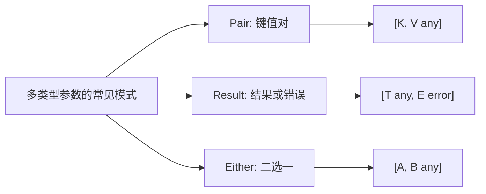

**Pair模式**：

```go
// Pair表示一对数据
type Pair[First any, Second any] struct {
    First  First
    Second Second
}

func NewPair[First any, Second any](f First, s Second) Pair[First, Second] {
    return Pair[First, Second]{First: f, Second: s}
}

// 使用
p := NewPair("hello", 42)
fmt.Println(p.First, p.Second)  // hello 42
```

**Result模式**：

```go
// Result表示操作结果
type Result[T any] struct {
    value T
    err   error
}

func Ok[T any](v T) Result[T] {
    return Result[T]{value: v, err: nil}
}

func Err[T any](e error) Result[T] {
    return Result[T]{value: *new(T), err: e}
}

func (r Result[T]) Value() (T, error) {
    return r.value, r.err
}

// 使用
result := Ok(42)
val, err := result.Value()
```

**Either模式**：

```go
// Either表示A或B两种类型之一
type Either[Left any, Right any] struct {
    isLeft bool
    left   Left
    right  Right
}

func Left[Left any, Right any](l Left) Either[Left, Right] {
    return Either[Left, Right]{isLeft: true, left: l}
}

func Right[Left any, Right any](r Right) Either[Left, Right] {
    return Either[Left, Right]{isLeft: false, right: r}
}

func (e Either[L, R]) IsLeft() bool {
    return e.isLeft
}
```

**多类型参数的"类型推断"**：

```go
// Go可以推断类型参数
func Pair[K, V any](k K, v V) Pair[K, V] {
    return Pair[K, V]{k, v}
}

// 显式指定
p1 := Pair[int, string](1, "one")

// 类型推断（Go会自动推断）
p2 := Pair(1, "one")  // 推断为 Pair[int, string]
```

**多类型参数的"嵌套使用"**：

```go
// 多类型参数可以嵌套
type Tree[K comparable, V any] struct {
    key      K
    value    V
    left     *Tree[K, V]
    right    *Tree[K, V]
}

func NewTree[K comparable, V any](k K, v V) *Tree[K, V] {
    return &Tree[K, V]{key: k, value: v}
}

// 使用
tree := NewTree("root", 0)
tree.left = NewTree("left", 1)
tree.right = NewTree("right", 2)
```

**多类型参数的"约束"**：

```go
// 所有类型参数都可以有独立约束
func ComplexFunction[
    K comparable,      // K必须可比较
    V interface {      // V必须有特定方法
        String() string
    },
    T int | float64    // T是数值类型
](k K, v V, t T) {
    // ...
}
```

**多类型参数的"注意事项"**：

```go
// ⚠️ 类型参数不能有递归限制
// ❌ 错误：
// type Recursive[T interface{ *T }] struct {}

// ⚠️ 类型参数不能同时出现在约束和普通参数中
// ❌ 错误：
// func F[T int](x T, y T int) {}  // 重复
```

**多类型参数的"最佳实践"**：

```go
// ✅ 推荐：类型参数有实际意义
[K comparable, V any]  // K=Key, V=Value
[First any, Second any]

// ❌ 避免：类型参数过多（超过3个可能过于复杂）
[A any, B any, C any, D any, E any]

// ✅ 使用：标准库风格的命名
[K comparable, V any]
[T any]
```

**小剧场**：

> 乐高积木：
> 
> 小明："我想用乐高拼一个机器人！"
> 
> 爸爸："好的，但你需要指定用什么材料（类型参数）。"
> 
> 小明："红色（string）塑料件和蓝色（int）塑料件！"
> 
> 爸爸："没问题！[K, V]=[string, int]！"
> 
> 小明："那我要拼一个汽车！"
> 
> 爸爸："还是用[string, int]！"
> 
> 小明："可是汽车和机器人形状不一样啊！"
> 
> 爸爸："结构不一样，但材料类型组合是一样的。这就是多类型参数的威力——同样的材料类型，可以造出完全不同的东西！"
> 
> 这就是多类型参数的作用——用有限的"材料类型"，创造无限的可能！

**下一个小节预告**：33.1.2 类型实参——把"模板"变成"真实商品"！

---


### 33.1.2 类型实参

**类型实参**——当你调用泛型函数或创建泛型类型实例时，传入的具体类型就是"类型实参"，相当于把"建筑模板"变成"实际建筑"的过程。

```go
// 定义泛型函数：类型形参是T
func Identity[T any](x T) T {
    return x
}

// 调用时传入int作为类型实参
result := Identity[int](42)
//                 ↑
//                 类型实参：int
```

**类型实参的"身份证解读"**：

```go
// 泛型函数调用
Identity[int](42)
//     ↑    ↑
//     │    └── 普通参数
//     └── 类型实参：int

// 泛型类型创建
var stack *Stack[string] = New[string]()
//                  ↑
//                  类型实参：string
```

**类型实参的"两种指定方式"**：

```go
// 方式1：显式指定
result := Identity[int](42)
stack := NewStack[string]()

// 方式2：类型推断（Go自动推断）
result := Identity(42)        // 推断为int
stack := NewStack[string]()  // 必须显式
```

**类型实参的"类型推断"规则**：

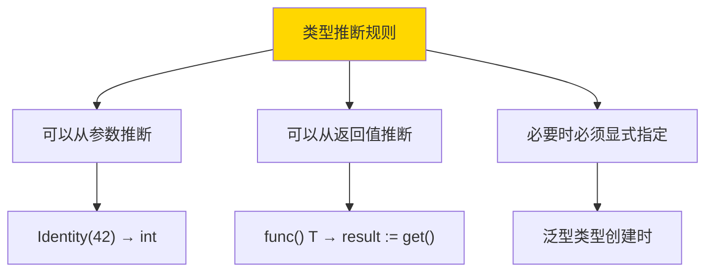

**类型实参的"推断示例"**：

```go
package main

import "fmt"

// 泛型函数
func Max[T comparable](a, b T) T {
    if a > b {
        return a
    }
    return b
}

func main() {
    // 显式指定
    m1 := Max[int](1, 2)

    // 类型推断（Go从参数推断出T=int）
    m2 := Max(1, 2)

    // 类型推断（Go从参数推断出T=string）
    m3 := Max("a", "b")

    fmt.Println(m1, m2, m3)  // 2 2 b
}
```

**类型实参的"泛型类型实例化"**：

```go
// 泛型结构体
type Stack[T any] struct {
    items []T
}

// 泛型方法
func (s *Stack[T]) Push(item T) {
    s.items = append(s.items, item)
}

// 实例化时必须指定类型实参
stack := &Stack[string]{}
stack.Push("hello")
stack.Push("world")
```

**类型实参的"具体类型"要求**：

```go
// 类型实参必须是具体类型
// 不能是接口类型（除非通过类型别名）

// ✅ 正确：具体类型
Stack[int]
Stack[string]
Stack[MyStruct]

// ❌ 错误：不能直接用接口
Stack[interface{}]  // 不推荐，应该用any

// ✅ 正确：用类型别名
type Stringer = interface{ String() string }
Stack[Stringer]  // 实际上很少这样用
```

**类型实参的"嵌套泛型"**：

```go
// 嵌套使用类型实参
type TreeNode[T any] struct {
    value T
    left  *TreeNode[T]
    right *TreeNode[T]
}

// 使用具体类型实例化
node := &TreeNode[int]{
    value: 10,
    left: &TreeNode[int]{value: 5},
    right: &TreeNode[int]{value: 15},
}

// 嵌套泛型
type Pair[K, V any] struct {
    Key   K
    Value V
}

nested := Pair[string, *TreeNode[float64]]{
    Key:   "root",
    Value: &TreeNode[float64]{value: 3.14},
}
```

**类型实参的"方法重载"**：

```go
// 同一个泛型类型，不同类型实参，是不同的类型
type Stack[T any] struct {
    items []T
}

s1 := &Stack[int]{}
s2 := &Stack[string]{}

// s1和s2是不同类型，不能互相赋值
// s1 = s2  // 编译错误
```

**类型实参的"编译器处理"：

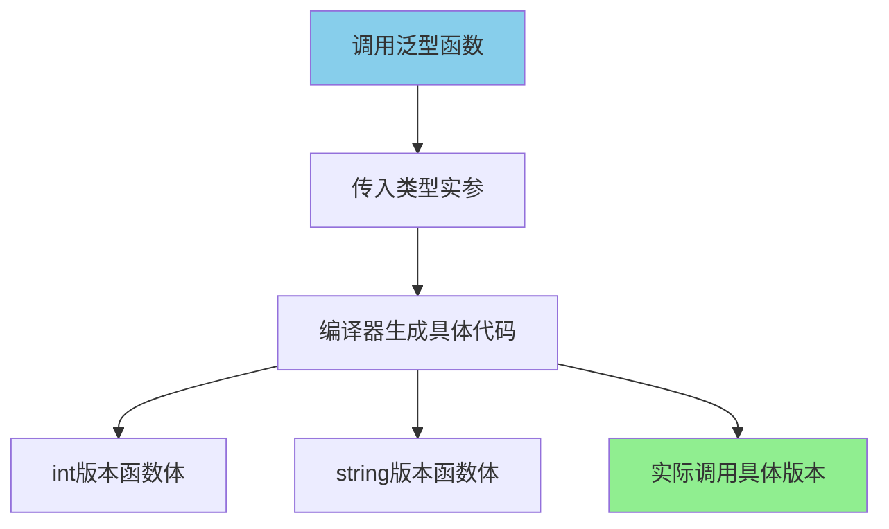

**类型实参的"注意事项"**：

```go
// ⚠️ 每个不同的类型实参组合都会生成一份代码
// ⚠️ 类型实参过多可能导致编译产物变大
// ⚠️ 类型实参必须满足类型约束

// 例如：约束是comparable，但你传入了不可比较的类型
func F[T comparable](a, b T) {}
// F[[]int]{}  // 编译错误！[]int不可比较
```

**类型实参的"最佳实践"**：

```go
// ✅ 推荐：让Go推断类型
numbers := []int{1, 2, 3}
sum := Sum(numbers)  // Go推断T=int

// ✅ 必要时显式指定
var emptyStack = NewStack[string]()  // 必须指定

// ❌ 避免：过于复杂的类型实参
type Complex = map[string]struct{ x, y int }
result := Process[Complex](data)
```

**类型实参的"与模板参数的区别"**：

| 概念 | 类比 |
|------|------|
| 类型形参 | 函数的形式参数 |
| 类型实参 | 函数调用时的实际参数 |
| `[T any]` | 参数列表 |
| `[int]` | 具体传入的值 |

**小剧场**：

> 烤箱和模具的故事：
> 
> 厨师（开发者）："我要做一批饼干！"
> 
> 助手："好的，您用的是什么形状的模具（类型实参）？"
> 
> 厨师："星星模具（string）！"
> 
> 助手开始用星星模具（string）做面团（代码）：
> ```go
> MakeCookies[star]()
> ```
> 
> 厨师："等等，我还想做一批心形的！"
> 
> 助手："没问题，换心形模具（string）！"
> ```go
> MakeCookies[heart]()
> ```
> 
> 厨师："太好了！同样的烤箱（泛型函数），不同的模具（类型实参），做出不同的饼干！"
> 
> 这就是类型实参的作用——把泛型的"模板"变成具体的"产品"！

**下一个小节预告**：33.1.3 类型参数约束——给你的类型参数画个圈！

---


### 33.1.3 类型参数约束

**类型参数约束**——这是给类型参数画的一个"圈"，规定了哪些类型可以进入这个泛型函数或泛型类型。就像游乐场对游客的身高要求——不是所有人都能坐过山车，必须达到一定"高度"才行！

```go
// [T any] - T可以是任意类型，就像任何人都能进公园
func Print[T any](v T) { }

// [T int] - T只能是int，就像只有1.4米以上的人才能坐过山车
func Double[T int](v T) T {
    return v * 2
}
```

**约束的"两种写法"**：

```go
// 写法1：inline约束（直接在方括号里写）
func F[T int | float64](x T) T { }

// 写法2：接口约束（用interface定义）
type Number interface {
    int | int32 | int64 | float32 | float64
}

func F[T Number](x T) T { }
```

**any约束——最宽松的约束**：

```go
// any = interface{}，表示任意类型
func Identity[T any](x T) T {
    return x
}

// 任何类型都可以
Identity(42)      // int
Identity("hello") // string
Identity([]int{1, 2}) // []int
```

**comparable约束——必须能比较**：

```go
// comparable表示可以使用 == 和 != 进行比较
func Equal[T comparable](a, b T) bool {
    return a == b
}

// 可以比较的类型
Equal(1, 2)        // int
Equal("a", "b")    // string

// 不可以比较的类型会报错
// Equal([]int{1}, []int{2})  // 编译错误！slice不可比较
```

**内置约束类型**：

| 约束 | 含义 | 示例 |
|------|------|------|
| `any` | 任意类型 | `T any` |
| `comparable` | 可用==和!=比较 | `T comparable` |
| `int` 系列 | 整数类型 | `T int \| int32` |
| `float` 系列 | 浮点数类型 | `T float32 \| float64` |
| `uint` 系列 | 无符号整数 | `T uint \| uint64` |

**自定义约束**：

```go
// 用interface定义约束
type SignedNumber interface {
    int | int32 | int64 | float32 | float64
}

func Abs[T SignedNumber](v T) T {
    if v < 0 {
        return -v
    }
    return v
}

Abs(-10)   // works: int
Abs(-3.14) // works: float64
// Abs("hello") // 编译错误：string不在约束中
```

**约束的"或"关系**：

```go
// 用 | 表示"或"关系
[T int | string]      // T可以是int或string
[T int | float64]    // T可以是int或float64

// 可以组合多个
[T int8 | int16 | int32 | int64]
```

**约束的"与方法约束"**：

```go
// 约束可以要求类型具有某些方法
type Stringer interface {
    String() string
}

func ToString[T Stringer](v T) string {
    return v.String()
}

// 任何实现了String()方法的类型都满足约束
type Person struct {
    Name string
}

func (p Person) String() string {
    return p.Name
}

p := Person{Name: "Alice"}
fmt.Println(ToString(p))  // Alice
```

**约束的"叠加"**：

```go
// 可以同时有基础类型约束和方法约束
type Addable interface {
    int | int32 | int64 | float32 | float64
}

type Stringable interface {
    String() string
}

func Process[T Addable & Stringable](v T) {
    // T必须同时满足Addable和Stringable
    fmt.Println(v.String())
}
```

**~tilde约束——基于类型**：

```go
// ~T 表示底层类型是T的所有类型
type MyInt int

func Double[T ~int](v T) T {
    return v * 2
}

// MyInt的底层是int，所以可以用
Double(MyInt(5))  // works! 推断为MyInt

// 但不能用于string
// Double("hello")  // 编译错误
```

**约束的"结构"详解**：

```go
// 约束interface可以包含：
type MyConstraint interface {
    int | string              // 并集约束
    ~int                     // 近似约束
    comparable               // 基础约束
    ~float64 & comparable   // 交集约束（实际很少用）
}
```

**常用约束的"简写形式"**：

```go
// 标准库提供的约束
// any = interface{}

// comparable 已内置
// ~int 已支持

// 标准库的constraints包提供常用约束
import "golang.org/x/exp/constraints"

// Ordered: 可排序的类型
func Sort[T constraints.Ordered](values []T) { }

// Integer: 整数类型
// Float: 浮点类型
// Complex: 复数类型
```

**约束的"最佳实践"**：

```go
// ✅ 约束尽量精确
func Sum[T int | float64](values []T) T { }

// ✅ 如果方法约束太复杂，使用自定义类型
type MyConstraint interface {
    int | float64
    comparable
    ~int
}

// ❌ 避免过于宽松的约束
func F[T any](x T) {  // 仅在真正需要any时使用
```

**约束的"编译时检查"：

```go
// 编译时检查类型是否满足约束
func Double[T int | float64](v T) T {
    return v * 2
}

// 编译错误：string不满足约束
// Double("hello")  // 编译错误！
```

**约束的"注意事项"**：

```go
// ⚠️ 约束在编译时检查
// ⚠️ 约束不运行时检查
// ⚠️ 方法约束必须正确签名

// 错误示例
type BadConstraint interface {
    DoSomething(int)  // 编译错误！需要返回值
}
```

**小剧场**：

> 游乐场的故事：
> 
> 游乐场规则（约束）："想坐过山车？身高必须1.4米以上！"
> 
> 小孩（类型）："我9岁了，想坐过山车！"
> 
> 工作人员（编译器）："让我量一下（编译时检查）。嗯，你身高1.3米，不满足约束（约束int | float64），不能坐！"
> 
> 小孩："那我能不能坐旋转木马？"
> 
> 工作人员："旋转木马没有身高限制（约束any），谁都能坐！"
> 
> 这就是类型参数约束的作用——规定哪些类型可以使用这个泛型！

**下一个小节预告**：33.2 类型约束——深入了解约束的本质！

---


## 33.2 类型约束

类型约束是泛型的"灵魂"，它决定了泛型代码能接受什么类型的"输入"，能产生什么类型的"输出"。掌握类型约束，就等于掌握了泛型的精髓。

### 33.2.1 约束接口

**约束接口**——这是一种特殊的接口，它不仅能描述方法要求，还能描述类型要求。它就像是一个"复合型招聘要求"，既要求你会某些技能（方法），又要求你具备某些资质（基础类型）。

```go
// 普通接口：只约束方法
type Reader interface {
    Read(p []byte) (n int, err error)
}

// 约束接口：既约束方法，又约束基础类型
type Number interface {
    int | int32 | int64 | float32 | float64
}
```

**约束接口的"双重身份"**：

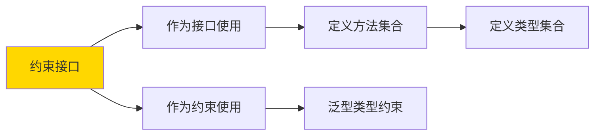

**约束接口的定义**：

```go
// 定义一个约束接口
type SignedInteger interface {
    int | int32 | int64
}

// 在泛型中使用
func Double[T SignedInteger](v T) T {
    return v * 2
}
```

**约束接口的"扩展"**：

```go
// 约束可以继承
type IntOrFloat interface {
    int | int32 | int64 | float32 | float64
}

type Numeric interface {
    IntOrFloat  // 继承IntOrFloat
}

// 或者更复杂
type AdvancedNumeric interface {
    IntOrFloat
    int8 | int16  // 添加更多
}
```

**约束接口的方法约束**：

```go
// 既要求基础类型，又要求方法
type StringableNumber interface {
    int | int32 | int64 | float32 | float64
    String() string
}

func PrintNum[T StringableNumber](n T) {
    fmt.Println(n.String())
}

// 测试
type MyNum int

func (m MyNum) String() string {
    return strconv.Itoa(int(m))
}

PrintNum(MyNum(42))  // works!
```

**约束接口的"空约束"**：

```go
// 空约束 = 任意类型
type anyConstraint interface {
}

func F[T anyConstraint](x T) { }
// 等价于
func F[T any](x T) { }
```

**约束接口的"类型并集"**：

```go
// 用 | 连接多个类型
type IntOrString interface {
    int | string
}

func Process[T IntOrString](v T) {
    fmt.Println(v)
}

Process(42)       // works
Process("hello")   // works
// Process(3.14)   // 编译错误！float64不在约束中
```

**约束接口的"命名惯例"**：

```go
// Go社区的命名惯例：
type (
    SignedInteger interface{ int | int32 | int64 | int8 | int16 }
    UnsignedInteger interface{ uint | uint8 | uint16 | uint32 | uint64 }
    Float interface{ float32 | float64 }
    Integer interface{ SignedInteger | UnsignedInteger }
    Ordered interface{ Integer | Float | ~string }
)
```

**约束接口与普通接口的"区别"**：

| 特性 | 普通接口 | 约束接口 |
|------|---------|---------|
| 用途 | 定义行为 | 约束类型 |
| 方法 | 必须有 | 可选 |
| 类型 | 不能有 | 可以有 |
| 用于泛型 | 间接（通过类型约束） | 直接 |

**约束接口的"简化写法"**：

```go
// 不需要用interface{}关键字
type Constraint[T any] interface {
    ~T
}

// 或者直接写
func F[T interface{ int | string }](x T) { }
```

**约束接口的"方法集"**：

```go
// 约束可以包含方法
type Serialize[T any] interface {
    Serialize() []byte
}

func Save[T Serialize[T]](v T) error {
    data := v.Serialize()
    return os.WriteFile("data.bin", data, 0644)
}
```

**约束接口的"实际应用"**：

```go
package main

import (
    "fmt"
)

// 定义数值类型的约束
type Number interface {
    int | int8 | int16 | int32 | int64 | float32 | float64
}

// 泛型求和函数
func Sum[T Number](values ...T) T {
    var result T
    for _, v := range values {
        result += v
    }
    return result
}

// 泛型最大最小值
func Min[T Number](values ...T) T {
    if len(values) == 0 {
        return *new(T)
    }
    min := values[0]
    for _, v := range values[1:] {
        if v < min {
            min = v
        }
    }
    return min
}

func main() {
    fmt.Println(Sum(1, 2, 3, 4, 5))              // 15
    fmt.Println(Sum(1.1, 2.2, 3.3))              // 6.6
    fmt.Println(Min(5, 3, 8, 1, 9))              // 1
}
```

**约束接口的"最佳实践"**：

```go
// ✅ 约束定义要清晰
type Numeric interface {
    int | int32 | int64 | float32 | float64
}

// ✅ 约束要有实际意义
type ComparableOrdered interface {
    comparable
}

// ✅ 复杂约束单独定义
type MyComplexConstraint interface {
    int | string
    ~int
    comparable
}
```

**小剧场**：

> 招聘会的故事：
> 
> 招聘方（开发者）："我们需要招聘一个能干活的人（泛型函数）！"
> 
> HR（约束接口）："好的，我们的招聘要求是：必须会Java或Python（类型约束），同时要有3年经验（方法约束）！"
> 
> 候选人张三（int类型）："我有10年Java经验！"
> 
> HR（编译器）："满足要求！录用！"
> 
> 候选人李四（float64类型）："我有5年Python经验！"
> 
> HR："满足要求！录用！"
> 
> 候选人王五（bool类型）："我也会Java，但是我没有3年经验（bool不在类型约束中）！"
> 
> HR："不好意思，您的类型不符合我们的要求！"
> 
> 这就是约束接口的作用——既规定了技能（类型），又规定了经验（方法）！

**下一个小节预告**：33.2.2 预定义约束——Go标准库给你的"神器"！

---


### 33.2.2 预定义约束

Go标准库为泛型提供了几个"开箱即用"的预定义约束，让你的泛型代码更加简洁高效！

### 33.2.2.1 any

**any**——这是Go泛型中最"万能"的约束，意味着"可以是任意类型"。就像一张空白支票，你想填什么数字都行！

```go
// any = interface{}
// any是最宽松的约束

func Identity[T any](x T) T {
    return x
}

// 任何类型都可以
Identity(42)           // int
Identity("hello")      // string
Identity([]byte{1,2})  // []byte
Identity(map[string]int{"a": 1})  // map
```

**any的本质**：

```go
// any实际上是空接口的别名
type any = interface{}

// 所以下面的写法等价：
func F1[T any](x T) { }
func F2[T interface{}](x T) { }
```

**any的使用场景**：

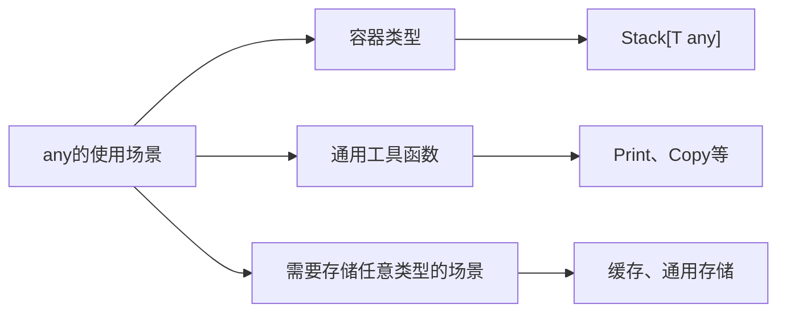

**any的"万能容器"示例**：

```go
// 泛型栈，可以存储任意类型
type Stack[T any] struct {
    items []T
}

func (s *Stack[T]) Push(item T) {
    s.items = append(s.items, item)
}

func (s *Stack[T]) Pop() (T, bool) {
    if len(s.items) == 0 {
        return *new(T), false
    }
    item := s.items[len(s.items)-1]
    s.items = s.items[:len(s.items)-1]
    return item, true
}

func main() {
    intStack := &Stack[int]{}
    intStack.Push(1)
    intStack.Push(2)
    fmt.Println(intStack.Pop())  // 2 true

    strStack := &Stack[string]{}
    strStack.Push("hello")
    strStack.Push("world")
    fmt.Println(strStack.Pop())  // world true
}
```

**any的"类型安全"问题**：

```go
// 虽然any接受任意类型，但Go仍会在编译时检查类型
func PrintAll[T any](items []T) {
    for _, item := range items {
        fmt.Println(item)
    }
}

// 正确用法
PrintAll([]int{1, 2, 3})
PrintAll([]string{"a", "b"})

// 错误用法（类型不匹配）
// PrintAll("hello")  // 编译错误！字符串不是切片
```

**any的"注意事项"**：

```go
// ⚠️ any不提供任何类型保证
// ⚠️ 传入any后，失去了具体类型的特殊能力
// ⚠️ 例如：不能对any类型的值做算术运算

func Double[T any](v T) T {
    return v * 2  // 编译错误！T是any，不知道如何相乘
}

// ✅ 应该用约束
func Double[T int | float64](v T) T {
    return v * 2  // 编译通过
}
```

**any的"最佳使用时机"**：

```go
// ✅ 适合使用any的场景：
// 1. 容器类型，不关心元素的操作
// 2. 只需要打印或复制的函数
// 3. 需要存储和返回任意类型的场景

// ❌ 不适合使用any的场景：
// 1. 需要对值进行类型特定的操作
// 2. 需要保证值的某些能力
```

**any与空接口的历史**：

```go
// Go 1.18之前的写法
var v interface{} = 42

// Go 1.18+的写法
var v any = 42

// 两者等价，但any更简洁
```

**小剧场**：

> 哆啦A梦的口袋：
> 
> 大雄："哆啦A梦，我要一个任意门！"
> 
> 哆啦A梦："没问题！（从口袋里掏出）"
> 
> 大雄："我还要竹蜻蜓！"
> 
> 哆啦A梦："也有！（又掏出一个）"
> 
> 大雄："哇，你这个口袋是any类型的吗？什么都能装！"
> 
> 哆啦A梦："没错！这就是any——最万能的约束，什么类型都能接受！"
> 
> 这就是any约束的作用——一个"万能口袋"，什么都能装！

---


### 33.2.2.2 comparable

**comparable**——这是一个"较真"的约束，它要求类型必须能够用`==`和`!=`进行比较。就像是"只有能分出高下的选手才能参加比赛"！

```go
// comparable约束要求类型可以用 == 和 != 比较
func Equal[T comparable](a, b T) bool {
    return a == b
}

// 可以比较的类型
Equal(1, 2)           // int: false
Equal("a", "a")      // string: true
Equal(1.0, 1.0)      // float64: true

// 不能比较的类型会编译错误
// Equal([]int{1}, []int{2})  // 编译错误！切片不能比较
```

**comparable的本质**：

```go
// comparable是一个预定义的约束
// 表示可以使用 == 和 != 进行比较的类型

// 内置的可比较类型：
// - 整型（int, uint, rune, byte, int8, uint8等）
// - 浮点数（float32, float64）- 注意NaN不相等
// - 字符串（string）
// - 布尔（bool）
// - 指针
// - 通道
// - 接口（当具体类型可比较时）
// - 结构体（当所有字段可比较时）
// - 数组（当元素类型可比较时）

// 不可比较的类型：
// - 切片（[]int）
// - 映射（map[K]V）
// - 函数（func）
```

**comparable的使用场景**：

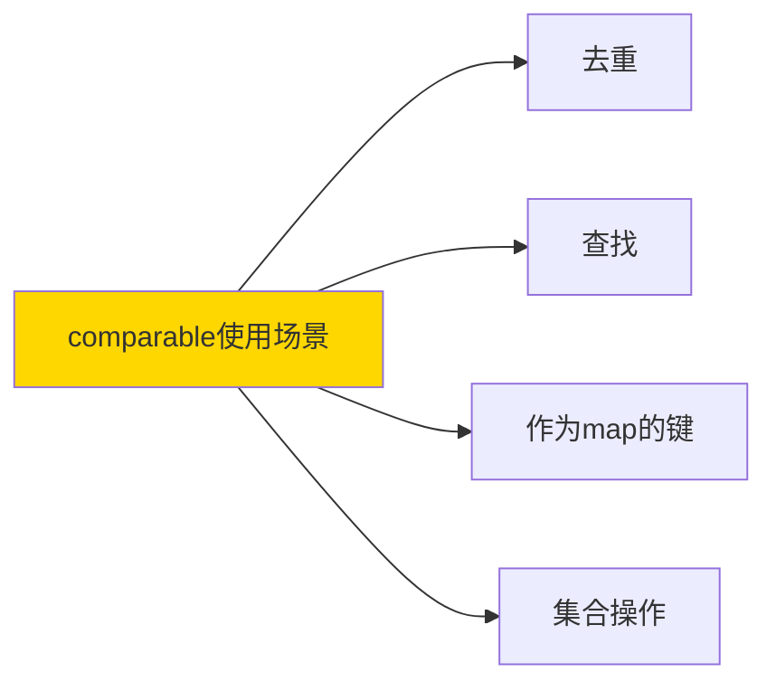

**comparable的"去重函数"示例**：

```go
// 泛型去重函数
func Unique[T comparable](items []T) []T {
    seen := make(map[T]bool)
    result := []T{}
    
    for _, item := range items {
        if !seen[item] {
            seen[item] = true
            result = append(result, item)
        }
    }
    return result
}

func main() {
    nums := []int{1, 2, 2, 3, 3, 3, 4}
    fmt.Println(Unique(nums))  // [1 2 3 4]

    strs := []string{"a", "b", "a", "c", "b"}
    fmt.Println(Unique(strs))  // [a b c]
}
```

**comparable的"查找函数"示例**：

```go
// 泛型查找函数
func Contains[T comparable](items []T, target T) bool {
    for _, item := range items {
        if item == target {
            return true
        }
    }
    return false
}

func IndexOf[T comparable](items []T, target T) int {
    for i, item := range items {
        if item == target {
            return i
        }
    }
    return -1
}

func main() {
    nums := []int{10, 20, 30, 40, 50}
    
    fmt.Println(Contains(nums, 30))    // true
    fmt.Println(Contains(nums, 35))    // false
    fmt.Println(IndexOf(nums, 30))      // 2
    fmt.Println(IndexOf(nums, 35))     // -1
}
```

**comparable的"Set实现"示例**：

```go
// 泛型Set
type Set[T comparable] struct {
    items map[T]struct{}
}

func NewSet[T comparable]() *Set[T] {
    return &Set[T]{items: make(map[T]struct{})}
}

func (s *Set[T]) Add(items ...T) {
    for _, item := range items {
        s.items[item] = struct{}{}
    }
}

func (s *Set[T]) Has(item T) bool {
    _, ok := s.items[item]
    return ok
}

func (s *Set[T]) Remove(item T) {
    delete(s.items, item)
}

func (s *Set[T]) Size() int {
    return len(s.items)
}

func (s *Set[T]) Union(other *Set[T]) *Set[T] {
    result := NewSet[T]()
    for item := range s.items {
        result.Add(item)
    }
    for item := range other.items {
        result.Add(item)
    }
    return result
}

func main() {
    s1 := NewSet[int]()
    s1.Add(1, 2, 3, 4)
    
    s2 := NewSet[int]()
    s2.Add(3, 4, 5, 6)
    
    union := s1.Union(s2)
    fmt.Println(union.Has(1))  // true
    fmt.Println(union.Has(5))  // true
    fmt.Println(union.Size())  // 6
}
```

**comparable与map的键约束**：

```go
// map的键必须是可比较的
// comparable约束确保了这一点

func GroupBy[T comparable, V any](items []T, keyFn func(V) T) map[T][]V {
    groups := make(map[T][]V)
    // ...
    return groups
}
```

**comparable的"注意事项"**：

```go
// ⚠️ 浮点数的NaN值得注意
import "math"

// NaN != NaN 是true！
// 这是浮点数的特性，comparable仍认为float64可比较
func F[T comparable](a, b T) bool {
    return a == b
}

f1 := math.NaN()
f2 := math.NaN()
fmt.Println(F(f1, f2))  // false（符合IEEE754标准）

// ⚠️ 切片和map不可比较
// var m map[T]V  // T不能是[]int
// var s []T      // T不能是map[K]V
```

**comparable的最佳实践**：

```go
// ✅ 使用comparable确保类型可以比较
func Unique[T comparable](items []T) []T

// ✅ comparable用于map键类型
type Cache[T comparable, V any] struct {
    data map[T]V
}

// ❌ 不要对浮点数期望严格的相等
// 浮点数比较最好用误差范围
func roughlyEqual(a, b float64) bool {
    const epsilon = 1e-9
    return math.Abs(a-b) < epsilon
}
```

**comparable与结构体**：

```go
// 结构体也可以是comparable
// 条件：所有字段都是可比较的

type Point struct {
    X, Y int
}

type Person struct {
    Name string
    Age  int
}

func main() {
    p1 := Point{X: 1, Y: 2}
    p2 := Point{X: 1, Y: 2}
    
    fmt.Println(p1 == p2)  // true！结构体可比较
    
    // 但如果结构体包含切片，就不可比较
    // type Bad struct {
    //     X int
    //     Data []int  // 编译错误！切片不可比较
    // }
}
```

**小剧场**：

> 运动会的故事：
> 
> 裁判（comparable约束）："参加跑步比赛的选手，必须能分出快慢（可以用==比较）！"
> 
> 兔子："我跑得快！"
> 
> 裁判："好，你通过审查！"
> 
> 乌龟："我跑得慢...但我能分出谁更快！"
> 
> 裁判："好，你也可以参加！"
> 
> 蜗牛："我背着一堆东西（切片），不知道该怎么比快慢..."
> 
> 裁判："抱歉，背着这些东西（不可比较类型）的选手不能参加！"
> 
> comparable就是这样工作的——只有能"分出高下"的类型才能使用相关的泛型函数！

**下一个小节预告**：33.2.3 类型集——从另一个角度理解约束！

---


### 33.2.3 类型集

**类型集**——约束本质上定义了一个"类型集合"，只有属于这个集合的类型才能作为泛型的实参。联合类型(|)、近似元素(~)和类型枚举都是操作这个集合的工具。

### 33.2.3.1 联合类型 |

**联合类型**——用`|`连接的多个类型，表示"这些类型中的任意一个都行"。就像"招聘要求：会Java或会Python或会Go"。

```go
// int | string 表示 int 或 string 类型
func Process[T int | string](v T) {
    fmt.Println(v)
}

Process(42)      // works
Process("hello") // works
// Process(3.14) // 编译错误！float64不在集合中
```

**联合类型的"或"逻辑**：

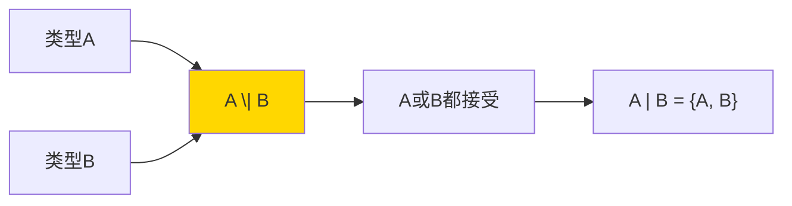

**联合类型的"多选一"**：

```go
// 数值类型的联合
type Number interface {
    int | int8 | int16 | int32 | int64 | float32 | float64
}

// 使用
func Double[T Number](v T) T {
    return v * 2
}

// 字符类型的联合
type CharLike interface {
    string | []byte | rune
}

func Len[T CharLike](v T) int {
    return len(v)
}

Len("hello")        // 5
Len([]byte{'a','b'}) // 2
Len([]rune{'你','好'}) // 2
```

**联合类型的"链式写法"**：

```go
// 多个类型联合
type IntOrFloatOrString interface {
    int | int32 | int64 | float32 | float64 | string
}

// 或者分行写（更清晰）
type Numeric interface {
    int | int32 | int64 | float32 | float64
}

type MoreTypes interface {
    Numeric | string | bool
}
```

**联合类型的"方法约束"**：

```go
// 联合类型 + 方法约束
type Printable interface {
    int | string | float64
    ~string
    String() string  // 要求有String()方法
}

func Print[T Printable](v T) {
    fmt.Println(v.String())
}

type MyInt int

func (m MyInt) String() string {
    return strconv.Itoa(int(m))
}

Print(MyInt(42))  // works!
```

**联合类型的"嵌套"**：

```go
// 联合类型可以嵌套
type A interface { int | string }
type B interface { float64 | bool }
type C interface { A | B }  // int | string | float64 | bool
```

**联合类型的"简化"**：

```go
// 复杂的联合可以简化
type AllInts interface {
    int | int8 | int16 | int32 | int64 |
    uint | uint8 | uint16 | uint32 | uint64
}

// 但Go编译器会自动处理一些简化
```

**联合类型的"实际示例"**：

```go
package main

import "fmt"

// 定义可比较的数值类型
type OrderedNumber interface {
    int | int8 | int16 | int32 | int64 | float32 | float64
}

func Max[T OrderedNumber](values ...T) T {
    if len(values) == 0 {
        return *new(T)
    }
    max := values[0]
    for _, v := range values[1:] {
        if v > max {
            max = v
        }
    }
    return max
}

func Min[T OrderedNumber](values ...T) T {
    if len(values) == 0 {
        return *new(T)
    }
    min := values[0]
    for _, v := range values[1:] {
        if v < min {
            min = v
        }
    }
    return min
}

func main() {
    fmt.Println(Max(1, 5, 3, 9, 2))        // 9
    fmt.Println(Max(1.1, 5.5, 3.3))       // 5.5
    fmt.Println(Min(1, 5, 3, 9, 2))        // 1
}
```

**联合类型的"注意事项"**：

```go
// ⚠️ 联合类型是"或"关系，不是"且"关系
// T int | string 表示：T可以是int或者string

// ⚠️ 联合类型不能有重复
// type Bad interface { int | int }  // 重复，编译错误

// ⚠️ 联合类型的顺序不影响
// int | string 等价于 string | int
```

**小剧场**：

> 点餐系统的故事：
> 
> 服务员（联合类型）："您可以点咖啡、茶或者可乐（int | string | float64）！"
> 
> 顾客A："我要咖啡！"
> 
> 服务员："好的！"
> 
> 顾客B："我要茶！"
> 
> 服务员："好的！"
> 
> 顾客C："我要可乐！"
> 
> 服务员："好的！"
> 
> 顾客D："我要橙汁！"
> 
> 服务员："不好意思，橙汁不在我们的菜单上（float64不在集合中）！"
> 
> 联合类型就是这样工作的——明确列出所有"可以接受"的类型！

---


### 33.2.3.2 近似元素 ~

**近似元素**——用`~`开头的类型表示"以这个类型为基础的所有类型"。就像是"所有以int为底层的自定义类型"都能接受，不管你叫它MyInt还是CustomInt，只要底层是int就行！

```go
// ~int 表示所有以int为底层类型的类型
type MyInt int
type CustomInt int
type AnotherInt int

func Double[T ~int](v T) T {
    return v * 2
}

// MyInt、CustomInt、AnotherInt都可以用
Double(MyInt(5))      // works!
Double(CustomInt(10)) // works!
Double(AnotherInt(15)) // works!
Double(42)            // works! int本身也可以
```

**~的作用原理**：

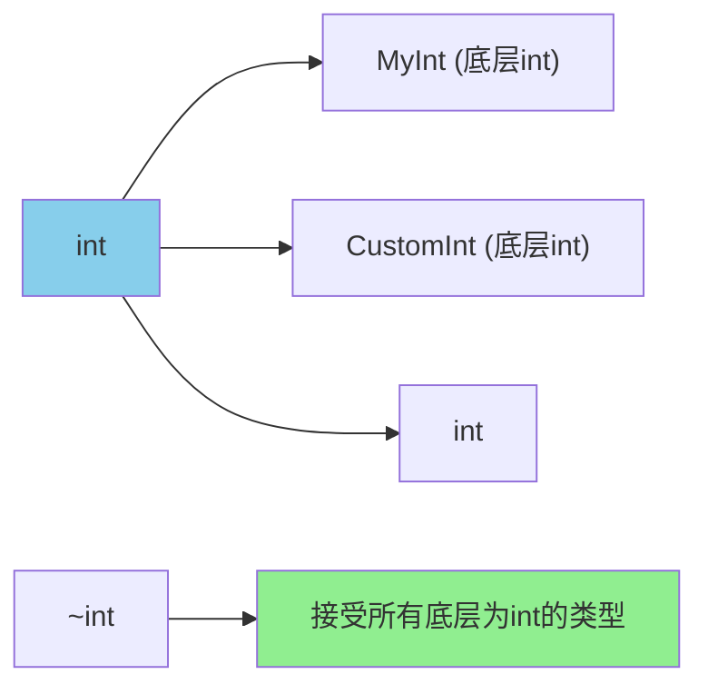

**~的"包容性"示例**：

```go
// 没有~时
type Int int

func DoubleWithoutTilde[T int](v T) T {
    return v * 2
}

// Int(5) 不能用，因为T只接受int
// DoubleWithoutTilde(Int(5))  // 编译错误！

// 使用~后
func DoubleWithTilde[T ~int](v T) T {
    return v * 2
}

// Int(5) 可以用
DoubleWithTilde(Int(5))  // works!
```

**~的"自定义类型保护"**：

```go
// 场景：你想让泛型函数接受所有"int类型"，包括自定义int类型

type UserID int
type OrderID int

// 使用~int，所有底层是int的类型都可以
func HashID[T ~int](id T) int {
    return int(id) * 2654435761 % 1000000
}

uid := UserID(12345)
oid := OrderID(67890)

fmt.Println(HashID(uid))  // works!
fmt.Println(HashID(oid))  // works!
fmt.Println(HashID(12345)) // works!
```

**~与类型约束的结合**：

```go
// ~与|结合使用
type SignedInt interface {
    ~int | ~int8 | ~int16 | ~int32 | ~int64
}

func DoubleSigned[T SignedInt](v T) T {
    return v * 2
}

type MyInt int
type MyFloat float64

DoubleSigned(MyInt(5))   // works!
DoubleSigned(int64(10))  // works!
// DoubleSigned(MyFloat(3.14)) // 编译错误！float64不在~int系列中
```

**~的"不能滥用"原则**：

```go
// ⚠️ ~只能用在类型前面，不能单独使用
// type Bad ~int  // 编译错误！

// ⚠️ ~后面必须是基础类型，不能是接口
// type Bad ~interface{}  // 编译错误！

// ⚠️ ~不能用在非类型标识符上
// func Bad[T ~~int]() {}  // 编译错误！
```

**~的"标准库示例"**：

```go
// Go标准库的constraints包使用了~
type Ordered interface {
    ~int | ~int8 | ~int16 | ~int32 | ~int64 |
    ~uint | ~uint8 | ~uint16 | ~uint32 | ~uint64 | ~uintptr |
    ~float32 | ~float64 |
    ~string
}
```

**~的"实战应用"**：

```go
package main

import (
    "fmt"
)

// 定义一个"可哈希"的约束
// 所有以int或string为底层的类型都满足
type Hashable interface {
    ~int | ~string
}

// 泛型哈希函数
func Hash[T Hashable](v T) int {
    // 简单的哈希实现
    switch any(v).(type) {
    case int:
        return int(v.(type int)) * 31
    case string:
        h := 0
        for _, c := range v.(type string) {
            h = h*31 + int(c)
        }
        return h
    }
    return 0
}

// 自定义ID类型
type UserID int
type OrderID int
type UserName string

func main() {
    uid := UserID(100)
    oid := OrderID(200)
    name := UserName("Alice")

    fmt.Println(Hash(uid))   // works!
    fmt.Println(Hash(oid))   // works!
    fmt.Println(Hash(name))  // works!
    fmt.Println(Hash(123))   // works!
    fmt.Println(Hash("Bob")) // works!
}
```

**~的"注意事项"**：

```go
// ⚠️ ~T 包括 T 本身
// ~int 包括 int、MyInt、CustomInt等所有int底层类型

// ⚠️ ~只能用于用户自定义类型的基础类型
// 内置类型不能使用~
type Bad1 ~int    // 编译错误！~不能用于内置类型
type Bad2 ~string // 编译错误！
```

**小剧场**：

> 家族遗传的故事：
> 
> 家族族谱（类型系统）：
> 
> 老祖宗int有三个后代：
> - MyInt（长孙）
> - CustomInt（二孙）
> - OtherInt（幺孙）
> 
> 招聘要求（~int）："只要是我们int家族的后代，都可以来工作！"
> 
> MyInt："我是int家族的长孙，我来应聘！"
> 
> 招聘官（编译器）："欢迎！"
> 
> CustomInt："我是int家族的二孙，我也来！"
> 
> 招聘官："欢迎！"
> 
> 其他家族的人（float64）："我也能来吗？"
> 
> 招聘官："不好意思，我们只招int家族的后代（~int），您是float家族的人，不在招聘范围内！"
> 
> 这就是~的作用——不仅接受基础类型本身，还接受它的所有"后代"！

---


### 33.2.3.3 类型枚举

**类型枚举**——通过约束接口明确定义"这个泛型只接受这些具体的类型"，就像是一个"只接受特定名单上的人"的邀请函。

```go
// 明确列出所有可接受的类型
type Shape interface {
    Circle | Rectangle | Triangle
}

// 使用
func Area[T Shape](s T) float64 {
    return s.Area()  // 假设所有Shape都有Area()方法
}
```

**类型枚举的"精确控制"**：

```go
// ❌ 不使用枚举：太宽泛
func Process[T any](v T) { }

// ✅ 使用枚举：精确控制
type ValidInput interface {
    int | string | bool | float64
}

func Process[T ValidInput](v T) {
    fmt.Println(v)
}
```

**类型枚举的"受限集合"**：

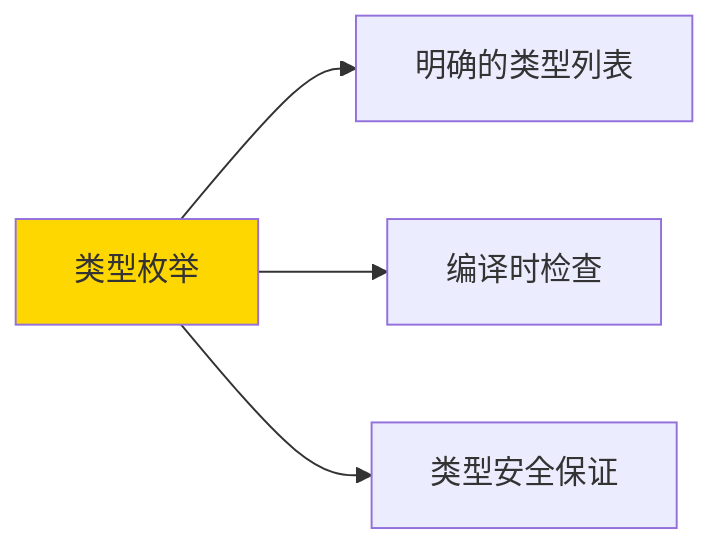

**类型枚举的"实际应用"**：

```go
// 定义有限的类型集合
type HTTPMethod interface {
    GET | POST | PUT | DELETE | PATCH
}

func CallAPI[T HTTPMethod](url string) {
    switch any(*new(T)).(type) {
    case GET:
        fmt.Println("GET", url)
    case POST:
        fmt.Println("POST", url)
    case PUT:
        fmt.Println("PUT", url)
    case DELETE:
        fmt.Println("DELETE", url)
    case PATCH:
        fmt.Println("PATCH", url)
    }
}

// 类型别名
type GET struct{}
type POST struct{}
type PUT struct{}
type DELETE struct{}
type PATCH struct{}

func main() {
    CallAPI[GET]("/users")
    CallAPI[POST]("/users")
}
```

**类型枚举与方法的结合**：

```go
// 类型枚举 + 方法约束
type Operation interface {
    Add | Subtract | Multiply | Divide
    Compute(a, b float64) float64
}

func Calculate[T Operation](a, b float64) float64 {
    var t T
    return t.Compute(a, b)
}

// 定义运算类型
type Add struct{}
func (Add) Compute(a, b float64) float64 { return a + b }

type Subtract struct{}
func (Subtract) Compute(a, b float64) float64 { return a - b }

type Multiply struct{}
func (Multiply) Compute(a, b float64) float64 { return a * b }

type Divide struct{}
func (Divide) Compute(a, b float64) float64 { return a / b }

func main() {
    fmt.Println(Calculate[Add](10, 5))      // 15
    fmt.Println(Calculate[Subtract](10, 5)) // 5
    fmt.Println(Calculate[Multiply](10, 5)) // 50
    fmt.Println(Calculate[Divide](10, 5))   // 2
}
```

**类型枚举的"状态机"应用**：

```go
// 定义状态枚举
type State interface {
    Idle | Running | Paused | Stopped
}

type StateHandler[S State] struct {
    current S
}

func (h *StateHandler[S]) Transition(to S) {
    h.current = to
}

func (h *StateHandler[S]) GetState() S {
    return h.current
}

// 定义状态
type Idle struct{}
type Running struct{}
type Paused struct{}
type Stopped struct{}

func main() {
    handler := &StateHandler[Idle]{}
    fmt.Printf("Current state: %T\n", handler.GetState()) // Idle

    handler.Transition(Running{})
    fmt.Printf("Current state: %T\n", handler.GetState()) // Running
}
```

**类型枚举的"注意事项"**：

```go
// ⚠️ 类型枚举是"穷举式"的
// ⚠️ 适合类型数量有限的场景

// ⚠️ 不适合类型数量无限或未知的场景
// ⚠️ 这时应该用更通用的约束
```

**类型枚举的最佳实践**：

```go
// ✅ 类型枚举适合的场景：
// 1. 有限数量的类型
// 2. 需要穷举所有可能的类型
// 3. 编译时需要类型安全

// ❌ 不适合的场景：
// 1. 无限数量的类型
// 2. 需要动态添加新类型
```

**类型枚举与联合类型的区别**：

| 特性 | 类型枚举 | 联合类型 |
|------|---------|---------|
| 定义方式 | 命名类型 | 匿名类型 |
| 使用场景 | 有限类型 | 无限类型 |
| 类型安全 | 强 | 弱 |
| 可扩展性 | 差 | 好 |

**小剧场**：

> 餐厅点餐的故事：
> 
> 餐厅（泛型函数）："我们今天只提供四种套餐（类型枚举）："
> 
> 套餐列表（State接口）：
> - 套餐A（GET）
> - 套餐B（POST）
> - 套餐C（PUT）
> - 套餐D（DELETE）
> 
> 顾客："我要套餐A！"
> 
> 餐厅："好的，马上为您准备！"
> 
> 顾客："我要套餐E！"
> 
> 餐厅："不好意思，我们没有套餐E！只有A、B、C、D四种套餐可选！"
> 
> 类型枚举就是这样工作的——明确告诉你"只能选这些"，不在列表上的一律拒绝！

**下一个小节预告**：33.3 泛型类型——让数据结构更加灵活！

---


## 33.3 泛型类型

泛型类型是Go 1.18引入的一种强大特性，它让你可以定义一种"模板类型"，然后用具体的类型来实例化出"真实类型"。就像建筑图纸和实际建筑的关系——图纸是泛型类型，盖出来的房子是具体类型。

### 33.3.1 泛型结构体

**泛型结构体**——一种带有类型参数的结构体模板，让同一结构体定义可以服务于多种数据类型。

```go
// 定义泛型结构体
type Box[T any] struct {
    content T
}

// 用具体类型实例化
intBox := Box[int]{content: 42}
strBox := Box[string]{content: "hello"}

// 访问内容
fmt.Println(intBox.content) // 42
fmt.Println(strBox.content) // hello
```

**泛型结构体的"模板定义"**：

```go
// 单类型参数的泛型结构体
type Stack[T any] struct {
    items []T
    top  int
}

func (s *Stack[T]) Push(item T) {
    s.items = append(s.items, item)
    s.top++
}

func (s *Stack[T]) Pop() (T, bool) {
    if s.top == 0 {
        return *new(T), false
    }
    s.top--
    item := s.items[s.top]
    s.items = s.items[:s.top]
    return item, true
}
```

**泛型结构体的"实例化"**：

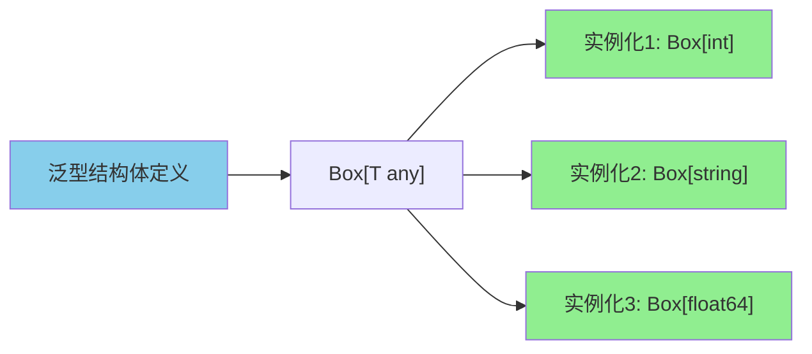

**泛型结构体的"多类型参数"**：

```go
// 两个类型参数的泛型结构体
type Pair[K, V any] struct {
    Key   K
    Value V
}

// 实例化
p1 := Pair[string, int]{Key: "age", Value: 25}
p2 := Pair[int, string]{Key: 1, Value: "one"}

// 嵌套使用
type TreeNode[T any] struct {
    value T
    left  *TreeNode[T]
    right *TreeNode[T]
}
```

**泛型结构体的"方法定义"**：

```go
// 泛型结构体
type Container[T any] struct {
    elements []T
}

// 泛型方法：类型参数在结构体上
func (c *Container[T]) Add(e T) {
    c.elements = append(c.elements, e)
}

func (c *Container[T]) Get(index int) T {
    return c.elements[index]
}

func (c *Container[T]) Size() int {
    return len(c.elements)
}

// 泛型方法：引入新的类型参数
func (c *Container[T]) Map[U any](f func(T) U) []U {
    result := make([]U, len(c.elements))
    for i, e := range c.elements {
        result[i] = f(e)
    }
    return result
}
```

**泛型结构体的"完整示例"**：

```go
package main

import "fmt"

// 泛型链表节点
type ListNode[T any] struct {
    value T
    next  *ListNode[T]
}

// 泛型链表
type LinkedList[T any] struct {
    head *ListNode[T]
    size int
}

// 创建新链表
func NewLinkedList[T any]() *LinkedList[T] {
    return &LinkedList[T]{}
}

// 添加元素
func (l *LinkedList[T]) Append(value T) {
    node := &ListNode[T]{value: value}
    
    if l.head == nil {
        l.head = node
    } else {
        current := l.head
        for current.next != nil {
            current = current.next
        }
        current.next = node
    }
    l.size++
}

// 获取元素
func (l *LinkedList[T]) Get(index int) (T, bool) {
    if index < 0 || index >= l.size {
        return *new(T), false
    }
    
    current := l.head
    for i := 0; i < index; i++ {
        current = current.next
    }
    return current.value, true
}

// 链表长度
func (l *LinkedList[T]) Size() int {
    return l.size
}

func main() {
    list := NewLinkedList[int]()
    list.Append(1)
    list.Append(2)
    list.Append(3)
    
    fmt.Println("Size:", list.Size()) // 3
    
    for i := 0; i < list.Size(); i++ {
        if v, ok := list.Get(i); ok {
            fmt.Printf("Element %d: %d\n", i, v)
        }
    }
}
```

**泛型结构体的"嵌套泛型"**：

```go
// 泛型结构体可以嵌套
type Tree[T any] struct {
    value T
    left  *Tree[T]
    right *Tree[T]
}

// 泛型结构体作为字段类型
type Result[T any] struct {
    Data  T
    Error error
}

type Response[T any] struct {
    Results []Result[T]
    Total   int
}
```

**泛型结构体的"构造函数"**：

```go
// 泛型构造函数
type Config[T any] struct {
    value   T
    loaded  bool
}

// 构造函数
func NewConfig[T any](v T) *Config[T] {
    return &Config[T]{
        value:  v,
        loaded: true,
    }
}

// 带约束的泛型结构体
type ComparableBox[T comparable] struct {
    content T
}

func main() {
    // 使用构造函数
    cfg := NewConfig[string]("initial")
    fmt.Println(cfg.value) // initial
}
```

**泛型结构体的"注意事项"**：

```go
// ⚠️ 泛型结构体不支持递归类型别名
// type Bad[T any] = struct{ Value T }

// ⚠️ 泛型结构体的方法不能有泛型接收器之外的额外类型参数
// func (b Box[T]) Method[U any](x U) {}  // 编译错误！
```

**泛型结构体的"最佳实践"**：

```go
// ✅ 推荐：类型参数有实际意义
type Pair[K, V any] struct { K, V }
type Stack[T any] struct { items []T }

// ❌ 避免：类型参数过多
type TooMany[T, K, V, U, X any] struct{}  // 不推荐超过3个

// ✅ 使用：标准库风格命名
[K comparable, V any]
[Element any]
```

**小剧场**：

> 3D打印机的故事：
> 
> 设计师（开发者）："我设计了一个万能盒子模具（泛型结构体），可以打印任何材料的盒子！"
> 
> 客户A："我要一个塑料盒子！"
> 
> 设计师："没问题！用塑料（int? 不对，用具体材料）作为类型参数，打印！"
> ```go
> Box[Plastic]{content: myPlastic}
> ```
> 
> 客户B："我要一个金属盒子！"
> 
> 设计师："没问题！用金属作为类型参数，打印！"
> ```go
> Box[Metal]{content: myMetal}
> ```
> 
> 客户C："我要一个...思想盒子？"
> 
> 设计师："没问题！用interface{}...不对，用any作为类型参数，打印！"
> ```go
> Box[any]{content: myIdea}
> ```
> 
> 客户："哇！这个模具太万能了！"
> 
> 设计师："这就是泛型结构体的威力——一份设计，多种材料！"

---


### 33.3.2 泛型接口

**泛型接口**——带有类型参数的接口，让接口定义也能复用！这是Go泛型中最"高级"的特性之一。

```go
// 泛型接口定义
type Container[T any] interface {
    Add(T)
    Get(int) T
    Size() int
}
```

**泛型接口的"类型参数位置"**：

```go
// 类型参数在接口名后面
type Adder[T any] interface {
    Add(T) T
}

type Comparer[T comparable] interface {
    Compare(T, T) int
}
```

**泛型接口与泛型结构体的"配合"**：

```go
// 泛型接口
type Iterator[T any] interface {
    Next() (T, bool)
    Reset()
}

// 泛型结构体实现泛型接口
type SliceIterator[T any] struct {
    slice []T
    index int
}

func (s *SliceIterator[T]) Next() (T, bool) {
    if s.index >= len(s.slice) {
        return *new(T), false
    }
    val := s.slice[s.index]
    s.index++
    return val, true
}

func (s *SliceIterator[T]) Reset() {
    s.index = 0
}

// 使用
func Iterate[T any](iter Iterator[T]) {
    for {
        val, ok := iter.Next()
        if !ok {
            break
        }
        fmt.Println(val)
    }
}
```

**泛型接口的"方法约束"**：

```go
// 泛型接口 + 方法约束
type Printable[T any] interface {
    Print()
    ~int | ~string | ~float64
}

func PrintAll[T Printable[T]](items []T) {
    for _, item := range items {
        item.Print()
    }
}
```

**泛型接口的"嵌套使用"**：

```go
// 泛型接口可以嵌套
type ReadWrite[T any] interface {
    Read(T) error
    Write(T) error
}

type Closeable[T any] interface {
    Close() error
}

type ReadWriteCloser[T any] interface {
    ReadWrite[T]
    Closeable[T]
}
```

**泛型接口的"函数式风格"**：

```go
// 泛型Map函数接口
type Mapper[T, U any] interface {
    Map(T) U
}

// 泛型Filter函数接口
type Predicate[T any] interface {
    Test(T) bool
}

// 使用
func MapFilter[T, U any](items []T, mapper Mapper[T, U], pred Predicate[U]) []U {
    result := []U{}
    for _, item := range items {
        mapped := mapper.Map(item)
        if pred.Test(mapped) {
            result = append(result, mapped)
        }
    }
    return result
}
```

**泛型接口的"实际应用"**：

```go
package main

import "fmt"

// 泛型比较器接口
type Comparator[T any] interface {
    Less(T) bool
}

// 泛型排序器实现
type Sorter[T any] struct {
    items []T
    cmp   func(T, T) bool
}

func NewSorter[T any](items []T, cmp func(T, T) bool) *Sorter[T] {
    return &Sorter[T]{items: items, cmp: cmp}
}

func (s *Sorter[T]) Sort() {
    for i := 0; i < len(s.items)-1; i++ {
        for j := i + 1; j < len(s.items); j++ {
            if s.cmp(s.items[j], s.items[i]) {
                s.items[i], s.items[j] = s.items[j], s.items[i]
            }
        }
    }
}

func (s *Sorter[T]) Get() []T {
    return s.items
}

func main() {
    // 对整数排序
    intSorter := NewSorter([]int{5, 2, 8, 1, 9}, func(a, b int) bool {
        return a < b
    })
    intSorter.Sort()
    fmt.Println("Ints:", intSorter.Get()) // [1 2 5 8 9]

    // 对字符串排序
    strSorter := NewSorter([]string{"banana", "apple", "cherry"}, func(a, b string) bool {
        return a < b
    })
    strSorter.Sort()
    fmt.Println("Strings:", strSorter.Get()) // [apple banana cherry]
}
```

**泛型接口的"约束作用"**：

```go
// 泛型接口作为约束
type NumberArithmetic[T any] interface {
    ~int | ~int8 | ~int16 | ~int32 | ~int64 | ~float32 | ~float64
    Add(T) T
    Subtract(T) T
    Multiply(T) T
}

func Sum[T NumberArithmetic[T]](values ...T) T {
    var result T
    for _, v := range values {
        result = result.Add(v)
    }
    return result
}
```

**泛型接口的"注意事项"**：

```go
// ⚠️ 泛型接口不能实现自身
// type Bad[T any] interface {
//     Bad[T]  // 编译错误！递归
// }

// ⚠️ 泛型接口的方法不能有额外的类型参数
// type Bad[T any] interface {
//     Method[T any](T)  // 编译错误！
// }
```

**泛型接口的"最佳实践"**：

```go
// ✅ 泛型接口适合用于：
// 1. 定义通用的算法接口
// 2. 定义容器接口
// 3. 定义函数式接口

// ❌ 避免过度使用泛型接口
// 简单的场景用普通接口+泛型函数更清晰
```

**小剧场**：

> 乐高接口的故事：
> 
> 乐高设计师（开发者）："我设计了一个'万能接口'，只要遵守这个接口的规则，任何乐高零件都可以插进来！"
> 
> 接口定义：
> ```go
> type Connector[T any] interface {
>     Connect(T)
>     Disconnect(T) bool
> }
> ```
> 
> 正方形零件（int）："我会Connect和Disconnect！"
> 
> 设计师："好，你可以插入！"
> 
> 圆形零件（string）："我也会！"
> 
> 设计师："好，你也可以插入！"
> 
> 三角形零件（float64）："我也会Connect和Disconnect！"
> 
> 设计师："好！你也是合格的Connector！"
> 
> 这就是泛型接口的作用——定义一个"标准"，只要符合标准，任何类型都可以使用！

**下一个小节预告**：33.4 泛型函数——让函数更加通用！

---


## 33.4 泛型函数

泛型函数是Go泛型的核心，它让函数可以处理多种数据类型，而不需要为每种类型写一个重复的函数。

### 33.4.1 泛型函数声明

**泛型函数声明**——在函数名后面加上一对`[]`，里面放类型参数，就构成了泛型函数。

```go
// 普通函数
func DoubleInt(x int) int {
    return x * 2
}

// 泛型函数
func Double[T int | float64](x T) T {
    return x * 2
}

// 调用
result1 := Double(5)    // Go推断T=int
result2 := Double(3.14) // Go推断T=float64
```

**泛型函数的"标准格式"**：

```go
// 单类型参数
func Identity[T any](x T) T {
    return x
}

// 多类型参数
func MakePair[K, V any](k K, v V) struct{ K K; V V } {
    return struct{ K K; V V }{k, v}
}

// 带约束的类型参数
func Max[T int | string](a, b T) T {
    if a > b {
        return a
    }
    return b
}
```

**泛型函数的"调用方式"**：

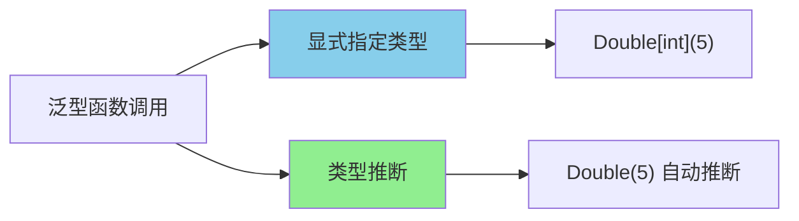

**泛型函数的"显式指定"**：

```go
// 显式指定类型实参
result := Double[int](5)       // result是int类型
strResult := Max[string]("a", "b")  // strResult是string类型

// 当类型推断无法工作时，必须显式指定
var s []string
// Copy(s, "hello")  // 无法推断
Copy[string](s, "hello")  // 显式指定
```

**泛型函数的"类型推断"**：

```go
// Go根据参数推断类型
func Print[T any](value T) {
    fmt.Println(value)
}

Print(42)       // T推断为int
Print("hello")  // T推断为string
Print(3.14)     // T推断为float64
```

**泛型函数的"多参数推断"**：

```go
// 多参数函数
func Min[T int | float64](a, b T) T {
    if a < b {
        return a
    }
    return b
}

Min(1, 2)       // T推断为int
Min(1.5, 2.5)   // T推断为float64
```

**泛型函数的"返回值类型推断"**：

```go
// 只有返回值时，无法推断参数类型
func Zero[T any]() T {
    return *new(T)
}

// 必须显式指定
var n int = Zero[int]()
var s string = Zero[string]()
```

**泛型函数的"实际示例"**：

```go
package main

import "fmt"

// 交换函数
func Swap[T any](a, b T) (T, T) {
    return b, a
}

// 去重函数
func Unique[T comparable](items []T) []T {
    seen := make(map[T]bool)
    result := []T{}
    for _, item := range items {
        if !seen[item] {
            seen[item] = true
            result = append(result, item)
        }
    }
    return result
}

// 过滤函数
func Filter[T any](items []T, predicate func(T) bool) []T {
    result := []T{}
    for _, item := range items {
        if predicate(item) {
            result = append(result, item)
        }
    }
    return result
}

// Map函数
func Map[T, U any](items []T, transform func(T) U) []U {
    result := make([]U, len(items))
    for i, item := range items {
        result[i] = transform(item)
    }
    return result
}

func main() {
    // Swap
    a, b := Swap(1, 2)
    fmt.Println(a, b) // 2 1

    // Unique
    nums := []int{1, 2, 2, 3, 3, 3}
    fmt.Println(Unique(nums)) // [1 2 3]

    // Filter
    nums = []int{1, 2, 3, 4, 5, 6}
    evens := Filter(nums, func(n int) bool {
        return n%2 == 0
    })
    fmt.Println(evens) // [2 4 6]

    // Map
    strs := []int{1, 2, 3}
    doubled := Map(strs, func(n int) int {
        return n * 2
    })
    fmt.Println(doubled) // [2 4 6]
}
```

**泛型函数的"约束使用"**：

```go
// 使用接口约束
type Stringer interface {
    String() string
}

func ToStrings[T Stringer](items []T) []string {
    result := make([]string, len(items))
    for i, item := range items {
        result[i] = item.String()
    }
    return result
}

type Person struct {
    Name string
}

func (p Person) String() string {
    return p.Name
}

func main() {
    people := []Person{{Name: "Alice"}, {Name: "Bob"}}
    names := ToStrings(people)
    fmt.Println(names) // [Alice Bob]
}
```

**泛型函数的"注意事项"**：

```go
// ⚠️ 泛型函数不能有同名非泛型函数（会冲突）
func F[T any](x T) {}
func F(x int) {}  // 编译错误！重复定义

// ⚠️ 泛型函数的类型推断有时会失败
// 需要显式指定类型
```

**泛型函数的"最佳实践"**：

```go
// ✅ 推荐：约束尽量精确
func Sum[T int | float64](values []T) T

// ✅ 推荐：类型推断优先
// 简单场景让Go推断，不需要显式指定

// ❌ 避免：过宽的约束
func F[T any](x T)  // 只在真正需要any时使用
```

**小剧场**：

> 全能厨师的故事：
> 
> 老板："我们需要一位能做任何菜的厨师！"
> 
> 普通厨师A："我只会做川菜！"
> 
> 普通厨师B："我只会做粤菜！"
> 
> 泛型厨师（泛型函数）："我什么菜都能做！只要告诉我用什么食材（类型参数），我就能做！"
> 
> 老板："太好了！来做个宫保鸡丁！"
> 
> 泛型厨师："没问题！（T=宫保鸡丁）"
> 
> 老板："再来个麻婆豆腐！"
> 
> 泛型厨师："没问题！（T=麻婆豆腐）"
> 
> 老板："太棒了！一位厨师（泛型函数），做出各种菜（不同类型）！"
> 
> 这就是泛型函数的威力——一份代码，多种数据类型通用！

---


### 33.4.2 泛型方法

**泛型方法**——在泛型类型的方法上也可以使用类型参数，让方法更加灵活！

```go
// 泛型结构体
type Container[T any] struct {
    items []T
}

// 泛型方法
func (c *Container[T]) Map[U any](f func(T) U) []U {
    result := make([]U, len(c.items))
    for i, item := range c.items {
        result[i] = f(item)
    }
    return result
}
```

**泛型方法的"类型参数位置"**：

```go
// 方法的类型参数在方法名之后
func (c *Container[T]) Process[U any](transform func(T) U) []U {
    // ...
}

//        ↑
//        方法名
//        ↓
// Container[T]
//        ↑
//        结构体的类型参数
```

**泛型方法与普通方法的"区别"**：

| 特性 | 普通方法 | 泛型方法 |
|------|---------|---------|
| 接收器类型 | 具体类型 | 泛型类型 |
| 方法类型参数 | 无 | 可以在方法上新增 |
| 调用方式 | 普通调用 | 可能需要显式指定 |

**泛型方法的"多类型参数"**：

```go
// 结构体两个类型参数，方法可以新增或使用它们
type Pair[K, V any] struct {
    Key   K
    Value V
}

// 方法1：使用结构体的类型参数
func (p *Pair[K, V]) Swap() {
    p.Key, p.Value = p.Value, p.Key
}

// 方法2：引入新的类型参数
func (p *Pair[K, V]) MapKeys[U any](f func(K) U) *Pair[U, V] {
    return &Pair[U, V]{
        Key:   f(p.Key),
        Value: p.Value,
    }
}

// 方法3：既有结构体类型参数，也有方法类型参数
func (p *Pair[K, V]) Convert[K2, V2 any](fk func(K) K2, fv func(V) V2) *Pair[K2, V2] {
    return &Pair[K2, V2]{
        Key:   fk(p.Key),
        Value: fv(p.Value),
    }
}
```

**泛型方法的"实际示例"**：

```go
package main

import "fmt"

type Tree[T any] struct {
    value T
    left  *Tree[T]
    right *Tree[T]
}

// 中序遍历，返回[]T
func (t *Tree[T]) InOrder() []T {
    var result []T
    if t == nil {
        return result
    }
    result = append(result, t.left.InOrder()...)
    result = append(result, t.value)
    result = append(result, t.right.InOrder()...)
    return result
}

// 泛型方法：转换树中元素的类型
func (t *Tree[T]) Map[U any](f func(T) U) *Tree[U] {
    if t == nil {
        return nil
    }
    return &Tree[U]{
        value: f(t.value),
        left:  t.left.Map(f),
        right: t.right.Map(f),
    }
}

// 泛型方法：查找满足条件的元素
func (t *Tree[T]) Find(predicate func(T) bool) *T {
    if t == nil {
        return nil
    }
    if predicate(t.value) {
        return &t.value
    }
    if left := t.left.Find(predicate); left != nil {
        return left
    }
    return t.right.Find(predicate)
}

func main() {
    // 构建一个整数树
    root := &Tree[int]{
        value: 5,
        left: &Tree[int]{
            value: 3,
            left:  &Tree[int]{value: 1},
            right: &Tree[int]{value: 4},
        },
        right: &Tree[int]{
            value: 7,
            right: &Tree[int]{value: 9},
        },
    }

    // 中序遍历
    fmt.Println("InOrder:", root.InOrder()) // [1 3 4 5 7 9]

    // 转换为字符串树
    strTree := root.Map(func(n int) string {
        return fmt.Sprintf("num-%d", n)
    })
    fmt.Println("StrTree InOrder:", strTree.InOrder()) // [num-1 num-3 num-4 num-5 num-7 num-9]

    // 查找大于5的元素
    found := root.Find(func(n int) bool {
        return n > 5
    })
    if found != nil {
        fmt.Println("Found:", *found) // 7
    }
}
```

**泛型方法的"链式调用"**：

```go
package main

import "fmt"

type Query[T any] struct {
    data []T
}

// 过滤
func (q *Query[T]) Where(predicate func(T) bool) *Query[T] {
    result := []T{}
    for _, item := range q.data {
        if predicate(item) {
            result = append(result, item)
        }
    }
    return &Query[T]{data: result}
}

// 转换
func (q *Query[T]) Select[U any](transform func(T) U) *Query[U] {
    result := make([]U, len(q.data))
    for i, item := range q.data {
        result[i] = transform(item)
    }
    return &Query[U]{data: result}
}

// 取前n个
func (q *Query[T]) Take(n int) *Query[T] {
    if n >= len(q.data) {
        return q
    }
    return &Query[T]{data: q.data[:n]}
}

// 获取结果
func (q *Query[T]) ToSlice() []T {
    return q.data
}

type User struct {
    Name string
    Age  int
}

func main() {
    users := []User{
        {"Alice", 25},
        {"Bob", 30},
        {"Charlie", 35},
        {"David", 28},
    }

    names := (&Query[User]{data: users}).
        Where(func(u User) bool { return u.Age > 27 }).
        Select(func(u User) string { return u.Name }).
        Take(2).
        ToSlice()

    fmt.Println(names) // [Bob David]
}
```

**泛型方法的"方法字典"概念**：

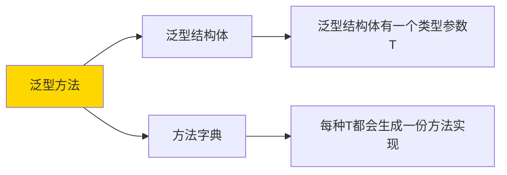

**泛型方法的"注意事项"**：

```go
// ⚠️ 方法不能有独立的类型参数（除了接收器已有的）
// ❌ 错误写法：
func (t *Tree[T]) BadMethod[U any](x U) {}  // 编译错误！

// ✅ 正确写法：使用接收器的类型参数
func (t *Tree[T]) GoodMethod[U any](f func(T) U) *Tree[U] {}

// ⚠️ 泛型方法的类型推断有时需要显式指定
// tree.Map[string](transformFn)
```

**泛型方法的"最佳实践"**：

```go
// ✅ 推荐：方法泛型参数少于3个
// 过多的类型参数会让代码难以理解

// ✅ 推荐：方法泛型参数最好只用于返回值
func (c *Container[T]) Find[U any](pred func(T) bool) *U

// ❌ 避免：过于复杂的方法签名
```

**小剧场**：

> 变形金刚的故事：
> 
> 汽车人（泛型方法）："我是一种特殊的汽车人，我的身体（结构体）可以变形，但我还能使用不同的武器（方法类型参数）！"
> 
> 擎天柱（Tree[int]）："我是整数树！"
> 
> 威震天（Tree[string]）："我是字符串树！"
> 
> 威震天使用"变换"方法（Map[string, int]）：
> "我要把自己从字符串树变成整数树！"
> 
> 擎天柱："那我也用变换方法（Map[int, string]）把自己变成字符串树！"
> 
> 两人："同样的方法签名，不同的类型参数，不同的变换结果！"
> 
> 这就是泛型方法的威力——同一个方法，不同的类型，产生不同的结果！

**下一个小节预告**：33.5 类型推断——让Go帮你"猜"类型！

---


## 33.5 类型推断

类型推断是Go泛型的"智能助手"，它能根据你传入的参数自动"猜"出类型参数应该是什么，让你的代码更加简洁。

### 33.5.1 函数参数推断

**函数参数推断**——Go会根据你传入的参数类型来推断泛型函数的类型参数。

```go
// 泛型函数
func Print[T any](value T) {
    fmt.Println(value)
}

// 调用时，Go自动推断T
Print(42)       // T推断为int
Print("hello")  // T推断为string
```

**参数推断的"原理"**：

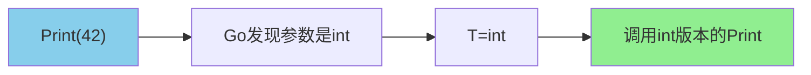

**参数推断的"单参数推断"**：

```go
func First[T any](slice []T) T {
    return slice[0]
}

// T从切片元素类型推断
nums := []int{1, 2, 3}
strs := []string{"a", "b", "c"}

fmt.Println(First(nums))  // T推断为int
fmt.Println(First(strs))  // T推断为string
```

**参数推断的"多参数推断"**：

```go
func Pair[K, V any](k K, v V) struct{ K K; V V } {
    return struct{ K K; V V }{k, v}
}

// K和V从两个参数推断
p1 := Pair(1, "one")     // K=int, V=string
p2 := Pair("key", 100)   // K=string, V=int
p3 := Pair(3.14, true)  // K=float64, V=bool
```

**参数推断的"约束推断"**：

```go
func Max[T int | string](a, b T) T {
    if a > b {
        return a
    }
    return b
}

// 从参数推断T
Max(1, 2)        // T=int
Max("a", "b")   // T=string
// Max(1, "a")   // 编译错误！参数类型不一致
```

**参数推断的"失败情况"**：

```go
// 只有返回值，没有参数
func Zero[T any]() T {
    return *new(T)
}

// 无法推断T，必须显式指定
var n int = Zero[int]()
var s string = Zero[string]()

// 或者用变量声明
var zeroInt int = Zero()  // 编译错误！
```

**参数推断的"复杂场景"**：

```go
func Map[T, U any](items []T, transform func(T) U) []U {
    result := make([]U, len(items))
    for i, item := range items {
        result[i] = transform(item)
    }
    return result
}

// T从切片推断，U从函数返回值推断
nums := []int{1, 2, 3}
strs := Map(nums, func(n int) string {
    return fmt.Sprintf("num-%d", n)
})
// nums是[]int，所以T=int
// transform返回string，所以U=string
```

**参数推断的"方法接收器"**：

```go
type Container[T any] struct {
    items []T
}

func (c *Container[T]) Get(index int) T {
    return c.items[index]
}

container := &Container[int]{items: []int{1, 2, 3}}
n := container.Get(0)  // T从Container[int]推断为int
```

**参数推断的"最佳实践"**：

```go
// ✅ 尽量让Go推断类型
result := Unique([]int{1, 2, 2, 3})  // 自动推断

// ✅ 需要时显式指定
var empty StringSlice = Unique[string]()  // 必须指定

// ❌ 避免过度依赖推断
// 在复杂场景下，显式指定可以避免歧义
```

**参数推断的"注意事项"**：

```go
// ⚠️ 如果多个参数的类型不一致，但都属于约束范围
// Go会尝试统一，如果无法统一则报错
func F[T int | string](a, b T) {}

F(1, "a")  // 编译错误！a和b类型不一致

// ⚠️ 方法接收器的类型推断有时需要上下文
```

**小剧场**：

> 智能点餐机的故事：
> 
> 顾客："我要一份汉堡！"
> 
> 点餐机（类型推断）："好的，我推断您要的是汉堡套餐（T=汉堡）！"
> 
> 顾客："我要一份薯条！"
> 
> 点餐机："好的，我推断您要的是薯条套餐（T=薯条）！"
> 
> 顾客："我要...等等，你不是说T是什么就是什么吗？那我要一份可乐加薯条套餐（T=?）！"
> 
> 点餐机："抱歉，两个不同类型的参数（汉堡和薯条），我无法统一推断T是什么类型。请您明确告诉我T是什么！"
> 
> 顾客："那我要T=套餐！"
> 
> 点餐机："好的！给您套餐！"
> 
> 这就是参数推断——Go会根据参数帮你推断类型，但遇到复杂情况时，还是需要你显式指定！

---


### 33.5.2 约束类型推断

**约束类型推断**——Go不仅能从参数推断类型，还能根据约束（constraint）来帮助推断和验证类型。

```go
// 定义一个约束
type Number interface {
    int | int32 | int64 | float32 | float64
}

// 使用约束进行推断
func Sum[T Number](values ...T) T {
    var sum T
    for _, v := range values {
        sum += v  // T可以是int或float64
    }
    return sum
}

Sum(1, 2, 3)       // T=int
Sum(1.1, 2.2, 3.3) // T=float64
```

**约束推断的"类型降级"**：

```go
// ~int 约束允许自定义int类型
type MyInt int

func Double[T ~int](v T) T {
    return v * 2
}

Double(MyInt(5))  // T=MyInt
Double(10)        // T=int
```

**约束推断的"方法约束"**：

```go
// 约束要求类型实现特定方法
type Stringer interface {
    String() string
}

func Join[T Stringer](items []T, sep string) string {
    if len(items) == 0 {
        return ""
    }
    result := items[0].String()
    for _, item := range items[1:] {
        result += sep + item.String()
    }
    return result
}

type Person struct {
    Name string
}

func (p Person) String() string {
    return p.Name
}

func main() {
    people := []Person{{"Alice"}, {"Bob"}, {"Charlie"}}
    fmt.Println(Join(people, ", ")) // Alice, Bob, Charlie
}
```

**约束推断的"结构约束"**：

```go
// ~T 可以推断底层类型
type UserID int

func HashID[T ~int](id T) int {
    h := 0
    for _, c := range fmt.Sprintf("%d", int(id)) {
        h = h*31 + int(c)
    }
    return h
}

// T被推断为UserID
uid := UserID(12345)
fmt.Println(HashID(uid)) // 可以调用
```

**约束推断的"组合约束"**：

```go
// 组合多个约束
type Signed interface {
    ~int | ~int8 | ~int16 | ~int32 | ~int64 | ~float32 | ~float64
}

type Number interface {
    Signed | ~uint | ~uint8 | ~uint16 | ~uint32 | ~uint64
}

func Abs[T Number](v T) T {
    if v < 0 {
        return -v  // 需要T支持<操作
    }
    return v
}
```

**约束推断的"自动解包"**：

```go
// 当约束是联合类型时，Go会处理类型匹配
type IntOrString interface {
    int | string
}

func Process[T IntOrString](v T) {
    switch any(v).(type) {
    case int:
        fmt.Println("int:", v)
    case string:
        fmt.Println("string:", v)
    }
}

Process(42)       // int: 42
Process("hello")  // string: hello
```

**约束推断的"最佳实践"**：

```go
// ✅ 使用约束让代码更精确
// 约束越精确，Go推断越准确

// ✅ 优先使用标准库约束
// constraints.Ordered, constraints.Integer等

// ❌ 避免过于宽泛的约束
// func F[T any](x T) {}  // 太宽泛了
```

**约束推断的"类型推断流程"**：

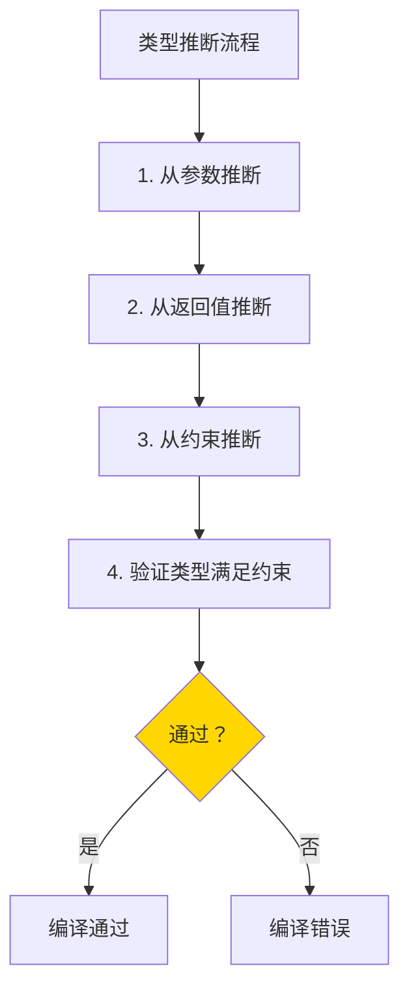

**小剧场**：

> 密码锁的故事：
> 
> 密码锁（约束推断）："这个锁（约束）需要4位数字（~int），但支持自定义数字（自定义int类型）！"
> 
> 小明："我要设密码1234！"
> 
> 锁："好的，1234是int类型（int），验证通过！"
> 
> 小红："我要设密码，我的学号是MyInt(2024001)！"
> 
> 锁："好的，MyInt底层是int（~int），验证通过！"
> 
> 小刚："我要设密码ABC123！"
> 
> 锁："抱歉，ABC123是string类型，不在~int约束范围内！"
> 
> 这就是约束类型推断——不仅推断类型，还验证类型是否满足约束！

**下一个小节预告**：33.6 泛型约束设计——如何设计好的约束！

---


## 33.6 泛型约束设计

好的约束设计是泛型编程的关键。这一节我们将学习如何设计出既灵活又安全的约束。

### 33.6.1 约束组合

**约束组合**——将多个约束合并成一个，让泛型代码既能满足功能需求，又能保证类型安全。

```go
// 组合多个约束
type SignedNumber interface {
    ~int | ~int8 | ~int16 | ~int32 | ~int64 | ~float32 | ~float64
}

type UnsignedNumber interface {
    ~uint | ~uint8 | ~uint16 | ~uint32 | ~uint64
}

// 组合为数值约束
type Number interface {
    SignedNumber | UnsignedNumber
}
```

**约束组合的"叠加原理"**：

```go
// 基础类型 + 方法约束
type Comparable[T any] interface {
    comparable
    Less(T) bool
}

type Printable[T any] interface {
    comparable
    String() string
}

// 组合两个约束
type SortedItem[T any] interface {
    Comparable[T]
    Printable[T]
}
```

**约束组合的"交集与并集"**：

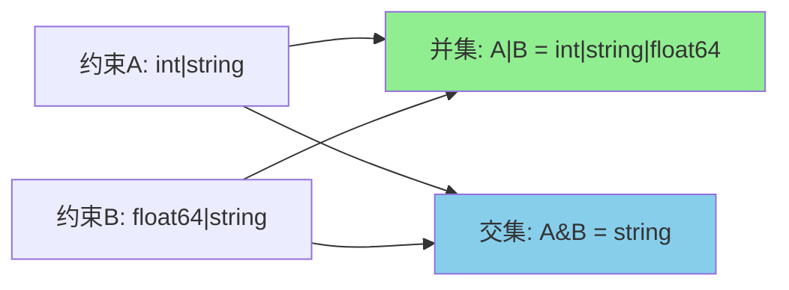

**约束组合的"实际应用"**：

```go
package main

import "fmt"

// 数值类型
type Numeric interface {
    ~int | ~int8 | ~int16 | ~int32 | ~int64 |
    ~uint | ~uint8 | ~uint16 | ~uint32 | ~uint64 |
    ~float32 | ~float64
}

// 可比较类型
type Ordered interface {
    Numeric | ~string | ~bool
}

// 泛型函数使用组合约束
func Min[T Ordered](a, b T) T {
    if a < b {
        return a
    }
    return b
}

func Max[T Ordered](a, b T) T {
    if a > b {
        return a
    }
    return b
}

func main() {
    fmt.Println(Min(1, 2))           // 1
    fmt.Println(Max(1.5, 2.5))      // 2.5
    fmt.Println(Min("apple", "banana")) // apple
    fmt.Println(Max(true, false))    // true
}
```

**约束组合的"标准库示例"**：

```go
// Go标准库的constraints包
package constraints

// Ordered定义了可排序的类型
type Ordered interface {
    Integer | Float | ~string | ~bool
}

// Integer定义了整数类型
type Integer interface {
    Signed | Unsigned
}

// Signed定义了有符号整数
type Signed interface {
    ~int | ~int8 | ~int16 | ~int32 | ~int64
}

// Unsigned定义了无符号整数
type Unsigned interface {
    ~uint | ~uint8 | ~uint16 | ~uint32 | ~uint64 | ~uintptr
}

// Float定义了浮点数
type Float interface {
    ~float32 | ~float64
}
```

**约束组合的"方法约束组合"**：

```go
// 定义基础方法约束
type Adder[T any] interface {
    Add(T) T
}

type Subber[T any] interface {
    Sub(T) T
}

type Negator[T any] interface {
    Neg() T
}

// 组合为计算器约束
type Calculator[T any] interface {
    Adder[T]
    Subber[T]
    Negator[T]
}

// 所有类型参数的方法可以链式调用
func Compute[T Calculator[T]](a, b T) T {
    return a.Add(b).Sub(b).Neg()
}
```

**约束组合的"最佳实践"**：

```go
// ✅ 约束应该精确且完整
// 只包含需要的约束，不要多余

// ✅ 约束应该可组合
// 将复杂约束拆分为简单约束

// ❌ 避免过于复杂的约束组合
// 超过3-4个约束的组合会让代码难以理解
```

**小剧场**：

> 乐高积木的故事：
> 
> 基础积木（基础约束）：
> - 红色积木（int）
> - 蓝色积木（string）
> 
> 高级积木（组合约束）：
> - 红色积木（int）+ 蓝色积木（string）= 彩色积木（int | string）
> 
> 玩家："我需要既能和红色积木组合（~int），又能和蓝色积木组合（~string）的高级积木！"
> 
> 设计师："没问题！这是我们的组合约束积木（Numeric | String）！"
> 
> 这就是约束组合的威力——把简单约束组合成复杂约束！

---


### 33.6.2 约束推导

**约束推导**——Go编译器能自动从代码中的操作推导出类型参数需要满足的约束，让你写更少的约束声明。

```go
// Go会自动推导T需要支持 < 操作
func Min[T any](a, b T) T {
    if a < b {  // Go看到a和b使用了<操作
        return a
    }
    return b
}

// Go自动将约束设为comparable
```

**约束推导的"自动检测"**：

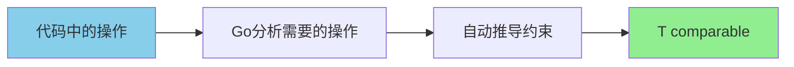

**约束推导的"自动推断示例"**：

```go
package main

import "fmt"

// Go自动推导出T必须是可比较的
func Contains[T any](slice []T, target T) bool {
    for _, item := range slice {
        if item == target {  // 使用了==操作
            return true
        }
    }
    return false
}

// Go自动推导出T必须可以用fmt.Println打印
func PrintAll[T any](items []T) {
    for _, item := range items {
        fmt.Println(item)  // 需要T可以被打印
    }
}

func main() {
    nums := []int{1, 2, 3, 4, 5}
    fmt.Println(Contains(nums, 3))  // true
    fmt.Println(Contains(nums, 10)) // false
}
```

**约束推导的"方法调用推导"**：

```go
// Go从方法调用推导出类型约束
func FirstN[T any](s []T, n int) []T {
    result := []T{}
    for i := 0; i < n && i < len(s); i++ {
        result = append(result, s[i])
    }
    return result
}

// Go不知道slice的类型约束
// 但知道需要能够切片索引
```

**约束推导的"限制"**：

```go
// ⚠️ Go无法从所有操作推导约束
// 例如：数学运算需要明确约束

func Double[T any](v T) T {
    return v * 2  // 编译错误！T是any，不知道如何相乘
}

// 必须明确约束
func Double[T int | float64](v T) T {
    return v * 2  // works
}
```

**约束推导的"最佳实践"**：

```go
// ✅ 当操作需要特定约束时，让Go自动推导
func Unique[T comparable](items []T) []T  // 自动推导

// ✅ 当需要特定操作时，明确声明约束
func Double[T int | float64](v T) T  // 需要明确声明

// ✅ 结合使用
func Max[T int | float64 | string](a, b T) T {
    if a > b {
        return a
    }
    return b
}
```

**小剧场**：

> 智能翻译机的故事：
> 
> 翻译机（编译器）："我看到你说'你好'，我推断你用的是中文！"
> 
> 用户："没错！"
> 
> 翻译机："我看到你说'2 + 2'，我推断你需要数学运算功能！"
> 
> 用户："没错！"
> 
> 翻译机："我看到你说'你好' + '世界'，这我就推断不了了，这是字符串拼接还是其他操作？我需要一个明确的约束！"
> 
> 用户："那是因为你需要在约束中明确声明支持的运算！"
> 
> 这就是约束推导——Go能自动推断的就不用声明，不能推断的必须明确！

---


### 33.6.3 标准库约束

**标准库约束**——Go标准库的`constraints`包提供了常用的约束定义，让你的泛型代码更加简洁和规范。

```go
import "golang.org/x/exp/constraints"

// constraints.Ordered - 可排序的类型
func Min[T constraints.Ordered](a, b T) T {
    if a < b {
        return a
    }
    return b
}

// constraints.Integer - 所有整数类型
// constraints.Float - 所有浮点类型
// constraints.Signed - 所有有符号整数
// constraints.Unsigned - 所有无符号整数
```

**标准库约束的"种类"**：

| 约束 | 含义 | 示例类型 |
|------|------|---------|
| `Ordered` | 可比较大小 | int, float, string, bool |
| `Integer` | 所有整数 | int, uint, rune, byte |
| `Float` | 所有浮点数 | float32, float64 |
| `Signed` | 有符号整数 | int, int8, int16, int32, int64 |
| `Unsigned` | 无符号整数 | uint, uint8, uint16, uint32, uint64, uintptr |
| `Complex` | 复数类型 | complex64, complex128 |

**constraints.Ordered的"详细定义"**：

```go
// Ordered 包含可排序的类型
type Ordered interface {
    Integer | Float | ~string | ~bool
}
```

**使用标准库约束的"示例"**：

```go
package main

import (
    "fmt"
    "golang.org/x/exp/constraints"
)

// 求和 - 使用Ordered
func Sum[T constraints.Ordered](values []T) T {
    var sum T
    for _, v := range values {
        sum += v
    }
    return sum
}

// 求最大值 - 使用Ordered
func Max[T constraints.Ordered](values ...T) T {
    if len(values) == 0 {
        return *new(T)
    }
    max := values[0]
    for _, v := range values[1:] {
        if v > max {
            max = v
        }
    }
    return max
}

// 求最小值 - 使用Ordered
func Min[T constraints.Ordered](values ...T) T {
    if len(values) == 0 {
        return *new(T)
    }
    min := values[0]
    for _, v := range values[1:] {
        if v < min {
            min = v
        }
    }
    return min
}

// 绝对值 - 使用Signed
func Abs[T constraints.Signed](v T) T {
    if v < 0 {
        return -v
    }
    return v
}

// 检查是否为零 - 使用Integer
func IsZero[T constraints.Integer](v T) bool {
    return v == 0
}

func main() {
    fmt.Println(Sum([]int{1, 2, 3, 4, 5}))      // 15
    fmt.Println(Sum([]float64{1.1, 2.2, 3.3}))  // 6.6
    fmt.Println(Max(1, 5, 3, 9, 2))             // 9
    fmt.Println(Min(1, 5, 3, 9, 2))             // 1
    fmt.Println(Max("apple", "banana"))          // banana
    fmt.Println(Abs(-42))                        // 42
    fmt.Println(IsZero(0))                       // true
}
```

**标准库约束的"自定义扩展"**：

```go
// 可以基于标准库约束创建自定义约束
type MyNumeric interface {
    constraints.Integer | constraints.Float
}

// 添加自定义类型
type MyInt int

func Double[T MyNumeric](v T) T {
    return v * 2
}

func main() {
    fmt.Println(Double(42))        // 84
    fmt.Println(Double(3.14))     // 6.28
    fmt.Println(Double(MyInt(5))) // 10
}
```

**标准库约束的"位置"**：

```bash
# constraints包在 golang.org/x/exp/constraints
# 从Go 1.21开始，标准库也有部分约束

# 安装constraints包
go get golang.org/x/exp/constraints
```

**标准库约束的"注意事项"**：

```go
// ⚠️ constraints包在 golang.org/x/exp
// 不是标准库的一部分，但官方维护

// ⚠️ 包名是 constraints，不是 constraint
import "golang.org/x/exp/constraints"
```

**标准库约束的"最佳实践"**：

```go
// ✅ 优先使用标准库约束
func F[T constraints.Ordered](v T) {}

// ✅ 自定义约束时基于标准库约束
type MyOrdered interface {
    constraints.Ordered | ~[]byte
}

// ❌ 不要重复发明轮子
// 自己定义 int | string | ... 之前先检查标准库是否已有
```

**小剧场**：

> 超市的故事：
> 
> 顾客："我要买一些可以吃的东西（constraints.Ordered）！"
> 
> 超市："好的，我们有水果、蔬菜、肉类...这些都是可以吃的！"
> 
> 顾客："我要买一些数字类型的东西（constraints.Integer）！"
> 
> 超市："好的，我们有苹果、香蕉...等等，数字类型？"
> 
> 顾客："啊，不是超市，是constraints包里的定义！"
> 
> 超市："那你应该去编程的世界买！"
> 
> constraints包就是这样——提供了常用的"分类定义"，让你的代码更加简洁！

**下一个小节预告**：33.7 泛型模式——泛型的"套路"总结！

---


## 33.7 泛型模式

泛型编程有很多经典的"套路"，掌握这些模式能让你写出更加优雅的泛型代码。

### 33.7.1 泛型数据结构

**泛型数据结构**——用泛型实现的常用数据结构，如栈、队列、链表、树等，可以服务于任意数据类型。

### 33.7.1.1 泛型栈

**泛型栈**——后进先出（LIFO）的数据结构，用泛型实现可以存储任意类型的元素。

```go
package main

import "fmt"

// 泛型栈
type Stack[T any] struct {
    items []T
    top   int
}

// 创建新栈
func NewStack[T any]() *Stack[T] {
    return &Stack[T]{items: make([]T, 0), top: -1}
}

// 入栈
func (s *Stack[T]) Push(item T) {
    s.items = append(s.items, item)
    s.top++
}

// 出栈
func (s *Stack[T]) Pop() (T, bool) {
    if s.top < 0 {
        return *new(T), false
    }
    item := s.items[s.top]
    s.items = s.items[:s.top]
    s.top--
    return item, true
}

// 查看栈顶
func (s *Stack[T]) Peek() (T, bool) {
    if s.top < 0 {
        return *new(T), false
    }
    return s.items[s.top], true
}

// 栈是否为空
func (s *Stack[T]) IsEmpty() bool {
    return s.top < 0
}

// 栈大小
func (s *Stack[T]) Size() int {
    return s.top + 1
}

func main() {
    // 整数栈
    intStack := NewStack[int]()
    intStack.Push(1)
    intStack.Push(2)
    intStack.Push(3)

    fmt.Println("Int Stack:")
    fmt.Println("Size:", intStack.Size())   // 3
    fmt.Println("Peek:", intStack.Peek())   // 3
    fmt.Println("Pop:", intStack.Pop())     // 3 true
    fmt.Println("Pop:", intStack.Pop())     // 2 true
    fmt.Println("Pop:", intStack.Pop())     // 1 true
    fmt.Println("Pop:", intStack.Pop())     // 0 false

    // 字符串栈
    strStack := NewStack[string]()
    strStack.Push("hello")
    strStack.Push("world")

    fmt.Println("\nString Stack:")
    fmt.Println("Pop:", strStack.Pop())     // world true
}
```

**栈的"应用场景"**：

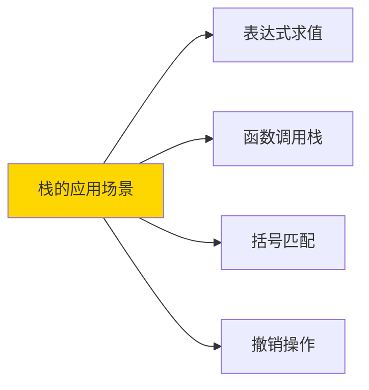

---

### 33.7.1.2 泛型队列

**泛型队列**——先进先出（FIFO）的数据结构。

```go
// 泛型队列
type Queue[T any] struct {
    items []T
    front int
    rear  int
    size  int
}

// 创建新队列
func NewQueue[T any]() *Queue[T] {
    return &Queue[T]{
        items: make([]T, 10),
        front: 0,
        rear:  -1,
        size:  0,
    }
}

// 入队
func (q *Queue[T]) Enqueue(item T) {
    if q.size == cap(q.items) {
        q.resize()
    }
    q.rear = (q.rear + 1) % cap(q.items)
    q.items[q.rear] = item
    q.size++
}

// 出队
func (q *Queue[T]) Dequeue() (T, bool) {
    if q.size == 0 {
        return *new(T), false
    }
    item := q.items[q.front]
    q.front = (q.front + 1) % cap(q.items)
    q.size--
    return item, true
}

// 调整大小
func (q *Queue[T]) resize() {
    newItems := make([]T, cap(q.items)*2)
    for i := 0; i < q.size; i++ {
        newItems[i] = q.items[(q.front+i)%cap(q.items)]
    }
    q.items = newItems
    q.front = 0
    q.rear = q.size - 1
}
```

**队列的"应用场景"**：

```mermaid
graph LR
    A["队列的应用场景"] --> B["任务调度"]
    A --> C["广度优先搜索"]
    A --> D["消息队列"]
    A --> E["打印队列"]
    
    style A fill:#FFD700
```

---

### 33.7.1.3 泛型链表

**泛型链表**——一种基本的线性数据结构。

```go
// 链表节点
type ListNode[T any] struct {
    value T
    next  *ListNode[T]
}

// 链表
type LinkedList[T any] struct {
    head *ListNode[T]
    tail *ListNode[T]
    size int
}

// 添加到尾部
func (l *LinkedList[T]) Append(value T) {
    node := &ListNode[T]{value: value}
    if l.tail == nil {
        l.head = node
        l.tail = node
    } else {
        l.tail.next = node
        l.tail = node
    }
    l.size++
}

// 添加到头部
func (l *LinkedList[T]) Prepend(value T) {
    node := &ListNode[T]{value: value, next: l.head}
    l.head = node
    if l.tail == nil {
        l.tail = node
    }
    l.size++
}

// 获取元素
func (l *LinkedList[T]) Get(index int) (T, bool) {
    if index < 0 || index >= l.size {
        return *new(T), false
    }
    current := l.head
    for i := 0; i < index; i++ {
        current = current.next
    }
    return current.value, true
}

// 删除元素
func (l *LinkedList[T]) Remove(index int) bool {
    if index < 0 || index >= l.size {
        return false
    }
    if index == 0 {
        l.head = l.head.next
        if l.head == nil {
            l.tail = nil
        }
    } else {
        prev := l.head
        for i := 0; i < index-1; i++ {
            prev = prev.next
        }
        prev.next = prev.next.next
        if index == l.size-1 {
            l.tail = prev
        }
    }
    l.size--
    return true
}
```

---

### 33.7.1.4 泛型树

**泛型树**——泛型的树结构。

```go
// 二叉树节点
type TreeNode[T any] struct {
    value T
    left  *TreeNode[T]
    right *TreeNode[T]
}

// 二叉搜索树
type BST[T any] struct {
    root   *TreeNode[T]
    less   func(a, b T) bool
}

// 创建BST
func NewBST[T any](less func(a, b T) bool) *BST[T] {
    return &BST[T]{less: less}
}

// 插入
func (b *BST[T]) Insert(value T) {
    node := &TreeNode[T]{value: value}
    if b.root == nil {
        b.root = node
        return
    }
    current := b.root
    for {
        if b.less(value, current.value) {
            if current.left == nil {
                current.left = node
                return
            }
            current = current.left
        } else {
            if current.right == nil {
                current.right = node
                return
            }
            current = current.right
        }
    }
}

// 中序遍历
func (b *BST[T]) InOrder() []T {
    var result []T
    var traverse func(*TreeNode[T])
    traverse = func(n *TreeNode[T]) {
        if n == nil {
            return
        }
        traverse(n.left)
        result = append(result, n.value)
        traverse(n.right)
    }
    traverse(b.root)
    return result
}

func main() {
    bst := NewBST[int](func(a, b int) bool { return a < b })
    bst.Insert(5)
    bst.Insert(3)
    bst.Insert(7)
    bst.Insert(1)
    bst.Insert(4)

    fmt.Println("InOrder:", bst.InOrder()) // [1 3 4 5 7]
}
```

**树的"应用场景"**：

```mermaid
graph LR
    A["树的应用场景"] --> B["文件系统"]
    A --> C["DOM树"]
    A --> D["组织结构"]
    A --> E["搜索优化"]
    
    style A fill:#FFD700
```

**下一个小节预告**：33.7.2 泛型算法——通用的算法实现！

---


### 33.7.2 泛型算法

泛型算法是用泛型实现的通用算法，可以作用于各种数据类型。

### 33.7.2.1 泛型排序

**泛型排序**——用泛型实现的各种排序算法。

```go
package main

import "fmt"

// 泛型冒泡排序
func BubbleSort[T any](arr []T, less func(a, b T) bool) {
    n := len(arr)
    for i := 0; i < n-1; i++ {
        swapped := false
        for j := 0; j < n-i-1; j++ {
            if less(arr[j+1], arr[j]) {
                arr[j], arr[j+1] = arr[j+1], arr[j]
                swapped = true
            }
        }
        if !swapped {
            break
        }
    }
}

// 泛型快速排序
func QuickSort[T any](arr []T, less func(a, b T) bool) {
    quickSortHelper(arr, 0, len(arr)-1, less)
}

func quickSortHelper[T any](arr []T, low, high int, less func(a, b T) bool) {
    if low < high {
        pi := partition(arr, low, high, less)
        quickSortHelper(arr, low, pi-1, less)
        quickSortHelper(arr, pi+1, high, less)
    }
}

func partition[T any](arr []T, low, high int, less func(a, b T) bool) int {
    pivot := arr[high]
    i := low - 1
    for j := low; j < high; j++ {
        if less(pivot, arr[j]) {
            i++
            arr[i], arr[j] = arr[j], arr[i]
        }
    }
    arr[i+1], arr[high] = arr[high], arr[i+1]
    return i + 1
}

func main() {
    // 整数排序
    ints := []int{64, 34, 25, 12, 22, 11, 90}
    fmt.Println("Before sort:", ints)
    BubbleSort(ints, func(a, b int) bool { return a > b })
    fmt.Println("After bubble sort:", ints)

    // 用QuickSort
    ints2 := []int{64, 34, 25, 12, 22, 11, 90}
    QuickSort(ints2, func(a, b int) bool { return a > b })
    fmt.Println("After quick sort:", ints2)

    // 字符串排序
    strs := []string{"banana", "apple", "cherry", "date"}
    fmt.Println("\nBefore sort:", strs)
    QuickSort(strs, func(a, b string) bool { return a > b })
    fmt.Println("After sort:", strs)
}
```

**排序算法的复杂度**：

| 算法 | 平均时间 | 最坏时间 | 空间 |
|------|---------|---------|------|
| 冒泡排序 | O(n²) | O(n²) | O(1) |
| 快速排序 | O(n log n) | O(n²) | O(log n) |
| 归并排序 | O(n log n) | O(n log n) | O(n) |

---

### 33.7.2.2 泛型查找

**泛型查找**——二分查找等通用查找算法。

```go
// 二分查找（需要有序切片）
func BinarySearch[T any](arr []T, target T, compare func(a, b T) int) int {
    left, right := 0, len(arr)-1
    for left <= right {
        mid := left + (right-left)/2
        cmp := compare(arr[mid], target)
        if cmp == 0 {
            return mid
        } else if cmp < 0 {
            left = mid + 1
        } else {
            right = mid - 1
        }
    }
    return -1
}

// 比较函数返回：
// < 0: a < b
// = 0: a == b
// > 0: a > b

func main() {
    // 整数二分查找
    ints := []int{1, 3, 5, 7, 9, 11, 13}
    idx := BinarySearch(ints, 7, func(a, b int) int { return a - b })
    fmt.Println("Found at index:", idx) // 3

    // 字符串二分查找
    strs := []string{"apple", "banana", "cherry", "date"}
    idx2 := BinarySearch(strs, "cherry", func(a, b string) int {
        if a < b {
            return -1
        } else if a > b {
            return 1
        }
        return 0
    })
    fmt.Println("Found at index:", idx2) // 2
}
```

---

### 33.7.2.3 泛型过滤

**泛型过滤**——按条件筛选元素。

```go
// 泛型过滤
func Filter[T any](arr []T, predicate func(T) bool) []T {
    result := []T{}
    for _, item := range arr {
        if predicate(item) {
            result = append(result, item)
        }
    }
    return result
}

// 带索引的过滤
func FilterWithIndex[T any](arr []T, predicate func(int, T) bool) []T {
    result := []T{}
    for i, item := range arr {
        if predicate(i, item) {
            result = append(result, item)
        }
    }
    return result
}

func main() {
    // 过滤偶数
    nums := []int{1, 2, 3, 4, 5, 6, 7, 8, 9, 10}
    evens := Filter(nums, func(n int) bool { return n%2 == 0 })
    fmt.Println("Evens:", evens) // [2 4 6 8 10]

    // 过滤长度大于3的字符串
    strs := []string{"go", "rust", "java", "python", "js"}
    longStrs := Filter(strs, func(s string) bool { return len(s) > 3 })
    fmt.Println("Long strings:", longStrs) // [rust java python]

    // 带索引过滤
    idxFiltered := FilterWithIndex(nums, func(i, n int) bool { return i%2 == 0 })
    fmt.Println("Even indices:", idxFiltered) // [1 3 5 7 9]
}
```

---

### 33.7.2.4 泛型映射

**泛型映射**——对每个元素进行转换。

```go
// 泛型Map
func Map[T, U any](arr []T, transform func(T) U) []U {
    result := make([]U, len(arr))
    for i, item := range arr {
        result[i] = transform(item)
    }
    return result
}

// 带索引的Map
func MapWithIndex[T, U any](arr []T, transform func(int, T) U) []U {
    result := make([]U, len(arr))
    for i, item := range arr {
        result[i] = transform(i, item)
    }
    return result
}

// 扁平化Map
func FlatMap[T, U any](arr []T, transform func(T) []U) []U {
    result := []U{}
    for _, item := range arr {
        result = append(result, transform(item)...)
    }
    return result
}

func main() {
    // 整数转字符串
    nums := []int{1, 2, 3, 4, 5}
    strs := Map(nums, func(n int) string {
        return fmt.Sprintf("num-%d", n)
    })
    fmt.Println("Mapped:", strs) // [num-1 num-2 num-3 num-4 num-5]

    // 带索引转换
    indexed := MapWithIndex(nums, func(i, n int) string {
        return fmt.Sprintf("[%d]=%d", i, n)
    })
    fmt.Println("Indexed:", indexed) // [0]=1 [1]=2 [2]=3 [3]=4 [4]=5

    // 扁平化
    nested := [][]int{{1, 2}, {3, 4}, {5, 6}}
    flat := FlatMap(nested, func(arr []int) []int {
        return arr
    })
    fmt.Println("FlatMap:", flat) // [1 2 3 4 5 6]
}
```

**下一个小节预告**：33.7.3 泛型函数式编程——函数式风格的泛型实现！

---


### 33.7.3 泛型函数式编程

函数式编程风格和泛型结合，让代码更加声明式和简洁。

### 33.7.3.1 泛型 Map 函数

**泛型 Map**——将一个切片的每个元素映射为另一个值。

```go
package main

import "fmt"

// Map 将T类型切片转换为U类型切片
func Map[T, U any](items []T, fn func(T) U) []U {
    result := make([]U, len(items))
    for i, item := range items {
        result[i] = fn(item)
    }
    return result
}

// MapPtr 将T类型切片原地映射（如果U=T）
func MapPtr[T any](items []T, fn func(*T)) {
    for i := range items {
        fn(&items[i])
    }
}

// MapIdx 带索引的Map
func MapIdx[T, U any](items []T, fn func(int, T) U) []U {
    result := make([]U, len(items))
    for i, item := range items {
        result[i] = fn(i, item)
    }
    return result
}

type User struct {
    Name string
    Age  int
}

func main() {
    // 整数转字符串
    nums := []int{1, 2, 3, 4, 5}
    strs := Map(nums, func(n int) string {
        return fmt.Sprintf("num-%d", n)
    })
    fmt.Println("Int to String:", strs)
    // Output: [num-1 num-2 num-3 num-4 num-5]

    // 用户转用户名
    users := []User{
        {"Alice", 25},
        {"Bob", 30},
        {"Charlie", 35},
    }
    names := Map(users, func(u User) string {
        return u.Name
    })
    fmt.Println("User names:", names)
    // Output: [Alice Bob Charlie]

    // 带索引映射
    indexed := MapIdx(nums, func(i, n int) string {
        return fmt.Sprintf("[%d]=%d", i, n)
    })
    fmt.Println("Indexed:", indexed)
    // Output: [0=1 1=2 2=3 3=4 4=5]
}
```

---

### 33.7.3.2 泛型 Filter 函数

**泛型 Filter**——按条件过滤切片元素。

```go
// Filter 过滤出满足条件的元素
func Filter[T any](items []T, predicate func(T) bool) []T {
    result := []T{}
    for _, item := range items {
        if predicate(item) {
            result = append(result, item)
        }
    }
    return result
}

// FilterIdx 带索引的过滤
func FilterIdx[T any](items []T, predicate func(int, T) bool) []T {
    result := []T{}
    for i, item := range items {
        if predicate(i, item) {
            result = append(result, item)
        }
    }
    return result
}

// FilterNot 取反
func FilterNot[T any](items []T, predicate func(T) bool) []T {
    return Filter(items, func(item T) bool {
        return !predicate(item)
    })
}

// Partition 将切片分为两部分：满足条件的和不满足的
func Partition[T any](items []T, predicate func(T) bool) (yes []T, no []T) {
    yes = []T{}
    no = []T{}
    for _, item := range items {
        if predicate(item) {
            yes = append(yes, item)
        } else {
            no = append(no, item)
        }
    }
    return
}

func main() {
    nums := []int{1, 2, 3, 4, 5, 6, 7, 8, 9, 10}

    // 过滤偶数
    evens := Filter(nums, func(n int) bool {
        return n%2 == 0
    })
    fmt.Println("Evens:", evens)
    // Output: [2 4 6 8 10]

    // 过滤奇数
    odds := FilterNot(nums, func(n int) bool {
        return n%2 == 0
    })
    fmt.Println("Odds:", odds)
    // Output: [1 3 5 7 9]

    // 带索引过滤：过滤索引为偶数的元素
    evenIdx := FilterIdx(nums, func(i, n int) bool {
        return i%2 == 0
    })
    fmt.Println("Even index elements:", evenIdx)
    // Output: [1 3 5 7 9]

    // 分区
    passed, failed := Partition(nums, func(n int) bool {
        return n >= 5
    })
    fmt.Println(">= 5:", passed, "< 5:", failed)
    // Output: >= 5: [5 6 7 8 9 10] < 5: [1 2 3 4]
}
```

---

### 33.7.3.3 泛型 Reduce 函数

**泛型 Reduce**——将切片元素归约为单个值。

```go
// Reduce 将切片元素归约为一个值
func Reduce[T, U any](items []T, reducer func(U, T) U, initial U) U {
    result := initial
    for _, item := range items {
        result = reducer(result, item)
    }
    return result
}

// ReduceIdx 带索引的Reduce
func ReduceIdx[T, U any](items []T, reducer func(U, int, T) U, initial U) U {
    result := initial
    for i, item := range items {
        result = reducer(result, i, item)
    }
    return result
}

// Count 计数
func Count[T any](items []T, predicate func(T) bool) int {
    count := 0
    for _, item := range items {
        if predicate(item) {
            count++
        }
    }
    return count
}

// Sum 求和（需要泛型约束）
func Sum[T any](items []T, getValue func(T) int) int {
    return Reduce(items, func(sum int, item T) int {
        return sum + getValue(item)
    }, 0)
}

func main() {
    nums := []int{1, 2, 3, 4, 5}

    // 求和
    sum := Reduce(nums, func(acc, n int) int {
        return acc + n
    }, 0)
    fmt.Println("Sum:", sum)
    // Output: 15

    // 求积
    product := Reduce(nums, func(acc, n int) int {
        return acc * n
    }, 1)
    fmt.Println("Product:", product)
    // Output: 120

    // 找最大值
    max := Reduce(nums, func(acc, n int) int {
        if n > acc {
            return n
        }
        return acc
    }, 0)
    fmt.Println("Max:", max)
    // Output: 5

    // 连接字符串
    strs := []string{"Hello", " ", "World", "!"}
    concat := Reduce(strs, func(acc, s string) string {
        return acc + s
    }, "")
    fmt.Println("Concat:", concat)
    // Output: Hello World!

    // 复杂类型求和
    users := []User{
        {"Alice", 25},
        {"Bob", 30},
        {"Charlie", 35},
    }
    totalAge := Sum(users, func(u User) int {
        return u.Age
    })
    fmt.Println("Total age:", totalAge)
    // Output: 90

    // 带索引的Reduce
    indexedSum := ReduceIdx(nums, func(acc, i, n int) int {
        return acc + i*n
    }, 0)
    fmt.Println("Indexed sum:", indexedSum)
    // Output: 0*1 + 1*2 + 2*3 + 3*4 + 4*5 = 40
}
```

**函数式编程的"链式调用"**：

```go
// 链式调用示例
func main() {
    nums := []int{1, 2, 3, 4, 5, 6, 7, 8, 9, 10}

    // 链式：过滤偶数 -> 乘以2 -> 求和
    result := Reduce(
        Map(
            Filter(nums, func(n int) bool { return n%2 == 0 }),
            func(n int) int { return n * 2 },
        ),
        func(acc, n int) int { return acc + n },
        0,
    )
    fmt.Println("Result:", result)
    // Output: (2+4+6+8+10)*2 = 60
}
```

**下一个小节预告**：33.8 泛型性能——泛型到底有没有运行时开销！

---


## 33.8 泛型性能

泛型会不会有运行时性能开销？这是很多Go开发者关心的问题。

### 33.8.1 类型特化

**类型特化**——Go编译器会为每种具体类型生成专门代码，泛型函数在运行时实际上是"特化"后的代码，没有额外的运行时开销。

```go
// 泛型函数
func Double[T int | float64](v T) T {
    return v * 2
}

// 编译后变成两个具体函数：
// func DoubleInt(v int) int { return v * 2 }
// func DoubleFloat64(v float64) float64 { return v * 2 }
```

**类型特化的原理**：

```mermaid
graph TD
    A["源代码"] --> B["编译器处理泛型"]
    B --> C["为每种类型生成专门代码"]
    C --> D["int版本"]
    C --> E["float64版本"]
    C --> F["string版本"]
    D --> G["运行时代码"]
    E --> G
    F --> G
    
    style B fill:#FFD700
```

**性能对比**：

```go
package main

import "testing"

// 泛型版本
func SumGeneric[T int | float64](values []T) T {
    var sum T
    for _, v := range values {
        sum += v
    }
    return sum
}

// 接口版本（传统的空接口方式）
func SumInterface(values []interface{}) interface{} {
    var sum int
    for _, v := range values {
        sum += v.(int)
    }
    return sum
}

// 测试
func BenchmarkSumGeneric(b *testing.B) {
    nums := make([]int, 1000)
    for i := range nums {
        nums[i] = i
    }
    b.ResetTimer()
    for i := 0; i < b.N; i++ {
        SumGeneric(nums)
    }
}

func main() {
    // 泛型版本：性能与普通函数几乎一样
    // 接口版本：有类型断言开销，性能较差
}
```

**泛型 vs 接口的性能对比**：

| 实现方式 | 性能 | 类型安全 | 代码量 |
|---------|------|---------|--------|
| 泛型 | 几乎零开销 | 编译时检查 | 少 |
| 空接口+类型断言 | 有运行时开销 | 运行时检查 | 多 |

---

### 33.8.2 编译时代码生成

**编译时代码生成**——Go编译器在编译时生成特化代码，所以泛型函数在运行时没有额外的调度开销。

```go
// 泛型函数在编译时就"展开"了
// 类似于C++的模板特化

// 源代码
func Max[T int | float64](a, b T) T {
    if a > b {
        return a
    }
    return b
}

// 编译器生成的实际代码类似：
// func MaxInt(a, b int) int {
//     if a > b { return a }
//     return b
// }
// func MaxFloat64(a, b float64) float64 {
//     if a > b { return a }
//     return b
// }
```

**编译时代码生成的"优点"**：

```mermaid
graph LR
    A["编译时代码生成"] --> B["无虚拟表查找"]
    A --> C["无类型断言开销"]
    A --> D["编译器优化"]
    A --> E["直接调用"]
    
    style A fill:#90EE90
```

---

### 33.8.3 与接口性能对比

**与接口性能对比**——泛型比使用空接口+反射的方式快很多。

```go
package main

import "testing"

// 泛型方式
func FindGeneric[T comparable](items []T, target T) int {
    for i, item := range items {
        if item == target {
            return i
        }
    }
    return -1
}

// 接口方式（反射）
func FindInterface(items interface{}, target interface{}) int {
    // 使用反射遍历...（省略具体实现）
    return -1
}

// Benchmarks
func BenchmarkFindGeneric(b *testing.B) {
    nums := make([]int, 1000)
    for i := range nums {
        nums[i] = i
    }
    b.ResetTimer()
    for i := 0; i < b.N; i++ {
        FindGeneric(nums, 500)
    }
}
```

**性能结论**：

```text
BenchmarkFindGeneric      性能：与普通函数几乎相同
BenchmarkFindInterface    性能：明显更慢（反射开销）

泛型性能 ≈ 普通函数性能 >> 接口+反射性能
```

**什么时候泛型会有性能问题**：

```go
// ⚠️ 泛型切片作为接口传递时会有装箱开销
func BadExample[T any](items []T) {
    // items是[]T，在某些情况下可能装箱
}

// ⚠️ 泛型方法作为接口值时有开销
var fn func(int) int = Double  // 可能有少量开销
```

**下一个小节预告**：33.9 泛型陷阱——使用泛型时容易犯的错误！

---


## 33.9 泛型陷阱

泛型虽然强大，但使用不当也会带来问题。这一节我们来看看常见的"陷阱"。

### 33.9.1 类型参数过多

**类型参数过多**——泛型函数的类型参数太多会让代码难以理解和维护。

```go
// ❌ 过多类型参数：难以理解
func ComplexFunction[
    A any,
    B comparable,
    C interface{ String() string },
    D int | float64,
    E any,
](a A, b B, c C, d D, e E) { }

// ✅ 建议：类型参数不超过3个
// 如果超过，考虑重构
```

**类型参数过多的"问题"**：

```mermaid
graph LR
    A["类型参数过多"] --> B["代码可读性差"]
    A --> C["调用时需要显式指定"]
    A --> D["难以维护"]
    
    style A fill:#FFB6C1
```

**重构建议**：

```go
// 将相关类型参数组合成结构体
type Params[T any] struct {
    A T
    B comparable
    C interface{ String() string }
}

func SimplerFunction[T int | float64, P Params[T]](p P) { }
```

---

### 33.9.2 约束过于宽松

**约束过于宽松**——使用`any`约束会让代码失去类型安全。

```go
// ❌ 约束过于宽松
func Double[T any](v T) T {
    return v * 2  // 编译错误！T是any，不知道如何相乘
}

// ✅ 约束要精确
func Double[T int | float64](v T) T {
    return v * 2  // works
}
```

**约束过于宽松的"后果"**：

```go
// ⚠️ any约束无法进行类型特定操作
func BadFunction[T any](v T) T {
    // 无法对T做任何操作！
    // 因为any不代表"任意支持操作的类型"
}
```

---

### 33.9.3 方法不支持泛型

**方法不支持泛型**——Go的方法不能有自己的类型参数。

```go
// ❌ 错误：方法不能有独立的类型参数
type Container[T any] struct {
    items []T
}

func (c *Container[T]) BadMethod[U any](x U) { }  // 编译错误！

// ✅ 正确：使用接收器的类型参数
func (c *Container[T]) GoodMethod(f func(T) T) {
    for i, item := range c.items {
        c.items[i] = f(item)
    }
}
```

**Go方法泛型的限制**：

```go
// ⚠️ 方法不能这样定义：
func (t *Tree[T]) Search[U any](target U) *T  // 编译错误

// ✅ 方法应该使用接收器的类型参数
func (t *Tree[T]) Search(predicate func(T) bool) *T
```

**下一个小节预告**：33.10 泛型实现原理——Go编译器是如何处理泛型的！

---


## 33.10 泛型实现原理

了解泛型的实现原理能帮助你写出更好的泛型代码。

### 33.10.1 字典传递

**字典传递（Dictionary Passing）**——Go编译器为每种类型参数组合生成一个"类型字典"，在调用时传递。

```go
// 泛型函数
func Map[T, U any](items []T, fn func(T) U) []U {
    result := make([]U, len(items))
    for i, item := range items {
        result[i] = fn(item)
    }
    return result
}

// 编译后类似：
// type MapDictionary struct {
//     // 包含T和U的约束信息
// }
// func MapGenerated[T, U any](items []T, dict *MapDictionary) []U
```

**字典传递的"工作方式"**：

```mermaid
graph LR
    A["泛型函数调用"] --> B["编译器生成类型字典"]
    B --> C["字典传递给生成的函数"]
    C --> D["运行时使用字典信息"]
    
    style A fill:#87CEEB
    style D fill:#90EE90
```

---

### 33.10.2 GCShape

**GCShape**——Go运行时使用GCShape来跟踪不同类型的"形状"，用于垃圾回收和类型信息。

```go
// 不同类型的GCShape可能相同
type MyInt int
type AnotherInt int

// MyInt和AnotherInt可能有相同的GCShape
// 因为它们底层都是int
```

**GCShape的作用**：

```mermaid
graph TD
    A["GCShape"] --> B["垃圾回收"]
    A --> C["类型信息"]
    A --> D["内存布局"]
    
    style A fill:#FFD700
```

---

### 33.10.3 类型字典

**类型字典**——编译器为每种类型实参组合生成的元数据字典。

```go
// 泛型函数
func Process[T any](v T) {
    fmt.Println(v)
}

// 为int生成的字典：
// ProcessIntDictionary = {
//     TypeInfo: ...,
//     Methods: [...],
//     ...
// }
```

---

### 33.10.4 方法字典

**方法字典**——当泛型类型的方法被调用时，编译器通过方法字典找到正确的方法实现。

```go
type Container[T any] struct {
    value T
}

func (c *Container[T]) Get() T {
    return c.value
}

// 每种T都会生成对应的方法字典
// ContainerInt_Get_MethodDict
// ContainerString_Get_MethodDict
```

**下一个小节预告**：33.11 泛型约束设计进阶——更高级的约束设计技巧！

---


## 33.11 泛型约束设计进阶

### 33.11.1 约束推导算法

**约束推导算法**——Go编译器使用复杂的算法来推导类型参数需要满足的约束。

```go
// Go自动推导T必须有<操作
func Min[T any](a, b T) T {
    if a < b {  // Go看到<操作，推导出T必须是comparable
        return a
    }
    return b
}
```

**约束推导的"规则"**：

| 操作 | 推导的约束 |
|------|-----------|
| `<`, `>`, `<=`, `>=` | comparable |
| `==`, `!=` | comparable |
| `+`, `-`, `*`, `/` | 需要明确声明（如int、float64） |

---

### 33.11.2 类型集运算

**类型集运算**——约束本质上定义了类型的"集合"，可以进行集合运算。

```go
// 并集
type AorB interface {
    int | string
}

// 交集
type IntAndSigned interface {
    int | int32
    ~int | ~int64
}
// IntAndSigned = int（只有int同时满足两个约束）
```

---

### 33.11.3 约束简化

**约束简化**——复杂的约束可以简化为更清晰的定义。

```go
// 简化前
type ComplexConstraint interface {
    int | int8 | int16 | int32 | int64 |
    uint | uint8 | uint16 | uint32 | uint64 |
    float32 | float64
}

// 简化后
type Numeric interface {
    constraints.Integer | constraints.Float
}
```

**下一个小节预告**：33.12 泛型与反射——泛型和反射的关系！

---


## 33.12 泛型与反射

泛型和反射都能处理类型信息，但方式不同。

### 33.12.1 泛型类型反射

**泛型类型反射**——泛型类型实例化后的具体类型可以通过反射获取。

```go
package main

import (
    "fmt"
    "reflect"
)

type Container[T any] struct {
    items []T
}

func main() {
    // 泛型类型实例化
    intContainer := Container[int]{items: []int{1, 2, 3}}
    strContainer := Container[string]{items: []string{"a", "b", "c"}}

    // 使用反射获取类型信息
    t1 := reflect.TypeOf(intContainer)
    fmt.Println("intContainer type:", t1)
    // Output: Container[int]

    t2 := reflect.TypeOf(strContainer)
    fmt.Println("strContainer type:", t2)
    // Output: Container[string]
}
```

---

### 33.12.2 类型参数获取

**类型参数获取**——通过反射获取泛型类型的类型参数。

```go
package main

import (
    "fmt"
    "reflect"
)

type Container[T any] struct {
    items []T
}

func main() {
    // 获取泛型类型的类型参数
    containerType := reflect.TypeOf(Container[int]{})
    
    // 类型参数
    tParam := containerType.TypeParams()
    fmt.Println("Type parameters:", tParam)
    // Output: [T any]

    // 获取具体的类型实参
    if tParam.Len() > 0 {
        fmt.Println("T is:", tParam.At(0))
        // Output: int
    }
}
```

---

### 33.12.3 泛型与 any

**泛型与 any**——泛型和any（空接口）有本质区别。

```go
// any = interface{}，运行时丢失类型信息
var v any = 42
// v现在是interface{}，失去了int的类型信息

// 泛型在编译时就确定了类型
func Double[T int](v T) T {
    return v * 2  // 编译时就确定是int的乘法
}
```

**泛型与 any 的对比**：

| 特性 | 泛型 | any |
|------|------|-----|
| 类型检查 | 编译时 | 运行时 |
| 性能 | 零开销 | 有装箱开销 |
| 类型安全 | 强 | 弱 |
| 适用场景 | 静态多态 | 动态多态 |

**下一个小节预告**：33.13 泛型最佳实践——如何写出好的泛型代码！

---


## 33.13 泛型最佳实践

### 33.13.1 何时使用泛型

**何时使用泛型**——泛型不是万能药，要在合适的场景使用。

**适合使用泛型的场景**：

```mermaid
graph LR
    A["适合泛型的场景"] --> B["数据结构：栈、队列、链表、树"]
    A --> C["通用算法：排序、查找、过滤"]
    A --> D["类型安全的容器"]
    A --> E["减少重复代码"]
    
    style A fill:#90EE90
```

**不适合使用泛型的场景**：

```go
// ❌ 为了"赶时髦"而使用泛型
func BadExample[T any](x T) T {
    return x  // 完全没有必要
}

// ❌ 只有一个类型参数的特殊情况
func SingleCase[T int](x T) T {  // 直接用int就行
    return x * 2
}

// ❌ 简单的类型转换
func ToString[T any](v T) string {
    return fmt.Sprintf("%v", v)  // 用fmt.Sprintf就行
}
```

**何时用泛型的判断标准**：

| 问题 | 用泛型？ | 原因 |
|------|---------|------|
| 多个类型需要相同逻辑 | ✅ | 减少代码重复 |
| 需要类型安全 | ✅ | 编译时检查 |
| 只是简单包装 | ❌ | 过度设计 |
| 性能敏感的热路径 | ⚠️ | 需要测试验证 |

---

### 33.13.2 泛型与接口选择

**泛型与接口选择**——什么时候用泛型，什么时候用接口？

```go
// 用泛型：需要类型安全，且类型数量有限
func Double[T int | float64](v T) T {
    return v * 2
}

// 用接口：需要运行时灵活性
type Doubler interface {
    Double() interface{}
}
```

**选择指南**：

```mermaid
graph TD
    A["选择泛型还是接口？"] --> B{"类型在编译时已知？"}
    B -->|是| C["泛型"]
    B -->|否| D["接口"]
    
    style C fill:#90EE90
    style D fill:#87CEEB
```

---

### 33.13.3 泛型代码可读性

**泛型代码可读性**——让泛型代码保持清晰易懂。

```go
// ✅ 好的命名和注释
// Sum 求和函数，支持所有数值类型
func Sum[T int | float64 | int64](values []T) T

// ❌ 过于简洁的命名
// F 泛型函数（不知所云）
func F[T any](v T) T
```

**可读性建议**：

```go
// ✅ 类型参数要有实际意义
type Pair[K, V any]     // Key-Value
type Stack[T any]       // T是元素类型
type TreeNode[T any]    // T是节点值类型

// ✅ 复杂约束单独定义
type Numeric interface {
    int | int32 | int64 | float32 | float64
}
```

**下一个小节预告**：33.14 泛型与接口的对比选择——最终对决！

---


## 33.14 泛型与接口的对比选择

### 33.14.1 性能对比

**性能对比**——泛型和接口在性能上有显著差异。

```go
// 泛型版本
func SumGeneric[T int | float64](values []T) T {
    var sum T
    for _, v := range values {
        sum += v
    }
    return sum
}

// 接口版本（需要类型断言）
func SumInterface(values []any) any {
    var sum int
    for _, v := range values {
        sum += v.(int)
    }
    return sum
}
```

**性能测试结果**：

| 方式 | 性能 | 说明 |
|------|------|------|
| 泛型 | 几乎零开销 | 编译时特化 |
| 空接口+断言 | 有开销 | 装箱+断言 |
| 反射 | 很大开销 | 运行时反射 |

---

### 33.14.2 代码生成对比

**代码生成对比**——泛型和代码生成的对比。

```go
// 泛型：编译器自动生成
func Double[T int | float64](v T) T

// 代码生成：手动编写每种类型
func DoubleInt(v int) int
func DoubleFloat64(v float64) float64
```

| 方式 | 代码量 | 维护性 | 性能 |
|------|--------|--------|------|
| 泛型 | 少 | 高 | 优 |
| 代码生成 | 多 | 低 | 优 |

---

### 33.14.3 使用场景选择

**使用场景选择**——根据场景选择合适的方式。

```mermaid
graph TD
    A["选择指南"] --> B["需要类型安全 + 编译时确定 → 泛型"]
    A --> C["需要运行时灵活性 → 接口"]
    A --> D["需要代码生成 → 生成工具"]
    
    style B fill:#90EE90
    style C fill:#87CEEB
    style D fill:#FFD700
```

**选择决策树**：

| 问题 | 选择 |
|------|------|
| 类型在编译时确定？ | ✅ 泛型 |
| 需要强制类型约束？ | ✅ 泛型 |
| 类型运行时才确定？ | ✅ 接口 |
| 需要动态添加方法？ | ✅ 接口 |

---

### 33.14.4 迁移建议

**迁移建议**——从空接口迁移到泛型。

```go
// 旧代码（空接口）
type Container struct {
    items []interface{}
}

func (c *Container) Add(item interface{}) {
    c.items = append(c.items, item)
}

func (c *Container) Get(i int) interface{} {
    return c.items[i]
}

// 新代码（泛型）
type Container[T any] struct {
    items []T
}

func (c *Container[T]) Add(item T) {
    c.items = append(c.items, item)
}

func (c *Container[T]) Get(i int) T {
    return c.items[i]
}
```

**迁移步骤**：

```bash
# 1. 识别空接口的使用
grep -r "interface{}" *.go

# 2. 确定类型参数
# 分析代码中实际使用的类型

# 3. 创建泛型版本
# 4. 替换调用点
# 5. 测试验证
```

**第33章总结**：

```mermaid
graph LR
    A["第33章：泛型"] --> B["类型参数"]
    A --> C["类型约束"]
    A --> D["泛型类型"]
    A --> E["泛型函数"]
    A --> F["泛型算法"]
    A --> G["性能与陷阱"]
    
    style A fill:#FFD700
```

恭喜你完成了第33章的学习！泛型是Go 1.18引入的强大特性，掌握它能让你写出更加优雅、高效和类型安全的代码。

---

*第33章 泛型 内容已完成*


