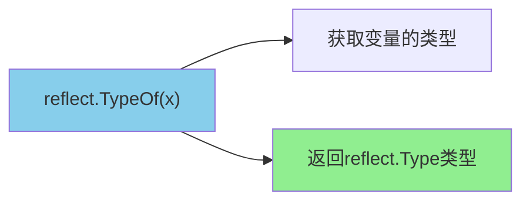
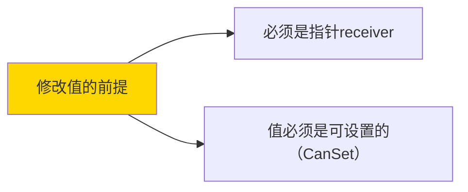
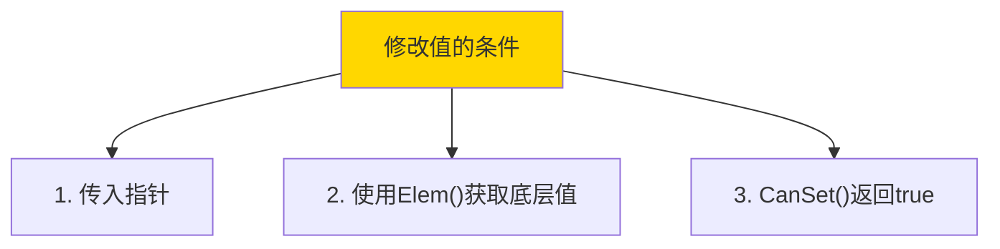
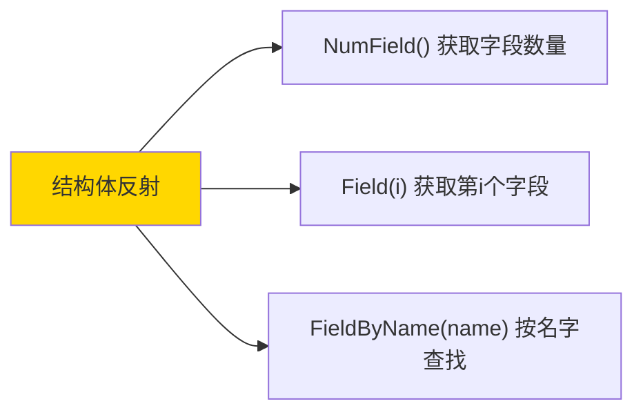
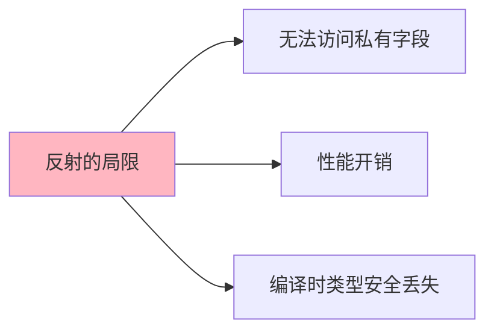
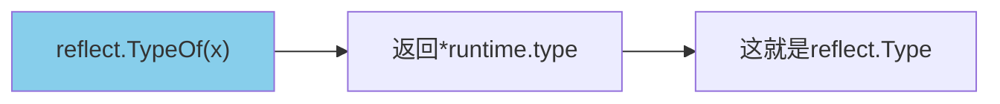
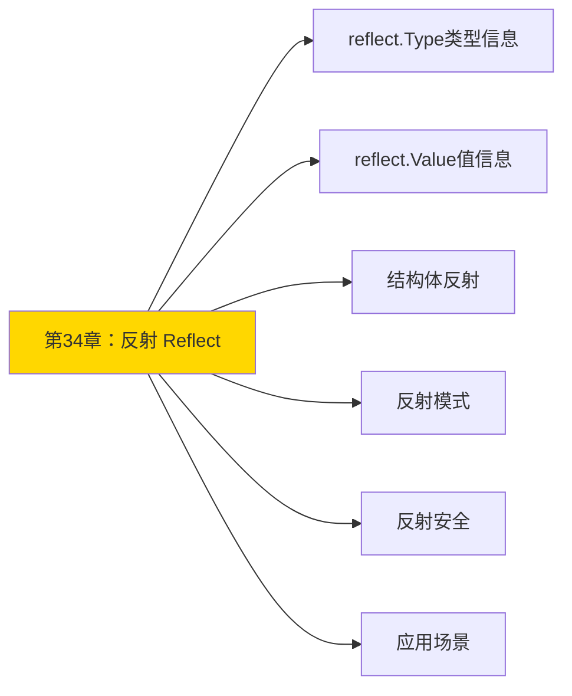

+++
title = "第34章 反射 Reflect"
weight = 340
date = "2026-03-20T08:39:00+08:00"
type = "docs"
description = ""
isCJKLanguage = true
draft = false
+++
# 第34章：反射 Reflect

> "反射（Reflection）是编程语言的'透视眼'，让你在运行时能够窥探和操作变量的类型信息。就像是去医院做X光检查，你能看见平时看不见的内部结构！"

在Go语言中，反射是一项强大的特性，它允许程序在运行时检查变量的类型和值，以及动态调用方法。合理使用反射可以让代码更加灵活，但过度使用也会带来性能和可维护性问题。

这一章，我们将深入探索Go的反射机制，了解它的工作原理、使用场景和注意事项。

---

## 34.1 反射基础

反射的基础是`reflect`包，它提供了访问和操作任意对象的类型和值的能力。

### 34.1.1 reflect.Type

**reflect.Type**——代表Go变量的类型信息，就像是变量的"身份证"，上面记录了变量的类型名称、所属包、方法等信息。

```go
import "reflect"

t := reflect.TypeOf(42)
fmt.Println(t.Name())    // int
fmt.Println(t.Kind())   // int
fmt.Println(t.String()) // int
```

**reflect.Type的"身份证解读"**：

```go
type Person struct {
    Name string
    Age  int
}

t := reflect.TypeOf(Person{})
// t.Name()  = "Person"     （类型名）
// t.Kind()  = "struct"     （种类）
// t.PkgPath() = "main"      （所属包）
```

**reflect.Type获取方式**：



### 34.1.1.1 TypeOf

**TypeOf**——获取任意变量的类型信息。

```go
package main

import (
    "fmt"
    "reflect"
)

func main() {
    // 各种类型的TypeOf
    fmt.Println(reflect.TypeOf(42))        // int
    fmt.Println(reflect.TypeOf(3.14))      // float64
    fmt.Println(reflect.TypeOf("hello"))   // string
    fmt.Println(reflect.TypeOf(true))     // bool
    fmt.Println(reflect.TypeOf([]int{1, 2})) // []int
    fmt.Println(reflect.TypeOf(map[string]int{})) // map[string]int
}
```

**TypeOf的"特殊返回值"**：

```go
// 指针类型的TypeOf
t := reflect.TypeOf(&42)
fmt.Println(t)        // *int
fmt.Println(t.Kind()) // ptr

// 接口类型的TypeOf
var r io.Reader = nil
t = reflect.TypeOf(r)
fmt.Println(t)        // <nil>, interface类型
```

---

### 34.1.1.2 类型信息

**类型信息**——reflect.Type提供了丰富的类型信息。

```go
package main

import (
    "fmt"
    "reflect"
)

type Person struct {
    Name string `json:"name" binding:"required"`
    Age  int    `json:"age"`
}

func main() {
    t := reflect.TypeOf(Person{})

    fmt.Println("类型名:", t.Name())         // Person
    fmt.Println("种类:", t.Kind())          // struct
    fmt.Println("包路径:", t.PkgPath())      // main

    // 字段信息
    for i := 0; i < t.NumField(); i++ {
        field := t.Field(i)
        fmt.Printf("字段%d: %s, 类型: %s, 标签: %v\n",
            i, field.Name, field.Type, field.Tag)
    }

    // 方法信息
    fmt.Println("方法数量:", t.NumMethod())
}
```

**reflect.Type的常用方法**：

| 方法 | 返回值 | 说明 |
|------|--------|------|
| `Name()` | string | 类型名称 |
| `Kind()` | Kind | 基础种类（如int、struct等） |
| `PkgPath()` | string | 包路径 |
| `NumField()` | int | 字段数量（仅struct） |
| `Field(i)` | StructField | 获取字段信息 |
| `NumMethod()` | int | 方法数量 |
| `Method(i)` | Method | 获取方法信息 |
| `Elem()` | Type | 获取元素类型（指针、切片等） |

**下一个小节预告**：34.1.2 reflect.Value——变量的"值视图"！

### 34.1.2 reflect.Value

**reflect.Value**——代表变量的"值视图"，就像是你拿着一面镜子看自己，能看到各种属性但不是本体。

```go
import "reflect"

v := reflect.ValueOf(42)
fmt.Println(v)        // 42
fmt.Println(v.Type()) // int
```

#### 34.1.2.1 ValueOf

**ValueOf**——获取任意变量的值信息。

```go
package main

import (
    "fmt"
    "reflect"
)

func main() {
    // ValueOf 获取值
    v := reflect.ValueOf(42)
    fmt.Println("值:", v)              // 42
    fmt.Println("类型:", v.Type())     // int
    fmt.Println("种类:", v.Kind())     // int

    // 指针的值需要Elem()获取
    p := reflect.ValueOf(&42)
    fmt.Println("指针值:", p)          // 0xc00000...
    fmt.Println("指向的值:", p.Elem()) // 42

    // 结构体值
    type Person struct {
        Name string
        Age  int
    }
    person := Person{Name: "Alice", Age: 25}
    vp := reflect.ValueOf(person)
    fmt.Println("Person值:", vp)  // {Alice 25}
}
```

**ValueOf的"零值"处理**：

```go
// reflect.ValueOf(nil) 返回零值
v := reflect.ValueOf(nil)
fmt.Println(v.IsValid()) // false

// 判断Value是否有效
if v.IsValid() {
    fmt.Println("值有效:", v)
} else {
    fmt.Println("值无效（是nil）")
}
```

#### 34.1.2.2 值操作

**值操作**——通过reflect.Value可以读取和修改值。

```go
package main

import (
    "fmt"
    "reflect"
)

func main() {
    // 读取值
    v := reflect.ValueOf(42)
    fmt.Println("Int方法:", v.Int())    // 42

    v2 := reflect.ValueOf("hello")
    fmt.Println("String方法:", v2.String()) // hello

    v3 := reflect.ValueOf([]int{1, 2, 3})
    fmt.Println("Len:", v3.Len())        // 3

    // 修改值（需要指针 receiver）
    x := 42
    vp := reflect.ValueOf(&x)
    vp.Elem().SetInt(100)  // 修改x为100
    fmt.Println("修改后:", x)  // 100
}
```

**值操作的"安全性"**：



#### 34.1.2.3 可设置性

**可设置性**——只有可设置的Value才能修改。

```go
package main

import (
    "fmt"
    "reflect"
)

func main() {
    // 不可设置的情况
    x := 42
    v := reflect.ValueOf(x)
    fmt.Println("CanSet:", v.CanSet())  // false
    // v.SetInt(100)  // 运行时panic！

    // 可设置的情况
    p := reflect.ValueOf(&x)
    v = p.Elem()
    fmt.Println("CanSet:", v.CanSet())  // true
    v.SetInt(100)
    fmt.Println("x =", x)  // x = 100
}
```

**CanSet的"判断规则"**：

| ValueOf的参数 | CanSet |
|--------------|--------|
| 普通值（非指针） | false |
| 指针.Elem() | true |
| 结构体字段（指针 receiver） | true |

**下一个小节预告**：34.2 反射操作——用反射做实际的事情！

---


## 34.2 反射操作

### 34.2.1 类型检查

**类型检查**——在运行时检查变量的类型。

```go
package main

import (
    "fmt"
    "reflect"
)

func main() {
    // Kind检查
    v := reflect.ValueOf(42)
    switch v.Kind() {
    case reflect.Int:
        fmt.Println("是整数")
    case reflect.String:
        fmt.Println("是字符串")
    case reflect.Slice:
        fmt.Println("是切片")
    default:
        fmt.Println("其他类型")
    }

    // Type检查（精确类型）
    switch t := v.Type(); t {
    case reflect.TypeOf(0):
        fmt.Println("是int")
    case reflect.TypeOf(""):
        fmt.Println("是string")
    }
}
```

**Kind vs Type**：

| Kind | Type | 说明 |
|------|------|------|
| reflect.Int | int | Kind是种类，Type是具体类型 |
| reflect.Struct | Person | Kind是种类，Type是类型名 |

---

### 34.2.2 值获取

**值获取**——从reflect.Value获取各种类型的值。

```go
package main

import (
    "fmt"
    "reflect"
)

func main() {
    // 获取各种类型的值
    v := reflect.ValueOf(42)

    fmt.Println("Int:", v.Int())       // 42
    fmt.Println("Float:", v.Float())   // 0（类型不对）
    fmt.Println("String:", v.String()) // %!s(int=42)

    // 安全获取
    if i, ok := v.Interface().(int); ok {
        fmt.Println("Safe int:", i)
    }
}
```

**Interface()方法**：

```go
// Interface()返回interface{}，可以转型为具体类型
v := reflect.ValueOf(42)
i := v.Interface().(int)  // 转回int
fmt.Println(i)  // 42
```

---

### 34.2.3 值修改

**值修改**——通过反射修改变量值。

```go
package main

import (
    "fmt"
    "reflect"
)

func main() {
    x := 42

    // 修改变量值
    v := reflect.ValueOf(&x)
    v.Elem().SetInt(100)
    fmt.Println("x =", x)  // x = 100

    // 修改结构体字段
    type Person struct {
        Name string
        Age  int
    }
    p := Person{Name: "Alice", Age: 25}
    vp := reflect.ValueOf(&p)
    vp.Elem().FieldByName("Age").SetInt(30)
    fmt.Println("p =", p)  // p = {Alice 30}
}
```

**值修改的"条件"**：



---

### 34.2.4 方法调用

**方法调用**——通过反射动态调用方法。

```go
package main

import (
    "fmt"
    "reflect"
)

type Person struct {
    Name string
}

func (p Person) Greet() string {
    return "Hello, " + p.Name + "!"
}

func (p Person) AddAge(years int) {
    p.Age += years
}

func main() {
    p := Person{Name: "Alice"}

    // 获取方法
    t := reflect.TypeOf(p)
    greetMethod := t.Method(0)
    fmt.Println("方法名:", greetMethod.Name)

    // 调用方法
    v := reflect.ValueOf(p)
    result := v.MethodByName("Greet").Call(nil)
    fmt.Println("调用结果:", result[0])  // Hello, Alice!
}
```

**Call的"参数传递"**：

```go
// Call需要传入[]reflect.Value
args := []reflect.Value{reflect.ValueOf(5)}
v.MethodByName("AddAge").Call(args)
```

**下一个小节预告**：34.3 结构体反射——用反射操作结构体！

---


## 34.3 结构体反射

### 34.3.1 字段遍历

**字段遍历**——遍历结构体的所有字段。

```go
package main

import (
    "fmt"
    "reflect"
)

type Person struct {
    Name string `json:"name"`
    Age  int    `json:"age"`
    City string `json:"city,omitempty"`
}

func main() {
    p := Person{Name: "Alice", Age: 25, City: "Beijing"}

    // 获取reflect.Value
    v := reflect.ValueOf(p)
    t := reflect.TypeOf(p)

    // 遍历所有字段
    for i := 0; i < t.NumField(); i++ {
        fieldType := t.Field(i)
        fieldValue := v.Field(i)

        fmt.Printf("字段%d: %s (类型: %s, 值: %v, 标签: %v)\n",
            i,
            fieldType.Name,
            fieldType.Type,
            fieldValue,
            fieldType.Tag)
    }
}
```

**NumField和Field**：



---

### 34.3.2 字段信息

**字段信息**——获取字段的详细信息。

```go
package main

import (
    "fmt"
    "reflect"
)

type User struct {
    ID   int    `json:"id" db:"id" binding:"required"`
    Name string `json:"name" db:"name" binding:"required"`
    Age  int    `json:"age" db:"age"`
}

func main() {
    t := reflect.TypeOf(User{})

    for i := 0; i < t.NumField(); i++ {
        field := t.Field(i)

        fmt.Printf("字段: %s\n", field.Name)
        fmt.Printf("  类型: %s\n", field.Type)
        fmt.Printf("  JSON标签: %s\n", field.Tag.Get("json"))
        fmt.Printf("  DB标签: %s\n", field.Tag.Get("db"))
        fmt.Printf("  Binding标签: %s\n", field.Tag.Get("binding"))
        fmt.Println()
    }
}
```

**StructField结构体**：

```go
type StructField struct {
    Name    string      // 字段名
    Type    Type        // 字段类型
    Tag     StructTag   // 字段标签
    Offset  uintptr     // 字段偏移量
    Index   []int       // 多级索引
    Anonymous bool       // 是否匿名字段
}
```

---

### 34.3.3 标签访问

**标签访问**——读取结构体字段的标签。

```go
package main

import (
    "encoding/json"
    "fmt"
    "reflect"
)

type Config struct {
    Host     string `json:"host" env:"HOST" default:"localhost"`
    Port     int    `json:"port" env:"PORT" default:"8080"`
    Database string `json:"database" env:"DB"`
}

func main() {
    t := reflect.TypeOf(Config{})

    // 获取所有字段及其标签
    for i := 0; i < t.NumField(); i++ {
        field := t.Field(i)
        jsonTag := field.Tag.Get("json")
        envTag := field.Tag.Get("env")
        defaultTag := field.Tag.Get("default")

        fmt.Printf("字段: %s, JSON: %s, Env: %s, Default: %s\n",
            field.Name, jsonTag, envTag, defaultTag)
    }

    // 使用json.Marshal解析标签
    config := Config{}
    data, _ := json.MarshalIndent(config, "", "  ")
    fmt.Println(string(data))
}
```

**下一个小节预告**：34.4 反射局限——反射不是万能的！

---


## 34.4 反射局限

**反射局限**——反射虽然强大，但有很多限制。

```go
// ⚠️ 反射的局限性：

// 1. 无法获取未导出字段
type Person struct {
    name string  // 未导出
    Age  int     // 导出
}

// 2. 无法修改不可寻址的值
// 3. 性能开销较大
// 4. 类型推断能力有限
```

**反射的"三大局限"**：



**无法访问未导出字段**：

```go
package main

import (
    "fmt"
    "reflect"
)

type Person struct {
    name string  // 未导出（小写）
    Age  int     // 导出（大写）
}

func main() {
    p := Person{name: "Alice", Age: 25}

    t := reflect.TypeOf(p)

    // 可以访问Age
    ageField, _ := t.FieldByName("Age")
    fmt.Println("Age字段:", ageField.Name)  // Age

    // 无法访问name
    nameField, ok := t.FieldByName("name")
    fmt.Println("name字段:", nameField.Name, "存在:", ok)  // 存在: false
}
```

**性能开销**：

```go
// 反射调用的性能远低于直接调用
// 普通调用：纳秒级
// 反射调用：微秒级

// 性能对比
func DirectCall(x int) int { return x * 2 }

// 反射调用慢100倍以上
```

**最佳实践**：

```go
// ✅ 在需要灵活性时使用反射
// ❌ 避免在性能敏感的热路径使用
// ✅ 使用反射后做缓存
```

**下一个小节预告**：34.5 反射模式——反射的常见用法！

---


## 34.5 反射模式

### 34.5.1 依赖注入

**依赖注入**——反射可以实现自动依赖注入框架。

```go
package main

import (
    "fmt"
    "reflect"
)

// 模拟依赖注入容器
type Container struct {
    services map[string]reflect.Value
}

func NewContainer() *Container {
    return &Container{
        services: make(map[string]reflect.Value),
    }
}

func (c *Container) Register(name string, service interface{}) {
    c.services[name] = reflect.ValueOf(service)
}

func (c *Container) Get(name string) interface{} {
    if v, ok := c.services[name]; ok {
        return v.Interface()
    }
    return nil
}

type UserService struct {
    Name string
}

func main() {
    container := NewContainer()
    container.Register("user", &UserService{Name: "Alice"})

    user := container.Get("user").(*UserService)
    fmt.Println("User:", user.Name)  // Alice
}
```

---

### 34.5.2 对象序列化

**对象序列化**——反射可以实现通用的对象序列化。

```go
package main

import (
    "fmt"
    "reflect"
    "strconv"
)

// 简单的对象转Map
func ObjectToMap(obj interface{}) map[string]interface{} {
    result := make(map[string]interface{})
    v := reflect.ValueOf(obj)

    if v.Kind() != reflect.Struct {
        return nil
    }

    t := v.Type()
    for i := 0; i < t.NumField(); i++ {
        field := t.Field(i)
        value := v.Field(i)
        result[field.Name] = value.Interface()
    }

    return result
}

type Person struct {
    Name string
    Age  int
}

func main() {
    p := Person{Name: "Alice", Age: 25}
    m := ObjectToMap(p)
    fmt.Println("Map:", m)  // map[Name:Alice Age:25]
}
```

---

### 34.5.3 动态代理

**动态代理**——用反射实现动态代理。

```go
package main

import (
    "fmt"
    "reflect"
)

// 代理对象
type Proxy struct {
    target interface{}
}

func NewProxy(target interface{}) *Proxy {
    return &Proxy{target: target}
}

func (p *Proxy) Invoke(methodName string, args ...interface{}) []reflect.Value {
    // 获取方法
    method := reflect.ValueOf(p.target).MethodByName(methodName)
    if !method.IsValid() {
        fmt.Println("方法不存在:", methodName)
        return nil
    }

    // 转换参数
    argsValues := make([]reflect.Value, len(args))
    for i, arg := range args {
        argsValues[i] = reflect.ValueOf(arg)
    }

    // 调用方法
    return method.Call(argsValues)
}

type User struct{}

func (u *User) GetName() string {
    return "Alice"
}

func main() {
    user := &User{}
    proxy := NewProxy(user)

    result := proxy.Invoke("GetName")
    if result != nil {
        fmt.Println("Result:", result[0].String())  // Alice
    }
}
```

**下一个小节预告**：34.6 反射安全——如何安全地使用反射！

---


## 34.6 反射安全

### 34.6.1 可导出字段访问

**可导出字段访问**——反射只能访问导出的字段。

```go
package main

import (
    "fmt"
    "reflect"
)

type Config struct {
    Host     string  // 导出
    port     string  // 不导出
    Database string  // 导出
}

func main() {
    cfg := Config{Host: "localhost", port: "secret", Database: "test"}

    t := reflect.TypeOf(cfg)
    v := reflect.ValueOf(cfg)

    for i := 0; i < t.NumField(); i++ {
        field := t.Field(i)

        // 检查字段是否可导出
        if field.PkgPath == "" {
            fmt.Printf("导出字段: %s = %v\n", field.Name, v.Field(i))
        } else {
            fmt.Printf("私有字段: %s (无法访问)\n", field.Name)
        }
    }
}
```

---

### 34.6.2 私有字段访问限制

**私有字段访问限制**——Go的访问规则在反射层面同样适用。

```go
// ⚠️ 无法通过反射访问私有字段
type Person struct {
    name string
    age  int
}

// v.FieldByName("name")  // 无法获取name字段
```

---

### 34.6.3 类型安全保证

**类型安全保证**——使用反射时需要做类型检查。

```go
package main

import (
    "fmt"
    "reflect"
)

func SafeInt(v interface{}) (int, bool) {
    rv := reflect.ValueOf(v)

    // 类型检查
    if rv.Kind() != reflect.Int {
        return 0, false
    }

    return int(rv.Int()), true
}

func main() {
    fmt.Println(SafeInt(42))      // 42 true
    fmt.Println(SafeInt("hi"))    // 0 false
    fmt.Println(SafeInt(3.14))    // 0 false
}
```

**下一个小节预告**：34.7 反射与泛型结合——强强联手！

---


## 34.7 反射与泛型结合

**反射与泛型结合**——泛型提供编译时类型安全，反射提供运行时灵活性。

```go
package main

import (
    "fmt"
    "reflect"
)

// 泛型版本的深拷贝
func DeepCopy[T any](src T) T {
    // 使用反射在运行时处理
    v := reflect.ValueOf(&src).Elem()
    dst := reflect.New(v.Type()).Elem()
    deepCopyValue(dst, v)
    return dst.Interface().(T)
}

func deepCopyValue(dst, src reflect.Value) {
    switch src.Kind() {
    case reflect.Ptr:
        if src.IsNil() {
            return
        }
        dst.Set(src.Elem().Addr())
        deepCopyValue(dst.Elem(), src.Elem())

    case reflect.Struct:
        for i := 0; i < src.NumField(); i++ {
            deepCopyValue(dst.Field(i), src.Field(i))
        }

    case reflect.Slice:
        dst.Set(reflect.AppendSlice(dst, src))

    case reflect.Map:
        dst.Set(src)

    default:
        dst.Set(src)
    }
}

func main() {
    type Person struct {
        Name string
        Age  int
    }

    p1 := Person{Name: "Alice", Age: 25}
    p2 := DeepCopy(p1)
    fmt.Println("Original:", p1)
    fmt.Println("Copy:", p2)
}
```

**下一个小节预告**：34.8 反射实现原理——深入理解反射的内部机制！

---


## 34.8 反射实现原理

### 34.8.1 _type 结构

**_type结构**——Go运行时使用`_type`结构存储类型信息。

```go
// Go内部类型结构（简化）
type _type struct {
    size       uintptr  // 类型大小
    ptrdata    uintptr  // 指针数据大小
    hash       uint32   // 类型哈希
    kind       uint8    // 种类
    align      uint8    // 对齐
    fieldalign uint8    // 字段对齐
    // ... 更多字段
}
```

**reflect.TypeOf的返回值**：



---

### 34.8.2 rtype 方法

**rtype方法**——reflect.Type接口的实现。

```go
// reflect.Type是一个接口
type Type interface {
    Name() string
    Kind() Kind
    Size() uintptr
    // ...
}
```

---

### 34.8.3 值转换机制

**值转换机制**——reflect.Value和实际值之间的关系。

```go
// ValueOf 返回Value结构体
type Value struct {
    typ *rtype       // 类型指针
    ptr unsafe.Pointer // 数据指针
    flag uintptr     // 标志位
}
```

**下一个小节预告**：34.9 反射性能优化——让反射飞起来！

---


## 34.9 反射性能优化

### 34.9.1 缓存类型信息

**缓存类型信息**——避免重复反射调用。

```go
package main

import (
    "fmt"
    "reflect"
    "sync"
)

// 类型缓存
var typeCache = make(map[string]*cachedType)
var cacheMutex sync.Mutex

type cachedType struct {
    fields map[string]int  // 字段名 -> 索引
}

func GetCachedFields(t reflect.Type) map[string]int {
    key := t.String()

    cacheMutex.Lock()
    defer cacheMutex.Unlock()

    if cached, ok := typeCache[key]; ok {
        return cached.fields
    }

    // 缓存未命中，计算并存储
    fields := make(map[string]int)
    for i := 0; i < t.NumField(); i++ {
        fields[t.Field(i).Name] = i
    }

    typeCache[key] = &cachedType{fields: fields}
    return fields
}
```

---

### 34.9.2 避免重复反射

**避免重复反射**——使用MapFunc替代循环reflect调用。

```go
// ❌ 低效：每次都反射
func BadCopy(dst, src interface{}) {
    dv, sv := reflect.ValueOf(dst), reflect.ValueOf(src)
    // 每次调用都进行类型检查...
}

// ✅ 高效：一次性获取类型信息
func GoodCopy(dst, src interface{}) {
    // 先获取并缓存类型信息
    // 然后使用缓存进行操作
}
```

---

### 34.9.3 代码生成替代

**代码生成替代**——使用代码生成替代反射。

```go
// 反射版本（运行时）
func Convert(src interface{}, dst interface{}) {
    // 运行时处理，有性能开销
}

// 代码生成版本（编译时）
// generated.go
func ConvertPersonToDTO(src *Person) *PersonDTO {
    return &PersonDTO{
        Name: src.Name,
        Age:  src.Age,
    }
}
```

**下一个小节预告**：34.10 反射安全进阶——更安全的反射使用方式！

---


## 34.10 反射安全进阶

### 34.10.1 可寻址性检查

**可寻址性检查**——确保可以安全地获取地址。

```go
package main

import (
    "fmt"
    "reflect"
)

func main() {
    x := 42

    // 不可寻址
    v1 := reflect.ValueOf(x)
    fmt.Println("v1 CanAddr:", v1.CanAddr())  // false

    // 可寻址
    v2 := reflect.ValueOf(&x).Elem()
    fmt.Println("v2 CanAddr:", v2.CanAddr())  // true

    // 结构体字段
    s := struct{ Name string }{"Alice"}
    vs := reflect.ValueOf(&s).Elem()
    nameField := vs.FieldByName("Name")
    fmt.Println("name CanAddr:", nameField.CanAddr())  // true
}
```

---

### 34.10.2 导出字段访问

**导出字段访问**——安全地访问导出字段。

```go
func SafeGetField(v interface{}, fieldName string) (interface{}, bool) {
    rv := reflect.ValueOf(v)
    if rv.Kind() != reflect.Struct {
        return nil, false
    }

    field := rv.FieldByName(fieldName)
    if !field.IsValid() || !field.CanInterface() {
        return nil, false
    }

    return field.Interface(), true
}
```

---

### 34.10.3 类型安全保证

**类型安全保证**——使用泛型和反射结合保证安全。

```go
// 泛型 + 反射
func SafeSet[T any](target *T, fieldName string, value interface{}) error {
    // 编译时保证T是具体类型
    // 运行时使用反射设置值
    rv := reflect.ValueOf(target).Elem()
    field := rv.FieldByName(fieldName)

    if !field.IsValid() || !field.CanSet() {
        return fmt.Errorf("cannot set field %s", fieldName)
    }

    // 类型检查
    if v, ok := value.(T); ok {
        field.Set(reflect.ValueOf(v))
        return nil
    }

    return fmt.Errorf("type mismatch")
}
```

**下一个小节预告**：34.11 反射应用场景——反射的实战用法！

---


## 34.11 反射应用场景

### 34.11.1 依赖注入框架

**依赖注入框架**——反射是DI框架的核心。

```go
package main

import (
    "fmt"
    "reflect"
)

// 简单的DI容器
type Container struct {
    services map[string]reflect.Value
}

func NewContainer() *Container {
    return &Container{services: make(map[string]reflect.Value)}
}

func (c *Container) Register(name string, impl interface{}) {
    c.services[name] = reflect.ValueOf(impl)
}

func (c *Container) Get(name string) interface{} {
    if v, ok := c.services[name]; ok {
        return v.Interface()
    }
    return nil
}

// 示例服务
type Logger struct {
    Prefix string
}

func (l *Logger) Log(msg string) {
    fmt.Println(l.Prefix, msg)
}

type UserService struct {
    Logger *Logger
}

func main() {
    container := NewContainer()
    container.Register("logger", &Logger{Prefix: "[INFO]"})
    container.Register("userService", &UserService{})

    // 获取并使用
    logger := container.Get("logger").(*Logger)
    logger.Log("User logged in")
}
```

---

### 34.11.2 ORM框架

**ORM框架**——反射在ORM中用于结构体和数据库表的映射。

```go
package main

import (
    "fmt"
    "reflect"
    "strings"
)

// 简化的ORM查询构建器
type QueryBuilder struct {
    table   string
    fields  []string
    wheres  []string
}

func (q *QueryBuilder) Insert(obj interface{}) string {
    v := reflect.ValueOf(obj)
    t := reflect.TypeOf(obj)

    table := strings.ToLower(t.Name())
    fields := []string{}
    values := []string{}

    for i := 0; i < t.NumField(); i++ {
        field := t.Field(i)
        fields = append(fields, field.Name)
        values = append(values, fmt.Sprintf("%v", v.Field(i).Interface()))
    }

    return fmt.Sprintf("INSERT INTO %s (%s) VALUES (%s)",
        table, strings.Join(fields, ", "), strings.Join(values, ", "))
}

type User struct {
    Name string
    Age  int
}

func main() {
    user := User{Name: "Alice", Age: 25}
    qb := &QueryBuilder{}
    sql := qb.Insert(user)
    fmt.Println(sql)
    // Output: INSERT INTO User (Name, Age) VALUES (Alice, 25)
}
```

---

### 34.11.3 RPC框架

**RPC框架**——反射用于动态调用远程方法。

```go
package main

import (
    "fmt"
    "reflect"
)

// 模拟RPC调用
type RPCServer struct{}

func (s *RPCServer) Call(methodName string, args ...interface{}) interface{} {
    // 找到方法
    method := reflect.ValueOf(s).MethodByName(methodName)
    if !method.IsValid() {
        return fmt.Errorf("method %s not found", methodName)
    }

    // 转换参数
    argsValues := make([]reflect.Value, len(args))
    for i, arg := range args {
        argsValues[i] = reflect.ValueOf(arg)
    }

    // 调用
    results := method.Call(argsValues)
    if len(results) > 0 {
        return results[0].Interface()
    }
    return nil
}

func (s *RPCServer) Add(a, b int) int {
    return a + b
}

func main() {
    server := &RPCServer{}
    result := server.Call("Add", 10, 20)
    fmt.Println("Result:", result)  // 30
}
```

---

### 34.11.4 配置解析

**配置解析**——反射用于自动解析配置文件到结构体。

```go
package main

import (
    "fmt"
    "reflect"
)

// 配置解析器
type ConfigParser struct{}

func (p *ConfigParser) Parse(cfg interface{}, data map[string]interface{}) error {
    v := reflect.ValueOf(cfg)
    if v.Kind() != reflect.Ptr || v.Elem().Kind() != reflect.Struct {
        return fmt.Errorf("cfg must be pointer to struct")
    }

    v = v.Elem()
    t := v.Type()

    for i := 0; i < t.NumField(); i++ {
        field := t.Field(i)
        fieldValue := v.Field(i)

        if !fieldValue.CanSet() {
            continue
        }

        // 获取json标签
        key := field.Tag.Get("json")
        if key == "" {
            key = field.Name
        }

        // 从data中获取值
        if val, ok := data[key]; ok {
            setFieldValue(fieldValue, val)
        }
    }
    return nil
}

func setFieldValue(v reflect.Value, val interface{}) {
    switch v.Kind() {
    case reflect.String:
        if s, ok := val.(string); ok {
            v.SetString(s)
        }
    case reflect.Int:
        if i, ok := val.(int); ok {
            v.SetInt(int64(i))
        }
    }
}

type Config struct {
    Host     string `json:"host"`
    Port     int    `json:"port"`
    Database string `json:"database"`
}

func main() {
    cfg := &Config{}
    parser := &ConfigParser{}

    data := map[string]interface{}{
        "host":     "localhost",
        "port":     3306,
        "database": "testdb",
    }

    parser.Parse(cfg, data)
    fmt.Printf("Config: %+v\n", cfg)
    // Output: Config: &{Host:localhost Port:3306 Database:testdb}
}
```

**第34章总结**：



恭喜你完成了第34章的学习！反射是Go语言中一个强大的特性，合理使用可以让代码更加灵活，但要避免过度使用导致的性能问题和可维护性问题。

---

*第34章 反射 Reflect 内容已完成*


