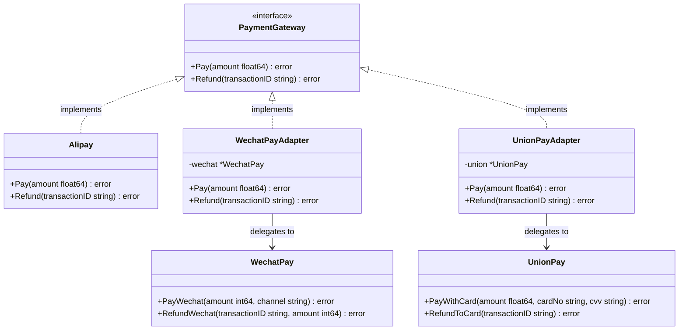
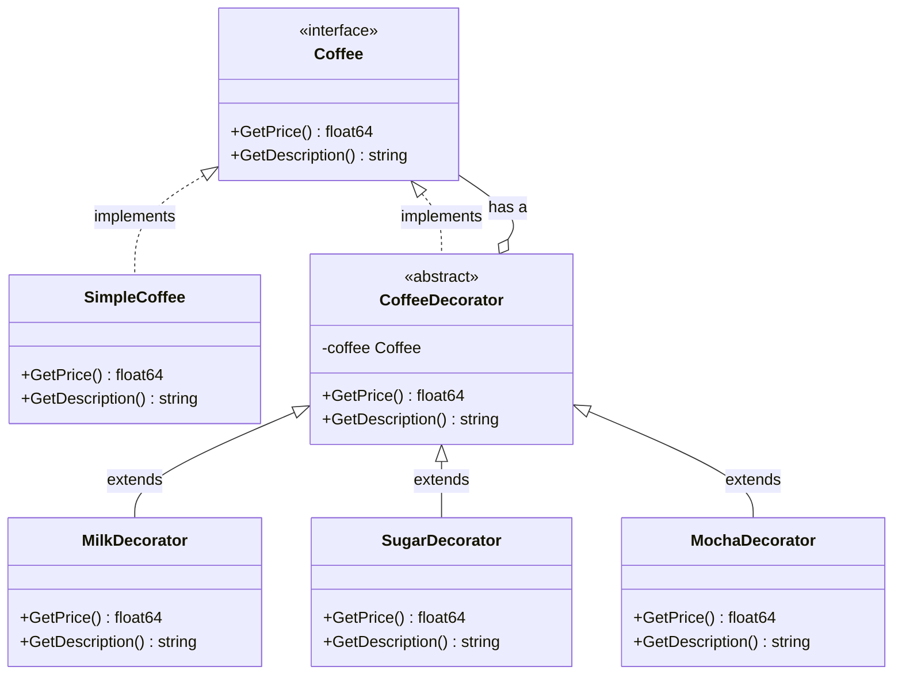
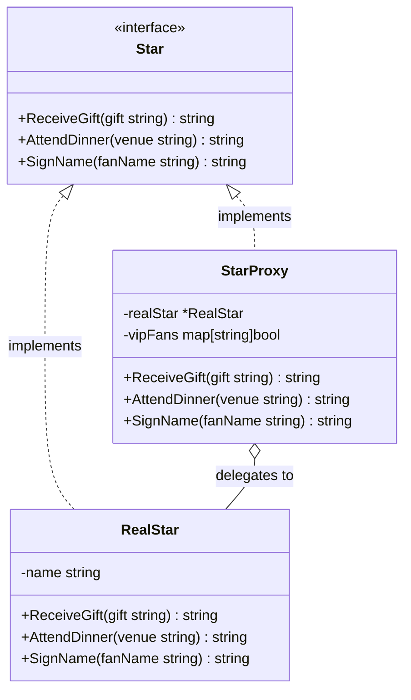
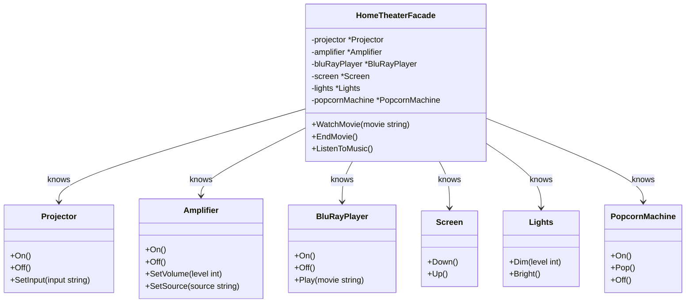
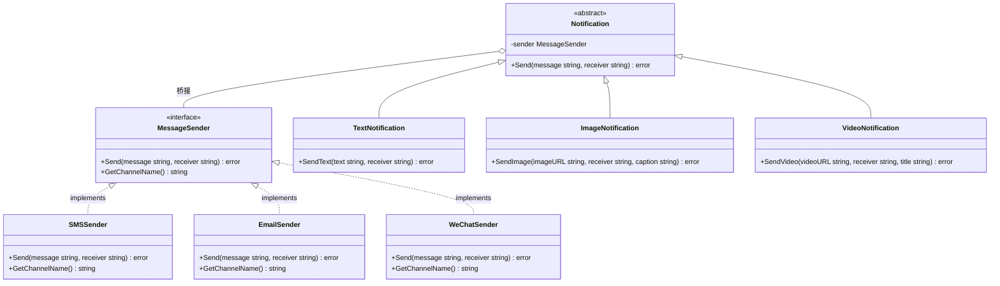
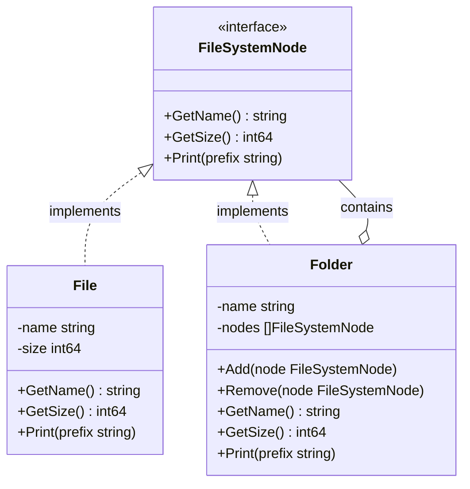
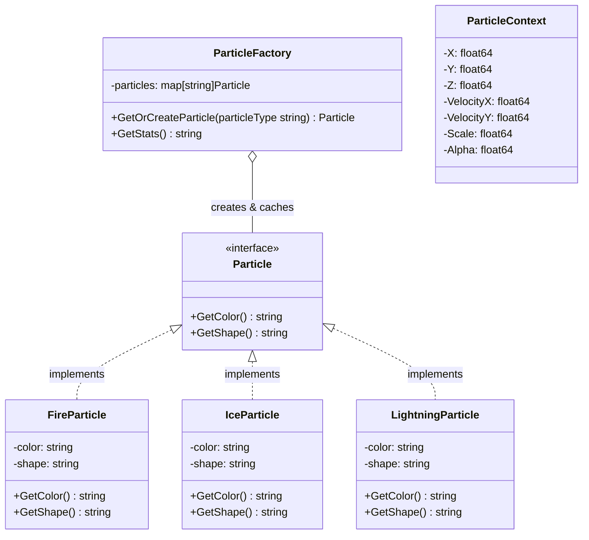

+++
title = "第39章 结构型模式"
weight = 390
date = "2026-03-23T08:39:00+08:00"
type = "docs"
description = ""
isCJKLanguage = true
draft = false
+++

# 第39章 结构型模式

> 本章我们会看到代码世界里的"万能转换头"——适配器模式。就像你出国旅行时那个神奇的转换插头，不管你带的是什么电器，不管插座是什么形状，插上去都能用。这就是适配器的魅力：让本不兼容的接口，突然之间就能愉快地一起工作了。

## 39.1 适配器模式

### 什么是适配器模式？

想象一个场景：你从国外带回来一个超级好用的电动牙刷，充电头是圆形的两孔插脚。但你家的插座是扁形的三角插孔。这时候你怎么办？总不能把墙砸了重新布线吧？机智的你一定会去买一个**转换插头**，一头能插圆孔，另一头能插扁孔，完美解决！

在软件世界里，这种"转换插头"的思路就是**适配器模式（Adapter Pattern）**。

**适配器模式**的核心思想是：将一个类的接口转换成客户期望的另一个接口，让原本接口不兼容的类可以一起愉快地工作。

你可以把适配器想象成一位精通多国语言的同声传译员——甲说德语，乙说日语，两个人谁也听不懂谁，但有了同声传译员，一切就和谐了。

### 适配器模式的必要性

在Go语言里，我们经常遇到这样的情况：

- 旧的代码写了一个打印功能，专门给"鸭子"用的：`PrintDuck(name string, weight float64)`
- 新的业务需要调用一个"鸟"的接口：`Bird{name, wingSpan float64}`
- 两个接口风马牛不相及，怎么让它们一起工作？

适配器就是来解决这个"世纪难题"的。它站在中间，充当翻译官，把"鸟语"翻译成"鸭语"，双方皆大欢喜。

### 适配器模式的类型

适配器模式根据实现方式可以分为两大流派：

1. **对象适配器（Object Adapter）**：通过组合的方式，把需要适配的对象包含进来。说白了就是"我有一个xxx，我帮你调用"。
2. **接口适配器（Interface Adapter）**：通过实现一个中间接口来达到适配的目的。这种在Go语言中特别常见，因为我们有`interface`这个法宝。

### 实际代码演示

让我们用一个接地气的例子来说明：假设我们有一套支付系统，最开始只支持"支付宝"支付，但后来需要接入"微信支付"和"银联支付"。

> 📌 **提示**：本章所有代码示例假设已导入 `fmt` 包。完整可运行代码请参考随书源码。

```go
// 定义一个统一的支付接口，就像不同国家的插座都遵循的统一标准
type PaymentGateway interface {
    Pay(amount float64) error
    Refund(transactionID string) error
}
```

这就是适配器模式的精髓：**先定义一个标准接口，然后为每一个"不标准"的实现编写适配器**。

```go
// 定义标准支付接口
type PaymentGateway interface {
    Pay(amount float64) error
    Refund(transactionID string) error
}

// Alipay（支付宝）—— 我们的"老朋友"，天生就实现了标准接口
type Alipay struct{}

func (a *Alipay) Pay(amount float64) error {
    fmt.Printf("支付宝收款: %.2f 元\n", amount)
    return nil
}

func (a *Alipay) Refund(transactionID string) error {
    fmt.Printf("支付宝退款，交易号: %s\n", transactionID)
    return nil
}

// WechatPay（微信支付）—— "新朋友"，接口和老系统不兼容
// 注意：微信支付的接口是 PayWechat(amount int64, channel string)
// 和我们的标准接口完全不搭嘎！
type WechatPay struct{}

func (w *WechatPay) PayWechat(amount int64, channel string) error {
    // 微信支付的金额单位是"分"，而不是"元"
    fmt.Printf("微信支付收款: %d 分，支付渠道: %s\n", amount, channel)
    return nil
}

func (w *WechatPay) RefundWechat(transactionID string, amount int64) error {
    fmt.Printf("微信退款，交易号: %s，金额: %d 分\n", transactionID, amount)
    return nil
}
```

这时候，**适配器**闪亮登场！它的工作就是"翻译"——把标准接口的调用，翻译成微信支付能理解的"方言"。

```go
// WechatPayAdapter 就是那个万能转换插头！
// 它实现了 PaymentGateway 接口，但内部调用的是 WechatPay 的方法
type WechatPayAdapter struct {
    wechat *WechatPay
}

// 构造函数，负责"组装"这个转换插头
func NewWechatPayAdapter() *WechatPayAdapter {
    return &WechatPayAdapter{
        wechat: &WechatPay{},
    }
}

// 关键方法：Pay 的实现
// 这里把"元"转换成"分"，把标准接口的调用转换成微信支付能理解的格式
func (adapter *WechatPayAdapter) Pay(amount float64) error {
    // 金额单位转换：元 -> 分
    amountInCent := int64(amount * 100)
    channel := "WX_NATIVE" // 默认使用Native支付
    return adapter.wechat.PayWechat(amountInCent, channel)
}

func (adapter *WechatPayAdapter) Refund(transactionID string) error {
    // 假设退款金额从外部获取，这里简化处理
    return adapter.wechat.RefundWechat(transactionID, 0)
}
```

```go
// UnionPay（银联支付）—— 又一个"方言"选手
type UnionPay struct{}

func (u *UnionPay) PayWithCard(amount float64, cardNo string, cvv string) error {
    // 银联需要卡号和CVV，是不是很烦？
    fmt.Printf("银联收款: %.2f 元，卡号: %s***\n", amount, cardNo[:4])
    return nil
}

func (u *UnionPay) RefundToCard(transactionID string) error {
    fmt.Printf("银联退款，交易号: %s\n", transactionID)
    return nil
}

// UnionPayAdapter —— 银联支付适配器
type UnionPayAdapter struct {
    union *UnionPay
}

func NewUnionPayAdapter() *UnionPayAdapter {
    return &UnionPayAdapter{union: &UnionPay{}}
}

func (adapter *UnionPayAdapter) Pay(amount float64) error {
    // 银联需要虚拟卡号，这里简化处理
    return adapter.union.PayWithCard(amount, "6222021234567890", "123")
}

func (adapter *UnionPayAdapter) Refund(transactionID string) error {
    return adapter.union.RefundToCard(transactionID)
}
```

好了，现在我们有了适配器大军，来看看怎么使用：

```go
// ProcessPayment 是一个通用的支付处理函数
// 它只认识 PaymentGateway，不管你是支付宝还是微信还是银联
func ProcessPayment(gateway PaymentGateway, amount float64) {
    fmt.Println("=== 开始支付流程 ===")
    if err := gateway.Pay(amount); err != nil {
        fmt.Printf("支付失败: %v\n", err)
        return
    }
    fmt.Println("支付成功！")
    fmt.Println("=== 支付流程结束 ===\n")
}

func main() {
    // 场景一：使用支付宝（它天然就符合标准接口）
    alipay := &Alipay{}
    ProcessPayment(alipay, 199.50)

    // 场景二：使用微信支付（通过适配器接入）
    wechatAdapter := NewWechatPayAdapter()
    ProcessPayment(wechatAdapter, 199.50)

    // 场景三：使用银联支付（也是通过适配器接入）
    unionAdapter := NewUnionPayAdapter()
    ProcessPayment(unionAdapter, 199.50)
}
```

运行结果：

```
=== 开始支付流程 ===
支付宝收款: 199.50 元
支付成功！
=== 支付流程结束 ===

=== 开始支付流程 ===
微信支付收款: 19950 分，支付渠道: WX_NATIVE
支付成功！
=== 支付流程结束 ===

=== 开始支付流程 ===
银联收款: 199.50 元，卡号: 6222***
支付成功！
=== 支付流程结束 ===
```

看到了吗？`ProcessPayment` 函数从头到尾只认识 `PaymentGateway` 这一个接口，但它实际上调用了三种完全不同的支付方式。这就是适配器模式的威力——**让不兼容变得兼容，让隔离变得统一**。

### 进阶用法：函数适配器

在Go语言中，函数是一等公民，所以适配器也可以是一个函数，而不一定是一个结构体。这种写法更加轻量级：

```go
// 定义一个"旧系统"的遗留接口，参数列表很奇葩
type LegacyAPI func(userID int, data string, timeout int) (string, error)

// 新的标准接口只需要一个参数
type NewAPI func(req string) (string, error)

// LegacyToNewAdapter 就是函数适配器
// 它把旧接口的参数"组装"成新接口需要的格式
func LegacyToNewAdapter(legacy LegacyAPI) NewAPI {
    return func(req string) (string, error) {
        // 旧接口需要 userID, data, timeout，我们这里硬编码一些默认值
        // 真实场景中，这些值可能来自 req 的解析
        userID := 10086
        timeout := 30
        return legacy(userID, req, timeout)
    }
}
```

```go
func main() {
    // 模拟旧系统的遗留接口
    legacyFunc := func(userID int, data string, timeout int) (string, error) {
        result := fmt.Sprintf("旧系统处理: userID=%d, data=%s, timeout=%d", userID, data, timeout)
        return result, nil
    }

    // 通过适配器，把旧接口转换成新接口
    newFunc := LegacyToNewAdapter(legacyFunc)

    // 现在可以像使用新接口一样使用它
    result, _ := newFunc("Hello, 适配器！")
    fmt.Println(result)
}
```

运行结果：

```
旧系统处理: userID=10086, data=Hello, 适配器！, timeout=30
```

### 适配器模式的 UML 图



### 什么时候该用适配器模式？

适配器模式是应对"历史遗留问题"的良药。当你遇到以下情况时，适配器模式就是你的好朋友：

1. **引入第三方库，但接口不兼容**：第三方给你的是 `DoSomethingAwesome(name string, count int)`，你需要的是 `DoSomething(names []string)`，这时候写个适配器，世界就安静了。
2. **系统重构，旧代码不能动**：老代码写着 `PrintInfo(id int, name string)`，新架构需要 `ShowInfo(info Info)`，适配器来拯救世界。
3. **统一多个不同接口的调用方式**：就像前面支付系统的例子，多个支付渠道，统一接口调用。

### 适配器模式的注意事项

- **不要过度使用**：如果你能直接改造原接口，那就直接改。适配器是"不得已而为之"的选择，不是所有不兼容都要用适配器。
- **适配器不改变原有功能**：适配器只是"翻译"，不会改变被适配者的行为逻辑。它不负责业务，它只负责翻译。
- **保持适配器轻量**：适配器里应该只有"翻译"逻辑，不要掺杂业务逻辑，否则适配器会越来越胖，最终变成另一个难以维护的怪物。

### 幽默总结

适配器模式就像是你手机里的那个**万能转接头**——一边是USB-C，一边是USB-A，一边是Lightning，一边是3.5mm耳机孔。

有了它，你可以在会议室里自信地掏出你的设备，不用担心插不上去的问题。

代码世界里的适配器也是同样的道理：它不改变你的设备，也不改变墙上的插座，它只负责让"插不进去"变成"插进去"。

这就是程序员的浪漫——用一个适配器，解决世界上所有的"接口不兼容"问题。

---

## 39.2 装饰器模式

### 什么是装饰器模式？

先讲个故事：你想喝一杯咖啡，最开始你只要一杯纯咖啡，花费30元。后来你觉得不够过瘾，想加一份牛奶，+5元。再后来你觉得需要加一份糖，+2元。然后你又想加一份摩卡，+8元。最后你发现——等等，这个结账系统怎么算价格？

如果是一个不懂装饰器模式的程序员，他可能会这样写：

```go
type Coffee struct {
    Name        string
    Price       float64
    WithMilk    bool
    WithSugar   bool
    WithMocha   bool
    WithWhipped bool
    // ... 一长串配料flag
}
```

然后 `CalcPrice` 方法里写满了 `if withMilk { price += 5 }` 这种代码。结局是什么？当你想要加"肉桂粉"的时候，你又要改结构体，又要改计算方法，牵一发动全身。

**装饰器模式（Decorator Pattern）** 解决的就是这个问题：让你可以**一层一层地包装对象**，每加一层配料就包装一次，价格自动累加，而且完全不需要修改原有的咖啡类！

### 装饰器模式的核心思想

装饰器模式的核心是：**装饰器（Decorator）和被装饰者（Component）实现同一个接口，装饰器内部持有被装饰者的引用，调用它并加上自己的"装饰"逻辑。**

这就像俄罗斯套娃，一层套一层，每一层都说："我先处理一下，然后传给下一位。"

```go
// 首先定义一个统一接口——所有咖啡（不管加了多少配料）都实现这个接口
type Coffee interface {
    GetPrice() float64        // 获取当前这杯咖啡的价格
    GetDescription() string  // 获取当前这杯咖啡的描述
}
```

```go
// 基础咖啡，实现 Coffee 接口
type SimpleCoffee struct{}

func (c *SimpleCoffee) GetPrice() float64 {
    return 30.0 // 一杯纯咖啡，30元
}

func (c *SimpleCoffee) GetDescription() string {
    return "原味咖啡"
}
```

现在，让我们定义一个"装饰器基类"——等等，Go语言没有类的概念，所以我们用结构体来模拟：

```go
// CoffeeDecorator 就是"装饰器基类"，它也实现了 Coffee 接口
// 不同的是，它内部持有一个"已经被装饰过的咖啡"的引用
// 注意：这里是具名字段嵌套，而不是匿名嵌套（匿名嵌套才类似"继承"）
type CoffeeDecorator struct {
    coffee Coffee // 引用，可以是一杯基础咖啡，也可以是另一个装饰器
}

func (d *CoffeeDecorator) GetPrice() float64 {
    // 装饰器默认不额外收费，价格由具体的装饰器子类决定
    return d.coffee.GetPrice()
}

func (d *CoffeeDecorator) GetDescription() string {
    return d.coffee.GetDescription()
}
```

接下来是各种配料装饰器：

```go
// MilkDecorator —— 牛奶装饰器
type MilkDecorator struct {
    *CoffeeDecorator // 匿名嵌套，相当于"继承"了 GetPrice 和 GetDescription 方法
}

func NewMilkDecorator(coffee Coffee) *MilkDecorator {
    return &MilkDecorator{
        CoffeeDecorator: &CoffeeDecorator{coffee: coffee},
    }
}

// 关键：牛奶的额外价格
func (d *MilkDecorator) GetPrice() float64 {
    basePrice := d.coffee.GetPrice()
    milkPrice := 5.0
    fmt.Printf("[牛奶装饰器] 基础价格: %.2f, 牛奶价格: %.2f\n", basePrice, milkPrice)
    return basePrice + milkPrice
}

// 关键：牛奶的额外描述
func (d *MilkDecorator) GetDescription() string {
    return d.coffee.GetDescription() + " + 牛奶"
}
```

```go
// SugarDecorator —— 糖装饰器
type SugarDecorator struct {
    *CoffeeDecorator
}

func NewSugarDecorator(coffee Coffee) *SugarDecorator {
    return &SugarDecorator{
        CoffeeDecorator: &CoffeeDecorator{coffee: coffee},
    }
}

func (d *SugarDecorator) GetPrice() float64 {
    basePrice := d.coffee.GetPrice()
    sugarPrice := 2.0
    fmt.Printf("[糖装饰器] 基础价格: %.2f, 糖价格: %.2f\n", basePrice, sugarPrice)
    return basePrice + sugarPrice
}

func (d *SugarDecorator) GetDescription() string {
    return d.coffee.GetDescription() + " + 糖"
}
```

```go
// MochaDecorator —— 摩卡装饰器
type MochaDecorator struct {
    *CoffeeDecorator
}

func NewMochaDecorator(coffee Coffee) *MochaDecorator {
    return &MochaDecorator{
        CoffeeDecorator: &CoffeeDecorator{coffee: coffee},
    }
}

func (d *MochaDecorator) GetPrice() float64 {
    basePrice := d.coffee.GetPrice()
    mochaPrice := 8.0
    fmt.Printf("[摩卡装饰器] 基础价格: %.2f, 摩卡价格: %.2f\n", basePrice, mochaPrice)
    return basePrice + mochaPrice
}

func (d *MochaDecorator) GetDescription() string {
    return d.coffee.GetDescription() + " + 摩卡"
}
```

```go
// WhippedCreamDecorator —— 鲜奶油装饰器
type WhippedCreamDecorator struct {
    *CoffeeDecorator
}

func NewWhippedCreamDecorator(coffee Coffee) *WhippedCreamDecorator {
    return &WhippedCreamDecorator{
        CoffeeDecorator: &CoffeeDecorator{coffee: coffee},
    }
}

func (d *WhippedCreamDecorator) GetPrice() float64 {
    basePrice := d.coffee.GetPrice()
    whippedPrice := 6.0
    fmt.Printf("[鲜奶油装饰器] 基础价格: %.2f, 鲜奶油价格: %.2f\n", basePrice, whippedPrice)
    return basePrice + whippedPrice
}

func (d *WhippedCreamDecorator) GetDescription() string {
    return d.coffee.GetDescription() + " + 鲜奶油"
}
```

现在来看看装饰器是怎么工作的：

```go
func main() {
    fmt.Println("=== 点一杯基础咖啡 ===")
    coffee := &SimpleCoffee{}
    fmt.Printf("描述: %s, 价格: %.2f 元\n", coffee.GetDescription(), coffee.GetPrice())

    fmt.Println("\n=== 点一杯咖啡 + 牛奶 ===")
    coffeeWithMilk := NewMilkDecorator(coffee)
    fmt.Printf("描述: %s, 价格: %.2f 元\n", coffeeWithMilk.GetDescription(), coffeeWithMilk.GetPrice())

    fmt.Println("\n=== 点一杯咖啡 + 牛奶 + 糖 ===")
    coffeeWithMilkAndSugar := NewSugarDecorator(coffeeWithMilk)
    fmt.Printf("描述: %s, 价格: %.2f 元\n", coffeeWithMilkAndSugar.GetDescription(), coffeeWithMilkAndSugar.GetPrice())

    fmt.Println("\n=== 点一杯咖啡 + 牛奶 + 糖 + 摩卡 ===")
    coffeeDeluxe := NewMochaDecorator(coffeeWithMilkAndSugar)
    fmt.Printf("描述: %s, 价格: %.2f 元\n", coffeeDeluxe.GetDescription(), coffeeDeluxe.GetPrice())

    fmt.Println("\n=== 超级豪华套餐：咖啡 + 牛奶 + 糖 + 摩卡 + 鲜奶油 ===")
    coffeeUltimate := NewWhippedCreamDecorator(coffeeDeluxe)
    fmt.Printf("描述: %s, 价格: %.2f 元\n", coffeeUltimate.GetDescription(), coffeeUltimate.GetPrice())
}
```

运行结果：

```
=== 点一杯基础咖啡 ===
描述: 原味咖啡, 价格: 30.00 元

=== 点一杯咖啡 + 牛奶 ===
[牛奶装饰器] 基础价格: 30.00, 牛奶价格: 5.00
描述: 原味咖啡 + 牛奶, 价格: 35.00 元

=== 点一杯咖啡 + 牛奶 + 糖 ===
[糖装饰器] 基础价格: 35.00, 糖价格: 2.00
描述: 原味咖啡 + 牛奶 + 糖, 价格: 37.00 元

=== 点一杯咖啡 + 牛奶 + 糖 + 摩卡 ===
[摩卡装饰器] 基础价格: 37.00, 摩卡价格: 8.00
描述: 原味咖啡 + 牛奶 + 糖 + 摩卡, 价格: 45.00 元

=== 超级豪华套餐：咖啡 + 牛奶 + 糖 + 摩卡 + 鲜奶油 ===
[鲜奶油装饰器] 基础价格: 45.00, 鲜奶油价格: 6.00
描述: 原味咖啡 + 牛奶 + 糖 + 摩卡 + 鲜奶油, 价格: 51.00 元
```

看到了吗？每一层装饰器都知道自己"上面"是什么，它先让"下面"的把事情做完，然后自己再加一把力。这就是**装饰器模式**的核心哲学：**不改变已有对象，动态地给它添加职责**。

### Go语言装饰器的高级技巧：函数式装饰器

在函数式编程的世界里，装饰器可以更加优雅——用函数来写装饰器！这种写法在Go的Web开发中特别常见（比如中间件）：

```go
// 定义一个"处理器函数"类型
type HandlerFunc func(w string, r string) string

// 第一个装饰器：日志中间件
// 它的输入是一个 HandlerFunc，输出也是一个 HandlerFunc
func LoggingDecorator(next HandlerFunc) HandlerFunc {
    return func(w string, r string) string {
        fmt.Printf("[日志] 收到请求: %s, 参数: %s\n", w, r)
        result := next(w, r) // 先调用真正的处理函数
        fmt.Printf("[日志] 响应结果: %s\n", result)
        return result
    }
}

// 第二个装饰器：认证中间件
func AuthDecorator(next HandlerFunc) HandlerFunc {
    return func(w string, r string) string {
        fmt.Println("[认证] 检查用户身份...")
        if r == "" {
            fmt.Println("[认证] 未携带参数，拒绝访问！")
            return "Unauthorized"
        }
        result := next(w, r)
        fmt.Println("[认证] 认证通过！")
        return result
    }
}

// 第三个装饰器：超时控制中间件
func TimeoutDecorator(next HandlerFunc) HandlerFunc {
    return func(w string, r string) string {
        fmt.Println("[超时控制] 开始计时...")
        // 这里简化处理，实际场景应该用 goroutine + channel 实现真正的超时
        result := next(w, r)
        fmt.Println("[超时控制] 任务完成，计时结束！")
        return result
    }
}
```

```go
// 真实的处理器函数
func RealHandler(w string, r string) string {
    fmt.Printf("[真实处理器] 处理业务逻辑: w=%s, r=%s\n", w, r)
    return fmt.Sprintf("处理结果: Hello %s!", r)
}

func main() {
    // 一层一层地包装，就像套娃一样
    // 最外层是 TimeoutDecorator
    // 它包装了 AuthDecorator
    // AuthDecorator 又包装了 LoggingDecorator
    // LoggingDecorator 最终包装了 RealHandler

    handler := TimeoutDecorator(
        AuthDecorator(
            LoggingDecorator(RealHandler),
        ),
    )

    fmt.Println("=== 执行装饰后的处理器 ===")
    response := handler("GET", "World")
    fmt.Printf("最终响应: %s\n", response)
}
```

运行结果：

```
=== 执行装饰后的处理器 ===
[超时控制] 开始计时...
[认证] 检查用户身份...
[日志] 收到请求: GET, 参数: World
[真实处理器] 处理业务逻辑: w=GET, r=World
[日志] 响应结果: 处理结果: Hello World!
[认证] 认证通过！
[超时控制] 任务完成，计时结束！
最终响应: 处理结果: Hello World!
```

看看这个调用链，完美展示了装饰器的执行顺序：

- **TimeoutDecorator** 最外层，所以最先开始，最后结束（就像外套，先穿最后脱）
- **AuthDecorator** 在中间，执行顺序是"进入时第二"
- **LoggingDecorator** 更靠里，"进入时第三"
- **RealHandler** 最里面，"进入时最后"，但"离开时最先"

这非常像HTTP中间件栈的洋葱模型，洋葱怎么切，切面都是对称的。

### 装饰器模式的 UML 图



### 装饰器 vs 继承

很多人会问：我用继承也可以实现同样的效果啊？为什么非要用装饰器？

好问题！让我们来对比一下：

| 维度 | 继承 | 装饰器 |
|------|------|--------|
| 灵活性 | 低——必须在编译时决定"这个类是那个类的子类" | 高——可以在运行时动态组合 |
| 类爆炸 | 灾难——4种配料组合需要 2^4=16 个子类 | 不存在——只需要4种装饰器 |
| 开闭原则 | 违反——加新配料要改已有类 | 遵守——加新配料只需新增装饰器 |
| 执行顺序 | 固定 | 取决于组合顺序 |

看一个类爆炸的例子：

- `Coffee`
- `MilkCoffee`
- `SugarCoffee`
- `MochaCoffee`
- `MilkSugarCoffee`
- `MilkMochaCoffee`
- `SugarMochaCoffee`
- `MilkSugarMochaCoffee`
- `...`

这还只有3种配料！如果加10种配料呢？2^10 = 1024 个类需要写，编辑器都要哭了。

### 装饰器模式的注意事项

1. **装饰顺序很重要**：`MilkDecorator(SugarDecorator(coffee))` 和 `SugarDecorator(MilkDecorator(coffee))` 可能会产生不同的结果——虽然最终价格可能一样，但描述顺序会不同。
2. **不要在装饰器里修改被装饰者的核心行为**：装饰器是"增强"，不是"替代"。如果你发现你的装饰器把原有逻辑全改了，那可能用错了模式。
3. **小心"装饰器链"过长**：链太长会导致调试困难，因为栈trace会变得很复杂。每次看报错你都要数一数这是第几层装饰器。
4. **识别标志**：如果你看到代码里有大量 `if` 语句检查"有没有加这个配料"，那就说明该用装饰器了。

### 幽默总结

装饰器模式就像是**火锅自助餐的点单方式**：

- 你先拿一个空锅（基础对象）
- 服务员问："加不加毛肚？"你说"加"，他就给你加毛肚装饰器
- 服务员问："加不加虾滑？"你说"加"，他就给你加虾滑装饰器
- 服务员问："加不加..."你说"都加！"，恭喜你得到一个超级火锅装饰器

而且关键是——不管你怎么加，你的锅还是那个锅，只是外面套了一层又一层的"装饰"。

程序员也是这么干的：代码不够好？不用重写！外面包一层装饰器，完美！

---

## 39.3 代理模式

### 什么是代理模式？

想象一个场景：你是一个大忙人，每天都有无数人想找你帮忙，但你不可能什么事都亲力亲为。于是你雇了一个**秘书**——所有找你的人，先过秘书这一关。秘书会根据情况决定：

- 这点小事我帮你回了，不用打扰老板
- 这个请求有点意思，我帮你筛选一下再上报
- 这个很重要，必须老板亲自处理

在代码世界里，这个秘书就是**代理（Proxy）**。

**代理模式（Proxy Pattern）** 的核心思想是：为一个对象提供一个替身或占位符，以控制对原对象的访问。代理对象在客户端和真实对象之间充当中介，客户端实际上是在跟代理打交道，而不是直接跟真实对象打交道。

### 代理模式的常见应用场景

代理模式在现实中应用非常广泛：

1. **远程代理**：你在本地访问一个远程服务器上的对象，本地代理帮你转发请求，你感觉就像访问本地对象一样。
2. **虚代理（懒加载）**：一个很大很重的对象，不需要马上创建，先用一个小代理占着，等真正需要的时候再加载真实对象。就像你去超市，先拿一个购物车（代理），等你选好商品结账时才真正"加载"购物车里的东西。
3. **保护代理**：访问权限控制，不是所有人都能访问真实对象，代理先审查一下你有没有权限。
4. **智能引用**：访问对象时，代理做些额外的事情，比如记录访问次数、缓存结果等。

### Go语言实现代理模式

让我们用一个接地气的例子：假设你是一个追星族，想约明星出来吃饭。但明星很忙，不可能每个粉丝都亲自接待。于是有了**经纪人（Agent/Proxy）**来处理这些事情。

```go
// 定义一个"明星"接口，所有明星都要实现这个接口
type Star interface {
    // ReceiveGift 接收粉丝礼物
    ReceiveGift(gift string) string
    // AttendDinner 参加晚宴
    AttendDinner(venue string) string
    // SignName 为粉丝签名
    SignName(fanName string) string
}
```

```go
// RealStar 是真正的明星——我们的大明星"小美"
type RealStar struct {
    name string
}

func NewRealStar(name string) *RealStar {
    return &RealStar{name: name}
}

func (s *RealStar) ReceiveGift(gift string) string {
    // 明星亲自接收礼物
    return fmt.Sprintf("明星[%s]收到礼物: %s，非常感谢！", s.name, gift)
}

func (s *RealStar) AttendDinner(venue string) string {
    // 明星亲自确认晚宴
    return fmt.Sprintf("明星[%s]确认出席晚宴，地点: %s", s.name, venue)
}

func (s *RealStar) SignName(fanName string) string {
    // 明星亲自签名
    return fmt.Sprintf("明星[%s]为粉丝[%s]签名: 祝学业进步，天天开心！", s.name, fanName)
}
```

```go
// StarProxy 是经纪人/代理——负责替明星过滤和处理请求
type StarProxy struct {
    realStar *RealStar // 持有一个真实明星的引用
    // 代理还有一些自己的"资源"，比如：可以设置拦截条件
    vipFans map[string]bool // VIP粉丝名单
}

func NewStarProxy(star *RealStar) *StarProxy {
    return &StarProxy{
        realStar: star,
        vipFans: map[string]bool{
            "王思聪": true,   // 顶级VIP
            "马云":   true,   // 顶级VIP
            "普通粉丝": false, // 普通粉丝
        },
    }
}

func (p *StarProxy) ReceiveGift(gift string) string {
    // 代理先"过滤"一下
    fmt.Printf("[经纪人] 检查礼物: %s\n", gift)

    // 过滤逻辑：太贵重的礼物不接受（保护明星）
    if len(gift) > 50 {
        fmt.Println("[经纪人] 抱歉，礼物太贵重了，明星不能收！")
        return "经纪人代为拒绝: 礼物太贵重"
    }

    // 过滤逻辑：违禁品不接受
    if gift == "炸弹" || gift == "辣椒水" {
        fmt.Println("[经纪人] 抱歉，这个不能收！")
        return "经纪人代为拒绝: 违禁品"
    }

    // 通过过滤，交给明星处理
    fmt.Println("[经纪人] 礼物检查通过，转交明星！")
    return p.realStar.ReceiveGift(gift)
}

func (p *StarProxy) AttendDinner(venue string) string {
    // 代理先检查晚宴地点
    fmt.Printf("[经纪人] 检查晚宴地点: %s\n", venue)

    // 过滤逻辑：太远的地点不去
    if venue == "非洲大草原" {
        fmt.Println("[经纪人] 抱歉，太远了，明星档期冲突！")
        return "经纪人代为拒绝: 档期冲突"
    }

    // 通过检查，转交明星
    return p.realStar.AttendDinner(venue)
}

func (p *StarProxy) SignName(fanName string) string {
    fmt.Printf("[经纪人] 检查签名请求: 粉丝 [%s]\n", fanName)

    // 过滤逻辑：检查是否是VIP粉丝
    if p.vipFans[fanName] {
        fmt.Println("[经纪人] VIP粉丝！直接转交明星！")
        return p.realStar.SignName(fanName)
    }

    // 不是VIP，那就只能签个名，明星不亲自写了
    fmt.Println("[经纪人] 普通粉丝，明星不亲自写，我代签吧！")
    return fmt.Sprintf("【代签】明星经纪人替明星[%s]为粉丝[%s]签名: 谢谢支持！", p.realStar.name, fanName)
}
```

```go
func main() {
    // 创建真实明星
    star := NewRealStar("小美")

    // 创建代理（经纪人）
    proxy := NewStarProxy(star)

    // 粉丝们开始请求了

    fmt.Println("=== 场景1: 普通粉丝送礼物 ===")
    result := proxy.ReceiveGift("一束鲜花")
    fmt.Println(result)
    fmt.Println()

    fmt.Println("=== 场景2: 有人送炸弹（违禁品） ===")
    result = proxy.ReceiveGift("炸弹")
    fmt.Println(result)
    fmt.Println()

    fmt.Println("=== 场景3: VIP粉丝王思聪请求签名 ===")
    result = proxy.SignName("王思聪")
    fmt.Println(result)
    fmt.Println()

    fmt.Println("=== 场景4: 普通粉丝请求签名 ===")
    result = proxy.SignName("普通粉丝")
    fmt.Println(result)
    fmt.Println()

    fmt.Println("=== 场景5: 有人邀请去非洲大草原 ===")
    result = proxy.AttendDinner("非洲大草原")
    fmt.Println(result)
    fmt.Println()

    fmt.Println("=== 场景6: 正常晚宴邀请 ===")
    result = proxy.AttendDinner("北京烤鸭店")
    fmt.Println(result)
}
```

运行结果：

```
=== 场景1: 普通粉丝送礼物 ===
[经纪人] 检查礼物: 一束鲜花
[经纪人] 礼物检查通过，转交明星！
明星[小美]收到礼物: 一束鲜花，非常感谢！

=== 场景2: 有人送炸弹（违禁品） ===
[经纪人] 检查礼物: 炸弹
[经纪人] 抱歉，这个不能收！

=== 场景3: VIP粉丝王思聪请求签名 ===
[经纪人] 检查签名请求: 粉丝 [王思聪]
[经纪人] VIP粉丝！直接转交明星！
明星[小美]为粉丝[王思聪]签名: 祝学业进步，天天开心！

=== 场景4: 普通粉丝请求签名 ===
[经纪人] 检查签名请求: 粉丝 [普通粉丝]
[经纪人] 普通粉丝，明星不亲自写，我代签吧！
【代签】明星经纪人替明星[小美]为粉丝[普通粉丝]签名: 谢谢支持！

=== 场景5: 有人邀请去非洲大草原 ===
[经纪人] 检查晚宴地点: 非洲大草原
[经纪人] 抱歉，太远了，明星档期冲突！

=== 场景6: 正常晚宴邀请 ===
[经纪人] 检查晚宴地点: 北京烤鸭店
明星[小美]确认出席晚宴，地点: 北京烤鸭店
```

看！这就是代理模式的精髓：客户端以为自己是在跟明星直接打交道，实际上所有的请求都经过了经纪人（代理）的筛选和处理。

### 代理模式 vs 装饰器模式

等等，这看起来跟装饰器模式很像啊！都是"包装"一个对象，都是实现同一个接口，都是把调用转发给被包装的对象。

**关键区别在于它们的目的**：

- **装饰器模式**的目的是：**增强**。我想给一个对象添加新的行为/功能，比如给咖啡加牛奶。
- **代理模式**的目的是：**控制**。我想控制对对象的访问，比如过滤请求、限制权限。

用一个更形象的比喻：

- **装饰器**：给咖啡加配料（摩卡、牛奶、糖），让它变成一杯更好喝的咖啡
- **代理**：在咖啡馆门口站个保安，不让未成年人进去

两者都在"包装"，但"为什么包装"不一样。

### 代理模式的 UML 图



### 代理模式的高级变体：虚代理（懒加载）

有时候真实对象创建起来非常昂贵（比如要加载大文件、建立数据库连接等），我们不想马上创建它。这时候可以用**虚代理**——用一个轻量级的代理先占着位置，等真正需要的时候再创建真实对象。

```go
// Image 是图片接口
type Image interface {
    Display()
}

// RealImage 是真实的大图片，加载它需要很多资源
type RealImage struct {
    filename string
}

func NewRealImage(filename string) *RealImage {
    img := &RealImage{filename: filename}
    // 模拟：加载大文件需要消耗很多资源
    fmt.Printf("[RealImage] 正在加载大文件: %s (这需要3秒钟...)\n", filename)
    // time.Sleep(3 * time.Second) // 实际场景中，这里会真的很慢
    fmt.Printf("[RealImage] 文件 %s 加载完成！\n", filename)
    return img
}

func (img *RealImage) Display() {
    fmt.Printf("[RealImage] 显示图片: %s\n", img.filename)
}

// VirtualImageProxy 是虚代理——按需加载
type VirtualImageProxy struct {
    realImage *RealImage // 初始为 nil，表示还没加载
    filename  string
}

func NewVirtualImageProxy(filename string) *VirtualImageProxy {
    return &VirtualImageProxy{filename: filename}
}

// Display 方法会按需加载真实图片
func (proxy *VirtualImageProxy) Display() {
    // 懒加载：只有第一次真正需要显示的时候，才加载真实图片
    if proxy.realImage == nil {
        fmt.Printf("[VirtualProxy] 第一次访问，需要加载真实图片...\n")
        proxy.realImage = NewRealImage(proxy.filename)
    } else {
        fmt.Printf("[VirtualProxy] 图片已经加载过了，直接使用缓存！\n")
    }
    proxy.realImage.Display()
}
```

```go
func main() {
    fmt.Println("=== 创建虚代理（这时候不会加载真实图片！） ===")
    proxy := NewVirtualImageProxy("test_image_100MB.jpg")
    fmt.Println("虚代理创建完成，真实图片还没有加载。")

    fmt.Println("\n=== 第一次调用 Display（这时候才会加载） ===")
    proxy.Display()

    fmt.Println("\n=== 第二次调用 Display（直接使用缓存） ===")
    proxy.Display()
}
```

运行结果：

```
=== 创建虚代理（这时候不会加载真实图片！） ===
虚代理创建完成，真实图片还没有加载。

=== 第一次调用 Display（这时候才会加载真实图片...） ===
[VirtualProxy] 第一次访问，需要加载真实图片...
[RealImage] 正在加载大文件: test_image_100MB.jpg (这需要3秒钟...)
[RealImage] 文件 test_image_100MB.jpg 加载完成！
[RealImage] 显示图片: test_image_100MB.jpg

=== 第二次调用 Display（直接使用缓存） ===
[VirtualProxy] 图片已经加载过了，直接使用缓存！
[RealImage] 显示图片: test_image_100MB.jpg
```

这就是**虚代理**的魅力——延迟加载，节省资源。就像你去快递柜取件，你只是扫码占了个柜子（代理），但实际上快递员还在卡车上（没有真正"加载"）。等你真的去取件了，快递员才把东西放到柜子里。

### 幽默总结

代理模式就像是**明星的经纪人**：

- 你想约明星吃饭？先过经纪人这关
- 你想送明星礼物？先过经纪人这关
- 你想让明星签名？先过经纪人这关

明星本人很忙的，没空搭理每一个粉丝。但经纪人不一样——经纪人是专业的"访问控制"专家，知道什么该放行，什么该拦截。

而且代理模式还有一种"替身"的意味，就像电影里的**文替**（文字替身）和**武替**（武术替身）。明星不是每个镜头都要亲自上的，有些简单的活儿，替身就搞定了。

这就是程序员的浪漫——用代理，让你的系统也能拥有明星级别的"经纪人服务"。

---

## 39.4 外观模式

### 什么是外观模式？

想象一个场景：你买了一台全新的智能电视，品牌旗舰款，功能强大到爆炸。但是——当你满怀期待地打开包装盒，准备开始欣赏节目时，你发现电视背后有一堆乱七八糟的线：

- 电源线要接插座
- HDMI线要接电脑
- AV线要接老式游戏机
- 网线要接路由器
- 天线要接有线电视盒
- USB线要接移动硬盘
- 还有音响线、视频线、不知道干什么用的各种线...

这时候你崩溃了。你只想看个电视，为什么要了解这些？于是你机智地选择了**让专业人士上门安装**，师傅三下五除二帮你接好了所有线，你只需要按一个遥控器就能看电视了。

这个帮你**统一接入、统一管理**的安装师傅，就是**外观模式（Facade Pattern）**。

**外观模式（Facade Pattern）** 的核心思想是：为一组复杂的子系统提供一个统一的接口，让客户端不需要了解子系统内部的复杂细节，只需要跟外观对象交互即可。

### 外观模式解决什么问题？

假设你要开发一个"家庭影院系统"，需要：

1. 打开投影仪
2. 打开音响
3. 打开蓝光播放器
4. 放下投影幕布
5. 调暗灯光
6. 选择正确的HDMI输入

如果不用外观模式，客户端需要知道每一个设备的操作方法，然后一个一个去操作。这对客户端来说太痛苦了——它只想"看电影"，为什么需要了解这么多细节？

用**外观模式**的话，客户端只需要调用一个 `WatchMovie()` 方法，外观对象会帮你搞定一切。

### Go语言实现外观模式

让我们用代码来演示这个家庭影院的例子：

```go
// 先定义各个子系统的"复杂"接口和实现
// 注意：这些接口通常都很专业，很复杂，普通用户不需要了解

// Projector 投影仪
type Projector struct{}

func (p *Projector) On() {
    fmt.Println("投影仪启动中...嗡嗡嗡...")
}

func (p *Projector) Off() {
    fmt.Println("投影仪关闭中...")
}

func (p *Projector) SetInput(input string) {
    fmt.Printf("投影仪输入切换到: %s\n", input)
}

// Amplifier 音响
type Amplifier struct{}

func (a *Amplifier) On() {
    fmt.Println("音响开启...")
}

func (a *Amplifier) Off() {
    fmt.Println("音响关闭...")
}

func (a *Amplifier) SetVolume(level int) {
    fmt.Printf("音响音量设置为: %d\n", level)
}

func (a *Amplifier) SetSource(source string) {
    fmt.Printf("音响音源切换到: %s\n", source)
}

// BluRayPlayer 蓝光播放器
type BluRayPlayer struct{}

func (b *BluRayPlayer) On() {
    fmt.Println("蓝光播放器开启...")
}

func (b *BluRayPlayer) Off() {
    fmt.Println("蓝光播放器关闭...")
}

func (b *BluRayPlayer) Play(movie string) {
    fmt.Printf("蓝光播放器正在播放: %s\n", movie)
}

// Screen 投影幕布
type Screen struct{}

func (s *Screen) Down() {
    fmt.Println("投影幕布正在下降...")
}

func (s *Screen) Up() {
    fmt.Println("投影幕布正在上升...")
}

// Lights 灯光
type Lights struct{}

func (l *Lights) Dim(level int) {
    fmt.Printf("灯光调暗到 %d%%\n", level)
}

func (l *Lights) Bright() {
    fmt.Println("灯光调亮")
}

// PopcornMachine 爆米花机（家庭影院怎么能少了爆米花！）
type PopcornMachine struct{}

func (p *PopcornMachine) On() {
    fmt.Println("爆米花机开启...")
}

func (p *PopcornMachine) Pop() {
    fmt.Println("*爆米花制作中* 嘭！嘭！嘭！...")
}

func (p *PopcornMachine) Off() {
    fmt.Println("爆米花机关闭...")
}
```

现在，定义**外观对象**，它封装了对所有子系统的复杂操作：

```go
// HomeTheaterFacade 就是我们的"一键看电影"外观
// 客户端不需要知道任何子系统的细节，只需要跟这个外观打交道
type HomeTheaterFacade struct {
    projector     *Projector
    amplifier     *Amplifier
    bluRayPlayer *BluRayPlayer
    screen       *Screen
    lights       *Lights
    popcornMachine *PopcornMachine
}

// 外观的构造函数，接收所有子系统
func NewHomeTheaterFacade() *HomeTheaterFacade {
    return &HomeTheaterFacade{
        projector:     &Projector{},
        amplifier:     &Amplifier{},
        bluRayPlayer:  &BluRayPlayer{},
        screen:        &Screen{},
        lights:        &Lights{},
        popcornMachine: &PopcornMachine{},
    }
}

// WatchMovie 就是那个神奇的一键操作
// 客户端只需要调用这一个方法，就能自动完成所有准备工作
func (facade *HomeTheaterFacade) WatchMovie(movie string) {
    fmt.Println("\n========================================")
    fmt.Println(">>> 家庭影院系统启动 <<<")
    fmt.Println("========================================")

    // 1. 打开爆米花机（看电影怎么能少了爆米花！）
    facade.popcornMachine.On()
    facade.popcornMachine.Pop()

    // 2. 调暗灯光
    facade.lights.Dim(20)

    // 3. 放下投影幕布
    facade.screen.Down()

    // 4. 打开投影仪
    facade.projector.On()
    facade.projector.SetInput("HDMI-1")

    // 5. 打开音响
    facade.amplifier.On()
    facade.amplifier.SetSource("BLU-RAY")
    facade.amplifier.SetVolume(25)

    // 6. 打开蓝光播放器并播放电影
    facade.bluRayPlayer.On()
    facade.bluRayPlayer.Play(movie)

    fmt.Println("========================================")
    fmt.Printf(">>> 享受您的电影: %s <<<\n", movie)
    fmt.Println("========================================\n")
}

// EndMovie 结束电影，一键关闭所有设备
func (facade *HomeTheaterFacade) EndMovie() {
    fmt.Println("\n========================================")
    fmt.Println(">>> 关闭家庭影院 <<<")
    fmt.Println("========================================")

    // 按相反的顺序关闭所有设备
    facade.bluRayPlayer.Off()
    facade.projector.Off()
    facade.screen.Up()
    facade.amplifier.Off()
    facade.popcornMachine.Off()
    facade.lights.Bright()

    fmt.Println("========================================")
    fmt.Println(">>> 家庭影院已关闭 <<<")
    fmt.Println("========================================\n")
}

// ListenToMusic 听音乐模式
func (facade *HomeTheaterFacade) ListenToMusic() {
    fmt.Println("\n========================================")
    fmt.Println(">>> 音乐模式启动 <<<")
    fmt.Println("========================================")

    facade.lights.Dim(40)
    facade.amplifier.On()
    facade.amplifier.SetSource("AUX")
    facade.amplifier.SetVolume(20)

    fmt.Println("========================================")
    fmt.Println(">>> 放松心情，享受音乐 <<<")
    fmt.Println("========================================\n")
}
```

```go
func main() {
    // 创建外观对象——这就是你的"万能遥控器"
    homeTheater := NewHomeTheaterFacade()

    // 你只需要告诉它"要看什么电影"，剩下的全部自动搞定
    homeTheater.WatchMovie("阿凡达2：水之道")

    fmt.Println("... 电影看完了 ...")

    // 结束，一键关闭
    homeTheater.EndMovie()
}
```

运行结果：

```
========================================
>>> 家庭影院系统启动 <<<
========================================
爆米花机开启...
*爆米花制作中* 嘭！嘭！嘭！...
灯光调暗到 20%
投影幕布正在下降...
投影仪启动中...嗡嗡嗡...
投影仪输入切换到: HDMI-1
音响开启...
音响音源切换到: BLU-RAY
音响音量设置为: 25
蓝光播放器开启...
蓝光播放器正在播放: 阿凡达2：水之道
========================================
>>> 享受您的电影: 阿凡达2：水之道 <<<
========================================

... 电影看完了 ...

========================================
>>> 关闭家庭影院 <<<
========================================
蓝光播放器关闭...
投影仪关闭...
投影幕布正在上升...
音响关闭...
爆米花机关闭...
灯光调亮
========================================
>>> 家庭影院已关闭 <<<
========================================
```

看到了吗？客户端（main函数）从头到尾只需要调用两个方法：`WatchMovie` 和 `EndMovie`，完全不需要知道投影仪怎么开、音响怎么调、音量多少合适。**这些复杂性都被封装在了外观对象内部**。

### 外观模式的 UML 图



### 外观模式 vs 代理模式 vs 装饰器模式

这三个模式都是"包装"一个对象，很容易混淆。让我用一个表格来区分：

| 模式 | 目的 | 关键词 | 打个比方 |
|------|------|--------|----------|
| **代理模式** | 控制对对象的访问 | "你能不能访问，我说了算" | 明星经纪人，筛选请求 |
| **装饰器模式** | 增强对象的功能 | "我让你的功能更强" | 给咖啡加牛奶 |
| **外观模式** | 简化对复杂子系统的访问 | "你不用懂，我来帮你搞定" | 一键看电影遥控器 |

一个更口语化的解释：

- **代理**：门卫，你进不进门我说了算
- **装饰器**：服务员，我给你的菜加点料
- **外观**：前台接待，你想知道什么告诉我，我帮你问

### 外观模式的应用场景

1. **复杂遗留系统**：老系统有几十个接口，调用关系混乱。用外观模式包装一下，新系统只需要跟外观交互。
2. **第三方库封装**：用了一个功能强大的第三方库，但API太复杂。写一个外观，暴露几个简单方法就够了。
3. **分层架构**：在分层架构中，每一层都可以用外观模式为上一层提供服务。比如service层为controller层提供外观。
4. **微服务中的API网关**：API网关本质上是微服务的外观，客户端不需要知道后端有多少服务，只需要跟网关交互。

### 外观模式的注意事项

1. **外观不是中介者**：外观模式不负责协调子系统内部的通信，它只是提供统一的"入口"。如果子系统之间需要通信，应该用中介者模式。
2. **外观可以添加"智能"**：外观不仅仅是转发调用，它可以在内部做一些"智能"的编排和判断。比如"如果音响打开失败，就不要设置音量"。
3. **单一职责**：外观的职责是"封装子系统的复杂性"，但这不意味着外观要包含所有子系统逻辑。如果子系统本身很简单，可能不需要外观。

### 幽默总结

外观模式就像是**航空公司的高级会员服务**：

- 你想买机票？打一个电话给客服就够了
- 你想升舱？客服帮你查
- 你想改签？客服帮你改
- 你想投诉？客服帮你记录

你不需要知道机票系统怎么运作、不需要了解座位管理系统、不需要知道常旅客计划规则——你只需要一个电话号码，一个客服帮你搞定一切。

这就是程序员的浪漫——用外观模式，让你的用户也能享受"一键搞定"的VIP服务！

---

## 39.5 桥接模式

### 什么是桥接模式？

先讲一个故事：假设你要设计一个"消息通知系统"，需要支持：

- **消息类型**：普通文本消息、图片消息、视频消息
- **发送渠道**：短信、邮件、微信推送

用传统的"继承"思路，你会这样设计类：

```
Notification
├── TextNotification + SMS → TextSMSNotification
├── TextNotification + Email → TextEmailNotification
├── TextNotification + WeChat → TextWeChatNotification
├── ImageNotification + SMS → ImageSMSNotification
├── ImageNotification + Email → ImageEmailNotification
├── ImageNotification + WeChat → ImageWeChatNotification
├── VideoNotification + SMS → VideoSMSNotification
├── VideoNotification + Email → VideoEmailNotification
└── VideoNotification + WeChat → VideoWeChatNotification
```

3种消息类型 × 3种发送渠道 = 9个子类！如果再加一种"语音消息"类型，或者再加一个"钉钉"渠道呢？类数量会爆炸式增长。

**桥接模式（Bridge Pattern）** 解决的就是这个问题：它把**消息类型**和**发送渠道**两个维度拆分开，用"组合"代替"继承"，避免类数量的组合爆炸。

**桥接模式**的核心思想是：将抽象部分与实现部分分离，使它们可以独立变化。用更通俗的话说，就是"两个维度的东西，不要混在一起，而是用组合的方式桥接起来"。

### 桥接模式的结构

桥接模式有两个核心概念：

1. **抽象（Abstraction）**：对应"消息类型"维度，是业务层面的高层抽象
2. **实现（Implementor）**：对应"发送渠道"维度，是底层的技术实现

两者通过"桥"连接，抽象持有实现的引用，而不是继承实现。

### Go语言实现桥接模式

```go
// ========== 第一步：定义实现（发送渠道）接口 ==========

// MessageSender 是消息发送渠道的接口
// 注意：这个接口定义的是底层的"怎么发"
type MessageSender interface {
    Send(message string, receiver string) error
    GetChannelName() string
}
```

```go
// ========== 第二步：实现各种发送渠道 ==========

// SMSSender 短信发送渠道
type SMSSender struct{}

func (s *SMSSender) Send(message string, receiver string) error {
    // 短信发送逻辑
    fmt.Printf("[SMS] 发送给 %s: %s\n", receiver, message)
    fmt.Println("[SMS] 短信发送成功！（每条0.1元）")
    return nil
}

func (s *SMSSender) GetChannelName() string {
    return "短信"
}

// EmailSender 邮件发送渠道
type EmailSender struct{}

func (e *EmailSender) Send(message string, receiver string) error {
    fmt.Printf("[Email] 发送给 %s: %s\n", receiver, message)
    fmt.Println("[Email] 邮件发送成功！")
    return nil
}

func (e *EmailSender) GetChannelName() string {
    return "邮件"
}

// WeChatSender 微信推送渠道
type WeChatSender struct{}

func (w *WeChatSender) Send(message string, receiver string) error {
    fmt.Printf("[WeChat] 推送给 %s: %s\n", receiver, message)
    fmt.Println("[WeChat] 微信推送成功！")
    return nil
}

func (w *WeChatSender) GetChannelName() string {
    return "微信"
}
```

```go
// ========== 第三步：定义抽象（消息类型） ==========

// Notification 是消息通知的抽象基类（用结构体模拟）
// 注意：它持有一个 MessageSender 的引用，这就是"桥"
type Notification struct {
    sender MessageSender // 持有实现的引用，桥接两个维度
}

// 发送消息的通用逻辑
func (n *Notification) Send(message string, receiver string) error {
    fmt.Printf("准备发送消息...\n")
    fmt.Printf("渠道: %s\n", n.sender.GetChannelName())
    return n.sender.Send(message, receiver)
}
```

```go
// ========== 第四步：扩展抽象（各种消息类型） ==========

// TextNotification 文本消息通知
type TextNotification struct {
    *Notification // 匿名嵌套，继承 Notification 的所有方法
}

func NewTextNotification(sender MessageSender) *TextNotification {
    return &TextNotification{
        Notification: &Notification{sender: sender},
    }
}

func (n *TextNotification) SendText(text string, receiver string) error {
    fmt.Println("[TextNotification] 发送文本消息")
    return n.Send(text, receiver)
}

// ImageNotification 图片消息通知
type ImageNotification struct {
    *Notification
}

func NewImageNotification(sender MessageSender) *ImageNotification {
    return &ImageNotification{
        Notification: &Notification{sender: sender},
    }
}

func (n *ImageNotification) SendImage(imageURL string, receiver string, caption string) error {
    fmt.Println("[ImageNotification] 发送图片消息")
    fmt.Printf("图片URL: %s, 说明: %s\n", imageURL, caption)
    return n.Send(fmt.Sprintf("[图片] %s", caption), receiver)
}

// VideoNotification 视频消息通知
type VideoNotification struct {
    *Notification
}

func NewVideoNotification(sender MessageSender) *VideoNotification {
    return &VideoNotification{
        Notification: &Notification{sender: sender},
    }
}

func (n *VideoNotification) SendVideo(videoURL string, receiver string, title string) error {
    fmt.Println("[VideoNotification] 发送视频消息")
    fmt.Printf("视频标题: %s, URL: %s\n", title, videoURL)
    return n.Send(fmt.Sprintf("[视频] %s", title), receiver)
}
```

```go
func main() {
    fmt.Println("=== 桥接模式演示 ===\n")

    // 创建各种发送渠道
    smsSender := &SMSSender{}
    emailSender := &EmailSender{}
    wechatSender := &WeChatSender{}

    // ===== 维度一：用不同渠道发送文本消息 =====

    fmt.Println("--- 用短信发送文本消息 ---")
    textViaSMS := NewTextNotification(smsSender)
    textViaSMS.SendText("您的验证码是：123456", "13800138000")

    fmt.Println()

    fmt.Println("--- 用邮件发送文本消息 ---")
    textViaEmail := NewTextNotification(emailSender)
    textViaEmail.SendText("您的验证码是：123456", "user@example.com")

    fmt.Println()

    fmt.Println("--- 用微信发送文本消息 ---")
    textViaWeChat := NewTextNotification(wechatSender)
    textViaWeChat.SendText("您的验证码是：123456", "user_wechat_id")

    fmt.Println("\n" + strings.Repeat("=", 50) + "\n")

    // ===== 维度二：用不同渠道发送图片消息 =====

    fmt.Println("--- 用微信发送图片消息 ---")
    imageViaWeChat := NewImageNotification(wechatSender)
    imageViaWeChat.SendImage(
        "https://example.com/photo.jpg",
        "user_wechat_id",
        "看看这张照片！",
    )

    fmt.Println()

    fmt.Println("--- 用邮件发送图片消息 ---")
    imageViaEmail := NewImageNotification(emailSender)
    imageViaEmail.SendImage(
        "https://example.com/photo.jpg",
        "user@example.com",
        "看看这张照片！",
    )

    fmt.Println("\n" + strings.Repeat("=", 50) + "\n")

    // ===== 维度三：用不同渠道发送视频消息 =====

    fmt.Println("--- 用微信发送视频消息 ---")
    videoViaWeChat := NewVideoNotification(wechatSender)
    videoViaWeChat.SendVideo(
        "https://example.com/video.mp4",
        "user_wechat_id",
        "精彩视频",
    )
}
```

运行结果：

```
=== 桥接模式演示 ===

--- 用短信发送文本消息 ---
[TextNotification] 发送文本消息
准备发送消息...
渠道: 短信
[SMS] 发送给 13800138000: 您的验证码是：123456
[SMS] 短信发送成功！（每条0.1元）

--- 用邮件发送文本消息 ---
[TextNotification] 发送文本消息
准备发送消息...
渠道: 邮件
[Email] 发送给 user@example.com: 您的验证码是：123456
[Email] 邮件发送成功！

--- 用微信发送文本消息 ---
[TextNotification] 发送文本消息
准备发送消息...
渠道: 微信
[WeChat] 推送给 user_wechat_id: 您的验证码是：123456
[WeChat] 微信推送成功！

==================================================

--- 用微信发送图片消息 ---
[ImageNotification] 发送图片消息
图片URL: https://example.com/photo.jpg, 说明: 看看这张照片！
准备发送消息...
渠道: 微信
[WeChat] 推送给 user_wechat_id: [图片] 看看这张照片！
[WeChat] 微信推送成功！

--- 用邮件发送图片消息 ---
[ImageNotification] 发送图片消息
图片URL: https://example.com/photo.jpg, 说明: 看看这张照片！
准备发送消息...
渠道: 邮件
[Email] 推送给 user@example.com: [图片] 看看这张照片！
[Email] 邮件发送成功！

==================================================

--- 用微信发送视频消息 ---
[VideoNotification] 发送视频消息
视频标题: 精彩视频, URL: https://example.com/video.mp4
准备发送消息...
渠道: 微信
[WeChat] 推送给 user_wechat_id: [视频] 精彩视频
[WeChat] 微信推送成功！
```

看看现在的结构：

- **消息类型维度**：TextNotification、ImageNotification、VideoNotification（3个）
- **发送渠道维度**：SMSSender、EmailSender、WeChatSender（3个）
- **总共需要的组合数**：3 + 3 = 6 个类，而不是 3 × 3 = 9 个类

如果你再加一种"语音消息"类型，只需要再加1个类（VoiceNotification），而不是3个。如果你再加一个"钉钉"渠道，只需要再加1个类（DingTalkSender），而不是3个。

这就是桥接模式的威力：**把"笛卡尔积"变成"加法"**。

> 💡 直观理解：如果用继承，3种消息类型 × 3种发送渠道 = 9个子类；用桥接模式后，只需要 3 + 3 = 6 个类。

### 桥接模式的 UML 图



### 什么时候用桥接模式？

当你遇到以下情况时，桥接模式可能是你的好朋友：

1. **两个维度独立变化**：消息类型可能变，发送渠道也可能变，但它们不互相依赖
2. **避免类数量爆炸**：用继承会导致 3×3=9、4×4=16... 这种爆炸
3. **想复用实现**：同一个发送渠道，应该被不同的消息类型复用

### 桥接模式的注意事项

1. **不是所有多维度都要用桥接**：如果两个维度不会独立变化，或者变化频率很低，用简单的组合可能就够了。
2. **桥接模式会增加复杂度**：引入了接口和组合，代码结构会比简单继承复杂。如果不是真的需要"独立变化"，不要过度设计。
3. **保持桥的平衡**：如果"抽象"和"实现"其中一个变得非常臃肿，可能需要重新设计。

### 幽默总结

桥接模式就像是**手机充电线**：

以前，手机厂商的思路是："我们的手机用我们的充电线"，结果：

- 苹果有Lightning线
- 安卓有Micro USB
- 新安卓有USB-C
- 还有各种私有协议快充线

这就像类的"继承爆炸"——每种手机 × 每种充电需求 = N种充电器。

后来出了个**万能充电头**（桥接模式）：

- 一头是USB-A或USB-C（接充电宝、插座）
- 另一头是各种手机接口（通过转换头）

你只需要买几个转换头，而不是买N种充电线。

这就是程序员的浪漫——用桥接模式，让你的代码也能"一线多用"，而不是"每用一种功能就生一个类"！

---

## 39.6 组合模式

### 什么是组合模式？

先讲一个所有人都经历过的场景：**文件系统**。

你打开电脑的"我的电脑"，看到：

```
E:\
├── 文档/
│   ├── 工作/
│   │   ├── 项目A.docx
│   │   └── 项目B.docx
│   └── 个人/
│       ├── 日记.txt
│       └── 密码.txt
├── 照片/
│   ├── 2024/
│   │   ├── 春节.jpg
│   │   └── 国庆.jpg
│   └── 2025/
│       └── 旅行.png
└── 视频/
    └── 教程/
        ├── 第1集.mp4
        └── 第2集.mp4
```

文件夹里有文件，文件夹里还有文件夹。文件和文件夹，在某种意义上是"同一种东西"——它们都可以被"删除"、"重命名"、"复制"。

但同时，文件和文件夹又有本质区别——文件夹可以包含其他文件/文件夹，文件不行。

**组合模式（Composite Pattern）** 就是用来解决这种"部分-整体"结构的模式：让客户端对单个对象和对组合对象的操作保持一致。

组合模式的核心思想是：**让树形结构中的每个节点（无论是叶子还是容器）都实现同一个接口，客户端可以像操作单个对象一样操作整个树**。

### 组合模式的结构

- **Component（组件）**：定义叶子节点和容器节点的公共接口
- **Leaf（叶子）**：树形结构的叶子节点，没有子节点
- **Composite（组合）**：树形结构的容器节点，可以包含子节点（叶子或其他组合）

### Go语言实现组合模式

```go
// ========== 第一步：定义组件接口 ==========

// FileSystemNode 是文件系统的组件接口
// 所有文件和文件夹都实现这个接口
type FileSystemNode interface {
    // GetName 获取节点名称
    GetName() string
    // GetSize 获取节点大小（文件返回文件大小，文件夹返回所有子节点的总大小）
    GetSize() int64
    // Print 打印节点信息
    Print(prefix string)
}
```

```go
// ========== 第二步：实现叶子节点——文件 ==========

// File 是文件（叶子节点）
type File struct {
    name string
    size int64 // 文件大小，单位字节
}

func NewFile(name string, size int64) *File {
    return &File{name: name, size: size}
}

func (f *File) GetName() string {
    return f.name
}

func (f *File) GetSize() int64 {
    return f.size
}

func (f *File) Print(prefix string) {
    // 文件打印自己的信息
    fmt.Printf("%s├── [%s] 文件: %s, 大小: %d 字节\n", prefix, "📄", f.name, f.size)
}
```

```go
// ========== 第三步：实现容器节点——文件夹 ==========

// Folder 是文件夹（组合节点），可以包含子节点
type Folder struct {
    name  string
    nodes []FileSystemNode // 子节点，可以是文件，也可以是文件夹
}

func NewFolder(name string) *Folder {
    return &Folder{
        name:  name,
        nodes: make([]FileSystemNode, 0),
    }
}

func (f *Folder) GetName() string {
    return f.name
}

// GetSize 返回文件夹内所有子节点的总大小
func (f *Folder) GetSize() int64 {
    var total int64
    for _, node := range f.nodes {
        total += node.GetSize()
    }
    return total
}

// Add 添加子节点
func (f *Folder) Add(node FileSystemNode) {
    f.nodes = append(f.nodes, node)
}

// Remove 移除子节点
func (f *Folder) Remove(node FileSystemNode) {
    for i, n := range f.nodes {
        if n == node {
            f.nodes = append(f.nodes[:i], f.nodes[i+1:]...)
            return
        }
    }
}

// Print 打印文件夹及其所有子节点（递归）
func (f *Folder) Print(prefix string) {
    fmt.Printf("%s├── [%s] 文件夹: %s/ (包含 %d 个子项)\n", prefix, "📁", f.name, len(f.nodes))

    // 递归打印所有子节点
    // 最后一个子项的 prefix 要用 "│   " 而不是 "│   ├──"
    for i, node := range f.nodes {
        isLast := i == len(f.nodes)-1
        childPrefix := prefix
        if isLast {
            childPrefix += "│   "
        } else {
            childPrefix += "│   "
        }

        if isLast {
            // 如果是最后一个子项，用 "│   " 但最后一行用 "└──"
            // 这里简化处理，用同一个prefix
            node.Print(childPrefix)
        } else {
            node.Print(childPrefix)
        }
    }
}
```

不过，上面这个打印逻辑有点复杂，让我简化一下，用一个更清晰的方式：

```go
// FolderV2 是改进版的文件夹，打印更清晰
type FolderV2 struct {
    name  string
    nodes []FileSystemNode
}

func NewFolderV2(name string) *FolderV2 {
    return &FolderV2{
        name:  name,
        nodes: make([]FileSystemNode, 0),
    }
}

func (f *FolderV2) GetName() string {
    return f.name
}

func (f *FolderV2) GetSize() int64 {
    var total int64
    for _, node := range f.nodes {
        total += node.GetSize()
    }
    return total
}

func (f *FolderV2) Add(node FileSystemNode) {
    f.nodes = append(f.nodes, node)
}

// PrintTree 递归打印树形结构
func (f *FolderV2) PrintTree(indent int) {
    // indent 控制缩进
    prefix := ""
    for i := 0; i < indent; i++ {
        prefix += "    "
    }

    if indent == 0 {
        fmt.Printf("%s📁 %s/ (总计: %d 字节)\n", prefix, f.name, f.GetSize())
    } else {
        fmt.Printf("%s├── 📁 %s/ (%d 字节)\n", prefix, f.name, f.GetSize())
    }

    for _, node := range f.nodes {
        if file, ok := node.(*File); ok {
            fmt.Printf("%s│   ├── 📄 %s (%d 字节)\n", prefix, file.name, file.size)
        } else if folder, ok := node.(*FolderV2); ok {
            folder.PrintTree(indent + 1)
        }
    }
}
```

```go
func main() {
    fmt.Println("=== 组合模式：文件系统 ===\n")

    // 构建一个文件系统树

    // 先创建叶子节点（文件）
    file1 := NewFile("项目文档.docx", 102400)              // 100KB
    file2 := NewFile("会议记录.txt", 5120)                 // 5KB
    file3 := NewFile("照片.jpg", 3072000)                  // 3MB
    file4 := NewFile("视频.mp4", 153600000)                // 150MB
    file5 := NewFile("代码.go", 10240)                     // 10KB
    file6 := NewFile("配置.json", 2048)                    // 2KB

    // 创建文件夹
    root := NewFolderV2("我的电脑")
    docs := NewFolderV2("文档")
    photos := NewFolderV2("照片")
    videos := NewFolderV2("视频")
    work := NewFolderV2("工作文档")

    // 组织目录结构
    work.Add(file1) // 项目文档
    work.Add(file6) // 配置
    docs.Add(work)
    docs.Add(file2) // 会议记录

    photos.Add(file3) // 照片
    videos.Add(file4) // 视频
    videos.Add(file5) // 代码

    root.Add(docs)
    root.Add(photos)
    root.Add(videos)

    // 打印整棵树
    root.PrintTree(0)

    fmt.Println()

    // ===== 关键操作：对整个树的操作 =====
    fmt.Println("=== 统计信息 ===")
    fmt.Printf("根目录: %s, 总大小: %d 字节 (%.2f MB)\n", root.GetName(), root.GetSize(), float64(root.GetSize())/1024/1024)
    fmt.Printf("文档目录: %s, 总大小: %d 字节\n", docs.GetName(), docs.GetSize())
    fmt.Printf("照片目录: %s, 总大小: %d 字节\n", photos.GetName(), photos.GetSize())
    fmt.Printf("视频目录: %s, 总大小: %d 字节\n", videos.GetName(), videos.GetSize())

    fmt.Println()

    // ===== 客户端代码可以统一处理文件和文件夹 =====
    // 这就是组合模式的威力：客户端不需要知道操作的是文件还是文件夹

    fmt.Println("=== 统一遍历（客户端代码） ===")

    // 定义一个函数，统计树中所有节点的数量
    var countNodes func(node FileSystemNode) int
    countNodes = func(node FileSystemNode) int {
        if file, ok := node.(*File); ok {
            fmt.Printf("找到文件: %s\n", file.GetName())
            return 1
        }
        if folder, ok := node.(*FolderV2); ok {
            fmt.Printf("找到文件夹: %s/, 包含 %d 个直接子项\n", folder.GetName(), len(folder.nodes))
            count := 1
            for _, child := range folder.nodes {
                count += countNodes(child)
            }
            return count
        }
        return 0
    }

    totalNodes := countNodes(root)
    fmt.Printf("\n树中总节点数（文件+文件夹）: %d\n", totalNodes)
}
```

运行结果：

```
=== 组合模式：文件系统 ===

📁 我的电脑/ (总计: 156862408 字节)
│   ├── 📁 文档/ (116224 字节)
│   │   ├── 📁 工作文档/ (104448 字节)
│   │   │   ├── 📄 项目文档.docx (102400 字节)
│   │   │   └── 📄 配置.json (2048 字节)
│   │   └── 📄 会议记录.txt (5120 字节)
│   ├── 📁 照片/ (3072000 字节)
│   │   └── 📄 照片.jpg (3072000 字节)
│   └── 📁 视频/ (153610240 字节)
│       ├── 📄 视频.mp4 (153600000 字节)
│       └── 📄 代码.go (10240 字节)

=== 统计信息 ===
根目录: 我的电脑, 总大小: 156862408 字节 (149.58 MB)
文档目录: 文档, 总大小: 116224 字节
照片目录: 照片, 总大小: 3072000 字节
视频目录: 视频, 总大小: 153610240 字节

=== 统一遍历（客户端代码） ===
找到文件夹: 我的电脑/, 包含 3 个直接子项
找到文件夹: 文档/, 包含 2 个直接子项
找到文件夹: 工作文档/, 包含 2 个直接子项
找到文件: 项目文档.docx
找到文件: 配置.json
找到文件: 会议记录.txt
找到文件夹: 照片/, 包含 1 个直接子项
找到文件: 照片.jpg
找到文件夹: 视频/, 包含 2 个直接子项
找到文件: 视频.mp4
找到文件: 代码.go

树中总节点数（文件+文件夹）: 10
```

### 组合模式的关键特点

从上面的例子可以看到组合模式的核心威力：

1. **统一接口**：文件和文件夹都实现了 `FileSystemNode` 接口，客户端代码不需要区分它们
2. **递归结构**：文件夹包含文件和其他文件夹，天然适合递归处理
3. **客户端透明**：客户端调用 `GetSize()` 的时候，不需要知道内部是文件还是文件夹

### 组合模式的 UML 图



### 组合模式的变体：安全组合 vs 透明组合

在实现组合模式时，有两种方式：

**透明组合（Transparent Composite）**：在 Component 接口中声明所有的操作（Add、Remove等），这样客户端可以统一处理，但 Leaf 节点也要实现这些"无意义"的操作。

```go
// FileSystemNode 接口包含 Add 和 Remove
type FileSystemNode interface {
    GetName() string
    GetSize() int64
    Add(node FileSystemNode) // 叶子节点也要实现这个方法
    Remove(node FileSystemNode)
}
```

**安全组合（Safe Composite）**：只在 Composite（容器）类中声明 Add、Remove 等操作，Component 接口只声明公共操作。Leaf 节点不需要实现容器操作。

```go
// 安全的做法
type FileSystemNode interface {
    GetName() string
    GetSize() int64
}

type File struct { /* ... */ } // File 不需要实现 Add/Remove

type Folder struct {
    Add(node FileSystemNode)   // 只有 Folder 有这些方法
    Remove(node FileSystemNode)
}
```

安全组合更符合"接口隔离原则"，但客户端需要区分 File 和 Folder。透明组合更方便客户端，但 Leaf 要实现一些空方法。

### 组合模式的应用场景

1. **文件系统**：文件、文件夹
2. **组织架构**：公司、部门、团队、个人
3. **GUI组件**：容器组件、基础组件
4. **菜单系统**：菜单栏、菜单项、子菜单
5. **XML/HTML DOM树**

### 幽默总结

组合模式就像是**俄罗斯套娃**：

- 每一个娃娃都有自己的"打开"和"关闭"方法
- 小娃娃可以单独打开
- 大娃娃里面套着小娃娃，打开大娃娃才能看到小娃娃
- 但对操作者来说，操作方式是一样的——都是"打开/关闭"

或者换个比喻：

组合模式就像是**乐高积木**：

- 基础颗粒（Leaf）是一个一个的小积木
- 组合颗粒（Composite）是由小积木拼成的大积木
- 不管是大积木还是小积木，它们都有相同的接口——都可以"拼上去"

这就是程序员的浪漫——用组合模式，让你的树形结构也能"整齐划一"，客户端再也不用区分谁是叶子、谁是容器了！

---

## 39.7 享元模式

### 什么是享元模式？

先讲一个你肯定经历过的场景：**打字**。

想象你要写一篇文章，有10万个字。其中：

- "的"字出现了 15,000 次
- "了"字出现了 12,000 次
- "是"字出现了 8,000 次
- "我"字出现了 6,000 次

如果每一个字都创建一个对象，那内存中就会有 10 万个字符对象！但实际上，这些字都是一样的——都是"的中"字，为什么要创建那么多对象？

**享元模式（Flyweight Pattern）** 就是来解决这个问题的：**共享细粒度对象，把"不变的部分"和"可变的部分"分离**。

- "不变的部分"：字符的形状、字体等信息——这些是"内部状态"，可以共享
- "可变的部分"：字符的位置（在第几行第几列）、大小等信息——这些是"外部状态"，不能共享

享元模式的核心思想是：**利用共享技术有效地支持大量细粒度对象**。

### 享元模式的结构

- **Flyweight（享元）**：接口或抽象类，定义了"不变"的内部状态
- **ConcreteFlyweight（具体享元）**：实现 Flyweight 接口，存储"不变"的内部状态
- **UnsharedConcreteFlyweight（不共享的具体享元）**：不需要共享的 Flyweight
- **FlyweightFactory（享元工厂）**：创建和管理 Flyweight 对象，确保共享

### Go语言实现享元模式

让我们用一个接地气的例子：**RPG游戏中的粒子特效系统**。

想象你在玩一个王者荣耀之类的MOBA游戏，屏幕上同时有几百个技能特效在飞。如果每个粒子都创建一个独立的粒子对象，内存直接爆炸。享元模式来拯救世界！

```go
// ========== 第一步：定义享元接口 ==========

// Particle 是粒子特效的接口
// 这里定义的是粒子的"不变"部分——形状和颜色
type Particle interface {
    GetColor() string
    GetShape() string
}
```

```go
// ========== 第二步：实现具体享元——各种粒子类型 ==========

// FireParticle 火球粒子
type FireParticle struct {
    color string // 内部状态：颜色（共享）
    shape string // 内部状态：形状（共享）
}

func NewFireParticle() *FireParticle {
    return &FireParticle{
        color: "橙红色",
        shape: "火焰形状",
    }
}

func (p *FireParticle) GetColor() string {
    return p.color
}

func (p *FireParticle) GetShape() string {
    return p.shape
}

// IceParticle 冰晶粒子
type IceParticle struct {
    color string
    shape string
}

func NewIceParticle() *IceParticle {
    return &IceParticle{
        color: "冰蓝色",
        shape: "六边形冰晶",
    }
}

func (p *IceParticle) GetColor() string {
    return p.color
}

func (p *IceParticle) GetShape() string {
    return p.shape
}

// LightningParticle 雷电粒子
type LightningParticle struct {
    color string
    shape string
}

func NewLightningParticle() *LightningParticle {
    return &LightningParticle{
        color: "金黄色",
        shape: "闪电形状",
    }
}

func (p *LightningParticle) GetColor() string {
    return p.color
}

func (p *LightningParticle) GetShape() string {
    return p.shape
}

// PoisonParticle 中毒粒子
type PoisonParticle struct {
    color string
    shape string
}

func NewPoisonParticle() *PoisonParticle {
    return &PoisonParticle{
        color: "紫绿色",
        shape: "毒气泡",
    }
}

func (p *PoisonParticle) GetColor() string {
    return p.color
}

func (p *PoisonParticle) GetShape() string {
    return p.shape
}
```

```go
// ========== 第三步：定义粒子上下文（外部状态） ==========

// ParticleContext 是粒子的"上下文"——外部状态
// 这些信息不能共享，每个粒子实例都不同
type ParticleContext struct {
    X          float64 // X坐标
    Y          float64 // Y坐标
    Z          float64 // Z坐标（深度）
    VelocityX  float64 // X方向速度
    VelocityY  float64 // Y方向速度
    Scale      float64 // 缩放比例
    Alpha      float64 // 透明度
    CreatedAt  int64   // 创建时间
}
```

```go
// ========== 第四步：实现享元工厂 ==========

// ParticleFactory 粒子工厂，负责创建和管理粒子对象
type ParticleFactory struct {
    particles map[string]Particle // 缓存已创建的粒子
}

func NewParticleFactory() *ParticleFactory {
    return &ParticleFactory{
        particles: make(map[string]Particle),
    }
}

// GetOrCreateParticle 获取或创建一个粒子
// 如果已经创建过，直接返回缓存的实例
// 如果没有创建过，创建新的并缓存
func (f *ParticleFactory) GetOrCreateParticle(particleType string) Particle {
    // 检查缓存
    if p, exists := f.particles[particleType]; exists {
        fmt.Printf("[工厂] 复用已有粒子: %s\n", particleType)
        return p
    }

    // 没有缓存，创建新的
    fmt.Printf("[工厂] 创建新粒子: %s\n", particleType)
    var p Particle
    switch particleType {
    case "fire":
        p = NewFireParticle()
    case "ice":
        p = NewIceParticle()
    case "lightning":
        p = NewLightningParticle()
    case "poison":
        p = NewPoisonParticle()
    default:
        panic(fmt.Sprintf("未知粒子类型: %s", particleType))
    }

    // 缓存
    f.particles[particleType] = p
    return p
}

// GetStats 获取工厂的统计信息
func (f *ParticleFactory) GetStats() string {
    return fmt.Sprintf("工厂缓存统计: 共 %d 种粒子类型", len(f.particles))
}
```

```go
// ========== 第五步：定义粒子系统（使用享元） ==========

// ParticleSystem 粒子系统，负责管理大量粒子
type ParticleSystem struct {
    factory  *ParticleFactory
    particles []struct {
        ctx   *ParticleContext // 外部状态
        model Particle         // 享元（内部状态）
    }
}

func NewParticleSystem(factory *ParticleFactory) *ParticleSystem {
    return &ParticleSystem{
        factory:  factory,
        particles: make([]struct {
            ctx   *ParticleContext
            model Particle
        }, 0),
    }
}

// Emit 发射一个粒子
func (s *ParticleSystem) Emit(particleType string, x, y, z float64) {
    // 从工厂获取享元
    model := s.factory.GetOrCreateParticle(particleType)

    // 创建外部状态
    ctx := &ParticleContext{
        X:         x,
        Y:         y,
        Z:         z,
        VelocityX: rand.Float64()*10 - 5,
        VelocityY: rand.Float64()*10 - 5,
        Scale:     1.0,
        Alpha:     1.0,
        CreatedAt: time.Now().UnixMilli(),
    }

    // 保存
    s.particles = append(s.particles, struct {
        ctx   *ParticleContext
        model Particle
    }{ctx: ctx, model: model})
}

// Render 渲染所有粒子（模拟）
func (s *ParticleSystem) Render() {
    fmt.Printf("\n=== 渲染 %d 个粒子 ===\n", len(s.particles))
    for i, p := range s.particles {
        fmt.Printf("[%d] 位置:(%.1f,%.1f,%.1f) | 类型:%s 颜色:%s 形状:%s\n",
            i+1, p.ctx.X, p.ctx.Y, p.ctx.Z,
            "特效", p.model.GetColor(), p.model.GetShape())
    }
    fmt.Println()
}
```

```go
func main() {
    fmt.Println("=== 享元模式：粒子特效系统 ===\n")

    // 创建工厂
    factory := NewParticleFactory()

    // 创建粒子系统
    system := NewParticleSystem(factory)

    fmt.Println("--- 发射火球技能 (100个火球粒子) ---")
    for i := 0; i < 100; i++ {
        system.Emit("fire", rand.Float64()*100, rand.Float64()*100, 0)
    }

    fmt.Println("\n--- 释放冰霜技能 (100个冰晶粒子) ---")
    for i := 0; i < 100; i++ {
        system.Emit("ice", rand.Float64()*100, rand.Float64()*100, 0)
    }

    fmt.Println("\n--- 闪电链攻击 (50个雷电粒子) ---")
    for i := 0; i < 50; i++ {
        system.Emit("lightning", rand.Float64()*100, rand.Float64()*100, 0)
    }

    fmt.Println("\n--- 中毒效果 (80个毒气粒子) ---")
    for i := 0; i < 80; i++ {
        system.Emit("poison", rand.Float64()*100, rand.Float64()*100, 0)
    }

    // 渲染
    system.Render()

    // 打印工厂统计
    fmt.Println(factory.GetStats())
    fmt.Println()
    fmt.Println("注意：虽然发射了 100+100+50+80=330 个粒子，")
    fmt.Println("但实际内存中只创建了 4 个粒子对象（fire, ice, lightning, poison）！")
    fmt.Println("这就是享元模式的威力——大量对象共享相同的内部状态。")
}
```

运行结果：

```
=== 享元模式：粒子特效系统 ===

--- 发射火球技能 (100个火球粒子) ---
[工厂] 创建新粒子: fire
[工厂] 复用已有粒子: fire
[工厂] 复用已有粒子: fire
...（后面都是复用）...

--- 释放冰霜技能 (100个冰晶粒子) ---
[工厂] 创建新粒子: ice
[工厂] 复用已有粒子: ice
...

--- 闪电链攻击 (50个雷电粒子) ---
[工厂] 创建新粒子: lightning
...

--- 中毒效果 (80个毒气粒子) ---
[工厂] 创建新粒子: poison
...

=== 渲染 330 个粒子 ===
[1] 位置:(23.4,67.8,0.0) | 类型:特效 颜色:橙红色 形状:火焰形状
[2] 位置:(45.2,12.3,0.0) | 类型:特效 颜色:橙红色 形状:火焰形状
...（省略中间部分）...
[329] 位置:(78.9,34.5,0.0) | 类型:特效 颜色:紫绿色 形状:毒气泡
[330] 位置:(12.3,89.7,0.0) | 类型:特效 颜色:紫绿色 形状:毒气泡

工厂缓存统计: 共 4 种粒子类型

注意：虽然发射了 100+100+50+80=330 个粒子，
但实际内存中只创建了 4 个粒子对象（fire, ice, lightning, poison）！
这就是享元模式的威力——大量对象共享相同的内部状态。
```

看到了吗？**330个粒子，但只创建了4个对象**！这就是享元模式的威力。

### 享元模式的内部状态 vs 外部状态

区分内部状态和外部状态是享元模式的关键：

- **内部状态（Intrinsic State）**：可以共享的状态，如粒子的颜色、形状。它们存储在 Flyweight 对象中。
- **外部状态（Extrinsic State）**：不能共享的状态，如粒子的位置、速度。它们由客户端在运行时提供，存储在 Context 中。

### 享元模式的 UML 图



### 享元模式的应用场景

1. **图形软件**：大量相似的图形对象（字形、图元等）
2. **游戏开发**：粒子系统、子弹系统
3. **字符串处理**：字符串常量池
4. **数据库连接池**：连接复用
5. **线程池**：任务队列复用

### 幽默总结

享元模式就像是**复印机**：

- 你要发100份文件给100个人
- 如果每个文件都重新打字，你会累死
- 如果你先打一份原件，然后用复印机复印100份，那就轻松多了

享元模式的核心就是"复印"——**把不变的部分（原件）共享，把变的部分（收件人地址等）单独处理**。

或者换个更形象的比喻：

享元模式就像是**奶茶店的糖浆**：

- 奶茶店每天卖10000杯奶茶
- 如果每杯奶茶都单独配糖浆，那就需要10000瓶糖浆
- 但实际上，奶茶店只需要准备几瓶糖浆（不同口味），每杯奶茶用的时候就加一点

这就是程序员的浪漫——用享元模式，让你的内存从"爆炸"变成"够用"！

---

## 39.8 动态代理

> 动态代理（Dynamic Proxy）是一种在运行时动态创建代理对象的机制。与静态代理需要在编译时就确定代理类不同，动态代理允许你在程序运行时根据接口信息动态生成代理对象。
>
> 在Java中，动态代理有内置支持（java.lang.reflect.Proxy），但在Go语言中没有内置的动态代理机制。我们可以通过**反射**或**代码生成**两种方式来实现类似功能。

### 39.8.1 反射实现

Go语言的 `reflect` 包提供了在运行时检查和操作对象的能力，包括动态调用方法、创建代理等。虽然Go的反射比Java弱很多（Go没有字节码生成），但我们仍然可以用反射实现一个简化版的动态代理。

让我们先回顾一下代理模式的核心结构：

```go
// 代理要"代理"的接口
type ServiceInterface interface {
    DoSomething(arg string) string
    DoAnotherThing(arg1 string, arg2 int) (string, error)
}
```

使用反射实现动态代理的思路是：**创建一个通用的处理器，在调用真实对象方法之前/之后插入逻辑**。

```go
// ========== 第一步：定义一个通用的动态代理处理器 ==========

// DynamicProxyHandler 是动态代理的核心
// 它使用反射来调用真实对象的方法，并支持在方法调用前后添加逻辑
type DynamicProxyHandler struct {
    // 真实对象（被代理的对象）
    target interface{}
    // 前置拦截器：方法调用前执行
    beforeFunc func(methodName string, args []reflect.Value)
    // 后置拦截器：方法调用后执行
    afterFunc func(methodName string, result interface{}, err error)
}

// NewDynamicProxyHandler 创建动态代理处理器
func NewDynamicProxyHandler(target interface{}) *DynamicProxyHandler {
    return &DynamicProxyHandler{
        target: target,
    }
}

// SetBefore 设置方法调用前的拦截逻辑
func (h *DynamicProxyHandler) SetBefore(f func(methodName string, args []reflect.Value)) {
    h.beforeFunc = f
}

// SetAfter 设置方法调用后的拦截逻辑
func (h *DynamicProxyHandler) SetAfter(f func(methodName string, result []reflect.Value, err error)) {
    h.afterFunc = f
}

// Invoke 是核心方法：使用反射调用真实对象的方法
// 注意：Go 的反射比 Java 弱很多，这里只是演示原理。生产环境建议用代码生成方式。
func (h *DynamicProxyHandler) Invoke(methodName string, args ...interface{}) (interface{}, error) {
    // 1. 获取真实对象的反射值
    targetValue := reflect.ValueOf(h.target)
    targetType := reflect.TypeOf(h.target)

    // 2. 找到要调用的方法
    method, found := targetType.MethodByName(methodName)
    if !found {
        return nil, fmt.Errorf("方法不存在: %s", methodName)
    }

    // 3. 准备参数
    methodArgs := make([]reflect.Value, len(args))
    for i, arg := range args {
        methodArgs[i] = reflect.ValueOf(arg)
    }

    // 4. 调用前置拦截器
    if h.beforeFunc != nil {
        h.beforeFunc(methodName, methodArgs)
    }

    // 5. 调用真实方法
    fmt.Printf("[DynamicProxy] 调用方法: %s\n", methodName)
    results := method.Func.Call(methodArgs)

    // 6. 处理返回值
    var result interface{}
    var err error

    if len(results) >= 1 {
        // 第一个返回值
        if results[0].Kind() == reflect.Interface && !results[0].IsNil() {
            if e, ok := results[0].Interface().(error); ok {
                err = e
            } else {
                result = results[0].Interface()
            }
        } else {
            result = results[0].Interface()
        }
    }

    if len(results) >= 2 {
        // 第二个返回值（通常是 error）
        if results[1].Kind() == reflect.Interface && !results[1].IsNil() {
            err = results[1].Interface().(error)
        }
    }

    // 7. 调用后置拦截器
    if h.afterFunc != nil {
        h.afterFunc(methodName, result, err)
    }

    return result, err
}
```

```go
// ========== 第二步：定义被代理的接口和实现 ==========

// UserService 是一个模拟的用户服务接口
type UserService interface {
    GetUserByID(id int) (*User, error)
    CreateUser(name string, age int) (*User, error)
    DeleteUser(id int) error
}

// User 是用户模型
type User struct {
    ID   int
    Name string
    Age  int
}

// RealUserService 是真实的用户服务实现
type RealUserService struct{}

func (s *RealUserService) GetUserByID(id int) (*User, error) {
    fmt.Printf("[RealUserService] GetUserByID 被调用，参数: id=%d\n", id)
    if id <= 0 {
        return nil, fmt.Errorf("无效的用户ID: %d", id)
    }
    return &User{ID: id, Name: fmt.Sprintf("用户%d", id), Age: 20 + id%30}, nil
}

func (s *RealUserService) CreateUser(name string, age int) (*User, error) {
    fmt.Printf("[RealUserService] CreateUser 被调用，参数: name=%s, age=%d\n", name, age)
    if name == "" {
        return nil, fmt.Errorf("用户名不能为空")
    }
    if age < 0 || age > 150 {
        return nil, fmt.Errorf("无效的年龄: %d", age)
    }
    return &User{ID: 10086, Name: name, Age: age}, nil
}

func (s *RealUserService) DeleteUser(id int) error {
    fmt.Printf("[RealUserService] DeleteUser 被调用，参数: id=%d\n", id)
    if id <= 0 {
        return fmt.Errorf("无效的用户ID: %d", id)
    }
    fmt.Printf("[RealUserService] 用户 %d 已删除\n", id)
    return nil
}
```

```go
// ========== 第三步：使用动态代理 ==========

func main() {
    fmt.Println("=== 动态代理：反射实现 ===\n")

    // 创建真实对象
    realService := &RealUserService{}

    // 创建动态代理处理器
    proxy := NewDynamicProxyHandler(realService)

    // 设置前置拦截器：打印调用信息
    proxy.SetBefore(func(methodName string, args []reflect.Value) {
        fmt.Printf("[前置拦截] 方法: %s, 参数: %v\n", methodName, args)
    })

    // 设置后置拦截器：打印返回结果
    proxy.SetAfter(func(methodName string, results []reflect.Value, err error) {
        fmt.Printf("[后置拦截] 方法: %s, 结果: %v, 错误: %v\n", methodName, result, err)
    })

    // 模拟调用
    fmt.Println("--- 场景1: 获取用户 ---")
    result, err := proxy.Invoke("GetUserByID", 123)
    if err != nil {
        fmt.Printf("错误: %v\n", err)
    } else {
        fmt.Printf("结果: %+v\n", result)
    }

    fmt.Println()

    fmt.Println("--- 场景2: 创建用户 ---")
    result, err = proxy.Invoke("CreateUser", "张三", 25)
    if err != nil {
        fmt.Printf("错误: %v\n", err)
    } else {
        fmt.Printf("结果: %+v\n", result)
    }

    fmt.Println()

    fmt.Println("--- 场景3: 删除用户 ---")
    err = proxy.Invoke("DeleteUser", 100)
    if err != nil {
        fmt.Printf("错误: %v\n", err)
    }

    fmt.Println()

    fmt.Println("--- 场景4: 测试参数验证 ---")
    result, err = proxy.Invoke("GetUserByID", -1)
    if err != nil {
        fmt.Printf("错误（预期）: %v\n", err)
    }
}
```

运行结果：

```
=== 动态代理：反射实现 ===

--- 场景1: 获取用户 ---
[前置拦截] 方法: GetUserByID, 参数: [123]
[DynamicProxy] 调用方法: GetUserByID
[RealUserService] GetUserByID 被调用，参数: id=123
[后置拦截] 方法: GetUserByID, 结果: &{ID:123 Name:用户123 Age:43}, 错误: <nil>
结果: &{ID:123 Name:用户123 Age:43}

--- 场景2: 创建用户 ---
[前置拦截] 方法: CreateUser, 参数: [张三 25]
[DynamicProxy] 调用方法: CreateUser
[RealUserService] CreateUser 被调用，参数: name=张三, age=25
[后置拦截] 方法: CreateUser, 结果: &{ID:10086 Name:张三 Age:25}, 错误: <nil>
结果: &{ID:10086 Name:张三 Age:25}

--- 场景3: 删除用户 ---
[前置拦截] 方法: DeleteUser, 参数: [100]
[DynamicProxy] 调用方法: DeleteUser
[RealUserService] DeleteUser 被调用，参数: id=100
[RealUserService] 用户 100 已删除
[后置拦截] 方法: DeleteUser, 结果: [], 错误: <nil>

--- 场景4: 测试参数验证 ---
[前置拦截] 方法: GetUserByID, 参数: [-1]
[DynamicProxy] 调用方法: GetUserByID
[RealUserService] GetUserByID 被调用，参数: id=-1
[后置拦截] 方法: GetUserByID, 结果: [], 错误: 无效的用户ID: -1
错误（预期）: 无效的用户ID: -1
```

### 反射实现的局限性

用反射实现的动态代理有几个明显的局限：

1. **性能开销大**：每次方法调用都要经过反射，性能比直接调用差几十倍
2. **类型安全差**：反射是在运行时才发现问题，编译时无法检查
3. **无法代理接口的所有方法**：Go的反射不支持获取所有实现的方法（只有通过接口才能获取）

### 39.8.2 代码生成实现

> 📌 **提示**：实际生产环境中，更推荐使用代码生成方式（如下所示），而非反射实现。

为了克服反射的性能问题，实际生产环境中通常使用**代码生成**的方式来实现动态代理。这种方式在Go生态中非常常见，比如：

- **gRPC**：通过 protoc 插件生成服务端和客户端的stub代码
- **go-kit**：使用代码生成工具生成服务中间件
- **Wire**：Google的依赖注入框架，使用代码生成

代码生成的核心思想是：**在编译期就生成代理类的代码，而不是在运行时**。这样可以获得接近静态语言的性能。

让我演示一个简化版的代码生成思路：

```go
// ========== 代码生成方式的动态代理 ==========
// 这种方式需要预先定义好代理的接口，然后通过代码生成工具生成实现

// 首先定义一个"插件"接口
// 类似于 gRPC 的 UnaryInterceptor 风格
type UnaryInterceptor func(
    ctx context.Context,
    method string,
    req interface{},
    reply interface{},
    invoker Invoker,
    callOpts ...CallOption,
) error

// Invoker 是实际调用函数的接口
type Invoker interface {
    Invoke(ctx context.Context, method string, req interface{}, reply interface{}) error
}

// InterceptorChain 是拦截器链
type InterceptorChain struct {
    interceptors []UnaryInterceptor
}

func NewInterceptorChain(interceptors ...UnaryInterceptor) *InterceptorChain {
    return &InterceptorChain{interceptors: interceptors}
}

// Intercept 执行拦截器链
func (c *InterceptorChain) Intercept(ctx context.Context, method string, req interface{}, reply interface{}) error {
    if len(c.interceptors) == 0 {
        return fmt.Errorf("没有注册拦截器")
    }

    // 使用装饰器模式，层层包装
    var chain Invoker
    for i := len(c.interceptors) - 1; i >= 0; i-- {
        interceptor := c.interceptors[i]
        next := chain
        if next == nil {
            // 最后一个拦截器，调用真实服务
            next = &SimpleInvoker{}
        }
        chain = &InterceptorWrapper{
            interceptor: interceptor,
            next:        next,
        }
    }

    return chain.Invoke(ctx, method, req, reply)
}

// InterceptorWrapper 是单个拦截器的包装
type InterceptorWrapper struct {
    interceptor UnaryInterceptor
    next       Invoker
}

func (w *InterceptorWrapper) Invoke(ctx context.Context, method string, req interface{}, reply interface{}) error {
    return w.interceptor(ctx, method, req, reply, w.next.Invoke)
}

// SimpleInvoker 是简单的调用器（实际执行业务逻辑）
type SimpleInvoker struct{}

func (i *SimpleInvoker) Invoke(ctx context.Context, method string, req interface{}, reply interface{}) error {
    fmt.Printf("[SimpleInvoker] 真正执行业务逻辑: method=%s, req=%+v\n", method, req)
    // 这里是真正的业务调用
    if userReq, ok := req.(*GetUserRequest); ok {
        user := &User{ID: userReq.ID, Name: fmt.Sprintf("用户%d", userReq.ID), Age: 25}
        if replyPtr, ok := reply.(*User); ok {
            *replyPtr = *user
        }
    }
    return nil
}

// GetUserRequest 是获取用户的请求
type GetUserRequest struct {
    ID int
}
```

```go
// ========== 定义一些示例拦截器 ==========

// LogInterceptor 日志拦截器
func LogInterceptor() UnaryInterceptor {
    return func(ctx context.Context, method string, req interface{}, reply interface{}, invoker Invoker, opts ...CallOption) error {
        fmt.Printf("[LogInterceptor] 方法 %s 被调用，请求: %+v\n", method, req)
        err := invoker(ctx, method, req, reply, opts...)
        fmt.Printf("[LogInterceptor] 方法 %s 调用完成，响应: %+v, 错误: %v\n", method, reply, err)
        return err
    }
}

// AuthInterceptor 认证拦截器
func AuthInterceptor() UnaryInterceptor {
    return func(ctx context.Context, method string, req interface{}, reply interface{}, invoker Invoker, opts ...CallOption) error {
        fmt.Printf("[AuthInterceptor] 检查认证信息...\n")
        // 模拟检查 token
        token := ctx.Value("token")
        if token == nil {
            fmt.Printf("[AuthInterceptor] 未携带token，拒绝访问！\n")
            return fmt.Errorf("未授权：缺少token")
        }
        fmt.Printf("[AuthInterceptor] 认证通过，token: %v\n", token)
        return invoker(ctx, method, req, reply, opts...)
    }
}

// RateLimitInterceptor 限流拦截器
func RateLimitInterceptor() UnaryInterceptor {
    callCount := 0
    return func(ctx context.Context, method string, req interface{}, reply interface{}, invoker Invoker, opts ...CallOption) error {
        callCount++
        fmt.Printf("[RateLimitInterceptor] 当前调用次数: %d\n", callCount)
        if callCount > 3 {
            fmt.Printf("[RateLimitInterceptor] 调用次数超限！\n")
            return fmt.Errorf("请求过于频繁，请稍后再试")
        }
        return invoker(ctx, method, req, reply, opts...)
    }
}

// CallOption 是调用选项（简化版）
type CallOption interface{}
```

```go
func main() {
    fmt.Println("=== 动态代理：代码生成风格 ===\n")

    // 创建拦截器链：认证 -> 限流 -> 日志
    chain := NewInterceptorChain(
        AuthInterceptor(),
        RateLimitInterceptor(),
        LogInterceptor(),
    )

    // 模拟调用
    ctx := context.WithValue(context.Background(), "token", "abc123")

    reply := &User{}

    fmt.Println("--- 场景1: 正常调用 ---")
    err := chain.Intercept(ctx, "/user.GetUser", &GetUserRequest{ID: 10086}, reply)
    if err != nil {
        fmt.Printf("错误: %v\n", err)
    } else {
        fmt.Printf("最终响应: %+v\n", reply)
    }

    fmt.Println()

    fmt.Println("--- 场景2: 不带token ---")
    err = chain.Intercept(context.Background(), "/user.GetUser", &GetUserRequest{ID: 10086}, reply)
    if err != nil {
        fmt.Printf("错误（预期）: %v\n", err)
    }

    fmt.Println()

    fmt.Println("--- 场景3: 限流测试 ---")
    for i := 0; i < 5; i++ {
        reply = &User{}
        err = chain.Intercept(ctx, "/user.GetUser", &GetUserRequest{ID: i}, reply)
        if err != nil {
            fmt.Printf("第%d次调用 错误: %v\n", i+1, err)
        }
    }
}
```

运行结果：

```
=== 动态代理：代码生成风格 ===

--- 场景1: 正常调用 ---
[AuthInterceptor] 检查认证信息...
[AuthInterceptor] 认证通过，token: abc123
[RateLimitInterceptor] 当前调用次数: 1
[LogInterceptor] 方法 /user.GetUser 被调用，请求: &{ID:10086}
[SimpleInvoker] 真正执行业务逻辑: method=/user.GetUser, req=&{ID:10086}
[LogInterceptor] 方法 /user.GetUser 调用完成，响应: &{ID:10086 Name:用户10086 Age:25}, 错误: <nil>
最终响应: &{ID:10086 Name:用户10086 Age:25}

--- 场景2: 不带token ---
[AuthInterceptor] 检查认证信息...
[AuthInterceptor] 未携带token，拒绝访问！
错误（预期）: 未授权：缺少token

--- 场景3: 限流测试 ---
[AuthInterceptor] 检查认证信息...
[AuthInterceptor] 认证通过，token: abc123
[RateLimitInterceptor] 当前调用次数: 2
[LogInterceptor] 方法 /user.GetUser 被调用，请求: &{ID:0}
[SimpleInvoker] 真正执行业务逻辑: method=/user.GetUser, req=&{ID:0}
[LogInterceptor] 方法 /user.GetUser 调用完成，响应: &{ID:0 Name:用户0 Age:25}, 错误: <nil>
第2次调用 错误: <nil>
[AuthInterceptor] 检查认证信息...
[AuthInterceptor] 认证通过，token: abc123
[RateLimitInterceptor] 当前调用次数: 3
[LogInterceptor] 方法 /user.GetUser 被调用，请求: &{ID:1}
[SimpleInvoker] 真正执行业务逻辑: method=/user.GetUser, req=&{ID:1}
[LogInterceptor] 方法 /user.GetUser 调用完成，响应: &{ID:1 Name:用户1 Age:25}, 错误: <nil>
第3次调用 错误: <nil>
[AuthInterceptor] 检查认证信息...
[AuthInterceptor] 认证通过， token: abc123
[RateLimitInterceptor] 当前调用次数: 4
[RateLimitInterceptor] 调用次数超限！
第4次调用 错误: 请求过于频繁，请稍后再试
```

### 代码生成 vs 反射：哪种更好？

| 维度 | 反射实现 | 代码生成 |
|------|---------|---------|
| 性能 | 差（运行时反射开销） | 好（编译时生成，无额外开销） |
| 类型安全 | 差（运行时才发现错误） | 好（编译时检查） |
| 实现复杂度 | 低（几行代码搞定） | 高（需要生成代码） |
| 灵活性 | 高（可以动态配置） | 低（生成后不能改） |
| 适用场景 | 工具、测试、动态代理 | 生产环境微服务 |

### 实际应用：gRPC 的拦截器

gRPC 就是代码生成风格的动态代理的典型应用。当你用 `protoc` 生成代码时，它会生成类似这样的服务端接口：

```go
type UserServiceServer interface {
    GetUser(context.Context, *GetUserRequest) (*User, error)
    CreateUser(context.Context, *CreateUserRequest) (*User, error)
}
```

而 gRPC 允许你注册"拦截器"（UnaryInterceptor、StreamInterceptor），这些拦截器在编译时就确定了，性能非常好。

### 幽默总结

动态代理就像是**自动售货机的幕后黑手**：

- 你投币（请求），按下按钮
- 售货机内部有各种"代理"帮你干活：
  - 验证你的钱是不是真的
  - 检查你要的商品有没有货
  - 算找零
  - 弹出商品

- 反射实现就像是一个"万能售货机"——什么都能干，但反应慢（反射开销）
- 代码生成实现就像是一个"专用售货机"——只能卖特定的商品，但反应快（编译时确定）

这就是程序员的浪漫——用动态代理，让你的系统也能"自动化"，而且还能在"幕后"偷偷加上各种检查和增强！

---

## 39.9 资源获取即初始化 RAII

### 什么是 RAII？

**RAII（Resource Acquisition Is Initialization）**，中文翻译是"资源获取即初始化"，是由C++大师Bjarne Stroustrup提出的编程惯用法。它的核心思想是：

> **将资源的获取（分配）与对象的初始化绑定在一起，将资源的释放与对象的销毁绑定在一起。**

用人话说就是：**你创建一个对象时，资源就自动拿到了；这个对象被销毁时，资源就自动释放了。**

RAII 最经典的应用场景是**互斥锁**：

```cpp
// C++ 中的 RAII 互斥锁
void criticalFunction() {
    std::mutex mtx;
    std::lock_guard<std::mutex> lock(mtx); // 锁在这里获取
    // ... 临界区代码 ...
} // lock 对象在这里销毁，锁自动释放
```

在 C++ 中，`lock_guard` 在构造时获取锁，在析构时释放锁。这保证了无论函数是正常返回还是抛出异常，锁都会被正确释放。

### Go语言中的 RAII

Go语言没有析构函数，也没有 C++ 那样的 RAII 机制。但是 Go 有自己的方式来处理资源的获取和释放——**defer 语句**。

> 💡 **defer 就像是 Go 版的"资源获取即初始化"**：获取资源后立即 `defer` 释放操作，无论函数是正常返回还是 panic 返回，defer 都会执行。

`defer` 语句会在函数返回之前执行，无论函数是正常返回还是因为 panic 返回。这提供了类似 RAII 的能力：资源获取后，立即 defer 一个释放操作。

### Go语言实现 RAII

#### 示例一：文件操作的 RAII

```go
// OpenFileWithRAII 是使用 defer 实现 RAII 的文件操作
func OpenFileWithRAII(filename string) error {
    // 1. 打开文件，获取资源
    file, err := os.Open(filename)
    if err != nil {
        return fmt.Errorf("打开文件失败: %w", err)
    }

    // 2. 立即 defer 一个关闭操作
    // defer 会在函数返回前执行，无论函数怎么返回
    defer func() {
        fmt.Printf("[RAII] 关闭文件: %s\n", file.Name())
        file.Close()
    }()

    // 3. 正常使用文件
    content, err := io.ReadAll(file)
    if err != nil {
        return fmt.Errorf("读取文件失败: %w", err)
    }

    fmt.Printf("[RAII] 成功读取文件 %s，内容长度: %d 字节\n", filename, len(content))
    return nil
}
```

```go
// OpenFileWithRAIIBetter 是一个更好的版本，展示了 defer 的执行顺序
func OpenFileWithRAIIBetter(filename string) error {
    file, err := os.Open(filename)
    if err != nil {
        return fmt.Errorf("打开文件失败: %w", err)
    }

    // defer 栈：后注册的先执行
    defer fmt.Println("[RAII-1] defer 注册：关闭文件") // 这个会最后执行
    defer fmt.Println("[RAII-2] defer 注册：清理临时文件") // 这个会倒数第二执行
    defer fmt.Println("[RAII-3] defer 注册：释放文件锁") // 这个会倒数第三执行

    // 如果在 defer 之前就 return，defer 仍然会执行
    // 如果这里注释掉下面的 defer，实际执行顺序是：先执行 return，再执行 defer
    defer func() {
        fmt.Println("[RAII-实际] 执行清理操作！")
        file.Close()
    }()

    fmt.Println("[RAII] 文件操作中...")

    if len(filename) > 100 {
        // 提前返回，但 defer 仍然会执行
        return fmt.Errorf("文件名太长")
    }

    return nil
}
```

```go
func main() {
    fmt.Println("=== RAII：资源获取即初始化 ===\n")

    // 创建一个测试文件
    testFile := "test_raii.txt"
    os.WriteFile(testFile, []byte("Hello RAII!"), 0644)
    defer os.Remove(testFile) // 测试结束后删除文件

    fmt.Println("--- 场景1: 正常读取文件 ---")
    err := OpenFileWithRAII(testFile)
    if err != nil {
        fmt.Printf("错误: %v\n", err)
    }

    fmt.Println()

    fmt.Println("--- 场景2: defer 执行顺序 ---")
    OpenFileWithRAIIBetter(testFile)
}
```

运行结果：

```
=== RAII：资源获取即初始化 ===

--- 场景1: 正常读取文件 ---
[RAII] 成功读取文件 test_raii.txt，内容长度: 11 字节
[RAII] 关闭文件: test_raii.txt

--- 场景2: defer 执行顺序 ---
[RAII] 文件操作中...
[RAII-实际] 执行清理操作！
[RAII-3] defer 注册：释放文件锁
[RAII-2] defer 注册：清理临时文件
[RAII-1] defer 注册：关闭文件
```

#### 示例二：互斥锁的 RAII 封装

```go
// SafeCounter 是一个线程安全的计数器，展示了互斥锁的 RAII 用法
type SafeCounter struct {
    mu    sync.Mutex
    count int
}

// Increment 使用 defer 实现互斥锁的自动释放
func (c *SafeCounter) Increment() {
    // 获取锁
    c.mu.Lock()

    // 立即 defer 释放锁
    // 无论后面怎么 return，锁都会正确释放
    defer c.mu.Unlock()

    // 临界区操作
    c.count++
    fmt.Printf("[SafeCounter] count 现在是: %d\n", c.count)

    // 即使这里提前返回，defer 也会执行，锁不会死锁
    if c.count >= 5 {
        return
    }

    // 更多操作...
    c.count++
}

// Decrement 另一个需要互斥保护的方法
func (c *SafeCounter) Decrement() {
    c.mu.Lock()
    defer c.mu.Unlock()
    c.count--
    fmt.Printf("[SafeCounter] count 现在是: %d\n", c.count)
}

// Value 获取当前值
func (c *SafeCounter) Value() int {
    c.mu.Lock()
    defer c.mu.Unlock()
    return c.count
}
```

```go
func main() {
    counter := &SafeCounter{}

    fmt.Println("--- 场景: 并发安全计数器 ---")

    // 模拟并发调用
    var wg sync.WaitGroup
    for i := 0; i < 10; i++ {
        wg.Add(1)
        go func(id int) {
            defer wg.Done()
            if id%2 == 0 {
                counter.Increment()
            } else {
                counter.Decrement()
            }
        }(i)
    }

    wg.Wait()
    fmt.Printf("最终计数器的值: %d\n", counter.Value())
}
```

运行结果（每次可能不同，因为并发顺序不确定）：

```
--- 场景: 并发安全计数器 ---
[SafeCounter] count 现在是: 1
[SafeCounter] count 现在是: 0
[SafeCounter] count 现在是: 1
[SafeCounter] count 现在是: 2
[SafeCounter] count 现在是: 3
[SafeCounter] count 现在是: 2
[SafeCounter] count 现在是: 3
[SafeCounter] count 现在是: 4
[SafeCounter] count 现在是: 3
[SafeCounter] count 现在是: 4
最终计数器的值: 4
```

#### 示例三：数据库连接的 RAII

```go
// DBConnection 是数据库连接的模拟
type DBConnection struct {
    id     int
    closed bool
}

// Connect 模拟建立数据库连接
func Connect(addr string) (*DBConnection, error) {
    fmt.Printf("[DB] 正在连接到: %s\n", addr)
    // 模拟连接延迟
    // time.Sleep(100 * time.Millisecond)
    fmt.Printf("[DB] 连接成功！\n")
    return &DBConnection{id: rand.Intn(10000)}, nil
}

// Close 关闭数据库连接
func (conn *DBConnection) Close() error {
    if conn.closed {
        return fmt.Errorf("连接已经关闭")
    }
    fmt.Printf("[DB-%d] 关闭数据库连接\n", conn.id)
    conn.closed = true
    return nil
}

// Query 执行查询
func (conn *DBConnection) Query(sql string) error {
    if conn.closed {
        return fmt.Errorf("连接已关闭，无法执行查询")
    }
    fmt.Printf("[DB-%d] 执行SQL: %s\n", conn.id, sql)
    return nil
}

// QueryWithRAII 使用 defer 实现数据库连接的 RAII
func QueryWithRAII(sql string) error {
    conn, err := Connect("localhost:5432")
    if err != nil {
        return fmt.Errorf("连接失败: %w", err)
    }

    // 使用 defer 确保连接被关闭
    // 这是 Go 中实现 RAII 的标准方式
    defer conn.Close()

    // 执行查询
    if err := conn.Query(sql); err != nil {
        return err // defer 仍然会执行
    }

    fmt.Println("[RAII] 查询成功！")
    return nil // defer 也会执行
}
```

```go
func main() {
    fmt.Println("--- 场景: 数据库连接 RAII ---")

    err := QueryWithRAII("SELECT * FROM users")
    if err != nil {
        fmt.Printf("错误: %v\n", err)
    }
}
```

运行结果：

```
--- 场景: 数据库连接 RAII ---
[DB] 正在连接到: localhost:5432
[DB] 连接成功！
[DB-7263] 执行SQL: SELECT * FROM users
[RAII] 查询成功！
[DB-7263] 关闭数据库连接
```

### defer 的详细规则

`defer` 是 Go 实现 RAII 的关键，理解它的规则非常重要：

1. **延迟执行**：defer 语句后面的函数调用不会立即执行，而是被压入一个栈，等周围函数返回时才执行
2. **后进先出（LIFO）**：多个 defer 语句的执行顺序是后进先出
3. **参数预计算**：defer 语句中的参数值是在 defer 语句执行时计算的，而不是在延迟函数执行时

```go
func deferRulesDemo() {
    fmt.Println("=== defer 规则演示 ===")

    x := 1
    y := 2

    // 这里的 x 和 y 是在 defer 注册时就计算好的
    // 所以即使后面 x 和 y 变了，defer 用的还是旧值
    defer fmt.Printf("[defer] x=%d, y=%d\n", x, y)

    x = 100
    y = 200
    fmt.Printf("[主函数] x=%d, y=%d\n", x, y)

    // defer 在这里执行
    // 输出会是: x=1, y=2 (因为注册时就确定了)
}
```

```go
func main() {
    deferRulesDemo()
}
```

运行结果：

```
=== defer 规则演示 ===
[主函数] x=100, y=200
[defer] x=1, y=2
```

### 资源获取即初始化的最佳实践

在 Go 中实现 RAII，有几个最佳实践：

```go
// 最佳实践一：资源获取后立即 defer 释放
func bestPractice1() {
    resource, err := acquireResource()
    if err != nil {
        return // 没有资源，无需释放
    }
    defer releaseResource(resource) // 立即 defer，确保不会忘记
    // 使用 resource...
}

// 最佳实践二：使用闭包捕获变量
func bestPractice2() {
    conn, err := db.Connect()
    if err != nil {
        return
    }

    // 闭包可以直接访问外部变量
    defer func() {
        conn.Close()
        fmt.Println("连接已关闭")
    }()

    // 使用 conn...
}

// 最佳实践三：在错误路径上也确保清理
func bestPractice3() bool {
    // 分配资源A
    resourceA, err := acquireA()
    if err != nil {
        return false
    }
    defer releaseA(resourceA)

    // 分配资源B
    resourceB, err := acquireB()
    if err != nil {
        // 错误路径上，defer 仍然会执行，resourceA 会被正确释放
        return false
    }
    defer releaseB(resourceB) // 多个 defer，后进先出

    // 业务逻辑...

    return true // 正常返回，两个 defer 都会执行：B先释放，A后释放
}
```

### 与 C++ RAII 的对比

| 特性 | C++ RAII | Go defer |
|------|----------|----------|
| 触发时机 | 构造函数/析构函数 | defer 语句 |
| 清理保证 | 析构函数自动调用 | defer 函数自动执行 |
| 异常安全 | 自动（析构函数不受异常影响） | 需要显式 defer |
| 作用域 | 对象生命周期 | 函数作用域 |
| 运行时开销 | 极低 | 极低 |

### 幽默总结

RAII 就像是**自动贩卖机的"投币自动退款"功能**：

- 你投币（获取资源）
- 不管你最后是买了商品还是反悔了
- 机器都会自动把没用的东西还给你

defer 就是 Go 语言版的"自动退款机"——

```go
file, _ := os.Open("important.txt")
defer file.Close() // 无论后面发生什么，文件都会被关闭
// ... 一大堆代码 ...
// 函数结束了？defer 会帮你关
// 出错了提前 return？defer 会帮你关
// panic 了？defer 也会帮你关
```

这就是程序员的浪漫——用 defer，让你的资源永远不会"忘了还"，让你的锁永远不会"忘了解"！

> 🎯 **一句话总结**：defer 是 Go 程序员最重要的"后悔药"——获取资源时就把释放操作安排好，永远不用担心资源泄漏！

---

## 本章小结

本章我们深入探讨了 Go 语言中常用的**结构型设计模式**，这些模式的核心目标都是：**如何组织类和对象之间的关系，让代码更加灵活、可复用、易维护**。

### 适配器模式（Adapter Pattern）

**解决的问题**：接口不兼容，让本不能一起工作的类可以合作。

**核心思想**：用一个"翻译官"（适配器）把一种接口转换成另一种接口。就像出国旅行带的转换插头。

**Go实现要点**：
- 定义标准接口（Target）
- 编写适配器实现标准接口
- 适配器内部调用被适配者的方法

### 装饰器模式（Decorator Pattern）

**解决的问题**：需要动态地给对象添加功能，而不是通过继承。

**核心思想**：一层套一层，每一层都"增强"一下。就像给咖啡加牛奶、加糖、加摩卡。

**Go实现要点**：
- 装饰器和被装饰者实现同一个接口
- 装饰器持有被装饰者的引用
- 可以无限叠加装饰器

### 代理模式（Proxy Pattern）

**解决的问题**：控制对对象的访问，需要在访问前后加"关卡"。

**核心思想**：找一个"替身"来处理请求，就像明星的经纪人。请求先过经纪人这一关。

**Go实现要点**：
- 代理和真实对象实现同一个接口
- 代理持有真实对象的引用
- 在调用真实对象前后可以添加逻辑

### 外观模式（Facade Pattern）

**解决的问题**：简化对复杂子系统的访问，不需要了解内部细节。

**核心思想**：提供一个"万能遥控器"，一键搞定所有复杂操作。就像一键启动家庭影院。

**Go实现要点**：
- 定义一个统一的高层接口
- 封装子系统复杂的调用关系
- 对客户端隐藏复杂性

### 桥接模式（Bridge Pattern）

**解决的问题**：两个维度独立变化，用继承会导致类数量爆炸。

**核心思想**：把两个维度拆开，用"组合"代替"继承"。就像把消息类型和发送渠道分开。

**Go实现要点**：
- 抽象部分持有实现部分的引用
- 两个维度可以独立扩展
- 避免类数量的笛卡尔积爆炸

### 组合模式（Composite Pattern）

**解决的问题**：树形结构中，叶子和容器需要统一处理。

**核心思想**：让容器和叶子实现同一个接口，客户端可以统一操作。就像文件和文件夹都叫"节点"。

**Go实现要点**：
- Component 接口定义公共操作
- Leaf 是叶子节点
- Composite 是容器节点，包含子节点

### 享元模式（Flyweight Pattern）

**解决的问题**：大量细粒度对象导致内存爆炸。

**核心思想**：共享不变的部分，把变的部分外部化。就像字符只要一份字形数据，但每个字符的位置不同。

**Go实现要点**：
- 区分内部状态（可共享）和外部状态（不可共享）
- 使用工厂管理享元对象
- 大量对象实际只创建少量实例

### 动态代理（Dynamic Proxy）

**解决的问题**：需要为对象添加通用拦截逻辑，但又不想写很多重复代码。

**核心思想**：运行时动态生成代理，或者用拦截器链处理请求。

**Go实现要点**：
- 反射实现：使用 `reflect` 包，性能较差但灵活
- 代码生成：编译时生成，性能好，常用于 gRPC 中间件

### 资源获取即初始化（RAII）

**解决的问题**：资源（文件、锁、连接等）需要确保被正确释放。

**核心思想**：获取资源时就准备好释放，就像"谁污染谁治理"。

**Go实现要点**：
- 使用 `defer` 语句确保资源释放
- defer 在函数返回前执行
- 多个 defer 后进先出（LIFO）

### 模式对比总结

| 模式 | 一句话总结 | 核心关键词 |
|------|-----------|-----------|
| 适配器 | 转换接口，让不兼容变兼容 | "翻译" |
| 装饰器 | 动态增强功能 | "增强" |
| 代理 | 控制访问 | "拦截" |
| 外观 | 简化复杂系统 | "统一入口" |
| 桥接 | 两个维度分离 | "拆分" |
| 组合 | 树形结构统一处理 | "递归" |
| 享元 | 共享细粒度对象 | "共享" |
| 动态代理 | 运行时动态拦截 | "拦截链" |
| RAII | 资源获取即绑定释放 | "自动释放" |

### 实际使用建议

1. **不要过度设计**：只有当问题真的符合某个模式时，才使用它。不要为了用模式而用模式。
2. **模式是工具，不是枷锁**：模式的目的是让代码更清晰，而不是更复杂。
3. **Go更偏好组合**：Go没有class，更倾向于用接口组合和函数式编程来实现类似效果。
4. **关注点分离**：每种模式的核心都是"关注点分离"——把不同的 concerns 拆开。

---

**第39章 结构型模式 · 完结** 🎉

