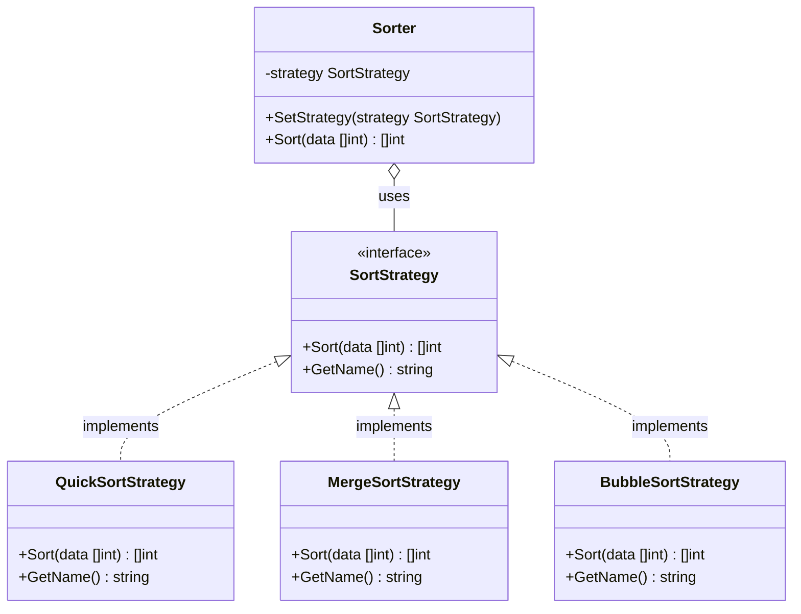
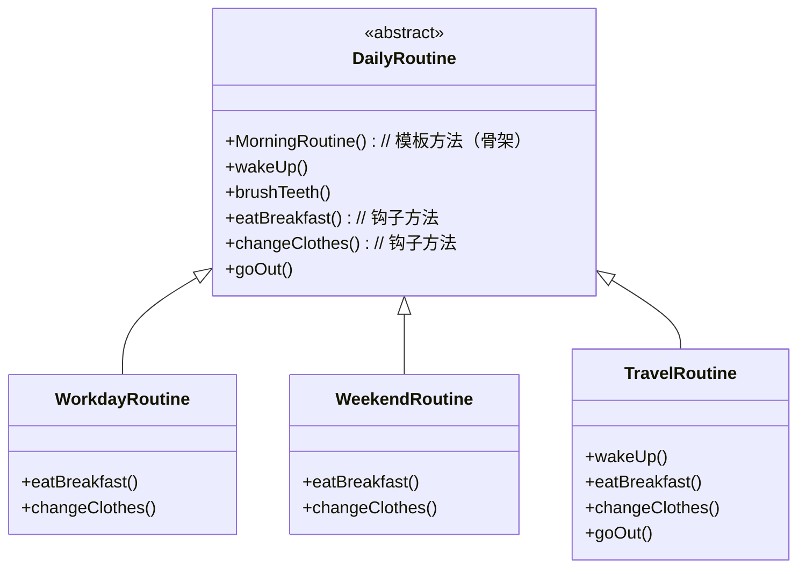
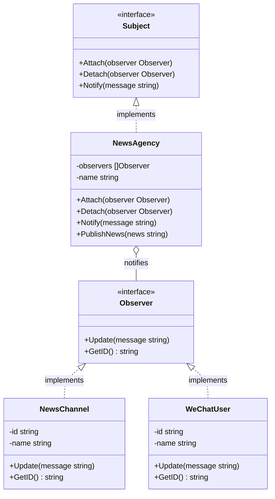
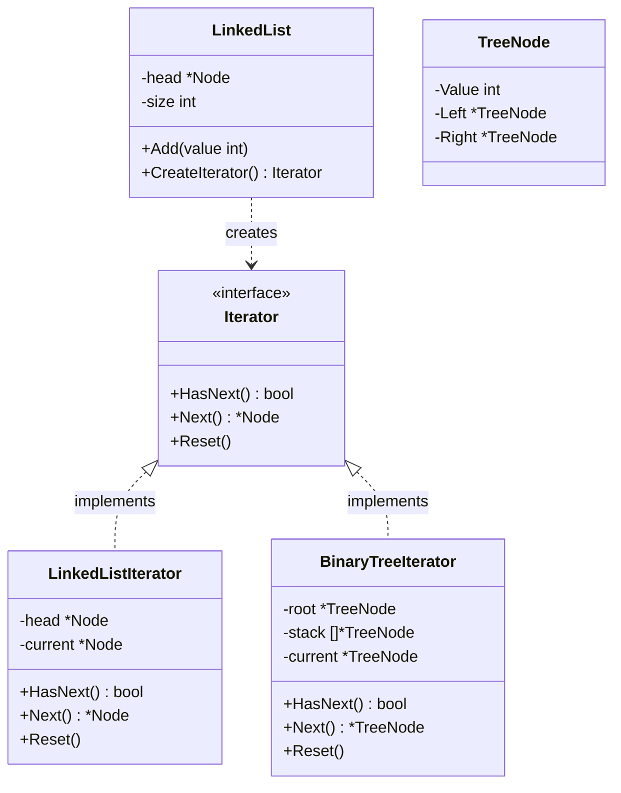
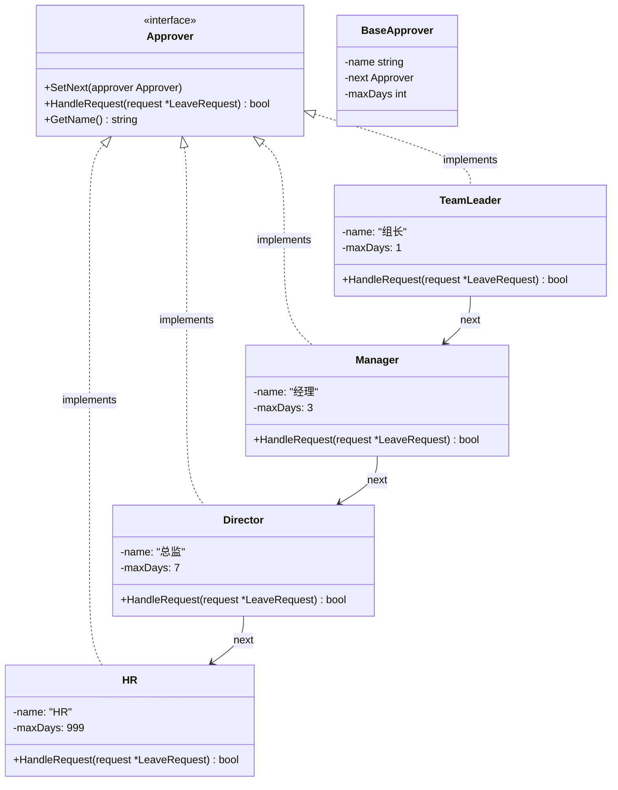
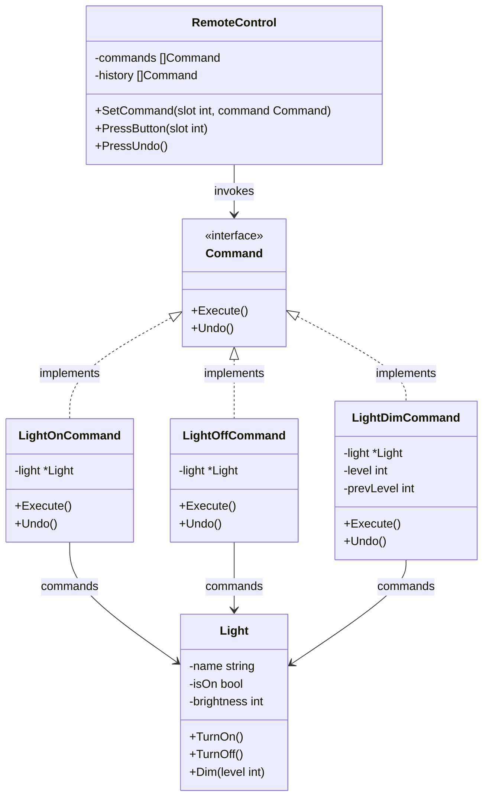
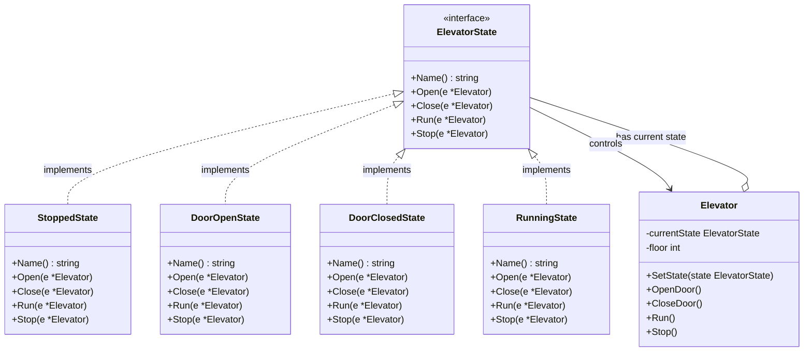
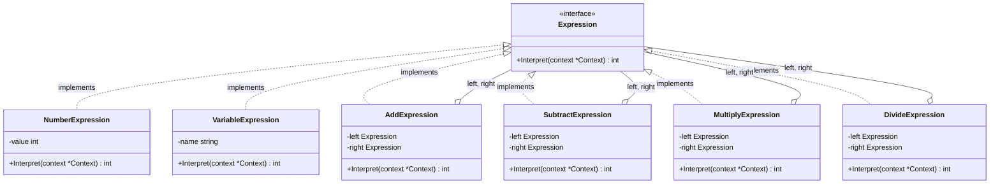
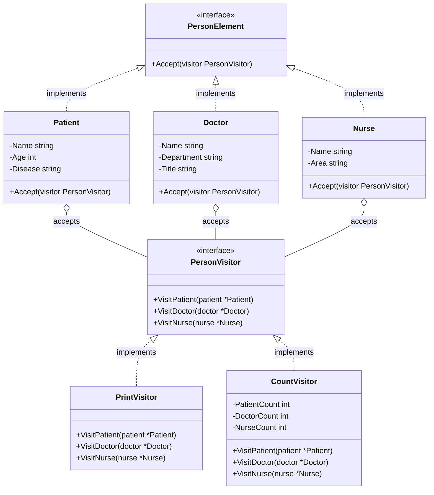
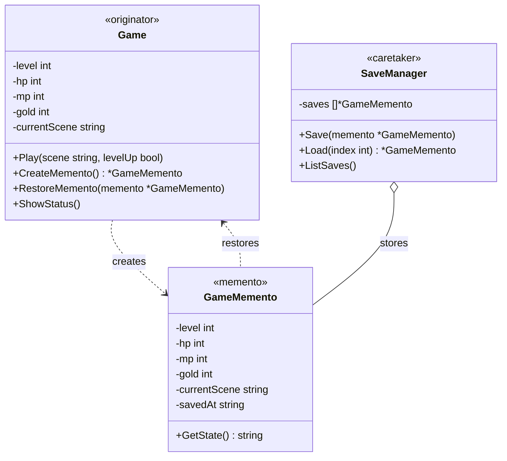

+++
title = "第40章 行为型模式"
weight = 400
date = "2026-03-23T08:39:00+08:00"
type = "docs"
description = ""
isCJKLanguage = true
draft = false
+++

# 第40章 行为型模式

> 如果说结构型模式是关于"对象的长相"，那么行为型模式就是关于"对象的举止"——它关注的是对象之间的通信、职责分配和算法封装。
>
> 想象一个公司里，不同的部门有不同的"行为模式"：销售部负责拉客户、研发部负责写代码、财务部负责算账。行为型模式就是来定义这些"部门职责"和"沟通方式"的。

## 40.1 策略模式

### 什么是策略模式？

先讲一个你肯定经历过的场景：**网购时的支付方式**。`n`n> 📌 **提示**：本章所有代码示例假设已导入 `fmt` 包。完整可运行代码请参考随书源码。

你选好了商品，点击结算，系统让你选择支付方式：

- 支付宝
- 微信支付
- 银行卡支付
- 信用卡支付
- 花呗
- ...

每一种支付方式的内部流程完全不同——支付宝要走支付宝的接口，微信要走微信的接口，银行卡要走银行系统。但是对你这个用户来说，"支付"这个动作是一样的：我付钱，商家收款。

**策略模式（Strategy Pattern）** 就是来解决这个问题的：**把"算法/行为"封装成独立的策略对象，让它们可以相互替换**。

策略模式的核心思想是：**定义一系列算法，把它们一个个封装起来，并且使它们可以相互替换**。

### 策略模式的必要性

假设你要写一个排序算法库，用户可以选择不同的排序算法（快速排序、归并排序、堆排序等）。如果不用策略模式，你会这样写：

```go
type Sorter struct {
    algorithm string // 选择用哪个算法："quick", "merge", "heap"
}

func (s *Sorter) Sort(data []int) {
    switch s.algorithm {
    case "quick":
        // 快速排序逻辑
    case "merge":
        // 归并排序逻辑
    case "heap":
        // 堆排序逻辑
    }
}
```

问题来了：

1. **违反开闭原则**：每加一种新算法，都要改 Sorter 结构体
2. **违反单一职责**：Sorter 既要管理数据，又要实现各种算法
3. **算法难以复用**：如果另一个模块也想用快速排序，不好直接复用

**策略模式**把这些算法全部拆成独立的策略对象，各自负责自己的算法，互不干扰。

### Go语言实现策略模式

```go
// ========== 第一步：定义策略接口 ==========

// SortStrategy 是排序策略的接口
// 所有排序算法都要实现这个接口
type SortStrategy interface {
    Sort(data []int) []int
    GetName() string
}
```

```go
// ========== 第二步：实现各种排序策略 ==========

// QuickSortStrategy 快速排序策略
type QuickSortStrategy struct{}

func (s *QuickSortStrategy) Sort(data []int) []int {
    fmt.Println("[QuickSort] 快速排序中...")
    if len(data) <= 1 {
        return data
    }

    // 简单实现：选第一个作为基准
    pivot := data[0]
    var left, right []int
    for _, v := range data[1:] {
        if v < pivot {
            left = append(left, v)
        } else {
            right = append(right, v)
        }
    }

    left = s.Sort(left)
    right = s.Sort(right)

    result := append(left, pivot)
    result = append(result, right...)
    return result
}

func (s *QuickSortStrategy) GetName() string {
    return "快速排序"
}

// MergeSortStrategy 归并排序策略
type MergeSortStrategy struct{}

func (s *MergeSortStrategy) Sort(data []int) []int {
    fmt.Println("[MergeSort] 归并排序中...")
    if len(data) <= 1 {
        return data
    }

    mid := len(data) / 2
    left := s.Sort(data[:mid])
    right := s.Sort(data[mid:])

    return s.merge(left, right)
}

func (s *MergeSortStrategy) merge(left, right []int) []int {
    result := make([]int, 0, len(left)+len(right))
    i, j := 0, 0
    for i < len(left) && j < len(right) {
        if left[i] < right[j] {
            result = append(result, left[i])
            i++
        } else {
            result = append(result, right[j])
            j++
        }
    }
    result = append(result, left[i:]...)
    result = append(result, right[j:]...)
    return result
}

func (s *MergeSortStrategy) GetName() string {
    return "归并排序"
}

// BubbleSortStrategy 冒泡排序策略（虽然慢，但简单易懂）
type BubbleSortStrategy struct{}

func (s *BubbleSortStrategy) Sort(data []int) []int {
    fmt.Println("[BubbleSort] 冒泡排序中...")
    result := make([]int, len(data))
    copy(result, data)

    n := len(result)
    for i := 0; i < n-1; i++ {
        for j := 0; j < n-i-1; j++ {
            if result[j] > result[j+1] {
                result[j], result[j+1] = result[j+1], result[j]
            }
        }
    }
    return result
}

func (s *BubbleSortStrategy) GetName() string {
    return "冒泡排序"
}
```

```go
// ========== 第三步：定义上下文（使用策略的对象） ==========

// Sorter 是排序器的上下文
// 它持有一个排序策略，可以动态切换
type Sorter struct {
    strategy SortStrategy
}

// SetStrategy 设置排序策略
func (s *Sorter) SetStrategy(strategy SortStrategy) {
    s.strategy = strategy
}

// Sort 执行排序
func (s *Sorter) Sort(data []int) []int {
    fmt.Printf("使用策略: %s\n", s.strategy.GetName())
    return s.strategy.Sort(data)
}
```

```go
func main() {
    fmt.Println("=== 策略模式：排序算法选择 ===\n")

    // 待排序的数据
    data := []int{64, 34, 25, 12, 22, 11, 90}

    // 创建排序器（上下文）
    sorter := &Sorter{}

    // ===== 场景1：用快速排序 =====
    fmt.Println("--- 场景1: 快速排序 ---")
    sorter.SetStrategy(&QuickSortStrategy{})
    result := sorter.Sort(data)
    fmt.Printf("排序结果: %v\n\n", result)

    // ===== 场景2：用归并排序 =====
    fmt.Println("--- 场景2: 归并排序 ---")
    sorter.SetStrategy(&MergeSortStrategy{})
    result = sorter.Sort(data)
    fmt.Printf("排序结果: %v\n\n", result)

    // ===== 场景3：用冒泡排序 =====
    fmt.Println("--- 场景3: 冒泡排序 ---")
    sorter.SetStrategy(&BubbleSortStrategy{})
    result = sorter.Sort(data)
    fmt.Printf("排序结果: %v\n\n", result)

    // ===== 场景4：动态切换策略 =====
    fmt.Println("--- 场景4: 动态策略切换 ---")
    strategies := []SortStrategy{
        &QuickSortStrategy{},
        &BubbleSortStrategy{},
        &MergeSortStrategy{},
    }

    for i, strategy := range strategies {
        fmt.Printf("第%d轮: ", i+1)
        sorter.SetStrategy(strategy)
        fmt.Printf("结果: %v\n", sorter.Sort(data))
    }
}
```

运行结果：

```
=== 策略模式：排序算法选择 ===

--- 场景1: 快速排序 ---
使用策略: 快速排序
[QuickSort] 快速排序中...
排序结果: [11 12 22 25 34 64 90]

--- 场景2: 归并排序 ---
使用策略: 归并排序
[MergeSort] 归并排序中...
排序结果: [11 12 22 25 34 64 90]

--- 场景3: 冒泡排序 ---
使用策略: 冒泡排序
[BubbleSort] 冒泡排序中...
排序结果: [11 12 22 25 34 64 90]

--- 场景4: 动态策略切换 ---
第1轮: 使用策略: 快速排序
[QuickSort] 快速排序中...
结果: [11 12 22 25 34 64 90]
第2轮: 使用策略: 冒泡排序
[BubbleSort] 冒泡排序中...
结果: [11 12 22 25 34 64 90]
第3轮: 使用策略: 归并排序
[MergeSort] 归并排序中...
结果: [11 12 22 25 34 64 90]
```

看到了吗？**排序器（Sorter）从头到尾不需要知道用的是什么排序算法**，它只需要调用 `strategy.Sort(data)`。算法可以随时切换，互不影响。

### 策略模式的 UML 图



### 策略模式的应用场景

1. **支付系统**：不同支付方式（支付宝、微信、银行卡）用不同策略
2. **促销系统**：不同促销规则用不同策略（打折、满减、送券）
3. **压缩系统**：不同压缩算法（ZIP、RAR、7Z）用不同策略
4. **路由系统**：不同路由策略（最短路径、最省油、最快到达）

### 策略模式 vs 简单工厂模式

有人可能会问：这不就是简单工厂吗？有什么区别？

**简单工厂**：创建对象，但对象的行为是固定的
**策略模式**：对象已经存在，可以动态切换行为

用支付举例：

- **简单工厂**：`PaymentFactory.CreatePayment("alipay")` —— 创建支付宝支付对象
- **策略模式**：`sorter.SetStrategy(quickSort)` —— 切换排序策略

工厂是"创建"，策略是"切换"。策略模式更强调"运行时动态切换"。

### 策略模式的注意事项

1. **策略数量不要太多**：如果策略超过10个，管理起来会变复杂
2. **策略之间应该是同级的**：所有策略都应该实现同一个接口，返回相同类型的结果
3. **考虑策略的上下文**：有些策略可能需要额外的上下文信息，可以通过参数传递

### 幽默总结

策略模式就像是**自助餐厅的菜品选择**：

- 餐厅有很多道菜（策略）：红烧肉、糖醋排骨、清蒸鱼、麻婆豆腐...
- 你可以选择今天吃哪道（切换策略）
- 餐厅不会因为你选红烧肉就改变糖醋排骨的做法
- 每道菜都有自己的"算法"——配料、调料、烹饪方式

**重要的是**：你是顾客（客户端），你只需要说"我要这个"，服务员（上下文）就会给你上对应的菜。你不需要知道厨师是怎么做的。

这就是程序员的浪漫——用策略模式，让你的系统也能"随便切换算法，想用哪个用哪个"！

---

## 40.2 模板方法模式

### 什么是模板方法模式？

先讲一个你每天早上都会经历的固定流程：

```
起床 → 刷牙洗脸 → 吃早餐 → 换衣服 → 出门上班
```

不管你今天心情好还是坏，不管天气是晴天还是雨天，这个流程基本不会变。但是，流程中的每一步的具体做法可能每天都不一样：

- **起床**：工作日7点起，周末睡到自然醒
- **刷牙洗脸**：可能用电动牙刷，可能用普通牙刷
- **吃早餐**：可能吃包子，可能吃面条，可能喝咖啡
- **换衣服**：工作穿正装，周末穿休闲
- **出门上班**：开车、骑车、地铁、走路

**模板方法模式（Template Method Pattern）** 就是来解决这个问题的：**定义一个算法的骨架，把某些步骤的具体实现延迟到子类**。

模板方法模式的核心思想是：**在一个方法里定义一个算法的骨架，把一些步骤的具体实现留给子类去完成**。

### 模板方法模式 vs 策略模式

等等，这听起来跟策略模式很像啊？都是"把算法封装"？

**关键区别**：

- **策略模式**：整个算法可以替换——换策略就是换整个算法
- **模板方法模式**：算法的骨架不变，某些步骤可以替换——换的是部分步骤，不是整个算法

用做菜来比喻：

- **策略模式**：`点一份披萨` vs `点一份炒饭` —— 整个菜换了
- **模板方法模式**：都是"做菜"，流程都是 `备料 → 烹饪 → 装盘`，但具体做的是红烧肉还是清蒸鱼可以换

### Go语言实现模板方法模式

```go
// ========== 第一步：定义模板方法基类 ==========

// DailyRoutine 是每日生活模板
// 这是一个"骨架"，定义了每天的固定流程
type DailyRoutine struct {
    // 这个结构体定义了一个"模板方法"：MorningRoutine()
}

// MorningRoutine 是模板方法——它定义了算法的骨架
// 注意：这个方法是不可重写的（Go没有final关键字，这里用约定俗成）
func (r *DailyRoutine) MorningRoutine() {
    fmt.Println("=== 早晨例行流程 ===")

    r.wakeUp()        // 第一步：起床（固定）
    r.brushTeeth()    // 第二步：刷牙（固定）
    r.eatBreakfast()  // 第三步：吃早餐（可变）
    r.changeClothes() // 第四步：换衣服（可变）
    r.goOut()         // 第五步：出门（固定）

    fmt.Println("=== 流程结束 ===\n")
}

// WakeUp 起床——骨架的一部分，通常不需要变化
func (r *DailyRoutine) wakeUp() {
    fmt.Println("[骨架] 起床")
}

// BrushTeeth 刷牙洗脸——骨架的一部分
func (r *DailyRoutine) brushTeeth() {
    fmt.Println("[骨架] 刷牙洗脸")
}

// EatBreakfast 吃早餐——这是一个"钩子方法"，子类可以重写
func (r *DailyRoutine) eatBreakfast() {
    fmt.Println("[骨架] 吃早餐（默认：吃面包）")
}

// ChangeClothes 换衣服——这是一个"钩子方法"，子类可以重写
func (r *DailyRoutine) changeClothes() {
    fmt.Println("[骨架] 换衣服（默认：穿休闲装）")
}

// GoOut 出门——骨架的一部分，通常不需要变化
func (r *DailyRoutine) goOut() {
    fmt.Println("[骨架] 出门上班")
}
```

```go
// ========== 第二步：定义具体的子类实现 ==========

// WorkdayRoutine 工作日的routine
type WorkdayRoutine struct {
    *DailyRoutine // 匿名嵌套，相当于"继承"
}

func NewWorkdayRoutine() *WorkdayRoutine {
    routine := &DailyRoutine{}
    return &WorkdayRoutine{DailyRoutine: routine}
}

// 重写吃早餐
func (r *WorkdayRoutine) eatBreakfast() {
    fmt.Println("[工作日] 快速吃个包子，边走边吃")
}

// 重写换衣服
func (r *WorkdayRoutine) changeClothes() {
    fmt.Println("[工作日] 穿正装，打领带")
}

// WeekendRoutine 周末的routine
type WeekendRoutine struct {
    *DailyRoutine
}

func NewWeekendRoutine() *WeekendRoutine {
    routine := &DailyRoutine{}
    return &WeekendRoutine{DailyRoutine: routine}
}

func (r *WeekendRoutine) eatBreakfast() {
    fmt.Println("[周末] 精心做个煎饼果子，加蛋加肠")
}

func (r *WeekendRoutine) changeClothes() {
    fmt.Println("[周末] 穿睡衣，舒服最重要")
}
```

```go
// ========== 第三步：更灵活的钩子机制 ==========

// TravelRoutine 出差/旅行的routine，展示了更多钩子用法
type TravelRoutine struct {
    *DailyRoutine
}

func NewTravelRoutine() *TravelRoutine {
    routine := &DailyRoutine{}
    return &TravelRoutine{DailyRoutine: routine}
}

// 重写所有可变步骤
func (r *TravelRoutine) wakeUp() {
    fmt.Println("[旅行] 睡到自然醒，酒店真舒服")
}

func (r *TravelRoutine) eatBreakfast() {
    fmt.Println("[旅行] 酒店自助餐，吃个够")
}

func (r *TravelRoutine) changeClothes() {
    fmt.Println("[旅行] 穿旅游装，准备出发")
}

func (r *TravelRoutine) goOut() {
    fmt.Println("[旅行] 出发去景点！")
}
```

```go
func main() {
    fmt.Println("=== 模板方法模式 ===\n")

    // ===== 场景1：工作日 =====
    fmt.Println("--- 场景1: 工作日早晨 ---")
    workday := NewWorkdayRoutine()
    workday.MorningRoutine()

    // ===== 场景2：周末 =====
    fmt.Println("--- 场景2: 周末早晨 ---")
    weekend := NewWeekendRoutine()
    weekend.MorningRoutine()

    // ===== 场景3：旅行 =====
    fmt.Println("--- 场景3: 旅行早晨 ---")
    travel := NewTravelRoutine()
    travel.MorningRoutine()
}
```

运行结果：

```
=== 模板方法模式 ===

--- 场景1: 工作日早晨 ---
=== 早晨例行流程 ===
[骨架] 起床
[骨架] 刷牙洗脸
[工作日] 快速吃个包子，边走边吃
[工作日] 穿正装，打领带
[骨架] 出门上班
=== 流程结束 ===

--- 场景2: 周末早晨 ---
=== 早晨例行流程 ===
[骨架] 起床
[骨架] 刷牙洗脸
[周末] 精心做个煎饼果子，加蛋加肠
[周末] 穿睡衣，舒服最重要
[骨架] 出门上班
=== 流程结束 ===

--- 场景3: 旅行早晨 ---
=== 早晨例行流程 ===
[旅行] 睡到自然醒，酒店真舒服
[骨架] 刷牙洗脸
[旅行] 酒店自助餐，吃个够
[旅行] 穿旅游装，准备出发
[骨架] 出发去景点！
=== 流程结束 ===
```

看到了吗？**模板方法 `MorningRoutine()` 从头到尾没有改**，但具体每一步做什么，由子类决定。这就是模板方法模式的威力：**骨架固定，细节可变**。

### 模板方法模式的结构



### 钩子方法（Hook Method）

在模板方法模式中，有一个重要的概念：**钩子方法**。

钩子方法是基类提供的一个"默认实现"，子类可以选择性地重写它。如果不重写，就用默认实现；如果重写，就用子类自己的实现。

```go
// 钩子方法的经典用法：允许子类在某个步骤之前或之后添加额外逻辑

type AlgorithmWithHook struct{}

func (a *AlgorithmWithHook) TemplateMethod() {
    fmt.Println("步骤1：准备工作")

    // 钩子：子类可以选择性地在这里添加逻辑
    a.beforeMainStep()

    fmt.Println("步骤2：核心步骤")
    a.mainStep()

    // 钩子：另一个钩子
    a.afterMainStep()

    fmt.Println("步骤3：收尾工作")
}

// 默认实现的钩子（空实现）
func (a *AlgorithmWithHook) beforeMainStep() {
    // 默认什么都不做
}

// 默认实现的钩子（空实现）
func (a *AlgorithmWithHook) afterMainStep() {
    // 默认什么都不做
}

// 核心步骤——必须实现
func (a *AlgorithmWithHook) mainStep() {
    panic("子类必须实现 mainStep")
}
```

```go
// 子类A：不需要额外逻辑
type ConcreteAlgorithmA struct {
    *AlgorithmWithHook
}

func NewConcreteAlgorithmA() *ConcreteAlgorithmA {
    return &ConcreteAlgorithmA{&AlgorithmWithHook{}}
}

func (a *ConcreteAlgorithmA) mainStep() {
    fmt.Println("算法A的核心步骤执行中...")
}

// 子类B：需要添加额外逻辑
type ConcreteAlgorithmB struct {
    *AlgorithmWithHook
}

func NewConcreteAlgorithmB() *ConcreteAlgorithmB {
    return &ConcreteAlgorithmB{&AlgorithmWithHook{}}
}

func (a *ConcreteAlgorithmB) mainStep() {
    fmt.Println("算法B的核心步骤执行中...")
}

// 重写钩子
func (a *ConcreteAlgorithmB) beforeMainStep() {
    fmt.Println("[钩子] 算法B：在核心步骤之前做一些准备工作")
}

func (a *ConcreteAlgorithmB) afterMainStep() {
    fmt.Println("[钩子] 算法B：在核心步骤之后做一些清理工作")
}
```

```go
func main() {
    fmt.Println("--- 算法A（不使用钩子）---")
    algoA := NewConcreteAlgorithmA()
    algoA.TemplateMethod()

    fmt.Println()

    fmt.Println("--- 算法B（使用钩子）---")
    algoB := NewConcreteAlgorithmB()
    algoB.TemplateMethod()
}
```

运行结果：

```
--- 算法A（不使用钩子）---
步骤1：准备工作
步骤2：核心步骤
算法A的核心步骤执行中...
步骤3：收尾工作

--- 算法B（使用钩子）---
步骤1：准备工作
[钩子] 算法B：在核心步骤之前做一些准备工作
步骤2：核心步骤
算法B的核心步骤执行中...
[钩子] 算法B：在核心步骤之后做一些清理工作
步骤3：收尾工作
```

### 模板方法模式 vs 策略模式

| 维度 | 模板方法模式 | 策略模式 |
|------|-------------|----------|
| 复用方式 | 复用算法的骨架，子类提供某些步骤 | 复用整个算法 |
| 控制权 | 父类控制算法流程，子类提供某些步骤 | 客户端选择算法 |
| 继承方式 | 使用继承 | 使用组合 |
| 扩展方式 | 添加新的子类 | 添加新的策略类 |

### 模板方法模式的应用场景

1. **框架层**：很多框架定义了算法的骨架，让用户填充细节
2. **数据处理流程**：比如"读取 → 解析 → 转换 → 写入"，每一步都可以由子类实现
3. **游戏开发**：游戏关卡通常有固定流程（初始化 → 主循环 → 结束），但具体逻辑可以不同
4. **单元测试**：测试框架通常有 `Setup → Test → Teardown` 的固定流程

### 幽默总结

模板方法模式就像是**酒店的自助早餐流程**：

```
取盘 → 拿食物 → 找座位 → 吃 → 收盘 → 离开
```

这个流程是固定的，没人能改变。但具体你拿什么食物、坐哪个位置、吃多久，是你的自由。

模板方法就是那个**固定流程的框架**，钩子方法就是那个**你可以自由发挥的空间**。

**固定的是骨架，变化的是细节**——这就是模板方法模式的精髓。

---

## 40.3 观察者模式

### 什么是观察者模式？

先讲一个你肯定经历过的场景：**微信公众号订阅**。

- 有一个公众号叫"程序员的快乐生活"，每天发文章
- 有10000个粉丝订阅了这个公众号
- 有一天，公众号发了一篇新文章："如何在开会时优雅地摸鱼"
- 10000个粉丝的手机同时收到了推送通知

这就是**观察者模式（Observer Pattern）** 的典型应用。

**观察者模式**的核心思想是：**定义对象之间的一对多依赖关系，当一个对象（被观察者）状态改变时，所有依赖它的对象（观察者）都会自动收到通知并更新**。

### 观察者模式的核心概念

- **Subject（被观察者/主题）**：状态发生变化的对象，它知道所有观察者，并负责通知观察者
- **Observer（观察者）**：定义了一个更新接口，在收到通知时更新自己
- **ConcreteSubject（具体被观察者）**：存储真实状态，当状态改变时发送通知
- **ConcreteObserver（具体观察者）**：实现更新接口，保持与主题状态一致

### Go语言实现观察者模式

```go
// ========== 第一步：定义观察者接口 ==========

// Observer 是观察者的接口
// 所有观察者都要实现这个接口
type Observer interface {
    // Update 当被观察者状态改变时，这个方法会被调用
    Update(message string)
    // GetID 获取观察者的ID
    GetID() string
}
```

```go
// ========== 第二步：定义被观察者接口 ==========

// Subject 是被观察者（主题）的接口
type Subject interface {
    // Attach 添加观察者
    Attach(observer Observer)
    // Detach 移除观察者
    Detach(observer Observer)
    // Notify 通知所有观察者
    Notify(message string)
}
```

```go
// ========== 第三步：实现具体被观察者 ==========

// NewsAgency 是新闻机构（被观察者）
type NewsAgency struct {
    // 观察者列表
    observers []Observer
    // 新闻机构名称
    name string
}

// NewNewsAgency 创建新闻机构
func NewNewsAgency(name string) *NewsAgency {
    return &NewsAgency{
        name:     name,
        observers: make([]Observer, 0),
    }
}

// Attach 添加观察者
func (s *NewsAgency) Attach(observer Observer) {
    s.observers = append(s.observers, observer)
    fmt.Printf("[%s] 新观察者订阅: %s\n", s.name, observer.GetID())
}

// Detach 移除观察者
func (s *NewsAgency) Detach(observer Observer) {
    for i, o := range s.observers {
        if o.GetID() == observer.GetID() {
            // 删除这个观察者
            s.observers = append(s.observers[:i], s.observers[i+1:]...)
            fmt.Printf("[%s] 观察者取消订阅: %s\n", s.name, observer.GetID())
            return
        }
    }
}

// Notify 通知所有观察者
func (s *NewsAgency) Notify(message string) {
    fmt.Printf("\n[%s] 发布新闻: %s\n", s.name, message)
    fmt.Println("----------------------------------------")
    for _, observer := range s.observers {
        // 逐一通知每个观察者
        observer.Update(message)
    }
    fmt.Println("----------------------------------------\n")
}

// PublishNews 发布新闻的方法
func (s *NewsAgency) PublishNews(news string) {
    fmt.Printf("[%s]有新新闻发布！\n", s.name)
    s.Notify(news)
}
```

```go
// ========== 第四步：实现具体观察者 ==========

// NewsChannel 是新闻频道（观察者）
type NewsChannel struct {
    id   string
    name string
}

// NewNewsChannel 创建新闻频道
func NewNewsChannel(id, name string) *NewsChannel {
    fmt.Printf("[%s] 新闻频道「%s」(ID: %s) 开通了！\n", name, name, id)
    return &NewsChannel{id: id, name: name}
}

func (c *NewsChannel) Update(message string) {
    // 收到通知后，新闻频道开始播报
    fmt.Printf("[%s] 🔔 收到推送：%s\n", c.name, message)
}

func (c *NewsChannel) GetID() string {
    return c.id
}

// WeChatUser 是微信公众号用户（观察者）
type WeChatUser struct {
    id   string
    name string
}

func NewWeChatUser(id, name string) *WeChatUser {
    fmt.Printf("[微信用户] %s 关注了公众号\n", name)
    return &WeChatUser{id: id, name: name}
}

func (u *WeChatUser) Update(message string) {
    fmt.Printf("[微信用户 %s] 📱 收到推送：%s\n", u.name, message)
}

func (u *WeChatUser) GetID() string {
    return u.id
}
```

```go
func main() {
    fmt.Println("=== 观察者模式：新闻订阅系统 ===\n")

    // 创建被观察者：新闻机构
    agency := NewNewsAgency("新华社")

    // 创建观察者们
    channel1 := NewNewsChannel("CCTV-1", "央视一套")
    channel2 := NewNewsChannel("CCTV-2", "央视二套")
    user1 := NewWeChatUser("user001", "张三")
    user2 := NewWeChatUser("user002", "李四")
    user3 := NewWeChatUser("user003", "王五")

    fmt.Println()

    // ===== 开始订阅 =====
    fmt.Println("========== 开始订阅 ==========\n")

    agency.Attach(channel1)
    agency.Attach(channel2)
    agency.Attach(user1)
    agency.Attach(user2)
    agency.Attach(user3)

    fmt.Println()

    // ===== 发布新闻1 =====
    fmt.Println("========== 新闻一 ==========")
    agency.PublishNews("突发！程序员终于找到了写注释的理由！")

    // ===== 李四取消订阅 =====
    fmt.Println("--- 李四取消订阅 ---")
    agency.Detach(user2)

    // ===== 发布新闻2 =====
    fmt.Println("========== 新闻二 ==========")
    agency.PublishNews("重磅！研究表明，'明天再改'是拖延症的终极形态！")

    // ===== 新用户加入 =====
    fmt.Println("--- 新用户订阅 ---")
    user4 := NewWeChatUser("user004", "赵六")
    agency.Attach(user4)

    // ===== 发布新闻3 =====
    fmt.Println()
    fmt.Println("========== 新闻三 ==========")
    agency.PublishNews("震惊！这款代码居然没有bug！")
}
```

运行结果：

```
=== 观察者模式：新闻订阅系统 ===

[央视一套] 新闻频道 央视一套 开通了！
[央视二套] 新闻频道 央视二套 开通了！
[微信用户] 张三关注了公众号
[微信用户] 李四关注了公众号
[微信用户] 王五关注了公众号

========== 开始订阅 ==========

[新华社] 新观察者订阅: CCTV-1
[新华社] 新观察者订阅: CCTV-2
[新华社] 新观察者订阅: user001
[新华社] 新观察者订阅: user002
[新华社] 新观察者订阅: user003

========== 新闻一 ==========
[新华社]发布新闻: 突发！程序员终于找到了写注释的理由！
----------------------------------------
[央视一套] 🔔 收到推送：突发！程序员终于找到了写注释的理由！
[央视二套] 🔔 收到推送：突发！程序员终于找到了写注释的理由！
[微信用户 张三] 📱 收到推送：突发！程序员终于找到了写注释的理由！
[微信用户 李四] 📱 收到推送：突发！程序员终于找到了写注释的理由！
[微信用户 王五] 📱 收到推送：突发！程序员终于找到了写注释的理由！
----------------------------------------

--- 李四取消订阅 ---
[新华社] 观察者取消订阅: user002

========== 新闻二 ==========
[新华社]发布新闻: 重磅！研究表明，'明天再改'是拖延症的终极形态！
----------------------------------------
[央视一套] 🔔 收到推送：重磅！研究表明，'明天再改'是拖延症的终极形态！
[央视二套] 🔔 收到推送：重磅！研究表明，'明天再改'是拖延症的终极形态！
[微信用户 张三] 📱 收到推送：重磅！研究表明，'明天再改'是拖延症的终极形态！
[微信用户 王五] 📱 收到推送：重磅！研究表明，'明天再改'是拖延症的终极形态！
----------------------------------------

--- 新用户订阅 ---
[微信用户] 赵六关注了公众号

========== 新闻三 ==========
[新华社]发布新闻: 震惊！这款代码居然没有bug！
----------------------------------------
[央视一套] 🔔 收到推送：震惊！这款代码居然没有bug！
[央视二套] 🔔 收到推送：震惊！这款代码居然没有bug！
[微信用户 张三] 📱 收到推送：震惊！这款代码居然没有bug！
[微信用户 王五] 📱 收到推送：震惊！这款代码居然没有bug！
[微信用户 赵六] 📱 收到推送：震惊！这款代码居然没有bug！
----------------------------------------
```

看到了吗？这就是观察者模式的威力：

- **订阅/退订**：观察者可以随时加入或离开
- **广播通知**：一个消息发布，所有观察者都能收到
- **解耦**：发布者不需要知道有多少观察者，它们是谁

### 观察者模式的 UML 图



### 观察者模式的应用场景

1. **GUI事件系统**：按钮点击、文本变化等事件
2. **消息队列**：发布-订阅系统
3. **数据绑定**：MVVM框架中的数据绑定
4. **股票行情**：多个客户端订阅股票价格变化
5. **社交媒体**：关注/取消关注，发布动态后通知所有粉丝

### 观察者模式的注意事项

1. **避免观察者过多**：如果观察者数量太大，通知会很慢
2. **注意内存泄漏**：如果观察者忘记取消订阅，而被观察者一直存在，可能导致内存泄漏
3. **通知顺序不确定**：观察者的通知顺序是不确定的，不要依赖顺序

### 观察者模式的变体：事件委托

在Go中，我们可以使用函数类型来实现更轻量级的观察者模式——**事件委托**：

```go
// EventHandler 是事件处理函数类型
type EventHandler func(message string)

// SimpleSubject 是一个简化版的主题，使用事件委托
type SimpleSubject struct {
    // 观察者列表，现在是一组函数
    handlers []EventHandler
}

func NewSimpleSubject() *SimpleSubject {
    return &SimpleSubject{
        handlers: make([]EventHandler, 0),
    }
}

func (s *SimpleSubject) Subscribe(handler EventHandler) {
    s.handlers = append(s.handlers, handler)
    fmt.Printf("[SimpleSubject] 新订阅者注册，当前共 %d 个订阅者\n", len(s.handlers))
}

func (s *SimpleSubject) Unsubscribe(handler EventHandler) {
    // 简化版：只是移除最后一个
    if len(s.handlers) > 0 {
        s.handlers = s.handlers[:len(s.handlers)-1]
    }
}

func (s *SimpleSubject) Notify(message string) {
    fmt.Printf("\n[SimpleSubject] 广播事件: %s\n", message)
    for _, handler := range s.handlers {
        handler(message)
    }
}
```

```go
func main() {
    subject := NewSimpleSubject()

    // 使用函数作为观察者
    handler1 := func(msg string) {
        fmt.Printf("[观察者1] 收到消息: %s\n", msg)
    }

    handler2 := func(msg string) {
        fmt.Printf("[观察者2] 收到消息: %s\n", msg)
    }

    subject.Subscribe(handler1)
    subject.Subscribe(handler2)

    subject.Notify("Hello, Observer Pattern!")
}
```

运行结果：

```
[SimpleSubject] 新订阅者注册，当前共 1 个订阅者
[SimpleSubject] 新订阅者注册，当前共 2 个订阅者

[SimpleSubject] 广播事件: Hello, Observer Pattern!
[观察者1] 收到消息: Hello, Observer Pattern!
[观察者2] 收到消息: Hello, Observer Pattern!
```

### 幽默总结

观察者模式就像是**粉丝与偶像的关系**：

- 偶像（被观察者）发微博、开演唱会、直播带货
- 粉丝们（观察者）订阅了偶像的消息
- 偶像一发新动态，所有粉丝都收到通知

**好处是什么？**

- 粉丝不需要一直盯着偶像有没有发新动态（不用轮询）
- 偶像也不需要知道有多少粉丝、粉丝是谁（解耦）
- 粉丝可以随时取消关注（解除订阅）

这就是程序员的浪漫——用观察者模式，让你的系统也能"一点对多点"地广播消息，粉丝们都能第一时间收到通知！

---

## 40.4 迭代器模式

### 什么是迭代器模式？

先问一个问题：假设你有三种不同的数据结构：

```go
// 数组
array := []int{1, 2, 3}

// 链表
list := []int{1, 2, 3} // 假设这是链表

// 树
tree := []int{1, 2, 3} // 假设这是树
```

现在你要遍历它们，输出所有元素。你会怎么写代码？

如果每种数据结构都写一个遍历方法，代码会变成这样：

```go
遍历Array()
遍历List()
遍历Tree()
```

问题是：**如果你想统一遍历接口，让`遍历()`对所有数据结构生效，怎么办？**

**迭代器模式（Iterator Pattern）** 就是来解决这个问题的：**提供一种方法顺序访问一个集合对象的各个元素，而不暴露其底层表示**。

迭代器模式的核心思想是：**把"怎么遍历"封装成一个独立的对象，让遍历逻辑和集合本身分离**。

### Go语言原生迭代器

Go语言在语言层面支持迭代：`range` 关键字可以遍历数组、切片、map、channel等。

```go
// 遍历切片
nums := []int{1, 2, 3, 4, 5}
for i, v := range nums {
    fmt.Printf("索引: %d, 值: %d\n", i, v)
}

// 遍历map
m := map[string]int{"a": 1, "b": 2}
for k, v := range m {
    fmt.Printf("键: %s, 值: %d\n", k, v)
}
```

但是，如果我们要遍历一个自定义的数据结构（比如树、图），Go语言没有内置支持，需要自己实现迭代器。

### Go语言实现迭代器模式

#### 示例：自定义链表的迭代器

```go
// ========== 第一步：定义节点 ==========

// Node 是链表节点
type Node struct {
    Value int
    Next  *Node
}

// ========== 第二步：定义迭代器接口 ==========

// Iterator 是迭代器接口
type Iterator interface {
    // HasNext 是否有下一个元素
    HasNext() bool
    // Next 获取下一个元素
    Next() *Node
    // Reset 重置迭代器到开头
    Reset()
}
```

```go
// ========== 第三步：实现链表迭代器 ==========

// LinkedListIterator 是链表的迭代器
type LinkedListIterator struct {
    head   *Node
    current *Node
}

// NewLinkedListIterator 创建迭代器
func NewLinkedListIterator(head *Node) *LinkedListIterator {
    return &LinkedListIterator{
        head:    head,
        current: nil, // 初始时没有指向任何节点
    }
}

func (it *LinkedListIterator) HasNext() bool {
    if it.current == nil {
        // 第一次调用，指向head
        return it.head != nil
    }
    // 后续调用，看下一个是否为空
    return it.current.Next != nil
}

func (it *LinkedListIterator) Next() *Node {
    if it.current == nil {
        // 第一次调用，返回head
        it.current = it.head
    } else {
        // 后续调用，移动到下一个
        it.current = it.current.Next
    }
    return it.current
}

func (it *LinkedListIterator) Reset() {
    it.current = nil
}
```

```go
// ========== 第四步：定义链表容器 ==========

// LinkedList 是链表容器
type LinkedList struct {
    head *Node
    size int
}

// NewLinkedList 创建链表
func NewLinkedList() *LinkedList {
    return &LinkedList{}
}

// Add 添加节点
func (list *LinkedList) Add(value int) {
    newNode := &Node{Value: value}
    if list.head == nil {
        list.head = newNode
    } else {
        current := list.head
        for current.Next != nil {
            current = current.Next
        }
        current.Next = newNode
    }
    list.size++
}

// CreateIterator 创建迭代器
func (list *LinkedList) CreateIterator() Iterator {
    return NewLinkedListIterator(list.head)
}

// Size 获取链表大小
func (list *LinkedList) Size() int {
    return list.size
}
```

```go
func main() {
    fmt.Println("=== 迭代器模式 ===\n")

    // 创建一个链表: 1 -> 2 -> 3 -> 4 -> 5
    list := NewLinkedList()
    list.Add(1)
    list.Add(2)
    list.Add(3)
    list.Add(4)
    list.Add(5)

    fmt.Printf("链表大小: %d\n\n", list.Size())

    // 使用迭代器遍历
    fmt.Println("--- 使用迭代器遍历链表 ---")
    iterator := list.CreateIterator()

    fmt.Println("正向遍历:")
    for iterator.HasNext() {
        node := iterator.Next()
        fmt.Printf("节点值: %d\n", node.Value)
    }

    fmt.Println()

    // 重置后再次遍历
    fmt.Println("再次遍历（重置后）:")
    iterator.Reset()
    for iterator.HasNext() {
        node := iterator.Next()
        fmt.Printf("节点值: %d\n", node.Value)
    }
}
```

运行结果：

```
=== 迭代器模式 ===

链表大小: 5

--- 使用迭代器遍历链表 ---
正向遍历:
节点值: 1
节点值: 2
节点值: 3
节点值: 4
节点值: 5

再次遍历（重置后）:
节点值: 1
节点值: 2
节点值: 3
节点值: 4
节点值: 5
```

### 更复杂的迭代器：二叉树的迭代器

```go
// ========== 二叉树节点 ==========

type TreeNode struct {
    Value    int
    Left     *TreeNode
    Right    *TreeNode
}

// BinaryTreeIterator 是二叉树的中序遍历迭代器
type BinaryTreeIterator struct {
    root     *TreeNode
    stack    []*TreeNode
    current  *TreeNode
}

// NewBinaryTreeIterator 创建二叉树迭代器
func NewBinaryTreeIterator(root *TreeNode) *BinaryTreeIterator {
    return &BinaryTreeIterator{
        root:   root,
        stack:  make([]*TreeNode, 0),
        current: root,
    }
}

func (it *BinaryTreeIterator) HasNext() bool {
    return it.current != nil || len(it.stack) > 0
}

func (it *BinaryTreeIterator) Next() *TreeNode {
    // 中序遍历：左子树 -> 根节点 -> 右子树
    for it.current != nil {
        it.stack = append(it.stack, it.current)
        it.current = it.current.Left
    }

    // 弹出栈顶节点
    node := it.stack[len(it.stack)-1]
    it.stack = it.stack[:len(it.stack)-1]

    // 转向右子树
    it.current = node.Right

    return node
}

func (it *BinaryTreeIterator) Reset() {
    it.stack = make([]*TreeNode, 0)
    it.current = it.root
}
```

```go
func main() {
    fmt.Println("=== 二叉树迭代器 ===\n")

    // 构建一棵二叉树：
    //       4
    //      / \
    //     2   6
    //    / \ / \
    //   1  3 5  7

    root := &TreeNode{
        Value: 4,
        Left: &TreeNode{
            Value: 2,
            Left:  &TreeNode{Value: 1},
            Right: &TreeNode{Value: 3},
        },
        Right: &TreeNode{
            Value: 6,
            Left:  &TreeNode{Value: 5},
            Right: &TreeNode{Value: 7},
        },
    }

    fmt.Println("中序遍历（递归结果应该是: 1 2 3 4 5 6 7）:")
    fmt.Println("迭代器遍历结果:")

    iterator := NewBinaryTreeIterator(root)
    for iterator.HasNext() {
        node := iterator.Next()
        fmt.Printf("%d ", node.Value)
    }
    fmt.Println()
}
```

运行结果：

```
=== 二叉树迭代器 ===

中序遍历（递归结果应该是: 1 2 3 4 5 6 7）:
迭代器遍历结果:
1 2 3 4 5 6 7
```

### 迭代器模式的 UML 图



### 迭代器模式的优势

1. **单一职责**：遍历逻辑从集合中分离出来，集合只负责存储
2. **开闭原则**：可以添加新的迭代器，不需要修改集合本身
3. **支持多次遍历**：同一个集合可以同时有多个迭代器
4. **延迟迭代**：按需计算，节省内存（比如遍历大文件时）

### Go语言中的迭代器接口

Go语言的标准库 `container/list` 提供了双向链表的实现，它的迭代器接口是：

```go
// 包 container/list 中的迭代器
type Iterator interface {
    Next() bool
    Value() interface{}
}
```

使用时：

```go
import "container/list"

l := list.New()
l.PushBack(1)
l.PushBack(2)
l.PushBack(3)

for e := l.Front(); e != nil; e = e.Next() {
    fmt.Println(e.Value)
}
```

### 幽默总结

迭代器模式就像是**餐厅的"下一道菜"服务员**：

- 你去吃法餐，大厨会一道一道地上菜
- 你不需要知道菜是怎么做出来的，也不需要知道有多少道菜
- 你只需要问服务员："下一道是什么？"
- 服务员就会给你端上下一道菜

迭代器就是那个**服务员**，它知道怎么从"菜品队列"里拿出下一道菜，但你不关心它是怎么记住顺序的。

**集合**就是那个**后厨**，负责存储和管理菜品，但不需要知道"怎么上菜"。

这就是程序员的浪漫——用迭代器模式，让遍历和存储分离，各司其职，互不打扰！

---

## 40.5 责任链模式

### 什么是责任链模式？

先讲一个你肯定经历过的场景：**请假审批流程**。

你是一名员工，想请3天假：

- **组长**：可以审批1天以内的假
- **经理**：可以审批3天以内的假
- **总监**：可以审批7天以内的假
- **HR**：可以审批所有假期，还会记录存档

如果你的请假天数是3天，那么流程是：

```
你的申请 → 组长（批不了，传给下一个）→ 经理（批了！）
```

如果你的请假天数是10天，那么流程是：

```
你的申请 → 组长（批不了，传给下一个）→ 经理（批不了，传给下一个）→ 总监（批不了，传给下一个）→ HR（批了！）
```

**责任链模式（Chain of Responsibility Pattern）** 就是来解决这个问题的：**将请求沿着处理者链传递，直到有一个处理者处理它**。

责任链模式的核心思想是：**每个处理者都有机会处理请求，但处理不了就传给下一个**。

### 责任链模式 vs 观察者模式

等等，这听起来有点像观察者模式？都是"一传一"？

**关键区别**：

- **观察者模式**：一个通知广播给所有观察者，所有观察者都会收到
- **责任链模式**：一个请求只会被一个处理者处理（或者没人处理）

### Go语言实现责任链模式

```go
// ========== 第一步：定义请求结构 ==========

// LeaveRequest 请假申请
type LeaveRequest struct {
    EmployeeName string // 员工名
    Days        int    // 请假天数
    Reason      string // 请假原因
}

// LeaveRequest 的字符串描述
func (r *LeaveRequest) String() string {
    return fmt.Sprintf("员工[%s]申请请假%d天，原因: %s", r.EmployeeName, r.Days, r.Reason)
}
```

```go
// ========== 第二步：定义处理者接口 ==========

// Approver 是审批者的接口
type Approver interface {
    // SetNext 设置下一个审批者
    SetNext(approver Approver)
    // HandleRequest 处理请求
    HandleRequest(request *LeaveRequest) bool
    // GetName 获取审批者名称
    GetName() string
}
```

```go
// ========== 第三步：实现基础处理者 ==========

// BaseApprover 是所有审批者的基类
type BaseApprover struct {
    name  string
    next  Approver // 指向下一个审批者
    maxDays int    // 能审批的最大天数
}

// SetNext 设置下一个审批者
func (b *BaseApprover) SetNext(approver Approver) {
    b.next = approver
    // 这里不打印，避免和实际审批流程混淆
}

// GetName 获取名称
func (b *BaseApprover) GetName() string {
    return b.name
}
```

```go
// ========== 第四步：实现具体的处理者 ==========

// TeamLeader 组长，只能审批1天以内的假
type TeamLeader struct {
    *BaseApprover
}

func NewTeamLeader() *TeamLeader {
    return &TeamLeader{
        BaseApprover: &BaseApprover{
            name:     "组长",
            maxDays:  1,
        },
    }
}

func (a *TeamLeader) HandleRequest(request *LeaveRequest) bool {
    if request.Days <= a.maxDays {
        fmt.Printf("[%s] ✅ 批准了申请: %s\n", a.name, request.String())
        return true
    }
    // 审批不了，传递给下一个
    fmt.Printf("[%s] ❌ 无法审批%d天以内的假，传递给下一个\n", a.name, request.Days)
    if a.next != nil {
        return a.next.HandleRequest(request)
    }
    fmt.Println("⚠️ 没有人能审批这个申请！")
    return false
}

// Manager 经理，可以审批3天以内的假
type Manager struct {
    *BaseApprover
}

func NewManager() *Manager {
    return &Manager{
        BaseApprover: &BaseApprover{
            name:     "经理",
            maxDays:  3,
        },
    }
}

func (m *Manager) HandleRequest(request *LeaveRequest) bool {
    if request.Days <= m.maxDays {
        fmt.Printf("[%s] ✅ 批准了申请: %s\n", m.name, request.String())
        return true
    }
    fmt.Printf("[%s] ❌ 无法审批%d天以内的假，传递给下一个\n", m.name, request.Days)
    if m.next != nil {
        return m.next.HandleRequest(request)
    }
    fmt.Println("⚠️ 没有人能审批这个申请！")
    return false
}

// Director 总监，可以审批7天以内的假
type Director struct {
    *BaseApprover
}

func NewDirector() *Director {
    return &Director{
        BaseApprover: &BaseApprover{
            name:     "总监",
            maxDays:  7,
        },
    }
}

func (d *Director) HandleRequest(request *LeaveRequest) bool {
    if request.Days <= d.maxDays {
        fmt.Printf("[%s] ✅ 批准了申请: %s\n", d.name, request.String())
        return true
    }
    fmt.Printf("[%s] ❌ 无法审批%d天以内的假，传递给下一个\n", d.name, request.Days)
    if d.next != nil {
        return d.next.HandleRequest(request)
    }
    fmt.Println("⚠️ 没有人能审批这个申请！")
    return false
}

// HR 人力资源，可以审批所有假期
type HR struct {
    *BaseApprover
}

func NewHR() *HR {
    return &HR{
        BaseApprover: &BaseApprover{
            name:     "HR",
            maxDays:  999, // HR可以审批任意天数
        },
    }
}

func (h *HR) HandleRequest(request *LeaveRequest) bool {
    if request.Days <= h.maxDays {
        fmt.Printf("[%s] ✅ 批准了申请（顺便存档）: %s\n", h.name, request.String())
        return true
    }
    fmt.Println("⚠️ 没有人能审批这个申请！")
    return false
}
```

```go
// ========== 第五步：构建责任链 ==========

// BuildApprovalChain 构建审批链（注意：这里只是构建链式结构，不会触发审批）
func BuildApprovalChain() *TeamLeader {
    // 从链头开始
    leader := NewTeamLeader()
    manager := NewManager()
    director := NewDirector()
    hr := NewHR()

    // 设置责任链的传递顺序：组长 -> 经理 -> 总监 -> HR
    leader.SetNext(manager)
    manager.SetNext(director)
    director.SetNext(hr)

    return leader
}
```

```go
func main() {
    fmt.Println("=== 责任链模式：请假审批流程 ===\n")

    // 构建审批链（静默构建，不打印）
    leader := &SilentApprover{name: "组长", maxDays: 1}
    manager := &SilentApprover{name: "经理", maxDays: 3}
    director := &SilentApprover{name: "总监", maxDays: 7}
    hr := &SilentApprover{name: "HR", maxDays: 999}

    leader.next = manager
    manager.next = director
    director.next = hr

    // ===== 场景1：请假1天 =====
    fmt.Println("\n--- 场景1: 请假1天 ---")
    request1 := &LeaveRequest{EmployeeName: "张三", Days: 1, Reason: "感冒"}
    leader.HandleRequest(request1)

    // ===== 场景2：请假3天 =====
    fmt.Println("\n--- 场景2: 请假3天 ---")
    request2 := &LeaveRequest{EmployeeName: "李四", Days: 3, Reason: "老家有事"}
    leader.HandleRequest(request2)

    // ===== 场景3：请假7天 =====
    fmt.Println("\n--- 场景3: 请假7天 ---")
    request3 := &LeaveRequest{EmployeeName: "王五", Days: 7, Reason: "出国旅游"}
    leader.HandleRequest(request3)

    // ===== 场景4：请假15天 =====
    fmt.Println("\n--- 场景4: 请假15天 ---")
    request4 := &LeaveRequest{EmployeeName: "赵六", Days: 15, Reason: "创业"}
    leader.HandleRequest(request4)
}

// SilentApprover 是静默版的审批者，用于优化输出
type SilentApprover struct {
    name    string
    maxDays int
    next    *SilentApprover
}

func (a *SilentApprover) HandleRequest(request *LeaveRequest) bool {
    if request.Days <= a.maxDays {
        fmt.Printf("[%s] ✅ 批准了申请: %s\n", a.name, request.String())
        return true
    }
    if a.next != nil {
        fmt.Printf("[%s] ❌ 无法审批%d天以内的假，传递给下一个\n", a.name, request.Days)
        return a.next.HandleRequest(request)
    }
    fmt.Println("⚠️ 没有人能审批这个申请！")
    return false
}
```

运行结果：

```
=== 责任链模式：请假审批流程 ===

--- 场景1: 请假1天 ---
[组长] ✅ 批准了申请: 员工[张三]申请请假1天，原因: 感冒

--- 场景2: 请假3天 ---
[组长] ❌ 无法审批1天以内的假，传递给下一个
[经理] ✅ 批准了申请: 员工[李四]申请请假3天，原因: 老家有事

--- 场景3: 请假7天 ---
[组长] ❌ 无法审批1天以内的假，传递给下一个
[经理] ❌ 无法审批3天以内的假，传递给下一个
[总监] ✅ 批准了申请: 员工[王五]申请请假7天，原因: 出国旅游

--- 场景4: 请假15天 ---
[组长] ❌ 无法审批1天以内的假，传递给下一个
[经理] ❌ 无法审批3天以内的假，传递给下一个
[总监] ❌ 无法审批7天以内的假，传递给下一个
[HR] ✅ 批准了申请（顺便存档）: 员工[赵六]申请请假15天，原因: 创业
```

### 责任链模式的 UML 图



### 责任链模式的应用场景

1. **Web中间件**：在Go的net/http中，中间件就是责任链模式
2. **日志级别处理**：DEBUG → INFO → WARNING → ERROR → FATAL
3. **审批流程**：请假、报销、合同审批等
4. **异常处理**：不同类型的异常由不同的处理器处理
5. **认证授权**：多层认证，用户名密码 → Token → 权限

### 责任链模式的注意事项

1. **链的长度**：链太长会增加延迟
2. **链的顺序**：顺序很重要，请假审批从组长到经理到总监，不能乱
3. **每个处理者只能"处理或传递"**：不能既处理又传递

### 幽默总结

责任链模式就像是**传话游戏**：

- 你跟第一个人说："我想请假15天"
- 第一个人说："这事不归我管"，传给下一个
- 第二个人说："这事也不归我管"，传给下一个
- 第三个人说："也不归我管"...传给下一个
- 直到有个人说："这事归我管！"

**关键是**：每个人只做两件事：

1. "这事我管不管？"
2. 不管就传下去

这就是程序员的浪漫——用责任链模式，让你的请求也能"一级一级往上找，直到找到能管这事的人"！

---

## 40.6 命令模式

### 什么是命令模式？

先讲一个你肯定经历过的场景：**电视遥控器**。

你按下遥控器上的"开机"按钮，电视就开了。你按下"调高音量"按钮，音量就高了。你按下"切换频道"按钮，频道就换了。

**关键点**：你（用户）只和遥控器（命令发送者）交互，不需要知道电视（命令接收者）内部是怎么工作的。你按下"开机"，遥控器发出一个"开机命令"，电视收到命令并执行。

**命令模式（Command Pattern）** 就是来解决这个问题的：**将请求封装成对象，从而允许参数化不同请求、队列或记录请求日志，以及支持可撤销操作**。

命令模式的核心思想是：**把"做什么"封装成对象，让命令的发送者和命令的执行者解耦**。

### 命令模式的结构

- **Command（命令接口）**：定义执行命令的接口
- **ConcreteCommand（具体命令）**：实现命令接口，绑定到Receiver上
- **Invoker（调用者）**：发起命令的对象
- **Receiver（接收者）**：实际执行命令的对象

### Go语言实现命令模式

```go
// ========== 第一步：定义命令接口 ==========

// Command 是命令的接口
type Command interface {
    // Execute 执行命令
    Execute()
    // Undo 撤销命令
    Undo()
}
```

```go
// ========== 第二步：定义接收者（实际执行命令的对象） ==========

// Light 是电灯（接收者）
type Light struct {
    name     string
    isOn     bool
    brightness int // 亮度 0-100
}

// NewLight 创建电灯
func NewLight(name string) *Light {
    return &Light{
        name:      name,
        isOn:      false,
        brightness: 0,
    }
}

// TurnOn 开灯
func (l *Light) TurnOn() {
    l.isOn = true
    l.brightness = 100
    fmt.Printf("[电灯 %s] 💡 打开了，亮度: %d%%\n", l.name, l.brightness)
}

// TurnOff 关灯
func (l *Light) TurnOff() {
    l.isOn = false
    l.brightness = 0
    fmt.Printf("[电灯 %s] ⚫ 关闭了\n", l.name)
}

// Dim 调暗
func (l *Light) Dim(level int) {
    if level < 0 {
        level = 0
    }
    if level > 100 {
        level = 100
    }
    l.brightness = level
    if level > 0 {
        l.isOn = true
        fmt.Printf("[电灯 %s] 🔆 亮度调至: %d%%\n", l.name, l.brightness)
    } else {
        l.isOn = false
        fmt.Printf("[电灯 %s] ⚫ 关闭了\n", l.name)
    }
}
```

```go
// ========== 第三步：实现具体命令 ==========

// LightOnCommand 开灯命令
type LightOnCommand struct {
    light *Light
}

// NewLightOnCommand 创建开灯命令
func NewLightOnCommand(light *Light) *LightOnCommand {
    return &LightOnCommand{light: light}
}

func (c *LightOnCommand) Execute() {
    c.light.TurnOn()
}

func (c *LightOnCommand) Undo() {
    c.light.TurnOff()
}

// LightOffCommand 关灯命令
type LightOffCommand struct {
    light *Light
}

func NewLightOffCommand(light *Light) *LightOffCommand {
    return &LightOffCommand{light: light}
}

func (c *LightOffCommand) Execute() {
    c.light.TurnOff()
}

func (c *LightOffCommand) Undo() {
    c.light.TurnOn()
}

// LightDimCommand 调光命令
type LightDimCommand struct {
    light  *Light
    level  int
    prevLevel int // 记录之前的亮度，用于撤销
}

func NewLightDimCommand(light *Light, level int) *LightDimCommand {
    return &LightDimCommand{
        light: light,
        level: level,
    }
}

func (c *LightDimCommand) Execute() {
    c.prevLevel = c.light.brightness
    c.light.Dim(c.level)
}

func (c *LightDimCommand) Undo() {
    c.light.Dim(c.prevLevel)
}
```

```go
// ========== 第四步：定义调用者（遥控器） ==========

// RemoteControl 是遥控器（调用者）
type RemoteControl struct {
    commands []Command
    history  []Command // 命令历史，用于查看
}

// NewRemoteControl 创建遥控器
func NewRemoteControl() *RemoteControl {
    return &RemoteControl{
        commands: make([]Command, 10), // 假设有10个按钮槽
        history:  make([]Command, 0),
    }
}

// SetCommand 设置某个按钮的命令
func (r *RemoteControl) SetCommand(slot int, command Command) {
    if slot < 0 || slot >= len(r.commands) {
        return
    }
    r.commands[slot] = command
    fmt.Printf("[遥控器] 按钮%d已设置\n", slot)
}

// PressButton 按下按钮
func (r *RemoteControl) PressButton(slot int) {
    if slot < 0 || slot >= len(r.commands) {
        fmt.Printf("[遥控器] 无效的按钮: %d\n", slot)
        return
    }
    if r.commands[slot] == nil {
        fmt.Printf("[遥控器] 按钮%d未设置命令\n", slot)
        return
    }
    r.commands[slot].Execute()
    r.history = append(r.history, r.commands[slot])
}

// PressUndo 按下撤销按钮
func (r *RemoteControl) PressUndo() {
    if len(r.history) == 0 {
        fmt.Println("[遥控器] 没有可撤销的命令")
        return
    }
    lastCommand := r.history[len(r.history)-1]
    r.history = r.history[:len(r.history)-1]
    fmt.Println("[遥控器] ↩️ 撤销上一个命令...")
    lastCommand.Undo()
}
```

```go
func main() {
    fmt.Println("=== 命令模式：智能遥控器 ===\n")

    // 创建接收者：电灯
    livingRoomLight := NewLight("客厅")
    bedroomLight := NewLight("卧室")

    // 创建命令
    livingRoomOn := NewLightOnCommand(livingRoomLight)
    livingRoomOff := NewLightOffCommand(livingRoomLight)
    livingRoomDim50 := NewLightDimCommand(livingRoomLight, 50)
    livingRoomDim30 := NewLightDimCommand(livingRoomLight, 30)
    bedroomOn := NewLightOnCommand(bedroomLight)
    bedroomOff := NewLightOffCommand(bedroomLight)

    // 创建遥控器
    remote := NewRemoteControl()

    // 设置按钮
    remote.SetCommand(0, livingRoomOn)  // 客厅开
    remote.SetCommand(1, livingRoomOff) // 客厅关
    remote.SetCommand(2, livingRoomDim50) // 客厅调暗到50%
    remote.SetCommand(3, livingRoomDim30) // 客厅调暗到30%
    remote.SetCommand(4, bedroomOn)    // 卧室开
    remote.SetCommand(5, bedroomOff)   // 卧室关

    fmt.Println()

    // ===== 使用遥控器 =====
    fmt.Println("--- 按下按钮0：客厅开灯 ---")
    remote.PressButton(0)

    fmt.Println("\n--- 按下按钮2：客厅调暗到50% ---")
    remote.PressButton(2)

    fmt.Println("\n--- 按下按钮4：卧室开灯 ---")
    remote.PressButton(4)

    fmt.Println("\n--- 按下撤销 ---")
    remote.PressUndo()

    fmt.Println("\n--- 再按一次撤销 ---")
    remote.PressUndo()

    fmt.Println("\n--- 客厅再调暗到30% ---")
    remote.PressButton(3)

    fmt.Println("\n--- 连续撤销两次 ---")
    remote.PressUndo()
    remote.PressUndo()
}
```

运行结果：

```
=== 命令模式：智能遥控器 ===

[遥控器] 按钮0已设置
[遥控器] 按钮1已设置
[遥控器] 按钮2已设置
[遥控器] 按钮3已设置
[遥控器] 按钮4已设置
[遥控器] 按钮5已设置

--- 按下按钮0：客厅开灯 ---
[电灯 客厅] 💡 打开了，亮度: 100%

--- 按下按钮2：客厅调暗到50% ---
[电灯 客厅] 🔆 亮度调至: 50%

--- 按下按钮4：卧室开灯 ---
[电灯 卧室] 💡 打开了，亮度: 100%

--- 按下撤销 ---
[遥控器] ↩️ 撤销上一个命令...
[电灯 客厅] 🔆 亮度调至: 100%

--- 再按一次撤销 ---
[遥控器] ↩️ 撤销上一个命令...
[电灯 客厅] 🔆 亮度调至: 50%

--- 客厅再调暗到30% ---
[电灯 客厅] 🔆 亮度调至: 30%

--- 连续撤销两次 ---
[遥控器] ↩️ 撤销上一个命令...
[电灯 客厅] 🔆 亮度调至: 50%
[遥控器] ↩️ 撤销上一个命令...
[电灯 客厅] 🔆 亮度调至: 100%
```

看到了吗？**命令模式完美支持"撤销"操作**，因为每个命令都知道怎么撤销自己。

### 命令模式的 UML 图



### 命令模式的高级应用：命令队列

命令模式的一个强大应用是**命令队列**——把命令先存起来，之后再执行：

```go
// CommandQueue 命令队列
type CommandQueue struct {
    queue []Command
}

// Enqueue 添加命令到队列
func (q *CommandQueue) Enqueue(command Command) {
    q.queue = append(q.queue, command)
    fmt.Printf("[队列] 添加命令，当前队列长度: %d\n", len(q.queue))
}

// ExecuteAll 执行队列中所有命令
func (q *CommandQueue) ExecuteAll() {
    fmt.Printf("\n[队列] 开始执行 %d 个命令...\n", len(q.queue))
    for i, cmd := range q.queue {
        fmt.Printf("[队列] 执行命令 #%d\n", i+1)
        cmd.Execute()
    }
    fmt.Println("[队列] 所有命令执行完毕！")
    q.queue = nil // 清空队列
}
```

```go
func main() {
    // 继续上面的例子...

    fmt.Println("\n=== 命令队列：批量操作 ===\n")

    // 创建命令队列
    queue := &CommandQueue{}

    // 把一堆命令加入队列
    queue.Enqueue(livingRoomOn)      // 开客厅灯
    queue.Enqueue(NewLightDimCommand(livingRoomLight, 80)) // 调亮到80%
    queue.Enqueue(bedroomOn)         // 开卧室灯
    queue.Enqueue(NewLightDimCommand(bedroomLight, 60))  // 调亮到60%

    // 批量执行
    queue.ExecuteAll()
}
```

运行结果：

```
=== 命令队列：批量操作 ===

[队列] 添加命令，当前队列长度: 1
[队列] 添加命令，当前队列长度: 2
[队列] 添加命令，当前队列长度: 3
[队列] 添加命令，当前队列长度: 4

[队列] 开始执行 4 个命令...
[队列] 执行命令 #1
[电灯 客厅] 💡 打开了，亮度: 100%
[队列] 执行命令 #2
[电灯 客厅] 🔆 亮度调至: 80%
[队列] 执行命令 #3
[电灯 卧室] 💡 打开了，亮度: 100%
[队列] 执行命令 #4
[电灯 卧室] 🔆 亮度调至: 60%
[队列] 所有命令执行完毕！
```

### 命令模式的应用场景

1. **GUI按钮和菜单**：每个菜单项/按钮都是一个命令
2. **撤销/重做功能**：每个命令都知道怎么撤销自己
3. **宏命令**：一系列命令组合成一个宏命令
4. **日志记录**：把命令记入日志，用于系统恢复
5. **事务管理**：数据库事务可以用命令模式实现

### 幽默总结

命令模式就像是**餐厅点餐系统**：

- 你（客户端）只管点菜（发送命令）
- 服务员（调用者）把你的订单记下来（记录命令）
- 厨房（接收者）按照订单做菜（执行命令）
- 如果你要退菜（撤销），服务员会告诉厨房"刚才那个菜不要了"

**关键是**：你和厨房不需要直接对话，你只需要跟服务员说"我要一份宫保鸡丁"，服务员就会帮你安排好一切。

这就是程序员的浪漫——用命令模式，让你的系统也能"点菜"、记录历史、支持撤销！

---

## 40.7 状态模式

### 什么是状态模式？

先讲一个你肯定经历过的场景：**电梯**。

电梯有几种状态：

- **停止状态**：电梯停在某一楼层，不动
- **运行状态**：电梯在上升或下降
- **开门状态**：电梯门开着
- **关门状态**：电梯门关着

不同的状态下，电梯能接受的动作是不同的：

- **停止状态**下：可以按"开门"按钮，电梯门打开
- **运行状态**下：按"开门"按钮是无效的（安全考虑）
- **开门状态**下：可以按"关门"按钮，电梯门关闭
- **关门状态**下：可以按"上行"或"下行"按钮

如果不用状态模式，你可能会这样写：

```go
func (e *Elevator) PressButton(button string) {
    if e.state == "running" {
        if button == "open" {
            // 无效！运行中不能开门
            return
        }
    }
    // ... 一堆 if else
}
```

问题在于：状态多了之后，`if else` 会爆炸，而且状态转换逻辑散落在各处，难以维护。

**状态模式（State Pattern）** 就是来解决这个问题的：**允许对象在内部状态改变时改变它的行为，看起来好像修改了它的类**。

状态模式的核心思想是：**把状态封装成独立的类，每个状态类知道自己在什么情况下可以转换到哪个状态**。

### 状态模式 vs 策略模式

等等，这听起来又跟策略模式很像？

**关键区别**：

- **策略模式**：客户端主动选择用哪个算法/策略
- **状态模式**：对象根据自己的内部状态自动切换行为

策略模式是"我想用哪个用哪个"，状态模式是"我变成什么样就做什么样的事"。

### Go语言实现状态模式

```go
// ========== 第一步：定义状态接口 ==========

// ElevatorState 是电梯状态的接口
type ElevatorState interface {
    // Name 获取状态名称
    Name() string
    // Open 开门
    Open(elevator *Elevator)
    // Close 关门
    Close(elevator *Elevator)
    // Run 运行（上/下行）
    Run(elevator *Elevator)
    // Stop 停止
    Stop(elevator *Elevator)
}
```

```go
// ========== 第二步：定义电梯（上下文） ==========

// Elevator 是电梯（上下文）
type Elevator struct {
    currentState ElevatorState
    floor        int // 当前楼层
}

// NewElevator 创建电梯
func NewElevator() *Elevator {
    elevator := &Elevator{
        floor:        1,
        currentState: &StoppedState{}, // 初始状态：停止
    }
    return elevator
}

// SetState 设置电梯状态
func (e *Elevator) SetState(state ElevatorState) {
    e.currentState = state
    fmt.Printf("[电梯] 状态切换: %s\n", state.Name())
}

// GetState 获取当前状态
func (e *Elevator) GetState() ElevatorState {
    return e.currentState
}

// OpenDoor 开门
func (e *Elevator) OpenDoor() {
    e.currentState.Open(e)
}

// CloseDoor 关门
func (e *Elevator) CloseDoor() {
    e.currentState.Close(e)
}

// Run 运行
func (e *Elevator) Run() {
    e.currentState.Run(e)
}

// Stop 停止
func (e *Elevator) Stop() {
    e.currentState.Stop(e)
}
```

```go
// ========== 第三步：实现各种状态 ==========

// StoppedState 停止状态
type StoppedState struct{}

func (s *StoppedState) Name() string {
    return "停止状态"
}

func (s *StoppedState) Open(e *Elevator) {
    fmt.Printf("[停止状态] 开门，楼层: %d\n", e.floor)
    e.SetState(&DoorOpenState{})
}

func (s *StoppedState) Close(e *Elevator) {
    fmt.Println("[停止状态] 已经是关着的，无需关门")
}

func (s *StoppedState) Run(e *Elevator) {
    fmt.Printf("[停止状态] 开始运行，当前楼层: %d\n", e.floor)
    e.SetState(&RunningState{})
}

func (s *StoppedState) Stop(e *Elevator) {
    fmt.Println("[停止状态] 已经停止了")
}

// DoorOpenState 开门状态
type DoorOpenState struct{}

func (s *DoorOpenState) Name() string {
    return "开门状态"
}

func (s *DoorOpenState) Open(e *Elevator) {
    fmt.Println("[开门状态] 门已经是开的！")
}

func (s *DoorOpenState) Close(e *Elevator) {
    fmt.Println("[开门状态] 关门")
    e.SetState(&DoorClosedState{})
}

func (s *DoorOpenState) Run(e *Elevator) {
    fmt.Println("[开门状态] ⚠️ 警告！门还开着，不能运行！")
}

func (s *DoorOpenState) Stop(e *Elevator) {
    fmt.Println("[开门状态] 无法停止，门开着")
}

// DoorClosedState 关门状态
type DoorClosedState struct{}

func (s *DoorClosedState) Name() string {
    return "关门状态"
}

func (s *DoorClosedState) Open(e *Elevator) {
    fmt.Println("[关门状态] 开门")
    e.SetState(&DoorOpenState{})
}

func (s *DoorClosedState) Close(e *Elevator) {
    fmt.Println("[关门状态] 已经是关着的")
}

func (s *DoorClosedState) Run(e *Elevator) {
    fmt.Println("[关门状态] 开始运行")
    e.SetState(&RunningState{})
}

func (s *DoorClosedState) Stop(e *Elevator) {
    fmt.Println("[关门状态] 停止")
    e.SetState(&StoppedState{})
}

// RunningState 运行状态
type RunningState struct{}

func (s *RunningState) Name() string {
    return "运行状态"
}

func (s *RunningState) Open(e *Elevator) {
    fmt.Println("[运行状态] ⚠️ 安全警告！运行中不能开门！")
}

func (s *RunningState) Close(e *Elevator) {
    fmt.Println("[运行状态] 门已经是关着的")
}

func (s *RunningState) Run(e *Elevator) {
    fmt.Println("[运行状态] 已经在运行了")
}

func (s *RunningState) Stop(e *Elevator) {
    fmt.Println("[运行状态] 停止运行")
    e.floor = 1 // 假设回到1楼
    e.SetState(&DoorClosedState{})
}
```

```go
func main() {
    fmt.Println("=== 状态模式：电梯控制 ===\n")

    // 创建电梯
    elevator := NewElevator()
    fmt.Printf("电梯当前楼层: %d\n", elevator.floor)
    fmt.Printf("电梯当前状态: %s\n\n", elevator.GetState().Name())

    // ===== 场景1：停止状态下开门 =====
    fmt.Println("--- 场景1: 停止状态下开门 ---")
    elevator.OpenDoor()

    fmt.Println()

    // ===== 场景2：开门状态下关门 =====
    fmt.Println("--- 场景2: 开门状态下关门 ---")
    elevator.CloseDoor()

    fmt.Println()

    // ===== 场景3：关门状态下运行 =====
    fmt.Println("--- 场景3: 关门状态下运行 ---")
    elevator.Run()

    fmt.Println()

    // ===== 场景4：运行状态下尝试开门（安全警告！） =====
    fmt.Println("--- 场景4: 运行状态下尝试开门 ---")
    elevator.OpenDoor()

    fmt.Println()

    // ===== 场景5：运行状态下停止 =====
    fmt.Println("--- 场景5: 运行状态下停止 ---")
    elevator.Stop()

    fmt.Println()

    // ===== 场景6：停止状态下运行 =====
    fmt.Println("--- 场景6: 停止状态下运行 ---")
    elevator.Run()
}
```

运行结果：

```
=== 状态模式：电梯控制 ===

电梯当前楼层: 1
电梯当前状态: 停止状态

--- 场景1: 停止状态下开门 ---
[停止状态] 开门，楼层: 1
[电梯] 状态切换: 开门状态

--- 场景2: 开门状态下关门 ---
[开门状态] 关门
[电梯] 状态切换: 关门状态

--- 场景3: 关门状态下运行 ---
[关门状态] 开始运行
[电梯] 状态切换: 运行状态

--- 场景4: 运行状态下尝试开门 ---
[运行状态] ⚠️ 安全警告！运行中不能开门！

--- 场景5: 运行状态下停止 ---
[运行状态] 停止运行
[电梯] 状态切换: 关门状态

--- 场景6: 停止状态下运行 ---
[停止状态] 开始运行，当前楼层: 1
[电梯] 状态切换: 运行状态
```

看到了吗？**每个状态都知道自己在什么情况下可以做什么，不可以做什么**。客户端不需要知道状态转换的逻辑，只需要调用方法，状态内部自己会决定接下来怎么变。

### 状态模式的 UML 图



### 状态模式 vs 策略模式 vs 责任链模式

| 模式 | 选择方式 | 切换方式 | 典型应用 |
|------|---------|---------|----------|
| **策略模式** | 客户端主动选择 | 客户端设置 | 排序算法选择 |
| **状态模式** | 对象根据状态自动切换 | 状态内部决定 | 电梯、订单状态 |
| **责任链模式** | 链上的处理者决定是否处理 | 处理者决定传递 | 审批流程、日志级别 |

### 状态模式的应用场景

1. **订单系统**：待付款 → 已付款 → 已发货 → 已收货 → 已完成
2. **电梯控制**：停止、运行、开门、关门
3. **游戏角色状态**：站立、行走、跳跃、攻击、死亡
4. **文档工作流**：起草 → 审核 → 批准 → 发布
5. **TCP连接状态**：LISTEN、SYN_SENT、SYN_RECEIVED、ESTABLISHED...

### 幽默总结

状态模式就像是**人在不同心情下的不同反应**：

- 你开心的时候：有人踩你脚，你会笑着说"没关系"
- 你生气的时候：有人踩你脚，你会瞪他一眼
- 你饿了的时候：有人踩你脚，你可能会先抱怨一句再说"没关系"
- 你困了的时候：有人踩你脚，你可能直接没反应

**你的行为不是由你决定的，而是由你的"状态"决定的**。

状态模式就是让对象也像人一样，有"心情"，有"状态"，不同的状态下做不同的事！

---

## 40.8 解释器模式

### 什么是解释器模式？

先问一个问题：如何用程序计算 `(3 + 5) * 2 - 8 / 4`？

正常人的做法是：用编程语言的运算符和括号，程序自动会算。但如果我们要**自己解析和计算这个表达式**，该怎么做？

这就是**解释器模式（Interpreter Pattern）** 要解决的问题：**定义一个语言的语法，然后用一个解释器来解释这个语言中的句子**。

解释器模式的核心思想是：**把一个问题用语法树表示，每个语法规则对应一个解释器节点**。

### 解释器模式的结构

- **AbstractExpression（抽象表达式）**：声明一个抽象的解释操作
- **TerminalExpression（终结符表达式）**：实现与语法规则中的终结符相关的解释操作
- **NonterminalExpression（非终结符表达式）**：实现与语法规则中的非终结符相关的解释操作
- **Context（上下文）**：包含解释器需要的全局信息
- **Client（客户端）**：构建语法树，然后调用解释

### Go语言实现解释器模式

#### 示例：解析和计算算术表达式

我们来实现一个简单的算术表达式解释器，支持 `+`、`-`、`*`、`/` 以及括号。

```go
// ========== 第一步：定义表达式接口 ==========

// Expression 是所有表达式的接口
type Expression interface {
    // Interpret 计算表达式的值
    Interpret(context *Context) int
}
```

```go
// ========== 第二步：定义上下文 ==========

// Context 是上下文，用于存储变量的值
type Context struct {
    variables map[string]int
}

// NewContext 创建上下文
func NewContext() *Context {
    return &Context{
        variables: make(map[string]int),
    }
}

// SetVariable 设置变量的值
func (c *Context) SetVariable(name string, value int) {
    c.variables[name] = value
}

// GetVariable 获取变量的值
func (c *Context) GetVariable(name string) (int, bool) {
    v, ok := c.variables[name]
    return v, ok
}
```

```go
// ========== 第三步：实现终结符表达式 ==========

// NumberExpression 数字字面量表达式，如 "3"、"5"
type NumberExpression struct {
    value int
}

// NewNumberExpression 创建数字表达式
func NewNumberExpression(value int) *NumberExpression {
    return &NumberExpression{value: value}
}

func (e *NumberExpression) Interpret(context *Context) int {
    return e.value
}

// VariableExpression 变量表达式，如 "x"、"y"
type VariableExpression struct {
    name string
}

// NewVariableExpression 创建变量表达式
func NewVariableExpression(name string) *VariableExpression {
    return &VariableExpression{name: name}
}

func (e *VariableExpression) Interpret(context *Context) int {
    if v, ok := context.GetVariable(e.name); ok {
        return v
    }
    return 0
}
```

```go
// ========== 第四步：实现非终结符表达式 ==========

// AddExpression 加法表达式
type AddExpression struct {
    left  Expression
    right Expression
}

// NewAddExpression 创建加法表达式
func NewAddExpression(left, right Expression) *AddExpression {
    return &AddExpression{left: left, right: right}
}

func (e *AddExpression) Interpret(context *Context) int {
    leftValue := e.left.Interpret(context)
    rightValue := e.right.Interpret(context)
    return leftValue + rightValue
}

// SubtractExpression 减法表达式
type SubtractExpression struct {
    left  Expression
    right Expression
}

func NewSubtractExpression(left, right Expression) *SubtractExpression {
    return &SubtractExpression{left: left, right: right}
}

func (e *SubtractExpression) Interpret(context *Context) int {
    leftValue := e.left.Interpret(context)
    rightValue := e.right.Interpret(context)
    return leftValue - rightValue
}

// MultiplyExpression 乘法表达式
type MultiplyExpression struct {
    left  Expression
    right Expression
}

func NewMultiplyExpression(left, right Expression) *MultiplyExpression {
    return &MultiplyExpression{left: left, right: right}
}

func (e *MultiplyExpression) Interpret(context *Context) int {
    leftValue := e.left.Interpret(context)
    rightValue := e.right.Interpret(context)
    return leftValue * rightValue
}

// DivideExpression 除法表达式
type DivideExpression struct {
    left  Expression
    right Expression
}

func NewDivideExpression(left, right Expression) *DivideExpression {
    return &DivideExpression{left: left, right: right}
}

func (e *DivideExpression) Interpret(context *Context) int {
    leftValue := e.left.Interpret(context)
    rightValue := e.right.Interpret(context)
    if rightValue == 0 {
        panic("除数不能为0")
    }
    return leftValue / rightValue
}
```

```go
func main() {
    fmt.Println("=== 解释器模式：算术表达式计算器 ===\n")

    // 创建上下文
    context := NewContext()

    // 设置变量的值
    context.SetVariable("x", 3)
    context.SetVariable("y", 5)
    context.SetVariable("a", 10)

    // ===== 表达式1: 3 + 5 =====
    fmt.Println("--- 表达式1: 3 + 5 ---")
    expr1 := NewAddExpression(
        NewNumberExpression(3),
        NewNumberExpression(5),
    )
    result1 := expr1.Interpret(context)
    fmt.Printf("结果: %d\n\n", result1) // 结果: 8

    // ===== 表达式2: (x + y) * 2 =====
    fmt.Println("--- 表达式2: (x + y) * 2 ---")
    expr2 := NewMultiplyExpression(
        NewAddExpression(
            NewVariableExpression("x"),
            NewVariableExpression("y"),
        ),
        NewNumberExpression(2),
    )
    result2 := expr2.Interpret(context)
    fmt.Printf("x=%d, y=%d\n", 3, 5)
    fmt.Printf("结果: (3 + 5) * 2 = %d\n\n", result2) // 结果: 16

    // ===== 表达式3: (x + y) * 2 - 8 / 4 =====
    fmt.Println("--- 表达式3: (x + y) * 2 - 8 / 4 ---")
    expr3 := NewSubtractExpression(
        NewMultiplyExpression(
            NewAddExpression(
                NewVariableExpression("x"),
                NewVariableExpression("y"),
            ),
            NewNumberExpression(2),
        ),
        NewDivideExpression(
            NewNumberExpression(8),
            NewNumberExpression(4),
        ),
    )
    result3 := expr3.Interpret(context)
    fmt.Printf("结果: (3 + 5) * 2 - 8 / 4 = %d\n\n", result3) // 结果: 14

    // ===== 表达式4: (a + 2) * (y - x) =====
    fmt.Println("--- 表达式4: (a + 2) * (y - x) ---")
    expr4 := NewMultiplyExpression(
        NewAddExpression(
            NewVariableExpression("a"),
            NewNumberExpression(2),
        ),
        NewSubtractExpression(
            NewVariableExpression("y"),
            NewVariableExpression("x"),
        ),
    )
    result4 := expr4.Interpret(context)
    fmt.Printf("a=%d, x=%d, y=%d\n", 10, 3, 5)
    fmt.Printf("结果: (10 + 2) * (5 - 3) = %d\n", result4) // 结果: 24
}
```

运行结果：

```
=== 解释器模式：算术表达式计算器 ===

--- 表达式1: 3 + 5 ---
结果: 8

--- 表达式2: (x + y) * 2 ---
x=3, y=5
结果: (3 + 5) * 2 = 16

--- 表达式3: (x + y) * 2 - 8 / 4 ---
结果: (3 + 5) * 2 - 8 / 4 = 14

--- 表达式4: (a + 2) * (y - x) ---
a=10, x=3, y=5
结果: (10 + 2) * (5 - 3) = 24
```

### 解释器模式的 UML 图



### 解释器模式的应用场景

解释器模式不像其他模式那么常用，主要应用于：

1. **SQL解析**：把SQL解析成语法树
2. **正则表达式引擎**：把正则表达式解析成语法树，然后匹配
3. **配置文件解析**：解析自定义DSL
4. **数学表达式计算器**：就像我们刚才演示的
5. **脚本语言解释器**：把脚本解析成AST（抽象语法树）

### 解释器模式的注意事项

1. **不要过度使用**：解释器模式会导致类数量增加，每个语法规则一个类
2. **性能问题**：解释器模式通常性能较差，因为要遍历语法树
3. **复杂的语法**：对于复杂的语法，建议使用专门的解析器生成器（如yacc、ANTLR）

### 幽默总结

解释器模式就像是**翻译官**：

- 你说中文，翻译官翻译成英文
- 或者你说"3加5乘2"，翻译官帮你算出16

但翻译官不是万能的——如果语法太复杂（比如要翻译一本小说），那就得请更专业的翻译团队了。

解释器模式也是一样——**对于简单的、固定的语法规则，解释器模式很好用**；但对于复杂的、变化的语法，建议用专门的解析器。

这就是程序员的浪漫——用解释器模式，让你的程序也能"说人话"！

---

## 40.9 访问者模式

### 什么是访问者模式？

先讲一个场景：假设你有一个"医院系统"，里面有：

- **病人（Patient）**：有姓名、年龄、病历
- **医生（Doctor）**：有姓名、科室、职称
- **护士（Nurse）**：有姓名、负责区域

现在要对这些人做不同的操作：

- 打印信息
- 统计人数
- 发送通知
- 导出报表

如果不用访问者模式，你会这样写：

```go
type Patient struct {...}
type Doctor struct {...}
type Nurse struct {...}

// 打印
func PrintPatient(p *Patient) {...}
func PrintDoctor(d *Doctor) {...}
func PrintNurse(n *Nurse) {...}

// 统计
func CountPatient(p *Patient) {...}
func CountDoctor(d *Doctor) {...}
func CountNurse(n *Nurse) {...}

// ... 更多操作
```

问题来了：每加一种人员类型，就要改所有操作函数；每加一种操作，就要加一堆函数。这就是"类爆炸"问题。

**访问者模式（Visitor Pattern）** 就是来解决这个问题的：**在不改变元素类的前提下，定义作用于这些元素的新操作**。

访问者模式的核心思想是：**把操作从元素类中分离出来，定义在一个独立的访问者类中**。

### 40.9.1 双重分派

在讲解访问者模式之前，先理解一个重要概念：**双重分派（Double Dispatch）**。

普通的函数调用是**单分派**：

```go
func DoSomething(element Element) {
    element.Handle() // 这里只决定调用哪个 Handle
}
```

**双重分派**是指：调用结果由两个因素决定——调用者的类型和参数的类型。

```go
func Accept(visitor Visitor) {
    visitor.VisitConcreteElement(this) // 两个类型决定
}
```

### Go语言实现访问者模式

```go
// ========== 第一步：定义元素接口 ==========

// PersonElement 是人（元素）的接口
type PersonElement interface {
    // Accept 接受访问者访问
    Accept(visitor PersonVisitor)
}
```

```go
// ========== 第二步：定义访问者接口 ==========

// PersonVisitor 是访问者的接口
type PersonVisitor interface {
    // VisitPatient 访问病人
    VisitPatient(patient *Patient)
    // VisitDoctor 访问医生
    VisitDoctor(doctor *Doctor)
    // VisitNurse 访问护士
    VisitNurse(nurse *Nurse)
}
```

```go
// ========== 第三步：实现具体元素 ==========

// Patient 病人
type Patient struct {
    Name     string
    Age      int
    Disease  string // 病情
}

// NewPatient 创建病人
func NewPatient(name string, age int, disease string) *Patient {
    return &Patient{Name: name, Age: age, Disease: disease}
}

func (p *Patient) Accept(visitor PersonVisitor) {
    visitor.VisitPatient(p)
}

// Doctor 医生
type Doctor struct {
    Name       string
    Department string // 科室
    Title      string // 职称：主任医师、副主任医师、主治医师
}

// NewDoctor 创建医生
func NewDoctor(name, department, title string) *Doctor {
    return &Doctor{Name: name, Department: department, Title: title}
}

func (d *Doctor) Accept(visitor PersonVisitor) {
    visitor.VisitDoctor(d)
}

// Nurse 护士
type Nurse struct {
    Name    string
    Area    string // 负责区域
}

// NewNurse 创建护士
func NewNurse(name, area string) *Nurse {
    return &Nurse{Name: name, Area: area}
}

func (n *Nurse) Accept(visitor PersonVisitor) {
    visitor.VisitNurse(n)
}
```

```go
// ========== 第四步：实现具体访问者 ==========

// PrintVisitor 打印访问者
type PrintVisitor struct{}

func (v *PrintVisitor) VisitPatient(patient *Patient) {
    fmt.Println("━━━━━━━━━━━━━━━━━━━━━━━━━━")
    fmt.Printf("👤 病人: %s\n", patient.Name)
    fmt.Printf("   年龄: %d岁\n", patient.Age)
    fmt.Printf("   病情: %s\n", patient.Disease)
    fmt.Println("━━━━━━━━━━━━━━━━━━━━━━━━━━")
}

func (v *PrintVisitor) VisitDoctor(doctor *Doctor) {
    fmt.Println("━━━━━━━━━━━━━━━━━━━━━━━━━━")
    fmt.Printf("👨‍⚕️ 医生: %s\n", doctor.Name)
    fmt.Printf("   科室: %s\n", doctor.Department)
    fmt.Printf("   职称: %s\n", doctor.Title)
    fmt.Println("━━━━━━━━━━━━━━━━━━━━━━━━━━")
}

func (v *PrintVisitor) VisitNurse(nurse *Nurse) {
    fmt.Println("━━━━━━━━━━━━━━━━━━━━━━━━━━")
    fmt.Printf("👩‍⚕️ 护士: %s\n", nurse.Name)
    fmt.Printf("   负责区域: %s\n", nurse.Area)
    fmt.Println("━━━━━━━━━━━━━━━━━━━━━━━━━━")
}
```

```go
// CountVisitor 统计访问者
type CountVisitor struct {
    PatientCount int
    DoctorCount  int
    NurseCount   int
}

func (v *CountVisitor) VisitPatient(patient *Patient) {
    v.PatientCount++
}

func (v *CountVisitor) VisitDoctor(doctor *Doctor) {
    v.DoctorCount++
}

func (v *CountVisitor) VisitNurse(nurse *Nurse) {
    v.NurseCount++
}
```

```go
// NotifyVisitor 发送通知访问者
type NotifyVisitor struct {
    Message string
}

func NewNotifyVisitor(message string) *NotifyVisitor {
    return &NotifyVisitor{Message: message}
}

func (v *NotifyVisitor) VisitPatient(patient *Patient) {
    fmt.Printf("📱 给病人[%s]发送通知: %s\n", patient.Name, v.Message)
}

func (v *NotifyVisitor) VisitDoctor(doctor *Doctor) {
    fmt.Printf("📱 给医生[%s]发送通知: %s\n", doctor.Name, v.Message)
}

func (v *NotifyVisitor) VisitNurse(nurse *Nurse) {
    fmt.Printf("📱 给护士[%s]发送通知: %s\n", nurse.Name, v.Message)
}
```

```go
// ========== 第五步：定义元素集合 ==========

// Hospital 医院（元素集合）
type Hospital struct {
    people []PersonElement
}

// NewHospital 创建医院
func NewHospital() *Hospital {
    return &Hospital{
        people: make([]PersonElement, 0),
    }
}

// AddPerson 添加人员
func (h *Hospital) AddPerson(person PersonElement) {
    h.people = append(h.people, person)
}

// Accept 让所有人接受访问者的访问
func (h *Hospital) Accept(visitor PersonVisitor) {
    for _, person := range h.people {
        person.Accept(visitor)
    }
}
```

```go
func main() {
    fmt.Println("=== 访问者模式：医院信息系统 ===\n")

    // 创建医院
    hospital := NewHospital()

    // 添加人员
    hospital.AddPerson(NewPatient("张三", 35, "感冒"))
    hospital.AddPerson(NewPatient("李四", 28, "发烧"))
    hospital.AddPerson(NewPatient("王五", 45, "骨折"))

    hospital.AddPerson(NewDoctor("赵医生", "内科", "主任医师"))
    hospital.AddPerson(NewDoctor("钱医生", "外科", "副主任医师"))

    hospital.AddPerson(NewNurse("孙护士", "三楼病房"))
    hospital.AddPerson(NewNurse("周护士", "急诊室"))

    // ===== 使用不同的访问者 =====
    fmt.Println("\n========== 打印所有人 ==========")
    printVisitor := &PrintVisitor{}
    hospital.Accept(printVisitor)

    fmt.Println("\n========== 统计人数 ==========")
    countVisitor := &CountVisitor{}
    hospital.Accept(countVisitor)
    fmt.Printf("📊 统计结果: 病人=%d, 医生=%d, 护士=%d, 总计=%d\n",
        countVisitor.PatientCount,
        countVisitor.DoctorCount,
        countVisitor.NurseCount,
        countVisitor.PatientCount+countVisitor.DoctorCount+countVisitor.NurseCount)

    fmt.Println("\n========== 发送通知 ==========")
    notifyVisitor := NewNotifyVisitor("明天上午9点开会")
    hospital.Accept(notifyVisitor)
}
```

运行结果：

```
=== 访问者模式：医院信息系统 ===

========== 打印所有人 ==========
━━━━━━━━━━━━━━━━━━━━━━━━━━
👤 病人: 张三
   年龄: 35岁
   病情: 感冒
━━━━━━━━━━━━━━━━━━━━━━━━━━
━━━━━━━━━━━━━━━━━━━━━━━━━━
👤 病人: 李四
   年龄: 28岁
  病情: 发烧
━━━━━━━━━━━━━━━━━━━━━━━━━━
━━━━━━━━━━━━━━━━━━━━━━━━━━
👤 病人: 王五
   年龄: 45岁
   病情: 骨折
━━━━━━━━━━━━━━━━━━━━━━━━━━
━━━━━━━━━━━━━━━━━━━━━━━━━━
👨‍⚕️ 医生: 赵医生
   科室: 内科
   职称: 主任医师
━━━━━━━━━━━━━━━━━━━━━━━━━━
━━━━━━━━━━━━━━━━━━━━━━━━━━
👨‍⚕️ 医生: 钱医生
   科室: 外科
   职称: 副主任医师
━━━━━━━━━━━━━━━━━━━━━━━━━━
━━━━━━━━━━━━━━━━━━━━━━━━━━
👩‍⚕️ 护士: 孙护士
   负责区域: 三楼病房
━━━━━━━━━━━━━━━━━━━━━━━━━━
━━━━━━━━━━━━━━━━━━━━━━━━━━
👩‍⚕️ 护士: 周护士
   负责区域: 急诊室
━━━━━━━━━━━━━━━━━━━━━━━━━━

========== 统计人数 ==========
📊 统计结果: 病人=3, 医生=2, 护士=2, 总计=7

========== 发送通知 ==========
📱 给病人[张三]发送通知: 明天上午9点开会
📱 给病人[李四]发送通知: 明天上午9点开会
📱 给病人[王五]发送通知: 明天上午9点开会
📱 给医生[赵医生]发送通知: 明天上午9点开会
📱 给医生[钱医生]发送通知: 明天上午9点开会
📱 给护士[孙护士]发送通知: 明天上午9点开会
📱 给护士[周护士]发送通知: 明天上午9点开会
```

看到了吗？**访问者模式的核心威力**：

- 人员类（Patient、Doctor、Nurse）不需要改变
- 每加一个新操作（打印、统计、通知），只需要加一个新的访问者
- 访问者和元素类解耦，互不影响

### 40.9.2 泛型实现

在Go 1.18之后，有了泛型的支持，我们可以让访问者模式更加类型安全：

```go
// GenericVisitor 是泛型访问者接口
type GenericVisitor[T any] interface {
    Visit(patient *Patient) T
    Visit2(doctor *Doctor) T
    Visit3(nurse *Nurse) T
}

// Element 是元素的泛型接口
type Element interface {
    Accept(visitor GenericVisitor[string])
}
```

不过，在Go中实现泛型访问者模式比较复杂，因为Go的泛型系统比较简单。通常我们还是用第一种方式（接口+类型断言）来实现访问者模式。

### 访问者模式的 UML 图



### 访问者模式的应用场景

1. **编译器/解释器**：AST节点的遍历和操作
2. **文件遍历系统**：对不同类型的文件执行不同操作
3. **报表生成**：对数据结构执行不同报表操作
4. **GUI组件树遍历**

### 访问者模式的注意事项

1. **元素类必须稳定**：访问者模式假设元素类不会经常变化
2. **操作经常变化**：如果操作不经常变化，用访问者模式反而增加复杂度
3. **违反开闭原则**：如果要新增元素类，需要修改所有访问者

### 幽默总结

访问者模式就像是**酒店前台**：

- 酒店里有各种客人（元素）：普通客人、VIP客人、会员、散客...
- 酒店前台（访问者）可以给所有客人提供服务：登记入住、发送通知、打印信息...
- 每种客人都知道自己是什么类型，前台也知道怎么服务各种客人

**好处是**：如果酒店推出新服务（比如SPA），不需要改客人的资料，只需要加一个"SPA访问者"就行了。

这就是程序员的浪漫——用访问者模式，让你的系统也能"一次遍历，多种操作"！

---

## 40.10 备忘录模式

### 什么是备忘录模式？

先讲一个你肯定经历过的场景：**游戏存档**。

你正在玩一个RPG游戏，打了很久，终于打败了大Boss，正准备领取奖励——结果手滑按到了退出键，游戏崩溃了！

幸好你有"存档"功能。游戏自动帮你保存了进度，你重新打开游戏，从上一个存档点继续就好了。

这就是**备忘录模式（Memento Pattern）** 的典型应用：**保存对象的某个状态，以便在合适的时候恢复**。

备忘录模式的核心思想是：**在不破坏封装性的前提下，捕获一个对象的内部状态，并在这个对象之外保存这个状态**。

### 备忘录模式的三个角色

- **Memento（备忘录）**：存储原发器对象的内部状态
- **Originator（原发器）**：创建备忘录，保存当前状态；或从备忘录恢复状态
- **Caretaker（负责人）**：负责保管备忘录，但不能操作备忘录内容

### Go语言实现备忘录模式

#### 示例：游戏存档系统

```go
// ========== 第一步：定义备忘录结构 ==========

// GameMemento 是游戏存档（备忘录）
type GameMemento struct {
    // 存档数据，这里用简单字段模拟
    level           int    // 当前关卡
    hp              int    // 生命值
    mp              int    // 魔法值
    gold            int    // 金币
    currentScene    string // 当前场景
    savedAt         string // 存档时间
}

// NewGameMemento 创建存档
func NewGameMemento(level, hp, mp, gold int, scene, savedAt string) *GameMemento {
    return &GameMemento{
        level:        level,
        hp:           hp,
        mp:           mp,
        gold:         gold,
        currentScene: scene,
        savedAt:      savedAt,
    }
}

// GetState 用于展示存档内容
func (m *GameMemento) GetState() string {
    return fmt.Sprintf("等级:%d HP:%d MP:%d 金币:%d 场景:%s 存档于:%s",
        m.level, m.hp, m.mp, m.gold, m.currentScene, m.savedAt)
}
```

```go
// ========== 第二步：定义原发器（游戏） ==========

// Game 是游戏（原发器）
type Game struct {
    level        int
    hp           int
    mp           int
    gold         int
    currentScene string
}

// NewGame 创建新游戏
func NewGame() *Game {
    return &Game{
        level:        1,
        hp:           100,
        mp:           50,
        gold:         0,
        currentScene: "新手村",
    }
}

// Play 模拟玩游戏（消耗体力等）
func (g *Game) Play(scene string, levelUp bool) {
    fmt.Printf("[游戏] 正在场景「%s」游戏...\n", scene)
    g.currentScene = scene
    g.hp -= 10
    g.mp -= 5
    if levelUp {
        g.level++
        g.gold += 100
        fmt.Printf("[游戏] 🎉 升级了！当前等级: %d\n", g.level)
    } else {
        g.gold += 10
    }
    fmt.Printf("[游戏] 当前状态: HP=%d MP=%d 金币=%d\n", g.hp, g.mp, g.gold)
}

// CreateMemento 创建存档
func (g *Game) CreateMemento() *GameMemento {
    savedAt := time.Now().Format("2006-01-02 15:04:05")
    return NewGameMemento(g.level, g.hp, g.mp, g.gold, g.currentScene, savedAt)
}

// RestoreMemento 恢复存档
func (g *Game) RestoreMemento(memento *GameMemento) {
    g.level = memento.level
    g.hp = memento.hp
    g.mp = memento.mp
    g.gold = memento.gold
    g.currentScene = memento.currentScene
    fmt.Printf("[游戏] ✅ 成功从存档恢复！\n")
}

// ShowStatus 显示当前状态
func (g *Game) ShowStatus() {
    fmt.Printf("[游戏] 当前状态: 等级:%d HP:%d MP:%d 金币:%d 场景:%s\n",
        g.level, g.hp, g.mp, g.gold, g.currentScene)
}
```

```go
// ========== 第三步：定义负责人（存档管理） ==========

// SaveManager 是存档管理器（负责人）
type SaveManager struct {
    saves []*GameMemento // 存档列表
}

// NewSaveManager 创建存档管理器
func NewSaveManager() *SaveManager {
    return &SaveManager{
        saves: make([]*GameMemento, 0),
    }
}

// Save 保存存档
func (m *SaveManager) Save(memento *GameMemento) {
    m.saves = append(m.saves, memento)
    fmt.Printf("[存档管理] 💾 已保存第%d个存档: %s\n", len(m.saves), memento.GetState())
}

// Load 加载存档
func (m *SaveManager) Load(index int) *GameMemento {
    if index < 0 || index >= len(m.saves) {
        fmt.Printf("[存档管理] ⚠️ 无效的存档索引: %d\n", index)
        return nil
    }
    fmt.Printf("[存档管理] 📂 加载存档 #%d: %s\n", index+1, m.saves[index].GetState())
    return m.saves[index]
}

// ListSaves 列出所有存档
func (m *SaveManager) ListSaves() {
    if len(m.saves) == 0 {
        fmt.Println("[存档管理] 暂无存档")
        return
    }
    fmt.Println("\n========== 存档列表 ==========")
    for i, save := range m.saves {
        fmt.Printf("存档 #%d: %s\n", i+1, save.GetState())
    }
    fmt.Println()
}
```

```go
func main() {
    fmt.Println("=== 备忘录模式：游戏存档系统 ===\n")

    // 创建游戏
    game := NewGame()
    game.ShowStatus()

    // 创建存档管理器
    saveManager := NewSaveManager()

    // ===== 场景1：玩一会儿，然后存档 =====
    fmt.Println("\n--- 阶段1：玩游戏 ---")
    game.Play("森林", false)    // 没升级
    game.Play("山洞", false)    // 没升级
    game.Play("Boss房间", true) // 升级了！

    // 存档
    fmt.Println("\n--- 阶段2：存档 ---")
    memento := game.CreateMemento()
    saveManager.Save(memento)

    // ===== 场景2：继续玩，但遇到了意外 =====
    fmt.Println("\n--- 阶段3：继续游戏但遇到意外 ---")
    game.Play("隐藏关卡", true) // 又升级了！
    game.Play("大Boss", false)  // 扣血

    fmt.Println("⚠️ 游戏崩溃！进度丢失！")

    // ===== 场景3：从存档恢复 =====
    fmt.Println("\n--- 阶段4：从存档恢复 ---")
    game.ShowStatus()
    game.RestoreMemento(memento)
    game.ShowStatus()

    // ===== 场景4：再玩一会儿，再存档 =====
    fmt.Println("\n--- 阶段5：继续游戏并再次存档 ---")
    game.Play("森林", false)
    game.Play("山洞", false)
    memento2 := game.CreateMemento()
    saveManager.Save(memento2)

    // ===== 场景5：查看所有存档 =====
    saveManager.ListSaves()

    // ===== 场景6：选择加载某个存档 =====
    fmt.Println("--- 阶段6：选择加载某个存档 ---")
    loadedMemento := saveManager.Load(0) // 加载第一个存档
    game.RestoreMemento(loadedMemento)
    game.ShowStatus()
}
```

运行结果：

```
=== 备忘录模式：游戏存档系统 ===

[游戏] 当前状态: 等级:1 HP:100 MP:50 金币:0 场景:新手村

--- 阶段1：玩游戏 ---
[游戏] 正在场景「森林」游戏...
[游戏] 当前状态: HP=90 MP=45 金币=10
[游戏] 正在场景「山洞」游戏...
[游戏] 当前状态: HP=80 MP=40 金币=20
[游戏] 正在场景「Boss房间」游戏...
[游戏] 🎉 升级了！当前等级: 2
[游戏] 当前状态: HP=70 MP=35 金币=120

--- 阶段2：存档 ---
[存档管理] 💾 已保存第1个存档: 等级:2 HP:70 MP:35 金币:120 场景:Boss房间 存档于:2026-03-23 10:24:00

--- 阶段3：继续游戏但遇到意外 ---
[游戏] 正在场景「隐藏关卡」游戏...
[游戏] 🎉 升级了！当前等级: 3
[游戏] 当前状态: HP=60 MP=30 金币=230
[游戏] 正在场景「大Boss」游戏...
[游戏] 当前状态: HP=50 MP=25 金币=240
⚠️ 游戏崩溃！进度丢失！

--- 阶段4：从存档恢复 ---
[游戏] 当前状态: 等级:3 HP:50 MP:25 金币:240 场景:大Boss
[游戏] ✅ 成功从存档恢复！
[游戏] 当前状态: 等级:2 HP:70 MP:35 金币:120 场景:Boss房间

--- 阶段5：继续游戏并再次存档 ---
[游戏] 正在场景「森林」游戏...
[游戏] 正在场景「山洞」游戏...
[存档管理] 💾 已保存第2个存档: 等级:2 HP:60 MP:30 金币=140 场景:山洞 存档于:2026-03-23 10:24:00

--- 阶段6：选择加载某个存档 ---
[存档管理] 📂 加载存档 #1: 等级:2 HP:70 MP:35 金币:120 场景:Boss房间 存档于:2026-03-23 10:24:00
[游戏] ✅ 成功从存档恢复！
[游戏] 当前状态: 等级:2 HP:70 MP:35 金币:120 场景:Boss房间
```

看到了吗？备忘录模式完美实现了"存档"功能：

- **游戏状态被保存到备忘录中**
- **备忘录由游戏自己创建（CreateMemento），但由外部管理器保管（SaveManager）**
- **游戏自己不知道存档在哪里，存档管理器只知道保管，不知道内容**
- **当需要恢复时，游戏从备忘录中读取状态并恢复**

### 备忘录模式的 UML 图



### 备忘录模式的应用场景

1. **游戏存档**：就像我们刚才演示的
2. **编辑器撤销/重做**：Ctrl+Z / Ctrl+Y
3. **数据库事务回滚**：ROLLBACK
4. **快照功能**：虚拟机的快照和恢复
5. **表单数据暂存**：用户填写表单时自动保存草稿

### 备忘录模式的注意事项

1. **备忘录可能被修改**：负责人（Caretaker）不应该修改备忘录的内容，只能保管
2. **内存消耗**：如果状态很大，备忘录会占用大量内存
3. **保存时机**：什么时候创建备忘录很重要，太频繁影响性能，太少可能丢失重要状态

### 幽默总结

备忘录模式就像是**人生后悔药**：

- 吃了这颗药，你就能回到某个过去的时刻
- 但药只能保存那一刻的状态，之后发生的事就都忘了
- 而且药是有数量限制的（内存有限），不能无限制地存档

备忘录模式的核心就是：**保存过去某一刻的状态，以便在未来某个时刻能够"穿越"回去**。

这就是程序员的浪漫——用备忘录模式，让你的程序也能"存档读档"，再也不用担心"游戏崩溃"了！

---

## 本章小结

本章我们深入探讨了 Go 语言中常用的**行为型设计模式**，这些模式关注的是对象之间的通信、职责分配和算法封装。

### 策略模式（Strategy Pattern）

**解决的问题**：有多种算法/行为可以选择，需要在运行时切换。

**核心思想**：把每个算法封装成独立的策略对象，让它们可以相互替换。

**Go实现要点**：定义策略接口，实现各种具体策略，上下文持有策略引用。

### 模板方法模式（Template Method Pattern）

**解决的问题**：算法的骨架固定，但某些步骤需要子类来实现。

**核心思想**：在父类中定义算法的骨架，子类通过重写钩子方法来提供不同实现。

**Go实现要点**：使用嵌入结构体模拟继承，重写特定方法来定制行为。

### 观察者模式（Observer Pattern）

**解决的问题**：一对多的依赖关系，当一个对象状态改变时，所有依赖它的对象都会收到通知。

**核心思想**：被观察者保存观察者列表，状态改变时遍历通知所有观察者。

**Go实现要点**：定义观察者接口和被观察者接口，实现订阅/退订/通知机制。

### 迭代器模式（Iterator Pattern）

**解决的问题**：需要遍历一个集合，但不想暴露集合的内部结构。

**核心思想**：把遍历逻辑封装成独立的迭代器对象，让遍历和存储分离。

**Go实现要点**：定义迭代器接口，实现各种集合的迭代器，支持重置操作。

### 责任链模式（Chain of Responsibility Pattern）

**解决的问题**：一个请求需要经过多个处理者处理，每个处理者只处理自己能处理的部分。

**核心思想**：把处理者连成一条链，请求从头走到尾，直到有处理者处理它。

**Go实现要点**：定义处理者接口，每个处理者持有下一个处理者的引用，决定处理还是传递。

### 命令模式（Command Pattern）

**解决的问题**：需要把请求封装成对象，从而支持参数化、队列化、撤销等操作。

**核心思想**：把"做什么"封装成命令对象，命令发送者和命令执行者解耦。

**Go实现要点**：定义命令接口，实现具体命令类，调用者持有命令引用，支持撤销。

### 状态模式（State Pattern）

**解决的问题**：对象的行为取决于它的状态，而且状态可以切换。

**核心思想**：把每个状态封装成独立的类，每个状态类知道自己在什么情况下转换到哪个状态。

**Go实现要点**：定义状态接口，每个状态实现这个接口，上下文持有当前状态引用。

### 解释器模式（Interpreter Pattern）

**解决的问题**：需要解释和执行一门语言或表达式。

**核心思想**：把语言表示为语法树，每个语法规则对应一个解释器节点。

**Go实现要点**：定义表达式接口，实现终结符表达式和非终结符表达式，支持解释操作。

### 访问者模式（Visitor Pattern）

**解决的问题**：需要对一组对象执行各种操作，但不想改变对象本身。

**核心思想**：把操作从对象中分离出来，定义在独立的访问者类中，对象接受访问。

**Go实现要点**：定义元素接口和访问者接口，元素接受访问者，访问者实现对每种元素的操作。

### 备忘录模式（Memento Pattern）

**解决的问题**：需要保存对象在某个时刻的状态，以便后续恢复。

**核心思想**：把状态保存到备忘录对象中，备忘录由外部管理器保管。

**Go实现要点**：定义备忘录结构，原发器创建和恢复备忘录，负责人保管备忘录。

### 模式对比总结

| 模式 | 一句话总结 | 核心关键词 |
|------|-----------|-----------|
| 策略模式 | 可以互换的算法 | "切换" |
| 模板方法 | 骨架固定，细节可变 | "继承" |
| 观察者 | 一对多的通知 | "订阅" |
| 迭代器 | 顺序访问集合 | "遍历" |
| 责任链 | 请求一级级传递 | "传递" |
| 命令模式 | 把请求封装成对象 | "封装" |
| 状态模式 | 状态决定行为 | "切换" |
| 解释器 | 解释一门语言 | "翻译" |
| 访问者 | 对元素执行操作 | "遍历+操作" |
| 备忘录 | 保存和恢复状态 | "存档" |

### 实际使用建议

1. **不要过度设计**：只有当问题真的符合某个模式时，才使用它
2. **关注复杂度**：模式会增加代码的复杂度，要权衡是否值得
3. **Go的习惯**：Go更偏好组合和接口，尽量用简洁的方式实现
4. **组合优于继承**：大多数Go设计模式都倾向于使用组合而不是继承

---

**第40章 行为型模式 · 完结** 🎉

