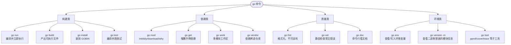
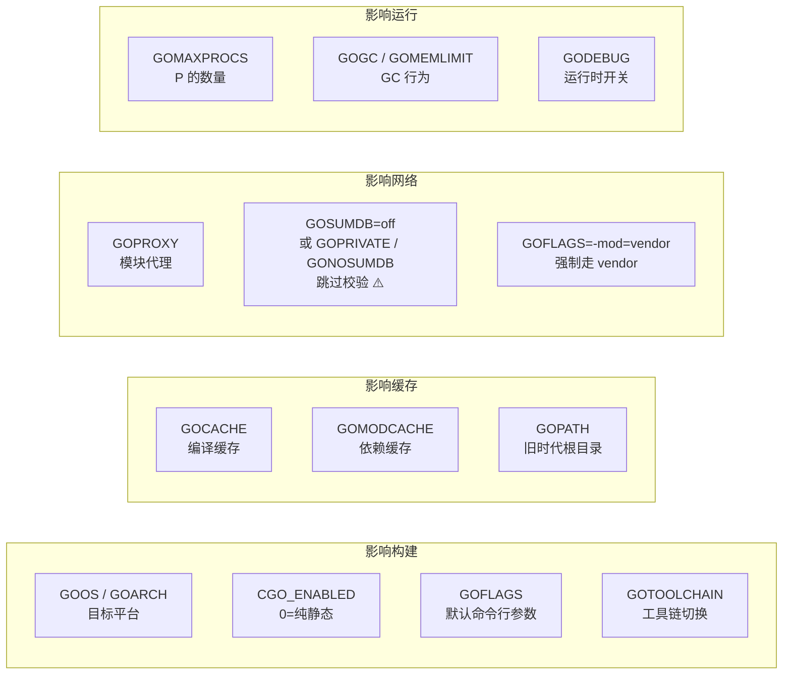
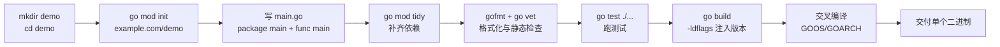
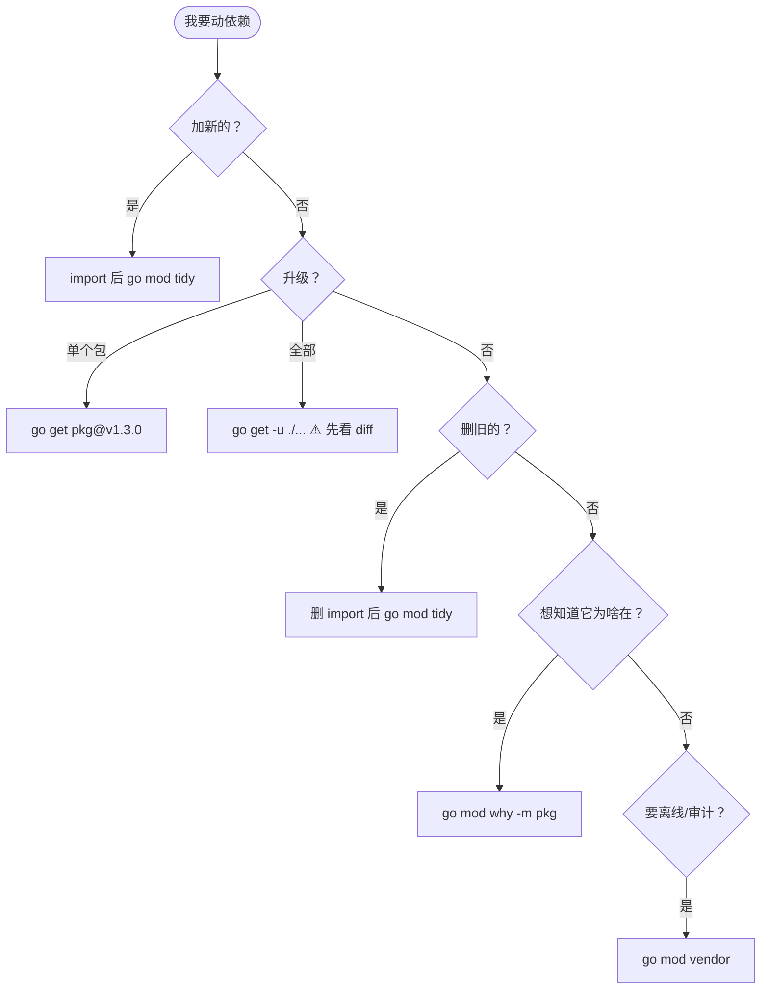

+++
title = "01 起步与工具链"
linkTitle = "01 起步与工具链"
weight = 101
date = "2026-09-20T10:05:00+08:00"
type = "docs"
description = "Go 1.27 工具链速查：go 命令全表、模块与工作区、环境变量、go run/build/install 差异、交叉编译与构建标记"
isCJKLanguage = true
draft = false
+++

# 01 起步与工具链

本页回答三个问题：**这段代码怎么跑起来**、**依赖怎么管**、**怎么交付到别的机器上**。

> 基线：**Go 1.27.1** / darwin/arm64。命令输出为本机实跑结果。

---

## 一张图看懂 go 命令

`go` 不是编译器，是**构建系统**。你只跟它打交道，真正干活的 `compile`/`link` 由它调度——`go build -x` 能看到全过程。



---

## 命令全表

### 构建与运行

| 命令 | 作用 | 常用变体 |
| --- | --- | --- |
| `go run .` | 编译到临时目录并立即执行 | `go run main.go` 单文件；`go run ./cmd/api` 指定包 |
| `go build .` | 编译当前包，产物留在当前目录 | `go build ./...` 编译全部包：**多包时不写文件**（只校验），只匹配到**一个 main 包**时仍会生成可执行文件 ⚠️ |
| `go build -o out ./cmd/api` | 指定产物名与路径 🔥 | `-o /dev/null` 做纯语法校验 |
| `go install ./cmd/api` | 编译并安装到 `$GOBIN` | `go install example.com/tool@latest` 装工具 🔥 |
| `go test ./...` | 跑测试 | `-race`、`-run`、`-bench`、`-cover`（见 [17 测试]()） |
| `go clean -cache` | 清空构建缓存 | `-testcache` 只清测试结果缓存 |
| `go generate ./...` | 执行源码里 `//go:generate` 指令 | 代码生成入口，标准库不参与 |

### 依赖与模块

| 命令 | 作用 | 何时用 |
| --- | --- | --- |
| `go mod init <path>` | 初始化模块，生成 `go.mod` | 新项目第一步 |
| `go mod tidy` | 补齐缺失、删除未用依赖 🔥 | 每次改完 import 后 |
| `go get pkg@v1.2.3` | 添加/升级到指定版本 | 升级要显式写版本号 |
| `go get -u ./...` | 升级到最新次版本 ⚠️ | 会连带升级间接依赖，谨慎 |
| `go mod download` | 只下载依赖到本地缓存 | CI 预热 |
| `go mod why -m <mod>` | 解释「为什么这个依赖存在」 | 清理依赖前的必备动作 |
| `go mod graph` | 打印依赖图 | 排查版本冲突 |
| `go mod vendor` | 把依赖复制进 `vendor/` | 需要离线构建时 |
| `go mod verify` | 校验本地缓存完整性 | 安全审计 |
| `go work init ./a ./b` | 建立多模块工作区 | 本地同时改多个仓库 🆕 1.18 |

### 质量与文档

| 命令 | 作用 | 说明 |
| --- | --- | --- |
| `gofmt -l -w .` | 格式化 | `go fmt ./...` 是它的简写 |
| `go vet ./...` | 静态检查 | 查不出来的 bug 类别见下表 |
| `go doc strings.Cut` | 命令行看文档 | 无需联网、无需 IDE |
| `go doc -all strings` | 看整包文档 | 比翻网页快 |
| `go list -m all` | 列出全部依赖及版本 | CI 里做版本审计 |
| `go version -m ./app` | 查看二进制内嵌的模块信息 🔥 | 排查「线上跑的是哪个版本」 |

`go vet` 到底能查什么——这些是它最值钱的几条，写代码时是硬错误级别：

| analyzer | 检查什么 | 例子 |
| --- | --- | --- |
| `printf` | 格式化串与参数不匹配 🔥 | `fmt.Printf("%d", "str")` |
| `copylocks` | 锁被按值复制 | 把含 `sync.Mutex` 的结构体传值 ⚠️ |
| `stringintconv` | `string(int)` 转换（几乎总是 bug）| `string(65)` 得到 `"A"` 而非 `"65"` 🔥 |
| `timeformat` | 时间 layout 写错 | 用了 `2006-02-01`（正确是 `2006-01-02`）|
| `structtag` | 结构体 tag 语法错误 | `json:"name` 少引号 |
| `lostcancel` | `context.WithCancel` 的 cancel 没调用 | 忘记 `defer cancel()` |
| `unmarshal` | 给 `Unmarshal` 传了非指针 | `json.Unmarshal(b, v)` |
| `errorsas` | 给 `errors.As` 传了非指针/非 error | 第二参数写成值 |
| `atomic` | `sync/atomic` 常见误用 | 直接读写被原子访问的变量 |
| `waitgroup` | `WaitGroup.Add` 位置错误 | 在 goroutine 内部 `Add` |
| `unusedresult` | 忽略了有意义的返回值 | 丢掉 `append` 的返回值 ⚠️ |
| `unreachable` | 不可达代码 | `return` 之后的语句 |
| `assign` | 无用赋值 | `x = x` |
| `loopclosure` | 闭包引用循环变量 | 旧 `go` 指令下的经典 bug |
| `unsafeptr` | `uintptr` → `unsafe.Pointer` 的非法转换 | 见 [11]() |
| `tests` | 测试/示例函数声明或签名写错 | `t.Fatal` 用在非测试 goroutine 🆕 1.24 |
| `stdversion` | 用了比 `go.mod` 语言版本更新的标准库符号 | 🆕 1.27 起 `go test` 默认也跑 |

💡 完整清单用 `go tool vet help` 查看（1.27.1 共注册 **36** 个 analyzer）。⚠️ **`go vet` 抓不到 nil 接口陷阱**——它没有这个检查项，那类问题只能靠 [08]() 里讲的规则与代码审查（或 `staticcheck`）。

---

## 环境变量



| 变量 | 典型值 | 记忆点 |
| --- | --- | --- |
| `GOOS` / `GOARCH` | `linux` / `arm64` | 交叉编译只需这两个 🔥 |
| `CGO_ENABLED` | `0` | 置 0 才能得到真正静态链接的二进制 |
| `GOPROXY` | `https://goproxy.cn,direct` | 国内加速；别丢掉末尾 `direct` |
| `GOSUMDB` | `sum.golang.org` | 校验模块哈希，企业内网可设 `off` ⚠️ |
| `GOTOOLCHAIN` | `auto`（默认）/ `local` / `go1.27.1` | `auto` 会按 `go.mod` 自动下载所需工具链 🆕 1.21 |
| `GOFLAGS` | `-trimpath` | 全局附加参数，CI 里常用 |
| `GOCACHE` | `~/Library/Caches/go-build` | 体积会涨到 GB 级，`go clean -cache` 回收 |
| `GOMODCACHE` | `~/go/pkg/mod` | 依赖源码实际落盘处 |
| `GOMAXPROCS` | 默认等于 CPU 核数 | Go 1.25 起容器内会感知 cgroup 配额 🆕 |
| `GOGC` / `GOMEMLIMIT` | `100` / `512MiB` | 内存换 CPU 的两个旋钮 |

查看与写入（区分大小写，写入后持久化到 `go env` 配置文件）：

```console
$ go env GOPROXY GOMODCACHE
https://goproxy.cn,direct
/Users/lx/go/pkg/mod

$ go env -w GOPROXY=https://goproxy.cn,direct   # 持久写入
$ go env -u GOPROXY                             # 撤销，回到默认
$ go env -w GOFLAGS=-trimpath
```

⚠️ `go env -w` 写的是**用户级**配置，优先级高于系统默认但低于进程环境变量。CI 里建议直接用环境变量注入，不要改机器状态。

---

## 从零到交付



最小可用骨架（`cmd/` 布局适合多命令项目，单命令项目直接扁平放也行）：

```text
demo/
├── go.mod
├── go.sum
├── main.go              # package main，仅做装配
├── internal/            # 只能被本模块导入 🔥
│   └── user/
│       ├── user.go
│       └── user_test.go
└── cmd/
    └── api/
        └── main.go      # 多个可执行入口时使用
```

| 目录 | 语义 |
| --- | --- |
| `internal/` | **编译器强制**的私有：模块外无法导入，不是命名约定而是规则 🔥 |
| `cmd/<name>/` | 每个子目录一个 `main` 包，一个可执行文件 |
| `pkg/` | 💭 社区习惯的「可被外部导入」目录，标准库自己不用，非必需 |
| `testdata/` | Go 工具链**忽略**的目录，放测试固件 |

---

## run / build / install 到底差在哪

三者都编译同一条链路，差别只在**产物去哪**。



{}

编译到临时目录并执行，产物不留在工作区。**适合验证语法与一次性脚本**。

```console
$ go run .
Hello, 世界
```

| 特点 | 说明 |
| --- | --- |
| 产物路径 | 临时目录，程序里取 `os.Executable()` 拿到的是临时路径 ⚠️ |
| 退出码 | 透传被运行程序的退出码 |
| 传参 | 参数放在包名之后：`go run . -port=8080` |
| 不适合 | 生产部署、需要稳定二进制的场合 |

{}

{}

编译成可执行文件，落在当前目录（包路径为 `.` 时）或指定的 `-o` 位置。

```console
$ go build -o demo .
$ ls
demo  go.mod  main.go
```

| 特点 | 说明 |
| --- | --- |
| 产物位置 | 当前目录；`go build ./cmd/api` 则在当前目录生成 `api` |
| 不留产物 | `go build ./...` 匹配到多个包时只做编译校验，不写文件 🔥 |
| 注入信息 | `-ldflags "-X main.version=v1.0.0"` |
| 去路径信息 | `-trimpath` 让产物不含本机绝对路径，可复现构建 |

{}

{}

编译并安装到 `$GOBIN`（默认 `$GOPATH/bin`），**必须在 PATH 里**才好用。

```console
$ go install ./cmd/api
$ ls $(go env GOPATH)/bin
api
$ api --help
```

安装远程工具是它最常用的场景，带 `@version` 时**不修改当前模块的 go.mod**：

```console
$ go install golang.org/x/tools/cmd/stringer@latest
```

⚠️ `go install pkg@version` 只有在该包是 `main` 包时才合法；装库没意义。

{}

{}

| 维度 | `go run` | `go build` | `go install` |
| --- | --- | --- | --- |
| 产物 | 临时文件，执行完可丢 | 当前目录 | `$GOBIN` |
| 用途 | 验证、脚本 | 交付、发布 | 装工具、装本地命令 |
| 是否在 PATH | 无所谓 | 需自己加 | 自动在 PATH 🔥 |
| 支持 `-ldflags` | ✅ | ✅ | ✅ |
| 典型命令 | `go run . -v` | `go build -o bin/api ./cmd/api` | `go install tool@latest` |

{}



---

## 依赖管理

### go.mod 的每一行长什么样

```go
module example.com/demo        // 模块路径，也是别人 import 你的前缀

go 1.27.1                     // 语言版本 + 最低工具链要求 🆕 1.21 起可带补丁号

toolchain go1.27.1            // 可选：显式锁工具链

require (
	github.com/google/uuid v1.6.0   // 直接依赖
	golang.org/x/text v0.14.0       // indirect 标记的是间接依赖
)

require golang.org/x/sys v0.15.0 // indirect

exclude github.com/bad/pkg v1.0.0   // 排除某个版本

replace github.com/a/b => ../b      // 本地替身，调试自己的库时必用 🔥

retract v1.0.5                      // 作者声明「别用这个版本」
```

| 指令 | 含义 | 什么时候动它 |
| --- | --- | --- |
| `module` | 模块路径 | 只在 `go mod init` 时设置 |
| `go` | 目标语言版本 | 决定新语法能否用；升级要显式 `go mod edit -go=1.27` |
| `toolchain` | 期望工具链 | 团队统一版本时加 |
| `require` | 依赖及版本 | 交给 `go get` / `go mod tidy`，手改容易错 |
| `replace` | 替换依赖来源 | 本地联调、fork 修复 🚧 发布库时慎用，会传染下游 |
| `exclude` | 排除版本 | 极少用，通常改用 `replace` |
| `retract` | 撤回版本 | 库作者专用 |

### 依赖操作决策图



### 可复现构建三件套

```console
$ go mod tidy          # 1. 依赖清单与代码一致
$ go mod verify        # 2. 校验下载内容未被篡改
$ go build -trimpath   # 3. 产物不含本机路径，处处一致
```

⚠️ `go.sum` **必须提交**。它记录每个模块的哈希，是供应链安全的底线；删了会导致校验失败，改了会导致构建结果不可信。

---

## 交叉编译

Go 交叉编译**不需要工具链**，只要目标平台是纯 Go 支持的组合。

```console
$ GOOS=linux   GOARCH=amd64 CGO_ENABLED=0 go build -o api-linux-amd64 .
$ GOOS=linux   GOARCH=arm64 CGO_ENABLED=0 go build -o api-linux-arm64 .
$ GOOS=windows GOARCH=amd64 CGO_ENABLED=0 go build -o api.exe .
$ GOOS=darwin  GOARCH=arm64 CGO_ENABLED=0 go build -o api-mac-arm64 .

$ file api-linux-arm64
api-linux-arm64: ELF 64-bit LSB executable, ARM aarch64, version 1 (SYSV), statically linked, ...
```

| GOOS | GOARCH | 典型目标 |
| --- | --- | --- |
| `linux` | `amd64` / `arm64` | 服务器、容器 🔥 |
| `darwin` | `arm64` / `amd64` | Apple Silicon / Intel Mac |
| `windows` | `amd64` | Windows |
| `js` | `wasm` | 浏览器 WebAssembly 🚧 |
| `wasip1` | `wasm` | WASI 运行时 🆕 1.21 🚧 |

`CGO_ENABLED=0` 的意义：一旦启用 cgo，产物就依赖目标平台的 C 库，交叉编译需要对应交叉工具链，且**不再是静态二进制**。所以「单文件部署」的前提是**不引入 cgo**。

```console
$ go tool dist list | wc -l        # 支持的平台组合总数
$ go tool dist list | grep linux   # 只看 linux
```

---

## 构建标记与版本注入

### 编译期注入版本信息

这是生产二进制最该有的一段代码：

```go
package main

import (
	"fmt"
	"runtime"
)

// 这三个变量由 -ldflags 在链接期覆盖，默认值只在 go run 时出现
var (
	version = "dev"
	commit  = "none"
	date    = "unknown"
)

func main() {
	fmt.Printf("version=%s commit=%s date=%s go=%s\n",
		version, commit, date, runtime.Version())
}
```

```console
$ go build -ldflags "-X main.version=v1.2.3 -X main.commit=abc1234 -X main.date=2026-09-21T00:00:00Z" -o app .
$ ./app
version=v1.2.3 commit=abc1234 date=2026-09-21T00:00:00Z go=go1.27.1
```

⚠️ `-X` 的格式是 `-X importpath.name=value`；对 `main` 包写 `main.version` 即可。变量必须是**字符串类型**，且不能被编译器优化掉（保证它被引用到）。

### 构建标记（build tags）

放在文件顶部、`package` 之前，**后面必须空一行**：

```go
//go:build linux && amd64

package platform

func PageSize() int { return 4096 }
```

| 写法 | 含义 |
| --- | --- |
| `//go:build linux` | 只在 Linux 编译 |
| `//go:build linux && amd64` | 同时满足 |
| `//go:build !windows` | 排除 Windows |
| `//go:build go1.27` | 工具链版本条件 🆕 |
| `//go:build integration` | **自定义标记**，配合 `-tags` |

```console
$ go build -tags=integration ./...
$ go test -tags=integration ./...     # 跑需要外部依赖的集成测试
```

⚠️ 旧的 `// +build` 语法已废弃 🪦，1.17 起统一用 `//go:build`。两种混写会被 `gofmt` 纠正。

---

## 看二进制里到底有什么

排查线上问题时，「这个二进制是哪次提交构建的」往往比日志更重要。

```console
$ go version -m ./app
./app: go1.27.1
	path	example.com/demo
	mod	example.com/demo	(devel)
	build	-buildmode=exe
	build	-compiler=gc
	build	CGO_ENABLED=0
	build	-ldflags="-X main.version=v1.2.3"
	build	-trimpath=true
	build	vcs.revision=9f3a1c2...
	build	vcs.time=2026-09-21T02:00:00Z
	build	vcs.modified=false
```

| 关键信息 | 用途 |
| --- | --- |
| `mod` | 模块路径与版本，`(devel)` 表示本地构建 |
| `build CGO_ENABLED` | 是否静态链接 |
| `build vcs.revision` | 对应的 git 提交 🆕 1.18 🔥 |
| `build vcs.modified` | 构建时工作区是否有未提交改动 ⚠️ |
| `dep` 行 | 每个直接依赖的最终版本 |

💭 只加 `-buildvcs=false` 就能关掉 VCS 信息嵌入；如果你的构建环境没有 git，默认不会报错（除非显式要求）。

---

## 本页陷阱速查

| 症状 | 实际原因 | 正确做法 |
| --- | --- | --- |
| `go build` 后目录里没有产物 | 包路径是 `./...`，多包构建不写文件 | 指定单一包并加 `-o` |
| `undefined: main.version` | `-ldflags` 里包路径写错，或变量名大小写不符 | 用 `-X main.version=...`，变量在 `main` 包 |
| 交叉编译报 cgo 错误 | 某依赖间接用了 cgo | `CGO_ENABLED=0`，或换纯 Go 实现 |
| `go get` 卡住不动 | `GOPROXY` 是默认的 `proxy.golang.org`，网络不通 | `go env -w GOPROXY=https://goproxy.cn,direct` |
| 本地能编译，CI 不能 | 依赖只存在于本地缓存或 `replace` 指向了本地路径 | 提交 `go.sum`，去掉本地 `replace` |
| 改了代码但运行结果没变 | 跑了别的二进制，或缓存的旧产物 | `go clean -cache` 后重建；`go version -m` 确认产物 |
| `internal/` 包导不进来 | 这是编译器强制的私有规则 | 把包移出 `internal/`，或改为公开 API |
| `build constraints exclude all Go files` | 标记条件与当前平台不匹配 | 检查 `//go:build` 行与空行 |

---

📘 官方参考：[Command go](https://pkg.go.dev/cmd/go)、[Go Modules Reference](https://go.dev/ref/mod)、[Go 1.27 Release Notes](https://go.dev/doc/go1.27)

➡️ 下一节：[02 词法与语法骨架]()
