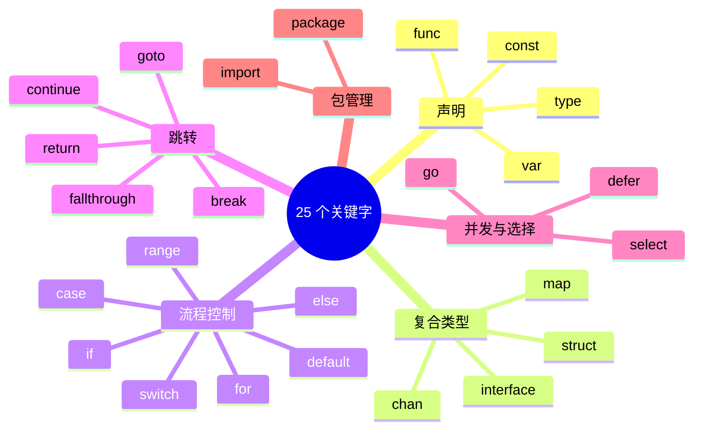
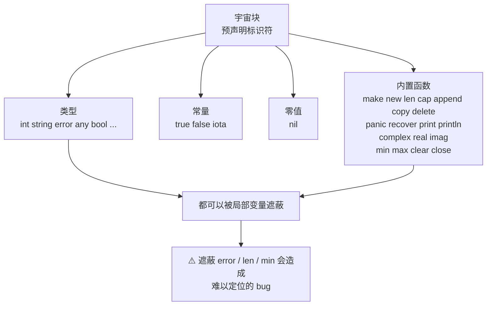
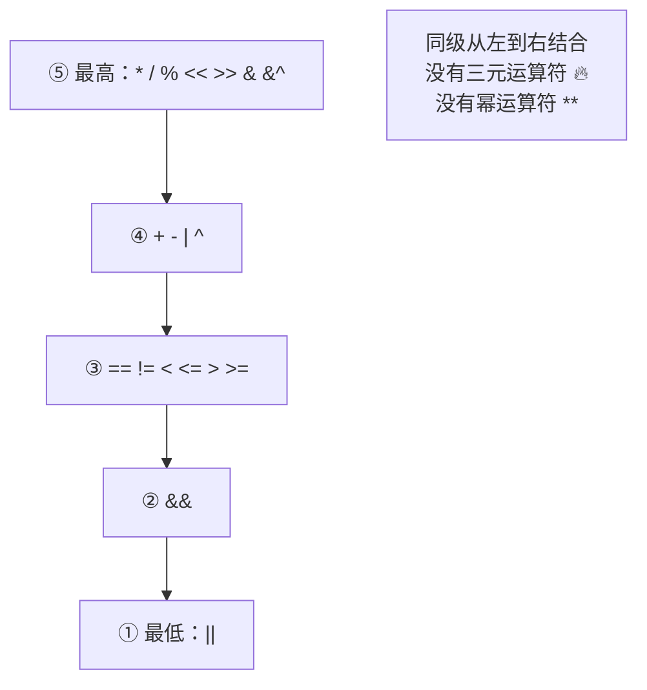
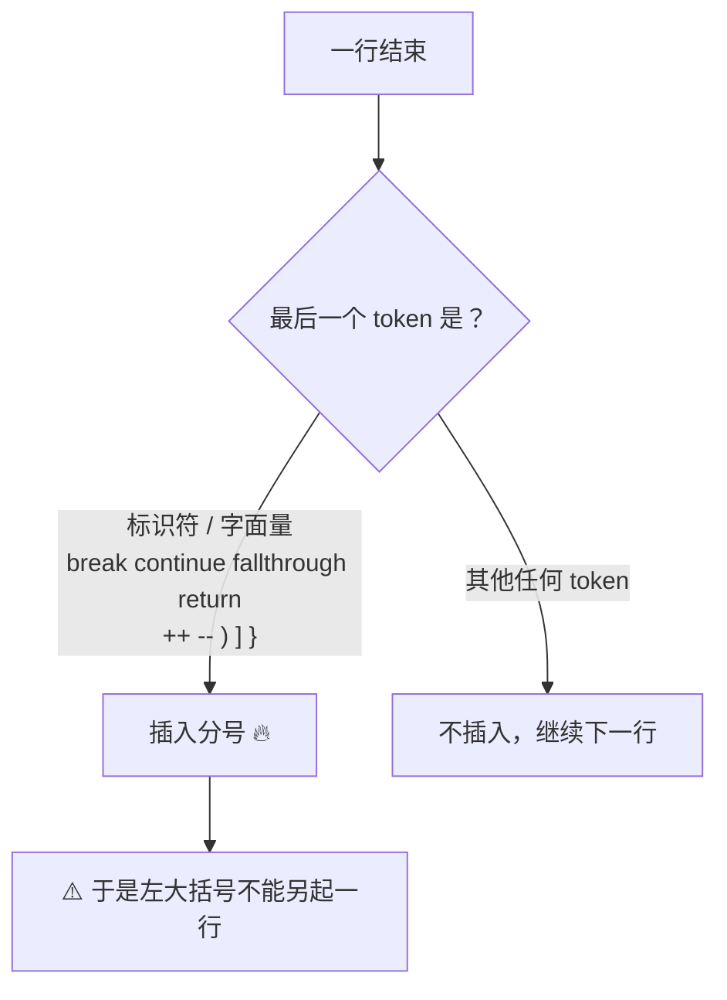
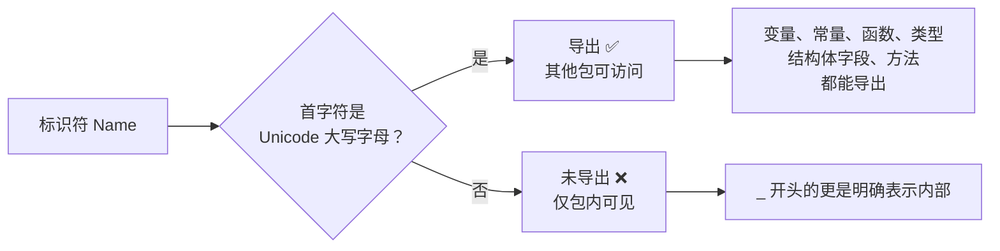

+++
title = "02 词法与语法骨架"
linkTitle = "02 词法与语法骨架"
weight = 102
date = "2026-09-20T10:10:00+08:00"
type = "docs"
description = "Go 的词法要素速查：25 个关键字分组、预声明标识符、字面量写法、运算符优先级、分号插入规则、命名与导出"
isCJKLanguage = true
draft = false
+++

# 02 词法与语法骨架

本页是「查写法」的底座：**关键字有哪些、字面量怎么写、运算符谁先算、什么名字能被外部包看见**。语法结构的语义在 [05 语句]() 与 [03 类型]() 里展开。

> 基线：**Go 1.27.1**。所有输出为本机实跑结果。

---

## 25 个关键字，一个不多

Go 的关键字总数是 **25** 个，全部小写，且**不能用作标识符**。记住这个分组比背列表有用：



| 分组 | 关键字 | 一句话 |
| --- | --- | --- |
| 声明 | `var` `const` `type` `func` | 四种顶层声明形式 |
| 复合类型 | `struct` `interface` `map` `chan` | 类型字面量的构造器 |
| 条件与分支 | `if` `else` `switch` `case` `default` | `default` 同时用于 `switch` 和 `select` |
| 循环 | `for` `range` | Go **只有** `for` 一种循环 🔥 |
| 跳转 | `break` `continue` `goto` `fallthrough` `return` | `fallthrough` 只存在于 `switch` |
| 并发 | `go` `select` `defer` | 三个「动词」，Go 的招牌 |
| 包 | `package` `import` | 每个文件开头两行 |

### 容易误记的边界

- Go **没有** `while`、`do`、`try`、`catch`、`finally`、`throw`、`class`、`extends`、`implements`、`public`、`private`、`static`、`new`（作为关键字，但有内置函数 `new`）、`delete`、`typeof`、`instanceof`。
- `true` `false` `nil` `iota` **不是关键字**，是**预声明标识符**——意味着你可以给它们重新赋值（虽然绝不该做）🛑：

```go
package main

import "fmt"

func main() {
	true := "我不是布尔值了"   // 🛑 合法但邪恶：遮蔽了预声明的 true
	fmt.Println(true)
}
```

```text
我不是布尔值了
```

---

## 预声明标识符

这些名字在**宇宙块（universe block）**里预声明，可以随时被局部声明遮蔽。理解这一点，才能解释「为什么 `len` 能被当成变量名」以及「为什么遮蔽 `error` 会导致灾难」。



| 类别 | 名字 |
| --- | --- |
| 布尔与数值类型 | `bool` `byte` `rune` `int` `int8` `int16` `int32` `int64` `uint` `uint8` `uint16` `uint32` `uint64` `uintptr` `float32` `float64` `complex64` `complex128` `string` `error` `any`（`any` = `interface{}` 的别名 🆕 1.18） |
| 常量 | `true` `false` `iota` |
| 零值 | `nil` |
| 内置函数 | `append` `cap` `clear` `close` `complex` `copy` `delete` `imag` `len` `make` `max` `min` `new` `panic` `print` `println` `real` `recover` |
| 空白标识符 | `_` |

⚠️ `print`/`println` 是**给运行时调试用的**，输出格式不保证稳定、且写到 stderr。生产代码一律用 `fmt` 或 `log`。

⚠️ `min`/`max`/`clear` 是内置函数 🆕 1.21，所以老代码里叫 `min` 的变量会在升级后与新内置函数冲突（多数情况仍能编译，但语义可能被遮蔽）。

---

## 字面量怎么写

### 整数：四种进制 + 下划线分隔

```go
n := 1_000_000        // 十进制，下划线只是给人看的 🆕 1.13
b := 0b1011_0010      // 二进制
o := 0o755            // 八进制（新版写法）
old := 0755           // 八进制（旧写法，仍然合法）
h := 0xDEAD_BEEF      // 十六进制
big := 1 << 62        // 位移也是最常见的「写大数」方式
```

```text
1000000 178 493 493 3735928559 4611686018427387904
```

### 浮点与虚数

```go
f1 := 3.14
f2 := .5          // 省略整数部分
f3 := 1.          // 省略小数部分
f4 := 1e9         // 科学计数法 → float64
f5 := 1e-3
c := 2 + 3i       // complex128
```

### rune 与字符串：单引号、双引号、反引号

| 写法 | 类型 | 是否转义 | 用途 |
| --- | --- | --- | --- |
| `'A'` `'世'` `'\n'` | `rune`（int32） | ✅ | 单个字符/码点 |
| `"a\nb"` | `string` | ✅ | 普通字符串 |
| `` `a\nb` `` | `string` | ❌ 原样 | 多行文本、正则、JSON、SQL 🔥 |

```go
r := 'A'            // rune，值是 65
r2 := '世'          // rune，值是 19990
s := "tab\there"    // 含一个制表符
raw := `tab\there`  // 字面量反斜杠 + t，不转义
```

```text
65 19990 "tab\there" "tab\\there"
```

转义序列完整表：

| 转义 | 含义 | 转义 | 含义 |
| --- | --- | --- | --- |
| `\a` | 响铃 | `\'` | 单引号（rune 内） |
| `\b` | 退格 | `\"` | 双引号（string 内） |
| `\f` | 换页 | `\\` | 反斜杠 |
| `\n` | 换行 | `\x41` | 十六进制字节（1 字节） |
| `\r` | 回车 | `\u4e16` | Unicode 码点（4 位十六进制） |
| `\t` | 制表符 | `\U0001F600` | Unicode 码点（8 位） |
| `\v` | 垂直制表 | `\101` | 八进制字节 |

⚠️ 字符串**可以**被索引，但索引单位是**字节**，不是字符。中文按 UTF-8 占 3 字节，所以 `s[0]` 拿到的是半个汉字：

```go
s := "héllo, 世界"
fmt.Println("len(bytes) =", len(s), " len(runes) =", len([]rune(s)))
fmt.Printf("%q\n", s[0:3])   // 按字节切
fmt.Printf("%q\n", s[1:3])   // 切出合法字符纯属巧合
```

```text
len(bytes) = 14  len(runes) = 9
"hé"
"é"
```

想要「第 n 个字符」必须 `[]rune(s)` 或 `for range`（见 [05 range]()）。

---

## 运算符与优先级

Go 的优先级只有 **5 档**，比 C 简单得多——因为它**没有** `?:`、没有逗号表达式、没有 `++` 前缀、没有指针算术。



| 优先级 | 运算符 | 记忆 |
| --- | --- | --- |
| 5 | `*` `/` `%` `<<` `>>` `&` `&^` | 乘除模 + 位运算全家 |
| 4 | `+` `-` `\|` `^` | 加减 + 按位或/异或 |
| 3 | `==` `!=` `<` `<=` `>` `>=` | 比较 |
| 2 | `&&` | 短路与 |
| 1 | `\|\|` | 短路或 |

💡 **唯一必须记的**：Go 里 **`&` `^` `|` 的优先级高于比较运算**——这一点**和 C 相反**（C 里 `==` 高于它们）。⚠️ 但**不是所有位运算都和 C 相反**：C 的 `<<` `>>` 同样高于比较，与 Go 一致。

```go
const flags uint8 = 4

// Go：先算 &，再算 ==，所以这就是「检查第 2 位」
if flags&0x04 == 0 { /* 不成立 */ } else { /* 走这里 */ }

// C/Java：== 优先级高于 &，同样的表达式含义完全不同 ⚠️
```

```text
bit set
```

| 语言 | `flags & 0x04 == 0` 的解析 | 结果 |
| --- | --- | --- |
| **Go** | `(flags & 0x04) == 0` | 检查位是否清零 ✅ |
| C / C++ | `flags & (0x04 == 0)` → `flags & 0` | 恒为 0，判断永远成立 🛑 |
| Java | `int & boolean` 类型不匹配 | **编译错误** 🛑（Java 的 `&` 两侧必须同为整型或同为 boolean） |

C 侧实测（本机 `cc`）：`3 << 1 > 5` → `1`（移位先算，**与 Go 一致**）；`6 & 2 == 2` → `0`（`==` 先算，**与 Go 相反**）。

即便如此，**混合位运算与比较时仍然建议加括号**：读代码的人不必回忆优先级表。

```go
if (flags&0x04) == 0 { }   // ✅ 推荐：意图无歧义
```

### 位运算速查

| 运算符 | 名称 | 例子（`a=0b1100`, `b=0b1010`） | 结果 |
| --- | --- | --- | --- |
| `&` | AND | `a & b` | `0b1000` |
| `\|` | OR | `a \| b` | `0b1110` |
| `^` | XOR（二元） | `a ^ b` | `0b0110` |
| `&^` | AND NOT（清位）🔥 | `a &^ b` | `0b0100` |
| `<<` | 左移 | `a << 2` | `0b110000` |
| `>>` | 右移 | `a >> 2` | `0b0011` |
| `^` | 按位取反（一元） | `^a`（对 int 是 `-a-1`） | `^0 == -1` |

```go
var a, b uint8 = 0b1100, 0b1010
fmt.Printf("a&b=%04b a|b=%04b a^b=%04b a&^b=%04b\n", a&b, a|b, a^b, a&^b)
fmt.Printf("a<<2=%04b a>>2=%04b\n", a<<2, a>>2)
```

```text
a&b=1000 a|b=1110 a^b=0110 a&^b=0100
a<<2=110000 a>>2=0011
```

`&^`（AND NOT）是 Go 独有的清位运算符，等价于 `a & (^b)`，写标志位清除时最省事。

### 移位的三个注意事项

Go 的移位语义和 C 差得比较远，值得单列：

| 事项 | Go 的行为 |
| --- | --- |
| 移位量可以为**变量** | ✅ `a << n` 是合法的（C 在旧标准里也常这样，但 Go 更彻底） |
| 移位量**为负** | 💥 **运行时 panic**：`negative shift amount` ⚠️ |
| 移位量**超过位宽** | 合法，结果按类型截断（例如 `uint8(1) << 8 == 0`） |
| **常量**移位溢出 | 🛑 编译错误：`constant shift overflow` |
| 优先级 | 与 `*` `/` `%` 同级（第 5 档）🔥 **比 C 高**——C 里 `<<` 低于 `+` |

```go
var a uint8 = 0b1100
n := -1
fmt.Println(a >> n)     // 💥 panic: runtime error: negative shift amount

fmt.Println(a<<8, a>>8) // 合法：0 0（按 uint8 截断）
```

⚠️ 移位量来自外部输入（配置、协议字段）时，**必须先校验非负**：

```go
// 🛑 危险
shift := cfg.ShiftBits        // 可能是 -1
result := value << shift

// ✅ 安全
if cfg.ShiftBits < 0 || cfg.ShiftBits > 31 {
	return fmt.Errorf("invalid shift: %d", cfg.ShiftBits)
}
result := value << cfg.ShiftBits
```

### 算术语义的两个反直觉点

```go
fmt.Println(10/3, 10%3)      // 整数除法截断
fmt.Println(-7/2, -7%2)      // 负数除法向零截断
fmt.Println(1.0/3.0, 3.0/2)  // 浮点除法
```

```text
3 1
-3 -1
0.3333333333333333 1.5
```

- **整数除法向零截断**：`-7/2 == -3`（不是 `-4`），余数符号跟随被除数：`-7%2 == -1`。
- **溢出是静默的**：整数运算溢出**不回绕报错**，直接截断。要检测得自己判边界。
- **除零**：整数除零是**运行时 panic**；浮点除零得到 `+Inf`。

### 无类型常量的精度

这是 Go 最优雅的设计之一：字面量常量在**赋值或使用之前**不占用具体类型，可以保留任意精度。

```go
const Big = 1 << 62          // 无类型整数常量
fmt.Println(Big)             // 4611686018427387904

f := 1e9                     // 默认类型 float64
i := 1.0 / 3.0
fmt.Printf("%T %v\n", f, f)  // float64 1e+09
fmt.Printf("%T %v\n", i, i)  // float64 0.3333333333333333
fmt.Printf("%T %v\n", 'A', 'A') // int32 65
```

| 写法 | 默认类型 |
| --- | --- |
| 整数常量 | `int` |
| 浮点常量 | `float64` |
| 虚数常量 | `complex128` |
| rune 字面量 | `rune`(int32) |
| 字符串字面量 | `string` |

⚠️ `1e9` 的语义需要说准，它比看上去更微妙：

| 写法 | 结果 |
| --- | --- |
| `x := 1e9` | `x` 的类型是 **`float64`** ⚠️ |
| `var n int = 1e9` | ✅ 合法：无类型常量，值能被 int 表示就能赋 |
| `n + 1e9`（n 是 int） | ✅ 合法：仍然是常量运算，得到 `int` |
| `f + 1e9`（f 是 float64 变量） | ✅ 合法，得到 float64 |
| `f + n`（float64 变量 + int 变量） | 🛑 编译错误：两个**变量**类型不同 |

本机实测：`n := 5; fmt.Println(n + 1e9)` → `1000000005`，编译通过。

💡 结论：`1e9` 是**无类型浮点常量**，只有在落到变量上时才取默认类型 `float64`。想明确表达「这是个整数」用 `1_000_000_000` 或 `1 << 30`。

### 类型断言与类型转换的符号区别

```go
var x any = 5

n, ok := x.(int)      // 类型断言：any 拆回具体类型
m, ok2 := x.(string)  // 断言失败不 panic（带 ok 形式）
fmt.Println(n, ok, m, ok2)

f := float64(n)       // 类型转换：数值类型之间
s := string(rune(65)) // int → string 是「转成对应字符」
```

```text
5 true  false
```

| 写法 | 名称 | 用途 | 失败行为 |
| --- | --- | --- | --- |
| `x.(T)` | 类型断言 | 接口 → 具体类型 | panic ⚠️ |
| `x.(T)` 带 ok | 类型断言 | 接口 → 具体类型 | 返回零值 + false |
| `T(x)` | 类型转换 | 数值/字符串/自定义类型 | 编译期检查 |
| `string(int)` | ⚠️ 特例 | 转成**码点对应的字符** | 不是数字转字符串！ |

🛑 最常见的错误：`string(65)` 得到 `"A"` 而不是 `"65"`。数字转字符串要用 `strconv.Itoa(65)`。

---

## 分号插入规则

Go 源码里几乎看不到分号，因为词法分析器会自动插入——规则是**「行的最后一个 token 若是某些符号，就在行尾插入分号」**。



这条规则解释了 Go 代码风格里**强制**的两件事：

```go
// ✅ 正确：左大括号与语句同行
func f() int {
	return 1
}
```

```go
// 🛑 编译错误：return 后自动加分号，大括号成了下一个语句
func f() int
{
	return 1
}
```

```go
// 🛑 编译错误：if 条件后自动加分号
if x > 0
{
}
```

| 会因为换行踩坑的写法 | 正确写法 |
| --- | --- |
| `return` 换行后写返回值 | `return expr` 写在同一行 |
| `x := []int{` 换行……列表末尾 `}` 换行 | 列表末尾的 `}` 与最后一项同行，或写 `,` 🔥 |
| `if cond` 换行 `{` | `if cond {` |
| 链式调用把 `.Method()` 换行开头 | 把点号留在上一行末尾 |

多行字面量的经典坑：

```go
// 🛑 编译错误：最后一行 } 前缺少逗号或同行右括号
xs := []int{
	1,
	2
}

// ✅ 两种正确写法
xs1 := []int{
	1,
	2,        // 尾逗号是关键 🔥
}
xs2 := []int{1, 2}
```

---

## 命名与导出

### 导出规则：只看首字母



| 名字 | 可被 `otherpkg` 访问？ | 说明 |
| --- | --- | --- |
| `User` | ✅ | 大写开头 |
| `user` | ❌ | 小写开头 |
| `UserID` | ✅ | `ID` 全大写是惯例 |
| `UserId` | ✅ | 能编译，但 `golint` 会唠叨 💭 |
| `HTTPServer` | ✅ | 缩写词全大写 |
| `utf8Valid` | ❌ | 小写开头，即使含大写字母也没用 |

⚠️ 「首字母」指 **Unicode 大写字母类（Lu）**，不只是 A–Z。所以中文标识符首字符永远不是大写，**永远导不出去**。

### 命名惯例（Go 社区共识，非编译器强制）

| 对象 | 惯例 | 例子 |
| --- | --- | --- |
| 包名 | 全小写、单个单词、无下划线 | `httputil` 而非 `http_util` |
| 局部变量 | 越短越好，作用域越短名字越短 | `i` `n` `err` `ctx` |
| 导出名 | `MixedCaps`（驼峰） | `ReadAll` 而非 `read_all` |
| 缩写词 | 整体大小写一致 | `URL` `ID` `HTTP` 而非 `Url` `Id` |
| 接收者名 | 1–2 个字母，同一类型保持一致 | `func (u *User) Name()` |
| 接口（单方法） | 方法名 + `er` | `Reader` `Writer` `Stringer` |
| 错误变量 | `Err` 前缀 | `ErrNotFound` |
| 测试函数 | `Test` + 被测名 | `TestUserCreate` |

⚠️ **只有**测试文件、平台特定文件、构建标记文件才用下划线：`user_test.go`、`syscall_linux.go`、`foo_amd64.go`。业务代码里出现下划线命名会被 `go vet` 之外的审查者念叨。

### 一个反直觉的坑：遮蔽预声明名字

```go
// 🛑 灾难写法：遮蔽了 error 类型
func bad() (result string, error error) { ... }

// ✅ 正确
func good() (result string, err error) { ... }
```

```go
// ⚠️ 单元测试里极常见的遮蔽
func TestX(t *testing.T) {
	len := computeLen()   // 遮蔽了内置 len
	_ = len
	// 下面想用内置 len 就没法用了
}
```

---

## 完整语法骨架

把 25 个关键字填进骨架，就是一份 Go 源文件的全部形态：

```go
// 1. 包声明（每文件必有一行，包名与目录名无强制关系）
package user

// 2. 导入（分组：标准库 / 第三方 空行分隔是惯例）
import (
	"context"
	"fmt"
	"uuid"            // 🆕 1.27：UUID 已进标准库
)

// 3. 常量
const MaxRetry = 3

// 4. 变量
var ErrNotFound = fmt.Errorf("user not found")

// 5. 类型
type User struct {
	ID   string
	Name string
}

type Store interface {
	Get(ctx context.Context, id string) (*User, error)
}

// 6. 方法
func (u *User) String() string { return u.Name }

// 7. 函数
func New(name string) *User {
	return &User{ID: uuid.New().String(), Name: name}
}

// 8. 并发与错误处理在函数体内展开
func (s *memStore) Get(ctx context.Context, id string) (*User, error) {
	select {
	case <-ctx.Done():
		return nil, ctx.Err()
	default:
	}
	u, ok := s.data[id]
	if !ok {
		return nil, ErrNotFound
	}
	return u, nil
}
```

---

## 本页陷阱速查

| 症状 | 实际原因 | 正确做法 |
| --- | --- | --- |
| `syntax error: unexpected {` | 左大括号另起一行，分号被自动插入 | 大括号与语句同行 |
| `missing ',' before newline` | 多行字面量最后一项缺尾逗号 | 加尾逗号 |
| `string(65)` 得到 `"A"` | `string(int)` 是码点转换 | 用 `strconv.Itoa(65)` |
| `a & b == 0` 在 Go 里行为对，从 C 迁过来的代码却错 | Go 位运算优先级高于比较，C 相反 | 混合时加括号：`(a & b) == 0` |
| 中文变量在其他包访问不到 | 首字符非 Unicode 大写，不可导出 | 用英文大写开头命名 |
| `-7/2` 结果是 `-3` 不是 `-4` | 整数除法向零截断 | 需要向下取整用 `math.Floor` |
| `len("中文")` 返回 6 不是 2 | `len` 数字节 | 用 `utf8.RuneCountInString` |
| `1e9` 与 int **变量**混算报错 | `x := 1e9` 让 x 变成 float64 变量 | 用 `1_000_000_000` 或 `1 << 30`；常量形式 `n + 1e9` 是合法的 |
| 变量 `len`/`min`/`error` 后行为诡异 | 遮蔽了预声明标识符 | 改名字，别用内置名做变量 |

---

📘 官方参考：[The Go Programming Language Specification — Lexical elements](https://go.dev/ref/spec#Lexical_elements)、[Effective Go](https://go.dev/doc/effective_go)、[Go Code Review Comments](https://go.dev/wiki/CodeReviewComments)

➡️ 上一节：[01 起步与工具链]() ｜ 下一节：[03 类型与零值]()
