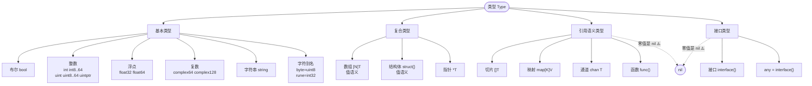
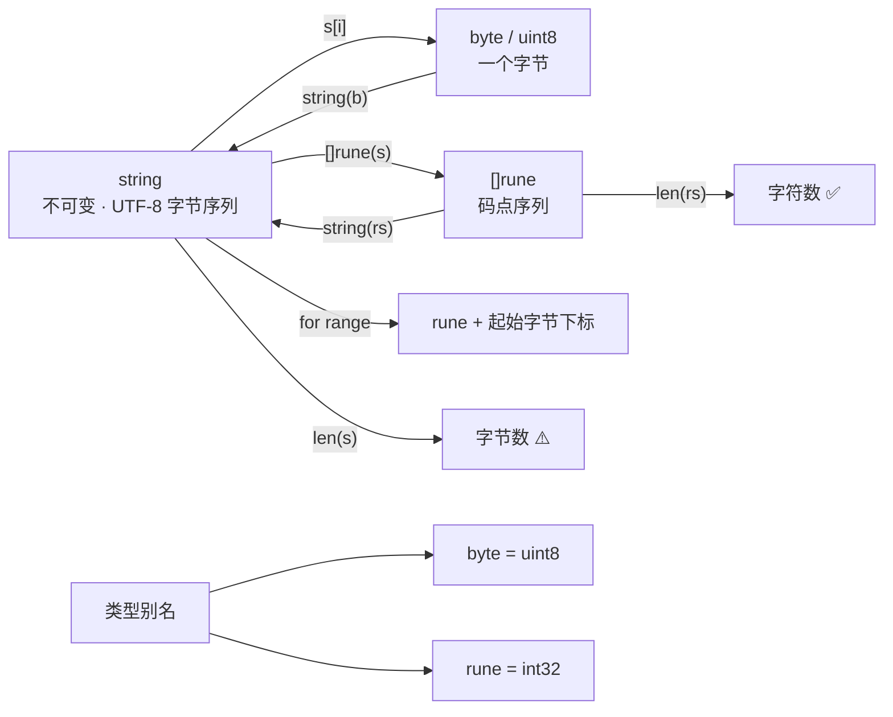
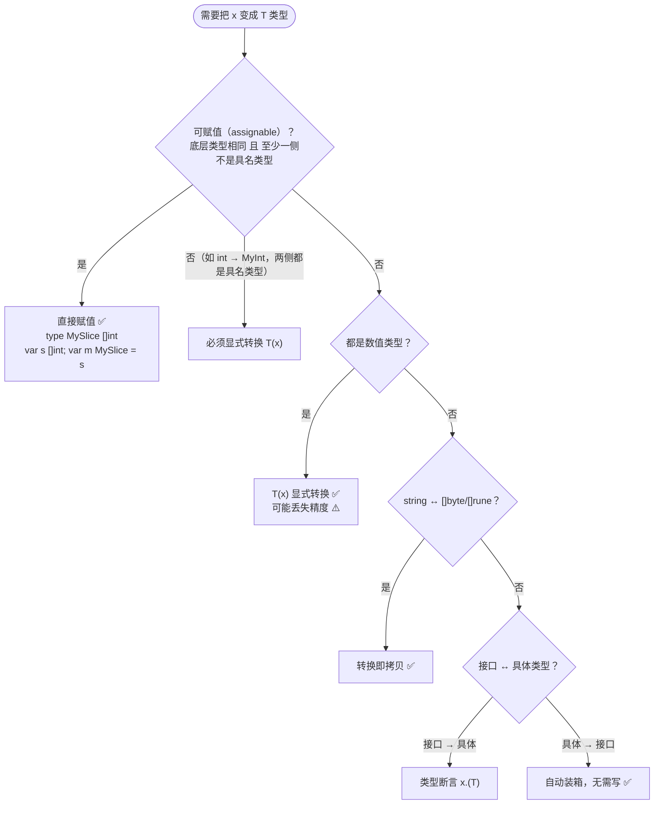
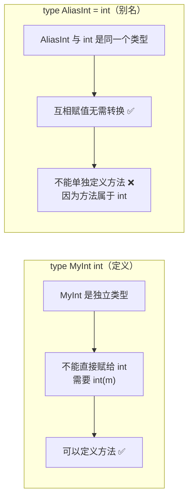

+++
title = "03 类型与零值"
linkTitle = "03 类型与零值"
weight = 103
date = "2026-09-20T10:15:00+08:00"
type = "docs"
description = "Go 类型体系全景：基本类型与取值范围、rune/byte/string 的关系、UTF-8 语义、零值总表、类型转换规则"
isCJKLanguage = true
draft = false
+++

# 03 类型与零值

本页回答：**有哪些类型、各占多宽、默认值是什么、什么时候必须显式转换**。复合类型的操作细节在 [07 数组·切片·映射·结构体]()。

> 基线：**Go 1.27.1** / darwin/arm64（64 位平台）。所有数值均为本机实跑结果。

---

## 类型体系全景

Go 的类型分四层：**基本类型 → 复合类型 → 引用类型 → 接口类型**。搞清这张图，`nil` 能赋给谁、什么能比较，就都不用背了。



**可以比较（`==`）的类型**：布尔、数值、字符串、指针、通道、接口、数组（元素可比较时）、结构体（字段全可比较时）。
**不能比较的类型**：切片、映射、函数——只能与 `nil` 比较 🛑。

```go
var s1, s2 []int
fmt.Println(s1 == nil)   // ✅ true
// fmt.Println(s1 == s2)  // 🛑 编译错误：slice can only be compared to nil
```

---

## 数值类型全表

| 类型 | 宽度 | 范围 | 默认类型 |
| --- | --- | --- | --- |
| `int8` | 8 位 | −128 ~ 127 | |
| `int16` | 16 位 | −32768 ~ 32767 | |
| `int32` | 32 位 | −2147483648 ~ 2147483647 | |
| `int64` | 64 位 | −9223372036854775808 ~ 9223372036854775807 | |
| `int` | 平台相关（64 位平台 8 字节） | 同 `int64` | ✅ 整数默认 |
| `uint8` / `byte` | 8 位 | 0 ~ 255 | |
| `uint16` | 16 位 | 0 ~ 65535 | |
| `uint32` | 32 位 | 0 ~ 4294967295 | |
| `uint64` | 64 位 | 0 ~ 18446744073709551615 | |
| `uint` | 平台相关 | 同 `uint64` | |
| `uintptr` | 平台相关 | 装指针的无符号整数 ⚠️ | |
| `float32` | 32 位 | ±3.4028234663852886e+38 | |
| `float64` | 64 位 | ±1.7976931348623157e+308 | ✅ 浮点默认 |
| `complex64` | 64 位 | float32 实部 + 虚部 | |
| `complex128` | 128 位 | float64 实部 + 虚部 | ✅ 复数默认 |

```go
fmt.Println("int bits:", unsafe.Sizeof(int(0))*8, "ptr bits:", unsafe.Sizeof(uintptr(0))*8)
fmt.Println(math.MaxInt64, math.MinInt64, math.MaxInt32, math.MaxUint8)
```

```text
int bits: 64 ptr bits: 64
9223372036854775807 -9223372036854775808 2147483647 255
```

### 常用边界常量（都在 `math` 包）

| 常量 | 值（本机实测） |
| --- | --- |
| `math.MaxInt` / `math.MinInt` | `9223372036854775807` / `-9223372036854775808`（平台相关，64 位下同 int64） |
| `math.MaxInt8` / `math.MinInt8` | `127` / `-128` |
| `math.MaxInt16` / `math.MinInt16` | `32767` / `-32768` |
| `math.MaxInt32` / `math.MinInt32` | `2147483647` / `-2147483648` |
| `math.MaxInt64` / `math.MinInt64` | `9223372036854775807` / `-9223372036854775808` |
| `math.MaxUint8` / `16` / `32` / `64` | `255` / `65535` / `4294967295` / `18446744073709551615` |
| `math.MaxUint` | `18446744073709551615`（平台相关） |
| `math.MaxFloat32` | `3.4028234663852886e+38` |
| `math.MaxFloat64` | `1.7976931348623157e+308` |
| `math.SmallestNonzeroFloat32` | `1.401298464324817e-45` |
| `math.SmallestNonzeroFloat64` | `5e-324` |

⚠️ `math` 包里**没有** `MinUint*` 系列——无符号整数下界恒为 0，不需要常量。也没有 `MaxComplex`，复数用两个 `float64` 表示。

⚠️ **`int` 不是 `int64`**。写库时如果 API 用了 `int`，在 32 位平台上就装不下大数；跨平台的持久化字段一律用定宽类型 `int64`。

### 该用哪个数值类型



{}

| 场景 | 用 | 不用 |
| --- | --- | --- |
| 计数、下标、长度 | `int` ✅ | `int32`/`uint` |
| 小数、测量值 | `float64` ✅ | `float32`（除非为省内存） |
| 字符串的字节 | `byte` | `uint8`（少用，语义差） |
| 字符/码点 | `rune` | `int32`（少用） |
| 布尔 | `bool` | `int` 当标志 ⚠️ |

💡 `int` 是平台相关的（64 位平台 8 字节），用它写循环与索引最自然。

{}

{}

| 场景 | 用 | 原因 |
| --- | --- | --- |
| 数据库字段、API 结构体 | `int64` 🔥 | 跨平台稳定，不受 32/64 位影响 |
| 二进制协议 | 定宽类型 + `encoding/binary` | 字节序明确 |
| 金额 | **整数最小单位**（分）| 浮点会累积误差 🛑 |
| ID | `string` 或 `int64` | UUID 用 `string` / `[16]byte` |
| 时间戳 | `int64`（Unix 秒/毫秒）| 跨语言通用 |

⚠️ **`int` 不是 `int64`**：32 位平台上装不下大数。对外契约一律定宽。

{}

{}

| 用 `uint` 的合理场景 | 不合理的场景 |
| --- | --- |
| 位运算、掩码 🔥 | 「这值不可能是负数」 |
| 哈希值、校验和 | 循环计数（`i--` 会回绕成天文数字 ⚠️） |
| 协议规定的无符号字段 | 长度（标准库都用 `int`） |

```go
// 🛑 无符号倒序循环会死循环
var i uint = 10
for ; i >= 0; i-- { }   // i=0 后 i-- 变成 18446744073709551615

// ✅
for i := 10; i > 0; i-- { }
```

{}



### 各类型占多少字节

```go
fmt.Println(unsafe.Sizeof(byte(0)), unsafe.Sizeof(rune(0)), unsafe.Sizeof(int16(0)),
	unsafe.Sizeof(int32(0)), unsafe.Sizeof(int64(0)), unsafe.Sizeof(float32(0)),
	unsafe.Sizeof(float64(0)), unsafe.Sizeof(complex64(0)), unsafe.Sizeof(complex128(0)))
```

```text
1 4 2 4 8 4 8 8 16
```

`string` 的头部是 **16 字节**（1 个指针 + 1 个长度），所以字符串赋值是「拷贝头部、共享底层字节」。

```text
string header: 16
```

---

## rune、byte、string 三者的关系

这张图是 Go 文本处理的全部真相：**`string` 是只读的字节序列，`byte` 是字节，`rune` 是码点**。



| 表达式 | 结果类型 | 含义 |
| --- | --- | --- |
| `s[i]` | `byte` | 第 i 个**字节** ⚠️ |
| `s[a:b]` | `string` | 字节区间切片（可能切断字符）⚠️ |
| `len(s)` | `int` | **字节数** ⚠️ |
| `[]rune(s)` | `[]rune` | 码点切片，`len` 才是字符数 |
| `[]byte(s)` | `[]byte` | 字节切片（会发生拷贝） |
| `for i, r := range s` | `int`, `rune` | 按**码点**迭代，`i` 是字节下标 🔥 |
| `utf8.RuneCountInString(s)` | `int` | 字符数，不分配内存 |
| `utf8.ValidString(s)` | `bool` | 是否为合法 UTF-8 |

```go
s := "héllo, 世界"
fmt.Println("len(bytes) =", len(s), " len(runes) =", len([]rune(s)))
fmt.Println(len("中文"), utf8.RuneCountInString("中文"))
```

```text
len(bytes) = 14  len(runes) = 9
6 2
```

UTF-8 编码长度规律（记住它就能心算字节数）：

| 码点范围 | 字节数 | 例子 |
| --- | --- | --- |
| U+0000 ~ U+007F | 1 | ASCII、`é` 之外的拉丁字母 |
| U+0080 ~ U+07FF | 2 | `é` `ñ` 希腊字母 西里尔字母 |
| U+0800 ~ U+FFFF | 3 | **中日韩汉字**、大部分符号 🔥 |
| U+10000 ~ U+10FFFF | 4 | emoji、部分生僻字 |

拿 `"héllo, 世界"` 逐字符验证一遍，长度就对上了：

| 字符 | `h` | `é` | `l` | `l` | `o` | `,` | `␣` | `世` | `界` | 合计 |
| --- | --- | --- | --- | --- | --- | --- | --- | --- | --- | --- |
| 字节数 | 1 | **2** | 1 | 1 | 1 | 1 | 1 | **3** | **3** | **14** |
| `[]rune` 个数 | 1 | 1 | 1 | 1 | 1 | 1 | 1 | 1 | 1 | **9** |

所以 `len(s) == 14` 而 `len([]rune(s)) == 9`——和实跑结果一致。💡 现实代码里**不要心算**，需要字符数就用 `utf8.RuneCountInString`。

### 字符串不可变

```go
s := "hello"
// s[0] = 'H'        // 🛑 编译错误：cannot assign to s[0]
b := []byte(s)       // ✅ 转成可变切片（拷贝）
b[0] = 'H'
s2 := string(b)      // 再转回来
fmt.Println(s, s2)   // hello Hello
```

**改字符串的正确姿势**：`[]byte`（要处理字节）或 `[]rune`（要处理字符），改完再转回 `string`。每次转换都是一次**完整拷贝**，热路径上要留意（见 [14 字符串]() 的 `strings.Builder`）。

---

## 类型转换：什么时候必须写 T(v)

Go **没有隐式数值转换**，这是它和 C/Java 最大的区别之一：不同类型之间运算必须先转换。



| 场景 | 写法 | 说明 |
| --- | --- | --- |
| `int` → `int64` | `int64(i)` | 必须显式 |
| `int` ↔ `float64` | `float64(i)` / `int(f)` | 浮点转整**截断**小数 |
| `int` → `string` | `strconv.Itoa(i)` | 🛑 **不是** `string(i)` |
| `string` → `int` | `strconv.Atoi(s)` | 返回 `(int, error)` |
| `[]byte` → `string` | `string(b)` | 拷贝 |
| `string` → `[]byte` | `[]byte(s)` | 拷贝 |
| 具名类型 → 底层类型 | `int(myInt)` | 必须显式 |
| 具体类型 → 接口 | 直接赋值 | 自动，无需写 |

### 精度丢失的方向

```go
var f float64 = 3.99
fmt.Println(int(f))       // 截断，不是四舍五入

var neg float64 = -2.7
fmt.Println(int(neg))     // 向零截断，不是 floor

var negInt int = -1
fmt.Println(uint8(negInt)) // 回绕

var n int = 300
fmt.Println(uint8(n))      // 只保留低 8 位

var big int64 = 1 << 40
fmt.Println(int32(big))    // 只保留低 32 位，高位静默丢弃 ⚠️
```

```text
3
-2
255
44
0
```

⚠️ **编译期能查的会报错，运行期不能查的静默截断**：

```go
var _ = uint8(300)      // 🛑 编译错误：constant 300 overflows uint8
var _ = int32(1 << 62)  // 🛑 编译错误：constant 4611686018427387904 overflows int32
```

但一旦经过**变量**，编译器就不再检查，直接静默截断/回绕。`go vet` 也管不了这个，只能靠代码审查和显式范围校验。

---

## 零值总表

**Go 没有未初始化变量**：声明即得零值。这张表要背下来，因为它解释了「为什么 nil map 能读不能写」这类问题。

| 类型 | 零值 | 可安全使用？ |
| --- | --- | --- |
| `bool` | `false` | ✅ |
| 所有整数/浮点/复数 | `0` / `0.0` / `0+0i` | ✅ |
| `string` | `""` | ✅ 长度 0，可拼接 |
| `*T` 指针 | `nil` | ❌ 解引用 panic |
| `[N]T` 数组 | 每元素各自零值 | ✅ |
| `struct{}` | 每字段各自零值 | ✅ |
| `[]T` 切片 | `nil` | ✅ `len=0`，**可 append** 🔥 |
| `map[K]V` | `nil` | ⚠️ **可读、可 len、可 range、可 delete，但不能写** |
| `chan T` | `nil` | ❌ 收发都永久阻塞 |
| `func()` | `nil` | ❌ 调用 panic |
| `interface{}` / `any` | `nil` | ⚠️ nil 接口与 nil 指针不同（见 [08]()） |
| `error` | `nil` | ✅ 判 `err != nil` 是标准写法 |

```go
type S struct {
	A int
	B string
	C []int
	D map[string]int
	E *int
	F error
	G any
	H [2]int
	I func()
	J chan int
	K bool
}

var s S
fmt.Printf("%+v\n", s)
```

```text
{A:0 B: C:[] D:map[] E:<nil> F:<nil> G:<nil> H:[0 0] I:<nil> J:<nil> K:false}
```

### nil 容器三兄弟的行为差异

这是初学者最容易翻车的地方，单列出来：

| 操作 | `nil` 切片 | `nil` 映射 | `nil` 通道 |
| --- | --- | --- | --- |
| `len(x)` | `0` ✅ | `0` ✅ | `0` ✅ |
| `cap(x)` | `0` ✅ | — | `0` ✅ |
| `range x` | 迭代 0 次 ✅ | 迭代 0 次 ✅ | **永久阻塞** ❌ |
| 读 `x[k]` | — | 返回零值 ✅ | **永久阻塞** ❌ |
| 写 `x[k]=v` | — | **panic** ❌ | **永久阻塞** ❌ |
| `append(x, v)` | 可用 ✅ | — | — |
| `delete(x, k)` | — | 无操作 ✅ | — |
| `close(x)` | — | — | **panic** ❌ |

```go
var c []int
func demo() {
	defer func() { fmt.Println("recover:", recover() != nil) }()

	var c []int
	c = append(c, 1)             // ✅ nil 切片可以直接 append
	fmt.Println(c, len(c), cap(c))

	var m map[string]int
	fmt.Println(m["x"], len(m))  // ✅ 读 nil map 是安全的

	m["x"] = 1                   // ❌ panic: assignment to entry in nil map
}
```

```text
[1] 1 1
0 0
recover: true
```

⚠️ 最后一行是 `defer` 在 panic 展开时执行的输出，所以它出现在**所有常规打印之后**；`m["x"] = 1` 之后不会再有代码运行。

💡 **实践结论**：
- 切片不需要「先 make 才能用」，直接 `var s []int` + `append` 是惯用法，也是返回空结果的推荐做法（见 [07 切片]()）。
- 映射**必须** `make` 或字面量初始化后才能写。
- 通道的 `nil` 阻塞特性其实是**有用的**：在 `select` 里把某个 `case` 的通道设为 `nil`，就等于**永久禁用该分支** 🔥（见 [12 select]()）。

---

## 浮点数的三个真相

### 真相一：常量精度高于运行时精度

Go 的无类型常量在编译期用**任意精度**计算，一旦落到变量上就退化成 IEEE-754：

```go
fmt.Println("const: 0.1+0.2 == 0.3 ->", 0.1+0.2 == 0.3)

a, b, c := 0.1, 0.2, 0.3
fmt.Println("vars:  0.1+0.2 == 0.3 ->", a+b == c)
fmt.Printf("vars:  %v\n", a+b)
```

```text
const: 0.1+0.2 == 0.3 -> true
vars:  0.1+0.2 == 0.3 -> false
vars:  0.30000000000000004
```

⚠️ 这意味着**同一段算术，写成常量还是变量，结果可能不同**。跨语言对比浮点行为时这是常见的困惑源。

### 真相二：`float32` 只有约 7 位有效数字

```go
x, y, z := float32(0.1), float32(0.2), float32(0.3)
fmt.Println(float64(x+y), x+y == z)
```

```text
0.30000001192092896 true
```

| 类型 | 有效十进制位 | 典型误差量级 |
| --- | --- | --- |
| `float32` | ~7 位 | 1e-7 |
| `float64` | ~15–16 位 | 1e-16 |

💡 **默认一律用 `float64`**。`float32` 只在明确为了省内存（大规模数组、图形/ML 数据）时使用。

### 真相三：浮点比较必须用误差容忍

```go
// 🛑 不要这样比
if a+b == c { }

// ✅ 误差容忍
const eps = 1e-9
if math.Abs((a+b)-c) < eps { }

// ✅ 需要严格语义时用 math 的专用判断
math.IsNaN(f)      // NaN != NaN，必须用它
math.IsInf(f, 0)   // 判断 ±Inf
```

⚠️ `NaN != NaN` 恒为真。用 `==` 判 NaN 永远失败，用 `math.IsNaN`。同时 NaN 会让 map 的键行为异常（NaN 作键永远取不到），别拿浮点当 map 键。

---

## 类型别名 vs 类型定义

两者长得像，语义完全不同：

```go
type MyInt int          // 类型定义：新类型，与 int 不通用 ⚠️
type AliasInt = int     // 类型别名：就是 int，完全等价 ✅
type Celsius float64    // 定义：可以给它挂方法
type ID = string       // 别名：ID 和 string 可以互相赋值
```



| 用途 | 选择 |
| --- | --- |
| 想给基础类型加方法、加语义 | **类型定义** `type Celsius float64` 🔥 |
| 想给长类型起短名字、渐进式重构 | **类型别名** `type ID = string` |
| 迁移期让两套名字并存 | **类型别名** |

```go
type Celsius float64
type Fahrenheit float64

func (c Celsius) ToF() Fahrenheit { return Fahrenheit(c*9/5 + 32) }

c := Celsius(100)
fmt.Println(c.ToF())          // 212
fmt.Println(c + 1.0)          // ✅ 101：1.0 是无类型常量，自动取 Celsius 类型

var f float64 = 1.5
// fmt.Println(c + f)         // 🛑 编译错误：Celsius 与 float64 不通用（两个都是【变量】）
fmt.Println(c + Celsius(f))   // ✅ 显式转换后才能相加
```

⚠️ 关键是分清「无类型常量」与「变量」：

| 表达式 | 结果 |
| --- | --- |
| `c + 1.0` | ✅ 合法——`1.0` 是无类型常量，会取 `Celsius` 类型 |
| `c + f`（`f` 是 `float64` 变量）| 🛑 编译错误：两个具名类型不通用 |
| `c + Celsius(f)` | ✅ 显式转换后相加 |

---

## 本页陷阱速查

| 症状 | 实际原因 | 正确做法 |
| --- | --- | --- |
| `m["k"] = 1` panic | 零值 `nil` map 不能写 | `m := make(map[string]int)` |
| `len("中文")` 是 6 | `len` 数字节 | `utf8.RuneCountInString` 或 `len([]rune(s))` |
| `s[0]` 拿到的字符乱码 | 按字节索引切断了 UTF-8 序列 | 用 `for range` 或 `[]rune` |
| `string(65)` 得到 `"A"` | 是码点转换不是格式化 | `strconv.Itoa(65)` |
| `int(3.99)` 得到 3 | 浮点转整是截断 | 要四舍五入用 `math.Round` |
| `uint8(negInt)` 得到 255 | 无符号回绕，静默发生 | 转换前手动校验范围 |
| `a+b == c` 浮点比较偶尔为 false | IEEE-754 表示误差 | 误差容忍或 `math.Abs` |
| `NaN != NaN` 导致判断永远为真 | NaN 语义如此 | `math.IsNaN(f)` |
| `type MyInt int` 后赋给 `int` 报错 | 类型定义产生新类型 | 显式 `int(v)`，或改用别名 |
| 切片不能 `==` 比较 | 切片不可比较，只能比 `nil` | 用 `slices.Equal` 🆕 1.21 |
| `int` 在 32 位平台截断 | `int` 宽度平台相关 | 持久化/协议字段用 `int64` |

---

📘 官方参考：[Spec — Types](https://go.dev/ref/spec#Types)、[The Go Blog — Strings, bytes, runes and characters in Go](https://go.dev/blog/strings)、[Go 1.21 builtin min/max/clear](https://go.dev/doc/go1.21)

➡️ 上一节：[02 词法与语法骨架]() ｜ 下一节：[04 变量·常量·iota]()
