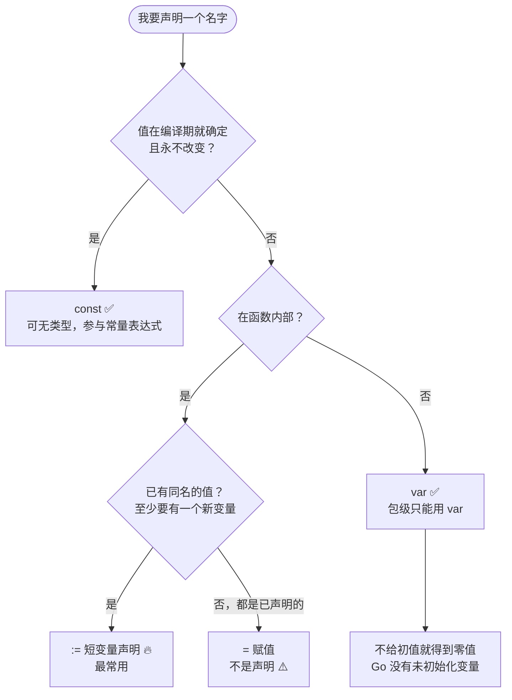
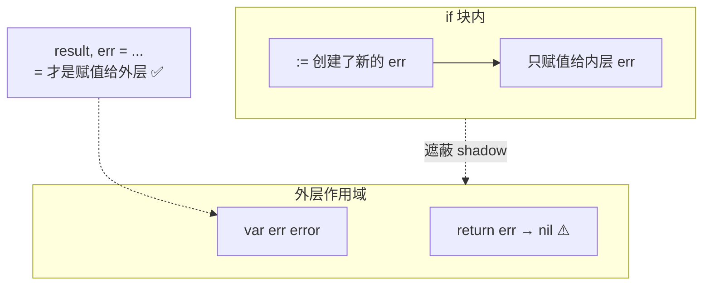
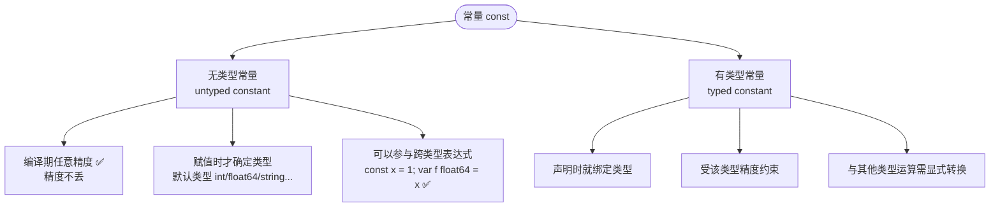
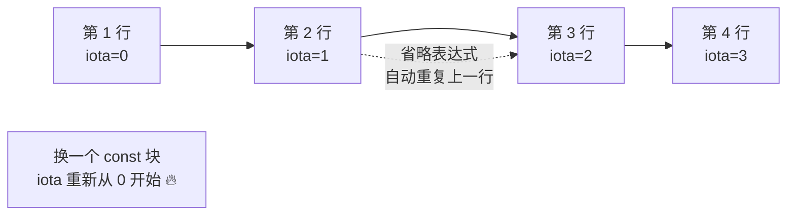
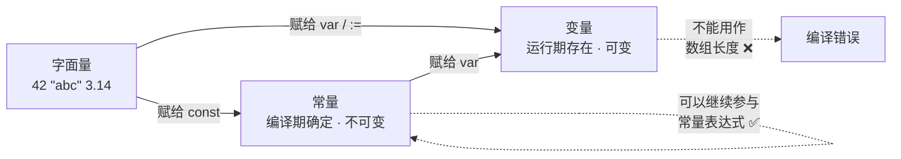

+++
title = "04 变量·常量·iota"
linkTitle = "04 变量·常量·iota"
weight = 104
date = "2026-09-20T10:20:00+08:00"
type = "docs"
description = "Go 变量与常量速查：var / := / 批量声明、包级与局部差异、无类型常量、iota 六种惯用模式与陷阱"
isCJKLanguage = true
draft = false
+++

# 04 变量·常量·iota

本页回答：**该用 `var` 还是 `:=`**、**常量为什么可以没有类型**、**`iota` 到底怎么数**。

> 基线：**Go 1.27.1**，输出为本机实跑结果。

---

## 声明方式选哪张牌



| 写法 | 位置 | 类型 | 典型场景 |
| --- | --- | --- | --- |
| `x := 42` | 仅函数内 | 推断 | **首选**，局部变量 🔥 |
| `var x int` | 函数内外 | 显式 | 需要零值、需要指定类型 |
| `var x int = 42` | 函数内外 | 显式 | 类型与字面量默认类型不同时 |
| `var x, y = 1, "a"` | 函数内外 | 推断 | 类型不同的一批声明 |
| `var (...)` | 函数内外 | 混合 | 包级变量分组，可读性好 |
| `const x = 42` | 函数内外 | 无类型 | 编译期常量 |
| `x = 42` | 函数内 | — | 赋值，**不是声明** ⚠️ |

---

## var 的四种形态

```go
var a int                  // 1. 只有类型，得到零值 0
var b = 42                 // 2. 只有初值，类型推断为 int
var c int = 42             // 3. 类型 + 初值
var d, e = 1, "two"        // 4. 批量，类型各自推断
var f, g int               // 5. 批量同类型，都是 0

var (                      // 6. 分组声明，包级最常用
	host string
	port int
	debug bool
)
fmt.Println(a, b, c, d, e, f, g, host, port, debug)
```

```text
0 42 42 1 two 0 0  0 false
```

💡 **包级变量用分组**是 Go 的惯例，比一长串 `var x = ...` 好读，也方便对齐类型：

```go
var (
	ErrNotFound = errors.New("not found")
	ErrConflict = errors.New("conflict")

	defaultTimeout = 30 * time.Second
	maxRetries     = 3
)
```

---

## := 短变量声明的三条规则

这是 Go 里最容易「以为自己懂了」的语法，三条规则必须同时记住：

| 规则 | 说明 |
| --- | --- |
| ① 只能在**函数内**使用 | 包级写 `x := 1` 是语法错误 🛑 |
| ② 左侧**至少有一个新变量** | 否则报 `no new variables on left side of :=` 🛑 |
| ③ 与 `=` 的区别是**声明 + 赋值** | 已声明的用 `=`，不是 `:=` |

### 规则 ② 的实际用法：同时处理新值和已存在的 err

这是 `:=` 最多被误解的地方——下面的写法**完全合法**：

```go
func f() (int, error) { return 1, nil }

func demo() error {
	f, err := os.Open("a.txt")   // f 与 err 都是新变量
	if err != nil {
		return err
	}
	defer f.Close()

	n, err := f.Read(make([]byte, 10))  // ✅ n 是新的，err 被复用（不是新变量）
	_ = n
	return err
}
```

关键点：**`err` 在第二行没有被重新声明**，只是被赋值。所以它仍指向同一个变量，作用域没变——这正是我们想要的。

🛑 常见错误：以为 `:=` 每次都会创建新变量，于是写下这种遮蔽 bug：

```go
func bad() error {
	var err error
	if true {
		result, err := doSomething()   // ⚠️ 这是【新的】err，遮蔽了外面的
		_ = result
	}
	return err                          // 永远是 nil，外层的 err 从未被赋值
}
```



修正方式二选一：

```go
// ✅ 方案 A：把声明提到外面，用 = 赋值
var result string
result, err = doSomething()

// ✅ 方案 B：拆开，先声明 result
var result string
var err error
result, err = doSomething()
```

⚠️ 这类 bug **编译器不会报错，`go vet` 默认也不查**（本机 `go vet ./...` 对上面的 `bad()` 无任何输出）。要抓它需要显式启用 shadow 分析器——`golangci-lint` 的 `govet` 里打开 `shadow`，或 `go vet -vettool=$(which shadow)`。这也是为什么「用 `=` 还是 `:=`」值得单独记一条。

---

## 作用域：`:=` 的新变量 vs 块级遮蔽

```go
x := 1
fmt.Println("outer x =", x)
{
	x := 2                        // 新变量，遮蔽外层
	fmt.Println("inner x =", x)
}
fmt.Println("outer x =", x)
```

```text
outer x = 1
inner x = 2
outer x = 1
```

| 作用域 | 范围 |
| --- | --- |
| 宇宙块 | 预声明标识符（`int` `len` `true`…） |
| 包块 | 包级声明的所有名字 |
| 文件块 | `import` 引入的包名 |
| 函数块 | 函数参数、返回值名、函数体 |
| 块语句 | `if`/`for`/`switch` 的 `{}` 内，**包括 `if` 的初始化语句** 🔥 |

⚠️ `if` 的初始化语句作用域覆盖 `if` 与 `else` 两部分，但不外泄：

```go
if v, err := compute(); err == nil {
	fmt.Println(v)
} else {
	fmt.Println("failed:", err)   // ✅ else 里也能用 err
}
// fmt.Println(v)                 // 🛑 编译错误：v 不在作用域内
```

---

## 常量：为什么可以没有类型

Go 的常量有两类，这是它最容易被低估的设计：



```go
const big = 1 << 100      // 无类型，编译期不溢出
const small = big >> 99   // 仍然是常量表达式
fmt.Println(small)        // 2
fmt.Printf("%T\n", small)  // int（赋值/传参时才取默认类型）

// fmt.Println(big)       // 🛑 编译错误：constant overflows int
fmt.Println(float64(big)) // ✅ 1.2676506002282294e+30，先显式转换

const typed int8 = 100    // 有类型，受 int8 范围约束
fmt.Printf("%T\n", typed)  // int8
```

```text
2
int
1.2676506002282294e+30
int8
```

⚠️ **无类型常量不是「万能」的**：它要在某个时刻落到具体类型上。传给 `fmt.Println`/`fmt.Printf` 这类收 `...any` 的函数时，会取**默认类型** `int`——而 `1 << 100` 装不进 `int`，于是直接编译失败（本机实测报错：`cannot use big (untyped int constant 1267650600228229401496703205376) as int value ... (overflows)`）。

| 特性 | 无类型常量 | 有类型常量 |
| --- | --- | --- |
| 精度 | 任意精度（至少 256 位）🔥 | 受类型限制 |
| 赋值给变量 | 自动取变量的类型 ✅ | 必须类型兼容 |
| `1 << 100` | 合法 | 除非常量极小时才合法 |
| 典型写法 | `const MaxRetry = 3` | `const Timeout time.Duration = 30 * time.Second` |

💡 **默认写无类型常量**，除非你需要用它做类型约束（比如让它出现在需要特定类型的表达式里）。

### 常量不等于「只读变量」

```go
const N = 10
var arr [N]int          // ✅ 数组长度必须是常量
// var arr2 [len(someSlice)]int   // 🛑 编译错误：长度不是编译期常量

const s = "hello"
const sl = len(s)       // ✅ 常量的 len 仍是常量 🆕 1.0 起内置函数对常量可用
```

⚠️ 并非所有内置函数都能用于常量表达式：`len`/`cap`（部分情况）、`real`/`imag`/`complex`、`min`/`max` 🆕 1.21 可以；`make`、`new`、`append` **都不行**。

---

## iota：一条规则，六种模式

`iota` 的规则只有一条，但必须精确理解：

> **在 `const` 声明块内，`iota` 从 0 开始，每出现一行 `ConstSpec` 就加 1；省略表达式时，重复上一行的表达式（但 `iota` 用当前行的值）。**



### 模式 1：连续枚举

```go
type Color int

const (
	Red Color = iota // 0
	Green            // 1
	Blue             // 2
)
fmt.Println(Red, Green, Blue)
```

```text
0 1 2
```

要让它打印成名字，加一个 `String()` 方法（见 [06 方法]()）：

```go
func (c Color) String() string {
	return [...]string{"Red", "Green", "Blue"}[c]
}
fmt.Println(Red, Green, Blue)   // Red Green Blue
```

### 模式 2：跳过零值

零值往往是「未设置」，所以枚举常从 1 开始：

```go
const (
	_ = iota // 丢弃 0
	A        // 1
	B        // 2
)
fmt.Println(A, B)
```

```text
1 2
```

### 模式 3：位标志（bit flags）

```go
const (
	FlagRead = 1 << iota // 1
	FlagWrite            // 2
	FlagExec             // 4
)
fmt.Println(FlagRead, FlagWrite, FlagExec)
fmt.Println(FlagRead|FlagWrite, FlagRead&FlagWrite, FlagRead&^FlagWrite)
```

```text
1 2 4
3 0 1
```

⚠️ 一旦改用 `1 << iota`，**中间插入新标志会破坏已序列化的数据**（旧值的位含义变了）。持久化过的标志位只能在末尾追加。

### 模式 4：数量级（KB/MB/GB）

```go
const (
	_  = iota
	KB = 1 << (10 * iota)   // 1024
	MB                      // 1048576
	GB                      // 1073741824
)
fmt.Println(KB, MB, GB)
```

```text
1024 1048576 1073741824
```

⚠️ **加不加类型，打印结果完全不同**——这是一个真实的坑：

```go
type ByteSize float64

const (
	_           = iota
	KB1 ByteSize = 1 << (10 * iota)   // 有类型：ByteSize
	MB1
)
const (
	_   = iota
	KB2 = 1 << (10 * iota)            // 无类型常量
	MB2
)
fmt.Println(KB2, MB2)     // 1024 1048576          ← 无类型常量：整数
fmt.Println(KB1, MB1)     // 1024 1.048576e+06     ← ByteSize：浮点显示 ⚠️
fmt.Printf("%T\n", KB1)   // main.ByteSize
```

```text
1024 1048576
1024 1.048576e+06
main.ByteSize
```

原因是 `ByteSize` 底层是 `float64`，而 `fmt` 对浮点用 `%v` 会走科学计数法。

### 模式 5：带步长的序列

```go
const (
	_  = iota
	KB3 = 1 << (10 * iota)
)
// 或用表达式做任意步长
const (
	_ = iota * 100   // 0
	X                // 100
	Y                // 200
)
fmt.Println(X, Y)
```

```text
100 200
```

### 模式 6：一行多个常量（iota 不递增）

⚠️ 一行里写多个名字时，`iota` **只在换行时递增**：

```go
const (
	A1, B1 = iota, iota + 1   // iota=0 → A1=0, B1=1
	C1, D1 = iota, iota + 1   // iota=1 → C1=1, D1=2
)
fmt.Println(A1, B1, C1, D1)
```

```text
0 1 1 2
```

💭 这个模式在实际代码里很少用，因为可读性差。知道规则即可，别主动写。

### iota 陷阱清单

| 写法 | 结果 | 说明 |
| --- | --- | --- |
| 中间插入一行注释 | `iota` 不受影响 ✅ | 只有 `ConstSpec` 计数 |
| 中间插入一行**没有名字**的表达式 | 语法错误 🛑 | 必须至少一个名字 |
| 用 `_` 跳过一个值 | ✅ `iota` 仍然递增 | 模式 2 |
| 多个 `const` 块 | 每块都从 0 开始 🔥 | 常见误解点 |
| `iota` 用在 const 块外 | 语法错误 🛑 | 它的作用域仅限 const 块 |
| 在函数内写 `const (...)` | ✅ 合法，`iota` 照常工作 | 但很少见 |

---

## 变量 vs 常量 vs 字面量



| 问题 | 常量 | 变量 |
| --- | --- | --- |
| 能否用作数组长度 | ✅ | ❌ |
| 能否用作 `case` 标签 | ✅ | ✅（表达式 switch 的 case 可以是任意可比较表达式；只有**重复的常量值**才报错）|
| 能否取地址 `&c` | ❌ 🛑 | ✅ |
| 能否被重新赋值 | ❌ | ✅ |
| 是否有内存地址 | 不一定（可能被内联） | ✅ |
| 默认类型 | 无类型（赋值时确定） | 声明时确定 |

```go
const N = 5
// p := &N     // 🛑 编译错误：cannot take the address of N
```

---

## 默认值初始化：一个高频惯用法

映射的零值就是「可用」，所以计数器不需要判存在：

```go
m := map[string]int{}
m["a"]++        // 未存在也安全，零值 0 自增为 1
m["a"] += 5
fmt.Println(m["a"])
```

```text
1
6
```

同样的思路适用于：

| 场景 | 惯用法 |
| --- | --- |
| 计数 | `m[k]++` |
| 累加 | `sum += m[k]` |
| 字符串拼接 | 用 `strings.Builder`（见 [14]()） |
| 结构体指针字段 | 用构造函数 `NewXxx()` 而不是判 nil |

---

## 本页陷阱速查

| 症状 | 实际原因 | 正确做法 |
| --- | --- | --- |
| 包级写 `x := 1` 报错 | `:=` 只能在函数内 | 用 `var x = 1` |
| `no new variables on left side of :=` | 左侧全是已声明变量 | 改用 `=` |
| 函数返回的 `err` 永远是 nil | `:=` 遮蔽了外层 err | 提前声明 result，用 `=` |
| 两个 `const` 块的 iota 连号 | 误以为 iota 全局递增 | 每个 const 块独立从 0 开始 |
| 加了类型后打印变成 `1.048576e+06` | 底层是 float64，`%v` 走浮点格式 | 用无类型常量，或显式转换 + 浮点动词：`fmt.Printf("%.0f", float64(KB))` ⚠️ `%d` 对 float64 非法，会打印 `%!d(...)` |
| `&N` 编译错误 | 取不到常量的地址 | 改用变量 |
| `[n]int` 报错 n 不是常量 | 数组长度必须是编译期常量 | 改用切片 `make([]int, n)` |
| 枚举打印出数字 | 没有实现 `String()` | 实现 `Stringer` 接口 |
| 中间插入标志位后旧数据错乱 | `1 << iota` 的位含义整体位移 | 只在末尾追加标志 |
| 常量溢出但编译报错位置很怪 | 无类型常量在有类型上下文中溢出 | 显式写类型，让错误定位更准 |

---

📘 官方参考：[Spec — Declarations and scope](https://go.dev/ref/spec#Declarations_and_scope)、[Spec — Constant declarations](https://go.dev/ref/spec#Constant_declarations)、[Effective Go — Constants](https://go.dev/doc/effective_go#constants)

➡️ 上一节：[03 类型与零值]() ｜ 下一节：[05 语句与控制流]()
