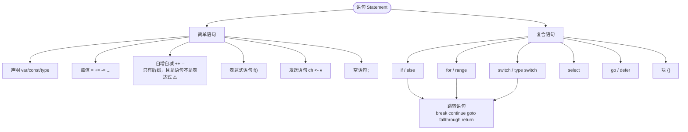
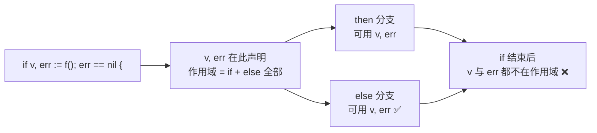
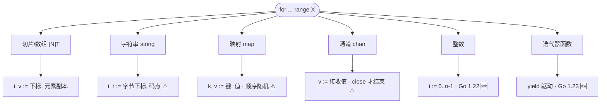
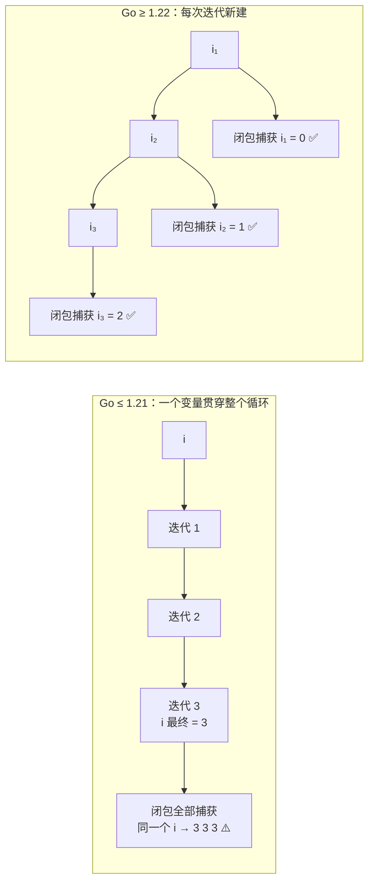
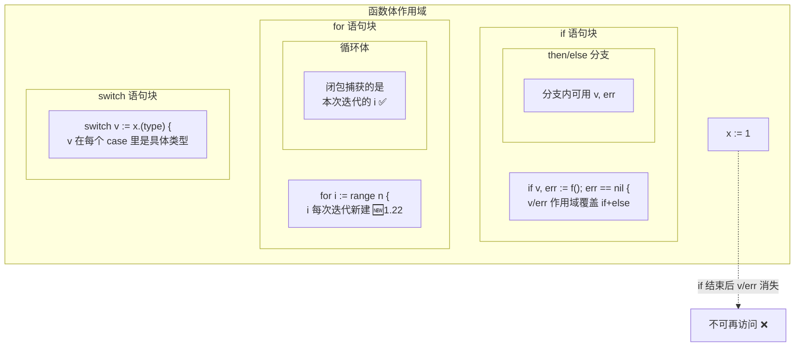

+++
title = "05 语句与控制流"
linkTitle = "05 语句与控制流"
weight = 105
date = "2026-09-20T10:25:00+08:00"
type = "docs"
description = "Go 语句速查：if 带初始化语句、for 三种形态、range 在各类型上的语义、Go 1.22 循环变量变更、switch 与 fallthrough、标签跳转"
isCJKLanguage = true
draft = false
+++

# 05 语句与控制流

本页回答：**Go 的控制流只有哪几种**、**`range` 在不同类型上分别给你什么**、**`switch` 为什么不需要 `break`**、**标签怎么用**。

> 基线：**Go 1.27.1**。所有输出为本机实跑结果。
> ⚠️ 本页涉及两个会改变旧代码行为的版本节点：**Go 1.22 循环变量语义**、**Go 1.23 range over func**。

---

## 语句家族总览

Go 的语句种类比 C 少得多：**没有 `while`、没有 `do-while`、没有三元运算符、没有异常**。



⚠️ `i++` 是**语句**不是表达式，所以 `x := i++` 和 `f(i++)` 都是语法错误 🛑。这是 Go 为了消除求值顺序歧义刻意做的取舍。

---

## if：带初始化语句是 Go 的招牌

```go
// 基本形态
if x > 0 {
	fmt.Println("positive")
} else if x == 0 {
	fmt.Println("zero")
} else {
	fmt.Println("negative")
}

// 🔥 招牌形态：初始化语句 + 条件
if v, err := compute(); err == nil {
	fmt.Println("ok:", v)
} else {
	fmt.Println("failed:", err)
}
```

初始化语句里声明的变量**作用域覆盖整个 if-else 链**，但不外泄——这是 Go 里控制变量生命周期最常用的手段：



| 写法 | 好处 |
| --- | --- |
| `if err := f(); err != nil` | `err` 不会污染函数作用域 🔥 |
| `if v, ok := m[k]; ok` | 经典「判存在 + 取值」 |
| `if s := strings.TrimSpace(s); s != ""` | 就地变换后判断，避免临时变量 |

⚠️ 别忘了 `else` 必须与 `}` 同行（分号插入规则，见 [02]()）。

---

## for：Go 只有一种循环

三种形态，全靠 `for` 一个关键字表达：

```go
// ① 三段式（类 C）
for i := 0; i < 3; i++ { }

// ② 条件式（类 while）
n := 0
for n < 3 { n++ }

// ③ 无限循环
for {
	if done() { break }
}
```

```text
classic: 3
while-style: 3
infinite+break: 3
```

| 需求 | 写法 |
| --- | --- |
| 经典计数循环 | `for i := 0; i < n; i++` |
| 当 while 用 | `for cond { }` |
| 死循环 | `for { }` |
| 只计数不要值 | `for range n` 🆕 1.22 🔥 |
| 遍历容器 | `for i, v := range xs` |

### 🆕 1.22：`range` 可以直接遍历整数

```go
for i := range 3 {
	fmt.Print(i, " ")
}
```

```text
0 1 2
```

⚠️ `for i := range n` 迭代的是 `0..n-1`，和「重复 n 次」语义一致。**不要**再写 `for i := 0; i < n; i++` 来重复 n 次——但如果你需要 `n` 本身（比如倒序），还是得用三段式。

---

## range：一张表看清所有类型

`range` 的返回值随容器类型变化，这是最容易记混的点：

| 容器类型 | 第一个值 | 第二个值 | 说明 |
| --- | --- | --- | --- |
| 数组 / 切片 `[]T` | `int` 下标 | `T` 元素副本 | 副本！改它不影响原切片 ⚠️ |
| 字符串 `string` | `int` **字节**下标 | `rune` 码点 | 下标不连续 🔥 |
| 映射 `map[K]V` | `K` 键 | `V` 值副本 | **顺序随机** ⚠️ |
| 通道 `chan T` | `T` 收到的值 | — | **直到 close 才结束** ⚠️ |
| 整数 `int` | `int` 0..n-1 | — | 🆕 1.22 |
| 函数 `func(func(K,V) bool)` | K | V | 🆕 1.23 自定义迭代器 |



### 字符串：下标是字节，值是码点

```go
s := "héllo"
for i, r := range s {
	fmt.Print(i, ":", string(r), " ")
}
```

```text
0:h 1:é 3:l 4:l 5:o
```

注意下标从 `0,1,3,4,5` —— **跳过了 2**，因为 `é` 占 2 字节。这就是「下标是字节、值是码点」的直接证据。知道了这个，你就能理解为什么「按索引访问第 n 个字符」在 Go 里必须绕道 `[]rune`。

### 映射：顺序随机是刻意的

```go
m := map[string]int{"a": 1, "b": 2}
for k := range m {
	fmt.Print(k, " ")
}
```

```text
a b        ← 也可能是 "b a"，每次运行都可能不同
```

⚠️ Go **故意**随机化 map 迭代顺序，防止你依赖它。需要稳定顺序必须显式排序（`slices.Sort` 或 `maps.Keys` + 排序，见 [14]()）。

### 通道：天然配合 close

```go
ch := make(chan int, 3)
ch <- 1
ch <- 2
close(ch)
for v := range ch {
	fmt.Print(v, " ")
}
```

```text
1 2
```

`range` 通道会在通道 `close` 且缓冲区取空后**自动退出**——这是「生产者-消费者」最简洁的写法。⚠️ 如果生产者忘记 `close`，消费者会永久阻塞（见 [12 通道]()）。

### 元素是副本

```go
xs := []struct{ N int }{{1}, {2}}
for _, x := range xs {
	x.N = 99        // ⚠️ 改的是副本，原切片纹丝不动
}
fmt.Println(xs)     // [{1} {2}]

for i := range xs {
	xs[i].N = 99    // ✅ 想改元素必须用下标
}
fmt.Println(xs)     // [{99} {99}]
```

### 🆕 1.22：循环变量每次迭代都是新的

这是**会改变旧代码行为**的语义变更，必须知道：

```go
var fns []func()
for i := 0; i < 3; i++ {
	fns = append(fns, func() { fmt.Print(i, " ") })
}
for _, f := range fns {
	f()
}
```

```text
0 1 2
```

| 版本 | 行为 |
| --- | --- |
| Go ≤ 1.21 | 所有闭包共享同一个 `i`，输出 `3 3 3` ⚠️ |
| **Go ≥ 1.22** | 每次迭代新建变量，输出 `0 1 2` ✅ |



⚠️ 这个变更由 `go.mod` 里的 `go` 指令控制：`go 1.21` 及更低仍用旧语义。升级 `go` 指令时如果程序依赖了旧的共享行为（极少见但存在），会静默改变结果。

`for ... range` 的 `v` 同理：

```go
var fns2 []func()
for _, v := range []string{"a", "b", "c"} {
	fns2 = append(fns2, func() { fmt.Print(v, " ") })
}
for _, f := range fns2 { f() }
```

```text
a b c
```

💡 于是老代码里那个 `v := v` 的补丁写法**不再需要**了 🪦：

```go
for _, v := range xs {
	v := v   // 🪦 Go 1.22 起多余
	go func() { use(v) }()
}
```

### 🆕 1.23：range over func（自定义迭代器）

只要函数签名是 `func(yield func(T) bool)`，就能被 `range`：

```go
import (
	"iter"
	"slices"
)

func count(n int) iter.Seq[int] {
	return func(yield func(int) bool) {
		for i := range n {
			if !yield(i) {
				return          // yield 返回 false 表示调用方 break 了，必须立即返回
			}
		}
	}
}

for v := range count(3) {
	fmt.Print(v, " ")
}
```

```text
0 1 2
```

标准库已经全部支持：`slices.Values`、`slices.Backward`、`maps.Keys`、`maps.Values`、`strings.SplitSeq` 等都返回 `iter.Seq`。

```go
for v := range slices.Backward([]int{1, 2, 3}) {
	fmt.Print(v, " ")
}
```

```text
3 2 1
```

⚠️ 写生成器时的**硬性约定**：`yield` 返回 `false` 时必须立刻 `return`，否则调用方已经退出循环，你还在生产数据——轻则浪费，重则死锁。

---

## switch：默认就不穿透

Go 的 `switch` 与 C 最大的区别：**每个 case 结束自动 break**，要穿透必须显式 `fallthrough`。

```go
switch 2 {
case 1:
	fmt.Print("one ")
	fallthrough
case 2:
	fmt.Print("two ")
	fallthrough
case 3:
	fmt.Print("three ")
case 4:
	fmt.Print("four ")
}
```

```text
two three
```

几个必须记住的点：

| 点 | 说明 |
| --- | --- |
| 自动 break | 不需要写 `break`，写了也对（但冗余） |
| `fallthrough` | 无条件进入**下一个 case 的 body**，不判断它的条件 ⚠️ |
| `fallthrough` 不能在最后一个 case | 🛑 编译错误 |
| case 可以是表达式列表 | `case 1, 3, 5:` |
| 可以有初始化语句 | `switch v := f(); v { }` 🔥 |
| 无 tag switch | `switch { case x > 0: }` 等价于 `if/else if` 链 |
| case 求值顺序 | 从上到下，第一个命中的执行 |

```go
// 无 tag：比一长串 else if 更整齐
switch {
case x < 0:
	fmt.Print("neg ")
case x == 0:
	fmt.Print("zero ")
default:
	fmt.Print("pos ")
}

// 带初始化 + 多值 case
switch v := 4; v {
case 1, 3, 5:
	fmt.Println("odd")
case 2, 4, 6:
	fmt.Println("even")
}
```

```text
neg zero pos        ← 上面是对 x 依次取 -1、0、5 三次执行的结果
even                ← 4 命中 case 2, 4, 6
```

⚠️ 一个 `switch` 一次只执行**一个**分支，所以上面是把 `x` 取三个值各跑一次拼起来的输出；照抄示例时记得给 `x` 一个具体值。

### 类型 switch

```go
switch v := x.(type) {
case nil:
	fmt.Print("nil ")
case int:
	fmt.Print("int:", v, " ")
case string:
	fmt.Print("string:", v, " ")
case []int:
	fmt.Print("slice len=", len(v), " ")
default:
	fmt.Printf("other %T ", v)
}
```

```text
int:1 string:x slice len=2 other float64 nil
```

⚠️ 同理，类型 switch 一次也只命中一个 case。上面这一行是把 `x` 依次取 `1`、`"x"`、`[]int{1,2}`、`3.5`、`nil` 各跑一次的结果拼起来的（最后一次命中 `case nil`，输出 `nil`）。

| 细节 | 说明 |
| --- | --- |
| `v` 的类型 | 在每个 case 里自动变成该 case 的类型 🔥 |
| `case nil` | 匹配 **nil 接口**，不匹配「有类型的 nil」⚠️ |
| 多类型 case | `case int, int64:` 此时 `v` 保持原接口类型 |
| `default` 的 `v` | 仍是接口类型 |

⚠️ 类型 switch 的 `case nil` 只在**接口本身为 nil** 时命中。装了一个 `(*T)(nil)` 的接口**不会**命中 `case nil`——这是 [08 接口]() 里那个经典陷阱的另一面。

---

## 标签：跳出多层循环的唯一正道

Go 没有「带层数的 break」（没有 `break 2`），只能用标签。

```go
outer:
	for i := 0; i < 3; i++ {
		for j := 0; j < 3; j++ {
			if j == 2 {
				continue outer   // 跳到外层循环的下一次迭代
			}
			if i == 2 {
				break outer      // 彻底跳出外层循环
			}
			fmt.Print(i, j, " ")
		}
	}
```

```text
0 0 0 1 1 0 1 1
```

| 语句 | 效果 |
| --- | --- |
| `break` | 跳出最内层 `for`/`switch`/`select` |
| `break label` | 跳出标签标注的那层 🔥 |
| `continue` | 继续最内层 `for` 的下一次迭代 |
| `continue label` | 继续标签标注的那层 |
| `goto label` | 无条件跳转，**不能跳过变量声明** ⚠️ |
| `fallthrough` | 只用于 `switch`，进入下一个 case |

⚠️ 标签必须紧贴在 `for` 语句**上一行**，且标签与 `for` 之间不能有其他语句。

### goto：能用但不该常用

```go
i := 0
loop:
	if i < 3 {
		fmt.Print("g", i, " ")
		i++
		goto loop
	}
```

```text
g0 g1 g2
```

合法的 `goto` 限制（编译器强制）：

| 限制 | 说明 |
| --- | --- |
| 不能跳过变量声明 | `goto` 目标之后新声明的变量，跳过去会报错 🛑 |
| 不能跳进另一个函数 | 标签是函数级的 |
| 不能跳进块内部 | 只能跳到同层或外层 |
| 不能跳进 `for` 循环体 | 常见错误 |

💭 实际代码里 `goto` 的合理用途基本只有两个：**C 风格的多层清理**（现已由 `defer` 取代），以及**状态机重试**。其他场合用循环和函数表达更清楚。

---

## 语句与作用域对照图



---

## 本页陷阱速查

| 症状 | 实际原因 | 正确做法 |
| --- | --- | --- |
| `syntax error: unexpected ++` | `i++` 是语句不是表达式 | 拆成两行：`x := i; i++` |
| 闭包里的循环变量全是最后一个值 | `go.mod` 的 `go` 指令 ≤ 1.21 用旧语义 | 升级到 `go 1.22`+，或显式 `v := v` 🪦 |
| `range` 里改元素没生效 | `v` 是元素副本 | 用下标 `xs[i].N = ...` |
| 按索引取字符串中文字符乱码 | `range` 的下标是字节 | `[]rune(s)` 或按字节下标切片 |
| map 遍历顺序每次不同 | 这是刻意随机化的 | 需要稳定顺序就显式排序 |
| `range` 通道卡死 | 生产者没 `close` | 生产完毕后 `close(ch)` |
| `fallthrough` 落到了不该进的 case | 它不判断下一个 case 的条件 | 只在确实要顺序穿透时使用 |
| `case nil` 不匹配 `(*T)(nil)` | nil 接口 ≠ 有类型的 nil 接口 | 在 case 里再判 `v == nil` |
| `break` 只跳出了一层 | 嵌套循环需要标签 | `break outer` |
| `goto` 报 jumps over declaration | 跳过了变量声明 | 把声明移到标签之前 |
| `for range n` 行为像旧代码 | `go` 指令低于 1.22，`range int` 不支持 | 升级 `go` 指令 |
| 自定义迭代器 `yield` 返回 false 后仍继续 | 没有立刻 return | `if !yield(v) { return }` |

---

📘 官方参考：[Spec — Statements](https://go.dev/ref/spec#Statements)、[Go 1.22 Release Notes — for loops](https://go.dev/doc/go1.22#language)、[Go 1.23 Release Notes — range over func](https://go.dev/doc/go1.23#language)、[Go Blog — Range Over Function Types](https://go.dev/blog/range-functions)

➡️ 上一节：[04 变量·常量·iota]() ｜ 下一节：[06 函数·方法·defer]()
