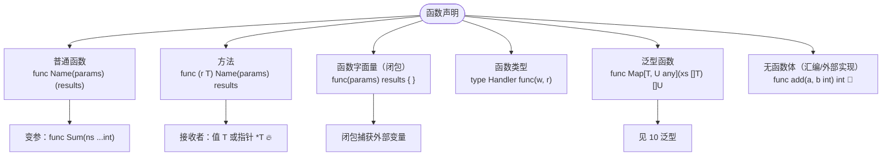
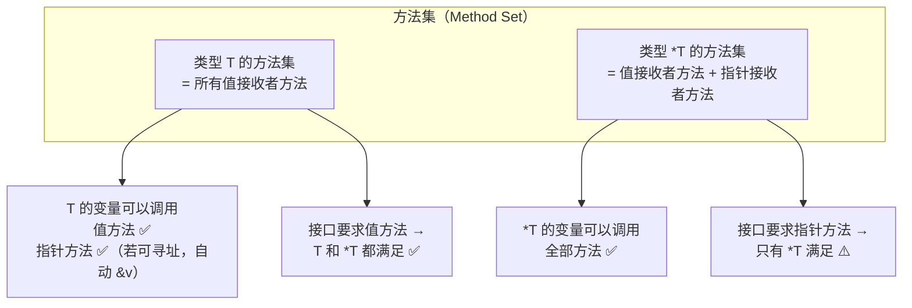
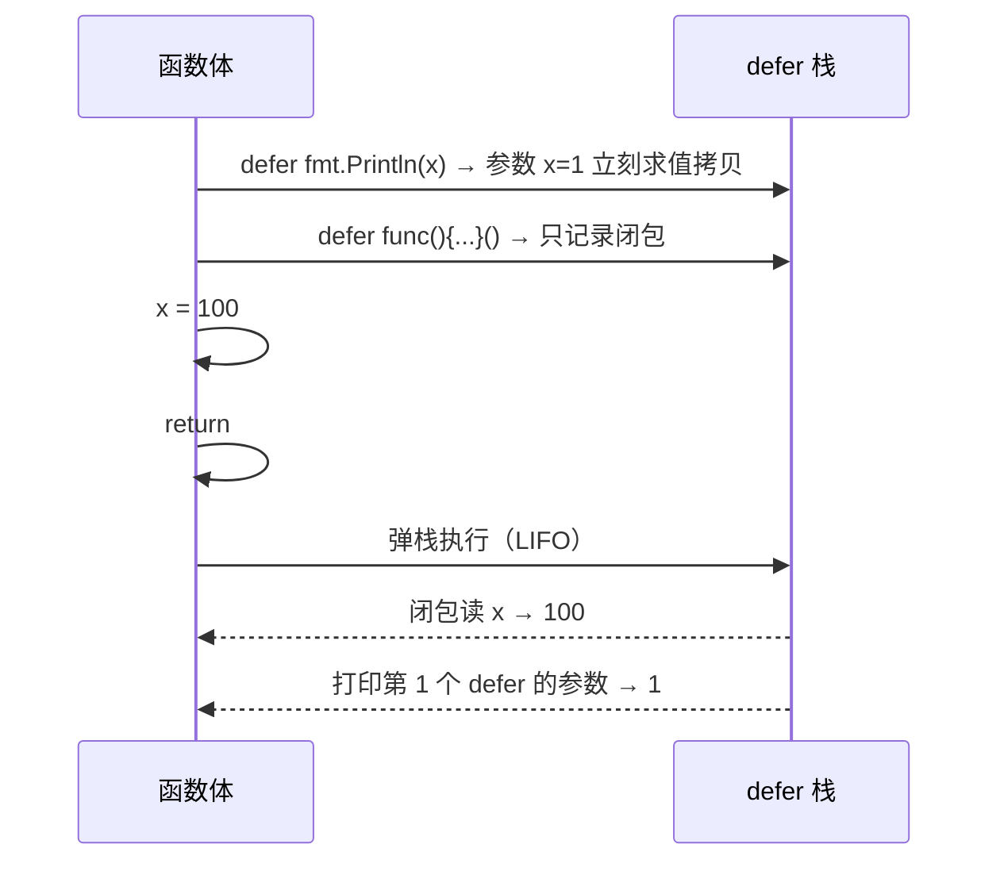
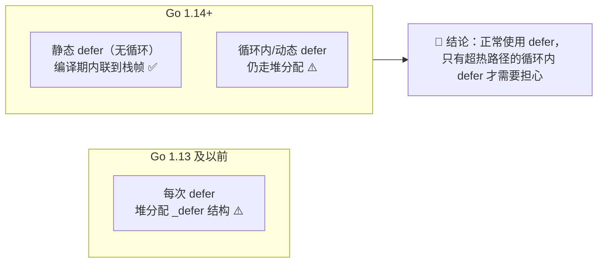
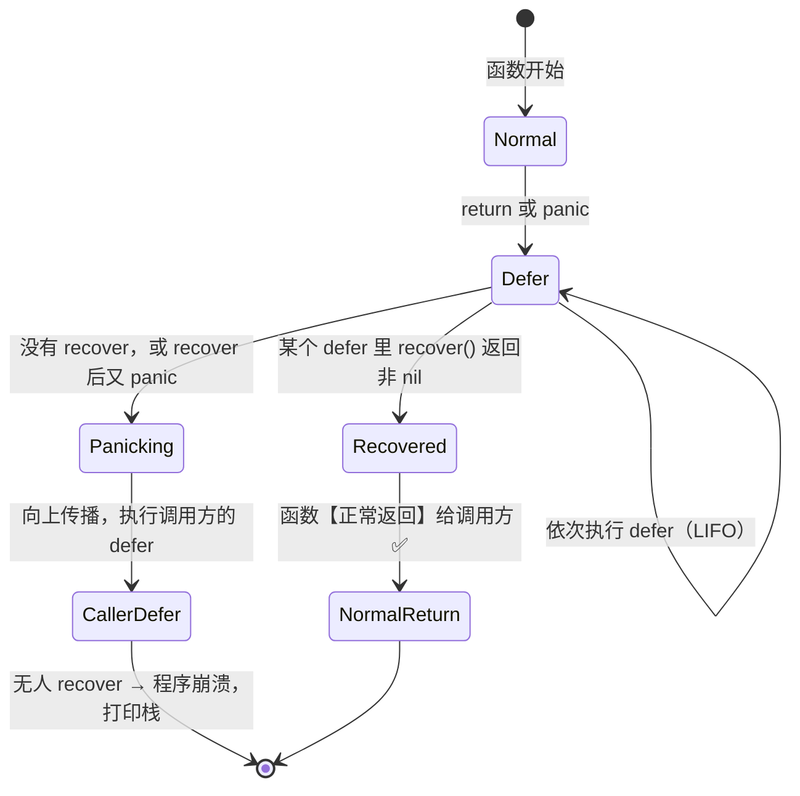

+++
title = "06 函数·方法·defer"
linkTitle = "06 函数·方法·defer"
weight = 106
date = "2026-09-20T10:30:00+08:00"
type = "docs"
description = "Go 函数与方法速查：多返回值、命名返回、变参、闭包、方法集与接收者选择、defer 求值时机与执行顺序、panic/recover"
isCJKLanguage = true
draft = false
+++

# 06 函数·方法·defer

本页回答：**返回值怎么设计**、**接收者该用值还是指针**、**`defer` 到底什么时候求值**、**`panic` 什么时候能用**。

> 基线：**Go 1.27.1**。所有输出为本机实跑结果。

---

## 函数声明的全部形态



| 形态 | 签名示例 | 备注 |
| --- | --- | --- |
| 普通函数 | `func Add(a, b int) int` | 同类型参数可合并写 |
| 多返回值 | `func Div(a, b int) (int, error)` | Go 的「错误处理」基础 🔥 |
| 命名返回 | `func F() (n int, err error)` | 可被 `defer` 修改 |
| 变参 | `func Sum(ns ...int) int` | 本质是切片，调用时可展开 |
| 方法 | `func (u *User) Save() error` | 接收者写在 `func` 与名字之间 |
| 函数值 | `var f func(int) int = double` | 函数是一等公民 |
| 闭包 | `add := func(x int) int { return x + n }` | 捕获外部变量 |
| 泛型函数 | `func Map[T, U any](xs []T, f func(T) U) []U` | 见 [10]() |

---

## 参数与返回值

### 多返回值 + 命名返回

```go
// 最常见：值 + 错误
func Div(a, b int) (int, error) {
	if b == 0 {
		return 0, errors.New("division by zero")
	}
	return a / b, nil
}

// 命名返回：适合需要 defer 修改返回值的场景
func Parse(s string) (n int, err error) {
	defer func() {
		if err != nil {
			n = -1          // ✅ defer 能改命名返回值
		}
	}()
	if s == "" {
		return 0, errors.New("empty")
	}
	return len(s), nil
}
```

```go
r, e := namedReturn()       // 内部 return 42, fmt.Errorf("boom")
fmt.Println("namedReturn:", r, e)
```

```text
namedReturn: -1 boom
```

| 返回写法 | 特点 |
| --- | --- |
| `return a, b` | 最直白，推荐默认使用 |
| `return`（裸返回） | 只在命名返回且函数极短时用 ⚠️ 长函数里是灾难 |
| 命名返回值 | 价值在于**被 `defer` 修改**，而不是省几个字符 🔥 |

⚠️ 命名返回值会参与「裸返回」，长函数里裸返回会让读者必须回头找变量名。💭 惯例是：**只有需要 `defer` 修改返回值时才命名**，否则一律显式 `return`。

### 变参

```go
func Sum(ns ...int) int {
	total := 0
	for _, n := range ns {
		total += n
	}
	return total
}

Sum()              // 0，可以一个都不传
Sum(1, 2, 3)       // 6
xs := []int{1, 2}
Sum(xs...)         // ✅ 展开切片
```

| 细节 | 说明 |
| --- | --- |
| `ns` 的类型 | `[]int`，函数内就是个普通切片 |
| 不传参 | `ns == nil`，`len(ns) == 0` ✅ |
| 传切片 | 必须加 `...`，且元素类型必须精确匹配 🛑 |
| 已有 `[]any` 展开给 `...any` | ✅ 可以；给 `...int` 不行 |
| 只能有一个变参，且必须在最后 | 编译器强制 |

⚠️ **变参不会自动转换类型**：`Sum([]any{1, 2}...)` 编译错误，因为 `[]any` 不是 `[]int`。

### 函数作为值与类型

```go
type Middleware func(http.Handler) http.Handler

func double(x int) int { return x * 2 }

var op func(int) int = double
op(21)   // 42

// 立即执行
func() { fmt.Println("IIFE") }()
```

⚠️ 函数类型**只能与 `nil` 比较**，不能互相比较 🛑：

```go
var f1, f2 func()
fmt.Println(f1 == nil)   // ✅ true
// fmt.Println(f1 == f2) // 🛑 编译错误
```

---

## 方法：接收者怎么选

这是 Go 里最需要「一次想清楚」的设计决策。先看**方法集规则**，它决定接口满足关系：



| 表达式 | 规则 |
| --- | --- |
| `v.ValueMethod()` | ✅ |
| `v.PointerMethod()` | ✅ **仅当 `v` 可寻址**（变量、切片元素、可寻址结构体字段） |
| `p.ValueMethod()` | ✅ 自动解引用 `(*p).ValueMethod()` |
| `p.PointerMethod()` | ✅ |
| `T{}.PointerMethod()` | 🛑 编译错误：不可寻址 |
| `f().PointerMethod()` | 🛑 编译错误：函数返回值不可寻址 |
| `m["k"].PointerMethod()` | 🛑 编译错误：map 元素不可寻址 ⚠️ |

```go
type Value struct{ N int }

func (v Value) SetVal(n int) { v.N = n }   // 改的是副本
func (v *Value) SetPtr(n int) { v.N = n }  // 改的是原件

v := Value{N: 1}
v.SetVal(99)
fmt.Println("after SetVal:", v.N)   // 1，没变 ⚠️
v.SetPtr(99)
fmt.Println("after SetPtr:", v.N)   // 99

// map 元素不可寻址的绕法
m := map[string]Value{"a": {N: 1}}
// m["a"].SetPtr(5)   // 🛑 编译错误
tmp := m["a"]
tmp.SetPtr(5)
m["a"] = tmp           // ✅ 取出 → 改 → 放回
fmt.Println("map workaround:", m["a"].N)   // 5

// 切片元素可寻址，可以直接调
xs := []Value{{N: 1}}
xs[0].SetPtr(7)
fmt.Println("slice elem:", xs[0].N)        // 7
```

```text
after SetVal: 1
after SetPtr: 99
map workaround: 5
slice elem: 7
```

### 决策表：用值接收者还是指针接收者

| 情况 | 选择 | 理由 |
| --- | --- | --- |
| 方法要修改接收者 | **指针** `*T` | 唯一选择 🔥 |
| 结构体较大（> 几个字段） | **指针** `*T` | 避免每次调用拷贝 |
| 结构体含 `sync.Mutex`/`sync.WaitGroup` | **必须指针** | 复制锁是 bug ⚠️ |
| 类型本质是「值」（`time.Time`、小坐标） | **值** `T` | 不可变更自然 |
| 类型是 map/slice/chan/func | 通常**值** `T` | 本身就是引用语义 |
| 需要满足某个接口 | 看接口要求的方法集 | 见上图 |
| 同类型已有指针方法 | **统一用指针** | 混用会造成方法集分裂 ⚠️ |

⚠️ **黄金规则**：同一个类型的所有方法，接收者形式保持一致。混用会让 `T` 和 `*T` 的方法集不同，埋下「为什么这个类型不满足接口」的坑。

### 值接收者也会拷贝

```go
type Big struct{ data [1 << 20]byte }   // 1 MB

func (b Big) Sum() int   { return len(b.data) }   // ⚠️ 每次调用拷贝 1 MB
func (b *Big) Sum2() int { return len(b.data) }   // ✅ 不拷贝
```

`go vet` 不会查这个，但代码审查要看一眼。💭 经验阈值：结构体超过 3~4 个机器字（约 24~32 字节）就考虑指针接收者。

---

## defer：三个必须记住的语义

### 语义一：LIFO 顺序，函数返回前执行

```go
for i := range 3 {
	defer fmt.Print("defer ", i, " | ")
}
fmt.Print("body done | ")
```

```text
body done | defer 2 | defer 1 | defer 0
```

所以「先 defer 的先执行」是错的：**后 defer 的先执行**（栈）。

### 语义二：参数立即求值，闭包延迟求值

这是 `defer` 最容易错的地方，务必分清：

```go
x := 1
defer fmt.Println("arg evaluated immediately:", x)   // x 在此刻被拷贝
defer func() { fmt.Println("closure sees final:", x) }()  // x 在返回时才读
x = 100
fmt.Println("x set to", x)
```

```text
x set to 100
closure sees final: 100
arg evaluated immediately: 1
```



| 写法 | 求值时机 |
| --- | --- |
| `defer f(x)` | `x` 在 `defer` 语句执行时求值 🔥 |
| `defer func() { use(x) }()` | `x` 在函数返回时读取 |
| `defer f()` 中 `f` 本身 | 也在 `defer` 时确定（函数值不能为 nil）⚠️ |

🛑 经典错误：`defer f.Close()` 在循环里累积，或者 `defer` 的实参是个会变的指针：

```go
for _, name := range names {
	defer os.Remove(name)   // ⚠️ 参数立即求值，但函数结束才删——可能删错时刻
}
```

### 语义三：defer 能改命名返回值

```go
func namedReturn() (result int, err error) {
	defer func() {
		if err != nil {
			result = -1
		}
	}()
	return 42, fmt.Errorf("boom")
}
```

```text
namedReturn: -1 boom
```

这是**唯一**让 `defer` 影响返回值的途径。常见用法：

| 用途 | 代码 |
| --- | --- |
| 统一错误包装 | `defer func() { if err != nil { err = fmt.Errorf("ctx: %w", err) } }()` |
| 统一耗时统计 | `defer func(start time.Time) { log.Printf("took %v", time.Since(start)) }(time.Now())` |
| panic 转 error | `defer func() { if r := recover(); r != nil { err = ... } }()` |
| 释放资源 | `defer f.Close()` 🔥 |

### defer 的开销

Go 1.14 起 `defer` 采用**开放编码（open-coded defers）**，在函数内 `defer` 数量少且没有循环时几乎是零开销（不分配、可内联）。



---

## panic 与 recover

### 运行顺序



```go
func recoverDemo() {
	defer func() {
		if r := recover(); r != nil {
			fmt.Println("recovered:", r)
		}
		fmt.Println("after recover, function returns normally")
	}()
	panic("something bad")
}
```

```text
recovered: something bad
after recover, function returns normally
```

关键点：`recover()` 之后**该 defer 函数继续执行完**，然后**外层函数正常返回**（不是继续执行 panic 之后的代码）。

### recover 只在 defer 里有效

```go
// 🛑 无效：recover 直接调用
func bad() {
	if r := recover(); r != nil { }   // 永远返回 nil
}

// 🛑 无效：在 defer 调用的【另一个函数】里 recover
defer func() { helper() }()           // helper 里的 recover 返回 nil

// ✅ 有效：recover 必须在 defer 的函数字面量里【直接】调用
defer func() { if r := recover(); r != nil { } }()
```

### panic 的传播与再抛

```go
func nestedPanic() {
	defer fmt.Println("outer defer runs")
	defer func() {
		if r := recover(); r != nil {
			fmt.Println("inner recovered:", r)
			panic("re-panic from defer")
		}
	}()
	panic("original")
}
```

```text
inner recovered: original
outer defer runs
caught re-panic: re-panic from defer
```

注意执行顺序：内层 defer 先跑（LIFO）并 recover；它再 panic 后，**同级剩下的 defer**（"outer defer runs"）仍然会执行，然后才向上传播。

### panic 转 error：库函数的标准做法

```go
func sentinelErr() (err error) {
	defer func() {
		if r := recover(); r != nil {
			err = fmt.Errorf("converted panic: %v", r)
		}
	}()
	panic("kaboom")
}
```

```text
sentinelErr: converted panic: kaboom
```

💡 **库代码里应该这样做**：对外的 API 不应该把 panic 泄漏给调用方，而是用命名的 `err` 接住并转成错误。⚠️ 但要注意：如果 panic 是 `runtime.Error`（如空指针、越界），通常**应该继续传播**，因为那说明程序有 bug，掩盖它更危险。

### panic/recover 使用边界

| 场景 | 是否该用 |
| --- | --- |
| 库函数边界统一转 error | ✅ 推荐 |
| 服务器每个请求的兜底（避免单请求崩溃整个进程） | ✅ 推荐 |
| `init()` 里配置加载失败 | ✅ 可用（配置错误应让程序起不来） |
| 参数校验失败 | 🛑 用 `error` 返回 |
| 业务逻辑分支控制 | 🛑 极其反模式 |
| 文件不存在、网络超时 | 🛑 用 `error` |
| 数组越界、nil 解引用 | 🛑 不要 recover，这是 bug |
| 跨 goroutine 传播 panic | 🛑 **做不到**：每个 goroutine 必须自己 recover ⚠️ |

⚠️ **panic 不会跨 goroutine 传播**：一个 goroutine panic 且未 recover，整个进程崩溃。所以每个长期运行的 goroutine 顶部都该有 recover（除非你确定它不会 panic）。

---

## 闭包

闭包 = 函数字面量 + 它捕获的变量环境。Go 的闭包**按引用捕获**。

```go
func counter() func() int {
	n := 0
	return func() int {
		n++
		return n
	}
}

c := counter()
fmt.Println(c(), c(), c())   // 1 2 3
c2 := counter()
fmt.Println(c2())            // 1，独立的环境
```

| 特点 | 说明 |
| --- | --- |
| 捕获方式 | 按引用（变量本身），不是拷贝副本 |
| 生命周期 | 被捕获的变量逃逸到堆，随闭包存活 |
| 循环变量 | 🆕 1.22 起每次迭代新建，闭包各捕获各的（见 [05]()） |
| 常见用途 | 中间件、选项模式、延迟求值、记忆化 |

### 闭包捕获的是变量不是值

```go
x := 1
inc := func() { x++ }
read := func() int { return x }
inc()
fmt.Println(read())   // 2，两个闭包共享同一个 x
```

⚠️ 共享可变状态是闭包最容易出的问题。并发下要加锁，或改用参数传递：

```go
// 🛑 并发下数据竞争
var wg sync.WaitGroup
for i := range 10 {
	wg.Add(1)
	go func() { defer wg.Done(); counter++ }()   // counter 竞争
}
```

---

## 本页陷阱速查

| 症状 | 实际原因 | 正确做法 |
| --- | --- | --- |
| 值接收者方法改了字段没生效 | 改的是副本 | 用指针接收者 `*T` |
| `m["k"].SetX()` 编译错误 | map 元素不可寻址 | 取出 → 改 → 放回 |
| `f().PointerMethod()` 编译错误 | 函数返回值不可寻址 | 先赋给变量 |
| 某类型不满足接口 | 接口要指针方法，传的是值 | 传 `&v`，或统一用值接收者 |
| `defer` 里打印的变量是旧值 | `defer` 的参数立即求值 | 用闭包 `func(){ ... }()` |
| `defer` 里拿不到最新值 | 用了参数形式而非闭包 | 同上 |
| `defer` 修改返回值无效 | 返回值没有命名 | 改成 `(result T, err error)` |
| `recover()` 返回 nil | recover 不在 defer 直接调用 | 写在 `defer func(){ ... }()` 体内 |
| 一个 goroutine panic 整个服务挂掉 | panic 不跨 goroutine 传播 | 每个 goroutine 自己 recover |
| 循环里 `defer Close()` 累积几百个 | defer 在函数返回时才执行 | 把循环体抽成函数 |
| 变参函数收到 `[]any` 编译失败 | 变参不做类型转换 | 逐个传，或改签名 |
| 函数值 `==` 比较编译错误 | 函数只能与 nil 比较 | 用 `reflect.ValueOf(f).Pointer()` 或改设计 |

---

📘 官方参考：[Spec — Function declarations](https://go.dev/ref/spec#Function_declarations)、[Spec — Method sets](https://go.dev/ref/spec#Method_sets)、[Go Blog — Defer, Panic, and Recover](https://go.dev/blog/defer-panic-and-recover)、[Go 1.14 open-coded defers](https://go.dev/doc/go1.14#runtime)

➡️ 上一节：[05 语句与控制流]() ｜ 下一节：[07 数组·切片·映射·结构体]()
